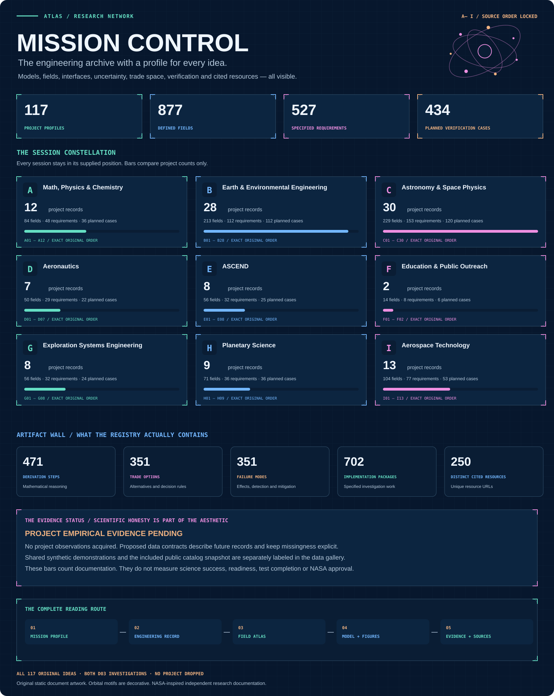

[Mission control](MISSION_CONTROL.md) · [Profile directory](research/README.md) · [Data atlas](data/README.md) · [Figure wall](data/figures/README.md) · [Handbooks](handbooks/README.md)

**117 investigations. Nine disciplines. One engineering library.** Every original project is retained in its supplied A–I order, with a NASA-inspired mission name, detailed mathematical models, requirements, data definitions, uncertainty analysis, verification plans and cited primary resources.

## Engineering mission control

[](MISSION_CONTROL.md)

**A mission profile for every investigation.** Open a named project to enter its model cockpit, artifact wall, planned-work feed, technical-resource connections and reading playlist. The full engineering dossier follows the profile, with its complete original mathematical content and controlled data specifications.

| Inside the profile | What you can inspect |
| --- | --- |
| Mission identity | Exact original investigation, scientific question and testable hypothesis |
| Model cockpit | Governing formulation, variables, conventions, method, assumptions and operating limits |
| Artifact wall | Engineering architecture, every proposed data field, included numerical illustrations and planned result figures |
| Investigation feed | Proposed work packages with visible evidence state and detailed execution criteria |
| Mission connections | Related reading based on shared cited sources, supplied disciplines and shared included illustrations |
| Reading playlist | Direct routes through the concept, data, decision analysis and execution plan |

[Enter the full mission-control portal](MISSION_CONTROL.md) · [Inspect the connection register](registry/mission_connections.json) · [Read the complete table inventory](data/TABLES.md)

## Choose a discipline

| A · Math, Physics & Chemistry | B · Earth & Environment | C · Astronomy & Space Physics |
| --- | --- | --- |
| [](research/A/README.md) | [](research/B/README.md) | [](research/C/README.md) |

| D · Aeronautics | E · ASCEND | F · Education & Outreach |
| --- | --- | --- |
| [](research/D/README.md) | [](research/E/README.md) | [](research/F/README.md) |

| G · Exploration Systems | H · Planetary Science | I · Aerospace Technology |
| --- | --- | --- |
| [](research/G/README.md) | [](research/H/README.md) | [](research/I/README.md) |

[Complete ordered project register](ENGINEERING_DOCUMENTATION.md) · [Nine continuous handbooks](handbooks/README.md)

## Choose a reading playlist

| Route | Engineering thread | Open the route |
| --- | --- | --- |
| Pixels to planets | Numerical reliability → image simulations → calibration → catalog inference | [A01 → C02 → C15 → H02 → C05](MISSION_CONTROL.md#pixels-to-planets) |
| Air to orbit | Drag verification → payload thermal physics → power integration → onboard computing → control → orbital models | [D04 → E06 → E08 → I04 → I10 → I12](MISSION_CONTROL.md#air-to-orbit) |
| Earth in balance | Remote sensing → post-fire hydraulics → watershed decisions → ocean carbon → capture chemistry | [B10 → B14 → B23 → B18 → G06](MISSION_CONTROL.md#earth-in-balance) |
| Spectra to matter | Meteoritic chemistry → carbon-bearing matter → spectral information → paleolake minerals → chondrite rims → isotopes | [A11 → H04 → C08 → H09 → H08 → A12](MISSION_CONTROL.md#spectra-to-matter) |

These are thematic reading paths. The [mission portal](MISSION_CONTROL.md) keeps all 117 original projects visible in their supplied order.

## See the data

[](data/README.md)

**OBSERVATIONAL · public catalog snapshot.** The saved 200-row NASA Exoplanet Archive extract shows planet periods, radii, discovery methods and missing metallicity. Its rows are query-ordered; the saved response does not independently establish global first-200 selection or occurrence rates. [CSV](models/data/exoplanet_sample.csv) · [Query & retrieval provenance](models/data/exoplanet_sample.provenance.json) · [Full figure caption](data/figures/README.md)

| Thermal power and response | Water accounting | Control authority |
| --- | --- | --- |
| [](data/figures/README.md#thermal-power-and-response) | [](data/figures/README.md#hydrologic-water-ledger) | [](data/figures/README.md#attitude-phase-and-authority) |

**SYNTHETIC · illustrative reduced models.** These plots expose balances, limits and numerical behavior using declared model inputs. [Explore all nine new diagnostics and their inputs](data/figures/README.md), plus the [original numerical views](models/README.md).

**PROPOSED CONTRACT · acquisition pending.** Every project has a visual map of its fields, a dictionary, JSON Schema and an empty acquisition CSV. [Browse all 877 field definitions](data/CONTRACTS.md).

## Open the data notebook

The [table inventory](data/TABLES.md) exposes every included CSV: exact column names, row counts, units and their source, missing or non-finite values, finite numeric ranges, original preview rows and hashes. It also connects each table to its model, parameters, assumptions and scientific diagnostic. The stored rows include grid points, time steps and synthetic noise draws; their count does not represent independent observations.

| Notebook layer | Included detail |
| --- | --- |
| Raw numerical tables | 12 CSVs, 98,759 stored rows and 61 columns across the tables |
| Public catalog | 200 selected exoplanet rows; query and retrieval provenance; nine missing metallicity values |
| Synthetic calculations | Finite fractal grids, hypothetical phase behavior, thermal balances, drag references, water accounting, control, orbit refinement and spectral noise draws |
| Scientific figure wall | Nine new SVG/PNG spreads plus nine original numerical views, with captions and evidence labels |
| Future acquisition | 117 contracts and complete visual maps of 877 proposed fields |

[Human-readable table notebook](data/TABLES.md) · [Machine-readable inventory](data/DATA_INVENTORY.json) · [Figure provenance ledger](data/figures/DATA_FIGURES.json)

## The engineering depth behind the profiles

| Controlled content | Count | Inspect |
| --- | ---: | --- |
| Detailed derivation steps | 471 | [Engineering handbooks](handbooks/README.md) |
| Proposed requirement statements | 527 | [Requirement register](registry/requirements.csv) |
| Specified verification cases | 434 | [Case register](registry/verification_cases.csv) |
| Trade alternatives | 351 | Each project’s engineering trade study |
| Failure-mode records | 351 | Each project’s failure analysis |
| Proposed implementation work packages | 702 | Each project’s investigation feed and implementation section |
| Distinct cited technical resources | 250 | [Source index](registry/source_index.csv) |

The profile statistics count documented design content. Verification cases and implementation work packages remain proposed until their execution evidence is recorded.

## Inside each mission folder

```text
research/A/A01-artemis-fractal-navigator/
├── README.md               Engineering design and analysis record
├── data/
│   ├── README.md           Visual blueprint and field reference
│   ├── dictionary.csv      Units, meanings and quality rules
│   ├── schema.json         Proposed record contract
│   └── acquisition.csv     Empty acquisition template
└── figures/
    ├── README.md           Captioned figure gallery
    ├── architecture.svg    Engineering interfaces
    ├── architecture.mmd    Editable diagram source
    ├── mission-profile.svg Scientific identity and engineering cockpit
    └── data-map.svg        Every proposed field, type and unit
```

| Collection | What to explore |
| --- | --- |
| [Research](research/README.md) | 117 named mission folders, in original session order |
| [Mission control](MISSION_CONTROL.md) | Detailed profile wall, reading playlists and complete mission directory |
| [Data](data/README.md) | Visual atlas, raw-table links, evidence labels and provenance |
| [Models](models/README.md) | Eight executable reduced models, numerical tests and recorded outputs |
| [Handbooks](handbooks/README.md) | Complete engineering records for continuous reading |
| [Engineering](engineering/README.md) | Model assurance, interfaces, uncertainty and execution practice |
| [Registry](registry/README.md) | 527 requirements, 434 specified cases and 250 cited resources |
| [Evidence](evidence/README.md) | Review, integrity and reproducibility records |
| [Archive](archive/README.md) | Preserved supplementary contribution and 20 educational kernels |
| [Tools](tools/README.md) | Deterministic documentation and visual generators |

## Evidence and provenance

These are engineering research designs. Project-specific empirical validation remains pending; the 434 specified cases are distinct from executed software checks. Plot captions distinguish observed catalog values from synthetic calculations. The combined D03 entry retains both original research work packages. NASA-inspired names are creative identifiers and do not imply affiliation or qualification.

The [exact original-title register](registry/original_titles.json) preserves the supplied topics from the [2021 Arizona Space Grant symposium program](https://spacegrant.arizona.edu/sites/spacegrant.arizona.edu/files/AZSGC%20Symposium%20Booklet%202021_website.pdf). The library develops new research designs and does not claim the historical teams’ data or findings. [Mission-profile verification](evidence/MISSION_PROFILE_VERIFICATION.md) and [visual-revision verification](evidence/VISUAL_REVISION_VERIFICATION.md) record the layout, data and figure checks.
