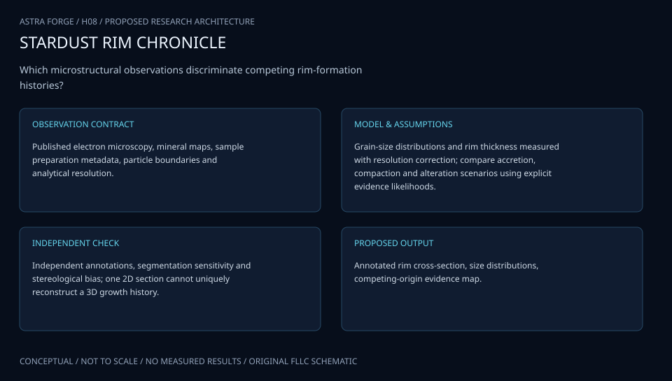

> Preserved ASTRA FORGE revision from commit 4026dd0. The [current ordered engineering records](../../../ENGINEERING_DOCUMENTATION.md) are the controlled A-I documentation. This earlier revision uses separate D03/D04 IDs for the two combined-title work packages; its D05-D08 map to current D04-D07.

# H08 · STARDUST RIM CHRONICLE

**Original project:** Investigating the Origin of Fine-Grained Rims in Mighei-like Carbonaceous Chondrites

**Session H:** Planetary Science · **Family:** materials

**Historical locator:** [H-8 in the 2021 Arizona NASA Space Grant program](https://spacegrant.arizona.edu/sites/spacegrant.arizona.edu/files/AZSGC%20Symposium%20Booklet%202021_website.pdf#page=24). IDs in this repository follow the user's supplied list, not presentation numbering. The proposed space-inspired name does not rename or appropriate the original authors' research. See the original program for author/mentor credit. This dossier is an original FLLC research extension, not a reproduction of the abstract.

| Evidence layer | State |
|---|---|
| Research architecture | Proposed, formal specification |
| Measurements | None ingested |
| Executable reference | Project-specific solver pending |
| Scientific validation | Pending |
| Deployment / qualification | None |

## Scientific question and value

Which microstructural observations discriminate competing rim-formation histories?

The output must let a reviewer inspect the evidence, test a competing explanation and identify the observation that would change the conclusion. A sophisticated visual is useful only when its scale, source and uncertainty are defensible.

## Model and assumptions

Grain-size distributions and rim thickness measured with resolution correction; compare accretion, compaction and alteration scenarios using explicit evidence likelihoods.

This is the proposed governing formulation. Before research implementation, record the state/input/parameter vectors, units, boundary and initial conditions, observation operator, nuisance terms and parameter identifiability. Select specific primary equation references: archive landing pages below are discovery resources, not proof that this formulation applies. [Shared model and verification standard](../docs/engineering-standard.md).

## Data package and acquisition

Published electron microscopy, mineral maps, sample preparation metadata, particle boundaries and analytical resolution.

Use [the data contract](../docs/data-contract.md). Each input needs a publisher, primary URL, stable identifier, version, observation/retrieval dates, checksum, license/permission, unit dictionary, calibration, missing-value semantics and coverage limits. Never treat absent measurements, detection limits or unsupported source access as zero values. The registry below distinguishes reviewed resources from blocked or reference-only entries.

## Validation and falsification

Independent annotations, segmentation sensitivity and stereological bias; one 2D section cannot uniquely reconstruct a 3D growth history.

Validation passes only if independent evidence supports the model in its declared domain, uncertainty is reported and simpler baselines are compared fairly. Establish project-specific tolerances from instrument performance or literature before inspecting final results; do not invent universal NASA thresholds. Report failures and negative findings.

## Original visual architecture

Annotated rim cross-section, size distributions, competing-origin evidence map.

The shipped diagram is a conceptual specification. The proposed science visualization requires the qualified data above. Raw, calibrated, simulated and inferred states must remain distinguishable, with a visible source/time/uncertainty inspector.

## Executable model state

This project has a formal research/evidence model specification and original workflow visual. Its project-specific scientific solver is **not implemented**. Do not replace it with an unrelated reference kernel or claim numerical results. Implement only after equation-level bibliography and inputs pass the model review gate.

## Ambitious extension and connected work

Build a multiscale sample passport linking microstructure to isotopic and mineral evidence.

Related project dossiers: No dependency is required; retain this project independently.

Preserve independent scientific questions and original identities. Share schemas/calibration tools only where justified; never share results merely because subjects overlap.

## Concrete delivery sequence

1. Inspect the original source and collect project-specific primary literature; record unresolved interpretation and equation references.
2. Qualify the named observations and metadata; keep raw data immutable and permissions explicit.
3. Implement the stated model with an analytic or published benchmark, error handling and convergence checks.
4. Perform the project-specific validation above with independent holdouts and uncertainty decomposition.
5. Generate the proposed visual and an exportable evidence receipt; retain corrections and rejected inputs.

Completion requires a documented answer, calibrated uncertainty, an independently reproducible run and a reviewer-visible limitation statement. No claimed result currently meets that scientific completion gate.

## References and resource review

- [ASCEND: 2021 Arizona NASA Space Grant Symposium booklet](https://spacegrant.arizona.edu/sites/spacegrant.arizona.edu/files/AZSGC%20Symposium%20Booklet%202021_website.pdf) — Historical project provenance; review status: **inspected**. Student abstracts are not peer-reviewed validation; supplied list remains coverage authority. Original author and mentor attribution is available in the linked program.
- [PDS: NASA Planetary Data System](https://pds.nasa.gov/) — Planetary data discovery; review status: **inspected**. Each selected product needs accession, processing level, geometry and calibration; no science files ingested.
- [USGS_SPECTRA: USGS Spectroscopy Lab](https://www.usgs.gov/labs/spectroscopy-lab) — Spectral library discovery; review status: **inspected**. Endmember sample, measurement geometry and library version require review.

Review date: **2026-10-02**. Portal inspection is not dataset use. Original mission names refer to independent educational inspiration; no NASA endorsement or operational applicability is claimed.
