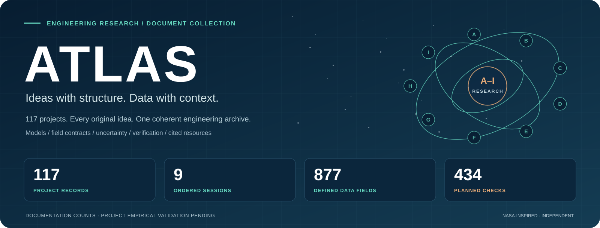

# Document artwork

**One visual language across the engineering collection.**



The original navy, teal and copper artwork gives the collection a consistent reading structure. Session cards show actual documentation counts. Every project field map prints its complete dictionary of names, types, units and meanings, with an explicit proposed-contract label.

| Artwork | Location |
| --- | --- |
| Collection hero | [hero.svg](hero.svg) |
| Nine session cards | [A](sessions/A.svg) · [B](sessions/B.svg) · [C](sessions/C.svg) · [D](sessions/D.svg) · [E](sessions/E.svg) · [F](sessions/F.svg) · [G](sessions/G.svg) · [H](sessions/H.svg) · [I](sessions/I.svg) |
| 117 proposed field maps | Each [project folder](../research/README.md), under `figures/data-map.svg` |
| Inputs, palette and output hashes | [Visual design manifest](visual_design_manifest.json) |
| Generator | [build_visual_design.py](../tools/build_visual_design.py) |

## Recreate the artwork

```sh
python tools/build_visual_design.py --repo . --out assets --co-locate
```

Run from the repository root. Python's standard library is sufficient. The generator reads the controlled registry, preserves all A–I entries and follows the registered project paths. It writes editable standalone SVGs with accessible titles and descriptions. Co-location creates one field-map copy in each project folder.

Orbital motifs are decorative illustrations. Field maps describe acquisition contracts and contain no invented measurements. Counts identify specified documentation; the planned verification count is distinct from executed tests. The artwork uses no NASA logo and implies no NASA affiliation.

[Research atlas](../research/README.md) · [Data gallery](../data/README.md) · [Evidence room](../evidence/README.md) · [Repository home](../README.md)
