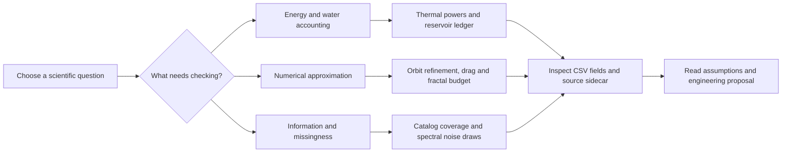

# ATLAS Data Observatory

**See the values. Read the assumptions. Follow every figure to its table.**

[Scientific figure gallery](figures/README.md) · [Complete table archive](TABLES.md) · [Machine-readable inventory](DATA_INVENTORY.json) · [Proposed data contracts](CONTRACTS.md) · [Research register](../ENGINEERING_DOCUMENTATION.md)

| Observatory profile | Recorded status |
|:--|:--|
| **On the lab bench** | **12 actual CSVs** with **98,759 stored rows** and **61 exact column definitions**. Rows combine different record types and are not independent physical observations. |
| **Public archive window** | **200 published catalog rows**, **193 host names**, five discovery-method categories, and **nine blank metallicity fields**. |
| **Numerical workbench** | **11 synthetic/reference CSVs** from eight reduced-model demonstrations; named assumptions, parameters and units accompany them. |
| **On the drawing board** | **117 proposed data contracts** and header-only acquisition templates, distinct from acquired or generated scientific tables. |
| **Figure wall** | **Nine additional diagnostic spreads**, each as SVG and PNG with an evidence ledger; the original nine numerical figures remain intact. |
| **Chain of custody** | The [inventory generator](../tools/build_data_inventory.py) verifies the original **40-asset model manifest** and records exact source hashes before making a table profile. |

**Current reading route:** open a spread → inspect its exact CSV → check the units and missingness → read the assumptions → follow the corresponding engineering record.


*A real 200-row NASA Exoplanet Archive snapshot: period and radius values, discovery methods, and missing host-metallicity fields. Its recorded request uses a 200-row limit and name ordering among rows with period and radius; it supports descriptive exploration rather than population occurrence inference.*

[Open the CSV](../models/data/exoplanet_sample.csv) · [Read acquisition provenance](../models/data/exoplanet_sample.provenance.json) · [Inspect figure provenance](figures/10_catalog_values_and_coverage.provenance.json)

<details>
<summary><strong>Open the catalog acquisition card</strong> — query, included fields and limits</summary>

The saved snapshot was retrieved on **2026-10-02 at 09:01:19 UTC** from the NASA Exoplanet Archive `pscomppars` table:

```sql
SELECT TOP 200 pl_name, hostname, pl_orbper, pl_rade, st_met, discoverymethod
FROM pscomppars
WHERE pl_orbper IS NOT NULL AND pl_rade IS NOT NULL
ORDER BY pl_name
```

The six fields identify the planet and host, orbital period in days, radius in Earth radii, host metallicity in dex relative to solar, and discovery-method category. The saved extract omits per-parameter error bars, reference links, metallicity abundance basis and detection completeness. The [column-by-column inventory](TABLES.md#exoplanet-sample) preserves exact headers and displays a compact preview. Repeating the query now could return different values or rows; the checked-in snapshot is identified by its original hash and retrieval record.

The unchanged acquisition sidecar and original numerical view describe an alphabetically truncated selection. Their wording remains historical acquisition metadata. The recorded request uses `TOP 200` and `ORDER BY pl_name`; only the returned 200 rows were retained, so this repository does not independently verify their ranking against the full archive. Current diagnostic captions describe the saved query-ordered extract. Use the exact request and preserved response together when assessing selection behavior.

Discovery categories in this extract are **Transit (149)**, **Radial Velocity (46)**, **Pulsar Timing (3)**, **Astrometry (1)** and **Transit Timing Variations (1)**. These counts describe this selected file, not the archive population or relative effectiveness of detection methods.

</details>

## Three evidence classes

| Visible label | What is actually present | Where to read it |
|:--|:--|:--|
|  | Published archive values with a saved query, access time, row selection and original-file hash. Composite catalog values may include estimates or combine publications; no error bars were acquired in this small extract. | [200-row exoplanet snapshot](../models/data/exoplanet_sample.csv) and [acquisition record](../models/data/exoplanet_sample.provenance.json) |
|  | Eight reduced-model demonstrations, with invented teaching parameters, generated numerical fields, simulated noise draws or a formula-based reference curve. | [Model definitions and limits](../models/README.md), [CSV outputs](../models/data) and [immutable asset manifest](../models/manifest.json) |
|  | 117 proposed record schemas, field dictionaries and header-only acquisition CSVs covering 877 defined fields. These describe future evidence and contain no original project measurements. | [Contract guide](CONTRACTS.md) and the data companions in each [research project folder](../ENGINEERING_DOCUMENTATION.md) |

## Read a scientific spread

Nine additional figure pairs expose relationships that are easier to assess visually: a heat budget, a water ledger, actuator saturation, orbital conservation, inverse-problem information, phase regions, finite numerical resolution and approximation error. Each pairs a vector SVG with a shareable PNG and an evidence ledger. The original nine model figures remain available in the [Model Foundry](../models/README.md).

| Explore | Data to inspect | Engineering record |
|:--|:--|:--|
| [Catalog values and coverage](figures/README.md#catalog-values-and-coverage) | 200 rows, discovery-method categories and nine missing metallicity values | [Session C](../research/C/README.md) |
| [Thermal power and response](figures/README.md#thermal-power-and-response) | Signed component powers and two node temperatures | [Session E](../research/E/README.md) |
| [Hydrologic water accounting](figures/README.md#hydrologic-water-ledger) | Effective recharge, outflow, storage and conservation residual | [Session B](../research/B/README.md) |
| [Control authority](figures/README.md#attitude-phase-and-authority) | Angle/rate states, requested torque and actuator bounds | [Session I](../research/I/README.md) |
| [Orbital numerical accuracy](figures/README.md#orbital-numerical-accuracy) | Energy error, angular momentum and three timestep resolutions | [Session I](../research/I/README.md) |
| [Spectral information](figures/README.md#spectral-information) | 2,000 synthetic noise-realization fraction estimates | [Sessions C](../research/C/README.md) and [H](../research/H/README.md) |
| [Ideal-binary phase regions](figures/README.md#ideal-binary-phase-regions) | A hypothetical liquidus and eutectic under declared assumptions | [Session A](../research/A/README.md) |
| [Fractal numerical resolution](figures/README.md#fractal-numerical-resolution) | Finite escape iteration fields and unresolved sampled points | [Session A](../research/A/README.md) |
| [Drag reference departures](figures/README.md#drag-reference-departures) | A drag correlation compared with its creeping-flow asymptote | [Session D](../research/D/README.md) |

## The laboratory wall

The spreads are built from the same source tables, with additional views that reveal signs, balances, units, solver behavior and missing information. Each image opens at full resolution; its title and footer identify the evidence class.

| **Heat flows and thermal lag** | **Water accounting and response** |
|:--|:--|
| [](figures/README.md#thermal-power-and-response) | [](figures/README.md#hydrologic-water-ledger) |
| Signed powers expose energy entering or leaving the wall. Compare their sum with how node temperatures evolve. **Synthetic thermal model.** | Input, delayed release and cumulative storage/discharge expose a closed conceptual water balance. **Synthetic reservoir model.** |
| [Fields and units](TABLES.md#balloon-thermal) · [Full spread](figures/README.md#thermal-power-and-response) | [Fields and units](TABLES.md#hydrologic-reservoir) · [Full spread](figures/README.md#hydrologic-water-ledger) |

| **State evolution and actuator authority** | **Conservation and refinement** |
|:--|:--|
| [](figures/README.md#attitude-phase-and-authority) | [](figures/README.md#orbital-numerical-accuracy) |
| Follow the time-colored phase portrait, then compare requested torque with the applied actuator-limited value. **Synthetic one-axis model.** | Read bounded energy error beside the measured response to timestep refinement. **Synthetic normalized two-body model.** |
| [Fields and units](TABLES.md#one-axis-attitude) · [Full spread](figures/README.md#attitude-phase-and-authority) | [Orbit fields](TABLES.md#two-body-orbit) · [Refinement fields](TABLES.md#two-body-convergence) |

| **Information in an inverse problem** | **Regions of a hypothetical phase diagram** |
|:--|:--|
| [](figures/README.md#spectral-information) | [](figures/README.md#ideal-binary-phase-regions) |
| Nearly identical endmembers magnify noise-driven fraction variability. Unphysical estimates remain visible. **Synthetic noise experiment.** | Read liquid, liquid-plus-solid and two-solid regions under ideal-liquid/pure-solid assumptions. **Invented teaching constants.** |
| [Spectral fields](TABLES.md#spectral-mixture) · [Noise-draw fields](TABLES.md#spectral-monte-carlo) | [Phase-diagram fields](TABLES.md#ideal-binary-liquidus) · [Full spread](figures/README.md#ideal-binary-phase-regions) |

| **Finite numerical resolution** | **A reference approximation's departure** |
|:--|:--|
| [](figures/README.md#fractal-numerical-resolution) | [](figures/README.md#drag-reference-departures) |
| Distinguish the first-escape iteration from a point that remains unresolved after the iteration budget. **Numerical fields.** | Follow the difference between a sphere-drag reference formula and its creeping-flow asymptote. **Correlation evaluations.** |
| [Mandelbrot fields](TABLES.md#mandelbrot) · [Julia fields](TABLES.md#julia) | [Drag fields](TABLES.md#sphere-drag) · [Full spread](figures/README.md#drag-reference-departures) |

## Every actual table, in view

The [complete table archive](TABLES.md) expands this shelf into **all 61 field definitions**, recorded/verified units, finite stored ranges, column missingness, compact first-row previews, parameters, assumptions and unit-source links. Each CSV remains in its single original location under `models/data`.

| Exact CSV | Rows × columns | Evidence | Profile / source |
|:--|--:|:--|:--|
| [exoplanet_sample.csv](../models/data/exoplanet_sample.csv) | 200 × 6 | Real public catalog | [Fields](TABLES.md#exoplanet-sample) · [Acquisition record](../models/data/exoplanet_sample.provenance.json) |
| [balloon_thermal.csv](../models/data/balloon_thermal.csv) | 1,441 × 10 | Synthetic | [Fields](TABLES.md#balloon-thermal) · [Sidecar](../models/data/balloon_thermal.json) |
| [hydrologic_reservoir.csv](../models/data/hydrologic_reservoir.csv) | 241 × 7 | Synthetic | [Fields](TABLES.md#hydrologic-reservoir) · [Sidecar](../models/data/hydrologic_reservoir.json) |
| [one_axis_attitude.csv](../models/data/one_axis_attitude.csv) | 2,401 × 4 | Synthetic | [Fields](TABLES.md#one-axis-attitude) · [Sidecar](../models/data/one_axis_attitude.json) |
| [two_body_orbit.csv](../models/data/two_body_orbit.csv) | 4,001 × 7 | Synthetic | [Fields](TABLES.md#two-body-orbit) · [Sidecar](../models/data/two_body_orbit.json) |
| [two_body_convergence.csv](../models/data/two_body_convergence.csv) | 3 × 2 | Synthetic | [Fields](TABLES.md#two-body-convergence) · [Shared orbit sidecar](../models/data/two_body_orbit.json) |
| [spectral_mixture.csv](../models/data/spectral_mixture.csv) | 180 × 7 | Synthetic | [Fields](TABLES.md#spectral-mixture) · [Sidecar](../models/data/spectral_mixture.json) |
| [spectral_monte_carlo.csv](../models/data/spectral_monte_carlo.csv) | 2,000 × 3 | Synthetic | [Fields](TABLES.md#spectral-monte-carlo) · [Shared spectral sidecar](../models/data/spectral_mixture.json) |
| [ideal_binary_liquidus.csv](../models/data/ideal_binary_liquidus.csv) | 600 × 4 | Synthetic | [Fields](TABLES.md#ideal-binary-liquidus) · [Sidecar](../models/data/ideal_binary_liquidus.json) |
| [mandelbrot.csv](../models/data/mandelbrot.csv) | 43,621 × 4 | Synthetic numerical field | [Fields](TABLES.md#mandelbrot) · [Sidecar](../models/data/mandelbrot.json) |
| [julia.csv](../models/data/julia.csv) | 43,621 × 4 | Synthetic numerical field | [Fields](TABLES.md#julia) · [Sidecar](../models/data/julia.json) |
| [sphere_drag.csv](../models/data/sphere_drag.csv) | 450 × 3 | Formula reference | [Fields](TABLES.md#sphere-drag) · [Sidecar](../models/data/sphere_drag.json) |

## Pick a diagnostic route



| Route | A careful sequence | Read before making a claim |
|:--|:--|:--|
| **Energy detective** | Inspect `absorbed_W`, `convection_W`, `radiation_W` and `wall_to_payload_W`; follow their signs in the [thermal spread](figures/README.md#thermal-power-and-response); compare resulting node trends with the prescribed boundaries. | Positive enters the named node. A trend generated by imposed conditions is not a measured thermal limit. |
| **Water-accounting auditor** | Open cumulative recharge, cumulative discharge and storage in the [reservoir profile](TABLES.md#hydrologic-reservoir); check their ledger; then inspect effective recharge versus outflow. | A small accounting residual checks conservation, not the accuracy of a flood forecast. |
| **Numerical-method reviewer** | Read the [three-row refinement table](TABLES.md#two-body-convergence) with the orbit record; compare resolutions; inspect the absolute relative-error definition and normalized scales. | Order estimated from three resolutions is evidence about this integration experiment, not universal solver accuracy. |
| **Information hunter** | Inspect both [fraction-estimate columns](TABLES.md#spectral-monte-carlo) before the histograms; compare the different horizontal scales; read the injected fraction and known noise model. | Central draw intervals are not posterior credible intervals or measured abundance uncertainty. |
| **Catalog curator** | Inspect [six exact catalog fields](TABLES.md#exoplanet-sample); locate the nine missing metallicities; read the query and omitted uncertainty/reference columns. | A selected composite snapshot provides a descriptive view, not a survey denominator or selection-corrected occurrence rate. |
| **Boundary skeptic** | Compare fractal escape counts with distance-estimator validity; inspect the [Julia profile](TABLES.md#julia) and its critical-point caveat; check the iteration budget. | Undefined distance and unresolved escape are different conditions. A finite-grid image cannot certify every membership claim. |

## Missingness bulletin

The actual CSVs contain **nine blank cells**, **10,683 NaN cells**, and **zero other nonfinite numeric tokens**. These counts are storage diagnostics with subject-specific meanings.

| Field / table | Stored missing or undefined values | Interpretation |
|:--|--:|:--|
| `st_met` / catalog | 9 blank cells | Missing host-metallicity values in this saved extract. Values and uncertainty/reference fields must be obtained before an appropriate metallicity analysis. |
| `distance_estimator` / Mandelbrot | 9,873 NaN cells | No exterior estimate for the sampled points that remain unresolved under this run's iteration budget. |
| `distance_estimator` / Julia | 809 NaN cells | 808 unresolved sampled points plus the critical starting point (0,0), which escapes at iteration 29 but has a vanishing derivative. |
| `next_bin_recharge_mm_day` / reservoir | 1 NaN cell | The final time boundary has no following forcing bin; its future-bin input is intentionally undefined. |

**Reading rule:** retain missingness reasons, use the explicit status/count field when one exists, and never replace a missing or undefined quantity with zero merely to make a plot look complete.

## Follow the evidence

The tables in [`models/data`](../models/data) are the single copy of the included numerical inputs and outputs. The new [`data/figures`](figures) folder contains presentation assets and their source/output hashes; it duplicates no raw datasets. The [figure manifest](figures/DATA_FIGURES.json) connects each plot to its exact source files, captions, transformations and linked projects.

For an analysis to become empirical evidence, retain dataset version, calibration applicability, units, coordinate/time frame, uncertainty, missingness, exclusions and transformation history as specified in the [data management plan](../engineering/DATA_MANAGEMENT.md). The [uncertainty rules](../engineering/UNCERTAINTY_AND_DECISION_RULES.md) distinguish model uncertainty, numerical error and noise-draw intervals. Specified verification work is visible in the [case register](../registry/verification_cases.csv); it remains separate from the checks already executed on software.

## Reproduce the gallery

From the repository root, with the existing model plotting dependencies available:

```sh
python -m pip install -r models/requirements.txt
python tools/build_data_inventory.py
python tools/render_data_figures.py
```

The renderer reads the checked-in CSVs and sidecars, writes the nine additional SVG/PNG pairs and provenance records, and records dependency versions and its own hash. It uses no network access and does not regenerate model outputs or overwrite the original asset manifest. Exact rendered bytes can differ across plotting-library versions or platforms; numerical inputs remain identified by their hashes.

The standard-library inventory generator writes [DATA_INVENTORY.json](DATA_INVENTORY.json) and [TABLES.md](TABLES.md). Its Python API is `generate(repo_root: Path) -> dict`. Counts, ranges and previews are calculated from the original tables; units retain their recorded sidecar entry or cite a verified producing-model definition. The fallback for an undocumented field is explicitly **unit not recorded / TBD**. Generation is deterministic for unchanged inputs and generator bytes.
