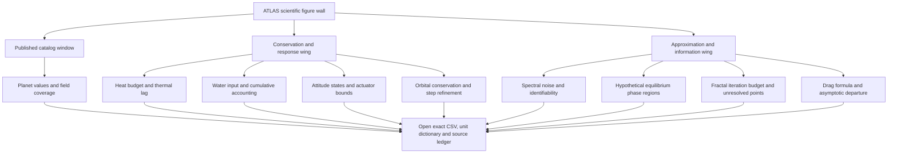
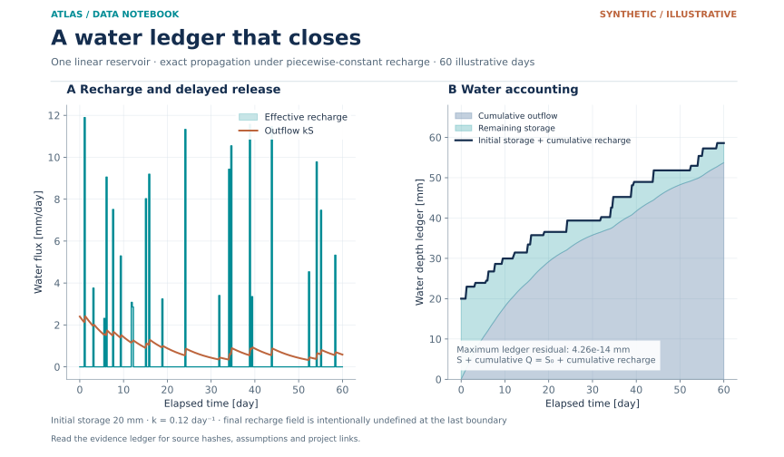

# ATLAS Scientific Figure Gallery

**Nine new scientific spreads. Every plot opens onto its numerical evidence.**

[Data Observatory](../README.md) · [Every CSV and field](../TABLES.md) · [Original model gallery](../../models/README.md) · [Figure manifest](DATA_FIGURES.json) · [Engineering register](../../ENGINEERING_DOCUMENTATION.md)

  

**Real public catalog** means published archive values with recorded provenance. **Synthetic / illustrative** means generated teaching examples or formula references. **Proposed / empty template** identifies future acquisition specifications elsewhere in the portfolio. Empty templates are never plotted as observations.

| Scientific spread | What becomes visible | Evidence |
|:--|:--|:--|
| [Catalog values and coverage](#catalog-values-and-coverage) | Selected values, discovery categories and field missingness | Real public catalog |
| [Thermal power and response](#thermal-power-and-response) | The heat budget alongside the temperature response | Synthetic model |
| [Hydrologic water accounting](#hydrologic-water-ledger) | Input, delayed release and a closed water ledger | Synthetic model |
| [Control authority](#attitude-phase-and-authority) | State evolution and torque saturation | Synthetic model |
| [Orbital numerical accuracy](#orbital-numerical-accuracy) | Conservation and timestep refinement | Synthetic model |
| [Spectral information](#spectral-information) | Noise-driven variability and weak identifiability | Synthetic noise experiment |
| [Ideal-binary phase regions](#ideal-binary-phase-regions) | Liquid and solid coexistence regions | Hypothetical thermodynamic model |
| [Fractal numerical resolution](#fractal-numerical-resolution) | Escape iterations and explicitly unresolved points | Numerical fields |
| [Drag reference departures](#drag-reference-departures) | The difference between a correlation and an asymptote | Formula reference |

## Gallery floor plan



| Inspect the spread | Open its evidence | Carry the meaning forward |
|:--|:--|:--|
| The title and evidence label identify what kind of values are shown. Axes name quantities, units and scale. A colorbar has its own defined meaning. | The [table archive](../TABLES.md) shows exact headers, row counts, finite stored ranges, blank/NaN counts and compact previews. The CSV retains full precision. | The figure sidecar records transformations and limits; the source sidecar records parameters or archive retrieval. Linked engineering records remain research proposals. |

These nine spreads re-present the **same 12 included CSVs**. Figure design exposes the numerical evidence without adding model runs, measured samples, confidence intervals or project-specific empirical results.

## Catalog values and coverage


**200 rows · 193 distinct host names · nine missing metallicity fields.** The scatter preserves discovery categories, while the coverage panel shows which values the query required and which are missing. The saved response is name-ordered under the recorded 200-row request; the complete archive was not retained to independently verify global ranking. This sample cannot establish population occurrence rates, physical planet classes or causal metallicity relationships. Composite values may combine publications, and per-parameter uncertainties were not acquired.

| Read the panels | Cross-check the table | Interpretation limit |
|:--|:--|:--|
| **A:** Both axes are logarithmic; colors and marker shapes retain discovery categories. Apparent groupings reflect a selected composite extract. **B:** Period and radius are complete because the query required them; metallicity is available for 191 rows. | Open [all six field definitions](../TABLES.md#exoplanet-sample). Check `pl_orbper`, `pl_rade`, `st_met` and `discoverymethod`, then inspect the query and original retrieval hash. | A blank-metallicity field cannot become a zero-metallicity point. No uncertainty bars or selection-efficiency corrections were included. |

The category counts in this file are Transit 149, Radial Velocity 46, Pulsar Timing 3, Astrometry 1 and Transit Timing Variations 1. They remain descriptive file counts. A planet-radius value in a composite archive can draw on a different reference from its period or stellar parameters; scientific follow-up requires per-parameter references and their uncertainty definitions.

The original numerical view and acquisition sidecar retain their historical selection wording. The unchanged sidecar records the intended `TOP 200 ... ORDER BY pl_name` request; current captions refer to the saved query-ordered extract because ranking against the complete archive was not independently verified.

[CSV](../../models/data/exoplanet_sample.csv) · [Acquisition provenance](../../models/data/exoplanet_sample.provenance.json) · [Figure provenance](10_catalog_values_and_coverage.provenance.json) · [PNG](10_catalog_values_and_coverage.png)

Research connections: [C05 · KEPLER WORLDFORGE](../../research/C/C05-kepler-worldforge/README.md), [C23 · KEPLER METAL WORLDS](../../research/C/C23-kepler-metal-worlds/README.md). Source documentation: [NASA Exoplanet Archive TAP guide](https://exoplanetarchive.ipac.caltech.edu/docs/TAP/usingTAP.html), [column definitions](https://exoplanetarchive.ipac.caltech.edu/docs/API_TD_columns.html), [composite-table DOI](https://doi.org/10.26133/NEA13).

## Thermal power and response


**Signed heat flows · two thermal nodes · four illustrative hours.** Positive power enters the wall. The component curves sum to net wall power; wall-to-payload conduction changes sign when viewed from the wall balance. Node temperatures expose thermal lag against the prescribed air and radiative-sink histories. The payload has an assumed 3 W internal source. These are model responses rather than balloon-flight measurements or temperature qualification limits.

| Read the panels | Cross-check the table | Interpretation limit |
|:--|:--|:--|
| **A:** Follow each signed component and the net wall-power curve; the dashed conduction curve is power entering the wall. **B:** Compare wall and payload temperatures with the imposed air and radiative-sink histories. | [Ten recorded fields](../TABLES.md#balloon-thermal) include both temperatures and component powers. Time is stored in seconds and displayed in hours. | Temperature lag depends on assumed heat capacities, conductance, radiation and imposed boundaries. There is no calibrated ascent trajectory or qualification band. |

The plotting transformation follows the producing model's signs:

```text
Net wall power = absorbed_W + convection_W + radiation_W − wall_to_payload_W
Net payload power = wall_to_payload_W + recorded payload dissipation (3 W)
Displayed elapsed hours = time_s / 3600
```

The inventory keeps the original values, units and sidecar parameters. The plot does not assign an uncertainty envelope to those invented parameters.

[CSV](../../models/data/balloon_thermal.csv) · [Parameters, units and assumptions](../../models/data/balloon_thermal.json) · [Figure provenance](11_thermal_power_and_response.provenance.json) · [PNG](11_thermal_power_and_response.png)

Research connection: [E06 · APOLLO THERMALIS](../../research/E/E06-apollo-thermalis/README.md). Model definition: [thermal-network formulation](../../models/README.md#equations-parameters-and-domain) and [executable source](../../models/models.py). Engineering context: [NASA thermal-control technology review](https://www.nasa.gov/smallsat-institute/sst-soa/thermal-control/).

## Hydrologic water ledger




**Effective recharge · delayed outflow · a conserved ledger.** The shaded components account for remaining storage and cumulative discharge, bounded by initial storage plus accumulated recharge. The maximum accounting residual is approximately 4.26 × 10⁻¹⁴ mm, demonstrating arithmetic conservation under this model. Recharge is water entering storage, rather than rainfall; the example omits evapotranspiration, interception and catchment structure. Conservation does not establish watershed predictive accuracy.

| Read the panels | Cross-check the table | Interpretation limit |
|:--|:--|:--|
| **A:** Effective recharge is assigned to piecewise-constant forcing bins; outflow responds through the stored water. **B:** Remaining storage and cumulative release account for the available water at every recorded boundary. | Inspect [seven reservoir fields](../TABLES.md#hydrologic-reservoir), especially cumulative quantities and `mass_balance_residual_mm`. | The last next-bin recharge entry is intentionally NaN. A numerical ledger residual cannot establish a hydrologic forecast's empirical accuracy. |

The conserved accounting relation is `storage + cumulative outflow = initial storage + cumulative recharge`, with an initial storage of 20 mm. The forcing bins are 0.25 day wide and the reservoir coefficient is 0.12 day⁻¹. The exact piecewise-constant update belongs to this conceptual reservoir; it omits channels, evapotranspiration, interception and spatial catchment structure.

[CSV](../../models/data/hydrologic_reservoir.csv) · [Parameters, units and assumptions](../../models/data/hydrologic_reservoir.json) · [Figure provenance](12_hydrologic_water_ledger.provenance.json) · [PNG](12_hydrologic_water_ledger.png)

Research connection: [B23 · HYDRA MISSION CONTROL](../../research/B/B23-hydra-mission-control-watershed-decisions-under-uncertainty/README.md). Model definition: [reservoir formulation](../../models/README.md#equations-parameters-and-domain) and [executable source](../../models/models.py). Wider hydrologic context: [USACE HEC-HMS linear-reservoir documentation](https://www.hec.usace.army.mil/confluence/hmsdocs/hmstrm/baseflow/linear-reservoir-model); this educational example is a simpler formulation.

## Attitude phase and authority


**State evolution · a ±8 mN·m actuator limit · visible saturation.** The phase portrait uses the full 120-second record; its color scale denotes time. The torque panel focuses on the first 40 seconds and compares the PD request reconstructed from recorded states with the applied control torque. The model assumes one rigid axis, exact states and a fixed target; estimator, delay, wheel momentum and three-axis dynamics remain outside its scope.

| Read the panels | Cross-check the table | Interpretation limit |
|:--|:--|:--|
| **A:** Horizontal position is angle error and vertical position is angular rate. The path color gives elapsed time, while the marked endpoints identify the recorded initial and final states. **B:** The dashed request can exceed the actuator bounds; the applied torque is clipped. | Open [four attitude fields](../TABLES.md#one-axis-attitude). Stored angle/rate are in radians and radians per second; the spread converts them to degrees. Stored torque is in N·m and displayed in mN·m. | Torque clipping is different from reaction-wheel momentum saturation. This simple model includes the former and has no wheel momentum state. |

The request is reconstructed as `−Kp × theta_rad − Kd × omega_rad_s` using the recorded gains. Display conversion multiplies torque by 1,000. The separately modeled sinusoidal disturbance affects the state evolution; it is not folded into the `control_torque_Nm` column's applied control command.

[CSV](../../models/data/one_axis_attitude.csv) · [Gains, units and assumptions](../../models/data/one_axis_attitude.json) · [Figure provenance](13_attitude_phase_and_authority.provenance.json) · [PNG](13_attitude_phase_and_authority.png)

Research connection: [I10 · GEMINI POINTLOCK](../../research/I/I10-gemini-pointlock/README.md). Model definition: [one-axis formulation](../../models/README.md#equations-parameters-and-domain) and [executable source](../../models/models.py). Engineering context: [NASA guidance, navigation and control technology review](https://www.nasa.gov/smallsat-institute/sst-soa/guidance-navigation-and-control/).

## Orbital numerical accuracy


**Ten normalized periods · three step resolutions · an approximately second-order signature.** The stored 400-step-per-period run shows bounded relative energy error and nearly conserved angular momentum. Refinement from 100 to 400 steps per period gives a coarsest-to-finest energy-error order of approximately 2.003. The dashed reference is anchored to the coarsest run. This checks the numerical integrator within a two-body model; it does not validate an operational ephemeris, maneuver or planetary-defense solution.

| Read the panels | Cross-check the table | Interpretation limit |
|:--|:--|:--|
| **A:** Signed relative specific-energy error is displayed in parts per million over ten normalized periods. The annotation separately reports maximum angular-momentum error. **B:** Maximum absolute relative-energy errors are compared at 100, 200 and 400 steps per period on logarithmic axes. | The [4,001-row orbit table](../TABLES.md#two-body-orbit) provides states and invariants; the [three-row refinement table](../TABLES.md#two-body-convergence) provides the cross-resolution maximum errors. | Numerical conservation is tested within the specified point-mass model. The normalized coordinates have recorded reference scales, not an implicit SI distance or encounter design. |

Panel A uses `(specific_energy − initial_energy) / abs(initial_energy) × 10⁶`; elapsed orbit count is normalized time divided by `2π`. The refinement estimate is `log(error_coarse / error_fine) / log(steps_fine / steps_coarse)`, using the maximum absolute relative-energy error from each resolution. Three resolutions provide a visible check of this run's error scaling, with the original starting conditions held fixed.

[Orbit CSV](../../models/data/two_body_orbit.csv) · [Refinement CSV](../../models/data/two_body_convergence.csv) · [Normalized units and assumptions](../../models/data/two_body_orbit.json) · [Figure provenance](14_orbit_conservation_and_refinement.provenance.json) · [PNG](14_orbit_conservation_and_refinement.png)

Research connections: [I08 · VOYAGER FRAMEFORGE](../../research/I/I08-voyager-frameforge/README.md), [I12 · PIONEER PHOBOS PATHFINDER](../../research/I/I12-pioneer-phobos-pathfinder/README.md), [I13 · OSIRIS APOPHIS HORIZON](../../research/I/I13-osiris-apophis-horizon/README.md). Exact demonstration equations: [two-body formulation](../../models/README.md#equations-parameters-and-domain) and [executable source](../../models/models.py). The baseline includes no third bodies or passive-encounter uncertainty propagation.

## Spectral information


**2,000 noise realizations · one injected fraction · sharply different information.** With separated endmembers, empirical fraction variability is approximately 0.0086. Nearly identical endmembers increase it to approximately 8.615; estimates outside [0,1] remain visible. Dashed lines mark central 95% intervals of synthetic noise draws. The panels use different scales deliberately. These intervals are descriptive simulation intervals, rather than measured mineral-abundance uncertainty or posterior credible intervals.

| Read the panels | Cross-check the table | Interpretation limit |
|:--|:--|:--|
| **A:** The separated-pair estimate distribution is narrow around the injected fraction. **B:** The nearly identical-pair distribution spans values far outside the physical fraction interval. The two horizontal scales differ. | Open the [180-band spectral table](../TABLES.md#spectral-mixture) and the [2,000-row realization table](../TABLES.md#spectral-monte-carlo). Compare `f_separated` with `f_nearly_identical`; retain their unconstrained values. | A clipped histogram would hide identifiability failure. The drawn interval describes synthetic noise realizations under exact endmembers, not all sources of uncertainty in a real spectrum. |

Both estimate columns use the same synthetic noise realizations, so their relation should not be treated as independent measured experiments. The noise model assumes independent Gaussian band errors of known standard deviation, while the endmember shapes, injected 0.65 fraction and linear areal mixing are specified teaching inputs. Grain size, intimate scattering and correlated calibration remain outside this demonstration.

[Spectral CSV](../../models/data/spectral_mixture.csv) · [Noise-realization CSV](../../models/data/spectral_monte_carlo.csv) · [Parameters and assumptions](../../models/data/spectral_mixture.json) · [Figure provenance](15_spectral_information_and_noise.provenance.json) · [PNG](15_spectral_information_and_noise.png)

Research connections: [C08 · MARS NILI SPECTRAL VAULT](../../research/C/C08-mars-nili-spectral-vault/README.md), [H09 · PERSEVERANCE LAKE ARCHIVE](../../research/H/H09-perseverance-lake-archive/README.md). Exact estimator and noise assumptions: [spectral-mixture formulation](../../models/README.md#equations-parameters-and-domain), [executable source](../../models/models.py) and [uncertainty rules](../../engineering/UNCERTAINTY_AND_DECISION_RULES.md). The absorption bands are invented; no measured Mars mineral library was ingested.

## Ideal-binary phase regions


**An ideal liquid · immiscible pure solids · a hypothetical eutectic.** Region fills show liquid above the liquidus, liquid plus the appropriate pure solid between the liquidus and eutectic, and two solids below the eutectic. The toy intersection is B mole fraction approximately 0.562 and temperature approximately 42.54 K. These phase regions follow declared assumptions and invented constants; they are not measurements or calibrated predictions of Pluto's volatile mixtures.

| Read the regions | Cross-check the table | Interpretation limit |
|:--|:--|:--|
| Above the stable liquidus envelope lies liquid. Between that envelope and the eutectic temperature lie liquid-plus-solid regions. Below the eutectic, the model assumes two immiscible pure solids. | The [600-row liquidus table](../TABLES.md#ideal-binary-liquidus) retains both component saturation branches and their maximum. Read `x_B`, `T_A_K`, `T_B_K` and `liquidus_K`. | The pressure is fixed but unspecified, the constants are invented, and no real N₂/CO/CH₄ phase measurements are included. |

The phase-region labels are inferred from the declared equilibrium assumptions rather than stored as acquired data. The figure uses the recorded toy intersection to mark the eutectic; real cryogenic systems require activity models, solid-solution behavior, pressure dependence, kinetics and traceable measurements before that same interpretation can be applied.

[CSV](../../models/data/ideal_binary_liquidus.csv) · [Invented constants and limits](../../models/data/ideal_binary_liquidus.json) · [Figure provenance](16_ideal_binary_phase_regions.provenance.json) · [PNG](16_ideal_binary_phase_regions.png)

Research connection: [A02 · NEW HORIZONS CRYOPHASE](../../research/A/A02-new-horizons-cryophase/README.md). Exact equilibrium relation: [ideal-binary formulation](../../models/README.md#equations-parameters-and-domain) and [executable source](../../models/models.py). Real phase behavior would require pressure-dependent measurements, nonideal activities, solid solutions and kinetics.

## Fractal numerical resolution


**43,621 sampled points per map · a 160-iteration budget · unresolved points made explicit.** The color scale reports first escape iteration logarithmically. A distinct navy fill denotes the 9,873 Mandelbrot and 808 Julia points that did not escape under this budget. Finite precision, spatial resolution and iteration cannot certify those points as members. The domains differ, and the unresolved fractions describe only these sampled grids. Julia uses c = −0.75 + 0.11i.

| Read the maps | Cross-check the tables | Interpretation limit |
|:--|:--|:--|
| Escaped points receive a first-escape color; navy points retain an explicit unresolved classification. Equal physical scaling of complex-plane coordinates preserves the map geometry. | Inspect the exact [Mandelbrot fields](../TABLES.md#mandelbrot) and [Julia fields](../TABLES.md#julia), including the escape-count column and distance-estimator NaNs. | The two maps sample different coordinate domains. Their unresolved proportions are properties of those grids and budgets, not global measures of set area. |

The map uses escape counts directly. In the Julia CSV, the critical starting point (0,0) escapes at iteration 29 but has an undefined derivative-based distance estimate. A `NaN` distance therefore means no usable exterior estimate; it does not by itself determine escape status.

The [table inventory](../TABLES.md#what-the-missingness-flags-mean) reports **809** NaN distances in Julia: **808** unresolved points plus that escaped critical point. This distinction is preserved in the visualization's finite-escape classification and its provenance ledger.

[Mandelbrot CSV](../../models/data/mandelbrot.csv) · [Mandelbrot metadata](../../models/data/mandelbrot.json) · [Julia CSV](../../models/data/julia.csv) · [Julia metadata](../../models/data/julia.json) · [Figure provenance](17_fractal_resolution_and_escape.provenance.json) · [PNG](17_fractal_resolution_and_escape.png)

Research connection: [A01 · ARTEMIS FRACTAL NAVIGATOR](../../research/A/A01-artemis-fractal-navigator/README.md). Exact recurrence and unresolved-value semantics: [fractal formulation](../../models/README.md#equations-parameters-and-domain) and [executable source](../../models/models.py). The images are numerical fields, rather than physical observations.

## Drag reference departures


**A correlation reference · an asymptotic comparison · explicitly different domains.** Schiller–Naumann reference values are compared with Stokes drag. The percentage difference reaches a descriptive 10% marker near Reynolds number 0.554. That marker is computed from the same formula and is not an empirical acceptance tolerance. Stokes behavior applies asymptotically at Re ≪ 1; neither panel contains a wind-tunnel measurement or CFD solver result.

| Read the panels | Cross-check the table | Interpretation limit |
|:--|:--|:--|
| **A:** Both drag references share the creeping-flow scaling at low Reynolds number; the shaded interval is a display guide. **B:** The percent departure is shown on logarithmic axes and a descriptive 10% crossing is marked. | Open [450 reference rows](../TABLES.md#sphere-drag). Inspect `Re`, `Cd_Schiller_Naumann` and `Cd_Stokes_asymptote`, with the stated formula and domain. | A comparison between two formulas is not independent validation data. Stokes extrapolation outside its asymptotic domain cannot serve as a universal truth reference. |

The plotted percentage is `100 × (Cd_Schiller_Naumann / Cd_Stokes_asymptote − 1)`, which follows directly from the included columns. The 10% marker is obtained from that same correlation difference, without fitting observations or choosing a requirement acceptance gate.

[CSV](../../models/data/sphere_drag.csv) · [Correlation domain and limits](../../models/data/sphere_drag.json) · [Figure provenance](18_sphere_drag_reference_departure.provenance.json) · [PNG](18_sphere_drag_reference_departure.png)

Research connection: [D04 · GLENN SPHERE STANDARD](../../research/D/D04-glenn-sphere-standard/README.md). Source context: [OpenFOAM Foundation correlation implementation](https://cpp.openfoam.org/v12/SchillerNaumann_8C_source.html), [NASA drag equation](https://www1.grc.nasa.gov/beginners-guide-to-aeronautics/drag-equation/) and [the exact included model definition](../../models/README.md#equations-parameters-and-domain).

---

**Every image has a ledger.** The [figure manifest](DATA_FIGURES.json) records repository-relative source/output paths, SHA-256 hashes, units, assumptions, linked project IDs and descriptive calculations. Reproduce these spreads with [the portable renderer](../../tools/render_data_figures.py), following the [Data Observatory instructions](../README.md#reproduce-the-gallery). The original [40-asset model manifest](../../models/manifest.json) remains intact, and raw tables remain in their single original location.
