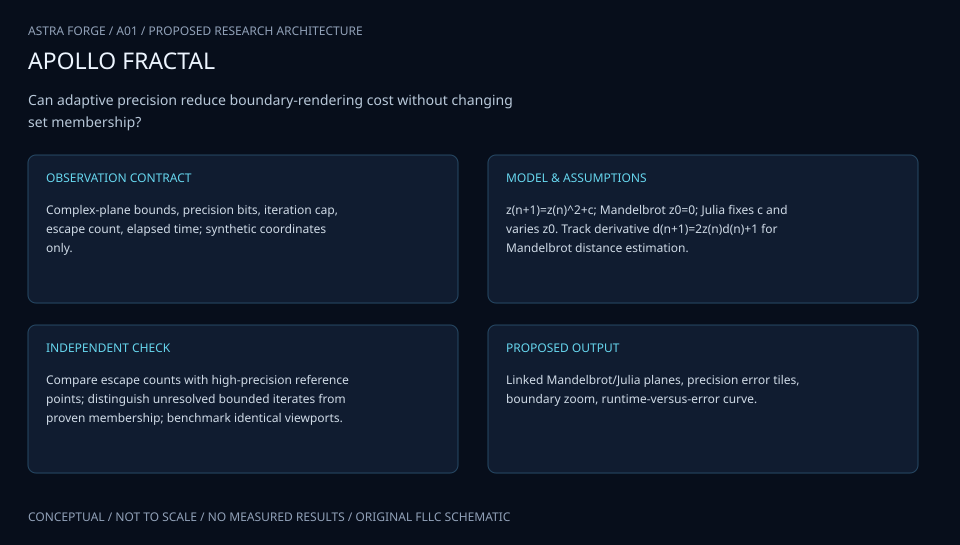
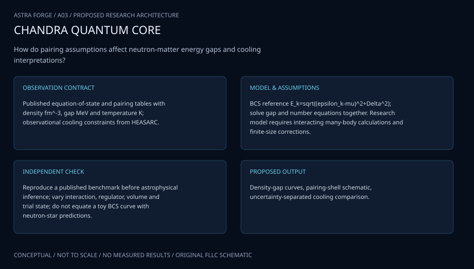
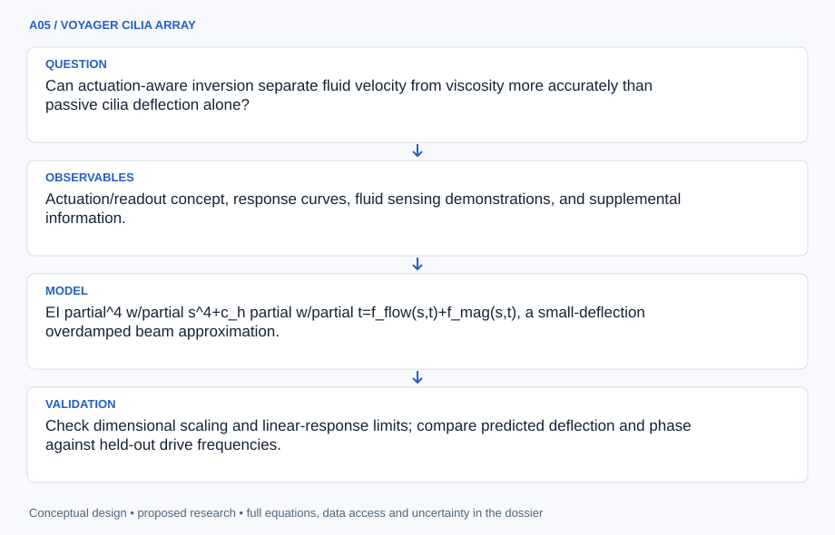
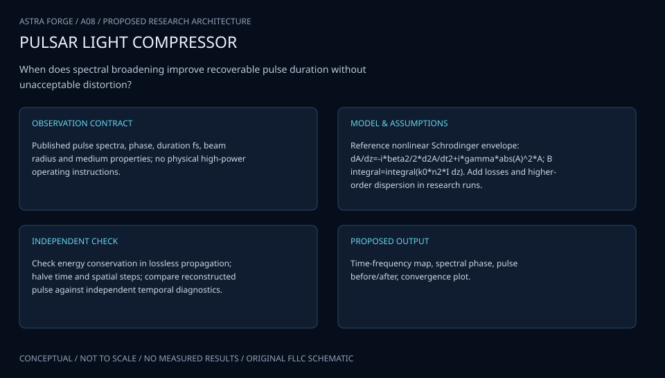
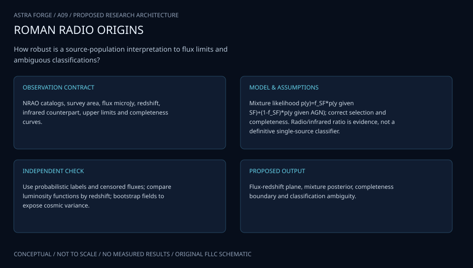
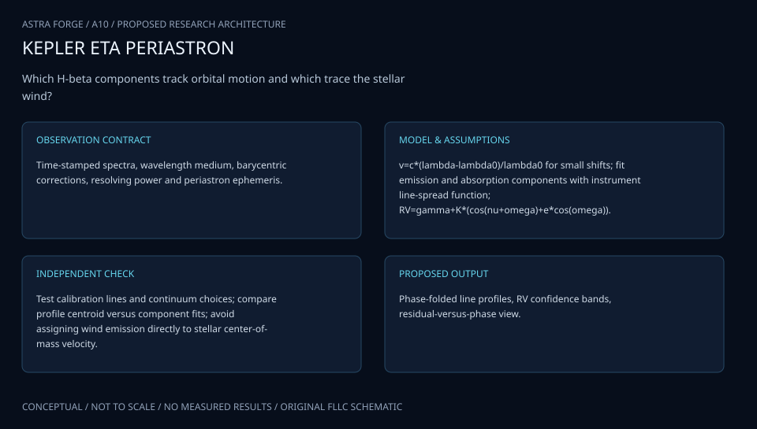
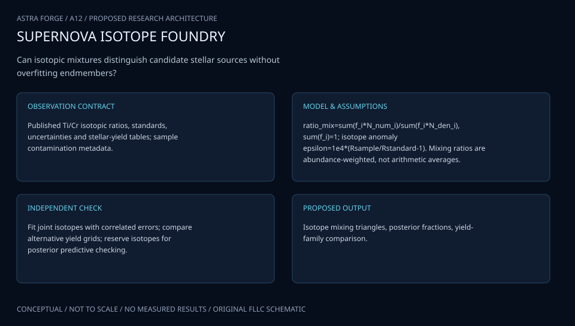

# SESSION A: MATH, PHYSICS & CHEMISTRY

## ATLAS engineering handbook · Revision 2

12 original projects, preserved in their supplied order. Each numbered record has an independently stated design basis, model, data contract and verification plan.

[All engineering documents](../ENGINEERING_DOCUMENTATION.md) · [Documentation standard](../docs/ENGINEERING_STANDARD.md)

## Ordered contents

1. [A01 · ARTEMIS FRACTAL NAVIGATOR](#a01) — New Methods for the Iteration and Visualization of Mandelbrot and Julia Sets
2. [A02 · NEW HORIZONS CRYOPHASE](#a02) — Theory and simulation investigation of eutectic phase behavior on Pluto
3. [A03 · CHANDRA VORTEX CORE](#a03) — Superfluidity of Neutron Star Matter
4. [A04 · APOLLO SWARM SENTINEL](#a04) — Target Detection Using Algorithmic Matter
5. [A05 · VOYAGER CILIA ARRAY](#a05) — Artificial Cilia Creation for Advanced Sensor Devices
6. [A06 · APOLLO PORIN INSIGHT](#a06) — Purification of the P66 Outer Membrane Protein of the Bacterium Borrelia burgdorferi
7. [A07 · ORION CHROMATIN ATLAS](#a07) — Properties of Chromatin Extracted by Salt Fractionation from a Cancerous and Non-cancerous Esophageal Cell Line
8. [A08 · HELIOS PULSE FORGE](#a08) — Nonlinear Laser Pulse Compression with a Multipass Cell
9. [A09 · SPITZER RADIO ORIGINS](#a09) — Majority of the Faint (μJy) Radio Source Population Appears Powered by Star Formation, not AGN
10. [A10 · HUBBLE CARINA CLOCK](#a10) — H-beta Analysis of eta Carinae Radial Velocity during Recent Periastron Passages
11. [A11 · OSIRIS SULFUR ARCHIVE](#a11) — Identification of Thiol Function Groups in GRA 95229 and Murchison
12. [A12 · STARDUST ISOTOPE FOUNDRY](#a12) — Heterogeneous Supernova Production of Ti and Cr Isotopes

---

<a id="a01"></a>

## A01 · ARTEMIS FRACTAL NAVIGATOR

**Original project:** New Methods for the Iteration and Visualization of Mandelbrot and Julia Sets

**Session A:** Math, Physics & Chemistry

**Document class:** engineering research design and analysis record · **Revision:** 2 · **Date:** 2026-10-02

**Evidence state:** design basis, mathematical formulation and verification plan documented. Project-specific empirical results remain to be acquired; executable shared model demonstrations have their own recorded checks.

[Engineering document register](../ENGINEERING_DOCUMENTATION.md) · [Session A handbook](../documentation/SESSION_A.md) · [Next: A02](../projects/A/A02.md)

### Purpose and scientific objective

Proposed mission: build a mathematically auditable fractal observatory that joins adaptive iteration, arbitrary precision, and linked Mandelbrot–Julia views. The scientific product is a benchmark of numerical reliability and computational cost, with an interface that exposes uncertainty in boundary classification. Attractive colors are secondary to measuring where a renderer is accurate, where it is unresolved, and why.

**Question:** Can adaptive precision and reference-orbit perturbation reduce deep-zoom runtime while preserving verified pixel classifications and interpretable dynamical features?

**Testable hypothesis:** A proposed error-controlled hybrid will outperform uniform arbitrary-precision iteration on heterogeneous tiles; advantages should shrink near difficult boundaries and must be measured rather than assumed.

### 1. Design basis and analysis boundary

The renderer treats pixels as finite complex-plane footprints. Coordinate parsing, quadratic iteration, error monitoring and certification form the numerical boundary; palettes consume the resulting evidence without changing classifications. Exact decimal scene coordinates prevent an early binary-float conversion from destroying deep-zoom detail. The principal decision is whether a tile can safely reuse a reference orbit or needs direct computation.

The proposed fidelity ladder proceeds from analytic cardioid/bulb membership, through direct finite-cap iteration, to arbitrary-precision perturbation and interval checks. The author perturbation note motivates shared trajectories but does not guarantee acceleration. Julia scenes preserve fixed c and initial z separately; modified maps receive new model identifiers and derived escape tests.

### 2. Requirements and verification traceability

These are project design requirements or proposed analysis gates. A numerical target is not a NASA requirement unless its controlling source is explicitly identified. “TBD” identifies evidence required before a decision; it is not permission to assume a value. Verification evidence listed here is planned, unless a linked result explicitly records execution.

| ID | Requirement / gate | Engineering rationale | Verification method | Basis / required evidence |
| --- | --- | --- | --- | --- |
| A01-R1 | Every pixel shall retain certified-interior, certified-exterior, escaped-point or unresolved status. | Finite nonescape is not an interior proof. | Audit status and certificate identifiers. | Mathematical contract; rendering results pending. |
| A01-R2 | Proposed coordinate target: absolute construction error below one eighth of pixel width. | Precision must resolve neighboring pixels. | Compare exact-decimal parsing at doubled precision. | Proposed numerical design tolerance. |
| A01-R3 | Julia scenes shall record fixed c, z0 and a justified escape radius. | Radius two is not a universal arbitrary-Julia bound. | Replay analytic exterior/fixed-point fixtures. | Quadratic-map inequality below. |
| A01-R4 | Proposed benchmark gate: zero contradictory certified classifications; count all unresolved pixels. | Performance gains require auditable fidelity. | Independent precision and certificate comparisons. | Proposed acceptance, not observed performance. |

### 3. Architecture and controlled interfaces

A scene manifest passes decimal strings, plane orientation, cap and precision to a coordinate constructor. The tile manager partitions footprints, applies analytic certificates and requests reference trajectories. Perturbation returns escape iteration, derivative and error diagnostics; rebasing uses a new reference without changing the underlying map.

An independent direct renderer recomputes suspicious and stratified pixels. The classifier distinguishes point escape from whole-footprint certification. The linked Julia adapter shares selected c but carries its own initial-coordinate derivative. Profiling uses monotonic elapsed seconds and library/hardware identifiers; runtime variability never substitutes for numerical confidence.



Certification, rebasing and independent fallback precede publication. The diagram preserves unresolved finite-cap points and distinguishes point escape from footprint membership.

[Editable engineering diagram source](../visuals/projects/A01.mmd)

### 4. Mathematical model and derivation

#### Governing equations

```text
z_(n+1)=z_n^2+c; Mandelbrot: z_0=0, vary c; Julia: hold c fixed, vary z_0.
```

```text
D_(n+1)=2 z_n D_n+1 for derivative with respect to c; D_0=0.
```

```text
delta z_(n+1)=2 Z_n delta z_n+(delta z_n)^2+delta c, where Z_n is a high-precision reference orbit.
```

```text
d_ext approximately |z_n| log|z_n|/|D_n| for escaped quadratic Mandelbrot orbits; it is an exterior distance estimator, not an interior certificate.
```

#### Variables, units and conventions

- c and z are dimensionless complex coordinates; n is iteration count; N_max is a finite cap.
- p is arithmetic precision in bits; pixel footprint sets requested spatial tolerance; Z is the reference trajectory.

#### Assumptions and boundary conditions

- Quadratic analytic maps are the baseline; alternative iterators require separate escape bounds and derivative equations.
- Failure to escape by N_max is unresolved unless a valid interior certificate applies.

#### Derivation step 1

$$
\delta z_{n+1}=2Z_n\delta z_n+(\delta z_n)^2+\delta c
$$

Substitute z=Z+delta z and subtract the reference recurrence. The quadratic perturbation term matters after separation grows; dropping it changes the numerical model.

#### Derivation step 2

$$
D_{n+1}=2z_nD_n+1;\quad J_{n+1}=2z_nJ_n
$$

The Mandelbrot derivative is with respect to c, D0=0. Julia initial-coordinate sensitivity instead has J0=1 and no additive one.

#### Derivation step 3

$$
R>\max(2,|c|),\ |z|>R\Rightarrow |z^2+c|\ge|z|^2-|c|>|z|
$$

The conservative radius gives monotonically growing modulus. Point escape does not certify all coordinates covered by a pixel.

#### Derivation step 4

$$
e_{n+1}\lesssim2|z_n|e_n+e_n^2+e_c+e_{round,n}
$$

Propagate absolute complex error and compare it with footprint width. Heuristic glitch detection triggers fallback; rigorous status requires actual bounds.

#### Inference or simulation procedure

Use cardioid and period-two-bulb analytic membership tests, then adaptive quadtree tiles, smooth escape coloring, and perturbation with glitch detection and reference rebasing. Maintain an arbitrary-precision reference renderer for sampled pixels. Track operation counts, wall time, precision escalations, and disagreement maps. An optional extension studies alternative iteration families as explicitly different dynamical systems; it never labels a modified map as the classical set.

#### Validity domain and fidelity limits

Finite images do not determine exact boundary membership. Distance estimates have asymptotic conditions, tile interpolation can miss thin structures, and hardware timings do not transfer automatically to different GPUs.

### 5. Data specifications and provenance

| Field | Type | Unit | Physical / statistical meaning | Quality and missing-data rule |
| --- | --- | --- | --- | --- |
| scene_id | string | 1 | Map and coordinate manifest hash. | Required; alternative maps use new IDs. |
| center_decimal | pair<string> | 1 | Real and imaginary center. | Never cast first to float. |
| footprint_width | float64 | 1 | Complex-plane pixel width. | Positive; height supplied if anisotropic. |
| precision_bits | uint32 | bit | Reference and working precisions. | Both recorded with library version. |
| escape_iteration | nullable<uint64> | iteration | First validated radius crossing. | Null for nonescape; zero is valid. |
| classification | enum | 1 | Evidence-qualified pixel status. | Certificates require bound metadata. |
| error_bound | nullable<float64> | 1 | Absolute coordinate/iteration uncertainty. | Bound versus heuristic flagged; unknown null. |

[Machine-readable record schema](../data/contracts/A01.schema.json) · [Empty acquisition CSV](../data/contracts/A01.csv) · [Field dictionary CSV](../data/contracts/A01.dictionary.csv)

The CSV above contains column headers only. Its schema defines future records and does not establish that original-team data or a particular archive product have been acquired. Frame, timing, calibration, covariance, selection and provenance details must accompany populated records.

#### Self-generated, versioned numerical benchmark

[Product, archive or reference](https://mathr.co.uk/mandelbrot/perturbation.pdf)

**Fields:** Coordinate bounds, complex parameters, precision, iteration caps, escape status, timing, reference errors.

**Access:** Generate locally; the linked author technical note describes perturbation, not a downloadable observational dataset.

**Role:** Controlled truth and reproducibility manifest.

### 6. Uncertainty, sensitivity and identifiability

Coordinate truncation, recurrence amplification and reference cancellation dominate numerical error, while finite caps create classification incompleteness. Exterior distance estimates are asymptotic diagnostics and carry model discrepancy near delicate structures. Neither a smooth color field nor a small estimated distance certifies membership.

Stratify checks by zoom depth, near-parabolic dynamics and escape time. Increase arithmetic precision and iteration cap independently to separate rounding from slow escape. Track disagreement locations, reference rebases and fallback fractions. Timing studies use repeated identical workloads and publish full distributions, including scenes where perturbation loses its advantage.

### 7. Engineering trade study

| Alternative | Benefit | Cost / limitation | Decision rule |
| --- | --- | --- | --- |
| Uniform arbitrary precision | Independent and straightforward. | Expensive on easy exterior regions. | Retain as comparison branch and fallback. |
| Reference perturbation | Shares expensive trajectory arithmetic. | Glitches and rebasing can erase gains. | Select when monitored error meets coordinate target. |
| Interval adaptive tiles | Certifies finite areas. | Overestimation worsens near boundaries. | Subdivide until exclusion succeeds or declare unresolved. |

### 8. Verification and validation cases

| Case ID | Stimulus / condition | Expected result / criterion | Method | Evidence artifact |
| --- | --- | --- | --- | --- |
| A01-V1 | Interior and conjugation | c=0 and c=-1 are bounded; conjugates share escape behavior. | Check predicates and reflected direct trajectories. | Quadratic fixed and period-two orbits. |
| A01-V2 | Julia escape inequality | Modulus increases after the justified radius crossing. | Evaluate exact rational or interval fixtures. | Triangle inequality derivation. |
| A01-V3 | Precision stress | Contradictory certificates fail R4; cap-sensitive nonescape remains unresolved. | Double precision and cap separately; compare direct and perturbation kernels. | Proposed benchmark gate; outcomes TBD. |

**Execution status:** these cases are specified, not claimed as executed. Close a case only with the versioned inputs, output, uncertainty, reviewer and pass/fail rationale.

#### Additional scientific validation gates

- Certify known analytic regions and test conjugate symmetry; independently recompute stratified pixel samples with higher precision.
- Proposed acceptance: zero disagreements among certified pixels, explicit unresolved labels elsewhere, and report speedups with repeated timing intervals.
- Test sensitivity to doubled iteration caps, changed reference locations, and smaller pixel footprints.

### 9. Implementation and reproducible work packages

1. Create scenes.yaml with exact bounds, map identity and caps.
2. Implement coordinates.py and analytic_certificates.py with orientation fixtures.
3. Build direct_reference.py and perturbation.py including derivative/rebase logs.
4. Emit pixels.parquet with null-aware evidence fields.
5. Create precision_compare.ipynb and stratified failure atlases.
6. Publish benchmark_manifest.json with hardware, clocks, hashes and timing samples.

#### Investigation sequence

1. Define 12 proposed benchmark scenes: exterior, analytic interior, near parabolic points, narrow filaments, and progressively deep zooms; publish exact decimal coordinates.
2. Implement baseline and hybrid methods under identical stopping rules, with deterministic seeds and arithmetic library versions.
3. Construct linked panels showing the parameter plane, its selected Julia set, orbit traces, and a separate confidence layer.
4. Profile performance across precision and image size; release negative cases and error-triggered fallback frequencies.

#### Resources and interfaces to expertise

- Complex dynamics expertise; CPU arbitrary-precision library; GPU compute where available; accessible palette and keyboard interaction review.

### 10. Failure modes and interpretation controls

| Failure mode | Effect on result | Detection / evidence | Design response |
| --- | --- | --- | --- |
| Early float conversion | Distinct zoom pixels collapse. | Duplicate coordinates with different indices. | Parse decimal strings into arbitrary precision. |
| Glitch ignored | False fine structure. | Error growth and direct discrepancy. | Rebase or recompute; expose unresolved status. |
| Cap interpreted as proof | False interior label. | Absent certificate audit. | Require certification or unresolved status. |

- Unbounded novelty claims: compare against established algorithms before claiming a new method.
- False detail from floating-point rounding: surface fallback and unresolved regions visibly.

### 11. Required engineering outputs

- Open benchmark manifest, numerical renderer, reproducible notebooks, resolution/error atlas, and interactive Mandelbrot–Julia explorer.

#### Scientific result figures to produce during execution

Four synchronized panes: Mandelbrot parameter map, Julia map, complex orbit trace, and pixel-confidence/timing heatmap; captions distinguish certified, escaped, and unresolved pixels.

#### Included shared numerical starting point


[Executable formulation, parameters, tabular outputs, provenance and verification](../models/README.md). This shared demonstration has a narrower domain than the project model above. Its own caption and methods identify synthetic parameters or the separately retrieved public catalog; it is not a completed result of the original project.

### 12. Cited technical and scientific resources

- [K. I. Martin, Perturbation techniques applied to the Mandelbrot set](https://mathr.co.uk/mandelbrot/perturbation.pdf) — Author technical note supporting the reference-orbit perturbation approach; browser search located the PDF but full extraction failed.
- [Tan Lei, Similarity between the Mandelbrot set and Julia sets](https://math.univ-angers.fr/~tanlei/papers/similarityMJ.pdf) — Author-hosted original mathematical paper establishing asymptotic similarity near Misiurewicz parameters; it does not certify proposed renderer speed.

Framework and evidence rules: [engineering documentation standard](../docs/ENGINEERING_STANDARD.md), [model assurance](../docs/MODEL_ASSURANCE.md), [uncertainty procedure](../docs/UNCERTAINTY_AND_DECISION_RULES.md), and [data management](../docs/DATA_MANAGEMENT.md). NASA-inspired names are creative identifiers; requirements and results are not NASA certification.

---

<a id="a02"></a>

## A02 · NEW HORIZONS CRYOPHASE

**Original project:** Theory and simulation investigation of eutectic phase behavior on Pluto

**Session A:** Math, Physics & Chemistry

**Document class:** engineering research design and analysis record · **Revision:** 2 · **Date:** 2026-10-02

**Evidence state:** design basis, mathematical formulation and verification plan documented. Project-specific empirical results remain to be acquired; executable shared model demonstrations have their own recorded checks.

[Engineering document register](../ENGINEERING_DOCUMENTATION.md) · [Session A handbook](../documentation/SESSION_A.md) · [Previous: A01](../projects/A/A01.md) · [Next: A03](../projects/A/A03.md)

### Purpose and scientific objective

Proposed mission: develop an uncertainty-aware thermodynamic atlas of Pluto's nitrogen, methane, and carbon monoxide mixtures and ask which phase assemblages are compatible with remotely observed ice spectra. Preserve the original eutectic question while distinguishing liquid–solid eutectics from solid–solid coexistence, vapor equilibrium, and solid-state transformations at Pluto surface conditions.

**Question:** Which equilibria and metastable pathways could create compositionally segregated volatile deposits under Pluto's temperature, pressure, and seasonal forcing?

**Testable hypothesis:** A proposed nonideal mixture model will predict spatially varying solid coexistence and spectral band shifts more credibly than an ideal single-solid model; surface eutectic melting may prove irrelevant in the explored range.

### 1. Design basis and analysis boundary

The calculation boundary is a local nitrogen–methane–carbon-monoxide inventory with declared phases, pressure and temperature. Surface bulk composition is not set equal to atmospheric abundance. Outputs are equilibrium stability maps and seasonal assemblage trajectories with thermodynamic provenance; remote spectra provide an observation comparison rather than a unique composition measurement.

Reproduce published binary sections before ternary minimization. Compare globally searched Gibbs minima with common-tangent constructions, then couple only validated thermodynamic branches to a seasonal energy ledger. Kinetic segregation is a distinct extension with independently identified rates. Spectral inference additionally requires grain-size, optical-constant and instrument-response uncertainty.

### 2. Requirements and verification traceability

These are project design requirements or proposed analysis gates. A numerical target is not a NASA requirement unless its controlling source is explicitly identified. “TBD” identifies evidence required before a decision; it is not permission to assume a value. Verification evidence listed here is planned, unless a linked result explicitly records execution.

| ID | Requirement / gate | Engineering rationale | Verification method | Basis / required evidence |
| --- | --- | --- | --- | --- |
| A02-R1 | All solutions shall conserve every species and reject negative phase amounts. | A plausible minimum can still be infeasible. | Proposed residual target below 10^-8 of total molar inventory. | Numerical target; not laboratory precision. |
| A02-R2 | Equilibrium output shall retain competing minima and a stability assessment. | Local minima may represent metastability. | Multistart and tangent-plane comparisons. | Gibbs minimization; published phase sections. |
| A02-R3 | Proposed seasonal energy-closure target: 0.1% of integrated incident energy. | Latent/conductive sign errors mimic transitions. | Compare accumulated fluxes with storage change. | Proposed solver gate. |
| A02-R4 | Spectral comparisons shall declare temperature, composition and grain-size assumptions. | Band behavior is not uniquely compositional. | Repeat inference with alternate grain models. | PDS product context and optical nuisance model. |

### 3. Architecture and controlled interfaces

A phase database supplies reference energies and interaction parameters in J/mol over declared valid domains. The constrained solver receives T in K, P in Pa and species moles, returning phase amounts and chemical potentials. Mole-to-mass conversion uses species molar masses explicitly; all phases share compatible reference states.

A surface integrator advances temperature and signed outward sublimation flux. Assemblages enter an optical model before LEISA response convolution. PDS ingestion preserves product ID, observation geometry and band covariance. Missing optical constants prevent spectral validation while leaving thermodynamic conservation checks usable.


Phase selection couples to signed energy exchange, while spectra enter through a separate optical/instrument branch. Equilibrium and unique bulk composition are not inferred merely from band appearance.

[Editable engineering diagram source](../visuals/projects/A02.mmd)

### 4. Mathematical model and derivation

#### Governing equations

```text
G_total=sum_alpha n_alpha g_alpha(T,P,x_alpha), minimized subject to sum_alpha n_alpha x_i,alpha=n_i,total.
```

```text
mu_i,alpha=mu_i,beta for each species shared by equilibrium phases.
```

```text
g_mix=RT sum_i x_i ln x_i+sum_(i<j) L_ij(T)x_i x_j, an initial regular-solution approximation.
```

```text
C_eff dT/dt=Q_abs-Q_thermal-Q_conduction-sum_i L_sub,i dm_i/dt; latent terms use consistent signs and units.
```

#### Variables, units and conventions

- T in K; P in Pa; phase amounts n in mol; mole fractions x; Gibbs energy g in J/mol.
- Interaction parameters L_ij and phase-specific reference functions; albedo, emissivity, thermal inertia, and sublimation flux.

#### Assumptions and boundary conditions

- Published phase equilibria calibrate the equilibrium branch; kinetic segregation is a separate extension.
- Local surface composition is not assumed equal to atmospheric mixing ratios; grain size and irradiation may affect spectral inference.

#### Derivation step 1

$$
g=\sum_i x_i g_i^0+RT\sum_i x_i\ln x_i+\sum_{i<j}L_{ij}x_ix_j
$$

Reference, entropy and excess contributions are J/mol. Use x ln x=0 at its zero limit and phase-specific reference functions when comparing solids and vapor.

#### Derivation step 2

$$
\mu_i^\alpha=\partial G^\alpha/\partial n_i=\mu_i^\beta
$$

Species-balance Lagrange multipliers give chemical-potential equality for present phases; absent phases must also satisfy stability inequalities.

#### Derivation step 3

$$
x_b=(1-f)x_\alpha+fx_\beta
$$

The binary lever rule yields f=(x_b-x_alpha)/(x_beta-x_alpha), independently checking optimizer amounts against a two-phase section.

#### Derivation step 4

$$
C_A\dot T=F_{abs}-F_{emit}-F_{cond}-\sum_iL_i\dot m_{sub,i}
$$

C_A is J m^-2 K^-1; all RHS terms are W/m^2. Positive sublimation removes heat; negative condensation flux adds it.

#### Inference or simulation procedure

Reproduce published binary phase sections before optimizing ternary Gibbs-energy models. Use common tangents or global constrained minimization to avoid spurious local minima. Couple a seasonal energy-balance model to phase stability and compare predicted assemblages to calibrated New Horizons LEISA band behavior. Carry temperature, optical constants, and interaction-parameter uncertainty through an ensemble; mark extrapolated regions explicitly.

#### Validity domain and fidelity limits

New Horizons is primarily a flyby snapshot and spectra are not unique measurements of bulk composition. Sparse low-pressure laboratory data may leave multiple thermodynamic models observationally indistinguishable.

### 5. Data specifications and provenance

| Field | Type | Unit | Physical / statistical meaning | Quality and missing-data rule |
| --- | --- | --- | --- | --- |
| bulk_moles | vector<float64>[3] | mol | Conserved species inventory. | Nonnegative; fixed species order. |
| temperature | float64 | K | Surface/equilibrium state. | Positive; extrapolation flag required. |
| pressure | float64 | Pa | Declared environmental pressure. | Vacuum limit branch explicit. |
| interaction_covariance | matrix<float64> | (J/mol)^2 | Fitted excess-parameter covariance. | Symmetric positive semidefinite; unknown null. |
| phase_amounts | vector<float64> | mol | Named phase solution. | Absent phase zero; solver failure null. |
| reflectance | nullable<vector<float64>> | 1 | Instrument-band observation/prediction. | Wavelength and response version required. |
| sublimation_flux | vector<float64>[3] | kg m^-2 s^-1 | Signed outward mass flux. | Missing null, never substituted zero. |

[Machine-readable record schema](../data/contracts/A02.schema.json) · [Empty acquisition CSV](../data/contracts/A02.csv) · [Field dictionary CSV](../data/contracts/A02.dictionary.csv)

The CSV above contains column headers only. Its schema defines future records and does not establish that original-team data or a particular archive product have been acquired. Frame, timing, calibration, covariance, selection and provenance details must accompany populated records.

#### New Horizons Planetary Data System archive

[Product, archive or reference](https://pds-smallbodies.astro.umd.edu/data_sb/missions/newhorizons/index.shtml)

**Fields:** LEISA spectra, LORRI context images, observation geometry, instrument metadata, calibration products where available.

**Access:** Public archive; select exact product levels and read instrument documents. Portal access alone does not supply a ready phase-composition map.

**Role:** Observational comparison and geographic context.

#### Published solid-phase equilibrium study

[Product, archive or reference](https://academic.oup.com/mnras/article/474/3/4254/4657184)

**Fields:** Binary/ternary phase regions and stated pressure-temperature assumptions.

**Access:** Article figures/tables; obtain machine-readable coefficients or document digitization uncertainty.

**Role:** Thermodynamic benchmark.

### 6. Uncertainty, sensitivity and identifiability

Interaction energies, local inventory, temperature and optical constants are jointly uncertain. A common spectral temperature calibration offset affects many pixels and must not be reduced as independent noise. Unrepresented solid phases, grain-scale disequilibrium and uncertain subsurface transport contribute discrepancy beyond parameter covariance.

Profile phase-boundary positions against interaction parameters and test whether reflectance distinguishes composition from temperature/grain size. Ensembles are needed near phase switches because first-order linear propagation can average incompatible assemblages. Report assemblage probabilities and extrapolated-domain flags; compare equilibrium and kinetic hypotheses without fitting unconstrained rate constants to a single snapshot.

### 7. Engineering trade study

| Alternative | Benefit | Cost / limitation | Decision rule |
| --- | --- | --- | --- |
| Binary tangents | Transparent phase boundaries. | Limited ternary topology. | Required reproduction baseline. |
| Global ternary minimization | Multiple competing assemblages. | Reference-energy and minimum sensitivity. | Accept after conservation and stability gates. |
| Kinetic extension | Represents seasonal lag. | Rates often poorly constrained. | Use only with evidence separating kinetics from equilibrium. |

### 8. Verification and validation cases

| Case ID | Stimulus / condition | Expected result / criterion | Method | Evidence artifact |
| --- | --- | --- | --- | --- |
| A02-V1 | Pure-species vertices | Entropy/excess mixing terms vanish. | Approach each pure endpoint analytically and numerically. | x ln x limit. |
| A02-V2 | Lever-rule section | Reconstructed bulk equals input within R1. | Compare tangent and constrained binary solutions. | Independent mass balance; execution pending. |
| A02-V3 | Closed thermal box | Zero boundary flux leaves temperature/inventory constant. | Disable forcing and refine integration step. | Species and energy conservation. |

**Execution status:** these cases are specified, not claimed as executed. Close a case only with the versioned inputs, output, uncertainty, reviewer and pass/fail rationale.

#### Additional scientific validation gates

- Recover pure-component limits, mass balance, convexity of stable Gibbs envelopes, and published coexistence points.
- Proposed acceptance: phase-boundary residuals consistent with experimental uncertainty; no numerical negative phase amounts.
- Compare withheld spectral bands and geographic regions; disclose degeneracies rather than force a unique composition.

### 9. Implementation and reproducible work packages

1. Create phase_database.yaml with reference states and fitted domains.
2. Build gibbs_solver.py with multistart constraints and tangent fixtures.
3. Implement seasonal_balance.py with per-area ledgers.
4. Build leisa_adapter.py with archive IDs and response convolution.
5. Emit phase_boundary_ensemble.parquet with extrapolation masks.
6. Publish binary_reproduction.ipynb and separate equilibrium/kinetic manifests.

#### Investigation sequence

1. Create a units-checked inventory of species, crystal phases, source functions, and experimental parameter ranges.
2. Fit competing ideal, regular, and more flexible solution models; retain all models supported by available data.
3. Compute phase sections over a proposed surface-relevant temperature-pressure envelope and then test warmer subsurface scenarios separately.
4. Translate phase assemblages into synthetic spectra with grain-size sensitivity; rank future laboratory measurements by expected information gain.

#### Resources and interfaces to expertise

- Thermodynamic optimization software, planetary spectroscopy specialist, low-temperature laboratory partnership, and versioned PDS download manifest.

### 10. Failure modes and interpretation controls

| Failure mode | Effect on result | Detection / evidence | Design response |
| --- | --- | --- | --- |
| Local minimum accepted | Wrong assemblage map. | Lower competing minimum. | Global search and stability tests. |
| Mass/mole confusion | Incorrect inventories and mixture weights. | Lever-rule ledger failure. | Typed molar-mass conversions. |
| Latent sign reversed | Condensation falsely cools. | Energy-limit regression. | Signed outward-flux contract. |

- Calling every two-phase region a eutectic would misstate the physics.
- Extrapolated coefficients and unknown optical constants can dominate the apparent precision of maps.

### 11. Required engineering outputs

- Phase atlas with uncertainty bands, reproducible Gibbs minimizer, spectral compatibility maps, and a prioritized experimental campaign.

#### Scientific result figures to produce during execution

Ternary composition triangle with phase domains, selected temperature sections, and observed-versus-synthetic spectra; extrapolation is hatched and uncertainty is shaded.

#### Included shared numerical starting point


[Executable formulation, parameters, tabular outputs, provenance and verification](../models/README.md). This shared demonstration has a narrower domain than the project model above. Its own caption and methods identify synthetic parameters or the separately retrieved public catalog; it is not a completed result of the original project.

### 12. Cited technical and scientific resources

- [Tan and Kargel, Solid-phase equilibria on Pluto's surface](https://academic.oup.com/mnras/article/474/3/4254/4657184) — Original treatment of N2–CH4–CO nonideal equilibrium and multiple solid/vapor assemblages.
- [PDS Small Bodies Node: New Horizons](https://pds-smallbodies.astro.umd.edu/data_sb/missions/newhorizons/index.shtml) — Official archive access and instrument/product documentation.

Framework and evidence rules: [engineering documentation standard](../docs/ENGINEERING_STANDARD.md), [model assurance](../docs/MODEL_ASSURANCE.md), [uncertainty procedure](../docs/UNCERTAINTY_AND_DECISION_RULES.md), and [data management](../docs/DATA_MANAGEMENT.md). NASA-inspired names are creative identifiers; requirements and results are not NASA certification.

---

<a id="a03"></a>

## A03 · CHANDRA VORTEX CORE

**Original project:** Superfluidity of Neutron Star Matter

**Session A:** Math, Physics & Chemistry

**Document class:** engineering research design and analysis record · **Revision:** 2 · **Date:** 2026-10-02

**Evidence state:** design basis, mathematical formulation and verification plan documented. Project-specific empirical results remain to be acquired; executable shared model demonstrations have their own recorded checks.

[Engineering document register](../ENGINEERING_DOCUMENTATION.md) · [Session A handbook](../documentation/SESSION_A.md) · [Previous: A02](../projects/A/A02.md) · [Next: A04](../projects/A/A04.md)

### Purpose and scientific objective

Proposed mission: infer what neutron-star cooling and rotational glitches jointly constrain about superfluid pairing, entrainment, and angular-momentum reservoirs. The ambition is a transparent multimessenger constraint system, with microscopic assumptions and observational systematics exposed. It should produce bounds and competing explanations, not a declaration that one cooling curve proves a unique interior.

**Question:** Can joint thermal and rotational inference distinguish pairing-gap scenarios once stellar mass, envelope composition, distance, and entrainment uncertainty are included?

**Testable hypothesis:** Combining independent cooling and glitch constraints will remove portions of pairing-parameter space that either observable alone leaves viable, but some nuclear-model degeneracies will remain.

### 1. Design basis and analysis boundary

The inference boundary includes a spherical star with declared equation of state, mass, envelope and pairing profile, plus a reduced two-reservoir rotational model. Cooling and timing are separate observables with separate measurement physics. A surface-temperature slope or one glitch does not independently identify a unique superfluid gap.

Begin with analytic reduced ODE limits, reproduce a documented NSCool configuration, then add hierarchical nuisance inference. Pairing channel, density dependence and entrainment are explicit model choices. Thermal and glitch likelihoods combine only for compatible observations, with shared distances, ages and selection handled once.

### 2. Requirements and verification traceability

These are project design requirements or proposed analysis gates. A numerical target is not a NASA requirement unless its controlling source is explicitly identified. “TBD” identifies evidence required before a decision; it is not permission to assume a value. Verification evidence listed here is planned, unless a linked result explicitly records execution.

| ID | Requirement / gate | Engineering rationale | Verification method | Basis / required evidence |
| --- | --- | --- | --- | --- |
| A03-R1 | Every run shall identify EOS, mass, envelope, gap channel and redshift convention. | Structural choices can mimic pairing. | Reject incomplete manifests and reproduce a baseline. | NSCool configuration contract. |
| A03-R2 | Isolated rotation shall conserve total angular momentum; proposed relative drift target is 10^-8. | Internal friction transfers angular momentum. | Zero-torque integration and analytic comparison. | Derived conservation; proposed tolerance. |
| A03-R3 | Likelihoods shall preserve temperature/age and timing covariance and censoring. | Derived temperature is atmosphere dependent. | Audit correlated synthetic recovery and age bounds. | Observation-model requirement. |
| A03-R4 | Gap conclusions shall include at least two declared envelope/EOS alternatives. | Fixed nuisance assumptions overstate identification. | Compare posterior/profile shifts and predictive residuals. | Proposed inference gate; no new constraint claimed. |

### 3. Architecture and controlled interfaces

A stellar adapter maps radius to density, redshift and local heat-capacity/emissivity tables. Pairing modules return channel-labeled gap energies and suppression factors. Cooling outputs use redshifted surface temperature and a documented time convention; atmosphere likelihoods remain separate from the interior solver.

The torque emulator receives inertias and external torque and returns crust frequency and superfluid lag in rad/s. Timing epochs use a declared barycentric scale. A shared nuisance registry prevents prior duplication when separate likelihoods enter the sampler. Exported predictions carry model identities and observable covariance rather than unlabeled cooling curves.



Cooling and rotational branches meet through controlled shared nuisance variables. Reduced torque conservation is distinguished from stellar transport; either observable can remain nonidentifying.

[Editable engineering diagram source](../visuals/projects/A03.mmd)

### 4. Mathematical model and derivation

#### Governing equations

```text
T_c(r) approximately 0.57 Delta_0(r)/k_B for weak-coupling isotropic BCS pairing; anisotropic channels need channel-specific relations.
```

```text
C_V(T) dT/dt=-L_nu(T)-L_gamma(T)+H(T), with redshift-aware stellar structure in the production model.
```

```text
I_c dot(Omega_c)=N_ext+N_mf; I_s dot(Omega_s)=-N_mf.
```

```text
n_v=2 Omega_s/kappa; kappa=h/(2m_n), the vortex circulation quantum.
```

#### Variables, units and conventions

- Pairing gap Delta and critical temperature T_c; effective temperature and age; neutron-star mass and radius.
- I_s/I_total, lag Omega_s-Omega_c, mutual-friction coupling time, entrainment parameters, envelope composition, and distance.

#### Assumptions and boundary conditions

- The initial thermal model is spherical and uses a specified equation of state with hydrostatic consistency.
- Published surface-temperature estimates depend on atmosphere and absorption models; glitches need not originate in one reservoir for every pulsar.

#### Derivation step 1

$$
T_c\simeq0.57\Delta_0/k_B
$$

Energy divided by Boltzmann's constant is K. The factor is for weak-coupling isotropic BCS pairing; anisotropic channels require their own relationship.

#### Derivation step 2

$$
C\dot T=-L_\nu-L_\gamma+H
$$

C in J/K and luminosities in W give a reduced heat ledger. Production local/redshifted variables require consistent conversion before comparing integrated loss and stored heat.

#### Derivation step 3

$$
N_{mf}=I_s\ell/\tau;\quad\dot\ell=-(1+I_s/I_c)\ell/\tau
$$

Define ell=Omega_s-Omega_c, positive torque on the crust, and zero external torque. Subtracting the two equations gives decaying rather than growing lag.

#### Derivation step 4

$$
I_c\dot\Omega_c+I_s\dot\Omega_s=N_{ext};\quad n_v=2\Omega_s/\kappa
$$

Summation cancels internal torque. With kappa=h/(2m_n) in m^2/s, vortex density is m^-2; this constraint does not resolve pinning or entrainment microphysics.

#### Inference or simulation procedure

Use a documented stellar cooling solver and a two-component rotational emulator with explicitly parameterized gap profiles. Construct separate likelihoods for thermal spectra and glitch timing, then combine only after checking independence and selection. Generate posterior predictive cooling tracks and glitch-relaxation distributions. Compare no-pairing, crust-pairing, and crust-plus-core alternatives while varying equations of state and envelopes.

#### Validity domain and fidelity limits

The displayed ODE is a reduced overview, not the complete general-relativistic transport system. Ages and temperatures can have large systematics; cooling, magnetic heating, and accretion history can mimic gap effects.

### 5. Data specifications and provenance

| Field | Type | Unit | Physical / statistical meaning | Quality and missing-data rule |
| --- | --- | --- | --- | --- |
| star_id | string | 1 | Object and compatible observation group. | Never merge unrelated cooling/timing stars. |
| age_likelihood | distribution_record | s | Age probability or censoring bound. | Missing null; preserve upper/lower limits. |
| temperature_inf | nullable<float64> | K | Redshifted surface estimate. | Atmosphere version and covariance required. |
| gap_profile | array<radius,energy> | m,J | Pairing hypothesis over radius. | Channel and EOS mapping required. |
| inertias | pair<float64> | kg m^2 | Coupled/superfluid effective inertias. | Positive; entrainment convention documented. |
| omega_observed | nullable<float64> | rad s^-1 | Crust rotation at timing epoch. | Epoch scale and error required. |
| observable_covariance | matrix<float64> | mixed | Covariance for ordered observations. | Units per row; positive semidefinite. |

[Machine-readable record schema](../data/contracts/A03.schema.json) · [Empty acquisition CSV](../data/contracts/A03.csv) · [Field dictionary CSV](../data/contracts/A03.dictionary.csv)

The CSV above contains column headers only. Its schema defines future records and does not establish that original-team data or a particular archive product have been acquired. Frame, timing, calibration, covariance, selection and provenance details must accompany populated records.

#### NSCool author's code resource

[Product, archive or reference](https://www.astroscu.unam.mx/neutrones/NSCool/)

**Fields:** Cooling routines, physical inputs, example structures, and documentation.

**Access:** Public research code resource; inspect license, dependencies, and input provenance before redistribution.

**Role:** Physics implementation baseline, not observational truth.

#### Published cooling and dynamics constraints

[Product, archive or reference](https://arxiv.org/abs/2103.10218)

**Fields:** Gap scenarios, entrainment discussion, cooling/glitch observables and referenced datasets.

**Access:** Public manuscript; retrieve individual observational tables from their originating papers or archives.

**Role:** Constraint design and model limitations.

### 6. Uncertainty, sensitivity and identifiability

Mass, envelope composition, atmosphere, absorption, distance and age correlate with gap effects. Timing relaxation adds reservoir geometry, entrainment and torque variation. Shared spectral calibration or distance cannot be counted as independent information in multiple likelihoods. Magnetic heating, accretion and spatial transport create structural discrepancy.

Compute sensitivities of cooling and lag to gap amplitude/location and nuisance parameters. Collinear sensitivity columns indicate parameter combinations the data cannot resolve. Profile likelihoods and alternate-solver synthetic recovery test whether quoted intervals survive model discrepancy. Restrict conclusions to the density and temperature domains actually sampled.

### 7. Engineering trade study

| Alternative | Benefit | Cost / limitation | Decision rule |
| --- | --- | --- | --- |
| No-pairing baseline | Tests non-superfluid explanations. | Omits suppression/pair emission. | Retain as falsification reference. |
| Parameterized crust/core gaps | Efficient and interpretable. | Flexible profiles can absorb other physics. | Select only if predictions improve under nuisance alternatives. |
| Microscopic gap tables | Physical channel structure. | Interaction/EOS uncertainty limits transfer. | Use documented tables as a model ensemble. |

### 8. Verification and validation cases

| Case ID | Stimulus / condition | Expected result / criterion | Method | Evidence artifact |
| --- | --- | --- | --- | --- |
| A03-V1 | Zero-torque rotation | Total angular momentum stays constant and lag decays exponentially. | Compare unequal-inertia integration to derived solution. | Conservation and sign checks. |
| A03-V2 | Power-off thermal limit | With all heating/luminosity terms zero, T stays constant. | Check reduced solver and production adapter with refined steps. | Energy conservation. |
| A03-V3 | Withheld observable | Unsupported gap information widens intervals or produces explicit predictive failure. | Withhold cooling epoch or timing stream and examine predictions. | Proposed identifiability test; result pending. |

**Execution status:** these cases are specified, not claimed as executed. Close a case only with the versioned inputs, output, uncertainty, reviewer and pass/fail rationale.

#### Additional scientific validation gates

- Recover normal-fluid and decoupled-rotor limits; verify angular-momentum conservation when external torque is zero.
- Check energy closure and convergence of cooling tracks against tighter radial/time resolution.
- Require held-out objects and posterior predictive coverage; report prior sensitivity, Bayes-factor instability, and nonidentifiability.

### 9. Implementation and reproducible work packages

1. Create stellar_config.yaml with EOS hashes and pairing/redshift metadata.
2. Build nscool_adapter.py and reproduce one documented configuration.
3. Implement rotation_emulator.py with exact torque fixtures.
4. Create thermal/timing likelihood modules and shared_nuisance.json.
5. Produce sensitivity_profiles.ipynb and alternate-model recovery cases.
6. Emit predictions.parquet and inference_manifest.json with selection and unresolved degeneracies.

#### Investigation sequence

1. Compile a versioned observational table with object identifiers, atmosphere assumptions, confidence intervals, and exclusions.
2. Reproduce a published baseline cooling scenario; build interpolation surrogates only after numerical validation.
3. Perform hierarchical inference across several stars and pulsars without assuming identical masses or heating histories.
4. Conduct prospective analysis: quantify which new temperature epoch or timing precision would best distinguish surviving scenarios.

#### Resources and interfaces to expertise

- Nuclear theory and relativistic stellar-structure expertise; cooling solver; Bayesian sampler; observational X-ray/timing collaboration.

### 10. Failure modes and interpretation controls

| Failure mode | Effect on result | Detection / evidence | Design response |
| --- | --- | --- | --- |
| Mixed redshift conventions | False temperature/luminosity history. | Round-trip conversion discrepancy. | Central conversion module. |
| Friction sign error | Lag grows unphysically. | Analytic decay regression. | Torque direction specified at interface. |
| Fixed envelope confounder | Overconfident pairing interpretation. | Posterior shifts under envelope changes. | Publish nuisance alternatives. |

- Model-dependent inferences can appear more definitive than the data support.
- Joint inference is invalid if catalog selections or shared systematic errors are ignored.

### 11. Required engineering outputs

- Pairing-gap constraint atlas, reproducible thermal/rotational likelihoods, posterior ensembles, and an observing-priority report.

#### Scientific result figures to produce during execution

Cooling curves with observational confidence regions, rotational reservoir diagrams, and overlapping allowed pairing-gap bands; alternative interior models remain distinguishable by color.

### 12. Cited technical and scientific resources

- [A superfluid perspective on neutron star dynamics](https://arxiv.org/abs/2103.10218) — Research treatment of superfluid degrees of freedom, quantized vortices, mutual friction, and entrainment.
- [NSCool](https://www.astroscu.unam.mx/neutrones/NSCool/) — Author-maintained neutron-star cooling implementation and documentation.
- [Cooling neutron star in Cassiopeia A: evidence for superfluidity in the core](https://onlinelibrary.wiley.com/doi/10.1111/j.1745-3933.2011.01015.x) — Original observational/modeling hypothesis motivating, but not uniquely resolving, cooling-based pairing constraints.

Framework and evidence rules: [engineering documentation standard](../docs/ENGINEERING_STANDARD.md), [model assurance](../docs/MODEL_ASSURANCE.md), [uncertainty procedure](../docs/UNCERTAINTY_AND_DECISION_RULES.md), and [data management](../docs/DATA_MANAGEMENT.md). NASA-inspired names are creative identifiers; requirements and results are not NASA certification.

---

<a id="a04"></a>

## A04 · APOLLO SWARM SENTINEL

**Original project:** Target Detection Using Algorithmic Matter

**Session A:** Math, Physics & Chemistry

**Document class:** engineering research design and analysis record · **Revision:** 2 · **Date:** 2026-10-02

**Evidence state:** design basis, mathematical formulation and verification plan documented. Project-specific empirical results remain to be acquired; executable shared model demonstrations have their own recorded checks.

[Engineering document register](../ENGINEERING_DOCUMENTATION.md) · [Session A handbook](../documentation/SESSION_A.md) · [Previous: A03](../projects/A/A03.md) · [Next: A05](../projects/A/A05.md)

### Purpose and scientific objective

Proposed mission: study how locally communicating programmable particles recognize a benign environmental target, share evidence, and collectively mark its boundary. Define the target as an inert test object or scientific feature. The contribution is a provable distributed algorithm plus an honest translation gap between the geometric amoebot model and realizable robot hardware.

**Question:** Which local sensing and communication rules permit reliable target detection despite asynchronous activation, sensor noise, particle failures, and limited memory?

**Testable hypothesis:** Sequential evidence accumulation with connectivity-preserving coordination will reduce false collective detections relative to single-particle thresholds at comparable detection delay, within a defined noise model.

### 1. Design basis and analysis boundary

The engineered system is a finite-memory detector on a time-dependent hexagonal particle graph. Observations have particle/time provenance and a declared noise model. Scheduler, sensing, bounded-state updates and messages define the boundary; computational rounds become physical time or energy only through separately measured adapters.

Begin with a connected static graph and independent observations, then challenge asynchronous activation, correlated sensing and failures. Formal proofs apply only under declared scheduler/connectivity assumptions. The implementation decision compares realizable finite-state evidence rules with a full-provenance likelihood oracle that intentionally exceeds particle memory.

### 2. Requirements and verification traceability

These are project design requirements or proposed analysis gates. A numerical target is not a NASA requirement unless its controlling source is explicitly identified. “TBD” identifies evidence required before a decision; it is not permission to assume a value. Verification evidence listed here is planned, unless a linked result explicitly records execution.

| ID | Requirement / gate | Engineering rationale | Verification method | Basis / required evidence |
| --- | --- | --- | --- | --- |
| A04-R1 | Every rule shall enumerate its finite state count, message alphabet and scheduler assumptions. | Unbounded likelihood accumulation cannot support constant-memory claims. | Inspect transition table and model-check small instances. | Amoebot model contract. |
| A04-R2 | Proposed independent-case false-alarm target is 0.01, with binomial interval and sample count. | Threshold quality depends on a declared null model. | Held-out target-absent Monte Carlo trials. | Design target; measured performance unknown. |
| A04-R3 | Check graph connectivity after every permitted movement. | Disconnected components lose global evidence. | Assert invariants and enumerate small graph moves. | Declared legal-motion assumptions. |
| A04-R4 | The offline evaluator shall count each observation only once. | Cycles can recirculate evidence into false confidence. | Replay duplicate message IDs and compare single delivery. | Provenance requirement; bounded approximations flag residual error. |

### 3. Architecture and controlled interfaces

The simulator builds axial hex coordinates and neighbor-port labels. An event scheduler supplies seed, activation index and optional simulated seconds. The transition engine consumes bounded sensor symbols and messages; sensor adapters map target geometry to independent or correlated observations.

An offline audit stores full provenance separately from particle state. Graph monitoring records partitions and dead nodes. Declaration records distinguish local detection, propagated agreement and localization. Correlation or fairness violations become explicit assumption flags; they are not silently absorbed into nominal false-alarm statistics.


Bounded particle computation is separated from the full-information oracle. Scheduler and connectivity monitors delimit correctness claims and leave physical latency unqualified.

[Editable engineering diagram source](../visuals/projects/A04.mmd)

### 4. Mathematical model and derivation

#### Governing equations

```text
G=(V,E) is the time-dependent adjacency graph of particles on a hexagonal baseline lattice.
```

```text
ell_i(t)=sum_tau log[p(y_i,tau|H_1)/p(y_i,tau|H_0)], with thresholds chosen for specified false-alarm and miss rates.
```

```text
x(t+1)=W(t)x(t)+u(t) is a consensus abstraction; realizable finite-memory rules are analyzed separately.
```

```text
P_D=P(declare target|target present); P_FA=P(declare target|target absent).
```

#### Variables, units and conventions

- n particles, local degree, observation y, bounded states, communication budget, activation schedule, failed-particle fraction.
- Target geometry, sensor sensitivity/specificity, correlation length, connectivity, detection latency, movement energy.

#### Assumptions and boundary conditions

- Amoebot motion and communication primitives are mathematical abstractions; actual sensors and actuators need separate error models.
- Neighbor measurements may be correlated; independent-sample likelihoods are used only in explicitly independent synthetic cases.

#### Derivation step 1

$$
\ell(y)=y\ln(p_1/p_0)+(1-y)\ln[(1-p_1)/(1-p_0)]
$$

Derive the Bernoulli log likelihood ratio. Independent samples add; dependent samples need a joint model, so repeated local messages are not new samples.

#### Derivation step 2

$$
A\approx\ln[(1-\beta)/\alpha];\ B\approx\ln[\beta/(1-\alpha)]
$$

Sequential thresholds motivate the reference detector for false alarm alpha and miss beta. Overshoot and quantization mean these are not guarantees for the finite-state asynchronous implementation.

#### Derivation step 3

$$
x_{t+1}=Wx_t;\quad\mathbf1^TW=\mathbf1^T
$$

Column stochasticity preserves sums; row stochasticity preserves constants. Mean consensus additionally requires appropriate connectivity and update conditions.

#### Derivation step 4

$$
n_{eff}\approx n/[1+(n-1)\rho]
$$

Equicorrelated unit-variance observations give mean variance [1+(n-1)rho]/n. The diagnostic shows why many correlated neighbors may provide little independent information.

#### Inference or simulation procedure

Start with static object detection on a connected lattice, then extend to boundary localization and fault-aware information flow. State invariants for connectivity and evidence provenance. Prove termination and correctness under stated scheduler assumptions. Monte Carlo experiments explore noise and failures outside the proof's ideal conditions. A small robot or software-agent demonstration validates only the primitives it actually implements.

#### Validity domain and fidelity limits

Theoretical round complexity is not physical time. Constant-memory restrictions may preclude exact global statistics, and connectivity guarantees can fail when arbitrary particles disappear.

### 5. Data specifications and provenance

| Field | Type | Unit | Physical / statistical meaning | Quality and missing-data rule |
| --- | --- | --- | --- | --- |
| particle_id | uint32 | 1 | Stable simulated node. | Generation ID prevents identity reuse. |
| axial_position | pair<int32> | lattice step | Hex coordinates. | Neighbor ports match offsets. |
| activation_index | uint64 | event | Scheduler sequence. | Increasing; fairness metadata required. |
| sensor_symbol | nullable<enum> | 1 | Bounded sensor alphabet. | Missing distinct from target absent. |
| message_state | enum | 1 | Finite transition message. | Alphabet version and direction required. |
| provenance_id | string | 1 | Offline observation origin. | Deduplicate before oracle accumulation. |
| declaration | record | 1 | Node, event and decision. | Confidence null if uncalibrated. |

[Machine-readable record schema](../data/contracts/A04.schema.json) · [Empty acquisition CSV](../data/contracts/A04.csv) · [Field dictionary CSV](../data/contracts/A04.dictionary.csv)

The CSV above contains column headers only. Its schema defines future records and does not establish that original-team data or a particular archive product have been acquired. Frame, timing, calibration, covariance, selection and provenance details must accompany populated records.

#### ASU Self-Organizing Particle Systems research framework

[Product, archive or reference](https://labs.engineering.asu.edu/sops/amoebot/)

**Fields:** Formal model definitions, algorithmic primitives, and publication links.

**Access:** Public laboratory resource; locate simulator/code licenses separately.

**Role:** Model foundation, not measurements of a working material.

#### Generated target/noise benchmark

[Product, archive or reference](https://arxiv.org/abs/2205.15412)

**Fields:** Lattice layouts, convex/nonconvex targets, activation schedules, observation seeds, failures, and event traces.

**Access:** Generate versioned test cases; linked paper supplies an asynchronous 3D coordination precedent rather than a target benchmark.

**Role:** Controlled robustness evaluation.

### 6. Uncertainty, sensitivity and identifiability

Sensitivity/specificity vary with geometry and common environmental fields. Binomial intervals apply only to independent trial outcomes; common seeds or fields require clustered evaluation. Scheduler fairness and connectivity are discrete applicability assumptions rather than smooth uncertainty parameters.

Sweep correlation length, target size, failure timing and message capacity independently. Compare bounded rules against full-provenance likelihood to attribute loss to sensing versus compression. An unfair schedule tests robustness outside the proof envelope; its failure must be reported with the violated assumption rather than as an unexplained algorithm defect.

### 7. Engineering trade study

| Alternative | Benefit | Cost / limitation | Decision rule |
| --- | --- | --- | --- |
| Local thresholds | Minimal memory. | Weak global coverage. | Choose only for locally observable targets meeting false-alarm gate. |
| Finite-state tokens | Bounded communication. | Quantization and stale evidence. | Select after asynchronous and duplicate verification. |
| Floating-point oracle | Measures information ceiling. | Not constant-memory deployment. | Retain as offline comparison. |

### 8. Verification and validation cases

| Case ID | Stimulus / condition | Expected result / criterion | Method | Evidence artifact |
| --- | --- | --- | --- | --- |
| A04-V1 | No-information limit | p1=p0 yields zero evidence increment. | Evaluate guarded analytic likelihood fixtures. | Bernoulli identity. |
| A04-V2 | Consensus conservation | Doubly stochastic connected fixed W preserves mean. | Compare matrix reference and bounded transition outputs. | Linear identity; quantization differences explicit. |
| A04-V3 | Duplicate and partition replay | Oracle evidence unchanged by duplicate; illegal partition raises fault. | Script message cycles and node losses. | R3/R4; results pending. |

**Execution status:** these cases are specified, not claimed as executed. Close a case only with the versioned inputs, output, uncertainty, reviewer and pass/fail rationale.

#### Additional scientific validation gates

- Use invariant checking and model checking on small exhaustive systems before large simulations.
- Report receiver-operating curves, localization error, worst-case activation rounds, message counts, and energy estimates.
- Proposed gate: stated false-alarm bounds hold within confidence intervals on unseen noise seeds; publish counterexamples beyond assumptions.

### 9. Implementation and reproducible work packages

1. Create lattice_schema.json and sensor_models.yaml.
2. Implement scheduler.py with fair/unfair replay policies.
3. Encode detector_transition.csv as executable bounded rules.
4. Build provenance_oracle.py independently of particle memory.
5. Add graph_invariants.py and exhaustive small-state fixtures.
6. Publish trials.parquet and sensitivity notebooks with seeds and assumption flags.

#### Investigation sequence

1. Specify benign target classes, measurable detection requirements, sensor models, scheduler, and precise particle capabilities.
2. Develop finite-state local rules with explicit message types, evidence expiry, and disconnected-component behavior.
3. Compare threshold-only, leader-assisted, and distributed evidence aggregation baselines across target shapes and noise correlation.
4. Explore 3D and energy-constrained extensions only after the 2D algorithm passes proof and simulation review.

#### Resources and interfaces to expertise

- Distributed algorithms expertise, event-driven simulator, property checker, and optional tabletop modular robotics testbed.

### 10. Failure modes and interpretation controls

| Failure mode | Effect on result | Detection / evidence | Design response |
| --- | --- | --- | --- |
| Scheduler starvation | No termination guarantee. | Activation coverage log. | Declare fairness boundary and watchdog. |
| Evidence recirculation | Inflated confidence. | Duplicate provenance count. | Token ownership/expiry with quantified approximation. |
| Graph partition | Incomplete global evidence. | Component monitor. | Legal motion constraints and partition reports. |

- Simulation success is insufficient evidence that programmable matter hardware exists at the modeled scale.
- Unmodeled sensor correlation can create coordinated false positives; retain adversarial noise cases.

### 11. Required engineering outputs

- Formal specification, correctness argument, reproducible simulation suite, error/latency trade study, and boundary-detection animation.

#### Scientific result figures to produce during execution

Particles change color with local confidence, connectivity is overlaid, target boundaries appear only after the decision rule fires, and a sidebar shows false alarms, rounds, and energy.

### 12. Cited technical and scientific resources

- [Computing by Programmable Particles — ASU SOPS](https://labs.engineering.asu.edu/sops/amoebot/) — Research group's formal framework and distributed primitives.
- [Asynchronous Deterministic Leader Election in Three-Dimensional Programmable Matter](https://arxiv.org/abs/2205.15412) — Original asynchronous coordination model with explicitly stated geometric and scheduler conditions.
- [Energy-Constrained Programmable Matter Under Unfair Adversaries](https://arxiv.org/abs/2309.04898) — Original framework for accounting for locally distributed energy constraints.

Framework and evidence rules: [engineering documentation standard](../docs/ENGINEERING_STANDARD.md), [model assurance](../docs/MODEL_ASSURANCE.md), [uncertainty procedure](../docs/UNCERTAINTY_AND_DECISION_RULES.md), and [data management](../docs/DATA_MANAGEMENT.md). NASA-inspired names are creative identifiers; requirements and results are not NASA certification.

---

<a id="a05"></a>

## A05 · VOYAGER CILIA ARRAY

**Original project:** Artificial Cilia Creation for Advanced Sensor Devices

**Session A:** Math, Physics & Chemistry

**Document class:** engineering research design and analysis record · **Revision:** 2 · **Date:** 2026-10-02

**Evidence state:** design basis, mathematical formulation and verification plan documented. Project-specific empirical results remain to be acquired; executable shared model demonstrations have their own recorded checks.

[Engineering document register](../ENGINEERING_DOCUMENTATION.md) · [Session A handbook](../documentation/SESSION_A.md) · [Previous: A04](../projects/A/A04.md) · [Next: A06](../projects/A/A06.md)

### Purpose and scientific objective

Proposed mission: create an active flow-sensing skin whose compliant cilia both probe their fluid environment and report deflection. Evaluate whether controlled actuation improves sensitivity to velocity and viscosity while maintaining robustness to temperature, fouling, and structural variation. The mission analogy is a compact sensor surface for fluid-handling instruments and environmental probes, with qualification treated as future work.

**Question:** Can actuation-aware inversion separate fluid velocity from viscosity more accurately than passive cilia deflection alone?

**Testable hypothesis:** Measurements at several drive frequencies and orientations will improve parameter identifiability, provided actuator torque and cilium stiffness are independently calibrated.

### 1. Design basis and analysis boundary

The device model separates cilium mechanics, hydrodynamic forcing, magnetic actuation and electrical readout. The immediate deliverable is a calibrated inverse model for fluid velocity and viscosity, using archived or authorized benign calibration data. Geometry, channel walls and temperature belong inside the boundary because they change the transfer function; space qualification is outside it.

Begin with a small-deflection overdamped cantilever and independently calibrated readout. Add nonlinear bending, array interactions or viscoelastic fluid terms only when residuals demand them. The design choice is whether controlled frequency response supplies enough independent sensitivity to distinguish velocity from viscosity, rather than merely increasing deflection.

### 2. Requirements and verification traceability

These are project design requirements or proposed analysis gates. A numerical target is not a NASA requirement unless its controlling source is explicitly identified. “TBD” identifies evidence required before a decision; it is not permission to assume a value. Verification evidence listed here is planned, unless a linked result explicitly records execution.

| ID | Requirement / gate | Engineering rationale | Verification method | Basis / required evidence |
| --- | --- | --- | --- | --- |
| A05-R1 | Each inferred viscosity/velocity pair shall include joint covariance or an identifiability warning. | Passive drag often constrains their product. | Examine sensitivity rank and profile likelihood. | Inverse-model requirement; no claimed device accuracy. |
| A05-R2 | Proposed linear-model gate: peak displacement below 0.1L and reported Reynolds number below 0.1. | The reduced beam/drag assumptions need an explicit envelope. | Compute nondimensional indicators and compare nonlinear simulations. | Proposed screening thresholds, not universal limits. |
| A05-R3 | Temperature and actuation response shall be separately identified or marked unconstrained. | Thermal readout changes can imitate flow. | Fit temperature-only and drive-only reference records. | Existing sensor precedent plus proposed calibration decomposition. |
| A05-R4 | Proposed fusion target: held-out error below passive-only error at equal bandwidth and energy budget. | An active array must earn its added complexity. | Compare paired held-out prediction intervals. | Design objective; gains not measured. |

### 3. Architecture and controlled interfaces

A geometry record supplies length, section and elastic parameters. A hydrodynamic adapter accepts velocity in m/s, dynamic viscosity in Pa s and wall spacing; magnetic forcing enters as distributed N/m or boundary moment in N m. Beam displacement and strain then feed a readout module with volts/strain and volts/K coefficients.

A frequency-response builder records actuation angular frequency in rad/s and synchronous channel timestamps. The estimator consumes response amplitudes/phases with covariance and returns U, mu and nuisance terms. Array cross-coupling is represented in a matrix, not treated as repeated independent cilia. Validity indicators travel with every estimate.



Mechanics and readout are separately calibrated before inversion. The diagram exposes temperature and wall drag as nuisance pathways and requires rank/validity gates before reporting two fluid parameters.

[Editable engineering diagram source](../visuals/projects/A05.mmd)

### 4. Mathematical model and derivation

#### Governing equations

```text
EI partial^4 w/partial s^4+c_h partial w/partial t=f_flow(s,t)+f_mag(s,t), a small-deflection overdamped beam approximation.
```

```text
Re=rho U L/mu; Sp=L(omega zeta_perp/EI)^(1/4), an elastohydrodynamic response parameter.
```

```text
y_j(t)=K_epsilon epsilon_j(t)+K_T Delta T(t)+b_j+eta_j(t).
```

```text
theta_hat=argmin_theta sum_j,t ||y_j(t)-h_j(theta,t)||^2_(Sigma^-1), where theta includes U, mu, and nuisance calibration terms.
```

#### Variables, units and conventions

- Cilium length L, bending stiffness EI, displacement w, viscosity mu, drag coefficient zeta, drive frequency omega.
- Magnetic actuation torque/force, strain readout, temperature, flow velocity U, sensor noise covariance, and inter-cilium spacing.

#### Assumptions and boundary conditions

- Low Reynolds number and small deflection justify the first model only over a measured operating range.
- Large bending, wall effects, magnetic interactions, and viscoelastic fluid behavior require nonlinear fluid-structure simulation.

#### Derivation step 1

$$
EIw''''+\zeta_\perp\dot w=\zeta_\perp U+f_{mag}
$$

EI in N m^2 times fourth spatial derivative gives N/m. Drag coefficient per length zeta has N s/m^2, so both velocity terms are distributed force.

#### Derivation step 2

```text
w(L)=qL^4/(8EI)
```

For a clamped-free beam under uniform static q, integrate four times with fixed root displacement/slope and free-tip moment/shear. Deflection measures q/EI, not viscosity alone.

#### Derivation step 3

$$
Sp=L(\omega\zeta_\perp/EI)^{1/4}
$$

The frequency/drag/stiffness ratio has m^-4, yielding dimensionless Sp. Dynamic phase and amplitude can add sensitivity distinct from the static mu U product.

#### Derivation step 4

$$
\Sigma_\theta\approx(J^T\Sigma_y^{-1}J)^{-1}
$$

Linearize y=h(theta). Rank loss or a large condition number signals U–mu or thermal degeneracy; singular cases require profile intervals rather than a false finite covariance.

#### Inference or simulation procedure

Fit beam and readout parameters using independent mechanical and temperature calibration data. Build a response library over velocity, viscosity, and drive frequency, then infer environmental parameters using uncertainty-aware optimization. Compare passive and active operating modes under the same readout bandwidth and energy budget. Analyze sparse cilia versus arrays to determine whether cross-coupling adds useful information or destabilizes calibration.

#### Validity domain and fidelity limits

A sensor-integrated magnetic cilium precedent does not demonstrate space readiness. Viscosity–velocity degeneracy, fabrication scatter, and wall-dependent flow can limit generalization between channels.

### 5. Data specifications and provenance

| Field | Type | Unit | Physical / statistical meaning | Quality and missing-data rule |
| --- | --- | --- | --- | --- |
| cilium_geometry | record | m | Length, section and channel spacing. | Positive dimensions; manufacturing uncertainty retained. |
| bending_stiffness | float64 | N m^2 | Independently calibrated EI. | Covariance with geometry recorded. |
| drive_frequency | float64 | rad s^-1 | Angular actuation frequency. | Hz conversion explicit; zero permitted. |
| readout | vector<float64> | V | Synchronized array signals. | Missing channels null with mask. |
| temperature_change | nullable<float64> | K | Readout reference temperature difference. | Reference and sensor error required. |
| response_covariance | matrix<float64> | V^2 | Joint channel/noise covariance. | Positive semidefinite; cross-cilia terms retained. |
| fluid_estimate | record | m/s,Pa s | Velocity, viscosity and joint uncertainty. | Unidentifiable parameter null plus flag. |

[Machine-readable record schema](../data/contracts/A05.schema.json) · [Empty acquisition CSV](../data/contracts/A05.csv) · [Field dictionary CSV](../data/contracts/A05.dictionary.csv)

The CSV above contains column headers only. Its schema defines future records and does not establish that original-team data or a particular archive product have been acquired. Frame, timing, calibration, covariance, selection and provenance details must accompany populated records.

#### Published sensor-integrated cilia research

[Product, archive or reference](https://pmc.ncbi.nlm.nih.gov/articles/PMC10589697/)

**Fields:** Actuation/readout concept, response curves, fluid sensing demonstrations, and supplemental information.

**Access:** Public article; raw data availability must be checked with authors rather than inferred from figures.

**Role:** Architecture precedent and performance comparison.

#### Published artificial-cilia flow measurements

[Product, archive or reference](https://pmc.ncbi.nlm.nih.gov/articles/PMC3364822/)

**Fields:** Tracer-derived velocities, beat asymmetry, and array-flow behavior.

**Access:** Public article/figures; digitized points must carry extraction uncertainty.

**Role:** Hydrodynamic sanity check.

### 6. Uncertainty, sensitivity and identifiability

Elastic modulus, section dimensions, magnetic force scale and readout gain share calibration uncertainty. Fourth-power length dependence amplifies dimensional scatter. Wall drag, fluid viscoelasticity and array hydrodynamic coupling create discrepancy that cannot be removed by reducing electronic noise alone.

Use sensitivity singular values to select frequencies that separate U and mu from nuisance parameters. Bootstrap by independent calibration session rather than by individual time samples. Test held-out wall spacing and cilium geometry, carrying systematic calibration covariance across channels; widen the prediction envelope when the linear validity indicators fail.

### 7. Engineering trade study

| Alternative | Benefit | Cost / limitation | Decision rule |
| --- | --- | --- | --- |
| Passive deflection | Low energy and simple readout. | Velocity–viscosity degeneracy. | Choose when viscosity is independently known. |
| Active single cilium | Adds phase/frequency information. | Drive and force calibration needed. | Use if sensitivity rank improves under equal budget. |
| Coupled array | Spatial information and redundancy. | Correlated drag and fabrication scatter. | Select only if held-out gain survives cross-coupling model. |

### 8. Verification and validation cases

| Case ID | Stimulus / condition | Expected result / criterion | Method | Evidence artifact |
| --- | --- | --- | --- | --- |
| A05-V1 | Static beam limit | Uniform q produces qL^4/(8EI) tip deflection. | Compare discretized mechanics to analytic cantilever. | Beam boundary conditions. |
| A05-V2 | Zero input | U=0, drive=0 and Delta T=0 yield baseline b. | Evaluate complete forward/readout chain. | Defined signal model. |
| A05-V3 | Inverse degeneracy | Static-only data with unknown mu and U show a flat product ridge. | Profile synthetic noiseless likelihood, then add dynamic responses. | Structural identifiability; response improvement TBD. |

**Execution status:** these cases are specified, not claimed as executed. Close a case only with the versioned inputs, output, uncertainty, reviewer and pass/fail rationale.

#### Additional scientific validation gates

- Check dimensional scaling and linear-response limits; compare predicted deflection and phase against held-out drive frequencies.
- Proposed gate: velocity and viscosity intervals achieve calibrated coverage and improve against passive mode on independent fluids.
- Measure drift, cross-talk, hysteresis, failure rate, and energy per estimate; disclose operating regions where inversion is ambiguous.

### 9. Implementation and reproducible work packages

1. Create geometry_and_calibration.yaml with EI, drive and readout provenance.
2. Implement cantilever_response.py and analytic fixtures.
3. Build drag_wall_adapter.py and optional array_coupling.py.
4. Produce frequency_response.parquet with phase conventions and masks.
5. Implement joint_inverse.py with rank diagnostics and profile likelihood.
6. Publish passive_active_compare.ipynb and an energy/bandwidth matched manifest.

#### Investigation sequence

1. Select a proposed sensing envelope and define resolution, drift, bandwidth, and total actuation-power requirements.
2. Model cilium geometry, readout placement, and magnetic coupling; conduct uncertainty propagation before selecting dimensions.
3. Create a calibrated flow/viscosity benchmark with a qualified laboratory; compare against independent flow references.
4. Stress the model with temperature changes, suspended inert particles, repeated cycles, and asymmetric channel boundaries.

#### Resources and interfaces to expertise

- Fluid-structure solver, magnetics expertise, optical deflection metrology, calibrated flow bench, and sensor fabrication partnership.

### 10. Failure modes and interpretation controls

| Failure mode | Effect on result | Detection / evidence | Design response |
| --- | --- | --- | --- |
| Wall effects omitted | Biased viscosity. | Residuals depend on channel spacing. | Geometry-aware drag or excluded envelope. |
| Thermal drift absorbed as flow | False environmental change. | Temperature-correlated residual. | Separate thermal coefficient and reference. |
| Array channels assumed independent | Overconfident fusion. | Cross-channel covariance audit. | Estimate joint covariance by session. |

- Fouling or mechanical fatigue can bias apparently stable signals.
- Drive fields may interfere with nearby electronics; system-level compatibility belongs in the verification plan.

### 11. Required engineering outputs

- Parametric cilium model, inverse-sensing algorithm, calibration dataset, uncertainty budget, and active/passive Pareto comparison.

#### Scientific result figures to produce during execution

Cilium deflection schematic beside measured phase/amplitude response surfaces; velocity–viscosity confidence ellipses show when active probing resolves the degeneracy.

### 12. Cited technical and scientific resources

- [Actuation-enhanced multifunctional sensing and information recognition by magnetic artificial cilia arrays](https://pmc.ncbi.nlm.nih.gov/articles/PMC10589697/) — Original demonstration of actuation-aware sensing and sensor-integrated cilia.
- [Measurement of fluid flow generated by artificial cilia](https://pmc.ncbi.nlm.nih.gov/articles/PMC3364822/) — Original flow mapping showing the influence of asymmetric beating and multiple cilia.

Framework and evidence rules: [engineering documentation standard](../docs/ENGINEERING_STANDARD.md), [model assurance](../docs/MODEL_ASSURANCE.md), [uncertainty procedure](../docs/UNCERTAINTY_AND_DECISION_RULES.md), and [data management](../docs/DATA_MANAGEMENT.md). NASA-inspired names are creative identifiers; requirements and results are not NASA certification.

---

<a id="a06"></a>

## A06 · APOLLO PORIN INSIGHT

**Original project:** Purification of the P66 Outer Membrane Protein of the Bacterium Borrelia burgdorferi

**Session A:** Math, Physics & Chemistry

**Document class:** engineering research design and analysis record · **Revision:** 2 · **Date:** 2026-10-02

**Evidence state:** design basis, mathematical formulation and verification plan documented. Project-specific empirical results remain to be acquired; executable shared model demonstrations have their own recorded checks.

[Engineering document register](../ENGINEERING_DOCUMENTATION.md) · [Session A handbook](../documentation/SESSION_A.md) · [Previous: A05](../projects/A/A05.md) · [Next: A07](../projects/A/A07.md)

### Purpose and scientific objective

Proposed mission: preserve the protein-purification research topic as a non-operational structural and analytical-quality study of P66. Develop a literature-grounded evidence model connecting identity, sample quality, conformation, and reported porin behavior. The deliverable is a rigorous characterization specification and computational analysis, without organism cultivation, purification instructions, or pathogen manipulation.

**Question:** Which orthogonal measurements are necessary to distinguish identity, chemical purity, conformational homogeneity, and functional-state evidence for P66?

**Testable hypothesis:** An evidence framework that combines sequence identity, predicted topology, sample heterogeneity, and published channel-state distributions will identify uncertainty that a single apparent molecular-mass band cannot resolve.

### 1. Design basis and analysis boundary

This work is a literature and public-data characterization audit of P66; the boundary contains sequence provenance, published physicochemical observations, figure digitization and candidate structural-state comparison. It produces evidence contracts and uncertainty analysis rather than purification procedures or newly handled pathogenic material. Identity, chemical purity, conformational homogeneity and functional-state evidence remain separate claims.

Start with accession/version consistency and a claim-to-evidence map. Reanalyze public mass or conductance summaries only when resolution supports it; otherwise record an unavailable-data finding. Predicted topology and oligomeric states are hypotheses constrained by orthogonal evidence, not substitutes for experimental structure or universal conductance constants.

### 2. Requirements and verification traceability

These are project design requirements or proposed analysis gates. A numerical target is not a NASA requirement unless its controlling source is explicitly identified. “TBD” identifies evidence required before a decision; it is not permission to assume a value. Verification evidence listed here is planned, unless a linked result explicitly records execution.

| ID | Requirement / gate | Engineering rationale | Verification method | Basis / required evidence |
| --- | --- | --- | --- | --- |
| A06-R1 | Every P66 claim shall cite specimen/preparation context and an identifiable published observation. | Different literature preparations are not interchangeable. | Audit claim-to-evidence records against source tables/figures. | Existing P66 primary studies. |
| A06-R2 | Sequence analyses shall preserve accession, version and residue numbering. | Untracked isoforms corrupt topology comparison. | Hash retrieved public sequence and map annotated residues. | Reproducibility requirement. |
| A06-R3 | Purity and state-homogeneity outputs shall be reported separately. | One dominant band does not establish a unique oligomer. | Check separate mixture and state-evidence fields. | Analytical distinction, not a new measurement. |
| A06-R4 | Proposed digitization gate: extraction uncertainty below one quarter of plotted separation being interpreted. | Low-resolution figures can create spurious state distinctions. | Repeat independent digitization and propagate axis/pixel errors. | Proposed screening criterion; inadequate data marked unavailable. |

### 3. Architecture and controlled interfaces

A provenance registry indexes public articles, sequence records and figure regions. The analytical extractor returns normalized peak areas or channel-state summaries with native units and uncertainty. A sequence/topology adapter returns residue-indexed annotations; structure candidates remain versioned models with confidence and assumptions.

A claim engine joins evidence by compatible specimen context, using separate likelihood components for identity, mixture composition and state behavior. It preserves dependence between observations from the same preparation. Outputs include supported, conflicting and unresolved claims. Missing raw conductance traces disable kinetic inference rather than invite fabricated dwell times.



Public-data evidence converges on separate characterization claims through provenance and dependency checks. The architecture specifies no purification, pathogen manipulation or new functional experiment.

[Editable engineering diagram source](../visuals/projects/A06.mmd)

### 4. Mathematical model and derivation

#### Governing equations

```text
P(S|E) proportional P(E|S)P(S), where S denotes candidate structural/oligomeric states and E is independent characterization evidence.
```

```text
I(V)=G(V,state)V for a reduced conductance description; voltage-dependent state occupancy can violate constant-G behavior.
```

```text
y_mass=sum_k a_k y_k+epsilon; a_k>=0 and sum_k a_k=1 for a mixture-quality model.
```

```text
H=-sum_k p_k log p_k summarizes state heterogeneity; it is not a direct purity measurement.
```

#### Variables, units and conventions

- Sequence accession/version, topology confidence, candidate oligomeric state, state-specific conductance, and evidence covariance.
- Observed analytical peak/band contributions, measurement uncertainty, batch identifier, storage history metadata, and documented provenance.

#### Assumptions and boundary conditions

- Published reports concern particular preparations and conditions; their conductance values are not universal constants.
- Predicted structure is a hypothesis and does not substitute for experimental resolution; no new pathogenic material is handled within this proposal.

#### Derivation step 1

$$
y=\sum_k a_k y_k+\epsilon;\quad a_k\ge0,\ \sum_k a_k=1
$$

Mixture coefficients describe signal fractions only under the declared response model. They are not automatically mass fractions when components have different detection efficiencies.

#### Derivation step 2

```text
I(V,s)=G(V,s)V
```

For a fixed state and locally ohmic response, current A equals conductance S times voltage V. Voltage-dependent state occupancy must be modeled before comparing slopes across conditions.

#### Derivation step 3

$$
P(S\mid E)\propto P(E\mid S)P(S)
$$

Candidate structural-state inference requires a joint evidence likelihood. Multiplying topology and conductance probabilities is justified only after testing their conditional dependence.

#### Derivation step 4

$$
H=-\sum_s p_s\ln p_s
$$

State entropy is dimensionless and measures occupancy heterogeneity. H=0 for a single state, but does not prove chemical purity or native physiological function.

#### Inference or simulation procedure

Review published P66 identity and physicochemical results, build a claim-to-evidence matrix, and retrieve public sequence annotations with versioned identifiers. Reanalyze reported channel-state distributions when data are available, otherwise use transparent figure digitization. Compare plausible membrane-protein structural models against sequence and topology evidence. Specify orthogonal analytical outputs that an accredited institution would need to report for a future authorized study, without prescribing experimental procedures.

#### Validity domain and fidelity limits

Native oligomerization and membrane context may remain unresolved. Literature-derived samples differ in preparation history, and publicly available article figures may not permit reliable distribution reconstruction.

### 5. Data specifications and provenance

| Field | Type | Unit | Physical / statistical meaning | Quality and missing-data rule |
| --- | --- | --- | --- | --- |
| source_record | string | 1 | Article/table/figure provenance. | Stable URL plus figure region required. |
| sequence_accession | string | 1 | Versioned public sequence identifier. | Residue numbering and sequence hash stored. |
| preparation_context | record | 1 | Published specimen and analytical context. | Unknown entries null; no inferred procedure. |
| peak_fraction | nullable<vector<float64>> | 1 | Normalized analytical signal mixture. | Sum check; response basis declared. |
| conductance_summary | nullable<record> | S | Reported state-specific conductance evidence. | Native units and published uncertainty retained. |
| topology_candidate | record | 1 | Predicted or observed structural annotation. | Evidence class and confidence distinguished. |
| evidence_covariance | nullable<matrix<float64>> | mixed | Joint error for compatible measurements. | Unknown dependence flagged; null not zero. |

[Machine-readable record schema](../data/contracts/A06.schema.json) · [Empty acquisition CSV](../data/contracts/A06.csv) · [Field dictionary CSV](../data/contracts/A06.dictionary.csv)

The CSV above contains column headers only. Its schema defines future records and does not establish that original-team data or a particular archive product have been acquired. Frame, timing, calibration, covariance, selection and provenance details must accompany populated records.

#### Original P66/Oms66 porin study

[Product, archive or reference](https://pmc.ncbi.nlm.nih.gov/articles/PMC175520/)

**Fields:** Protein identification evidence, published conductance summary, conformation/function discussion.

**Access:** Public article; raw electrophysiology traces are not assumed available.

**Role:** Historical identity/function benchmark.

#### Structural and physicochemical P66 study

[Product, archive or reference](https://pmc.ncbi.nlm.nih.gov/articles/PMC3911182/)

**Fields:** Sequence-based topology, beta-barrel evidence, and structural limitations.

**Access:** Public article; versioned sequence records and model files require separate retrieval.

**Role:** Independent structural evidence.

### 6. Uncertainty, sensitivity and identifiability

Digitized axis calibration, peak overlap and unequal response efficiencies affect apparent purity. Preparation-dependent membrane context and state occupancy affect conductance. Predictions introduce model discrepancy, particularly oligomerization and flexible segments; high model confidence is not equivalent to experimental confirmation.

Compare alternate peak models and topology candidates with leave-one-evidence-type-out analysis. Use dependence bounds when joint covariance is unknown, and report whether the state ranking changes. No score is translated into pathogenic function or treatment advice. The useful engineering conclusion can be an explicit minimum set of orthogonal reporting outputs whose absence prevents a claim.

### 7. Engineering trade study

| Alternative | Benefit | Cost / limitation | Decision rule |
| --- | --- | --- | --- |
| Narrative evidence audit | Works with limited public data. | Cannot resolve quantitative mixtures. | Use when raw data are unavailable. |
| Figure-derived summaries | Enables transparent reanalysis. | Resolution and selection bias. | Use only after digitization gate and uncertainty disclosure. |
| Sequence/structure hypothesis ensemble | Tests topology consistency. | Models do not establish native oligomerization. | Retain multiple plausible states rather than force a winner. |

### 8. Verification and validation cases

| Case ID | Stimulus / condition | Expected result / criterion | Method | Evidence artifact |
| --- | --- | --- | --- | --- |
| A06-V1 | Mixture endpoint | One component with a=1 reproduces its template; coefficients remain nonnegative. | Synthetic mixture and normalization fixtures. | Defined response model. |
| A06-V2 | Ohmic units/sign | Fixed G gives linear I–V slope with units S. | Check archived summaries and synthetic sign-reversed voltages. | Dimensional identity; no new channel experiment. |
| A06-V3 | Evidence removal | Without raw state traces, kinetic outputs are unavailable rather than populated. | Exercise missing-data pipeline and leave-type-out state ranking. | Data-contract requirement. |

**Execution status:** these cases are specified, not claimed as executed. Close a case only with the versioned inputs, output, uncertainty, reviewer and pass/fail rationale.

#### Additional scientific validation gates

- Require independent sequence annotation checks and avoid using model confidence as a physical accuracy certificate.
- Reproduce published summary statistics only where underlying observations support recalculation; otherwise label values as reported.
- Proposed gate: every conclusion has an evidence type, uncertainty statement, and alternative explanation; no unsupported purity or therapeutic claim.

### 9. Implementation and reproducible work packages

1. Create p66_evidence_registry.csv with article locations and compatible contexts.
2. Build public_sequence_manifest.json with accession and residue maps.
3. Implement figure_digitization_audit.ipynb recording scale/error without experimental instructions.
4. Create mixture_response.py and state_likelihood.py with missing-data gates.
5. Generate claim_matrix.csv separating identity, purity, homogeneity and function.
6. Publish model_candidates.json and unresolved_evidence.md with provenance and sensitivity results pending.

#### Investigation sequence

1. Record every substantive literature claim with specimen context, uncertainty, and the technique supporting it.
2. Define analytical quality dimensions separately: identity, impurities, aggregation, conformation, and evidence of activity.
3. Test competing structural-state hypotheses computationally and document sensitivity to model selection and membrane assumptions.
4. Prepare a research specification for expert institutional review, including data provenance and orthogonal evidence requirements.

#### Resources and interfaces to expertise

- Membrane-protein structural expertise, public sequence/model databases, literature-analysis notebooks, and qualified biosafety/institutional review for any future physical work.

### 10. Failure modes and interpretation controls

| Failure mode | Effect on result | Detection / evidence | Design response |
| --- | --- | --- | --- |
| Purity conflated with function | Unsupported characterization claim. | Claim/evidence category mismatch. | Separate reporting outputs. |
| Sequence version drift | Misaligned residue/topology interpretation. | Hash or numbering mismatch. | Versioned retrieval and mapping. |
| Dependent evidence multiplied | Overconfident state posterior. | Shared-context dependency audit. | Joint likelihood or explicit dependence bounds. |

- The bacterium causes Lyme disease; all future biological activity belongs to appropriately approved facilities.
- Identity, purity, and native activity are distinct claims and can disagree; avoid translating this study into vaccine or treatment recommendations.

### 11. Required engineering outputs

- Claim-evidence matrix, structural hypothesis dossier, analytical quality specification, and reproducible non-operational analysis notebooks.

#### Scientific result figures to produce during execution

A layered diagram links identity, analytical composition, structural hypotheses, and published conductance states; uncertainty and unsupported transitions are clearly marked.

### 12. Cited technical and scientific resources

- [The Oms66 (p66) protein is a Borrelia burgdorferi porin](https://pmc.ncbi.nlm.nih.gov/articles/PMC175520/) — Original identity and channel-function evidence.
- [Structural Modeling and Physicochemical Characterization Provide Evidence that P66 Forms a beta-Barrel](https://pmc.ncbi.nlm.nih.gov/articles/PMC3911182/) — Original structural evidence and limitations for topology interpretation.
- [Use of Nonelectrolytes Reveals the Channel Size and Oligomeric Constitution of P66](https://pmc.ncbi.nlm.nih.gov/articles/PMC3819385/) — Original evidence motivating explicit uncertainty about channel states and oligomeric interpretations.

Framework and evidence rules: [engineering documentation standard](../docs/ENGINEERING_STANDARD.md), [model assurance](../docs/MODEL_ASSURANCE.md), [uncertainty procedure](../docs/UNCERTAINTY_AND_DECISION_RULES.md), and [data management](../docs/DATA_MANAGEMENT.md). NASA-inspired names are creative identifiers; requirements and results are not NASA certification.

---

<a id="a07"></a>

## A07 · ORION CHROMATIN ATLAS

**Original project:** Properties of Chromatin Extracted by Salt Fractionation from a Cancerous and Non-cancerous Esophageal Cell Line

**Session A:** Math, Physics & Chemistry

**Document class:** engineering research design and analysis record · **Revision:** 2 · **Date:** 2026-10-02

**Evidence state:** design basis, mathematical formulation and verification plan documented. Project-specific empirical results remain to be acquired; executable shared model demonstrations have their own recorded checks.

[Engineering document register](../ENGINEERING_DOCUMENTATION.md) · [Session A handbook](../documentation/SESSION_A.md) · [Previous: A06](../projects/A/A06.md) · [Next: A08](../projects/A/A08.md)

### Purpose and scientific objective

Proposed mission: test whether chromatin solubility classes provide reproducible information about physical organization in cancerous and non-cancerous esophageal models. Treat salt fractions as operational measurements whose biological meaning requires orthogonal evidence. Build a statistical analysis specification and public-data comparison, preserving the original cell-line question without supplying wet-laboratory procedures.

**Question:** Do differences in fraction-associated chromatin remain after accounting for cell-line identity, copy number, growth state, batch, and total material recovery?

**Testable hypothesis:** Some fraction differences will align with accessibility or transcriptional-state differences, but neither low solubility nor high solubility alone will uniquely indicate transcriptional inactivity.

### 1. Design basis and analysis boundary

The analysis boundary is a comparison of operational chromatin fractions from authenticated line contexts, with mass recovery and genomic annotation represented explicitly. The annex specifies a computational design and reporting contract, not salt-fractionation procedures. Cancer status is entangled with line identity in a single pair and cannot be treated as a causal intervention.

Begin with recovered-mass accounting and compositional contrasts, then fit fraction-by-status interactions with batch and copy-number covariates. Public tissue accessibility data are contextual annotation only; the ENCODE unreplicated tissue experiment is not a replicate of the proposed cultured-line comparison. Independent line-pair evaluation is required before broader biological interpretation.

### 2. Requirements and verification traceability

These are project design requirements or proposed analysis gates. A numerical target is not a NASA requirement unless its controlling source is explicitly identified. “TBD” identifies evidence required before a decision; it is not permission to assume a value. Verification evidence listed here is planned, unless a linked result explicitly records execution.

| ID | Requirement / gate | Engineering rationale | Verification method | Basis / required evidence |
| --- | --- | --- | --- | --- |
| A07-R1 | Every fraction record shall retain input mass, recovered mass and detection limits. | Compositional shifts can arise from unequal recovery. | Check total recovery and species-specific ledgers. | Operational fractionation measurement contract. |
| A07-R2 | Zeros shall be classified as below detection, structural zero or missing before log-ratio analysis. | A common pseudocount changes biological conclusions. | Audit zero policy and repeat sensitivity alternatives. | Compositional-analysis requirement. |
| A07-R3 | Cell-line identity, batch and copy-number provenance shall accompany all status contrasts. | A single line pair does not isolate cancer. | Inspect design matrix rank and confounding report. | Causal limitation established in dossier. |
| A07-R4 | Proposed statistical gate: report effect intervals and false-discovery control at q=0.05 for genomic families. | Multiple genomic tests otherwise inflate positives. | Recompute correction with declared family and independent holdout. | Proposed reporting threshold; no new discovery. |

### 3. Architecture and controlled interfaces

A metadata registry links line, replicate, fraction, batch and measurement platform. A mass-balance module normalizes recovered fractions while separately retaining total recovery. A detection-limit adapter produces censored or missing values rather than inventing small positive masses.

The compositional module outputs log-ratio coordinates and their covariance; genomic count models use library offsets and compatible copy-number annotations. A design-matrix checker detects aliasing between status and line identity. Public accessibility/expression annotations join by genome build and coordinates, and outputs preserve their different specimen context.


The diagram preserves total recovery separately from composition and checks confounding before interpreting status interactions. Public annotations can inform context but cannot create missing line-pair replication.

[Editable engineering diagram source](../visuals/projects/A07.mmd)

### 4. Mathematical model and derivation

#### Governing equations

```text
f_k=M_k/sum_j M_j; sum_k f_k=1 for recovered mass across operational fractions.
```

```text
clr(f_k)=log[f_k/g(f)], where g(f) is the geometric mean; zero values require a declared detection-limit model.
```

$$
Y=\beta_0+\beta_c c+\boldsymbol\beta_f^T\mathbf z_k+c\boldsymbol\beta_{cf}^T\mathbf z_k+u_{batch}+\epsilon;\quad\mathbf z_k\text{ encodes categorical fraction contrasts.}
$$

```text
Count_g~NegativeBinomial(mu_g,phi_g); log(mu_g)=offset_library+design_g.
```

#### Variables, units and conventions

- Fraction mass M, DNA/protein/histone-associated signals, gene-level counts, cell-line identifier, replicate, and batch.
- Recovery fraction, ploidy/copy number, accessibility, transcription, and detection limits; tumor status is not automatically the only causal difference.

#### Assumptions and boundary conditions

- Operational salt fractionation can enrich distinct physical states but may perturb complexes and recovery.
- Independent biological replicates and authenticated, ethically sourced lines are required for physical work; public tissue data are analogs, not the original paired experiment.

#### Derivation step 1

$$
r=\sum_kM_k/M_{in};\quad f_k=M_k/\sum_jM_j
$$

Recovery r measures total captured material; composition f measures allocation among recovered fractions. Their sum-to-one property does not establish complete recovery.

#### Derivation step 2

$$
clr_k=\ln f_k-\frac1K\sum_j\ln f_j
$$

Centered log ratios sum to zero, giving a rank K-1 covariance. Use an orthonormal log-ratio basis or constrained fitting rather than invert singular CLR covariance.

#### Derivation step 3

$$
Y=\beta_0+\beta_c c+\boldsymbol\beta_f^T\mathbf z_k+c\boldsymbol\beta_{cf}^T\mathbf z_k+u_b+\epsilon
$$

Here c is the declared status indicator and z_k is a contrast-coded categorical vector for operational salt fraction k. The interaction estimates differential fraction association without imposing a numeric or linear salt-fraction trend. Record the reference category or sum-to-zero contrast matrix. If cancer status is unique to one line, line and status effects are aliased and require an explicit restricted interpretation.

#### Derivation step 4

$$
\log\mu_g=\log L+X\beta_g;\quad C_g\sim NB(\mu_g,\phi_g)
$$

Library size L is an exposure offset, not an arbitrary covariate. Overdispersion and copy-number effects are checked before linking counts to physical fraction mass.

#### Inference or simulation procedure

Define the planned comparison as a factorial analysis of status and fraction, with mass balance and compositional statistics. Public accessibility data provide contextual genomic annotations. Associate fraction changes with accessibility and expression only after testing technical recovery and copy-number confounding. Use effect sizes and corrected uncertainty intervals, and evaluate whether an independent cell-line pair reproduces directions rather than treating one pair as representative of all esophageal cancer.

#### Validity domain and fidelity limits

The primary salt-fractionation precedent is in Drosophila and cannot establish the result in human esophageal cells. Tissue snATAC differs from cultured cell-line fractionation, and a single malignant/nonmalignant pair cannot isolate a cancer-specific causal effect.

### 5. Data specifications and provenance

| Field | Type | Unit | Physical / statistical meaning | Quality and missing-data rule |
| --- | --- | --- | --- | --- |
| line_id | string | 1 | Authenticated line identity/context. | Status and provenance required. |
| replicate_id | string | 1 | Independent biological/analytical replicate. | Replicate type explicit; technical repeats not independent. |
| fraction_id | enum | 1 | Operational fraction label. | Definition version fixed; no procedure inferred. |
| mass_input_recovered | record | ng | Input and fraction material masses. | Assay basis and uncertainty required. |
| detection_limit | nullable<float64> | ng | Platform lower quantification bound. | Null means unknown; zero policy mandatory. |
| gene_count | nullable<uint64> | count | Fraction-associated genomic count. | Genome build/library ID retained. |
| copy_number | nullable<float64> | copies | Compatible locus-level adjustment. | Unknown not assigned diploid automatically. |

[Machine-readable record schema](../data/contracts/A07.schema.json) · [Empty acquisition CSV](../data/contracts/A07.csv) · [Field dictionary CSV](../data/contracts/A07.dictionary.csv)

The CSV above contains column headers only. Its schema defines future records and does not establish that original-team data or a particular archive product have been acquired. Frame, timing, calibration, covariance, selection and provenance details must accompany populated records.

#### Genome-wide salt-fraction chromatin study

[Product, archive or reference](https://pubmed.ncbi.nlm.nih.gov/19088306/)

**Fields:** Operational fraction interpretation, genomic profiles, recovery and regulatory-element associations.

**Access:** Public article and associated records; inspect supplements/sequence-accession availability.

**Role:** Methodological precedent.

#### ENCODE ENCSR757EGB human esophageal squamous epithelium

[Product, archive or reference](https://www.encodeproject.org/experiments/ENCSR757EGB/)

**Fields:** snATAC assay metadata, tissue identity, available processed/raw-file metadata.

**Access:** Released experiment record; browser page showed no files in its displayed file list, so confirm downloadable files through portal/API before planning analysis.

**Role:** Public tissue context; explicitly unpaired and not a cancer-control fractionation dataset.

### 6. Uncertainty, sensitivity and identifiability

Mass assays, extraction recovery and library normalization induce correlated fraction uncertainty. Below-detection components strongly influence log ratios. Batch, growth state and copy number can produce status-like effects, while physical fractionation itself may perturb complexes; the statistical model cannot erase these provenance limitations.

Propagate mass covariance through log-ratio coordinates, then repeat with alternative censoring models. Block resampling by biological replicate and line pair rather than by gene. Test whether interaction directions survive copy-number adjustment and a withheld line context. Tissue annotation agreement is supportive context, never a substitute for replication of the physical comparison.

### 7. Engineering trade study

| Alternative | Benefit | Cost / limitation | Decision rule |
| --- | --- | --- | --- |
| Recovered fraction percentages | Easy mass interpretation. | Closure creates spurious correlations. | Use for descriptive ledger only. |
| Log-ratio contrasts | Respects compositional geometry. | Requires explicit zero handling. | Primary fraction comparison with censoring sensitivity. |
| Negative-binomial genomic model | Handles counts and dispersion. | Library/CNV confounding remains. | Use for genomic association after metadata and recovery gates. |

### 8. Verification and validation cases

| Case ID | Stimulus / condition | Expected result / criterion | Method | Evidence artifact |
| --- | --- | --- | --- | --- |
| A07-V1 | Mass ledger | Input equals recovered plus explicitly unmeasured/lost remainder. | Check synthetic complete and incomplete recovery records. | Conservation bookkeeping; unknown loss retained. |
| A07-V2 | Closure invariance | Multiplying every recovered mass by the same positive factor leaves log ratios unchanged. | Analytic and numeric fixture across K fractions. | Definition of f and CLR. |
| A07-V3 | Confounded pair | Design checker reports aliased line/status effects for a single fixed pair. | Generate known-rank matrices and withhold a line pair. | Linear-model rank; no causal cancer estimate claimed. |

**Execution status:** these cases are specified, not claimed as executed. Close a case only with the versioned inputs, output, uncertainty, reviewer and pass/fail rationale.

#### Additional scientific validation gates

- Check mass conservation, library depth, replicate consistency, copy-number effects, and sample identity.
- Report effect sizes with false-discovery control; sensitivity analyses cover zero handling, normalization, and high-variance features.
- Proposed gate: primary associations reproduce direction and calibrated uncertainty in a held-out dataset; biological interpretations retain alternatives.

### 9. Implementation and reproducible work packages

1. Create sample_registry.csv and genome_build_manifest.json.
2. Implement mass_recovery.py with remainder and assay-basis ledgers.
3. Build zero_censoring.py and logratio_transform.py using K-1 coordinates.
4. Create design_rank_report.py and NB_fraction_model.py.
5. Produce fraction_effects.parquet with intervals and declared test families.
6. Publish line_pair_holdout.ipynb and a tissue-context annotation report.

#### Investigation sequence

1. Create an analysis-ready metadata schema and preregister primary contrasts, exclusion criteria, and recovery thresholds.
2. Separate total mass changes from redistribution among fractions using recovery-aware compositional analysis.
3. Use public chromatin annotations to formulate hypotheses, with any future institutional experiment designed by qualified investigators.
4. Validate candidate differences in independent lines or orthogonal assays only after adequate replication and batch balancing.

#### Resources and interfaces to expertise

- Chromatin and biostatistics expertise, reproducible count-analysis software, public annotation resources, and institutional oversight for future cell work.

### 10. Failure modes and interpretation controls

| Failure mode | Effect on result | Detection / evidence | Design response |
| --- | --- | --- | --- |
| Missing coded as zero | False solubility differences. | Detection/missing audit. | Censored-data contract. |
| Technical repeats treated biological | Narrow intervals. | Replicate provenance checker. | Block by biological unit. |
| Genome builds mixed | Incorrect annotation/CNV joins. | Coordinate/version mismatch. | Versioned liftover or reject join. |

- Operational fractions can be mistaken for discrete chromatin states.
- Cancer-specific claims may reflect lineage or copy-number differences; preserve uncertainty and avoid diagnostic claims.

### 11. Required engineering outputs

- Preregistered analysis plan, fraction-recovery dashboard, annotated differential-state atlas, and a public-data provenance report.

#### Scientific result figures to produce during execution

Fraction-mass Sankey plot, cancer-by-fraction interaction effects, and genomic annotation tracks; tissue analogs and proposed paired-cell data are labeled separately.

### 12. Cited technical and scientific resources

- [Henikoff et al., Genome-wide profiling of salt fractions maps physical properties of chromatin](https://pubmed.ncbi.nlm.nih.gov/19088306/) — Original study showing active regulatory regions can appear at both solubility extremes.
- [ENCODE ENCSR757EGB](https://www.encodeproject.org/experiments/ENCSR757EGB/) — Official human esophageal snATAC metadata and explicit unreplicated tissue context.

Framework and evidence rules: [engineering documentation standard](../docs/ENGINEERING_STANDARD.md), [model assurance](../docs/MODEL_ASSURANCE.md), [uncertainty procedure](../docs/UNCERTAINTY_AND_DECISION_RULES.md), and [data management](../docs/DATA_MANAGEMENT.md). NASA-inspired names are creative identifiers; requirements and results are not NASA certification.

---

<a id="a08"></a>

## A08 · HELIOS PULSE FORGE

**Original project:** Nonlinear Laser Pulse Compression with a Multipass Cell

**Session A:** Math, Physics & Chemistry

**Document class:** engineering research design and analysis record · **Revision:** 2 · **Date:** 2026-10-02

**Evidence state:** design basis, mathematical formulation and verification plan documented. Project-specific empirical results remain to be acquired; executable shared model demonstrations have their own recorded checks.

[Engineering document register](../ENGINEERING_DOCUMENTATION.md) · [Session A handbook](../documentation/SESSION_A.md) · [Previous: A07](../projects/A/A07.md) · [Next: A09](../projects/A/A09.md)

### Purpose and scientific objective

Proposed mission: optimize pulse compression as a coupled temporal, spatial, thermal, and efficiency problem. Build a propagation model that predicts broadened spectra and recoverable pulse energy, then evaluate dispersion-managed multipass designs under measured input variability. A short full-width-at-half-maximum is insufficient if energy is spread into temporal pedestals or the beam loses quality.

**Question:** Can dispersion management improve usable main-pulse energy and robustness more effectively than simply increasing nonlinear phase accumulation?

**Testable hypothesis:** A proposed dispersion-engineered operating region will offer superior main-pulse fraction at a comparable compression ratio, throughput, and spatial quality; the location depends on measured input chirp and medium parameters.

### 1. Design basis and analysis boundary

The compression analysis begins at a measured input electric-field envelope and ends at a phase-reconstructed output pulse. It includes per-pass nonlinear propagation, dispersion, losses and the downstream compressor; laboratory operating limits remain supplied constraints, not values inferred from favorable simulations. Autocorrelation alone cannot define the starting or ending field uniquely.

Use a temporal split-step model with prescribed beam radius as the first tier, then add transverse propagation when self-focusing or spatially varying spectra invalidate it. Optimize usable main-pulse energy and robustness rather than only bandwidth. Mirror phase and input retrieval errors enter the design trade because they can dominate nominal nonlinear-phase gains.

### 2. Requirements and verification traceability

These are project design requirements or proposed analysis gates. A numerical target is not a NASA requirement unless its controlling source is explicitly identified. “TBD” identifies evidence required before a decision; it is not permission to assume a value. Verification evidence listed here is planned, unless a linked result explicitly records execution.

| ID | Requirement / gate | Engineering rationale | Verification method | Basis / required evidence |
| --- | --- | --- | --- | --- |
| A08-R1 | Each run shall specify envelope/Fourier convention, input phase retrieval and energy normalization. | Sign or normalization errors can produce fictitious compression. | Round-trip transforms and energy checks. | Envelope model contract. |
| A08-R2 | Proposed numerical gate: lossless propagation energy drift below 10^-6. | Splitting and window errors must be controlled. | Refine time window, grid and step independently. | Proposed solver target. |
| A08-R3 | Main-pulse energy shall use a fixed preregistered time window or reproducible pulse-selection rule. | Changing windows can inflate compression quality. | Apply one rule to all candidate and baseline outputs. | Metric-definition requirement. |
| A08-R4 | Report phase/amplitude sensitivity and supplied fluence constraints for every selected design. | Optimum performance may be fragile or outside authorized limits. | Perturb input and mirror phase; reject unspecified constraint status. | Proposed design gate; no hardware qualification. |

### 3. Architecture and controlled interfaces

The input-field adapter stores complex A(t) with |A|^2 in W and a sampled retarded-time axis. Each pass combines linear spectral propagation, nonlinear time-domain phase and measured attenuation. A beam-radius map converts power to intensity under an explicitly declared transverse shape, while a spatial extension can replace that assumption.

A compressor applies a versioned spectral-phase function. Retrieval comparison preserves wavelength-to-frequency Jacobians, temporal reference and covariance. Energy integration, central-pulse selection and beam-quality outputs feed the optimizer as separate objectives. Supplied material/optic limits travel through a feasibility gate rather than being guessed.



Per-pass dispersion and Kerr phase feed a separately defined compressor and energy metric. The diagram requires field retrieval and supplied hardware limits; it does not establish operating safety or full transverse validity.

[Editable engineering diagram source](../visuals/projects/A08.mmd)

### 4. Mathematical model and derivation

#### Governing equations

```text
partial A/partial z=-(alpha/2)A-i(beta_2/2)partial^2 A/partial t^2+i gamma|A|^2 A, a reduced envelope model.
```

```text
B=k_0 integral n_2 I(z) dz; k_0=2pi/lambda.
```

```text
phi_out(omega)=phi_input+phi_nonlinear+phi_medium+phi_mirrors+phi_compressor.
```

```text
eta_main=integral_main |A(t)|^2dt/integral_all |A(t)|^2dt; eta_total=E_out/E_in.
```

#### Variables, units and conventions

- Pulse envelope A, duration, energy, repetition rate, spectrum, chirp, nonlinear index n_2, dispersion beta_2.
- Pass count, beam radius, mirror dispersion, spot fluence, thermal load, M-squared, and temporal main-feature integration window.

#### Assumptions and boundary conditions

- The first envelope model neglects ionization, self-steepening, and full transverse dynamics; validity is tested before optimization.
- Measured input spectra and phase are required; an assumed Gaussian transform-limited pulse is only a synthetic baseline.

#### Derivation step 1

$$
E=\int|A(t)|^2dt;\quad I_{axis}=2P/(\pi w^2)
$$

With a Gaussian transverse intensity and 1/e^2 radius w, integrate over area to obtain the axial intensity. Other beam profiles require another conversion.

#### Derivation step 2

$$
B=k_0\int n_2I\,dz;\quad \gamma=k_0n_2/A_{eff}
$$

B is dimensionless and gamma has W^-1 m^-1. Relate accumulated Kerr phase to the power envelope using the same effective-area convention. For this axial temporal approximation define A_eff=pi w^2/2, matching the preceding peak-intensity relation; a mode-averaged transverse model needs its independently derived effective area.

#### Derivation step 3

$$
\partial_z\widetilde A=i\beta_2\Omega^2\widetilde A/2-\alpha\widetilde A/2
$$

For the declared transform where time differentiation gives -Omega^2, the dossier's -i beta2 A_tt/2 yields this linear propagator. Phase signs must match compressor conventions.

#### Derivation step 4

$$
\eta_{main}=\frac{\int_W|A|^2dt}{\int|A|^2dt};\quad E_{usable}=E_{in}\eta_{total}\eta_{main}
$$

Throughput and temporal concentration multiply to useful energy. Spectral broadening alone leaves this quantity unconstrained when satellites or losses increase.

#### Inference or simulation procedure

Reconstruct the input pulse from appropriate phase-sensitive metrology supplied by an authorized laser laboratory. Use split-step propagation with pass-specific focusing and dispersion, then add a transverse model when self-focusing or spatial spectral variation matters. Optimize a multiobjective score using main-pulse energy, throughput, beam quality, and sensitivity to input fluctuations. Compare model predictions to published and independently measured output spectra and retrieved temporal profiles.

#### Validity domain and fidelity limits

Autocorrelation alone cannot uniquely reconstruct a pulse. Material nonlinearities and mirror phase errors can dominate, and favorable simulations do not establish safe operating fluences or high-power qualification.

### 5. Data specifications and provenance

| Field | Type | Unit | Physical / statistical meaning | Quality and missing-data rule |
| --- | --- | --- | --- | --- |
| time_grid | vector<float64> | s | Retarded time samples. | Uniform spacing, window and origin recorded. |
| input_field | vector<complex128> | sqrt(W) | Retrieved complex envelope. | Phase reference, covariance and retrieval method required. |
| pass_geometry | array<record> | m | Path lengths and beam radii. | No missing radius silently replaced. |
| nonlinear_index | float64 | m^2/W | Material n2 at declared conditions. | Source and uncertainty required. |
| dispersion | array<float64> | s^2/m | Per-medium beta2. | Higher-order terms separately labeled. |
| optic_phase | nullable<vector<float64>> | rad | Mirror/compressor spectral phase. | Unknown null; interpolation domain checked. |
| energy_metrics | record | J,1 | Output, main-window energy and throughput. | Window rule immutable across comparisons. |

[Machine-readable record schema](../data/contracts/A08.schema.json) · [Empty acquisition CSV](../data/contracts/A08.csv) · [Field dictionary CSV](../data/contracts/A08.dictionary.csv)

The CSV above contains column headers only. Its schema defines future records and does not establish that original-team data or a particular archive product have been acquired. Frame, timing, calibration, covariance, selection and provenance details must accompany populated records.

#### Gas-filled multipass compression study

[Product, archive or reference](https://opg.optica.org/ol/abstract.cfm?uri=ol-43-9-2070)

**Fields:** Reported input/output pulse durations, energy, average power, beam quality, throughput, and spectral broadening.

**Access:** Public abstract; full article may require institutional access. Raw traces are not assumed open.

**Role:** Published operating-point benchmark.

#### Dispersion-engineered high-quality compression study

[Product, archive or reference](https://pubmed.ncbi.nlm.nih.gov/37966747/)

**Fields:** Reported compression ratio and temporal main-feature energy fraction.

**Access:** Public abstract; obtain full data from article supplements/authors as needed.

**Role:** Independent dispersion-design comparison.

### 6. Uncertainty, sensitivity and identifiability

Input phase retrieval, pulse energy, radius, nonlinear index and mirror dispersion are correlated. Since intensity scales inversely with radius squared, small geometry uncertainty can shift B appreciably. Ionization, self-steepening and transverse instabilities are structural discrepancy outside the reduced model, not extra fit parameters to conceal failure.

Propagate measured field ensembles and realistic correlated mirror-phase perturbations. Compare designs on worst-supported and central envelopes rather than only a nominal pulse. Grid and propagation-step uncertainty are assessed separately from physical input uncertainty. If transverse model residuals exceed the temporal uncertainty envelope, downgrade the temporal-only optimum.

### 7. Engineering trade study

| Alternative | Benefit | Cost / limitation | Decision rule |
| --- | --- | --- | --- |
| More nonlinear passes | Greater nominal bandwidth. | Higher loss and accumulated phase sensitivity. | Choose only if usable energy improves within supplied constraints. |
| Dispersion-engineered cell | Can concentrate compressed pulse energy. | Needs accurate optic phase. | Prefer if robust main-window gain survives phase uncertainty. |
| Full transverse model | Captures spatial spectral variation. | Higher cost and more parameters. | Use when beam-radius approximation fails held-out profiles. |

### 8. Verification and validation cases

| Case ID | Stimulus / condition | Expected result / criterion | Method | Evidence artifact |
| --- | --- | --- | --- | --- |
| A08-V1 | Zero nonlinearity/loss | Linear spectral phase preserves energy and bandwidth magnitude. | Set n2=alpha=0 and compare analytic dispersion. | Fourier unitary propagation. |
| A08-V2 | Pure Kerr step | Temporal intensity unchanged; phase increment equals gamma P dz. | Compare one-step analytic solution. | Local nonlinear ODE. |
| A08-V3 | Compression reversal | Known quadratic chirp removed by equal/opposite phase returns synthetic transform-limited pulse. | Round-trip retrieval and compressor pipeline. | Analytic synthetic fixture; real results pending. |

**Execution status:** these cases are specified, not claimed as executed. Close a case only with the versioned inputs, output, uncertainty, reviewer and pass/fail rationale.

#### Additional scientific validation gates

- Check energy conservation when alpha is zero, Fourier-transform consistency, temporal-window convergence, and spatial-grid convergence.
- Compare predicted and measured spectrum plus phase-sensitive pulse retrieval; report retrieval residual and ambiguity.
- Proposed acceptance: improvements in main-pulse fraction persist under input variations and do not sacrifice measured throughput or beam quality beyond declared requirements.

### 9. Implementation and reproducible work packages

1. Create field_manifest.json with retrieval, units and Fourier conventions.
2. Implement split_step.py and analytic linear/Kerr fixtures.
3. Build pass_geometry.yaml and phase_library.parquet with supplied constraint fields.
4. Create compressor.py and immutable main_window.py.
5. Produce convergence.ipynb and transverse-validity comparison.
6. Publish robust_trade.parquet and run hashes; reserve laboratory performance claims for actual data.

#### Investigation sequence

1. Freeze a proposed operating envelope with qualified laser specialists and record measurement/calibration uncertainties.
2. Validate reduced propagation against low-nonlinearity cases and published benchmarks; extend physics only when residuals demand it.
3. Sweep dispersion, pass count, medium properties, and input phase with uncertainty ensembles rather than a single optimum.
4. Produce a robust design region and a metrology specification; laboratory work proceeds only within an established laser facility's procedures.

#### Resources and interfaces to expertise

- Ultrafast optics laboratory, pulse-retrieval metrology, dispersion data, propagation software, and optical/thermal engineering review.

### 10. Failure modes and interpretation controls

| Failure mode | Effect on result | Detection / evidence | Design response |
| --- | --- | --- | --- |
| Aliased time window | False short pulse or lost satellites. | Window-edge energy and refinement. | Expand window and sampling. |
| Dispersion sign mismatch | Pulse broadens while optimizer reports improvement. | Known-chirp reversal test. | One Fourier convention registry. |
| Autocorrelation treated as field | Unsupported pulse reconstruction. | Missing phase provenance. | Require phase-sensitive input or label synthetic. |

- Laser damage and exposure hazards require authorized facility controls.
- Peak power claims are unreliable without phase retrieval and consistent main-feature energy accounting.

### 11. Required engineering outputs

- Validated propagation notebook, uncertainty-aware Pareto map, input/output pulse archive, and dispersion-budget specification.

#### Scientific result figures to produce during execution

Input/output spectra and phase-retrieved temporal intensity accompany a main-pulse-fraction versus throughput Pareto map; model and laboratory results use different line styles.

### 12. Cited technical and scientific resources

- [Ueffing et al., Nonlinear pulse compression in a gas-filled multipass cell](https://opg.optica.org/ol/abstract.cfm?uri=ol-43-9-2070) — Original gas-cell compression demonstration and measured output characteristics.
- [Karst et al., Dispersion engineering in nonlinear multipass cells for high-quality pulse compression](https://pubmed.ncbi.nlm.nih.gov/37966747/) — Original evidence that dispersion design can improve compressed temporal energy concentration.

Framework and evidence rules: [engineering documentation standard](../docs/ENGINEERING_STANDARD.md), [model assurance](../docs/MODEL_ASSURANCE.md), [uncertainty procedure](../docs/UNCERTAINTY_AND_DECISION_RULES.md), and [data management](../docs/DATA_MANAGEMENT.md). NASA-inspired names are creative identifiers; requirements and results are not NASA certification.

---

<a id="a09"></a>

## A09 · SPITZER RADIO ORIGINS

**Original project:** Majority of the Faint (μJy) Radio Source Population Appears Powered by Star Formation, not AGN

**Session A:** Math, Physics & Chemistry

**Document class:** engineering research design and analysis record · **Revision:** 2 · **Date:** 2026-10-02

**Evidence state:** design basis, mathematical formulation and verification plan documented. Project-specific empirical results remain to be acquired; executable shared model demonstrations have their own recorded checks.

[Engineering document register](../ENGINEERING_DOCUMENTATION.md) · [Session A handbook](../documentation/SESSION_A.md) · [Previous: A08](../projects/A/A08.md) · [Next: A10](../projects/A/A10.md)

### Purpose and scientific objective

Proposed mission: turn the supplied population claim into a reproducible, selection-aware test of what powers faint radio emission. Distinguish the existence of an active galactic nucleus from whether it dominates a galaxy's radio output. Estimate star-formation-powered fractions as functions of flux, redshift, and angular resolution, with counterpart incompleteness and cosmic variance included.

**Question:** Does the inferred majority remain after radio selection, multiwavelength nondetections, classification uncertainty, and field-to-field variance are modeled?

**Testable hypothesis:** Star-formation-powered systems will dominate portions of the faint flux range in well-characterized deep fields; the fraction will vary with frequency, flux threshold, redshift, and the radio-power definition.

### 1. Design basis and analysis boundary

The population analysis boundary starts with a flux-selected radio catalog and compatible multiwavelength counterparts, then models completeness, measurement scatter and uncertain radio-power classes. The original title remains a hypothesis to reproduce under its source definitions, not a universal statement about every microjansky survey.

First replicate the documented VLA-COSMOS classification columns, then forward-model selection and infer probabilistic star-formation fractions. Infrared/X-ray nondetections remain censored observations. Distinguish an AGN host from radio emission dominated by AGN, because those labels answer different physical questions. Do not extrapolate below validated completeness without marking predictions.

### 2. Requirements and verification traceability

These are project design requirements or proposed analysis gates. A numerical target is not a NASA requirement unless its controlling source is explicitly identified. “TBD” identifies evidence required before a decision; it is not permission to assume a value. Verification evidence listed here is planned, unless a linked result explicitly records execution.

| ID | Requirement / gate | Engineering rationale | Verification method | Basis / required evidence |
| --- | --- | --- | --- | --- |
| A09-R1 | Flux, spectral-index sign and rest-frequency conventions shall be explicit. | K-corrections change with sign convention. | Recompute luminosities from catalog metadata and synthetic limits. | Existing catalog/source definitions. |
| A09-R2 | Each weighted fraction shall retain completeness uncertainty and effective sample size. | Large inverse weights can dominate the majority claim. | Inspect weight distribution and selection-model sensitivity. | Population-estimator requirement. |
| A09-R3 | Nondetections shall enter as limits rather than disappear from the sample. | Discarding faint counterparts biases classes. | Compare sample ledger before and after likelihood assembly. | Censored-data requirement. |
| A09-R4 | Proposed majority criterion: interval lower bound above 0.5 under the primary label and stated flux range. | A point estimate alone is weak evidence. | Bootstrap by sky region and vary predefined class alternatives. | Proposed inferential criterion; no new fraction claimed. |

### 3. Architecture and controlled interfaces

Catalog ingestion preserves original source IDs, fluxes, sizes, flags and angular positions. A counterpart adapter records reliability and redshift likelihood, not just one selected match. The luminosity module uses a declared cosmology and Jy-to-SI conversion; infrared quantities distinguish total IR from star-formation-only luminosity.

A class likelihood combines radio excess and ancillary indicators without forcing overlapping labels into exclusive physical truth. A detection model predicts inclusion versus flux/size/position and couples to flux-error convolution. Regional hierarchical effects capture field variance. Outputs include flux-bin fractions, covariance and definition-specific label probabilities.



Flux selection and uncertain radio-power classification enter the population model separately. The resulting majority criterion applies only to declared labels, flux ranges and survey context.

[Editable engineering diagram source](../visuals/projects/A09.mmd)

### 4. Mathematical model and derivation

#### Governing equations

```text
L_nu,rest=4pi D_L^2 S_nu,obs (1+z)^(-(1+alpha)) for same numerical rest/observed frequency and S_nu proportional nu^alpha.
```

```text
q_TIR=log10[(L_TIR/(3.75e12 Hz))/L_1.4GHz], with both luminosity terms in compatible SI units.
```

```text
f_SF(bin)=sum_i w_i P_i(SF-powered)/sum_i w_i; w_i=1/C_i for calibrated completeness C_i.
```

```text
N_obs(S)=integral P(S_obs|S_true)C(S_true)N_true(S_true)dS_true.
```

#### Variables, units and conventions

- Flux density S in Jy, redshift z, luminosity distance D_L, spectral index alpha, infrared luminosity, and radio excess.
- Counterpart reliability, completeness, source size, class probability, flux-bin covariance, and survey area.

#### Assumptions and boundary conditions

- Spectral-index conventions are explicit; a fixed alpha is a sensitivity scenario rather than a universal fact.
- Multiwavelength AGN indicators and radio excess diagnose overlapping phenomena and cannot be collapsed into a single error-free label.

#### Derivation step 1

$$
L_{\nu}=4\pi D_L^2S_{\nu}(1+z)^{-(1+\alpha)}
$$

For S proportional to nu^alpha and equal numerical rest/observed frequency, derive the K-correction from redshifted spectral flux. Convert Jy to W m^-2 Hz^-1 before forming W/Hz.

#### Derivation step 2

$$
q_{TIR}=\log_{10}\left[(L_{TIR}/3.75\times10^{12}\,Hz)/L_{1.4}\right]
$$

The numerator and denominator both have W/Hz. Total-IR and SF-only definitions are not interchangeable, particularly for AGN-containing objects.

#### Derivation step 3

$$
\widehat f=\sum_iw_ip_i/\sum_iw_i;\quad n_{eff}=(\sum_iw_i)^2/\sum_iw_i^2
$$

Weighted class probabilities estimate the fraction only under calibrated selection weights. Effective sample size diagnoses concentration but does not replace completeness covariance.

#### Derivation step 4

$$
N_{obs}(S_o)=\int P(S_o\mid S)C(S,\theta)N_{true}(S)dS
$$

Flux scatter and source-size/position selection jointly shape observed counts. Forward convolution prevents using noisy observed flux as an error-free weighting variable.

#### Inference or simulation procedure

Reproduce a documented VLA-COSMOS baseline with its native definitions, then fit probabilistic radio-power labels using infrared-radio relations and ancillary information. Model upper limits rather than discard undetected infrared or X-ray sources. Forward-model flux scatter and resolution losses through the selection function. Use stratified bootstrap or hierarchical field effects and test alternative AGN definitions without changing the primary definition after seeing results.

#### Validity domain and fidelity limits

IR-radio evolution and dust modeling affect classification. An observed majority in one survey does not prove all microjansky surveys are star-formation dominated, and extrapolation beyond the measured completeness limit is a model prediction.

### 5. Data specifications and provenance

| Field | Type | Unit | Physical / statistical meaning | Quality and missing-data rule |
| --- | --- | --- | --- | --- |
| source_id | string | 1 | Native radio source key. | Stable catalog version and deblend flags. |
| flux_density | float64 | Jy | Observed radio flux. | Frequency, integrated/peak basis and error required. |
| redshift_pdf | nullable<distribution> | 1 | Spectroscopic/photo-z uncertainty. | No-redshift sources retained as missing likelihood. |
| spectral_index | nullable<float64> | 1 | Exponent in S proportional nu^alpha. | Convention required; assumed values flagged. |
| infrared_luminosity | nullable<record> | W | TIR or SF-only estimate/limit. | Definition and upper-limit flag required. |
| completeness | nullable<float64> | 1 | Detection probability at true properties. | Between zero and one; covariance/version retained. |
| sf_probability | nullable<float64> | 1 | Primary radio-power label probability. | Definition fixed; unclassified is null, not zero. |

[Machine-readable record schema](../data/contracts/A09.schema.json) · [Empty acquisition CSV](../data/contracts/A09.csv) · [Field dictionary CSV](../data/contracts/A09.dictionary.csv)

The CSV above contains column headers only. Its schema defines future records and does not establish that original-team data or a particular archive product have been acquired. Frame, timing, calibration, covariance, selection and provenance details must accompany populated records.

#### IRSA COSMOS 3 GHz AGN catalog definitions

[Product, archive or reference](https://irsa.ipac.caltech.edu/data/COSMOS/gator_docs/cosmos_3ghzagn_colDescriptions.html)

**Fields:** ID_VLA3, sky coordinates, Z_BEST/Z_TYPE, FLUX_INT_3GHz, Lradio, L_TIR_SF, and classification fields.

**Access:** Public column documentation; query the corresponding catalog through IRSA and retain release/version.

**Role:** Analysis schema and multiwavelength attributes.

#### VLA-COSMOS radio project

[Product, archive or reference](https://cosmos.astro.caltech.edu/page/radio)

**Fields:** Radio imaging context, frequency, depth, survey area, and data links.

**Access:** Public project resource; individual FITS/catalog downloads and masks require product-level checks.

**Role:** Survey selection context.

### 6. Uncertainty, sensitivity and identifiability

Radio flux errors correlate with deblending and angular size; redshift and spectral-index uncertainties propagate jointly into luminosity. IR decomposition and evolving IR–radio relations change class probability. Cosmic variance is a regional systematic and cannot be reduced by resampling individual sources as independent draws.

Use sky-region bootstrap or field random effects, propagate class and completeness ensembles, and profile redshift/IR-relation alternatives. Fit a withheld region and flux bin without redefining the label after inspecting results. Report bins whose weight concentration or missing counterparts prevent a robust majority assessment.

### 7. Engineering trade study

| Alternative | Benefit | Cost / limitation | Decision rule |
| --- | --- | --- | --- |
| Hard radio-excess labels | Reproduces a published baseline. | Threshold and limits discard uncertainty. | Use only for source-definition reproduction. |
| Probabilistic labels | Propagates ambiguous indicators. | Depends on relation and priors. | Primary inference if calibrated on held-out objects. |
| Full count/selection hierarchy | Handles scatter and nondetection. | More complex and less identifiable. | Use where completeness/size data support it. |

### 8. Verification and validation cases

| Case ID | Stimulus / condition | Expected result / criterion | Method | Evidence artifact |
| --- | --- | --- | --- | --- |
| A09-V1 | Low-redshift limit | At z=0, luminosity reduces to 4 pi D_L^2 S. | Unit and sign fixture with fixed nonzero test distance. | K-correction identity. |
| A09-V2 | Complete equal-probability sample | If C=1 and all p=p0, fraction equals p0. | Analytic synthetic catalog. | Weighted-estimator algebra. |
| A09-V3 | Injection/holdout selection | Recovered synthetic population lies within declared uncertainty; held-out regional residuals expose mismatch. | Generate known counts through size/flux selection and refit. | Proposed coverage check; no survey outcome invented. |

**Execution status:** these cases are specified, not claimed as executed. Close a case only with the versioned inputs, output, uncertainty, reviewer and pass/fail rationale.

#### Additional scientific validation gates

- Recover baseline population trends within compatible definitions and quantify discrepancies.
- Inject synthetic catalog populations to test fraction recovery, Eddington bias correction, and confidence-interval coverage.
- Report alternative spectral-index, counterpart, and AGN-threshold analyses; a majority claim requires the uncertainty interval to support it.

### 9. Implementation and reproducible work packages

1. Create catalog_manifest.json preserving native columns and cosmology.
2. Implement counterpart_likelihood.py and censored_ir.py.
3. Build luminosity_kcorrect.py with unit/sign fixtures.
4. Implement selection_forward.py using injection-completeness metadata.
5. Create population_hierarchy.py and regional holdout notebooks.
6. Emit fractions.parquet with covariance, label definitions and unassessable bins.

#### Investigation sequence

1. Freeze flux bins, scientific power-source definition, and completeness threshold.
2. Cross-match catalogs with positional uncertainties and audit blended/multi-component cases.
3. Estimate weighted probabilistic fractions with upper-limit treatment and selection forward modeling.
4. Repeat on an independently selected field when available and report extrapolated fractions separately.

#### Resources and interfaces to expertise

- Radio-astronomy expertise, catalog cross-matching tools, SED/upper-limit statistics, and access to IRSA data products.

### 10. Failure modes and interpretation controls

| Failure mode | Effect on result | Detection / evidence | Design response |
| --- | --- | --- | --- |
| Alpha sign flipped | Biased luminosities and radio excess. | Known-spectrum K-correction fixture. | Declared exponent convention. |
| AGN host equated radio AGN | Wrong physical fraction. | Label-definition audit. | Separate host and power labels. |
| Extreme weights hidden | Unstable majority claim. | Effective-size and weight concentration. | Restrict validated range or widen interval. |

- A host AGN can exist while star formation supplies most radio emission.
- Field variance, surface-brightness losses, and inconsistent frequency conversion can create misleading aggregate fractions.

### 11. Required engineering outputs

- Versioned source table, power-source probability catalog, corrected population-fraction plots, and a reproducibility notebook.

#### Scientific result figures to produce during execution

Flux-versus-star-formation-powered fraction with credible bands, redshift strata, and a classification flow diagram; observed bins and extrapolations are clearly separated.

### 12. Cited technical and scientific resources

- [Smolcic et al., VLA-COSMOS 3 GHz: composition of the faint radio population](https://arxiv.org/abs/1703.09719) — Original multiwavelength classification and flux-dependent population fractions.
- [IRSA COSMOS 3 GHz AGN catalog definitions](https://irsa.ipac.caltech.edu/data/COSMOS/gator_docs/cosmos_3ghzagn_colDescriptions.html) — Official column names, units, and distinctions in infrared/star-formation luminosity.

Framework and evidence rules: [engineering documentation standard](../docs/ENGINEERING_STANDARD.md), [model assurance](../docs/MODEL_ASSURANCE.md), [uncertainty procedure](../docs/UNCERTAINTY_AND_DECISION_RULES.md), and [data management](../docs/DATA_MANAGEMENT.md). NASA-inspired names are creative identifiers; requirements and results are not NASA certification.

---

<a id="a10"></a>

## A10 · HUBBLE CARINA CLOCK

**Original project:** H-beta Analysis of eta Carinae Radial Velocity during Recent Periastron Passages

**Session A:** Math, Physics & Chemistry

**Document class:** engineering research design and analysis record · **Revision:** 2 · **Date:** 2026-10-02

**Evidence state:** design basis, mathematical formulation and verification plan documented. Project-specific empirical results remain to be acquired; executable shared model demonstrations have their own recorded checks.

[Engineering document register](../ENGINEERING_DOCUMENTATION.md) · [Session A handbook](../documentation/SESSION_A.md) · [Previous: A09](../projects/A/A09.md) · [Next: A11](../projects/A/A11.md)

### Purpose and scientific objective

Proposed mission: use H-beta time series to disentangle orbital motion from wind formation delays and phase-dependent line-profile changes in eta Carinae. The source paper's 2008–2020 baseline provides a concrete reproduction target. Any later periastron analysis requires newly acquired spectra and verified ephemerides; the word recent in the title is preserved without implying that new observations were obtained.

**Question:** Which H-beta velocity estimator and wind-response model most consistently recover orbital behavior across multiple periastron cycles?

**Testable hypothesis:** A wind-convolution model with profile diagnostics will explain systematic departures from instantaneous Keplerian velocity better than a line-centroid-only fit.

### 1. Design basis and analysis boundary

The system converts continuum-normalized H-beta profiles into multiple velocity estimators, then compares a common eccentric orbit with delayed wind formation and cycle-dependent profile terms. Its boundary includes wavelength convention, barycentric correction, aperture and instrument zero point. H-beta velocity is not assumed to equal instantaneous stellar center-of-mass motion.

Reproduce the published bisector baseline before testing centroids and positive response kernels. Begin with a Keplerian orbit and calibrated offsets, then add wind delay only if withheld-cycle prediction improves. Inclination and stellar masses need external information and remain outside a line-only velocity inference.

### 2. Requirements and verification traceability

These are project design requirements or proposed analysis gates. A numerical target is not a NASA requirement unless its controlling source is explicitly identified. “TBD” identifies evidence required before a decision; it is not permission to assume a value. Verification evidence listed here is planned, unless a linked result explicitly records execution.

| ID | Requirement / gate | Engineering rationale | Verification method | Basis / required evidence |
| --- | --- | --- | --- | --- |
| A10-R1 | All profiles shall record air/vacuum convention, rest wavelength and barycentric time/correction provenance. | Convention offsets can dominate subtle cycle changes. | Round-trip wavelength/velocity and time tests. | Spectroscopic measurement contract. |
| A10-R2 | Bisector depth and continuum rule shall remain fixed across cycles. | Changing estimator definitions produces false variability. | Replay common synthetic and archived profiles. | Published bisector approach; proposed consistency gate. |
| A10-R3 | Delay kernels shall be nonnegative and integrate to one. | An unconstrained kernel can invent gain or anti-causal response. | Numerical normalization and support checks. | Physical response interpretation. |
| A10-R4 | Proposed selection gate: added wind terms improve withheld-cycle predictive likelihood with uncertainty. | Extra parameters can fit dense periastron sampling only. | Leave-one-cycle-out comparison at unchanged orbit priors. | Proposed model-selection criterion; outcomes unknown. |

### 3. Architecture and controlled interfaces

A spectrum adapter preserves flux, wavelength and spectral covariance plus instrument/aperture metadata. Continuum and contamination masks feed centroid and fixed-depth bisector modules, each returning velocity and covariance. Barycentric correction is applied once using a logged convention.

An orbital module solves Kepler's equation at declared barycentric epochs. A causal convolution uses positive delay weights and integrates orbital velocity; profile nuisance terms capture asymmetry or absorption without changing the orbital definition. The joint fitter shares orbital parameters across cycles while allowing calibrated offsets, then exports full profile and velocity residuals.



Separate profile estimators compare to an orbit filtered through a causal wind model. Time conventions and nuisance offsets are explicit; line-only fits do not establish inclination or stellar masses.

[Editable engineering diagram source](../visuals/projects/A10.mmd)

### 4. Mathematical model and derivation

#### Governing equations

```text
v_orb(t)=gamma+K[cos(nu(t)+omega)+e cos omega].
```

```text
M=2pi(t-T_0)/P=E-e sin E; tan(nu/2)=sqrt[(1+e)/(1-e)]tan(E/2).
```

```text
v_line(t)=integral_0^infinity Psi(tau)v_orb(t-tau)dtau+delta v_profile(t), with integral Psi dtau=1.
```

```text
v_D approximately c_light(lambda/lambda_0-1) for small nonrelativistic shifts using a consistent air/vacuum wavelength convention.
```

#### Variables, units and conventions

- Period P, eccentricity e, systemic velocity gamma, semi-amplitude K, periastron time T_0, and argument omega.
- H-beta line bisector depth, profile asymmetry, formation-delay kernel Psi, instrumental zero point, and barycentric correction.

#### Assumptions and boundary conditions

- Emission from an extended wind need not trace stellar center-of-mass motion instantly.
- Nebular emission, aperture, spectral resolution, and instrument changes enter the nuisance model; a companion detection is a separate claim.

#### Derivation step 1

$$
M=2\pi(t-T_0)/P=E-e\sin E
$$

Mean anomaly is dimensionless when t and P share units. Solve for E with a bracketed method near high eccentricity; convert to true anomaly using the correct quadrant.

#### Derivation step 2

$$
v=\gamma+K[\cos(\nu+\omega)+e\cos\omega]
$$

Project the Keplerian motion along the sightline. Positive velocity is receding; omega and systemic zero point require one documented convention.

#### Derivation step 3

$$
v_{line}(t)=\int_0^\infty\Psi(\tau)v(t-\tau)d\tau+\delta v_{profile}
$$

Psi has inverse-time units and normalized integral. The kernel smooths/delays rapid orbital changes; profile terms remain separately identifiable only with supporting line information.

#### Derivation step 4

$$
v_D\simeq c(\lambda/\lambda_0-1);\quad \sigma_v\simeq c\sigma_\lambda/\lambda_0
$$

Nonrelativistic conversion relates wavelength error to velocity error. Common rest-wavelength/calibration errors induce correlated shifts across spectra rather than independent noise.

#### Inference or simulation procedure

Reproduce the published bisector approach, then compare centroids and several bisector levels on continuum-normalized spectra. Fit a common orbit plus cycle-specific profile systematics, and test simple positive delay kernels against instantaneous velocities. Preserve full profile residuals to diagnose absorption contamination and colliding-wind effects. Use leave-one-cycle-out prediction to judge whether the model generalizes rather than merely fits dense observations around one event.

#### Validity domain and fidelity limits

H-beta may remain an imperfect tracer even with a delay kernel. Inclination and mass estimates require additional constraints, and irregular cadence or instrument zero points can mimic cycle differences.

### 5. Data specifications and provenance

| Field | Type | Unit | Physical / statistical meaning | Quality and missing-data rule |
| --- | --- | --- | --- | --- |
| spectrum_id | string | 1 | Instrument/cycle observation key. | Aperture and archive provenance required. |
| epoch_barycentric | float64 | day | Declared barycentric time coordinate. | Time scale explicit; missing epoch rejected. |
| wavelength_grid | vector<float64> | nm | Calibrated spectral coordinate. | Air/vacuum convention and rest lambda required. |
| normalized_flux | vector<float64> | 1 | Continuum-normalized line profile. | Masks and normalization uncertainty retained. |
| bisector_depth | float64 | 1 | Fixed relative profile level. | Definition identical across cycles. |
| velocity_covariance | matrix<float64> | (km/s)^2 | Estimator and calibration covariance. | Shared instrument errors included. |
| delay_kernel | array<time,weight> | day,day^-1 | Causal wind response model. | Nonnegative normalized; unknown parameters TBD. |

[Machine-readable record schema](../data/contracts/A10.schema.json) · [Empty acquisition CSV](../data/contracts/A10.csv) · [Field dictionary CSV](../data/contracts/A10.dictionary.csv)

The CSV above contains column headers only. Its schema defines future records and does not establish that original-team data or a particular archive product have been acquired. Frame, timing, calibration, covariance, selection and provenance details must accompany populated records.

#### Orbital kinematics over three periastra

[Product, archive or reference](https://arxiv.org/abs/2301.00064)

**Fields:** CTIO spectra described for 2008–2020, H-beta bisector velocities, H-alpha variability, and orbital interpretations.

**Access:** Public manuscript; obtain raw/reduced spectra or tabulated velocities from supplements/authors if not archived.

**Role:** Original reproduction target.

#### Wind-convolved orbital velocity model

[Product, archive or reference](https://arxiv.org/abs/2003.02783)

**Fields:** Delay-kernel formulation, multilevel Balmer-line fits, and model assumptions.

**Access:** Public research manuscript; raw data reuse and tabulated parameters require product-level checking.

**Role:** Physical systematic-error alternative.

### 6. Uncertainty, sensitivity and identifiability

Continuum placement, nebular contamination, instrument zero points and aperture differences affect estimators jointly. Strongly asymmetric profiles can shift bisectors differently from centroids. Orbital eccentricity, periastron time and kernel delay may be correlated; a longer delay can mimic a phase shift.

Use profile perturbation ensembles and cycle/instrument block resampling. Inspect Fisher/profile-likelihood directions for period–phase–delay degeneracy. Fit one cycle out and compare both velocity predictions and profile residuals; an excellent velocity curve with systematic line-shape error signals missing wind physics rather than a uniquely measured orbit.

### 7. Engineering trade study

| Alternative | Benefit | Cost / limitation | Decision rule |
| --- | --- | --- | --- |
| Flux centroid | Uses the whole line. | Absorption/asymmetry bias. | Keep as diagnostic with masks. |
| Fixed-depth bisector | Matches published baseline. | Depth choice and blending matter. | Primary reproduction estimator; compare several fixed levels. |
| Causal wind convolution | Represents formation lag. | Phase/delay degeneracy. | Adopt only with normalization and withheld-cycle improvement. |

### 8. Verification and validation cases

| Case ID | Stimulus / condition | Expected result / criterion | Method | Evidence artifact |
| --- | --- | --- | --- | --- |
| A10-V1 | Circular orbit | For e=0, velocity is a sinusoid with mean gamma. | Compare Kepler solver against analytic phase. | Keplerian limit. |
| A10-V2 | Instantaneous kernel | A unit impulse at zero delay reproduces orbital velocity. | Refine discrete convolution and compare. | Normalization/causality identity. |
| A10-V3 | Symmetric translated profile | Centroid and symmetric bisector recover the injected wavelength shift. | Replay analytic emission profiles with known contamination variants. | Synthetic measurement fixture; observed performance pending. |

**Execution status:** these cases are specified, not claimed as executed. Close a case only with the versioned inputs, output, uncertainty, reviewer and pass/fail rationale.

#### Additional scientific validation gates

- Check wavelength standards, barycentric corrections, consistent timestamps, and synthetic injected line shifts.
- Require cycle-held-out predictive improvement and inspect residuals versus bisector depth and profile asymmetry.
- Report posterior covariance and stability to removing contaminated lines; do not infer stellar masses from an unvalidated wind velocity amplitude.

### 9. Implementation and reproducible work packages

1. Create spectra_manifest.csv with time, wavelength and aperture conventions.
2. Implement normalize_and_mask.py preserving profile uncertainty.
3. Build bisector_centroid.py with translated-profile fixtures.
4. Implement kepler_orbit.py and causal_wind_kernel.py.
5. Create joint_cycle_fit.py with instrument-offset priors.
6. Publish leave_cycle_out.ipynb, velocity_covariance.parquet and full profile residuals.

#### Investigation sequence

1. Build a spectrum manifest with observation times, instrument, aperture, reduction history, and wavelength convention.
2. Extract velocities with several estimators while retaining profile diagnostics and correlated uncertainty.
3. Fit shared orbital parameters and wind-delay alternatives; compare predictions on excluded phases and cycles.
4. Produce an observing plan for a future or later archival periastron with cadence concentrated where competing models disagree.

#### Resources and interfaces to expertise

- High-resolution spectroscopy expertise, spectral-reduction software, orbital Bayesian modeling, and access to a documented spectral archive.

### 10. Failure modes and interpretation controls

| Failure mode | Effect on result | Detection / evidence | Design response |
| --- | --- | --- | --- |
| Correction applied twice | Instrument-dependent velocity offset. | Correction provenance and known epoch replay. | Single correction stage. |
| Kernel unnormalized | Artificial velocity gain. | Integral check. | Constrained normalized weights. |
| Cycle-specific estimator drift | False secular orbit change. | Depth/mask version mismatch. | Immutable estimator configuration. |

- Time-dependent line shape can masquerade as orbital velocity.
- Aperture-dependent nebular contamination complicates cross-instrument comparisons.

### 11. Required engineering outputs

- Calibrated velocity/profile table, orbital-versus-wind model comparison, phase-folded multi-cycle atlas, and observing-priority specification.

#### Scientific result figures to produce during execution

Phase-folded H-beta trailed spectra, velocity estimators with uncertainty, instantaneous and wind-delayed orbital curves, and residuals by periastron cycle.

### 12. Cited technical and scientific resources

- [Strawn et al., The orbital kinematics of eta Carinae over three periastra](https://arxiv.org/abs/2301.00064) — Original H-beta bisector investigation over the stated observational baseline.
- [Uncovering the orbital dynamics of stars hidden inside their powerful winds](https://arxiv.org/abs/2003.02783) — Original wind-response convolution model demonstrating line-dependent orbital biases.

Framework and evidence rules: [engineering documentation standard](../docs/ENGINEERING_STANDARD.md), [model assurance](../docs/MODEL_ASSURANCE.md), [uncertainty procedure](../docs/UNCERTAINTY_AND_DECISION_RULES.md), and [data management](../docs/DATA_MANAGEMENT.md). NASA-inspired names are creative identifiers; requirements and results are not NASA certification.

---

<a id="a11"></a>

## A11 · OSIRIS SULFUR ARCHIVE

**Original project:** Identification of Thiol Function Groups in GRA 95229 and Murchison

**Session A:** Math, Physics & Chemistry

**Document class:** engineering research design and analysis record · **Revision:** 2 · **Date:** 2026-10-02

**Evidence state:** design basis, mathematical formulation and verification plan documented. Project-specific empirical results remain to be acquired; executable shared model demonstrations have their own recorded checks.

[Engineering document register](../ENGINEERING_DOCUMENTATION.md) · [Session A handbook](../documentation/SESSION_A.md) · [Previous: A10](../projects/A/A10.md) · [Next: A12](../projects/A/A12.md)

### Purpose and scientific objective

Proposed mission: evaluate evidence for thiol-bearing extraterrestrial organic matter while distinguishing thiols from thiophenes, inorganic sulfides, and oxidation products. Compare the GRA 95229 CR chondrite and Murchison CM chondrite through a harmonized analytical evidence framework. Published Murchison organosulfur results are available precedents; they do not automatically establish identical functional groups in GRA 95229.

**Question:** Which combination of spectroscopic and molecular evidence can support thiol identification rather than an ambiguous assignment to reduced sulfur?

**Testable hypothesis:** Joint molecular-formula, hydrogen-exchange, and sulfur-edge evidence will narrow functional-class assignments relative to any one technique, while some isomer classes remain unresolved.

### 1. Design basis and analysis boundary

The analysis joins public meteorite spectra, molecular formulas and exchange/isotope evidence to assess whether thiol assignments are distinguishable from other reduced sulfur classes. The boundary includes specimen/fraction provenance, energy/mass calibration and reference-standard compatibility. It does not treat an elemental formula as a unique functional-group identification or imply that available Murchison data establish the same result in GRA 95229.

Begin with source/figure accounting and calibrated standard-mixture fits. Add molecular/exchange likelihoods only for compatible analytical fractions; isotope evidence addresses origin/context rather than directly proving a thiol bond. Any new expert spectroscopy is specified as required reporting outputs, without a material-processing recipe.

### 2. Requirements and verification traceability

These are project design requirements or proposed analysis gates. A numerical target is not a NASA requirement unless its controlling source is explicitly identified. “TBD” identifies evidence required before a decision; it is not permission to assume a value. Verification evidence listed here is planned, unless a linked result explicitly records execution.

| ID | Requirement / gate | Engineering rationale | Verification method | Basis / required evidence |
| --- | --- | --- | --- | --- |
| A11-R1 | Each functional-group assignment shall cite at least two distinguishable evidence classes or remain tentative. | Mass formula alone admits constitutional isomers. | Audit assignment-to-spectrum/exchange links. | Existing organosulfur primary studies. |
| A11-R2 | Every GRA/Murchison comparison shall preserve specimen, fraction and method provenance. | Operational extracts need not represent bulk composition. | Reject unmatched quantitative comparisons. | Specimen-context requirement. |
| A11-R3 | XANES mixture coefficients shall be nonnegative and normalized, with residuals retained. | An unconstrained fit can create nonphysical components. | Constrained fitting and independent reconstruction. | Spectral-mixture contract. |
| A11-R4 | Proposed assignment gate: confidence classification remains stable under calibration uncertainty and alternate plausible standards. | Closely overlapping sulfur features can be indistinguishable. | Sensitivity ensemble and leave-standard-out fitting. | Proposed robustness criterion; no new thiol identification. |

### 3. Architecture and controlled interfaces

A source registry indexes specimen IDs, exposure history and analytical fraction. Spectral ingestion returns energy in eV, normalized absorption and covariance; a standard-library adapter carries matched calibration and resolution. Molecular ingestion preserves exact mass, ion/adduct convention and formula alternatives.

A constrained spectral fit returns class weights and covariance, while formula/exchange logic checks allowable hydrogen and sulfur interpretations. A dependency-aware evidence combiner retains ambiguous isomers and incompatible contexts. The output is an assignment table with supported, tentative or unavailable status and a transparent list of observations that would separate alternatives.


Spectral and molecular branches combine only through matched specimen context. The output retains nonunique sulfur classes; formulas and isotope context are not treated as direct thiol identification.

[Editable engineering diagram source](../visuals/projects/A11.mmd)

### 4. Mathematical model and derivation

#### Governing equations

```text
X(E)=sum_j a_j X_j(E)+epsilon(E); a_j>=0 and sum_j a_j=1 for candidate sulfur-standard spectral components.
```

```text
DBE=1+C-H/2+N/2 for applicable closed-shell CHNOS formula classes; oxygen and divalent sulfur do not directly enter this simple count.
```

```text
P(class|mass,exchange,XANES) proportional likelihood*prior, with dependencies among measurements explicitly modeled.
```

```text
delta D=1000[(D/H)_sample/(D/H)_standard-1], when isotope evidence is available.
```

#### Variables, units and conventions

- Accurate mass, molecular formula, exchangeable hydrogen count, sulfur oxidation-state indicators, spectral calibration, and standard-mixture coefficients.
- Sample provenance, terrestrial exposure, mineral/organic sulfur partition, grain heterogeneity, instrumental detection limits, and assignment confidence.

#### Assumptions and boundary conditions

- Functional groups cannot be uniquely identified from elemental formulas alone.
- Analytical handling can alter reduced sulfur; prior literature on a meteorite group is contextual evidence, not confirmation of the specific specimen.

#### Derivation step 1

$$
X(E)=\sum_ja_jX_j(E)+\epsilon;\ a_j\ge0,\ \sum_ja_j=1
$$

Normalized linear combinations approximate compatible standard spectra. Coefficients are response-weighted spectral contributions, not automatically bulk sulfur molar fractions.

#### Derivation step 2

```text
DBE=1+C-H/2+N/2
```

For the stated closed-shell CHNOS class, count hydrogen deficiency relative to a saturated acyclic formula. Adduct correction and charge conventions precede calculation; oxygen/divalent sulfur do not enter directly.

#### Derivation step 3

$$
\Delta m_{ppm}=10^6(m_{obs}-m_{calc})/m_{calc}
$$

Mass residual is dimensionless ppm. Multiple formulas within instrument uncertainty remain candidates; a small residual alone does not assign connectivity.

#### Derivation step 4

$$
\delta D=1000[(D/H)_{sample}/(D/H)_{standard}-1]
$$

The isotope ratio is dimensionless and reported per mil. Exchangeable hydrogen and terrestrial alteration can confound provenance, so isotope evidence is a contextual likelihood, not a direct sulfur bond identifier.

#### Inference or simulation procedure

Compile spectra, formula tables, and isotopic/provenance evidence where available. Fit standard-constrained sulfur-edge mixtures and cross-check candidate molecular classes against exchange behavior and mass accuracy. Compare Murchison and GRA 95229 only after harmonizing analytical fractions and measurement techniques. Plan future expert spectroscopy around unresolved class distinctions, emphasizing minimal material consumption and independent reference standards.

#### Validity domain and fidelity limits

Overlapping absorption features and constitutional isomers can leave thiol/thiophene assignments ambiguous. Published extracts are operational fractions and may not represent bulk meteorite composition; raw GRA sulfur datasets may require collaboration.

### 5. Data specifications and provenance

| Field | Type | Unit | Physical / statistical meaning | Quality and missing-data rule |
| --- | --- | --- | --- | --- |
| specimen_fraction | record | 1 | Meteorite ID and analytical fraction. | Unknown provenance fields null. |
| energy_grid | vector<float64> | eV | Sulfur-edge spectral coordinate. | Calibration reference/version required. |
| absorption | vector<float64> | 1 | Normalized spectral signal. | Normalization region and covariance retained. |
| exact_mass | nullable<float64> | Da | Observed ion mass. | Adduct, charge and error required. |
| formula_candidates | array<string> | 1 | Compatible elemental formulas. | Retain alternatives; no forced unique winner. |
| exchange_count | nullable<float64> | H count | Reported exchange behavior. | Method/context error included; missing null. |
| class_weights | nullable<vector<float64>> | 1 | Constrained sulfur-class spectral contribution. | Sum check; basis and ambiguity flags required. |

[Machine-readable record schema](../data/contracts/A11.schema.json) · [Empty acquisition CSV](../data/contracts/A11.csv) · [Field dictionary CSV](../data/contracts/A11.dictionary.csv)

The CSV above contains column headers only. Its schema defines future records and does not establish that original-team data or a particular archive product have been acquired. Frame, timing, calibration, covariance, selection and provenance details must accompany populated records.

#### Murchison/Allende organosulfur speciation study

[Product, archive or reference](https://pmc.ncbi.nlm.nih.gov/articles/PMC8016918/)

**Fields:** Assigned molecular formulas, exchange behavior, sulfur functional classes, and complementary characterization.

**Access:** Public article/supplements; verify availability of machine-readable formula lists.

**Role:** Functional-assignment precedent for Murchison, not direct GRA data.

#### GRA 95229 organic-composition study

[Product, archive or reference](https://pmc.ncbi.nlm.nih.gov/articles/PMC2268819/)

**Fields:** Organic compound distributions, meteorite comparison, isotope/provenance discussion.

**Access:** Public article; it does not itself establish the requested GRA thiol result.

**Role:** Specimen context and limits of transferable evidence.

### 6. Uncertainty, sensitivity and identifiability

Energy alignment, normalization and standard overlap generate correlated spectral errors. Mass calibration and exchange interpretation may share preparation uncertainty. Terrestrial exposure and analytical alteration can shift reduced sulfur classes; differences between grains or fractions are physical variability, not instrumental noise to average away.

Perturb calibration shifts and standard shapes jointly, then compare thiol versus thiophene/sulfide alternatives. Use profile likelihood or convex feasible sets when coefficients are nonunique. Report what discrimination remains after leave-one-evidence-type-out analysis, and explicitly separate absence of evidence from a detection-limit-based upper bound.

### 7. Engineering trade study

| Alternative | Benefit | Cost / limitation | Decision rule |
| --- | --- | --- | --- |
| Formula/exchange screening | Uses accessible molecular tables. | Isomers and exchange ambiguity. | Generate hypotheses, never final bond assignments alone. |
| Standard-constrained XANES | Direct sulfur-environment sensitivity. | Overlapping standards and alteration. | Use with calibrated uncertainty and residual audit. |
| Joint evidence model | Tests complementary observations. | Dependencies/provenance may prevent joining. | Adopt only for matched analytical contexts. |

### 8. Verification and validation cases

| Case ID | Stimulus / condition | Expected result / criterion | Method | Evidence artifact |
| --- | --- | --- | --- | --- |
| A11-V1 | Single-standard endpoint | Weight one reconstructs the exact standard; other weights zero. | Synthetic constrained-fit fixture. | Mixture definition. |
| A11-V2 | DBE/adduct sanity | Known neutral formulas give expected DBE; impossible negative values flag convention errors. | Use documented formula examples after ion correction. | Hydrogen-deficiency algebra. |
| A11-V3 | Indistinguishable standards | Identical standards yield nonunique weights and an ambiguity flag. | Duplicate one basis spectrum and profile fits. | Identifiability check; no invented specimen result. |

**Execution status:** these cases are specified, not claimed as executed. Close a case only with the versioned inputs, output, uncertainty, reviewer and pass/fail rationale.

#### Additional scientific validation gates

- Use blinded standard mixtures to assess confusion among thiols, thiophenes, sulfides, and oxidized sulfur.
- Report false-assignment rates, spectral residuals, mass errors, and sensitivity to reference-library choice.
- A proposed thiol claim requires at least two compatible independent evidence types; otherwise report a reduced-sulfur candidate class.

### 9. Implementation and reproducible work packages

1. Create specimen_evidence_registry.csv with fraction/method source locations.
2. Implement sulfur_spectrum_adapter.py retaining calibration and covariance.
3. Build formula_adduct_checks.py and exchange_evidence.json.
4. Implement constrained_xanes.py with degenerate-standard fixtures.
5. Create joint_assignment.py with provenance/dependency gates.
6. Publish assignment_uncertainty.ipynb and a class_evidence_table.parquet containing tentative/unavailable states.

#### Investigation sequence

1. Create a specimen-and-fraction provenance table before combining analytical claims.
2. Establish reference-library coverage for organic and inorganic sulfur states; test identifiability on synthetic mixtures.
3. Reanalyze available Murchison evidence and explicitly inventory absent GRA observations.
4. Design a collaboration proposal for orthogonal GRA characterization, with uncertainty, contamination controls, and material conservation defined at a non-procedural level.

#### Resources and interfaces to expertise

- Meteorite curator partnership, sulfur spectroscopy expertise, high-resolution mass-spectrometry analysis skills, and a versioned molecular-assignment database.

### 10. Failure modes and interpretation controls

| Failure mode | Effect on result | Detection / evidence | Design response |
| --- | --- | --- | --- |
| Formula equated to thiol | False bond assignment. | Evidence-class audit. | Require orthogonal evidence or tentative label. |
| Calibration shift interpreted chemistry | False oxidation-state difference. | Common-energy-offset sensitivity. | Matched standards and correlated calibration model. |
| GRA context borrowed from Murchison | Unsupported specimen conclusion. | Provenance join checker. | Separate tables and explicit missing evidence. |

- Terrestrial contamination and analytical oxidation may imitate or obscure native chemistry.
- Distinct meteorites and analytical fractions cannot be treated as replicate samples.

### 11. Required engineering outputs

- Evidence-ranked sulfur inventory, cross-meteorite comparison, reproducible spectral fitting, and an unresolved-measurement priority list.

#### Scientific result figures to produce during execution

Sulfur-edge spectra, molecular-class network, and a matrix of meteorite-by-technique evidence; missing GRA observations are explicit gaps rather than inferred detections.

### 12. Cited technical and scientific resources

- [Speciation of organosulfur compounds in carbonaceous chondrites](https://pmc.ncbi.nlm.nih.gov/articles/PMC8016918/) — Original molecular/exchange evidence for sulfur classes in Murchison and Allende.
- [A XANES and Raman investigation of sulfur speciation and structural order in Murchison and Allende](https://onlinelibrary.wiley.com/doi/full/10.1111/maps.12811) — Original complementary sulfur-edge spectroscopy and evidence of analytical/alteration effects.
- [Molecular asymmetry in extraterrestrial chemistry: insights from a pristine meteorite](https://pmc.ncbi.nlm.nih.gov/articles/PMC2268819/) — Original GRA 95229 comparison and specimen-organic context.

Framework and evidence rules: [engineering documentation standard](../docs/ENGINEERING_STANDARD.md), [model assurance](../docs/MODEL_ASSURANCE.md), [uncertainty procedure](../docs/UNCERTAINTY_AND_DECISION_RULES.md), and [data management](../docs/DATA_MANAGEMENT.md). NASA-inspired names are creative identifiers; requirements and results are not NASA certification.

---

<a id="a12"></a>

## A12 · STARDUST ISOTOPE FOUNDRY

**Original project:** Heterogeneous Supernova Production of Ti and Cr Isotopes

**Session A:** Math, Physics & Chemistry

**Document class:** engineering research design and analysis record · **Revision:** 2 · **Date:** 2026-10-02

**Evidence state:** design basis, mathematical formulation and verification plan documented. Project-specific empirical results remain to be acquired; executable shared model demonstrations have their own recorded checks.

[Engineering document register](../ENGINEERING_DOCUMENTATION.md) · [Session A handbook](../documentation/SESSION_A.md) · [Previous: A11](../projects/A/A11.md) · [Next: B01](../projects/B/B01.md)

### Purpose and scientific objective

Proposed mission: connect anomalous titanium and chromium isotope measurements in meteoritic grains to heterogeneous supernova production and mixing. Model both stellar yield variation and the observational filters introduced by condensation, grain size, and instrumental beam dilution. The result should rank source families and discriminating measurements rather than assign every anomaly to a unique explosion.

**Question:** Can coupled Ti–Cr isotopic patterns distinguish candidate supernova environments after mixing and measurement dilution are treated consistently?

**Testable hypothesis:** Joint multi-isotope and grain-size modeling will constrain source families more strongly than 54Cr alone, while high-density Type Ia and electron-capture scenarios may remain degenerate for some grains.

### 1. Design basis and analysis boundary

The engineering product is a count-consistent isotope-mixture forward model connecting supernova yield grids to grain measurements. The boundary includes explosion-family provenance, elemental condensation selection, denominator-isotope weighting and beam dilution. Model families remain alternatives; a poor fit does not by itself imply a new source.

Begin with published isotope tables and explicitly normalized yield vectors. Mix isotope numbers before forming ratios, then simulate spatial measurement contamination. A reaction network is optional higher fidelity and requires a verified rate library plus baryon/charge bookkeeping. The immediate design decision is which isotope measurements can separate source mixture from dilution and mass-50 interference.

### 2. Requirements and verification traceability

These are project design requirements or proposed analysis gates. A numerical target is not a NASA requirement unless its controlling source is explicitly identified. “TBD” identifies evidence required before a decision; it is not permission to assume a value. Verification evidence listed here is planned, unless a linked result explicitly records execution.

| ID | Requirement / gate | Engineering rationale | Verification method | Basis / required evidence |
| --- | --- | --- | --- | --- |
| A12-R1 | Mixtures shall be formed in isotope-number space, with yield normalization and condensation assumptions documented. | Averaging ratios generally violates physical weighting. | Reconstruct ratios from mixed counts and check endmembers. | Corrected isotope-model contract. |
| A12-R2 | Every mass-50 observation shall retain Ti/Cr attribution and interference uncertainty. | Unresolved contributions can change source interpretation. | Audit correction and alternate interference scenarios. | Existing coupled isotope study. |
| A12-R3 | Beam dilution shall use isotope/element-specific response or state a justified common factor. | Elemental concentrations alter denominator weighting. | Compare full count mixing with ratio approximation. | Measurement-model requirement. |
| A12-R4 | Proposed acceptance: synthetic known-source intervals cover truth at nominal 95% frequency within sampling uncertainty. | Mixture inference should not appear precise under nonidentifiability. | Repeat simulated recovery over source/dilution ensembles. | Proposed calibration target; no measured source result. |

### 3. Architecture and controlled interfaces

A yield adapter converts source-grid outputs to an isotope-number basis per declared ejecta mass. A condensation module scales elemental incorporation separately. A grain/background response model integrates beam overlap and instrumental sensitivity before ratio construction.

The measurement adapter preserves reference ratios, mass-fractionation correction and cross-isotope covariance. A hierarchy fits source-family weights, grain-specific dilution and shared nuisance parameters. Posterior predictive tables return raw counts where available and corrected ratios with the same normalization as observations; unsupported yield-grid regions are marked missing-model domains.



Counts are mixed before ratios and before inference. Beam/background response and mass-fractionation covariance remain visible, preventing ratio averaging or nominal dilution from masquerading as source evidence.

[Editable engineering diagram source](../visuals/projects/A12.mmd)

### 4. Mathematical model and derivation

#### Governing equations

```text
Y_i^mix=sum_s f_s Y_i,s; f_s>=0 and sum_s f_s=1, for isotope-number yields before forming ratios.
```

```text
R_i/j=Y_i^mix/Y_j^mix; epsilon_i=1e4[(R_i/j)_sample/(R_i/j)_reference-1] after a declared mass-fractionation correction.
```

```text
R_obs approximately a R_grain+(1-a)R_background only when denominator-isotope weighting is appropriate; otherwise mix isotope counts explicitly.
```

```text
dY_i/dt=sum_r nu_i,r lambda_r(T,rho,Y_e) product_k Y_k^(a_k,r), a reaction-network schematic.
```

#### Variables, units and conventions

- Isotope yields, electron fraction Y_e, temperature/density history, mixing fractions, grain size, beam overlap a, and background composition.
- Mass-50 contributions from Ti and Cr, measurement covariance, elemental condensation efficiencies, and normalization conventions.

#### Assumptions and boundary conditions

- Yield tables and grains have distinct selection functions; arbitrary isotope-ratio averaging is physically invalid.
- Condensation and post-explosion mixing can modify the recorded elemental ratios without changing nuclear production.

#### Derivation step 1

$$
N_i^{mix}=\sum_sf_sN_{i,s};\quad f_s\ge0,\ \sum_sf_s=1
$$

Source fractions apply only after endmembers share a stated ejecta-mass basis. Condensation factors may modify elemental counts before mixing with measured background.

#### Derivation step 2

$$
R_{i/j}=\frac{\sum_sf_sN_{i,s}}{\sum_sf_sN_{j,s}}
$$

The ratio is nonlinear in source fraction. Ratio averaging is valid only with denominator-isotope weights w_s proportional to f_s N_(j,s), not arbitrary mass weights.

#### Derivation step 3

$$
R_{obs}=\frac{aN_{i,g}+(1-a)N_{i,b}}{aN_{j,g}+(1-a)N_{j,b}}
$$

Beam fraction a gives a direct geometric approximation only when response conventions match. Equal denominator counts reduce this to the familiar linear ratio expression.

#### Derivation step 4

$$
\epsilon_i=10^4(R_i/R_{ref,i}-1);\quad\Sigma_\epsilon=J\Sigma_NJ^T
$$

Convert corrected ratios to dimensionless epsilon units. The Jacobian carries shared denominators/interference covariance; normalization correction must match the published isotope system.

#### Inference or simulation procedure

Ingest published grain isotope tables with errors and source-family yield grids where accessible. Compute isotope-number mixtures and simulate measurement beam dilution. Use hierarchical inference to separate source variation, mixing, and grain-size effects. Compare Type Ia, electron-capture, and core-collapse candidates; report posterior predictive isotope patterns and identify measurements that best break degeneracies. Any new reaction-network calculation requires verified nuclear-rate libraries and conservation tests.

#### Validity domain and fidelity limits

Mass-50 attribution and sub-beam grain sizes can strongly influence inference. Published model grids incompletely span explosion physics, so a poor fit may identify missing models rather than a novel stellar source.

### 5. Data specifications and provenance

| Field | Type | Unit | Physical / statistical meaning | Quality and missing-data rule |
| --- | --- | --- | --- | --- |
| source_grid_id | string | 1 | Explosion family and yield version. | Mass basis and absent isotopes explicit. |
| isotope_counts | vector<float64> | number per kg ejecta | Endmember yield basis. | Nonnegative; no missing isotope replaced zero. |
| condensation_factor | nullable<vector<float64>> | 1 | Element-specific incorporation hypothesis. | Bounds/provenance required; unknown TBD. |
| beam_fraction | nullable<float64> | 1 | Grain contribution in response model. | Between zero and one; definition recorded. |
| mass50_correction | record | count | Ti/Cr interference attribution. | Joint error retained. |
| reference_ratios | vector<float64> | 1 | Declared isotope standards. | Normalization/fractionation convention required. |
| ratio_covariance | matrix<float64> | 1 | Joint observed ratio uncertainty. | Symmetric positive semidefinite; denominator correlations retained. |

[Machine-readable record schema](../data/contracts/A12.schema.json) · [Empty acquisition CSV](../data/contracts/A12.csv) · [Field dictionary CSV](../data/contracts/A12.dictionary.csv)

The CSV above contains column headers only. Its schema defines future records and does not establish that original-team data or a particular archive product have been acquired. Frame, timing, calibration, covariance, selection and provenance details must accompany populated records.

#### Presolar oxide Ti/Cr grain study

[Product, archive or reference](https://pmc.ncbi.nlm.nih.gov/articles/PMC6491047/)

**Fields:** Cr isotopic enrichments, mass-50 interpretation, grain sizes, and candidate supernova comparisons.

**Access:** Public manuscript; inspect tables/supplements for numerical values and covariance availability.

**Role:** Primary grain constraint.

#### Supernova nanoparticle isotope study

[Product, archive or reference](https://arxiv.org/abs/1007.4016)

**Fields:** Chromium anomalies, grain-host interpretation, and nucleosynthesis comparisons.

**Access:** Public manuscript; raw ion-count images and machine-readable yield grids may need author access.

**Role:** Independent observational/modeling comparison.

### 6. Uncertainty, sensitivity and identifiability

Yield physics, source mixing and condensation efficiency can produce similar patterns. Sub-beam grains and background composition strongly influence anomaly dilution. Reference ratios and mass-fractionation corrections introduce shared systematic covariance, while published source grids incompletely sample explosion conditions.

Profile source fractions jointly with dilution and condensation rather than fixing them at nominal values. Sensitivity singular values identify isotope combinations that actually break degeneracy. Test synthetic grains generated outside the fitted grid family and report model-mismatch flags; an apparently tight posterior inside an inadequate grid is not reliable source identification.

### 7. Engineering trade study

| Alternative | Benefit | Cost / limitation | Decision rule |
| --- | --- | --- | --- |
| Ratio-pattern screening | Fast exploratory comparison. | Incorrect if physical weights ignored. | Use only after count-consistent prediction. |
| Hierarchical mixture/dilution inference | Separates shared source and grain effects. | Degenerate without multiple isotope systems. | Primary approach when covariance and counts support it. |
| New reaction-network calculations | Explores missing source physics. | Rate/library and trajectory uncertainty. | Add only with conserved network fixtures and verified provenance. |

### 8. Verification and validation cases

| Case ID | Stimulus / condition | Expected result / criterion | Method | Evidence artifact |
| --- | --- | --- | --- | --- |
| A12-V1 | Pure source/endmember | f_s=1 reproduces that source's corrected ratios. | Count-space endpoint fixture. | Mixture algebra. |
| A12-V2 | Zero grain contribution | a=0 reproduces background; a=1 reproduces grain. | Beam-model synthetic extremes. | Count mixing identity. |
| A12-V3 | Equal denominator approximation | Linear ratio interpolation agrees only when denominator counts match. | Compare equal and unequal denominator fixtures. | Derived condition; known-source coverage check pending. |

**Execution status:** these cases are specified, not claimed as executed. Close a case only with the versioned inputs, output, uncertainty, reviewer and pass/fail rationale.

#### Additional scientific validation gates

- Verify isotope and mass conservation, pure-source limits, and consistency between count-space and ratio-space predictions.
- Inject synthetic grain populations to evaluate source-family recovery and dilution bias.
- Require posterior predictive checks across all available isotopes; disclose when model ranking is driven mainly by priors or unavailable covariance.

### 9. Implementation and reproducible work packages

1. Create yield_manifest.json with family, isotope inventory and normalization.
2. Build yield_to_counts.py and element_condensation.py.
3. Implement beam_count_mixture.py with endpoint/denominator fixtures.
4. Create isotope_measurement_adapter.py preserving correction covariance.
5. Build source_hierarchy.py and synthetic coverage notebooks.
6. Publish predictive_patterns.parquet and an identifiability report distinguishing grid gaps from evidence against models.

#### Investigation sequence

1. Define a consistent isotope reference and mass-fractionation convention; retain raw ratios when possible.
2. Compile provenance and covariance for every grain and yield grid; model censored or ambiguous mass-50 measurements.
3. Fit source/mixing/dilution alternatives with positive isotope abundances and physically valid mixture fractions.
4. Produce a prospective NanoSIMS or complementary isotope measurement-priority analysis with qualified collaborators.

#### Resources and interfaces to expertise

- Nucleosynthesis specialist, cosmochemistry collaborator, isotope-analysis expertise, Bayesian mixture solver, and curated stellar yield/rate references.

### 10. Failure modes and interpretation controls

| Failure mode | Effect on result | Detection / evidence | Design response |
| --- | --- | --- | --- |
| Ratios averaged directly | Biased source fraction. | Count-space comparison failure. | Mix isotope numbers first. |
| Missing yield treated zero | False isotopic signature. | Yield completeness audit. | Explicit unavailable-model mask. |
| Dilution fixed arbitrarily | Overconfident source assignment. | Source–dilution profile ridge. | Joint fit and additional isotope constraints. |

- Beam dilution can suppress true anomalies; reported ratios may be lower-bound-like measurements.
- Rare-source claims are sensitive to incompletely sampled stellar model families and grain condensation assumptions.

### 11. Required engineering outputs

- Versioned isotope/yield catalog, mixture-and-dilution model, source-family comparison atlas, and prioritized discriminating observations.

#### Scientific result figures to produce during execution

Ti–Cr anomaly diagrams with source-yield families, count-space mixing curves, beam-dilution arrows, and grain-size-coded observations; ambiguous mass-50 contributions receive separate symbols.

### 12. Cited technical and scientific resources

- [Nittler et al., Extremely 54Cr- and 50Ti-rich presolar oxide grains](https://pmc.ncbi.nlm.nih.gov/articles/PMC6491047/) — Original coupled isotope observations and rare-supernova interpretation.
- [Neutron-rich chromium isotope anomalies in supernova nanoparticles](https://arxiv.org/abs/1007.4016) — Original measurements connecting anomalous Cr carriers to supernova nucleosynthesis.

Framework and evidence rules: [engineering documentation standard](../docs/ENGINEERING_STANDARD.md), [model assurance](../docs/MODEL_ASSURANCE.md), [uncertainty procedure](../docs/UNCERTAINTY_AND_DECISION_RULES.md), and [data management](../docs/DATA_MANAGEMENT.md). NASA-inspired names are creative identifiers; requirements and results are not NASA certification.

---
