# SESSION B: EARTH & ENVIRONMENTAL ENGINEERING

## ATLAS engineering handbook · Revision 2

28 original projects, preserved in their supplied order. Each numbered record has an independently stated design basis, model, data contract and verification plan.

[All engineering documents](../ENGINEERING_DOCUMENTATION.md) · [Documentation standard](../docs/ENGINEERING_STANDARD.md)

## Ordered contents

1. [B01 · CALDERA SENTINEL — Yellowstone Hydrothermal Observatory](#b01) — Can Changes in Hot Spring Composition Reflect Decadal-Scale Deformation of the Yellowstone Caldera?
2. [B02 · ARTEMIS LIFE RAFTS — Urban Pollinator Constellation](#b02) — Urban Biodiversity Life Rafts: A Way to Conserve our Pollinators
3. [B03 · ORION CROSSINGS — Gila Monster Road Ecology](#b03) — Potential Road Impacts on Gila Monsters in an Urbanizing Environment
4. [B04 · AURORA VEIL — Ionospheric Absorption Atlas](#b04) — Analysis of Space-based Riometer Measurement Data for Characterization of Radio Propagation Disturbance in the Ionosphere
5. [B05 · KEPLER BLOOMCLOCK — Restoration Timing Observatory](#b05) — Phenology Data to Aid Pollinator Restoration
6. [B06 · SOLSTICE CHEMISTRY — Tucson Ozone Digital Observatory](#b06) — The Contribution of Plants and Pollution to Tucson's Urban Ozone Problem
7. [B07 · REGENESIS CLEANFLOW — Environmental Fate and Remediation Model](#b07) — Bioremediation of Insensitive Munitions Compounds
8. [B08 · TERRAFORM TERRACES — Dryland Conservation Observatory](#b08) — The Influence of Conservation Structures on Rangeland Vegetation Patterns
9. [B09 · EUROPA CHEMGRID — Yellowstone Geochemical Atlas](#b09) — Mapping Hot Spring Geochemistry in Yellowstone
10. [B10 · LANDSAT EQUITY — Community Canopy Mission](#b10) — Using Remote Sensing to Determine Vegetation Change and Impacts to Communities
11. [B11 · APOLLO LEGACY LEDGER — Environmental Stewardship Knowledge System](#b11) — Nevada Offsite Management
12. [B12 · VULCAN DOMESCAN — O’Leary Emplacement Reconstruction](#b12) — Identifying unique emplacement characteristics of O'Leary Peak: a volcanic dome in the San Francisco Volcanic Field
13. [B13 · GAIA PIXELSCOUT — Ecological Instance Mapping](#b13) — Instance Segmentation for Biogeography
14. [B14 · PHOENIX INFILTRATION — Postfire Soil Recovery Observatory](#b14) — Soil hydraulic properties three years after the Frye Fire on Mount Graham, Arizona
15. [B15 · TECTON ORION — Farallon Slab Reconstruction](#b15) — Numerical simulation of Laramide flat-slab subduction
16. [B16 · ISS BIOGUARD — Retrospective Microgravity Health Evidence](#b16) — Multi-drug Resistance of Pseudomonas aeruginosa Under Microgravity Growth Conditions
17. [B17 · AQUARIUS LIFELINE — Inland Fisheries Resilience](#b17) — Off the Hook: Assessing the Vulnerability of Inland Subsistence Fisheries to Climate Change
18. [B18 · POSEIDON WINDCARBON — Southern Ocean Carbon Mission](#b18) — Assessing the Role of the Winds in the Biogeochemical Cycling and Carbon Budget of the Southern Ocean
19. [B19 · PARKER PLASMA WHISPER — Electron Structure Observatory](#b19) — Investigation of Electron Parameters and Association with Structures using Quasi-thermal Noise Spectroscopy (QTN)
20. [B20 · LUNAR RECLAIMER — Algal Rare-Earth Recovery](#b20) — Rare Earth Metal Recovery from Waste Stream Using Algae
21. [B21 · PROTEUS DRIFTSCAPE — Evolutionary Protein Disorder](#b21) — More Effectively Selective Species Have Greater Protein Structural Disorder
22. [B22 · NIF ODYSSEY — Comparative Nitrogen-Fixation Evolution](#b22) — Developing a model system using Azotobacter vinelandii to investigate the evolution of nitrogen fixation
23. [B23 · HYDRA MISSION CONTROL — Watershed Decisions Under Uncertainty](#b23) — Modeling to Make a Difference: Hydrologic Analysis for Improved Decision Support
24. [B24 · VIPER VOYAGER — Urban Movement and Habitat Connectivity](#b24) — Using GIS to Quantify Effects of Land Cover Change on Movement Patterns of Tiger Rattlesnakes in an Urbanizing Environment
25. [B25 · SEEDSTAR GENESIS — Dryland Establishment Forecasting](#b25) — Can We Predict Germination Success in Seed Pellets Using Seed Traits?
26. [B26 · HELIOS POWERLOOP — Solar Electrolysis Dispatch](#b26) — Electrolytic Application of Load-Managing Photovoltaic System
27. [B27 · TRITON WATERWATCH — Autonomous Aquatic Observatory](#b27) — Aquatic Data Analysis from Deployable, Autonomous Boat
28. [B28 · ASTRA BIOCYCLE — Microalgal Methane and Net Energy](#b28) — Biogas Production from Microalgae following Freeze-Heat Pretreatment

---

<a id="b01"></a>

## B01 · CALDERA SENTINEL — Yellowstone Hydrothermal Observatory

**Original project:** Can Changes in Hot Spring Composition Reflect Decadal-Scale Deformation of the Yellowstone Caldera?

**Session B:** Earth & Environmental Engineering

**Document class:** engineering research design and analysis record · **Revision:** 2 · **Date:** 2026-10-02

**Evidence state:** design basis, mathematical formulation and verification plan documented. Project-specific empirical results remain to be acquired; executable shared model demonstrations have their own recorded checks.

[Engineering document register](../ENGINEERING_DOCUMENTATION.md) · [Session B handbook](../documentation/SESSION_B.md) · [Previous: A12](../projects/A/A12.md) · [Next: B02](../projects/B/B02.md)

### Purpose and scientific objective

Build a coupled hydrothermal and geodetic inference system that tests whether spring chemistry contains information about deformation beyond seasonality, recharge and sampling artifacts. The proposed contribution is an honest forecast comparison with calibrated uncertainty, plus a physical explanation of mixing; correlated records alone will not establish a volcanic precursor.

**Question:** Do changes in conservative-solute ratios improve prediction of independently measured caldera deformation on annual to decadal timescales?

**Testable hypothesis:** After hydrologic adjustment, a subset of stable thermal features may show reproducible lagged chemistry–deformation associations; a null incremental forecast skill is an equally valuable result.

### 1. Design basis and analysis boundary

The analysis boundary is a historical spring-sample archive joined to independently obtained geodetic displacement, precipitation, discharge and sampling metadata. It does not include a new sensor installation or a volcanic alert service. The engineering output is a reproducible estimate of whether chemistry changes improve a decadal deformation forecast after hydrologic explanations are accounted for. Site identities must survive renamed features, coordinate changes and altered collection methods.

Begin with conservative two-endmember mixing and an annual hydrology-only forecast; promote to a hierarchical state-space model only if temporal overlap and analytical precision support additional states. Published USGS chemistry establishes possible inputs, while endmember histories, lag choices and acceptance thresholds below are proposed analysis decisions. The data manifest must disclose missing geodetic series rather than imply that an annual report supplies numerical station observations.

### 2. Requirements and verification traceability

These are project design requirements or proposed analysis gates. A numerical target is not a NASA requirement unless its controlling source is explicitly identified. “TBD” identifies evidence required before a decision; it is not permission to assume a value. Verification evidence listed here is planned, unless a linked result explicitly records execution.

| ID | Requirement / gate | Engineering rationale | Verification method | Basis / required evidence |
| --- | --- | --- | --- | --- |
| B01-R1 | Every modeled chemistry value shall retain sample identifier, collection date, method, qualifier and source-table row; proposed completeness target is 100%. | Renamed springs otherwise create artificial trends. | Validate foreign keys and audit a stratified sample. | Archive metadata; proposed contract. |
| B01-R2 | Use only predictors available before each held-out annual deformation target; reserve a complete final temporal block. | Prevents lag selection and smoothing from borrowing future information. | Inspect chronological dependency graph. | Proposed forecast protocol. |
| B01-R3 | Report hydrology-only and chemistry-augmented RMSE in mm with paired year-block intervals. | Added chemistry must show incremental skill. | Recompute scores from saved predictions. | Existing governing comparison. |
| B01-R4 | Flag failed charge balance using a predeclared method-specific tolerance, TBD from assay guidance, rather than deleting silently. | Assay bias can resemble mixing. | Review ion-equivalent calculations and exclusions. | USGS methods; tolerance TBD. |

### 3. Architecture and controlled interfaces

A relational sampler stores sites, water samples and analyte measurements separately. An adapter converts ion concentrations from mg/L to molar or equivalent units while preserving original values. A geodetic adapter supplies north/east/up displacement in mm in a named reference frame, with station offsets and covariance. UTC collection dates become fractional calendar years only through a recorded convention.

The feature engine produces chloride-normalized contrasts and mixing estimates with covariance. A hydrologic forcing module constructs annual summaries over the same availability windows. The estimator links spring-specific responses to deformation without equating the spring footprint to a GNSS station footprint. Baseline failure, endmember drift and station discontinuities propagate to prediction flags, so an uncertain chemical feature cannot become a precise displacement forecast.


The diagram identifies separate chemical, geodetic and hydrologic interfaces and the chronological inference boundary. It establishes forecast provenance, while leaving deformation mechanism and volcanic interpretation unresolved.

[Editable engineering diagram source](../visuals/projects/B01.mmd)

### 4. Mathematical model and derivation

#### Governing equations

```text
C_i(t)=f_i(t) C_thermal,i+[1−f_i(t)] C_meteoric,i+ε_i(t).
```

```text
u(t)=a+Σ_l β_l z(t−l)+γᵀ w(t)+η(t), with temporally correlated η.
```

```text
Δskill=RMSE_hydrology−RMSE_hydrology+chemistry, evaluated only on held-out years.
```

#### Variables, units and conventions

- C: dissolved concentration, mg/L; f: thermal mixing fraction, dimensionless.
- u: geodetic displacement, mm; z: standardized chemistry contrast.
- l: predeclared annual lags; w: precipitation, discharge and season covariates.
- ε: analytical and sampling error; η: unexplained displacement.

#### Assumptions and boundary conditions

- Endmember chemistry may drift and must be estimated rather than fixed across decades.
- Different spring names and coordinates require a documented identity crosswalk.
- Sparse annual water sampling cannot resolve fast events or prove causality.

#### Derivation step 1

```text
C=f C_T+(1-f)C_M; f=(C-C_M)/(C_T-C_M).
```

All concentrations share mg/L; f is dimensionless. If the endmember contrast approaches zero, the inversion is ill-conditioned and the sample cannot identify mixing.

#### Derivation step 2

```text
sigma_f^2 approximately J_f Sigma_C J_f^T.
```

The Jacobian includes observed concentration and both endmembers; shared laboratory bias creates covariance rather than three independent errors.

#### Derivation step 3

```text
u_t=a+sum_l beta_l z_(t-l)+gamma^T w_t+eta_t.
```

Standardized chemical contrast z is dimensionless, so beta has mm units. Hydrologic predictors retain stated scaling; residual temporal correlation is fitted within training windows.

#### Derivation step 4

```text
Delta_skill=RMSE_base-RMSE_aug; RMSE=sqrt(mean((u-u_hat)^2)).
```

A positive difference favors chemistry for the declared forecast horizon. Paired temporal blocks, rather than individual samples, define uncertainty in this comparison.

#### Inference or simulation procedure

Use charge-balance and replicate checks before forming chloride-normalized contrasts or isotope mixing estimates. Fit a hierarchical state-space model with feature-specific sensitivities and common deformation state. Limit lag complexity using nested training windows, propagate analytical uncertainty by Monte Carlo, and compare with a hydrology-only model. Treat spring drying, relocation and detection limits as explicit missing-data processes. Freeze the evaluation protocol before accessing the final temporal block.

#### Validity domain and fidelity limits

Geodetic and hydrothermal footprints differ; chemistry changes can arise from boiling, precipitation, recharge or sampling. Even useful prediction cannot uniquely identify magma motion.

### 5. Data specifications and provenance

| Field | Type | Unit | Physical / statistical meaning | Quality and missing-data rule |
| --- | --- | --- | --- | --- |
| sample_id | string | none | Persistent water-sample key. | Unique; unresolved aliases quarantine joins. |
| collected_at | datetime | UTC | Actual collection timestamp or documented date precision. | Missing time never fabricated. |
| chloride | nullable float | mg/L | Conservative tracer candidate. | Retain censoring limit and method. |
| endmember_pair | float[2] | mg/L | Thermal and meteoric scenario values. | Store full 2x2 covariance and provenance. |
| displacement_up | nullable float | mm | Referenced vertical station displacement. | Offsets and reference epoch required. |
| hydrology | nullable vector | declared | Precipitation and discharge summaries. | Store coverage fraction and missingness. |
| forecast_covariance | matrix | mm² | Joint annual prediction covariance. | Symmetric positive semidefinite; include shared bias. |

[Machine-readable record schema](../data/contracts/B01.schema.json) · [Empty acquisition CSV](../data/contracts/B01.csv) · [Field dictionary CSV](../data/contracts/B01.dictionary.csv)

The CSV above contains column headers only. Its schema defines future records and does not establish that original-team data or a particular archive product have been acquired. Frame, timing, calibration, covariance, selection and provenance details must accompany populated records.

#### USGS Yellowstone water chemistry and isotope data, version 2.0

[Product, archive or reference](https://www.usgs.gov/data/water-chemistry-and-isotope-data-selected-springs-geysers-streams-and-rivers-yellowstone)

**Fields:** Dates, location, temperature, pH, major ions, stable isotopes, method qualifiers.

**Access:** Public release; download the versioned tables and associated metadata.

**Role:** Observed chemical response and analytical uncertainty.

#### Yellowstone Volcano Observatory 2024 annual report

[Product, archive or reference](https://pubs.usgs.gov/publication/cir1566/full)

**Fields:** GNSS/InSAR monitoring context, deformation episodes, river discharge and monitoring changes.

**Access:** Public annual report; retrieve underlying geodetic series separately where linked.

**Role:** Independent deformation chronology and confounder audit.

### 6. Uncertainty, sensitivity and identifiability

Boiling, mineral precipitation and changing recharge can violate conservative mixing. Endmember concentration uncertainty is correlated across samples from the same analytical campaign, while spring drying makes missingness potentially informative. Compare stable-endmember, drifting-endmember and excluded-boiling scenarios; do not collapse their disagreement into measurement precision.

Chemistry lags, hydrology and a latent deformation state can be mutually confounded. Examine singular values of the sensitivity matrix, profile lag coefficients and report combinations that remain unconstrained. Use nested year-block selection and leave-one-spring-out checks to assess transfer. A successful forecast remains an association and cannot uniquely identify magma transport.

### 7. Engineering trade study

| Alternative | Benefit | Cost / limitation | Decision rule |
| --- | --- | --- | --- |
| Annual paired regression | Transparent incremental-skill baseline. | Cannot represent irregular sampling well. | Default when only annual overlap exists. |
| Hierarchical state-space mixing | Separates assay and temporal process variation. | More states may be unidentifiable. | Adopt only with sufficient dated replicates. |
| Direct interpolation of chemistry | Simple descriptive chronology. | Smooths across gaps and leaks future data. | Use for display only, outside forecast scoring. |

### 8. Verification and validation cases

| Case ID | Stimulus / condition | Expected result / criterion | Method | Evidence artifact |
| --- | --- | --- | --- | --- |
| B01-V1 | Identical endmembers | Algebraic singularity is flagged; no finite mixing estimate. | Condition/fixture: Inversion reports nonidentifiable f when C_T=C_M. Verification procedure: Synthetic equal-endmember input.. | Synthetic equal-endmember input. |
| B01-V2 | Conservative midpoint | Recover 0.5 within floating-point tolerance. | Condition/fixture: With C_T=100 and C_M=20 mg/L, C=60 gives f=0.5. Verification procedure: Unit-tested synthetic mixture.. | Unit-tested synthetic mixture. |
| B01-V3 | No incremental signal | Augmented skill should not be presented as validated without held-out improvement. | Condition/fixture: Chemistry randomized within training-compatible blocks. Verification procedure: Negative-control forecast comparison.. | Negative-control forecast comparison. |
| B01-V4 | Station offset | Offset metadata recovers the original trend; omission changes residual flags. | Condition/fixture: Inject a known 10 mm discontinuity into a synthetic series. Verification procedure: Adapter integration test.. | Adapter integration test. |

**Execution status:** these cases are specified, not claimed as executed. Close a case only with the versioned inputs, output, uncertainty, reviewer and pass/fail rationale.

#### Additional scientific validation gates

- Use rolling-origin evaluation and hold whole spring groups out; random timestamp splits would leak temporal information.
- Compare against persistence and hydrology-only forecasts; report interval coverage and block-bootstrap uncertainty.
- Check whether inferred associations survive excluding disturbed springs and changing reasonable lag windows.

### 9. Implementation and reproducible work packages

1. Publish site/sample/analyte schemas and a feature-identity crosswalk with unresolved cases.
2. Create checksum manifests for exact chemistry tables and separately retrieved geodetic products.
3. Implement equivalent-unit conversion, charge balance and covariance-aware mixing notebooks.
4. Build chronological folds and hydrology-only forecast artifacts before fitting chemistry terms.
5. Save parameter profiles, held-out predictions and year-block score intervals.
6. Release a deformation-comparison report with excluded records and mechanistic alternatives.

#### Investigation sequence

1. Stage 1: establish overlapping time coverage, spring identity and assay comparability; publish a coverage matrix before selecting features.
2. Stage 2: compare mixing and statistical models; quantify parameter identifiability and the detectable effect under the actual sampling cadence.
3. Stage 3: test a withheld multiyear interval and deliver a reproducible hindcast with confidence intervals and clearly stated null findings.

#### Resources and interfaces to expertise

- Hydrogeochemist and geodesist; Python/R time-series tools; PHREEQC for optional speciation checks.
- Versioned data manifest, unit dictionary and immutable training/test boundaries.

### 10. Failure modes and interpretation controls

| Failure mode | Effect on result | Detection / evidence | Design response |
| --- | --- | --- | --- |
| Feature alias collision | Different springs merged into one trend. | Duplicate coordinates/names and abrupt chemistry jumps. | Maintain reviewed alias lineage. |
| Seasonal leakage | Inflated deformation forecast skill. | Audit predictor dates against target cutoff. | Freeze causal feature windows. |
| Concentration censoring | Biased ratios and tiny uncertainty. | Inspect reporting-limit distributions. | Use censored likelihood and covariance. |

- Small effective sample size after autocorrelation.
- Changing laboratory methods and hydrothermal plumbing.
- Overinterpreting forecast associations as eruption warnings.

### 11. Required engineering outputs

- Joint chemistry/deformation archive and quality report.
- Model notebook, reproducible hindcast and uncertainty budget.
- Feature-selection map with interpretability and monitoring recommendations.

#### Scientific result figures to produce during execution

Linked spring map, chemistry and displacement histories with the held-out period shaded; overlay forecast intervals and hydrology-only residuals.

### 12. Cited technical and scientific resources

- [USGS Yellowstone water chemistry and isotope data, version 2.0](https://www.usgs.gov/data/water-chemistry-and-isotope-data-selected-springs-geysers-streams-and-rivers-yellowstone) — Observed chemistry, isotope measurements, sampling dates and analytical provenance; supports dataset selection rather than a deformation prediction.
- [Yellowstone Volcano Observatory 2024 annual report](https://pubs.usgs.gov/publication/cir1566/full) — Independent deformation and monitoring context; chemistry and heat output require interpretation alongside hydrologic and instrumental changes.

Framework and evidence rules: [engineering documentation standard](../docs/ENGINEERING_STANDARD.md), [model assurance](../docs/MODEL_ASSURANCE.md), [uncertainty procedure](../docs/UNCERTAINTY_AND_DECISION_RULES.md), and [data management](../docs/DATA_MANAGEMENT.md). NASA-inspired names are creative identifiers; requirements and results are not NASA certification.

---

<a id="b02"></a>

## B02 · ARTEMIS LIFE RAFTS — Urban Pollinator Constellation

**Original project:** Urban Biodiversity Life Rafts: A Way to Conserve our Pollinators

**Session B:** Earth & Environmental Engineering

**Document class:** engineering research design and analysis record · **Revision:** 2 · **Date:** 2026-10-02

**Evidence state:** design basis, mathematical formulation and verification plan documented. Project-specific empirical results remain to be acquired; executable shared model demonstrations have their own recorded checks.

[Engineering document register](../ENGINEERING_DOCUMENTATION.md) · [Session B handbook](../documentation/SESSION_B.md) · [Previous: B01](../projects/B/B01.md) · [Next: B03](../projects/B/B03.md)

### Purpose and scientific objective

Design a network of small urban habitat patches as an ecological constellation, balancing seasonal food, nesting resources, heat exposure and connectivity. Evaluate whether strategically connected native plantings improve persistent occupancy and visitation across multiple pollinator groups, rather than optimizing only the number of insects seen during one flower-rich survey.

**Question:** Which arrangement of equally sized habitat patches best improves season-long pollinator occupancy per dollar and per liter of irrigation?

**Testable hypothesis:** Connectivity combined with complementary bloom periods will improve persistent use more reliably than isolated patches with the same planted area; effects will vary by taxon and neighborhood.

### 1. Design basis and analysis boundary

The design system is a graph of candidate urban habitat patches connected to repeated, nonlethal pollinator observations and local flowering records. Each patch has area, maintenance cost, irrigation demand, heat exposure and nesting-resource descriptors. The decision is which feasible patch portfolio provides persistent resource coverage and connectivity for explicitly named taxa, subject to community-agreed budget and water constraints.

Use detection-corrected occupancy before attributing conservation benefit to raw visit counts. Published urban ecology motivates group-specific responses; proposed dispersal lengths and resistance surfaces remain uncertain hypotheses. The fidelity ladder advances from an unconnected planting baseline to taxon-specific graphs and then robust portfolio optimization. Field installation and long-term population recovery are outside the present computational deliverable.

### 2. Requirements and verification traceability

These are project design requirements or proposed analysis gates. A numerical target is not a NASA requirement unless its controlling source is explicitly identified. “TBD” identifies evidence required before a decision; it is not permission to assume a value. Verification evidence listed here is planned, unless a linked result explicitly records execution.

| ID | Requirement / gate | Engineering rationale | Verification method | Basis / required evidence |
| --- | --- | --- | --- | --- |
| B02-R1 | Each occupancy site-season shall contain repeat-visit histories with effort and weather; proposed minimum is three visits when feasible. | Single observations cannot separate absence and nondetection. | Audit history completeness and sensitivity to fewer visits. | Proposed sampling target. |
| B02-R2 | Candidate portfolios shall satisfy declared lifecycle budget B and annual water cap Q in every accepted scenario. | Plans must be maintainable. | Independent cost/water ledger calculation. | Community constraints TBD. |
| B02-R3 | Bloom-resource coverage shall be resolved by week and by pollinator group. | Seasonal gaps are hidden in annual totals. | Recompute species-week matrix. | Proposed temporal resolution. |
| B02-R4 | Publish raw encounter locations only under site-owner and community permissions; aggregated outputs must pass access review. | Private gardens and vulnerable taxa require governed release. | Inspect export policy and sample maps. | Study governance requirement. |

### 3. Architecture and controlled interfaces

A survey-history table has patch, taxon, visit, duration and binary detection fields; floral counts and observer identities remain separate covariates. Patch geometry uses a locally suitable projected CRS in metres. The graph builder consumes dated imperviousness and vegetation resistance layers and emits nonnegative least-cost distances with taxon-specific uncertainty.

The phenology adapter outputs a species-week resource matrix, with abundance units distinguished from nectar or pollen measurements. Occupancy and detection submodels share survey metadata but have separate parameter sets. The optimizer receives probability ensembles, cost USD and water L/year; a feasibility checker recalculates totals independently. Low-effort or novel habitats propagate abstention flags to portfolio rankings rather than being silently assigned zero habitat value.

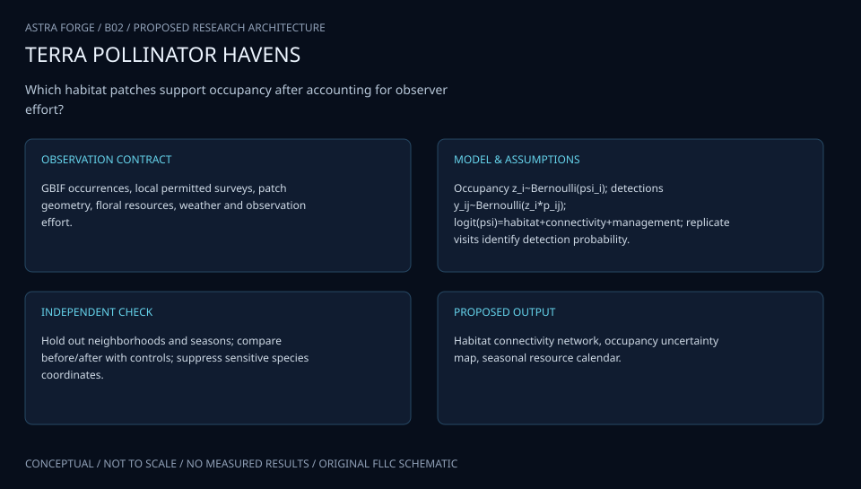

The system joins detection-aware habitat use, seasonal resources and taxon-specific connectivity with maintenance constraints. Its portfolio scores describe proposed habitat performance and cannot establish regional population recovery.

[Editable engineering diagram source](../visuals/projects/B02.mmd)

### 4. Mathematical model and derivation

#### Governing equations

```text
p_ij=exp(−d_ij/λ_s) h_j; d_ij is least-cost distance for taxon s.
```

```text
y_ist∼Bernoulli(ψ_ist p_detect,ist), with separate occupancy and detection models.
```

```text
max_x Σ_s,t W_s ψ_s,t(x) subject to Σ_j c_j x_j≤B and Σ_j q_j x_j≤Q.
```

#### Variables, units and conventions

- d: effective movement distance, m; λ: uncertain dispersal scale, m.
- h_j: calibrated habitat suitability in [0,1], dimensionless; psi: occupancy probability. With lambda>0 and d>=0, p_ij remains in [0,1].
- c: lifecycle cost, USD; q: irrigation demand, L/year.
- B and Q: community-agreed budget and water constraints.

#### Assumptions and boundary conditions

- Observed visits are imperfect detections and do not establish nesting or population growth.
- Connectivity resistance values must be learned or sensitivity-tested, not assigned as fact.
- Native plant suitability, bloom timing and irrigation needs are locally specific.

#### Derivation step 1

```text
y_kt~Bernoulli(z_k p_kt); z_k~Bernoulli(psi_k).
```

Repeated visits reveal detection probability p separately from latent occupancy psi, under the declared within-season closure approximation.

#### Derivation step 2

```text
w_ij,s=exp(-d_ij,s/lambda_s) h_j.
```

d and lambda both use metres, and 0<=h<=1 gives bounded edge weights. Resistance scale changes are indistinguishable from lambda unless anchored by movement evidence.

#### Derivation step 3

```text
R_s,w(x)=sum_j x_j a_j sum_k n_jk b_kw r_ks.
```

x selects patches, a is area, n is planting density, b is bloom probability and r is taxon-specific resource per plant; their units yield resources/week.

#### Derivation step 4

```text
max_x min_theta sum_s,w W_s psi_sw(x,theta), subject to c^T x<=B; q^T x<=Q.
```

The robust objective evaluates uncertain graph and flowering parameters. Taxon weights are declared values, not estimated biological constants.

#### Inference or simulation procedure

Begin with paired existing sites and repeat standardized, nonlethal observations. Stratify by neighborhood heat, imperviousness and surrounding vegetation. Fit detection-corrected occupancy and visitation models, construct taxon-specific connectivity graphs, then compare candidate planting portfolios through robust multiobjective optimization. Use before/after control-impact evaluation for any future installation and include neighborhood access and maintenance feasibility as explicit constraints.

#### Validity domain and fidelity limits

Urban areas can support some bees while disadvantaging other insects. A short pilot detects habitat use, not long-term regional population recovery; unmeasured pesticide exposure remains a possible confounder.

### 5. Data specifications and provenance

| Field | Type | Unit | Physical / statistical meaning | Quality and missing-data rule |
| --- | --- | --- | --- | --- |
| patch_id | string | none | Candidate or surveyed habitat patch. | Persistent boundary version required. |
| visit_effort | float | min | Standardized observation duration. | Zero effort invalid for absence inference. |
| detection_history | bool[] | none | Taxon observations across repeat visits. | Missing visits stored as null. |
| effective_distance | float | m | Taxon-specific least-cost graph separation. | Nonnegative; resistance version required. |
| weekly_bloom | float[] | probability | Species flowering ensemble. | Preserve species/site covariance. |
| annual_water | float | L/year | Maintenance scenario demand. | Identify measured versus assumed demand. |
| portfolio_score | float[] | none | Occupancy/resource ensemble by taxon. | Publish distribution with constraint failures. |

[Machine-readable record schema](../data/contracts/B02.schema.json) · [Empty acquisition CSV](../data/contracts/B02.csv) · [Field dictionary CSV](../data/contracts/B02.dictionary.csv)

The CSV above contains column headers only. Its schema defines future records and does not establish that original-team data or a particular archive product have been acquired. Frame, timing, calibration, covariance, selection and provenance details must accompany populated records.

#### Urban areas as hotspots for bees and pollination but not a panacea for all insects

[Product, archive or reference](https://www.nature.com/articles/s41467-020-14496-6)

**Fields:** Urbanization gradients, pollinator taxa and primary study methods.

**Access:** Open research paper; original observations depend on its data statement.

**Role:** Prior design and taxon-specific hypotheses.

#### USA National Phenology Network observational data

[Product, archive or reference](https://nn.usanpn.org/data/observational)

**Fields:** Flowering phenophases and dated observations for candidate plants.

**Access:** Public observational downloads; species/site coverage is uneven.

**Role:** Seasonal resource coverage; supplement with local plant surveys.

### 6. Uncertainty, sensitivity and identifiability

Detection changes with wind, heat, observer skill and floral density, while occupancy may violate closure through transient visitors. Refit with effort/weather covariates, compare occupancy to visitation endpoints and investigate poorly identified detection probabilities. A patch with abundant flowers may improve observation probability without improving nesting persistence.

Dispersal length, resistance contrast and habitat suitability can compensate for each other in the graph. Sweep plausible scales, inspect rank reversals and evaluate held-out neighborhoods. Correlated drought affects multiple species and irrigation demand simultaneously, so portfolio simulations retain shared weather draws. Report stable selections and alternatives that change under community weight choices.

### 7. Engineering trade study

| Alternative | Benefit | Cost / limitation | Decision rule |
| --- | --- | --- | --- |
| Largest individual patches | Straightforward maintenance and area accounting. | May leave geographic and seasonal gaps. | Use as an equal-budget baseline. |
| Taxon-specific stepping stones | Targets connectivity and complementary blooms. | Sensitive to uncertain dispersal resistance. | Choose when rankings survive scale sweeps. |
| Uniform neighborhood allocation | Improves equitable access and spread. | May reduce predicted ecological score. | Use when agreed distribution constraints require it. |

### 8. Verification and validation cases

| Case ID | Stimulus / condition | Expected result / criterion | Method | Evidence artifact |
| --- | --- | --- | --- | --- |
| B02-V1 | Graph limits | Recover both limits with no negative edges. | Condition/fixture: As d=0, w=h; as d tends to infinity, w tends to zero. Verification procedure: Analytic distance sweep.. | Analytic distance sweep. |
| B02-V2 | Known nondetection | All-zero history probability equals 0.125. | Condition/fixture: Synthetic psi=1 and p=0.5 over three visits. Verification procedure: Exact likelihood comparison.. | Exact likelihood comparison. |
| B02-V3 | Budget boundary | Only portfolios with summed cost at most 100 are feasible. | Condition/fixture: Synthetic costs 40,60,80 USD with B=100. Verification procedure: Exhaustive small-graph enumeration.. | Exhaustive small-graph enumeration. |
| B02-V4 | Neighborhood holdout | Report calibration and rank stability separately by taxon. | Condition/fixture: Reserve complete neighborhoods and survey seasons. Verification procedure: Spatial-temporal holdout evaluation.. | Spatial-temporal holdout evaluation. |

**Execution status:** these cases are specified, not claimed as executed. Close a case only with the versioned inputs, output, uncertainty, reviewer and pass/fail rationale.

#### Additional scientific validation gates

- Hold out entire neighborhoods and years; keep repeat visits from a site within the same split.
- Estimate observer agreement, detection probability and identification uncertainty.
- Report occupancy, bloom-gap days, water use and maintenance cost with bootstrap intervals and a no-intervention comparator.

### 9. Implementation and reproducible work packages

1. Define taxon groups, patch boundaries and a community-approved objective/constraint register.
2. Create repeat-survey and phenology schemas with explicit effort and missing visits.
3. Implement occupancy fitting and posterior checks before constructing connectivity graphs.
4. Build resistance ensembles and weekly resource matrices with shared weather scenarios.
5. Compare equal-budget baselines and independently verify every optimized portfolio.
6. Publish taxon-specific tradeoffs, maintenance inventories and restricted-data export rules.

#### Investigation sequence

1. Stage 1: map existing patches, recruit stewards, define taxa and survey effort, and preregister occupancy and resource-continuity endpoints.
2. Stage 2: fit baseline ecological networks and produce equal-area, equal-budget planting alternatives with drought sensitivity.
3. Stage 3: evaluate phased installations against matched controls across at least two flowering seasons; update the portfolio using observed maintenance costs.

#### Resources and interfaces to expertise

- Local restoration botanist, entomologist and community stewards.
- QGIS, network optimization and accessible observation forms; photographs for identification review.

### 10. Failure modes and interpretation controls

| Failure mode | Effect on result | Detection / evidence | Design response |
| --- | --- | --- | --- |
| Visit counts treated as abundance | False recovery claim. | Mismatch between encounter and demographic endpoints. | Label endpoints and fit detection. |
| Water estimates omit establishment | Infeasible planting portfolio. | Audit first-year versus mature demand. | Include lifecycle scenarios. |
| Resistance map dominates outcome | Arbitrary corridor recommendations. | Large ranking changes across scales. | Publish robust alternatives and data priorities. |

- Unreliable maintenance or irrigation during extreme heat.
- Taxonomic misidentification and volunteer sampling imbalance.
- Unequal neighborhood access and displacement of existing habitat.

### 11. Required engineering outputs

- Habitat-network map and seasonal flowering calendar.
- Budget/water Pareto frontier and implementation shortlist.
- Detection-corrected monitoring dataset and public stewardship guide.

#### Scientific result figures to produce during execution

Show candidate life rafts as nodes sized by resources, connecting uncertain movement pathways; accompany with weekly bloom coverage and costs.

### 12. Cited technical and scientific resources

- [Urban areas as hotspots for bees and pollination but not a panacea for all insects](https://www.nature.com/articles/s41467-020-14496-6) — Primary urban ecology study motivates taxon-specific assessment of urban habitat value.
- [USA National Phenology Network observational data](https://nn.usanpn.org/data/observational) — Observed plant and animal phenophases and observation documentation; provides timing records, not automatic pollinator abundance estimates.

Framework and evidence rules: [engineering documentation standard](../docs/ENGINEERING_STANDARD.md), [model assurance](../docs/MODEL_ASSURANCE.md), [uncertainty procedure](../docs/UNCERTAINTY_AND_DECISION_RULES.md), and [data management](../docs/DATA_MANAGEMENT.md). NASA-inspired names are creative identifiers; requirements and results are not NASA certification.

---

<a id="b03"></a>

## B03 · ORION CROSSINGS — Gila Monster Road Ecology

**Original project:** Potential Road Impacts on Gila Monsters in an Urbanizing Environment

**Session B:** Earth & Environmental Engineering

**Document class:** engineering research design and analysis record · **Revision:** 2 · **Date:** 2026-10-02

**Evidence state:** design basis, mathematical formulation and verification plan documented. Project-specific empirical results remain to be acquired; executable shared model demonstrations have their own recorded checks.

[Engineering document register](../ENGINEERING_DOCUMENTATION.md) · [Session B handbook](../documentation/SESSION_B.md) · [Previous: B02](../projects/B/B02.md) · [Next: B04](../projects/B/B04.md)

### Purpose and scientific objective

Develop a conservation decision model that separates road avoidance, crossing opportunity and mortality exposure for Gila monsters. Combine permitted telemetry with road geometry, traffic and habitat change to rank evidence-supported crossing or traffic interventions. Preserve sensitive locations through restricted raw-data access and publish only spatially aggregated conservation products.

**Question:** Do roads alter step choice and survival after habitat availability, sex, season and observation effort are accounted for?

**Testable hypothesis:** Traffic intensity and refuge availability will explain road-associated movement better than road presence alone; apparent avoidance may partly reflect lost individuals or uneven tracking effort.

### 1. Design basis and analysis boundary

The conservation model consumes authorized Gila monster telemetry, individual fate records, dated road geometry, traffic and habitat covariates. It separates three questions: whether an animal approaches a road, whether a crossing is plausible at the available fix cadence, and whether road exposure predicts mortality. Intervention rankings remain conditional estimates, because a track from a surviving individual is not a randomized road-mitigation experiment.

Start with location-error-aware road encounters and descriptive movement summaries. Promote to integrated step selection and interval-censored survival only when sample size and fate resolution permit. Literature supplies the Sonoran Desert study context; traffic-reduction and crossing scenarios are proposed decisions with uncertain benefit. Precise refuges and tracks remain restricted, while public outputs use approved aggregation.

### 2. Requirements and verification traceability

These are project design requirements or proposed analysis gates. A numerical target is not a NASA requirement unless its controlling source is explicitly identified. “TBD” identifies evidence required before a decision; it is not permission to assume a value. Verification evidence listed here is planned, unless a linked result explicitly records execution.

| ID | Requirement / gate | Engineering rationale | Verification method | Basis / required evidence |
| --- | --- | --- | --- | --- |
| B03-R1 | Every fix shall retain timestamp, coordinate reference, location uncertainty and transmitter status. | Straight lines between uncertain fixes can invent crossings. | Check metadata and reconstruct uncertainty buffers. | Authorized telemetry contract. |
| B03-R2 | Classify crossing evidence as observed, plausible or unresolved; no unresolved interval shall count as a confirmed crossing. | Avoid false precision from sparse cadence. | Review trajectory-road intersections across error draws. | Proposed evidence classes. |
| B03-R3 | Movement validation shall hold out complete individuals; mortality evaluation shall preserve interval censoring. | Repeated fixes are not independent animals. | Audit split and likelihood construction. | Proposed inference protocol. |
| B03-R4 | Exported maps shall omit precise refuges and individual identifiers and obey investigator-approved spatial suppression. | Protect vulnerable wildlife and private sites. | Inspect generated release layers. | Access agreement required. |

### 3. Architecture and controlled interfaces

The telemetry adapter produces individual-keyed positions in projected metres and times in UTC, with 2x2 horizontal covariance. Road segments carry installation dates, width and traffic units vehicles/day. A temporal join prevents modern roads from being assigned to older animal movements. Fate records distinguish confirmed death, last detection, lost transmitter and study end.

The encounter module generates location and path ensembles before labeling road proximity. Matched available steps come from an individual's movement distribution and form conditional choice strata; survival consumes exposure aggregated over documented intervals. The scenario engine modifies traffic or crossing opportunity without changing the underlying landscape arbitrarily. Missing transmitters propagate censoring rather than mortality, and the release layer applies governed spatial aggregation.


The diagram preserves movement, exposure and survival as separate evidence paths and shows where restricted tracks enter the analysis. It does not turn uncertain telemetry intersections into confirmed road crossings.

[Editable engineering diagram source](../visuals/projects/B03.mmd)

### 4. Mathematical model and derivation

#### Governing equations

```text
P(step k chosen)=exp(βᵀ X_k)/Σ_j exp(βᵀ X_j).
```

```text
H_i(t)=H_0(t) exp(γᵀ Z_i(t)), with time-varying exposure and interval-censored survival.
```

```text
Expected benefit_j=Σ_i P(encounter_ij) ΔP(survival_ij)−uncertainty penalty_j.
```

#### Variables, units and conventions

- X: distance to roads/refuges, m, and traffic covariates, vehicles/day.
- Z: individual traits, weather and recent crossing exposure.
- H: mortality hazard, day⁻¹; crossing probabilities are dimensionless.
- Benefit: expected avoided losses over a stated time horizon.

#### Assumptions and boundary conditions

- Telemetry fixes have location error and gaps; a straight line between fixes need not be a true crossing.
- Dead, missing and transmitter-failed outcomes must remain distinct.
- Field access and handling require the appropriate wildlife approvals and trained personnel.

#### Derivation step 1

```text
L_k=norm(s_(k+1)-s_k); theta_k=angle(v_(k-1),v_k).
```

Length uses metres and turning angle radians. Their availability distributions must account for cadence and uncertainty before sampling alternative steps.

#### Derivation step 2

```text
P(k chosen)=exp(beta^T X_k)/sum_j exp(beta^T X_j).
```

Matched steps within one stratum share a starting fix; road distance scaling fixes coefficient units and prevents comparison of unmatched movements.

#### Derivation step 3

```text
S(t)=exp(-integral_0^t h_0(u)exp(gamma^T Z(u))du).
```

Hazard has day^-1 units; an interval-censored death contributes S(t_left)-S(t_right), while transmitter failure contributes a distinct censoring process.

#### Derivation step 4

```text
B_j=sum_i P(encounter_ij)[S_i,j(T)-S_i,base(T)].
```

Benefit is expected avoided losses over horizon T. It is a scenario contrast with propagated exposure and hazard uncertainty, not a measured mitigation effect.

#### Inference or simulation procedure

Map changes in road network and vegetation, then use integrated step-selection models with matched available steps generated from each animal’s movement distribution. Jointly model detection and censoring where possible; use proximity to roads, traffic seasonality and refuge cover rather than a single urban/rural label. Rank mitigation alternatives through scenario analysis and explicitly display when the available data cannot distinguish attraction, avoidance or increased mortality.

#### Validity domain and fidelity limits

Rare-species samples can have wide confidence intervals. Roads correlate with development and habitat loss, while observed survivors may underrepresent vulnerable animals; predictive association alone cannot establish intervention benefit.

### 5. Data specifications and provenance

| Field | Type | Unit | Physical / statistical meaning | Quality and missing-data rule |
| --- | --- | --- | --- | --- |
| animal_key | restricted string | none | Pseudonymous individual identity. | Never exported with precise tracks. |
| fix_time | datetime | UTC | Observation timestamp. | Sorted; cadence gaps explicit. |
| position_xy | float[2] | m | Projected telemetry coordinate. | CRS and covariance required. |
| road_version | string | none | Geometry and effective-date key. | No future road assigned. |
| traffic_rate | nullable float | vehicles/day | Observed or scenario traffic. | Separate measurements from assumptions. |
| fate_interval | nullable datetime[2] | UTC | Bounds of confirmed event or censoring. | Death and transmitter loss distinct. |
| avoided_loss | float[] | animals | Intervention benefit ensemble. | Include zero/negative outcomes and horizon. |

[Machine-readable record schema](../data/contracts/B03.schema.json) · [Empty acquisition CSV](../data/contracts/B03.csv) · [Field dictionary CSV](../data/contracts/B03.dictionary.csv)

The CSV above contains column headers only. Its schema defines future records and does not establish that original-team data or a particular archive product have been acquired. Frame, timing, calibration, covariance, selection and provenance details must accompany populated records.

#### Does urbanization influence the spatial ecology of Gila monsters in the Sonoran Desert?

[Product, archive or reference](https://pubs.usgs.gov/publication/70032684)

**Fields:** Primary study movement/home-range metrics and urban context.

**Access:** USGS publication record; raw telemetry is not guaranteed public.

**Role:** Literature benchmark and study-design assumptions.

#### NASA Harmonized Landsat Sentinel-2 data

[Product, archive or reference](https://hls.gsfc.nasa.gov/hls-data/)

**Fields:** Surface reflectance, quality flags and vegetation history.

**Access:** Public NASA data; Earthdata access may be required.

**Role:** Habitat-change covariates, supplemented by local road/traffic records.

### 6. Uncertainty, sensitivity and identifiability

Location error, long intervals and unknown tortuous paths make crossing counts uncertain. Resample positions from their documented covariance and compare interpolation assumptions; reject inferred routes that depend entirely on one arbitrary path. Traffic and development are correlated, so road coefficients cannot automatically be interpreted as causal mortality effects.

Road avoidance, low encounter frequency and selective disappearance can produce similar observed tracks. Profile road-distance and traffic effects, use animal-level bootstrap intervals and evaluate sensitivity to informative censoring. If deaths are too rare, retain descriptive exposure and a wide scenario benefit range rather than fit an unstable survival model. Conservation priorities should expose this limitation.

### 7. Engineering trade study

| Alternative | Benefit | Cost / limitation | Decision rule |
| --- | --- | --- | --- |
| Encounter-only mapping | Works with sparse movement and no death records. | Cannot estimate mortality benefit. | Use when fate evidence is inadequate. |
| Joint step and survival models | Connects behavior with exposure and outcomes. | Rare events and censoring weaken identification. | Adopt when independent fate data support it. |
| Traffic/crossing scenario screening | Compares practical mitigations. | Effectiveness inputs may be literature assumptions. | Rank only outcomes stable across effectiveness ranges. |

### 8. Verification and validation cases

| Case ID | Stimulus / condition | Expected result / criterion | Method | Evidence artifact |
| --- | --- | --- | --- | --- |
| B03-V1 | Symmetric choices | Each probability is 0.5. | Condition/fixture: Two available steps have equal covariates. Verification procedure: Exact conditional-likelihood check.. | Exact conditional-likelihood check. |
| B03-V2 | Zero hazard | S(T)=1 and no modeled road-attributable loss. | Condition/fixture: Set h_0=0 for a synthetic individual. Verification procedure: Analytic survival fixture.. | Analytic survival fixture. |
| B03-V3 | Uncertain road intersection | Output plausible/unresolved probability; never a guaranteed crossing. | Condition/fixture: Two fixes straddle a road with broad covariance. Verification procedure: Monte Carlo path integration.. | Monte Carlo path integration. |
| B03-V4 | Animal holdout | Report step calibration and fate predictions without shared-individual leakage. | Condition/fixture: Reserve all fixes from selected individuals. Verification procedure: Blocked evaluation.. | Blocked evaluation. |

**Execution status:** these cases are specified, not claimed as executed. Close a case only with the versioned inputs, output, uncertainty, reviewer and pass/fail rationale.

#### Additional scientific validation gates

- Hold out animals and geographic areas; do not split neighboring fixes randomly.
- Validate inferred crossings against sufficiently resolved fixes or independently permitted field observations.
- Use simulations to measure bias from missing fixes and transmitter failure; report confidence intervals and failed identification cases.

### 9. Implementation and reproducible work packages

1. Create a restricted-data manifest and approved public aggregation specification.
2. Implement temporal GIS joins, coordinate checks and location-error propagation.
3. Produce encounter probability layers with observed/plausible/unresolved evidence classes.
4. Build matched-step datasets and individual-level validation splits.
5. Fit survival only after fate and event-count adequacy review.
6. Release scenario benefit distributions, limitations and an independently checked mitigation ledger.

#### Investigation sequence

1. Stage 1: secure authorized telemetry access, inventory road/traffic histories, and assess whether the number of independently observed animals supports the intended effect size.
2. Stage 2: fit movement and survival models with explicit location and censoring uncertainty; compare simple road-presence and traffic-aware hypotheses.
3. Stage 3: produce confidential mitigation scenarios and test prospective before/after crossing observations at selected locations.

#### Resources and interfaces to expertise

- Wildlife biologist, GIS analyst and transportation partner.
- Restricted telemetry repository; movement-model software and local traffic counts.

### 10. Failure modes and interpretation controls

| Failure mode | Effect on result | Detection / evidence | Design response |
| --- | --- | --- | --- |
| Lost transmitter coded dead | Inflated road hazard. | Compare fate evidence with field notes. | Use separate censoring status. |
| Modern roads joined retrospectively | False development exposure. | Check road effective dates. | Versioned temporal GIS joins. |
| Sensitive map release | Wildlife disturbance risk. | Export audit against restricted fields. | Aggregate and suppress locations. |

- Protected-species disturbance or exposure of precise refuge locations.
- Small sample size and unrecorded road mortality.
- Mitigation effects inferred outside the observed traffic range.

### 11. Required engineering outputs

- Road-risk and refuge-connectivity models.
- Aggregated mitigation priority map with uncertainty.
- Data-governance plan and monitoring design.

#### Scientific result figures to produce during execution

Publish generalized habitat corridors and risk intervals; keep individual paths and refuge coordinates in access-controlled layers.

### 12. Cited technical and scientific resources

- [Does urbanization influence the spatial ecology of Gila monsters in the Sonoran Desert?](https://pubs.usgs.gov/publication/70032684) — Primary telemetry study supports movement and urbanization questions without proving a universal road mortality effect.
- [NASA Harmonized Landsat Sentinel-2 data](https://hls.gsfc.nasa.gov/hls-data/) — Surface reflectance and quality layers support reproducible landscape and vegetation monitoring.

Framework and evidence rules: [engineering documentation standard](../docs/ENGINEERING_STANDARD.md), [model assurance](../docs/MODEL_ASSURANCE.md), [uncertainty procedure](../docs/UNCERTAINTY_AND_DECISION_RULES.md), and [data management](../docs/DATA_MANAGEMENT.md). NASA-inspired names are creative identifiers; requirements and results are not NASA certification.

---

<a id="b04"></a>

## B04 · AURORA VEIL — Ionospheric Absorption Atlas

**Original project:** Analysis of Space-based Riometer Measurement Data for Characterization of Radio Propagation Disturbance in the Ionosphere

**Session B:** Earth & Environmental Engineering

**Document class:** engineering research design and analysis record · **Revision:** 2 · **Date:** 2026-10-02

**Evidence state:** design basis, mathematical formulation and verification plan documented. Project-specific empirical results remain to be acquired; executable shared model demonstrations have their own recorded checks.

[Engineering document register](../ENGINEERING_DOCUMENTATION.md) · [Session B handbook](../documentation/SESSION_B.md) · [Previous: B03](../projects/B/B03.md) · [Next: B05](../projects/B/B05.md)

### Purpose and scientific objective

Create a calibrated radio-absorption analysis pipeline linking cosmic-noise measurements to solar and particle events. First audit whether the named measurements come from ground riometers or an actual spacecraft receiver: the historical project describes Ottawa deployments despite its space-based title. Instrument geometry determines the path integral and which communication links can be inferred.

**Question:** How accurately can cleaned riometer observations characterize absorption events and improve event-scale propagation estimates beyond archived model predictions?

**Testable hypothesis:** A stable quiet-day baseline plus interference rejection will improve absorption-event agreement; residual differences will depend on latitude, illumination, antenna pattern and the frequency/path being compared.

### 1. Design basis and analysis boundary

The instrument audit is the first engineering gate. Despite the original space-based title, the historical project context identifies Ottawa ground deployments; a spacecraft receiver is a separate conditional case requiring its own antenna, orbit and calibration metadata. The baseline system therefore estimates cosmic-noise absorption along verified ground-riometer viewing paths and compares event timing with NOAA model products.

Begin with receiver-power and sidereal quiet-day reconstruction, then interference-resistant event estimates, and only then geometry-aware propagation comparisons. The source paper documents ground riometry and baseline limitations; proposed link-frequency extrapolation is restricted to a declared collision-frequency regime. D-RAP remains a modeled comparator. Neither a ground path integral nor a modeled map demonstrates attenuation on a particular spacecraft communication link.

### 2. Requirements and verification traceability

These are project design requirements or proposed analysis gates. A numerical target is not a NASA requirement unless its controlling source is explicitly identified. “TBD” identifies evidence required before a decision; it is not permission to assume a value. Verification evidence listed here is planned, unless a linked result explicitly records execution.

| ID | Requirement / gate | Engineering rationale | Verification method | Basis / required evidence |
| --- | --- | --- | --- | --- |
| B04-R1 | Every series shall have verified platform, receiver frequency, antenna footprint, gain history and clock convention before absorption is published. | Geometry determines the observable. | Metadata gate with unresolved-platform state. | Instrument provenance requirement. |
| B04-R2 | Quiet-day power shall be positive and sidereal-time indexed; disturbed intervals and gain transitions shall be excluded by a recorded rule. | A calendar-time average biases cosmic-noise baseline. | Inspect baseline residuals by sidereal phase. | Riometer processing source. |
| B04-R3 | Absorption output shall preserve RFI, saturation and baseline uncertainty flags at original cadence. | Power contamination otherwise becomes physical absorption. | Synthetic interference and clipping tests. | Proposed quality contract. |
| B04-R4 | Any link attenuation extrapolation shall state path, frequency ratio and validity domain and remain separate from measured absorption. | f^-2 scaling is conditional. | Review model assumptions and compare regime limits. | Existing collisional model. |

### 3. Architecture and controlled interfaces

A receiver adapter preserves raw relative power or watts, frequency Hz, UTC time and gain calibration version. A geometry record defines ground antenna azimuth/elevation weighting; an actual spacecraft branch additionally requires ephemeris, attitude and antenna pattern. The clock adapter computes sidereal phase for the verified site, with solar-day meteorological covariates retained separately.

The baseline estimator emits quiet-day power and covariance; the absorption engine emits dB plus masking reasons. An event matcher aligns independent solar/particle records and D-RAP predictions without treating them as observations. A path integrator accepts electron-density and collision-rate profiles only with stated provenance. Missing geometry stops communication-link inference while leaving qualified instrument-level absorption usable.

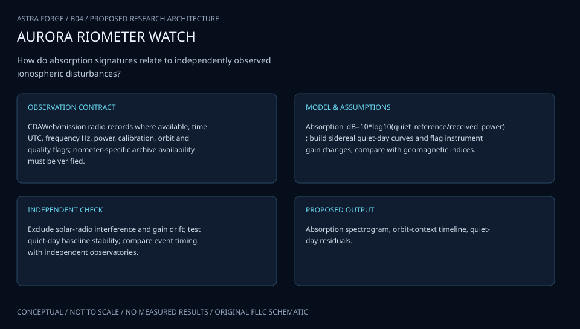

The architecture makes instrument power, platform geometry and modeled event comparisons explicit. The spacecraft branch is conditional on verified metadata, and no ground measurement is automatically interpreted as spacecraft-link attenuation.

[Editable engineering diagram source](../visuals/projects/B04.mmd)

### 4. Mathematical model and derivation

#### Governing equations

```text
A(f,t)=10 log10[P_quiet(f,t)/P_observed(f,t)], in dB.
```

```text
α(f,s)∝n_e(s) ν_en(s)/[ν_en(s)²+(2πf)²]; A∝∫path α ds.
```

```text
A_link=A_ref(f_ref/f_link)² is only a first approximation in the appropriate high-frequency collision regime.
```

#### Variables, units and conventions

- P: calibrated receiver power, W or consistent relative units.
- n_e: electron density, m⁻³; ν_en: collision frequency, s⁻¹.
- f: frequency, Hz; s: propagation-path length, m.
- A: absorption, dB; quiet-day baseline is sidereal-time dependent.

#### Assumptions and boundary conditions

- No spacecraft-origin claim until platform and calibration metadata are verified.
- Quiet-day selection excludes disturbed conditions and changing receiver gain.
- Frequency extrapolation excludes refraction, multipath and geometry unless explicitly modeled.

#### Derivation step 1

```text
P_obs=P_quiet exp(-tau); A=10 log10(P_quiet/P_obs)=10 tau/ln(10).
```

tau is dimensionless power optical depth; this convention avoids mixing field-amplitude attenuation with power attenuation.

#### Derivation step 2

```text
sigma_A^2=(10/ln(10))^2[var(P_q)/P_q^2+var(P_o)/P_o^2-2cov(P_q,P_o)/(P_q P_o)].
```

Shared receiver gain can cancel in ratios only when its covariance and temporal stability are justified.

#### Derivation step 3

```text
alpha=C n_e nu/[nu^2+(2pi f)^2]; tau=integral alpha ds.
```

C contains the specified plasma constants and power-attenuation convention. alpha has m^-1 units, and the viewing path must match the platform.

#### Derivation step 4

```text
A_link/A_ref approximately (f_ref/f_link)^2.
```

This follows when 2pi f is much larger than collision frequency and path weighting is unchanged; refraction and different link paths invalidate direct transfer.

#### Inference or simulation procedure

Reconstruct receiver gain history and sidereal baselines using clean intervals; flag narrowband interference and saturation before calculating absorption. Align events with NOAA solar/particle records, then compare observed event peaks, durations and timing with D-RAP. Fit a constrained event model and evaluate latitude/daylight interactions. Forward-model antenna and ray-path weighting for any spacecraft case rather than copying ground-riometer assumptions.

#### Validity domain and fidelity limits

D-RAP is a modeled benchmark and cannot substitute for measured link attenuation. Ground absorption integrates a different path from many spacecraft or aircraft links, and a sparse network cannot guarantee regional transfer.

### 5. Data specifications and provenance

| Field | Type | Unit | Physical / statistical meaning | Quality and missing-data rule |
| --- | --- | --- | --- | --- |
| platform | enum | none | ground, spacecraft or unresolved. | No spacecraft claim from title. |
| power_raw | nullable float | W or relative | Measured receiver power. | Positive; retain saturation/RFI flags. |
| frequency | float | Hz | Verified receiver channel. | Positive; bandwidth recorded. |
| sidereal_phase | float | rad | Site-relative cosmic-noise phase. | Derived from site and UTC convention. |
| quiet_power | float | same as power | Estimated undisturbed baseline. | Covariance and excluded days retained. |
| path_geometry | structured record | m rad | Antenna/ray weighting definition. | Null blocks link inference. |
| absorption | nullable float | dB | Power-ratio absorption estimate. | Carry baseline covariance and quality mask. |

[Machine-readable record schema](../data/contracts/B04.schema.json) · [Empty acquisition CSV](../data/contracts/B04.csv) · [Field dictionary CSV](../data/contracts/B04.dictionary.csv)

The CSV above contains column headers only. Its schema defines future records and does not establish that original-team data or a particular archive product have been acquired. Frame, timing, calibration, covariance, selection and provenance details must accompany populated records.

#### Spectral characteristics of high-latitude raw 40 MHz cosmic noise signals

[Product, archive or reference](https://npg.copernicus.org/articles/23/215/2016/npg-23-215-2016.html)

**Fields:** Cosmic-noise time series, baseline methods and interference examples.

**Access:** Open primary paper; raw signals require its repository/data statement.

**Role:** Measurement processing benchmark.

#### NOAA D-Region Absorption Prediction model archive

[Product, archive or reference](https://www.ncei.noaa.gov/products/space-weather/ionospheric-program/d-region-absorption-prediction)

**Fields:** Time-stamped global absorption predictions and archive metadata.

**Access:** Public NOAA archive; check file coverage and model-version changes.

**Role:** Event comparator; add independent riometer records if accessible.

### 6. Uncertainty, sensitivity and identifiability

Quiet-day selection, receiver drift and interference dominate some events; their errors are temporally correlated. Fit alternate clean-day windows, compare sidereal residuals and retain an event-level baseline covariance. Negative absorption is a diagnostic outcome, not automatically clipped, because excess sky noise or baseline error may explain it.

An integrated measurement generally cannot identify a unique electron-density profile. Density and collision-frequency perturbations can compensate, and antenna averaging mixes rays. Examine profile ensembles and sensitivity kernels rather than report a recovered altitude profile without independent constraints. Spacecraft and ground configurations must have separate forward models; agreement with D-RAP only supports comparator consistency.

### 7. Engineering trade study

| Alternative | Benefit | Cost / limitation | Decision rule |
| --- | --- | --- | --- |
| Empirical quiet-day ratio | Directly connected to instrument power. | Sensitive to gain and clean-day selection. | Default for verified ground data. |
| Collisional path model | Explains frequency and altitude weighting. | Needs density/collision profiles and geometry. | Use for conditional sensitivity analysis. |
| D-RAP event comparison | Provides broad event context. | Prediction is not independent attenuation truth. | Use for timing/regime comparison only. |

### 8. Verification and validation cases

| Case ID | Stimulus / condition | Expected result / criterion | Method | Evidence artifact |
| --- | --- | --- | --- | --- |
| B04-V1 | No attenuation | A=0 dB. | Condition/fixture: P_obs=P_quiet with common units. Verification procedure: Exact ratio fixture.. | Exact ratio fixture. |
| B04-V2 | Known power ratio | A=10 dB; 100 gives 20 dB. | Condition/fixture: P_quiet/P_obs=10. Verification procedure: Analytic conversion check.. | Analytic conversion check. |
| B04-V3 | High-frequency limit | Modeled absorption approaches one quarter. | Condition/fixture: Double f with identical path and nu much smaller than 2pi f. Verification procedure: Dimensionless regime sweep.. | Dimensionless regime sweep. |
| B04-V4 | Missing spacecraft metadata | Spacecraft/link product is blocked, ground product remains labeled ground. | Condition/fixture: Input lacks orbit or antenna weighting. Verification procedure: Integration gate test.. | Integration gate test. |

**Execution status:** these cases are specified, not claimed as executed. Close a case only with the versioned inputs, output, uncertainty, reviewer and pass/fail rationale.

#### Additional scientific validation gates

- Hold out complete events and quiet-day seasons; quantify false alarms as well as event recall.
- Inject simulated gain drift and interference into clean signals and measure recovery bias.
- Compare timing, peak dB and event-integrated absorption with uncertainty propagated from baseline choice.

### 9. Implementation and reproducible work packages

1. Create a platform/frequency/antenna/gain inventory with unresolved metadata entries.
2. Implement UTC-to-sidereal conversion and receiver calibration checks.
3. Construct clean-day ensembles and save baseline covariance artifacts.
4. Compute flagged power-ratio absorption before joining event comparators.
5. Implement conditional path/frequency sensitivity notebooks with explicit validity masks.
6. Publish instrument-level events and a geometry-limited interpretation report.

#### Investigation sequence

1. Stage 1: verify platform, antenna, frequency, calibration and time standard; publish a metadata decision tree resolving the historical geometry ambiguity.
2. Stage 2: implement quality-controlled sidereal baselines, event extraction and physically bounded frequency/path extrapolation.
3. Stage 3: score withheld solar events and deployment sites; publish a propagation atlas with an explicit applicability envelope.

#### Resources and interfaces to expertise

- Space-weather scientist, radio engineer and receiver calibration records.
- Spectral analysis tools and UTC/sidereal time conversion; independent link logs where available.

### 10. Failure modes and interpretation controls

| Failure mode | Effect on result | Detection / evidence | Design response |
| --- | --- | --- | --- |
| Solar-time baseline | Spurious repeating absorption. | Residual drift across sidereal phases. | Use sidereal baseline adapter. |
| RFI treated as absorption | Biased event magnitude. | Spectral/temporal outlier flags. | Mask and preserve contaminated records. |
| Ground geometry relabeled space | Unsupported communication claims. | Platform audit failure. | Separate model branches and halt extrapolation. |

- Mislabeling ground observations as spacecraft measurements.
- Radio interference masquerading as absorption.
- Unsupported transfer from one frequency or latitude to another.

### 11. Required engineering outputs

- Instrument provenance report and reusable cleaning pipeline.
- Absorption-event catalog and model-comparison notebook.
- Communication-relevance atlas with path limitations.

#### Scientific result figures to produce during execution

Display raw/clean receiver power, quiet-day baseline, absorption and D-RAP event comparisons; annotate instrument location and path geometry.

### 12. Cited technical and scientific resources

- [Spectral characteristics of high-latitude raw 40 MHz cosmic noise signals](https://npg.copernicus.org/articles/23/215/2016/npg-23-215-2016.html) — Primary analysis establishes quiet-day baseline, interference and signal-processing considerations for riometry.
- [NOAA D-Region Absorption Prediction model archive](https://www.ncei.noaa.gov/products/space-weather/ionospheric-program/d-region-absorption-prediction) — Archived model predictions provide a comparator for radio absorption; predictions are not independent absorption observations.
- [2021 Arizona NASA Space Grant symposium booklet](https://spacegrant.arizona.edu/sites/spacegrant.arizona.edu/files/AZSGC%20Symposium%20Booklet%202021_website.pdf) — Original-title provenance only; historical abstracts are not new measurements or evidence of project completion.

Framework and evidence rules: [engineering documentation standard](../docs/ENGINEERING_STANDARD.md), [model assurance](../docs/MODEL_ASSURANCE.md), [uncertainty procedure](../docs/UNCERTAINTY_AND_DECISION_RULES.md), and [data management](../docs/DATA_MANAGEMENT.md). NASA-inspired names are creative identifiers; requirements and results are not NASA certification.

---

<a id="b05"></a>

## B05 · KEPLER BLOOMCLOCK — Restoration Timing Observatory

**Original project:** Phenology Data to Aid Pollinator Restoration

**Session B:** Earth & Environmental Engineering

**Document class:** engineering research design and analysis record · **Revision:** 2 · **Date:** 2026-10-02

**Evidence state:** design basis, mathematical formulation and verification plan documented. Project-specific empirical results remain to be acquired; executable shared model demonstrations have their own recorded checks.

[Engineering document register](../ENGINEERING_DOCUMENTATION.md) · [Session B handbook](../documentation/SESSION_B.md) · [Previous: B04](../projects/B/B04.md) · [Next: B06](../projects/B/B06.md)

### Purpose and scientific objective

Turn dated plant and pollinator observations into a decision tool for maintaining floral resources through heat, drought and seasonal transitions. Estimate flowering windows and uncertainty for locally suitable species, then choose restoration mixtures that minimize resource gaps. Keep observed phenophases, climate-model projections and assumed pollinator demand visibly distinct.

**Question:** Which locally adapted planting mixtures retain the most continuous flowering opportunity under observed variability and plausible warming/drought scenarios?

**Testable hypothesis:** Mixtures optimized for complementary, uncertainty-aware bloom windows will leave fewer resource-gap days than mixtures selected from mean flowering dates alone.

### 1. Design basis and analysis boundary

The restoration timing system converts repeated plant phenophase observations and weather into species-specific flowering-window distributions. It then evaluates planting mixtures against a declared weekly floral-resource demand scenario. Flower presence, floral abundance and pollinator reproduction remain distinct endpoints; only the first is directly supported by many phenology records.

The initial model uses interval-censored onset and duration with calendar and growing-degree-day baselines. Moisture and microclimate effects are added only where their metadata overlap observations. Optimization consumes establishment probability, irrigation and local suitability rather than assuming every planted individual survives. National Phenology Network documentation supports observation semantics; thermal thresholds, demand curves and portfolio targets below are proposed choices requiring local calibration.

### 2. Requirements and verification traceability

These are project design requirements or proposed analysis gates. A numerical target is not a NASA requirement unless its controlling source is explicitly identified. “TBD” identifies evidence required before a decision; it is not permission to assume a value. Verification evidence listed here is planned, unless a linked result explicitly records execution.

| ID | Requirement / gate | Engineering rationale | Verification method | Basis / required evidence |
| --- | --- | --- | --- | --- |
| B05-R1 | Represent onset between the last valid absence and first presence; never replace the interval with an exact observation date. | Sampling cadence limits timing precision. | Inspect reconstructed onset bounds. | NPN observation semantics. |
| B05-R2 | Proposed resource accounting uses weekly bins and separately reports establishment-year and mature planting scenarios. | Annual overlap hides restoration gaps. | Recompute weekly balance from species matrix. | Proposed design resolution. |
| B05-R3 | Species transfer outside observed temperature, moisture or elevation support shall carry an extrapolation flag. | Desert climate relationships may differ. | Compare deployment envelope with training ranges. | Proposed applicability gate. |
| B05-R4 | Each optimized mixture shall satisfy declared water, area and cost bounds across retained uncertainty draws or disclose violation probability. | Planting advice must remain feasible. | Independent portfolio ledger. | Local constraints TBD. |

### 3. Architecture and controlled interfaces

The observation adapter stores species, site, phenophase, visit date, present/absent status and effort; unknown visits are not absences. Weather joins use site-specific timezone and daily aggregation, then emit temperature °C, precipitation mm and source coverage. A thermal-time module records species-specific base temperature and missing-weather policy.

The onset-duration estimator produces correlated species-week bloom probabilities. A resource adapter converts bloom to a locally calibrated resource proxy and multiplies by establishment survival. The mixture optimizer accepts plant counts or area with explicit units, plus water L/year and cost. Its outputs retain probability of shortfall and unmodeled species; bloom timing alone cannot be exported as validated pollinator demand satisfaction.


The diagram connects observation intervals to weekly restoration resources and makes establishment and demand assumptions visible. It establishes timing support, while leaving pollinator demographic benefit to independent evidence.

[Editable engineering diagram source](../visuals/projects/B05.mmd)

### 4. Mathematical model and derivation

#### Governing equations

```text
GDD(t)=Σ_d≤t max[0,T_mean,d−T_base], in °C·day.
```

```text
P(bloom_s,d)=logit⁻¹[a_s+b_s GDD_d+c_s moisture_d+u_site].
```

```text
Gap(x)=Σ_d 1[Σ_s x_s P(bloom_s,d) r_s<D_d], evaluated over posterior/scenario draws.
```

#### Variables, units and conventions

- x: planting area or abundance by species, m² or individuals.
- r: floral-resource proxy, resources per area per day, locally calibrated.
- D: demand proxy in the same resource units; not inferred directly from bloom counts.
- T_base: species-specific thermal threshold, °C; moisture includes precipitation/soil-water proxies.

#### Assumptions and boundary conditions

- Repeated absence observations are informative; opportunistic presence records alone cannot define exact onset.
- Phenophase observations bracket flowering dates and may have observer/site bias.
- Urban irrigation and microclimate can break temperature-only relationships.

#### Derivation step 1

```text
GDD_d=sum_(k<=d) max(0,T_mean,k-T_base) Delta_t.
```

With daily Delta_t=1 day, the accumulation has °C day units; a missing daily temperature is not a zero contribution.

#### Derivation step 2

```text
P(L<T_onset<=R)=F_T(R)-F_T(L).
```

L and R are last-absence and first-presence dates. Left/right censoring is handled explicitly when either boundary is unavailable.

#### Derivation step 3

```text
R_w(x)=sum_s x_s e_s b_sw r_sw.
```

Plant count x, establishment fraction e, bloom probability b and resource/plant/week r yield resource/week; covariance is retained across species under shared weather.

#### Derivation step 4

```text
G(x)=sum_w I[R_w(x)<D_w]; objective=E[G]+lambda Var(G).
```

Demand D has the same resource units. The risk weight is a declared planning preference, and gap count has weeks units.

#### Inference or simulation procedure

Model interval-censored onset and duration from repeated phenophase observations. Add weather, elevation and water availability through hierarchical models; compare growing-degree-day and flexible calendar baselines. Use posterior bloom probabilities in a constrained planting optimization with local suitability, water, cost and establishment limits. Treat demand curves as measured or scenario assumptions; evaluate resource-gap robustness rather than presenting flowering overlap as demonstrated reproductive success.

#### Validity domain and fidelity limits

National datasets may omit desert species or have short local records. Flower presence does not directly measure nectar, pollen quality or successful pollination, and restoration establishment changes realized resources.

### 5. Data specifications and provenance

| Field | Type | Unit | Physical / statistical meaning | Quality and missing-data rule |
| --- | --- | --- | --- | --- |
| phenophase_status | enum | none | present, absent or unknown. | Unknown never treated as absence. |
| onset_bounds | nullable date[2] | calendar day | Observed timing interval. | Store one-sided censoring. |
| daily_temperature | nullable float | °C | Local mean temperature. | Coverage and timezone required. |
| base_temperature | float | °C | Species thermal threshold. | Provenance or scenario tag required. |
| bloom_probability | float[] | none | Weekly flowering ensemble. | Bounds 0–1; joint covariance saved. |
| establishment_fraction | float[] | none | Scenario survival to resource provision. | No default perfect survival. |
| resource_shortfall | float[] | resources/week | Demand minus realized floral proxy. | Demand assumptions linked. |

[Machine-readable record schema](../data/contracts/B05.schema.json) · [Empty acquisition CSV](../data/contracts/B05.csv) · [Field dictionary CSV](../data/contracts/B05.dictionary.csv)

The CSV above contains column headers only. Its schema defines future records and does not establish that original-team data or a particular archive product have been acquired. Frame, timing, calibration, covariance, selection and provenance details must accompany populated records.

#### USA National Phenology Network observational data

[Product, archive or reference](https://nn.usanpn.org/data/observational)

**Fields:** Species, phenophases, observed presence/absence, site and observation dates.

**Access:** Public downloads with documentation; check reuse rules and uneven site effort.

**Role:** Observed timing and interval censoring.

#### USGS managing to survive despite the weather: seeding decisions

[Product, archive or reference](https://www.usgs.gov/publications/managing-survive-despite-weather-seeding-decisions-affecting-simulated-dryland)

**Fields:** Weather-window and seedling-survival modeling framework.

**Access:** USGS publication; obtain author data/code where available.

**Role:** Establishment-aware scenario design, not new pollinator measurements.

### 6. Uncertainty, sensitivity and identifiability

Observer cadence determines onset intervals, and opportunistic records produce selection bias toward noticeable flowering. Treat site and observer effects separately when identifiable, and compare calendar versus thermal-time fits on withheld years. Irrigation can decouple flowering from rainfall; missing irrigation metadata contributes model discrepancy rather than a precisely estimated climate effect.

Base temperature, onset intercept and moisture response can trade off, especially within a narrow seasonal range. Profile those parameters and inspect predictive intervals rather than select one thermal threshold as biological truth. Demand and per-flower resources may be assumed, so sensitivity panels should show mixture rankings over both. Correlated drought and establishment losses are propagated through shared scenario draws.

### 7. Engineering trade study

| Alternative | Benefit | Cost / limitation | Decision rule |
| --- | --- | --- | --- |
| Calendar flowering windows | Transparent and data-light. | Limited climate-shift sensitivity. | Baseline when weather coverage is poor. |
| Thermal/moisture onset model | Connects timing to plausible drivers. | Threshold and moisture parameters may confound. | Adopt only with held-out timing improvement. |
| Direct weekly resource observations | Closest to restoration resource estimand. | More local effort and sparse species coverage. | Prefer when validated resource measurements exist. |

### 8. Verification and validation cases

| Case ID | Stimulus / condition | Expected result / criterion | Method | Evidence artifact |
| --- | --- | --- | --- | --- |
| B05-V1 | Thermal threshold | GDD=0 °C day; 2°C above base gives 20 °C day. | Condition/fixture: Ten days at T_mean=T_base. Verification procedure: Exact accumulation fixture.. | Exact accumulation fixture. |
| B05-V2 | Interval probability | Interval probability is 4/10=0.4. | Condition/fixture: Uniform onset over days 1–11; observed bracket 3–7. Verification procedure: Known distribution likelihood check.. | Known distribution likelihood check. |
| B05-V3 | Zero establishment | Realized resources are zero regardless of bloom probability. | Condition/fixture: Set e_s=0 for every species. Verification procedure: Portfolio boundary test.. | Portfolio boundary test. |
| B05-V4 | Year holdout | Report onset interval coverage and weekly shortfall calibration. | Condition/fixture: Reserve complete hot/dry observation years. Verification procedure: Chronological evaluation.. | Chronological evaluation. |

**Execution status:** these cases are specified, not claimed as executed. Close a case only with the versioned inputs, output, uncertainty, reviewer and pass/fail rationale.

#### Additional scientific validation gates

- Hold out sites and years; evaluate onset/duration error and probability calibration.
- Compare optimized mixtures with equal-cost conventional native mixtures under the same weather and survival draws.
- Measure flowering and pollinator visitation independently; preregister whether evidence supports timing alone or biological benefit.

### 9. Implementation and reproducible work packages

1. Publish phenophase, weather and species-suitability schemas with observation-state definitions.
2. Construct interval-censored onset/duration tables and weather coverage reports.
3. Implement calendar and thermal/moisture baselines with frozen yearly folds.
4. Build joint weekly bloom ensembles and resource conversion assumptions.
5. Optimize constrained mixtures and independently calculate shortfall distributions.
6. Release species timing cards, extrapolation flags and locally reviewable restoration scenarios.

#### Investigation sequence

1. Stage 1: inventory local species coverage, calibrate survey definitions and estimate observer/site bias; flag candidates requiring new observations.
2. Stage 2: fit flowering models and evaluate mixtures over historical weather and clearly labeled climate scenarios with irrigation constraints.
3. Stage 3: monitor pilot restoration plots across full seasons and update the resource calendar with realized survival and flowering.

#### Resources and interfaces to expertise

- Restoration botanist, phenology observers and local meteorological records.
- rnpn/API tools, hierarchical statistics and a planting optimizer.

### 10. Failure modes and interpretation controls

| Failure mode | Effect on result | Detection / evidence | Design response |
| --- | --- | --- | --- |
| Presence-only onset | Artificially precise flowering dates. | Missing preceding absence records. | Retain censoring and wider bounds. |
| Unit mismatch in resources | Meaningless demand comparison. | Dimensional ledger check. | Require common resource units. |
| Perfect establishment assumption | Overoptimistic floral coverage. | Compare planned and surviving plant counts. | Include establishment scenarios. |

- Extrapolation to species absent from local records.
- Confounding natural phenology with managed irrigation.
- Presenting scenario demand as measured ecological need.

### 11. Required engineering outputs

- Versioned flowering-probability calendar.
- Water/cost constrained mixture recommendations with intervals.
- Observation protocol and establishment-adjusted monitoring report.

#### Scientific result figures to produce during execution

Show weekly flowering probabilities by species, aggregate mixture coverage and uncertain gap days; label observed versus projected years.

### 12. Cited technical and scientific resources

- [USA National Phenology Network observational data](https://nn.usanpn.org/data/observational) — Observed plant and animal phenophases and observation documentation; provides timing records, not automatic pollinator abundance estimates.
- [USGS managing to survive despite the weather: seeding decisions](https://www.usgs.gov/publications/managing-survive-despite-weather-seeding-decisions-affecting-simulated-dryland) — Primary simulation research supports weather windows and post-germination survival as distinct constraints.

Framework and evidence rules: [engineering documentation standard](../docs/ENGINEERING_STANDARD.md), [model assurance](../docs/MODEL_ASSURANCE.md), [uncertainty procedure](../docs/UNCERTAINTY_AND_DECISION_RULES.md), and [data management](../docs/DATA_MANAGEMENT.md). NASA-inspired names are creative identifiers; requirements and results are not NASA certification.

---

<a id="b06"></a>

## B06 · SOLSTICE CHEMISTRY — Tucson Ozone Digital Observatory

**Original project:** The Contribution of Plants and Pollution to Tucson's Urban Ozone Problem

**Session B:** Earth & Environmental Engineering

**Document class:** engineering research design and analysis record · **Revision:** 2 · **Date:** 2026-10-02

**Evidence state:** design basis, mathematical formulation and verification plan documented. Project-specific empirical results remain to be acquired; executable shared model demonstrations have their own recorded checks.

[Engineering document register](../ENGINEERING_DOCUMENTATION.md) · [Session B handbook](../documentation/SESSION_B.md) · [Previous: B05](../projects/B/B05.md) · [Next: B07](../projects/B/B07.md)

### Purpose and scientific objective

Quantify how vegetation emissions, anthropogenic precursors, meteorology and imported background air jointly shape Tucson ozone. The design couples an observational meteorology-normalized analysis with a chemistry sensitivity ensemble, avoiding the simplistic conclusion that more vegetation necessarily causes more ozone. Evaluate air-quality consequences together with vegetation’s heat and ecological benefits.

**Question:** When and where do biogenic VOC emissions measurably change ozone sensitivity, after accounting for NOx, weather, fire and regional transport?

**Testable hypothesis:** Vegetation effects will be season- and chemical-regime dependent; hot sunny periods may amplify BVOC emissions while local NOx changes determine the sign and magnitude of ozone response.

### 1. Design basis and analysis boundary

The Tucson ozone analysis has two coupled but distinct components: meteorology-normalized monitoring comparisons and a reduced atmospheric chemistry sensitivity model. Inputs are quality-qualified surface observations, weather, dated vegetation and emissions inventories. The engineering question is how changing plant and anthropogenic precursor emissions alters a stated ozone metric under matched meteorology, including uncertainty from imported background air.

Begin with an observational baseline for maximum daily eight-hour ozone, then a unit-checked box model that exposes production, deposition and transport. Promote to regional-model output only with documented configuration and emissions provenance. The local primary study supplies context, not a reusable source attribution coefficient. Vegetation heat, water and biodiversity benefits remain co-outcomes rather than being collapsed into an ozone-only recommendation.

### 2. Requirements and verification traceability

These are project design requirements or proposed analysis gates. A numerical target is not a NASA requirement unless its controlling source is explicitly identified. “TBD” identifies evidence required before a decision; it is not permission to assume a value. Verification evidence listed here is planned, unless a linked result explicitly records execution.

| ID | Requirement / gate | Engineering rationale | Verification method | Basis / required evidence |
| --- | --- | --- | --- | --- |
| B06-R1 | Every ozone record shall retain AQS parameter, method, duration, units, qualifier and local/UTC timestamps. | Mixed averaging durations bias daily maxima. | Audit API fields and daily aggregation. | EPA AQS documentation. |
| B06-R2 | Compute maximum daily eight-hour ozone only from windows satisfying the applicable documented data-completeness rule; rule version must be recorded. | Missing hours must not create false low exposure. | Synthetic missing-window test. | AQS convention; version verified at execution. |
| B06-R3 | Chemistry sensitivity runs shall use identical meteorology and boundary conditions across vegetation/anthropogenic perturbations. | Separates forcing changes from source scenarios. | Compare frozen scenario manifests. | Proposed attribution protocol. |
| B06-R4 | Report plant-emission effects with transport/deposition sensitivity and species-factor ranges; no universal satellite-ratio regime threshold. | Sparse VOC measurements limit inference. | Review uncertainty panels and assumptions. | Existing model limitations. |

### 3. Architecture and controlled interfaces

The monitor adapter preserves concentration ppb and measurement duration; a state converter uses pressure and temperature to produce mol/m³ where kinetic equations require it. Weather includes mixing height m, wind m/s and radiation with source cadence. A land-cover/species adapter supplies leaf area index and uncertain BVOC emission factors, rather than treating NDVI as emission flux.

The meteorology-normalization branch produces residual ozone distributions on chronological holdouts. The chemistry branch integrates precursor, radical and ozone states with a separate boundary-air exchange term. Both join at scenario metrics, without treating their agreement as independent validation. Missing speciated VOC data trigger broad parameter envelopes; HCHO/NO2 columns remain contextual diagnostics with retrieval and surface-column uncertainty.


The architecture distinguishes observed ozone normalization from conditional chemistry scenarios and shows transport as an explicit interface. It supports bounded source sensitivities without equating vegetation correlations with causal ozone production.

[Editable engineering diagram source](../visuals/projects/B06.mmd)

### 4. Mathematical model and derivation

#### Governing equations

```text
d[O3]/dt=P(RO2+NO,HO2+NO)−L(O3)−v_d[O3]/h+transport.
```

```text
E_BVOC=ε_species LAI γ_T γ_light γ_water, with units reconciled to mass/area/time.
```

```text
O3_it=a_i+f(T,solar,wind,humidity)+g(NOx,VOC)+season+ε_it.
```

#### Variables, units and conventions

- O3 and precursors: ppb or mol/m³ with explicit conversion.
- E: emission flux, mg/m²/hour; LAI: leaf area index, dimensionless.
- v_d: deposition velocity, m/s; h: mixing height, m.
- γ: environmental response factors; transport is not assumed zero.

#### Assumptions and boundary conditions

- Satellite HCHO/NO2 column ratios are indirect diagnostics, not universal thresholds for surface chemistry.
- Monitoring sites have different sampling coverage and microenvironments.
- Species-level emission factors are uncertain and drought response is not a constant multiplier.

#### Derivation step 1

```text
c_O3=x_O3 P/(R T), with x_O3=ppb*10^-9.
```

The ideal-gas conversion gives mol/m³ from pressure Pa and temperature K, allowing concentration and reaction rates to use consistent units.

#### Derivation step 2

```text
E_BVOC=epsilon_s LAI gamma_T gamma_light gamma_water.
```

epsilon is defined per leaf area; LAI converts to ground area. All environmental responses are dimensionless and their empirical validity ranges are retained.

#### Derivation step 3

```text
dc_O3/dt=P_chem-L_chem-(v_d/h)c_O3+(c_bg-c_O3)/tau_mix.
```

Every term is mol/m³/s. Deposition and exchange times have s^-1 coefficients; ignoring transport assigns background ozone to local sources.

#### Derivation step 4

```text
Delta_O3=metric(c_scenario)-metric(c_baseline).
```

A scenario changes one emission group while fixing meteorology. Interaction effects require a factorial comparison, not addition of independent marginal changes.

#### Inference or simulation procedure

Harmonize AQS ozone and precursor records with meteorology, land cover and documented emissions inventories. Fit generalized additive meteorology normalization, then use a reduced chemical box model or established regional-model sensitivity runs to perturb vegetation and anthropogenic sources separately. Bootstrap by season/year, preserve negative-control periods and compare intervention scenarios under identical meteorology. Evaluate effects on maximum daily 8-hour ozone and spatial gradients without claiming full source attribution from correlations.

#### Validity domain and fidelity limits

Box models cannot fully resolve basin circulation or regional transport. Sparse speciated VOC observations can make plant attribution weak; green-space policy needs heat, water and biodiversity tradeoffs as well as ozone.

### 5. Data specifications and provenance

| Field | Type | Unit | Physical / statistical meaning | Quality and missing-data rule |
| --- | --- | --- | --- | --- |
| ozone_ppb | nullable float | ppb | Qualified surface concentration. | Duration, method and flags retained. |
| timestamp_pair | datetime[2] | UTC local | Measurement and local-day conventions. | DST/site timezone explicit. |
| mixing_height | nullable float | m | Box-model dilution depth. | Positive; source support flagged. |
| bvoc_factor | float[] | mg/m² leaf/hour | Species emission-factor scenarios. | No NDVI substitution; covariance retained. |
| leaf_area_index | float | m²/m² | Leaf-to-ground area ratio. | Sensor/date provenance required. |
| background_ozone | float[] | mol/m³ | Boundary-air concentration scenarios. | Distinct from local monitor truth. |
| scenario_mda8 | float[] | ppb | Eight-hour daily metric ensemble. | Report completeness and model discrepancy. |

[Machine-readable record schema](../data/contracts/B06.schema.json) · [Empty acquisition CSV](../data/contracts/B06.csv) · [Field dictionary CSV](../data/contracts/B06.dictionary.csv)

The CSV above contains column headers only. Its schema defines future records and does not establish that original-team data or a particular archive product have been acquired. Frame, timing, calibration, covariance, selection and provenance details must accompany populated records.

#### EPA AQS Data API documentation

[Product, archive or reference](https://aqs.epa.gov/aqsweb/documents/ramltohtml.html)

**Fields:** Hourly ozone/NO2, station coordinates, sample duration, method and quality qualifiers.

**Access:** Public bulk downloads; API requires registration/key and request limits.

**Role:** Observed outcomes and monitor comparability.

#### A long-term (2001–2022) examination of surface ozone concentrations in Tucson, Arizona

[Product, archive or reference](https://pubs.rsc.org/en/content/articlehtml/2025/ea/d5ea00072f)

**Fields:** Published Tucson trends, land-cover/emissions context and methodology.

**Access:** Publisher/index record verified; automated direct retrieval was blocked. Use authorized article/supplement access.

**Role:** Local benchmark and chemistry-regime design.

### 6. Uncertainty, sensitivity and identifiability

Species composition, drought response and emission factors can dominate plant attribution. BVOC, NOx and radical production are nonlinearly coupled, so perturb them factorially and examine interaction terms. Solar radiation, heat and stagnation covary; meteorology normalization must be tested on independent years instead of interpreted as a mechanistic source separation.

Background ozone, deposition velocity and mixing height may compensate for local chemistry rates. Assess identifiability with sensitivity matrices and profiles, anchor parameters only where independent observations exist, and widen discrepancy elsewhere. Bootstrap seasons or episodes, retaining monitor-method shared bias. Surface-column satellite mismatches cannot be fixed by choosing an unsupported universal regime threshold.

### 7. Engineering trade study

| Alternative | Benefit | Cost / limitation | Decision rule |
| --- | --- | --- | --- |
| Monitoring normalization | Strong connection to observed exposure. | Limited mechanistic source attribution. | Use as the primary observational baseline. |
| Reduced chemical box | Transparent nonlinear sensitivity and units. | Misses basin circulation and spatial gradients. | Use for conditional mechanism screening. |
| Regional-model sensitivity ensemble | Represents transport and spatial chemistry. | High configuration and emissions burden. | Adopt when documented runs and independent validation exist. |

### 8. Verification and validation cases

| Case ID | Stimulus / condition | Expected result / criterion | Method | Evidence artifact |
| --- | --- | --- | --- | --- |
| B06-V1 | Ideal-gas conversion | c=10^-9 P/(RT); changing T scales inversely. | Condition/fixture: 1 ppb at declared P and T. Verification procedure: Unit-aware analytic fixture.. | Unit-aware analytic fixture. |
| B06-V2 | Deposition-only box | c(t)=c0 exp(-v_d t/h). | Condition/fixture: Set production, other loss and exchange to zero. Verification procedure: Compare integrator against exact solution.. | Compare integrator against exact solution. |
| B06-V3 | Zero source perturbation | Delta MDA8=0 within numerical tolerance. | Condition/fixture: Identical baseline and scenario inputs. Verification procedure: Scenario-manifest integration test.. | Scenario-manifest integration test. |
| B06-V4 | Episode holdout | Report metric bias, interval coverage and regime-dependent error. | Condition/fixture: Withhold complete ozone episodes and years. Verification procedure: Blocked observational/model evaluation.. | Blocked observational/model evaluation. |

**Execution status:** these cases are specified, not claimed as executed. Close a case only with the versioned inputs, output, uncertainty, reviewer and pass/fail rationale.

#### Additional scientific validation gates

- Use whole-year and station holdouts with prediction intervals; random hourly splits overstate skill.
- Compare with persistence, weather-only and published local benchmarks.
- Check residual bias on fire, monsoon and high-background days; validate VOC predictions against independent measurements where obtainable.

### 9. Implementation and reproducible work packages

1. Create an AQS/weather/vegetation manifest with averaging and timezone definitions.
2. Implement concentration conversions and data-completeness-aware MDA8 aggregation.
3. Fit meteorology-normalized baselines using chronological episode folds.
4. Develop a chemistry/deposition/exchange model with an explicit dimensional ledger.
5. Run factorial source scenarios and uncertainty profiles under matched weather.
6. Publish ozone, heat, water and ecological tradeoffs with source-attribution limits.

#### Investigation sequence

1. Stage 1: reproduce monitor coverage and define emissions/meteorology sources; preregister the periods and pollution endpoints.
2. Stage 2: fit normalization and chemical sensitivity ensembles, quantify source/transport identifiability and test vegetation-emission alternatives.
3. Stage 3: validate withheld summers and deliver planting/emissions scenarios with ozone, cooling and water-use uncertainty.

#### Resources and interfaces to expertise

- Atmospheric chemist and local air-quality agency.
- AQS extraction, emissions inventory, weather/reanalysis and validated chemistry software.

### 10. Failure modes and interpretation controls

| Failure mode | Effect on result | Detection / evidence | Design response |
| --- | --- | --- | --- |
| Averaging-duration mix | Biased exposure metric. | Inspect duration histogram. | Standardize before aggregation. |
| No transport term | False local-source attribution. | Residual correlation with winds/background. | Retain boundary exchange uncertainty. |
| Column ratio overinterpreted | Unsupported chemical-regime label. | Compare surface precursor evidence. | Use as contextual diagnostic only. |

- Confounding regional transport with local vegetation.
- Unvalidated satellite chemical-regime thresholds.
- Optimizing ozone while overlooking heat, water or habitat costs.

### 11. Required engineering outputs

- Tucson monitor/emissions data cube.
- Reproducible sensitivity ensemble and uncertainty ledger.
- Species/season policy matrix including co-benefits.

#### Scientific result figures to produce during execution

Plot ozone response surfaces for NOx and BVOC changes by season, alongside measured monitor histories and intervention uncertainty.

### 12. Cited technical and scientific resources

- [EPA AQS Data API documentation](https://aqs.epa.gov/aqsweb/documents/ramltohtml.html) — Official monitoring fields, quality flags and access instructions for observed air quality.
- [A long-term (2001–2022) examination of surface ozone concentrations in Tucson, Arizona](https://pubs.rsc.org/en/content/articlehtml/2025/ea/d5ea00072f) — Primary local ozone study supports meteorology, emissions and chemical-regime confounders; effect estimates must be reanalyzed for the proposed design.

Framework and evidence rules: [engineering documentation standard](../docs/ENGINEERING_STANDARD.md), [model assurance](../docs/MODEL_ASSURANCE.md), [uncertainty procedure](../docs/UNCERTAINTY_AND_DECISION_RULES.md), and [data management](../docs/DATA_MANAGEMENT.md). NASA-inspired names are creative identifiers; requirements and results are not NASA certification.

---

<a id="b07"></a>

## B07 · REGENESIS CLEANFLOW — Environmental Fate and Remediation Model

**Original project:** Bioremediation of Insensitive Munitions Compounds

**Session B:** Earth & Environmental Engineering

**Document class:** engineering research design and analysis record · **Revision:** 2 · **Date:** 2026-10-02

**Evidence state:** design basis, mathematical formulation and verification plan documented. Project-specific empirical results remain to be acquired; executable shared model demonstrations have their own recorded checks.

[Engineering document register](../ENGINEERING_DOCUMENTATION.md) · [Session B handbook](../documentation/SESSION_B.md) · [Previous: B06](../projects/B/B06.md) · [Next: B08](../projects/B/B08.md)

### Purpose and scientific objective

Build an environmental remediation assessment for existing contaminated-water and soil records, centered on parent compounds, transformation products and mineralization evidence. The project evaluates cleanup effectiveness and residual toxicity from published or authorized analytical data. It excludes energetic-material synthesis, formulation and operational handling instructions.

**Question:** Which documented remediation pathways most reliably reduce total contaminant burden and toxicity rather than merely removing a monitored parent compound?

**Testable hypothesis:** A model that tracks transformation products, sorption and redox history will predict residual exposure better than apparent first-order parent disappearance alone.

### 1. Design basis and analysis boundary

The remediation assessment is a retrospective environmental fate model built from authorized analytical concentration-time and matrix records. Its boundary includes dissolved, sorbed, gas and biomass inventories only when independently measured or explicitly unknown. Parent-compound disappearance is an observation; product formation, mineralization and residual environmental hazard are separate estimands.

Start with a compartment molar balance and censored likelihood, then add transport or competing biological/abiotic pathways only where their controls are documented. Existing remediation research motivates the reaction-network approach. The deliverable specifies analytical endpoints and model artifacts, without synthesis, formulation or operational energetic-material handling instructions. Missing transformation products prevent a complete-cleanup claim even if the parent is below a reporting limit.

### 2. Requirements and verification traceability

These are project design requirements or proposed analysis gates. A numerical target is not a NASA requirement unless its controlling source is explicitly identified. “TBD” identifies evidence required before a decision; it is not permission to assume a value. Verification evidence listed here is planned, unless a linked result explicitly records execution.

| ID | Requirement / gate | Engineering rationale | Verification method | Basis / required evidence |
| --- | --- | --- | --- | --- |
| B07-R1 | Track parent and identified products on an element-specific molar basis with molecular identity and analytical recovery. | Total analyte mass changes across transformations. | Audit stoichiometry and mg-to-g conversions. | Existing carbon-accounting model. |
| B07-R2 | Every nondetection shall retain its reporting limit and method; missing benchmarks shall remain unresolved. | Zero substitution understates concentration and hazard. | Censored-likelihood and benchmark-null tests. | Proposed analytical contract. |
| B07-R3 | Distinguish dissolved loss, sorption, identified transformation and verified mineralization in all outputs. | Parent removal alone is ambiguous. | Review endpoint lineage and measured pools. | Primary remediation evidence. |
| B07-R4 | Rate transfer shall remain within published matrix/redox support or be tagged extrapolated. | Controlled studies may not represent field transport. | Compare scenario metadata to source envelope. | Proposed applicability gate. |

### 3. Architecture and controlled interfaces

An analyte dictionary stores formula, molar mass g/mol, element counts and assay method. Observation tables preserve concentration mg/L, sorbed mass mg/kg dry solids, water volume L, soil mass kg and censoring. The compartment adapter converts these to mol of analyte and mol of carbon or nitrogen atoms with uncertainty.

The network builder checks signed stoichiometric coefficients against elemental conservation before parameter fitting. A censored observation layer separates analytical recovery and reaction state; abiotic controls use independent source records. Transport is added through pore-water velocity and dispersion only if geometry is known. A hazard screen links available environmental benchmarks but propagates unknown-product and missing-benchmark flags to the final report.


The diagram establishes molar, element-specific accounting and separates analytical loss, transformation and transport. Its hazard ledger carries unmeasured-product uncertainty, so parent disappearance cannot become a claim of complete remediation.

[Editable engineering diagram source](../visuals/projects/B07.mmd)

### 4. Mathematical model and derivation

#### Governing equations

```text
dc_i/dt = D_i*laplacian(c_i) - v·grad(c_i) + sum_r(nu_ir*r_r(c)) - k_loss,i*c_i; use a stoichiometrically balanced reaction network on a molar basis.
```

```text
n_C,recovered = sum_i N_C,i * [(C_i*V + S_i*m_soil)/MW_i] + n_C,gas + n_C,biomass; closure_C = n_C,recovered/n_C,initial, after converting all analyte masses to grams.
```

```text
Risk_index=sum_i C_i/C_benchmark,i, only where defensible environmental benchmarks exist; additivity is a screened assumption, not a proven mixture-toxicity model.
```

#### Variables, units and conventions

- C_i: measured dissolved mass concentration mg/L; S_i: sorbed mass mg/kg; c_i: molar dissolved concentration mol/L after mass-unit conversion.
- MW_i: molar mass g/mol; N_C,i: carbon atoms per molecule; nu_ir: dimensionless signed molar stoichiometric coefficient; r_r: reaction rate mol/(L day).
- D_i: dispersion m^2/day; v: pore-water velocity m/day; k_loss,i: independently characterized loss day^-1.
- V: water volume L; m_soil: dry soil mass kg; n_C: mol of carbon atoms. Convert mg to g before division by MW; inventory gas, biomass and unmeasured pools separately.

#### Assumptions and boundary conditions

- Disappearance may reflect sorption, dilution or incomplete analytical coverage.
- Published rate constants transfer only within documented matrix and environmental ranges.
- Missing toxicity benchmarks are retained as unresolved uncertainty, never treated as zero risk.
- Total recovered analyte mass is not conserved across different molecular transformation products. Element-specific molar accounting and pool completeness are required before interpreting closure or mineralization.
- Total recovered analyte mass is not conserved across different molecular transformation products. Element-specific molar accounting and pool completeness are required before interpreting closure or mineralization.

#### Derivation step 1

```text
n_i=(C_i V+S_i m_soil)*10^-3/MW_i.
```

C in mg/L and S in mg/kg produce mg; 10^-3 converts to g before division by molar mass. Dissolved and sorbed inventories must not double count extracted pools.

#### Derivation step 2

```text
dn/dt=V N r(n/V)+q_in c_in-q_out c_out.
```

N is the stoichiometric matrix, rates are mol/L/day, and all terms are mol/day. Nonreactive transport changes inventory independently of transformation.

#### Derivation step 3

```text
n_C=sum_i a_C,i n_i+n_C,gas+n_C,biomass; closure=n_C/n_C,initial.
```

Carbon atom counts are dimensionless. Unmeasured carbon pools make closure incomplete, and organic background requires source-specific correction.

#### Derivation step 4

```text
P(C<L|theta)=F_C(L|theta); HI=sum_i C_i/B_i.
```

Censored likelihood uses reporting limit L. The hazard index is dimensionless only for compatible benchmarks and is an additive screening assumption.

#### Inference or simulation procedure

Extract concentration-time records, reporting limits, redox and matrix descriptors from primary remediation studies. Fit coupled stoichiometric parent/product molar-balance models with censored observations, compare biological and abiotic interpretations, and propagate kinetic/transport uncertainty into retrospective exposure estimates. Use literature-based scenario analysis for authorized remediation planning. Require independent product identification and carbon/nitrogen accounting before describing mineralization; do not infer complete cleanup from parent removal.

#### Validity domain and fidelity limits

Sparse product coverage and inconsistent extraction recoveries may prevent mass closure. Published controlled-system results may not transfer to heterogeneous field sites, and mixture toxicity can violate additive risk assumptions.

### 5. Data specifications and provenance

| Field | Type | Unit | Physical / statistical meaning | Quality and missing-data rule |
| --- | --- | --- | --- | --- |
| analyte_id | string | none | Verified parent/product identity. | Formula and assay identity required. |
| dissolved_concentration | nullable float | mg/L | Measured aqueous concentration. | Limit, recovery and qualifier retained. |
| sorbed_concentration | nullable float | mg/kg dry | Solid-associated analyte. | Extraction basis and dry mass required. |
| element_count | integer vector | atoms/molecule | C/N counts for molar accounting. | Check formula consistency. |
| reaction_rate | float[] | mol/L/day | Fitted pathway-rate ensemble. | Source matrix/redox domain recorded. |
| inventory_covariance | matrix | mol² | Joint compartment uncertainty. | Include shared recovery/background bias. |
| benchmark | nullable float | mg/L | Applicable environmental comparison value. | Null remains unresolved, never zero risk. |

[Machine-readable record schema](../data/contracts/B07.schema.json) · [Empty acquisition CSV](../data/contracts/B07.csv) · [Field dictionary CSV](../data/contracts/B07.dictionary.csv)

The CSV above contains column headers only. Its schema defines future records and does not establish that original-team data or a particular archive product have been acquired. Frame, timing, calibration, covariance, selection and provenance details must accompany populated records.

#### Combined biological and abiotic reactions with iron and Fe(III)-reducing microorganisms for remediation

[Product, archive or reference](https://pubs.rsc.org/en/content/articlehtml/2015/ew/c4ew00062e)

**Fields:** Parent/product concentrations, matrix descriptions, abiotic comparisons and reported uncertainty.

**Access:** Open primary article; source data availability must be checked.

**Role:** Retrospective pathway fitting and controls.

#### SERDP insensitive munitions environmental health, fate and transport resources

[Product, archive or reference](https://serdp-estcp.mil/resources/details/67fdfd78-7528-443c-a3f9-d7f109407801)

**Fields:** Government environmental-fate research and associated technical reports.

**Access:** Public SERDP resources; some underlying datasets need investigator requests.

**Role:** Environmental endpoint selection and evidence gaps.

### 6. Uncertainty, sensitivity and identifiability

Extraction recovery, analytical censoring and unmeasured products are distinct from kinetic uncertainty. A common recovery bias correlates concentrations across times; background carbon and gas losses can dominate closure. Propagate each pool's covariance and present measured-pool closure alongside an unresolved-pool interval instead of forcing recovery to exactly one.

Sorption, dilution and transformation can produce similar parent curves. Compare a nonreactive-loss baseline, balanced product network and supported transport alternative. Use profile likelihoods and withheld time points to determine which rates are estimable. If products are unobserved, report an identifiable aggregate disappearance rate and explicitly decline unique pathway attribution or mineralization inference.

### 7. Engineering trade study

| Alternative | Benefit | Cost / limitation | Decision rule |
| --- | --- | --- | --- |
| Parent-only decay | Simple screening of observed disappearance. | Cannot distinguish cleanup from redistribution. | Use as a descriptive baseline only. |
| Balanced parent-product compartments | Connects disappearance with measured products. | Unmeasured pools weaken closure. | Preferred when analytical coverage exists. |
| Reactive transport extension | Represents heterogeneous field movement. | Needs hydraulic geometry and parameters. | Adopt only with independently supported transport. |

### 8. Verification and validation cases

| Case ID | Stimulus / condition | Expected result / criterion | Method | Evidence artifact |
| --- | --- | --- | --- | --- |
| B07-V1 | Closed conservative network | Total tracked element inventory remains constant. | Condition/fixture: Synthetic reaction has elemental balance a^T N=0 and no transport. Verification procedure: Integrator conservation check.. | Integrator conservation check. |
| B07-V2 | Pure sorption | Parent total and carbon inventory stay unchanged. | Condition/fixture: Move one mol from water to solids without reaction. Verification procedure: Compartment-transfer fixture.. | Compartment-transfer fixture. |
| B07-V3 | Censored measurement | Likelihood integrates below L and does not use C=0. | Condition/fixture: Observed record states C<L. Verification procedure: Compare exact CDF fixture.. | Compare exact CDF fixture. |
| B07-V4 | Incomplete product coverage | Output flags incomplete closure and avoids mineralization claim. | Condition/fixture: Remove a known synthetic product channel from observations. Verification procedure: Integration evidence gate.. | Integration evidence gate. |

**Execution status:** these cases are specified, not claimed as executed. Close a case only with the versioned inputs, output, uncertainty, reviewer and pass/fail rationale.

#### Additional scientific validation gates

- Hold out whole studies/matrices; repeated samples from one system are not independent external validation.
- Audit carbon-atom molar closure, gas/CO2/biomass pools and measured product accumulation; label unresolved pools. Recovered analyte mg alone cannot establish mineralization.
- Report concentration error, censored-likelihood fit and uncertainty coverage; require toxicity evidence before claiming detoxification.

### 9. Implementation and reproducible work packages

1. Create analyte/formula, assay and matrix schemas with reporting-limit fields.
2. Extract published concentration-time records with digitization and recovery uncertainty.
3. Implement balanced molar compartment networks and censored observation likelihoods.
4. Compare abiotic/nonreactive alternatives before fitting complex pathways.
5. Generate inventory closure, rate identifiability and held-out prediction artifacts.
6. Release environmental fate and residual-hazard reports with unresolved product coverage.

#### Investigation sequence

1. Stage 1: build a provenance-preserving literature data table and analytical-coverage map; separate observation from inferred transformation.
2. Stage 2: fit competing transport/reaction models and quantify parameter identifiability, reporting-limit effects and mass-balance uncertainty.
3. Stage 3: validate on an independent study or authorized site dataset and deliver a cleanup-evidence framework with explicit unresolved products.

#### Resources and interfaces to expertise

- Environmental analytical chemist, remediation specialist and site data custodian.
- Censored-data statistics, reaction/transport solver and published method quality records.

### 10. Failure modes and interpretation controls

| Failure mode | Effect on result | Detection / evidence | Design response |
| --- | --- | --- | --- |
| Mass closure on mg totals | False conservation across different molecules. | Compare molecular masses and element inventory. | Use molar elemental ledger. |
| Parent loss called mineralization | Unsupported cleanup claim. | Check gas/product evidence links. | Require independent pool identification. |
| Missing benchmark treated safe | Understated residual hazard. | Audit null benchmark propagation. | Report unresolved toxicity. |

- Unmeasured persistent or toxic transformation products.
- Rate transfer across soils or redox environments.
- False cleanup confidence from inadequate analytical recovery.

### 11. Required engineering outputs

- Environmental fate database and reaction-network model.
- Residual-exposure scenarios and analytical-gap map.
- Decision report distinguishing removal, transformation, mineralization and detoxification.

#### Scientific result figures to produce during execution

Show monitored parent-to-product pathways with uncertainty bands and separate dissolved, sorbed, unresolved and verified mineralized fractions.

### 12. Cited technical and scientific resources

- [Combined biological and abiotic reactions with iron and Fe(III)-reducing microorganisms for remediation](https://pubs.rsc.org/en/content/articlehtml/2015/ew/c4ew00062e) — Primary remediation study supports modeling multiple transformation pathways and abiotic controls.
- [SERDP insensitive munitions environmental health, fate and transport resources](https://serdp-estcp.mil/resources/details/67fdfd78-7528-443c-a3f9-d7f109407801) — Government research context for environmental transformation and uncertainty in insensitive munitions compounds.

Framework and evidence rules: [engineering documentation standard](../docs/ENGINEERING_STANDARD.md), [model assurance](../docs/MODEL_ASSURANCE.md), [uncertainty procedure](../docs/UNCERTAINTY_AND_DECISION_RULES.md), and [data management](../docs/DATA_MANAGEMENT.md). NASA-inspired names are creative identifiers; requirements and results are not NASA certification.

---

<a id="b08"></a>

## B08 · TERRAFORM TERRACES — Dryland Conservation Observatory

**Original project:** The Influence of Conservation Structures on Rangeland Vegetation Patterns

**Session B:** Earth & Environmental Engineering

**Document class:** engineering research design and analysis record · **Revision:** 2 · **Date:** 2026-10-02

**Evidence state:** design basis, mathematical formulation and verification plan documented. Project-specific empirical results remain to be acquired; executable shared model demonstrations have their own recorded checks.

[Engineering document register](../ENGINEERING_DOCUMENTATION.md) · [Session B handbook](../documentation/SESSION_B.md) · [Previous: B07](../projects/B/B07.md) · [Next: B09](../projects/B/B09.md)

### Purpose and scientific objective

Evaluate rock detention and related conservation structures as interventions in water redistribution, sediment retention and vegetation. Combine field measurements with satellite histories through a before/after control-impact design. Quantify cover changes alongside upstream/downstream redistribution and maintenance; a greener image alone cannot establish ecosystem improvement.

**Question:** How far upstream and downstream do structures alter vegetation functional groups, after rainfall and initial site selection are considered?

**Testable hypothesis:** Structures may increase herbaceous cover near retained water and sediment; responses of shrubs, diversity, soil fertility and downstream habitat require separate tests.

### 1. Design basis and analysis boundary

The engineering analysis evaluates rock detention and related conservation structures as dated hydrologic interventions within specific channel reaches. It joins structure condition, installation timing, vegetation fractions, rainfall and upstream/downstream geometry. The target is incremental herbaceous, shrub and bare-cover change relative to defensible controls, supported by water redistribution evidence.

Start with mapped structure and control inventories plus pretreatment trend checks. Promote to distance-dependent event studies and water-balance scenarios where observations support them. The primary semiarid studies justify vegetation/hydrology endpoints, not universal soil-fertility or biodiversity improvements. Small structures and their influence zones may be below imagery resolution, so field observations and satellite support must remain separately labeled.

### 2. Requirements and verification traceability

These are project design requirements or proposed analysis gates. A numerical target is not a NASA requirement unless its controlling source is explicitly identified. “TBD” identifies evidence required before a decision; it is not permission to assume a value. Verification evidence listed here is planned, unless a linked result explicitly records execution.

| ID | Requirement / gate | Engineering rationale | Verification method | Basis / required evidence |
| --- | --- | --- | --- | --- |
| B08-R1 | Each treated reach shall retain installation-date uncertainty, structure condition, contributing area and matched-control rationale. | Placement and maintenance confound treatment effects. | Audit reach register and date ranges. | Primary field design context. |
| B08-R2 | Cover fractions shall use consistent functional-group definitions and sum to 100% within stated classification error. | NDVI is not herb/shrub composition. | Compare field and imagery compositional ledger. | Proposed endpoint contract. |
| B08-R3 | Estimate pretreatment trend differences and publish failures before interpreting a treatment coefficient. | Nonrandom placement violates causal assumptions. | Event-study pretrend review. | Proposed comparison design. |
| B08-R4 | Water accounting shall include upstream inflow and downstream outflow; any downstream deficit is a reported tradeoff. | Local retention can redistribute water. | Independent catchment balance calculation. | Existing hydrologic model. |

### 3. Architecture and controlled interfaces

A reach registry represents structures as surveyed points/lines with condition and installation bounds. Vegetation observations are georeferenced transects or image-derived functional fractions with sampling support polygons. Dated reflectance scenes preserve cloud masks and acquisition season; the spatial adapter uses projected channel distance with positive downstream sign.

Matched-control and event-study modules consume rainfall and catchment characteristics as confounders. A water ledger converts volumes m³ to equivalent depth using an explicitly declared reach area. Distance kernels are compared with flexible reach effects so an assumed exponential footprint cannot manufacture an influence length. Control spillover, pixel mixing and failed structures propagate exclusion/sensitivity states, rather than being erased from the evaluation.


The architecture links vegetation effects to dated interventions and comparable reaches, with a separate water ledger. It exposes pixel support, maintenance and downstream redistribution limits rather than equating greenness with ecosystem improvement.

[Editable engineering diagram source](../visuals/projects/B08.mmd)

### 4. Mathematical model and derivation

#### Governing equations

```text
Y_it=α_i+δ_t+β(Treated_i×Post_t)+γᵀ weather_it+ε_it.
```

```text
dS/dt=P+Q_in−ET−Q_out−deep_percolation, after area conversion.
```

```text
Effect(d)=β_0 exp(−|d|/ℓ)+β_down I(d>0), compared with flexible alternatives.
```

#### Variables, units and conventions

- Y: herb/shrub/bare cover, percent; β: percentage-point change.
- S: stored water, mm; fluxes: mm/day.
- d: signed channel distance, m; ℓ: influence length, m.
- Structure condition, slope, contributing area and rainfall are covariates.

#### Assumptions and boundary conditions

- Nonrandom placement requires matched controls and pretreatment trend tests.
- Cover fractions share field/image definitions and sum consistently.
- Water retained locally can change downstream availability.

#### Derivation step 1

```text
beta_BACI=(Y_T,post-Y_T,pre)-(Y_C,post-Y_C,pre).
```

Y is cover percent, so beta is percentage points. The difference removes shared temporal changes only under defensible control comparability.

#### Derivation step 2

```text
dS/dt=P+Q_in/A-ET-Q_out/A-D.
```

S is water-depth storage; volumetric flows divided by area produce m/time and are converted consistently to mm/day.

#### Derivation step 3

```text
E(d)=beta_0 exp(-abs(d)/ell)+beta_down I(d>0).
```

Distance and influence length use metres. The asymmetric term allows upstream retention and downstream response to differ.

#### Derivation step 4

```text
Var(beta)=c^T Sigma_Y c; c=(1,-1,-1,1).
```

Repeated reaches and weather create correlated errors. Catchment/block resampling replaces an independence assumption across nearby pixels.

#### Inference or simulation procedure

Construct dated structure inventories and matched untreated channel segments. Map functional-group cover from field transects and remote sensing; fit spatial event-study models with rainfall interactions and distance effects. Test parallel pretreatment trends and sensitivity to catchment mismatches. Use water balances to evaluate mechanisms, and report incremental changes relative to controls. Propagate imagery, installation-date and spatial-correlation uncertainty through block bootstrapping.

#### Validity domain and fidelity limits

Small structures can fall below pixel size. Nearby controls may experience spillovers; observed cover changes cannot directly establish species-diversity or soil-fertility improvement.

### 5. Data specifications and provenance

| Field | Type | Unit | Physical / statistical meaning | Quality and missing-data rule |
| --- | --- | --- | --- | --- |
| structure_id | string | none | Dated conservation intervention. | Condition and maintenance history required. |
| install_bounds | date[2] | calendar day | Installation interval. | Uncertain dates propagate to event bins. |
| cover_vector | float[3] | percent | Herb, shrub and bare fraction. | Sum and classification covariance checked. |
| channel_distance | float | m | Signed distance from structure. | Positive downstream; CRS recorded. |
| reach_area | float | m² | Water-ledger support area. | Positive and fixed per comparison. |
| rainfall | nullable float | mm/day | Reach forcing. | Coverage and gauge uncertainty retained. |
| effect_covariance | matrix | percentage-point² | Treatment-effect uncertainty. | Spatial and temporal covariance included. |

[Machine-readable record schema](../data/contracts/B08.schema.json) · [Empty acquisition CSV](../data/contracts/B08.csv) · [Field dictionary CSV](../data/contracts/B08.dictionary.csv)

The CSV above contains column headers only. Its schema defines future records and does not establish that original-team data or a particular archive product have been acquired. Frame, timing, calibration, covariance, selection and provenance details must accompany populated records.

#### USDA ARS research on porous rock check dams

[Product, archive or reference](https://www.ars.usda.gov/research/publications/publication/?seqNo115=363913)

**Fields:** Field structure geometry, catchment setting and methods.

**Access:** Public USDA primary record; raw transects may require investigator access.

**Role:** Mechanism and sampling design.

#### Dryland rock detention structures increase herbaceous vegetation cover and stabilize shrub cover over 10 years

[Product, archive or reference](https://pubmed.ncbi.nlm.nih.gov/38280600/)

**Fields:** Long-duration functional-group cover observations.

**Access:** Primary paper indexed at PubMed; check publisher data statement.

**Role:** External endpoint comparison.

#### NASA Harmonized Landsat Sentinel-2 data

[Product, archive or reference](https://hls.gsfc.nasa.gov/hls-data/)

**Fields:** Reflectance dates and quality flags.

**Access:** Public NASA imagery; record Earthdata requirements/version.

**Role:** Regional context and matching.

### 6. Uncertainty, sensitivity and identifiability

Nonrandom structure placement and incomplete installation dates are major identification risks. Fit event-time models under plausible dates, match controls on slope and contributing area, and examine pretreatment trends. A control affected by the same detention structure violates isolation; vary buffer distances and report spillover sensitivity.

Cover classification errors are compositional and correlated across groups, while repeated rainfall shocks affect multiple reaches. Preserve their covariance in block bootstraps. Influence length may trade off with kernel amplitude when few transects exist, so profile ell and compare flexible distance bins. Water retention is a proposed mechanism unless inlet/outlet or storage evidence supports the balance.

### 7. Engineering trade study

| Alternative | Benefit | Cost / limitation | Decision rule |
| --- | --- | --- | --- |
| Matched BACI reach analysis | Transparent incremental cover estimate. | Requires valid controls and preperiods. | Preferred initial treatment comparison. |
| Spatial event-study kernel | Estimates timing and influence footprint. | Installation error and spillover complicate fit. | Use with sufficient dated transects. |
| Rainfall-runoff mechanism model | Tests redistribution beyond greenness. | Hydraulic observations may be sparse. | Adopt when balance terms are independently constrained. |

### 8. Verification and validation cases

| Case ID | Stimulus / condition | Expected result / criterion | Method | Evidence artifact |
| --- | --- | --- | --- | --- |
| B08-V1 | Identical trends | BACI effect equals zero. | Condition/fixture: Synthetic treated/control cover changes are both +5 points. Verification procedure: Exact difference calculation.. | Exact difference calculation. |
| B08-V2 | Known intervention contrast | Estimated contrast is +8 percentage points. | Condition/fixture: Treated change +12 points, control +4 points. Verification procedure: Unit-aware fixture.. | Unit-aware fixture. |
| B08-V3 | Closed water ledger | Storage change is +5 mm/day. | Condition/fixture: P=10, ET=2, outflow=3, other terms zero mm/day. Verification procedure: Independent balance arithmetic.. | Independent balance arithmetic. |
| B08-V4 | Control spillover holdout | Report effect movement and prediction calibration. | Condition/fixture: Exclude nearby controls and reserve catchments. Verification procedure: Spatial blocked sensitivity.. | Spatial blocked sensitivity. |

**Execution status:** these cases are specified, not claimed as executed. Close a case only with the versioned inputs, output, uncertainty, reviewer and pass/fail rationale.

#### Additional scientific validation gates

- Hold out catchments and years; report spatial-block confidence intervals.
- Use placebo dates and pretreatment trend checks to expose selection bias.
- Validate cover against independent field plots and inspect shadows/channel mixing; compare effects with no-treatment trajectories.

### 9. Implementation and reproducible work packages

1. Publish reach, structure-condition and installation-date inventories with source lineage.
2. Define consistent functional-cover labels and field/image support areas.
3. Create matched controls and pretrend diagnostics before fitting treatment effects.
4. Implement event-time and distance alternatives with catchment-block covariance.
5. Build inlet/storage/outlet water scenarios and explicit downstream tradeoff artifacts.
6. Release cover-effect maps with resolution limits, spillover analyses and maintenance states.

#### Investigation sequence

1. Stage 1: inventory installations/condition, match controls and compare image resolution with footprints; define water/vegetation endpoints.
2. Stage 2: fit rainfall-adjusted spatial effects and water redistribution ensembles; quantify influence distance and uncertainty.
3. Stage 3: validate independent catchments and deliver maintenance/placement recommendations including downstream consequences.

#### Resources and interfaces to expertise

- Rangeland ecologist, hydrologist and land-manager partner.
- GIS structure surveys, precipitation histories, fractional-cover tools and versioned data manifest.

### 10. Failure modes and interpretation controls

| Failure mode | Effect on result | Detection / evidence | Design response |
| --- | --- | --- | --- |
| Cloud/season confounding | Apparent treatment greening. | Compare image dates and valid-pixel support. | Season-matched cloud-screened composites. |
| Failed structures pooled active | Diluted or misleading intervention effect. | Condition-history review. | Separate maintenance states. |
| Downstream impact omitted | Incomplete ecosystem assessment. | Water-ledger imbalance. | Report redistributed flow and uncertainty. |

- Treatment selection and spillovers.
- Rainfall variation dominating short records.
- Downstream erosion or water-access tradeoffs.

### 11. Required engineering outputs

- Structure-impact geodatabase and matched-control audit.
- Distance-response and water-balance notebooks.
- Condition/maintenance priorities with uncertainty.

#### Scientific result figures to produce during execution

Map structures, controls and cover-change intervals; display upstream/downstream effects with rainfall-adjusted uncertainty bands.

### 12. Cited technical and scientific resources

- [USDA ARS research on porous rock check dams](https://www.ars.usda.gov/research/publications/publication/?seqNo115=363913) — Primary semiarid field research motivates spatially explicit vegetation and hydrology assessment.
- [Dryland rock detention structures increase herbaceous vegetation cover and stabilize shrub cover over 10 years](https://pubmed.ncbi.nlm.nih.gov/38280600/) — Primary long-duration field evidence supports vegetation endpoints and cautions against inferring soil-fertility changes from cover alone.
- [NASA Harmonized Landsat Sentinel-2 data](https://hls.gsfc.nasa.gov/hls-data/) — Surface reflectance and quality layers support reproducible landscape and vegetation monitoring.

Framework and evidence rules: [engineering documentation standard](../docs/ENGINEERING_STANDARD.md), [model assurance](../docs/MODEL_ASSURANCE.md), [uncertainty procedure](../docs/UNCERTAINTY_AND_DECISION_RULES.md), and [data management](../docs/DATA_MANAGEMENT.md). NASA-inspired names are creative identifiers; requirements and results are not NASA certification.

---

<a id="b09"></a>

## B09 · EUROPA CHEMGRID — Yellowstone Geochemical Atlas

**Original project:** Mapping Hot Spring Geochemistry in Yellowstone

**Session B:** Earth & Environmental Engineering

**Document class:** engineering research design and analysis record · **Revision:** 2 · **Date:** 2026-10-02

**Evidence state:** design basis, mathematical formulation and verification plan documented. Project-specific empirical results remain to be acquired; executable shared model demonstrations have their own recorded checks.

[Engineering document register](../ENGINEERING_DOCUMENTATION.md) · [Session B handbook](../documentation/SESSION_B.md) · [Previous: B08](../projects/B/B08.md) · [Next: B10](../projects/B/B10.md)

### Purpose and scientific objective

Create a versioned Yellowstone thermal-water atlas preserving sample identity, dates, methods and uncertainty. This project addresses spatial mapping and sampling design; CALDERA SENTINEL tests deformation relationships. Display supported observations and sparse-data regions explicitly, preventing attractive interpolation from concealing disconnected hydrothermal systems or incompatible historical assays.

**Question:** Can chemical facies and unsampled-feature uncertainty be mapped without smoothing across disconnected hydrothermal plumbing?

**Testable hypothesis:** Basin- and flow-path-aware models should outperform distance-only interpolation near chemical boundaries; some areas may remain unsuitable for prediction.

### 1. Design basis and analysis boundary

The atlas is a relational geochemical archive plus a setting-aware spatial estimator, covering sampled Yellowstone thermal features and specified collection periods. It preserves the distinction between site, sample, analyte and assay. The decision is where observations support a concentration/facies map and which permitted future sampling locations would reduce uncertainty; deformation prediction belongs to B01 and is not duplicated here.

Begin with sample-only maps and equivalent-unit charge balance, then compare basin-specific interpolation against simple nearest-neighbor alternatives. Optional speciation is a distinct calculation requiring temperature, redox and equilibrium assumptions. Existing USGS releases supply historical observations, while covariance models, time windows and sampling priorities are proposed analysis choices. No continuous surface is presented as timeless spring composition.

### 2. Requirements and verification traceability

These are project design requirements or proposed analysis gates. A numerical target is not a NASA requirement unless its controlling source is explicitly identified. “TBD” identifies evidence required before a decision; it is not permission to assume a value. Verification evidence listed here is planned, unless a linked result explicitly records execution.

| ID | Requirement / gate | Engineering rationale | Verification method | Basis / required evidence |
| --- | --- | --- | --- | --- |
| B09-R1 | Every displayed concentration shall resolve to a sample, method, date, qualifier and exact archive row. | Historical assays cannot be silently merged. | Relational lineage audit with proposed 100% join completeness. | USGS release metadata; proposed target. |
| B09-R2 | Charge balance shall use equivalents rather than mg/L sums and preserve incomplete-ion flags. | Different ion valences alter electroneutrality accounting. | Known-ion conversion tests. | Existing geochemical equation. |
| B09-R3 | Do not interpolate across hydrothermal-basin boundaries without a separately evaluated cross-basin model. | Smooth surfaces can join disconnected systems. | Boundary-masking integration test. | Proposed geologic support rule. |
| B09-R4 | Spatial validation shall hold out complete features and time windows; pixel-level random splits are prohibited. | Nearby replicates otherwise leak site chemistry. | Audit feature/date folds. | Proposed evaluation design. |

### 3. Architecture and controlled interfaces

The archive separates feature identity and aliases from water sample events and method-qualified analyte rows. Locations retain original datum plus projected metre coordinates, and date precision is recorded. An ion adapter converts concentrations to meq/L using equivalent weights and maps nondetections to censored observations.

The compositional branch estimates major-ion facies with uncertainty, while a spatial branch uses basin support polygons and explicit time windows. Prediction products include concentration, unit, standard deviation, extrapolation flag and nearest observed support. A sampling module uses expected covariance reduction under access constraints. Optional speciation consumes its own temperature/redox assumptions and never overwrites measured analytical concentration.

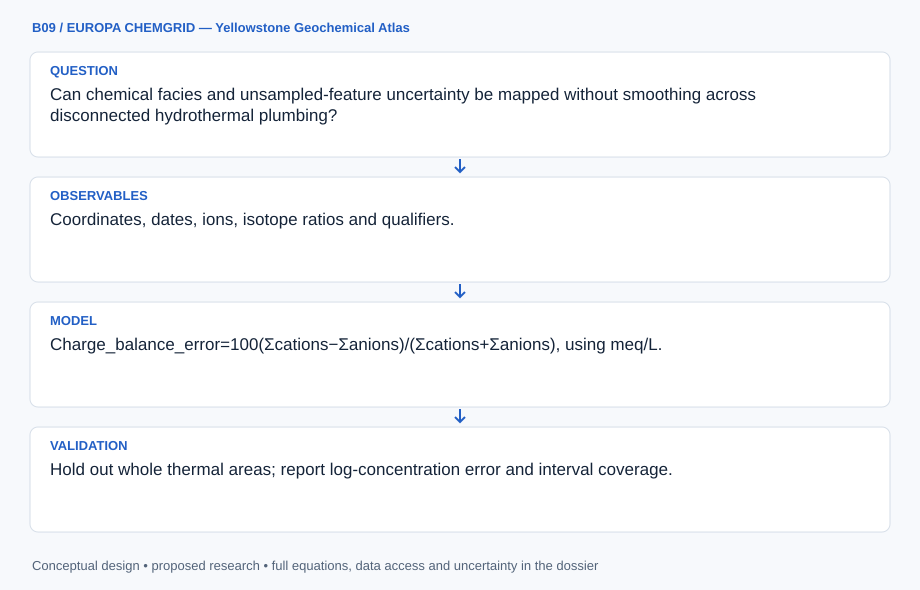

The diagram defines a versioned sample-to-map lineage and basin/time support boundary. Measured concentration, inferred facies and optional equilibrium interpretation remain separate products with explicit sparse-data limits.

[Editable engineering diagram source](../visuals/projects/B09.mmd)

### 4. Mathematical model and derivation

#### Governing equations

```text
Charge_balance_error=100(Σcations−Σanions)/(Σcations+Σanions), using meq/L.
```

```text
z(s,t)=μ_basin(s)+g(s)+h(t)+ε_assay; z may be log concentration.
```

```text
Prediction variance includes spatial, temporal, assay and harmonization terms and their estimated covariance.
```

#### Variables, units and conventions

- s: projected location, m; t: sample date.
- Concentrations: mg/L and meq/L; pH remains logarithmic.
- g: setting-constrained spatial process; h: temporal process.
- Facies probabilities: dimensionless; uncertainty layers retain physical units.

#### Assumptions and boundary conditions

- Assay methods/detection limits need documented crosswalks.
- Sampling accessibility creates spatial bias.
- Names/coordinates may change; individual observations retain lineage.

#### Derivation step 1

```text
c_eq,i=C_i abs(z_i)/MW_i.
```

C in mg/L divided by MW in g/mol yields mmol/L numerically; multiplication by charge gives meq/L. Neutral species do not enter charge balance.

#### Derivation step 2

```text
CBE=100(C_plus-C_minus)/(C_plus+C_minus).
```

Positive sign denotes excess cation equivalents. If denominator is zero or ions are incomplete, the result is undefined or explicitly qualified.

#### Derivation step 3

```text
z(s,t)=mu_basin+g(s)+h(t)+epsilon_assay.
```

For log concentration, predictions are transformed with distribution-aware back transformation rather than exponentiating the mean without correction.

#### Derivation step 4

```text
Var(z_*|z)=K_**-k_*^T(K+Sigma_assay)^-1 k_*.
```

The conditional covariance includes assay error and time dependence; a disconnected basin uses its own support rather than an artificial cross-boundary covariance.

#### Inference or simulation procedure

Separate sites, samples, methods and analytes in a relational archive. Retain censored values and qualifiers rather than substituting zero. Classify major-ion compositions with uncertainty-aware compositional methods, then compare basin-specific Gaussian processes, nearest neighbors and sample-only baselines. Evaluate time-window dependence, retain unmodeled features and select prospective samples by expected variance reduction under access constraints. Keep chemistry measurements separate from optional speciation calculations.

#### Validity domain and fidelity limits

Maps represent sampled periods rather than permanent spring compositions. Sharp boundaries challenge smooth models; complete speciation requires additional temperature, redox and equilibrium assumptions.

### 5. Data specifications and provenance

| Field | Type | Unit | Physical / statistical meaning | Quality and missing-data rule |
| --- | --- | --- | --- | --- |
| feature_key | string | none | Persistent thermal-feature identity. | Reviewed alias/coordinate lineage. |
| sample_date | nullable date | calendar day | Collection date and precision. | No invented timestamp. |
| analyte_value | nullable float | mg/L | Original measured concentration. | Qualifier/limit retained. |
| charge | integer | elementary charges | Ionic valence for balance. | Neutral species excluded. |
| equivalent_value | nullable float | meq/L | Converted major-ion concentration. | Molar mass/valence version required. |
| basin_support | polygon key | none | Permitted interpolation domain. | Unmapped boundaries marked uncertain. |
| prediction_covariance | matrix | log-concentration² | Joint map uncertainty. | Include method and temporal covariance. |

[Machine-readable record schema](../data/contracts/B09.schema.json) · [Empty acquisition CSV](../data/contracts/B09.csv) · [Field dictionary CSV](../data/contracts/B09.dictionary.csv)

The CSV above contains column headers only. Its schema defines future records and does not establish that original-team data or a particular archive product have been acquired. Frame, timing, calibration, covariance, selection and provenance details must accompany populated records.

#### USGS Yellowstone water chemistry and isotope data, version 2.0

[Product, archive or reference](https://www.usgs.gov/data/water-chemistry-and-isotope-data-selected-springs-geysers-streams-and-rivers-yellowstone)

**Fields:** Coordinates, dates, ions, isotope ratios and qualifiers.

**Access:** Versioned public USGS release with associated metadata.

**Role:** Modern observational atlas.

#### USGS chemical analyses of Yellowstone thermal features, 1980–1993

[Product, archive or reference](https://www.usgs.gov/publications/chemical-analyses-hot-springs-pools-and-geysers-yellowstone-national-park-wyoming-and)

**Fields:** Historic chemistry, methods and feature descriptions.

**Access:** Public USGS report; carefully reviewed transcription may be necessary.

**Role:** Historical context after harmonization.

### 6. Uncertainty, sensitivity and identifiability

Historical method changes, collection conditions and feature aliases can produce apparent spatial differences. Estimate assay-specific offsets only where overlapping measurements identify them; otherwise show separate method periods. Reporting limits induce asymmetric uncertainty, especially after logarithmic transformation, and charge imbalance can reflect omitted species rather than a known analytical error.

Spatial length scale and basin mean trade off when samples cluster around accessible features. Profile covariance ranges, compare sample-only and leave-feature-out errors, and report distance-to-support layers. Temporal change must not be absorbed into a spatial gradient. Sampling priority uses expected variance reduction but remains conditional on access, safety and the validity of the covariance model.

### 7. Engineering trade study

| Alternative | Benefit | Cost / limitation | Decision rule |
| --- | --- | --- | --- |
| Sample-only atlas | Most faithful to direct observations. | Leaves large spatial gaps. | Default where support is sparse. |
| Basin-specific Gaussian process | Produces correlated uncertainty and priorities. | Sensitive to covariance and temporal assumptions. | Use when feature-level holdout is calibrated. |
| Nearest-neighbor/time-window map | Simple and auditable. | Creates sharp boundaries and limited error model. | Retain as a benchmark and sparse-data alternative. |

### 8. Verification and validation cases

| Case ID | Stimulus / condition | Expected result / criterion | Method | Evidence artifact |
| --- | --- | --- | --- | --- |
| B09-V1 | Balanced simple water | CBE=0%; replacing Cl with 0.5 gives +33.333%. | Condition/fixture: Na+=1 meq/L and Cl-=1 meq/L. Verification procedure: Exact equivalents fixture.. | Exact equivalents fixture. |
| B09-V2 | Unit conversion | 1 meq/L within rounding of declared constants. | Condition/fixture: 23 mg/L Na with illustrative MW=23 g/mol and charge +1. Verification procedure: Unit adapter check.. | Unit adapter check. |
| B09-V3 | Unsupported basin | Return unsupported/null with support flag. | Condition/fixture: Request map cell in a basin with no eligible sample. Verification procedure: Domain-mask integration test.. | Domain-mask integration test. |
| B09-V4 | Feature holdout | Report predictive coverage and residuals in physical/log units. | Condition/fixture: Remove all samples from selected features and years. Verification procedure: Blocked interpolation evaluation.. | Blocked interpolation evaluation. |

**Execution status:** these cases are specified, not claimed as executed. Close a case only with the versioned inputs, output, uncertainty, reviewer and pass/fail rationale.

#### Additional scientific validation gates

- Hold out whole thermal areas; report log-concentration error and interval coverage.
- Double-review historic transcription and preserve original page/table links.
- Evaluate facies stability under assay draws and alternative compositional transformations; test extrapolation masks explicitly.

### 9. Implementation and reproducible work packages

1. Create feature/sample/analyte/method schemas and alias-review artifacts.
2. Freeze exact USGS table versions with checksums and date windows.
3. Implement valence-aware equivalent conversion and qualified charge balance.
4. Build sample-only, nearest-neighbor and basin-process baselines with feature folds.
5. Publish concentration/facies distributions and support-distance layers.
6. Produce access-constrained sampling priorities and separate optional-speciation assumptions.

#### Investigation sequence

1. Stage 1: audit units, identities, charge balance and method coverage; release missingness maps before interpolation.
2. Stage 2: compare facies and constrained geostatistics with sample-only maps; separate temporal and spatial uncertainty.
3. Stage 3: validate withheld basins or authorized new samples and release an uncertainty-targeted sampling plan.

#### Resources and interfaces to expertise

- Hydrogeochemist, GIS specialist and USGS metadata.
- Relational database, geostatistics, optional PHREEQC and reproducible unit conversion.

### 10. Failure modes and interpretation controls

| Failure mode | Effect on result | Detection / evidence | Design response |
| --- | --- | --- | --- |
| Nondetection set zero | Distorted facies and log maps. | Audit qualifier conversion. | Censored composition likelihood. |
| Method shift hidden | Artificial spatial gradient. | Residuals clustered by assay era. | Period/method separation. |
| Unbounded smooth map | False continuity across systems. | Inspect support boundaries. | Basin masking and abstention. |

- Unauthorized or unsafe thermal-feature access.
- Ambiguous identities and incompatible reporting limits.
- Unsupported interpolation presented as observation.

### 11. Required engineering outputs

- Sample/result database and site crosswalk.
- Facies atlas, prediction masks and uncertainty layers.
- Sampling-design notebook and analytical-gap inventory.

#### Scientific result figures to produce during execution

Basin map with measured points, assay/date filters, facies probabilities and an explicit unsupported-prediction mask.

### 12. Cited technical and scientific resources

- [USGS Yellowstone water chemistry and isotope data, version 2.0](https://www.usgs.gov/data/water-chemistry-and-isotope-data-selected-springs-geysers-streams-and-rivers-yellowstone) — Observed chemistry, isotope measurements, sampling dates and analytical provenance; supports dataset selection rather than a deformation prediction.
- [USGS chemical analyses of Yellowstone thermal features, 1980–1993](https://www.usgs.gov/publications/chemical-analyses-hot-springs-pools-and-geysers-yellowstone-national-park-wyoming-and) — Historic chemistry offers additional basins and temporal context, with method harmonization required.

Framework and evidence rules: [engineering documentation standard](../docs/ENGINEERING_STANDARD.md), [model assurance](../docs/MODEL_ASSURANCE.md), [uncertainty procedure](../docs/UNCERTAINTY_AND_DECISION_RULES.md), and [data management](../docs/DATA_MANAGEMENT.md). NASA-inspired names are creative identifiers; requirements and results are not NASA certification.

---

<a id="b10"></a>

## B10 · LANDSAT EQUITY — Community Canopy Mission

**Original project:** Using Remote Sensing to Determine Vegetation Change and Impacts to Communities

**Session B:** Earth & Environmental Engineering

**Document class:** engineering research design and analysis record · **Revision:** 2 · **Date:** 2026-10-02

**Evidence state:** design basis, mathematical formulation and verification plan documented. Project-specific empirical results remain to be acquired; executable shared model demonstrations have their own recorded checks.

[Engineering document register](../ENGINEERING_DOCUMENTATION.md) · [Session B handbook](../documentation/SESSION_B.md) · [Previous: B09](../projects/B/B09.md) · [Next: B11](../projects/B/B11.md)

### Purpose and scientific objective

Connect persistent vegetation change to community thermal exposure and green-space access through consistent satellite histories. Define impacts first as measured environmental exposure and access; health or displacement effects require additional evidence. Show neighborhood distributions and uncertainty so citywide averages do not hide places losing canopy or receiving little restoration benefit.

**Question:** Which neighborhoods lose persistent vegetation, and how does loss coincide with thermal exposure after climate and land-use differences are considered?

**Testable hypothesis:** Canopy loss may increase local thermal exposure unequally; irrigation, housing changes and redevelopment can confound vegetation–temperature relationships.

### 1. Design basis and analysis boundary

The community canopy analysis joins consistently processed satellite vegetation and thermal histories with approved neighborhood population and access data. Its boundary is environmental exposure and green-space accessibility; a surface-temperature map is not an individual heat dose or a clinical health outcome. The decision is where sustained vegetation loss and access inequity warrant locally reviewed restoration scenarios.

Start with seasonal reflectance composites and persistent change detection, then add canopy validation, surface-temperature panels and population weighting. Air-temperature inference requires independent calibration. NASA imagery provides observation support, while neighborhood definitions, disclosure rules and restoration weights are jointly reviewed design choices. Community and Indigenous data authority governs linkage and publication, especially when small-area demographics can identify vulnerable households.

### 2. Requirements and verification traceability

These are project design requirements or proposed analysis gates. A numerical target is not a NASA requirement unless its controlling source is explicitly identified. “TBD” identifies evidence required before a decision; it is not permission to assume a value. Verification evidence listed here is planned, unless a linked result explicitly records execution.

| ID | Requirement / gate | Engineering rationale | Verification method | Basis / required evidence |
| --- | --- | --- | --- | --- |
| B10-R1 | Reflectance comparisons shall use documented sensor harmonization, cloud masks and matched seasonal windows. | Sensor/season changes resemble vegetation loss. | Scene-manifest and composite audit. | HLS product documentation. |
| B10-R2 | Separate tree canopy, general greenness, surface temperature and air-temperature estimates in every output. | NDVI and thermal imagery have different meanings. | Inspect field names, labels and validation routes. | Existing measurement distinctions. |
| B10-R3 | Population-weighted exposure shall use contemporaneous population surfaces and retain boundary-version sensitivity. | Changing neighborhoods bias trends. | Recalculate on stable and historical boundaries. | Proposed demographic contract. |
| B10-R4 | Publish only community-approved aggregation and uncertainty; precise household or culturally sensitive locations remain governed. | Data linkage can exceed consent. | Release-policy audit against data authority register. | Local governance requirement. |

### 3. Architecture and controlled interfaces

The imagery adapter emits dated surface reflectance with valid-pixel masks and projected support. A canopy classifier uses independently reviewed labels and produces calibrated cover fractions. Thermal products carry acquisition time, retrieval quality and physical K units, while air-temperature transects enter a separate calibration table.

A temporal panel aligns pixel histories on stable support and then aggregates using population weights with uncertainty. An access engine computes travel-network distance to usable green space, rather than nearest-pixel greenness. Scenario outputs combine canopy establishment, water and maintenance with exposure changes. Cloud gaps, mixed street-tree pixels and demographic uncertainty propagate to neighborhood intervals and suppressed rankings.

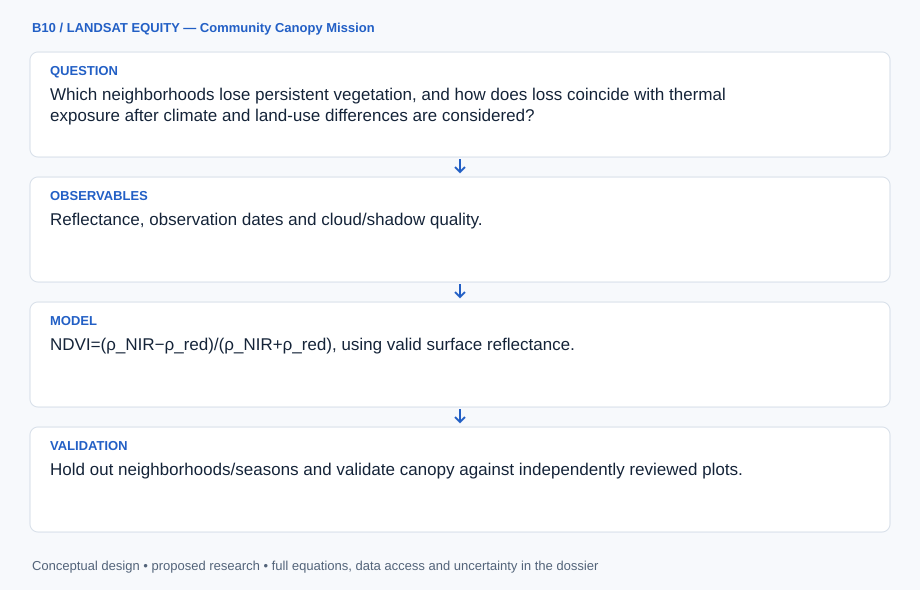

The diagram distinguishes canopy, surface heat, air-temperature calibration and usable access before neighborhood aggregation. The release boundary preserves community authority and prevents environmental exposure estimates from becoming unsupported health claims.

[Editable engineering diagram source](../visuals/projects/B10.mmd)

### 4. Mathematical model and derivation

#### Governing equations

```text
NDVI=(ρ_NIR−ρ_red)/(ρ_NIR+ρ_red), using valid surface reflectance.
```

```text
T_it=α_i+δ_t+β canopy_it+γᵀ climate_it+ε_it.
```

```text
Exposure_g=Σ_p population_gp temperature_anomaly_p/Σ_p population_gp.
```

#### Variables, units and conventions

- ρ: unitless reflectance; canopy: validated percent cover.
- T: surface-temperature anomaly, K; air temperature needs separate calibration.
- g: neighborhood; p: spatial cell.
- Exposure: ecological aggregate, not an individual heat dose.

#### Assumptions and boundary conditions

- NDVI mixes trees, grass and seasonal weeds.
- Surface temperature differs from air temperature and physiological heat stress.
- Population estimates and neighborhood boundaries change through time.

#### Derivation step 1

```text
NDVI=(rho_NIR-rho_red)/(rho_NIR+rho_red).
```

Reflectances are dimensionless; zero/invalid denominators and cloud-contaminated pixels are masked. Greenness is not automatically tree cover.

#### Derivation step 2

```text
Delta T_it=alpha_i+delta_t+beta C_it+gamma^T W_it+epsilon_it.
```

C is canopy fraction or percent with explicit scaling, so beta has K/fraction or K/percentage-point units. Fixed effects do not remove all redevelopment confounding.

#### Derivation step 3

```text
E_g=sum_p N_gp Delta T_p/sum_p N_gp.
```

Population N is persons; exposure E is K and is an ecological aggregate. Empty-population neighborhoods yield null rather than division by zero.

#### Derivation step 4

```text
Var(E_g) approximately J Sigma_(N,T) J^T.
```

The covariance includes population/temperature uncertainty and spatially correlated retrieval errors; independent-pixel assumptions understate intervals.

#### Inference or simulation procedure

Build cloud- and season-controlled reflectance composites, persistent vegetation/canopy trends and change points. Combine documented thermal imagery with air-temperature transects and socioeconomic records on consistent spatial units. Compare matched redevelopment/control areas or panel models with pretrend checks. Weight outputs by exposure and green-space access; evaluate restoration scenarios with water demand, establishment survival and maintenance. Propagate classification and demographic uncertainty rather than ranking neighborhoods by unqualified point estimates.

#### Validity domain and fidelity limits

Mixed pixels can miss street trees. Associations do not establish causal health effects; unobserved irrigation and neighborhood change can bias estimates.

### 5. Data specifications and provenance

| Field | Type | Unit | Physical / statistical meaning | Quality and missing-data rule |
| --- | --- | --- | --- | --- |
| scene_id | string | none | Exact harmonized reflectance product. | Version/checksum and masks required. |
| canopy_fraction | nullable float | 0–1 | Validated tree-cover estimate. | Class calibration and covariance retained. |
| surface_temperature | nullable float | K | Satellite skin-temperature retrieval. | Acquisition time/quality required. |
| air_temperature | nullable float | °C | Independent in situ measurement. | Never substituted from thermal pixels. |
| population_weight | float[] | persons | Contemporaneous cell population. | Boundary year and uncertainty saved. |
| green_access_distance | nullable float | m | Network distance to usable green space. | Access restrictions and routes documented. |
| exposure_covariance | matrix | K² | Joint neighborhood exposure uncertainty. | Include spatial and demographic terms. |

[Machine-readable record schema](../data/contracts/B10.schema.json) · [Empty acquisition CSV](../data/contracts/B10.csv) · [Field dictionary CSV](../data/contracts/B10.dictionary.csv)

The CSV above contains column headers only. Its schema defines future records and does not establish that original-team data or a particular archive product have been acquired. Frame, timing, calibration, covariance, selection and provenance details must accompany populated records.

#### NASA Harmonized Landsat Sentinel-2 data

[Product, archive or reference](https://hls.gsfc.nasa.gov/hls-data/)

**Fields:** Reflectance, observation dates and cloud/shadow quality.

**Access:** Public NASA imagery; version/Earthdata requirements recorded.

**Role:** Vegetation histories.

#### NASA Landsat: urban heat and social vulnerability

[Product, archive or reference](https://science.nasa.gov/missions/landsat/how-urban-heat-affects-the-socially-vulnerable-in-sun-belt-cities/)

**Fields:** NASA vegetation/temperature/vulnerability integration example.

**Access:** Public account; acquire local thermal and demographic data separately.

**Role:** Exposure framing, without transferring city-specific effect sizes.

### 6. Uncertainty, sensitivity and identifiability

Mixed pixels, seasonal weeds and irrigation changes can mimic canopy gain or loss. Validate classifications on withheld neighborhoods and years, carry confusion uncertainty into cover, and compare multiple seasonal windows. Thermal overpass sampling can miss nocturnal heat and air temperature; any conversion requires independent transects and a stated applicability range.

Population weights and neighborhood boundaries change, and redevelopment may affect vegetation, exposure and residents together. Analyze stable-support panels, profile boundary choices and distinguish environmental change from population redistribution. Use spatial blocks for covariance. Avoid precise neighborhood rankings when intervals overlap; community priorities and access barriers are values/evidence inputs, not inferred from satellite radiance.

### 7. Engineering trade study

| Alternative | Benefit | Cost / limitation | Decision rule |
| --- | --- | --- | --- |
| Seasonal NDVI trend | Broad reproducible vegetation history. | Cannot identify trees or direct heat dose. | Use as screening and change baseline. |
| Validated canopy/thermal panel | Closer to shade and surface exposure. | Needs labels and retrieval uncertainty. | Prefer where independent validation exists. |
| Community access and air-temperature survey | Measures usable access and human-scale conditions. | Limited spatial/temporal coverage. | Use to calibrate and contextualize imagery. |

### 8. Verification and validation cases

| Case ID | Stimulus / condition | Expected result / criterion | Method | Evidence artifact |
| --- | --- | --- | --- | --- |
| B10-V1 | NDVI limits | NDVI=0 and 1 respectively. | Condition/fixture: Equal positive red/NIR reflectance; red=0 with positive NIR. Verification procedure: Exact ratio checks.. | Exact ratio checks. |
| B10-V2 | Uniform thermal field | Every valid weighted neighborhood exposure equals 3 K. | Condition/fixture: Every populated pixel has anomaly 3 K. Verification procedure: Aggregation unit test.. | Aggregation unit test. |
| B10-V3 | No population support | Output null with unsupported-population flag. | Condition/fixture: Neighborhood denominator is zero. Verification procedure: Integration boundary fixture.. | Integration boundary fixture. |
| B10-V4 | Neighborhood/year holdout | Report canopy calibration and thermal residuals separately. | Condition/fixture: Reserve complete areas and acquisition years. Verification procedure: Spatial-temporal evaluation.. | Spatial-temporal evaluation. |

**Execution status:** these cases are specified, not claimed as executed. Close a case only with the versioned inputs, output, uncertainty, reviewer and pass/fail rationale.

#### Additional scientific validation gates

- Hold out neighborhoods/seasons and validate canopy against independently reviewed plots.
- Test surface-to-air-temperature translation against local sensors before labeling human exposure.
- Repeat estimates across boundaries, cloud filters and seasonal windows; report distributional intervals and missing-data effects.

### 9. Implementation and reproducible work packages

1. Create a community-reviewed estimand, data-authority and public-release register.
2. Freeze imagery, population and boundary versions with scene-quality manifests.
3. Implement seasonal composites and canopy validation with spatial/year folds.
4. Build separate thermal retrieval and air-temperature calibration artifacts.
5. Calculate population exposure and network access with full covariance sensitivity.
6. Release reviewable restoration scenarios with water/maintenance and overlapping-rank uncertainty.

#### Investigation sequence

1. Stage 1: select a community-defined boundary/time span, inventory images and demographic sources, and document ethical aggregation rules.
2. Stage 2: map validated change and unequal exposure; compare greenness with canopy-specific models and temporal baselines.
3. Stage 3: validate sensors/withheld neighborhoods and deliver restoration benefit, water and cost scenarios.

#### Resources and interfaces to expertise

- Remote-sensing analyst, urban ecologist and community planning partner.
- Harmonized/thermal imagery, GIS and privacy-preserving demographic tables.

### 10. Failure modes and interpretation controls

| Failure mode | Effect on result | Detection / evidence | Design response |
| --- | --- | --- | --- |
| Surface heat called health effect | Unsupported impact claim. | Endpoint and citation review. | Retain environmental estimands. |
| Cloud gap filled as loss | False canopy-change hotspot. | Valid-pixel support diagnostics. | Missingness-aware composites. |
| Sensitive small-area linkage | Privacy/data-authority breach. | Export audit and aggregation checks. | Community-approved suppression. |

- Ecological fallacy and unsupported health causality.
- Unequal monitoring quality.
- Restoration increasing water burdens or displacement pressures.

### 11. Required engineering outputs

- Vegetation-change and exposure atlas.
- Impact evidence tiers and uncertainty ledger.
- Restoration scenarios with water/maintenance requirements.

#### Scientific result figures to produce during execution

Pair canopy-change maps with measured thermal anomalies, population-weighted exposure and uncertain restoration benefits/water demand.

### 12. Cited technical and scientific resources

- [NASA Harmonized Landsat Sentinel-2 data](https://hls.gsfc.nasa.gov/hls-data/) — Surface reflectance and quality layers support reproducible landscape and vegetation monitoring.
- [NASA Landsat: urban heat and social vulnerability](https://science.nasa.gov/missions/landsat/how-urban-heat-affects-the-socially-vulnerable-in-sun-belt-cities/) — NASA account of integrating remotely sensed vegetation and temperature with socioeconomic data; association alone is not a causal health result.
- [Global Indigenous Data Alliance, CARE Principles for Indigenous Data Governance](https://www.gida-global.org/careprinciples) — Primary governance framework supporting collective benefit, authority to control, responsibility and ethics; local community standards and permissions govern actual linkage and release.

Framework and evidence rules: [engineering documentation standard](../docs/ENGINEERING_STANDARD.md), [model assurance](../docs/MODEL_ASSURANCE.md), [uncertainty procedure](../docs/UNCERTAINTY_AND_DECISION_RULES.md), and [data management](../docs/DATA_MANAGEMENT.md). NASA-inspired names are creative identifiers; requirements and results are not NASA certification.

---

<a id="b11"></a>

## B11 · APOLLO LEGACY LEDGER — Environmental Stewardship Knowledge System

**Original project:** Nevada Offsite Management

**Session B:** Earth & Environmental Engineering

**Document class:** engineering research design and analysis record · **Revision:** 2 · **Date:** 2026-10-02

**Evidence state:** design basis, mathematical formulation and verification plan documented. Project-specific empirical results remain to be acquired; executable shared model demonstrations have their own recorded checks.

[Engineering document register](../ENGINEERING_DOCUMENTATION.md) · [Session B handbook](../documentation/SESSION_B.md) · [Previous: B10](../projects/B/B10.md) · [Next: B12](../projects/B/B12.md)

### Purpose and scientific objective

Verified scope assumption: Nevada Offsites means DOE legacy sites outside NNSS across five states. Extend the original institutional-log concept into an auditable system for decisions, monitoring and obligations. The 2023 DOE fact sheet lists ten sites; confirm the current roster and controlling documents rather than treating the historical nine-site description as current.

**Question:** Can a provenance-linked obligation ledger improve completeness and reconstruct decisions from authoritative records?

**Testable hypothesis:** Evidence links, effective dates and explicit review states should improve retrieval over unstructured folders, while regulatory and site-manager judgments remain human responsibilities.

### 1. Design basis and analysis boundary

The stewardship system covers DOE Nevada Offsites outside the Nevada National Security Site. The verified March 2023 DOE fact sheet lists ten sites across five states; that roster is the dated baseline, and current controlling documents must still be checked at execution. The engineering boundary is an auditable public-document ledger of obligations, decisions, monitoring evidence and revision lineage, rather than a subsurface safety assessment.

Begin with manually reviewed site/document identity and exact page citations, then add assisted candidate extraction and retrieval. Requirements become active only after reviewer confirmation of authority, effective dates, ownership and status. Public reports may omit restricted agreements or institutional knowledge, so completeness is measured against an explicitly reviewed corpus. Administrative priority is a transparent planning score and cannot establish regulatory compliance.

### 2. Requirements and verification traceability

These are project design requirements or proposed analysis gates. A numerical target is not a NASA requirement unless its controlling source is explicitly identified. “TBD” identifies evidence required before a decision; it is not permission to assume a value. Verification evidence listed here is planned, unless a linked result explicitly records execution.

| ID | Requirement / gate | Engineering rationale | Verification method | Basis / required evidence |
| --- | --- | --- | --- | --- |
| B11-R1 | Every confirmed obligation shall link to document hash, page, quoted support, reviewer and effective-date evidence; proposed traceability target is 100%. | Text summaries can lose controlling authority. | Foreign-key/provenance audit. | Proposed ledger requirement. |
| B11-R2 | Preserve immutable prior versions and explicit supersedes/conflict links; no extraction may silently overwrite status. | Institutional history is essential. | Replay revision-chain fixtures. | Proposed append-only design. |
| B11-R3 | Roster shall identify each site, state, scope and roster-source date; differences from the ten-site 2023 baseline require reviewed evidence. | Historical nine-site descriptions are not current proof. | Roster reconciliation report. | Verified DOE fact sheet. |
| B11-R4 | Coverage denominator shall be an independently reviewed obligation corpus, and monitoring nondetection shall retain reporting limit. | Public completeness and zero concentration cannot be assumed. | Corpus and analytical-field audit. | Existing coverage/monitoring distinctions. |

### 3. Architecture and controlled interfaces

A document store indexes source URL, retrieval date, file hash, revision date and page-level text. A site registry resolves aliases and program boundaries across five states. Candidate extractors emit structured requirement proposals with exact evidence spans; they cannot assign confirmed owner or compliance state without reviewer action.

The obligation ledger records authority, effective interval, due rule, owner, state and source lineage. A separate monitoring table stores analyte, unit, reporting limit and laboratory qualifiers. A versioned retrieval index serves reviewer-authored questions, with unavailable-document and conflict states surfaced. The public export removes restricted evidence and indicates incomplete coverage; overdue flags are administrative prompts rather than automatic legal conclusions.

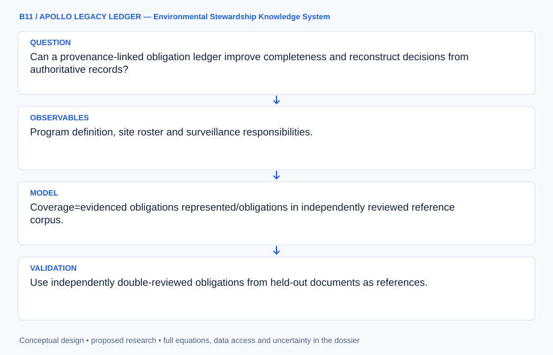

The diagram establishes authority review, immutable evidence and revision-aware stewardship views for Nevada Offsites. Corpus-relative coverage and administrative deadlines cannot certify regulatory compliance or environmental safety.

[Editable engineering diagram source](../visuals/projects/B11.mmd)

### 4. Mathematical model and derivation

#### Governing equations

```text
Coverage=evidenced obligations represented/obligations in independently reviewed reference corpus.
```

```text
Priority_i=P(missed_i|evidence_age,owner_state,due_date)×expert-defined consequence_i.
```

```text
Record={site,requirement,authority,effective_date,due_date,owner,status,evidence_hash,supersedes}.
```

#### Variables, units and conventions

- Dates: ISO 8601; evidence age: days; priority: administrative score.
- Monitoring retains analyte units, reporting limits, laboratory and location metadata.
- Coverage denominator is a reviewed corpus, not all possible legal obligations.

#### Assumptions and boundary conditions

- Public records are an incomplete institutional subset.
- Extracted text alone cannot establish regulatory compliance.
- Superseded/conflicting records retain revision lineage.

#### Derivation step 1

```text
record_key=hash(site_key,authority_key,clause_key,effective_start).
```

The stable identity excludes mutable status, so status revisions do not create unrelated obligations. Hashing provides integrity identification, not proof that source content is true.

#### Derivation step 2

```text
coverage=N_evidenced/N_reference.
```

Both counts use reviewed obligation identities in the frozen corpus. If N_reference=0, coverage is undefined, not 100%.

#### Derivation step 3

```text
overdue=I(t>due_date and status not in confirmed_closed_states).
```

Due-date computation uses a recorded calendar/timezone and exception rule. Missing authority or due rule produces unresolved status rather than an inferred deadline.

#### Derivation step 4

```text
priority=p_miss(evidence_age,owner_state,due_rule)*C_expert.
```

Probability calibration requires labeled historical tasks; otherwise p_miss is only a stated scenario. Consequence weights are expert judgments with provenance.

#### Inference or simulation procedure

Normalize site names and versions, then extract candidate decisions/requirements with exact document/page provenance. Require reviewer confirmation of authority, effective dates, owners and status; maintain append-only revisions. Link monitoring summaries to source reports, keeping nondetection distinct from absence. Evaluate retrieval with reviewer-authored tasks and route low-confidence extraction to human review. Record explicit unavailable-document and unresolved-conflict states rather than filling gaps through inference.

#### Validity domain and fidelity limits

Ledger completeness cannot establish subsurface safety or remedy effectiveness. Site agreements and restricted records may prevent a complete public product, while consequence rankings require expert judgment.

### 5. Data specifications and provenance

| Field | Type | Unit | Physical / statistical meaning | Quality and missing-data rule |
| --- | --- | --- | --- | --- |
| site_key | string | none | Reviewed offsite identity. | Roster date/state/scope required. |
| document_hash | string | SHA-256 | Evidence-file integrity key. | Exact bytes and source URL retained. |
| evidence_span | record | page/characters | Exact supporting location. | OCR uncertainty and page numbering saved. |
| authority | nullable string | none | Controlling instrument and clause. | Reviewer confirmation mandatory. |
| due_date | nullable date | ISO 8601 | Reviewed deadline or recurrence. | Null remains unresolved. |
| status_revision | record | none | Owner/status/reviewer transition. | Append-only with supersedes link. |
| monitoring_result | nullable record | declared analyte unit | Qualified environmental observation. | Reporting limit and lab metadata retained. |
| coverage_state | record | none | Corpus denominator and missing documents. | Never implies all obligations known. |

[Machine-readable record schema](../data/contracts/B11.schema.json) · [Empty acquisition CSV](../data/contracts/B11.csv) · [Field dictionary CSV](../data/contracts/B11.dictionary.csv)

The CSV above contains column headers only. Its schema defines future records and does not establish that original-team data or a particular archive product have been acquired. Frame, timing, calibration, covariance, selection and provenance details must accompany populated records.

#### DOE Nevada Offsites Program Fact Sheet, March 2023

[Product, archive or reference](https://www.energy.gov/lm/articles/nevada-offsites-fact-sheet)

**Fields:** Program definition, site roster and surveillance responsibilities.

**Access:** Public DOE fact sheet; check newer site-specific controlling documents.

**Role:** Scope and identity baseline.

#### DOE Annual Site Environmental Reports

[Product, archive or reference](https://www.energy.gov/ehss/doe-annual-site-environmental-reports-aser)

**Fields:** Reporting guidance and environmental-report links.

**Access:** Public DOE portal; Offsites records may need site-specific LM pages or requests.

**Role:** Monitoring/report provenance, not a substitute for agreements.

### 6. Uncertainty, sensitivity and identifiability

OCR errors, ambiguous dates and paraphrased authority create extraction uncertainty. Measure reviewer-confirmed precision and recall on a frozen corpus, stratified by document type and revision era. Exact evidence spans permit correction without rewriting the source. Contradictory agreements or unavailable annexes remain explicit unresolved records.

Completeness and priority are partially identifiable because the public corpus is incomplete. Compare retrieval performance with manual reference tasks and document the denominator. A missed-action model requires enough labeled historical events; absent them, use deterministic age/due-rule scenarios and sensitivity to expert consequence weights. Monitoring precision does not establish remedy effectiveness or subsurface safety.

### 7. Engineering trade study

| Alternative | Benefit | Cost / limitation | Decision rule |
| --- | --- | --- | --- |
| Manual reviewed ledger | High interpretability and authority control. | Slow corpus expansion. | Default for controlling obligations. |
| Assisted extraction with review | Scales candidate discovery and traceability. | OCR and semantic errors remain. | Adopt when review precision is documented. |
| Full-text retrieval only | Fast access with minimal inference. | Cannot track deadlines or revision conflicts. | Retain as independent lookup baseline. |

### 8. Verification and validation cases

| Case ID | Stimulus / condition | Expected result / criterion | Method | Evidence artifact |
| --- | --- | --- | --- | --- |
| B11-V1 | Superseded requirement | Both persist; current view selects B and exposes A lineage. | Condition/fixture: Synthetic revision B replaces A with later effective date. Verification procedure: Revision replay test.. | Revision replay test. |
| B11-V2 | Missing deadline | Deadline stays null and status unresolved. | Condition/fixture: Candidate clause lacks due-date evidence. Verification procedure: Extraction/review integration check.. | Extraction/review integration check. |
| B11-V3 | Coverage boundary | Coverage=0.75; empty corpus yields undefined. | Condition/fixture: Reference corpus has 20 reviewed obligations; 15 evidenced. Verification procedure: Exact ledger calculation.. | Exact ledger calculation. |
| B11-V4 | Retrieval holdout | Measure answer-span retrieval and unsupported-answer rate. | Condition/fixture: Reviewer authors unseen site/authority questions. Verification procedure: Frozen-task evaluation.. | Frozen-task evaluation. |

**Execution status:** these cases are specified, not claimed as executed. Close a case only with the versioned inputs, output, uncertainty, reviewer and pass/fail rationale.

#### Additional scientific validation gates

- Use independently double-reviewed obligations from held-out documents as references.
- Measure precision/recall, citation accuracy and answer time; authority/status errors are material failures.
- Test superseded/conflicting/missing records and access controls; require review before any compliance interpretation.

### 9. Implementation and reproducible work packages

1. Publish the dated offsite roster and controlling-document gap register.
2. Create immutable file/page manifests and site alias crosswalks.
3. Implement candidate extraction with exact spans and reviewer state transitions.
4. Build append-only obligation and monitoring schemas with conflict/supersedes checks.
5. Construct corpus-relative coverage and reviewer-authored retrieval benchmarks.
6. Release a provenance-complete public ledger with unavailable evidence and administrative limits.

#### Investigation sequence

1. Stage 1: confirm roster and collect authoritative documents; approve schema, access classes and reference obligations with subject experts.
2. Stage 2: populate page-linked decision/monitoring logs with review queues and version lineage.
3. Stage 3: conduct blinded completeness/retrieval audits and release permitted records with maintenance ownership and documented gaps.

#### Resources and interfaces to expertise

- Legacy-management reviewer and records specialist.
- Document parser/OCR, relational ledger, evidence hashes and access controls.

### 10. Failure modes and interpretation controls

| Failure mode | Effect on result | Detection / evidence | Design response |
| --- | --- | --- | --- |
| Wrong program boundary | NNSS records mixed with offsites. | Site-scope audit. | Reviewed program registry. |
| OCR date hallucination | False overdue/closed status. | Compare cited scan and reviewer decision. | Quarantine low-confidence dates. |
| Superseded authority active | Misleading stewardship obligation. | Revision conflict checker. | Effective-interval current views. |

- Outdated roster or superseded requirements.
- Hallucinated automated obligations.
- Restricted-record disclosure or unsupported safety claims.

### 11. Required engineering outputs

- Versioned site/obligation register and inventory.
- Decision-lineage graph and monitoring index.
- Audit report and stewardship handoff procedure.

#### Scientific result figures to produce during execution

Display obligations, dates and source lineage; distinguish verified, superseded, disputed and unavailable evidence.

### 12. Cited technical and scientific resources

- [DOE Nevada Offsites Program Fact Sheet, March 2023](https://www.energy.gov/lm/articles/nevada-offsites-fact-sheet) — Defines the legacy-management program, site roster and long-term surveillance responsibilities across five states.
- [DOE Annual Site Environmental Reports](https://www.energy.gov/ehss/doe-annual-site-environmental-reports-aser) — Official reporting context supports document provenance and monitoring-program evaluation; site-specific obligations require their controlling documents.

Framework and evidence rules: [engineering documentation standard](../docs/ENGINEERING_STANDARD.md), [model assurance](../docs/MODEL_ASSURANCE.md), [uncertainty procedure](../docs/UNCERTAINTY_AND_DECISION_RULES.md), and [data management](../docs/DATA_MANAGEMENT.md). NASA-inspired names are creative identifiers; requirements and results are not NASA certification.

---

<a id="b12"></a>

## B12 · VULCAN DOMESCAN — O’Leary Emplacement Reconstruction

**Original project:** Identifying unique emplacement characteristics of O'Leary Peak: a volcanic dome in the San Francisco Volcanic Field

**Session B:** Earth & Environmental Engineering

**Document class:** engineering research design and analysis record · **Revision:** 2 · **Date:** 2026-10-02

**Evidence state:** design basis, mathematical formulation and verification plan documented. Project-specific empirical results remain to be acquired; executable shared model demonstrations have their own recorded checks.

[Engineering document register](../ENGINEERING_DOCUMENTATION.md) · [Session B handbook](../documentation/SESSION_B.md) · [Previous: B11](../projects/B/B11.md) · [Next: B13](../projects/B/B13.md)

### Purpose and scientific objective

Reconstruct dome emplacement by comparing mapped contacts, morphology, petrography and rheological scenarios. Seek observations that discriminate extrusion histories rather than fitting one visually plausible simulation. Incorporate erosion, incomplete exposure and mapping uncertainty into the inverse problem, preserving a regional stratigraphic crosswalk and explicit model nonuniqueness.

**Question:** Which emplacement histories explain dome morphology, fabrics and contacts while respecting mapped stratigraphy?

**Testable hypothesis:** Multiple pulses or variable rheology may explain morphology better than homogeneous extrusion; independent contact/fabric evidence is needed to discriminate those alternatives.

### 1. Design basis and analysis boundary

The emplacement reconstruction links authoritative O'Leary Peak contacts, a documented DEM and permitted fabric/petrographic observations to alternative dome-extrusion scenarios. Modern topography is the observable, while vent geometry, discharge history, rheology and erosion are latent quantities. The engineering objective is discrimination among compatible emplacement histories, not a visually convincing animation or a new absolute age.

Start with volume/runout scaling and a reduced isothermal yield-stress flow; promote to thermal or three-dimensional cases only when reserved contacts and transects can discriminate them. Published mapping defines the regional unit crosswalk. Proposed parameter ranges require literature or sample characterization, and erosion/collapse uncertainty is carried separately from DEM precision.

### 2. Requirements and verification traceability

These are project design requirements or proposed analysis gates. A numerical target is not a NASA requirement unless its controlling source is explicitly identified. “TBD” identifies evidence required before a decision; it is not permission to assume a value. Verification evidence listed here is planned, unless a linked result explicitly records execution.

| ID | Requirement / gate | Engineering rationale | Verification method | Basis / required evidence |
| --- | --- | --- | --- | --- |
| B12-R1 | Every morphometric metric shall cite DEM resolution, vertical datum, mask and mapped unit/contact version. | Terrain support controls inferred volume. | Recompute metrics from frozen raster/vector inputs. | USGS map and DEM contract. |
| B12-R2 | Rheology shall specify yield rule, consistency units and regularization; numerical flow shall preserve nonnegative thickness. | Ambiguous viscosity/yield implementations alter runout. | Constitutive and conservation tests. | Existing Herschel–Bulkley model. |
| B12-R3 | Hold out complete contact segments or transects from calibration. | Nearby DEM pixels do not provide independent evidence. | Audit spatial split and score retained metrics. | Proposed reconstruction protocol. |
| B12-R4 | Report parameter families and erosional alternatives; no extrusion duration or age shall be called measured without independent evidence. | Inverse geometry is nonunique. | Profile discharge/rheology and chronology lineage. | Existing model limitations. |

### 3. Architecture and controlled interfaces

A geometry adapter aligns DEM elevation m and geologic contacts in a projected metre CRS and common vertical datum. It derives thickness/volume only relative to an explicitly constructed pre-emplacement surface ensemble. A material registry stores density, yield stress Pa, consistency Pa s^n and thermal parameters with source ranges.

The forward solver accepts vent geometry, volumetric discharge m³/s and rheology, then emits free-surface elevation, thickness, runout and optional temperature. An erosion operator maps emplacement geometry to candidate modern surfaces. A metric extractor compares mapped contacts, slopes and fabric proxies with covariance. Failed convergence or unresolved basal geometry propagates invalid-scenario states into inference rather than a best-fit history.

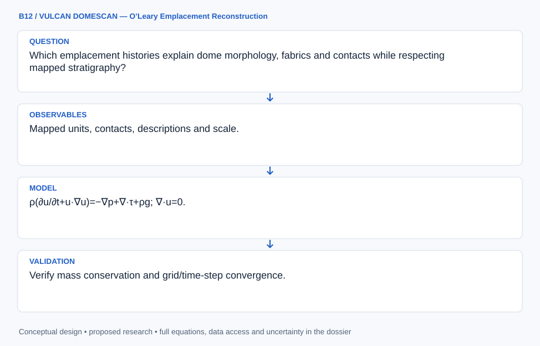

The diagram separates modern terrain, inferred basal geometry, extrusion physics and post-emplacement alteration. It supports competing emplacement families while exposing the absence of unique rheology, discharge history or absolute chronology.

[Editable engineering diagram source](../visuals/projects/B12.mmd)

### 4. Mathematical model and derivation

#### Governing equations

```text
ρ(∂u/∂t+u·∇u)=−∇p+∇·τ+ρg; ∇·u=0.
```

```text
τ=τ_y sign(γ̇)+K|γ̇|^(n−1)γ̇ above yield; document regularization.
```

```text
J(θ)=Σ_k[m_pred,k−m_obs,k]²/σ_k²+stratigraphic_penalty(θ).
```

#### Variables, units and conventions

- ρ: kg/m³; u: m/s; p/τ/yield stress: Pa.
- K: Pa·s^n; n: dimensionless flow index.
- θ: extrusion rate, vent geometry, duration and rheology.
- m: volume, thickness, slope or fabric metrics with stated units.

#### Assumptions and boundary conditions

- Modern topography includes erosion and collapse.
- 2D screening omits vent asymmetry; test 3D sensitivity where justified.
- Absolute chronology needs dated samples or existing age constraints.

#### Derivation step 1

```text
dV/dt=Q_in-Q_out; V=integral_A h dA.
```

Thickness h in m and area m² give m³. Extrusion discharge integrates to volume before any erosional subtraction.

#### Derivation step 2

```text
tau=tau_y sign(gamma_dot)+K abs(gamma_dot)^(n-1) gamma_dot.
```

Above yield, tau is Pa, strain rate s^-1 and K is Pa s^n. Below yield the ideal material is unyielded; regularization must disclose its approximation.

#### Derivation step 3

```text
rho g h sin(alpha) approximately tau_y.
```

A simple slope stress balance gives h approximately tau_y/(rho g sin alpha) where basal shear dominates; this is screening, not a complete dome solution.

#### Derivation step 4

```text
J(theta)=r(theta)^T Sigma^-1 r(theta)+P_strat(theta).
```

Residuals may mix volume, slope and contact distance only through their covariance/scaling. Stratigraphic penalties exclude incompatible contact order without pretending to provide an absolute age.

#### Inference or simulation procedure

Digitize authoritative contacts and derive morphometrics from a documented DEM. Add permitted field fabric, jointing and contact observations. Start with analytic volume/runout checks and reduced rheology; add thermal/3D complexity only if observations support it. Fit ensembles, score alternatives against reserved contacts/transects and publish parameter combinations the data cannot distinguish. Propagate DEM, contact-position and erosional uncertainty through reconstruction intervals.

#### Validity domain and fidelity limits

Yield stress, viscosity and extrusion rate trade off. Surface exposure may conceal buried architecture; map/DEM resolution limits uniqueness and precise chronology.

### 5. Data specifications and provenance

| Field | Type | Unit | Physical / statistical meaning | Quality and missing-data rule |
| --- | --- | --- | --- | --- |
| dem_elevation | float raster | m | Modern topography. | Resolution/vertical datum required. |
| contact_segment | polyline | m | Mapped volcanic-unit boundary. | Digitization covariance and map key retained. |
| basal_surface | float64[scenario,row,column] | m | Pre-emplacement surface ensemble, indexed scenario then raster row then column. | Label inferred, not measured; scenarios share declared CRS, grid, nodata mask and row/column dimensions. |
| yield_stress | float[] | Pa | Scenario material yield parameter. | Positive; source range required. |
| consistency | float[] | Pa s^n | Flow consistency parameter. | Record n and regularization. |
| extrusion_rate | float[] | m³/s | Scenario vent supply history. | Nonnegative; chronology support explicit. |
| metric_covariance | matrix | mixed | Joint volume/slope/contact uncertainty. | Units per covariance block documented. |

[Machine-readable record schema](../data/contracts/B12.schema.json) · [Empty acquisition CSV](../data/contracts/B12.csv) · [Field dictionary CSV](../data/contracts/B12.dictionary.csv)

The CSV above contains column headers only. Its schema defines future records and does not establish that original-team data or a particular archive product have been acquired. Frame, timing, calibration, covariance, selection and provenance details must accompany populated records.

#### USGS geologic map of the east San Francisco Volcanic Field

[Product, archive or reference](https://pubs.usgs.gov/mf/1960/report.pdf)

**Fields:** Mapped units, contacts, descriptions and scale.

**Access:** Public USGS map; digitization may be necessary.

**Role:** Primary stratigraphic constraints.

#### Smithsonian Global Volcanism Program: San Francisco Volcanic Field

[Product, archive or reference](https://volcano.si.edu/volcano.cfm?vn=329020)

**Fields:** Regional setting and O’Leary identification.

**Access:** Public Smithsonian database; DEM/field records acquired separately.

**Role:** Regional comparison context.

### 6. Uncertainty, sensitivity and identifiability

DEM errors may be small compared with unknown basal surface and later erosion. Generate alternative pre-emplacement surfaces from mapped surroundings and propagate contact digitization uncertainty. Collapse deposits and unexposed contacts limit volume attribution. These model discrepancies should not be represented as independent pixel noise.

Yield stress, consistency, discharge and duration can compensate to produce similar final domes. Profile these pairs and examine the sensitivity matrix for observable combinations; reserve contacts/fabric trends that respond differently to the alternatives. Compare 2D and selected 3D cases where vent asymmetry matters. Absolute chronology remains unresolved unless independent dating evidence constrains it.

### 7. Engineering trade study

| Alternative | Benefit | Cost / limitation | Decision rule |
| --- | --- | --- | --- |
| Analytic volume/runout screening | Fast transparent parameter bounds. | Omits complex free-surface flow. | Use before numerical ensembles. |
| Reduced yield-stress extrusion | Captures rheology and supply tradeoffs. | Isothermal/2D assumptions may mislead. | Default numerical fidelity with documented limits. |
| Thermal three-dimensional solver | Represents cooling and asymmetry. | Cost and parameter nonuniqueness increase. | Promote only if held-out observations discriminate it. |

### 8. Verification and validation cases

| Case ID | Stimulus / condition | Expected result / criterion | Method | Evidence artifact |
| --- | --- | --- | --- | --- |
| B12-V1 | No supply | Volume remains constant. | Condition/fixture: Q_in=Q_out=0 in a closed synthetic domain. Verification procedure: Conservation integration check.. | Conservation integration check. |
| B12-V2 | Constant supply | Added volume=200 m³. | Condition/fixture: Q_in=2 m³/s for 100 s, no outflow. Verification procedure: Independent flux-volume calculation.. | Independent flux-volume calculation. |
| B12-V3 | Yield limit | No yielded flow; regularized leakage is quantified separately. | Condition/fixture: Driving shear remains below tau_y in the ideal constitutive case. Verification procedure: Constitutive benchmark.. | Constitutive benchmark. |
| B12-V4 | Reserved contacts | Report distance residuals and compatibility intervals, not only training fit. | Condition/fixture: Withhold mapped boundary segments and transects. Verification procedure: Spatial reconstruction holdout.. | Spatial reconstruction holdout. |

**Execution status:** these cases are specified, not claimed as executed. Close a case only with the versioned inputs, output, uncertainty, reviewer and pass/fail rationale.

#### Additional scientific validation gates

- Verify mass conservation and grid/time-step convergence.
- Validate DEM metrics against independent survey points; reserve contacts for scoring.
- Use synthetic recovery tests to quantify rheology/history ambiguity and sensitivity to erosion assumptions.

### 9. Implementation and reproducible work packages

1. Freeze map/DEM provenance and a regional stratigraphic crosswalk.
2. Implement basal-surface, contact and morphology extraction notebooks.
3. Build unit-checked constitutive and volume-conservation benchmarks.
4. Generate extrusion/rheology ensembles with erosion operators and invalid-run logs.
5. Profile nonunique parameter combinations and evaluate reserved transects.
6. Publish compatible emplacement families with fidelity and chronology limits.

#### Investigation sequence

1. Stage 1: build contact/DEM/fabric data with error bounds and identify tests distinguishing single/multipulse emplacement.
2. Stage 2: compare extrusion/rheology ensembles against volume, runout and slope, including erosion alternatives.
3. Stage 3: evaluate reserved contacts/field transects and publish ranked reconstructions with sampling priorities.

#### Resources and interfaces to expertise

- Volcanologist, petrologist and numerical-flow specialist.
- USGS geology, public DEM, GIS, rheology solver and permitted field access.

### 10. Failure modes and interpretation controls

| Failure mode | Effect on result | Detection / evidence | Design response |
| --- | --- | --- | --- |
| Basal surface treated exact | Overprecise emplacement volume. | Sensitivity to basal alternatives. | Carry basal-surface ensemble. |
| Regularization leakage | Artificial runout below yield. | Low-stress benchmark and mesh sweep. | Document convergence and leakage. |
| Morphology assigned unique age | Unsupported chronology. | Age-evidence lineage review. | Separate geometry and dating. |

- Erosion mistaken for emplacement signatures.
- Unconstrained rheology and buried contacts.
- Unsupported chronology or unique-best-model claims.

### 11. Required engineering outputs

- Contact database and morphology atlas.
- Conservation-tested emplacement ensemble.
- Evidence-ranked reconstruction and sampling priorities.

#### Scientific result figures to produce during execution

Compare observed profiles/contacts with credible single/multipulse histories and highlight observationally indistinguishable regions.

### 12. Cited technical and scientific resources

- [USGS geologic map of the east San Francisco Volcanic Field](https://pubs.usgs.gov/mf/1960/report.pdf) — Primary mapped volcanic units constrain dome contacts and emplacement alternatives.
- [Smithsonian Global Volcanism Program: San Francisco Volcanic Field](https://volcano.si.edu/volcano.cfm?vn=329020) — Authoritative regional volcanic context, including O’Leary Peak; does not determine a new eruption chronology.

Framework and evidence rules: [engineering documentation standard](../docs/ENGINEERING_STANDARD.md), [model assurance](../docs/MODEL_ASSURANCE.md), [uncertainty procedure](../docs/UNCERTAINTY_AND_DECISION_RULES.md), and [data management](../docs/DATA_MANAGEMENT.md). NASA-inspired names are creative identifiers; requirements and results are not NASA certification.

---

<a id="b13"></a>

## B13 · GAIA PIXELSCOUT — Ecological Instance Mapping

**Original project:** Instance Segmentation for Biogeography

**Session B:** Earth & Environmental Engineering

**Document class:** engineering research design and analysis record · **Revision:** 2 · **Date:** 2026-10-02

**Evidence state:** design basis, mathematical formulation and verification plan documented. Project-specific empirical results remain to be acquired; executable shared model demonstrations have their own recorded checks.

[Engineering document register](../ENGINEERING_DOCUMENTATION.md) · [Session B handbook](../documentation/SESSION_B.md) · [Previous: B12](../projects/B/B12.md) · [Next: B14](../projects/B/B14.md)

### Purpose and scientific objective

Build instance-level ecological mapping, beginning with individual tree crowns where benchmarks exist. Separate mask labels, boxes and biological identities. Detections become biogeographic data after quantifying omission, commission and boundary error; extension to other habitats needs domain-transfer tests and locally reviewed definitions rather than assuming one generic segmentation system.

**Question:** Can calibrated instances improve spatial abundance and size distributions across sites compared with pixel classifications or uncorrected box counts?

**Testable hypothesis:** Site-aware validation and ecological correction should improve abundance estimates; dense overlap and sensor changes will degrade boundaries and must enter the uncertainty model.

### 1. Design basis and analysis boundary

The ecological mapping system converts georeferenced imagery into candidate individual-tree-crown masks and then into abundance, crown area and spatial pattern estimates. Its boundary includes annotation audit, model inference, independent object validation and ecological error correction. A visible crown is not necessarily one biological tree, and a bounding box is not pixel-mask ground truth.

Begin with a simple detector and reviewed mask subset; introduce an instance architecture only where true mask labels support evaluation. NEON benchmark provenance provides a starting domain, while transfer to other habitats requires new locally reviewed definitions and withheld-site tests. Proposed abstention rules and count corrections are calibrated from independent validation rather than confidence scores alone.

### 2. Requirements and verification traceability

These are project design requirements or proposed analysis gates. A numerical target is not a NASA requirement unless its controlling source is explicitly identified. “TBD” identifies evidence required before a decision; it is not permission to assume a value. Verification evidence listed here is planned, unless a linked result explicitly records execution.

| ID | Requirement / gate | Engineering rationale | Verification method | Basis / required evidence |
| --- | --- | --- | --- | --- |
| B13-R1 | Each reference object shall declare box, polygon or raster-mask annotation type and biological instance definition. | Box overlap cannot validate mask boundaries. | Annotation/license audit. | NEON benchmark metadata. |
| B13-R2 | Tiles sharing crowns or acquisition/site context shall stay in the same split. | Adjacent tiles otherwise leak validation objects. | Spatial-object split audit. | Proposed evaluation requirement. |
| B13-R3 | Report instance precision/recall, mask IoU, centroid error m and ecological count bias separately by crown size/overlap. | Image averages conceal small-object omission. | Stratified object evaluation. | Proposed ecological score contract. |
| B13-R4 | Abundance correction shall use independently calibrated truth and detection probabilities with uncertainty; unfamiliar habitats shall support abstention. | Raw counts and model confidence are biased. | Holdout calibration and support tests. | Existing corrected-count model. |

### 3. Architecture and controlled interfaces

An image adapter preserves pixel-to-map transforms, CRS, ground resolution and acquisition identifiers. Annotation storage retains object identity, mask/box type, labeler disagreement and crown-sharing tile links. Training uses site-separated manifests; a matching adapter performs one-to-one object association under predeclared thresholds.

The inference engine emits masks, centroids, areas and calibrated instance-truth probabilities. Detection calibration uses reviewed true objects stratified by visibility and crown size. A count estimator applies commission and omission correction with shared calibration covariance, then exports ecological metrics with support masks. Understory invisibility and merged crowns remain biological interpretation limits, not errors fixable by cosmetic boundary smoothing.

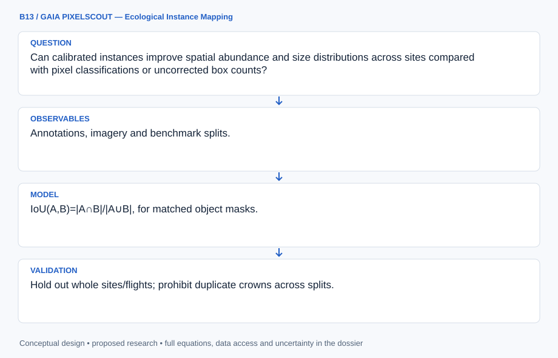

The diagram separates annotation types, mask matching and ecological error correction. Its outputs represent supported visible crown instances, with calibration uncertainty and an explicit boundary on transfer to unfamiliar habitats.

[Editable engineering diagram source](../visuals/projects/B13.mmd)

### 4. Mathematical model and derivation

#### Governing equations

```text
IoU(A,B)=|A∩B|/|A∪B|, for matched object masks.
```

```text
L=L_class+λ_mask L_mask+λ_boundary L_boundary; tune only within training data.
```

```text
N_hat=sum_detected_j P(true ecological instance_j | independent validation,features_j)/p_detect,j, propagating both truth-probability and detection-calibration uncertainty.
```

#### Variables, units and conventions

- A/B: prediction/reference masks; area: georeferenced m².
- p_detect: probability conditional on size, overlap and sensor.
- N: ecological instance abundance; centroid error: m.
- Class/size definitions retain biological meaning and physical units.
- Truth probability is calibrated on independent labeled validation objects. Any false-positive correction must use the same inverse-detection weighting as the detections.

#### Assumptions and boundary conditions

- Boxes are not full pixel-mask truth.
- Neighboring tiles may share crowns and require the same split.
- A visible crown may differ from a biological individual.

#### Derivation step 1

```text
IoU(A,B)=area(A intersection B)/area(A union B).
```

Masks share a pixel/map grid; an empty union is undefined. Georeferenced area may differ from raw pixel count if resolution varies.

#### Derivation step 2

```text
L=L_class+lambda_mask L_mask+lambda_boundary L_boundary.
```

Loss weights are dimensionless after defined normalizations and are selected inside training folds, not from withheld ecological outcomes.

#### Derivation step 3

```text
N_hat=sum_(detected j) q_j/p_j.
```

q is calibrated probability the detection is a true instance; p is detection probability conditional on a true instance. The inverse-detection weighting applies equally to commission correction.

#### Derivation step 4

```text
Var(N_hat) approximately J Sigma_(q,p) J^T+V_sampling.
```

Shared calibration parameters correlate corrected detections. The covariance term must include dependence among q and p, not merely sum object-level confidence variances.

#### Inference or simulation procedure

Audit annotation types/licenses, create double-reviewed mask subsets if needed and freeze matching rules. Train a documented instance architecture with simple detection baselines; preserve coordinate systems and stratify evaluation by overlap/size. Calibrate uncertainty, correct abundance using validation-derived detection models and propagate errors into spatial clustering/size distributions. Publish support masks and an abstention rule for unfamiliar habitats rather than presenting every detection as trustworthy.

#### Validity domain and fidelity limits

Visible canopy excludes many understory individuals. Annotation ambiguity limits performance; high image scores can still conceal biased ecological counts.

### 5. Data specifications and provenance

| Field | Type | Unit | Physical / statistical meaning | Quality and missing-data rule |
| --- | --- | --- | --- | --- |
| image_key | string | none | Acquisition/site/tile identity. | Shared-crown links constrain splits. |
| annotation_type | enum | none | box, polygon or raster mask. | No box labeled mask truth. |
| instance_mask | geometry | pixel/m² | Predicted or reference crown support. | Grid transform and provenance required. |
| centroid_xy | float[2] | m | Mapped object center. | CRS and positional error saved. |
| truth_probability | float | 0–1 | Validation-calibrated true-instance probability. | Calibration split/version required. |
| detection_probability | float | 0–1 | Probability of detecting true instance. | Positive supported range; tiny p flagged. |
| count_covariance | matrix | instances² | Joint corrected-count uncertainty. | Include shared calibration and sampling. |
| domain_support | enum | none | supported, extrapolated or abstained. | Novel habitat cannot default supported. |

[Machine-readable record schema](../data/contracts/B13.schema.json) · [Empty acquisition CSV](../data/contracts/B13.csv) · [Field dictionary CSV](../data/contracts/B13.dictionary.csv)

The CSV above contains column headers only. Its schema defines future records and does not establish that original-team data or a particular archive product have been acquired. Frame, timing, calibration, covariance, selection and provenance details must accompany populated records.

#### NeonTreeEvaluation benchmark data

[Product, archive or reference](https://zenodo.org/records/5914554)

**Fields:** Annotations, imagery and benchmark splits.

**Access:** Public Zenodo release; check each label type and license.

**Role:** Independent evaluation observations.

#### A remote sensing derived data set of 100 million individual tree crowns for NEON

[Product, archive or reference](https://elifesciences.org/articles/62922)

**Fields:** NEON crown products, methods and ecological evaluation.

**Access:** Open primary article with linked releases.

**Role:** Detection-to-ecology framework and scale limits.

### 6. Uncertainty, sensitivity and identifiability

Annotation ambiguity, overlapping crowns and acquisition resolution impose irreducible uncertainty. Use double-reviewed labels to estimate disagreement and evaluate size/overlap strata separately. A tree with multiple crowns or multiple trees within one crown breaks a simple biological identity assumption, so the released estimand is visible crown instances unless field evidence supports individuals.

Truth and detection probabilities are poorly identified in small strata, and inverse-probability weights explode near zero detection. Pool only defensible strata, profile calibration uncertainty and report effective support. Bootstrap sites and annotation blocks, retaining shared model/calibration variation. Domain shifts in species, illumination or canopy structure require abstention and local validation rather than a universal correction.

### 7. Engineering trade study

| Alternative | Benefit | Cost / limitation | Decision rule |
| --- | --- | --- | --- |
| Box detector baseline | Efficient available annotation use. | Does not yield validated masks. | Use when benchmark labels are boxes. |
| Reviewed instance-mask model | Supports area and boundary endpoints. | Costly annotation and overlap ambiguity. | Adopt where mask truth exists. |
| Sample-based crown inventory | Direct ecological review and calibration. | Sparse coverage and field cost. | Use as independent correction evidence. |

### 8. Verification and validation cases

| Case ID | Stimulus / condition | Expected result / criterion | Method | Evidence artifact |
| --- | --- | --- | --- | --- |
| B13-V1 | Identical/disjoint masks | IoU=1 and 0 respectively. | Condition/fixture: Compare equal masks and nonoverlapping masks. Verification procedure: Exact geometry fixtures.. | Exact geometry fixtures. |
| B13-V2 | Half-overlap masks | IoU=5/15=1/3. | Condition/fixture: Two equal-area masks of area 10 have intersection 5. Verification procedure: Analytic mask-area calculation.. | Analytic mask-area calculation. |
| B13-V3 | Perfect commission calibration | Corrected estimate is 20 instances under declared calibration. | Condition/fixture: Ten retained detections have q=1 and p=0.5. Verification procedure: Estimator unit check.. | Estimator unit check. |
| B13-V4 | Site holdout | Report calibration, omission and ecological bias by stratum. | Condition/fixture: Reserve complete sites, acquisitions and shared-crown blocks. Verification procedure: Spatial evaluation.. | Spatial evaluation. |

**Execution status:** these cases are specified, not claimed as executed. Close a case only with the versioned inputs, output, uncertainty, reviewer and pass/fail rationale.

#### Additional scientific validation gates

- Hold out whole sites/flights; prohibit duplicate crowns across splits.
- Report mask AP/IoU, ecological count bias, size-distribution error and interval coverage.
- Measure annotator agreement and stratify sensor, lighting, size and habitat-shift failures; test calibrated abstention.

### 9. Implementation and reproducible work packages

1. Publish annotation definitions, licenses and linked-tile/site manifests.
2. Construct reviewed mask subsets and label-disagreement artifacts.
3. Train detector and mask alternatives with frozen spatial splits.
4. Implement one-to-one matching and size/overlap score reports.
5. Calibrate truth/detection probabilities and covariance-aware ecological corrections.
6. Release masks, support layers and visible-crown estimand limitations.

#### Investigation sequence

1. Stage 1: define biological instances, audit labels and build reviewed references with site/flight splits.
2. Stage 2: train/calibrate models and propagate detection error into ecological summaries.
3. Stage 3: test a withheld site/sensor and release instances, model/data cards and failure envelopes.

#### Resources and interfaces to expertise

- Ecologist, remote-sensing analyst and annotation reviewers.
- GPU, geospatial tools, versioned checkpoints and licensed data manifest.

### 10. Failure modes and interpretation controls

| Failure mode | Effect on result | Detection / evidence | Design response |
| --- | --- | --- | --- |
| Boxes treated as masks | Inflated segmentation claim. | Annotation-type audit. | Create reviewed masks or restrict endpoint. |
| Tile leakage | Overstated generalization. | Shared-object/site split check. | Group linked tiles. |
| Unstable inverse weights | Huge unreliable abundance estimates. | Inspect p support and intervals. | Abstain or report bounds in sparse strata. |

- Label leakage and box/mask confusion.
- Invisible understory and ambiguous individuals.
- Domain shift biasing abundance maps.

### 11. Required engineering outputs

- Annotation manifest and model package.
- Uncertainty-bearing instance geodatabase.
- Ecological correction notebook and transfer limits.

#### Scientific result figures to produce during execution

Overlay reviewed/predicted crowns with uncertainty, then compare corrected counts and size distributions across withheld sites.

### 12. Cited technical and scientific resources

- [NeonTreeEvaluation benchmark data](https://zenodo.org/records/5914554) — Released remote-sensing annotations support benchmark testing; annotation type and licensing must be checked before claiming mask ground truth.
- [A remote sensing derived data set of 100 million individual tree crowns for NEON](https://elifesciences.org/articles/62922) — Primary tree-crown detection dataset and evaluation research supports ecological use with quantified detection error.

Framework and evidence rules: [engineering documentation standard](../docs/ENGINEERING_STANDARD.md), [model assurance](../docs/MODEL_ASSURANCE.md), [uncertainty procedure](../docs/UNCERTAINTY_AND_DECISION_RULES.md), and [data management](../docs/DATA_MANAGEMENT.md). NASA-inspired names are creative identifiers; requirements and results are not NASA certification.

---

<a id="b14"></a>

## B14 · PHOENIX INFILTRATION — Postfire Soil Recovery Observatory

**Original project:** Soil hydraulic properties three years after the Frye Fire on Mount Graham, Arizona

**Session B:** Earth & Environmental Engineering

**Document class:** engineering research design and analysis record · **Revision:** 2 · **Date:** 2026-10-02

**Evidence state:** design basis, mathematical formulation and verification plan documented. Project-specific empirical results remain to be acquired; executable shared model demonstrations have their own recorded checks.

[Engineering document register](../ENGINEERING_DOCUMENTATION.md) · [Session B handbook](../documentation/SESSION_B.md) · [Previous: B13](../projects/B/B13.md) · [Next: B15](../projects/B/B15.md)

### Purpose and scientific objective

Study three-year postfire hydraulics as heterogeneous recovery, without presuming burned soil always infiltrates less. The historical abstract reports the opposite direction in its sampled plots. Preserve that context and test litter, carbon, severity and spatial scaling as explanations; the abstract is not a replacement for raw measurements or new results.

**Question:** What explains burned/unburned infiltration and repellency differences, and how do point measurements translate into storm runoff?

**Testable hypothesis:** Litter/carbon and soil moisture may mediate contrasting responses; burn status alone should be incomplete, while rainfall intensity changes effective watershed parameters.

### 1. Design basis and analysis boundary

The postfire hydraulic reconstruction concerns the sampled Mount Graham plots approximately three years after the Frye Fire. The historical abstract reports higher infiltration in its burned plots, so the design tests that direction without generalizing it to all burned soils. Raw device readings, litter, carbon, texture, moisture, burn stratum and plot identity are required before a new quantitative conclusion.

Start with device-specific cumulative-infiltration fitting and hierarchical plot distributions. Advance to storm-runoff screening only after identifying the hydraulic meaning of the fitted parameters. Published postfire parameterization work informs scale limitations; the historical abstract is contextual evidence, not a substitute for raw observations. Cross-sectional differences do not uniquely reconstruct recovery or establish a carbon-mediated mechanism.

### 2. Requirements and verification traceability

These are project design requirements or proposed analysis gates. A numerical target is not a NASA requirement unless its controlling source is explicitly identified. “TBD” identifies evidence required before a decision; it is not permission to assume a value. Verification evidence listed here is planned, unless a linked result explicitly records execution.

| ID | Requirement / gate | Engineering rationale | Verification method | Basis / required evidence |
| --- | --- | --- | --- | --- |
| B14-R1 | Every infiltration series shall retain device geometry, imposed tension, contact protocol, elapsed time and cumulative volume. | Tension-device coefficients do not automatically equal saturated conductivity. | Metadata and device-equation audit. | Primary parameterization guidance. |
| B14-R2 | Preserve the historical greater-infiltration direction as a reported sampled-plot context, with all new effect estimates explicitly pending raw data. | A universal reduced-infiltration premise would reverse evidence. | Narrative/evidence lineage review. | Historical symposium abstract. |
| B14-R3 | Fit plot-level distributions and report burn contrasts conditional on moisture, litter, carbon and texture support. | Point measurements are heterogeneous. | Hierarchical residual and covariate support checks. | Proposed inference protocol. |
| B14-R4 | Watershed runoff products shall state spatial aggregation, rainfall intensity and tension-to-effective-parameter assumptions. | Point means may not represent storm infiltration. | Independent runoff ledger and scale-sensitivity test. | Existing scale limitation. |

### 3. Architecture and controlled interfaces

A device adapter converts measured volume and disk/contact area into cumulative depth mm while preserving imposed pressure head and elapsed time hours. Plot metadata includes burn severity, slope, texture, antecedent volumetric moisture and litter thickness. A sample adapter links carbon assays through plot/date identity and analytical uncertainty.

The local fitter estimates sorptivity and a device-specific late-time coefficient, then uses the validated geometry/tension relation only if required ancillary parameters exist. A hierarchical model estimates log hydraulic distributions across plots. The runoff screen accepts rainfall hyetographs and parameter ensembles; missing contact or tension metadata blocks conductivity interpretation while still allowing qualified descriptive infiltration curves.


The diagram distinguishes measured infiltration curves, device-specific parameters and watershed screening. It preserves the historical sampled-plot direction while requiring raw evidence before new effects or recovery mechanisms are quantified.

[Editable engineering diagram source](../visuals/projects/B14.mmd)

### 4. Mathematical model and derivation

#### Governing equations

```text
f(F)=K_s[1+ψ_f(θ_s−θ_i)/F], a Green–Ampt screening approximation.
```

```text
I(t)=S sqrt(t)+A t; state the tension-infiltration interpretation.
```

```text
log K_ij=α+β burn_ij+γ litter_ij+δ carbon_ij+u_plot+ε_ij.
```

#### Variables, units and conventions

- f/K_s: mm/hour; F: cumulative infiltration, mm.
- ψ_f: mm; θ: volumetric moisture, m³/m³.
- S: mm/hour^0.5; A: mm/hour.
- Litter: mm; carbon: mass fraction; repellency: documented time/score.

#### Assumptions and boundary conditions

- Device-specific tension equations/contact checks are required.
- Burn strata may have differed in texture/topography before fire.
- Point averages need not describe intense-storm watershed response.

#### Derivation step 1

```text
I(t)=V(t)/A_contact=S sqrt(t)+A_t t.
```

V in mm³ divided by contact area mm² gives mm. S has mm/hour^0.5 and A_t mm/hour; A_t is not automatically K_s for tension infiltration.

#### Derivation step 2

```text
dI/dt=S/(2 sqrt(t))+A_t.
```

The derivative diverges as t approaches zero, so early contact/transient observations need a documented fitting window rather than literal extrapolation.

#### Derivation step 3

```text
f(F)=K_s[1+psi_f Delta_theta/F].
```

This Green–Ampt screening model uses positive wetting-front suction magnitude psi_f in mm and cumulative infiltration F in mm; Delta_theta is dimensionless.

#### Derivation step 4

```text
log K_ij=alpha+beta burn_ij+gamma litter_ij+delta carbon_ij+u_plot+epsilon.
```

The conditional burn contrast is exp(beta) as a conductivity ratio. Covariate adjustment is not proof of mediation or a recovered prefire baseline.

#### Inference or simulation procedure

Recover authorized raw readings with dates, tensions, plot identities, litter, texture, moisture and carbon. Fit hierarchical hydraulic distributions and censored repellency responses where appropriate. Compare burn-only and covariate/mediation models without claiming carbon pathways from association alone. Drive runoff ensembles using observed rainfall and spatially variable parameters; compare arithmetic, geometric and effective summaries. Keep measurement, parameter-fitting and watershed-scaling uncertainty separate in the report.

#### Validity domain and fidelity limits

Original raw data may be unavailable. Cross-sectional comparisons cannot uniquely reconstruct recovery or prefire conditions, and hydraulic nonuniqueness limits mechanistic conclusions.

### 5. Data specifications and provenance

| Field | Type | Unit | Physical / statistical meaning | Quality and missing-data rule |
| --- | --- | --- | --- | --- |
| plot_key | string | none | Repeated measurement plot identity. | Burn/terrain provenance required. |
| elapsed_time | float[] | hour | Time since infiltration start. | Monotone; transient window recorded. |
| cumulative_depth | float[] | mm | Volume/contact-area conversion. | Monotone within error; area uncertainty saved. |
| imposed_tension | float | mm head | Device pressure-head condition. | Sign convention and geometry required. |
| sorptivity | float[] | mm/hour^0.5 | Fitted early-time uptake coefficient. | Covariance with late-time coefficient retained. |
| antecedent_moisture | nullable float | m³/m³ | Initial volumetric soil water. | Bounds and measurement method required. |
| soil_carbon | nullable float | mass fraction | Linked carbon assay. | Date/method covariance saved. |
| hydraulic_covariance | matrix | mixed | Joint fitted hydraulic uncertainty. | Separate device, plot and scale terms. |

[Machine-readable record schema](../data/contracts/B14.schema.json) · [Empty acquisition CSV](../data/contracts/B14.csv) · [Field dictionary CSV](../data/contracts/B14.dictionary.csv)

The CSV above contains column headers only. Its schema defines future records and does not establish that original-team data or a particular archive product have been acquired. Frame, timing, calibration, covariance, selection and provenance details must accompany populated records.

#### 2021 Arizona NASA Space Grant symposium booklet

[Product, archive or reference](https://spacegrant.arizona.edu/sites/spacegrant.arizona.edu/files/AZSGC%20Symposium%20Booklet%202021_website.pdf)

**Fields:** Original title and limited historical abstract.

**Access:** Public 2021 booklet; request measurements from investigators.

**Role:** Provenance and two-sided hypothesis.

#### Guidance for parameterizing post-fire hydrologic models with in situ infiltration measurements

[Product, archive or reference](https://experts.arizona.edu/en/publications/guidance-for-parameterizing-post-fire-hydrologic-models-with-in-s/)

**Fields:** Point-to-watershed upscaling and hydraulic distributions.

**Access:** Primary university publication record; raw data/code require its access statement.

**Role:** External methodological comparison.

### 6. Uncertainty, sensitivity and identifiability

Contact quality, imposed tension and antecedent moisture influence fitted infiltration, while litter and carbon may differ by prefire landscape. Model repeated readings within plots and compare burn-only versus covariate-adjusted effects. Treat absent raw measurements as a genuine evidence gap; the abstract's direction cannot supply variance or device parameters.

Sorptivity and late-time slope trade off in short records. Profile them over fitting windows, inspect covariance and compare device-consistent alternatives. Effective runoff parameters also depend on spatial connectivity and rainfall intensity; vary geometric/arithmetic summaries and retain scale discrepancy separately. A larger mean infiltration does not guarantee lower watershed runoff or a monotonic recovery trajectory.

### 7. Engineering trade study

| Alternative | Benefit | Cost / limitation | Decision rule |
| --- | --- | --- | --- |
| Direct cumulative-curve comparison | Requires few conversion assumptions. | Does not identify conductivity mechanism. | Use when device metadata is incomplete. |
| Device-specific hydraulic inversion | Produces interpretable local parameters. | Needs geometry/tension and ancillary properties. | Adopt only after equation verification. |
| Distributed storm-runoff screening | Connects plot uncertainty to decisions. | Upscaling dominates some scenarios. | Use with explicit spatial/rainfall sensitivity. |

### 8. Verification and validation cases

| Case ID | Stimulus / condition | Expected result / criterion | Method | Evidence artifact |
| --- | --- | --- | --- | --- |
| B14-V1 | Volume conversion | I=10 mm. | Condition/fixture: 1000 mm³ over 100 mm² contact area. Verification procedure: Exact adapter calculation.. | Exact adapter calculation. |
| B14-V2 | Known infiltration curve | I=8 mm and instantaneous rate=1.5 mm/hour. | Condition/fixture: S=2 mm/hour^0.5, A_t=1 mm/hour, t=4 hours. Verification procedure: Compare fitter/derivative with analytic values.. | Compare fitter/derivative with analytic values. |
| B14-V3 | Green–Ampt wet limit | f approaches K_s. | Condition/fixture: Delta_theta=0 or F grows much larger than psi_f Delta_theta. Verification procedure: Analytic parameter sweep.. | Analytic parameter sweep. |
| B14-V4 | Plot holdout | Report hydraulic predictive coverage and burn-effect sensitivity. | Condition/fixture: Reserve whole plots rather than individual readings. Verification procedure: Hierarchical blocked evaluation.. | Hierarchical blocked evaluation. |

**Execution status:** these cases are specified, not claimed as executed. Close a case only with the versioned inputs, output, uncertainty, reviewer and pass/fail rationale.

#### Additional scientific validation gates

- Hold out plots and storms; keep technical replicates together.
- Test device calibration and parameter identifiability using synthetic observations.
- Compare runoff volume/peak/timing with independent observations and report unresolved scaling alternatives.

### 9. Implementation and reproducible work packages

1. Recover authorized raw curves and document unavailable measurements explicitly.
2. Create device geometry/tension and plot/covariate schemas with unit conversions.
3. Implement cumulative-curve fitting and contact/window diagnostics.
4. Fit plot-level hydraulic distributions and profile covariate-supported burn contrasts.
5. Build rainfall/runoff screening artifacts with explicit parameter-upscaling alternatives.
6. Publish historical context, raw-data-dependent estimates and scale limitations together.

#### Investigation sequence

1. Stage 1: inventory data/instrument access, match soil strata and preregister two-sided comparisons.
2. Stage 2: estimate hydraulic distributions and covariate effects; construct rainfall-dependent runoff ensembles.
3. Stage 3: validate independent plots/storms and report recovery interpretation with point/watershed uncertainty separated.

#### Resources and interfaces to expertise

- Soil physicist, postfire hydrologist and original data custodian.
- Instrument metadata, rainfall histories and spatial runoff solver.

### 10. Failure modes and interpretation controls

| Failure mode | Effect on result | Detection / evidence | Design response |
| --- | --- | --- | --- |
| Late-time coefficient called K_s | Wrong hydraulic interpretation. | Device geometry/equation audit. | Use verified tension-specific conversion. |
| Burn effect direction assumed | Evidence reversal or confirmation bias. | Compare abstract and raw estimator. | Keep bidirectional hypotheses. |
| Point mean used watershed-wide | Misleading runoff response. | Scale and connectivity sensitivity. | Distributed ensemble and limitation labels. |

- Assumed burn-effect direction.
- Contact artifacts and unmatched soils.
- Unsupported debris-flow warning from plot results.

### 11. Required engineering outputs

- Hydraulic/repellency quality report and dictionary.
- Soil-response and runoff notebooks.
- Recovery uncertainty map and monitoring priorities.

#### Scientific result figures to produce during execution

Compare burn strata across litter/carbon distributions and show observed/predicted storm hydrographs with propagated uncertainty.

#### Included shared numerical starting point


[Executable formulation, parameters, tabular outputs, provenance and verification](../models/README.md). This shared demonstration has a narrower domain than the project model above. Its own caption and methods identify synthetic parameters or the separately retrieved public catalog; it is not a completed result of the original project.

### 12. Cited technical and scientific resources

- [2021 Arizona NASA Space Grant symposium booklet](https://spacegrant.arizona.edu/sites/spacegrant.arizona.edu/files/AZSGC%20Symposium%20Booklet%202021_website.pdf) — Original-title provenance only; historical abstracts are not new measurements or evidence of project completion.
- [Guidance for parameterizing post-fire hydrologic models with in situ infiltration measurements](https://experts.arizona.edu/en/publications/guidance-for-parameterizing-post-fire-hydrologic-models-with-in-s/) — Primary modeling study addresses the gap between point infiltration measurements and effective watershed parameters.

Framework and evidence rules: [engineering documentation standard](../docs/ENGINEERING_STANDARD.md), [model assurance](../docs/MODEL_ASSURANCE.md), [uncertainty procedure](../docs/UNCERTAINTY_AND_DECISION_RULES.md), and [data management](../docs/DATA_MANAGEMENT.md). NASA-inspired names are creative identifiers; requirements and results are not NASA certification.

---

<a id="b15"></a>

## B15 · TECTON ORION — Farallon Slab Reconstruction

**Original project:** Numerical simulation of Laramide flat-slab subduction

**Session B:** Earth & Environmental Engineering

**Document class:** engineering research design and analysis record · **Revision:** 2 · **Date:** 2026-10-02

**Evidence state:** design basis, mathematical formulation and verification plan documented. Project-specific empirical results remain to be acquired; executable shared model demonstrations have their own recorded checks.

[Engineering document register](../ENGINEERING_DOCUMENTATION.md) · [Session B handbook](../documentation/SESSION_B.md) · [Previous: B14](../projects/B/B14.md) · [Next: B16](../projects/B/B16.md)

### Purpose and scientific objective

Build a thermomechanical ensemble testing competing explanations for Laramide flat-slab geometry and upper-plate response. Treat buoyancy, convergence history, rheology and continental structure as uncertain inputs. Judge models against multiple geological constraints, not whether a simulated slab looks flat; distinguish plausible mechanisms from a uniquely recoverable tectonic history.

**Question:** Which parameter combinations reproduce slab flattening, inland deformation and magmatic patterns simultaneously?

**Testable hypothesis:** Coupled slab buoyancy and upper-plate structure may explain the observations better than any single forcing; multiple histories may remain observationally equivalent.

### 1. Design basis and analysis boundary

The numerical reconstruction explores whether uncertain Farallon slab buoyancy, convergence history and continental structure can jointly explain flat geometry and upper-plate response during the Laramide interval. Inputs are literature-constrained boundary histories and geological observation groups, with explicit uncertainty. A flat-looking slab is an intermediate model state, not sufficient validation of a tectonic mechanism.

Begin with a reproduced incompressible thermomechanical benchmark and two-dimensional screening ensembles. Add nonlinear rheology and selected three-dimensional tests only after conservation and convergence checks. Published models motivate competing mechanisms; viscosity ranges, density anomalies and ancient boundary histories remain uncertain scenario choices. The deliverable is a family of compatible mechanisms and observables that could discriminate them.

### 2. Requirements and verification traceability

These are project design requirements or proposed analysis gates. A numerical target is not a NASA requirement unless its controlling source is explicitly identified. “TBD” identifies evidence required before a decision; it is not permission to assume a value. Verification evidence listed here is planned, unless a linked result explicitly records execution.

| ID | Requirement / gate | Engineering rationale | Verification method | Basis / required evidence |
| --- | --- | --- | --- | --- |
| B15-R1 | Each run shall freeze force/thermal boundaries, rheology, density law, time conversion and mesh configuration. | Different boundary histories invalidate comparisons. | Manifest and dimensional audit. | Proposed reproducibility contract. |
| B15-R2 | Proposed solver target: discrete normalized divergence and energy-balance residuals below 10^-5, subject to demonstrated mesh convergence. | Numerical artifacts must not mimic flattening. | Independent residual calculator. | Proposed numerical target, not geologic threshold. |
| B15-R3 | Score slab geometry and at least one independent upper-plate/thermal observation group with covariance. | One shape cannot identify a mechanism. | Observation-group score audit. | Primary modeling context. |
| B15-R4 | Surrogates shall flag outside-ensemble inputs and retain failed/unstable runs in the audit trail. | Regime boundaries can defeat interpolation. | Held-out and failure-envelope review. | Proposed emulator contract. |

### 3. Architecture and controlled interfaces

A scenario registry stores convergence in m/s, geologic epochs with stated Ma convention, mantle/lithosphere density kg/m³ and thermal/rheological laws. The mesh adapter records length m and boundary labels. Geological constraints use separately named dip, arc position, deformation and thermal groups with age and spatial covariance.

The Stokes solver produces velocity/pressure coupled to advective-diffusive heat transport. Derived metrics include slab dip, flattening extent and upper-plate stress proxies. A convergence controller rejects unresolved runs before emulator training. The inverse comparator combines independent observation groups while preserving shared age uncertainty; 3D promotion evaluates along-strike sensitivity instead of automatically increasing confidence.


The model diagram couples mechanical and thermal physics while gating inference on numerical verification and independent geological groups. It exposes ancient-boundary and dimensionality uncertainty rather than claiming one recovered tectonic history.

[Editable engineering diagram source](../visuals/projects/B15.mmd)

### 4. Mathematical model and derivation

#### Governing equations

```text
∇·u=0; −∇p+∇·[η(T,P,ε̇)(∇u+∇uᵀ)]+ρg=0.
```

```text
ρc_p(∂T/∂t+u·∇T)=∇·(k∇T)+H.
```

```text
J(θ)=Σ_k residual_kᵀ Σ_k⁻¹ residual_k, with independent geological groups.
```

#### Variables, units and conventions

- u: m/s; p: Pa; η: Pa·s; ρ: kg/m³.
- T: K; k: W/m/K; H: W/m³; c_p: J/kg/K.
- θ: buoyancy, convergence, viscosity and lithospheric-thickness parameters.
- Slab dip: degrees; deformation/arc position: km; geologic time: Ma.

#### Assumptions and boundary conditions

- 2D sections cannot capture all along-strike slab tearing or curvature.
- Ancient boundary conditions and density anomalies are uncertain.
- Modern observations may have experienced subsequent tectonic modification.

#### Derivation step 1

```text
div u=0; -grad p+div(2 eta epsilon(u))+rho g=0.
```

Stokes force terms have N/m³ units; epsilon is the symmetric strain-rate tensor s^-1 and eta is Pa s.

#### Derivation step 2

```text
rho c_p(DT/Dt)=div(k grad T)+H.
```

Both sides are W/m³. Boundary heat flux and internal heating enter the integrated energy ledger.

#### Derivation step 3

```text
Pe=U L/kappa; kappa=k/(rho c_p); Ra=Delta rho g L^3/(eta kappa).
```

Peclet and buoyancy Rayleigh numbers are dimensionless screening groups; declared reference scales permit consistent scenario comparisons.

#### Derivation step 4

```text
J=sum_g r_g^T Sigma_g^-1 r_g.
```

Residuals use group-specific physical units and covariance. Correlated geological ages cannot be counted as independent constraints across groups.

#### Inference or simulation procedure

Reproduce a published benchmark, then vary physically justified input ranges through designed ensembles. Compare buoyant-slab, convergence and continental-root scenarios using thermal structure, slab geometry and upper-plate stresses. Build a fast surrogate only after verifying numerical solutions; propagate prior/observation uncertainty and identify parameter tradeoffs. Add 3D cases selectively when along-strike effects could change the inference. Keep all failed or unstable model runs in the audit trail.

#### Validity domain and fidelity limits

Nonlinear rheology and poorly known ancient boundary conditions limit unique reconstruction. Matching one observation does not establish a mechanism, and surrogate accuracy may degrade near regime boundaries.

### 5. Data specifications and provenance

| Field | Type | Unit | Physical / statistical meaning | Quality and missing-data rule |
| --- | --- | --- | --- | --- |
| scenario_key | string | none | Boundary/rheology ensemble identity. | Hash complete configuration. |
| convergence_velocity | float[] | m/s | Prescribed plate history. | Ma-to-second conversion explicit. |
| viscosity | float field | Pa s | Temperature/pressure/strain dependent rheology. | Positive; cutoff provenance retained. |
| temperature | float field | K | Thermal model state. | Boundary and initial condition keys required. |
| density_anomaly | float field | kg/m³ | Buoyancy relative to reference. | Reference density and composition law explicit. |
| slab_metrics | float vector | degrees km | Dip and flattening/arc descriptors. | Extraction method/version retained. |
| geology_covariance | matrix | mixed | Joint observation-group uncertainty. | Age/spatial correlations documented. |
| run_status | enum | none | converged, failed or unsupported. | Failed runs never silently discarded. |

[Machine-readable record schema](../data/contracts/B15.schema.json) · [Empty acquisition CSV](../data/contracts/B15.csv) · [Field dictionary CSV](../data/contracts/B15.dictionary.csv)

The CSV above contains column headers only. Its schema defines future records and does not establish that original-team data or a particular archive product have been acquired. Frame, timing, calibration, covariance, selection and provenance details must accompany populated records.

#### Farallon plate dynamics prior to the Laramide orogeny: numerical models of flat subduction

[Product, archive or reference](https://www.sciencedirect.com/science/article/abs/pii/S0040195115005594)

**Fields:** Published flat-subduction scenarios, geometry and boundary-condition descriptions.

**Access:** Primary publisher record; full text/model files may need institutional or author access.

**Role:** Benchmark and mechanism hypotheses.

#### Basal continental mantle lithosphere displaced by flat-slab subduction

[Product, archive or reference](https://www.nature.com/articles/s41561-018-0263-9)

**Fields:** Thermomechanical upper-plate deformation predictions and geological context.

**Access:** Primary Nature paper; consult its data/code statement.

**Role:** Independent discriminator and alternative scenario.

### 6. Uncertainty, sensitivity and identifiability

Ancient convergence, density anomalies and lithospheric structure have broad uncertainty, while later tectonics modifies surviving observations. Separate these uncertainties from numerical discretization. Vary observation age assignments jointly, and compare models with and without potentially reworked constraints rather than giving every point equal authority.

Buoyancy and viscosity can trade off with convergence in producing slab geometry. Use designed ensembles, Sobol or local sensitivity diagnostics and profile compatible parameter combinations across multiple observation groups. Inspect surrogate error near transitions and reserve direct numerical runs there. Along-strike structure may invalidate 2D inference; selected 3D cases quantify that discrepancy without claiming a unique reconstruction.

### 7. Engineering trade study

| Alternative | Benefit | Cost / limitation | Decision rule |
| --- | --- | --- | --- |
| Two-dimensional linear-rheology screen | Affordable transparent mechanism comparison. | Omits nonlinear and along-strike effects. | Use for benchmark and coarse exploration. |
| Nonlinear thermomechanical sections | Represents feedback and upper-plate response. | More parameter dependence and solver difficulty. | Adopt after residual/mesh verification. |
| Selected three-dimensional cases | Tests curvature and slab tearing sensitivity. | High cost and uncertain geometry. | Use where along-strike evidence can change ranking. |

### 8. Verification and validation cases

| Case ID | Stimulus / condition | Expected result / criterion | Method | Evidence artifact |
| --- | --- | --- | --- | --- |
| B15-V1 | Hydrostatic rest | u=0 with grad p=rho g. | Condition/fixture: Uniform density, zero imposed velocity and isothermal boundaries. Verification procedure: Compare solver to analytic equilibrium.. | Compare solver to analytic equilibrium. |
| B15-V2 | Pure thermal diffusion | Recover documented one-dimensional diffusion solution and energy balance. | Condition/fixture: No velocity/heating; fixed boundary temperatures. Verification procedure: Independent analytic benchmark.. | Independent analytic benchmark. |
| B15-V3 | Mesh/time refinement | Metrics converge within declared target; otherwise inference is withheld. | Condition/fixture: Repeat a synthetic scenario with finer mesh and steps. Verification procedure: Richardson/residual analysis.. | Richardson/residual analysis. |
| B15-V4 | Withheld observation group | Report predictive residuals and mechanism rank reversals. | Condition/fixture: Fit geometry while reserving upper-plate/thermal evidence. Verification procedure: Group holdout comparison.. | Group holdout comparison. |

**Execution status:** these cases are specified, not claimed as executed. Close a case only with the versioned inputs, output, uncertainty, reviewer and pass/fail rationale.

#### Additional scientific validation gates

- Demonstrate mesh/time-step convergence and heat/mass balance.
- Hold out entire geological constraint groups; do not tune and score on identical arc positions.
- Use synthetic inverse tests and alternative priors to show which parameters are recoverable; verify surrogate predictions on new solver runs.

### 9. Implementation and reproducible work packages

1. Freeze boundary-history, rheology and geological constraint manifests.
2. Implement Stokes/thermal benchmark and independent residual/energy ledgers.
3. Generate designed 2D ensembles and retain all failure configurations.
4. Extract geometry, thermal and upper-plate metrics with covariance.
5. Train supported surrogates and verify withheld direct solutions.
6. Run targeted 3D sensitivity cases and publish compatible mechanism families.

#### Investigation sequence

1. Stage 1: reproduce reference conservation/geometry benchmarks and compile dated geological constraints with errors.
2. Stage 2: run an auditable design of experiments and characterize mechanism/parameter nonuniqueness.
3. Stage 3: test withheld geological regions or constraint groups and release a ranked ensemble with applicability limits.

#### Resources and interfaces to expertise

- Geodynamicist, structural geologist and high-performance computing access.
- Thermomechanical solver, rheology documentation and geological-age crosswalk.

### 10. Failure modes and interpretation controls

| Failure mode | Effect on result | Detection / evidence | Design response |
| --- | --- | --- | --- |
| Numerical flattening | False mechanism success. | Mesh, viscosity cutoff and residual sweep. | Reject unresolved runs. |
| One-observable fit | Nonunique mechanism presented certain. | Independent-group holdout failures. | Joint compatible-family reporting. |
| Surrogate boundary failure | Misranked scenarios near transitions. | Direct-run discrepancy and support flag. | Adaptive direct solves near transitions. |

- Boundary-condition overfitting.
- Missing 3D physics or rheological nonuniqueness.
- Geological dates treated as exact points.

### 11. Required engineering outputs

- Reproduced benchmark and solver configuration.
- Parameter/geometry/stress ensemble archive.
- Evidence-ranked tectonic reconstruction with uncertainty.

#### Scientific result figures to produce during execution

Animate temperature/slab sections and compare geological constraints; show credible mechanism regions rather than one preferred image.

### 12. Cited technical and scientific resources

- [Farallon plate dynamics prior to the Laramide orogeny: numerical models of flat subduction](https://www.sciencedirect.com/science/article/abs/pii/S0040195115005594) — Primary numerical research motivates competing slab-flattening mechanisms and model comparison.
- [Basal continental mantle lithosphere displaced by flat-slab subduction](https://www.nature.com/articles/s41561-018-0263-9) — Primary thermomechanical modeling supports upper-plate response as an additional discriminator.

Framework and evidence rules: [engineering documentation standard](../docs/ENGINEERING_STANDARD.md), [model assurance](../docs/MODEL_ASSURANCE.md), [uncertainty procedure](../docs/UNCERTAINTY_AND_DECISION_RULES.md), and [data management](../docs/DATA_MANAGEMENT.md). NASA-inspired names are creative identifiers; requirements and results are not NASA certification.

---

<a id="b16"></a>

## B16 · ISS BIOGUARD — Retrospective Microgravity Health Evidence

**Original project:** Multi-drug Resistance of Pseudomonas aeruginosa Under Microgravity Growth Conditions

**Session B:** Earth & Environmental Engineering

**Document class:** engineering research design and analysis record · **Revision:** 2 · **Date:** 2026-10-02

**Evidence state:** design basis, mathematical formulation and verification plan documented. Project-specific empirical results remain to be acquired; executable shared model demonstrations have their own recorded checks.

[Engineering document register](../ENGINEERING_DOCUMENTATION.md) · [Session B handbook](../documentation/SESSION_B.md) · [Previous: B15](../projects/B/B15.md) · [Next: B17](../projects/B/B17.md)

### Purpose and scientific objective

Preserve this project through a non-operational retrospective analysis of archived omics and documented antimicrobial phenotypes. Assess whether reported microgravity associations persist after accounting for platform, strain, oxygen and batch differences. The work does not culture, select, engineer or experimentally adapt the organism, and does not treat transcriptional signatures as demonstrated clinical resistance.

**Question:** Do archived studies support a reproducible microgravity-associated resistance phenotype, or only context-dependent expression changes?

**Testable hypothesis:** Platform and oxygen-transfer differences may explain a substantial part of observed expression variation; phenotype-linked associations may not generalize from low-shear analogues to spaceflight.

### 1. Design basis and analysis boundary

The retained project is a nonclinical, nonoperational analysis of existing archived omics and author-reported antimicrobial phenotypes. It evaluates whether published microgravity associations survive platform, strain, oxygen and batch confounding. The boundary excludes organism growth, selection, adaptation, genetic construction and any operational instructions; outputs concern evidence quality and reproducibility rather than actionable resistance targets.

Begin with an archive metadata/control-matching audit, then standardized retrospective expression contrasts and cross-study heterogeneity. NASA records provide an analogue-study access route, not proof that analogue exposure equals spaceflight or that expression establishes multidrug resistance. Phenotype evidence is included only when directly reported with assay definitions. Missing phenotypes remain unresolved and no clinical treatment recommendation follows.

### 2. Requirements and verification traceability

These are project design requirements or proposed analysis gates. A numerical target is not a NASA requirement unless its controlling source is explicitly identified. “TBD” identifies evidence required before a decision; it is not permission to assume a value. Verification evidence listed here is planned, unless a linked result explicitly records execution.

| ID | Requirement / gate | Engineering rationale | Verification method | Basis / required evidence |
| --- | --- | --- | --- | --- |
| B16-R1 | Every sample shall retain study, exposure platform, strain label, biological-replicate identity and available batch/oxygen metadata. | Exposure confounding can overwhelm a small study. | Metadata matrix and design-rank audit. | NASA archive provenance. |
| B16-R2 | Classify evidence separately as author-reported susceptibility, expression association or mechanistic speculation. | Transcripts cannot establish resistance. | Evidence-table lineage review. | Existing scope distinction. |
| B16-R3 | Proposed inferential reporting uses Benjamini–Hochberg adjusted q<=0.05 for declared expression families, alongside effect intervals and replication. | Multiple comparisons need transparent control. | Recompute adjusted values on synthetic p-values. | Proposed analysis convention. |
| B16-R4 | Release only retrospective aggregate evidence and pipeline provenance; no prioritized enhancement targets or biological procedures. | Keeps the work within its authorized analytical scope. | Deliverable content review. | Nonoperational project boundary. |

### 3. Architecture and controlled interfaces

A metadata adapter resolves archived sample/control groups, library or platform measurements, replicate units and exposure categories. An assay registry distinguishes RNA sequencing counts from array intensities and phenotype measures; unsupported platform mixing is blocked. Public accession and checksum manifests specify which files are actually available.

The analysis branch models broad retrospective expression contrasts with batch covariates only when identifiable. A separate evidence matrix links published phenotype definitions without imputing resistance from expression. Study-level effects and standard errors feed heterogeneity analysis. Missing oxygen/strain metadata, rank-deficient designs and noncomparable phenotypes propagate uncertainty grades, rather than being repaired through guessed values.

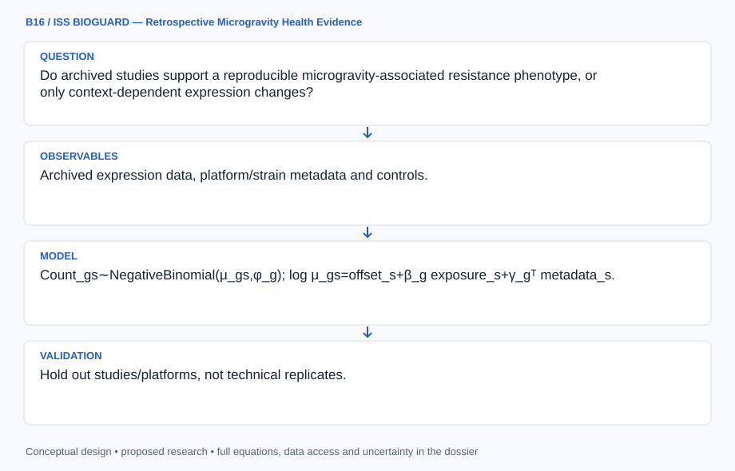

The diagram confines the project to archived retrospective analysis and separates expression from directly reported phenotype evidence. Confounding and absent endpoints remain explicit limits, with no organism manipulation or treatment interpretation.

[Editable engineering diagram source](../visuals/projects/B16.mmd)

### 4. Mathematical model and derivation

#### Governing equations

```text
Count_gs∼NegativeBinomial(μ_gs,φ_g); log μ_gs=offset_s+β_g exposure_s+γ_gᵀ metadata_s.
```

```text
Effect_study=β_common+u_study, with heterogeneity estimated across datasets.
```

```text
Evidence_grade separates measured susceptibility, expression association and mechanistic speculation.
```

#### Variables, units and conventions

- Counts: reads per gene/sample; offsets: library normalization.
- β: log-expression contrast; φ: dispersion; uncertainty retained.
- Exposure: documented flight/analogue/control category, not assumed equivalent.
- Phenotypes: author-reported susceptibility measures with units and test standards.

#### Assumptions and boundary conditions

- A transcript difference alone does not establish antimicrobial resistance.
- Analogue/spaceflight datasets may differ in strain, sampling and oxygen exposure.
- Only existing approved records are analyzed; no operational biological procedures are proposed.

#### Derivation step 1

```text
Y_gs~NB(mu_gs,phi_g); log mu_gs=log L_s+beta_g X_s+gamma_g^T Z_s.
```

L is a documented library normalization offset. Counts are dimensionless; beta is a log-expression contrast and requires exposure not perfectly confounded with batch.

#### Derivation step 2

```text
rank([X Z])<number_of_columns implies nonidentifiable coefficients.
```

A metadata audit can show that platform or strain perfectly predicts exposure; in that case no adjusted microgravity-specific effect is estimated.

#### Derivation step 3

```text
beta_hat_k=beta_common+u_k+epsilon_k; Var=u_variance+s_k².
```

Study-level sampling error and between-study heterogeneity are separate. Noncomparable endpoints remain separate analyses.

#### Derivation step 4

```text
I^2=max(0,(Q-df)/Q) for Q>0; q=BH(p). For Q=0 report the adopted I^2=0 convention, and separately mark heterogeneity unestimable when the number of comparable studies is insufficient.
```

Heterogeneity and multiplicity summaries describe statistical evidence, not clinical resistance, causal mechanism or operational biological performance.

#### Inference or simulation procedure

Audit archived experiment metadata, control matching and biological-replicate counts before analysis. Apply a documented omics pipeline with batch/platform covariates, false-discovery control and sensitivity to oxygen/strain confounding. Connect findings only to directly reported phenotype evidence using an evidence matrix; where phenotypes are absent, retain the claim as unresolved. Cross-study meta-analysis emphasizes broad health-risk evidence and replication rather than ranking actionable resistance targets.

#### Validity domain and fidelity limits

Small experiments and incomplete metadata limit confounder adjustment. Published susceptibility assays may be incomparable, while gene expression is not a clinical outcome or proof of multidrug resistance.

### 5. Data specifications and provenance

| Field | Type | Unit | Physical / statistical meaning | Quality and missing-data rule |
| --- | --- | --- | --- | --- |
| accession | string | none | Archived experiment/file identity. | Actual availability and checksums recorded. |
| exposure_class | enum | none | flight, analogue or matched control. | Categories never assumed equivalent. |
| replicate_key | string | none | Independent biological sample unit. | Technical replicates linked, not independent. |
| measurement_type | enum | none | counts, array intensity or phenotype. | Select compatible analysis branch. |
| confounder_metadata | nullable record | declared | Platform/strain/batch/oxygen descriptors. | Unknown remains null. |
| effect_interval | float[3] | log contrast | Estimate and uncertainty bounds. | Design rank and family recorded. |
| phenotype_evidence | nullable record | author-reported units | Direct published susceptibility endpoint. | No inference from expression alone. |
| evidence_grade | enum | none | Replicated, limited or unresolved support. | Reasons and source links retained. |

[Machine-readable record schema](../data/contracts/B16.schema.json) · [Empty acquisition CSV](../data/contracts/B16.csv) · [Field dictionary CSV](../data/contracts/B16.dictionary.csv)

The CSV above contains column headers only. Its schema defines future records and does not establish that original-team data or a particular archive product have been acquired. Frame, timing, calibration, covariance, selection and provenance details must accompany populated records.

#### NASA dataset: response of Pseudomonas aeruginosa PAO1 to low-shear modeled microgravity

[Product, archive or reference](https://data.nasa.gov/dataset/response-of-pseudomonas-aeruginosa-pao1-to-low-shear-modeled-microgravity-ff431)

**Fields:** Archived expression data, platform/strain metadata and controls.

**Access:** Public NASA catalog; follow its linked repository and record exact accession/version before use.

**Role:** Retrospective observations and platform audit.

#### NASA researcher guide to GeneLab

[Product, archive or reference](https://www.nasa.gov/science-research/for-researchers/researchers-guide-to-genelab/)

**Fields:** Space-biology archive access and experiment metadata guidance.

**Access:** Public NASA guide; dataset-level licenses and access may vary.

**Role:** Reproducible reuse framework.

### 6. Uncertainty, sensitivity and identifiability

Small experiments, incomplete oxygen/strain metadata and platform differences restrict adjustment. Examine design rank before fitting; a confounded factor cannot be rescued by adding more coefficients. Use sensitivity analyses that omit unsupported contrasts and report the resulting evidence gap. Technical replicates do not increase independent biological sample size.

Normalization, dispersion and study heterogeneity affect expression intervals. Compare documented compatible analysis choices and leave one study out, while keeping broad endpoint-level reporting. Phenotype assay incompatibility contributes a separate evidence uncertainty that meta-analysis cannot erase. A reproducible association is still neither clinical multidrug resistance nor proof of a gravity-specific mechanism.

### 7. Engineering trade study

| Alternative | Benefit | Cost / limitation | Decision rule |
| --- | --- | --- | --- |
| Metadata-only evidence audit | Safest inference when raw files/confounders are incomplete. | Cannot estimate adjusted effects. | Default for unavailable or rank-deficient studies. |
| Compatible-platform retrospective model | Quantifies expression association with uncertainty. | Small samples and residual confounding remain. | Use only with identified design contrasts. |
| Study-level evidence synthesis | Tests consistency across existing reports. | Endpoint/platform heterogeneity limits pooling. | Pool only genuinely comparable aggregate endpoints. |

### 8. Verification and validation cases

| Case ID | Stimulus / condition | Expected result / criterion | Method | Evidence artifact |
| --- | --- | --- | --- | --- |
| B16-V1 | Null contrast | Effect centers on zero with nominal uncertainty; no resistance conclusion. | Condition/fixture: Synthetic matched data have identical group distributions. Verification procedure: Known-null statistical fixture.. | Known-null statistical fixture. |
| B16-V2 | Perfect batch confounding | Design is rank deficient and adjusted effect is blocked. | Condition/fixture: Exposure column equals batch column. Verification procedure: Linear-algebra rank check.. | Linear-algebra rank check. |
| B16-V3 | Duplicate technical replicate | Independent sample count remains unchanged. | Condition/fixture: Add a duplicate measurement of one biological sample. Verification procedure: Metadata/pipeline integration test.. | Metadata/pipeline integration test. |
| B16-V4 | Study holdout | Report prediction/contrast consistency and unresolved metadata limits. | Condition/fixture: Reserve a complete archived study. Verification procedure: Leave-study-out synthesis.. | Leave-study-out synthesis. |

**Execution status:** these cases are specified, not claimed as executed. Close a case only with the versioned inputs, output, uncertainty, reviewer and pass/fail rationale.

#### Additional scientific validation gates

- Hold out studies/platforms, not technical replicates.
- Require measured phenotype evidence for resistance claims and report assay comparability.
- Use negative-control contrasts, batch diagnostics and confounder sensitivity; publish null/unstable findings and interval coverage.

### 9. Implementation and reproducible work packages

1. Create an accession/availability manifest and a nonoperational scope statement.
2. Audit control matching, replicate identity and design-matrix rank.
3. Implement compatible retrospective measurement branches with versioned normalization.
4. Save aggregate effects, multiplicity control and confounder sensitivity artifacts.
5. Build a separate phenotype evidence matrix and study-heterogeneity report.
6. Release reproducible analytical provenance and unresolved health-evidence conclusions.

#### Investigation sequence

1. Stage 1: inventory accessible studies and metadata, specify comparison eligibility and separate phenotype from omics endpoints.
2. Stage 2: estimate adjusted study-level associations with false-discovery and heterogeneity analyses.
3. Stage 3: test an independent archived study and deliver an evidence-gap report for spacecraft health research.

#### Resources and interfaces to expertise

- Space-biology bioinformatician and clinical-microbiology evidence reviewer.
- Read-only public omics pipeline, accession manifest and approved phenotype literature.

### 10. Failure modes and interpretation controls

| Failure mode | Effect on result | Detection / evidence | Design response |
| --- | --- | --- | --- |
| Expression called resistance | Unsupported clinical claim. | Evidence-grade audit. | Require direct reported phenotype. |
| Analogue equated flight | Overgeneralized gravity association. | Exposure-category review. | Separate platform effects. |
| Confounded adjusted estimate | Spurious causal contrast. | Rank and sensitivity diagnostics. | Report nonidentifiability. |

- Operationalizing results into resistance enhancement.
- Confusing low-shear analogues with true microgravity.
- Overclaiming phenotype from omics or incomplete controls.

### 11. Required engineering outputs

- Metadata/comparability audit and reproducible analysis.
- Phenotype-versus-expression evidence matrix.
- Replication and crew-health research-gap report.

#### Scientific result figures to produce during execution

Display studies by platform and endpoint, separating measured susceptibility from expression associations, with confidence intervals and metadata gaps.

### 12. Cited technical and scientific resources

- [NASA dataset: response of Pseudomonas aeruginosa PAO1 to low-shear modeled microgravity](https://data.nasa.gov/dataset/response-of-pseudomonas-aeruginosa-pao1-to-low-shear-modeled-microgravity-ff431) — Archived microgravity-analogue dataset supports retrospective omics analysis; analogue exposure is not equivalent to true spaceflight.
- [NASA researcher guide to GeneLab](https://www.nasa.gov/science-research/for-researchers/researchers-guide-to-genelab/) — Explains public space-biology omics reuse and associated experiment metadata.

Framework and evidence rules: [engineering documentation standard](../docs/ENGINEERING_STANDARD.md), [model assurance](../docs/MODEL_ASSURANCE.md), [uncertainty procedure](../docs/UNCERTAINTY_AND_DECISION_RULES.md), and [data management](../docs/DATA_MANAGEMENT.md). NASA-inspired names are creative identifiers; requirements and results are not NASA certification.

---

<a id="b17"></a>

## B17 · AQUARIUS LIFELINE — Inland Fisheries Resilience

**Original project:** Off the Hook: Assessing the Vulnerability of Inland Subsistence Fisheries to Climate Change

**Session B:** Earth & Environmental Engineering

**Document class:** engineering research design and analysis record · **Revision:** 2 · **Date:** 2026-10-02

**Evidence state:** design basis, mathematical formulation and verification plan documented. Project-specific empirical results remain to be acquired; executable shared model demonstrations have their own recorded checks.

[Engineering document register](../ENGINEERING_DOCUMENTATION.md) · [Session B handbook](../documentation/SESSION_B.md) · [Previous: B16](../projects/B/B16.md) · [Next: B18](../projects/B/B18.md)

### Purpose and scientific objective

Assess climate vulnerability as the interaction of aquatic exposure, ecological sensitivity and household dependence, with local knowledge and governance central to interpretation. Build a transparent scenario model for one consented basin before scaling. Avoid reducing communities to a universal vulnerability score or equating fishery-production changes with measured food insecurity.

**Question:** Which climate and access stresses most threaten dependable subsistence harvest, and which feasible adaptations reduce downside risk?

**Testable hypothesis:** Seasonal hydrologic extremes combined with high dietary dependence and constrained alternatives may matter more than annual mean warming alone; adaptation effects will differ among households and governance systems.

### 1. Design basis and analysis boundary

The fisheries system is a basin-specific, community-governed scenario analysis joining consented catch/effort histories, aquatic exposure and household dependence. Basin identity, species groups and permissions are TBD until an actual partnership defines them. The engineering decision is comparison of locally feasible adaptations under ecological and access uncertainty, rather than a universal vulnerability ranking or inferred food-insecurity diagnosis.

Begin with a transparent exposure/dependence inventory and missing-harvest bounds. Promote to a biomass/harvest state model only where effort and ecological records identify it. FAO assessments motivate separate exposure, sensitivity and adaptive-capacity pathways; local weights and adaptation losses remain participatory choices. CARE governance complements, and does not replace, community-specific authority over knowledge, linkage and release.

### 2. Requirements and verification traceability

These are project design requirements or proposed analysis gates. A numerical target is not a NASA requirement unless its controlling source is explicitly identified. “TBD” identifies evidence required before a decision; it is not permission to assume a value. Verification evidence listed here is planned, unless a linked result explicitly records execution.

| ID | Requirement / gate | Engineering rationale | Verification method | Basis / required evidence |
| --- | --- | --- | --- | --- |
| B17-R1 | No household/harvest linkage or public release shall occur without recorded community data authority, permitted purpose and aggregation rules. | Subsistence knowledge is not automatically public data. | Governance-policy and export audit. | CARE framework and local rules. |
| B17-R2 | Catch shall retain species, period, effort unit, gear/access context and reporting coverage; informal harvest is not assigned zero. | Recorded catch may omit subsistence activity. | Completeness and missing-harvest review. | FAO context; proposed contract. |
| B17-R3 | Model ecological biomass change, access restriction and household dependence as separate pathways. | A smaller catch may reflect effort or access. | Endpoint/model-structure review. | Existing vulnerability distinction. |
| B17-R4 | Adaptation rankings shall publish scenario distributions and sensitivity to locally selected weights/costs. | Values and uncertain futures shape priorities. | Independent multiobjective recomputation. | Participatory design requirement. |

### 3. Architecture and controlled interfaces

A restricted catch table records harvest kg per interval, effort fisher-days and species/gear metadata. Hydrologic adapters supply temperature °C, discharge m³/s and flood duration days with coverage. A community knowledge layer stores access rules and observations under its own permission policy rather than flattening narrative evidence into an assumed numeric score.

The ecological model emits biomass/availability ensembles; an access module determines feasible harvest opportunity. A household dependence adapter uses approved dietary/income fractions with survey uncertainty. Adaptation scenarios change specified access, exposure or livelihood terms and retain costs in stated local currency/year. The release service aggregates only permitted products and exposes omitted knowledge instead of claiming that a public table captures all community experience.


The architecture preserves community authority and separates ecological, access and livelihood pathways. It supports basin-specific adaptation comparison while exposing missing harvest, uncertain catchability and the value choices behind any score.

[Editable engineering diagram source](../visuals/projects/B17.mmd)

### 4. Mathematical model and derivation

#### Governing equations

```text
Harvest_st=Effort_st×Catchability_st×Biomass_st+ε_st.
```

```text
Biomass_(t+1)=Biomass_t+Recruitment_t−NaturalLoss_t−Harvest_t.
```

```text
V_g=f(Exposure_g,Sensitivity_g,AdaptiveCapacity_g); weights are participatory/scenario-defined.
```

#### Variables, units and conventions

- Harvest/biomass: kg; effort: fisher-days or documented gear effort.
- Water temperature: °C; discharge: m³/s; flood duration: days.
- Dependence: dietary/income fractions; adaptation costs: local currency.
- V: transparent scenario index, not a clinical or universal causal metric.

#### Assumptions and boundary conditions

- Recorded catch may omit informal/subsistence harvest.
- Effort and catchability change with climate, access and gear.
- Community/Indigenous data rights govern collection, linkage and release.

#### Derivation step 1

```text
H_t=E_t q_t B_t+epsilon_t.
```

Harvest H is kg per interval, effort E is fisher-days, biomass B is kg and q has fisher-day^-1 units. Catchability is not constant when gear or habitat availability changes.

#### Derivation step 2

```text
B_(t+1)=B_t+R_t-M_t-H_t.
```

All additions/losses are kg over the same interval. Negative states trigger infeasibility or a constrained model, not plausible negative fish biomass.

#### Derivation step 3

```text
d_g=H_subsistence,g/food_or_income_total,g.
```

Numerator and denominator require the same dietary mass/energy or income basis; monetary and nutrition dependence remain separate variables.

#### Derivation step 4

```text
L_g(a,omega)=w_E L_ecology+w_A L_access+w_D L_dependence+C_g(a).
```

Loss components must be normalized or share units before combination. Weights are approved preferences, and scenario omega includes climate/nonclimate stresses.

#### Inference or simulation procedure

Combine consented catch/effort histories, hydrology, fish ecological tolerances and participatory household dependence assessments. Fit a state-space harvest/biomass model or simpler exposure-response model where data are limited. Separate ecological, access and livelihood pathways; propagate alternative climate/hydrologic scenarios and missing harvest into downside-risk estimates. Compare locally feasible adaptations using distributions of benefits, costs and access consequences, without presenting assumed capacity as measured resilience.

#### Validity domain and fidelity limits

Species composition and informal catch may be poorly observed. Scenario uncertainty and nonclimate stresses such as dams or access restrictions can dominate; composite weights reflect values as well as evidence.

### 5. Data specifications and provenance

| Field | Type | Unit | Physical / statistical meaning | Quality and missing-data rule |
| --- | --- | --- | --- | --- |
| basin_key | restricted string | none | Consented geographic study identity. | Partner authority and scope required. |
| harvest_mass | nullable float | kg/interval | Reported species-group catch. | Coverage and informal-catch uncertainty retained. |
| effort | nullable float | fisher-days | Declared fishing effort. | Gear and access changes documented. |
| aquatic_exposure | nullable record | °C m³/s days | Hydrologic ecological drivers. | Covariance and seasonal support saved. |
| dependence_fraction | nullable float | 0–1 | Approved dietary or income dependence. | Basis/time period explicit. |
| adaptation_cost | float[] | local currency/year | Locally feasible scenario cost. | Price year and distribution retained. |
| release_permission | structured policy | none | Allowed purpose, linkage and aggregation. | Revocation and local standards honored. |
| loss_distribution | float[] | declared | Scenario adaptation outcome ensemble. | Weights and unavailable pathways disclosed. |

[Machine-readable record schema](../data/contracts/B17.schema.json) · [Empty acquisition CSV](../data/contracts/B17.csv) · [Field dictionary CSV](../data/contracts/B17.dictionary.csv)

The CSV above contains column headers only. Its schema defines future records and does not establish that original-team data or a particular archive product have been acquired. Frame, timing, calibration, covariance, selection and provenance details must accompany populated records.

#### FAO impacts of climate change on fisheries and aquaculture

[Product, archive or reference](https://www.fao.org/family-farming/detail/en/c/1145404/)

**Fields:** Official climate-impact framework for inland fisheries and dependence.

**Access:** Public FAO report; local basin data are additional, permission-dependent inputs.

**Role:** Exposure/sensitivity framing.

#### FAO vulnerability of fishing-dependent economies to disasters

[Product, archive or reference](https://www.fao.org/4/i3328e/i3328e00.htm)

**Fields:** Fishing-dependent vulnerability and disaster context.

**Access:** Public FAO circular; no guarantee of household microdata.

**Role:** Adaptive-capacity and livelihood endpoint design.

### 6. Uncertainty, sensitivity and identifiability

Informal harvest, changing effort and catchability confound biomass inference. Bound missing catch using community-approved evidence and compare constant versus time-varying catchability. If effort histories are absent, retain exposure-response scenarios rather than identify biomass from catch alone. Hydrologic gaps and species shifts add ecological model discrepancy.

Climate scenarios, dam operations, access rules and household dependence can all change together. Preserve their joint scenarios and report adaptation rank reversals across locally chosen weights. Use withheld seasons/basins only where sharing permissions allow it. Composite uncertainty includes values as well as data; no single confidence interval converts a participatory index into objective universal vulnerability.

### 7. Engineering trade study

| Alternative | Benefit | Cost / limitation | Decision rule |
| --- | --- | --- | --- |
| Exposure/dependence dashboard | Transparent with limited records. | Cannot infer fish biomass or causal livelihood loss. | Default when catch/effort support is weak. |
| State-space harvest model | Separates observation and population dynamics. | Catchability and unreported harvest may confound. | Adopt only with independent ecological/effort evidence. |
| Participatory adaptation scenarios | Includes feasibility and local priorities. | Requires ongoing governance and value choices. | Preferred decision layer across model fidelities. |

### 8. Verification and validation cases

| Case ID | Stimulus / condition | Expected result / criterion | Method | Evidence artifact |
| --- | --- | --- | --- | --- |
| B17-V1 | Zero effort | Expected modeled harvest is zero. | Condition/fixture: Set E=0 with finite B and q. Verification procedure: Analytic observation fixture.. | Analytic observation fixture. |
| B17-V2 | Closed stock balance | Next biomass is 105 kg. | Condition/fixture: B=100, R=20, M=5, H=10 kg/interval. Verification procedure: Independent mass-ledger test.. | Independent mass-ledger test. |
| B17-V3 | Catchability ambiguity | Expected catch is identical, exposing nonidentifiability. | Condition/fixture: Two scenarios double B and halve q. Verification procedure: Likelihood/sensitivity fixture.. | Likelihood/sensitivity fixture. |
| B17-V4 | Permission revoked | Export is blocked while governed internal provenance is retained per policy. | Condition/fixture: Synthetic partner policy withdraws public linkage. Verification procedure: Access-control integration test.. | Access-control integration test. |

**Execution status:** these cases are specified, not claimed as executed. Close a case only with the versioned inputs, output, uncertainty, reviewer and pass/fail rationale.

#### Additional scientific validation gates

- Hold out seasons or river reaches; compare with persistence and hydrology-only baselines.
- Validate catch/effort definitions through consenting independent records and local review.
- Report ecological prediction error separately from livelihood assessment, with scenario-weight sensitivity and distributional effects.

### 9. Implementation and reproducible work packages

1. Establish basin partnership, data authority and locally defined decision endpoints.
2. Create catch/effort, hydrology and restricted knowledge schemas with permitted uses.
3. Audit missing harvest and identifiability before choosing ecological model fidelity.
4. Build joint climate/access/nonclimate scenario ensembles and household dependence intervals.
5. Compare locally feasible adaptations with independent loss/weight sensitivity calculations.
6. Release approved aggregated products, unresolved evidence and community review records.

#### Investigation sequence

1. Stage 1: choose a basin with community partners, establish data governance and map ecological/access/livelihood pathways.
2. Stage 2: fit transparent models and climate/hydrology ensembles; compare participatory adaptation alternatives and missing-data sensitivity.
3. Stage 3: validate withheld seasons/locations and return accessible results with ownership, uncertainties and decision triggers.

#### Resources and interfaces to expertise

- Fisheries ecologist, hydrologist, community/Indigenous representatives and social researcher.
- Consent-governed catch records, climate ensembles and participatory decision tools.

### 10. Failure modes and interpretation controls

| Failure mode | Effect on result | Detection / evidence | Design response |
| --- | --- | --- | --- |
| Unreported catch coded zero | False low dependence or abundance. | Coverage/knowledge review. | Missing-harvest bounds. |
| Access loss called ecological decline | Wrong adaptation response. | Compare effort/access histories. | Separate model pathways. |
| Universal score imposed | Misrepresented community priorities. | Weight and consent review. | Participatory distributions and governance. |

- Extractive data collection or disclosure of sensitive fishing locations.
- Underreported subsistence catch and value-dependent scoring.
- Adaptations transferring costs to vulnerable households.

### 11. Required engineering outputs

- Basin-specific vulnerability/evidence atlas.
- Harvest/hydrology ensemble and adaptation comparison.
- Community-owned monitoring indicators and data governance.

#### Scientific result figures to produce during execution

Show habitat/flow scenarios alongside community-defined dependence and access indicators; compare adaptation outcomes with uncertainty and agreed aggregation.

### 12. Cited technical and scientific resources

- [FAO impacts of climate change on fisheries and aquaculture](https://www.fao.org/family-farming/detail/en/c/1145404/) — Authoritative sector assessment supports exposure, dependence and adaptive-capacity distinctions.
- [FAO vulnerability of fishing-dependent economies to disasters](https://www.fao.org/4/i3328e/i3328e00.htm) — Fisheries vulnerability framework supports household and community dimensions beyond ecological exposure.
- [Global Indigenous Data Alliance, CARE Principles for Indigenous Data Governance](https://www.gida-global.org/careprinciples) — Primary governance framework supporting collective benefit, authority to control, responsibility and ethics; local community standards and permissions govern actual linkage and release.

Framework and evidence rules: [engineering documentation standard](../docs/ENGINEERING_STANDARD.md), [model assurance](../docs/MODEL_ASSURANCE.md), [uncertainty procedure](../docs/UNCERTAINTY_AND_DECISION_RULES.md), and [data management](../docs/DATA_MANAGEMENT.md). NASA-inspired names are creative identifiers; requirements and results are not NASA certification.

---

<a id="b18"></a>

## B18 · POSEIDON WINDCARBON — Southern Ocean Carbon Mission

**Original project:** Assessing the Role of the Winds in the Biogeochemical Cycling and Carbon Budget of the Southern Ocean

**Session B:** Earth & Environmental Engineering

**Document class:** engineering research design and analysis record · **Revision:** 2 · **Date:** 2026-10-02

**Evidence state:** design basis, mathematical formulation and verification plan documented. Project-specific empirical results remain to be acquired; executable shared model demonstrations have their own recorded checks.

[Engineering document register](../ENGINEERING_DOCUMENTATION.md) · [Session B handbook](../documentation/SESSION_B.md) · [Previous: B17](../projects/B/B17.md) · [Next: B19](../projects/B/B19.md)

### Purpose and scientific objective

Quantify wind effects through gas exchange, mixing and circulation while preserving the carbon-budget distinction between air–sea flux and internal redistribution. Combine ship-calibrated biogeochemistry, wind histories and event-based analyses. Explicitly address winter coverage, float calibration and storm sampling before extrapolating an observed event relationship into an annual Southern Ocean sink.

**Question:** How much wind-associated carbon-flux variability arises from gas-transfer changes versus entrainment/circulation-driven surface carbon changes?

**Testable hypothesis:** Strong winds can increase transfer while mixing carbon-rich water toward the surface; these mechanisms can reinforce or offset one another by region and season.

### 1. Design basis and analysis boundary

The carbon system estimates wind-linked air-sea CO2 exchange and mixed-layer inventory changes over supported Southern Ocean regions and seasons. Inputs include quality-controlled ship/float carbon chemistry, wind histories, mixed-layer depth and sea-ice coverage. Flux is positive ocean-to-air throughout; internal redistribution and permanent sequestration are separate quantities.

Start with matched observations and transfer/chemistry decomposition, then event composites and regional budget integration. Promote to gap-filled annual estimates only after winter/under-ice support and extrapolation uncertainty are documented. SOCCOM ship records supply calibration context, while gas-transfer formulations and storm definitions are competing proposed choices. A storm correlation does not by itself isolate mixing from transfer or establish the basinwide annual sink.

### 2. Requirements and verification traceability

These are project design requirements or proposed analysis gates. A numerical target is not a NASA requirement unless its controlling source is explicitly identified. “TBD” identifies evidence required before a decision; it is not permission to assume a value. Verification evidence listed here is planned, unless a linked result explicitly records execution.

| ID | Requirement / gate | Engineering rationale | Verification method | Basis / required evidence |
| --- | --- | --- | --- | --- |
| B18-R1 | Every carbon estimate shall retain observation platform, calibration/QC flags, carbonate-system inputs and covariance. | Derived float pCO2 has shared model uncertainty. | Provenance and carbonate-input audit. | SOCCOM reference documentation. |
| B18-R2 | Preserve positive ocean-to-air sign and convert microatmospheres to atmospheres before multiplying by solubility. | Sign/unit errors reverse carbon-budget interpretation. | Known-gradient flux tests. | Existing flux equation. |
| B18-R3 | Separate measured-support integration from gap-filled regional/annual estimates with explicit area-time coverage. | Winter sampling is uneven. | Independent coverage ledger. | Proposed budget contract. |
| B18-R4 | Storm comparisons shall hold out whole events/floats and use matched seasonal/background intervals. | Repeated profiles are correlated. | Event/float split audit. | Primary storm study context. |

### 3. Architecture and controlled interfaces

A calibration adapter stores ship/reference and float-derived fields separately, including pH/DIC/alkalinity inputs when available. Wind joins provide vector components m/s and an agreed time average; sea-ice masks define open-water support without assuming unobserved under-ice flux is zero. Mixed-layer depth m and temperature/salinity align to stated spatiotemporal tolerances.

The carbonate and transfer branches produce surface-water pCO2, solubility and k with covariance. A flux engine performs signed multiplication, while an inventory ledger accounts for entrainment, advection and biology separately. Event decomposition compares counterfactual transfer and chemistry terms. Regional integration retains coverage masks, cell areas and calendar seconds; inaccessible seasons remain explicit gaps or labeled extrapolations.

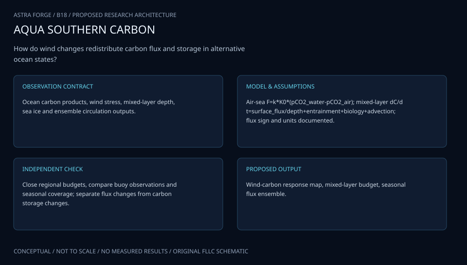

The diagram separates transfer, carbon chemistry and mixed-layer accounting with a fixed ocean-to-air sign. Supported integration and labeled gap filling remain distinct, and neither flux product alone establishes permanent carbon sequestration.

[Editable engineering diagram source](../visuals/projects/B18.mmd)

### 4. Mathematical model and derivation

#### Governing equations

```text
F_CO2=k(U,Sc) K0(T,S)(pCO2_water−pCO2_air), positive ocean-to-air.
```

```text
d(C h)/dt=−F_CO2+Entrainment+Advection+Biology, with consistent area/time units.
```

```text
ΔF=Δk K0 ΔpCO2_baseline+k_baseline Δ(K0 ΔpCO2)+interaction.
```

#### Variables, units and conventions

- F: mol C/m²/s; k: m/s; K0: mol/m³/atm.
- pCO2: atm after conversion from μatm; U: m/s.
- C: dissolved inorganic carbon, mol/m³; h: mixed-layer depth, m.
- Sc: dimensionless Schmidt number; sign convention retained in every product.

#### Assumptions and boundary conditions

- Wind–flux correlations do not isolate mixing from transfer.
- Float-derived carbon chemistry carries calibration/model uncertainty.
- Sea ice, sampling gaps and event aliasing require explicit coverage masks.

#### Derivation step 1

```text
F=k K0(p_w-p_a); p_atm=p_microatm*10^-6.
```

k m/s times K0 mol/m³/atm times pressure atm gives mol C/m²/s; positive gradient produces outgassing.

#### Derivation step 2

```text
Delta F=Delta k G0+k0 Delta G+Delta k Delta G; G=K0(p_w-p_a).
```

This exact finite-difference decomposition includes the interaction omitted by a purely additive transfer-versus-chemistry attribution.

#### Derivation step 3

```text
d(C h)/dt=-F+E+A+B.
```

Mixed-layer carbon inventory C h is mol/m²; entrainment, advection and biological terms share mol/m²/s. Changing depth contributes C dh/dt.

#### Derivation step 4

```text
M_region=sum_(supported cells,time) F_jt A_j Delta t.
```

Integrated exchange is mol C; conversion to mass uses carbon molar mass. Gap-filled cells are separately tagged and their covariance contributes to total uncertainty.

#### Inference or simulation procedure

Use quality-controlled float/ship carbon observations and matched winds to build regional seasonal budgets. Decompose transfer and surface-chemistry effects with counterfactual terms, evaluate storm composites against matched nonstorm conditions and examine lagged mixing/biological responses. Bootstrap whole floats/events, propagate carbonate-system uncertainty and compare alternate gas-transfer formulations. Integrate regional flux only over supported space/time before presenting gap-filled estimates with their extrapolation variance.

#### Validity domain and fidelity limits

Air–sea flux does not measure the full carbon inventory or permanent sequestration. Sparse winter/under-ice coverage and wind-product errors can substantially affect basinwide estimates.

### 5. Data specifications and provenance

| Field | Type | Unit | Physical / statistical meaning | Quality and missing-data rule |
| --- | --- | --- | --- | --- |
| platform_key | string | none | Ship/float/profile identity. | Calibration and data-level provenance required. |
| pco2_water | nullable float | microatm | Measured/derived surface pCO2. | Input covariance and method retained. |
| wind_speed | nullable float | m/s | Declared transfer-law wind average. | Vector averaging/cadence explicit. |
| solubility | float | mol/m³/atm | Temperature/salinity-dependent K0. | Formula/version and covariance saved. |
| transfer_velocity | float[] | m/s | Gas-transfer formulation ensemble. | Validity domain and wind source retained. |
| mixed_layer_depth | nullable float | m | Inventory support depth. | Definition and profile uncertainty required. |
| air_sea_flux | nullable float | mol C/m²/s | Signed ocean-to-air exchange. | No sign inversion during integration. |
| coverage_covariance | record | mixed | Area-time support and joint flux error. | Gap-fill covariance separate from observations. |

[Machine-readable record schema](../data/contracts/B18.schema.json) · [Empty acquisition CSV](../data/contracts/B18.csv) · [Field dictionary CSV](../data/contracts/B18.dictionary.csv)

The CSV above contains column headers only. Its schema defines future records and does not establish that original-team data or a particular archive product have been acquired. Frame, timing, calibration, covariance, selection and provenance details must accompany populated records.

#### NOAA OCADS SOCCOM cruise data

[Product, archive or reference](https://www.ncei.noaa.gov/access/ocean-carbon-acidification-data-system/oceans/SOCCOM/SOCCOM.html)

**Fields:** Ship reference carbonate chemistry, nutrients, temperature and salinity.

**Access:** Public NOAA OCADS; follow linked float releases and quality flags.

**Role:** Calibration and biogeochemical constraints.

#### Extratropical storms induce carbon outgassing over the Southern Ocean

[Product, archive or reference](https://www.nature.com/articles/s41612-024-00657-7)

**Fields:** Storm/carbon observations and primary methods.

**Access:** Open primary paper; event datasets depend on linked release.

**Role:** Event mechanism comparison.

#### Copernicus ERA5 hourly single-level time-series data

[Product, archive or reference](https://cds.climate.copernicus.eu/datasets/reanalysis-era5-single-levels-timeseries?tab=download)

**Fields:** Hourly wind and related meteorological fields.

**Access:** Copernicus registration/terms may apply; record product/version.

**Role:** Independent meteorological forcing.

### 6. Uncertainty, sensitivity and identifiability

Carbonate chemistry, float calibration and gas-transfer laws share correlated uncertainties. Propagate carbonate-input covariance through the nonlinear solver and compare transfer formulations under identical winds. Wind averaging and storm aliasing affect k, while changing surface pCO2 can lag mixing; event timing sensitivity is retained rather than absorbed into one regression coefficient.

Transfer enhancement and entrainment may be difficult to separate from coincident storm sampling. Use matched nonstorm intervals, counterfactual decomposition and float/event block bootstrap. Under-ice/winter gaps dominate some annual estimates, so present supported integrals before extrapolations. The full carbon inventory also depends on advection/biology, and air-sea uptake cannot establish permanent sequestration.

### 7. Engineering trade study

| Alternative | Benefit | Cost / limitation | Decision rule |
| --- | --- | --- | --- |
| Observation-supported regional flux | Minimal extrapolation and clear support. | Leaves seasonal/geographic gaps. | Primary reported budget product. |
| Storm counterfactual decomposition | Separates transfer and chemistry interactions. | Needs matched baseline and lag choices. | Use for event-scale mechanism screening. |
| Gap-filled annual carbon model | Enables broader budget scenarios. | Winter/ice and structural uncertainty increase. | Publish separately with coverage and discrepancy. |

### 8. Verification and validation cases

| Case ID | Stimulus / condition | Expected result / criterion | Method | Evidence artifact |
| --- | --- | --- | --- | --- |
| B18-V1 | Zero gradient | F=0. | Condition/fixture: p_w=p_a at arbitrary valid k and K0. Verification procedure: Exact flux identity.. | Exact flux identity. |
| B18-V2 | Signed flux fixture | F=3x10^-8 mol/m²/s outward. | Condition/fixture: k=10^-5 m/s, K0=30 mol/m³/atm, gradient=100 microatm. Verification procedure: Independent unit calculation.. | Independent unit calculation. |
| B18-V3 | Decomposition closure | Delta F=15, matching (3*7)-(2*3). | Condition/fixture: Choose k0=2, G0=3, Delta k=1, Delta G=4 in consistent abstract units. Verification procedure: Exact factorial arithmetic.. | Exact factorial arithmetic. |
| B18-V4 | Float/event holdout | Report flux and chemistry prediction coverage plus supported area-time fraction. | Condition/fixture: Withhold entire storms and floats. Verification procedure: Blocked validation.. | Blocked validation. |

**Execution status:** these cases are specified, not claimed as executed. Close a case only with the versioned inputs, output, uncertainty, reviewer and pass/fail rationale.

#### Additional scientific validation gates

- Hold out floats, seasons and storm events; avoid splitting repeated profiles randomly.
- Compare carbonate variables with independent ship references and propagate calibration residuals.
- Report budget closure, flux interval coverage and sensitivity to gas transfer, mixed-layer depth and winter gaps.

### 9. Implementation and reproducible work packages

1. Freeze ship/float, wind and ice product manifests with calibration levels.
2. Implement carbonate-input covariance and pressure/sign unit adapters.
3. Build gas-transfer alternatives and a mixed-layer inventory ledger.
4. Define storm/matched-background intervals and whole-event/float folds.
5. Compute exact transfer/chemistry decomposition and supported regional integrals.
6. Publish gap-filled budgets separately with covariance, seasonal coverage and sequestration limits.

#### Investigation sequence

1. Stage 1: assemble coverage/calibration audit and sign/unit-consistent carbon tables; define regional seasons/events.
2. Stage 2: decompose mechanisms and test gas-transfer/mixing alternatives with uncertainty propagation.
3. Stage 3: validate withheld floats/storms and issue supported regional flux budgets plus explicitly uncertain gap filling.

#### Resources and interfaces to expertise

- Ocean biogeochemist, physical oceanographer and carbonate-system expertise.
- Float/ship QA tools, carbonate solver and climate reanalysis access.

### 10. Failure modes and interpretation controls

| Failure mode | Effect on result | Detection / evidence | Design response |
| --- | --- | --- | --- |
| Microatm not converted | Millionfold flux error. | Dimensional/scale audit. | Explicit pressure converter. |
| Outgassing sign reversed | Wrong sink/source interpretation. | Known-gradient test. | One sign convention throughout. |
| Winter gaps hidden | Overprecise annual sink. | Coverage ledger review. | Separate supported and extrapolated totals. |

- False causal attribution from storm co-variation.
- Calibration drift and winter aliasing.
- Confusing outgassing, internal transport and permanent sequestration.

### 11. Required engineering outputs

- Calibrated regional biogeochemical data cube.
- Wind mechanism/flux decomposition notebook.
- Carbon-budget atlas and coverage uncertainty.

#### Scientific result figures to produce during execution

Map regional flux and data support; show event timelines and transfer/mixing/biology terms with sign conventions and uncertainty.

### 12. Cited technical and scientific resources

- [NOAA OCADS SOCCOM cruise data](https://www.ncei.noaa.gov/access/ocean-carbon-acidification-data-system/oceans/SOCCOM/SOCCOM.html) — Shipboard reference observations support float biogeochemical calibration and carbon assessment.
- [Extratropical storms induce carbon outgassing over the Southern Ocean](https://www.nature.com/articles/s41612-024-00657-7) — Primary storm–carbon study motivates competing gas-transfer and mixed-layer pathways, with event sampling limitations.
- [Copernicus ERA5 hourly single-level time-series data](https://cds.climate.copernicus.eu/datasets/reanalysis-era5-single-levels-timeseries?tab=download) — Official reanalysis winds and meteorological fields provide independent forcing, with model/resolution uncertainty.

Framework and evidence rules: [engineering documentation standard](../docs/ENGINEERING_STANDARD.md), [model assurance](../docs/MODEL_ASSURANCE.md), [uncertainty procedure](../docs/UNCERTAINTY_AND_DECISION_RULES.md), and [data management](../docs/DATA_MANAGEMENT.md). NASA-inspired names are creative identifiers; requirements and results are not NASA certification.

---

<a id="b19"></a>

## B19 · PARKER PLASMA WHISPER — Electron Structure Observatory

**Original project:** Investigation of Electron Parameters and Association with Structures using Quasi-thermal Noise Spectroscopy (QTN)

**Session B:** Earth & Environmental Engineering

**Document class:** engineering research design and analysis record · **Revision:** 2 · **Date:** 2026-10-02

**Evidence state:** design basis, mathematical formulation and verification plan documented. Project-specific empirical results remain to be acquired; executable shared model demonstrations have their own recorded checks.

[Engineering document register](../ENGINEERING_DOCUMENTATION.md) · [Session B handbook](../documentation/SESSION_B.md) · [Previous: B18](../projects/B/B18.md) · [Next: B20](../projects/B/B20.md)

### Purpose and scientific objective

Infer electron density and temperature from Parker Solar Probe quasi-thermal noise measurements, then test their association with independently defined plasma structures. Keep spectral-fit uncertainty, antenna configuration and non-Maxwellian assumptions visible. Structure comparisons account for heliocentric distance and spacecraft sampling so ordinary radial evolution is not misidentified as a structural effect.

**Question:** Which electron-parameter changes persist across plasma-structure boundaries after radial trends, instrument state and solar-wind context are controlled?

**Testable hypothesis:** Some structures may show repeatable density/temperature contrasts, but part of the apparent association will disappear after antenna-state and radial-baseline adjustment.

### 1. Design basis and analysis boundary

The electron-parameter system audits Parker Solar Probe FIELDS quasi-thermal-noise products, or accessible calibrated spectra, and compares inferred electron properties with independently defined plasma structures. Released density/temperature products and raw spectral refitting are separate fidelity levels. Heliocentric distance and encounter context are required to distinguish ordinary radial evolution from structure associations.

Begin with the official simplified-QTN metadata, quality flags and unit conventions. Refit spectra only if antenna state and receiver/shot-noise information support an identified forward model. Published non-Maxwellian analysis motivates sensitivity checks, not an assumption that every simplified product measures halo parameters. Spacecraft crossings provide time-series samples and cannot alone reconstruct three-dimensional structures.

### 2. Requirements and verification traceability

These are project design requirements or proposed analysis gates. A numerical target is not a NASA requirement unless its controlling source is explicitly identified. “TBD” identifies evidence required before a decision; it is not permission to assume a value. Verification evidence listed here is planned, unless a linked result explicitly records execution.

| ID | Requirement / gate | Engineering rationale | Verification method | Basis / required evidence |
| --- | --- | --- | --- | --- |
| B19-R1 | Every interval shall retain data level, cadence, antenna/bias state, receiver response and quality flags. | Instrument state changes alter spectral inference. | Metadata/product audit. | SPASE/FIELDS documentation. |
| B19-R2 | Density shall use one explicit SI or cm^-3 convention and temperature shall preserve K/eV conversion. | Plasma-frequency conversions are easy to mis-scale. | Analytic unit fixture. | Existing plasma-frequency model. |
| B19-R3 | Structure boundaries shall be defined independently of the QTN response being tested. | Response-selected intervals create circular association. | Boundary-source and selection audit. | Proposed study design. |
| B19-R4 | Hold out complete encounters and match radial/context ranges; unconstrained temperature/tail parameters shall be flagged. | Radial trends and fit degeneracy mimic structure effects. | Encounter-fold and likelihood-profile checks. | Primary QTN context. |

### 3. Architecture and controlled interfaces

A product adapter preserves archive time tags, declared UTC conversion, frequency bins Hz and voltage spectral density V²/Hz. Instrument metadata include antenna geometry and bias/configuration. A separate ephemeris adapter supplies heliocentric distance in a declared AU normalization, while magnetic/plasma context provides independently reviewed structure intervals.

The inference branch either consumes released simplified-QTN fields or fits a calibrated spectral model with receiver and shot-noise terms. Parameter covariance and unsupported-fit flags pass to a matched-interval estimator. Cadence alignment records averaging windows rather than duplicating low-rate QTN values as independent fast samples. Missing antenna metadata blocks complex spectral fits but not a qualified released-product audit.


The diagram distinguishes released QTN products from conditional spectral refitting and independent structure selection. Radial matching and covariance gates support association estimates without implying unique electron distributions or three-dimensional structure reconstruction.

[Editable engineering diagram source](../visuals/projects/B19.mmd)

### 4. Mathematical model and derivation

#### Governing equations

```text
f_pe=(1/2π) sqrt(n_e e²/(ε0 m_e)); n_e≈(f_pe/8980 Hz)² cm⁻³.
```

```text
S_V(f)=S_QTN(f;n_e,T_core,T_halo,antenna)+S_shot+S_receiver.
```

```text
log T_e=a+b log r+β structure+γᵀ context+u_encounter+ε.
```

#### Variables, units and conventions

- f: Hz; n_e: m⁻³ in SI formula or cm⁻³ in calibrated approximation.
- T: K or eV with explicit Boltzmann conversion.
- S_V: V²/Hz; r: normalized heliocentric distance.
- Structure boundaries: UTC intervals with independent magnetic/plasma definitions.

#### Assumptions and boundary conditions

- Antenna bias/configuration and receiver response alter inferred spectra.
- Simplified QTN products may not constrain suprathermal populations uniquely.
- Spacecraft crossings provide time samples, not direct 3D structure images.

#### Derivation step 1

```text
f_pe=(1/(2pi)) sqrt(n_e e²/(epsilon0 m_e)).
```

SI electron density is m^-3 and frequency Hz; n_cm^-3=n_m^-3/10^6 gives the approximately 8980 Hz sqrt(n_cm^-3) relation.

#### Derivation step 2

```text
n_e=(2pi f_pe)^2 epsilon0 m_e/e²; sigma_n/n approximately 2 sigma_f/f.
```

The relative-error approximation requires a well-identified peak and small errors; calibration/model discrepancy is added separately.

#### Derivation step 3

```text
S_V=S_QTN(n,T_core,T_halo,antenna)+S_shot+S_receiver.
```

All spectra use V²/Hz. Instrument and distribution parameters can be degenerate, so the fit is not valid merely because a numerical optimizer returns values.

#### Derivation step 4

```text
log T_e=a+b log(r/r0)+beta structure+gamma^T context+u_encounter+epsilon.
```

r/r0 is dimensionless. beta is a conditional log-temperature contrast evaluated on independent encounter/radial support.

#### Inference or simulation procedure

Audit Level-3 metadata and flags before fitting accessible spectra or using released density/temperature products. Compare Maxwellian and supported non-Maxwellian fits, estimate uncertainties and reject poorly constrained cases. Match structures to nearby background intervals within encounters and radial ranges; reserve independent encounters for validation. Include magnetic/velocity context from authorized public mission products, while recording cadence mismatches and structure-definition sensitivity.

#### Validity domain and fidelity limits

Unresolved distribution tails and shot noise can bias temperature. Independent structure lists and magnetic/plasma products require their own calibration audit; statistical association does not prove structure formation physics.

### 5. Data specifications and provenance

| Field | Type | Unit | Physical / statistical meaning | Quality and missing-data rule |
| --- | --- | --- | --- | --- |
| product_key | string | none | Exact QTN level/version/interval. | Checksums and archive flags retained. |
| frequency | float[] | Hz | Spectral bin coordinates. | Monotone with receiver response key. |
| voltage_psd | nullable float[] | V²/Hz | Calibrated spectrum when available. | Noise/antenna metadata required. |
| electron_density | nullable float | m^-3 | Released or fitted electron density. | Method and units explicit. |
| electron_temperature | nullable float | K or eV | Declared core/effective temperature. | Distribution definition and conversion saved. |
| heliocentric_distance | float | AU | Encounter radial context. | Ephemeris/time alignment recorded. |
| structure_interval | datetime[2] | UTC | Independent boundary definition. | Source/cadence uncertainty retained. |
| parameter_covariance | matrix | mixed | Joint fit/released-product uncertainty. | PSD/support flags and correlations preserved. |

[Machine-readable record schema](../data/contracts/B19.schema.json) · [Empty acquisition CSV](../data/contracts/B19.csv) · [Field dictionary CSV](../data/contracts/B19.dictionary.csv)

The CSV above contains column headers only. Its schema defines future records and does not establish that original-team data or a particular archive product have been acquired. Frame, timing, calibration, covariance, selection and provenance details must accompany populated records.

#### SPASE PSP FIELDS Level 3 simplified quasi-thermal noise metadata

[Product, archive or reference](https://spase-metadata.org/CNES/NumericalData/CDPP-Archive/PSP/FIELDS/RFS/LFR/PARKERSP_FIELDS_RFS_SQTN.html)

**Fields:** Density/temperature products, frequency coverage, processing level and antenna metadata.

**Access:** Public SPASE metadata links to archive; check release coverage and CDF flags.

**Role:** Observed electron products and provenance.

#### Radial evolution of non-Maxwellian electron populations from QTN spectroscopy

[Product, archive or reference](https://doi.org/10.3847/1538-4357/ad7d05)

**Fields:** Primary QTN fitting and non-Maxwellian/radial analysis.

**Access:** Publisher DOI; consult data/code access statement.

**Role:** Alternative model and systematic-error design.

### 6. Uncertainty, sensitivity and identifiability

Receiver response, shot noise and antenna bias can overlap the temperature-sensitive spectral shape. Profile nuisance and plasma parameters jointly, inspect Fisher/sensitivity singular values and mark unconstrained tails. Frequency-bin errors may be correlated through calibration, and released-product uncertainty cannot be replaced by repeated sampling of one interpolated value.

Structure association is confounded by heliocentric distance, encounter and spacecraft sampling. Match nearby background intervals under declared radial/context bounds and vary independent boundary definitions. Bootstrap full structures or encounters rather than individual spectra. Compare supported distribution models, while recognizing that model agreement cannot independently establish the mechanism forming a plasma structure.

### 7. Engineering trade study

| Alternative | Benefit | Cost / limitation | Decision rule |
| --- | --- | --- | --- |
| Released simplified-QTN products | Efficient documented density/temperature access. | Limited distribution information. | Default when spectral metadata is incomplete. |
| Calibrated Maxwellian spectral fit | Transparent reduced forward model. | May miss non-Maxwellian populations. | Use as a supported baseline. |
| Supported non-Maxwellian fit | Tests distribution sensitivity. | Tail/antenna degeneracy may be severe. | Adopt only with identified parameters and metadata. |

### 8. Verification and validation cases

| Case ID | Stimulus / condition | Expected result / criterion | Method | Evidence artifact |
| --- | --- | --- | --- | --- |
| B19-V1 | Density conversion | n=1 cm^-3=10^6 m^-3. | Condition/fixture: f_pe=8980 Hz in the declared approximate relation. Verification procedure: Independent SI/approximation comparison.. | Independent SI/approximation comparison. |
| B19-V2 | Frequency doubling | Density increases by factor four. | Condition/fixture: Double f_pe with all constants fixed. Verification procedure: Analytic scaling test.. | Analytic scaling test. |
| B19-V3 | Temperature units | T=e/k_B K, approximately 11604.5 K. | Condition/fixture: Use a declared 1 eV electron temperature. Verification procedure: Constant-version unit check.. | Constant-version unit check. |
| B19-V4 | Encounter holdout | Report density/temperature residuals and conditional contrast stability. | Condition/fixture: Reserve entire encounters and independent structures. Verification procedure: Blocked analysis.. | Blocked analysis. |

**Execution status:** these cases are specified, not claimed as executed. Close a case only with the versioned inputs, output, uncertainty, reviewer and pass/fail rationale.

#### Additional scientific validation gates

- Synthetic spectra test recovery and parameter degeneracy.
- Hold out encounters and whole structures; evaluate calibrated intervals and boundary-definition sensitivity.
- Compare density with independent plasma estimates where valid, and test contrasts against randomly shifted control boundaries.

### 9. Implementation and reproducible work packages

1. Create QTN product-level and instrument-state manifests from official metadata.
2. Implement density/temperature/PSD unit and cadence adapters.
3. Audit independent structure definitions and ephemeris alignment.
4. Fit only supported spectral branches with covariance and identifiability artifacts.
5. Build matched background intervals and encounter-level folds.
6. Release conditional association plots with distribution and sampling limitations.

#### Investigation sequence

1. Stage 1: inventory encounters, antenna states and independent structure definitions; document time/unit alignment.
2. Stage 2: fit or audit electron parameters and matched-boundary contrasts with radial/instrument controls.
3. Stage 3: validate withheld encounters and publish an uncertainty-bearing structure/electron catalog.

#### Resources and interfaces to expertise

- Heliophysics scientist, QTN specialist and CDF/time-series tools.
- PSP archive metadata and independently calibrated magnetic/plasma products.

### 10. Failure modes and interpretation controls

| Failure mode | Effect on result | Detection / evidence | Design response |
| --- | --- | --- | --- |
| Cadence duplication | Overstated sample precision. | Unique-window/sample count audit. | Carry averaging support. |
| Radial trend called structure effect | Spurious association. | Matched radial-control comparison. | Encounter/radius covariates. |
| Unconstrained spectral tails | False halo temperature precision. | Profile/sensitivity rank check. | Simplify or flag unsupported fits. |

- Density-unit conversion errors.
- Antenna/shot-noise systematics masquerading as structures.
- Temporal correlations and uncertain structure boundaries.

### 11. Required engineering outputs

- Encounter/antenna audit and spectral model notebook.
- Electron-structure catalog with fit flags.
- Radial-control and uncertainty report.

#### Scientific result figures to produce during execution

Show QTN spectra/fits, electron intervals and independently defined boundaries; compare radial-adjusted event stacks with shifted controls.

### 12. Cited technical and scientific resources

- [SPASE PSP FIELDS Level 3 simplified quasi-thermal noise metadata](https://spase-metadata.org/CNES/NumericalData/CDPP-Archive/PSP/FIELDS/RFS/LFR/PARKERSP_FIELDS_RFS_SQTN.html) — Official measurement range, processing level and provenance support electron-density and temperature data selection.
- [Radial evolution of non-Maxwellian electron populations from QTN spectroscopy](https://doi.org/10.3847/1538-4357/ad7d05) — Primary PSP analysis supports distribution-model and antenna-state sensitivity checks.

Framework and evidence rules: [engineering documentation standard](../docs/ENGINEERING_STANDARD.md), [model assurance](../docs/MODEL_ASSURANCE.md), [uncertainty procedure](../docs/UNCERTAINTY_AND_DECISION_RULES.md), and [data management](../docs/DATA_MANAGEMENT.md). NASA-inspired names are creative identifiers; requirements and results are not NASA certification.

---

<a id="b20"></a>

## B20 · LUNAR RECLAIMER — Algal Rare-Earth Recovery

**Original project:** Rare Earth Metal Recovery from Waste Stream Using Algae

**Session B:** Earth & Environmental Engineering

**Document class:** engineering research design and analysis record · **Revision:** 2 · **Date:** 2026-10-02

**Evidence state:** design basis, mathematical formulation and verification plan documented. Project-specific empirical results remain to be acquired; executable shared model demonstrations have their own recorded checks.

[Engineering document register](../ENGINEERING_DOCUMENTATION.md) · [Session B handbook](../documentation/SESSION_B.md) · [Previous: B19](../projects/B/B19.md) · [Next: B21](../projects/B/B21.md)

### Purpose and scientific objective

Evaluate algal biomass as a selective sorbent for verified rare-earth recovery from realistic wastewater, emphasizing recovered product and lifecycle cost. A critical provenance correction: aluminum measurements cannot demonstrate yttrium removal or recovery, so surrogate experiments remain method-development evidence until actual target elements are measured. Compare recovery, regeneration and residual waste as separate outcomes.

**Question:** Can a documented algal sorbent recover target rare-earth elements selectively and repeatedly from competing-ion waste streams?

**Testable hypothesis:** Real-matrix competition and reuse losses will reduce performance relative to simple solutions; recovery feasibility depends on selectivity and product separation, not percent removal alone.

### 1. Design basis and analysis boundary

The recovery assessment is an element-specific mass ledger and competitive sorption model for published or authorized algal-biomass wastewater records. It evaluates target removal, desorbed/recovered product, selectivity, repeated-cycle performance and secondary waste as separate endpoints. Aluminum measurements remain surrogate method-development evidence and cannot establish yttrium removal or recovery.

Begin with verified rare-earth concentration and dry-sorbent mass accounting, then compare equilibrium/kinetic hypotheses and recovered-product inventories. Immobilized red-algae and desorption studies motivate realistic competition and reuse endpoints. Wastewater composition, biomass identity and regeneration assumptions remain source-specific. A model optimum is not an acquired product or an operational process specification.

### 2. Requirements and verification traceability

These are project design requirements or proposed analysis gates. A numerical target is not a NASA requirement unless its controlling source is explicitly identified. “TBD” identifies evidence required before a decision; it is not permission to assume a value. Verification evidence listed here is planned, unless a linked result explicitly records execution.

| ID | Requirement / gate | Engineering rationale | Verification method | Basis / required evidence |
| --- | --- | --- | --- | --- |
| B20-R1 | Each target result shall identify the actual element, validated assay and analytical recovery; Al-only records shall be labeled surrogate. | Al and Y are different analytes. | Element/assay provenance audit. | Existing corrected provenance. |
| B20-R2 | Account separately for feed, residual dissolved, sorbed, precipitated, product and unmeasured target mass. | Removal may be precipitation or contaminated biomass. | Independent elemental ledger. | Primary recovery evidence. |
| B20-R3 | Recovery and purity shall require measured product mass/composition; sorption capacity alone is insufficient. | Useful recovered material is the objective. | Endpoint evidence gate. | Primary desorption context. |
| B20-R4 | Compare costs per kg recovered target with cycle degradation and waste inventories, all on a stated dry-mass/price basis. | Capacity does not establish economic benefit. | Units and lifecycle scenario review. | Proposed assessment contract. |

### 3. Architecture and controlled interfaces

The observation adapter stores element concentrations mg/L, volume L, dry sorbent g, wastewater matrix and assay qualifiers. An element registry includes target and competing ions, with analytical uncertainty and speciation descriptors when reported. Sorption and precipitation controls retain independent identities.

The model branch fits single/competitive capacity and rate alternatives within documented matrix ranges. A cycle ledger connects each adsorption record to actual product measurements and residual waste, without assuming all sorbed metal is recovered. A technoeconomic adapter converts mg to kg and includes energy/reagent/waste inventories at assessment level. Missing target assay or product evidence blocks Y-recovery claims but preserves labeled surrogate or removal analyses.


The architecture makes actual target-element assays and recovered-product evidence mandatory for rare-earth claims. Aluminum surrogate records remain separate, and removal, sorption, recovery and purity retain distinct uncertainty.

[Editable engineering diagram source](../visuals/projects/B20.mmd)

### 4. Mathematical model and derivation

#### Governing equations

```text
q_e=(C0−Ce)V/m_sorbent, in mg/g.
```

```text
q_i=qmax,i b_i Ce,i/[1+Σ_j b_j Ce,j], as a competitive-isotherm hypothesis.
```

```text
Recovery_i=M_product,i/M_feed,i; α_ij=(q_i/Ce,i)/(q_j/Ce,j).
```

#### Variables, units and conventions

- C: element-specific dissolved concentration, mg/L; V: L; m: g dry sorbent.
- q: sorbed mass, mg/g; b: L/mg.
- Recovery/selectivity: dimensionless; product purity: mass fraction.
- Lifecycle cost: USD/kg recovered target; residual-waste mass: kg/kg target.

#### Assumptions and boundary conditions

- ICP-based target-element measurement or validated equivalent is needed.
- Sorption, precipitation and uptake must be distinguished by mass balance.
- Published sorbents and matrices do not establish performance of another algae species.

#### Derivation step 1

```text
q_i=(C0_i-Ce_i)V/m.
```

Concentration mg/L times volume L divided by dry mass g gives mg/g. This difference represents apparent removal and needs controls before attribution to sorption.

#### Derivation step 2

```text
q_i=qmax_i b_i Ce_i/(1+sum_j b_j Ce_j).
```

b has L/mg for mass concentration. Competitive parameters require multielement support and are hypotheses, not a universal algal mechanism.

#### Derivation step 3

```text
M_feed=M_dissolved+M_sorbed+M_precipitated+M_product+M_unmeasured.
```

Pools use the same target-element mass unit and the same system boundary; transferred mass cannot be counted twice.

#### Derivation step 4

```text
R_i=M_product_i/M_feed_i; purity_i=M_product_i/M_product,total; alpha_ij=(q_i/Ce_i)/(q_j/Ce_j).
```

Recovery, purity and selectivity are dimensionless but answer different questions; zero/effectively censored denominators require bounds rather than infinity.

#### Inference or simulation procedure

Start with published target-element datasets and documented wastewater compositions. Fit competitive isotherms and kinetic models with analytical recovery/error, then compare algal media with conventional sorbent benchmarks. Model repeated adsorption–recovery cycles from actual published product measurements, recording reagents, energy and secondary waste at inventory level. For future authorized validation, specify measurement endpoints and certified reference checks without claiming an optimized process from surrogate metals.

#### Validity domain and fidelity limits

Equilibrium fits may fail for complex speciation or solids. Product purity and regeneration data are often sparse; apparent removal can produce contaminated biomass rather than usable recovered material.

### 5. Data specifications and provenance

| Field | Type | Unit | Physical / statistical meaning | Quality and missing-data rule |
| --- | --- | --- | --- | --- |
| element_symbol | enum/string | none | Actual analyzed target or competitor. | Y and Al never conflated. |
| feed_concentration | nullable float | mg/L | Element-specific feed measurement. | Method/limit/recovery required. |
| residual_concentration | nullable float | mg/L | Element-specific dissolved endpoint. | Censoring and matrix effects retained. |
| dry_sorbent_mass | float | g | Dry biomass/media amount. | Moisture correction uncertainty saved. |
| matrix_composition | nullable vector | mg/L | Competing-ion observations. | Species/assay covariance retained. |
| product_mass | nullable vector | mg element | Measured recovered product. | Null prohibits recovery/purity claim. |
| cycle_index | integer | none | Linked reuse cycle identity. | Product/waste lineage required. |
| mass_covariance | matrix | mg² | Joint feed/pool analytical uncertainty. | Include shared dilution and recovery bias. |

[Machine-readable record schema](../data/contracts/B20.schema.json) · [Empty acquisition CSV](../data/contracts/B20.csv) · [Field dictionary CSV](../data/contracts/B20.dictionary.csv)

The CSV above contains column headers only. Its schema defines future records and does not establish that original-team data or a particular archive product have been acquired. Frame, timing, calibration, covariance, selection and provenance details must accompany populated records.

#### Recovering rare earth elements via immobilized red algae from ammonium-rich wastewater

[Product, archive or reference](https://pmc.ncbi.nlm.nih.gov/articles/PMC9500351/)

**Fields:** Measured target elements, competing matrix composition and recovery observations.

**Access:** Open primary paper; use linked data/supplements where present.

**Role:** Target-specific evidence.

#### Desorption of rare earth elements biosorbed on Euglena mutabilis suspensions and biofilms

[Product, archive or reference](https://onlinelibrary.wiley.com/doi/10.1002/cjce.25344)

**Fields:** Adsorption/desorption selectivity and reuse-cycle observations.

**Access:** Primary publisher record; detailed datasets may require access/request.

**Role:** Recovered-product and regeneration constraints.

### 6. Uncertainty, sensitivity and identifiability

Analytical recovery, dilution and dry-mass normalization correlate capacity estimates. Precipitation and complexation can mimic adsorption, so compare controls and retain unresolved pools. Near reporting limits, Ce yields asymmetric capacity/selectivity uncertainty; censored likelihoods or bounds replace zero substitution.

Competitive capacities and affinity coefficients can be nonidentifiable over narrow concentration ranges. Profile qmax and b, compare simple versus competitive hypotheses on withheld matrices, and avoid extrapolated plateaus. Cycle degradation, actual product purity and disposal costs may dominate economics. Unknown regeneration performance remains a scenario range rather than an assumed quantitative recovery fraction.

### 7. Engineering trade study

| Alternative | Benefit | Cost / limitation | Decision rule |
| --- | --- | --- | --- |
| Single-target equilibrium fit | Transparent capacity baseline. | Misses matrix competition and precipitation. | Use for simple published datasets only. |
| Competitive multielement model | Addresses realistic wastewater selectivity. | Requires jointly measured concentration ranges. | Prefer when parameters are identifiable. |
| Product/cycle lifecycle ledger | Evaluates usable recovery and waste. | Published product inventories may be incomplete. | Primary decision layer with explicit missing evidence. |

### 8. Verification and validation cases

| Case ID | Stimulus / condition | Expected result / criterion | Method | Evidence artifact |
| --- | --- | --- | --- | --- |
| B20-V1 | Zero apparent removal | q=0 mg/g. | Condition/fixture: C0=Ce for any valid V and m. Verification procedure: Exact capacity identity.. | Exact capacity identity. |
| B20-V2 | Capacity fixture | q=4 mg/g. | Condition/fixture: C0=10, Ce=4 mg/L, V=2 L, m=3 g. Verification procedure: Independent unit arithmetic.. | Independent unit arithmetic. |
| B20-V3 | Recovery versus removal | Removal can be 0.8 while recovery is 0.2. | Condition/fixture: Synthetic feed 100 mg, sorbed 80 mg, product 20 mg. Verification procedure: Element-ledger integration test.. | Element-ledger integration test. |
| B20-V4 | Al-only input | Y removal/recovery outputs remain unresolved. | Condition/fixture: Record contains Al measurements and no Y assay. Verification procedure: Element-provenance gate test.. | Element-provenance gate test. |

**Execution status:** these cases are specified, not claimed as executed. Close a case only with the versioned inputs, output, uncertainty, reviewer and pass/fail rationale.

#### Additional scientific validation gates

- Hold out wastewater matrices and entire reuse series.
- Require element-specific mass closure across feed, solution, sorbent and product.
- Report prediction intervals, detection-limit effects and product purity; assess when economics change under capacity/regeneration uncertainty.

### 9. Implementation and reproducible work packages

1. Build element, assay, biomass and wastewater matrix schemas with surrogate labels.
2. Extract verified target concentration and product/cycle data from primary records.
3. Implement dry-mass capacity and target-element inventory calculators.
4. Fit supported equilibrium/competitive alternatives with censored covariance.
5. Evaluate holdout matrices and cycle/product lifecycle scenarios.
6. Release target-specific recovery, purity and waste conclusions with unresolved evidence.

#### Investigation sequence

1. Stage 1: audit target-element evidence and reject unsupported aluminum-to-yttrium inference; compile matrix/assay data.
2. Stage 2: fit competition/reuse models and benchmark recovery/purity/cost against conventional options.
3. Stage 3: validate an independent real-matrix dataset and deliver a scale-up evidence-gap and waste-management assessment.

#### Resources and interfaces to expertise

- Environmental chemist, sorption specialist and analytical laboratory partner.
- Certified element references, published datasets and technoeconomic/LCA tools.

### 10. Failure modes and interpretation controls

| Failure mode | Effect on result | Detection / evidence | Design response |
| --- | --- | --- | --- |
| Surrogate called yttrium result | False rare-earth evidence. | Element-symbol audit. | Separate Al method-development label. |
| Precipitation counted sorption | Wrong mechanism/capacity. | Control and pool closure review. | Report apparent removal until resolved. |
| Capacity called recovered product | Overstated practical value. | Product-mass evidence gate. | Separate removal/recovery/purity. |

- Surrogate-metal results mislabeled as rare-earth recovery.
- Competition/speciation and sorption–precipitation confusion.
- Hazardous secondary biomass or reagent waste.

### 11. Required engineering outputs

- Target-element evidence table and sorption model.
- Recovery/selectivity/reuse Pareto analysis.
- Cost, waste and uncertainty assessment.

#### Scientific result figures to produce during execution

Display feed-to-product element flows, selectivity across competing ions and capacity/purity decay across documented cycles.

### 12. Cited technical and scientific resources

- [Recovering rare earth elements via immobilized red algae from ammonium-rich wastewater](https://pmc.ncbi.nlm.nih.gov/articles/PMC9500351/) — Primary recovery research supports metal-specific measurement and real-matrix competition.
- [Desorption of rare earth elements biosorbed on Euglena mutabilis suspensions and biofilms](https://onlinelibrary.wiley.com/doi/10.1002/cjce.25344) — Primary adsorption–desorption study supports measuring recovered product and performance over reuse cycles.

Framework and evidence rules: [engineering documentation standard](../docs/ENGINEERING_STANDARD.md), [model assurance](../docs/MODEL_ASSURANCE.md), [uncertainty procedure](../docs/UNCERTAINTY_AND_DECISION_RULES.md), and [data management](../docs/DATA_MANAGEMENT.md). NASA-inspired names are creative identifiers; requirements and results are not NASA certification.

---

<a id="b21"></a>

## B21 · PROTEUS DRIFTSCAPE — Evolutionary Protein Disorder

**Original project:** More Effectively Selective Species Have Greater Protein Structural Disorder

**Session B:** Earth & Environmental Engineering

**Document class:** engineering research design and analysis record · **Revision:** 2 · **Date:** 2026-10-02

**Evidence state:** design basis, mathematical formulation and verification plan documented. Project-specific empirical results remain to be acquired; executable shared model demonstrations have their own recorded checks.

[Engineering document register](../ENGINEERING_DOCUMENTATION.md) · [Session B handbook](../documentation/SESSION_B.md) · [Previous: B20](../projects/B/B20.md) · [Next: B22](../projects/B/B22.md)

### Purpose and scientific objective

Test the comparative association between selection efficacy and predicted intrinsic disorder using homologous domains and phylogenetically controlled statistics. Reproduce the published corrected codon-bias framework before extending it to new vertebrate clades. Distinguish predicted disorder, measured structure and mutational robustness; none is a direct synonym for another.

**Question:** Does greater selection efficacy predict disorder within homologous protein domains after GC, composition, domain age and phylogeny are controlled?

**Testable hypothesis:** A positive association may persist in matched domains, but predictor calibration, amino-acid composition and shared ancestry could explain part of the cross-species signal.

### 1. Design basis and analysis boundary

The comparative system tests selection-efficacy and predicted disorder associations within homologous protein domains across versioned vertebrate proteomes. Its boundary includes sequence/domain identity, a faithful implementation of the published corrected codon-bias framework, disorder prediction and phylogenetic inference. Predicted disorder, experimentally measured structure and mutational robustness remain distinct endpoints.

Begin by reproducing the primary study's species/domain summary calculations before extending clade coverage. Domain-matched analyses precede whole-proteome averages, which can change through domain composition alone. CAIS normalization must come from the published method/code rather than a newly invented KL proxy. Predictor thresholds, sequence exclusions and clade holdouts are proposed analysis settings, with annotation and composition bias carried into inference.

### 2. Requirements and verification traceability

These are project design requirements or proposed analysis gates. A numerical target is not a NASA requirement unless its controlling source is explicitly identified. “TBD” identifies evidence required before a decision; it is not permission to assume a value. Verification evidence listed here is planned, unless a linked result explicitly records execution.

| ID | Requirement / gate | Engineering rationale | Verification method | Basis / required evidence |
| --- | --- | --- | --- | --- |
| B21-R1 | Freeze proteome, coding-sequence, domain and phylogeny releases with one-to-one identifiers and taxon crosswalks. | Annotation changes can mimic species effects. | Checksum and join-completeness audit. | UniProt documentation. |
| B21-R2 | Reproduce published CAIS normalization exactly on available author benchmarks; proposed numerical tolerance is 10^-8 for identical inputs. | Conceptual codon divergence is not the complete published index. | Reference-vector comparison. | Primary study; proposed computational tolerance. |
| B21-R3 | Separate within-homologous-domain association from changes in domain composition and sequence length. | Proteome mixtures confound comparative effects. | Matched-domain and aggregate decomposition. | Primary comparative context. |
| B21-R4 | Validate across complete clades and multiple supported disorder predictors; thresholds shall be chosen within training analyses. | Related species and predictor biases inflate certainty. | Clade split and predictor-sensitivity audit. | Proposed generalization protocol. |

### 3. Architecture and controlled interfaces

A sequence registry links coding sequences, translated proteins and domain intervals to versioned taxon identifiers. Alignment QC records coverage, gaps and paralog ambiguity. A CAIS adapter implements the primary study's amino-acid/GC correction and retains each intermediate frequency table.

Disorder engines emit per-residue probabilities on original sequence coordinates and masks for unsupported regions. A homologous-domain summarizer stores counts and threshold-sensitive fractions, while a phylogeny adapter emits branch-length covariance in substitutions/site conventions. The comparative estimator uses matched domains, composition covariates and species-related random effects. Missing orthologs and uncertain domain boundaries propagate exclusion/sensitivity states, rather than being imputed as ordered protein.


The diagram establishes sequence lineage, faithful efficacy-index calculation and homologous-domain comparison with phylogenetic covariance. Its endpoint is predicted disorder association, not measured structure or causal evolutionary advantage.

[Editable engineering diagram source](../visuals/projects/B21.mmd)

### 4. Mathematical model and derivation

#### Governing equations

```text
D_KL(p||q)=Σ_c p_c log(p_c/q_c), conceptual codon-divergence term; implement published CAIS normalization exactly.
```

```text
Disorder_fraction=Σ_residue I(score>threshold)/L, with threshold sensitivity.
```

```text
logit(DomainDisorder_ds)=α_d+β Efficacy_s+γᵀ covariates_ds+phylogenetic_effect_s+ε_ds.
```

#### Variables, units and conventions

- Efficacy: published corrected codon-bias index, dimensionless; not census size.
- L: homologous-domain residues; disorder fraction: 0–1.
- GC/composition: fractions; phylogeny: branch lengths with documented units.
- β: conditional comparative association, not a causal fitness coefficient.

#### Assumptions and boundary conditions

- Homology/alignment quality must be reviewed.
- Disorder predictors may inherit composition/training biases.
- Effective population size proxies and selection efficacy need not coincide.

#### Derivation step 1

```text
D_KL(p||q)=sum_c p_c log(p_c/q_c).
```

This is a conceptual codon-divergence component, not a substitute for the complete published CAIS correction. Zero-frequency handling and amino-acid weighting must follow the source implementation.

#### Derivation step 2

```text
d_ds=sum_(valid residues) I(score>tau); D_ds=d_ds/L_valid.
```

Disorder fraction is dimensionless. The threshold tau is declared, and gaps/unknown residues are excluded consistently rather than counted as ordered.

#### Derivation step 3

```text
d_ds~Binomial(L_valid,p_ds); logit p_ds=alpha_d+beta E_s+gamma^T X_ds+u_s.
```

E is the published efficacy proxy, not census population size. The binomial working model needs overdispersion for correlated residues.

#### Derivation step 4

```text
u~Normal(0,sigma_phylo² C_tree); Var(beta_hat) uses phylogenetic covariance.
```

Shared branch history induces covariance among species. Predictor/annotation uncertainty adds further terms rather than increasing the number of independent taxa.

#### Inference or simulation procedure

Freeze proteome/domain versions, reproduce CAIS and control GC/amino-acid effects according to the primary study. Compare multiple disorder predictors and homologous-domain matched effects using phylogenetic mixed models. Partition within-domain versus changing-domain-composition explanations, propagate alignment/predictor uncertainty and reserve clades for out-of-sample testing. Include negative-control sequence shuffles preserving composition and assess whether an association reflects biology or predictor construction.

#### Validity domain and fidelity limits

Predictions cannot establish experimental disorder or adaptive mechanism. Clade sampling and annotation quality vary; selection-efficiency proxies require explicit calibration and cannot infer fitness advantages alone.

### 5. Data specifications and provenance

| Field | Type | Unit | Physical / statistical meaning | Quality and missing-data rule |
| --- | --- | --- | --- | --- |
| taxon_key | string | none | Versioned species/proteome identity. | Stable crosswalk and release required. |
| domain_key | string | none | Homologous domain family/interval. | Paralog and boundary uncertainty saved. |
| coding_sequence | sequence key | codons | Source coding-sequence reference. | Translation and frame consistency checked. |
| cais_value | nullable float | dimensionless | Published corrected efficacy index. | Exact method/intermediates retained. |
| disorder_scores | nullable float[] | 0–1 | Per-residue predictor outputs. | Predictor version and invalid masks required. |
| valid_length | integer | residues | Eligible domain positions. | Gaps/unknowns excluded consistently. |
| tree_covariance | matrix | declared branch units | Species shared-ancestry structure. | Taxon order and PSD check required. |
| association_interval | float[3] | logit per index | Conditional comparative effect. | Include clade/predictor uncertainty. |

[Machine-readable record schema](../data/contracts/B21.schema.json) · [Empty acquisition CSV](../data/contracts/B21.csv) · [Field dictionary CSV](../data/contracts/B21.dictionary.csv)

The CSV above contains column headers only. Its schema defines future records and does not establish that original-team data or a particular archive product have been acquired. Frame, timing, calibration, covariance, selection and provenance details must accompany populated records.

#### Protein domains in vertebrate species with more effective selection have greater intrinsic disorder

[Product, archive or reference](https://pmc.ncbi.nlm.nih.gov/articles/PMC11379457/)

**Fields:** Published domain/proteome analysis, CAIS definition and linked data.

**Access:** Open primary article; freeze associated data/code releases.

**Role:** Reproduction and hypothesis benchmark.

#### UniProt proteome documentation

[Product, archive or reference](https://www.uniprot.org/help/proteome)

**Fields:** Proteome identities, sequences and annotation metadata.

**Access:** Public UniProt; record release/version, completeness and license.

**Role:** Independent or expanded comparative sequence inputs.

### 6. Uncertainty, sensitivity and identifiability

GC composition, amino-acid makeup and domain annotation can drive both efficacy proxies and predictor outputs. Reproduce correction steps, then compare domain-matched and composition-adjusted effects. Label alignment gaps and paralogs explicitly. Composition-preserving shuffled controls test predictor sensitivity, while not proving that real sequence-order effects are artifactual.

Phylogenetic sampling and predictor training overlap reduce effective independence. Vary plausible trees, use clade-level holdouts and compare predictor ensembles. Domain boundaries and threshold choices induce correlated fraction errors. Profile efficacy/composition coefficients and report weakly identified combinations; a stable association cannot establish causal fitness benefit or experimentally verified protein disorder.

### 7. Engineering trade study

| Alternative | Benefit | Cost / limitation | Decision rule |
| --- | --- | --- | --- |
| Whole-proteome fractions | Simple broad species summary. | Confounded by domain mixture and length. | Use as descriptive baseline. |
| Matched-domain phylogenetic model | Controls homology and relatedness. | Incomplete orthologs reduce sample support. | Preferred inferential design. |
| Multiple predictor/threshold ensemble | Exposes prediction-method dependence. | Agreement is not experimental structure truth. | Use as uncertainty and robustness layer. |

### 8. Verification and validation cases

| Case ID | Stimulus / condition | Expected result / criterion | Method | Evidence artifact |
| --- | --- | --- | --- | --- |
| B21-V1 | Identical codon distributions | Conceptual KL divergence equals zero. | Condition/fixture: p=q with valid positive support. Verification procedure: Exact frequency-table test.. | Exact frequency-table test. |
| B21-V2 | Fraction fixture | D=0.25. | Condition/fixture: Five disordered valid residues out of twenty. Verification procedure: Independent summary arithmetic.. | Independent summary arithmetic. |
| B21-V3 | Zero phylogenetic covariance | Model reduces to the corresponding nonphylogenetic working model. | Condition/fixture: Set sigma_phylo=0 in synthetic data. Verification procedure: Likelihood comparison.. | Likelihood comparison. |
| B21-V4 | Clade holdout | Report calibrated predictions and coefficient stability across predictors. | Condition/fixture: Reserve complete clades and homologous domain groups. Verification procedure: Blocked comparative evaluation.. | Blocked comparative evaluation. |

**Execution status:** these cases are specified, not claimed as executed. Close a case only with the versioned inputs, output, uncertainty, reviewer and pass/fail rationale.

#### Additional scientific validation gates

- Hold out entire clades/domains; avoid splitting homologous records as independent samples.
- Run composition-preserving negative controls and alignment-quality sensitivity.
- Report effect intervals, out-of-clade calibration and agreement across predictors; reserve experimental structure evidence for separate validation.

### 9. Implementation and reproducible work packages

1. Freeze sequence/domain/tree manifests and taxon/translation crosswalks.
2. Implement the exact published CAIS workflow with benchmark intermediates.
3. Run supported disorder predictors with original-coordinate masks.
4. Build matched-domain counts and composition/length covariates.
5. Fit phylogenetic/overdispersed models and clade/predictor sensitivity artifacts.
6. Release association evidence with annotation, prediction and causal limitations.

#### Investigation sequence

1. Stage 1: reproduce published index/domain analyses and audit sequence/alignment coverage.
2. Stage 2: compare phylogenetic, composition and predictor alternatives with uncertainty-aware domain matching.
3. Stage 3: evaluate held-out clades and release a reproducible association atlas with predictor limitations.

#### Resources and interfaces to expertise

- Evolutionary geneticist, protein-bioinformatics specialist and statistical reviewer.
- Versioned proteomes/domains, phylogenies, predictors and published CAIS code.

### 10. Failure modes and interpretation controls

| Failure mode | Effect on result | Detection / evidence | Design response |
| --- | --- | --- | --- |
| Conceptual KL labeled CAIS | Invalid efficacy measurement. | Compare source intermediate calculations. | Faithful published implementation. |
| Predictions called measured structure | Unsupported biological claim. | Endpoint/citation audit. | Retain predicted-disorder language. |
| Residues treated independent species | Overconfident association. | Effective sample and covariance review. | Phylogenetic/domain blocking. |

- Shared ancestry and annotation bias.
- Composition-driven predictor artifacts.
- Conflating disorder, robustness and organismal adaptation.

### 11. Required engineering outputs

- Reproduction notebook and comparative-data manifest.
- Phylogenetic association/negative-control results.
- Domain/clade atlas with uncertainty and annotation gaps.

#### Scientific result figures to produce during execution

Show domain-matched disorder contrasts on a phylogeny and effect intervals across predictors, clades and negative controls.

### 12. Cited technical and scientific resources

- [Protein domains in vertebrate species with more effective selection have greater intrinsic disorder](https://pmc.ncbi.nlm.nih.gov/articles/PMC11379457/) — Primary comparative study defines the association being tested; predicted disorder is not experimental confirmation of structure.
- [UniProt proteome documentation](https://www.uniprot.org/help/proteome) — Official sequence/proteome definitions and release metadata support versioned comparative inputs.

Framework and evidence rules: [engineering documentation standard](../docs/ENGINEERING_STANDARD.md), [model assurance](../docs/MODEL_ASSURANCE.md), [uncertainty procedure](../docs/UNCERTAINTY_AND_DECISION_RULES.md), and [data management](../docs/DATA_MANAGEMENT.md). NASA-inspired names are creative identifiers; requirements and results are not NASA certification.

---

<a id="b22"></a>

## B22 · NIF ODYSSEY — Comparative Nitrogen-Fixation Evolution

**Original project:** Developing a model system using Azotobacter vinelandii to investigate the evolution of nitrogen fixation

**Session B:** Earth & Environmental Engineering

**Document class:** engineering research design and analysis record · **Revision:** 2 · **Date:** 2026-10-02

**Evidence state:** design basis, mathematical formulation and verification plan documented. Project-specific empirical results remain to be acquired; executable shared model demonstrations have their own recorded checks.

[Engineering document register](../ENGINEERING_DOCUMENTATION.md) · [Session B handbook](../documentation/SESSION_B.md) · [Previous: B21](../projects/B/B21.md) · [Next: B23](../projects/B/B23.md)

### Purpose and scientific objective

Develop a computational model system around existing Azotobacter vinelandii genome, expression and metabolic evidence. Compare nitrogenase lineages, regulation and energetic tradeoffs through retrospective analysis and simulation. Preserve the evolutionary question without constructing, selecting or experimentally adapting strains; computational ancestral inference is clearly distinguished from validated historical enzyme function.

**Question:** Which evolutionary and regulatory constraints explain conservation/divergence of nitrogen-fixation systems in available genomes?

**Testable hypothesis:** Metal availability and energetic allocation may explain distinct nitrogenase-system histories; phylogenetic signal and genomic context should outperform gene-presence explanations alone.

### 1. Design basis and analysis boundary

The Azotobacter vinelandii model system is computational and retrospective: versioned reference genomes, published expression and documented metabolic reactions support comparative nitrogenase evolution and energetic-feasibility scenarios. The boundary excludes strain construction, selection and experimental adaptation. Phylogenetic histories and ancestral distributions are hypotheses, not validated ancient enzymes.

Begin with orthology/alignment review and a reduced stoichiometric ATP/electron ledger, then compare supported trees, expression contrasts and flux scenarios. Published genome and transcription studies provide source context. A feasible steady-state flux is not a measured growth or fixation rate, and metal/oxygen constraints require literature support. Added complexity is justified only when existing phenotypes can discriminate it.

### 2. Requirements and verification traceability

These are project design requirements or proposed analysis gates. A numerical target is not a NASA requirement unless its controlling source is explicitly identified. “TBD” identifies evidence required before a decision; it is not permission to assume a value. Verification evidence listed here is planned, unless a linked result explicitly records execution.

| ID | Requirement / gate | Engineering rationale | Verification method | Basis / required evidence |
| --- | --- | --- | --- | --- |
| B22-R1 | Each sequence/expression record shall retain accession, genome release, ortholog/paralog status and sample/batch metadata. | Duplications and annotation shifts alter evolutionary conclusions. | Identifier/alignment audit. | Primary genome and expression sources. |
| B22-R2 | Stoichiometric models shall conserve atoms/charge and explicitly account for ATP and electron requirements. | Unbalanced reactions create false energetic feasibility. | Element/charge matrix checks. | Canonical nitrogenase accounting. |
| B22-R3 | Tree and ancestral outputs shall retain model/branch uncertainty; point reconstructions shall not be called historical sequences. | Deep-time alternatives are nonunique. | Alternative-tree and posterior-support review. | Proposed computational contract. |
| B22-R4 | Compare predictions only with existing published phenotypes; deliverables shall contain no operational genetic or adaptation design. | Keeps the original evolutionary question within retrospective scope. | Artifact/scope review. | Nonexperimental project boundary. |

### 3. Architecture and controlled interfaces

A genomic registry stores accession-linked sequence references, ortholog groups and alignment masks. The phylogeny branch records substitution model, branch lengths substitutions/site and bootstrap/posterior support. An expression adapter uses published sample metadata and keeps normalized contrasts separate from raw abundance interpretations.

A reaction registry defines stoichiometric coefficients and literature-constrained flux bounds in mmol/g dry weight/hour. The constraint solver emits feasible ranges and ATP/electron shadow prices under explicitly labeled scenarios. A phenotype comparison module uses only existing study measurements. Missing homolog context, poorly supported branches or unbounded fluxes propagate unresolved states; inferred ancestral distributions remain computational uncertainty artifacts.


The architecture separates comparative ancestry from constrained energetic feasibility and existing phenotype evidence. All ancestry and flux results are computational hypotheses, with no organism construction or experimentally evolved system implied.

[Editable engineering diagram source](../visuals/projects/B22.mmd)

### 4. Mathematical model and derivation

#### Governing equations

```text
Likelihood(tree,model)=P(alignment|tree,substitution_model), with model/branch uncertainty.
```

```text
N2+8H+ +8e− → 2NH3+H2, exact redox ledger; canonical ATP consumption ledger: 16 ATP per N2. ATP hydrolysis requires explicit water/protonation/counter-species for an atom/charge-balanced S column.
```

```text
S v=0; maximize objective subject to documented flux bounds and ATP/electron accounting.
```

#### Variables, units and conventions

- S: stoichiometric matrix; v: flux, mmol/g dry weight/hour.
- Evolutionary branches: substitutions/site; support: bootstrap/posterior probability.
- Expression: normalized counts with sample/batch metadata.
- ATP/electron costs: reaction-level accounting, not direct organismal fitness.

#### Assumptions and boundary conditions

- Presence of homologs does not prove a functional nitrogenase system.
- Substitution models and alignment choices affect ancestral inference.
- Steady-state metabolic bounds are scenario assumptions and need experimental literature constraints.

#### Derivation step 1

```text
L(tree,model)=P(alignment|tree,substitution_model).
```

Alignment sites and branch lengths determine the likelihood; gene trees can differ from species history through transfer or duplication.

#### Derivation step 2

```text
N2 + 8 H+ + 8 e- -> 2 NH3 + H2; coupled ATP accounting: 16 ATP consumed per canonical reaction turnover, represented separately from the redox balance.
```

The written redox reaction balances nitrogen, hydrogen and net charge. The ATP count is biochemical energy bookkeeping, not an atom/charge-balanced hydrolysis equation. A stoichiometric S column must separately specify ATP/ADP/phosphate protonation, water and proton terms for the chosen biochemical convention before element/charge checking; cellular energetic cost can exceed the canonical count.

#### Derivation step 3

```text
S v=0; l<=v<=u.
```

S contains signed molar coefficients and v is mmol/g dry weight/hour. Steady-state constraints indicate feasibility under chosen bounds, not observed flux.

#### Derivation step 4

```text
v_min,j=min v_j; v_max,j=max v_j subject to S v=0 and objective support.
```

Flux-variability intervals expose alternate feasible pathways. Unbounded ranges indicate a model/bound problem and require correction before interpretation.

#### Inference or simulation procedure

Audit reference genomes and published expression metadata, define orthologs and compare alternative phylogenies with recombination/duplication sensitivity. Integrate regulatory expression contrasts with genome-scale or reduced stoichiometric models to test metal/energy scenarios. Infer candidate ancestral sequence distributions computationally, without treating point reconstructions as actual ancient sequences. Compare predictions with existing published phenotypes only, and release uncertainty rather than operational genetic designs.

#### Validity domain and fidelity limits

Horizontal transfer, incomplete genomes and deep-time saturation complicate ancestry. Constraint-based fluxes are feasible states rather than measured rates; inferred sequences cannot prove ancestral activity.

### 5. Data specifications and provenance

| Field | Type | Unit | Physical / statistical meaning | Quality and missing-data rule |
| --- | --- | --- | --- | --- |
| accession | string | none | Reference genome/protein/expression identity. | Release and source checksum retained. |
| ortholog_group | string | none | Reviewed homolog family. | Paralog/transfer ambiguity flagged. |
| alignment_mask | bool[] | sites | Eligible comparative positions. | Gap/coverage exclusions recorded. |
| branch_support | float[] | 0–1 | Tree uncertainty measures. | Support type and resampling method explicit. |
| expression_contrast | nullable float | declared normalized units | Published retrospective regulatory comparison. | Batch/replicate metadata retained. |
| stoichiometry | sparse matrix | mol/mol | Reaction network coefficients. | Atom/charge and cofactor checks required. |
| flux_bounds | float[2][] | mmol/gDW/hour | Literature/scenario constraints. | Measured versus assumed bounds labeled. |
| flux_interval | float[2][] | mmol/gDW/hour | Feasible reaction ranges. | Solver status and unbounded flags saved. |

[Machine-readable record schema](../data/contracts/B22.schema.json) · [Empty acquisition CSV](../data/contracts/B22.csv) · [Field dictionary CSV](../data/contracts/B22.dictionary.csv)

The CSV above contains column headers only. Its schema defines future records and does not establish that original-team data or a particular archive product have been acquired. Frame, timing, calibration, covariance, selection and provenance details must accompany populated records.

#### Genome sequence of Azotobacter vinelandii

[Product, archive or reference](https://pmc.ncbi.nlm.nih.gov/articles/PMC2704721/)

**Fields:** Reference genome, nitrogen-fixation gene context and published accessions.

**Access:** Open primary article; retrieve referenced public sequences with exact accession/version.

**Role:** Comparative genome anchor.

#### Transcriptional profiling of nitrogen fixation in Azotobacter vinelandii

[Product, archive or reference](https://pmc.ncbi.nlm.nih.gov/articles/PMC3165507/)

**Fields:** Existing expression contrasts and regulation metadata.

**Access:** Open primary paper; follow its deposited data accessions.

**Role:** Retrospective regulatory constraints.

### 6. Uncertainty, sensitivity and identifiability

Alignment, orthology and deep-time saturation determine much of evolutionary uncertainty. Compare alternative masked alignments and duplication/transfer-aware histories; preserve branch-support distributions rather than choose one visually simple tree. Existing expression contrasts may be batch-confounded, so metadata limitations remain in regulatory interpretation.

Flux bounds and biomass/objective choices can dominate energetic predictions. Compare reduced and supported genome-scale networks, profile ATP/electron constraints and use flux variability to identify alternate feasible solutions. Structural reaction uncertainty is separate from solver tolerance. Agreement with a published phenotype constrains a scenario but does not validate reconstructed ancestral function or a whole evolutionary mechanism.

### 7. Engineering trade study

| Alternative | Benefit | Cost / limitation | Decision rule |
| --- | --- | --- | --- |
| Orthology/phylogeny evidence map | Directly addresses evolutionary relationships. | Transfer and duplication remain ambiguous. | Primary comparative baseline. |
| Reduced energetic network | Transparent ATP/electron accounting. | Omits organism-wide regulation and costs. | Use for analytic scenario screening. |
| Supported genome-scale model | Represents broader metabolic alternatives. | Bounds/objective uncertainty and curation burden. | Adopt when existing evidence constrains it. |

### 8. Verification and validation cases

| Case ID | Stimulus / condition | Expected result / criterion | Method | Evidence artifact |
| --- | --- | --- | --- | --- |
| B22-V1 | Zero-flux feasibility | v=0 satisfies S v=0. | Condition/fixture: All bounds include zero and no compulsory demand. Verification procedure: Independent linear-constraint check.. | Independent linear-constraint check. |
| B22-V2 | Canonical reaction ledger | Consumes 16 mol ATP and 8 mol electrons; forms 2 mol NH3 and 1 mol H2. | Condition/fixture: One mol N2 reduced under the stated idealized reaction. Verification procedure: Reaction accounting fixture.. | Reaction accounting fixture. |
| B22-V3 | Element imbalance | Atom/charge checker rejects the model. | Condition/fixture: Inject one deliberately unbalanced synthetic reaction. Verification procedure: Network integration test.. | Network integration test. |
| B22-V4 | Existing phenotype holdout | Report feasible-range compatibility and unresolved discrepancies. | Condition/fixture: Reserve published conditions from fitting bounds. Verification procedure: Retrospective holdout comparison.. | Retrospective holdout comparison. |

**Execution status:** these cases are specified, not claimed as executed. Close a case only with the versioned inputs, output, uncertainty, reviewer and pass/fail rationale.

#### Additional scientific validation gates

- Hold out taxa and expression conditions; do not reuse normalization/model-fitting data as final validation.
- Compare alternative gene trees, alignment trims and substitution models.
- Verify mass/charge/ATP bookkeeping and test predictions against independent published phenotypes; distinguish feasible from observed flux.

### 9. Implementation and reproducible work packages

1. Create accession, orthology and published-expression metadata manifests.
2. Review alignments and alternative transfer/duplication-aware phylogenies.
3. Implement balanced reduced nitrogen/ATP/electron reaction accounting.
4. Curate supported flux bounds and run variability/loop diagnostics.
5. Compare computational scenarios with held-out existing phenotype records.
6. Release evolutionary/energetic uncertainty artifacts within the retrospective scope.

#### Investigation sequence

1. Stage 1: assemble versioned reference/ortholog/expression records and reproduce one published comparison.
2. Stage 2: evaluate phylogenetic and metabolic scenarios with alignment, model and flux-bound uncertainty.
3. Stage 3: test withheld taxa/conditions against published observations and deliver a computational evolution framework with unresolved mechanisms.

#### Resources and interfaces to expertise

- Evolutionary microbiologist, bioinformatician and metabolic-model specialist.
- Public sequences, alignment/phylogeny tools and constraint-based modeling software.

### 10. Failure modes and interpretation controls

| Failure mode | Effect on result | Detection / evidence | Design response |
| --- | --- | --- | --- |
| Homolog presence called function | Unsupported nitrogenase activity claim. | Context/phenotype evidence audit. | Separate sequence and functional evidence. |
| Unbounded energy loop | Artificial fixation feasibility. | Flux-variability and cycle checks. | Curate reactions and supported bounds. |
| Ancestral point called fact | Overconfident historical mechanism. | Tree/alignment sensitivity. | Publish distributions and alternatives. |

- Computational inference overclaimed as ancient function.
- Horizontal-transfer/annotation artifacts.
- Unconstrained energetic models or operationalization into organism engineering.

### 11. Required engineering outputs

- Genome/expression provenance manifest.
- Phylogenetic and energetic scenario notebooks.
- Evolutionary uncertainty atlas and evidence-gap report.

#### Scientific result figures to produce during execution

Compare supported nitrogenase phylogenies with ATP/electron feasibility across literature-bounded scenarios, keeping inferred and observed quantities distinct.

### 12. Cited technical and scientific resources

- [Genome sequence of Azotobacter vinelandii](https://pmc.ncbi.nlm.nih.gov/articles/PMC2704721/) — Primary reference genome supports comparative study of nitrogen-fixation systems.
- [Transcriptional profiling of nitrogen fixation in Azotobacter vinelandii](https://pmc.ncbi.nlm.nih.gov/articles/PMC3165507/) — Primary expression study supports retrospective regulation analysis without constructing or evolving organisms.

Framework and evidence rules: [engineering documentation standard](../docs/ENGINEERING_STANDARD.md), [model assurance](../docs/MODEL_ASSURANCE.md), [uncertainty procedure](../docs/UNCERTAINTY_AND_DECISION_RULES.md), and [data management](../docs/DATA_MANAGEMENT.md). NASA-inspired names are creative identifiers; requirements and results are not NASA certification.

---

<a id="b23"></a>

## B23 · HYDRA MISSION CONTROL — Watershed Decisions Under Uncertainty

**Original project:** Modeling to Make a Difference: Hydrologic Analysis for Improved Decision Support

**Session B:** Earth & Environmental Engineering

**Document class:** engineering research design and analysis record · **Revision:** 2 · **Date:** 2026-10-02

**Evidence state:** design basis, mathematical formulation and verification plan documented. Project-specific empirical results remain to be acquired; executable shared model demonstrations have their own recorded checks.

[Engineering document register](../ENGINEERING_DOCUMENTATION.md) · [Session B handbook](../documentation/SESSION_B.md) · [Previous: B22](../projects/B/B22.md) · [Next: B24](../projects/B/B24.md)

### Purpose and scientific objective

Build watershed decision support around explicit choices, costs and hydrologic forecast uncertainty. Select one real management use, such as drought withdrawals or flood-response thresholds, before model development. Score success by decision performance as well as hydrograph fit; a statistically stronger forecast can still fail if it arrives too late or obscures tradeoffs.

**Question:** Which model and operating policy reduce decision losses across wet/dry conditions while maintaining calibrated uncertainty?

**Testable hypothesis:** A parsimonious, well-calibrated ensemble may support better decisions than a more complex single forecast, especially when user costs and asymmetric errors are explicit.

### 1. Design basis and analysis boundary

The decision-support design must first select a real basin and management action with stakeholders; both are currently TBD. A drought-withdrawal threshold or flood-alert decision is a possible scoped use, not a claimed deployment. The system joins observed gauges and meteorological forcing to forecast ensembles, then maps them to explicit action losses and data-latency constraints.

Begin with persistence and a parsimonious rainfall-runoff model, then add ensemble forcing and parameter uncertainty if decisions improve on held-out events. USGS records provide observed-water interfaces and a drought decision-support precedent. Hydrologic fit, timely service delivery and decision regret are evaluated separately; stakeholder costs are value judgments rather than quantities inferred from rainfall.

### 2. Requirements and verification traceability

These are project design requirements or proposed analysis gates. A numerical target is not a NASA requirement unless its controlling source is explicitly identified. “TBD” identifies evidence required before a decision; it is not permission to assume a value. Verification evidence listed here is planned, unless a linked result explicitly records execution.

| ID | Requirement / gate | Engineering rationale | Verification method | Basis / required evidence |
| --- | --- | --- | --- | --- |
| B23-R1 | Freeze basin boundary, action units, decision horizon, loss function and delivery deadline before model selection. | An accurate late forecast can be useless. | Stakeholder decision-contract review. | Proposed operational-analysis gate. |
| B23-R2 | Gauge records shall retain station/rating changes, units, qualifiers and retrieval/availability times. | Reference flow and operational latency differ. | API metadata and latency audit. | USGS Water Data documentation. |
| B23-R3 | Forecast evaluation shall use chronological whole-event folds and a persistence baseline. | Random time splits leak hydrologic memory. | Fold/dependency audit. | Proposed validation protocol. |
| B23-R4 | Report interval coverage, water-balance residual and decision regret; complexity is accepted only with meaningful held-out decision improvement. | Hydrograph skill alone is insufficient. | Independent scoring and policy replay. | Existing decision-loss model. |

### 3. Architecture and controlled interfaces

A gauge adapter preserves discharge m³/s, qualifier and rating metadata, while forcing adapters deliver precipitation/ET mm/day and observation availability. Catchment area m² converts depth to volume consistently. A state model distinguishes storage, runoff generation and observation error, with missing gauges represented explicitly.

The forecast engine emits timestamped flow/storage ensembles and deadlines. A policy module applies declared action losses to each ensemble, while a replay module evaluates decisions using only information available at the historical issue time. A stakeholder interface records alternative loss weights and constraints. Stale data, unsupported extremes or rating changes propagate degraded-service flags and baseline fallback states, not hidden confidence.


The diagram links hydrologic ensembles to an explicit stakeholder action and historical information cutoff. Its acceptance evidence includes decision regret and latency, while the real basin and operational policy remain to be defined.

[Editable engineering diagram source](../visuals/projects/B23.mmd)

### 4. Mathematical model and derivation

#### Governing equations

```text
dS/dt=P−ET−Q−deep_losses, with area/time-consistent units.
```

```text
Q_t=f(S_t,P_t,parameters)+ε_t; observation error is modeled separately.
```

```text
a*=argmin_a Σ_scenario P(scenario|data) L(a,scenario); assess regret and robustness.
```

#### Variables, units and conventions

- P/ET/storage: mm or mm/day; Q: m³/s after catchment-area conversion.
- a: withdrawal/alert/operation decision with stated units.
- L: stakeholder-defined monetary or service/ecological loss.
- Probabilities and intervals: calibrated against withheld events.

#### Assumptions and boundary conditions

- Rating-curve uncertainty and station changes affect reference streamflow.
- Calibration and operational thresholds must use separate evidence periods.
- Stakeholder losses are value judgments, not inferred from rainfall alone.

#### Derivation step 1

```text
dS/dt=P-ET-Q_depth-D; Q_depth=Q_volume/A.
```

Q_volume m³/s divided by area m² gives m/s; multiplying by 86400*1000 converts to mm/day.

#### Derivation step 2

```text
S_(t+1)=S_t+Delta t(P_t-ET_t-Q_t-D_t).
```

All fluxes share depth/time units. State bounds and conservation are checked before calibrating runoff parameters.

#### Derivation step 3

```text
a*=argmin_a E[L(a,Y)|data].
```

The forecast distribution is converted to a decision only through a declared loss function and action set, not an arbitrary model probability threshold.

#### Derivation step 4

```text
For binary alert, alert if p> C_false/(C_false+C_miss); regret=L(a,Y)-min_b L(b,Y).
```

This threshold follows from comparing expected false-alert and missed-event losses. Regret is evaluated retrospectively and must not use future information during action selection.

#### Inference or simulation procedure

Join quality-controlled gauge data, precipitation, evapotranspiration and watershed characteristics. Compare persistence, rainfall-runoff and ensemble alternatives using chronological training windows. Translate forecasts into explicit policies through stakeholder-defined loss functions and stress-test under historical extremes and labeled climate scenarios. Track data latency and missing gauges. Record uncertainty from forcing, parameters, structure and observations separately, then evaluate whether additional complexity changes decisions meaningfully.

#### Validity domain and fidelity limits

Ungauged transfer and changing land cover can invalidate calibration. Historical skill is not guaranteed under new extremes; decision weights and future forcing remain uncertain.

### 5. Data specifications and provenance

| Field | Type | Unit | Physical / statistical meaning | Quality and missing-data rule |
| --- | --- | --- | --- | --- |
| gauge_key | string | none | Station and rating-version identity. | Station changes and qualifiers retained. |
| discharge | nullable float | m³/s | Observed reference flow. | Rating/measurement uncertainty saved. |
| catchment_area | float | m² | Depth-volume conversion support. | Boundary version and positivity checked. |
| forcing_vector | nullable record | mm/day | Precipitation/ET/deep-loss terms. | Coverage and covariance retained. |
| issued_at | datetime | UTC | Forecast creation/availability time. | No future observations in replay. |
| forecast_ensemble | float[][] | m³/s or mm | Dated horizon-member states. | Member dependence and model key recorded. |
| loss_parameters | record | declared currency/service units | Stakeholder action consequences. | Approval/version and uncertainty explicit. |
| decision_regret | float[] | same as loss | Held-out policy performance. | Oracle comparator limited to scoring. |

[Machine-readable record schema](../data/contracts/B23.schema.json) · [Empty acquisition CSV](../data/contracts/B23.csv) · [Field dictionary CSV](../data/contracts/B23.dictionary.csv)

The CSV above contains column headers only. Its schema defines future records and does not establish that original-team data or a particular archive product have been acquired. Frame, timing, calibration, covariance, selection and provenance details must accompany populated records.

#### USGS Water Data API documentation

[Product, archive or reference](https://api.waterdata.usgs.gov/docs/)

**Fields:** Gauge locations, observations, parameter codes and quality qualifiers.

**Access:** Public USGS APIs; record current endpoints, request limits and station coverage.

**Role:** Observed calibration/validation flows.

#### USGS hydrologic drought decision support system

[Product, archive or reference](https://pubs.usgs.gov/of/2014/1003/pdf/ofr2014-1003.pdf)

**Fields:** Published drought decision-support structure and operating considerations.

**Access:** Public USGS report; local operating constraints require stakeholder input.

**Role:** Decision framing and policy baseline.

### 6. Uncertainty, sensitivity and identifiability

Forcing, rating-curve, parameter and model errors have different temporal correlation. Preserve rainfall ensembles and station-era uncertainty; compare hydrologic residuals around rating changes. Missing gauges may coincide with extreme events and cannot be treated as random complete-case omissions. Parameter equifinality is assessed through profiles and withheld event response.

Decision rankings depend on loss weights, deadline and event probability calibration. Sweep stakeholder-approved costs and stress-test historical extremes plus labeled climate scenarios. Separate forecast spread from model discrepancy and report regret intervals across whole events. Improved average RMSE may coexist with worse threshold decisions, so added complexity must justify its decision and latency burden.

### 7. Engineering trade study

| Alternative | Benefit | Cost / limitation | Decision rule |
| --- | --- | --- | --- |
| Persistence forecast | Fast transparent service baseline. | Weak during rapid change/extremes. | Required comparator and fallback. |
| Parsimonious rainfall-runoff ensemble | Balances mechanisms and interpretability. | Parameter/forcing uncertainty remains. | Default hydrologic model. |
| Complex hybrid or distributed model | May improve spatial/extreme response. | Latency and calibration burden increase. | Adopt only with held-out decision benefit. |

### 8. Verification and validation cases

| Case ID | Stimulus / condition | Expected result / criterion | Method | Evidence artifact |
| --- | --- | --- | --- | --- |
| B23-V1 | Depth-volume conversion | Q_depth=86.4 mm/day. | Condition/fixture: A=1 km² and Q=1 m³/s. Verification procedure: Independent unit calculation.. | Independent unit calculation. |
| B23-V2 | Closed storage step | Storage increases 4 mm. | Condition/fixture: P=10, ET=2, Q=3, D=1 mm/day for one day. Verification procedure: Conservation arithmetic.. | Conservation arithmetic. |
| B23-V3 | Decision threshold | Alert threshold p>0.1. | Condition/fixture: False-alert cost 1 and missed-event cost 9. Verification procedure: Exact expected-loss comparison.. | Exact expected-loss comparison. |
| B23-V4 | Operational replay | Report skill, coverage, latency failures and regret. | Condition/fixture: Withhold full drought/flood events and enforce historical issue-time availability. Verification procedure: Chronological event replay.. | Chronological event replay. |

**Execution status:** these cases are specified, not claimed as executed. Close a case only with the versioned inputs, output, uncertainty, reviewer and pass/fail rationale.

#### Additional scientific validation gates

- Use rolling-origin and complete-event holdouts; compare persistence and existing policy baselines.
- Report flow/volume/peak error, interval coverage and decision loss/regret separately.
- Test missing data, latency, rating-curve uncertainty and extremes outside training range; calibrate failure/abstention states.

### 9. Implementation and reproducible work packages

1. Define the real basin/action/loss/deadline contract with authorized stakeholders.
2. Create gauge/forcing manifests with rating and availability metadata.
3. Implement depth-volume storage and conservation calculators.
4. Build persistence and rainfall-runoff ensemble artifacts on chronological folds.
5. Replay explicit policies with latency, calibration and regret scoring.
6. Release decision tradeoffs, baseline fallback and extreme-scenario limitations.

#### Investigation sequence

1. Stage 1: define decision owner, lead time, acceptable errors and losses; audit data/rating curves and freeze temporal splits.
2. Stage 2: fit calibrated hydrologic ensembles and compare decision policies across plausible costs and forcing.
3. Stage 3: replay withheld droughts/floods and release an operational prototype with threshold provenance and monitoring ownership.

#### Resources and interfaces to expertise

- Hydrologist, decision owner and local operations/ecology reviewers.
- USGS data tools, rainfall-runoff solver, ensemble statistics and versioned loss definitions.

### 10. Failure modes and interpretation controls

| Failure mode | Effect on result | Detection / evidence | Design response |
| --- | --- | --- | --- |
| Future-data replay leakage | Inflated forecast and policy skill. | Availability-time audit. | Past-only replay adapters. |
| Rating change ignored | Biased reference-flow evaluation. | Station-era residual diagnostics. | Versioned observation error. |
| Good RMSE poor decision | Misleading model selection. | Threshold regret and deadline review. | Decision-based acceptance. |

- Overfitting a convenient hydrograph metric.
- Nonstationarity and biased reference flows.
- Unagreed losses or unsupported operational reliance.

### 11. Required engineering outputs

- Watershed data/uncertainty cube.
- Forecast-to-decision notebook and policy comparison.
- Prototype dashboard with alert evidence and limitations.

#### Scientific result figures to produce during execution

Display observed/forecast flows and intervals, policy actions and accumulated loss for withheld events; allow transparent scenario/weight comparisons.

#### Included shared numerical starting point


[Executable formulation, parameters, tabular outputs, provenance and verification](../models/README.md). This shared demonstration has a narrower domain than the project model above. Its own caption and methods identify synthetic parameters or the separately retrieved public catalog; it is not a completed result of the original project.

### 12. Cited technical and scientific resources

- [USGS Water Data API documentation](https://api.waterdata.usgs.gov/docs/) — Official observed-water-data endpoints and metadata support quality-controlled gauge extraction.
- [USGS hydrologic drought decision support system](https://pubs.usgs.gov/of/2014/1003/pdf/ofr2014-1003.pdf) — Primary decision-support method supports explicit operations, thresholds and hydrologic uncertainty.

Framework and evidence rules: [engineering documentation standard](../docs/ENGINEERING_STANDARD.md), [model assurance](../docs/MODEL_ASSURANCE.md), [uncertainty procedure](../docs/UNCERTAINTY_AND_DECISION_RULES.md), and [data management](../docs/DATA_MANAGEMENT.md). NASA-inspired names are creative identifiers; requirements and results are not NASA certification.

---

<a id="b24"></a>

## B24 · VIPER VOYAGER — Urban Movement and Habitat Connectivity

**Original project:** Using GIS to Quantify Effects of Land Cover Change on Movement Patterns of Tiger Rattlesnakes in an Urbanizing Environment

**Session B:** Earth & Environmental Engineering

**Document class:** engineering research design and analysis record · **Revision:** 2 · **Date:** 2026-10-02

**Evidence state:** design basis, mathematical formulation and verification plan documented. Project-specific empirical results remain to be acquired; executable shared model demonstrations have their own recorded checks.

[Engineering document register](../ENGINEERING_DOCUMENTATION.md) · [Session B handbook](../documentation/SESSION_B.md) · [Previous: B23](../projects/B/B23.md) · [Next: B25](../projects/B/B25.md)

### Purpose and scientific objective

Quantify tiger rattlesnake movement against dated land-cover changes while respecting wildlife permissions and sensitive-location controls. Separate available habitat, chosen steps, movement rate and survival instead of interpreting a home-range change as a single urbanization effect. Produce generalized connectivity recommendations and restricted scientific telemetry products.

**Question:** How do changing land cover and refuge connectivity alter movement selection and space use after individual, seasonal and observation differences are modeled?

**Testable hypothesis:** Refuge access, impervious barriers and season-specific habitat use may explain movement better than development proportion alone, with strong individual variation.

### 1. Design basis and analysis boundary

The movement system combines authorized tiger-rattlesnake telemetry with independently dated land-cover and urban-development histories in the Stone Canyon study context. It estimates step selection, core use and range extent as distinct endpoints. The engineering question is how documented cover transitions relate to movement under fix-cadence and location uncertainty, without converting correlation into demographic or mitigation benefit.

Start with timestamped GIS exposure and descriptive cadence-aware movement summaries. Promote to integrated step selection and uncertainty-aware range estimators where observation support permits. Investigator/publisher sources establish study identity and existing endpoints; raw telemetry access is separate. Precise refuges remain governed, and vegetation imagery alone cannot resolve every small rocky shelter.

### 2. Requirements and verification traceability

These are project design requirements or proposed analysis gates. A numerical target is not a NASA requirement unless its controlling source is explicitly identified. “TBD” identifies evidence required before a decision; it is not permission to assume a value. Verification evidence listed here is planned, unless a linked result explicitly records execution.

| ID | Requirement / gate | Engineering rationale | Verification method | Basis / required evidence |
| --- | --- | --- | --- | --- |
| B24-R1 | Every land-cover exposure shall use a map effective/acquisition date appropriate to the telemetry interval. | Modern cover can mislabel historical movement. | Temporal GIS join audit. | HLS and study provenance. |
| B24-R2 | Fix records shall retain individual, UTC time, error and transmitter status; long-gap steps shall be flagged. | Sparse fixes cannot reveal exact paths. | Cadence/location-error diagnostics. | Authorized telemetry contract. |
| B24-R3 | Report core-use area and home-range extent with estimator/cadence settings, separately from step-selection effects. | Space-use endpoints are not interchangeable. | Independent metric and label audit. | Primary movement study. |
| B24-R4 | Public outputs shall suppress exact refuge coordinates and individual tracks under investigator-approved rules. | Sensitive habitat requires controlled release. | Spatial export-policy check. | Study permissions. |

### 3. Architecture and controlled interfaces

A restricted telemetry adapter produces projected metre coordinates with location covariance and gap flags. Dated GIS layers preserve categorical cover, vegetation fraction, road/development geometry and resolution. A multi-scale extraction engine records each exposure's radius/support instead of assuming one biologically correct scale.

The matched-step generator conditions available movements on individual cadence and observed movement distribution. A conditional selection model estimates cover/refuge effects with individual variation. A separate continuous-time or supported range estimator computes utilization distributions and core contours. Spatial release aggregation is applied after uncertainty propagation; unobserved refuge features remain a discrepancy, not a guessed high-resolution map.


The architecture separates dated cover exposure, conditional movement choice and utilization-area endpoints. Restricted refuges and sparse-cadence limits remain visible, and observed associations do not establish demographic or mitigation effects.

[Editable engineering diagram source](../visuals/projects/B24.mmd)

### 4. Mathematical model and derivation

#### Governing equations

```text
P(step k chosen)=exp(βᵀX_k)/Σ_j exp(βᵀX_j).
```

```text
log step_length_it=α_i+β land_change_it+season_t+γ weather_t+ε_it.
```

```text
R_path=Σ_edges resistance_e×length_e; resistance learned or sensitivity-tested.
```

#### Variables, units and conventions

- Step lengths/road distances: m; fix interval: hours or days.
- Land cover: dated fractions/classes at stated pixel resolution.
- Home range: km² under documented estimator/settings.
- Resistance: relative cost, not a measured physical energy without calibration.

#### Assumptions and boundary conditions

- Sparse telemetry cannot resolve every route or crossing.
- Land-cover acquisition dates must align with observed movement.
- Precise refuge coordinates and handling require authorized access/trained personnel.

#### Derivation step 1

```text
L_k=norm(s_(k+1)-s_k); speed_k=L_k/Delta t_k.
```

Distance is m and time hours or seconds with explicit conversion. A displacement over a gap is a lower-resolution movement observation, not full route length.

#### Derivation step 2

```text
P(k chosen)=exp(beta^T X_k)/sum_j exp(beta^T X_j).
```

Matched alternatives share start/time context; cover fractions and distances use declared scaling so coefficients are interpretable.

#### Derivation step 3

```text
UD(s)>=0; integral UD(s)ds=1; A_c=area{region containing c probability}.
```

A core contour and a broad range contour correspond to different c values and estimator assumptions; their km² areas are separately labeled.

#### Derivation step 4

```text
X_k^(b)=extract(cover_date,k,position_draw^(b),scale).
```

Location covariance and map date/classification uncertainty propagate through exposure before fitting, rather than only widening the final coefficient.

#### Inference or simulation procedure

Use authorized telemetry and independently dated GIS cover histories, propagating location error and fix gaps. Generate matched available steps from individual movement distributions; fit integrated step-selection and hierarchical movement models. Evaluate cover transitions and connectivity at multiple defensible scales, comparing road/development-only and refuge-aware explanations. Keep core-use and range-area estimates separate. Apply spatial aggregation and suppression before sharing maps outside the research team.

#### Validity domain and fidelity limits

Rare-species samples and urban development selection can limit causality. Home-range estimators depend on fix cadence; a correlated cover change does not demonstrate a demographic or mitigation benefit.

### 5. Data specifications and provenance

| Field | Type | Unit | Physical / statistical meaning | Quality and missing-data rule |
| --- | --- | --- | --- | --- |
| animal_key | restricted string | none | Pseudonymous telemetry individual. | Not exported with refuge coordinates. |
| fix_time | datetime | UTC | Measurement time. | Cadence/gap flags preserved. |
| position_covariance | float64[2,2] | m² | Horizontal location error in declared [x,y] projected coordinates. | Exactly 2x2, symmetric PSD; CRS and covariance basis required. |
| landcover_key | string | none | Dated GIS classification product. | Acquisition/effective date retained. |
| cover_fraction | float[] | 0–1 | Scale-specific habitat exposure. | Class covariance/resolution saved. |
| step_stratum | string | none | Used/available matched alternatives. | Shared start/cadence audited. |
| range_area | nullable float | km² | Specified utilization contour area. | Contour/estimator/cadence recorded. |
| effect_covariance | matrix | mixed | Joint selection/range uncertainty. | Individual and GIS terms included. |

[Machine-readable record schema](../data/contracts/B24.schema.json) · [Empty acquisition CSV](../data/contracts/B24.csv) · [Field dictionary CSV](../data/contracts/B24.dictionary.csv)

The CSV above contains column headers only. Its schema defines future records and does not establish that original-team data or a particular archive product have been acquired. Frame, timing, calibration, covariance, selection and provenance details must accompany populated records.

#### University of Arizona Stone Canyon Project

[Product, archive or reference](https://herpetology.arizona.edu/content/stone-canyon-project.html)

**Fields:** Investigator-defined urban study context and telemetry project scope.

**Access:** Public project page; raw telemetry requires investigator permission and governance.

**Role:** Study identity and access route.

#### Tiger rattlesnake urban movement study, Conservation Science and Practice

[Product, archive or reference](https://conbio.onlinelibrary.wiley.com/doi/10.1111/csp2.70313)

**Fields:** Published movement/space-use endpoints and field context.

**Access:** Primary publisher paper; follow its data availability restrictions.

**Role:** Independent design/benchmark.

#### NASA Harmonized Landsat Sentinel-2 data

[Product, archive or reference](https://hls.gsfc.nasa.gov/hls-data/)

**Fields:** Dated reflectance and vegetation-quality layers.

**Access:** Public NASA imagery; small refuges may require finer permitted mapping.

**Role:** Land-change context.

### 6. Uncertainty, sensitivity and identifiability

Location error and cadence gaps blur cover exposure and routes, while small refuges may be invisible to satellite pixels. Draw exposure ensembles from documented errors and compare scales no finer than supported imagery or permitted mapping. Separate displacement uncertainty from estimator uncertainty and inspect seasonal missingness/transmitter failures.

Roads, development and vegetation loss covary, making their coefficients weakly separable. Profile effect combinations, hold out complete animals and compare road-only with refuge-aware explanations. Range estimates respond to fix cadence and sampling duration; subsampling sensitivity is essential. A movement association alone cannot establish survival, population change or the benefit of a proposed corridor.

### 7. Engineering trade study

| Alternative | Benefit | Cost / limitation | Decision rule |
| --- | --- | --- | --- |
| Dated descriptive GIS overlay | Transparent evidence with sparse fixes. | Cannot infer behavioral selection. | Baseline and access-limited product. |
| Integrated step selection | Conditions choices on available movement. | Sensitive to availability and covariate support. | Preferred for adequate cadence/individual coverage. |
| Continuous-time range estimator | Accounts for movement autocorrelation. | Model assumptions and duration affect areas. | Use separately for range/core endpoints. |

### 8. Verification and validation cases

| Case ID | Stimulus / condition | Expected result / criterion | Method | Evidence artifact |
| --- | --- | --- | --- | --- |
| B24-V1 | Step displacement | L=5 m and displacement speed=5 m/hour. | Condition/fixture: Synthetic positions (0,0) and (3,4) m over one hour. Verification procedure: Exact geometry/unit check.. | Exact geometry/unit check. |
| B24-V2 | Equal choice covariates | Each probability is 0.25. | Condition/fixture: Four alternatives have identical X. Verification procedure: Conditional-likelihood symmetry test.. | Conditional-likelihood symmetry test. |
| B24-V3 | Normalized utilization | Integral equals one; full support area is 1 km². | Condition/fixture: Synthetic uniform UD over 1 km². Verification procedure: Independent density integration.. | Independent density integration. |
| B24-V4 | Animal/date holdout | Report movement prediction and range-cadence sensitivity. | Condition/fixture: Reserve individuals and dated cover transitions. Verification procedure: Blocked evaluation.. | Blocked evaluation. |

**Execution status:** these cases are specified, not claimed as executed. Close a case only with the versioned inputs, output, uncertainty, reviewer and pass/fail rationale.

#### Additional scientific validation gates

- Hold out animals and areas; retain dependent fixes within folds.
- Validate GIS classes independently and test location-error/missing-fix sensitivity.
- Compare range estimates across defensible cadence/settings; report confidence intervals and distinguish prediction from causal intervention effects.

### 9. Implementation and reproducible work packages

1. Confirm investigator data access and a restricted/public layer policy.
2. Freeze telemetry and dated GIS manifests with CRS/resolution metadata.
3. Implement cadence, location-error and multi-scale exposure adapters.
4. Build individual-blocked matched-step models with availability diagnostics.
5. Compute separate core/range products and cadence-subsampling sensitivity.
6. Release governed movement evidence with causal and habitat-resolution limits.

#### Investigation sequence

1. Stage 1: establish telemetry permissions, align dates and audit fix errors/land-cover resolution.
2. Stage 2: fit selection/movement models and uncertainty-aware connectivity across scales.
3. Stage 3: validate withheld animals/areas and publish generalized mitigation candidates with a prospective monitoring design.

#### Resources and interfaces to expertise

- Herpetologist, GIS/movement analyst and land-planning partner.
- Restricted telemetry repository, GIS classification and step-selection tools.

### 10. Failure modes and interpretation controls

| Failure mode | Effect on result | Detection / evidence | Design response |
| --- | --- | --- | --- |
| Future cover assigned | False urbanization effect. | Map-date mismatch report. | Temporal GIS joins. |
| Core area called home range | Misinterpreted space-use change. | Contour/estimator label audit. | Separate endpoints. |
| Refuge locations leaked | Habitat/wildlife exposure. | Export geometry review. | Approved aggregation and suppression. |

- Sensitive refuge exposure or wildlife disturbance.
- Cadence/individual bias and inaccurate small-habitat mapping.
- Connectivity scores overinterpreted as survival gains.

### 11. Required engineering outputs

- Dated habitat/telemetry crosswalk and quality report.
- Movement/connectivity models with uncertainty.
- Aggregated planning map and data-governance rules.

#### Scientific result figures to produce during execution

Show aggregated habitat transitions and corridor uncertainty publicly; reserve individual tracks/refuges for approved access.

### 12. Cited technical and scientific resources

- [University of Arizona Stone Canyon Project](https://herpetology.arizona.edu/content/stone-canyon-project.html) — Investigator description establishes the urban herpetofauna study context; telemetry access and permissions are separate requirements.
- [Tiger rattlesnake urban movement study, Conservation Science and Practice](https://conbio.onlinelibrary.wiley.com/doi/10.1111/csp2.70313) — Primary Stone Canyon research supports movement and space-use endpoints in an urbanizing landscape.
- [NASA Harmonized Landsat Sentinel-2 data](https://hls.gsfc.nasa.gov/hls-data/) — Surface reflectance and quality layers support reproducible landscape and vegetation monitoring.

Framework and evidence rules: [engineering documentation standard](../docs/ENGINEERING_STANDARD.md), [model assurance](../docs/MODEL_ASSURANCE.md), [uncertainty procedure](../docs/UNCERTAINTY_AND_DECISION_RULES.md), and [data management](../docs/DATA_MANAGEMENT.md). NASA-inspired names are creative identifiers; requirements and results are not NASA certification.

---

<a id="b25"></a>

## B25 · SEEDSTAR GENESIS — Dryland Establishment Forecasting

**Original project:** Can We Predict Germination Success in Seed Pellets Using Seed Traits?

**Session B:** Earth & Environmental Engineering

**Document class:** engineering research design and analysis record · **Revision:** 2 · **Date:** 2026-10-02

**Evidence state:** design basis, mathematical formulation and verification plan documented. Project-specific empirical results remain to be acquired; executable shared model demonstrations have their own recorded checks.

[Engineering document register](../ENGINEERING_DOCUMENTATION.md) · [Session B handbook](../documentation/SESSION_B.md) · [Previous: B24](../projects/B/B24.md) · [Next: B26](../projects/B/B26.md)

### Purpose and scientific objective

Predict pellet performance through seed traits, microsite moisture and the distinct transitions from viable seed to germination, emergence and survival. Build a transferable model across species rather than optimizing a single pellet formulation. Evaluate resource use and establishment costs, preserving the possibility that a pellet improves emergence yet fails to improve later survival.

**Question:** Do seed traits and measured pellet/microsite conditions predict emergence and establishment of previously unseen restoration species?

**Testable hypothesis:** Trait–moisture interactions should improve transfer beyond species identity, but emergence gains may disappear under post-emergence drought or unfavorable pellet water dynamics.

### 1. Design basis and analysis boundary

The seed-pellet model predicts separate transitions from viable seed to germination, emergence and subsequent survival using published or authorized lot-level records. Seed traits and pellet/microsite conditions are predictors, while durable establishment is the decision endpoint. The system does not infer dead seed from short-term nongermination or assume that improved emergence ensures restoration success.

Begin with viability-adjusted stage proportions and species/lot baselines, then add hydrotime and trait interactions if records support transfer. Primary pellet and weather-window studies motivate emergence barriers and later survival. Pellet formulation identity remains metadata rather than a newly optimized recipe. Proposed validation reserves species and lots, and planting-cost estimates include failed stages and uncertain field transfer.

### 2. Requirements and verification traceability

These are project design requirements or proposed analysis gates. A numerical target is not a NASA requirement unless its controlling source is explicitly identified. “TBD” identifies evidence required before a decision; it is not permission to assume a value. Verification evidence listed here is planned, unless a linked result explicitly records execution.

| ID | Requirement / gate | Engineering rationale | Verification method | Basis / required evidence |
| --- | --- | --- | --- | --- |
| B25-R1 | Each record shall retain species, seed lot, viability evidence, pellet identity, microsite, stage definition and follow-up horizon. | Lots and endpoints are not interchangeable. | Stage/lot metadata audit. | Primary pellet context. |
| B25-R2 | Treat unobserved transitions and unfinished follow-up as censored; nongerminated viable seed shall not be coded dead. | Delayed germination changes success rates. | Known-censoring likelihood test. | Existing multistage distinction. |
| B25-R3 | Hold out complete species and seed lots and flag traits outside training support. | Random seed splits overstate transfer. | Trait-range and split audit. | Proposed generalization protocol. |
| B25-R4 | Report established plants per input seed and cost per established plant with zero-success cases explicit. | Intermediate improvement may fail economically. | Independent transition/cost ledger. | Proposed decision contract. |

### 3. Architecture and controlled interfaces

A seed registry links species, lot, viability proportion and trait measurements such as mass mg and coat metrics. The observation table stores germination/emergence/survival dates and censoring with pellet/microsite keys. Weather/soil adapters emit temperature °C and water potential MPa, preserving the negative matric-potential convention.

A multistage estimator uses conditional transitions or survival hazards with species/lot effects. The hydrotime branch consumes supported water-potential histories; pellet transport/physical resistance enters only through documented measurements or labeled scenarios. A decision ledger multiplies stage probabilities and converts costs to USD/established plant. Missing viability or late survival evidence widens bounds rather than being filled by perfect success.


The diagram preserves viability, germination, emergence and survival as separate transitions and exposes moisture/sign conventions. Its final establishment and cost predictions carry lot, field-transfer and unfinished-follow-up uncertainty.

[Editable engineering diagram source](../visuals/projects/B25.mmd)

### 4. Mathematical model and derivation

#### Governing equations

```text
P(established)=P(viable)P(germinated|viable)P(emerged|germinated)P(survived|emerged).
```

```text
logit p_ijk=α_species+βᵀ traits_i+γᵀ microsite_j+δ pellet_k+interactions.
```

```text
Hydrotime=Σ_t max[0,ψ_t−ψ_base]Δt, with sign convention and species-specific base.
```

#### Variables, units and conventions

- Traits: seed mass, mg; coat/thickness metrics and dormancy class.
- ψ: water potential, MPa; hydrotime: MPa·day.
- Success: separately defined proportions at each stage.
- Cost: USD/established plant; soil moisture and temperature: documented units.

#### Assumptions and boundary conditions

- Seed viability and dormancy must be measured or independently characterized.
- Pellet materials can alter both moisture and physical emergence resistance.
- Species transfer requires traits outside training range to be flagged.

#### Derivation step 1

```text
P(established)=p_v p_g|v p_e|g p_s|e.
```

The chain rule preserves conditional stages; correlation through shared lot/weather effects is retained in joint parameter draws.

#### Derivation step 2

```text
H(t)=integral_0^t max(0,psi(u)-psi_base)du.
```

psi and psi_base are MPa, typically negative. Wetter potential above the species base contributes positive MPa day; missing moisture is not zero hydrotime.

#### Derivation step 3

```text
logit p_ijk=alpha_species+beta^T traits_i+gamma^T microsite_j+delta pellet_k+interactions.
```

Continuous traits use declared reference scaling, and lot effects distinguish inherited species traits from batch viability.

#### Derivation step 4

```text
cost_established=C_total/(N_input p_established).
```

Cost has USD/plant units. If p_established=0, the ratio is undefined/infinite and reported as failed establishment rather than an arbitrary finite value.

#### Inference or simulation procedure

Assemble published and authorized seed/pellet observations with lot identity, viability, trait measurements, moisture and timing. Use multistage hierarchical or time-to-event models with species/lot effects, censored follow-up and trait interactions. Compare seed-only and pellet baselines, quantify uncertainty in low-observation species and evaluate climate/weather-window scenarios. Avoid treating nongerminated seeds as dead without viability evidence; retain delayed germination and later establishment separately.

#### Validity domain and fidelity limits

Trait databases may omit relevant seed-lot variation. Controlled moisture response may not transfer to field crusting, herbivory or rainfall extremes; short follow-up cannot establish durable restoration.

### 5. Data specifications and provenance

| Field | Type | Unit | Physical / statistical meaning | Quality and missing-data rule |
| --- | --- | --- | --- | --- |
| seed_lot | string | none | Species-linked batch identity. | Viability and storage provenance required. |
| seed_mass | nullable float | mg | Measured lot/species trait. | Method and lot variance retained. |
| viability_fraction | nullable float | 0–1 | Independent viable-seed estimate. | Assay/follow-up uncertainty saved. |
| stage_time | nullable record | days | Germination/emergence/survival event bounds. | Stage-specific censoring required. |
| water_potential | nullable float[] | MPa | Microsite moisture history. | Negative-pressure convention explicit. |
| pellet_key | string | none | Documented material/process identity. | No unmeasured mechanism inferred. |
| transition_covariance | matrix | probability² | Joint stage uncertainty. | Shared lot/weather correlations retained. |
| establishment_cost | nullable float[] | USD/plant | Cost distribution at stated horizon. | Zero-success and price year explicit. |

[Machine-readable record schema](../data/contracts/B25.schema.json) · [Empty acquisition CSV](../data/contracts/B25.csv) · [Field dictionary CSV](../data/contracts/B25.dictionary.csv)

The CSV above contains column headers only. Its schema defines future records and does not establish that original-team data or a particular archive product have been acquired. Frame, timing, calibration, covariance, selection and provenance details must accompany populated records.

#### Developing extruded seed pellets to overcome hydrophobicity and emergence barriers

[Product, archive or reference](https://besjournals.onlinelibrary.wiley.com/doi/full/10.1002/2688-8319.12024)

**Fields:** Primary pellet/emergence data and soil-hydrophobicity context.

**Access:** Open primary paper; linked data/supplements must be checked.

**Role:** Pellet mechanism and emergence benchmark.

#### USGS managing to survive despite the weather: seeding decisions

[Product, archive or reference](https://www.usgs.gov/publications/managing-survive-despite-weather-seeding-decisions-affecting-simulated-dryland)

**Fields:** Weather windows and establishment simulation framework.

**Access:** Public USGS publication; raw/code access depends on release.

**Role:** Field survival/weather scenario context.

### 6. Uncertainty, sensitivity and identifiability

Seed-lot viability and dormancy can dominate apparent trait effects; pellet treatment may alter moisture and mechanical emergence resistance simultaneously. Fit lot-level effects, compare stage-specific contrasts and retain delayed-event censoring. Traits measured at species level do not capture every lot, so their uncertainty is propagated rather than treated as exact.

Hydrotime threshold, moisture history and pellet effects can compensate in sparse records. Profile these terms, compare direct moisture/time baselines and reserve species outside calibration. Field crusting, herbivory and extreme rainfall introduce discrepancy beyond controlled studies. Joint weather draws correlate stage losses, and cost rankings must include the possibility of no established plants.

### 7. Engineering trade study

| Alternative | Benefit | Cost / limitation | Decision rule |
| --- | --- | --- | --- |
| Stage-proportion baseline | Transparent viability and outcome accounting. | Limited timing and transfer prediction. | Required initial comparator. |
| Hierarchical hydrotime/trait model | Connects moisture and species/lot variation. | Threshold and pellet effects may confound. | Adopt with identified histories and holdout benefit. |
| Field establishment scenario ledger | Includes later survival and cost. | Field hazards may be sparsely measured. | Primary restoration decision product with bounds. |

### 8. Verification and validation cases

| Case ID | Stimulus / condition | Expected result / criterion | Method | Evidence artifact |
| --- | --- | --- | --- | --- |
| B25-V1 | Chain probability | p_established=0.1. | Condition/fixture: p_v=0.8 and each later stage probability=0.5. Verification procedure: Exact conditional-product calculation.. | Exact conditional-product calculation. |
| B25-V2 | Hydrotime sign | H=1 MPa day; psi below base contributes zero. | Condition/fixture: psi=-0.5, psi_base=-1 MPa for two days. Verification procedure: Independent integration fixture.. | Independent integration fixture. |
| B25-V3 | Zero survival | Establishment is zero and cost ratio flagged undefined. | Condition/fixture: p_s&#124;e=0 with finite earlier probabilities. Verification procedure: Boundary integration test.. | Boundary integration test. |
| B25-V4 | Species/lot holdout | Report stage calibration and final establishment interval coverage. | Condition/fixture: Reserve complete lots and species. Verification procedure: Blocked transfer evaluation.. | Blocked transfer evaluation. |

**Execution status:** these cases are specified, not claimed as executed. Close a case only with the versioned inputs, output, uncertainty, reviewer and pass/fail rationale.

#### Additional scientific validation gates

- Use leave-species-out plus independent lot/year validation.
- Report calibration, Brier scores and stage-specific error; compare with species-mean and no-pellet baselines.
- Check censoring, delayed germination and viability classifications; evaluate intervals under unusually dry establishment windows.

### 9. Implementation and reproducible work packages

1. Create seed-lot, trait, pellet and stage-event schemas with censoring rules.
2. Extract primary records and audit viability/follow-up completeness.
3. Implement conditional-stage and hydrotime calculators with sign/unit fixtures.
4. Fit species/lot models using frozen species-level validation folds.
5. Build establishment-cost and field-discrepancy scenario artifacts.
6. Release stage-specific predictions, transfer support and zero-success limitations.

#### Investigation sequence

1. Stage 1: inventory species/lots and define viability/germination/emergence/survival endpoints with consistent trait units.
2. Stage 2: fit multistage trait/moisture models and compare pellet/no-pellet baselines under observed/scenario weather.
3. Stage 3: hold out species and field seasons, then deliver uncertainty-aware restoration choices and cost per established plant.

#### Resources and interfaces to expertise

- Restoration seed ecologist, trait analyst and field-monitoring partner.
- Seed-lot metadata, moisture/temperature histories and hierarchical survival tools.

### 10. Failure modes and interpretation controls

| Failure mode | Effect on result | Detection / evidence | Design response |
| --- | --- | --- | --- |
| Stages collapsed | Pellet success overstated. | Endpoint/follow-up audit. | Separate transition reporting. |
| Viability assumed perfect | Biased germination comparison. | Lot viability evidence check. | Viability uncertainty/bounds. |
| Trait extrapolation hidden | Unreliable novel-species advice. | Training-range diagnostics. | Support flag and abstention. |

- Germination conflated with establishment.
- Trait/lot gaps and formulation confounding.
- Model extrapolation to unobserved species or weather.

### 11. Required engineering outputs

- Trait/pellet data dictionary and multistage model.
- Species-transfer and drought sensitivity results.
- Establishment/cost decision matrix.

#### Scientific result figures to produce during execution

Show viable-to-established transitions by species/traits, with uncertainty and pellet versus control outcomes across moisture scenarios.

### 12. Cited technical and scientific resources

- [Developing extruded seed pellets to overcome hydrophobicity and emergence barriers](https://besjournals.onlinelibrary.wiley.com/doi/full/10.1002/2688-8319.12024) — Primary pellet study supports emergence endpoints and microsite-dependent performance.
- [USGS managing to survive despite the weather: seeding decisions](https://www.usgs.gov/publications/managing-survive-despite-weather-seeding-decisions-affecting-simulated-dryland) — Primary simulation research supports weather windows and post-germination survival as distinct constraints.

Framework and evidence rules: [engineering documentation standard](../docs/ENGINEERING_STANDARD.md), [model assurance](../docs/MODEL_ASSURANCE.md), [uncertainty procedure](../docs/UNCERTAINTY_AND_DECISION_RULES.md), and [data management](../docs/DATA_MANAGEMENT.md). NASA-inspired names are creative identifiers; requirements and results are not NASA certification.

---

<a id="b26"></a>

## B26 · HELIOS POWERLOOP — Solar Electrolysis Dispatch

**Original project:** Electrolytic Application of Load-Managing Photovoltaic System

**Session B:** Earth & Environmental Engineering

**Document class:** engineering research design and analysis record · **Revision:** 2 · **Date:** 2026-10-02

**Evidence state:** design basis, mathematical formulation and verification plan documented. Project-specific empirical results remain to be acquired; executable shared model demonstrations have their own recorded checks.

[Engineering document register](../ENGINEERING_DOCUMENTATION.md) · [Session B handbook](../documentation/SESSION_B.md) · [Previous: B25](../projects/B/B25.md) · [Next: B27](../projects/B/B27.md)

### Purpose and scientific objective

Create a simulation-based design for photovoltaic electricity allocated among fixed loads, an electrolyzer, storage and curtailment. Optimize useful hydrogen and grid/load performance while accounting for cycling, degradation and water. Treat dispatch as a constrained engineering model; no hardware safety or operating envelope is inferred from an unconstrained optimum.

**Question:** Which dispatch policy balances curtailed solar, hydrogen cost, load service and electrolyzer lifetime across weather and demand uncertainty?

**Testable hypothesis:** A degradation-aware controller may reduce costly cycling with modest loss of immediate hydrogen output; batteries help only where avoided wear/curtailment exceeds their cost and losses.

### 1. Design basis and analysis boundary

The power-system design is a simulator allocating photovoltaic production among fixed loads, an electrolyzer, optional battery, grid exchange and curtailment. It optimizes hydrogen and load service under equipment-specific limits and uncertain weather/tariffs. The boundary is a dispatch analysis with vendor/literature operating maps, not a connected controller or proof of hardware readiness.

Begin with surplus-only and fixed dispatch, then constrained optimization and rolling forecasts. NSRDB forcing supports PV scenarios at its available cadence, while stack limits, wear coefficients and water inventories are TBD until documented. Faraday accounting gives electrochemical production but excludes auxiliaries and losses from total efficiency. Carbon, water, reliability and cost are reported as separate tradeoffs.

### 2. Requirements and verification traceability

These are project design requirements or proposed analysis gates. A numerical target is not a NASA requirement unless its controlling source is explicitly identified. “TBD” identifies evidence required before a decision; it is not permission to assume a value. Verification evidence listed here is planned, unless a linked result explicitly records execution.

| ID | Requirement / gate | Engineering rationale | Verification method | Basis / required evidence |
| --- | --- | --- | --- | --- |
| B26-R1 | Enforce power balance each interval and battery bounds using consistent kW/kWh/hour units; proposed relative residual target is 10^-8 in synthetic solver checks. | Hidden energy creation invalidates economics. | Independent dispatch-ledger residuals. | Proposed numerical target. |
| B26-R2 | Electrolyzer minimum load, ramp, start/stop and auxiliary limits shall come from the selected supported equipment map or remain TBD. | Generic unconstrained output is infeasible. | Constraint-source and feasibility audit. | Primary dispatch context. |
| B26-R3 | Evaluate policies with imperfect forecast scenarios and a chronological holdout; perfect-hindsight optimum is labeled an upper benchmark. | Forecast error changes cycling and reliability. | Rolling-horizon replay. | Proposed dispatch protocol. |
| B26-R4 | Report hydrogen kg, unserved load kWh, water inventory and wear/cost distributions separately. | Hydrogen value alone hides resource losses. | Unit/economic scenario review. | Existing multiobjective model. |

### 3. Architecture and controlled interfaces

A solar adapter stores irradiance W/m², weather and timezone, with cadence and source version. A PV conversion module produces available AC power kW using a documented efficiency/loss model. Load/tariff streams remain dated and separate from generation assumptions.

The electrolyzer map relates electrical power, current, auxiliary consumption and supported operating states; stack geometry specifies series-cell current accounting. The battery state uses stored energy kWh and directional efficiencies. A rolling dispatch optimizer emits simulator actions, while an independent checker enforces power, state, ramp and source limits. Unspecified equipment envelopes block hardware-applicability claims and remain visible in scenario outputs.


The diagram establishes a constrained simulation boundary with independent energy checks and explicit stack geometry. Dispatch results compare forecast-aware policies and resource tradeoffs without implying a connected controller or verified hardware envelope.

[Editable engineering diagram source](../visuals/projects/B26.mmd)

### 4. Mathematical model and derivation

#### Governing equations

```text
P_PV+P_grid+P_discharge=P_load+P_electrolyzer+P_charge+P_curtail.
```

```text
mH2_dot=η_F I N_cells M_H2/(2F), with verified stack geometry/conventions.
```

```text
E_batt,(t+1)=E_batt,t+η_charge P_charge Δt−P_discharge Δt/η_discharge.
```

```text
min Σ_t[electricity_cost+wear_cost+unserved_load_penalty]−hydrogen_value, subject to equipment bounds.
```

#### Variables, units and conventions

- P: kW; E_batt: stored battery energy, kWh; Δt: hours.
- I: A; F: C/mol; mH2_dot: kg/s after conversion.
- η_F: Faradaic efficiency; water demand: L/kg hydrogen.
- Costs: USD; lifetime terms require literature/vendor uncertainty.

#### Assumptions and boundary conditions

- Faraday relation does not determine total system efficiency or auxiliary loads.
- Minimum load, ramping and start/stop bounds are equipment-specific.
- Grid carbon, tariffs and water scarcity vary by place/time.

#### Derivation step 1

```text
P_PV+P_grid+P_dis=P_load+P_el+P_charge+P_curtail.
```

All terms are kW at the same interval. Grid export requires a separately signed convention; unserved demand is an explicit slack, not concealed imbalance.

#### Derivation step 2

```text
dot m_H2=eta_F I N_cells M_H2/(2F).
```

Current A=C/s, molar mass kg/mol and Faraday constant C/mol yield kg/s. N_cells assumes the documented series-stack/current convention.

#### Derivation step 3

```text
E_(t+1)=E_t+eta_c P_c Delta t-P_d Delta t/eta_d.
```

Power kW and time hours give kWh. Simultaneous charging/discharging is excluded by a declared state constraint, not rewarded through price artifacts.

#### Derivation step 4

```text
J=sum_t(cost_energy+cost_wear+penalty_unserved-value_H2).
```

All objective terms use USD over the horizon. Wear and hydrogen-value coefficients are uncertain assumptions, while water/carbon objectives can be handled as separate constraints/frontiers.

#### Inference or simulation procedure

Generate PV scenarios from documented irradiance/weather and a validated PV model. Use published or vendor-characterized electrolyzer power/efficiency maps and explicit startup/degradation penalties. Compare fixed, surplus-only and model-predictive dispatch; evaluate storage sizing under forecast error rather than perfect hindsight. Separate levelized-cost, carbon, water and load-reliability objectives, producing a Pareto frontier with equipment-bound and price uncertainty.

#### Validity domain and fidelity limits

Generic wear models may not transfer to a particular stack. Tariff/market access and water availability can dominate economics; simulations cannot establish hardware readiness or safe operating limits.

### 5. Data specifications and provenance

| Field | Type | Unit | Physical / statistical meaning | Quality and missing-data rule |
| --- | --- | --- | --- | --- |
| solar_resource | nullable record | W/m² °C m/s | NSRDB forcing and time convention. | Cadence/version/coverage retained. |
| pv_available | float[] | kW | Scenario AC PV power. | Loss-model provenance required. |
| load_demand | float[] | kW | Fixed service requirement. | Measured versus synthetic label explicit. |
| electrolyzer_state | record | kW A enum | Supported simulator stack state. | Vendor/literature bounds linked. |
| battery_energy | float[] | kWh | Stored-energy trajectory. | Capacity/efficiency covariance saved. |
| forecast_issue_time | datetime | UTC | Rolling prediction availability. | No future forcing in replay. |
| hydrogen_mass | float[] | kg | Integrated Faradaic/system production. | Cell convention and auxiliaries retained. |
| resource_cost | record | USD L kgCO2e | Cost/water/carbon scenario totals. | Boundary, price year and uncertainty explicit. |

[Machine-readable record schema](../data/contracts/B26.schema.json) · [Empty acquisition CSV](../data/contracts/B26.csv) · [Field dictionary CSV](../data/contracts/B26.dictionary.csv)

The CSV above contains column headers only. Its schema defines future records and does not establish that original-team data or a particular archive product have been acquired. Frame, timing, calibration, covariance, selection and provenance details must accompany populated records.

#### National Solar Radiation Database API

[Product, archive or reference](https://developer.nlr.gov/docs/solar/nsrdb/)

**Fields:** Irradiance, ambient temperature, wind and time metadata.

**Access:** Official NSRDB API; key/terms and coverage apply; archive selected version.

**Role:** PV resource forcing.

#### Operating strategies for dispatchable PEM electrolyzers

[Product, archive or reference](https://research-hub.nlr.gov/en/publications/operating-strategies-for-dispatchable-pem-electrolyzers-that-enab/)

**Fields:** Dispatch/cycling/durability research and study assumptions.

**Access:** Public national-laboratory record and linked presentation.

**Role:** Policy/technoeconomic benchmark.

### 6. Uncertainty, sensitivity and identifiability

Irradiance, PV temperature losses and load forecast errors are temporally correlated. Use weather-year/episode scenarios and retain common errors across policies. Electrolyzer efficiency and auxiliary maps need operating-range support; their uncertainty is distinct from Faradaic efficiency. No dispatch simulation can establish the selected equipment's undocumented envelope.

Battery efficiency, stack cycling wear and tariffs can trade off in optimizer choices. Profile cost coefficients and compare forecast-error-aware policies with hindsight and simple baselines under equal inputs. Unknown lifetime degradation may dominate levelized economics; report break-even regions rather than one optimum. Water/carbon inventories depend on site and electricity source and retain those scenario labels.

### 7. Engineering trade study

| Alternative | Benefit | Cost / limitation | Decision rule |
| --- | --- | --- | --- |
| Surplus-only dispatch | Simple low-control-burden baseline. | May sacrifice utilization and load flexibility. | Required comparator. |
| Perfect-hindsight optimization | Computes a conditional upper performance bound. | Uses unavailable future information. | Benchmark only, clearly labeled. |
| Rolling model-predictive dispatch | Accounts for forecasts and equipment states. | Complexity and wear-model uncertainty increase. | Adopt if holdout service/cost benefit is robust. |

### 8. Verification and validation cases

| Case ID | Stimulus / condition | Expected result / criterion | Method | Evidence artifact |
| --- | --- | --- | --- | --- |
| B26-V1 | PV conversion | P=2 kW. | Condition/fixture: G=1000 W/m², area=10 m², efficiency=0.2, no other loss. Verification procedure: Independent unit calculation.. | Independent unit calculation. |
| B26-V2 | Faraday charge | Produces one mol H2 before system losses. | Condition/fixture: One ideal cell, eta_F=1, charge=2F C. Verification procedure: Exact electrochemical accounting.. | Exact electrochemical accounting. |
| B26-V3 | Battery round trip | Delivered energy=0.81 kWh. | Condition/fixture: Charge 1 kWh at eta_c=eta_d=0.9 then discharge stored increment. Verification procedure: Independent state-ledger test.. | Independent state-ledger test. |
| B26-V4 | Weather holdout | Report balance, unserved energy, cycling and cost distributions. | Condition/fixture: Reserve complete weather/load periods and inject forecast error. Verification procedure: Rolling-policy replay.. | Rolling-policy replay. |

**Execution status:** these cases are specified, not claimed as executed. Close a case only with the versioned inputs, output, uncertainty, reviewer and pass/fail rationale.

#### Additional scientific validation gates

- Verify electrical mass/energy balance and numerical constraint satisfaction.
- Hold out weather years and benchmark dispatch against fixed/surplus-only policies.
- Stress forecast errors, startup losses, efficiency curves and degradation costs; report load failures and cost confidence intervals.

### 9. Implementation and reproducible work packages

1. Freeze location/resource, load and tariff manifests with time/cadence conventions.
2. Implement PV and Faradaic conversion calculators with equipment-map metadata.
3. Create power/battery/state feasibility checkers independent of optimization.
4. Build simple, hindsight and rolling dispatch policy artifacts.
5. Replay holdout weather/load scenarios with forecast and wear uncertainty.
6. Publish reliability, hydrogen, cost, water and carbon frontiers with applicability limits.

#### Investigation sequence

1. Stage 1: define site/load/equipment constraints and data sources; verify units and PV/electrolyzer baselines.
2. Stage 2: optimize dispatch/storage under weather, forecast, wear and price ensembles.
3. Stage 3: validate withheld years/operating traces and deliver a reviewable design trade study before any hardware implementation.

#### Resources and interfaces to expertise

- Power-systems engineer, electrolyzer specialist and energy-economics reviewer.
- NSRDB/PV simulation, constrained optimizer and documented efficiency/wear data.

### 10. Failure modes and interpretation controls

| Failure mode | Effect on result | Detection / evidence | Design response |
| --- | --- | --- | --- |
| Cell count/current mismatch | Wrong hydrogen production. | Stack topology/unit audit. | Document series/parallel convention. |
| Perfect future used operationally | Inflated dispatch benefit. | Forecast availability audit. | Rolling replay. |
| Wear omitted | False economical cycling. | Start/stop and coefficient sensitivity. | Include uncertain degradation scenarios. |

- Perfect-forecast optimism and unvalidated stack wear.
- Auxiliary loads or water costs omitted.
- Simulated optimum applied outside equipment-approved bounds.

### 11. Required engineering outputs

- PV/load/electrolysis simulator with unit tests.
- Dispatch/storage Pareto frontier and uncertainty ledger.
- Site-specific cost/carbon/water trade study.

#### Scientific result figures to produce during execution

Plot power allocation, storage and starts over withheld days, with hydrogen/cost/carbon/water Pareto comparisons and constraint violations.

### 12. Cited technical and scientific resources

- [National Solar Radiation Database API](https://developer.nlr.gov/docs/solar/nsrdb/) — Official solar-resource fields and access instructions support hourly/subhourly generation scenarios; formerly NREL.
- [Operating strategies for dispatchable PEM electrolyzers](https://research-hub.nlr.gov/en/publications/operating-strategies-for-dispatchable-pem-electrolyzers-that-enab/) — National-laboratory research supports dispatch/cycling/durability tradeoffs.

Framework and evidence rules: [engineering documentation standard](../docs/ENGINEERING_STANDARD.md), [model assurance](../docs/MODEL_ASSURANCE.md), [uncertainty procedure](../docs/UNCERTAINTY_AND_DECISION_RULES.md), and [data management](../docs/DATA_MANAGEMENT.md). NASA-inspired names are creative identifiers; requirements and results are not NASA certification.

---

<a id="b27"></a>

## B27 · TRITON WATERWATCH — Autonomous Aquatic Observatory

**Original project:** Aquatic Data Analysis from Deployable, Autonomous Boat

**Session B:** Earth & Environmental Engineering

**Document class:** engineering research design and analysis record · **Revision:** 2 · **Date:** 2026-10-02

**Evidence state:** design basis, mathematical formulation and verification plan documented. Project-specific empirical results remain to be acquired; executable shared model demonstrations have their own recorded checks.

[Engineering document register](../ENGINEERING_DOCUMENTATION.md) · [Session B handbook](../documentation/SESSION_B.md) · [Previous: B26](../projects/B/B26.md) · [Next: B28](../projects/B/B28.md)

### Purpose and scientific objective

Design a quality-controlled aquatic survey and analysis system for an autonomous surface platform. Couple calibration, time synchronization and spatial sampling with uncertainty-aware maps. Distinguish surface measurements from whole-water-column conditions; a dense trajectory can still be biased if sensor response, stratification or calibration drift are ignored.

**Question:** Which survey strategy most efficiently reduces uncertainty in temperature, conductivity, dissolved oxygen and selected water-quality gradients?

**Testable hypothesis:** Adaptive sampling informed by validated spatial covariance may outperform uniform transects under patchy conditions, but calibration drift and sensor lag can erase that advantage.

### 1. Design basis and analysis boundary

The aquatic survey system combines autonomous-surface-platform logs, sensor calibration, position/time synchronization and independent water references. It produces supported near-surface maps at stated depth and time, rather than whole-water-column chemistry or contaminant identification from generic proxies. The present deliverable is survey/analysis design and log replay, with site and platform constraints documented before any field use.

Begin with calibration/time-response auditing and fixed stratified transects, then compare spatial interpolation and adaptive sampling in a simulator. USGS survey and platform reports provide methodological context. Sensor response, clock error and position uncertainty are quantified separately; a dense track can remain biased. Depth profiles and analytical reference samples are separate evidence needed for stratification or specific contamination claims.

### 2. Requirements and verification traceability

These are project design requirements or proposed analysis gates. A numerical target is not a NASA requirement unless its controlling source is explicitly identified. “TBD” identifies evidence required before a decision; it is not permission to assume a value. Verification evidence listed here is planned, unless a linked result explicitly records execution.

| ID | Requirement / gate | Engineering rationale | Verification method | Basis / required evidence |
| --- | --- | --- | --- | --- |
| B27-R1 | Every sensor reading shall retain UTC clock basis, depth, calibration version, units and response/quality metadata. | Lag and calibration drift alter spatial maps. | Stream/calibration manifest audit. | Primary survey context. |
| B27-R2 | Time synchronization target shall be derived from allowable spatial error/vessel speed; proposed map target is 1 m where supported. | A fixed clock tolerance is meaningless without speed. | Clock-offset and position propagation check. | Proposed spatial target. |
| B27-R3 | Compare fixed-transect and adaptive surveys under equal travel/energy budgets in simulation, with independent reference holdouts. | More samples are not automatically better coverage. | Budget-matched survey replay. | Proposed design protocol. |
| B27-R4 | Map unsupported depths, regions and times as unobserved/uncertain; no proxy shall be labeled a specific contaminant without validated chemistry. | Surface and proxy limitations matter. | Support-mask and endpoint review. | Existing measurement boundary. |

### 3. Architecture and controlled interfaces

A stream adapter aligns GPS and sensor timestamps while preserving original clocks and offset uncertainty. Sensor channels include temperature °C, conductivity µS/cm with reference temperature and dissolved oxygen mg/L with compensation metadata. Navigation logs provide projected metre positions, energy Wh and permitted geofence/return constraints.

The response module distinguishes a pure dead time from first-order response and calibrates only supported corrections. A spatial estimator consumes measurement variance, position covariance and sampling-time support. Reference samples and depth profiles remain independent validation records. The route simulator proposes variance-reduction sampling within documented limits; missing calibration or rapid temporal changes propagate invalid-map/support flags rather than full-lake interpolation.


The diagram makes time, sensor response and depth part of the observation operator and compares routes within simulator constraints. Its maps remain near-surface and time-supported unless independent profiles and chemistry extend the evidence.

[Editable engineering diagram source](../visuals/projects/B27.mmd)

### 4. Mathematical model and derivation

#### Governing equations

```text
dy/dt=[x(position(t−t_dead),depth,t−t_dead)−y]/tau_response; observation adds separately modeled drift and sensor noise. A pure time-shift fit is a qualified approximation, not the general first-order response.
```

```text
x(s)=μ(s)+GP[K(s,s′)], with heteroscedastic measurement error.
```

```text
Next sample=argmax_s expected variance reduction(s)/travel_energy(s), subject to geofence/return constraints.
```

#### Variables, units and conventions

- Temperature: °C; conductivity: μS/cm with reference temperature stated.
- DO: mg/L and saturation percent using documented compensation.
- Position: projected m; dead-time t_dead and response tau_response: s; depth: m.
- Energy: Wh; uncertainty: parameter-specific physical units.

#### Assumptions and boundary conditions

- Sensor calibration/reference methods remain traceable.
- Surface readings cannot represent deep anoxia without depth observations.
- Navigation/survey plans require site permissions and practical weather/return limits.

#### Derivation step 1

```text
dy/dt=(x(s(t),z,t)-y)/tau; H(i omega)=1/(1+i omega tau).
```

A first-order sensor smooths signals rather than merely shifting time. tau is seconds, and inversion at high frequency amplifies noise.

#### Derivation step 2

```text
For steady speed v, characteristic spatial lag approximately v tau; clock error adds v Delta t.
```

v m/s times seconds yields metres. Dead-time and response corrections are separately documented to avoid double shifting.

#### Derivation step 3

```text
Cov(y) = H K H^T + Sigma_sensor + J_pos Sigma_pos J_pos^T + J_drift Sigma_drift J_drift^T + cross-covariance terms from the joint error model.
```

H represents actual sampling/response support. Position covariance in m^2 cannot be added directly to concentration/temperature variance: J_pos maps uncertain locations into output units through the local field gradient and sensor support. J_drift similarly maps drift parameters. Retain cross terms if errors share clocks, calibration or environmental forcing. A pointwise Gaussian-process approximation is justified only when response effects are negligible or explicitly qualified.

#### Derivation step 4

```text
score(s)=expected variance reduction(s)/travel_energy(s).
```

Units are parameter-variance/Wh; geofence and return reserve are hard simulator constraints. The score does not override physical/navigation limits.

#### Inference or simulation procedure

Audit boat logs, GPS timestamps, calibration and response times, then align sensor streams and reject unsupported corrections. Design baseline stratified transects and an adaptive alternative using a Gaussian process or robust spatial interpolator. Pair measurements with independent reference samples and depth profiles where permitted. Propagate sensor, position, drift and interpolation errors into maps; retain blank/flagged areas instead of silently filling all water surfaces.

#### Validity domain and fidelity limits

Spatial covariance may change rapidly with inflows, mixing or blooms. Optical/conductivity proxies cannot establish specific contaminants without validated chemistry; repeated trajectories do not supply independent reference truth.

### 5. Data specifications and provenance

| Field | Type | Unit | Physical / statistical meaning | Quality and missing-data rule |
| --- | --- | --- | --- | --- |
| sensor_time | datetime | UTC | Original and aligned reading times. | Clock source/offset covariance required. |
| position_xy | float[2] | m | Projected vessel location. | CRS and GPS covariance saved. |
| sensor_depth | nullable float | m | Measurement support below surface. | Null cannot imply full-column reading. |
| temperature | nullable float | °C | Calibrated water temperature. | Reference check and drift flags retained. |
| conductivity | nullable float | µS/cm | Specified reference-temperature channel. | Compensation method required. |
| dissolved_oxygen | nullable float | mg/L | Compensated oxygen measurement. | Pressure/salinity metadata retained. |
| response_model | record | s | Dead-time/first-order response description. | Correction support and noise amplification saved. |
| map_covariance | matrix | parameter-unit² | Joint spatial/temporal prediction uncertainty. | Calibration and position covariance included. |

[Machine-readable record schema](../data/contracts/B27.schema.json) · [Empty acquisition CSV](../data/contracts/B27.csv) · [Field dictionary CSV](../data/contracts/B27.dictionary.csv)

The CSV above contains column headers only. Its schema defines future records and does not establish that original-team data or a particular archive product have been acquired. Frame, timing, calibration, covariance, selection and provenance details must accompany populated records.

#### USGS North Saluda Reservoir bathymetric and water-quality mapping

[Product, archive or reference](https://pubs.usgs.gov/sim/3289/pdf/sim3289.pdf)

**Fields:** Primary autonomous reservoir survey, bathymetry and water-quality methods.

**Access:** Public USGS map/report; platform-specific calibration needs new records.

**Role:** Survey and depth-context benchmark.

#### Design and development of an autonomous surface vehicle for water-quality monitoring

[Product, archive or reference](https://arxiv.org/abs/2201.10685)

**Fields:** Surface-platform design and reference-comparison methods.

**Access:** Primary author report; dataset availability requires its release statement.

**Role:** Instrumentation/analysis context.

#### Water Quality Portal

[Product, archive or reference](https://www.waterqualitydata.us/)

**Fields:** Historical samples, sites, analytes, units and quality metadata.

**Access:** Public Water Quality Portal; coverage/agency methods vary.

**Role:** Independent contextual observations, when temporally comparable.

### 6. Uncertainty, sensitivity and identifiability

Clock offset, sensor lag, calibration drift and GPS errors produce different spatial biases. Estimate them from documented reference/response records and propagate shared calibration error across the track. High-frequency deconvolution is ill-conditioned, so compare qualified forward-response mapping with simple time-shift approximations rather than apply unsupported corrections.

Spatial covariance changes near inflows, stratification or rapidly evolving blooms. Hold out entire transects/reference samples and compare stationary versus region/time-aware models. Travel budget and geofence limit information gain; repeated passes are correlated. Independent depth observations are needed to infer deep anoxia, and chemical reference assays are required before identifying specific pollutants from optical or conductivity proxies.

### 7. Engineering trade study

| Alternative | Benefit | Cost / limitation | Decision rule |
| --- | --- | --- | --- |
| Fixed stratified transects | Transparent repeatable spatial coverage. | May waste samples in smooth regions. | Required survey baseline. |
| Response-aware spatial model | Accounts for sensor support and noise. | Needs reliable lag/calibration evidence. | Preferred analysis when metadata supports it. |
| Adaptive variance/energy routes | Targets uncertain regions efficiently. | Sensitive to model and navigation constraints. | Use in budget-matched simulation before field consideration. |

### 8. Verification and validation cases

| Case ID | Stimulus / condition | Expected result / criterion | Method | Evidence artifact |
| --- | --- | --- | --- | --- |
| B27-V1 | Constant water field | y remains x regardless of tau or route. | Condition/fixture: x is constant and sensor starts at x. Verification procedure: Exact response-model test.. | Exact response-model test. |
| B27-V2 | Step response | y=x+(y0-x)exp(-t/tau); at tau, 63.2% of change is complete. | Condition/fixture: Sensor starts y0; constant new input x after t=0. Verification procedure: Integrator analytic comparison.. | Integrator analytic comparison. |
| B27-V3 | Clock/lag geometry | Clock-induced location shift is 1 m; tau=4 s implies characteristic lag 2 m. | Condition/fixture: v=0.5 m/s and Delta t=2 s. Verification procedure: Independent unit calculation.. | Independent unit calculation. |
| B27-V4 | Transect/reference holdout | Report parameter-specific bias, coverage and unsupported-depth fraction. | Condition/fixture: Reserve complete transects and independent samples. Verification procedure: Blocked map validation.. | Blocked map validation. |

**Execution status:** these cases are specified, not claimed as executed. Close a case only with the versioned inputs, output, uncertainty, reviewer and pass/fail rationale.

#### Additional scientific validation gates

- Hold out transects/days, keeping serially dependent sensor observations together.
- Evaluate reference bias, RMSE and interval coverage, stratified by speed/depth/environment.
- Inject timing/drift/dropout faults and verify detection; compare variance reduction per Wh with equal-effort uniform sampling.

### 9. Implementation and reproducible work packages

1. Create platform/sensor/clock/depth calibration manifests and permitted survey constraints.
2. Implement time-position alignment with offset and GPS covariance.
3. Build first-order/dead-time response diagnostics and qualified correction artifacts.
4. Generate fixed/adaptive equal-budget survey simulations.
5. Fit supported spatial models and independent transect/reference holdout reports.
6. Release depth/time support masks, uncertainty maps and contaminant-interpretation limits.

#### Investigation sequence

1. Stage 1: verify time/calibration/lag and choose permitted survey bounds; define depth and analyte applicability.
2. Stage 2: compare baseline/adaptive sampling in simulation and historical replay with propagated uncertainty.
3. Stage 3: validate co-located independent samples and withheld transects, then release maps with support/quality flags.

#### Resources and interfaces to expertise

- Aquatic scientist, sensor-calibration specialist and robotics operator.
- Timestamped navigation/sensor logs, reference methods, GIS and spatial statistics.

### 10. Failure modes and interpretation controls

| Failure mode | Effect on result | Detection / evidence | Design response |
| --- | --- | --- | --- |
| Blind time shift | Distorted map near sharp gradients. | Response-model and residual review. | Forward response or qualified correction. |
| Surface mapped whole column | False deep-water condition. | Depth/support audit. | Publish depth-limited maps. |
| Drift mistaken spatial plume | False environmental hotspot. | Reference/return-pass disagreement. | Calibration covariance and drift flags. |

- Sensor drift/lag and inconsistent compensation.
- Surface-to-depth or proxy-to-contaminant overclaiming.
- Coverage bias, weather/return failure or unauthorized sampling.

### 11. Required engineering outputs

- Calibrated aquatic data cube and quality flags.
- Survey-efficiency and uncertainty notebook.
- Supported water-quality maps and mission-data protocol.

#### Scientific result figures to produce during execution

Display measured tracks/depths, parameter maps and uncertainty; compare adaptive/uniform coverage with independent reference residuals.

### 12. Cited technical and scientific resources

- [USGS North Saluda Reservoir bathymetric and water-quality mapping](https://pubs.usgs.gov/sim/3289/pdf/sim3289.pdf) — Primary autonomous-survey example supports georeferenced water-quality and depth observations; platform transfer requires fresh calibration.
- [Design and development of an autonomous surface vehicle for water-quality monitoring](https://arxiv.org/abs/2201.10685) — Primary platform-design report motivates co-located reference measurements and sensor validation.
- [Water Quality Portal](https://www.waterqualitydata.us/) — Official multiagency sample archive supplies historical aquatic observations with method/unit qualifiers.

Framework and evidence rules: [engineering documentation standard](../docs/ENGINEERING_STANDARD.md), [model assurance](../docs/MODEL_ASSURANCE.md), [uncertainty procedure](../docs/UNCERTAINTY_AND_DECISION_RULES.md), and [data management](../docs/DATA_MANAGEMENT.md). NASA-inspired names are creative identifiers; requirements and results are not NASA certification.

---

<a id="b28"></a>

## B28 · ASTRA BIOCYCLE — Microalgal Methane and Net Energy

**Original project:** Biogas Production from Microalgae following Freeze-Heat Pretreatment

**Session B:** Earth & Environmental Engineering

**Document class:** engineering research design and analysis record · **Revision:** 2 · **Date:** 2026-10-02

**Evidence state:** design basis, mathematical formulation and verification plan documented. Project-specific empirical results remain to be acquired; executable shared model demonstrations have their own recorded checks.

[Engineering document register](../ENGINEERING_DOCUMENTATION.md) · [Session B handbook](../documentation/SESSION_B.md) · [Previous: B27](../projects/B/B27.md) · [Next: C01](../projects/C/C01.md)

### Purpose and scientific objective

Evaluate freeze–heat pretreatment through methane kinetics, solids accounting and net energy, using published and authorized nonpathogenic biomass records. Separate freezing, heating and combined treatment evidence: papers studying the individual treatments do not establish a combined optimum. Optimize usable energy and resource impact rather than reporting larger gas volumes without pretreatment costs.

**Question:** When does a combined freeze–heat scenario produce more net usable energy than untreated, freeze-only or heat-only microalgae?

**Testable hypothesis:** Cell disruption may accelerate conversion, but freezing/heating energy and dilute biomass handling can erase methane gains; heat recovery and solids concentration will determine break-even conditions.

### 1. Design basis and analysis boundary

The microalgal digestion assessment couples published methane time series to solids, gas-normalization and pretreatment energy inventories. It compares untreated, freezing, heating and combined scenarios without treating evidence for separate treatments as proof of a combined optimum. The decision endpoint is net usable energy and resource burden, not larger raw gas volume.

Begin with blank-corrected, volatile-solids-normalized observations and alternative kinetic fits. Add refrigeration, sensible/latent heat, heat recovery and downstream energy only where their boundaries are documented. Existing primary studies support separate-treatment comparisons; combined synergy remains an uncertain scenario unless directly observed. Authorized nonpathogenic biomass records are analyzed retrospectively, and no completed experiment is claimed.

### 2. Requirements and verification traceability

These are project design requirements or proposed analysis gates. A numerical target is not a NASA requirement unless its controlling source is explicitly identified. “TBD” identifies evidence required before a decision; it is not permission to assume a value. Verification evidence listed here is planned, unless a linked result explicitly records execution.

| ID | Requirement / gate | Engineering rationale | Verification method | Basis / required evidence |
| --- | --- | --- | --- | --- |
| B28-R1 | Methane shall retain gas temperature/pressure, water-vapor basis, methane fraction, blank correction and volatile solids added. | Raw biogas volume is not comparable methane yield. | Gas/solids normalization audit. | Primary digestion context. |
| B28-R2 | Compare ultimate yield and rate separately, and flag inadequate plateau/follow-up evidence. | Acceleration is not larger final yield. | Kinetic identifiability and holdout review. | Existing model limitations. |
| B28-R3 | Net-energy inventory shall include refrigeration, heat, mixing and dewatering within one declared boundary; heat recovery cannot be counted twice. | Pretreatment may consume more energy than gained. | Independent energy ledger. | Existing net-energy model. |
| B28-R4 | Combined freeze-heat performance shall be labeled scenario-only unless direct primary measurements support it. | Separate treatments do not validate synergy. | Treatment-evidence provenance gate. | Corrected source interpretation. |

### 3. Architecture and controlled interfaces

A study adapter stores biomass identity, dry/volatile solids, treatment category and replicate/blank time series. The gas converter records measured volume, pressure, temperature and wet/dry methane fraction basis. Kinetic fitting preserves cumulative-series error correlation and censored endpoint follow-up.

An energy ledger separates usable methane energy from cooling, phase-change, heating and auxiliary loads, with refrigeration COP and recovery fractions explicitly sourced or scenario-tagged. A treatment comparator uses compatible biomass/solids conditions and keeps combined evidence separate. Missing blank or gas-condition metadata blocks absolute yield comparison; sparse terminal observations widen ultimate-yield intervals rather than imposing an observed plateau.


The diagram connects normalized methane and kinetic uncertainty to a complete energy ledger, with a separate combined-treatment evidence gate. It cannot establish freeze-heat synergy or positive net energy from larger gas volume alone.

[Editable engineering diagram source](../visuals/projects/B28.mmd)

### 4. Mathematical model and derivation

#### Governing equations

```text
M(t)=M∞ exp{−exp[(Rmax e/M∞)(λ−t)+1]}, a modified Gompertz kinetic candidate.
```

```text
E_net=LHV_CH4 V_CH4 η_use−E_freeze−E_heat−E_mix−E_dewater.
```

```text
E_heat=m c_p ΔT(1−η_recovery); freeze includes sensible/latent load and refrigeration efficiency.
```

#### Variables, units and conventions

- M/V: methane volume normalized to stated temperature/pressure, L or Nm³.
- Yield: L CH4/kg volatile solids added; Rmax: L/day.
- λ: lag, day; m: kg; c_p: kJ/kg/K; energy: kWh after conversion.
- η_use/recovery: fractions; water/solids and emission inventories retain units.

#### Assumptions and boundary conditions

- Methane fraction and normalized gas volume require verified measurements.
- Blank/inoculum methane must be removed from biomass-attributed yields.
- Combined treatment performance is an unvalidated scenario unless directly observed.

#### Derivation step 1

```text
V_norm=V_meas(P_dry/P_norm)(T_norm/T_meas); V_CH4=V_norm x_CH4,dry.
```

P_dry subtracts water-vapor pressure when required. Temperature is K, normalization conditions are declared, and methane fraction matches the dry/wet convention.

#### Derivation step 2

```text
M(t)=M_inf exp(-exp[a(lambda-t)+1]); a=R_max e/M_inf.
```

M is methane volume, R_max volume/day and lambda days; a is day^-1. Ultimate yield is divided by kg volatile solids added only after blank correction.

#### Derivation step 3

```text
Q_heat=m c_p Delta T; Q_freeze=Q_sensible+m_water L_f.
```

Both are kJ with stated biomass/water basis; electrical cooling energy is Q_freeze/(3600 COP) kWh, not the thermal load itself.

#### Derivation step 4

```text
E_net=LHV_CH4 V_CH4 eta_use-E_freeze-E_heat-E_mix-E_dewater.
```

LHV uses kWh per declared normalized m³. Recovery reduces only the heat term within its physical boundary, and combined-treatment yield uncertainty remains explicit.

#### Inference or simulation procedure

Extract methane time series, solids, biomass composition and reported pretreatment energy from primary studies. Fit several kinetic candidates and censored/replicate errors; avoid extrapolating ultimate yield from short runs without adequate evidence. Build mass/energy inventories with heat recovery, refrigeration, concentration and digestate handling. Compare untreated and separate-treatment baselines with combined scenarios, propagating uncertain synergy instead of assuming multiplicative benefits.

#### Validity domain and fidelity limits

Published biomass composition and digestion systems may differ. Kinetic acceleration does not guarantee higher ultimate yield or positive energy balance; emissions and digestate quality need independent measurements.

### 5. Data specifications and provenance

| Field | Type | Unit | Physical / statistical meaning | Quality and missing-data rule |
| --- | --- | --- | --- | --- |
| study_treatment | record | none | Biomass/source/treatment evidence identity. | Separate versus combined provenance required. |
| volatile_solids_added | float | kg VS | Yield normalization denominator. | Method and dry/volatile fraction uncertainty saved. |
| cumulative_gas | nullable float[] | L | Measured replicate/blank volumes. | Time correlation and conditions retained. |
| methane_fraction | nullable float[] | 0–1 | Measured composition on stated basis. | Wet/dry convention explicit. |
| gas_conditions | record | K Pa | Measured and normalization state. | Water-vapor correction metadata required. |
| kinetic_parameters | float[] | L L/day day | M_inf, R_max and lag ensemble. | Covariance/plateau support retained. |
| pretreatment_energy | record | kWh | Cooling/heating/auxiliary inventory. | COP/recovery/boundary source required. |
| net_energy | float[] | kWh/kg VS | Usable-energy scenario distribution. | Include negative outcomes and synergy uncertainty. |

[Machine-readable record schema](../data/contracts/B28.schema.json) · [Empty acquisition CSV](../data/contracts/B28.csv) · [Field dictionary CSV](../data/contracts/B28.dictionary.csv)

The CSV above contains column headers only. Its schema defines future records and does not establish that original-team data or a particular archive product have been acquired. Frame, timing, calibration, covariance, selection and provenance details must accompany populated records.

#### Influence of temperature and pretreatments on anaerobic digestion of microalgae

[Product, archive or reference](https://pubmed.ncbi.nlm.nih.gov/24726994/)

**Fields:** Thermal/freeze-thaw comparisons, methane observations and solids context.

**Access:** Primary PubMed record; full data may require publisher/author access.

**Role:** Separate-treatment baseline.

#### Impact of low-temperature pretreatment on anaerobic digestion of microalgal biomass

[Product, archive or reference](https://pubmed.ncbi.nlm.nih.gov/23619135/)

**Fields:** Thermal treatment kinetics, solids concentration and energy context.

**Access:** Primary article record; inspect supplemental data/access statement.

**Role:** Independent thermal/energy comparison.

### 6. Uncertainty, sensitivity and identifiability

Gas calibration, methane composition, blank subtraction and solids normalization create correlated yield uncertainty. Cumulative time-series points are not independent replicates. Propagate blank/source covariance and compare compatible biomass compositions; missing conditions can prevent quantitative pooling rather than justify guessed standard volumes.

Ultimate yield, lag and maximum rate are poorly separable in short records. Profile kinetic parameters and test withheld late-time observations against alternatives. COP, solids concentration, recovery and usable-energy efficiency may dominate net energy. Combined-treatment synergy is an independent uncertain parameter, not the product of separate gains; report break-even regions and negative-energy scenarios.

### 7. Engineering trade study

| Alternative | Benefit | Cost / limitation | Decision rule |
| --- | --- | --- | --- |
| Direct terminal-yield comparison | Minimal kinetic extrapolation. | Requires adequate duration and normalization. | Primary yield endpoint when plateau exists. |
| Gompertz/alternative kinetics | Separates rate, lag and potential yield. | Short runs may not identify M_inf. | Use with profiles and late-time holdout. |
| Net-energy lifecycle ledger | Connects methane gains to practical energy. | Inventory gaps and heat-recovery assumptions matter. | Primary decision layer with source-specific bounds. |

### 8. Verification and validation cases

| Case ID | Stimulus / condition | Expected result / criterion | Method | Evidence artifact |
| --- | --- | --- | --- | --- |
| B28-V1 | Gompertz limits | M approaches M_inf; early-time M tends to zero. | Condition/fixture: For positive parameters, t tends to infinity. Verification procedure: Analytic asymptotic check.. | Analytic asymptotic check. |
| B28-V2 | Maximum-rate point | M=M_inf/e and dM/dt=R_max. | Condition/fixture: t=lambda+M_inf/(R_max e). Verification procedure: Differentiate and compare numerical slope.. | Differentiate and compare numerical slope. |
| B28-V3 | Heating ledger | Q=40 kJ=0.011111 kWh. | Condition/fixture: m=1 kg, c_p=4 kJ/kg/K and Delta T=10 K, no recovery. Verification procedure: Independent dimensional calculation.. | Independent dimensional calculation. |
| B28-V4 | No combined evidence | Combined output stays scenario-only with unresolved synergy. | Condition/fixture: Sources contain only separate heating/freezing records. Verification procedure: Provenance integration test.. | Provenance integration test. |

**Execution status:** these cases are specified, not claimed as executed. Close a case only with the versioned inputs, output, uncertainty, reviewer and pass/fail rationale.

#### Additional scientific validation gates

- Hold out biomass batches/studies, not replicate points from the same time series.
- Verify carbon/solids and energy bookkeeping; compare kinetic-model prediction intervals.
- Report net-energy confidence intervals and sensitivity to concentration, recovery and refrigeration; retain negative-energy cases.

### 9. Implementation and reproducible work packages

1. Create study/treatment/biomass/solids schemas and separate combined-evidence flags.
2. Extract replicate and blank gas records with condition/measurement uncertainty.
3. Implement normalized methane and volatile-solids yield calculators.
4. Fit kinetic alternatives with covariance and late-time identifiability artifacts.
5. Build cooling/heating/auxiliary energy inventories and break-even scenarios.
6. Release treatment-specific yield, rate and net-energy conclusions with unresolved synergy.

#### Investigation sequence

1. Stage 1: harmonize methane normalization, blanks, volatile solids and treatment definitions; identify missing combined-treatment evidence.
2. Stage 2: fit kinetics and full energy/resource balances, including uncertain synergy and heat recovery.
3. Stage 3: validate an independent biomass/system dataset and deliver break-even maps with explicit measurement requirements.

#### Resources and interfaces to expertise

- Anaerobic-digestion scientist, biochemical engineer and lifecycle analyst.
- Published time series, gas/solids QA and energy-inventory tools.

### 10. Failure modes and interpretation controls

| Failure mode | Effect on result | Detection / evidence | Design response |
| --- | --- | --- | --- |
| Biogas called methane | Inflated usable energy. | Composition/basis audit. | Measured methane fraction. |
| Short-run yield extrapolation | False ultimate-yield improvement. | Parameter profiles and plateau support. | Report bounds/alternative kinetics. |
| Heat recovery double counted | Artificial positive net energy. | Independent thermal boundary ledger. | Single allocated recovery credit. |

- Combined effects invented from separate-treatment studies.
- Gross methane confused with net energy.
- Dilution, ammonia, gas-normalization or digestate impacts omitted.

### 11. Required engineering outputs

- Harmonized methane/solids evidence table.
- Kinetic and net-energy scenario model.
- Break-even and environmental-impact atlas.

#### Scientific result figures to produce during execution

Plot solids concentration versus heat/refrigeration recovery with net energy intervals; compare observed separate treatments with labeled combined scenarios.

### 12. Cited technical and scientific resources

- [Influence of temperature and pretreatments on anaerobic digestion of microalgae](https://pubmed.ncbi.nlm.nih.gov/24726994/) — Primary comparison includes thermal and freeze-thaw treatments; does not establish a combined freeze–heat optimum.
- [Impact of low-temperature pretreatment on anaerobic digestion of microalgal biomass](https://pubmed.ncbi.nlm.nih.gov/23619135/) — Primary thermal study motivates solids concentration and net-energy accounting rather than gross methane alone.

Framework and evidence rules: [engineering documentation standard](../docs/ENGINEERING_STANDARD.md), [model assurance](../docs/MODEL_ASSURANCE.md), [uncertainty procedure](../docs/UNCERTAINTY_AND_DECISION_RULES.md), and [data management](../docs/DATA_MANAGEMENT.md). NASA-inspired names are creative identifiers; requirements and results are not NASA certification.

---
