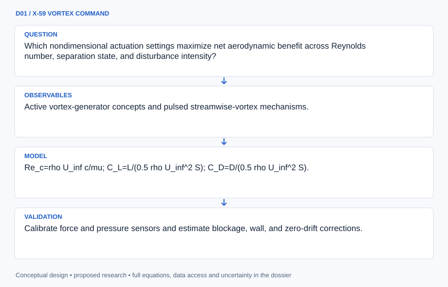
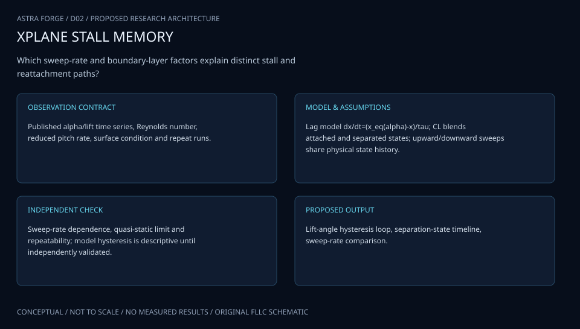
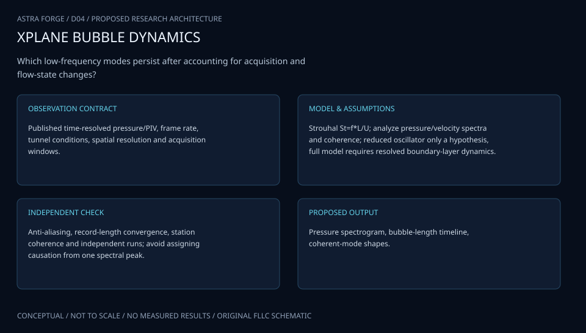

# SESSION D: AERONAUTICS

## ATLAS engineering handbook · Revision 2

7 original projects, preserved in their supplied order. Each numbered record has an independently stated design basis, model, data contract and verification plan.

[All engineering documents](../ENGINEERING_DOCUMENTATION.md) · [Documentation standard](../docs/ENGINEERING_STANDARD.md)

## Ordered contents

1. [D01 · X-59 VORTEX COMMAND](#d01) — Experimental Investigation of Active Vortex Generators
2. [D02 · LANGLEY STALL MEMORY](#d02) — Stall Hysteresis: Why the reattachment angle is less than the separation stall angle
3. [D03 · INGENUITY DESCENT & BUBBLE LAB](#d03) — Optimizing Autorotating Sensor Probe Design for Space Exploration- Low Frequency Unsteadiness in Laminar Separation Bubbles
4. [D04 · GLENN SPHERE STANDARD](#d04) — Validating a New CFD Algorithm by Finding the Drag Coefficient of a Sphere
5. [D05 · APOLLO CYBER FLIGHT DECK](#d05) — CIS Aviation-ISAC
6. [D06 · LANGLEY MACH ATLAS](#d06) — Characterization of a Hypersonic Wind Tunnel Nozzle
7. [D07 · ARES DUAL-WORLD SCOUT](#d07) — Suborbital Uncrewed Aerial Vehicles for Earth Surveillance and Mars Exploration

---

<a id="d01"></a>

## D01 · X-59 VORTEX COMMAND

**Original project:** Experimental Investigation of Active Vortex Generators

**Session D:** Aeronautics

**Document class:** engineering research design and analysis record · **Revision:** 2 · **Date:** 2026-10-02

**Evidence state:** design basis, mathematical formulation and verification plan documented. Project-specific empirical results remain to be acquired; executable shared model demonstrations have their own recorded checks.

[Engineering document register](../ENGINEERING_DOCUMENTATION.md) · [Session D handbook](../documentation/SESSION_D.md) · [Previous: C30](../projects/C/C30.md) · [Next: D02](../projects/D/D02.md)

### Purpose and scientific objective

Proposed mission: quantify when active vortex generation improves boundary-layer attachment enough to justify actuator power, added complexity, and off-state penalties. Couple unsteady flow measurements to a power-aware control model. The objective is a defensible operating envelope and comparison with passive devices, rather than reporting lift gains without the corresponding drag and energy accounting.

**Question:** Which nondimensional actuation settings maximize net aerodynamic benefit across Reynolds number, separation state, and disturbance intensity?

**Testable hypothesis:** Closed-loop intermittent actuation will deliver comparable attachment control with lower time-averaged power than continuous forcing in a subset of separated-flow conditions.

### 1. Design basis and analysis boundary

The test system compares baseline, passive vortex generators and active actuation at a declared useful aerodynamic condition. Its boundary includes tunnel inflow, airfoil/model surface, actuation supply, force/pressure measurements and control latency. Net benefit includes measured auxiliary power; force reduction alone is not a vehicle fuel-savings result.

Begin with repeated unactuated baselines and randomized blocked settings. A reduced response surface is calibrated only within the measured Reynolds number, turbulence and separation range. Add a closed-loop attachment controller after open-loop mechanism evidence, because transition promotion, jet momentum and vortex transport can produce different apparent gains.

### 2. Requirements and verification traceability

These are project design requirements or proposed analysis gates. A numerical target is not a NASA requirement unless its controlling source is explicitly identified. “TBD” identifies evidence required before a decision; it is not permission to assume a value. Verification evidence listed here is planned, unless a linked result explicitly records execution.

| ID | Requirement / gate | Engineering rationale | Verification method | Basis / required evidence |
| --- | --- | --- | --- | --- |
| D01-R1 | Report equal-lift and equal-angle comparisons separately with native force uncertainty. | Different operating constraints change drag benefit. | Check matched-condition ledgers and interpolate only within supported range. | Aerodynamic comparison contract. |
| D01-R2 | Jet momentum shall be time-averaged over the actual pulse cycle. | Duty cycle changes C_mu even at equal peak speed. | Integrate measured mass flow times jet velocity. | Dimensionless momentum definition. |
| D01-R3 | Proposed net-benefit gate: lower uncertainty bound of U Delta D minus actuation/auxiliary power exceeds zero. | Control may spend more power than it saves. | Joint force/power propagation at a declared condition. | Proposed engineering criterion; no gain claimed. |
| D01-R4 | Controller evaluation shall include sensor delay and withheld disturbance conditions. | A response surface optimum is not a robust controller. | Replay logged delay/noise and held-out blocks. | Proposed closed-loop verification gate. |

### 3. Architecture and controlled interfaces

The tunnel-state interface supplies density, viscosity, speed and turbulence metadata. A pulse adapter records mass-flow and velocity histories, electrical/pneumatic power and time alignment. Forces use wind axes, with positive drag resisting flow and lift normal to it; balance tare and model reference area are configuration controlled.

Pressure/velocity diagnostics estimate separation and vorticity separately from integrated forces. A blocked statistical model predicts coefficients and actuation power. The controller consumes a validated attachment indicator and emits bounded actuation requests to a simulator or authorized apparatus interface; out-of-domain conditions bypass optimization and preserve raw measurements.



Momentum, aerodynamic diagnostics and supply power join only at matched operating conditions. The control branch carries delay explicitly; vehicle fuel savings are beyond this laboratory ledger.

[Editable engineering diagram source](../visuals/projects/D01.mmd)

### 4. Mathematical model and derivation

#### Governing equations

```text
Re_c=rho U_inf c/mu; C_L=L/(0.5 rho U_inf^2 S); C_D=D/(0.5 rho U_inf^2 S).
```

```text
C_mu=dot(m)_jet U_jet/(0.5 rho U_inf^2 S), with pulsed mass flow explicitly time-averaged.
```

```text
F_plus=f_act L_sep/U_inf, using a declared separation-length definition.
```

```text
Delta P_net=U_inf(D_baseline-D_control)-P_act-P_aux for a drag-reduction comparison at equal useful condition.
```

#### Variables, units and conventions

- Actuation frequency, duty cycle, amplitude, jet orientation, sensor latency, and separation location.
- Freestream speed, density, viscosity, turbulence intensity, force-balance uncertainty, pressure, and actuator electrical/pneumatic power.

#### Assumptions and boundary conditions

- The chosen apparatus supports the relevant Reynolds and pressure-gradient regimes.
- Equal lift or equal angle-of-attack comparisons answer different questions and are kept separate; aerodynamic force benefit does not imply vehicle-level fuel benefit.

#### Derivation step 1

$$
q_\infty=\rho U^2/2;\quad C_D=D/(q_\infty S)
$$

Dynamic pressure is Pa and qS is N. Reynolds number rho U c/mu and lift coefficient use the same declared chord and reference area.

#### Derivation step 2

$$
C_\mu=\langle\dot m_jU_j\rangle/(q_\infty S)
$$

The numerator is N. For pulsed jets average the product, not the product of separately averaged flow and speed; include multiple ports consistently.

#### Derivation step 3

```text
F^+=f_{act}L_{sep}/U
```

Choose whether L_sep is baseline or controlled separation length and retain that choice. Frequency nondimensionalization does not establish identical mechanisms across different geometries.

#### Derivation step 4

$$
\Delta P=U(D_0-D_c)-P_{act}-P_{aux}
$$

At equal useful condition the drag power reduction has W units. Propagate covariance of paired baseline/control forces and shared U before applying the positive-benefit criterion.

#### Inference or simulation procedure

Establish a repeated no-control baseline and matched passive-vortex-generator comparison. Use a randomized, blocked design to separate actuation settings from tunnel drift. Measure forces, pressure distributions, and velocity/vorticity fields, then fit a reduced-order response model with uncertainty. Develop a simple attachment-state controller on the validated operating region and assess sensitivity to sensor noise and delayed response.

#### Validity domain and fidelity limits

A two-dimensional laboratory model omits sweep, real-aircraft integration, and actuator maintenance. Apparent control gains may come from transition promotion rather than the intended vortex mechanism.

### 5. Data specifications and provenance

| Field | Type | Unit | Physical / statistical meaning | Quality and missing-data rule |
| --- | --- | --- | --- | --- |
| test_block | string | 1 | Randomized run block and condition. | Baseline repeats and sequence retained. |
| freestream_state | record | kg/m^3,m/s,Pa s | Density, speed and viscosity. | Calibration covariance and timestamps required. |
| force_vector | vector<float64> | N | Tared wind-axis loads. | Axis convention and reference area required. |
| jet_histories | array<time,flow,speed> | s,kg/s,m/s | Pulse-resolved momentum inputs. | Synchronized; missing pulse sample flagged. |
| actuation_power | nullable<float64> | W | Electrical/pneumatic equivalent input. | Boundary and conversion efficiency declared. |
| separation_length | nullable<float64> | m | Diagnostic bubble/separation extent. | Observable definition and error required. |
| coefficient_covariance | matrix<float64> | 1 | Joint lift/drag uncertainty. | Shared tare/inflow terms retained. |

[Machine-readable record schema](../data/contracts/D01.schema.json) · [Empty acquisition CSV](../data/contracts/D01.csv) · [Field dictionary CSV](../data/contracts/D01.dictionary.csv)

The CSV above contains column headers only. Its schema defines future records and does not establish that original-team data or a particular archive product have been acquired. Frame, timing, calibration, covariance, selection and provenance details must accompany populated records.

#### NASA active-vortex/separation-control report

[Product, archive or reference](https://ntrs.nasa.gov/api/citations/20020045525/downloads/20020045525.pdf)

**Fields:** Active vortex-generator concepts and pulsed streamwise-vortex mechanisms.

**Access:** Public PDF located through NASA search; citation-page fetch was blocked, so use document provenance and PDF metadata.

**Role:** Physical mechanism and comparison taxonomy.

#### NASA low-pressure turbine separation-control research

[Product, archive or reference](https://ntrs.nasa.gov/archive/nasa/casi.ntrs.nasa.gov/20020070525.pdf)

**Fields:** VGJ computational/experimental comparison and low-Reynolds separated-flow response.

**Access:** Public research PDF; original field data may not be machine readable.

**Role:** Benchmark for boundary-layer response.

### 6. Uncertainty, sensitivity and identifiability

Balance calibration, tunnel drift, inflow turbulence, jet momentum and power conversion can correlate across paired runs. Pressure integration and balance force estimates are complementary but not fully independent. Unmodeled transition changes or three-dimensional end effects create discrepancy between a laboratory coefficient and aircraft-scale performance.

Use blocked randomization and paired covariance to prevent tunnel drift from becoming an actuation effect. Compare force gains to separation/vorticity evidence and test withheld Reynolds/turbulence conditions. Sensitivity to delay and actuator saturation determines whether a controller stays within the calibrated envelope; an out-of-domain gain remains an unvalidated prediction.

### 7. Engineering trade study

| Alternative | Benefit | Cost / limitation | Decision rule |
| --- | --- | --- | --- |
| Passive generators | Simple and low auxiliary power. | Fixed drag penalty off design. | Baseline at identical useful condition. |
| Open-loop pulsed jets | Controlled frequency/amplitude. | Power and parameter sensitivity. | Use if net-benefit gate holds over supported conditions. |
| Attachment-state feedback | Adapts to disturbances. | Sensor delay and controller faults. | Add after indicator and replay validation. |

### 8. Verification and validation cases

| Case ID | Stimulus / condition | Expected result / criterion | Method | Evidence artifact |
| --- | --- | --- | --- | --- |
| D01-V1 | Actuation-off limit | C_mu=0 and zero auxiliary input reproduce baseline configuration. | Disable actuator and compare repeated blocked runs. | Boundary-condition identity. |
| D01-V2 | Constant jet fixture | Constant flow/speed gives analytic C_mu; pulsed product averaging matches quadrature. | Synthetic pulse trace test. | Momentum units and integration. |
| D01-V3 | Net-power ledger | Equal drag with positive actuator power gives negative net benefit. | Analytic fixture plus paired uncertainty calculation. | Power accounting; actual sign TBD. |

**Execution status:** these cases are specified, not claimed as executed. Close a case only with the versioned inputs, output, uncertainty, reviewer and pass/fail rationale.

#### Additional scientific validation gates

- Calibrate force and pressure sensors and estimate blockage, wall, and zero-drift corrections.
- Require repeated baseline recovery and statistically resolved differences under matched lift/flow conditions.
- Check whether velocity fields exhibit the hypothesized streamwise vortices and near-wall momentum transfer; quantify spectral response and control latency.

### 9. Implementation and reproducible work packages

1. Create tunnel_condition.yaml and force_axes.json.
2. Build pulse_momentum.py with constant/duty-cycle fixtures.
3. Implement force_power_ledger.py with paired covariance.
4. Create separation_diagnostics.py and blocked_response_model.py.
5. Build controller_replay.py with delay, noise and saturation.
6. Publish net_trade.parquet and a configuration-specific validation matrix.

#### Investigation sequence

1. Define proposed attachment, drag, actuator-power, and off-state requirements.
2. Design a factor matrix covering separation intensity, forcing frequency, amplitude, and duty cycle with repeats.
3. Measure independent aerodynamic and actuator power channels under synchronized timestamps.
4. Compare open-loop and feedback policies on held-out conditions; publish the cases with no net benefit.

#### Resources and interfaces to expertise

- Wind tunnel, qualified flow-control laboratory, force/pressure instrumentation, velocity-field metrology, and actuator power logging.

### 10. Failure modes and interpretation controls

| Failure mode | Effect on result | Detection / evidence | Design response |
| --- | --- | --- | --- |
| Peak flow used as mean | Overstated actuation strength. | Pulse integral discrepancy. | Record resolved momentum product. |
| Tunnel drift confounded | False drag reduction. | Baseline sequence dependence. | Randomized blocked comparisons. |
| Latency destabilizes feedback | Intermittent separation/control oscillation. | Delay-aware replay and state spectra. | Bound controller bandwidth and retain safe bypass. |

- Ignoring supply-power efficiency can make ineffective actuation appear beneficial.
- Tunnel drift, transition sensitivity, and wall effects can dominate small force differences.

### 11. Required engineering outputs

- Control-response dataset, net-power trade map, uncertainty budget, controller specification, and synchronized flow visualizations.

#### Scientific result figures to produce during execution

Velocity/vorticity snapshots show baseline and controlled attachment; a frequency–duty-cycle map overlays net power gain with measurement uncertainty.

### 12. Cited technical and scientific resources

- [NASA/TM-2002-211631, Flow and Noise Control: Review and Assessment of Future Directions](https://ntrs.nasa.gov/api/citations/20020045525/downloads/20020045525.pdf) — NASA research discussion of active/pulsed vortex generation.
- [Low-Pressure Turbine Separation Control: Comparison With Experimental Data](https://ntrs.nasa.gov/archive/nasa/casi.ntrs.nasa.gov/20020070525.pdf) — Original computational treatment of vortex-generator jets in separated low-Reynolds flow.

Framework and evidence rules: [engineering documentation standard](../docs/ENGINEERING_STANDARD.md), [model assurance](../docs/MODEL_ASSURANCE.md), [uncertainty procedure](../docs/UNCERTAINTY_AND_DECISION_RULES.md), and [data management](../docs/DATA_MANAGEMENT.md). NASA-inspired names are creative identifiers; requirements and results are not NASA certification.

---

<a id="d02"></a>

## D02 · LANGLEY STALL MEMORY

**Original project:** Stall Hysteresis: Why the reattachment angle is less than the separation stall angle

**Session D:** Aeronautics

**Document class:** engineering research design and analysis record · **Revision:** 2 · **Date:** 2026-10-02

**Evidence state:** design basis, mathematical formulation and verification plan documented. Project-specific empirical results remain to be acquired; executable shared model demonstrations have their own recorded checks.

[Engineering document register](../ENGINEERING_DOCUMENTATION.md) · [Session D handbook](../documentation/SESSION_D.md) · [Previous: D01](../projects/D/D01.md) · [Next: D03](../projects/D/D03.md)

### Purpose and scientific objective

Proposed mission: distinguish quasi-static aerodynamic bistability from rate-dependent dynamic stall and quantify why a separated flow may require a lower angle to reattach. Investigate the influence of transition, separation-bubble bursting, and wake history using controlled up/down sweeps. The project treats the supplied angle ordering as a testable behavior within an operating regime, not a universal law.

**Question:** How much observed hysteresis survives as angle-sweep rate approaches zero, and which measured flow-state variables explain the remaining loop?

**Testable hypothesis:** Finite-rate loops will partly scale with a flow-response timescale; persistent slow-sweep hysteresis will require state-dependent separation/transition dynamics beyond an instantaneous lift curve.

### 1. Design basis and analysis boundary

The hysteresis study compares ascending and descending angle histories with synchronized force/flow measurements and declared initial-state/dwell conditions. Its boundary includes angle actuation, tunnel state, airfoil surface and diagnostic observables. Static bistability and finite-rate lag are separate hypotheses; a visible loop alone does not determine their mechanism.

Begin with a memory-free lift curve, then a first-order separation relaxation model and an optional multistable equilibrium. Rate sweeps approaching zero plus long dwell measurements test whether the loop persists. Leading-edge bubble, trailing-edge separation and dynamic vortex terms require independent diagnostic evidence rather than selection by curve fit alone.

### 2. Requirements and verification traceability

These are project design requirements or proposed analysis gates. A numerical target is not a NASA requirement unless its controlling source is explicitly identified. “TBD” identifies evidence required before a decision; it is not permission to assume a value. Verification evidence listed here is planned, unless a linked result explicitly records execution.

| ID | Requirement / gate | Engineering rationale | Verification method | Basis / required evidence |
| --- | --- | --- | --- | --- |
| D02-R1 | Angle, force and pressure clocks shall share a documented offset uncertainty. | Timing lag can fabricate hysteresis. | Cross-check common events and propagate offset. | Synchronization contract. |
| D02-R2 | Every up/down comparison shall retain initial state, dwell and surface condition. | History differences can be protocol artifacts. | Inspect run metadata and repeated baseline sequences. | Experimental interpretation requirement. |
| D02-R3 | Report loop area and angle difference versus nondimensional rate with uncertainty. | Persistent and dynamic loops scale differently. | Integrate curves on common angle grid; repeat slow-rate/dwell cases. | Derived observables, no measured loop claimed. |
| D02-R4 | Proposed model gate: predict a withheld sweep rate without refitting equilibrium branches. | A phenomenological fit needs external discrimination. | Compare memory-free, relaxation and bistable predictions. | Proposed validation criterion. |

### 3. Architecture and controlled interfaces

An angle-history module stores radians and signed angular rate with monotonic experiment time. Tunnel metadata supplies U, chord, Reynolds and turbulence. Force/pressure adapters preserve calibration and timestamp covariance. Flow diagnostics estimate separation fraction and transition location with an explicit spatial definition.

Three model branches share the same measurement likelihood: memory-free equilibrium, relaxation with a unique equilibrium and state-dependent multistability. A curve integrator computes signed loop area and threshold-dependent stall/reattachment angles. The prediction layer retains chronological ordering rather than shuffling dependent samples into artificial training independence.



History, synchronization and flow state constrain competing memory models. A measured loop enters a discrimination process; it is not itself proof of static bistability or a particular separation mechanism.

[Editable engineering diagram source](../visuals/projects/D02.mmd)

### 4. Mathematical model and derivation

#### Governing equations

```text
k=omega c/(2 U_inf) for sinusoidal pitching; r_alpha=dot(alpha)c/U_inf for monotonic sweeps.
```

```text
tau_s dot(s)=s_eq(alpha,Re,Tu,s)-s, with s representing separated fraction and possible state-dependent equilibria.
```

```text
C_L=(1-s)C_L,attached+s C_L,separated+C_L,vortex in a reduced phenomenological model.
```

```text
A_loop=integral C_L d(alpha); Delta alpha=alpha_stall,up-alpha_reattach,down.
```

#### Variables, units and conventions

- Angle alpha, sweep rate, reduced frequency, Reynolds number, freestream turbulence Tu, and separated fraction s.
- Lift, drag, moment, transition location, reattachment location, pressure spectra, and response timescale tau_s.

#### Assumptions and boundary conditions

- Angle and force timestamps are synchronized; identical dwell and initial-state protocols define each comparison.
- A fitted separated-fraction model summarizes behavior and does not establish the microscopic mechanism.

#### Derivation step 1

$$
r_\alpha=\dot\alpha c/U;\quad k=\omega c/(2U)
$$

For radians treated dimensionless, both quantities are dimensionless. Monotonic rate and sinusoidal reduced frequency are not interchangeable without specifying angle amplitude.

#### Derivation step 2

$$
\tau\dot s=s_{eq}(\alpha)-s
$$

With fixed alpha and unique equilibrium, s approaches s_eq exponentially. During slow ramp, expansion gives s approximately s_eq-tau dot(alpha) ds_eq/dalpha.

#### Derivation step 3

```text
C_L=(1-s)C_{L,a}+sC_{L,s}+C_{L,v}
```

The separation fraction interpolates attached/separated contributions; the vortex term is separately identified or omitted. The expression is a reduced model rather than a microscopic derivation.

#### Derivation step 4

$$
A_{loop}=\oint C_Ld\alpha;\quad\Delta\alpha=\alpha_{stall,up}-\alpha_{reattach,down}
$$

Use radians and a fixed traversal orientation. For a smooth unique relaxation equilibrium, dynamic loop contribution tends to zero with rate; a surviving loop requires another explanation or protocol artifact.

#### Inference or simulation procedure

Run ascending/descending sweeps at several rates with sufficiently long dwell tests to identify equilibrium. Use pressure and velocity-field measurements to distinguish trailing-edge separation, leading-edge bubble failure, and vortex-mediated dynamics. Fit a memory-free baseline, relaxation model, and possible bistable model to separate finite-rate lag from persistent state dependence. Predict a withheld sweep rate and disturbance level.

#### Validity domain and fidelity limits

Stall topology depends strongly on airfoil shape, Reynolds number, surface condition, and turbulence. Dynamic-stall models from rotating blades do not automatically validate static hysteresis on a different airfoil.

### 5. Data specifications and provenance

| Field | Type | Unit | Physical / statistical meaning | Quality and missing-data rule |
| --- | --- | --- | --- | --- |
| run_history | record | 1 | Direction, dwell and initialization. | Surface state and sequence required. |
| time | vector<float64> | s | Synchronized experiment clock. | Offset uncertainty recorded; missing samples masked. |
| angle | vector<float64> | rad | Measured angle of attack. | Encoder convention and rate derivation stated. |
| lift_coefficient | vector<float64> | 1 | Tared C_L trace. | Reference area and shared calibration retained. |
| separated_fraction | nullable<vector<float64>> | 1 | Defined spatial separation measure. | Between zero and one; diagnostic limitations flagged. |
| turbulence_level | nullable<float64> | 1 | Declared inflow intensity. | Definition/bandwidth required. |
| loop_metrics | record | rad | Signed area and angle difference. | Threshold rule and joint uncertainty retained. |

[Machine-readable record schema](../data/contracts/D02.schema.json) · [Empty acquisition CSV](../data/contracts/D02.csv) · [Field dictionary CSV](../data/contracts/D02.dictionary.csv)

The CSV above contains column headers only. Its schema defines future records and does not establish that original-team data or a particular archive product have been acquired. Frame, timing, calibration, covariance, selection and provenance details must accompany populated records.

#### NASA dynamic-stall propfan analysis

[Product, archive or reference](https://ntrs.nasa.gov/citations/19890005741)

**Fields:** Semiempirical stall model, pitching/plunging dynamics, and comparison with wind-tunnel response.

**Access:** Public report with downloadable PDF; raw time series availability needs checking.

**Role:** Rate-dependent stall-model precedent.

#### NASA lift-enhancing-tab experiment

[Product, archive or reference](https://ntrs.nasa.gov/citations/19980019443)

**Fields:** Lift-curve hysteresis and separation response to vortex generators on selected flap configurations.

**Access:** Public research report; geometry-specific results are contextual.

**Role:** Evidence that separation control can alter hysteresis.

### 6. Uncertainty, sensitivity and identifiability

Angle calibration, timestamps, force tare and slow tunnel drift jointly affect loop metrics. Initial boundary-layer state and surface contamination can create uncontrolled branch differences. Threshold-defined stall angles depend on smoothing and criterion; uncertainty must include those analysis choices rather than only encoder accuracy.

Bootstrap entire sweep cycles and vary synchronization offset within its calibration interval. Profile relaxation time against equilibrium slope and separate rate-induced lag from a multistable branch. Predict withheld rates and dwell endpoints. Failure to discriminate mechanisms should produce an unresolved model set, not an asserted explanation based solely on the loop shape.

### 7. Engineering trade study

| Alternative | Benefit | Cost / limitation | Decision rule |
| --- | --- | --- | --- |
| Memory-free equilibrium | Simple reference curve. | Cannot reproduce true history dependence. | Baseline falsification branch. |
| Unique relaxation state | Explains finite-rate lag. | Loop vanishes in quasi-static limit. | Use when dwell/rate tests support unique equilibrium. |
| State-dependent bistability | Can sustain quasi-static hysteresis. | Additional branch parameters and mechanism ambiguity. | Adopt only after persistent-loop and diagnostic evidence. |

### 8. Verification and validation cases

| Case ID | Stimulus / condition | Expected result / criterion | Method | Evidence artifact |
| --- | --- | --- | --- | --- |
| D02-V1 | Fixed-angle relaxation | s(t)=s_eq+(s0-s_eq)exp(-t/tau). | Compare ODE integration to exact solution. | Analytic state response. |
| D02-V2 | Zero-rate unique equilibrium | Up/down curves coincide as rate tends to zero under identical initialization. | Rate refinement and long-dwell synthetic tests. | Reduced-model limit. |
| D02-V3 | Time reversal/orientation | Reversing integration orientation changes signed area but not branch-angle difference definition. | Known closed-loop numeric fixture. | Loop algebra and immutable thresholds. |

**Execution status:** these cases are specified, not claimed as executed. Close a case only with the versioned inputs, output, uncertainty, reviewer and pass/fail rationale.

#### Additional scientific validation gates

- Quantify angle-zero, balance drift, repeatability, and timing errors; uncertainty in Delta alpha is explicit.
- Proposed gate: a model predicts held-out rate dependence and flow-state transitions within measured uncertainty.
- Report whether the slow-rate loop vanishes, persists, or remains unresolved; test dependence on noise and initial state.

### 9. Implementation and reproducible work packages

1. Create sweep_protocol_manifest.json with history and angle units.
2. Implement clock_alignment.py and calibration covariance.
3. Build loop_metrics.py with orientation/threshold fixtures.
4. Implement equilibrium.py, relaxation.py and bistable.py as separate branches.
5. Create chronological_holdout.ipynb for rate/dwell prediction.
6. Publish flow_state.parquet and a mechanism-discrimination report with unresolved alternatives.

#### Investigation sequence

1. Freeze definitions of stall and reattachment from force and flow-field criteria before testing.
2. Separate slow dwell experiments from continuous dynamic sweeps and match their initial conditions.
3. Measure transition and bubble/wake state alongside forces to test mechanism hypotheses.
4. Evaluate whether active or passive transition/separation control changes loop area and recovery without unacceptable drag cost.

#### Resources and interfaces to expertise

- Low-speed tunnel, synchronized angle/force acquisition, surface-pressure instrumentation, flow visualization, and unsteady aerodynamics expertise.

### 10. Failure modes and interpretation controls

| Failure mode | Effect on result | Detection / evidence | Design response |
| --- | --- | --- | --- |
| Clock mismatch | Artificial phase loop. | Offset sensitivity changes area. | Synchronize and propagate timing uncertainty. |
| Different initial states ignored | Protocol mistaken for intrinsic bistability. | Dwell endpoint inconsistency. | Document/reset history and compare state diagnostics. |
| Smoothing threshold drift | Unstable stall angles. | Analysis-parameter sensitivity. | Preregister criterion and report interval. |

- Calling every loop dynamic stall obscures persistent quasi-static bistability.
- Uncontrolled surface contamination or tunnel turbulence can move stall angles more than the studied effect.

### 11. Required engineering outputs

- Up/down stall atlas, fitted memory-model parameters, mechanism-evidence report, and an uncertainty-aware reattachment map.

#### Scientific result figures to produce during execution

Lift–angle loops are colored by sweep rate and annotated with measured flow topology; dwell-state plots separate static branches from finite-rate delay.

### 12. Cited technical and scientific resources

- [Analysis of an unswept propfan blade with a semiempirical dynamic stall model](https://ntrs.nasa.gov/citations/19890005741) — Original NASA unsteady blade analysis and validation against measured response.
- [Experimental Study of Lift-Enhancing Tabs on a Two-Element Airfoil](https://ntrs.nasa.gov/citations/19980019443) — Original NASA experiment describing lift-curve hysteresis and separation-control effects.

Framework and evidence rules: [engineering documentation standard](../docs/ENGINEERING_STANDARD.md), [model assurance](../docs/MODEL_ASSURANCE.md), [uncertainty procedure](../docs/UNCERTAINTY_AND_DECISION_RULES.md), and [data management](../docs/DATA_MANAGEMENT.md). NASA-inspired names are creative identifiers; requirements and results are not NASA certification.

---

<a id="d03"></a>

## D03 · INGENUITY DESCENT & BUBBLE LAB

**Original project:** Optimizing Autorotating Sensor Probe Design for Space Exploration- Low Frequency Unsteadiness in Laminar Separation Bubbles

**Session D:** Aeronautics

**Document class:** engineering research design and analysis record · **Revision:** 2 · **Date:** 2026-10-02

**Evidence state:** design basis, mathematical formulation and verification plan documented. Project-specific empirical results remain to be acquired; executable shared model demonstrations have their own recorded checks.

[Engineering document register](../ENGINEERING_DOCUMENTATION.md) · [Session D handbook](../documentation/SESSION_D.md) · [Previous: D02](../projects/D/D02.md) · [Next: D04](../projects/D/D04.md)

### Purpose and scientific objective

The supplied line combines two research concepts. Preserve both as coordinated but distinct proposed work packages: D03a, an autorotating sensor-probe feasibility study, and D03b, low-frequency dynamics of laminar separation bubbles. Their scientific connection is low-Reynolds aerodynamics; neither project's success is assumed to validate the other. The aggregate mission asks how aerodynamic unsteadiness changes passive descent robustness.

**Question:** Which rotor geometries admit stable autorotation under exploration-atmosphere conditions, and which low-frequency separation modes change their force/torque uncertainty?

**Testable hypothesis:** A coupled design informed by independently validated low-Reynolds response statistics will predict descent dispersion better than steady blade-element models; feasibility on Mars may remain mass- and deployment-limited.

### 1. Design basis and analysis boundary

The original combined title remains one portfolio entry containing two independently gated engineering packages. D03a models autorotating probe descent, rotor equilibrium and stability in declared atmospheric conditions. D03b analyzes low-frequency unsteadiness in stationary laminar separation bubbles. Each has separate data, acceptance evidence and limitations; shared aerodynamic envelopes are transferred only after a compatibility review.

D03a begins with coupled blade-element torque and vertical force balance, then adds deployment/low-Reynolds discrepancy envelopes. D03b begins with calibrated pressure/velocity spectra and stationarity tests, then conditional POD/modal analysis. A stationary bubble mode is not automatically a rotating-blade forcing model, and matching Reynolds number alone does not establish dynamic similarity.

### 2. Requirements and verification traceability

These are project design requirements or proposed analysis gates. A numerical target is not a NASA requirement unless its controlling source is explicitly identified. “TBD” identifies evidence required before a decision; it is not permission to assume a value. Verification evidence listed here is planned, unless a linked result explicitly records execution.

| ID | Requirement / gate | Engineering rationale | Verification method | Basis / required evidence |
| --- | --- | --- | --- | --- |
| D03-R1 | D03a shall solve descent and rotor torque simultaneously with declared positive directions. | Prescribed rotation can hide unstable equilibrium. | Check force/torque residuals; proposed normalized target 10^-6. | Proposed numerical gate. |
| D03-R2 | D03a stability shall use coupled V/Omega Jacobian eigenvalues and parameter uncertainty. | Zero mean torque does not ensure stable autorotation. | Linearize and compare small-perturbation trajectories. | Local dynamical criterion. |
| D03-R3 | D03b spectral claims shall report record duration, window, resolution and stationarity. | Low-frequency drift can imitate a bubble mode. | Repeat segmented spectra and detrending alternatives. | Spectral-analysis contract. |
| D03-R4 | Proposed D03b record target: at least 20 cycles of a candidate lowest resolved mode. | Few cycles produce weak frequency/statistical evidence. | Compare duration to identified peak period and flag insufficient records. | Proposed screening target, not universal guarantee. |
| D03-R5 | Transferred D03b data shall pass a nondimensional compatibility and uncertainty gate. | Stationary/rotating flows differ. | Review Re, Mach, reduced frequency, geometry and rotational effects. | Transfer requirement; no combined validation claimed. |

### 3. Architecture and controlled interfaces

D03a accepts probe mass, rotor inertia, gravity and atmospheric density/viscosity. Blade tables provide C_L/C_D versus local flow state with covariance; blade-element quadrature returns upward force and driving torque. A coupled ODE advances downward-positive V and rotation Omega, while deployment uncertainty remains a separate scenario.

D03b stores stationary airfoil geometry, bubble-length definition and synchronized pressure/velocity arrays. A spectral module produces PSD in native squared units per Hz; POD uses spatial weights and centering. A transfer registry exports only compatible force/torque uncertainty envelopes to D03a, never raw modal frequencies as universal rotor inputs.


D03a and D03b retain separate physics and acceptance paths. Only a reviewed aerodynamic uncertainty envelope connects them; stationary bubble spectra do not directly establish autorotating-probe performance.

[Editable engineering diagram source](../visuals/projects/D03.mmd)

### 4. Mathematical model and derivation

#### Governing equations

```text
D03a: m dot(V)=mg-F_z; I_r dot(Omega)=Q_aero-Q_loss.
```

```text
D03a: dF_z=0.5 rho U_rel^2 c_r(C_L cos phi+C_D sin phi)dr; solve torque and descent jointly.
```

```text
D03b: St=f L_b/U_inf; P_xx(f)=Fourier-based power spectrum of a defined pressure/velocity observable.
```

```text
D03b: u'(x,t)=sum_j a_j(t)phi_j(x) for a POD basis; modes are descriptive unless independently linked to a mechanism.
```

#### Variables, units and conventions

- Probe mass m, rotor inertia I_r, descent speed V, rotation Omega, local relative speed U_rel, blade chord c_r, flow angle phi.
- Atmospheric density/viscosity, gravitational acceleration, deployed geometry, bubble length L_b, Reynolds number, turbulence intensity, and signal duration.

#### Assumptions and boundary conditions

- D03a's blade-element model is a first approximation; reverse flow, low-Reynolds nonlinearities, and deployment transients require extensions.
- D03b baseline is a stationary airfoil experiment; transferring its statistics to rotating blades requires separate tests.

#### Derivation step 1

$$
m\dot V=mg-F_z;\quad I_r\dot\Omega=Q_{aero}-Q_{loss}
$$

With downward-positive descent and upward-positive aerodynamic force, equilibrium requires F_z=mg and torque balance. Torque loss is positive resisting rotation.

#### Derivation step 2

$$
U_{rel}=\sqrt{V^2+(\Omega r)^2};\quad\phi=\tan^{-1}[V/(\Omega r)]
$$

These first-tier local velocities omit induced/reverse-flow effects. Integrate declared lift/drag projections for force and torque using blade chord and radius.

#### Derivation step 3

$$
\delta\dot x=J\delta x;\quad J=\partial[(mg-F_z)/m,(Q_a-Q_l)/I_r]/\partial[V,\Omega]
$$

Eigenvalues with negative real parts imply local stability under the reduced smooth model. Uncertain aerodynamic derivatives require an ensemble, not one nominal eigenvalue.

#### Derivation step 4

$$
St=fL_b/U;\quad\int_0^{f_N}P_{xx}(f)df=\operatorname{var}(x)
$$

The bubble frequency is nondimensional only with declared L_b. A consistently normalized one-sided PSD integrates to variance, giving an independent spectral conservation check.

#### Derivation step 5

$$
u'(x,t)=\sum_ja_j(t)\phi_j(x)
$$

Weighted POD diagonalizes fluctuation covariance and ranks energy. A large mode or spectral peak is descriptive until independently tied to bubble motion or a mechanism.

#### Inference or simulation procedure

D03a searches a constrained mass–geometry–atmosphere space using torque equilibrium, stability derivatives, and Monte Carlo descent. D03b uses pressure/velocity time series to distinguish genuine low-frequency bubble modes from drift and sparse-sampling artifacts. Combine only validated aerodynamic response envelopes in the descent model, then test an independent prototype or higher-fidelity simulation. Maintain separate datasets, acceptance gates, and publications for each package.

#### Validity domain and fidelity limits

Matching Reynolds number alone does not match gravity, rotor inertia, density, Mach number, and dynamic similarity. A low-frequency spectral peak does not prove a unique bubble-bursting mechanism.

### 5. Data specifications and provenance

| Field | Type | Unit | Physical / statistical meaning | Quality and missing-data rule |
| --- | --- | --- | --- | --- |
| package_id | enum | 1 | D03a or D03b origin. | Never merge datasets without transfer record. |
| atmosphere | record | kg/m^3,Pa s,m/s^2 | Density, viscosity and gravity. | Uncertainty and scenario provenance required. |
| rotor_geometry | array<radius,chord> | m | Blade discretization. | Positive dimensions and deployment state. |
| aero_coefficients | float64[state,2] | 1 | Coefficient rows align to a versioned local-flow-state index; columns are exactly [C_L,C_D]. | State index declares alpha/Re/Mach, row correspondence and interpolation domain; coefficient covariance required. |
| descent_state | pair<float64> | m/s,rad/s | Downward V and Omega. | Directions fixed; failed state null. |
| bubble_length | nullable<float64> | m | Stationary separation-to-reattachment distance. | Method/uncertainty required. |
| pressure_velocity_trace | nullable<record> | Pa,m/s | Synchronized D03b observations. | Sampling/duration/masks required. |
| transfer_envelope | nullable<record> | N,N m | Compatible force/torque perturbation model. | Review ID required; null if unvalidated. |

[Machine-readable record schema](../data/contracts/D03.schema.json) · [Empty acquisition CSV](../data/contracts/D03.csv) · [Field dictionary CSV](../data/contracts/D03.dictionary.csv)

The CSV above contains column headers only. Its schema defines future records and does not establish that original-team data or a particular archive product have been acquired. Frame, timing, calibration, covariance, selection and provenance details must accompany populated records.

#### NAU SEED Mars autorotation concept

[Product, archive or reference](https://www.ceias.nau.edu/capstone/projects/ME/2022/22F_P17MarsSensor/Project/index.html)

**Fields:** Proposed probe concept, feasibility objectives, Earth/Mars similarity questions, and student design context.

**Access:** Public university project; a precedent, not the original user's project or flight-proven hardware.

**Role:** D03a architecture context.

#### Original laminar-bubble fluctuation experiment

[Product, archive or reference](https://www.jstage.jst.go.jp/article/jjsass/50/582/50_582_293/_article/-char/en)

**Fields:** Airfoil/Reynolds context, low-frequency velocity fluctuation observations, and phase-averaged behavior.

**Access:** Public research article; request raw time series if not supplemented.

**Role:** D03b benchmark.

### 6. Uncertainty, sensitivity and identifiability

D03a uncertainty includes atmosphere, aerodynamic tables, inertia, deployment and induced-flow discrepancy. Force and torque errors are correlated because they use the same blade coefficients. Rotor equilibrium may vanish or change stability across the ensemble; report those outcomes rather than average them into one viable design.

D03b uncertainty includes finite-record variance, low-frequency drift, probe response and bubble-length definition. Block/segment spectra and spatially weighted modal checks test robustness. Transfer uncertainty additionally covers rotation and geometry mismatch; stationary evidence remains a separate scientific result when that bridge cannot be supported.

### 7. Engineering trade study

| Alternative | Benefit | Cost / limitation | Decision rule |
| --- | --- | --- | --- |
| Blade-element descent model | Fast coupled equilibrium search. | Low-Re/induced flow limitations. | Use for screening with discrepancy bounds. |
| Higher-fidelity rotor simulation | Resolves unsteady coupling. | Cost and closure uncertainty. | Apply to candidate equilibria and stability failures. |
| Stationary bubble modal study | Controlled mechanism diagnostics. | Not rotor-equivalent by default. | Transfer only after explicit similarity review. |

### 8. Verification and validation cases

| Case ID | Stimulus / condition | Expected result / criterion | Method | Evidence artifact |
| --- | --- | --- | --- | --- |
| D03-V1 | D03a zero aerodynamic load | With F_z=0, descent acceleration is g; zero net torque holds Omega. | Analytic ODE fixture. | Sign and dimensional check. |
| D03-V2 | D03a stable linear equilibrium | Small perturbations follow exp(Jt) and decay for negative-real eigenvalues. | Compare integration with matrix exponential. | Local stability derivation. |
| D03-V3 | D03b PSD normalization | Integrated one-sided PSD equals variance within window correction. | Synthetic known-frequency signal and Parseval check. | Spectral conservation; records pending. |
| D03-V4 | D03 package isolation | Missing transfer approval leaves D03a aerodynamic envelope unchanged. | Integration fixture with incompatible D03b geometry. | Transfer contract. |

**Execution status:** these cases are specified, not claimed as executed. Close a case only with the versioned inputs, output, uncertainty, reviewer and pass/fail rationale.

#### Additional scientific validation gates

- D03a: conserve torque/energy; recover terminal-force balance; validate descent and spin history in an authorized contained test environment.
- D03b: verify sampling/aliasing control, stationarity, block-bootstrap uncertainty, and repeatability of bubble-length dynamics.
- Coupled gate: held-out descent dispersion improves only when bubble-informed models outperform a steady baseline with uncertainty; otherwise preserve two independent outcomes.

### 9. Implementation and reproducible work packages

1. Create D03a/rotor_manifest.yaml and D03b/bubble_manifest.yaml as distinct contracts.
2. Implement blade_element.py, coupled_descent.py and stability_jacobian.py.
3. Build bubble_spectrum.py with Parseval/window fixtures.
4. Implement weighted_pod.py and segmented_stationarity.ipynb.
5. Create transfer_review.json with dimensionless comparisons and covariance mapping.
6. Publish separate descent_candidates.parquet and bubble_modes.parquet; assemble only approved envelopes.

#### Investigation sequence

1. D03a: establish proposed payload mass, survivable descent-speed requirement, deployment reliability, and atmospheric uncertainty.
2. D03a: solve autorotation equilibria, assess local stability, and identify infeasible mass/area combinations before prototype selection.
3. D03b: collect or obtain time series long enough to resolve candidate low-frequency modes across angle and Reynolds number.
4. D03b: compare spectral and modal statistics, then quantify their incremental impact on probe-force uncertainty without equating stationary and rotating flow.

#### Resources and interfaces to expertise

- Rotor aerodynamics expertise, low-Reynolds flow facility, atmospheric model, time-series analysis, and appropriately supervised prototype testing.

### 10. Failure modes and interpretation controls

| Failure mode | Effect on result | Detection / evidence | Design response |
| --- | --- | --- | --- |
| Torque sign error | False self-sustaining rotor. | Zero/load and Jacobian fixtures. | Declared positive directions. |
| Drift called low-frequency mode | Unsupported bubble mechanism. | Segmentation/detrending instability. | Longer valid records and stationarity flags. |
| Unreviewed cross-package transfer | False descent robustness. | Missing similarity review ID. | Separate outputs and gated envelope adapter. |

- A Earth demonstration can be physically unlike Mars even at similar Reynolds number.
- The combined source line is ambiguous; explicitly retaining both packages prevents accidental project deletion.

### 11. Required engineering outputs

- D03a feasibility/stability map and descent simulator; D03b spectral/modal bubble atlas; a documented transferability assessment joining them.

#### Scientific result figures to produce during execution

Left: descent speed/rotation stability and feasible payload region. Right: bubble time series, spectra, and flow modes. A clearly labeled transferability link shows which aerodynamic statistics enter the probe model.

#### Both retained research work packages

```json
[
  {
    "id": "D03a",
    "name": "INGENUITY SEED DESCENT",
    "original_title": "Optimizing Autorotating Sensor Probe Design for Space Exploration",
    "model": "Coupled vertical translation and rotor torque with low-Reynolds blade aerodynamics.",
    "data": "Versioned synthetic atmosphere/descent ensembles and university concept documentation.",
    "validation": "Independent descent/spin histories, equilibrium stability, and dynamic-similarity assessment."
  },
  {
    "id": "D03b",
    "name": "LANGLEY BUBBLE OSCILLATORY",
    "original_title": "Low Frequency Unsteadiness in Laminar Separation Bubbles",
    "model": "Spectral, phase-averaged, and POD description of bubble/wake dynamics.",
    "data": "Pressure/velocity/bubble-length time series with sampling and run metadata.",
    "validation": "Spectral convergence, repeated runs, aliasing checks, and withheld operating points."
  }
]
```

### 12. Cited technical and scientific resources

- [Northern Arizona University SEED Mars Sensor project](https://www.ceias.nau.edu/capstone/projects/ME/2022/22F_P17MarsSensor/Project/index.html) — University-authored autorotating-probe concept and similarity objectives.
- [Experimental Studies of Low Frequency Velocity Disturbances Observed in Short Bubble Formed on Airfoil](https://www.jstage.jst.go.jp/article/jjsass/50/582/50_582_293/_article/-char/en) — Original low-frequency bubble measurements.
- [Bursting and reformation cycle of the laminar separation bubble over a NACA-0012 aerofoil](https://arxiv.org/abs/1807.08681) — Original computational mechanism hypothesis to test against experimental modes.

Framework and evidence rules: [engineering documentation standard](../docs/ENGINEERING_STANDARD.md), [model assurance](../docs/MODEL_ASSURANCE.md), [uncertainty procedure](../docs/UNCERTAINTY_AND_DECISION_RULES.md), and [data management](../docs/DATA_MANAGEMENT.md). NASA-inspired names are creative identifiers; requirements and results are not NASA certification.

---

<a id="d04"></a>

## D04 · GLENN SPHERE STANDARD

**Original project:** Validating a New CFD Algorithm by Finding the Drag Coefficient of a Sphere

**Session D:** Aeronautics

**Document class:** engineering research design and analysis record · **Revision:** 2 · **Date:** 2026-10-02

**Evidence state:** design basis, mathematical formulation and verification plan documented. Project-specific empirical results remain to be acquired; executable shared model demonstrations have their own recorded checks.

[Engineering document register](../ENGINEERING_DOCUMENTATION.md) · [Session D handbook](../documentation/SESSION_D.md) · [Previous: D03](../projects/D/D03.md) · [Next: D05](../projects/D/D05.md)

### Purpose and scientific objective

Proposed mission: use sphere flow as one stage of a CFD verification and validation ladder. Separate whether the new algorithm solves its stated equations accurately from whether those equations describe the measured flow. Compare pressure and viscous drag independently and expand from creeping flow to steady separated and unsteady wakes without silently changing turbulence assumptions.

**Question:** Does the new solver converge at its claimed order and reproduce sphere drag and wake observables within combined numerical and experimental uncertainty?

**Testable hypothesis:** The solver will recover the Stokes limit and show stable grid/time convergence; discrepancies at higher Reynolds number will reveal whether numerical error, domain effects, or physical closure dominates.

### 1. Design basis and analysis boundary

The solver benchmark boundary is a smooth, fixed, nonrotating sphere in continuum low-Mach flow, with declared domain, inflow and wall boundary conditions. It evaluates discretization, force integration, conservation and physical-model agreement separately. A sphere drag match alone cannot validate arbitrary flows, and empirical correlations are comparisons with finite validity domains.

Start with manufactured and creeping-flow limits, then mesh/time/domain studies before steady or unsteady experimental validation. Pressure and viscous drag remain separate outputs. Transition, roughness and turbulence closures are added as distinct cases, particularly near drag crisis where physical scatter can exceed numerical error.

### 2. Requirements and verification traceability

These are project design requirements or proposed analysis gates. A numerical target is not a NASA requirement unless its controlling source is explicitly identified. “TBD” identifies evidence required before a decision; it is not permission to assume a value. Verification evidence listed here is planned, unless a linked result explicitly records execution.

| ID | Requirement / gate | Engineering rationale | Verification method | Basis / required evidence |
| --- | --- | --- | --- | --- |
| D04-R1 | Every C_D shall identify D, rho, U, reference area, domain and force integration convention. | Normalization or surface-normal mistakes can mimic agreement. | Independent force reconstruction and dimensional audit. | Sphere force definition. |
| D04-R2 | Use at least three systematic mesh levels, with time-step and domain refinements separated. | Combined refinement hides the source of error. | Estimate observed order only in an asymptotic sequence. | NASA V&V guidance; proposed study structure. |
| D04-R3 | Proposed conservation gate: normalized mass imbalance below 10^-6 in steady benchmark cases. | A converged residual alone does not prove conservation. | Boundary flux and control-volume ledgers. | Proposed numerical target. |
| D04-R4 | Report validation discrepancy against combined experimental/numerical uncertainty. | Correlation agreement is not exact truth. | Compare matched Reynolds/Mach/roughness cases. | Validation requirement; new solver results pending. |

### 3. Architecture and controlled interfaces

A case builder supplies sphere geometry, nondimensional regime and boundary metadata. Mesh generation records refinement ratios and wall-resolution measures; the solver adapter returns fields, residual histories and boundary fluxes without redefining them. Surface traction integration uses a declared body-outward normal and records pressure/viscous terms separately.

A numerical-analysis module computes convergence, time statistics and domain sensitivity. An experimental adapter retains roughness, turbulence, blockage and reference uncertainty. The comparison engine joins only physically compatible cases and publishes unresolved discrepancy by source instead of a single passing drag number.



Numerical gates precede physical comparison, with separate surface-load and flux ledgers. A drag correlation or isolated sphere result cannot establish unrestricted solver validity.

[Editable engineering diagram source](../visuals/projects/D04.mmd)

### 4. Mathematical model and derivation

#### Governing equations

```text
Re=rho U D/mu; C_D=F_D/(0.5 rho U^2 pi D^2/4).
```

```text
C_D=24/Re in the creeping-flow, unbounded no-slip limit.
```

```text
C_D=(24/Re)(1+0.15 Re^0.687), a Schiller–Naumann empirical comparison within its stated range.
```

```text
F_D=integral_surface[-p n_x+(tau dot n)_x]dA; track pressure and viscous contributions separately.
```

#### Variables, units and conventions

- Sphere diameter D, freestream U, density, viscosity, Mach number, mesh scale, time step, and computational-domain extent.
- Residual, conservation error, wake recirculation length, shedding frequency, wall resolution, and turbulence/transition assumptions.

#### Assumptions and boundary conditions

- The initial benchmark is an unconfined smooth nonrotating sphere in continuum low-Mach flow.
- Correlations are comparison references with validity ranges; they are not exact truth and should not replace experimental data near drag crisis.

#### Derivation step 1

$$
Re=\rho UD/\mu;\quad A=\pi D^2/4;\quad C_D=F_D/(\rho U^2A/2)
$$

All quantities use the same diameter. Drag force is positive downstream load on the body; normalized pressure and shear contributions sum to total C_D.

#### Derivation step 2

$$
F_D=3\pi\mu UD\Rightarrow C_D=24/Re
$$

Insert the unbounded creeping-flow Stokes force into the coefficient definition. Finite-domain blockage and nonzero inertia explain departures from this analytic limit.

#### Derivation step 3

$$
p_{obs}=\ln[(\phi_3-\phi_2)/(\phi_2-\phi_1)]/\ln r
$$

For equal refinement ratio r and monotone asymptotic errors, derive the order from phi=phi_exact+Ch^p. Oscillatory/nonasymptotic sequences require another assessment, not forced logarithms.

#### Derivation step 4

$$
\phi_{ext}=\phi_1+(\phi_1-\phi_2)/(r^p-1)
$$

Richardson extrapolation estimates a limit using fine and medium grids. It does not remove modeling or experimental discrepancy; wake/time observables need separate convergence.

#### Inference or simulation procedure

First apply manufactured solutions and analytic creeping-flow tests to the discretization. Run at least three systematically refined meshes and time steps, with independent domain-size sweeps. Compare integrated forces, wake profiles, and symmetry, then move to unsteady regimes with sampling long enough for stable statistics. Introduce turbulence or transition closures as explicitly separate model choices and maintain identical boundary conditions for cross-solver comparisons.

#### Validity domain and fidelity limits

A sphere benchmark cannot establish general solver validity for arbitrary geometries or compressible reacting flows. At transition and drag crisis, roughness and freestream turbulence can produce strong physical variation.

### 5. Data specifications and provenance

| Field | Type | Unit | Physical / statistical meaning | Quality and missing-data rule |
| --- | --- | --- | --- | --- |
| case_id | string | 1 | Boundary/geometry/regime configuration. | Hash and solver version required. |
| regime | record | 1 | Re, Mach and closure choice. | Continuum/slip status explicit. |
| mesh_scale | float64 | m | Systematic characteristic h. | Refinement ratio and wall measures retained. |
| time_step | nullable<float64> | s | Unsteady integration step. | Steady case null; not zero. |
| drag_components | pair<float64> | N | Pressure and viscous body loads. | Normals/quadrature and sign specified. |
| mass_flux_residual | float64 | kg/s | Net boundary/control-volume flux. | Normalization denominator recorded. |
| validation_reference | record | 1 | Matched experimental/correlation context. | Uncertainty and validity range required. |

[Machine-readable record schema](../data/contracts/D04.schema.json) · [Empty acquisition CSV](../data/contracts/D04.csv) · [Field dictionary CSV](../data/contracts/D04.dictionary.csv)

The CSV above contains column headers only. Its schema defines future records and does not establish that original-team data or a particular archive product have been acquired. Frame, timing, calibration, covariance, selection and provenance details must accompany populated records.

#### NASA Glenn sphere-drag reference

[Product, archive or reference](https://www1.grc.nasa.gov/beginners-guide-to-aeronautics/drag-of-a-sphere/)

**Fields:** Drag equation, Reynolds/Mach similarity, and regime-dependent drag behavior.

**Access:** Official explanatory page; plotted reference curve is not a complete uncertainty-qualified experimental dataset.

**Role:** Definitions and regime context.

#### Sphere no-slip/slip CFD research

[Product, archive or reference](https://link.springer.com/article/10.1007/s00162-022-00627-w)

**Fields:** Unbounded-sphere comparisons, Stokes and empirical correlation limits.

**Access:** Research article; full data availability must be checked.

**Role:** Independent benchmark design.

### 6. Uncertainty, sensitivity and identifiability

Mesh, iteration, time sampling and boundary placement are numerical uncertainty sources. They are distinct from roughness, inflow turbulence, experimental blockage and turbulence/transition discrepancy. Force contributions can share cancellation error, so pressure/shear covariance matters when total drag appears fortuitously correct.

Refine one numerical source at a time, monitor wake length and shedding spectra as well as forces, and retain nonmonotone sequences. Compare alternate closures only after discretization is controlled. Near transition, use a physical envelope rather than pretending one empirical curve is exact; report cases where the experimental metadata do not permit a meaningful match.

### 7. Engineering trade study

| Alternative | Benefit | Cost / limitation | Decision rule |
| --- | --- | --- | --- |
| Stokes limit | Exact analytic force. | Restricted Re and unbounded continuum flow. | Required sign/normalization benchmark. |
| Empirical drag correlations | Broad screening comparison. | Finite regimes and physical scatter. | Use within stated range, never as exact truth. |
| Matched experimental wake/drag | Tests multiple physical observables. | Requires detailed facility metadata. | Primary validation after numerical convergence. |

### 8. Verification and validation cases

| Case ID | Stimulus / condition | Expected result / criterion | Method | Evidence artifact |
| --- | --- | --- | --- | --- |
| D04-V1 | Creeping-flow force | C_D tends to 24/Re as inertia and boundary effects vanish. | Re/domain sequence plus analytic force integration. | Stokes derivation. |
| D04-V2 | Manufactured field | Solver residual/source recovers prescribed solution at claimed order. | Independent forcing and refined grids. | Discretization verification; outcome TBD. |
| D04-V3 | Uniform inflow conservation | Boundary mass ledger satisfies R3; time averages stabilize for unsteady case. | Flux integration and sampling-window extension. | Conservation and proposed tolerance. |

**Execution status:** these cases are specified, not claimed as executed. Close a case only with the versioned inputs, output, uncertainty, reviewer and pass/fail rationale.

#### Additional scientific validation gates

- Confirm global mass/momentum conservation and expected observed convergence order where the solution is smooth.
- Estimate grid/time/domain errors; residual reduction alone does not establish discretization accuracy.
- Proposed gate: benchmark discrepancies are explained within a combined uncertainty budget; failures remain documented and bounded by regime.

### 9. Implementation and reproducible work packages

1. Create sphere_cases.yaml with matched regimes and boundaries.
2. Build mesh_sequence_manifest.json and independent domain sweeps.
3. Implement traction_integral.py and Stokes fixtures.
4. Create conservation_ledger.py and manufactured_solution.py.
5. Build convergence_report.py with nonasymptotic flags.
6. Publish drag_wake_validation.parquet and uncertainty-separated comparison notebooks.

#### Investigation sequence

1. Publish solver equations, discretization, claimed order, boundary conditions, and convergence definitions.
2. Execute verification tests before using drag agreement as evidence.
3. Design a Reynolds-number ladder spanning analytic, steady separated, and unsteady regimes with explicit stopping gates.
4. Assemble comparisons with trusted solutions/measurements and show drag decomposition, wake structure, and uncertainty together.

#### Resources and interfaces to expertise

- CFD solver access, automated mesh refinement, reproducible job manifests, flow-physics expertise, and suitable experimental reference data.

### 10. Failure modes and interpretation controls

| Failure mode | Effect on result | Detection / evidence | Design response |
| --- | --- | --- | --- |
| Normal sign reversed | Negative or canceled drag. | Known traction fixture. | Body-normal convention test. |
| Residual-only convergence | Force remains grid/domain dependent. | Independent refinement plots. | Require observable convergence. |
| Correlation outside regime | False validation pass. | Re/Mach/roughness compatibility audit. | Reject invalid comparison. |

- Using a correlation outside its regime can create false solver failures or false success.
- Compensating numerical and turbulence-model errors can match drag while producing the wrong wake.

### 11. Required engineering outputs

- Solver verification matrix, sphere-flow benchmark suite, drag/wake atlas, and a domain-of-validity report.

#### Scientific result figures to produce during execution

Drag-versus-Reynolds reference and simulation curves sit beside mesh-convergence plots, pressure/viscous decomposition, and wake snapshots; validation regimes are color-coded.

#### Included shared numerical starting point


[Executable formulation, parameters, tabular outputs, provenance and verification](../models/README.md). This shared demonstration has a narrower domain than the project model above. Its own caption and methods identify synthetic parameters or the separately retrieved public catalog; it is not a completed result of the original project.

### 12. Cited technical and scientific resources

- [NASA Glenn: Drag of a Sphere](https://www1.grc.nasa.gov/beginners-guide-to-aeronautics/drag-of-a-sphere/) — Official force definitions and Reynolds/Mach-dependent interpretation.
- [NASA NPARC Tutorial on CFD Verification and Validation](https://www.grc.nasa.gov/www/wind/valid/tutorial/tutorial.html) — Official guidance separating numerical verification, physical validation, and convergence assessments.
- [A specific slip length model for Maxwell slip boundary conditions](https://link.springer.com/article/10.1007/s00162-022-00627-w) — Original sphere-flow verification comparisons and continuum/slip validity distinctions.

Framework and evidence rules: [engineering documentation standard](../docs/ENGINEERING_STANDARD.md), [model assurance](../docs/MODEL_ASSURANCE.md), [uncertainty procedure](../docs/UNCERTAINTY_AND_DECISION_RULES.md), and [data management](../docs/DATA_MANAGEMENT.md). NASA-inspired names are creative identifiers; requirements and results are not NASA certification.

---

<a id="d05"></a>

## D05 · APOLLO CYBER FLIGHT DECK

**Original project:** CIS Aviation-ISAC

**Session D:** Aeronautics

**Document class:** engineering research design and analysis record · **Revision:** 2 · **Date:** 2026-10-02

**Evidence state:** design basis, mathematical formulation and verification plan documented. Project-specific empirical results remain to be acquired; executable shared model demonstrations have their own recorded checks.

[Engineering document register](../ENGINEERING_DOCUMENTATION.md) · [Session D handbook](../documentation/SESSION_D.md) · [Previous: D04](../projects/D/D04.md) · [Next: D06](../projects/D/D06.md)

### Purpose and scientific objective

Proposed mission: develop a defensive aviation information-sharing and risk-governance study organized around trusted reporting, accountable decisions, and operational continuity. CIS is retained verbatim because its intended expansion is unspecified. The project evaluates governance and resilience with synthetic tabletop scenarios; it does not perform exploitation, offensive testing, or automated actions against aviation systems.

**Question:** Which information-sharing and decision practices most improve timely, accurate defensive response while preserving confidentiality and flight-safety escalation paths?

**Testable hypothesis:** A structured confidence/provenance schema and clear ownership will reduce triage delay and inconsistent escalation compared with unstructured bulletins, subject to controlled tabletop evaluation.

### 1. Design basis and analysis boundary

The system is an authorized defensive information-sharing workflow evaluated with fictitious aviation organizations, synthetic advisories and service-outage records. Its boundary includes provenance, permitted audience, triage, safety escalation and recovery decision evidence. It contains no live vulnerabilities, exploitation, member intelligence or flight-system access.

Map current and proposed governance to NIST CSF 2.0 outcomes, then compare benign tabletop workflows under controlled replay. The framework is outcome-based and does not prescribe one implementation. The engineering decision is whether clearer ownership, audience controls and escalation evidence improve response quality without treating ordinal risk labels as measured financial loss.

### 2. Requirements and verification traceability

These are project design requirements or proposed analysis gates. A numerical target is not a NASA requirement unless its controlling source is explicitly identified. “TBD” identifies evidence required before a decision; it is not permission to assume a value. Verification evidence listed here is planned, unless a linked result explicitly records execution.

| ID | Requirement / gate | Engineering rationale | Verification method | Basis / required evidence |
| --- | --- | --- | --- | --- |
| D05-R1 | Every synthetic report shall include source confidence, owner, permitted audience and expiry/review status. | Incomplete reports invite misrouting or unreviewed sharing. | Schema validation and audience-policy fixtures. | Public ISAC purpose and proposed information contract. |
| D05-R2 | Exercise events shall remain isolated synthetic records with no live endpoint or credential fields. | Governance evaluation needs no operational target. | Inspect fixture manifest and reject endpoint/secret fields. | Authorized defensive scope. |
| D05-R3 | Safety-relevant cases shall record escalation decision, responsible role and rationale. | Fast triage can still route to the wrong authority. | Compare labeled role decisions against preregistered tabletop truth. | Proposed decision-quality requirement. |
| D05-R4 | Proposed comparison gate: response-time improvement without lower escalation recall or audience compliance. | Speed alone can reward unsafe shortcuts. | Paired scenarios and uncertainty intervals for quality/timing. | Proposed gate; exercise results pending. |

### 3. Architecture and controlled interfaces

A fixture registry defines synthetic scenario truth and dependencies. Reports enter a typed intake queue with confidence and audience tags; an ownership mapper routes them to triage roles. A review stage records decisions, permitted sanitized summaries and simulated acknowledgments, all within the local exercise.

A safety-escalation branch keeps operational and flight-safety authority explicit. Timestamped event logs use one exercise clock and append-only IDs. The scorer compares analyst labels, routing and timing to fixture truth; censored unfinished cases remain incomplete rather than receiving invented recovery times. Confidential real member material is outside the data contract.


The isolated workflow evaluates ownership, permitted sharing and safety escalation through synthetic replay. It supports defensive governance comparison without contacting systems or reproducing vulnerabilities.

[Editable engineering diagram source](../visuals/projects/D05.mmd)

### 4. Mathematical model and derivation

#### Governing equations

```text
R_s=p_s*I_s is a transparent scenario-risk score, with probability and impact ranges rather than unjustified precision.
```

```text
T_response=T_report+T_triage+T_decision+T_recovery; record distributions and censor incomplete exercises.
```

```text
Precision=TP/(TP+FP); Recall=TP/(TP+FN) for analyst-classification labels in benign synthetic cases.
```

```text
Availability=uptime/(uptime+downtime), with mission-specific service boundaries and scheduled maintenance defined.
```

#### Variables, units and conventions

- Report confidence, provenance, permitted sharing audience, owner, acknowledgment time, triage time, escalation correctness, and recovery time.
- Scenario impact category, dependencies, supplier criticality, exercise ground truth, and participant experience.

#### Assumptions and boundary conditions

- Synthetic scenarios represent governance challenges, not live vulnerabilities or attack paths.
- Risk categories are decision aids; ordinal impacts must not be treated as measured monetary losses without evidence.

#### Derivation step 1

```text
T_{response}=T_{report}+T_{triage}+T_{decision}+T_{recovery}
```

Intervals share nonoverlapping stage definitions and an exercise clock. Parallel work needs critical-path timing, not summing overlapping durations.

#### Derivation step 2

$$
Precision=TP/(TP+FP);\quad Recall=TP/(TP+FN)
$$

The positive class is a preregistered escalation/routing decision in benign fixtures. Empty denominators yield undefined values, not perfect scores.

#### Derivation step 3

```text
A=U/(U+D)
```

Availability uses service-boundary uptime/downtime and declared maintenance policy. A tabletop outage is simulated evidence, not a measured operator availability claim.

#### Derivation step 4

$$
E[L]=\sum_sp_sL_s
$$

Expected loss requires probabilities and quantitatively comparable impacts. If impacts are ordinal, retain a scenario matrix and ranges rather than multiplying labels into pseudo-money.

#### Inference or simulation procedure

Map a representative aviation organization's current and proposed practices to NIST CSF 2.0 outcomes and the public Aviation ISAC mission. Define a minimum information record, escalation roles, and reviewable evidence trail. Conduct benign tabletop comparisons using fictitious organizations, synthetic service outages, and simulated advisories. Analyze response quality and timing while protecting participants' and member organizations' confidential information.

#### Validity domain and fidelity limits

Public ISAC pages describe purpose and community, not member intelligence. Tabletop performance may differ from real incidents, and no particular operator's security posture can be inferred without authorized evidence.

### 5. Data specifications and provenance

| Field | Type | Unit | Physical / statistical meaning | Quality and missing-data rule |
| --- | --- | --- | --- | --- |
| exercise_id | string | 1 | Isolated replay configuration. | Synthetic-only flag and fixture hash required. |
| report_id | string | 1 | Unique information record. | Append-only; edits create revisions. |
| confidence | enum | 1 | Declared provenance confidence. | Unknown explicit; never inferred from urgency. |
| audience_policy | set<role> | 1 | Permitted synthetic sharing roles. | Empty or missing blocks onward sharing. |
| owner_role | nullable<string> | 1 | Responsible triage/escalation role. | Unassigned remains null and flagged. |
| stage_timestamps | record | s | Exercise intake/decision/recovery times. | Clock/version and censoring required. |
| ground_truth_labels | record | 1 | Fixture routing/safety labels. | Locked before exercise; scorer separated. |

[Machine-readable record schema](../data/contracts/D05.schema.json) · [Empty acquisition CSV](../data/contracts/D05.csv) · [Field dictionary CSV](../data/contracts/D05.dictionary.csv)

The CSV above contains column headers only. Its schema defines future records and does not establish that original-team data or a particular archive product have been acquired. Frame, timing, calibration, covariance, selection and provenance details must accompany populated records.

#### Aviation ISAC public information

[Product, archive or reference](https://www.a-isac.com/)

**Fields:** Public mission, aviation community categories, and information-sharing purpose.

**Access:** Public website; membership feeds and confidential incident reports are unavailable unless separately authorized.

**Role:** Sector context.

#### NIST Cybersecurity Framework 2.0

[Product, archive or reference](https://www.nist.gov/publications/nist-cybersecurity-framework-csf-20)

**Fields:** Govern, Identify, Protect, Detect, Respond, Recover outcomes and profile concepts.

**Access:** Public official publication; framework is nonprescriptive.

**Role:** Governance/evaluation structure.

### 6. Uncertainty, sensitivity and identifiability

Participant experience, scenario difficulty and learning across repeated exercises affect timings and classification. Paired scenarios share these effects, so interval estimates should block by scenario and participant group. Right-censored recovery times need survival summaries or explicit censoring rather than deletion.

Vary confidence, audience restrictions and dependency ambiguity while preserving benign scope. Check whether improvements survive harder fixtures and whether analyst disagreement reflects ambiguous ground truth. CSF mapping provides traceability, not empirical proof; tabletop transfer to real incidents remains a documented limitation.

### 7. Engineering trade study

| Alternative | Benefit | Cost / limitation | Decision rule |
| --- | --- | --- | --- |
| Free-form intake | Low setup effort. | Missing fields and routing ambiguity. | Baseline only; measure completeness. |
| Structured role/audience record | Clear accountability and confidentiality. | More intake effort. | Select if quality gate improves without unacceptable delay. |
| Automated local policy checks | Consistent schema/audience validation. | Cannot replace safety judgment. | Use as decision support with recorded human rationale. |

### 8. Verification and validation cases

| Case ID | Stimulus / condition | Expected result / criterion | Method | Evidence artifact |
| --- | --- | --- | --- | --- |
| D05-V1 | Audience restriction | A report allowed only for role A never appears in role B's simulated view. | Policy matrix fixtures and log audit. | Data-contract constraint. |
| D05-V2 | Censored exercise | Incomplete recovery remains censored; no fabricated duration. | Stop replay mid-case and recompute metrics. | Missing-data rule. |
| D05-V3 | Scorer endpoints | Perfect synthetic labels give precision/recall one; no positives yields undefined relevant metric. | Confusion-matrix fixtures. | Metric algebra; live efficacy not claimed. |

**Execution status:** these cases are specified, not claimed as executed. Close a case only with the versioned inputs, output, uncertainty, reviewer and pass/fail rationale.

#### Additional scientific validation gates

- Use independent reviewer labels for scenario outcomes and measure inter-rater agreement.
- Evaluate triage precision, missed escalations, acknowledgment/decision latency, and continuity outcomes with uncertainty.
- Proposed gate: improvements persist across unfamiliar scenarios and less experienced participants; human review remains required for operational decisions.

### 9. Implementation and reproducible work packages

1. Create synthetic_scenarios.yaml with locked truth and no operational targets.
2. Build report_schema.json and role_audience_policy.json.
3. Implement local_tabletop_replay.py with append-only exercise events.
4. Create csf_outcome_mapping.csv and safety_escalation_matrix.csv.
5. Build scoring.py with censoring/undefined-denominator fixtures.
6. Publish paired_workflow_review.ipynb and sanitized governance evidence records.

#### Investigation sequence

1. Document project scope and unresolved CIS meaning without inventing an institutional affiliation.
2. Create a defensive evidence schema with provenance, confidence, sharing restrictions, review state, and accountable owner.
3. Develop synthetic tabletop scenarios and preregister timing/quality comparisons.
4. Prepare current/target profiles and a prioritized improvement roadmap based on observed exercise gaps.

#### Resources and interfaces to expertise

- Aviation safety and cybersecurity governance expertise, tabletop facilitators, privacy/legal review where applicable, and secure controlled evidence storage.

### 10. Failure modes and interpretation controls

| Failure mode | Effect on result | Detection / evidence | Design response |
| --- | --- | --- | --- |
| Urgency overrides audience | Confidentiality breach in workflow. | Policy violation log. | Mandatory audience gate and review. |
| Unowned report | Triage stalls. | Null-owner queue age. | Explicit assignment and escalation role. |
| Speed optimized alone | Missed safety escalation. | Recall/rationale disagreement. | Joint timing and decision-quality gate. |

- Over-sharing confidential information can undermine trust and create operational exposure.
- An impressive dashboard can hide missing evidence; unknown states and untested controls must stay visible.

### 11. Required engineering outputs

- Defensive information-sharing specification, CSF profile, synthetic scenario library, exercise evaluation, and accountable improvement roadmap.

#### Scientific result figures to produce during execution

A report-to-recovery swimlane shows human decision owners and evidence handoffs; a CSF profile heatmap distinguishes documented, exercised, and unverified outcomes without exposing real-system details.

### 12. Cited technical and scientific resources

- [Aviation ISAC](https://www.a-isac.com/) — Official aviation information-sharing community and defensive collaboration purpose.
- [The NIST Cybersecurity Framework 2.0](https://www.nist.gov/publications/nist-cybersecurity-framework-csf-20) — Official outcome-based cybersecurity risk/governance framework.

Framework and evidence rules: [engineering documentation standard](../docs/ENGINEERING_STANDARD.md), [model assurance](../docs/MODEL_ASSURANCE.md), [uncertainty procedure](../docs/UNCERTAINTY_AND_DECISION_RULES.md), and [data management](../docs/DATA_MANAGEMENT.md). NASA-inspired names are creative identifiers; requirements and results are not NASA certification.

---

<a id="d06"></a>

## D06 · LANGLEY MACH ATLAS

**Original project:** Characterization of a Hypersonic Wind Tunnel Nozzle

**Session D:** Aeronautics

**Document class:** engineering research design and analysis record · **Revision:** 2 · **Date:** 2026-10-02

**Evidence state:** design basis, mathematical formulation and verification plan documented. Project-specific empirical results remain to be acquired; executable shared model demonstrations have their own recorded checks.

[Engineering document register](../ENGINEERING_DOCUMENTATION.md) · [Session D handbook](../documentation/SESSION_D.md) · [Previous: D05](../projects/D/D05.md) · [Next: D07](../projects/D/D07.md)

### Purpose and scientific objective

Proposed mission: characterize the usable flow quality produced by a hypersonic tunnel nozzle, including spatial uniformity, operating-condition dependence, and measurement uncertainty. Build a calibration model that supports trustworthy future aerodynamic tests. The project is a measurement and facility-quality study; nominal design Mach number is a starting label, not evidence that every point in the test section has that flow.

**Question:** How do reservoir conditions, boundary-layer growth, and nozzle condition determine the calibrated uniform-core region and uncertainty of inferred freestream parameters?

**Testable hypothesis:** A designed experiment with response-surface interactions will predict pitot-pressure and Mach-field variation more efficiently and honestly than a single-condition centerline calibration.

### 1. Design basis and analysis boundary

The nozzle calibration system maps authorized reservoir conditions and spatial probe measurements to a configuration-specific uniform-core region. Its boundary includes nozzle geometry/condition, gas model, probe disturbance and transducer calibration. It is a metrology/analysis design, not an assertion of an available Mach range or operating limit.

Begin with calorically perfect isentropic expansion and shock-aware pitot inference, then compare boundary-layer/real-gas corrections when conditions require them. Fit response surfaces only inside the calibration matrix and retain held-out traverses. Repairs, contamination or changed reservoir instrumentation create a new calibration configuration.

### 2. Requirements and verification traceability

These are project design requirements or proposed analysis gates. A numerical target is not a NASA requirement unless its controlling source is explicitly identified. “TBD” identifies evidence required before a decision; it is not permission to assume a value. Verification evidence listed here is planned, unless a linked result explicitly records execution.

| ID | Requirement / gate | Engineering rationale | Verification method | Basis / required evidence |
| --- | --- | --- | --- | --- |
| D06-R1 | Supersonic pitot inversion shall include the normal-shock total-pressure loss. | Subsonic total-pressure formulas are invalid across the probe shock. | Compare analytic shock limits and independent inversion. | Verified NASA Glenn normal-shock relations. |
| D06-R2 | Each core mask shall state Mach/pressure tolerance, confidence and spatial domain. | A uniformity claim needs an explicit threshold. | Proposed starting tolerance: 1% Mach spread, subject to facility requirements. | Proposed screening target; not facility capability. |
| D06-R3 | Reservoir/probe timestamps and shared calibration covariance shall be retained. | Run drift creates spatial gradients when traverses are sequential. | Fit drift and compare reversed traverse blocks. | Metrology requirement. |
| D06-R4 | Surrogate predictions shall include held-out error and an extrapolation flag. | A response surface can fit its calibration points deceptively well. | Withhold condition/spatial blocks and evaluate intervals. | Original DOE calibration precedent; results pending. |

### 3. Architecture and controlled interfaces

A configuration registry stores nozzle contour, wall condition and gas-model version. Reservoir streams provide p0 and T0 with calibration; probe records provide position, orientation and pitot/static readings in Pa. A shock-aware inference module returns local Mach and thermodynamic state with propagated covariance.

A time/spatial alignment module separates reservoir drift from cross-plane variation. The surrogate uses declared nondimensional inputs and block effects, while a core-mask generator compares predictive intervals to requirement tolerances. Real-gas branches preserve their own validity domains and are not silently mixed with perfect-gas results.


Shock-aware inference and time/spatial alignment precede a confidence-based core mask. The mask is tied to one nozzle configuration and gas domain; no facility Mach capability is assumed.

[Editable engineering diagram source](../visuals/projects/D06.mmd)

### 4. Mathematical model and derivation

#### Governing equations

```text
A/A_star=(1/M)[(2/(gamma+1))(1+(gamma-1)M^2/2)]^((gamma+1)/(2(gamma-1))), an ideal isentropic baseline.
```

```text
p_0/p=(1+(gamma-1)M^2/2)^(gamma/(gamma-1)) only before shock/loss corrections.
```

```text
p_pitot/p_0=F(M,gamma) from the Rayleigh-pitot relation for supersonic normal-shock sampling.
```

```text
y(x,conditions)=beta_0+sum_i beta_i X_i+sum_(i<=j) beta_ij X_i X_j+epsilon, with held-out validation.
```

#### Variables, units and conventions

- Mach M, reservoir pressure/temperature, pitot pressure, gas heat-capacity ratio, spatial coordinates, and nozzle-wall condition.
- Probe alignment/size, transducer calibration, test duration, boundary-layer displacement thickness, core uniformity, and correlated uncertainty.

#### Assumptions and boundary conditions

- Calorically perfect gas relations are only a baseline; high-enthalpy tests require appropriate real-gas/nonequilibrium physics.
- Pitot measurements include shock effects and cannot use subsonic total-pressure formulas unmodified.

#### Derivation step 1

$$
A/A_*={1\over M}\left[{2\over\gamma+1}(1+{\gamma-1\over2}M^2)\right]^{(\gamma+1)/(2(\gamma-1))}
$$

Area-Mach relation supplies ideal sub/supersonic branches. Select the branch from physical configuration; geometric area alone omits displacement thickness and losses.

#### Derivation step 2

$$
M_2^2={1+(\gamma-1)M_1^2/2\over\gamma M_1^2-(\gamma-1)/2}
$$

Mass, momentum and energy across a normal shock give downstream subsonic Mach. gamma is dimensionless and must match the gas assumptions.

#### Derivation step 3

$$
p_{02}/p_{01}=\left[{(\gamma+1)M_1^2\over(\gamma-1)M_1^2+2}\right]^{\gamma/(\gamma-1)}\left[{\gamma+1\over2\gamma M_1^2-(\gamma-1)}\right]^{1/(\gamma-1)}
$$

The supersonic pitot approximately measures downstream stagnation p02. Invert this loss ratio against reservoir p01 only after accounting for facility losses; all pressures share absolute units.

#### Derivation step 4

$$
\Sigma_M\approx J_p\Sigma_pJ_p^T;\quad\mathcal C=\{x:P(|M(x)-M_{ref}|\le\delta_M)\ge c\}
$$

Pressure inversion Jacobians carry correlated calibration uncertainty. A confidence-based core mask uses declared delta_M and confidence c rather than only the fitted mean.

#### Inference or simulation procedure

Compile nozzle geometry and operating limits from the authorized facility. Design a blocked and randomized calibration matrix with centerline and cross-plane traverses. Combine pitot/static pressure and total-temperature information with appropriate gas models, documenting any indirect inference. Fit a response surface or physics-informed surrogate and derive a uniform-core mask tied to stated Mach/pressure tolerances. Compare observed variation to boundary-layer and shock-structure predictions.

#### Validity domain and fidelity limits

Probe disturbance, vibration, finite run duration, and reservoir drift can affect inferred fields. Calibration is specific to facility configuration and nozzle condition; repairs require re-evaluation.

### 5. Data specifications and provenance

| Field | Type | Unit | Physical / statistical meaning | Quality and missing-data rule |
| --- | --- | --- | --- | --- |
| configuration_id | string | 1 | Nozzle/gas/instrument condition. | Changed repair or wall state gets new ID. |
| reservoir_state | record | Pa,K | Absolute p0 and T0. | Timestamp/calibration covariance required. |
| probe_position | vector<float64>[3] | m | Nozzle-frame coordinate. | Origin, axes and encoder error recorded. |
| pitot_pressure | nullable<float64> | Pa | Shock-downstream stagnation reading. | Absolute pressure; missing null. |
| probe_orientation | vector<float64> | rad | Alignment relative to local flow. | Uncertainty and disturbance model retained. |
| inferred_mach | nullable<float64> | 1 | Gas-model-specific local Mach. | Branch/domain flags required. |
| core_membership | record | 1 | Tolerance/confidence mask classification. | Uncertain/extrapolated distinct from failed core. |

[Machine-readable record schema](../data/contracts/D06.schema.json) · [Empty acquisition CSV](../data/contracts/D06.csv) · [Field dictionary CSV](../data/contracts/D06.dictionary.csv)

The CSV above contains column headers only. Its schema defines future records and does not establish that original-team data or a particular archive product have been acquired. Frame, timing, calibration, covariance, selection and provenance details must accompany populated records.

#### NASA hypersonic calibration using design of experiments

[Product, archive or reference](https://ntrs.nasa.gov/citations/20050192473)

**Fields:** Pitot-response dependence on operating conditions/location, experimental-design methods, and random validation points.

**Access:** Public report/PDF; raw calibration matrices may require extraction or facility collaboration.

**Role:** Primary calibration-design precedent.

#### NASA/TM-101597 hypersonic-facilities section

[Product, archive or reference](https://ntrs.nasa.gov/api/citations/19890016576/downloads/19890016576.pdf)

**Fields:** Pitot/temperature profile characterization following nozzle-throat repair.

**Access:** Public NASA PDF, with the relevant section located through search; full browser extraction failed because the file is 42.9 MB. Verify section/page details before numerical reuse.

**Role:** Evidence for nozzle-condition and spatial-calibration importance.

### 6. Uncertainty, sensitivity and identifiability

Reservoir transducer calibration is shared across many probe points, whereas encoder and short-term pressure noise may vary locally. Probe blockage, alignment, vibration and run duration add discrepancy. Boundary-layer displacement changes effective area; high-enthalpy gas behavior can invalidate constant gamma even if a curve fit looks smooth.

Propagate full pressure covariance through shock inversion, then test gas-model and loss assumptions separately. Randomize or reverse traverses to identify time drift. Held-out spatial blocks assess interpolation while withheld reservoir conditions assess transfer; extrapolated points never enter the certified core mask.

### 7. Engineering trade study

| Alternative | Benefit | Cost / limitation | Decision rule |
| --- | --- | --- | --- |
| Perfect-gas shock inference | Transparent and inexpensive. | Limited thermal/chemical domain. | Baseline only within declared validity. |
| Real-gas/nonequilibrium analysis | Handles high-enthalpy departures. | Additional property/relaxation uncertainty. | Use when independent temperature/state evidence requires it. |
| DOE response surface | Efficient calibrated interpolation. | Can conceal configuration drift. | Select after block holdout and domain flags. |

### 8. Verification and validation cases

| Case ID | Stimulus / condition | Expected result / criterion | Method | Evidence artifact |
| --- | --- | --- | --- | --- |
| D06-V1 | Sonic shock limit | At M1=1, M2=1 and p02/p01=1. | Evaluate analytic formulas approaching one. | Normal-shock continuity. |
| D06-V2 | Isentropic throat | At M=1, A/A*=1. | Direct formula and inverse-branch fixtures. | Area-Mach identity. |
| D06-V3 | Shared pressure scale | Multiplying p02 and p01 by one scale leaves ratio-based Mach unchanged. | Correlated calibration perturbation fixture. | Dimensionless inversion; absolute-state changes separate. |

**Execution status:** these cases are specified, not claimed as executed. Close a case only with the versioned inputs, output, uncertainty, reviewer and pass/fail rationale.

#### Additional scientific validation gates

- Verify transducer traceability, probe alignment, repeatability, and timestamp consistency.
- Use independent random operating points and spatial positions for prediction checks.
- Require reported uniformity masks to meet declared uncertainty-aware tolerances; compare ideal and real-gas inference where relevant.

### 9. Implementation and reproducible work packages

1. Create nozzle_configuration.yaml and gas_model_manifest.json.
2. Implement normal_shock_pitot.py with sonic/ratio fixtures.
3. Build traverse_alignment.py retaining calibration covariance.
4. Create response_surface.py with blocked DOE inputs.
5. Implement confidence_core_mask.py and extrapolation rules.
6. Publish calibration_holdout.ipynb and configuration-specific field/core tables.

#### Investigation sequence

1. Define proposed scientific-use tolerances for core Mach, pressure, and temperature uncertainty.
2. Build a calibration matrix that includes interactions and repeat conditions to expose drift.
3. Estimate fields and uniform-core boundaries with propagated probe/transducer/model uncertainties.
4. Publish a configuration-controlled calibration release and criteria requiring recalibration after facility changes.

#### Resources and interfaces to expertise

- Authorized hypersonic facility partnership, trained instrumentation staff, calibrated pressure/temperature acquisition, and compressible-flow expertise.

### 10. Failure modes and interpretation controls

| Failure mode | Effect on result | Detection / evidence | Design response |
| --- | --- | --- | --- |
| Subsonic pitot equation used | Biased Mach/core mask. | Shock-limit discrepancy. | Explicit supersonic inversion. |
| Traverse time mistaken for space | False nonuniform core. | Reverse-block mismatch. | Timestamp drift model. |
| Calibration reused after repair | Unsupported uniformity claim. | Configuration hash mismatch. | Recalibrate changed configuration. |

- Nominal Mach labels and ideal-gas formulas can obscure significant spatial or thermochemical departures.
- Facility modifications invalidate previously measured calibration maps.

### 11. Required engineering outputs

- Configuration-controlled flow-field atlas, surrogate calibration model, uncertainty budget, and usable-core specification.

#### Scientific result figures to produce during execution

Test-section cross-plane Mach/pitot contours, longitudinal profiles, operating-condition response surfaces, and the uncertainty-qualified uniform-core mask.

### 12. Cited technical and scientific resources

- [Hypersonic Wind Tunnel Calibration Using the Modern Design of Experiments](https://ntrs.nasa.gov/citations/20050192473) — Original NASA response-surface calibration and held-out verification design.
- [NASA/TM-101597, Space directorate research and technology accomplishments for FY 1988](https://ntrs.nasa.gov/api/citations/19890016576/downloads/19890016576.pdf) — NASA technical memorandum's hypersonic-facilities section discusses Mach-10 recalibration; relevant text was search-indexed, but the 42.9 MB PDF exceeded browser extraction limits.
- [NASA Glenn, Normal Shock Wave Equations](https://www.grc.nasa.gov/www/k-12/airplane/normal.html) — Official source verified in this revision supports downstream Mach, constant total temperature and decreased total pressure across a normal shock; it underpins shock-aware pitot interpretation.

Framework and evidence rules: [engineering documentation standard](../docs/ENGINEERING_STANDARD.md), [model assurance](../docs/MODEL_ASSURANCE.md), [uncertainty procedure](../docs/UNCERTAINTY_AND_DECISION_RULES.md), and [data management](../docs/DATA_MANAGEMENT.md). NASA-inspired names are creative identifiers; requirements and results are not NASA certification.

---

<a id="d07"></a>

## D07 · ARES DUAL-WORLD SCOUT

**Original project:** Suborbital Uncrewed Aerial Vehicles for Earth Surveillance and Mars Exploration

**Session D:** Aeronautics

**Document class:** engineering research design and analysis record · **Revision:** 2 · **Date:** 2026-10-02

**Evidence state:** design basis, mathematical formulation and verification plan documented. Project-specific empirical results remain to be acquired; executable shared model demonstrations have their own recorded checks.

[Engineering document register](../ENGINEERING_DOCUMENTATION.md) · [Session D handbook](../documentation/SESSION_D.md) · [Previous: D06](../projects/D/D06.md) · [Next: E01](../projects/E/E01.md)

### Purpose and scientific objective

Proposed mission: compare scientific Earth-observation and Mars-atmosphere vehicle concepts under explicit mission requirements. Preserve the supplied suborbital term by separating a suborbital delivery/trajectory phase from atmosphere-supported aerial operation. A single Earth vehicle cannot be presumed transferable to Mars: gravity, density, pressure, Reynolds number, deployment, communications, and recovery constraints all differ.

**Question:** Which mission architectures deliver the greatest verified scientific information per mass, energy, and operational risk for Earth sensing and Mars exploration?

**Testable hypothesis:** An atmosphere-specific design with common software and sensor-interface principles will outperform a single shared airframe concept once environmental and deployment constraints are included.

### 1. Design basis and analysis boundary

The project maintains separate Earth environmental-observation and Mars exploration concepts of operations. Its system boundary includes sensing geometry, atmosphere-compatible flight/descent envelope, energy, packaging/deployment and data return. Suborbital delivery remains a concept-level external interface with its own verification gate; no launch or propulsion construction is specified.

Begin with science footprint and usable-data criteria, then compare fixed-wing, rotorcraft and passive descent under environment-specific density, gravity and thermal assumptions. Historical ARES studies inform concept trades but do not represent a flown Mars airplane. Earth tests can validate local sensing/software interfaces without qualifying Mars deployment or atmosphere.

### 2. Requirements and verification traceability

These are project design requirements or proposed analysis gates. A numerical target is not a NASA requirement unless its controlling source is explicitly identified. “TBD” identifies evidence required before a decision; it is not permission to assume a value. Verification evidence listed here is planned, unless a linked result explicitly records execution.

| ID | Requirement / gate | Engineering rationale | Verification method | Basis / required evidence |
| --- | --- | --- | --- | --- |
| D07-R1 | Every concept shall trace a science observable to footprint, calibration and successful data return. | Flight duration alone does not measure science value. | Audit measurement-to-mission requirement links. | Systems-engineering traceability. |
| D07-R2 | Earth/Mars aerodynamic transfer shall retain Re, Mach, gravity and dynamic-similarity limitations. | Matching one nondimensional number is insufficient. | Compare declared regime envelopes and incompatible branches. | Concept-analysis requirement. |
| D07-R3 | Energy accounting shall include payload, avionics and thermal demand as well as propulsion. | Thin-atmosphere concepts can hide support loads. | Integrate a time-resolved ledger; proposed closure target 0.1%. | Proposed numerical target, not mission reserve requirement. |
| D07-R4 | Proposed science-return criterion: only calibrated observations meeting resolution and data-delivery gates count as usable. | Raw acquisition is not verified returned science. | Monte Carlo event tree with separate sensing and return outcomes. | Proposed metric; probabilities TBD. |

### 3. Architecture and controlled interfaces

A science registry defines authorized environmental observables and spatial/temporal resolution. Separate Earth/Mars environment adapters supply density, viscosity, gravity and sound speed. Concept trajectory adapters provide position/attitude/time and compatible aerodynamic envelopes rather than detailed launch design.

A sensor forward model computes ground footprint and blur; an energy ledger accumulates subsystem loads. Deployment and communications event trees retain dependency assumptions. The mission scorer returns several objectives—usable data, mass, energy and failure probability—before any explicitly stated weighting, preserving privacy/airspace constraints for Earth operations.


Environment-specific trajectory and sensing branches feed a dependent data-return model. The diagram separates concept delivery assumptions from usable science and does not transfer Earth validation into Mars qualification.

[Editable engineering diagram source](../visuals/projects/D07.mmd)

### 4. Mathematical model and derivation

#### Governing equations

```text
L=0.5 rho V^2 S C_L; D=0.5 rho V^2 S C_D; level-flight baseline requires L approximately mg.
```

```text
Re=rho V c/mu; M=V/a; aerodynamic transfer requires both similarity and compatible operating regimes.
```

```text
E_mission=integral P_prop(t)dt+E_payload+E_avionics+E_thermal.
```

```text
J=expected information gain/(mass*energy) is one proposed normalized metric; report separate objectives to avoid arbitrary weighted rankings.
```

#### Variables, units and conventions

- Vehicle mass, wing/rotor dimensions, lift/drag model, local atmosphere, gravity, flight/trajectory duration, and scientific footprint.
- Sensor resolution, calibration, pointing, onboard processing, communications availability, deployment success, and data-return probability.

#### Assumptions and boundary conditions

- Earth surveillance means authorized environmental/scientific observation with privacy and airspace constraints.
- Suborbital delivery and atmospheric flight use different models and verification gates; the current project does not provide launch hardware or propulsion design instructions.

#### Derivation step 1

$$
V_{min}=\sqrt{2mg/(\rho SC_{L,max})}
$$

The level-flight lift balance yields a screening speed, conditional on supported C_L,max. It is not an envelope for rotorcraft or suborbital motion.

#### Derivation step 2

$$
Re=\rho Vc/\mu;\quad M=V/a
$$

The same geometry/speed in different atmospheres changes both flow regimes. Gravity and inertia additionally affect maneuver/descent similarity.

#### Derivation step 3

$$
GSD\approx Hp/f;\quad b\approx v_{ground}t_{exp}/GSD
$$

For a nadir small-angle imager, pixel pitch p and focal length f give ground sampling distance. Blur b is in pixels; terrain and attitude need extensions.

#### Derivation step 4

$$
E=\int(P_{prop}+P_{payload}+P_{avionics}+P_{thermal})dt
$$

All powers are W and integration is J. Usable science expectation sums observation quality times conditional acquisition/return probability; dependent failures require joint event trees.

#### Inference or simulation procedure

Create separate Earth and Mars concept-of-operations diagrams with science traceability. Model sensing geometry and trajectory envelopes using public environmental information and documented aerodynamic data. Compare fixed-wing, rotorcraft, and passive descent only at concept level, including packaging/deployment and communications uncertainty. Use Monte Carlo mission outcomes to estimate usable science return and identify architecture features that are common versus environment-specific.

#### Validity domain and fidelity limits

ARES was a mission concept, not a flown Mars airplane. Concept trade scores depend on requirements and assumptions, and local test flights do not establish entry/deployment or Mars thermal qualification.

### 5. Data specifications and provenance

| Field | Type | Unit | Physical / statistical meaning | Quality and missing-data rule |
| --- | --- | --- | --- | --- |
| concept_id | string | 1 | Earth or Mars architecture/version. | Environment and external delivery boundary explicit. |
| environment_profile | record | SI | Density, viscosity, gravity and sound speed. | Source/domain and covariance retained. |
| trajectory_state | array<time,position,attitude> | s,m,rad | Concept sensing path. | Frame and time origin required. |
| aero_envelope | record | 1 | Supported coefficient/Re/M range. | No extrapolated capability treated validated. |
| sensor_geometry | record | m,s | Pixel pitch, focal length and exposure. | Calibration/resolution requirement included. |
| subsystem_power | array<record> | W | Time-resolved load ledger. | Missing support load flagged, not zero. |
| return_event_tree | record | 1 | Deployment/acquisition/communication dependencies. | Probability provenance or TBD status required. |

[Machine-readable record schema](../data/contracts/D07.schema.json) · [Empty acquisition CSV](../data/contracts/D07.csv) · [Field dictionary CSV](../data/contracts/D07.dictionary.csv)

The CSV above contains column headers only. Its schema defines future records and does not establish that original-team data or a particular archive product have been acquired. Frame, timing, calibration, covariance, selection and provenance details must accompany populated records.

#### NASA ARES mission-concept research

[Product, archive or reference](https://ntrs.nasa.gov/citations/20080030375)

**Fields:** Atmospheric science mission context, design trade history, and simulated Mars airplane performance.

**Access:** Public NASA paper; use as a historical concept benchmark, not current flight readiness.

**Role:** Mars aerial-system architecture precedent.

#### NASA systems-engineering resource

[Product, archive or reference](https://www.nasa.gov/reference/systems-engineering-handbook/)

**Fields:** Mission requirements, architecture trade, verification, and configuration concepts.

**Access:** Public official handbook; not a vehicle flight dataset.

**Role:** Traceable mission-design framework.

### 6. Uncertainty, sensitivity and identifiability

Atmospheric profiles, aerodynamic coefficients, deployment success and communications availability are uncertain and often dependent. Sensor calibration and attitude affect usable science independently of vehicle survival. Mars thermal loads and packaging discrepancy cannot be inferred from a convenient Earth flight test.

Sample environment and subsystem uncertainties jointly, retaining scenario provenance. Sensitivity ranks reveal whether improved payload resolution is useful when data return dominates failure. Report Pareto sets and absolute outcomes before any ratio score; uncertainty in very small denominators makes information-per-energy ratios unstable and unsuitable as sole selectors.

### 7. Engineering trade study

| Alternative | Benefit | Cost / limitation | Decision rule |
| --- | --- | --- | --- |
| Fixed-wing concept | Potential broad coverage. | Deployment and low-density lift demands. | Choose only if supported aero/packaging envelope meets science. |
| Rotorcraft concept | Localized controllable observations. | Power and thin-atmosphere complexity. | Compare useful data under independently sourced envelope. |
| Passive descent concept | Simple propulsion boundary. | Limited path control and revisit. | Use when footprint/return gates are met without maneuver requirements. |

### 8. Verification and validation cases

| Case ID | Stimulus / condition | Expected result / criterion | Method | Evidence artifact |
| --- | --- | --- | --- | --- |
| D07-V1 | Level-flight scaling | At fixed mass/area/C_L, required speed scales rho^-1/2. | Compare analytic Earth/Mars scenario ratios. | Lift-balance identity. |
| D07-V2 | Zero mission duration | Integrated variable energy is zero; fixed deployment cost remains separately recorded. | Ledger endpoint fixture. | Energy-boundary definition. |
| D07-V3 | Certain/failed return | Conditional return probability one preserves acquired usable data; zero returns none. | Event-tree synthetic extremes. | Probability accounting; real probabilities TBD. |

**Execution status:** these cases are specified, not claimed as executed. Close a case only with the versioned inputs, output, uncertainty, reviewer and pass/fail rationale.

#### Additional scientific validation gates

- Validate atmosphere and sensing calculations against known limiting cases and documented instrument characteristics.
- Require architecture ranking to remain interpretable under mass, density, wind, communication, and deployment sensitivity sweeps.
- Use hardware-in-the-loop or simulated mission rehearsals to test data integrity and failure recovery before any authorized field activity.

### 9. Implementation and reproducible work packages

1. Create earth_conops.yaml and mars_conops.yaml separately.
2. Build science_traceability.csv and authorized-observation constraints.
3. Implement environment_adapter.py and aerodynamic_domain_checker.py.
4. Create sensor_footprint.py with GSD/blur fixtures.
5. Build subsystem_energy.py and dependent_return_tree.py.
6. Publish mission_pareto.ipynb and concept_results.parquet with TBD probabilities and delivery-interface gates.

#### Investigation sequence

1. Define two separate proposed science objectives and environmental operating envelopes.
2. Decompose delivery, deployment, aerial sensing, communications, and recovery/end-of-mission interfaces.
3. Evaluate architecture trades using uncertainty ranges, science resolution, and probability of usable data return.
4. Produce an authorization-aware demonstration roadmap with independent ground, contained, and approved flight stages appropriate to each concept.

#### Resources and interfaces to expertise

- Aerodynamics, mission design, environmental remote sensing, communications, and qualified aviation/facility collaborators.

### 10. Failure modes and interpretation controls

| Failure mode | Effect on result | Detection / evidence | Design response |
| --- | --- | --- | --- |
| Earth test overgeneralized | False Mars qualification. | Similarity/domain audit. | Separate validation claims. |
| Support loads omitted | Underestimated energy/mass. | Subsystem ledger completeness. | Named payload/thermal/avionics entries. |
| Science acquired equated returned | Inflated mission value. | Return-event audit. | Count only data meeting delivery and calibration gates. |

- Mislabeling ordinary atmospheric flight as suborbital can obscure incompatible requirements.
- Atmospheric uncertainty and deployment reliability may dominate idealized aerodynamic performance.

### 11. Required engineering outputs

- Dual-world concept study, science-to-requirement matrix, mass/energy/data budgets, mission-return trade map, and staged verification roadmap.

#### Scientific result figures to produce during execution

Separate Earth and Mars mission timelines show delivery and aerial sensing phases; a mass–energy–science-return Pareto plot displays uncertainty and shared interface opportunities.

### 12. Cited technical and scientific resources

- [Design of a Mars Airplane Propulsion System for the ARES Mission Concept](https://ntrs.nasa.gov/citations/20080030375) — Original NASA aerial Mars mission concept and historical system trade context.
- [NASA Systems Engineering Handbook](https://www.nasa.gov/reference/systems-engineering-handbook/) — Official mission-to-requirement, trade, verification, and lifecycle framework.

Framework and evidence rules: [engineering documentation standard](../docs/ENGINEERING_STANDARD.md), [model assurance](../docs/MODEL_ASSURANCE.md), [uncertainty procedure](../docs/UNCERTAINTY_AND_DECISION_RULES.md), and [data management](../docs/DATA_MANAGEMENT.md). NASA-inspired names are creative identifiers; requirements and results are not NASA certification.

---
