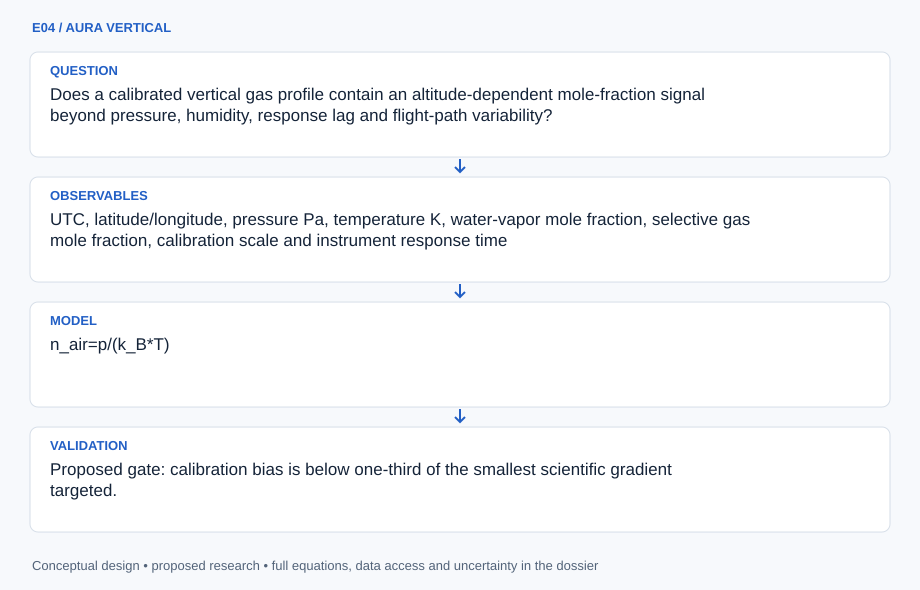
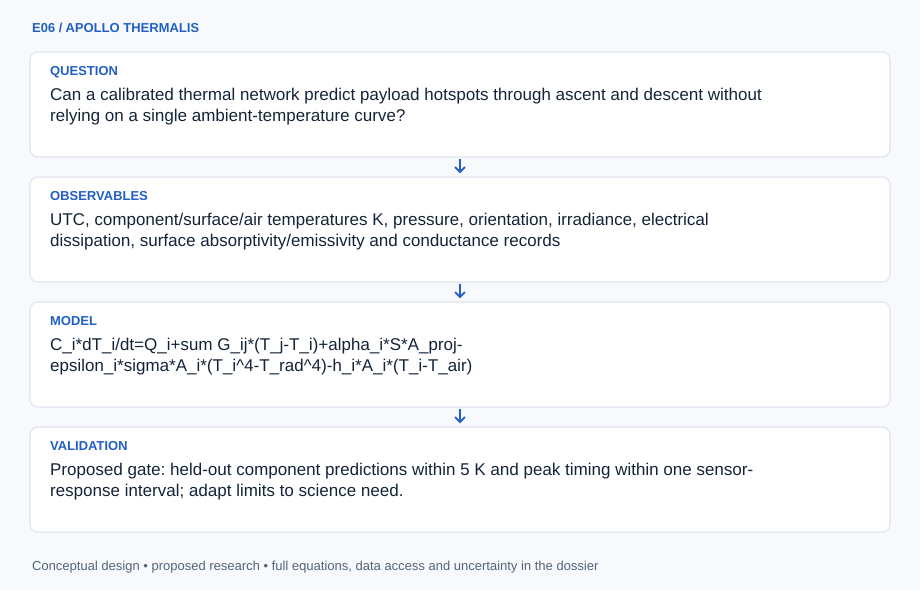
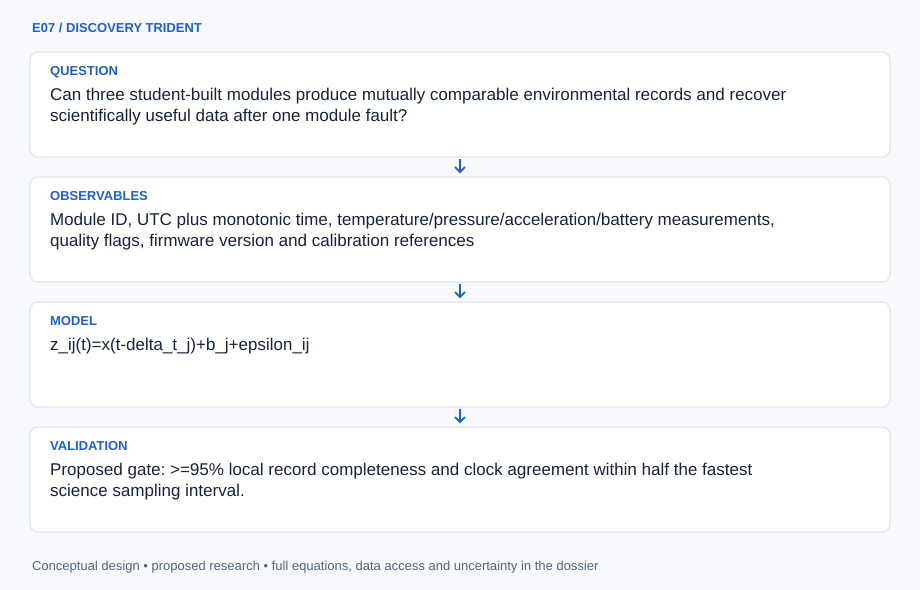
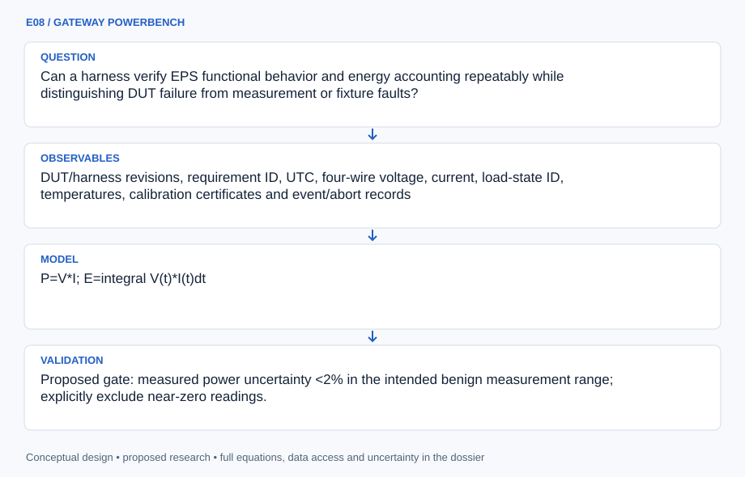

# SESSION E: ASCEND

## ATLAS engineering handbook · Revision 2

8 original projects, preserved in their supplied order. Each numbered record has an independently stated design basis, model, data contract and verification plan.

[All engineering documents](../ENGINEERING_DOCUMENTATION.md) · [Documentation standard](../docs/ENGINEERING_STANDARD.md)

## Ordered contents

1. [E01 · APOLLO HELIOSCOPE](#e01) — Phoenix College: Video Streaming and DNA Studies
2. [E02 · GEMINI HELIX](#e02) — Project Helix
3. [E03 · ARTEMIS STRATODOSE](#e03) — UArizona ASCEND: Profiling High-Altitude Radiation with a General Data Logger
4. [E04 · AURA VERTICAL](#e04) — A Measurement of the Concentration of Greenhouse Gases as Altitude Increases
5. [E05 · ORION TRUSS](#e05) — EagleSat Team: Design and Refinement of 3U CubeSat Structure
6. [E06 · APOLLO THERMALIS](#e06) — Study of Thermal Heat Transfer Within a High-Altitude Balloon Payload
7. [E07 · DISCOVERY TRIDENT](#e07) — Glendale Community College (GCC) ASCEND Team
8. [E08 · GATEWAY POWERBENCH](#e08) — EagleSat Team: Development and Implementation of a Self-Contained Harness for In-House Integration, Verification, and Testing of CubeSat Electric Power Systems

---

<a id="e01"></a>

## E01 · APOLLO HELIOSCOPE

**Original project:** Phoenix College: Video Streaming and DNA Studies

**Session E:** ASCEND

**Document class:** engineering research design and analysis record · **Revision:** 2 · **Date:** 2026-10-02

**Evidence state:** design basis, mathematical formulation and verification plan documented. Project-specific empirical results remain to be acquired; executable shared model demonstrations have their own recorded checks.

[Engineering document register](../ENGINEERING_DOCUMENTATION.md) · [Session E handbook](../documentation/SESSION_E.md) · [Previous: D07](../projects/D/D07.md) · [Next: E02](../projects/E/E02.md)

### Purpose and scientific objective

Integrate public flight video with a separate passive DNA-damage investigation in a synchronized balloon payload. The proposed advance is a common time base and exposure ledger: a viewer can connect the flight environment to the biological observation without treating video as a radiation dosimeter. Preserve Phoenix College’s paired science and communications concept.

**Question:** Can synchronized ultraviolet exposure and environmental logs explain passive DNA damage while a constrained video downlink maintains useful coverage?

**Testable hypothesis:** Measured UV fluence will explain more assay variation than altitude alone; adaptive video rate will improve delivered observation time per watt under identical link conditions.

### 1. Design basis and analysis boundary

The payload analysis has two coordinated packages: passive noninfectious reference-material damage assessment and constrained video/telemetry delivery. Its boundary includes UV irradiance, temperature/handling covariates, clocks, battery energy and replayed channel loss. The biological output is an institution-supplied assay endpoint; no exposure, genetic or assay procedure is specified, and ionizing dose is not substituted for UV fluence.

Start with synchronized exposure and energy ledgers, then fit a finite-site damage model with independent controls. Compare video adaptation against delivered coverage/usefulness, not nominal resolution. Flight phase and sensor lag remain covariates. A published UV-damage measurement supports endpoint specificity, while its fitted response is not transferred automatically to this material or flight.

### 2. Requirements and verification traceability

These are project design requirements or proposed analysis gates. A numerical target is not a NASA requirement unless its controlling source is explicitly identified. “TBD” identifies evidence required before a decision; it is not permission to assume a value. Verification evidence listed here is planned, unless a linked result explicitly records execution.

| ID | Requirement / gate | Engineering rationale | Verification method | Basis / required evidence |
| --- | --- | --- | --- | --- |
| E01-R1 | Damage counts shall remain between zero and declared N_target, with the endpoint and denominator defined. | The finite-site model saturates; unlimited Poisson counts are inappropriate outside rare damage. | Boundary/likelihood checks and assay-definition audit. | Corrected Binomial model. |
| E01-R2 | UV fluence shall use calibrated UV-band irradiance with timestamp/lag uncertainty. | A generic radiation counter cannot measure this exposure. | Integrate calibrated stream and inspect spectral response. | UV metrology requirement. |
| E01-R3 | Proposed energy-ledger closure target: residual below 0.1% of cumulative supplied energy. | Streaming trade can hide missing loads. | Compare solar, load and battery-storage terms. | Proposed numerical tolerance. |
| E01-R4 | Proposed replay target: useful delivered-frame coverage at least 90% of a preregistered baseline at equal energy. | Higher encoding rate may worsen losses. | Compare coverage/quality under the same synthetic channel. | Proposed target; no original-flight result. |

### 3. Architecture and controlled interfaces

A common clock maps irradiance, temperature and handling metadata to material observation windows. The damage module receives susceptible-site count and endpoint-specific k in m^2/J, outputting probabilities with covariance. Assay records retain detection limits and source provenance rather than operational instructions.

A separate communication replay consumes encoded frame sizes, channel service and loss traces. Its battery ledger uses J and W with charge/storage conventions. A scheduler selects bitrate/cadence under energy and buffering constraints. The shared flight registry labels ascent/float/descent and location; it synchronizes packages without implying that video loss causes DNA damage.


The biological and video packages share timing but preserve separate causal and calibration boundaries. Finite-site saturation, energy balance and delivered usefulness are testable without new biological procedures or original flight claims.

[Editable engineering diagram source](../visuals/projects/E01.mmd)

### 4. Mathematical model and derivation

#### Governing equations

```text
H_UV=integral E_UV(t) dt
```

```text
N_break ~ Binomial(N_target, 1-exp(-k*H_UV)); Poisson(N_target*k*H_UV) is only the rare-break approximation when k*H_UV << 1.
```

```text
E_bat(t)=E0+integral(P_solar-P_load)dt
```

```text
R_delivered=R_encoded*(1-p_loss)
```

#### Variables, units and conventions

- H_UV: UV fluence J/m^2; E_UV: irradiance W/m^2
- k: damage response m^2/J, fitted independently; N_target: susceptible sites
- R: bit/s; p_loss dimensionless; E_bat J

#### Assumptions and boundary conditions

- Use isolated, noninfectious reference material and institution-reviewed assays; no human clinical interpretation.
- UV, temperature and handling controls are independent covariates; do not conflate ionizing radiation and UV.
- Independent susceptible sites and a common break probability are simplified assay assumptions; overdispersion or clustered damage requires a richer model.

#### Derivation step 1

$$
H_{UV}=\int E_{UV}(t)dt
$$

Irradiance W/m^2 integrated over seconds gives J/m^2. Lag and clock errors change the appropriate material exposure window; band weighting is declared.

#### Derivation step 2

$$
p=1-e^{-kH};\quad N_{break}\sim Binomial(N_{target},p)
$$

A common independent-site hazard gives finite probability and saturation. Mean is Np and variance Np(1-p); k is endpoint/material specific.

#### Derivation step 3

$$
kH\ll1\Rightarrow p\approx kH;\quad N_{break}\approx Poisson(N_{target}kH)
$$

The rare-event approximation requires small site probability, with its accuracy checked rather than used globally. Clustering requires overdispersion or dependent-site alternatives.

#### Derivation step 4

$$
E_b(t)=E_0+\int(P_{solar}-P_{load})dt;\quad R_d\le R_e(1-p_{loss})
$$

Energy storage closes with loss terms separately. The delivered-rate expression is a simple effective-loss ceiling; packet overhead, buffering and retransmission are modeled explicitly in replay.

#### Inference or simulation procedure

Fit an exposure-response model with dark/handling controls and thermal covariates, while a replayed communication channel measures rate adaptation. Partition flight time into ascent, float if present, and descent; retain sensor lag and clock uncertainty. Trade image usefulness against energy rather than maximizing nominal resolution.

#### Validity domain and fidelity limits

A single flight cannot identify every damage mechanism. Ground-to-balloon and balloon-to-space environmental equivalence is limited; sample integrity and assay floor can dominate.

### 5. Data specifications and provenance

| Field | Type | Unit | Physical / statistical meaning | Quality and missing-data rule |
| --- | --- | --- | --- | --- |
| flight_phase | enum | 1 | Ascent/float/descent interval. | Boundary times and missing phase explicit. |
| uv_irradiance | nullable<float64> | W/m^2 | Calibrated declared-band observation. | Spectral response/lag/covariance required. |
| material_endpoint | record | count | Supplied damage count and susceptible denominator. | Noninfectious source, endpoint and detection limit. |
| handling_thermal | record | K,1 | Temperature and handling covariates. | Missing null; no procedure inferred. |
| encoded_frame | record | bit | Frame size, time and usefulness label. | Encoding and rubric version required. |
| channel_trace | record | bit/s,1 | Service and effective loss replay. | Synthetic/observed provenance required. |
| battery_ledger | record | J,W | Storage and subsystem energy terms. | Efficiency/loss boundary and covariance. |

[Machine-readable record schema](../data/contracts/E01.schema.json) · [Empty acquisition CSV](../data/contracts/E01.csv) · [Field dictionary CSV](../data/contracts/E01.dictionary.csv)

The CSV above contains column headers only. Its schema defines future records and does not establish that original-team data or a particular archive product have been acquired. Frame, timing, calibration, covariance, selection and provenance details must accompany populated records.

#### Arizona Space Grant ASCEND program

[Product, archive or reference](https://spacegrant.arizona.edu/research/ascend)

**Fields:** UTC, altitude m, calibrated UV W/m^2, temperature K, sample control identifier, assay endpoint, packet sequence, bitrate and bus power W

**Access:** Public reference or archive pointer. Original team measurements are not supplied. Confirm product-level access, version and license; a linked paper does not imply its raw data are downloadable.

**Role:** Comparison/model context; prospective measurement schema is listed separately.

#### NASA RaD-X balloon dosimetry

[Product, archive or reference](https://www.nasa.gov/science-research/heliophysics/nasa-studies-cosmic-radiation-to-protect-high-altitude-travelers/)

**Fields:** Independent benchmark metadata, reference assumptions and calibration context; select actual products before execution.

**Access:** Public reference or archive pointer. Original team measurements are not supplied. Confirm product-level access, version and license; a linked paper does not imply its raw data are downloadable.

**Role:** Comparison/model context; prospective measurement schema is listed separately.

### 6. Uncertainty, sensitivity and identifiability

UV calibration, shielding/orientation, temperature, handling and assay floor correlate with damage. Independent susceptible sites and common k are simplifying assumptions; clustered lesions or heterogeneous accessibility produce discrepancy. The AFM literature's lesion endpoints are not automatically identical to a supplied strand-break count.

Profile k against controls and site denominator, test overdispersion and retain censored assay readings. Streaming uncertainty includes channel bursts, encoding overhead and energy estimation. Compare independently varied exposure and communication scenarios; do not attribute a one-flight correlation to a damage mechanism without controls.

### 7. Engineering trade study

| Alternative | Benefit | Cost / limitation | Decision rule |
| --- | --- | --- | --- |
| Fixed video bitrate | Predictable encoding. | Burst losses and energy waste. | Baseline for equal-energy replay. |
| Adaptive cadence/bitrate | Can preserve useful coverage. | Controller/buffer complexity. | Choose only if R4 holds under burst losses. |
| Finite-site hierarchical damage | Respects saturation and heterogeneity. | More endpoint/replicate information needed. | Prefer when common-site Binomial fit fails predictive checks. |

### 8. Verification and validation cases

| Case ID | Stimulus / condition | Expected result / criterion | Method | Evidence artifact |
| --- | --- | --- | --- | --- |
| E01-V1 | Damage endpoints | H=0 gives p=0; H tending infinity gives p=1 and count bounded by N. | Analytic likelihood fixture with separate background/control term. | Binomial definition. |
| E01-V2 | Rare-event approximation | Poisson and Binomial means approach one another as kH tends zero. | Compare exact probabilities over declared small-probability grid. | Taylor limit; approximation gate. |
| E01-V3 | No service/zero load | No channel service delivers no frames; zero net energy flux keeps storage constant. | Replay and energy integration fixtures. | Boundary conservation; measured results pending. |

**Execution status:** these cases are specified, not claimed as executed. Close a case only with the versioned inputs, output, uncertainty, reviewer and pass/fail rationale.

#### Additional scientific validation gates

- Proposed gate: recover >=95% of planned local environmental records and report uncertainty in UV fluence; freeze gate before flight.
- Compare fitted damage model to temperature-only and altitude-only baselines with held-out exposure groups.
- Compare rate adaptation against a constant-rate replay at identical channel trace and total energy.

### 9. Implementation and reproducible work packages

1. Create synchronized_payload_schema.json and flight_phase_manifest.yaml.
2. Build uv_fluence.py with calibration/lag propagation.
3. Implement finite_site_damage.py and control/censoring likelihood.
4. Create video_channel_replay.py and useful_frame_rubric.json.
5. Build battery_energy.py and adaptive_stream_scheduler.py.
6. Publish exposure_response.ipynb and equal_energy_stream_trade.parquet with original telemetry unavailable flags.

#### Investigation sequence

1. Define science endpoints, clock budget and mass/power requirements; produce a separate video and sample interface contract.
2. Characterize sensors and replay link fading with stored video; keep biological work at supervised analysis-design level.
3. Analyze a flight only after calibration and recovery records are complete; publish exposure and video-efficiency uncertainties.

#### Resources and interfaces to expertise

- Embedded telemetry engineer, radiation/UV metrologist and supervised molecular-assay collaborator.
- Camera, calibrated UV sensor, environmental logger, shielded reference compartments, independent energy meter and analysis workstation.

### 10. Failure modes and interpretation controls

| Failure mode | Effect on result | Detection / evidence | Design response |
| --- | --- | --- | --- |
| UV confused with ionizing counts | Invalid damage exposure. | Unit/source audit. | Separate calibrated exposure fields. |
| Poisson used at saturation | Impossible counts/biased fit. | Probability-limit check. | Exact Binomial or heterogeneity model. |
| Overhead omitted | Inflated delivered video. | Bit/buffer ledger mismatch. | Packet-aware replay. |

- Telemetry loss can be repaired from local storage only if time synchronization survives.
- Contamination, sensor spectral mismatch and thermal confounding can produce false attribution.

### 11. Required engineering outputs

- Versioned analysis configuration, raw-to-derived provenance and uncertainty report.
- Project-specific model comparison, a publication figure with units, and an explicit outcome including inconclusive findings.

#### Scientific result figures to produce during execution

Linked altitude/UV/temperature profiles, DNA-response intervals and delivered bitrate versus energy; biological points remain prospective until measured.

### 12. Cited technical and scientific resources

- [Arizona Space Grant ASCEND program](https://spacegrant.arizona.edu/research/ascend) — Program context and flight records, not original team telemetry.
- [NASA RaD-X balloon dosimetry](https://www.nasa.gov/science-research/heliophysics/nasa-studies-cosmic-radiation-to-protect-high-altitude-travelers/) — Balloon radiation measurement precedent.
- [NASA Open MCT](https://ammos.nasa.gov/openmct/) — Telemetry visualization platform; operational interfaces still require design.
- [Detecting Ultraviolet Damage in Single DNA Molecules by Atomic Force Microscopy](https://pmc.ncbi.nlm.nih.gov/articles/PMC1948057/) — Primary study verified by search in this revision supports measurement-specific UV damage/lesion interpretation. It does not validate this finite-site endpoint, k, flight exposure or provide an operational procedure here.

Framework and evidence rules: [engineering documentation standard](../docs/ENGINEERING_STANDARD.md), [model assurance](../docs/MODEL_ASSURANCE.md), [uncertainty procedure](../docs/UNCERTAINTY_AND_DECISION_RULES.md), and [data management](../docs/DATA_MANAGEMENT.md). NASA-inspired names are creative identifiers; requirements and results are not NASA certification.

---

<a id="e02"></a>

## E02 · GEMINI HELIX

**Original project:** Project Helix

**Session E:** ASCEND

**Document class:** engineering research design and analysis record · **Revision:** 2 · **Date:** 2026-10-02

**Evidence state:** design basis, mathematical formulation and verification plan documented. Project-specific empirical results remain to be acquired; executable shared model demonstrations have their own recorded checks.

[Engineering document register](../ENGINEERING_DOCUMENTATION.md) · [Session E handbook](../documentation/SESSION_E.md) · [Previous: E01](../projects/E/E01.md) · [Next: E03](../projects/E/E03.md)

### Purpose and scientific objective

Turn Project Helix into a multimodal balloon reconstruction and passive radiation-response study. Its original insect-related question remains a named supervised biological work package; the engineering package develops attitude, environmental and acoustic metrology. The ambitious result is an uncertainty-aware flight reconstruction rather than uncorrected double integration of inexpensive inertial readings.

**Question:** Which combination of inertial, location and atmospheric observations supports defensible attitude and acoustic estimates, and what exposure information is sufficient for a supervised biological comparison?

**Testable hypothesis:** Sensor fusion will reduce orientation drift relative to gyroscope-only integration; acoustic residuals will track temperature after pressure-dependent detection failures are modeled.

### 1. Design basis and analysis boundary

Project Helix combines attitude estimation, qualified acoustic observations and a separately governed exposure/biological endpoint comparison. The analysis boundary includes inertial bias, external location constraints, pressure/temperature validity and traceable radiation calibration. Commodity IMU integration alone cannot determine dependable absolute position, and invalid low-pressure echoes cannot establish ambient sound speed.

Begin with quaternion/error-state simulation and calibrated acoustic timing, then add compatible external observations and quality gating. Supplied approved biological endpoints join only through an exposure/handling ledger; no insect rearing, genetic or exposure procedure is described. Counts remain counts unless a validated response supports absorbed dose.

### 2. Requirements and verification traceability

These are project design requirements or proposed analysis gates. A numerical target is not a NASA requirement unless its controlling source is explicitly identified. “TBD” identifies evidence required before a decision; it is not permission to assume a value. Verification evidence listed here is planned, unless a linked result explicitly records execution.

| ID | Requirement / gate | Engineering rationale | Verification method | Basis / required evidence |
| --- | --- | --- | --- | --- |
| E02-R1 | Quaternion state shall retain multiplication order, frame direction and unit-norm constraint. | Different conventions can invert attitude. | Known-axis rotation and normalization tests; proposed norm error target 10^-10. | Proposed numerical target; Solà primary kinematics. |
| E02-R2 | Position output shall require external constraints or carry an unbounded-drift warning. | Accelerometer bias integrates into large position errors. | Bias-only inertial fixture and missing-location replay. | Observability requirement. |
| E02-R3 | Acoustic speed shall be reported only when echo quality, path geometry and delay calibration pass. | Pressure-dependent signal loss can mimic a temperature change. | Quality-gate fixtures and independent thermal comparison. | Measurement validity requirement. |
| E02-R4 | Biological comparisons shall retain calibrated exposure, controls and endpoint provenance; uncalibrated counters yield no Gy. | Response assumptions determine dose. | Dose-interface and missing-calibration audit. | Corrected exposure boundary; no biological result claimed. |

### 3. Architecture and controlled interfaces

The inertial adapter returns body-frame angular rates/accelerations and timestamps. A nominal quaternion plus small-angle/bias error state feeds external-location or attitude measurements with covariance. Missing aiding observations grow uncertainty; they do not trigger fabricated position fixes.

The acoustic adapter stores path length, timing and echo-quality flags, alongside pressure/temperature. A separate exposure registry preserves radiation calibration and approved endpoint metadata. The common clock permits association while keeping acoustic, inertial and biological validity gates distinct. Output records include frames, time scales and nulls for unavailable observables.


Attitude, acoustics and approved endpoints share timing but retain distinct validity gates. External aiding constrains position, and acoustic/dose outputs remain unavailable when calibration or observation quality is absent.

[Editable engineering diagram source](../visuals/projects/E02.mmd)

### 4. Mathematical model and derivation

#### Governing equations

```text
q_dot=0.5*Omega(omega-b_g)*q
```

```text
x[k+1]=f(x[k],u[k])+w[k]; z[k]=h(x[k])+v[k]
```

```text
c=sqrt(gamma*R_specific*T)
```

```text
H_rad=integral dose_rate(t)dt
```

#### Variables, units and conventions

- q unit quaternion; omega and b_g rad/s
- T K; R_specific J/(kg K); c m/s
- H_rad calibrated absorbed dose Gy; uncalibrated counts cannot supply Gy

#### Assumptions and boundary conditions

- Insect/DNA observations require institutional animal and biosafety oversight; no rearing, exposure or genetic procedures are specified.
- Low-pressure acoustic measurements must pass signal-quality gates; ambient sound speed is not inferred from invalid echoes.

#### Derivation step 1

$$
\dot q={1\over2}q\otimes[0,\omega-b_g]
$$

For the chosen body-to-world Hamilton convention, body angular rate right-multiplies the quaternion. Another convention changes the order; use one registry throughout.

#### Derivation step 2

$$
\delta x_{k+1}=F_k\delta x_k+w_k;\quad P_{k+1}=F_kP_kF_k^T+Q_k
$$

Small-angle and bias covariance propagate around the nominal state. Measurement updates use compatible residual frames and a covariance reset after error injection.

#### Derivation step 3

$$
c=L/t_{flight}\quad\hbox{or}\quad c=2L/t_{echo};\quad c_{ideal}=\sqrt{\gamma R_sT}
$$

One-way versus round-trip geometry differs by two. Gamma R_s T has m^2/s^2; gas composition and invalid echoes limit the comparison.

#### Derivation step 4

$$
\Delta p\simeq\tfrac12b_at^2;\quad H_{rad}=\int\dot Ddt
$$

Uncorrected acceleration bias produces quadratic position drift. Dose-rate Gy/s integrated over seconds gives Gy only under a validated detector-to-dose response.

#### Inference or simulation procedure

Use an error-state estimator with gyro bias, quaternion normalization and measurement quality flags. Establish acoustic calibration at independently measured temperatures; handle missing echoes as censored observations. The biological package compares supplied approved endpoints against a traceable exposure ledger with handling/thermal controls.

#### Validity domain and fidelity limits

A Geiger count alone cannot distinguish radiation species or biological dose. Commodity inertial sensors without external position cannot reliably reconstruct absolute position.

### 5. Data specifications and provenance

| Field | Type | Unit | Physical / statistical meaning | Quality and missing-data rule |
| --- | --- | --- | --- | --- |
| sensor_time | float64 | s | Common synchronized acquisition epoch. | Clock offset/skew uncertainty required. |
| gyro | vector<float64>[3] | rad/s | Body angular rate. | Axes/signs and bias covariance retained. |
| quaternion | vector<float64>[4] | 1 | Body-to-world Hamilton attitude. | Scalar ordering and normalization required. |
| external_location | nullable<vector<float64>> | m | Independent aiding position. | Reference frame and measurement covariance. |
| acoustic_record | nullable<record> | m,s,1 | Path, time of flight and echo quality. | One/round-trip and delay calibration explicit. |
| exposure_ledger | nullable<record> | Gy or count | Calibrated dose or native detector counts. | Units reflect calibration status; no implicit conversion. |
| approved_endpoint | nullable<record> | declared | Supplied biological comparison observation. | Approval/source and handling controls; missing null. |

[Machine-readable record schema](../data/contracts/E02.schema.json) · [Empty acquisition CSV](../data/contracts/E02.csv) · [Field dictionary CSV](../data/contracts/E02.dictionary.csv)

The CSV above contains column headers only. Its schema defines future records and does not establish that original-team data or a particular archive product have been acquired. Frame, timing, calibration, covariance, selection and provenance details must accompany populated records.

#### Arizona Space Grant ASCEND program

[Product, archive or reference](https://spacegrant.arizona.edu/research/ascend)

**Fields:** UTC, raw IMU, quality flags, GNSS position, pressure Pa, temperature K, acoustic arrival time s, radiation counts and calibrated detector response

**Access:** Public reference or archive pointer. Original team measurements are not supplied. Confirm product-level access, version and license; a linked paper does not imply its raw data are downloadable.

**Role:** Comparison/model context; prospective measurement schema is listed separately.

#### NASA NAIRAS 3.0 model and RaD-X resources

[Product, archive or reference](https://ccmc.gsfc.nasa.gov/models/NAIRAS~3.0/)

**Fields:** Independent benchmark metadata, reference assumptions and calibration context; select actual products before execution.

**Access:** Public reference or archive pointer. Original team measurements are not supplied. Confirm product-level access, version and license; a linked paper does not imply its raw data are downloadable.

**Role:** Comparison/model context; prospective measurement schema is listed separately.

### 6. Uncertainty, sensitivity and identifiability

Gyro/accelerometer biases, clock skew and aiding errors correlate with attitude/position. Acoustic path motion, electronic delay and low-pressure signal quality affect time-of-flight separately from gas temperature. Radiation-response and biological endpoint uncertainties add a distinct layer that cannot be inferred from IMU performance.

Use synthetic constant-rate and bias trajectories plus held-out external observations to check covariance consistency. Profile sound speed against timing offset and path uncertainty; quality failures produce missing observations. Endpoint comparisons propagate exposure/handling uncertainty and remain nonclinical, with unresolved calibration preventing dose-response interpretation.

### 7. Engineering trade study

| Alternative | Benefit | Cost / limitation | Decision rule |
| --- | --- | --- | --- |
| IMU-only propagation | Works through missing aid. | Yaw/position drift and bias ambiguity. | Short-term relative attitude only with explicit uncertainty. |
| Aided error-state filter | Improves observable modes. | External data/frame dependence. | Use when aiding covariance and timing are verified. |
| Acoustic/exposure quality-gated fusion | Retains useful independent channels. | Many missing-data/oversight gates. | Join only validated observations; preserve separate endpoints. |

### 8. Verification and validation cases

| Case ID | Stimulus / condition | Expected result / criterion | Method | Evidence artifact |
| --- | --- | --- | --- | --- |
| E02-V1 | Zero angular rate | Identity attitude remains fixed; covariance still evolves under noise. | Nominal/filter fixture. | Quaternion kinematics. |
| E02-V2 | Constant axis rotation | Quaternion matches analytic sine/cosine half-angle solution. | Compare integration and sign conventions. | Solà-supported rotation model. |
| E02-V3 | Invalid echo/dose calibration | Missing echo yields no speed; count-only record yields no Gy. | Integration fixtures with absent calibration. | Information-sufficiency contract. |

**Execution status:** these cases are specified, not claimed as executed. Close a case only with the versioned inputs, output, uncertainty, reviewer and pass/fail rationale.

#### Additional scientific validation gates

- Proposed gate: orientation error <=5 degrees on withheld laboratory trajectories; report bias over the full mission duration.
- Check predicted acoustic velocity against independent temperature-based estimates and declare the pressure interval where returns fail.
- Require traceable dose response before interpreting any biological dose dependence.

### 9. Implementation and reproducible work packages

1. Create frame_clock_manifest.json and IMU_noise.yaml.
2. Build quaternion_nominal.py and error_state_filter.py with reset covariance.
3. Implement aiding_adapter.py and drift fixtures.
4. Create acoustic_timeflight.py with path/delay/quality gates.
5. Build exposure_endpoint_registry.csv with approved supplied data only.
6. Publish covariance_consistency.ipynb and qualified_multichannel_outputs.parquet.

#### Investigation sequence

1. Freeze sensor reference frames, timestamps and biological endpoint definitions.
2. Validate orientation against a turntable/reference camera; compare acoustic response only in calibrated pressure regimes.
3. Release fused orientation and exposure posterior with explicit gaps, plus a separate reviewed biological analysis.

#### Resources and interfaces to expertise

- Sensor-fusion engineer, acoustics collaborator and qualified insect biology supervisor.
- IMU/GNSS logger, reference rotation fixture, passive dosimeter and independent temperature reference.

### 10. Failure modes and interpretation controls

| Failure mode | Effect on result | Detection / evidence | Design response |
| --- | --- | --- | --- |
| Quaternion order mixed | Wrong rotation. | Known-axis vector transform. | Central convention adapter. |
| Echo dropout coded short travel | False high sound speed. | Quality/missing audit. | Censored/missing observation gate. |
| Counts labeled Gy | Unsupported exposure response. | Unit/calibration mismatch. | Native count record until qualified conversion. |

- Pressure-induced acoustic loss and gyro drift can mimic atmospheric structure.
- An observed biological difference cannot be assigned to radiation without control of temperature and handling.

### 11. Required engineering outputs

- Versioned analysis configuration, raw-to-derived provenance and uncertainty report.
- Project-specific model comparison, a publication figure with units, and an explicit outcome including inconclusive findings.

#### Scientific result figures to produce during execution

Quaternion orientation trajectory with uncertainty; speed of sound versus temperature and pressure; dose-ledger completeness by altitude.

### 12. Cited technical and scientific resources

- [Arizona Space Grant ASCEND program](https://spacegrant.arizona.edu/research/ascend) — Program context and flight records, not original team telemetry.
- [NASA NAIRAS 3.0 model and RaD-X resources](https://ccmc.gsfc.nasa.gov/models/NAIRAS~3.0/) — Radiation environment model and independent comparison resources.
- [NASA Small Spacecraft Guidance Navigation and Control](https://www.nasa.gov/smallsat-institute/sst-soa/guidance-navigation-and-control/) — Attitude sensing and actuator context.
- [Joan Solà, Quaternion kinematics for the error-state Kalman filter](https://arxiv.org/abs/1711.02508) — Author primary technical paper verified in this revision supports explicit quaternion/rotation conventions, perturbations and IMU error-state estimation; it supplies no sensor capability or biological dose conversion.

Framework and evidence rules: [engineering documentation standard](../docs/ENGINEERING_STANDARD.md), [model assurance](../docs/MODEL_ASSURANCE.md), [uncertainty procedure](../docs/UNCERTAINTY_AND_DECISION_RULES.md), and [data management](../docs/DATA_MANAGEMENT.md). NASA-inspired names are creative identifiers; requirements and results are not NASA certification.

---

<a id="e03"></a>

## E03 · ARTEMIS STRATODOSE

**Original project:** UArizona ASCEND: Profiling High-Altitude Radiation with a General Data Logger

**Session E:** ASCEND

**Document class:** engineering research design and analysis record · **Revision:** 2 · **Date:** 2026-10-02

**Evidence state:** design basis, mathematical formulation and verification plan documented. Project-specific empirical results remain to be acquired; executable shared model demonstrations have their own recorded checks.

[Engineering document register](../ENGINEERING_DOCUMENTATION.md) · [Session E handbook](../documentation/SESSION_E.md) · [Previous: E02](../projects/E/E02.md) · [Next: E04](../projects/E/E04.md)

### Purpose and scientific objective

Develop a radiation-profile observatory that measures detector response and tests shielding hypotheses rather than assuming count rate equals dose. Pair balloon observations with atmospheric radiation models and independent dosimetry. The resulting transfer-function library could guide smallsat electronics studies while documenting why the atmospheric secondary-particle spectrum differs from orbit.

**Question:** Can altitude-resolved detector observations constrain a radiation transport model and determine whether candidate shielding changes the response under the sampled spectrum?

**Testable hypothesis:** A response-folded model will explain the count profile better than an altitude-only curve; shielding effects will depend on spectrum and may be smaller than uncertainty.

### 1. Design basis and analysis boundary

The radiation profiling system models native detector counts versus altitude/pressure and compares response-folded environmental predictions. Its boundary includes detector geometry, energy/angular sensitivity, dead time, background and flight timestamps. Shield comparisons measure detector-response changes under sampled spectra; count suppression is not equivalent to reduced human dose or orbital electronics qualification.

Begin with Poisson count likelihood and instrument-specific dead-time/background calibration, then add overdispersion and paired shield effects. NAIRAS predictions are folded through the detector rather than compared directly with counts in incompatible units. Absorbed-dose output is optional and requires an independently validated response function.

### 2. Requirements and verification traceability

These are project design requirements or proposed analysis gates. A numerical target is not a NASA requirement unless its controlling source is explicitly identified. “TBD” identifies evidence required before a decision; it is not permission to assume a value. Verification evidence listed here is planned, unless a linked result explicitly records execution.

| ID | Requirement / gate | Engineering rationale | Verification method | Basis / required evidence |
| --- | --- | --- | --- | --- |
| E03-R1 | Count observations shall preserve elapsed/live time, background and dead-time model. | Rate and correction depend on acquisition convention. | Replay nonparalyzable analytic fixtures and timing ledger. | Corrected instrument-response contract. |
| E03-R2 | No Gy or Gy/s output shall be generated without validated energy/angular dose response. | A generic count cannot establish absorbed dose. | Schema rejects missing conversion/calibration. | Count-versus-dose requirement. |
| E03-R3 | Shield comparisons shall match geometry, exposure time and environmental conditions or model their differences. | Changing placement can imitate shielding benefit. | Paired-bin/geometry audit and nuisance sensitivity. | Detector comparison requirement. |
| E03-R4 | Proposed profile gate: predicted count intervals cover held-out altitude bins at nominal 95% with uncertainty in coverage. | A good fitted profile needs external check. | Block holdout by flight/altitude segment. | Proposed calibration criterion; no new profile result. |

### 3. Architecture and controlled interfaces

Detector records retain raw counts and acquisition intervals with temperature, geometry and shield ID. A clock/altitude adapter maps GPS/pressure to exposure bins while preserving horizontal drift. A radiation-model adapter supplies differential species/energy/angular flux and source version.

The response-folding module predicts expected counts and background; the observation likelihood includes the selected dead-time convention. Shield changes alter response and secondary-particle uncertainty, not merely multiply a universal attenuation factor. A separate dose branch is enabled only by calibrated energy deposition sensitivity. Outputs distinguish count rate, model residual and qualified dose.


Environmental spectra are folded through detector response before count comparison. The dose branch requires its own validated sensitivity; shield response changes cannot automatically establish human-dose or orbital reliability benefits.

[Editable engineering diagram source](../visuals/projects/E03.mmd)

### 4. Mathematical model and derivation

#### Governing equations

```text
N_i ~ Poisson(dt_i*integral R_i(E,Omega)*Phi(E,Omega,h,t)dE dOmega + B_i)
```

```text
n_true=n_obs/(1-n_obs*tau)
```

```text
D=integral Phi(E)*S(E)dE
```

#### Variables, units and conventions

- Phi differential particle flux; R detector effective response
- tau detector dead time s; n count rate 1/s; h altitude m
- D dose rate Gy/s only for a validated response S

#### Assumptions and boundary conditions

- Dead-time correction shown is for a nonparalyzable detector; choose actual instrument model.
- Fit detector response from documented calibration and preserve geometry/temperature effects.

#### Derivation step 1

$$
\lambda_i=\Delta t_i\int R_i(E,\Omega)\Phi(E,\Omega,h,t)dEd\Omega+B_i
$$

Response R includes effective area/efficiency so folded flux is counts/s; B is expected background counts, not an unconverted rate. Time-varying bins may require integration over t.

#### Derivation step 2

$$
N_i\sim Poisson(\lambda_i);\quad Var(N_i)=\lambda_i
$$

The likelihood follows independent arrivals under its assumptions. Extra variance from environment or detector clustering requires a tested alternative, not inflated confidence.

#### Derivation step 3

$$
n_{obs}=n_{true}/(1+n_{true}\tau);\quad n_{true}=n_{obs}/(1-n_{obs}\tau)
$$

Nonparalyzable dead time loses fraction of elapsed time to blocked arrivals. The inverse becomes unstable near n_obs tau=1; paralyzable detectors need another equation.

#### Derivation step 4

$$
\dot D=\int S_D(E,\Omega)\Phi(E,\Omega)dEd\Omega
$$

S_D must map fluence rate to Gy/s for the declared material/geometry. Dose is time integral of this rate, and cannot be substituted by detector R without calibration.

#### Inference or simulation procedure

Fit Poisson observations in pressure/altitude bins, folding NAIRAS predictions through detector response. Compare paired shield configurations with matched geometry and exposure duration, and include overdispersion tests. Avoid extrapolation beyond measured energy sensitivity.

#### Validity domain and fidelity limits

Shielding can generate secondary particles; count suppression does not establish electronics reliability or human dose. Flight conditions do not qualify a CubeSat for orbit.

### 5. Data specifications and provenance

| Field | Type | Unit | Physical / statistical meaning | Quality and missing-data rule |
| --- | --- | --- | --- | --- |
| detector_id | string | 1 | Instrument/response configuration. | Geometry, species sensitivity and version required. |
| count_interval | record | count,s | Raw count and elapsed/live acquisition time. | Time basis explicit; zero count is valid. |
| altitude_pressure | record | m,Pa | Flight environmental bin. | Time/geolocation covariance retained. |
| dead_time | nullable<float64> | s | Calibrated detector tau. | Model type/domain required; unknown null. |
| response_function | nullable<table> | effective area | Detector energy/angular response. | Missing energy domain flagged, not extrapolated. |
| shield_geometry | record | m,kg | Material placement and configuration. | Matched reference geometry required. |
| dose_rate | nullable<float64> | Gy/s | Qualified absorbed-dose prediction. | Only populated with validated S_D and material basis. |

[Machine-readable record schema](../data/contracts/E03.schema.json) · [Empty acquisition CSV](../data/contracts/E03.csv) · [Field dictionary CSV](../data/contracts/E03.dictionary.csv)

The CSV above contains column headers only. Its schema defines future records and does not establish that original-team data or a particular archive product have been acquired. Frame, timing, calibration, covariance, selection and provenance details must accompany populated records.

#### NASA NAIRAS 3.0 model and RaD-X resources

[Product, archive or reference](https://ccmc.gsfc.nasa.gov/models/NAIRAS~3.0/)

**Fields:** UTC, geolocation, pressure, altitude, counts, integration time, dead time, detector temperature, shielding configuration and calibration matrix

**Access:** Public reference or archive pointer. Original team measurements are not supplied. Confirm product-level access, version and license; a linked paper does not imply its raw data are downloadable.

**Role:** Comparison/model context; prospective measurement schema is listed separately.

#### NASA RaD-X balloon dosimetry

[Product, archive or reference](https://www.nasa.gov/science-research/heliophysics/nasa-studies-cosmic-radiation-to-protect-high-altitude-travelers/)

**Fields:** Independent benchmark metadata, reference assumptions and calibration context; select actual products before execution.

**Access:** Public reference or archive pointer. Original team measurements are not supplied. Confirm product-level access, version and license; a linked paper does not imply its raw data are downloadable.

**Role:** Comparison/model context; prospective measurement schema is listed separately.

### 6. Uncertainty, sensitivity and identifiability

At appreciable dead-time occupancy, observed arrivals are not an exact Poisson process; use a calibrated renewal likelihood or restrict the Poisson branch to low occupancy. Counting noise, background, dead-time uncertainty, temperature response and altitude timing affect the native profile. Environmental spectrum and detector angular response share directional uncertainty. Shielding can create secondaries, leaving different instruments with different count changes under the same physical field.

Propagate response/calibration ensembles through flux folding and profile tau near its valid rate range. Test overdispersion with residuals clustered by flight interval. Hold out altitude/trajectory blocks and compare shield effects under spectral alternatives. Publish count changes separately when dose response or spectrum is too uncertain for energy-deposition inference.

### 7. Engineering trade study

| Alternative | Benefit | Cost / limitation | Decision rule |
| --- | --- | --- | --- |
| Native count profile | Direct auditable observation. | Instrument-specific physical meaning. | Primary output without dose calibration. |
| Response-folded model comparison | Connects spectrum to observations. | Response/environment uncertainty. | Use with documented sensitivity domain. |
| Qualified dose reconstruction | More relevant deposition quantity. | Requires calibrated material response. | Enable only after independent conversion evidence. |

### 8. Verification and validation cases

| Case ID | Stimulus / condition | Expected result / criterion | Method | Evidence artifact |
| --- | --- | --- | --- | --- |
| E03-V1 | No dead time | As tau tends zero, corrected rate equals observed rate. | Analytic inversion fixture. | Detector model limit. |
| E03-V2 | Zero flux/background | Expected count lambda zero; positive observed count is incompatible with that exact model. | Likelihood endpoint fixture. | Poisson definition. |
| E03-V3 | Missing dose sensitivity | Count profile remains available while dose output is null. | Integration test with R present and S_D absent. | Information boundary; measured results pending. |

**Execution status:** these cases are specified, not claimed as executed. Close a case only with the versioned inputs, output, uncertainty, reviewer and pass/fail rationale.

#### Additional scientific validation gates

- Check Poisson coverage using simulated counts before any science fit.
- Proposed gate: model uncertainty intervals include independently calibrated count rate across >=90% of valid profile bins.
- Require paired-shield inference to remain stable under background, spectral and dead-time sensitivity analysis.

### 9. Implementation and reproducible work packages

1. Create detector_calibration_manifest.json and time_basis_schema.json.
2. Implement altitude_bin_adapter.py and response_fold.py.
3. Build count_likelihood.py with background/overdispersion options.
4. Create nonparalyzable_deadtime.py with inverse-domain fixtures.
5. Implement shield_comparison.py and optional qualified_dose.py.
6. Publish count_profile_holdout.ipynb and outputs with null dose when unsupported.

#### Investigation sequence

1. Write detector response and background requirements; obtain calibration records and NAIRAS run metadata.
2. Run synthetic injection/recovery with known backgrounds and missed samples.
3. Compare flight data against independent dosimeter/model output and publish null shielding results if uncertainties dominate.

#### Resources and interfaces to expertise

- Radiation instrumentation scientist, embedded programmer and transport-model analyst.
- Characterized detector, passive/reference dosimeter, environmental recorder and archival model access.

### 10. Failure modes and interpretation controls

| Failure mode | Effect on result | Detection / evidence | Design response |
| --- | --- | --- | --- |
| Paralyzable mismatch | Wrong high-rate correction. | Calibration-model inconsistency. | Actual instrument dead-time model. |
| Count decrease called dose benefit | Unsupported shielding claim. | Unit/response audit. | Separate response and qualified dose. |
| Geometry changes ignored | False shield effect. | Paired configuration mismatch. | Matched placement or explicit response model. |

- Background and detector temperature can imitate an altitude trend.
- Uncalibrated detector response prevents dose claims.

### 11. Required engineering outputs

- Versioned analysis configuration, raw-to-derived provenance and uncertainty report.
- Project-specific model comparison, a publication figure with units, and an explicit outcome including inconclusive findings.

#### Scientific result figures to produce during execution

Altitude-count posterior and response-folded model band; shielding effect forest plot with no assumed benefit.

#### Included shared numerical starting point


[Executable formulation, parameters, tabular outputs, provenance and verification](../models/README.md). This shared demonstration has a narrower domain than the project model above. Its own caption and methods identify synthetic parameters or the separately retrieved public catalog; it is not a completed result of the original project.

### 12. Cited technical and scientific resources

- [NASA NAIRAS 3.0 model and RaD-X resources](https://ccmc.gsfc.nasa.gov/models/NAIRAS~3.0/) — Radiation environment model and independent comparison resources.
- [NASA RaD-X balloon dosimetry](https://www.nasa.gov/science-research/heliophysics/nasa-studies-cosmic-radiation-to-protect-high-altitude-travelers/) — Balloon radiation measurement precedent.

Framework and evidence rules: [engineering documentation standard](../docs/ENGINEERING_STANDARD.md), [model assurance](../docs/MODEL_ASSURANCE.md), [uncertainty procedure](../docs/UNCERTAINTY_AND_DECISION_RULES.md), and [data management](../docs/DATA_MANAGEMENT.md). NASA-inspired names are creative identifiers; requirements and results are not NASA certification.

---

<a id="e04"></a>

## E04 · AURA VERTICAL

**Original project:** A Measurement of the Concentration of Greenhouse Gases as Altitude Increases

**Session E:** ASCEND

**Document class:** engineering research design and analysis record · **Revision:** 2 · **Date:** 2026-10-02

**Evidence state:** design basis, mathematical formulation and verification plan documented. Project-specific empirical results remain to be acquired; executable shared model demonstrations have their own recorded checks.

[Engineering document register](../ENGINEERING_DOCUMENTATION.md) · [Session E handbook](../documentation/SESSION_E.md) · [Previous: E03](../projects/E/E03.md) · [Next: E05](../projects/E/E05.md)

### Purpose and scientific objective

Make the greenhouse-gas balloon concept a traceable atmospheric profile study. Report dry-air mole fraction separately from number density and raw sensor voltage. Combine pressure, water vapor, temperature and response-time corrections so a trend with altitude has a physical meaning; compare with NOAA profiles before interpreting local atmospheric transport.

**Question:** Does a calibrated vertical gas profile contain an altitude-dependent mole-fraction signal beyond pressure, humidity, response lag and flight-path variability?

**Testable hypothesis:** Pressure compensation and lag correction will change apparent gradients from inexpensive sensors; remaining gradients may differ between boundary-layer air and the free troposphere.

### 1. Design basis and analysis boundary

The gas-profile system tests altitude-associated dry-air mole-fraction structure after pressure/temperature calibration, humidity conversion, sensor lag and flight-path effects. Its boundary includes a selective analyzer, intake/response behavior, timestamps and geolocation. Declining molecular number density with altitude is not itself declining mole fraction, and a broad nonspecific gas sensor cannot identify CO2 or CH4 uniquely.

Begin with independently characterized response and calibration, then a hierarchical profile with separate ascent/descent and flight effects. NOAA aircraft/AirCore data provide a scale- and context-matched comparison rather than contemporaneous Arizona truth. Lag correction is uncertainty-aware; unsupported low-pressure calibration blocks a quantitative profile.

### 2. Requirements and verification traceability

These are project design requirements or proposed analysis gates. A numerical target is not a NASA requirement unless its controlling source is explicitly identified. “TBD” identifies evidence required before a decision; it is not permission to assume a value. Verification evidence listed here is planned, unless a linked result explicitly records execution.

| ID | Requirement / gate | Engineering rationale | Verification method | Basis / required evidence |
| --- | --- | --- | --- | --- |
| E04-R1 | All gas values shall state dry/wet basis, calibration scale, species and ppm/ppb conversion. | Humidity and unit confusion can create altitude trends. | Round-trip conversion and source-column audit. | NOAA comparison schema; measurement contract. |
| E04-R2 | Quantitative profile points shall remain inside analyzer pressure/temperature calibration domain. | Room calibration may fail aloft. | Domain flags and calibration-envelope review. | Instrument validity requirement. |
| E04-R3 | Lag shall be independently characterized or jointly reported as confounded with vertical gradient. | Response time changes apparent ascent/descent slopes. | Known-step response and joint profile sensitivity. | Corrected first-order response model. |
| E04-R4 | Proposed gradient gate: b interval excludes zero under lag/humidity/path alternatives and withheld-flight evaluation. | A single fitted slope can reflect drift or diurnal change. | Hierarchical block holdout and scenario comparison. | Proposed inferential criterion; no concentration trend claimed. |

### 3. Architecture and controlled interfaces

An intake/analyzer adapter returns selective wet- or dry-basis mole fraction with calibration metadata and pressure/temperature. Humidity records convert only compatible wet observations. Flight alignment maps time to altitude and horizontal position, retaining ascent/descent classification and sensor transport delay.

A response-state model predicts measured y from latent true concentration, rather than noisily differentiating observations without regularization. The vertical model includes flight effects and correlated residuals; geolocation/time covariates remain available to test altitude-only inadequacy. NOAA ingestion preserves calibration scale and native fields before comparison.



Calibration, humidity basis and response lag precede the altitude model. External profiles provide context; molecular density, horizontal/time confounding and missing analyzer selectivity remain distinct limitations.

[Editable engineering diagram source](../visuals/projects/E04.mmd)

### 4. Mathematical model and derivation

#### Governing equations

```text
n_air=p/(k_B*T)
```

```text
x_dry=x_wet/(1-x_H2O)
```

```text
tau*dy/dt+y=x_true(t)
```

```text
x(z)=a+b*z+u_flight+epsilon
```

#### Variables, units and conventions

- p Pa; T K; n_air molecules/m^3
- x dimensionless mole fraction, reported ppm CO2 or ppb CH4
- tau s; b mole fraction per m; u_flight flight-specific intercept

#### Assumptions and boundary conditions

- Calibrate over the actual pressure/temperature envelope; nominal room conditions are insufficient.
- Infer gas identity only from a selective calibrated analyzer; broad gas sensors do not resolve CO2/CH4.

#### Derivation step 1

```text
n_{air}=p/(k_BT)
```

Ideal-gas molecular number density has molecules/m^3. A trace-gas number density n_g=x n_air can decline with pressure even when mole fraction x is constant.

#### Derivation step 2

```text
x_{dry}=x_{wet}/(1-x_{H_2O})
```

Dry-air denominator removes water molecules. All fractions are dimensionless before ppm or ppb reporting; humidity uncertainty induces common covariance.

#### Derivation step 3

$$
\tau\dot y+y=x_{true};\quad y(t)=x_1+(y_0-x_1)e^{-t/\tau}
$$

For a true step to x1, the sensor responds exponentially. During ascent, delay maps into apparent vertical displacement roughly climb rate times tau.

#### Derivation step 4

$$
x(z,t)=a+bz+u_{flight}+g(location,time)+\epsilon
$$

b has mole fraction/m. Fit response dynamics jointly with this latent profile; derivative-based inversion x=y+tau dot y amplifies high-frequency measurement noise.

#### Inference or simulation procedure

Estimate a hierarchical vertical-profile model with flight effects and correlated residuals. Fit instrument lag using independent response characterization; compare dry-air profiles to colocated or regionally relevant NOAA observations. Separate ascent and descent to detect hysteresis and avoid converting pressure decline into a concentration result.

#### Validity domain and fidelity limits

NOAA flights are comparison observations, not contemporaneous ground truth for Arizona. Balloon horizontal drift and diurnal boundary-layer change complicate an altitude-only analysis.

### 5. Data specifications and provenance

| Field | Type | Unit | Physical / statistical meaning | Quality and missing-data rule |
| --- | --- | --- | --- | --- |
| species_basis | record | 1 | CO2/CH4 and dry/wet calibration scale. | Selective analyzer evidence required. |
| gas_reading | nullable<float64> | mol/mol | Native calibrated mole fraction. | ppm/ppb conversion explicit; missing null. |
| water_fraction | nullable<float64> | mol/mol | Compatible water mole fraction. | Between zero and one; unknown blocks conversion. |
| pressure_temperature | record | Pa,K | Analyzer/environment state. | Calibration domain and covariance retained. |
| flight_position | record | m,degree | Altitude/geolocation at timestamp. | Reference datum and horizontal drift retained. |
| response_time | nullable<float64> | s | Transport/sensor lag tau. | Positive and independently sourced or latent flagged. |
| profile_covariance | matrix<float64> | (mol/mol)^2 | Joint profile/measurement uncertainty. | Shared scale/humidity terms retained. |

[Machine-readable record schema](../data/contracts/E04.schema.json) · [Empty acquisition CSV](../data/contracts/E04.csv) · [Field dictionary CSV](../data/contracts/E04.dictionary.csv)

The CSV above contains column headers only. Its schema defines future records and does not establish that original-team data or a particular archive product have been acquired. Frame, timing, calibration, covariance, selection and provenance details must accompany populated records.

#### NOAA greenhouse-gas data

[Product, archive or reference](https://gml.noaa.gov/ccgg/data/getdata.php?gas=co2)

**Fields:** UTC, latitude/longitude, pressure Pa, temperature K, water-vapor mole fraction, selective gas mole fraction, calibration scale and instrument response time

**Access:** Public reference or archive pointer. Original team measurements are not supplied. Confirm product-level access, version and license; a linked paper does not imply its raw data are downloadable.

**Role:** Comparison/model context; prospective measurement schema is listed separately.

#### NOAA aircraft CO2 data dictionary

[Product, archive or reference](https://erddap.gml.noaa.gov/erddap/info/greenhouse_gases_co2_aircraft_insitu_10_second_values/index.html)

**Fields:** Independent benchmark metadata, reference assumptions and calibration context; select actual products before execution.

**Access:** Public reference or archive pointer. Original team measurements are not supplied. Confirm product-level access, version and license; a linked paper does not imply its raw data are downloadable.

**Role:** Comparison/model context; prospective measurement schema is listed separately.

### 6. Uncertainty, sensitivity and identifiability

Analyzer calibration, humidity, pressure/temperature response and intake delay correlate with inferred altitude slope. Balloon drift and evolving boundary-layer conditions create confounding between altitude, place and time. NOAA profiles add contextual differences in season, location and calibration scale rather than exact ground-truth uncertainty.

Profile b against tau and humidity correction, compare ascent/descent at matched conditions and block residuals by flight segment. Fit withheld flights and examine geolocation/time effects before asserting altitude causation. Report points outside calibration and gas identity limits as unavailable, while preserving their raw observations for future calibration.

### 7. Engineering trade study

| Alternative | Benefit | Cost / limitation | Decision rule |
| --- | --- | --- | --- |
| Raw wet profile | Direct reported analyzer stream. | Humidity and response bias. | Retain for provenance only. |
| Dry-basis lag-aware hierarchy | Corrects key measurement pathways. | Depends on calibration/humidity/time constants. | Primary inference inside validated envelope. |
| Regional NOAA comparison | External calibrated context. | Different time/place/sample path. | Use for plausibility and scale checks, not exact truth. |

### 8. Verification and validation cases

| Case ID | Stimulus / condition | Expected result / criterion | Method | Evidence artifact |
| --- | --- | --- | --- | --- |
| E04-V1 | Constant mole fraction | Pressure decline changes number density while x remains constant. | Ideal-gas synthetic altitude fixture. | Density versus composition distinction. |
| E04-V2 | Humidity conversion | At zero water, dry equals wet; positive water raises dry value for fixed wet. | Analytic endpoint fixture. | Denominator algebra. |
| E04-V3 | Step/flight lag | First-order response matches exponential and produces speed-times-lag displacement. | Simulated ascent/descent known-profile replay. | Response model; observed gradient pending. |

**Execution status:** these cases are specified, not claimed as executed. Close a case only with the versioned inputs, output, uncertainty, reviewer and pass/fail rationale.

#### Additional scientific validation gates

- Proposed gate: calibration bias is below one-third of the smallest scientific gradient targeted.
- Hold out complete profiles; compare to constant-mole-fraction and uncorrected-sensor baselines.
- Do a humidity/lag sensitivity envelope and disclose non-identifiability when corrections dominate.

### 9. Implementation and reproducible work packages

1. Create analyzer_calibration_manifest.json and gas_basis_schema.json.
2. Implement humidity_conversion.py and ideal_gas_density.py.
3. Build flight_clock_position.py with phase/path metadata.
4. Create first_order_response.py and latent_vertical_profile.py.
5. Implement noaa_profile_adapter.py preserving calibration scale.
6. Publish withheld_flight.ipynb and dry_profile.parquet with domain/identity/lag flags.

#### Investigation sequence

1. Choose target gas and allowable uncertainty from expected atmospheric gradients.
2. Characterize pressure, humidity and lag sensitivity; replay NOAA profiles through the sensor model.
3. Fit ascent/descent jointly and report gradients only if larger than propagated systematic uncertainty.

#### Resources and interfaces to expertise

- Atmospheric chemist, trace-gas metrologist and flight data engineer.
- Selective analyzer, pressure/humidity references, calibration access and dry-air conversion pipeline.

### 10. Failure modes and interpretation controls

| Failure mode | Effect on result | Detection / evidence | Design response |
| --- | --- | --- | --- |
| Density labeled concentration | False altitude composition trend. | Units/basis audit. | Use mole fraction and separate number density. |
| Missing humidity assumed dry | Biased profile. | Conversion input missing flag. | Null corrected output or bounded humidity scenario. |
| Lag ignored | Spurious hysteresis/slope. | Ascent/descent residual dependence. | Independent response calibration and joint latent model. |

- Pressure-driven sensor response can masquerade as atmospheric depletion.
- Any local profile conclusion needs representativeness and calibration caveats.

### 11. Required engineering outputs

- Versioned analysis configuration, raw-to-derived provenance and uncertainty report.
- Project-specific model comparison, a publication figure with units, and an explicit outcome including inconclusive findings.

#### Scientific result figures to produce during execution

Raw voltage, corrected wet/dry mole fractions and number density in aligned altitude panels, with systematic uncertainty bands.

### 12. Cited technical and scientific resources

- [NOAA greenhouse-gas data](https://gml.noaa.gov/ccgg/data/getdata.php?gas=co2) — Aircraft and AirCore vertical profile archive.
- [NOAA aircraft CO2 data dictionary](https://erddap.gml.noaa.gov/erddap/info/greenhouse_gases_co2_aircraft_insitu_10_second_values/index.html) — Explicit variables and calibration scale for a comparison dataset.

Framework and evidence rules: [engineering documentation standard](../docs/ENGINEERING_STANDARD.md), [model assurance](../docs/MODEL_ASSURANCE.md), [uncertainty procedure](../docs/UNCERTAINTY_AND_DECISION_RULES.md), and [data management](../docs/DATA_MANAGEMENT.md). NASA-inspired names are creative identifiers; requirements and results are not NASA certification.

---

<a id="e05"></a>

## E05 · ORION TRUSS

**Original project:** EagleSat Team: Design and Refinement of 3U CubeSat Structure

**Session E:** ASCEND

**Document class:** engineering research design and analysis record · **Revision:** 2 · **Date:** 2026-10-02

**Evidence state:** design basis, mathematical formulation and verification plan documented. Project-specific empirical results remain to be acquired; executable shared model demonstrations have their own recorded checks.

[Engineering document register](../ENGINEERING_DOCUMENTATION.md) · [Session E handbook](../documentation/SESSION_E.md) · [Previous: E04](../projects/E/E04.md) · [Next: E06](../projects/E/E06.md)

### Purpose and scientific objective

Create a requirements-driven 3U structure trade study with a parametric mechanical handoff suitable for Autodesk Fusion. Optimize load paths, accessibility and thermomechanical compatibility alongside mass. Treat deployer interfaces and mission loads as controlled inputs rather than deriving a flight structure from the nominal 3U label.

**Question:** Which structural architecture satisfies mission-specific stiffness, stress and interface requirements while preserving integration access and minimizing mass?

**Testable hypothesis:** A rib/rail architecture optimized with joint flexibility will outperform a uniformly thick enclosure at equal constrained modal frequency.

### 1. Design basis and analysis boundary

The 3U structure design boundary includes deployer-contact rails, internal component supports, joints, harness/integration access and thermal interfaces. Actual deployer ICD, launch loads, material allowables and acceptance factors are controlling inputs currently required rather than invented. The output is a parametric design/analysis handoff, not qualified flight hardware.

Begin with beam/plate surrogates and protected interface regions, then independently checked finite elements with joint/contact assumptions. Topology optimization is constrained by rail continuity, fasteners and access. Mass savings are compared with stress/modal margins and manufacturing scatter only after the mission-specific input set is complete.

### 2. Requirements and verification traceability

These are project design requirements or proposed analysis gates. A numerical target is not a NASA requirement unless its controlling source is explicitly identified. “TBD” identifies evidence required before a decision; it is not permission to assume a value. Verification evidence listed here is planned, unless a linked result explicitly records execution.

| ID | Requirement / gate | Engineering rationale | Verification method | Basis / required evidence |
| --- | --- | --- | --- | --- |
| E05-R1 | Final dimensions/clearances shall trace to a supplied deployer ICD revision. | Generic 3U volume does not define every interface. | Drawing/clearance inspection against controlled ICD. | Controlling input requirement; ICD currently TBD. |
| E05-R2 | All load cases and safety factors shall identify provider/mission source and applicable environment. | Universal guessed load/factor values produce false margins. | Reject analysis without load/FOS provenance. | Mission-specific structural contract. |
| E05-R3 | Protected rails, fasteners, harness and thermal access regions shall remain feasible in all optimization candidates. | A light mesh can be impossible to integrate. | CAD interference/access and topology-region checks. | Design realization requirement. |
| E05-R4 | Proposed numerical gate: surrogate/FE stiffness agrees within 5% on a simple common reference and mesh-refined stress is reported. | Model sophistication alone does not ensure correctness. | Analytic cantilever/plate fixture and independent refinement. | Proposed screening target; qualification margins TBD. |

### 3. Architecture and controlled interfaces

A requirements adapter imports ICD envelopes, loads and temperature-dependent material data. CAD provides component mass positions and rail/joint geometry. A coarse surrogate returns stiffness/mass estimates, while the FE branch includes declared contact and fastener compliance.

Static and modal outputs use one coordinate/load frame, with translational and rotational DOFs typed appropriately. A tolerance module samples joint stiffness and manufacturing variation. The integration checker verifies access/clearance and thermal paths before candidate ranking. Missing controlling inputs propagate to pending-margin status, not a nominal flight pass.


Controlled interfaces and loads feed independent structural branches and an integration checker. The candidate trade retains missing-input gates and cannot be rendered as qualified CubeSat hardware.

[Editable engineering diagram source](../visuals/projects/E05.mmd)

### 4. Mathematical model and derivation

#### Governing equations

```text
K*u=F
```

```text
(K-omega^2*M)*phi=0
```

```text
sigma_vM<=sigma_allow/FOS
```

```text
m=rho*V; delta_thermal=alpha*L*DeltaT
```

#### Variables, units and conventions

- K N/m; u m; F N; M kg; omega rad/s
- rho kg/m^3; sigma Pa; L m; alpha 1/K
- FOS safety factor chosen from controlling requirements, not assumed universal

#### Assumptions and boundary conditions

- Actual deployer ICD and launch provider loads control geometry and acceptance.
- Joints/contact and material allowables at temperature are modeled, with uncertainty.

#### Derivation step 1

$$
Ku=F;\quad\sigma=B_{stress}u
$$

Linear stiffness maps displacement to load; stress recovery depends on element/geometry. Joint compliance and boundary conditions must match the physical support assumption.

#### Derivation step 2

$$
(K-\omega^2M)\phi=0;\quad f=\omega/(2\pi)
$$

Generalized eigenvalues yield modal frequencies. Mass locations and fixture stiffness influence modes; a fully fixed support can overestimate them.

#### Derivation step 3

$$
\sigma_{calc}\,FOS\le\sigma_{allow}(T)
$$

Use controlling FOS and an allowable whose prior reductions are documented to avoid applying safety factors twice. Different failure modes need their own allowables.

#### Derivation step 4

$$
m=\rho V;\quad\delta L=\alpha L\Delta T
$$

Material volume sets nominal mass; thermal length change sets interface sensitivity. Correlated rail/body expansion and tolerances determine deployed clearance.

#### Inference or simulation procedure

Build a coarse beam/plate surrogate followed by independently checked finite-element analysis. Use topology proposals only after keeping rail interfaces, fasteners, harness access and thermal straps as protected regions. Propagate joint-stiffness and manufacturing variability to modal/stress margins.

#### Validity domain and fidelity limits

No launch loads or deployer ICD are supplied; this is a design framework and CAD handoff, not qualified flight hardware.

### 5. Data specifications and provenance

| Field | Type | Unit | Physical / statistical meaning | Quality and missing-data rule |
| --- | --- | --- | --- | --- |
| icd_revision | nullable<string> | 1 | Controlling deployer interface document. | Missing blocks final dimension acceptance. |
| load_case | record | N,N m | Mission/provider load vector and frame. | Source, environment and factor provenance. |
| material_allowable | record | Pa | Temperature-specific failure allowable. | Reduction/FOS history required. |
| joint_stiffness | nullable<record> | N/m,N m/rad | Fastener/contact compliance. | Distribution/covariance and source retained. |
| component_mass_map | array<record> | kg,m | Mass/inertia positions. | Harness/support allowances explicit. |
| cad_clearances | record | m | Rail and access margins. | Tolerance covariance and protected regions. |
| analysis_margin | nullable<record> | 1 | Mode/stress/interface margins. | Pending inputs yield null, not zero pass. |

[Machine-readable record schema](../data/contracts/E05.schema.json) · [Empty acquisition CSV](../data/contracts/E05.csv) · [Field dictionary CSV](../data/contracts/E05.dictionary.csv)

The CSV above contains column headers only. Its schema defines future records and does not establish that original-team data or a particular archive product have been acquired. Frame, timing, calibration, covariance, selection and provenance details must accompany populated records.

#### NASA Small Spacecraft Structures

[Product, archive or reference](https://www.nasa.gov/smallsat-institute/sst-soa/structures-materials-and-mechanisms/)

**Fields:** CAD revision, material density/elastic modulus/allowables, fastener preload assumptions, mass properties, launch PSD and deployer tolerances when obtained

**Access:** Public reference or archive pointer. Original team measurements are not supplied. Confirm product-level access, version and license; a linked paper does not imply its raw data are downloadable.

**Role:** Comparison/model context; prospective measurement schema is listed separately.

#### GSFC-STD-7000 GEVS

[Product, archive or reference](https://standards.nasa.gov/standard/GSFC/GSFC-STD-7000)

**Fields:** Independent benchmark metadata, reference assumptions and calibration context; select actual products before execution.

**Access:** Public reference or archive pointer. Original team measurements are not supplied. Confirm product-level access, version and license; a linked paper does not imply its raw data are downloadable.

**Role:** Comparison/model context; prospective measurement schema is listed separately.

### 6. Uncertainty, sensitivity and identifiability

Joint stiffness, contact preload, material variation and component mass affect modal and stress margins jointly. Mesh singularities near idealized corners can inflate peak stress without representing a finite physical notch. Manufacturing and thermal tolerances influence rail clearance and integration simultaneously.

Profile dominant joint and mass assumptions, use mesh studies on appropriate finite-area stress metrics and compare the surrogate independently. Propagate tolerances through CAD interfaces. Publish Pareto candidates with pending requirements visible; an optimizer optimum outside a supported load/ICD domain remains an unqualified proposal.

### 7. Engineering trade study

| Alternative | Benefit | Cost / limitation | Decision rule |
| --- | --- | --- | --- |
| Panel/rail conventional frame | Clear integration and load paths. | Potential excess mass. | Baseline with controlled interfaces. |
| Internal truss architecture | Efficient stiffness paths. | Joint/access complexity. | Choose if modal/stress and integration gates survive uncertainty. |
| Constrained topology proposal | Potential material efficiency. | Manufacturing and contact-model limitations. | Use only with protected interfaces and independently verified load paths. |

### 8. Verification and validation cases

| Case ID | Stimulus / condition | Expected result / criterion | Method | Evidence artifact |
| --- | --- | --- | --- | --- |
| E05-V1 | Cantilever stiffness | Tip deflection approaches FL^3/(3EI) for matching simple beam assumptions. | Surrogate and FE common fixture. | Analytic elasticity. |
| E05-V2 | Rigid-body free model | Unconstrained 3D body has six zero-frequency rigid modes. | Modal fixture before applying deployment constraints. | Mechanical invariance. |
| E05-V3 | Missing ICD/load | Pipeline returns pending margins and no qualification label. | Integration fixture with absent controlling inputs. | Requirements R1/R2; actual flight results unavailable. |

**Execution status:** these cases are specified, not claimed as executed. Close a case only with the versioned inputs, output, uncertainty, reviewer and pass/fail rationale.

#### Additional scientific validation gates

- Proposed gate: numerical mesh changes modal frequencies by <2% and peak stress outside singular regions by <5%.
- Correlate measured nonflight modal frequencies to predictions; update joint parameters on calibration data and assess independent modes.
- Check mass, center of gravity and interface envelopes against separately measured values.

### 9. Implementation and reproducible work packages

1. Create controlling_inputs.json with ICD/load/allowable pending states.
2. Build parametric_3u CAD and protected_region_map.json.
3. Implement beam_plate_surrogate.py with analytic fixtures.
4. Create FE_model_manifest.json and mesh/contact studies.
5. Build tolerance_and_integration.py and joint_sensitivity.ipynb.
6. Publish candidate_trade.parquet and a drawing/analysis handoff with qualification status pending.

#### Investigation sequence

1. Obtain ICD, requirements and keep-out envelopes; export units/frame-controlled parameter table to Fusion.
2. Compare closed-form stiffness estimates with mesh-refined modal/static analysis.
3. Use a nonflight structural article for correlation after authorized requirements and test definitions exist.

#### Resources and interfaces to expertise

- Mechanical designer, structural analyst and qualified test engineer.
- Fusion-compatible parameter/assembly specification, FEA solver, material records, scale and nonflight modal fixture.

### 10. Failure modes and interpretation controls

| Failure mode | Effect on result | Detection / evidence | Design response |
| --- | --- | --- | --- |
| Generic envelope substitutes ICD | Deployment interference. | Document/clearance mismatch. | Controlled ICD gate. |
| Joint treated rigid | Optimistic stiffness/stress. | Joint sensitivity and test mismatch. | Bounded compliance model. |
| Optimization removes access | Unbuildable lightweight candidate. | Interference/access check. | Protected CAD regions. |

- Idealized joints can overstate stiffness.
- A generic environmental standard cannot replace the launch provider ICD.

### 11. Required engineering outputs

- Versioned analysis configuration, raw-to-derived provenance and uncertainty report.
- Project-specific model comparison, a publication figure with units, and an explicit outcome including inconclusive findings.

#### Scientific result figures to produce during execution

Pareto plot of mass versus first mode plus load-path/keep-out assembly diagram; all CAD geometry is conceptual until ICD-controlled.

### 12. Cited technical and scientific resources

- [NASA Small Spacecraft Structures](https://www.nasa.gov/smallsat-institute/sst-soa/structures-materials-and-mechanisms/) — Structure and mechanism trade-space context.
- [GSFC-STD-7000 GEVS](https://standards.nasa.gov/standard/GSFC/GSFC-STD-7000) — Environmental verification framework; mission tailoring is required.

Framework and evidence rules: [engineering documentation standard](../docs/ENGINEERING_STANDARD.md), [model assurance](../docs/MODEL_ASSURANCE.md), [uncertainty procedure](../docs/UNCERTAINTY_AND_DECISION_RULES.md), and [data management](../docs/DATA_MANAGEMENT.md). NASA-inspired names are creative identifiers; requirements and results are not NASA certification.

---

<a id="e06"></a>

## E06 · APOLLO THERMALIS

**Original project:** Study of Thermal Heat Transfer Within a High-Altitude Balloon Payload

**Session E:** ASCEND

**Document class:** engineering research design and analysis record · **Revision:** 2 · **Date:** 2026-10-02

**Evidence state:** design basis, mathematical formulation and verification plan documented. Project-specific empirical results remain to be acquired; executable shared model demonstrations have their own recorded checks.

[Engineering document register](../ENGINEERING_DOCUMENTATION.md) · [Session E handbook](../documentation/SESSION_E.md) · [Previous: E05](../projects/E/E05.md) · [Next: E07](../projects/E/E07.md)

### Purpose and scientific objective

Develop a balloon thermal digital model that explains component temperatures under sunlight, changing air density and internal power. Connect a lumped network to measured surface properties and weather trajectories. The proposed decision tool predicts time spent outside component limits and identifies which uncertainty most deserves a new measurement.

**Question:** Can a calibrated thermal network predict payload hotspots through ascent and descent without relying on a single ambient-temperature curve?

**Testable hypothesis:** Solar absorptivity, electronics dissipation and reduced convection will explain temperature differences between otherwise similar payloads.

### 1. Design basis and analysis boundary

The payload thermal model separates component storage, conduction, solar/radiative exchange and residual convection throughout ascent and descent. Its boundary includes electrical power, orientation, surrounding radiative temperature and atmospheric state. A single ambient-temperature curve cannot determine internal hotspots, and spacecraft vacuum assumptions cannot simply replace balloon convection.

Begin with identifiable lumped nodes and independent transients. Add spatial conduction where internal gradients exceed the justified lumped envelope. Radiation view factors and convective coefficients vary with flight state; fitting them all from one temperature trace is generally nonidentifying. Hotspot predictions remain tied to component-specific limits supplied by actual requirements.

### 2. Requirements and verification traceability

These are project design requirements or proposed analysis gates. A numerical target is not a NASA requirement unless its controlling source is explicitly identified. “TBD” identifies evidence required before a decision; it is not permission to assume a value. Verification evidence listed here is planned, unless a linked result explicitly records execution.

| ID | Requirement / gate | Engineering rationale | Verification method | Basis / required evidence |
| --- | --- | --- | --- | --- |
| E06-R1 | Every thermal node shall record heat capacity, connection conductance, power and exposed-area/view-factor basis. | Fitted temperature alone can conceal missing pathways. | Inspect network topology and energy-term ledger. | Thermal-model contract. |
| E06-R2 | Proposed lumped screening gate: Bi_eff below 0.1 using the effective surface-transfer coefficient, or independently validated negligible internal gradients; failed nodes use spatial or bounded-gradient models. | Internal gradients undermine a single-node temperature. | Compute h_eff L_c/k with convection, local linearized radiative exchange/view factors and parameter uncertainty, or measure spatial gradients independently. | Proposed screening choice, not universal validity. |
| E06-R3 | Proposed closed-network energy residual target is 10^-6 of injected energy. | Internal conduction must not create heat. | Integrate storage and boundary terms. | Proposed numerical gate. |
| E06-R4 | Hotspot predictions shall include withheld transient/flight validation and supplied component limits. | Nominal mean temperature is insufficient. | Compare prediction intervals and requirement-source limits. | Validation contract; temperatures/limits TBD. |

### 3. Architecture and controlled interfaces

A node registry assigns component coordinates, C in J/K and internal power in W. Conductance edges G in W/K are symmetric where representing reciprocal conduction. Environmental adapters supply air temperature/pressure, solar flux and radiative surroundings plus orientation-dependent projected area.

The time integrator evaluates fourth-power radiation in K and convection from declared h. A measurement adapter maps sensor locations to node or spatial temperatures with lag/bias. An identifiability module distinguishes fitted conductance from unknown view factor; outputs include each energy term and missing-load flags so that unexplained heating cannot disappear into one effective coefficient.



Storage, reciprocal conduction and external radiation/convection remain distinct. The Bi/gradient gate determines when spatial fidelity is needed, while the ledger exposes missing power or view-factor assumptions.

[Editable engineering diagram source](../visuals/projects/E06.mmd)

### 4. Mathematical model and derivation

#### Governing equations

```text
C_i*dT_i/dt=Q_i+sum G_ij*(T_j-T_i)+alpha_i*S*A_proj-epsilon_i*sigma*A_i*(T_i^4-T_rad^4)-h_i*A_i*(T_i-T_air)
```

```text
Bi_eff=h_eff*L_c/k; h_eff includes convection and locally linearized radiation/view-factor coupling. Bi_conv=h_conv*L_c/k alone cannot establish lumped validity under dominant radiation.
```

#### Variables, units and conventions

- C J/K; G W/K; Q W; temperatures K
- sigma Stefan-Boltzmann constant W/(m^2 K^4)
- h_conv and h_eff W/(m^2 K); Bi dimensionless. Use effective transfer or independently validate internal gradients.

#### Assumptions and boundary conditions

- A lumped component is appropriate only when internal gradients are small; use spatial models otherwise.
- Radiation view factors and convection vary with flight state and orientation.

#### Derivation step 1

$$
C_i\dot T_i=Q_i+\sum_jG_{ij}(T_j-T_i)+Q_{solar,i}-Q_{rad,i}-Q_{conv,i}
$$

Each term is W. Positive external flux heats; symmetric internal conductance cancels when summing node energy equations.

#### Derivation step 2

$$
Q_{rad}=\epsilon\sigma A(T^4-T_{rad}^4);\quad Q_{conv}=hA(T-T_{air})
$$

Kelvin is mandatory in radiation. Effective surrounding temperature/view factors must represent Earth/sky/other surfaces; convection changes with density/flow.

#### Derivation step 3

$$
Bi_{\rm eff}=h_{\rm eff}L_c/k;\quad h_{\rm eff}=h_{\rm conv}+h_{\rm rad};\quad h_{\rm rad}\approx4\epsilon\sigma T_{\rm ref}^3;\quad \tau_{node}\sim C/G_{eff}
$$

This local screening form assumes the radiative view-factor/surrounding-surface model has been included in h_rad; multiple surfaces need the corresponding conductance sum. Dominant radiation cannot be ignored when assessing internal gradients. C/G has seconds and is a local linearized timescale, not a global nonlinear-radiation solution.

#### Derivation step 4

$$
\sum_iC_i\Delta T_i=\int\sum_i(Q_i+Q_{solar,i}-Q_{rad,i}-Q_{conv,i})dt
$$

Internal conductive edges cancel from the total ledger. Temperature-dependent capacities require integrating C(T)dT rather than using constant C Delta T.

#### Inference or simulation procedure

Estimate identifiable network conductances using separate thermal transients, then propagate environmental and material uncertainty through a time-domain solver. Maintain distinct radiation, conduction and convection terms. Use measured orientation and power to explain heating asymmetry.

#### Validity domain and fidelity limits

Small-satellite vacuum context is useful but not identical to a balloon atmosphere. Unknown attitude and view factors can dominate model error.

### 5. Data specifications and provenance

| Field | Type | Unit | Physical / statistical meaning | Quality and missing-data rule |
| --- | --- | --- | --- | --- |
| node_id | string | 1 | Component/node and sensor mapping. | Location and lumped/spatial status required. |
| heat_capacity | float64 | J/K | Node thermal storage coefficient. | Positive; temperature dependence/source retained. |
| conductance_edges | array<record> | W/K | Reciprocal component connections. | Nonnegative; symmetry and uncertainty checked. |
| power_history | nullable<array<float64>> | W | Subsystem dissipated heat. | Clock/source required; missing not zero. |
| environment | record | K,Pa,W/m^2 | Air/radiative temperatures, pressure and solar. | Orientation/view-factor context retained. |
| surface_properties | record | 1,m^2 | Absorptivity/emissivity/area. | Spectral distinction and covariance required. |
| temperature_observed | nullable<float64> | K | Sensor/node temperature. | Sensor lag, bias and position uncertainty. |

[Machine-readable record schema](../data/contracts/E06.schema.json) · [Empty acquisition CSV](../data/contracts/E06.csv) · [Field dictionary CSV](../data/contracts/E06.dictionary.csv)

The CSV above contains column headers only. Its schema defines future records and does not establish that original-team data or a particular archive product have been acquired. Frame, timing, calibration, covariance, selection and provenance details must accompany populated records.

#### NASA balloon thermal environment

[Product, archive or reference](https://lambda.gsfc.nasa.gov/product/websites/TOPHAT/topweb.gsfc.nasa.gov/balloon/inside.html)

**Fields:** UTC, component/surface/air temperatures K, pressure, orientation, irradiance, electrical dissipation, surface absorptivity/emissivity and conductance records

**Access:** Public reference or archive pointer. Original team measurements are not supplied. Confirm product-level access, version and license; a linked paper does not imply its raw data are downloadable.

**Role:** Comparison/model context; prospective measurement schema is listed separately.

#### NASA Small Spacecraft Thermal Control

[Product, archive or reference](https://www.nasa.gov/smallsat-institute/sst-soa/thermal-control/)

**Fields:** Independent benchmark metadata, reference assumptions and calibration context; select actual products before execution.

**Access:** Public reference or archive pointer. Original team measurements are not supplied. Confirm product-level access, version and license; a linked paper does not imply its raw data are downloadable.

**Role:** Comparison/model context; prospective measurement schema is listed separately.

### 6. Uncertainty, sensitivity and identifiability

Contact conductance, heat capacity, power dissipation and surface optical properties can correlate. Orientation and view factors affect solar and Earth/sky exchange, while convection uncertainty grows as atmospheric conditions change. Sensor placement and internal gradients create discrepancy distinct from calibration noise.

Fit conductances from independent transients, then profile absorptivity/view factor and h against flight temperature data. Use measured power/orientation as inputs rather than unconstrained fit terms. Block holdout by ascent/descent segment and assess hotspots against prediction envelopes; unresolved thermal pathways remain explicit in energy residuals.

### 7. Engineering trade study

| Alternative | Benefit | Cost / limitation | Decision rule |
| --- | --- | --- | --- |
| Lumped RC network | Fast and interpretable. | Invalid for significant internal gradients. | Use when Bi/gradient checks support it. |
| Spatial conduction model | Resolves sensor/hotspot separation. | More geometry/material requirements. | Apply to failed lumped nodes. |
| Effective fitted thermal coefficient | Simple empirical prediction. | Confounds radiation/convection/conduction. | Use only as labeled baseline within calibrated environment. |

### 8. Verification and validation cases

| Case ID | Stimulus / condition | Expected result / criterion | Method | Evidence artifact |
| --- | --- | --- | --- | --- |
| E06-V1 | Two isolated nodes | Temperatures approach energy-weighted equilibrium; total heat conserved. | Compare symmetric-edge ODE with analytic decay. | Conduction conservation. |
| E06-V2 | Equal environment temperature | With T=T_air=T_rad and zero solar/internal heat, net flux is zero. | Full model endpoint fixture. | Radiation/convection identities. |
| E06-V3 | Radiation unit fault | Celsius input rejected or converted before fourth power. | Typed temperature integration test. | Kelvin requirement; actual flight fit pending. |

**Execution status:** these cases are specified, not claimed as executed. Close a case only with the versioned inputs, output, uncertainty, reviewer and pass/fail rationale.

#### Additional scientific validation gates

- Proposed gate: held-out component predictions within 5 K and peak timing within one sensor-response interval; adapt limits to science need.
- Verify zero-source cooling and steady energy-balance limits in the solver.
- Compare model residuals across sun/shade and ascent/descent to diagnose missing physics.

### 9. Implementation and reproducible work packages

1. Create thermal_nodes_edges.yaml with sensor geometry and reciprocal conductance.
2. Build environment_orientation_adapter.py and radiative_view_factors.json.
3. Implement thermal_network.py with analytic two-node fixtures.
4. Create energy_ledger.py and Bi_gradient_checker.py.
5. Build calibration_identifiability.ipynb and optional spatial_node_model.json.
6. Publish hotspot_predictions.parquet and withheld-flight validation with supplied limits pending.

#### Investigation sequence

1. Define component limits, sensor placement and thermal-node boundaries.
2. Fit conductances on calibration transients with independent power measurement.
3. Predict a held-out trajectory and evaluate peak-temperature and limit-duration errors.

#### Resources and interfaces to expertise

- Thermal engineer and embedded instrumentation collaborator.
- Temperature references, power meter, surface-property records and network solver.

### 10. Failure modes and interpretation controls

| Failure mode | Effect on result | Detection / evidence | Design response |
| --- | --- | --- | --- |
| Celsius fourth power | Large radiation error. | Unit validator. | Kelvin-only solver interface. |
| Asymmetric internal edge | Artificial heat creation. | Global ledger residual. | Reciprocal conductance or explicit active transfer. |
| Unknown power absorbed into h | False predictive transfer. | Power/load sensitivity. | Measured load contract and identifiability report. |

- Unmodeled sunlight or poor sensor bonding biases hotspot estimates.
- A numerically accurate model can still use the wrong environmental boundary.

### 11. Required engineering outputs

- Versioned analysis configuration, raw-to-derived provenance and uncertainty report.
- Project-specific model comparison, a publication figure with units, and an explicit outcome including inconclusive findings.

#### Scientific result figures to produce during execution

Component temperature trajectories with prediction bands and heat-flow contribution panels; included executable reduced thermal example is synthetic.

#### Included shared numerical starting point


[Executable formulation, parameters, tabular outputs, provenance and verification](../models/README.md). This shared demonstration has a narrower domain than the project model above. Its own caption and methods identify synthetic parameters or the separately retrieved public catalog; it is not a completed result of the original project.

### 12. Cited technical and scientific resources

- [NASA balloon thermal environment](https://lambda.gsfc.nasa.gov/product/websites/TOPHAT/topweb.gsfc.nasa.gov/balloon/inside.html) — Radiation and reduced atmospheric cooling context.
- [NASA Small Spacecraft Thermal Control](https://www.nasa.gov/smallsat-institute/sst-soa/thermal-control/) — Thermal-control architecture context.

Framework and evidence rules: [engineering documentation standard](../docs/ENGINEERING_STANDARD.md), [model assurance](../docs/MODEL_ASSURANCE.md), [uncertainty procedure](../docs/UNCERTAINTY_AND_DECISION_RULES.md), and [data management](../docs/DATA_MANAGEMENT.md). NASA-inspired names are creative identifiers; requirements and results are not NASA certification.

---

<a id="e07"></a>

## E07 · DISCOVERY TRIDENT

**Original project:** Glendale Community College (GCC) ASCEND Team

**Session E:** ASCEND

**Document class:** engineering research design and analysis record · **Revision:** 2 · **Date:** 2026-10-02

**Evidence state:** design basis, mathematical formulation and verification plan documented. Project-specific empirical results remain to be acquired; executable shared model demonstrations have their own recorded checks.

[Engineering document register](../ENGINEERING_DOCUMENTATION.md) · [Session E handbook](../documentation/SESSION_E.md) · [Previous: E06](../projects/E/E06.md) · [Next: E08](../projects/E/E08.md)

### Purpose and scientific objective

Extend the GCC ASCEND concept into three interoperable, independently logged payload modules. The research contribution is a quantified interface and reproducibility strategy: environmental differences across modules are distinguished from sensor bias and clock error. A modular mission archive lets subsequent cohorts compare flights without losing calibration context.

**Question:** Can three student-built modules produce mutually comparable environmental records and recover scientifically useful data after one module fault?

**Testable hypothesis:** Explicit time, unit and calibration interfaces will reduce cross-module disagreement and preserve at least two independent records after a simulated single-module failure.

### 1. Design basis and analysis boundary

The three-module payload is an interoperability and redundant-science system. Its boundary includes independent sensor records, placement/response corrections, clock alignment, shared power and data recovery. Science success requires at least two acceptable mutually comparable records over the declared interval; one surviving module is a distinct lesser outcome.

Begin with a common telemetry dictionary and shared calibration periods, then assess consistency on withheld trajectory segments. Independent availability formulas are reference limits only. Shared environmental, power, clock or calibration faults require conditional/common-cause modeling, and no original GCC telemetry is assumed available.

### 2. Requirements and verification traceability

These are project design requirements or proposed analysis gates. A numerical target is not a NASA requirement unless its controlling source is explicitly identified. “TBD” identifies evidence required before a decision; it is not permission to assume a value. Verification evidence listed here is planned, unless a linked result explicitly records execution.

| ID | Requirement / gate | Engineering rationale | Verification method | Basis / required evidence |
| --- | --- | --- | --- | --- |
| E07-R1 | All modules shall emit the same versioned units/time/quality dictionary while retaining native raw values. | Interoperability is more than matching column names. | Cross-module schema and conversion fixtures. | Telemetry interface requirement. |
| E07-R2 | Science success shall require two acceptable records meeting completeness, timing and calibration gates. | At-least-one availability does not satisfy comparison science. | Fault-tree/event scoring checks across all survival combinations. | Corrected two-of-three requirement. |
| E07-R3 | Clock offset, bias and response differences shall be identified or carried as uncertainty. | Misalignment can resemble sensor disagreement. | Shared-period calibration and withheld-segment residuals. | Measurement consistency contract. |
| E07-R4 | Common-cause fault probabilities and conditional availabilities shall be documented or marked TBD. | Shared power invalidates independent reliability products. | Simulated shared-fault and dependency fixtures. | Reliability scope; no actual availability claimed. |

### 3. Architecture and controlled interfaces

Each module adapter retains native units, timestamp, sensor response and quality flags before conversion into a common record. A placement/clock registry distinguishes colocated environmental fields from gradients. Shared calibration estimates clock offset and bias, with covariance across modules rather than treating common reference bias as independent noise.

A record-acceptance gate evaluates completeness and calibration against declared science tolerances, currently TBD. The availability model consumes accepted-record events and shared-fault states, not merely electronics uptime. A recovery comparator combines two or three qualified records and reports one-record-only intervals separately. Fault provenance remains linked to power, clock and data-storage boundaries.



Science availability is conditioned on record comparability and two surviving acceptable records. A separate dependency branch preserves shared faults; pairwise agreement remains distinct from absolute calibration accuracy.

[Editable engineering diagram source](../visuals/projects/E07.mmd)

### 4. Mathematical model and derivation

#### Governing equations

```text
z_ij(t)=x(t-delta_t_j)+b_j+epsilon_ij
```

```text
sigma_difference^2=sigma_i^2+sigma_j^2-2*cov(i,j)
```

```text
A_at_least_one=1-product(1-A_j); independent module availability only.
```

```text
A_at_least_two=A1*A2+A1*A3+A2*A3-2*A1*A2*A3; three independent modules, matching the two-of-three science-return requirement.
```

#### Variables, units and conventions

- z sensor observation; x common environmental state
- delta_t clock offset s; b calibration bias in measurement units
- A_j: probability that module j supplies an acceptable record over the specified interval; these closed forms require independent module availability. A common-cause fault tree replaces them when dependence is present.

#### Assumptions and boundary conditions

- Shared power/environment can make faults correlated; do not use independent availability blindly.
- Compare only colocated fields after sensor response and placement corrections.

#### Derivation step 1

$$
z_j(t)=x(t-\delta t_j)+b_j+\epsilon_j
$$

Small clock offsets produce residual approximately -dot(x) delta t plus bias. Shared calibration separates constant bias from time shift only when environmental variation is informative.

#### Derivation step 2

$$
Var(z_i-z_j)=\sigma_i^2+\sigma_j^2-2Cov(i,j)
$$

Common noise may cancel in differences while shared bias remains invisible. Agreement alone does not establish absolute accuracy.

#### Derivation step 3

$$
A_{\ge2}=A_1A_2+A_1A_3+A_2A_3-2A_1A_2A_3
$$

For independent acceptable-record events, enumerate exactly-two and exactly-three cases. All Ai refer to the same interval and acceptance gate, not generic component availability.

#### Derivation step 4

$$
A_{\ge2}=(1-p_c)[a_1a_2+a_1a_3+a_2a_3-2a_1a_2a_3]
$$

In the explicit example where one common event disables all modules with probability p_c and residual events are conditionally independent, ai are conditional availabilities. General dependencies require full joint event probabilities.

#### Inference or simulation procedure

Specify a common telemetry dictionary and hardware boundary for each module. Infer clock offset and sensor bias from shared calibration periods, then test consistency on withheld trajectory segments. Model redundant science return using a fault tree with common causes rather than a simple component count.

#### Validity domain and fidelity limits

Original GCC telemetry is not supplied. Three modules do not guarantee independent measurements if they share power or calibration bias.

### 5. Data specifications and provenance

| Field | Type | Unit | Physical / statistical meaning | Quality and missing-data rule |
| --- | --- | --- | --- | --- |
| module_id | enum | 1 | One of three independent record sources. | Hardware/firmware/calibration version required. |
| native_observation | record | native | Raw sensor values and response status. | No conversion discards original units. |
| common_timestamp | nullable<float64> | s | Aligned time coordinate. | Offset/skew covariance retained. |
| placement_response | record | m,s | Sensor position and lag correction. | Comparable-field domain required. |
| bias_covariance | matrix<float64> | native^2 | Cross-module calibration uncertainty. | Common reference terms included. |
| acceptable_record | bool/unknown | 1 | Science-gate event over interval. | Unknown distinct from failure/pass. |
| fault_dependency | record | 1 | Shared/conditional event structure. | Probability provenance or TBD status. |

[Machine-readable record schema](../data/contracts/E07.schema.json) · [Empty acquisition CSV](../data/contracts/E07.csv) · [Field dictionary CSV](../data/contracts/E07.dictionary.csv)

The CSV above contains column headers only. Its schema defines future records and does not establish that original-team data or a particular archive product have been acquired. Frame, timing, calibration, covariance, selection and provenance details must accompany populated records.

#### Arizona Space Grant ASCEND program

[Product, archive or reference](https://spacegrant.arizona.edu/research/ascend)

**Fields:** Module ID, UTC plus monotonic time, temperature/pressure/acceleration/battery measurements, quality flags, firmware version and calibration references

**Access:** Public reference or archive pointer. Original team measurements are not supplied. Confirm product-level access, version and license; a linked paper does not imply its raw data are downloadable.

**Role:** Comparison/model context; prospective measurement schema is listed separately.

#### NASA Systems Engineering Handbook

[Product, archive or reference](https://www.nasa.gov/reference/systems-engineering-handbook/)

**Fields:** Independent benchmark metadata, reference assumptions and calibration context; select actual products before execution.

**Access:** Public reference or archive pointer. Original team measurements are not supplied. Confirm product-level access, version and license; a linked paper does not imply its raw data are downloadable.

**Role:** Comparison/model context; prospective measurement schema is listed separately.

### 6. Uncertainty, sensitivity and identifiability

Clock drift, sensor lag, calibration bias and environmental gradients affect pairwise comparability. Shared references can make modules agree while all are wrong. Reliability uncertainty includes correlated power/environment failures and whether storage survives a module fault; counting three enclosures does not establish independence.

Fit clock/bias on shared periods and validate on rapid-changing withheld segments. Propagate reference covariance into absolute and pairwise residuals separately. Compare independent and common-cause availability scenarios, profiling p_c rather than concealing it. Report how science gates change availability and intervals with only one qualified record.

### 7. Engineering trade study

| Alternative | Benefit | Cost / limitation | Decision rule |
| --- | --- | --- | --- |
| Three nominally identical modules | Easy schema/common-mode comparison. | Shared design/calibration faults. | Use with explicit common-cause model. |
| Diverse sensor/firmware paths | Can reduce some common failures. | Cross-calibration complexity. | Select when diversity benefit exceeds comparability loss. |
| Shared power versus isolated support | Shared system saves mass. | Common shutdown versus extra resources. | Trade using joint two-record availability, not module count. |

### 8. Verification and validation cases

| Case ID | Stimulus / condition | Expected result / criterion | Method | Evidence artifact |
| --- | --- | --- | --- | --- |
| E07-V1 | Independent endpoints | Ai=1 gives A>=2=1; exactly one Ai=1 and others zero gives zero. | Enumerate eight survival states. | Two-of-three algebra. |
| E07-V2 | Common all-module failure | p_c=1 gives zero science availability despite ai=1. | Conditional fault-tree fixture. | Dependency example. |
| E07-V3 | Clock/bias known trace | Injected offsets/bias recover within declared uncertainty, while constant x cannot separate timing. | Synthetic varying/constant environment cases. | Identifiability; original data unavailable. |

**Execution status:** these cases are specified, not claimed as executed. Close a case only with the versioned inputs, output, uncertainty, reviewer and pass/fail rationale.

#### Additional scientific validation gates

- Proposed gate: >=95% local record completeness and clock agreement within half the fastest science sampling interval.
- Withhold a module during fusion and compare predicted versus observed environmental values.
- Demonstrate reproducible decoding and science summary from a clean checkout.

### 9. Implementation and reproducible work packages

1. Create common_telemetry_schema.json and three native adapters.
2. Build clock_placement_registry.csv and alignment_bias.py.
3. Implement acceptable_record_gate.py with pending science tolerances.
4. Create joint_fault_tree.py and all-survival fixtures.
5. Build withheld_segment_consistency.ipynb using synthetic/available approved records.
6. Publish science_availability.parquet distinguishing two-of-three, one-only and common-fault scenarios.

#### Investigation sequence

1. Assign environmental, imaging and power-monitor modules and freeze interface contracts.
2. Run a shared reference trajectory and deliberate offline module-loss replay.
3. Release module-level and fused data with a mission-level reproducibility ledger for the next cohort.

#### Resources and interfaces to expertise

- Student module teams, systems mentor and data librarian.
- Independent loggers, reference sensor, synchronized test fixture and configuration repository.

### 10. Failure modes and interpretation controls

| Failure mode | Effect on result | Detection / evidence | Design response |
| --- | --- | --- | --- |
| At-least-one scored success | Overstated comparison capability. | Survival-state audit. | Two-record acceptance event. |
| Shared power ignored | Optimistic availability. | Dependency registry mismatch. | Common-cause fault tree. |
| Agreement mistaken accuracy | Common calibration bias hidden. | Independent reference discrepancy. | Absolute-reference covariance and separate metrics. |

- Common-cause faults can defeat redundancy.
- Incorrect units or duplicated timestamps can silently corrupt comparisons.

### 11. Required engineering outputs

- Versioned analysis configuration, raw-to-derived provenance and uncertainty report.
- Project-specific model comparison, a publication figure with units, and an explicit outcome including inconclusive findings.

#### Scientific result figures to produce during execution

Three-lane timeline showing measured fields, missing data and clock corrections; interface graph shows shared dependencies.

### 12. Cited technical and scientific resources

- [Arizona Space Grant ASCEND program](https://spacegrant.arizona.edu/research/ascend) — Program context and flight records, not original team telemetry.
- [NASA Systems Engineering Handbook](https://www.nasa.gov/reference/systems-engineering-handbook/) — Requirements, interfaces and verification framework.

Framework and evidence rules: [engineering documentation standard](../docs/ENGINEERING_STANDARD.md), [model assurance](../docs/MODEL_ASSURANCE.md), [uncertainty procedure](../docs/UNCERTAINTY_AND_DECISION_RULES.md), and [data management](../docs/DATA_MANAGEMENT.md). NASA-inspired names are creative identifiers; requirements and results are not NASA certification.

---

<a id="e08"></a>

## E08 · GATEWAY POWERBENCH

**Original project:** EagleSat Team: Development and Implementation of a Self-Contained Harness for In-House Integration, Verification, and Testing of CubeSat Electric Power Systems

**Session E:** ASCEND

**Document class:** engineering research design and analysis record · **Revision:** 2 · **Date:** 2026-10-02

**Evidence state:** design basis, mathematical formulation and verification plan documented. Project-specific empirical results remain to be acquired; executable shared model demonstrations have their own recorded checks.

[Engineering document register](../ENGINEERING_DOCUMENTATION.md) · [Session E handbook](../documentation/SESSION_E.md) · [Previous: E07](../projects/E/E07.md) · [Next: F01](../projects/F/F01.md)

### Purpose and scientific objective

Design a self-contained electrical-power-system verification harness as a controlled interface and evidence generator. The advance is automatic association of every measured limit with a requirement, calibration record and hardware revision. Use low-energy surrogates to develop sequencing and fault handling before qualified personnel select battery and flight-power tests.

**Question:** Can a harness verify EPS functional behavior and energy accounting repeatably while distinguishing DUT failure from measurement or fixture faults?

**Testable hypothesis:** Four-wire measurements and independently monitored loads will make bus-loss and protection behavior identifiable across repeated benign test cases.

### 1. Design basis and analysis boundary

The self-contained harness is an isolated EPS verification design with a simulated or low-energy surrogate DUT during development. Its boundary includes stimulus, independent sensing, wiring resistance, interlocks, state machine and fixture self-checks. Approved DUT/fixture limits and battery chemistry remain controlling inputs; no high-energy fault sequence or flight-battery procedure is supplied.

Begin with software replay and reference load/source models, then qualify fixture measurements before interpreting DUT behavior. EPS fault diagnosis requires evidence separating stimulus, harness and measurement paths. Energy and state-of-charge ledgers provide consistency checks, while chemistry/temperature/aging discrepancy prevents ideal coulomb counting from being treated as exact battery health.

### 2. Requirements and verification traceability

These are project design requirements or proposed analysis gates. A numerical target is not a NASA requirement unless its controlling source is explicitly identified. “TBD” identifies evidence required before a decision; it is not permission to assume a value. Verification evidence listed here is planned, unless a linked result explicitly records execution.

| ID | Requirement / gate | Engineering rationale | Verification method | Basis / required evidence |
| --- | --- | --- | --- | --- |
| E08-R1 | Stimulus-enabled state shall require valid approved DUT/fixture limits and independent interlock status. | Missing limits cannot define a safe test envelope. | State-machine fixtures block unspecified limits. | Isolated harness contract; limits currently TBD. |
| E08-R2 | DUT terminal voltage shall be observed or corrected with calibrated harness resistance. | Source voltage is not necessarily DUT voltage. | Known-resistance surrogate and independent sense comparison. | Measurement-path requirement. |
| E08-R3 | Proposed energy-closure target: residual within propagated 95% measurement/loss interval. | A fixed tiny residual can ignore meter uncertainty. | Gain/offset/skew/loss ensemble and replay ledger. | Proposed consistency criterion, not EPS efficiency spec. |
| E08-R4 | Fault labels shall retain separate DUT, stimulus, sensor and fixture hypotheses until discriminated. | A single failed voltage reading is not proof of DUT failure. | Inject benign synthetic faults in each path. | Diagnostic requirement; no live fault operation. |

### 3. Architecture and controlled interfaces

A local harness state machine transitions through unpowered, self-check, ready, simulated stimulus, record and shutdown. A requirements adapter validates limits before any hardware-enabled design state. Independent source/DUT measurement adapters carry voltage/current calibration, timestamps and fixture identity.

A wiring model maps source to terminal voltage through resistance and contact uncertainty. Power integration and optional chemistry-labeled SOC estimation feed residual diagnostics. A fixture self-check compares known surrogate behavior to readings. Logs preserve stimulus command, observed response and interlock status independently; actual operational control is outside this computational annex.



The isolated state machine gates stimulus on controlled limits and separates wiring, sensing and DUT boundaries. Surrogate replay supports reproducibility without high-energy fault procedures or flight qualification claims.

[Editable engineering diagram source](../visuals/projects/E08.mmd)

### 4. Mathematical model and derivation

#### Governing equations

```text
P=V*I; E=integral V(t)*I(t)dt
```

```text
V_DUT=V_source-I*R_harness
```

```text
SOC_dot=-I/(3600*Q_Ah)
```

```text
r_E=E_in-E_out-DeltaE_stored-E_loss
```

#### Variables, units and conventions

- V volts; I A; E J; R ohm
- Q_Ah ampere-hours; SOC dimensionless
- r_E J; a calibrated loss/temperature model is required

#### Assumptions and boundary conditions

- Flight battery tests and fault limits are defined by approved DUT/fixture requirements.
- Surrogate power sources and hardware current limiting are used during development; no high-energy fault procedure is supplied.

#### Derivation step 1

$$
P=VI;\quad E=\int V(t)I(t)dt
$$

Volt times ampere is W and integration gives J. Voltage/current timing skew biases products during transients; align or propagate it rather than multiply mismatched samples.

#### Derivation step 2

$$
V_{DUT}=V_s-IR_h;\quad P_{loss}=I^2R_h
$$

For positive delivery current, harness resistance drops voltage and dissipates W. Kelvin sensing or calibrated correction changes uncertainty, not physical loss.

#### Derivation step 3

$$
\dot{SOC}=-I_{dis}/(3600Q_{Ah})
$$

Positive discharge current decreases dimensionless SOC. Ah times 3600 converts capacity to coulombs; charging efficiency and chemistry need additional terms.

#### Derivation step 4

$$
r_E=E_{in}-E_{out}-\Delta E_{stored}-E_{loss};\quad Var(P)\approx I^2Var(V)+V^2Var(I)+2 V I\,\operatorname{Cov}(V,I)
$$

The residual is J and should be assessed against joint calibration and loss uncertainty. Meter covariance and offset are retained, particularly at low current.

#### Inference or simulation procedure

Represent the harness as a state machine with independently observed voltage/current and explicit fixture self-checks. Propagate meter gain, offset, sampling skew and harness resistance into power uncertainty. Compare repeated duty-cycle replays; a fault is diagnosed only with evidence separating DUT, stimulus and measurement paths.

#### Validity domain and fidelity limits

Published EPS architectures do not supply this team’s wiring, limit settings or qualification requirements. State-of-charge models depend on chemistry, temperature and aging.

### 5. Data specifications and provenance

| Field | Type | Unit | Physical / statistical meaning | Quality and missing-data rule |
| --- | --- | --- | --- | --- |
| harness_state | enum | 1 | Local verification/simulation state. | Transition/interlock reason logged. |
| approved_limits | nullable<record> | V,A,K | Controlling DUT/fixture envelope. | Missing blocks stimulus-enabled acceptance. |
| source_dut_voltage | pair<float64> | V | Independent source/terminal observations. | Calibration and sense location required. |
| current | float64 | A | Signed delivered/discharge current. | Direction and path defined. |
| sample_clock | record | s | V/I acquisition timing and skew. | Common clock or offset covariance. |
| harness_resistance | nullable<float64> | ohm | Wiring/contact resistance. | Temperature/source and covariance retained. |
| energy_soc_output | record | J,1 | Ledger and optional SOC estimate. | Chemistry/capacity status; unsupported SOC null. |

[Machine-readable record schema](../data/contracts/E08.schema.json) · [Empty acquisition CSV](../data/contracts/E08.csv) · [Field dictionary CSV](../data/contracts/E08.dictionary.csv)

The CSV above contains column headers only. Its schema defines future records and does not establish that original-team data or a particular archive product have been acquired. Frame, timing, calibration, covariance, selection and provenance details must accompany populated records.

#### NASA Small Spacecraft Power

[Product, archive or reference](https://www.nasa.gov/smallsat-institute/sst-soa/power-subsystems/)

**Fields:** DUT/harness revisions, requirement ID, UTC, four-wire voltage, current, load-state ID, temperatures, calibration certificates and event/abort records

**Access:** Public reference or archive pointer. Original team measurements are not supplied. Confirm product-level access, version and license; a linked paper does not imply its raw data are downloadable.

**Role:** Comparison/model context; prospective measurement schema is listed separately.

#### GSFC-STD-7000 GEVS

[Product, archive or reference](https://standards.nasa.gov/standard/GSFC/GSFC-STD-7000)

**Fields:** Independent benchmark metadata, reference assumptions and calibration context; select actual products before execution.

**Access:** Public reference or archive pointer. Original team measurements are not supplied. Confirm product-level access, version and license; a linked paper does not imply its raw data are downloadable.

**Role:** Comparison/model context; prospective measurement schema is listed separately.

### 6. Uncertainty, sensitivity and identifiability

Meter gain/offset, sample skew, shunt temperature and wiring/contact resistance correlate with power. Fixture losses and DUT storage changes may be uncertain enough that residual attribution is ambiguous. Coulomb counting accumulates bias and depends on effective capacity, chemistry, temperature and age.

Use independently known surrogate loads to profile sensing versus wiring parameters, then replay duty cycles with gain/skew perturbations. A loss model must be calibrated separately before assigning unexplained energy to the DUT. Publish competing fault hypotheses and confidence, with missing controlled limits preventing claims of flight EPS qualification.

### 7. Engineering trade study

| Alternative | Benefit | Cost / limitation | Decision rule |
| --- | --- | --- | --- |
| Source-only sensing | Simple fixture. | Cannot separate wiring drop. | Baseline diagnostic only. |
| Independent terminal/Kelvin sensing | Better DUT boundary accuracy. | Extra channels/calibration. | Choose if propagated terminal/power uncertainty improves. |
| Surrogate-first state-machine harness | Repeatable benign fault coverage. | Does not qualify battery behavior. | Development choice until controlled hardware requirements are supplied. |

### 8. Verification and validation cases

| Case ID | Stimulus / condition | Expected result / criterion | Method | Evidence artifact |
| --- | --- | --- | --- | --- |
| E08-V1 | Resistive surrogate | V_DUT=Vs-IRh and harness loss I^2Rh. | Analytic low-energy/software fixture. | Circuit law. |
| E08-V2 | No current | Ideal power and resistance loss zero; meter offsets remain uncertainty. | Signed-current endpoint fixture. | Power identity. |
| E08-V3 | Missing limits/interlock | Stimulus-enabled transition rejected and logged. | State-machine integration fixture. | R1; no high-energy fault test. |
| E08-V4 | Known energy flow | Analytic constant-power duration closes ledger within propagated interval. | Replay source/storage/loss model. | Accounting conservation; measured closure TBD. |

**Execution status:** these cases are specified, not claimed as executed. Close a case only with the versioned inputs, output, uncertainty, reviewer and pass/fail rationale.

#### Additional scientific validation gates

- Proposed gate: measured power uncertainty <2% in the intended benign measurement range; explicitly exclude near-zero readings.
- Energy residual must lie within propagated uncertainty for reference loads.
- Inject software-side missing/out-of-order readings and verify fail-safe test termination in simulation.

### 9. Implementation and reproducible work packages

1. Create eps_harness_requirements.json with limit provenance and pending status.
2. Build local_harness_state_machine.py and interlock fixtures.
3. Implement surrogate_source_load.py with benign fault variants.
4. Create independent_meter_adapter.py and timing_calibration.py.
5. Build harness_loss_energy.py and chemistry_labeled_soc.py.
6. Publish repeated_replay.ipynb, fault_hypotheses.parquet and a fixture/DUT evidence matrix.

#### Investigation sequence

1. Create pin-level interface and hazard-reviewed fixture design; derive benign surrogate tests.
2. Verify measurement uncertainty and harness self-test using reference resistive loads.
3. Run approved DUT cases and export signed traceability report with pass/fail/indeterminate outcomes.

#### Resources and interfaces to expertise

- Electrical engineer, EPS owner and qualified integration/test personnel.
- Calibrated meters, four-wire fixture, protected low-energy sources, load surrogate and traceability software.

### 10. Failure modes and interpretation controls

| Failure mode | Effect on result | Detection / evidence | Design response |
| --- | --- | --- | --- |
| Fixture drop called DUT undervoltage | Wrong fault label. | Independent terminal comparison. | Sense/correct actual DUT boundary. |
| V/I timing skew | Biased transient energy. | Skew-sensitive replay. | Synchronized acquisition/covariance. |
| Unknown limits accepted | Unsupported verification state. | Manifest/interlock validator. | Block transition until controlled limits exist. |

- A fixture can create the fault it claims to measure.
- Unexpected energy sources and wrong pin revisions must be retired in formal fixture review.

### 11. Required engineering outputs

- Versioned analysis configuration, raw-to-derived provenance and uncertainty report.
- Project-specific model comparison, a publication figure with units, and an explicit outcome including inconclusive findings.

#### Scientific result figures to produce during execution

EPS/harness interface schematic and energy balance Sankey using measured data only after acquisition; prospective traceability matrix.

### 12. Cited technical and scientific resources

- [NASA Small Spacecraft Power](https://www.nasa.gov/smallsat-institute/sst-soa/power-subsystems/) — Power architecture context.
- [GSFC-STD-7000 GEVS](https://standards.nasa.gov/standard/GSFC/GSFC-STD-7000) — Environmental verification framework; mission tailoring is required.
- [NASA Systems Engineering Handbook](https://www.nasa.gov/reference/systems-engineering-handbook/) — Requirements, interfaces and verification framework.

Framework and evidence rules: [engineering documentation standard](../docs/ENGINEERING_STANDARD.md), [model assurance](../docs/MODEL_ASSURANCE.md), [uncertainty procedure](../docs/UNCERTAINTY_AND_DECISION_RULES.md), and [data management](../docs/DATA_MANAGEMENT.md). NASA-inspired names are creative identifiers; requirements and results are not NASA certification.

---
