# SESSION F: EDUCATION & PUBLIC OUTREACH

## ATLAS engineering handbook · Revision 2

2 original projects, preserved in their supplied order. Each numbered record has an independently stated design basis, model, data contract and verification plan.

[All engineering documents](../ENGINEERING_DOCUMENTATION.md) · [Documentation standard](../docs/ENGINEERING_STANDARD.md)

## Ordered contents

1. [F01 · APOLLO VOICELINK](#f01) — Communication and Exploration
2. [F02 · DISCOVERY QUILL](#f02) — The Impact and Importance of Science Writing

---

<a id="f01"></a>

## F01 · APOLLO VOICELINK

**Original project:** Communication and Exploration

**Session F:** Education & Public Outreach

**Document class:** engineering research design and analysis record · **Revision:** 2 · **Date:** 2026-10-02

**Evidence state:** design basis, mathematical formulation and verification plan documented. Project-specific empirical results remain to be acquired; executable shared model demonstrations have their own recorded checks.

[Engineering document register](../ENGINEERING_DOCUMENTATION.md) · [Session F handbook](../documentation/SESSION_F.md) · [Previous: E08](../projects/E/E08.md) · [Next: F02](../projects/F/F02.md)

### Purpose and scientific objective

Preserve Communication and Exploration as a crew teamwork research project. Study multicultural communication and delayed ground contact using consented analog tasks and mixed qualitative/quantitative evidence. The ambition is an adaptive communication protocol that is evaluated on shared task understanding, workload and repair time while respecting cultural and language differences.

**Question:** Which communication practices improve shared task understanding and recovery from misunderstanding under delayed, text-based exploration communication?

**Testable hypothesis:** Structured confirmation and context summaries will reduce unresolved ambiguities without imposing an unacceptable workload penalty, with effects varying by task and crew.

### 1. Design basis and analysis boundary

The engineering system is a consented analog-teamwork study of delayed text communication, shared task understanding and misunderstanding recovery across contextual language/cultural settings. Its boundary includes task/rubric design, message-delivery simulator, protocol assignment, coding and privacy-controlled evidence. Cultural categories describe context and experience, never deterministic participant traits or inherent ability.

Begin with a preregistered crossover comparison and independently scorable analog tasks, then mixed-effects timing/success analysis plus qualitative negative cases. Delay and task order are controlled. Findings are bounded to the participant/task sample; they cannot be transferred directly to ISS crew performance or used to rank cultures.

### 2. Requirements and verification traceability

These are project design requirements or proposed analysis gates. A numerical target is not a NASA requirement unless its controlling source is explicitly identified. “TBD” identifies evidence required before a decision; it is not permission to assume a value. Verification evidence listed here is planned, unless a linked result explicitly records execution.

| ID | Requirement / gate | Engineering rationale | Verification method | Basis / required evidence |
| --- | --- | --- | --- | --- |
| F01-R1 | Every success/repair event shall link to a preregistered task rubric and blinded coder evidence. | Subjective impression can favor a preferred protocol. | Codebook audit and blind rescoring. | Analog evaluation requirement. |
| F01-R2 | Crossover assignment shall retain order, practice, task complexity and team clustering. | Learning/carryover can imitate protocol benefit. | Design-rank and order-interaction checks. | Proposed study design, not conducted recruitment. |
| F01-R3 | Sensitive transcripts shall use consented access, pseudonymous team IDs and minimum contextual metadata. | Communication evidence can expose identities. | Inspect planned access/redaction and consent provenance. | Human-subjects boundary; review required before collection. |
| F01-R4 | Proposed benefit criterion: improved task success/resolution with no supported subgroup deterioration under uncertainty. | Aggregate averages can conceal unequal usability. | Team-level interval and context interaction review. | Proposed interpretation gate; no outcome claimed. |

### 3. Architecture and controlled interfaces

A task registry defines objective states, complexity and acceptable repair outcomes. A local communication simulator timestamps sender creation, queued delivery and acknowledgment, separating imposed delay from human resolution time. Protocol variants provide message/checkback structure without changing task information.

A pseudonymous evidence store links consented messages to coded misunderstanding episodes. Independent coders retain disagreement and interview themes. Mixed-effects modules include team, order and language-context variables; qualitative analysis retains discordant cases rather than forcing numerical consensus. Outputs aggregate at appropriate team/context levels and preserve sample limits.



Objective analog tasks and controlled delays feed independent coding and clustered analysis. Context and negative cases limit generalization; no result is a direct ISS prediction or a ranking of cultures.

[Editable engineering diagram source](../visuals/projects/F01.mmd)

### 4. Mathematical model and derivation

#### Governing equations

```text
logit(P_success)=beta0+beta1*protocol+beta2*delay+beta3*language_context+u_team
```

```text
T_resolution ~ lognormal(mu,sigma)
```

```text
kappa=(p_observed-p_chance)/(1-p_chance)
```

#### Variables, units and conventions

- Delay and resolution time s; success binary with independently defined rubric
- u_team random team effect; beta coefficients estimated
- kappa agreement statistic; not a substitute for qualitative interpretation

#### Assumptions and boundary conditions

- Participants consent; identity and sensitive transcripts are controlled, with institutional human-subjects review.
- Analog-task findings are not direct ISS crew-performance predictions.

#### Derivation step 1

$$
logit(P_{success})=\beta_0+\beta_pP+\beta_dD+\beta_cC+u_{team}
$$

P is assigned protocol, D declared delay and C contextual variables. Coefficients describe conditional associations under the design; random team effects handle repeated episodes.

#### Derivation step 2

$$
\ln T_{resolution}\sim N(\mu,\sigma^2)
$$

Positive times motivate lognormal modeling. Unresolved tasks are right-censored, while imposed transmission delay is recorded separately rather than silently counted as participant confusion.

#### Derivation step 3

$$
\kappa=(p_o-p_e)/(1-p_e)
$$

Chance agreement p_e derives from coder marginal labels. When p_e=1 kappa is undefined; prevalence effects mean raw agreement and disagreement examples remain necessary.

#### Derivation step 4

$$
\Delta_{protocol}=E[Y\mid P=1,design]-E[Y\mid P=0,design]
$$

Estimate design-adjusted contrasts rather than treating logistic coefficients as probability differences. Crossover/order effects and contextual interactions determine which comparisons are interpretable.

#### Inference or simulation procedure

Preregister a crossover analog comparison with order effects, task complexity and team clustering. Combine coded interviews with objective ambiguity-resolution events; keep discordant themes and negative cases. Assess whether protocol benefits are shared across groups rather than maximizing an aggregate success metric.

#### Validity domain and fidelity limits

Small crew counts limit inference. Cultural categories are contextual and should not be treated as deterministic participant traits.

### 5. Data specifications and provenance

| Field | Type | Unit | Physical / statistical meaning | Quality and missing-data rule |
| --- | --- | --- | --- | --- |
| team_id | string | 1 | Pseudonymous clustered team key. | Identity mapping outside analysis; consent status required. |
| task_id | string | 1 | Versioned analog task/rubric. | Difficulty and crossover order retained. |
| protocol_assignment | enum | 1 | Communication structure condition. | Randomization/carryover record required. |
| message_times | record | s | Create/deliver/acknowledge simulator times. | Clock and imposed-delay separation. |
| context_metadata | nullable<record> | 1 | Consented language/experience context. | Minimum necessary; no deterministic cultural labeling. |
| repair_outcome | record | bool,s | Rubric success and resolution/censoring. | Coder IDs and evidence links retained. |
| code_agreement | record | 1 | Independent labels/agreement summary. | Disagreement and undefined metrics retained. |

[Machine-readable record schema](../data/contracts/F01.schema.json) · [Empty acquisition CSV](../data/contracts/F01.csv) · [Field dictionary CSV](../data/contracts/F01.dictionary.csv)

The CSV above contains column headers only. Its schema defines future records and does not establish that original-team data or a particular archive product have been acquired. Frame, timing, calibration, covariance, selection and provenance details must accompany populated records.

#### NASA delayed team communication research

[Product, archive or reference](https://techport.nasa.gov/projects/23197)

**Fields:** Consented deidentified task rubric, communication condition, message/event timestamps, workload responses, coder decisions and participant-approved themes

**Access:** Public reference or archive pointer. Original team measurements are not supplied. Confirm product-level access, version and license; a linked paper does not imply its raw data are downloadable.

**Role:** Comparison/model context; prospective measurement schema is listed separately.

#### NASA educational outreach evaluation framework

[Product, archive or reference](https://ntrs.nasa.gov/citations/20000033841)

**Fields:** Independent benchmark metadata, reference assumptions and calibration context; select actual products before execution.

**Access:** Public reference or archive pointer. Original team measurements are not supplied. Confirm product-level access, version and license; a linked paper does not imply its raw data are downloadable.

**Role:** Comparison/model context; prospective measurement schema is listed separately.

### 6. Uncertainty, sensitivity and identifiability

Small team counts, task difficulty, practice effects and shared participants create correlated observations. Language/context variables may overlap with prior teamwork experience and cannot be interpreted as causal cultural traits. Coder ambiguity and censored failures affect both numerical and qualitative evidence.

Use team-block bootstrap or hierarchical intervals and test protocol-by-context/order interactions without opportunistic subgroup claims. Compare censored-time models and coder definitions. Hold out tasks or teams, retain negative cases and triangulate objective repair events with interviews; uncertainty may support an unresolved protocol comparison.

### 7. Engineering trade study

| Alternative | Benefit | Cost / limitation | Decision rule |
| --- | --- | --- | --- |
| Unstructured text | Natural baseline. | Ambiguity and repair overhead. | Retain with equal task information. |
| Structured checkback protocol | Explicit shared understanding. | Extra message burden or awkward context fit. | Choose if success/time and usability gate improve. |
| Adaptive team-negotiated protocol | May fit diverse contexts. | Assignment/fidelity harder to compare. | Study separately with documented adaptations. |

### 8. Verification and validation cases

| Case ID | Stimulus / condition | Expected result / criterion | Method | Evidence artifact |
| --- | --- | --- | --- | --- |
| F01-V1 | Simulator delay | Delivered timestamp minus send timestamp equals imposed delay before jitter. | Deterministic queue fixture. | Communication interface. |
| F01-V2 | Coder endpoints | Identical nondegenerate labels yield kappa one; all-one marginals produce undefined denominator. | Synthetic codebook fixtures. | Agreement algebra. |
| F01-V3 | Crossover confounding | Protocol perfectly aligned with order triggers aliasing; balanced design permits separate effects. | Known design-matrix fixtures. | Identifiability; study outcomes pending. |

**Execution status:** these cases are specified, not claimed as executed. Close a case only with the versioned inputs, output, uncertainty, reviewer and pass/fail rationale.

#### Additional scientific validation gates

- Proposed gate: report paired task-completion difference and uncertainty plus workload tradeoff, not a single ranking.
- Double-code a subset and investigate disagreement; retain participant feedback on interpretation.
- Analyze team-level resampling and order/carryover effects; null findings remain valid.

### 9. Implementation and reproducible work packages

1. Create analog_task_rubric.yaml and preregistered_design.json.
2. Build delayed_text_simulator.py with deterministic queue tests.
3. Create consent_access_plan.md and pseudonymous_evidence_schema.json before participant work.
4. Implement codebook_and_agreement.py with undefined cases.
5. Build mixed_effects_success_time.py and censored-time analysis.
6. Publish team_task_holdout.ipynb and a contextual findings template retaining negative cases.

#### Investigation sequence

1. Co-design culturally sensitive tasks and an ambiguity-resolution rubric.
2. Pilot the protocol, blind coding where possible and estimate team-level variance.
3. Use held-out teams for confirmatory evaluation and release only consent-compatible derived summaries.

#### Resources and interfaces to expertise

- Human-factors researcher, qualitative analyst and participant/community advisor.
- Analog task platform, delay emulator, transcription/coding tools and protected research storage.

### 10. Failure modes and interpretation controls

| Failure mode | Effect on result | Detection / evidence | Design response |
| --- | --- | --- | --- |
| Delay counted as misunderstanding | Biased time interpretation. | Stage-timing audit. | Separate transport and human repair clocks. |
| Culture treated fixed ability | Unsupported harmful inference. | Interpretation/context review. | Contextual variables and within-design limits. |
| Discordant cases removed | False protocol consensus. | Evidence ledger discrepancy. | Retain coder/qualitative negative cases. |

- Reidentification and cultural stereotyping can harm participants.
- A protocol that improves speed may worsen trust or workload.

### 11. Required engineering outputs

- Versioned analysis configuration, raw-to-derived provenance and uncertainty report.
- Project-specific model comparison, a publication figure with units, and an explicit outcome including inconclusive findings.

#### Scientific result figures to produce during execution

Paired task outcomes and resolution-time distributions with annotated qualitative themes; no individual performance leaderboard.

### 12. Cited technical and scientific resources

- [NASA delayed team communication research](https://techport.nasa.gov/projects/23197) — Analog research context for communication protocols.
- [NASA educational outreach evaluation framework](https://ntrs.nasa.gov/citations/20000033841) — Evaluation design context.
- [Examination of Communication Delays on Team Performance: Utilizing the ISS as a Test Bed for Analog Research](https://ntrs.nasa.gov/archive/nasa/casi.ntrs.nasa.gov/20110023266.pdf) — Primary NASA research presentation verified in this revision establishes delayed-team communication/autonomy as a study context. It does not prove a universal protocol effect or multicultural ranking.

Framework and evidence rules: [engineering documentation standard](../docs/ENGINEERING_STANDARD.md), [model assurance](../docs/MODEL_ASSURANCE.md), [uncertainty procedure](../docs/UNCERTAINTY_AND_DECISION_RULES.md), and [data management](../docs/DATA_MANAGEMENT.md). NASA-inspired names are creative identifiers; requirements and results are not NASA certification.

---

<a id="f02"></a>

## F02 · DISCOVERY QUILL

**Original project:** The Impact and Importance of Science Writing

**Session F:** Education & Public Outreach

**Document class:** engineering research design and analysis record · **Revision:** 2 · **Date:** 2026-10-02

**Evidence state:** design basis, mathematical formulation and verification plan documented. Project-specific empirical results remain to be acquired; executable shared model demonstrations have their own recorded checks.

[Engineering document register](../ENGINEERING_DOCUMENTATION.md) · [Session F handbook](../documentation/SESSION_F.md) · [Previous: F01](../projects/F/F01.md) · [Next: G01](../projects/G/G01.md)

### Purpose and scientific objective

Transform science writing into an experimentally evaluated translation of evidence for multiple audiences. Keep accuracy and uncertainty calibration central while comparing narrative structure, visual support and reading demands. The final product includes a reusable editorial rubric and source-linked examples whose effectiveness is measured rather than inferred from engagement counts.

**Question:** Which science-writing formats improve retained understanding and calibrated confidence while preserving factual accuracy and uncertainty?

**Testable hypothesis:** A claim-evidence-uncertainty structure will improve delayed comprehension over an equally accurate conventional summary, although preference and learning gains may diverge.

### 1. Design basis and analysis boundary

The science-writing evaluation system compares article formats built from the same verified source claims and uncertainty statements. Its boundary includes claim traceability, factual expert review, reading burden/accessibility, audience assignment and immediate/delayed comprehension/confidence. Engagement counts are secondary; appealing prose cannot be assumed to improve understanding or calibrated confidence.

Begin with paired source-linked articles and blind accuracy review, then preregistered reader/topic comparisons. Separate format from reading time, visual complexity and factual content. Published uncertainty-communication experiments motivate explicit uncertainty presentation, but their trust findings are not substituted for this project's retention or calibration results.

### 2. Requirements and verification traceability

These are project design requirements or proposed analysis gates. A numerical target is not a NASA requirement unless its controlling source is explicitly identified. “TBD” identifies evidence required before a decision; it is not permission to assume a value. Verification evidence listed here is planned, unless a linked result explicitly records execution.

| ID | Requirement / gate | Engineering rationale | Verification method | Basis / required evidence |
| --- | --- | --- | --- | --- |
| F02-R1 | Every factual article claim shall link to a primary source location and declared uncertainty. | Format comparisons are invalid if facts change. | Claim graph and blind expert accuracy audit. | Source-linked content requirement. |
| F02-R2 | Formats shall match factual claim set and approximate reading burden; deviations are recorded. | Length/complexity can masquerade as format effect. | Claim-set equality, accessibility and time-budget review. | Controlled comparison contract. |
| F02-R3 | Comprehension rubrics and confidence questions shall be fixed before exposure, with confidence in [0,1]. | Outcome changes after reading bias results. | Score/range fixtures and preregistration audit. | Measurement requirement. |
| F02-R4 | Proposed selection gate: retained adjusted understanding improves without worse expert accuracy or confidence calibration. | A format can engage readers while misleading them. | Joint delayed-score/Brier/accuracy intervals on held-out topics. | Proposed criterion; no format superiority claimed. |

### 3. Architecture and controlled interfaces

A source registry stores primary references, claim IDs and evidence locations. Article variants map each paragraph/visual to that claim graph; an expert-review adapter records accuracy and uncertainty fidelity independently of reader outcomes. Accessibility review and reading-burden metadata accompany format identity.

A consented assignment registry maps pseudonymous reader/topic exposures to baseline, immediate and fixed-delay assessments. Rubric scoring produces correctness and comprehension totals; confidence remains a probability attached to the exact item. Mixed-effects analysis shares reader/topic covariance and accounts for attrition rather than discarding failed delayed responses.


Source-linked claim equivalence and independent factual review precede audience comparison. Retention and probability calibration are separate outcomes, with topic holdout and delayed attrition limiting format claims.

[Editable engineering diagram source](../visuals/projects/F02.mmd)

### 4. Mathematical model and derivation

#### Governing equations

```text
Y_post=alpha+beta*format+gamma*Y_pre+u_topic+u_reader+epsilon
```

```text
Brier=(1/N)*sum(p_i-y_i)^2
```

```text
retention=Y_delayed-Y_pre
```

#### Variables, units and conventions

- Y rubric-scored comprehension; p confidence 0-1; y correctness 0 or 1
- beta adjusted format effect; reader/topic random effects
- Delayed interval fixed before recruitment; engagement counts are secondary

#### Assumptions and boundary conditions

- Randomize formats with equal factual content, source basis and approximate reading burden.
- Consent and accessibility review precede human participant work.

#### Derivation step 1

$$
Y_{post}=\alpha+\beta F+\gamma Y_{pre}+u_{topic}+u_{reader}+\epsilon
$$

Format effect beta is baseline adjusted. Reader/topic clustering matters when observations repeat; rubric scale and model family must match the score distribution.

#### Derivation step 2

$$
Brier={1\over N}\sum_i(p_i-y_i)^2
$$

For binary correctness y and confidence p in [0,1], score lies between zero and one and lower is better. Accuracy alone does not measure overconfidence.

#### Derivation step 3

$$
\partial E[(p-y)^2]/\partial p=2(p-q)
$$

If true correctness probability is q, expected Brier loss is minimized at p=q. This explains why calibrated uncertainty can be preferable to confident guessing.

#### Derivation step 4

```text
G_{retention}=Y_{delayed}-Y_{pre}
```

Retention gain uses a fixed delayed interval and comparable items. Missing delayed responses are attrition, not zero learning; sensitivity models address informative missingness.

#### Inference or simulation procedure

Build paired articles from the same source claims and obtain blind expert accuracy ratings. Randomize audience exposure, measure immediate and delayed understanding, and assess confidence calibration. Compare across topics and reading contexts; publish failures of appealing prose to improve understanding.

#### Validity domain and fidelity limits

A convenience sample does not represent every audience. Format, reading time and visual complexity must be separated to avoid confounding.

### 5. Data specifications and provenance

| Field | Type | Unit | Physical / statistical meaning | Quality and missing-data rule |
| --- | --- | --- | --- | --- |
| claim_id | string | 1 | Versioned factual/uncertainty proposition. | Primary source and exact evidence location required. |
| article_variant | record | 1 | Format, topic and claim mapping. | Matched factual set and revisions retained. |
| expert_accuracy | nullable<record> | rubric | Blind factual/uncertainty ratings. | Reviewer agreement and corrections recorded. |
| reader_id | string | 1 | Pseudonymous participant key. | Consented access only; identity separate. |
| assessment_score | nullable<float64> | rubric | Pre/immediate/delayed comprehension. | Timepoint/rubric version and missing reason. |
| item_confidence | nullable<float64> | 1 | Probability of correctness for exact item. | Range zero to one; missing not 0.5. |
| reading_context | record | s,1 | Time, accessibility and exposure conditions. | Burden/visual complexity/attrition metadata. |

[Machine-readable record schema](../data/contracts/F02.schema.json) · [Empty acquisition CSV](../data/contracts/F02.csv) · [Field dictionary CSV](../data/contracts/F02.dictionary.csv)

The CSV above contains column headers only. Its schema defines future records and does not establish that original-team data or a particular archive product have been acquired. Frame, timing, calibration, covariance, selection and provenance details must accompany populated records.

#### NASA educational outreach evaluation framework

[Product, archive or reference](https://ntrs.nasa.gov/citations/20000033841)

**Fields:** Source claim ledger, article version, expert accuracy rubric, randomized condition, reading time, comprehension item scores and confidence

**Access:** Public reference or archive pointer. Original team measurements are not supplied. Confirm product-level access, version and license; a linked paper does not imply its raw data are downloadable.

**Role:** Comparison/model context; prospective measurement schema is listed separately.

#### NASA Science Activation

[Product, archive or reference](https://science.nasa.gov/learn/about-science-activation/)

**Fields:** Independent benchmark metadata, reference assumptions and calibration context; select actual products before execution.

**Access:** Public reference or archive pointer. Original team measurements are not supplied. Confirm product-level access, version and license; a linked paper does not imply its raw data are downloadable.

**Role:** Comparison/model context; prospective measurement schema is listed separately.

### 6. Uncertainty, sensitivity and identifiability

Expert-rating disagreement, item difficulty, prior knowledge and reading context affect outcomes jointly. Attrition at the delayed interval can select more engaged readers and exaggerate retention. Source uncertainty is content to communicate, not merely measurement noise to remove from the article.

Block inference by reader and topic, analyze time/complexity covariates and test matched-claim sensitivity. Use held-out topics to assess generalization and missing-not-at-random scenarios for delayed responses. Examine calibration curves alongside Brier scores, retaining cases where comprehension improves but confidence becomes less calibrated.

### 7. Engineering trade study

| Alternative | Benefit | Cost / limitation | Decision rule |
| --- | --- | --- | --- |
| Plain explanatory prose | Low production/reading overhead. | May leave abstract relationships unclear. | Baseline with full source/uncertainty trace. |
| Narrative/example format | Can support contextual understanding. | Engagement may outpace accuracy. | Select only after delayed and accuracy gates. |
| Source-linked visual/range format | Makes evidence/uncertainty accessible. | Visual complexity and accessibility burden. | Use when matched burden and calibration benefit survive holdout. |

### 8. Verification and validation cases

| Case ID | Stimulus / condition | Expected result / criterion | Method | Evidence artifact |
| --- | --- | --- | --- | --- |
| F02-V1 | Matched-claim graph | Variants contain identical required claim IDs; omitted uncertainty fails content gate. | Set-equality and expert-review fixture. | Requirement R1/R2. |
| F02-V2 | Brier endpoints | p=y gives zero; opposite certainty gives one; p=0.5 gives 0.25. | Analytic item-scoring fixtures. | Probability algebra. |
| F02-V3 | Attrition/holdout | Missing delayed score remains missing; topic holdout does not reuse its outcomes for format choice. | Analysis integration fixture. | Data separation; reader results pending. |

**Execution status:** these cases are specified, not claimed as executed. Close a case only with the versioned inputs, output, uncertainty, reviewer and pass/fail rationale.

#### Additional scientific validation gates

- Proposed gate: no unsupported factual claims under blind expert review.
- Report comprehension change with interval, delayed retention and Brier score; control multiplicity.
- Hold out an entire topic to evaluate transfer and disclose recruitment bias.

### 9. Implementation and reproducible work packages

1. Create primary_source_claims.csv and article_claim_graph.json.
2. Draft matched article variants with immutable uncertainty statements.
3. Build blind_expert_accuracy_rubric.yaml and accessibility_burden_review.md.
4. Create consented_assignment_schema.json and preregistered_assessments.yaml.
5. Implement rubric_brier_scoring.py and reader_topic_effects.py.
6. Publish heldout_topic_attrition.ipynb and a findings template reporting negative calibration outcomes.

#### Investigation sequence

1. Choose topics from this portfolio and produce audience-tested accessibility drafts.
2. Pilot comprehension questions for ceiling/floor effects and freeze analysis.
3. Run topic-stratified evaluation and release article templates with uncertainty-language examples.

#### Resources and interfaces to expertise

- Science writer, subject specialists, educational evaluator and accessibility reviewer.
- Source ledger, survey platform, readability tools and controlled article versions.

### 10. Failure modes and interpretation controls

| Failure mode | Effect on result | Detection / evidence | Design response |
| --- | --- | --- | --- |
| Facts differ across formats | Confounded writing effect. | Claim-set mismatch. | Source graph and equal content. |
| Confidence mispaired with item | Invalid calibration. | Item-key integrity audit. | Exact exposure/item IDs. |
| Delayed dropouts discarded | Inflated retention. | Attrition pattern report. | Missingness sensitivity and bounded conclusions. |

- Clicks or perceived clarity can rise while understanding falls.
- Removing uncertainty to simplify prose can mislead readers.

### 11. Required engineering outputs

- Versioned analysis configuration, raw-to-derived provenance and uncertainty report.
- Project-specific model comparison, a publication figure with units, and an explicit outcome including inconclusive findings.

#### Scientific result figures to produce during execution

Format comparison of delayed comprehension and confidence calibration; source-to-claim map identifies what each sentence supports.

### 12. Cited technical and scientific resources

- [NASA educational outreach evaluation framework](https://ntrs.nasa.gov/citations/20000033841) — Evaluation design context.
- [NASA Science Activation](https://science.nasa.gov/learn/about-science-activation/) — Community engagement and independent evaluation context.
- [van der Bles et al., The effects of communicating uncertainty on public trust in facts and numbers](https://pmc.ncbi.nlm.nih.gov/articles/PMC7149229/) — Primary experimental study verified in this revision evaluates numerical/verbal uncertainty communication in article-like texts. It motivates explicit uncertainty-format testing but does not establish this project's retention or Brier-score effects.

Framework and evidence rules: [engineering documentation standard](../docs/ENGINEERING_STANDARD.md), [model assurance](../docs/MODEL_ASSURANCE.md), [uncertainty procedure](../docs/UNCERTAINTY_AND_DECISION_RULES.md), and [data management](../docs/DATA_MANAGEMENT.md). NASA-inspired names are creative identifiers; requirements and results are not NASA certification.

---
