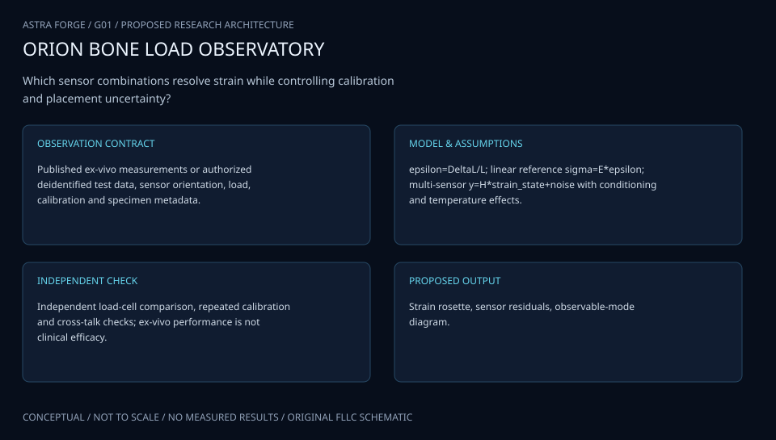
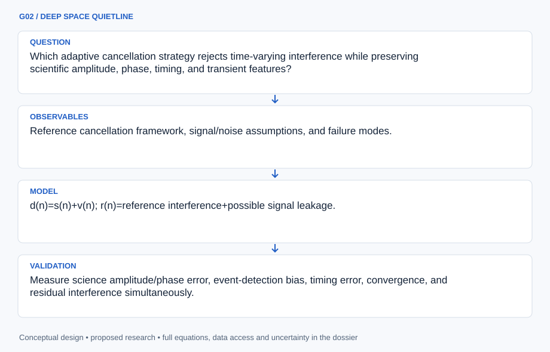
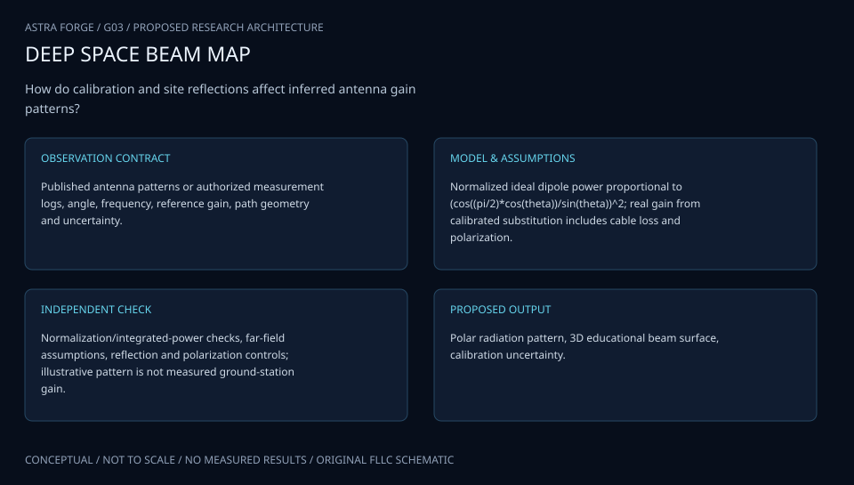
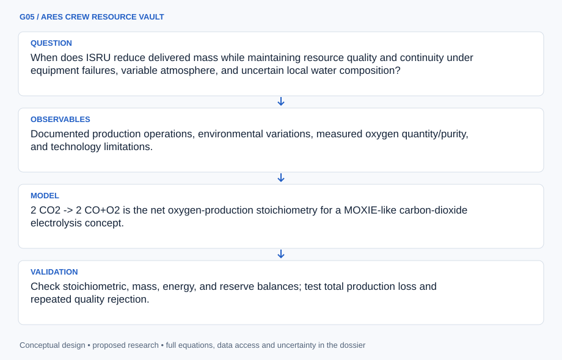
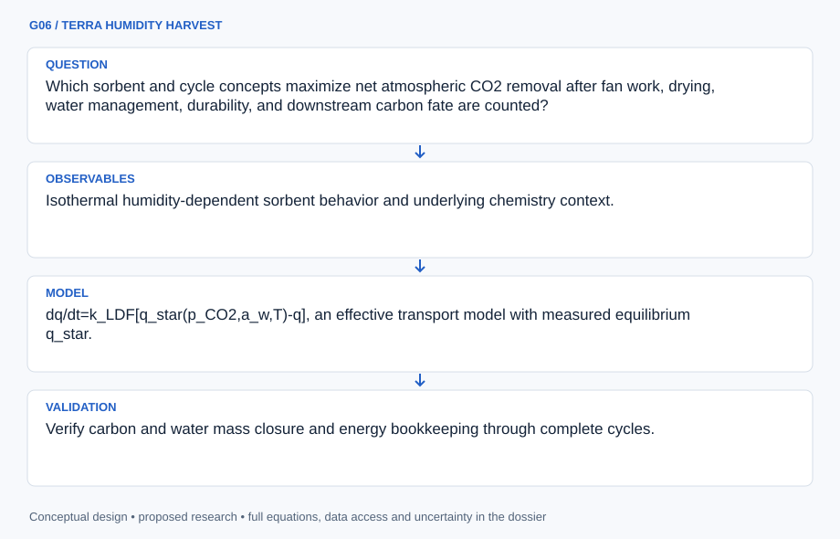

# SESSION G: EXPLORATION SYSTEMS ENGINEERING

## ATLAS engineering handbook · Revision 2

8 original projects, preserved in their supplied order. Each numbered record has an independently stated design basis, model, data contract and verification plan.

[All engineering documents](../ENGINEERING_DOCUMENTATION.md) · [Documentation standard](../docs/ENGINEERING_STANDARD.md)

## Ordered contents

1. [G01 · ARTEMIS BONE WATCH](#g01) — Ex Vivo Analysis of Multi-Sensory Device for Bone Strain Monitoring
2. [G02 · DEEP SPACE QUIETLINE](#g02) — Minimizing Local Electromagnetic Interference Using Adaptive Filters
3. [G03 · DEEP SPACE BEAM CARTOGRAPHER](#g03) — Measuring Antenna Patterns for Ground Station
4. [G04 · ARTEMIS CARTILAGE MATRIX](#g04) — Photocurable nanocomposites for customizable cartilage replacements
5. [G05 · ARES CREW RESOURCE VAULT](#g05) — Mars In-Situ Resource Utilization for Health Applications
6. [G06 · TERRA HUMIDITY HARVEST](#g06) — Direct Air Capture Using Moisture Swing Chemistry
7. [G07 · HUBBLE SPECTRAL ANCHOR](#g07) — An Introduction to Systems Engineering: Building a Monochromator Mount
8. [G08 · ORION HEPATIC RECOVERY](#g08) — Mediated Liver Regeneration

---

<a id="g01"></a>

## G01 · ARTEMIS BONE WATCH

**Original project:** Ex Vivo Analysis of Multi-Sensory Device for Bone Strain Monitoring

**Session G:** Exploration Systems Engineering

**Document class:** engineering research design and analysis record · **Revision:** 2 · **Date:** 2026-10-02

**Evidence state:** design basis, mathematical formulation and verification plan documented. Project-specific empirical results remain to be acquired; executable shared model demonstrations have their own recorded checks.

[Engineering document register](../ENGINEERING_DOCUMENTATION.md) · [Session G handbook](../documentation/SESSION_G.md) · [Previous: F02](../projects/F/F02.md) · [Next: G02](../projects/G/G02.md)

### Purpose and scientific objective

Proposed mission: validate a multimodal bone-strain monitoring concept against independent mechanical references before any clinical interpretation. The supplied title does not define its sensors, so the dossier proposes a flexible architecture combining strain-sensitive readout, temperature compensation, and load/motion context. Begin with synthetic or previously collected specimens and data; any ex vivo tissue work requires appropriate institutional oversight.

**Question:** Does sensor fusion improve strain accuracy and distinguish true load changes from temperature drift, attachment changes, and device noise?

**Testable hypothesis:** A calibrated fusion model with explicit cross-sensitivity will reduce held-out strain error relative to a single sensor, but anatomical heterogeneity and attachment transfer may set an irreducible limit.

### 1. Design basis and analysis boundary

The measurement system estimates local bone or synthetic-structure strain from candidate sensor modalities and an independent mechanical/optical reference. Its boundary includes geometry, attachment transfer, orientation, temperature and acquisition clocks. Fusion is a proposed architecture, not an identified original instrument, and ex vivo accuracy does not establish healing outcomes or in vivo utility.

Begin with a small-strain forward model and separately identified thermal coefficients. Use synthetic structures or archived authorized ex vivo records to examine observability, then add geometry-dependent transfer only when held-out specimens require it. The design decision is whether extra modalities improve independent-reference error after attachment and thermal uncertainty are propagated.

### 2. Requirements and verification traceability

These are project design requirements or proposed analysis gates. A numerical target is not a NASA requirement unless its controlling source is explicitly identified. “TBD” identifies evidence required before a decision; it is not permission to assume a value. Verification evidence listed here is planned, unless a linked result explicitly records execution.

| ID | Requirement / gate | Engineering rationale | Verification method | Basis / required evidence |
| --- | --- | --- | --- | --- |
| G01-R1 | Every strain estimate shall declare tensor basis, sensor orientation and observable rank. | A few channels cannot recover arbitrary six-component strain. | Rank-check H and constrain only justified components. | Measurement-model requirement. |
| G01-R2 | Temperature and attachment coefficients shall be independently characterized or reported unidentifiable. | Fusion can misinterpret thermal/adhesive drift as load. | Profile thermal/transfer terms and holdout reference cases. | Proposed decomposition; no device calibration claimed. |
| G01-R3 | Proposed accuracy target: fused held-out RMSE at most 80% of the best single modality at equal bandwidth. | Extra channels should provide measurable value. | Leave-one-specimen-out comparison with reference uncertainty. | Proposed relative target, not clinical threshold. |
| G01-R4 | All raw/reference streams shall retain sampling, timing and covariance metadata. | Unsynchronized sensors give false transient strain. | Timestamp fixtures and joint residual analysis. | Reproducible acquisition contract. |

### 3. Architecture and controlled interfaces

A specimen registry defines coordinate axes and geometry. Sensor adapters return wavelength, resistance or other native observables without prematurely converting each to strain. Orientation maps transform local projected strain into a common Voigt tensor convention; shear components specify engineering or tensor strain explicitly.

The forward model includes attachment transfer H, temperature coefficients and bias. An estimator returns only identifiable strain components with covariance and regularization metadata. Independent reference data enter validation rather than training/test leakage. A specimen-heldout scorer reports native residuals and strain error separately; device stiffness effects remain a model-discrepancy term.



Native observations enter a rank-aware inverse with explicit orientation, attachment and temperature pathways. Independent reference holdout tests fusion value; unobservable components and nonclinical limitations remain visible.

[Editable engineering diagram source](../visuals/projects/G01.mmd)

### 4. Mathematical model and derivation

#### Governing equations

```text
epsilon=(l-l_0)/l_0; sigma=C:epsilon for an initial small-strain elastic tissue model.
```

```text
Delta lambda_B/lambda_B=(1-p_e)epsilon+(alpha_f+xi)Delta T for a fiber-Bragg-grating candidate.
```

```text
y=H epsilon_vec+K_T Delta T+b+eta, with an experimentally identified transfer matrix H.
```

```text
epsilon_hat=argmin_epsilon ||y-H epsilon-K_T Delta T||^2_(Sigma^-1)+lambda||L epsilon||^2.
```

#### Variables, units and conventions

- Local strain tensor, loading direction, force, temperature, sensor orientation, adhesive/attachment transfer, bias, and noise covariance.
- Specimen geometry, material anisotropy, moisture state, device stiffness, sensor bandwidth, and reference uncertainty.

#### Assumptions and boundary conditions

- Sensor fusion is a proposed architecture, not an identified original device.
- Small-strain linearity and fixed attachment are initial hypotheses; bone is heterogeneous and anisotropic, and sensors may alter local deformation.

#### Derivation step 1

$$
\epsilon=(l-l_0)/l_0;\quad\epsilon_n=n^T\boldsymbol\epsilon n
$$

Strain is dimensionless and sensor direction n is a unit vector. Expand the projection into the declared tensor basis before assembling H; shear convention changes factors of two.

#### Derivation step 2

$$
\Delta\lambda_B/\lambda_B=(1-p_e)\epsilon_n+(\alpha_f+\xi)\Delta T
$$

Wavelength ratio is dimensionless; thermo-optic and expansion coefficients are K^-1. A separate temperature observation is needed to avoid ambiguity.

#### Derivation step 3

$$
y=H\epsilon+K_T\Delta T+b+\eta
$$

H includes orientation and attachment transfer, not merely ideal sensitivity. Its column rank determines which strain combinations can be estimated from available channels.

#### Derivation step 4

$$
\hat\epsilon=(H^T\Sigma^{-1}H+\lambda L^TL)^{-1}H^T\Sigma^{-1}(y-K_T\Delta T-b)
$$

Regularization makes inversion stable but introduces bias. Report resolution matrix and identifiable subspace; invertibility caused by lambda does not create measured information.

#### Inference or simulation procedure

Build a calibration and forward-error model on synthetic structures or archived load/strain data. Compare candidate modalities under identical mechanical/thermal variation and use independent optical or mechanical references. Fit attachment transfer and temperature coefficients separately from load-induced strain. Use leave-one-specimen-out validation and test whether fusion gains survive geometry, orientation, and material variation. Report measurement accuracy without converting it into fracture-healing or treatment advice.

#### Validity domain and fidelity limits

Synthetic femur and ex vivo data do not establish in vivo biocompatibility, infection risk, long-term drift, or clinical utility. Regularization can make estimates look smooth while hiding missing spatial information.

### 5. Data specifications and provenance

| Field | Type | Unit | Physical / statistical meaning | Quality and missing-data rule |
| --- | --- | --- | --- | --- |
| specimen_id | string | 1 | Geometry/material context and source. | Synthetic/ex vivo category required. |
| sensor_direction | vector<float64>[3] | 1 | Unit vector in specimen axes. | Norm and orientation uncertainty checked. |
| raw_observable | record | native | Wavelength/resistance/native readout. | Units/channel calibration required; missing null. |
| temperature | nullable<float64> | K | Local sensor temperature. | Reference and covariance retained. |
| attachment_transfer | matrix<float64> | native/strain | Identified H coefficients. | Calibration provenance and rank required. |
| strain_reference | nullable<vector<float64>> | 1 | Independent reference tensor/projections. | Coordinate/shear basis and uncertainty recorded. |
| strain_estimate | record | 1 | Identifiable components and covariance. | Unobserved components null; regularization flag required. |

[Machine-readable record schema](../data/contracts/G01.schema.json) · [Empty acquisition CSV](../data/contracts/G01.csv) · [Field dictionary CSV](../data/contracts/G01.dictionary.csv)

The CSV above contains column headers only. Its schema defines future records and does not establish that original-team data or a particular archive product have been acquired. Frame, timing, calibration, covariance, selection and provenance details must accompany populated records.

#### FBG femur strain study

[Product, archive or reference](https://pmc.ncbi.nlm.nih.gov/articles/PMC7552668/)

**Fields:** Synthetic-femur load/strain response, sensor orientations, and reported sensitivity.

**Access:** Public article; raw strain time series and instrument calibration require supplements/authors.

**Role:** Nonclinical measurement precedent.

#### Interfacial load monitoring using impedance tomography

[Product, archive or reference](https://arxiv.org/abs/1912.04723)

**Fields:** Alternative electrical sensing concept, inverse reconstruction, and failure-detection motivation.

**Access:** Public manuscript; reproduce only supported numerical/experimental details.

**Role:** Independent sensing modality for concept comparison.

### 6. Uncertainty, sensitivity and identifiability

Sensor gains, orientation, adhesive transfer, temperature coefficients and reference calibration can be correlated. Bone anisotropy and local heterogeneity create specimen-dependent discrepancy; the sensor itself can alter deformation. Treating reference strain as exact exaggerates sensor error certainty and fusion improvement.

Propagate orientation and thermal uncertainty jointly, assess H singular values, and vary regularization against held-out references. Block validation by specimen and loading session. Compare fusion with single-modality baselines using paired error intervals, and report when apparent gains disappear outside a calibrated attachment or geometry context.

### 7. Engineering trade study

| Alternative | Benefit | Cost / limitation | Decision rule |
| --- | --- | --- | --- |
| Single projected sensor | Simple interpretable channel. | Temperature/orientation ambiguity. | Use if required component is directly observable. |
| Multimodal fusion | Potential drift discrimination and redundancy. | Cross-calibration and covariance burden. | Select only after R3 and observability gates. |
| Spatial regularized inversion | Can reconstruct smooth fields. | Smoothness can hide missing information. | Use with resolution maps and independent spatial reference. |

### 8. Verification and validation cases

| Case ID | Stimulus / condition | Expected result / criterion | Method | Evidence artifact |
| --- | --- | --- | --- | --- |
| G01-V1 | Uniaxial projection | For strain diag(e,0,0), a sensor at angle theta reads e cos^2 theta. | Analytic orientation fixture. | Tensor projection. |
| G01-V2 | Temperature-only FBG | With mechanical strain zero, wavelength shift equals thermal coefficient times Delta T. | Forward-model synthetic fixture. | Readout identity. |
| G01-V3 | Rank-deficient array | Repeated collinear channels cannot identify transverse strain; output flags/nulls persist despite regularization. | Duplicate-channel inversion fixture. | Linear algebra; measured accuracy pending. |

**Execution status:** these cases are specified, not claimed as executed. Close a case only with the versioned inputs, output, uncertainty, reviewer and pass/fail rationale.

#### Additional scientific validation gates

- Test zero-load drift, thermal cross-sensitivity, loading/unloading hysteresis, and synchronization.
- Compare estimated strain against an independent reference using bias, RMSE, Bland–Altman limits, and uncertainty coverage.
- Proposed gate: fusion improvement persists on unseen specimens and is not merely explained by training leakage or extra smoothing.

### 9. Implementation and reproducible work packages

1. Create specimen_sensor_manifest.json with axes and modality identities.
2. Implement strain_projection.py and orientation fixtures.
3. Build native_readout_adapters.py and thermal_transfer.py.
4. Create fusion_inverse.py with rank/resolution diagnostics.
5. Produce leave_specimen_out.ipynb with independent-reference uncertainty.
6. Publish strain_predictions.parquet and configuration-specific limitations, without clinical interpretation.

#### Investigation sequence

1. Define the proposed sensing range, bandwidth, spatial coverage, and drift tolerances with biomechanical investigators.
2. Develop a specimen/device finite-element model and identify which sensor locations provide distinguishable information.
3. Use independently calibrated mechanical/thermal data for model fitting and held-out specimens for verification.
4. Prepare an institutional research specification for any future tissue work, with ethics, provenance, and clinically unsupported claims clearly identified.

#### Resources and interfaces to expertise

- Biomechanics expertise, synthetic bone models, finite-element software, strain/temperature metrology, and approved institutional access for any future ex vivo specimens.

### 10. Failure modes and interpretation controls

| Failure mode | Effect on result | Detection / evidence | Design response |
| --- | --- | --- | --- |
| Adhesive drift ignored | Biased load interpretation. | Session-dependent transfer residual. | Recalibration or bounded transfer uncertainty. |
| Shear convention mixed | Factor-two strain error. | Rotated-tensor fixture. | Explicit tensor/engineering basis. |
| Correlated channels treated independent | Overconfident fusion. | Residual covariance audit. | Joint calibration covariance. |

- Attachment and device stiffness may perturb the strain being measured.
- Clinical claims cannot follow from small ex vivo datasets; tissue provenance and approvals must be handled by qualified investigators.

### 11. Required engineering outputs

- Sensor-fusion model, placement trade study, calibration/error dataset, specimen-held-out validation report, and a measurement uncertainty atlas.

#### Scientific result figures to produce during execution

A generic bone/device schematic shows proposed modalities and orientations; load–strain curves and held-out error distributions expose thermal and attachment uncertainty.

### 12. Cited technical and scientific resources

- [Application of Fibre Bragg Grating Sensors in Strain Monitoring and Fracture Recovery of Human Femur Bone](https://pmc.ncbi.nlm.nih.gov/articles/PMC7552668/) — Original in vitro synthetic-femur sensor-orientation and strain-response study.
- [Interfacial Load Monitoring and Failure Detection in Total Joint Replacements](https://arxiv.org/abs/1912.04723) — Original alternative piezoresistive/impedance-based measurement concept.

Framework and evidence rules: [engineering documentation standard](../docs/ENGINEERING_STANDARD.md), [model assurance](../docs/MODEL_ASSURANCE.md), [uncertainty procedure](../docs/UNCERTAINTY_AND_DECISION_RULES.md), and [data management](../docs/DATA_MANAGEMENT.md). NASA-inspired names are creative identifiers; requirements and results are not NASA certification.

---

<a id="g02"></a>

## G02 · DEEP SPACE QUIETLINE

**Original project:** Minimizing Local Electromagnetic Interference Using Adaptive Filters

**Session G:** Exploration Systems Engineering

**Document class:** engineering research design and analysis record · **Revision:** 2 · **Date:** 2026-10-02

**Evidence state:** design basis, mathematical formulation and verification plan documented. Project-specific empirical results remain to be acquired; executable shared model demonstrations have their own recorded checks.

[Engineering document register](../ENGINEERING_DOCUMENTATION.md) · [Session G handbook](../documentation/SESSION_G.md) · [Previous: G01](../projects/G/G01.md) · [Next: G03](../projects/G/G03.md)

### Purpose and scientific objective

Proposed mission: reduce interference contamination in instrument data through adaptive cancellation while measuring preserved scientific signal fidelity. Distinguish cleaning a sampled channel from reducing physical electromagnetic emissions: adaptive filtering ordinarily does the former. A parallel electromagnetic-compatibility assessment determines whether shielding, grounding, or source mitigation remains necessary.

**Question:** Which adaptive cancellation strategy rejects time-varying interference while preserving scientific amplitude, phase, timing, and transient features?

**Testable hypothesis:** A reference-assisted normalized adaptive filter will outperform fixed notches for drifting interference when the reference is correlated with interference and sufficiently uncorrelated with the desired signal.

### 1. Design basis and analysis boundary

The cancellation system processes synchronized desired-channel and interference-reference streams while retaining raw data. Its boundary includes ADC saturation, reference leakage, adaptation, bypass and feature-preservation validation. Lower residual power is not sufficient evidence of improved scientific measurement because a contaminated reference can cancel the desired signal.

Begin with known synthetic science waveforms and benign interference records, then compare fixed notch and NLMS under identical bandwidth/train-test conditions. Validate coherence and reference quality before adaptation. A robust alternative is added only when nonstationary or nonlinear behavior defeats the linear model; saturated input cannot be reconstructed by this downstream filter.

### 2. Requirements and verification traceability

These are project design requirements or proposed analysis gates. A numerical target is not a NASA requirement unless its controlling source is explicitly identified. “TBD” identifies evidence required before a decision; it is not permission to assume a value. Verification evidence listed here is planned, unless a linked result explicitly records execution.

| ID | Requirement / gate | Engineering rationale | Verification method | Basis / required evidence |
| --- | --- | --- | --- | --- |
| G02-R1 | Store raw, reference and corrected streams with filter state/version and bypass flags. | Cancellation must be auditable and reversible. | Replay saved coefficients and compare samplewise output. | Processing provenance requirement. |
| G02-R2 | Proposed preservation target: calibration-tone amplitude change below 1% and phase change below 1 degree in protected science bands. | Noise suppression can erase science. | Inject known tones/transients and compare held-out features. | Proposed metrology targets, not instrument specs. |
| G02-R3 | Adaptation shall freeze or bypass when clipping, reference dropout or leakage validation fails. | Invalid reference estimates can damage data. | Script fault replay and inspect state transitions. | Fault-handling contract. |
| G02-R4 | Report residual interference and science-feature error separately, with common timing/band definitions. | A single SNR score hides distortion. | Matched baseline/cancellation feature tables. | Proposed comparison gate. |

### 3. Architecture and controlled interfaces

An acquisition adapter aligns desired d and reference r samples, records ADC limits and masks missing data. A reference-quality module estimates coherence and leakage evidence over declared windows. A tapped-delay filter computes interference prediction; adaptation and bypass logic use validated states with saved coefficients.

The feature scorer compares amplitude, phase, timing and transient area against known synthetic truth or independent calibration. Raw/corrected streams share absolute time and sampling rate. Spectral estimates specify window, overlap and normalization; coefficient updates run only on allowed samples, preventing dropouts from being converted into fictitious zeros.



Reference quality governs adaptation before corrected data are scored against known science features. Residual suppression, leakage, clipping and provenance remain separate engineering outcomes.

[Editable engineering diagram source](../visuals/projects/G02.mmd)

### 4. Mathematical model and derivation

#### Governing equations

```text
d(n)=s(n)+v(n); r(n)=reference interference+possible signal leakage.
```

```text
e(n)=d(n)-w(n)^T r_vec(n).
```

```text
w(n+1)=w(n)+mu e(n)r_vec(n)/(epsilon+r_vec(n)^T r_vec(n)), a normalized-LMS update.
```

```text
C_dr(f)=|S_dr(f)|^2/[S_dd(f)S_rr(f)] defines magnitude-squared coherence for reference usefulness.
```

#### Variables, units and conventions

- Desired signal s, contamination v, reference vector r, filter length, adaptation step mu, regularizer epsilon, and leakage.
- Sampling rate, interference drift, coherence, convergence time, residual spectrum, science-feature distortion, and processing latency.

#### Assumptions and boundary conditions

- Linear cancellation is a first model; saturated ADC data cannot be recovered by downstream filtering.
- The reference must observe interference without materially observing the desired signal; cancellation can otherwise erase science.

#### Derivation step 1

$$
d_n=s_n+v_n;\quad e_n=d_n-w_n^Tr_n
$$

The reference vector contains delayed samples. Linear cancellation estimates contamination but will also remove any science component correlated with r.

#### Derivation step 2

$$
w_{n+1}=w_n+\mu e_nr_n/(\epsilon+r_n^Tr_n)
$$

NLMS scales update by reference energy. For the ideal standard setting, 0<mu<2 motivates stability screening; correlated/time-varying real paths still require validation.

#### Derivation step 3

```text
S_{er}=S_{dr}-W(f)S_{rr}
```

At the stationary linear optimum, reference-correlated residual vanishes with W=S_dr/S_rr where identifiable. This minimizes mean-square residual, not guaranteed science distortion.

#### Derivation step 4

$$
C_{dr}=|S_{dr}|^2/(S_{dd}S_{rr});\quad0\le C_{dr}\le1
$$

Coherence quantifies linear reference association. Desired-signal leakage can also yield high coherence, so this quantity alone cannot certify a safe reference.

#### Inference or simulation procedure

Generate controlled mixtures from synthetic science signals and recorded benign interference references. Compare fixed notch, LMS/NLMS, and selected robust alternatives using the same training/test split. Add known calibration tones and scientific transients to quantify amplitude/phase distortion. Adapt only on validated states, freeze or bypass when reference coherence/quality fails, and retain both raw and corrected streams with filter provenance.

#### Validity domain and fidelity limits

Filtered residual power alone does not demonstrate better measurement accuracy. Nonlinear coupling, clipping, and rapidly changing reference paths may invalidate linear adaptive models. Physical emission compliance requires separate EMC measurements.

### 5. Data specifications and provenance

| Field | Type | Unit | Physical / statistical meaning | Quality and missing-data rule |
| --- | --- | --- | --- | --- |
| sample_time | vector<float64> | s | Common desired/reference clock. | Rate and alignment offset covariance required. |
| desired_raw | vector<float64> | native | Science plus interference channel. | ADC units/limits and clipping mask retained. |
| reference_raw | nullable<vector<float64>> | native | Interference witness channel. | Dropout mask; no silent zero fill. |
| filter_weights | array<vector<float64>> | ratio | Saved tapped-delay coefficients. | Ordering, length and update cadence required. |
| adaptation_state | enum | 1 | Adapt, frozen or bypass. | Reason and event time logged. |
| spectral_estimates | record | native^2/Hz | Power/cross spectra and coherence. | Window/normalization and degrees of freedom retained. |
| feature_error | record | 1,rad,s | Amplitude ratio, phase and timing error. | Truth/reference covariance and protected-band definition. |

[Machine-readable record schema](../data/contracts/G02.schema.json) · [Empty acquisition CSV](../data/contracts/G02.csv) · [Field dictionary CSV](../data/contracts/G02.dictionary.csv)

The CSV above contains column headers only. Its schema defines future records and does not establish that original-team data or a particular archive product have been acquired. Frame, timing, calibration, covariance, selection and provenance details must accompany populated records.

#### Stanford adaptive noise-cancellation paper

[Product, archive or reference](https://www-isl.stanford.edu/~widrow/papers/j1975adaptivenoise.pdf)

**Fields:** Reference cancellation framework, signal/noise assumptions, and failure modes.

**Access:** Public author-hosted paper; original laboratory recordings are not assumed downloadable.

**Role:** Algorithmic foundation.

#### Le and Hensley, RFI Removal from AIRSAR Polarimetric Data

[Product, archive or reference](https://airsar.jpl.nasa.gov/documents/workshop2002/papers/T8.pdf)

**Fields:** Radar-interference setting and adaptive-filter application context.

**Access:** Public workshop paper; identify the dataset and raw-data availability independently.

**Role:** Space/remote-sensing instrumentation precedent.

### 6. Uncertainty, sensitivity and identifiability

Reference path drift, sample-clock mismatch and sensor noise affect coefficients and residuals. Leakage couples desired signal into the cancellation estimate and creates systematic bias, even with excellent convergence. Spectral/window uncertainty and correlated residuals limit simple confidence intervals; nonlinear mixing and saturation create structural failure.

Use held-out science transients and leakage levels, blocked by interference regime. Sweep filter length, mu and clock offset, retaining coefficient transients rather than scoring only converged sections. Compare preservation-error distributions to the proposed gates before choosing a cancellation setting; invalid reference periods remain bypassed and flagged.

### 7. Engineering trade study

| Alternative | Benefit | Cost / limitation | Decision rule |
| --- | --- | --- | --- |
| Fixed notch | Predictable protected-band response. | Poor for drifting/broadband interference. | Use when interference frequencies are stable and science exclusion is justified. |
| NLMS reference cancellation | Tracks linear path with modest cost. | Leakage and convergence transients. | Select after preservation and fault gates. |
| Robust/frozen adaptive policy | Limits corruption during anomalies. | Slower adaptation and more residual noise. | Prefer when quality uncertainty outweighs extra suppression. |

### 8. Verification and validation cases

| Case ID | Stimulus / condition | Expected result / criterion | Method | Evidence artifact |
| --- | --- | --- | --- | --- |
| G02-V1 | No interference/reference | With r=0 and initialized w=0, corrected stream equals d. | Zero-reference fixture with regularizer. | Cancellation identity. |
| G02-V2 | Known linear path | For v=a r and independent s, a correctly set weight removes v without changing s. | Analytic synthetic mixture before adaptation tests. | Linear model endpoint. |
| G02-V3 | Reference science leakage | Increasing leakage can reduce desired tone despite lower residual power; preservation gate detects failure. | Inject known s into r and replay adaptation/bypass. | Model warning; quantitative outcomes pending. |

**Execution status:** these cases are specified, not claimed as executed. Close a case only with the versioned inputs, output, uncertainty, reviewer and pass/fail rationale.

#### Additional scientific validation gates

- Measure science amplitude/phase error, event-detection bias, timing error, convergence, and residual interference simultaneously.
- Test reference dropout, signal leakage, ADC clipping, and parameter sensitivity; harmful cancellation should trigger a documented fallback.
- Proposed gate: residual improvement is accepted only when science-feature errors remain within declared calibration tolerances on held-out cases.

### 9. Implementation and reproducible work packages

1. Create stream_schema.json with native units, limits and clock mapping.
2. Implement aligned_ingest.py and reference_quality.py.
3. Build nlms.py with saved coefficient/state logs.
4. Create fault_policy.py for clipping/dropout/leakage fixtures.
5. Implement feature_preservation.py and matched notch baseline.
6. Publish heldout_interference.ipynb, raw/corrected hashes and feature-error tables.

#### Investigation sequence

1. Define which science features must be preserved and a proposed residual-interference target.
2. Characterize reference coherence, delays, saturation, and potential desired-signal leakage before selecting algorithms.
3. Evaluate stationary, drifting, intermittent, and correlated-noise cases with deterministic synthetic mixtures.
4. Implement transparent quality flags, raw-data retention, bypass behavior, and a calibrated processing uncertainty model.

#### Resources and interfaces to expertise

- Signal-processing expertise, synchronized reference/data acquisition, calibrated waveform source, spectrum analysis, and EMC engineering support.

### 10. Failure modes and interpretation controls

| Failure mode | Effect on result | Detection / evidence | Design response |
| --- | --- | --- | --- |
| Desired leakage | Science cancellation. | Calibration-tone attenuation. | Reference redesign or freeze/bypass. |
| ADC clipping | Irrecoverable input distortion. | Clipping mask. | Reject interval; upstream range correction. |
| Clock misalignment | Poor cancellation/phase error. | Cross-correlation drift. | Align clocks and bound filter-delay interpretation. |

- The algorithm can suppress desired signals that correlate with its reference.
- Software cancellation can conceal poor physical EMC design and cannot repair front-end saturation.

### 11. Required engineering outputs

- Adaptive-filter benchmark, science-distortion budget, processing-quality rules, raw/corrected sample archive, and real-time concept demonstrator.

#### Scientific result figures to produce during execution

Raw and corrected time series, coherence spectrum, filter adaptation history, and injected-science amplitude/phase errors; physical emissions and data contamination occupy separate lanes.

### 12. Cited technical and scientific resources

- [Widrow et al., Adaptive Noise Cancelling: Principles and Applications](https://www-isl.stanford.edu/~widrow/papers/j1975adaptivenoise.pdf) — Original reference-assisted adaptive-cancellation analysis.
- [Le and Hensley, RFI Removal from AIRSAR Polarimetric Data](https://airsar.jpl.nasa.gov/documents/workshop2002/papers/T8.pdf) — Original JPL radar-instrumentation application of adaptive interference filtering.

Framework and evidence rules: [engineering documentation standard](../docs/ENGINEERING_STANDARD.md), [model assurance](../docs/MODEL_ASSURANCE.md), [uncertainty procedure](../docs/UNCERTAINTY_AND_DECISION_RULES.md), and [data management](../docs/DATA_MANAGEMENT.md). NASA-inspired names are creative identifiers; requirements and results are not NASA certification.

---

<a id="g03"></a>

## G03 · DEEP SPACE BEAM CARTOGRAPHER

**Original project:** Measuring Antenna Patterns for Ground Station

**Session G:** Exploration Systems Engineering

**Document class:** engineering research design and analysis record · **Revision:** 2 · **Date:** 2026-10-02

**Evidence state:** design basis, mathematical formulation and verification plan documented. Project-specific empirical results remain to be acquired; executable shared model demonstrations have their own recorded checks.

[Engineering document register](../ENGINEERING_DOCUMENTATION.md) · [Session G handbook](../documentation/SESSION_G.md) · [Previous: G02](../projects/G/G02.md) · [Next: G04](../projects/G/G04.md)

### Purpose and scientific objective

Proposed mission: produce a calibrated three-dimensional antenna pattern for an authorized ground station and translate uncertainty into pointing and link-performance limits. Treat installation, polarization, reflections, cable changes, and structural deformation as part of the measurement system. Compare far-field and near-field approaches according to aperture size and available facility geometry.

**Question:** How accurately can the installed antenna's gain, polarization, sidelobes, and boresight be measured across its operating band?

**Testable hypothesis:** A calibrated measurement with explicit reflection and alignment controls will reveal installation-dependent pattern differences significant to the link budget, even when the standalone antenna design is well understood.

### 1. Design basis and analysis boundary

The measurement boundary comprises an installed or antenna-alone configuration, calibrated transmit/receive chains, angular geometry and either a verified far-field range or phase-consistent near-field scan. The requested outputs are gain, polarization, beam pointing and sidelobe uncertainty across a declared band; receive gain alone is not system G/T.

Begin with a link-budget-driven accuracy/coverage requirement and reference calibration. Choose a far-field approach only when range/reflection conditions support it; choose near-field transformation only with complex sampling, probe correction and adequate scan extent. Power-only local scans remain limited diagnostic data rather than a complete far-field pattern.

### 2. Requirements and verification traceability

These are project design requirements or proposed analysis gates. A numerical target is not a NASA requirement unless its controlling source is explicitly identified. “TBD” identifies evidence required before a decision; it is not permission to assume a value. Verification evidence listed here is planned, unless a linked result explicitly records execution.

| ID | Requirement / gate | Engineering rationale | Verification method | Basis / required evidence |
| --- | --- | --- | --- | --- |
| G03-R1 | All pattern records shall specify frequency, coordinate frame, polarization basis and installed configuration. | Patterns cannot be combined across incompatible geometry/chains. | Schema and coordinate/polarization round-trip checks. | Antenna measurement contract. |
| G03-R2 | Near-field reconstruction shall retain complex field, spacing, extent and probe response. | Power-only data lack transform phase. | Reject missing phase/probe metadata for full pattern claims. | Existing JPL range constraints. |
| G03-R3 | Proposed initial pointing uncertainty target is 0.1 beamwidth; final gain/sidelobe tolerances are link-budget TBD. | Absolute arbitrary angle targets do not scale with aperture. | Propagate encoder/alignment uncertainty against measured beamwidth. | Proposed target, not ground-station capability. |
| G03-R4 | Gain and G/T shall retain calibration/cable loss and independently defined system temperature. | Receiver sensitivity includes more than antenna gain. | Reconstruct chain ledger and temperature boundary. | Radiometric/link definition. |

### 3. Architecture and controlled interfaces

A configuration registry defines antenna mount axes and co/cross polarization. Measurement adapters return calibrated complex samples or far-field power ratios with range, angle and timestamp. A chain ledger applies cable/receiver/reference-antenna corrections with shared covariance.

The near-field transform uses spatial coordinates in m, complex phase in rad and frequency-dependent wavelength; its angular-spectrum mapping excludes unsupported angles. The far-field branch applies free-space calibration and reflection assessment. A common pattern extractor reports beamwidth, sidelobes, boresight and covariance; a separate temperature adapter produces G/T when qualified.



Complex near-field and calibrated far-field branches share configuration and chain evidence, then produce supported pattern metrics. G/T remains a separate output requiring qualified noise temperature.

[Editable engineering diagram source](../visuals/projects/G03.mmd)

### 4. Mathematical model and derivation

#### Governing equations

```text
R_ff approximately 2D^2/lambda is a conventional Fraunhofer-distance criterion; verify its adequacy for required pattern accuracy.
```

```text
P_r/P_t=G_t G_r(lambda/(4pi R))^2 L_pol L_misc in a far-field free-space calibration model.
```

```text
F(k_x,k_y)=double_integral E(x,y) exp[-i(k_x x+k_y y)]dxdy for a planar near-field angular-spectrum abstraction.
```

```text
G/T=G_dBi-10log10(T_sys/K), a receive-system figure of merit.
```

#### Variables, units and conventions

- Frequency, wavelength lambda, largest aperture D, range R, azimuth/elevation, co/cross polarization, amplitude, and phase.
- Cable loss, calibration antenna gain, angular encoder error, reflections, near-field scan extent/spacing, and receiver system temperature.

#### Assumptions and boundary conditions

- Reciprocity applies to the passive linear antenna under equivalent conditions; the complete transmitting and receiving chains can differ.
- Near-field transformation needs phase-consistent sampling and probe correction; a power-only local scan is not automatically a full far-field measurement.

#### Derivation step 1

$$
R_{ff}\approx2D^2/\lambda;\quad\lambda=c/f
$$

The conventional Fraunhofer scale follows aperture path-phase variation. Its adequacy depends on required accuracy; it is a screening distance, not a guarantee against ground reflections.

#### Derivation step 2

$$
P_r/P_t=G_tG_r(\lambda/(4\pi R))^2L_{pol}L_{misc}
$$

Friis calibration is dimensionless with linear gains/loss factors. Solve for unknown gain only after calibrated power, reference gain and polarization mismatch are specified.

#### Derivation step 3

$$
F(k_x,k_y)=\iint E(x,y)e^{-i(k_xx+k_yy)}dxdy
$$

Phase-consistent planar samples map to angular spectrum, kx=k sin(theta) cos(phi). Spatial sampling and finite extent control aliasing and angular support; probe correction precedes interpretation.

#### Derivation step 4

$$
G/T=G_{dBi}-10\log_{10}(T_{sys}/K)
$$

This dB/K figure combines gain and system noise temperature. Their errors can share chain calibration, requiring covariance rather than independent scalar addition.

#### Inference or simulation procedure

Define required angular coverage and accuracy from the station link budget. Choose a verified far-field range or a near-field scan with adequate extent and sampling. Perform reference-antenna calibration and track cable/receiver drift. Separate antenna-alone patterns from installed-system observations, using reference measurements or justified reflection modeling. Propagate amplitude, phase, range, and pointing errors into beamwidth, sidelobe, gain, and link uncertainty.

#### Validity domain and fidelity limits

Outdoor ground reflections and nearby structures can create patterns unlike free-space results. Limited near-field coverage and missing scan phases restrict angular fidelity; receive gain alone does not determine system G/T.

### 5. Data specifications and provenance

| Field | Type | Unit | Physical / statistical meaning | Quality and missing-data rule |
| --- | --- | --- | --- | --- |
| configuration_id | string | 1 | Installed/antenna-alone state. | Mount, cabling and surroundings version required. |
| frequency | float64 | Hz | Measurement frequency. | Positive; bandwidth and wavelength convention. |
| angular_coordinate | pair<float64> | rad | Azimuth/elevation in station frame. | Axes/signs and encoder covariance. |
| polarization_basis | enum | 1 | Co/cross or declared linear/circular basis. | Basis transform version required. |
| complex_field | nullable<complex128> | native | Near-field phase/amplitude sample. | Phase reference required; power-only flagged. |
| calibration_ledger | record | dB,rad | Gain/loss/phase corrections. | Shared error terms and drift retained. |
| system_temperature | nullable<float64> | K | Receive-system noise temperature. | Measurement boundary required; absent means no G/T. |

[Machine-readable record schema](../data/contracts/G03.schema.json) · [Empty acquisition CSV](../data/contracts/G03.csv) · [Field dictionary CSV](../data/contracts/G03.dictionary.csv)

The CSV above contains column headers only. Its schema defines future records and does not establish that original-team data or a particular archive product have been acquired. Frame, timing, calibration, covariance, selection and provenance details must accompany populated records.

#### NASA JPL MESA antenna-range technical information

[Product, archive or reference](https://www.nasa.gov/jpl/mesa/antenna-range/)

**Fields:** Available range approaches, frequency coverage, near-field scan geometry, and coverage relationships.

**Access:** Public technical information; facility use and calibration datasets require separate arrangements.

**Role:** Measurement architecture reference.

#### NASA JPL outdoor-range information

[Product, archive or reference](https://www.nasa.gov/jpl/mesa/facilities/outdoor-ranges/)

**Fields:** Far-field range configurations and ground-reflection considerations.

**Access:** Public facility description, not a dataset for the user's antenna.

**Role:** Environmental systematic-error reference.

### 6. Uncertainty, sensitivity and identifiability

Reference antenna gain, receiver linearity, cable drift, range and angular encoders create correlated errors across pattern samples. Outdoor multipath can shift sidelobes and boresight systematically. Near-field truncation, phase drift and probe correction create reconstruction discrepancy that cannot be represented by amplitude noise alone.

Compare repeated reference measurements, scan reversals and frequency consistency. Propagate complex covariance through transformation and fit beam parameters on supported angular regions. Assess near-field extent/spacing changes separately from chain calibration. Publish antenna-alone and installed-system results distinctly when reflection evidence cannot isolate the difference.

### 7. Engineering trade study

| Alternative | Benefit | Cost / limitation | Decision rule |
| --- | --- | --- | --- |
| Outdoor far field | Direct angular pattern measurement. | Range and reflections may dominate. | Use when geometry/reflection uncertainty meets link needs. |
| Planar near field | Compact and phase-resolved. | Finite coverage/probe correction. | Choose for supported angular sector with complex calibration. |
| Installed link observations | Captures operational surroundings. | Confounds antenna and receiver/propagation. | Use as system validation, not isolated free-space pattern. |

### 8. Verification and validation cases

| Case ID | Stimulus / condition | Expected result / criterion | Method | Evidence artifact |
| --- | --- | --- | --- | --- |
| G03-V1 | Free-space scaling | Doubling R reduces received power by factor four at fixed calibrated gains. | Synthetic Friis ledger and range check. | Inverse-square relation. |
| G03-V2 | Uniform rectangular aperture | Transform gives separable sinc field with known first nulls. | Complex-scan synthetic fixture with extent refinement. | Fourier aperture analytic pattern. |
| G03-V3 | Missing phase/system temperature | Power-only scan cannot enter full near-field transform; absent T forbids G/T output. | Data-contract integration fixture. | Information sufficiency, not measured pattern success. |

**Execution status:** these cases are specified, not claimed as executed. Close a case only with the versioned inputs, output, uncertainty, reviewer and pass/fail rationale.

#### Additional scientific validation gates

- Repeat boresight and reference-antenna checks before/after scans; test cable-motion and thermal sensitivity.
- Compare independent principal-plane scans and, where practical, far-field versus transformed near-field predictions.
- Proposed gate: measured gain and pointing uncertainty fit the declared link-margin allocation; unmeasured angular regions remain flagged.

### 9. Implementation and reproducible work packages

1. Create antenna_configuration.yaml and angular_polarization_schema.json.
2. Build chain_calibration.py with gain/loss covariance.
3. Implement farfield_friis.py and reflection_assessment.ipynb.
4. Build complex_nearfield_transform.py with probe/extent masks.
5. Create pattern_metrics.py and rectangular-aperture fixtures.
6. Publish gain_pattern.parquet and optional gt_report.json only with qualified temperature metadata.

#### Investigation sequence

1. Freeze station frequency bands, pointing needs, desired pattern accuracy, and authorized measurement environment.
2. Select far-field/near-field method and build a complete calibration/uncertainty chain.
3. Acquire or specify synchronized angular, amplitude, phase, and polarization records with configuration metadata.
4. Convert measured patterns into uncertainty-aware pointing-loss and link-margin envelopes.

#### Resources and interfaces to expertise

- Antenna metrology expertise, calibrated reference antenna, phase-capable RF instrumentation, authorized range or chamber, and station geometry model.

### 10. Failure modes and interpretation controls

| Failure mode | Effect on result | Detection / evidence | Design response |
| --- | --- | --- | --- |
| Ground reflection unmodeled | False sidelobes/gain. | Range/frequency/height dependence. | Reflection control/model and separate installed result. |
| Phase reference drift | Distorted near-field transform. | Reference revisit phase discrepancy. | Common reference and drift correction. |
| Cable loss omitted | Biased absolute gain. | Chain-ledger mismatch. | Calibrated loss with uncertainty. |

- Multipath can masquerade as sidelobes or nulls.
- Insufficient near-field scan extent or phase accuracy can produce misleadingly smooth transformed patterns.

### 11. Required engineering outputs

- Calibrated pattern dataset, 3D beam atlas, polarization/pointing-error budget, and station link-performance report.

#### Scientific result figures to produce during execution

3D co/cross-polarized gain surfaces, principal-plane cuts with uncertainty, and pointing-loss versus angular error; installed and free-space configurations are visibly distinct.

### 12. Cited technical and scientific resources

- [NASA JPL MESA Antenna Range Technical Data](https://www.nasa.gov/jpl/mesa/antenna-range/) — Official near-field/far-field approaches and scan-coverage constraints.
- [NASA JPL MESA Outdoor Ranges](https://www.nasa.gov/jpl/mesa/facilities/outdoor-ranges/) — Official discussion of outdoor measurement geometry and ground-reflection control.

Framework and evidence rules: [engineering documentation standard](../docs/ENGINEERING_STANDARD.md), [model assurance](../docs/MODEL_ASSURANCE.md), [uncertainty procedure](../docs/UNCERTAINTY_AND_DECISION_RULES.md), and [data management](../docs/DATA_MANAGEMENT.md). NASA-inspired names are creative identifiers; requirements and results are not NASA certification.

---

<a id="g04"></a>

## G04 · ARTEMIS CARTILAGE MATRIX

**Original project:** Photocurable nanocomposites for customizable cartilage replacements

**Session G:** Exploration Systems Engineering

**Document class:** engineering research design and analysis record · **Revision:** 2 · **Date:** 2026-10-02

**Evidence state:** design basis, mathematical formulation and verification plan documented. Project-specific empirical results remain to be acquired; executable shared model demonstrations have their own recorded checks.

[Engineering document register](../ENGINEERING_DOCUMENTATION.md) · [Session G handbook](../documentation/SESSION_G.md) · [Previous: G03](../projects/G/G03.md) · [Next: G05](../projects/G/G05.md)

### Purpose and scientific objective

Proposed mission: evaluate customizable photocurable nanocomposite concepts using a computational and analytical materials framework before any clinical application. Cartilage replacement requires more than initial stiffness: permeability, time-dependent deformation, fatigue, wear, interface behavior, and biological compatibility all matter. Preserve the title while treating proposed constructs as research materials rather than approved replacements.

**Question:** Which microstructure and geometry combinations approach the mechanical response of a specified cartilage region without unacceptable permeability, wear, or interface tradeoffs?

**Testable hypothesis:** A spatially varied, poro-viscoelastic design may reproduce load-bearing and relaxation behavior better than a uniformly stiff material, but printing/cure variability and biological effects could outweigh that advantage.

### 1. Design basis and analysis boundary

The system is a nonclinical materials/mechanics assessment of photocurable nanocomposite constructs against a region-specific cartilage response envelope. Its boundary includes solid mechanics, fluid transport, relaxation, geometry and interface loading, with published material data and proposed simulations. It specifies no clinical implantation, biological intervention or fabrication recipe.

Begin with biphasic small-strain response and a transparent relaxation fit, then add nonlinear contact, swelling or cure heterogeneity only when supported data distinguish them. Matching a single modulus is inadequate: permeability, rate dependence, stress concentration and wear evidence remain separate gates. Biological compatibility and long-term integration are outside a mechanics-only claim.

### 2. Requirements and verification traceability

These are project design requirements or proposed analysis gates. A numerical target is not a NASA requirement unless its controlling source is explicitly identified. “TBD” identifies evidence required before a decision; it is not permission to assume a value. Verification evidence listed here is planned, unless a linked result explicitly records execution.

| ID | Requirement / gate | Engineering rationale | Verification method | Basis / required evidence |
| --- | --- | --- | --- | --- |
| G04-R1 | All Darcy models shall use intrinsic permeability k in m^2 and fluid viscosity in Pa s. | Hydraulic conductivity is a different coefficient. | Unit check and analytic pressure-gradient flux. | Corrected transport definition. |
| G04-R2 | Target envelopes shall identify cartilage region, loading mode, rate and source population. | One universal cartilage modulus is misleading. | Audit target-to-data provenance. | Materials-comparison requirement. |
| G04-R3 | Proposed numerical gate: closed-domain solid/fluid mass-balance residual below 10^-6 of imposed volume change. | Poroelastic fits can conceal conservation failure. | Integrate boundary flux and deformation ledger. | Proposed solver target. |
| G04-R4 | Report relaxation, peak strain/contact pressure and interface uncertainty separately; clinical suitability remains unclaimed. | Good bulk stiffness can coexist with harmful concentrations. | Multimetric contact/relaxation comparison. | Nonclinical design gate; no patient threshold. |

### 3. Architecture and controlled interfaces

A material registry supplies modulus, Poisson response, intrinsic permeability, fluid viscosity and relaxation parameters with domain/source metadata. Geometry and region target adapters define specimen and loading coordinates. A biphasic solver returns solid displacement and pore pressure; contact/interface modules consume tractions and deformations.

Optical-dose/cure heterogeneity enters as a spatial material-field hypothesis, not a manufacturing instruction. The observation adapter maps simulation outputs to published relaxation/load-displacement data. Comparison retains rate/region context and marks absent wear or biological evidence as unknown, rather than filling it from mechanics predictions.


Correct intrinsic-permeability transport couples to solid response and a conservation ledger. Region-specific comparison and interface stress remain separate from wear, biological compatibility and clinical approval.

[Editable engineering diagram source](../visuals/projects/G04.mmd)

### 4. Mathematical model and derivation

#### Governing equations

```text
sigma=sigma_solid-p I; div(sigma)=0 for a quasi-static biphasic mechanical model.
```

```text
q=-(k/mu_f)grad p; mass balance couples fluid flux q to solid deformation.
```

```text
E(t)=E_inf+sum_j E_j exp(-t/tau_j), a fitted relaxation representation.
```

```text
cure_state(x)~f(local optical dose,attenuation,material state); dose is an explanatory variable, not a prescribed fabrication recipe.
```

#### Variables, units and conventions

- Solid modulus, Poisson response, hydraulic permeability k, relaxation times tau, filler distribution, and swelling.
- Construct geometry, loading rate, contact stress, interface strength, wear particles, cure heterogeneity, and manufacturing tolerance.
- In the Darcy relation, k is intrinsic permeability [m^2], mu_f fluid dynamic viscosity [Pa s], p pressure [Pa], and q Darcy flux [m/s]; hydraulic conductivity is a different coefficient.

#### Assumptions and boundary conditions

- Biphasic and relaxation parameters are region- and test-dependent; matching one modulus does not reproduce native cartilage.
- The proposal is non-operational materials assessment; biological compatibility and clinical approval require independent regulated work.

#### Derivation step 1

$$
\boldsymbol\sigma=\boldsymbol\sigma_s-pI;\quad\nabla\cdot\boldsymbol\sigma=0
$$

Positive p is compressive pore pressure in the tensile-positive stress convention. Solid and fluid contributions must use the same sign convention at contact boundaries.

#### Derivation step 2

$$
q=-(k/\mu_f)\nabla p
$$

k/mu has m^2/(Pa s); pressure gradient is Pa/m, giving Darcy flux m/s. The minus sign sends fluid down pressure, not toward higher p.

#### Derivation step 3

$$
\dot\epsilon_v+\nabla\cdot q=0
$$

For the chosen incompressible-constituent small-strain mixture approximation, volume change and flux divergence balance. Compressible phases need additional storage terms.

#### Derivation step 4

$$
E(t)=E_\infty+\sum_jE_je^{-t/\tau_j};\quad\tau_{poro}\sim\mu_fL^2/(kH_A)
$$

Relaxation fitting is phenomenological; poroelastic timescale has seconds with aggregate modulus H_A in Pa. Thickness and permeability can be confounded with intrinsic viscoelastic relaxation.

#### Inference or simulation procedure

Compile published material-response ranges and build a region-specific cartilage target envelope. Fit poro-viscoelastic models to supported relaxation data and simulate contact/loading under uncertainty. Explore geometry and parameter tradeoffs with constraints on permeability and strain concentration. Specify nonclinical characterization outputs needed to distinguish mechanical promise from printing/cure artifacts. Plan any physical or biological study only through qualified materials/biomedical investigators.

#### Validity domain and fidelity limits

Long-term wear, integration, inflammation, and patient variability are not established by short laboratory tests. Nanofillers may alter optics, curing, degradation, and cell response in ways a mechanics-only model cannot predict.

### 5. Data specifications and provenance

| Field | Type | Unit | Physical / statistical meaning | Quality and missing-data rule |
| --- | --- | --- | --- | --- |
| target_region | record | 1 | Anatomical region and published response context. | Population/test mode required; no universal target. |
| geometry | record | m | Construct/test domain dimensions. | Tolerance and boundary conditions retained. |
| solid_parameters | record | Pa,1 | Moduli and Poisson response. | Physical range/source and covariance required. |
| intrinsic_permeability | float64 | m^2 | Darcy material permeability. | Positive; never mislabeled conductivity. |
| fluid_viscosity | float64 | Pa s | Fluid dynamic viscosity. | Temperature/context recorded. |
| relaxation_curve | nullable<array<time,stress>> | s,Pa | Published/model relaxation observation. | Load history and digitization error retained. |
| cure_field | nullable<array<float64>> | 1 | Hypothesized material-state heterogeneity. | Uncalibrated fields labeled proposed; null allowed. |

[Machine-readable record schema](../data/contracts/G04.schema.json) · [Empty acquisition CSV](../data/contracts/G04.csv) · [Field dictionary CSV](../data/contracts/G04.dictionary.csv)

The CSV above contains column headers only. Its schema defines future records and does not establish that original-team data or a particular archive product have been acquired. Frame, timing, calibration, covariance, selection and provenance details must accompany populated records.

#### Photopolymerized nanocomposite cartilage-damage study

[Product, archive or reference](https://pmc.ncbi.nlm.nih.gov/articles/PMC4950507/)

**Fields:** Reported material/mechanical characteristics and composite-interface observations.

**Access:** Public article; machine-readable mechanical curves may require supplements/authors.

**Role:** Nanocomposite research precedent.

#### Photoreactive adhesive-hydrogel composite study

[Product, archive or reference](https://pmc.ncbi.nlm.nih.gov/articles/PMC3972413/)

**Fields:** Interface concept, nonclinical/clinical research outcomes, and limitations.

**Access:** Public article; do not interpret a study as approval of the proposed material.

**Role:** Independent interface/translation context.

### 6. Uncertainty, sensitivity and identifiability

Material scatter, swelling, thickness and boundary leakage couple strongly to relaxation. Filler distribution and cure heterogeneity can change both solid stiffness and transport; treating them as independent scalar errors can understate response variability. Interface slip and wear are structural discrepancies beyond a bulk biphasic fit.

Profile permeability against modulus and thickness, compare multiple loading rates/geometries and test whether intrinsic relaxation is identifiable separately from fluid drainage. Propagate spatial material ensembles into contact concentrations. Report unsupported wear and biological endpoints as missing evidence; simulations can prioritize characterization without claiming clinical performance.

### 7. Engineering trade study

| Alternative | Benefit | Cost / limitation | Decision rule |
| --- | --- | --- | --- |
| Homogeneous biphasic model | Interpretable fluid/solid coupling. | Misses heterogeneity and nonlinear strain. | Baseline after conservation checks. |
| Poro-viscoelastic model | Separates multiple relaxation mechanisms. | Parameters may be correlated. | Use only if rates/geometries identify added terms. |
| Spatial heterogeneous contact model | Reveals local concentration/interface effects. | Needs material-field evidence. | Apply to bounded proposed fields and report sensitivity. |

### 8. Verification and validation cases

| Case ID | Stimulus / condition | Expected result / criterion | Method | Evidence artifact |
| --- | --- | --- | --- | --- |
| G04-V1 | Uniform pressure gradient | One-dimensional q=-k Delta p/(mu L) with declared sign. | Analytic Darcy fixture. | Unit/sign conservation. |
| G04-V2 | Closed undrained limit | No boundary flux implies conserved mixture volume under stated incompressibility. | Boundary-ledger integration. | Mass balance. |
| G04-V3 | Relaxation endpoints | E(0)=E_inf+sum E_j and E(infinity)=E_inf for positive tau. | Analytic and fitted-function checks. | Relaxation identity; measured fitting pending. |

**Execution status:** these cases are specified, not claimed as executed. Close a case only with the versioned inputs, output, uncertainty, reviewer and pass/fail rationale.

#### Additional scientific validation gates

- Check fluid/solid mass balance, relaxation limits, mesh/contact convergence, and parameter identifiability.
- Require prediction on withheld loading rates and geometries; compare stress distributions, relaxation, and permeability jointly.
- Proposed gate: a candidate meets its mechanical target envelope across uncertainty while unsupported biological properties remain explicit gaps.

### 9. Implementation and reproducible work packages

1. Create region_target_registry.csv with source and loading context.
2. Build biphasic_material.yaml with permeability units and covariance.
3. Implement poroelastic_solver.py and Darcy/closed-domain fixtures.
4. Create relaxation_identifiability.ipynb across rates and dimensions.
5. Build contact_interface.py with spatial material-field scenarios.
6. Publish response_trade.parquet and an evidence-gap matrix for wear/interface/compatibility.

#### Investigation sequence

1. Choose a proposed anatomical target and define a multidimensional response envelope rather than a single stiffness target.
2. Build and validate a poro-viscoelastic contact model with geometry/cure uncertainty.
3. Rank customizable concepts by relaxation, permeability, interface stress, and manufacturing robustness.
4. Prepare a nonclinical characterization specification including wear, degradation, and biocompatibility evidence gaps.

#### Resources and interfaces to expertise

- Cartilage mechanics expertise, materials characterization collaboration, finite-element software, optical-cure modeling, and institutional biomedical oversight.

### 10. Failure modes and interpretation controls

| Failure mode | Effect on result | Detection / evidence | Design response |
| --- | --- | --- | --- |
| Permeability coefficient confused | Incorrect drainage timescale. | Unit checker. | Intrinsic k plus explicit viscosity. |
| Rate/region target mixed | False native-cartilage match. | Target provenance audit. | Context-specific envelope. |
| Mechanics equated compatibility | Unsupported clinical claim. | Evidence-category review. | Separate nonclinical outputs and missing biology/wear evidence. |

- A stiffer material can increase harmful local contact stress rather than improve function.
- Cure heterogeneity, nanofiller release, and fatigue may invalidate initial mechanical promise; no implant or treatment recommendation is made.

### 11. Required engineering outputs

- Material/geometry trade atlas, validated constitutive model, tolerance study, and evidence-based nonclinical research specification.

#### Scientific result figures to produce during execution

Generic cartilage contact model, relaxation curves, permeability–modulus Pareto map, and cure/strain heterogeneity contours; all synthetic curves are labeled simulations.

### 12. Cited technical and scientific resources

- [Synthesis of a Novel Photopolymerized Nanocomposite Hydrogel for Treatment of Acute Mechanical Damage to Cartilage](https://pmc.ncbi.nlm.nih.gov/articles/PMC4950507/) — Original nanocomposite materials/mechanical research.
- [Human Cartilage Repair with a Photoreactive Adhesive-Hydrogel Composite](https://pmc.ncbi.nlm.nih.gov/articles/PMC3972413/) — Original interface and translational study relevant to evidence gaps, without establishing approval for this proposed concept.

Framework and evidence rules: [engineering documentation standard](../docs/ENGINEERING_STANDARD.md), [model assurance](../docs/MODEL_ASSURANCE.md), [uncertainty procedure](../docs/UNCERTAINTY_AND_DECISION_RULES.md), and [data management](../docs/DATA_MANAGEMENT.md). NASA-inspired names are creative identifiers; requirements and results are not NASA certification.

---

<a id="g05"></a>

## G05 · ARES CREW RESOURCE VAULT

**Original project:** Mars In-Situ Resource Utilization for Health Applications

**Session G:** Exploration Systems Engineering

**Document class:** engineering research design and analysis record · **Revision:** 2 · **Date:** 2026-10-02

**Evidence state:** design basis, mathematical formulation and verification plan documented. Project-specific empirical results remain to be acquired; executable shared model demonstrations have their own recorded checks.

[Engineering document register](../ENGINEERING_DOCUMENTATION.md) · [Session G handbook](../documentation/SESSION_G.md) · [Previous: G04](../projects/G/G04.md) · [Next: G06](../projects/G/G06.md)

### Purpose and scientific objective

Proposed mission: evaluate how locally sourced oxygen and water could support crew-health infrastructure on Mars while meeting verified environmental-health requirements. Separate extraction yield from a resource being fit for human use. MOXIE provides a real oxygen-production precedent; this dossier proposes integrated quality assurance, storage, continuity, and contamination accounting rather than a medical-treatment or pharmaceutical-production plan.

**Question:** When does ISRU reduce delivered mass while maintaining resource quality and continuity under equipment failures, variable atmosphere, and uncertain local water composition?

**Testable hypothesis:** Quality-aware reserve sizing and staged qualification will expose narrower feasible operating regions than yield-only optimization, but can still identify useful health-support architectures.

### 1. Design basis and analysis boundary

The resource system models extraction, production, qualification, storage and crew demand as distinct interfaces. A MOXIE-like oxygen demonstration informs a bounded technology baseline; continuous scaled production, trace-contaminant suitability and crew-system integration remain proposed. No site-specific Martian water composition or human-use purity threshold is assumed.

Begin with mass/quality ledgers and imported-only comparison, then add production outages, rejected batches and independent reserve scenarios. Applicable human-system requirements must be captured by revision and mission applicability. Quality percentage alone cannot qualify every contaminant, and health-system use is modeled as a demand boundary rather than treatment instructions.

### 2. Requirements and verification traceability

These are project design requirements or proposed analysis gates. A numerical target is not a NASA requirement unless its controlling source is explicitly identified. “TBD” identifies evidence required before a decision; it is not permission to assume a value. Verification evidence listed here is planned, unless a linked result explicitly records execution.

| ID | Requirement / gate | Engineering rationale | Verification method | Basis / required evidence |
| --- | --- | --- | --- | --- |
| G05-R1 | Only qualified resource mass shall enter crew-use storage. | Production quantity can hide quality rejection. | Batch-state ledger rejects unqualified transfer. | Quality-boundary requirement. |
| G05-R2 | Every contaminant comparison shall identify requirement revision, analytical limit and uncertainty. | Below detection is not necessarily below an applicable limit. | Audit standard/evidence matrix; unresolved limits remain TBD. | Existing NASA standard record; no invented threshold. |
| G05-R3 | Reserve sizing shall include declared outage and quality-rejection scenarios independently of mean production. | Average surplus cannot cover every failure. | Integrate demand through outage ensembles. | Mission-specific reserve requirement, numerical value TBD. |
| G05-R4 | Proposed numerical mass-closure target is 10^-6 of cumulative delivered/produced mass. | Resource loss accounting must be reproducible. | Production/storage/use/loss ledger. | Proposed computation tolerance. |

### 3. Architecture and controlled interfaces

An environment adapter supplies atmospheric/resource scenario and uncertainty. Production modules emit mass plus quality-status records, power and thermal loads. A qualification gate uses requirement-linked evidence and routes rejected/unassessed resource separately from qualified storage.

Storage tracks imported reserve and ISRU-derived inventories by batch, with leakage and availability. Crew demand uses mission time in seconds and kg/s schedules; independent reserve logic can bypass failed production. Equivalent-system-mass scoring accepts mission-specific power, volume, cooling and crew-time conversion factors, preserving native quantities when factors are unavailable.



Production and qualified availability are separated by an evidence gate. Imported reserve, coupled outage/rejection and mission-specific equivalence factors remain explicit; human-use quality is not inferred from gross oxygen output.

[Editable engineering diagram source](../visuals/projects/G05.mmd)

### 4. Mathematical model and derivation

#### Governing equations

```text
2 CO2 -> 2 CO+O2 is the net oxygen-production stoichiometry for a MOXIE-like carbon-dioxide electrolysis concept.
```

```text
dot(m)_storage=dot(m)_qualified-production-dot(m)_crew-use-dot(m)_loss.
```

```text
M_reserve>=integral_0^T_outage demand(t)dt with outage distributions and contingency requirements.
```

```text
ESM=M_hardware+M_spares+k_P P+k_V V+k_C cooling+k_T crew_time, with mission-specific equivalent-mass factors.
```

#### Variables, units and conventions

- Qualified oxygen/water production, contaminant concentration/detection limits, purity uncertainty, demand, storage losses, and outage duration.
- Power, thermal load, consumables, crew time, spare mass, local-resource uncertainty, and independent reserve inventory.

#### Assumptions and boundary conditions

- A measured oxygen percentage alone does not establish all human-use contaminant requirements.
- Applicable NASA human-system requirements and mission-specific standards must be identified by revision; production technologies and clinical systems have distinct qualification processes.

#### Derivation step 1

$$
2CO_2\rightarrow2CO+O_2;\quad n_{O_2}=n_{CO_2,processed}/2
$$

Stoichiometry sets an ideal molar ceiling, not actual output or crew suitability. Conversion efficiency and rejected product reduce qualified yield.

#### Derivation step 2

$$
\dot M_q=\dot m_{prod}f_q-\dot m_{use}-\dot m_{loss}
$$

Qualified fraction f_q lies between zero and one; uncertain/unassessed batches cannot be assumed accepted. All mass rates are kg/s.

#### Derivation step 3

$$
M_{reserve}\ge\int_0^{T_{out}}\dot m_{demand}(t)dt+M_{loss,out}
$$

Reserve depends on outage duration and storage losses. Demand/production failures can be correlated; specify joint scenarios before selecting a percentile.

#### Derivation step 4

```text
ESM=M_h+M_s+k_PP+k_VV+k_CC+k_Tt_{crew}
```

Each conversion coefficient maps its native resource to kg equivalent under a stated mission. Without those coefficients, keep a vector trade rather than invent a scalar ranking.

#### Inference or simulation procedure

Build a crew-demand and resource-flow model with separate extraction, purification/quality assessment, qualified storage, and use interfaces. Use published MOXIE performance as a bounded technology-demonstration baseline and treat scale-up as a proposal. Include Mars dust/perchlorate hazards in the quality evidence matrix. Simulate production outages and quality-rejection events, comparing imported-only, ISRU-assisted, and hybrid reserve architectures.

#### Validity domain and fidelity limits

No site-specific Martian water or regolith composition is established here. Scale-up, continuous operation, trace-contaminant qualification, and integration with crew health systems remain unverified.

### 5. Data specifications and provenance

| Field | Type | Unit | Physical / statistical meaning | Quality and missing-data rule |
| --- | --- | --- | --- | --- |
| resource_batch | string | 1 | Produced/imported resource identity. | Provenance and state required. |
| production_rate | nullable<float64> | kg/s | Measured/scenario gross output. | Demonstration versus scale-up labeled. |
| quality_record | record | native concentration | Contaminants, methods and limits. | Censoring and standard revision retained. |
| qualified_fraction | nullable<float64> | 1 | Accepted output fraction. | Unknown remains null; not automatically one. |
| inventory | record | kg | Qualified storage and independent reserve. | Batch ledger and leakage terms required. |
| demand_schedule | array<time,rate> | s,kg/s | Mission-specific resource demand. | Crew count/context and uncertainty recorded. |
| esm_factors | nullable<record> | kg/native | Mission equivalence coefficients. | Unknown factors prohibit complete scalar ESM. |

[Machine-readable record schema](../data/contracts/G05.schema.json) · [Empty acquisition CSV](../data/contracts/G05.csv) · [Field dictionary CSV](../data/contracts/G05.dictionary.csv)

The CSV above contains column headers only. Its schema defines future records and does not establish that original-team data or a particular archive product have been acquired. Frame, timing, calibration, covariance, selection and provenance details must accompany populated records.

#### MOXIE operations research

[Product, archive or reference](https://www.sciencedirect.com/science/article/pii/S0094576523002187)

**Fields:** Documented production operations, environmental variations, measured oxygen quantity/purity, and technology limitations.

**Access:** Public article page; exact numerical time series may require full text/supplements.

**Role:** Demonstrated oxygen-production baseline.

#### NASA human-system standard record

[Product, archive or reference](https://standards.nasa.gov/node/237)

**Fields:** Applicable environmental-health and human-system requirements, document revision/date, and normative references.

**Access:** Official standard record; download and verify the revision applicable to the future mission.

**Role:** Qualification/requirements source rather than treatment advice.

#### NASA Mars perchlorate research context

[Product, archive or reference](https://www.nasa.gov/general/detoxifying-mars/)

**Fields:** Perchlorate/chlorate hazard context and research objectives.

**Access:** Public NASA project description; it is not validated site-specific remediation performance.

**Role:** Contamination-risk inventory.

### 6. Uncertainty, sensitivity and identifiability

Mars environmental variation, feedstock contamination, scale-up efficiency and maintenance affect production. Qualification rejection can correlate with dusty conditions that also increase hardware outages. Storage leak and demand spikes alter reserves; the quality analytical detection limit is a distinct uncertainty from production mass.

Simulate joint outage/rejection scenarios and sensitivity to uncertain Mars water chemistry. Compare imported-only and hybrid architectures on shortfall probability and native mass/power resources. A favorable ESM result is conditional on mission factors and qualification evidence; publish cases where reserve dominates or ISRU offers no supported benefit.

### 7. Engineering trade study

| Alternative | Benefit | Cost / limitation | Decision rule |
| --- | --- | --- | --- |
| Imported-only qualified supplies | Known production boundary. | Large delivered mass. | Baseline for continuity and quality. |
| ISRU-dominant architecture | Potential mass reduction. | Qualification/outage dependence. | Select only with supported reserves and requirement evidence. |
| Hybrid independent reserve | Buffers outages and rejection. | Extra storage/spares. | Prefer if shortfall risk improves enough for mission trade. |

### 8. Verification and validation cases

| Case ID | Stimulus / condition | Expected result / criterion | Method | Evidence artifact |
| --- | --- | --- | --- | --- |
| G05-V1 | Ideal oxygen stoichiometry | Two mol processed CO2 yield at most one mol O2 before losses. | Molar-to-mass conversion fixture. | Atom conservation. |
| G05-V2 | Qualification rejection | f_q=0 increases no qualified inventory despite production. | Batch-routing integration fixture. | Quality gate. |
| G05-V3 | Constant outage demand | Reserve depletion equals demand times outage plus losses. | Analytic inventory trajectory. | Mass ledger; reliability results pending. |

**Execution status:** these cases are specified, not claimed as executed. Close a case only with the versioned inputs, output, uncertainty, reviewer and pass/fail rationale.

#### Additional scientific validation gates

- Check stoichiometric, mass, energy, and reserve balances; test total production loss and repeated quality rejection.
- Reproduce documented technology operating points only within stated conditions; label scale-up performance as modeled.
- Proposed gate: candidate architecture meets declared demand/reserve constraints across uncertainty and has a verification method for every human-use quality requirement.

### 9. Implementation and reproducible work packages

1. Create resource_flow_schema.json and requirement_revision_matrix.csv.
2. Build moxie_baseline_adapter.py with measured versus proposed scale tags.
3. Implement qualified_inventory.py and batch rejection fixtures.
4. Create outage_quality_scenarios.yaml with dependency assumptions.
5. Build reserve_sizing.py and native_resource_trade.py.
6. Publish continuity_ensemble.parquet and conditional_esm.ipynb with unresolved limits/factors.

#### Investigation sequence

1. Define proposed health-support resource functions and distinguish breathable supply, general water use, and medical-system interfaces.
2. Create a requirement-to-contaminant/quantity/continuity evidence matrix using current applicable standards.
3. Evaluate resource-flow and outage ensembles with quality rejection and reserve replenishment included.
4. Prioritize terrestrial simulant/system qualification studies and future site data needed to bound local-resource assumptions.

#### Resources and interfaces to expertise

- ISRU, life-support, contamination-control, reliability, and aerospace human-systems expertise; reviewed standards; validated mass/energy simulation.

### 10. Failure modes and interpretation controls

| Failure mode | Effect on result | Detection / evidence | Design response |
| --- | --- | --- | --- |
| Unqualified batch counted | False resource availability. | Batch-state mismatch. | Hard qualification gate. |
| Mean-rate reserve sizing | Shortfalls during tails. | Outage ensemble depletion. | Independent reserve and joint scenarios. |
| ESM factors borrowed blindly | Misleading architecture ranking. | Factor provenance audit. | Mission-specific factors or vector trade. |

- Production quantity can conceal unqualified quality or unavailable continuity.
- Perchlorate-bearing dust and chemical byproducts can create health risks; future physical studies require qualified facilities and medical-system review.

### 11. Required engineering outputs

- Crew-resource architecture, contamination evidence matrix, reserve/reliability model, equivalent-mass trade study, and staged qualification roadmap.

#### Scientific result figures to produce during execution

Resource flow from atmosphere/local water to quality assessment, qualified storage, crew use, and rejected stream; outage simulations display reserve risk and imported-mass tradeoffs.

### 12. Cited technical and scientific resources

- [18 Months of MOXIE operations on the surface of Mars](https://www.sciencedirect.com/science/article/pii/S0094576523002187) — Original operations report with quantity/purity monitoring and environmental performance context.
- [NASA Spaceflight Human-System Standard Volume 2](https://standards.nasa.gov/node/237) — Official active standard record for human factors, habitability, and environmental health.
- [NASA: Detoxifying Mars](https://www.nasa.gov/general/detoxifying-mars/) — Official perchlorate/chlorate hazard and exploratory research context.

Framework and evidence rules: [engineering documentation standard](../docs/ENGINEERING_STANDARD.md), [model assurance](../docs/MODEL_ASSURANCE.md), [uncertainty procedure](../docs/UNCERTAINTY_AND_DECISION_RULES.md), and [data management](../docs/DATA_MANAGEMENT.md). NASA-inspired names are creative identifiers; requirements and results are not NASA certification.

---

<a id="g06"></a>

## G06 · TERRA HUMIDITY HARVEST

**Original project:** Direct Air Capture Using Moisture Swing Chemistry

**Session G:** Exploration Systems Engineering

**Document class:** engineering research design and analysis record · **Revision:** 2 · **Date:** 2026-10-02

**Evidence state:** design basis, mathematical formulation and verification plan documented. Project-specific empirical results remain to be acquired; executable shared model demonstrations have their own recorded checks.

[Engineering document register](../ENGINEERING_DOCUMENTATION.md) · [Session G handbook](../documentation/SESSION_G.md) · [Previous: G05](../projects/G/G05.md) · [Next: G07](../projects/G/G07.md)

### Purpose and scientific objective

Proposed mission: quantify moisture-swing carbon capture as a coupled carbon, water, transport, and energy cycle. Evaluate how humidity changes the equilibrium and rate of carbon-dioxide uptake in documented sorbents, then translate these properties into net removal under a realistic climate. A low-temperature release mechanism does not automatically mean low total energy or low water demand.

**Question:** Which sorbent and cycle concepts maximize net atmospheric CO2 removal after fan work, drying, water management, durability, and downstream carbon fate are counted?

**Testable hypothesis:** Humidity-aware cycle optimization will outperform a fixed schedule in some dry/wet environments, but regeneration water or drying energy may erase benefits elsewhere.

### 1. Design basis and analysis boundary

The moisture-swing capture model spans ambient-air intake, sorbent water/CO2 state, adsorption/regeneration, utilities and downstream carbon fate. Its boundary includes fan pressure drop, water management, drying duty and embodied/process emissions. Captured mass is reported separately from durable net removal; utilization without demonstrated retention is not counted automatically.

Begin with published humidity-dependent equilibrium and kinetics, retaining material-specific calibration. Embed a coupled response surface in a climate-driven cycle model, then compare fixed and adaptive schedules. Contactor scale-up, pressure drop and multiyear degradation remain uncertain rather than inferred from a favorable bench capacity.

### 2. Requirements and verification traceability

These are project design requirements or proposed analysis gates. A numerical target is not a NASA requirement unless its controlling source is explicitly identified. “TBD” identifies evidence required before a decision; it is not permission to assume a value. Verification evidence listed here is planned, unless a linked result explicitly records execution.

| ID | Requirement / gate | Engineering rationale | Verification method | Basis / required evidence |
| --- | --- | --- | --- | --- |
| G06-R1 | Every loading function shall identify sorbent, water activity, temperature and fitted domain. | Humidity changes both equilibrium and transport. | Check held-out loading/kinetic records and extrapolation flags. | Existing moisture-swing studies. |
| G06-R2 | Cycle ledgers shall conserve CO2 and water separately. | Regeneration recovery can otherwise be overstated. | Proposed closure residual below 10^-6 of throughput. | Proposed numerical target. |
| G06-R3 | Net-removal output shall state permanent fate, leakage and full process-emission boundary. | Capture is not equivalent to durable removal. | Carbon-fate ledger audit; unknown fate prevents a durable claim. | Accounting requirement. |
| G06-R4 | Proposed architecture gate: lower uncertainty bound of net durable removal is positive. | Gross working capacity can hide emissions. | Joint climate/utility/degradation ensemble. | Proposed screening criterion; no removal result claimed. |

### 3. Architecture and controlled interfaces

A material-data adapter stores CO2 loading in mol/kg and water uptake with their shared covariance. Climate input supplies temperature, humidity and atmospheric CO2; water activity uses a declared gas/surface equilibrium convention. A transport module integrates loading, while a cycle controller selects adsorption and regeneration states.

Contactor geometry supplies air flow and pressure drop to fan energy. Water/thermal modules track recovery and duty. A downstream-fate adapter records storage retention, leakage and emissions intensity. Outputs retain per-cycle captured mass, utilities and net-removal covariance; missing durability evidence yields an unavailable durable result.



Loading and cycle mass feed utilities and a separate downstream-fate boundary. Net removal appears only after water/energy/emission and retention accounting, preserving the distinction between bench capture and durable climate benefit.

[Editable engineering diagram source](../visuals/projects/G06.mmd)

### 4. Mathematical model and derivation

#### Governing equations

```text
dq/dt=k_LDF[q_star(p_CO2,a_w,T)-q], an effective transport model with measured equilibrium q_star.
```

```text
Delta G=-RT ln K(a_w,T), where activity-dependent equilibrium parameters require experimental calibration.
```

```text
m_CO2,captured=M_sorbent Delta q M_CO2 per completed cycle.
```

```text
m_CO2,net=m_captured-m_process-emissions-m_leakage, with permanent storage/utilization fate explicitly specified.
```

#### Variables, units and conventions

- CO2 partial pressure, water activity a_w, temperature, loading q in mol/kg, working capacity Delta q, and kinetic coefficient.
- Water uptake/recovery, cycle duration, pressure drop, fan power, drying duty, sorbent degradation, capture purity, and storage fate.

#### Assumptions and boundary conditions

- A fitted loading function is material-specific; humidity can affect equilibrium and internal diffusion simultaneously.
- Captured CO2 is not counted as durable removal unless downstream fate and associated emissions are documented.

#### Derivation step 1

$$
\dot q=k_{LDF}(q^*-q)
$$

k_LDF is s^-1 and q is mol/kg. At fixed conditions q(t)=q*+(q0-q*)exp(-kt), giving an analytic response and a fitting link between capacity and rate.

#### Derivation step 2

$$
m_{cap}=M_s\Delta qM_{CO_2}
$$

Sorbent mass kg times mol/kg working capacity times kg/mol CO2 gives kg captured. Delta q must use actual cycle endpoints, not equilibrium extremes never reached.

#### Derivation step 3

$$
E_{fan}=\int\Delta p\,Q_v/\eta_f\,dt
$$

Pa times m^3/s gives W. Pressure drop and fan efficiency must be scale-specific; drying/regeneration and water recovery add separate energy terms.

#### Derivation step 4

$$
m_{net}=m_{stored}-m_{leak}-\sum_jE_jI_j-m_{embodied}
$$

Utility emission intensity I has kg CO2-equivalent/J. State reporting basis and allocation horizon; captured CO2 diverted to short-lived use is not necessarily m_stored.

#### Inference or simulation procedure

Reconstruct published humidity-dependent loading and kinetics where numerical data are accessible. Fit coupled water/CO2 response surfaces with uncertainty, then embed them in a cycle mass/energy model driven by representative climate time series. Compare fixed and adaptive cycle scheduling, track regeneration water and fan/thermal work, and perform cradle-to-storage accounting with transparent boundary choices. Identify material properties that improve robust performance rather than only peak capacity.

#### Validity domain and fidelity limits

Bench-scale results do not establish large-contactor pressure drop, multiyear durability, or permanent removal. Figure digitization can support screening but is insufficient for a tightly optimized engineering design without raw data.

### 5. Data specifications and provenance

| Field | Type | Unit | Physical / statistical meaning | Quality and missing-data rule |
| --- | --- | --- | --- | --- |
| sorbent_id | string | 1 | Composition/structure and source version. | No cross-material parameter borrowing without flag. |
| climate_state | record | K,1,Pa | T, water activity and CO2 partial pressure. | Time zone/step and uncertainty required. |
| loading_data | nullable<record> | mol/kg | CO2 equilibrium/dynamic loading. | Water state, detection and covariance retained. |
| kinetic_rate | nullable<float64> | s^-1 | Effective LDF coefficient. | Positive; domain and uncertainty required. |
| airflow_pressure | record | m^3/s,Pa | Contactor flow and pressure drop. | Scale geometry and fan efficiency explicit. |
| water_ledger | record | kg | Intake, retained, recovered and lost water. | Cycle-state reference and closure check. |
| carbon_fate | nullable<record> | kg CO2 | Storage, leakage and permanence evidence. | Unknown prohibits durable-removal label. |

[Machine-readable record schema](../data/contracts/G06.schema.json) · [Empty acquisition CSV](../data/contracts/G06.csv) · [Field dictionary CSV](../data/contracts/G06.dictionary.csv)

The CSV above contains column headers only. Its schema defines future records and does not establish that original-team data or a particular archive product have been acquired. Frame, timing, calibration, covariance, selection and provenance details must accompany populated records.

#### Original moisture-swing sorbent study

[Product, archive or reference](https://pubs.acs.org/doi/abs/10.1021/Es201180v)

**Fields:** Isothermal humidity-dependent sorbent behavior and underlying chemistry context.

**Access:** Public abstract; full article/supplements may require institutional access. Raw data availability must be verified.

**Role:** Equilibrium/cycle precedent.

#### Confinement-effects study

[Product, archive or reference](https://pubs.acs.org/doi/abs/10.1021/acs.estlett.3c00712)

**Fields:** Material-property comparisons, hydration/dehydration behavior, and multicycle supplemental characterization.

**Access:** Public abstract/supplement description; retrieve exact numerical data and license before reuse.

**Role:** Structure/transport hypothesis.

### 6. Uncertainty, sensitivity and identifiability

Equilibrium capacity, diffusion rate and water uptake are correlated material properties. Climate variability affects both uptake and regeneration cost. Scale-specific pressure drop, sorbent decay and emissions intensity can dominate net removal even if bench capacity is well measured; digitized curves add extraction uncertainty.

Fit capacity and kinetics jointly where time series support them, and profile their confounding when only endpoints exist. Run representative climate years and degradation scenarios with utility correlations. Compare scheduling rules on robust net-removal and water use rather than peak capacity; report negative or fate-unqualified scenarios as legitimate trade outcomes.

### 7. Engineering trade study

| Alternative | Benefit | Cost / limitation | Decision rule |
| --- | --- | --- | --- |
| Fixed-time cycles | Simple predictable operation. | Poor adaptation to humidity/climate. | Baseline with full utility ledger. |
| Humidity-adaptive cycles | Can exploit favorable conditions. | Forecast/control and incomplete-cycle risk. | Choose if held-out climate improves net results. |
| High-capacity structured sorbent | Potential smaller inventory. | Transport/durability/pressure-drop penalties. | Select through joint capacity-rate-energy trade, not peak q alone. |

### 8. Verification and validation cases

| Case ID | Stimulus / condition | Expected result / criterion | Method | Evidence artifact |
| --- | --- | --- | --- | --- |
| G06-V1 | LDF fixed state | Loading approaches q* exponentially without overshoot for positive k. | Exact-solution comparison. | Kinetic ODE. |
| G06-V2 | Zero working capacity | Delta q=0 gives zero captured mass even with utility emissions. | Cycle endpoint fixture. | Mass conversion. |
| G06-V3 | Zero retention/high emissions | No permanent stored mass or excess emissions prevents positive net removal. | Carbon-fate integration extremes. | Accounting identity; real net result pending. |

**Execution status:** these cases are specified, not claimed as executed. Close a case only with the versioned inputs, output, uncertainty, reviewer and pass/fail rationale.

#### Additional scientific validation gates

- Verify carbon and water mass closure and energy bookkeeping through complete cycles.
- Compare fitted uptake/release predictions on withheld humidity/temperature conditions and cycle counts.
- Proposed gate: net removal remains positive under conservative energy/emissions/water scenarios; report reversal conditions and unsupported scale-up parameters.

### 9. Implementation and reproducible work packages

1. Create sorbent_data_registry.csv with digitization/domain flags.
2. Build coupled_loading.py and LDF analytic fixtures.
3. Implement cycle_controller.py and separate CO2/water ledgers.
4. Create contactor_energy.py with geometry-specific pressure drop.
5. Build downstream_carbon_fate.py and emissions_boundary.json.
6. Publish climate_holdout.ipynb and cycle_trade.parquet containing negative/unqualified outcomes.

#### Investigation sequence

1. Define net-removal accounting boundary, intended climate, and downstream carbon-storage assumption.
2. Assemble sorbent property/equilibrium/kinetic tables with uncertainty and complete provenance.
3. Simulate coupled CO2/water cycles and optimize scheduling over climate variability.
4. Rank proposed contactor/material research by working capacity, durability, pressure drop, water recovery, and net removal.

#### Resources and interfaces to expertise

- Sorption thermodynamics, transport and life-cycle expertise; uncertainty optimization software; qualified sorbent-characterization partnership.

### 10. Failure modes and interpretation controls

| Failure mode | Effect on result | Detection / evidence | Design response |
| --- | --- | --- | --- |
| Equilibrium endpoints assumed reached | Inflated cycle mass. | Dynamic versus equilibrium gap. | Integrate actual cycle kinetics. |
| Water energy omitted | False net benefit. | Utility completeness audit. | Separate drying/recovery ledger. |
| Capture called durable removal | Unsupported climate claim. | Missing fate/retention record. | Publish captured and qualified net metrics separately. |

- Gross capture can be mistaken for durable net removal.
- Sorbent aging, water availability, and contactor pressure drop may dominate favorable equilibrium chemistry.

### 11. Required engineering outputs

- Humidity-response model, cycle simulator, carbon/water/energy budget, climate-dependent performance atlas, and research-priority report.

#### Scientific result figures to produce during execution

Humidity/loading hysteresis curves, carbon/water Sankey accounting, climate-dependent net-removal map, and a fan/drying energy Pareto plot; unmeasured scale factors are hatched.

### 12. Cited technical and scientific resources

- [Wang et al., Moisture Swing Sorbent for Carbon Dioxide Capture from Ambient Air](https://pubs.acs.org/doi/abs/10.1021/Es201180v) — Original humidity-driven capture/release research.
- [Confinement Effects on Moisture-Swing Direct Air Capture](https://pubs.acs.org/doi/abs/10.1021/acs.estlett.3c00712) — Original material-structure and hydration/transport investigation.

Framework and evidence rules: [engineering documentation standard](../docs/ENGINEERING_STANDARD.md), [model assurance](../docs/MODEL_ASSURANCE.md), [uncertainty procedure](../docs/UNCERTAINTY_AND_DECISION_RULES.md), and [data management](../docs/DATA_MANAGEMENT.md). NASA-inspired names are creative identifiers; requirements and results are not NASA certification.

---

<a id="g07"></a>

## G07 · HUBBLE SPECTRAL ANCHOR

**Original project:** An Introduction to Systems Engineering: Building a Monochromator Mount

**Session G:** Exploration Systems Engineering

**Document class:** engineering research design and analysis record · **Revision:** 2 · **Date:** 2026-10-02

**Evidence state:** design basis, mathematical formulation and verification plan documented. Project-specific empirical results remain to be acquired; executable shared model demonstrations have their own recorded checks.

[Engineering document register](../ENGINEERING_DOCUMENTATION.md) · [Session G handbook](../documentation/SESSION_G.md) · [Previous: G06](../projects/G/G06.md) · [Next: G08](../projects/G/G08.md)

### Purpose and scientific objective

Proposed mission: turn a monochromator mount into a complete systems-engineering demonstrator with measurable optical alignment, structural, thermal, accessibility, and maintainability requirements. The mount is successful when it supports the instrument's wavelength and throughput budget under its intended environment. CAD appearance alone is insufficient; requirements, interfaces, tolerances, and verification evidence define the product.

**Question:** Which mount architecture maintains optical performance with the smallest sensitivity to thermal drift, assembly variation, handling, and vibration?

**Testable hypothesis:** A kinematic or flexure-informed constraint strategy will reduce alignment sensitivity relative to an overconstrained mount, subject to stiffness, fabrication, and serviceability tradeoffs.

### 1. Design basis and analysis boundary

The mount design begins with the actual monochromator optical layout and interface drawings, currently required inputs rather than assumed dimensions. Its boundary includes datums, adjustment constraints, structural stiffness, thermal expansion and assembly repeatability. Spectral centroid/throughput are the performance outputs; a laboratory mount is not automatically flight qualified.

Begin with a requirements/interface tree and small-angle optical sensitivities, then parametric CAD and linear structural/thermal models. Add contact slip, preload variation and hysteresis when linear models cannot explain repeatability. The design choice compares rigidity, kinematic determinacy and alignment access using a wavelength error budget tied to the instrument's declared resolution.

### 2. Requirements and verification traceability

These are project design requirements or proposed analysis gates. A numerical target is not a NASA requirement unless its controlling source is explicitly identified. “TBD” identifies evidence required before a decision; it is not permission to assume a value. Verification evidence listed here is planned, unless a linked result explicitly records execution.

| ID | Requirement / gate | Engineering rationale | Verification method | Basis / required evidence |
| --- | --- | --- | --- | --- |
| G07-R1 | The build package shall identify optical/mechanical datums, loads and constrained degrees of freedom. | Overconstraint can distort alignment and assembly repeatability. | Drawing review and constraint count. | Systems-engineering/interface contract. |
| G07-R2 | Proposed mount allocation: wavelength drift below one quarter of instrument resolution over the declared temperature/load envelope. | A spectral budget must precede material selection. | Propagate tolerances and compare calibration-line centroid. | Proposed allocation; instrument resolution/envelope TBD. |
| G07-R3 | Every eigenfrequency claim shall identify mass, boundary conditions and attachment stiffness. | Fixed-boundary models can overstate rigidity. | Compare modal model with a declared fixture test. | Structural verification requirement; values TBD. |
| G07-R4 | Adjustment repeatability shall be measured independently from resolution of the adjuster. | Fine screw pitch does not guarantee repeatable alignment. | Repeated return-to-setting calibration lines and hysteresis logs. | Metrology requirement; acceptance derived from R2. |

### 3. Architecture and controlled interfaces

A configuration registry maps mechanical datums to optical axis, grating and slit frames. CAD supplies dimensions/material coefficients with tolerances; structural models return translations and rotations at optical interfaces. Thermal loads use K increments and material expansion coefficients in K^-1.

An optical sensitivity adapter converts mechanical motion into incidence/diffraction angle and wavelength changes using a declared grating sign convention. Tolerance covariance includes common temperature and assembly shifts. A verification matrix links drawing inspection, model checks, modal observation and spectral calibration; missing interface/load information blocks final dimensions rather than being invented.


Mechanical/thermal motion becomes wavelength error through declared optical frames. The budget connects CAD choices to calibration evidence while leaving missing interfaces, loads and qualification requirements explicit.

[Editable engineering diagram source](../visuals/projects/G07.mmd)

### 4. Mathematical model and derivation

#### Governing equations

```text
m lambda=d(sin alpha+sin beta), the reflection-grating relation for a declared sign convention.
```

```text
delta lambda approximately (d/m)[cos alpha delta alpha+cos beta delta beta]+(lambda/d)delta d.
```

```text
K u=f and M u_ddot+C u_dot+K u=f(t) for static/dynamic mount behavior.
```

```text
delta L=alpha_T L delta T; sigma_lambda^2=J Sigma_p J^T for first-order tolerance propagation.
```

#### Variables, units and conventions

- Mount material, constraints, mass, stiffness, natural frequency, thermal expansion, and fastener/interface preload uncertainty.
- Grating/slit angles, optical axis height, alignment degrees of freedom, adjustment resolution, spectral line centroid, and throughput.

#### Assumptions and boundary conditions

- The actual monochromator geometry and interface drawing are needed before selecting final dimensions.
- Linear tolerance/structural models are valid only for small departures; contact slip and assembly hysteresis need separate assessment.

#### Derivation step 1

$$
m\lambda=d(\sin\alpha+\sin\beta)
$$

Order m is dimensionless, d and lambda are lengths. Both angles use the chosen reflection convention; another convention changes signs and must not be mixed.

#### Derivation step 2

$$
\delta\lambda={d\over m}(\cos\alpha\delta\alpha+\cos\beta\delta\beta)+{\lambda\over d}\delta d
$$

Differentiate the grating relation. Angular errors are radians; groove-spacing change and mount-induced angular change are separate pathways.

#### Derivation step 3

$$
Ku=f;\quad \det(K-\omega_n^2M)=0
$$

Static displacement and undamped modes use consistent fixture constraints. Rotational DOFs require compatible generalized force units and mass/inertia entries.

#### Derivation step 4

$$
\delta L=\alpha_TL\Delta T;\quad\sigma_\lambda^2=J\Sigma_pJ^T
$$

Thermal length change has m units; joint parameter covariance gives wavelength variance. Common expansion and angle errors can reinforce or cancel, so retain correlations.

#### Inference or simulation procedure

Build a science-to-performance-to-mount requirement tree and identify mechanical/optical interfaces. Compare candidate architectures in a parametric CAD model with structural and thermal sensitivities. Propagate alignment errors into wavelength/throughput effects, then define calibration-line and mechanical inspection tests. Use a configuration-controlled build package and a verification matrix that links each requirement to analysis, inspection, demonstration, or test.

#### Validity domain and fidelity limits

Instrument-specific interfaces and loads have not been supplied. A laboratory mount is not flight-qualified without launch, material, contamination, and environmental requirements; this dossier does not imply such qualification.

### 5. Data specifications and provenance

| Field | Type | Unit | Physical / statistical meaning | Quality and missing-data rule |
| --- | --- | --- | --- | --- |
| interface_revision | string | 1 | Instrument drawing/datums version. | Required before final CAD dimensions. |
| optical_geometry | record | m,rad | d, order and grating/slit angles. | Sign/frame convention and units required. |
| mount_parameters | record | m,kg,Pa | Dimensions, mass and elastic properties. | Material source and tolerance covariance. |
| thermal_state | record | K | Temperature increment/gradient. | Reference temperature and field uncertainty. |
| boundary_stiffness | nullable<record> | N/m,N m/rad | Attachment compliance. | Unknown never replaced ideal fixed without flag. |
| line_centroid | nullable<float64> | m | Calibrated spectral wavelength. | Line source/resolution and fit error retained. |
| verification_link | record | 1 | Requirement-to-analysis/inspection/test evidence. | Pending evidence explicitly TBD. |

[Machine-readable record schema](../data/contracts/G07.schema.json) · [Empty acquisition CSV](../data/contracts/G07.csv) · [Field dictionary CSV](../data/contracts/G07.dictionary.csv)

The CSV above contains column headers only. Its schema defines future records and does not establish that original-team data or a particular archive product have been acquired. Frame, timing, calibration, covariance, selection and provenance details must accompany populated records.

#### NASA Systems Engineering Handbook

[Product, archive or reference](https://www.nasa.gov/reference/systems-engineering-handbook/)

**Fields:** Requirements, interfaces, trade studies, verification, validation, and configuration concepts.

**Access:** Public official handbook; not a source of this instrument's dimensions or acceptance limits.

**Role:** Lifecycle and evidence framework.

#### NASA photonic validation handbook

[Product, archive or reference](https://nepp.nasa.gov/docuploads/0D2C2285-A001-4F95-BC3BDA2EE6A282C6/photonic_validation_methods.pdf)

**Fields:** Spectral-response measurement/calibration concepts and monochromator measurement context.

**Access:** Public handbook; select appropriate techniques after identifying the actual instrument.

**Role:** Optical verification context.

### 6. Uncertainty, sensitivity and identifiability

Material expansion, grating spacing, attachment compliance, preload and datum tolerances interact. Uniform temperature can induce correlated motions; gradients cause bending absent from a scalar expansion estimate. Contact slip and assembly hysteresis create model discrepancy that fine CAD precision cannot eliminate.

Rank wavelength sensitivities and allocate tolerance to the dominant angular interfaces before tightening every dimension. Monte Carlo assembly/thermal analysis should preserve common shifts. Compare repeated line centroids and return-to-setting cycles to the model envelope; a discrepancy prompts contact/constraint review rather than arbitrary adjustment of optical coefficients.

### 7. Engineering trade study

| Alternative | Benefit | Cost / limitation | Decision rule |
| --- | --- | --- | --- |
| Rigid bolted mount | High nominal stiffness. | Overconstraint and thermal stress. | Choose when interface compliance/thermal drift meet allocation. |
| Kinematic support | Repeatable constrained alignment. | Lower stiffness or preload sensitivity. | Prefer if datum reproducibility dominates. |
| Flexure adjustment | Low backlash and controlled motion. | Range/stress and thermal coupling. | Use within analyzed travel and stiffness envelope. |

### 8. Verification and validation cases

| Case ID | Stimulus / condition | Expected result / criterion | Method | Evidence artifact |
| --- | --- | --- | --- | --- |
| G07-V1 | Grating differential | Finite small-angle perturbations converge to analytic delta lambda. | Compare exact relation and Jacobian. | First-order derivation. |
| G07-V2 | Uniform free expansion | Unconstrained homogeneous length changes alpha L Delta T. | Thermal FE analytic fixture. | Expansion identity. |
| G07-V3 | Assembly return | Repeated calibrated line centroids stay within R2-derived budget or expose hysteresis. | Return-to-setting sequence with independent centroid fitting. | Proposed verification; no built-mount performance claimed. |

**Execution status:** these cases are specified, not claimed as executed. Close a case only with the versioned inputs, output, uncertainty, reviewer and pass/fail rationale.

#### Additional scientific validation gates

- Use calibration-line centroid and throughput repeatability before/after reassembly and thermal variation.
- Compare structural resonance and static displacement against independent measurements or validated reference analysis.
- Proposed gate: all performance allocations trace to tests/analyses with uncertainty and pass/fail logic; missing instrument information remains an open interface item.

### 9. Implementation and reproducible work packages

1. Create mount_requirements.csv and interface_frames.json.
2. Build parametric_mount CAD model only after supplied drawing inputs.
3. Implement grating_sensitivity.py and exact-angle fixtures.
4. Create static_thermal_modal_model.json with attachment assumptions.
5. Build tolerance_budget.ipynb and calibration_line_fit.py.
6. Publish build_package_manifest.json and verification_matrix.csv with pending tests clearly labeled.

#### Investigation sequence

1. Obtain or explicitly parameterize missing interface dimensions and environmental requirements.
2. Write proposed alignment, drift, stiffness, accessibility, and reproducibility requirements with rationale.
3. Develop architecture trades and a parametric Fusion-compatible CAD/build specification; fit no dimensions to invented hardware.
4. Demonstrate verification on supplied or simulated optical/mechanical data and document evidence gaps before fabrication.

#### Resources and interfaces to expertise

- Optomechanics expertise, Autodesk Fusion or equivalent parametric CAD, finite-element/ray-tracing capability, calibrated optical reference, and NASA-style verification matrix.

### 10. Failure modes and interpretation controls

| Failure mode | Effect on result | Detection / evidence | Design response |
| --- | --- | --- | --- |
| Datums undefined | CAD and optical axes disagree. | Interface transformation audit. | Controlled drawing and frame map. |
| Ideal fixed support assumed | Overpredicted eigenfrequency. | Fixture-compliance sensitivity. | Measured/bounded boundary stiffness. |
| Adjustment resolution mistaken repeatability | Unexpected spectral drift. | Return-to-setting hysteresis. | Flexure/kinematic trade and empirical calibration. |

- Overconstraint can trade nominal stiffness for thermal misalignment and poor repeatability.
- Unspecified loads or dimensions make a detailed-looking CAD model scientifically misleading.

### 11. Required engineering outputs

- Requirement/interface tree, parametric mount model, tolerance and thermal budget, engineering drawings specification, and complete verification matrix.

#### Scientific result figures to produce during execution

A generic mount exploded schematic connects adjustment freedoms to optical errors; a tolerance waterfall and verification matrix show how mechanical choices affect wavelength/throughput.

### 12. Cited technical and scientific resources

- [NASA Systems Engineering Handbook](https://www.nasa.gov/reference/systems-engineering-handbook/) — Official lifecycle guidance for requirements, interfaces, realization, and verification.
- [NASA Photonic Validation Methods Handbook](https://nepp.nasa.gov/docuploads/0D2C2285-A001-4F95-BC3BDA2EE6A282C6/photonic_validation_methods.pdf) — Official spectral-response and monochromator calibration context.

Framework and evidence rules: [engineering documentation standard](../docs/ENGINEERING_STANDARD.md), [model assurance](../docs/MODEL_ASSURANCE.md), [uncertainty procedure](../docs/UNCERTAINTY_AND_DECISION_RULES.md), and [data management](../docs/DATA_MANAGEMENT.md). NASA-inspired names are creative identifiers; requirements and results are not NASA certification.

---

<a id="g08"></a>

## G08 · ORION HEPATIC RECOVERY

**Original project:** Mediated Liver Regeneration

**Session G:** Exploration Systems Engineering

**Document class:** engineering research design and analysis record · **Revision:** 2 · **Date:** 2026-10-02

**Evidence state:** design basis, mathematical formulation and verification plan documented. Project-specific empirical results remain to be acquired; executable shared model demonstrations have their own recorded checks.

[Engineering document register](../ENGINEERING_DOCUMENTATION.md) · [Session G handbook](../documentation/SESSION_G.md) · [Previous: G07](../projects/G/G07.md) · [Next: H01](../projects/H/H01.md)

### Purpose and scientific objective

Proposed mission: model how signaling, metabolic demand, tissue mechanics, and cell-state transitions may mediate liver regeneration. The mediator is unspecified in the original title, so the dossier retains several mechanistic candidates rather than inventing a treatment. Focus on published-data reanalysis and hypothesis discrimination; any experimental or clinical extension belongs to qualified institutional research.

**Question:** Which aspects of observed regeneration can distinguish mediator-driven cell proliferation from hypertrophy, altered perfusion, and simple volume recovery?

**Testable hypothesis:** A cell-state model constrained by both structural volume and independent functional observations will discriminate mechanisms better than a volume-only growth curve, although sparse human data may remain nonidentifying.

### 1. Design basis and analysis boundary

The analysis system compares nonclinical published or de-identified regeneration time series with reduced cell-state models. Its boundary includes quiescent, primed and replicating populations, latent mediator signals, cell size and vascular/nonparenchymal volume. Volume recovery alone is neither proof of proliferation nor restored liver function; no intervention, dosing or surgery is specified.

Begin by reproducing a published baseline with species and timescale provenance. Compare volume-only, cell-state and perfusion/mechanics-augmented alternatives, adding complexity only if independent observables identify it. Rodent-to-human transfer is a hypothesis assessed through prediction, not a universal temporal scaling rule.

### 2. Requirements and verification traceability

These are project design requirements or proposed analysis gates. A numerical target is not a NASA requirement unless its controlling source is explicitly identified. “TBD” identifies evidence required before a decision; it is not permission to assume a value. Verification evidence listed here is planned, unless a linked result explicitly records execution.

| ID | Requirement / gate | Engineering rationale | Verification method | Basis / required evidence |
| --- | --- | --- | --- | --- |
| G08-R1 | All cell-state simulations shall preserve nonnegative populations and documented division/loss bookkeeping. | A sign error can falsely regenerate mass. | ODE boundary and total-population checks. | Corrected reduced-model contract. |
| G08-R2 | Volume observations shall distinguish cell number/size and nonparenchymal/vascular contributions or flag their confounding. | Volume alone cannot identify mediator mechanism. | Compare observation mappings and sensitivity rank. | Biological identifiability requirement. |
| G08-R3 | Every mediator parameter shall carry measured, literature-assumed or latent status. | Unmeasured signals must not appear as observations. | Audit likelihood and source tables. | Existing human-pilot limitations. |
| G08-R4 | Proposed model gate: added mediator terms improve withheld-time/subject prediction with calibrated uncertainty. | Flexible latent pathways can overfit sparse pilots. | Profile likelihood and subject/time holdout. | Proposed criterion; no clinical predictor claim. |

### 3. Architecture and controlled interfaces

A provenance adapter stores species, study group, observation times and de-identification status. A signal module supplies C and GF as measured records or explicitly latent trajectories. The positive-state ODE maps these signals to Q/P/R and records transition/division/loss rates.

An observation module maps total cells, mean cell volume and vascular/nonparenchymal terms to imaging volume; separate function/perfusion observations remain separate likelihoods. A hierarchical fitter shares justified rates while retaining subject heterogeneity. Prediction exports carry time units, parameter-identifiability flags and missing-observable states, preventing a volume fit from being presented as functional recovery.


Division bookkeeping and the volume observation model are separate modules. Latent mediators and alternative volume contributions expose the limits of mechanism inference and leave functional/clinical recovery outside the claim.

[Editable engineering diagram source](../visuals/projects/G08.mmd)

### 4. Mathematical model and derivation

#### Governing equations

```text
dQ/dt=-k_p C Q+k_r P+2k_div R-k_loss Q.
```

```text
dP/dt=k_p C Q-(k_g GF+k_r)P; dR/dt=k_g GF P-k_div R.
```

```text
N=Q+P+R; dN/dt=k_div R-k_loss Q under the stated state-transition bookkeeping.
```

```text
V(t)=N(t)v_cell(t)+V_nonparenchymal(t)+V_vascular(t), separating cell number from measured tissue volume.
```

#### Variables, units and conventions

- Quiescent Q, primed P, replicating R cell populations; cytokine signal C; growth-factor signal GF; transition/division/loss rates.
- Metabolic load per cell, average cell volume, extracellular matrix state, perfusion, imaging error, and subject-level heterogeneity.

#### Assumptions and boundary conditions

- The ODEs are a proposed reduced model inspired by published cell-state work, not a validated clinical predictor.
- Volume recovery alone does not prove restored liver function; signaling variables are latent unless independently measured.

#### Derivation step 1

$$
\dot Q=-k_pCQ+k_rP+2k_{div}R-k_{loss}Q
$$

Priming leaves Q, reversal returns P, and division of R creates two quiescent daughters. Each rate-product has cells/time; mediator normalization determines k_p units.

#### Derivation step 2

$$
\dot P=k_pCQ-(k_gGF+k_r)P;\quad\dot R=k_gGFP-k_{div}R
$$

Transitions conserve cells until division or loss. Nonnegative rates/signals make the vector field inward at zero population boundaries.

#### Derivation step 3

$$
N=Q+P+R;\quad\dot N=k_{div}R-k_{loss}Q
$$

Sum the equations: priming, reversal and progression cancel; one additional cell arises per replicating division event. This corrects accidental double counting.

#### Derivation step 4

$$
V=N\bar v_{cell}+V_{nonpar}+V_{vascular}
$$

Volume units are m^3. Differential changes can arise from cell number, hypertrophy or vascular changes; one scalar V cannot uniquely recover all terms.

#### Inference or simulation procedure

Reproduce a published baseline model and document species, observation times, and parameter provenance. Fit a hierarchy of volume-only, cell-state, and mechanics/perfusion-augmented alternatives to available de-identified data. Use profile likelihood, sensitivity analysis, and posterior predictive checks to identify parameters that data can actually constrain. Compare mediator hypotheses by expected observable differences and propose non-operational follow-up measurements, without interventions, dosing, or surgical procedures.

#### Validity domain and fidelity limits

Published human pilot samples can be small, with sparse mediator measurements. Rodent-to-human timescale transfer is a modeling hypothesis, not a universal scaling law; disease and surgery populations may differ substantially.

### 5. Data specifications and provenance

| Field | Type | Unit | Physical / statistical meaning | Quality and missing-data rule |
| --- | --- | --- | --- | --- |
| study_subject | string | 1 | De-identified subject/species context. | Group and source provenance required. |
| observation_time | vector<float64> | day | Time from documented reference event. | No inferred clinical procedure details. |
| volume_observed | nullable<float64> | m^3 | Imaging volume estimate. | Segmentation covariance and reference required. |
| cell_states | vector<float64>[3] | cell | Q, P and R model populations. | Nonnegative; modeled versus measured labeled. |
| mediator_signals | nullable<record> | declared | C/GF normalized or native signals. | Measured/latent status and unit mapping mandatory. |
| cell_volume | nullable<float64> | m^3/cell | Mean size contribution. | Unknown not fixed silently. |
| subject_covariance | matrix<float64> | mixed | Repeated observation/parameter uncertainty. | Positive semidefinite with ordered units. |

[Machine-readable record schema](../data/contracts/G08.schema.json) · [Empty acquisition CSV](../data/contracts/G08.csv) · [Field dictionary CSV](../data/contracts/G08.dictionary.csv)

The CSV above contains column headers only. Its schema defines future records and does not establish that original-team data or a particular archive product have been acquired. Frame, timing, calibration, covariance, selection and provenance details must accompany populated records.

#### Original liver-regeneration model

[Product, archive or reference](https://pmc.ncbi.nlm.nih.gov/articles/PMC2712210/)

**Fields:** Quiescent/primed/replicating framework, signaling/metabolic-load assumptions, and published parameters.

**Access:** Public article; reproduce model equations with attribution and verify any reused parameter units.

**Role:** Mechanistic baseline.

#### Human live-donor model study

[Product, archive or reference](https://pmc.ncbi.nlm.nih.gov/articles/PMC6289189/)

**Fields:** Small pilot subject-volume data, parameter transfer, fit/verification partition, and unmeasured mediator limitations.

**Access:** Public article; raw clinical records are not assumed accessible. Use published de-identified aggregates only.

**Role:** Human translation and uncertainty benchmark.

### 6. Uncertainty, sensitivity and identifiability

Sparse volume observations confound division, hypertrophy, perfusion and loss. Mediator rates can trade against latent signal amplitudes, leaving only rate-signal products identifiable. Study selection, imaging segmentation and disease/species context create shared systematic uncertainty; mechanistic plausibility cannot substitute for independent measurements.

Profile rate-signal products and observation-model alternatives, using sensitivity rank and posterior predictive checks. Withhold subjects or late times rather than randomly splitting repeated observations. Generate alternate-model synthetic data to test interval coverage. Publish unresolved parameter combinations and measurements that would distinguish mechanisms without prescribing biological interventions.

### 7. Engineering trade study

| Alternative | Benefit | Cost / limitation | Decision rule |
| --- | --- | --- | --- |
| Volume-only phenomenology | Few parameters and transparent prediction. | No mediator mechanism identification. | Baseline for sparse imaging data. |
| Cell-state model | Explicit division bookkeeping. | Latent signals/rates confounded. | Use when independent cellular evidence supports states. |
| Perfusion/size-augmented model | Separates nonproliferative volume recovery. | More observations needed. | Add only if identifiable and holdout improves. |

### 8. Verification and validation cases

| Case ID | Stimulus / condition | Expected result / criterion | Method | Evidence artifact |
| --- | --- | --- | --- | --- |
| G08-V1 | No signals/division/loss | With transition rates disabled, populations and volume remain constant. | Exact ODE/observation fixture. | Bookkeeping limit. |
| G08-V2 | Single replicating cohort | With only division active, R decays and Q gains twice lost R; N gains one per event. | Compare R0 exp(-k_div t) and Q0+2R0(1-exp(-kt)). | Analytic division solution. |
| G08-V3 | Volume-only confounding | Equal volumes can arise from different N and cell size; fitter flags the ridge. | Synthetic alternate observation mapping. | Identifiability algebra; clinical outcomes unclaimed. |

**Execution status:** these cases are specified, not claimed as executed. Close a case only with the versioned inputs, output, uncertainty, reviewer and pass/fail rationale.

#### Additional scientific validation gates

- Check nonnegative populations, division bookkeeping, equilibrium behavior, and numerical time-step convergence.
- Use leave-one-subject-out prediction where data volume permits; report calibration and wide intervals when sample size is limited.
- Proposed gate: mechanistic claims require independent mediator/function evidence; a good volume fit alone is insufficient.

### 9. Implementation and reproducible work packages

1. Create regeneration_data_registry.csv with species/time/source context.
2. Implement positive_cell_state_ode.py and division fixtures.
3. Build volume_observation.py with size/vascular terms.
4. Create mediator_status.json and hierarchical_likelihood.py.
5. Produce identifiability_profiles.ipynb and alternate-model coverage cases.
6. Publish nonclinical_predictions.parquet and unresolved_measurements.md without intervention guidance.

#### Investigation sequence

1. Clarify mediator candidates in the research specification while preserving the original broad topic.
2. Reproduce baseline equations and data fits with explicit initial conditions and units.
3. Compare mechanistic alternatives using identifiable parameter combinations and withheld subjects/time points.
4. Rank future observational measurements by information gain about mechanisms and functional recovery; seek institutional review before any biological extension.

#### Resources and interfaces to expertise

- Liver physiology, biomedical modeling, biostatistics expertise, reproducible ODE inference software, and appropriately approved clinical-data collaboration.

### 10. Failure modes and interpretation controls

| Failure mode | Effect on result | Detection / evidence | Design response |
| --- | --- | --- | --- |
| Division double counted | False rapid population growth. | Total-N equation audit. | Conservative state transitions. |
| Latent mediator treated measured | Overconfident causal mechanism. | Likelihood provenance mismatch. | Explicit latent status and profiles. |
| Volume equated function | Unsupported recovery claim. | Evidence-category review. | Separate functional/perfusion endpoints. |

- A model fit can conceal nonunique mechanisms and unsupported treatment implications.
- Regenerative signaling also intersects disease processes; computational hypotheses must not be presented as safe clinical interventions.

### 11. Required engineering outputs

- Attributed baseline reproduction, mechanism-comparison model, identifiability atlas, and prospective measurement-priority specification.

#### Scientific result figures to produce during execution

Cell-state/signaling diagram, observed volume with competing model intervals, and parameter-identifiability heatmap; structural and functional recovery occupy separate output panels.

### 12. Cited technical and scientific resources

- [A Model of Liver Regeneration](https://pmc.ncbi.nlm.nih.gov/articles/PMC2712210/) — Original cell-state/metabolic-load mechanistic model.
- [Mathematical Model of Liver Regeneration in Human Live Donors](https://pmc.ncbi.nlm.nih.gov/articles/PMC6289189/) — Original small human pilot and explicit limitations from unmeasured biochemical mediators.

Framework and evidence rules: [engineering documentation standard](../docs/ENGINEERING_STANDARD.md), [model assurance](../docs/MODEL_ASSURANCE.md), [uncertainty procedure](../docs/UNCERTAINTY_AND_DECISION_RULES.md), and [data management](../docs/DATA_MANAGEMENT.md). NASA-inspired names are creative identifiers; requirements and results are not NASA certification.

---
