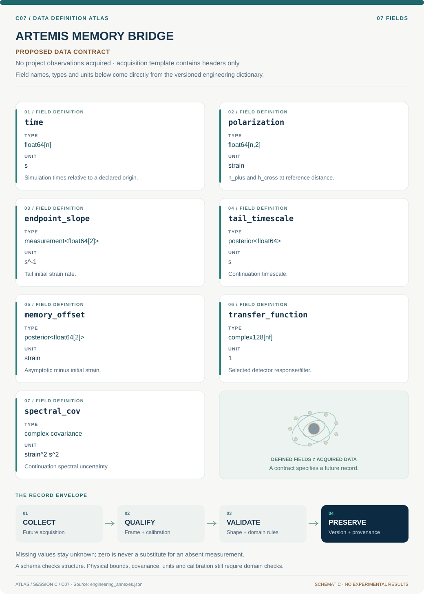

# SESSION C: ASTRONOMY & SPACE PHYSICS

## ATLAS engineering handbook · Revision 3


30 original projects, preserved in their supplied order. Each numbered record has an independently stated design basis, model, data contract and verification plan.

[All engineering documents](../ENGINEERING_DOCUMENTATION.md) · [Session gallery](../research/C/README.md) · [Documentation standard](../engineering/ENGINEERING_STANDARD.md)

## Ordered contents

1. [C01 · APOLLO WINDWATCH](#c01) — The Characterization of EZ CMa
2. [C02 · HUBBLE NIGHTFALL LAB](#c02) — Image Simulations for Testing the Fidelity of SKYSURF Background Measurement Algorithms
3. [C03 · TAURUS MOLECULE TRAIL](#c03) — HCN Mapping of the Taurus Molecular Cloud
4. [C04 · HORIZON TIDAL ECHO](#c04) — A Deep Look at the Nature of Black Holes: Using Tidal Disruption Events to See the Unseeable
5. [C05 · KEPLER WORLDFORGE](#c05) — Exoplanet Classification using Data Mining
6. [C06 · PULSAR GEMINI WATCH](#c06) — The First Magnetar in a Binary System?
7. [C07 · ARTEMIS MEMORY BRIDGE](#c07) — Taperings and Analytic Continuations of Supernova Gravitational Waves with Memory
8. [C08 · MARS NILI SPECTRAL VAULT](#c08) — Laboratory Analysis of olivine-carbonate mixtures as observed on Mars
9. [C09 · EAGLESAT COSMIC PIXEL](#c09) — EagleSat Team: Determining Particle Energy Using CMOS Sensors
10. [C10 · VOYAGER LOCAL GROUP HALOS](#c10) — MW-Andromeda Dark Matter Halo Velocity Dispersion Profiles
11. [C11 · ORION CORE INFERENCE](#c11) — Evaluation of Supernovae Astrophysical Parameters by Using Machine Learning on Laser Interferometric Data
12. [C12 · HUBBLE COSMIC GLOW](#c12) — SKYSURF: Measuring the Brightness of the Sky
13. [C13 · HORIZON RING ATLAS](#c13) — Characterizing the Images of Black Hole Shadows
14. [C14 · ROMAN DARKHOLE ACADEMY](#c14) — Controlling the Unseen: GIG Undergraduate Optical Research
15. [C15 · WEBB PHOTON TRUTH](#c15) — Assessing the Performance of the JWST/NIRCam Image Simulator PhoSim-NIRCam
16. [C16 · ORION STRAIN METROLOGY](#c16) — Gravitational Wave Calibration Error for Supernovae Core Collapse
17. [C17 · GEMINI DISK SENTINEL](#c17) — Investigating the Planet Detection Limit in Debris Disk Images from the Gemini Planet Imager
18. [C18 · REIONIZATION OXYGEN BEACON](#c18) — Characterizing High [OIII]/[OII] and High [OIII] Galaxies to Further LyC Study
19. [C19 · WEBB YOUNG STAR ATMOSPHERES](#c19) — Characterizing the Atmospheres of Low Surface Gravity M-dwarfs
20. [C20 · TRINITY ACCRETION ECHO](#c20) — Predictions for the Observable Autocorrelations of Accreting Black Holes from the Trinity Theoretical Model
21. [C21 · PARKER MAGNETIC TRAIL](#c21) — Identification of Switchback Intervals in Parker Space Probe Data
22. [C22 · HUBBLE GALACTIC EXHALE](#c22) — Measuring Galactic Wind Frequency and Strength as a Function of Environment
23. [C23 · KEPLER METAL WORLDS](#c23) — Investigating the Relationship Between Exoplanet Occurrence & Host Star Metallicity
24. [C24 · APOLLO DUST CLOCK](#c24) — The long-period orbit of the dust-producing Wolf-Rayet binary WR 125
25. [C25 · ORION BURST SENTINEL](#c25) — Improving the Detection of Core-Collapse Supernova Through Experimentation
26. [C26 · LISA PENDULUM PATHFINDER](#c26) — Low Frequency Prototype of Laser Interferometer Suspensions for Gravitational Wave Detection
27. [C27 · SPHEREX COSMIC PRISM](#c27) — SPHEREx: The Future of Satellite Astronomy
28. [C28 · LOWELL LUNAR LANTERN](#c28) — Narrow-band Filter Photometry Calibration for the Lowell 20''
29. [C29 · ACE WIND SHOCK LEDGER](#c29) — Energy Balance at Interplanetary Shocks: In-situ Measurement of the Fraction in Energetic Protons with ACE and Wind
30. [C30 · ARTEMIS FIRST HORIZONS](#c30) — The Origins of Supermassive Black Holes

---

<a id="c01"></a>

## C01 · APOLLO WINDWATCH

**Original project:** The Characterization of EZ CMa

**Session C:** Astronomy & Space Physics

**Document class:** engineering research design and analysis record · **Revision:** 3 · **Date:** 2026-10-02

**Evidence state:** design basis, mathematical formulation and verification plan documented. Project-specific empirical results remain to be acquired; executable shared model demonstrations have their own recorded checks.

[Session C](../research/C/README.md) · [All projects](../ENGINEERING_DOCUMENTATION.md) · [Session handbook](SESSION_C.md) · [← B28](../research/B/B28-astra-biocycle-microalgal-methane-and-net-energy/README.md) · [C02 →](../research/C/C02-hubble-nightfall-lab/README.md)

| Proposed requirements | Specified verification cases | Defined data fields | Cited resources |
| ---: | ---: | ---: | ---: |
| 4 | 4 | 6 | 2 |

[Explore the data blueprint](../research/C/C01-apollo-windwatch/data/README.md) · [Open the figure gallery](../research/C/C01-apollo-windwatch/figures/README.md) · [Download acquisition template](../research/C/C01-apollo-windwatch/data/acquisition.csv) · [Browse the data atlas](../data/README.md)

---

### Purpose and scientific objective

Turn the variability of the Wolf-Rayet star EZ CMa into a discriminating experiment on structured stellar winds. Preserve the original characterization goal while comparing corotating interaction regions, evolving wind clumps, and orbital motion through simultaneous spectroscopy and photometry. The 2023 CHIRON study favors a CIR interpretation over a rapidly precessing binary; this proposal treats that conclusion as evidence to test rather than declaring the system architecture settled.

**Question:** Which changes in line profiles remain coherent with the photometric cycle, and which require evolving wind structures rather than center-of-mass orbital motion?

**Testable hypothesis:** A quasi-periodic wind model will predict withheld line-profile variability better than a single stable radial-velocity orbit, especially when each observing season has independently inferred coherence time.

### 1. Design basis and analysis boundary

The analysis boundary begins with calibrated spectra and independently reduced photometry of EZ CMa and ends with posterior predictions for velocity-resolved line variability. It does not interpret an emission-line centroid as a stellar center-of-mass measurement. The CHIRON paper supplies a target-specific comparator and favors corotating interaction regions; the proposed design tests that interpretation through held-out seasons and line-dependent behavior.

A fidelity ladder starts with equivalent-width and centroid summaries, advances to a shared quasi-periodic latent process, and adds wind advection only when line-formation information is available. Keplerian motion is a competing observation model with separate wind jitter. Raw spectra availability, spectral resolving power, line windows, and contemporaneous photometric coverage remain TBD. A useful outcome can be a documented nonidentifiability boundary rather than an orbital classification.

### 2. Requirements and verification traceability

These are project design requirements or proposed analysis gates. A numerical target is not a NASA requirement unless its controlling source is explicitly identified. “TBD” identifies evidence required before a decision; it is not permission to assume a value. Verification evidence listed here is planned, unless a linked result explicitly records execution.

| ID | Requirement / gate | Engineering rationale | Verification method | Basis / required evidence |
| --- | --- | --- | --- | --- |
| C01-R1 | Every accepted spectrum shall carry wavelength convention, exposure midpoint, barycentric correction and declared time scale. | Daily phase comparisons are vulnerable to timing and wavelength mismatches. | Round-trip timestamp and velocity conversion fixtures. | Proposed data contract; CHIRON observing context. |
| C01-R2 | Exposure integration shall change predicted profile observables by less than 1% under grid refinement, a proposed numerical target. | Short exposures can still smear rapidly evolving substructure. | Double quadrature resolution on representative synthetic profiles. | Proposed convergence target. |
| C01-R3 | Model comparison shall hold out an entire observing season and report predictive density and interval coverage by line. | Adjacent spectra share wind coherence and cannot provide independent validation. | Season-level split audit and posterior prediction tables. | Proposed validation design. |
| C01-R4 | A period claim shall include the spectral window and alternative alias solutions within the searched interval. | Cadence can imitate coherent cycles. | Inject signals through actual observing timestamps. | Proposed period-identifiability requirement. |

### 3. Architecture and controlled interfaces

A spectrum adapter emits wavelength, normalized flux, variance, masks, continuum covariance and exposure interval. A line extractor uses fixed rest wavelengths and common velocity grids, preserving separate line identities. Photometry arrives as flux and its covariance, never as an automatically synchronized phase series. Times are BJD in a declared dynamical time scale where source metadata allow conversion; unavailable corrections retain explicit flags.

The latent-process engine produces time-integrated line responses and photometric predictions. An orbital branch applies the same sampling and nuisance zero points. A wind interpreter converts inferred delays into conditional radii using the beta law; uncertainty in wind speed and formation radius propagates outward. A poor continuum fit therefore broadens profile uncertainty before influencing the coherence or orbital score.


Separate line and photometric interfaces feed matched wind and orbital branches; only measured delays enter the conditional wind-radius interpretation.

[Editable engineering diagram source](../research/C/C01-apollo-windwatch/figures/architecture.mmd)

### 4. Mathematical model and derivation

#### Governing equations

$$
v(t)=\gamma+K[\cos(\nu(t)+\omega)+e\cos\omega]
$$

$$
k(t,t\prime)=A^2\exp[-(t-t\prime)^2/(2\ell^2)-2\sin^2(\pi(t-t\prime)/P)/\Gamma^2]
$$

$$
v(r)=v_\infty[1-R_*/r]^\beta
$$

#### Variables, units and conventions

- t and P in days; barycentric timestamps must use a declared time scale
- v, gamma, K, and terminal wind velocity in km s^-1
- ell is wind-pattern coherence time; Gamma controls periodic smoothness
- Equivalent width in angstrom; normalized line-profile flux is dimensionless
- e, omega, and true anomaly describe an orbital comparator, not established binary parameters

#### Assumptions and boundary conditions

- Treat different spectral lines as different wind-formation regions; a line centroid is not automatically stellar radial velocity.
- Model seasonal zero points and finite exposure integration; allow pattern amplitudes to evolve.

#### Derivation step 1

$$
v=c(\lambda/\lambda_0-1)
$$

Use the nonrelativistic Doppler approximation consistently for local line coordinates; this coordinate is a gas velocity, not an automatically measured stellar velocity.

#### Derivation step 2

$$
W=\int(1-F_\lambda/F_c)\,d\lambda
$$

Define absorption equivalent width as positive, hence emission is negative. Integrate continuum and pixel covariance with the same line-window weights.

#### Derivation step 3

$$
y_\ell(t)=a_\ell x(t-\Delta_\ell)+b_\ell+\epsilon_\ell
$$

Connect a shared stochastic pattern to each line through amplitude and delay. Integrate this model over the exposure before comparing samples.

#### Derivation step 4

$$
\Delta t_{12}=\int_{r_1}^{r_2}dr/[v_\infty(1-R_*/r)^\beta]
$$

Convert a positive outer-line delay into an advection hypothesis only when the formation regions satisfy r2>r1>R*. Radius uncertainty is an input to this integral.

#### Inference or simulation procedure

Extract equivalent widths, line bisectors, skewness, and velocity-resolved residuals from wavelength-calibrated spectra. Fit a shared latent quasi-periodic process with line-specific response coefficients and a Student-t residual model, then compare with an orbital model and a nonperiodic stochastic baseline. Use generalized Lomb-Scargle peaks only to initialize priors; inspect the observing window before interpreting aliases. Connect fitted coherence and line delays to a beta-law wind as an interpretive layer, with uncertainty in the line-formation radii.

#### Validity domain and fidelity limits

The beta law is a phenomenological wind description. Emission-line transfer, clumping, and inclination can imitate orbital signatures; model preference does not by itself establish rotation rate or companion absence.

### 5. Data specifications and provenance


**Proposed data contract · observations pending.** This visual inventory shows the record fields to acquire or derive. It contains no project measurements. [Open the data blueprint and downloads](../research/C/C01-apollo-windwatch/data/README.md).

| Field | Type | Unit | Physical / statistical meaning | Quality and missing-data rule |
| --- | --- | --- | --- | --- |
| epoch | float64 | BJD | Barycentric exposure midpoint. | Null until time scale and correction are documented. |
| exposure | float64[2] | day | Start and end in the common time system. | End must exceed start. |
| velocity | float64[n] | km s^-1 | Line-relative gas velocity grid. | Rest wavelength and air/vacuum convention required. |
| profile | float64[n] | 1 | Continuum-normalized line flux. | Masked pixels stay missing; no zero filling. |
| profile_cov | float64[n,n] | 1 | Pixel and continuum covariance. | Symmetric positive semidefinite; preserve shared continuum terms. |
| line_delay | posterior<float64> | day | Conditional response delay relative to a named reference line. | Report multimodality and reference-line identity. |

[Machine-readable record schema](../research/C/C01-apollo-windwatch/data/schema.json) · [Empty acquisition CSV](../research/C/C01-apollo-windwatch/data/acquisition.csv) · [Field dictionary CSV](../research/C/C01-apollo-windwatch/data/dictionary.csv)

The CSV above contains column headers only. Its schema defines future records and does not establish that original-team data or a particular archive product have been acquired. Frame, timing, calibration, covariance, selection and provenance details must accompany populated records.

#### CHIRON study and associated publication material

[Product, archive or reference](https://arxiv.org/abs/2310.15986)

**Fields:** Observing epochs, radial velocities, line definitions, fitted comparison models

**Access:** Paper is open; inspect its data statement and request unavailable spectra before claiming reproduction.

**Role:** Baseline interpretation and target-specific comparison.

#### MAST mission holdings

[Product, archive or reference](https://archive.stsci.edu/)

**Fields:** Available target photometry, exposure metadata, quality flags

**Access:** Search target aliases; specific EZ CMa holdings and saturation behavior require verification.

**Role:** Independent photometry if scientifically usable.

### 6. Uncertainty, sensitivity and identifiability

Continuum placement, wavelength drift and line blending introduce correlated errors across profile bins. Instrument-season zero points can mimic slow orbital changes, while finite pattern coherence can imitate a drifting period. Infer shared wavelength shifts separately from line-specific variability and inspect posterior covariance between period, coherence time and delay. A Gaussian-process amplitude must not absorb every unmodeled calibration failure.

Wind interpretation depends on beta, terminal speed, inclination and poorly known formation radii. Examine sensitivity by fixing each formation-radius prior in turn and comparing the delay likelihood; if many radius combinations produce the same delays, retain the observable delays as the result. Compare the orbital and wind branches with identical noise and sampling operators so model preference measures physical predictive power rather than differing flexibility.

### 7. Engineering trade study

| Alternative | Benefit | Cost / limitation | Decision rule |
| --- | --- | --- | --- |
| Line moments | Cheap, interpretable temporal summary. | Moving subfeatures can cancel in a centroid. | Use for baseline and observing-window exploration. |
| Velocity-resolved latent process | Retains substructure and line delays. | Higher covariance dimension and continuum sensitivity. | Adopt when held-out profiles improve beyond moment predictions. |
| Parameterized CIR transfer | Connects geometry to wind motion. | Formation radii and transfer physics may be unavailable. | Attempt only with independent wind constraints; otherwise label exploratory. |

### 8. Verification and validation cases

| Case ID | Stimulus / condition | Expected result / criterion | Method | Evidence artifact |
| --- | --- | --- | --- | --- |
| C01-V1 | Uniform Doppler shift | All synthetic line centroids move by the imposed shift while equivalent widths remain unchanged apart from discretization. | Translate profiles and refine wavelength sampling. | Doppler coordinate and equivalent-width conservation. |
| C01-V2 | Coherence-free null | A nonperiodic injected series must not systematically favor a narrow period. | Generate through actual timestamp gaps and compare seasonal predictions. | Declared false-period baseline; no measured outcome claimed. |
| C01-V3 | Exposure-smearing check | Integrated predictions converge to the instantaneous model as duration tends to zero. | Analytic constant and sinusoidal exposure integrals. | Exposure observation operator. |
| C01-V4 | Held-out wind season | Intervals and residual correlations are reported without retuning line windows. | Freeze preprocessing, then predict a withheld season. | Proposed independent validation. |

**Execution status:** these cases are specified, not claimed as executed. Close a case only with the versioned inputs, output, uncertainty, reviewer and pass/fail rationale.

#### Additional scientific validation gates

- Hold out entire observing seasons and compare predictive log likelihood, not only in-sample period significance.
- Inject orbital shifts into real residual spectra and measure detection power versus semi-amplitude.
- Require nominal 90% predictive intervals to achieve compatible coverage in blocked simulations; report sensitivity to priors and excluded nights.

### 9. Implementation and reproducible work packages

1. Create a spectrum-manifest schema with line rest wavelengths and timing provenance.
2. Implement continuum fitting with covariance-aware line extraction.
3. Build exposure-integrated quasi-periodic and orbital likelihoods sharing nuisance terms.
4. Generate cadence-preserving injection fixtures and alias reports.
5. Fit line-delay posteriors and an optional beta-law integration module.
6. Publish seasonal predictive tables, posterior draws and a parameter-identifiability ledger.

#### Investigation sequence

1. Freeze target aliases, time conversions, line masks, and seasonal train/test splits in a manifest.
2. Reprocess a pilot season and quantify continuum-placement and wavelength-zero-point errors.
3. Fit the competing models; simulate each through the actual cadence and exposure durations.
4. Rank proposed new observing times by expected information gain between models.

#### Resources and interfaces to expertise

- Astropy time and spectral tools; Gaussian-process sampler; spectroscopy mentor; access to a stable spectrograph.

### 10. Failure modes and interpretation controls

| Failure mode | Effect on result | Detection / evidence | Design response |
| --- | --- | --- | --- |
| Alias chosen as rotation | Incorrect physical timescale. | Window-function peaks and multimodal posterior. | Retain alias branches and extend temporal baseline. |
| Continuum drift mistaken for wind | False equivalent-width variation. | Off-line residuals correlate with line observables. | Model continuum covariance and reject poor calibrations. |
| Orbital overinterpretation | Gas changes reported as stellar motion. | Line-to-line centroid inconsistency. | Use line-specific responses and conditional terminology. |

- Saturation, weather aliases, and changing line morphology may dominate. A useful outcome includes a quantified inability to distinguish models.

### 11. Required engineering outputs

- Reproducible variability atlas, competing-model posterior tables, alias map, and observation-priority schedule.

#### Scientific result figures to produce during execution

Phase versus velocity residual maps for several lines beside season-held-out photometric predictions; simulated and observed panels clearly labeled.

### 12. Cited technical and scientific resources

- [Barclay et al. (2023), CHIRON test of EZ CMa precessing orbit](https://arxiv.org/abs/2310.15986) — Target periodicity and competing CIR/binary interpretations.
- [MAST mission archive](https://archive.stsci.edu/) — Archive discovery route; does not prove target data availability.

Framework and evidence rules: [engineering documentation standard](../engineering/ENGINEERING_STANDARD.md), [model assurance](../engineering/MODEL_ASSURANCE.md), [uncertainty procedure](../engineering/UNCERTAINTY_AND_DECISION_RULES.md), [data management](../engineering/DATA_MANAGEMENT.md). NASA-inspired names are creative identifiers; requirements and results are not NASA certification.

---

<a id="c02"></a>

## C02 · HUBBLE NIGHTFALL LAB

**Original project:** Image Simulations for Testing the Fidelity of SKYSURF Background Measurement Algorithms

**Session C:** Astronomy & Space Physics

**Document class:** engineering research design and analysis record · **Revision:** 3 · **Date:** 2026-10-02

**Evidence state:** design basis, mathematical formulation and verification plan documented. Project-specific empirical results remain to be acquired; executable shared model demonstrations have their own recorded checks.

[Session C](../research/C/README.md) · [All projects](../ENGINEERING_DOCUMENTATION.md) · [Session handbook](SESSION_C.md) · [← C01](../research/C/C01-apollo-windwatch/README.md) · [C03 →](../research/C/C03-taurus-molecule-trail/README.md)

| Proposed requirements | Specified verification cases | Defined data fields | Cited resources |
| ---: | ---: | ---: | ---: |
| 4 | 4 | 7 | 3 |

[Explore the data blueprint](../research/C/C02-hubble-nightfall-lab/data/README.md) · [Open the figure gallery](../research/C/C02-hubble-nightfall-lab/figures/README.md) · [Download acquisition template](../research/C/C02-hubble-nightfall-lab/data/acquisition.csv) · [Browse the data atlas](../data/README.md)

---

### Purpose and scientific objective

Build a controlled image laboratory for absolute sky estimation in Hubble exposures. The scientific asset is a response surface showing where a sky algorithm becomes biased by faint galaxy wings, gradients, detector persistence, cosmic rays, or correlated resampling noise. Use published SKYSURF methods and released products as baselines; independently generated synthetic truth must remain distinct from archival sky measurements.

**Question:** Under which combinations of source crowding, sky gradient, detector noise, and masking does each estimator recover the inserted object-free sky within a declared uncertainty?

**Testable hypothesis:** An estimator selected by scene diagnostics and calibrated on independent synthetic families will outperform a single global estimator without introducing unreported scene-dependent bias.

### 1. Design basis and analysis boundary

The simulator defines truth in detector electron rate before exposure integration and resampling. Its principal product is an estimator response surface over source wings, source density, gradients and detector artifacts. The reference sky is B0 at a declared detector coordinate; spatial mean and minimum sky remain separately named estimands. SKYSURF release products provide realistic morphology and processing context, but archival pixels never become synthetic truth.

Begin with flat sky and point sources, then add extended profiles, detector defects and drizzle covariance. A final generator uses independently held-out morphologies rather than the same analytic galaxy family used to tune clipping. Proposed bias targets apply within a documented scene envelope; source populations below detection remain explicit assumptions. The architecture supports a failed-domain mask where no estimator meets the target.

### 2. Requirements and verification traceability

These are project design requirements or proposed analysis gates. A numerical target is not a NASA requirement unless its controlling source is explicitly identified. “TBD” identifies evidence required before a decision; it is not permission to assume a value. Verification evidence listed here is planned, unless a linked result explicitly records execution.

| ID | Requirement / gate | Engineering rationale | Verification method | Basis / required evidence |
| --- | --- | --- | --- | --- |
| C02-R1 | Every scene shall distinguish sky, source electron rate, dark current and read noise before resampling. | Adding noise after drizzle loses detector and covariance structure. | Component-sum and noise-placement audit. | Proposed truth contract. |
| C02-R2 | Flat-sky fractional bias shall remain below 1% in the preregistered benchmark envelope, a proposed target. | Absolute sky work needs bias control beyond pixel precision. | Monte Carlo confidence interval on mean recovered bias. | Proposed target informed by SKYSURF method context. |
| C02-R3 | Estimator output shall state whether it targets reference, minimum or spatial mean sky. | Gradient comparisons otherwise mix distinct truths. | Schema and gradient analytic fixtures. | Proposed estimand requirement. |
| C02-R4 | Holdout scenes shall use unseen morphology generators and detector configurations. | Tuning to one morphology can hide wing leakage. | Generator and configuration split manifest. | Proposed transferability requirement. |

### 3. Architecture and controlled interfaces

The scene contract contains sky-rate maps, catalog profiles, PSF kernels and detector parameters with units attached. A detector sampler generates Poisson electrons plus read noise, persistence and cosmic-ray components. Calibration and resampling receive those frames together with masks, gain and weights. A covariance adapter records the linear resampling matrix or a validated local covariance representation.

An estimator runner consumes exactly the same processed frame and mask for each method. It emits a scalar or spatial sky estimate, uncertainty, remaining area and diagnostic flags. The evaluation engine compares each output to the matching truth transformed through the same processing. An emulator receives scenario parameters and recovery errors, while a withheld-generator evaluator remains independent of fitting that emulator.


Synthetic truth enters before detector sampling; covariance and named sky estimands remain explicit through drizzle and estimator comparison.

[Editable engineering diagram source](../research/C/C02-hubble-nightfall-lab/figures/architecture.mmd)

### 4. Mathematical model and derivation

#### Governing equations

$$
D_{ij}\sim\mathrm{Poisson}\{t[B_{ij}+\sum_s(F_s\otimes P)_{ij}+d_{ij}]\}+\mathcal N(0,\sigma_R^2)
$$

$$
B_{ij}=B_0+g_xx_i+g_yy_j+B_{\rm stray}(x_i,y_j)
$$

$$
b=(\hat B-B_0)/B_0;\quad \mathrm{RMSE}=\sqrt{\langle(\hat B-B_0)^2\rangle}
$$

#### Variables, units and conventions

- D in electrons; t in seconds; B and dark current d in electrons s^-1 pixel^-1
- F_s is source electron-rate image; P is normalized point spread function
- g_x and g_y in electron-rate per pixel-coordinate unit
- sigma_R in electrons; covariance is added after resampling
- b is fractional bias; truth B0 is the designated minimum or reference sky, explicitly defined

#### Assumptions and boundary conditions

- Simulate detector exposures before drizzling; account for gain and sky-preserving processing.
- The minimum estimated sky and spatial mean sky are different estimands when gradients exist.

#### Derivation step 1

$$
\mu_{ij}=t(B_{ij}+S_{ij}+d_{ij})
$$

All terms are electron rates per pixel, giving dimensionless expected electron counts. Normalize PSF convolution so source counts are conserved at the declared image boundary.

#### Derivation step 2

$$
\operatorname{Var}(D_{ij})=\mu_{ij}+\sigma_R^2
$$

Independent Poisson and read-noise variances add before calibration; persistence or shared electronics require additional covariance.

#### Derivation step 3

$$
\Sigma_y=A\Sigma_DA^T
$$

A is the declared linear resampling operator including normalization. It changes covariance even when the uniform sky value is preserved.

#### Derivation step 4

$$
b=(\widehat B-B_{\rm ref})/B_{\rm ref}
$$

Use fractional bias only for positive reference sky. Report absolute error separately when B_ref is zero or a gradient changes the relevant estimand.

#### Inference or simulation procedure

Generate Latin-hypercube scenes spanning sky level, galaxy size and faint-end counts, PSF wings, detector position, and contamination. Propagate Poisson and read noise before applying the same resampling used for observations. Benchmark percentile clipping, ProFound-style masking, robust grid medians, and a preregistered adaptive combination. Fit a bias emulator with uncertainty rather than correcting every image by a point estimate. Keep unseen morphology generators and detector configurations exclusively for testing.

#### Validity domain and fidelity limits

Synthetic truth depends on assumptions about undetected sources and artifacts. Algorithm precision can exceed absolute photometric accuracy; successful simulation recovery is not evidence for a cosmological diffuse component.

### 5. Data specifications and provenance


**Proposed data contract · observations pending.** This visual inventory shows the record fields to acquire or derive. It contains no project measurements. [Open the data blueprint and downloads](../research/C/C02-hubble-nightfall-lab/data/README.md).

| Field | Type | Unit | Physical / statistical meaning | Quality and missing-data rule |
| --- | --- | --- | --- | --- |
| scene_seed | uint64 | 1 | Random stream seed and generator version. | Unique scenario ID; preserve independent noise substreams. |
| sky_rate | float64[h,w] | electron s^-1 pixel^-1 | Object-free inserted sky. | Nonnegative; reference coordinate recorded. |
| source_catalog | table | mixed declared | Flux, morphology and positions. | Flux convention and truncated wings documented. |
| detector_frame | float64[h,w] | electron | Noisy exposure before resampling. | Missing pixels use mask, never sky-valued fill. |
| resample_operator | sparse<float64> | 1 | Mapping from detector to analysis pixels. | Row normalization checked for uniform sky. |
| sky_estimate | struct<float64,cov> | electron s^-1 pixel^-1 | Estimator output with estimand label. | Covariance must include resampling dependence. |
| usable_fraction | float64 | 1 | Area surviving all masks. | Bounded from zero to one; zero area invalidates estimate. |

[Machine-readable record schema](../research/C/C02-hubble-nightfall-lab/data/schema.json) · [Empty acquisition CSV](../research/C/C02-hubble-nightfall-lab/data/acquisition.csv) · [Field dictionary CSV](../research/C/C02-hubble-nightfall-lab/data/dictionary.csv)

The CSV above contains column headers only. Its schema defines future records and does not establish that original-team data or a particular archive product have been acquired. Frame, timing, calibration, covariance, selection and provenance details must accompany populated records.

#### SKYSURF HLSP

[Product, archive or reference](https://archive.stsci.edu/hlsp/skysurf)

**Fields:** Calibrated mosaics, catalogs, masks or available product metadata

**Access:** Public product page; enumerate exact versions, filters, and downloadable files before ingestion.

**Role:** Realistic scene and comparison-product discovery.

#### Independent synthetic detector scenes

[Product, archive or reference](https://arxiv.org/abs/2205.06214)

**Fields:** Inserted sky, source catalog, detector settings, random seed, estimator output

**Access:** Generate locally; release recipes and small fixtures with provenance.

**Role:** Known truth for algorithm validation.

### 6. Uncertainty, sensitivity and identifiability

Unresolved source counts, extended galaxy wings and persistence history determine whether simulated scenes span the observations. Treat those inputs as scenario uncertainty rather than reducing them through repeated noise draws. Separate variation between scene realizations from Monte Carlo variance within a fixed scene. Allocate enough noise replicates to resolve the proposed bias target, using estimated variance to determine sample count rather than assuming a fixed count proves precision.

Mask growth and estimator tuning can compensate for each other. Use factorial contrasts or Sobol-style sensitivities to locate dominant interactions between sky level, galaxy size and unmasked area. An uncertainty emulator must include held-out prediction error; outside its training envelope, return an unsupported-domain flag. A successful flat-sky test does not constrain bias from missing diffuse wings.

### 7. Engineering trade study

| Alternative | Benefit | Cost / limitation | Decision rule |
| --- | --- | --- | --- |
| Robust grid median | Fast, resistant to isolated bright pixels. | Wings contaminate many grid cells. | Choose where contamination occupies a minority of cells and gradient diagnostics pass. |
| Explicit source masking | Uses morphology to remove wings. | Mask incompleteness and area loss. | Choose when source models improve held-out bias without excessive lost area. |
| Low-percentile estimator | Can reject broad positive contamination. | Noise and minimum-versus-mean bias. | Calibrate through noiseless and noisy gradients; never compare to an unmatched mean. |

### 8. Verification and validation cases

| Case ID | Stimulus / condition | Expected result / criterion | Method | Evidence artifact |
| --- | --- | --- | --- | --- |
| C02-V1 | Uniform noiseless scene | Recovered sky equals B0 within floating-point/resampling error. | Pass a constant map through every pipeline stage. | Constant-preserving operator. |
| C02-V2 | Poisson/read-noise scene | Sample mean and variance approach mu and mu+sigma_R squared. | Independent replicated detector draws with convergence intervals. | Analytic count moments. |
| C02-V3 | Linear gradient | Reference and spatial-mean truths differ by the analytic coordinate average. | Inject a known slope and compare named estimands. | Specified B(x,y). |
| C02-V4 | Unknown galaxy wings | Bias and coverage are reported for a withheld profile generator. | Freeze tuning and evaluate independent scenes. | Proposed holdout requirement. |

**Execution status:** these cases are specified, not claimed as executed. Close a case only with the versioned inputs, output, uncertainty, reviewer and pass/fail rationale.

#### Additional scientific validation gates

- Report signed bias, scatter, and interval coverage by sky gradient and crowding, including rare failure tails.
- Hold out galaxy morphology libraries and entire filters; test covariance-aware uncertainty against independent noise realizations.
- Compare pairs of real exposures for repeatability, recognizing that repeatability cannot establish absolute truth.

### 9. Implementation and reproducible work packages

1. Write scene and estimand manifests with explicit detector units.
2. Implement count-conserving source rendering and a component truth ledger.
3. Apply calibrated detector sampling and pinned resampling code.
4. Implement common-mask estimator adapters and diagnostic outputs.
5. Fit a scenario bias emulator with withheld morphology tests.
6. Release small deterministic fixtures, recovery tables and unsupported-domain maps.

#### Investigation sequence

1. Define the required sky estimand and allocate separate budgets to estimator bias and absolute calibration.
2. Build exposure-level scenes and a common estimator interface; freeze test seeds before optimization.
3. Sweep scene complexity and masking dilation; store failure cases rather than removing them.
4. Choose operational quality flags from diagnostics whose thresholds are fixed using training scenes only.

#### Resources and interfaces to expertise

- Python image simulation, Astropy, instrument PSF and detector references; moderate workstation or batch compute.

### 10. Failure modes and interpretation controls

| Failure mode | Effect on result | Detection / evidence | Design response |
| --- | --- | --- | --- |
| Sky subtracted during calibration | Target signal removed. | Uniform-scene end-to-end check. | Disable subtraction or preserve and restore its recorded map. |
| Noise added after drizzle | Underestimated estimator uncertainty. | Adjacent-pixel covariance mismatch. | Sample detector noise first and propagate weights. |
| Synthetic wing truncation | Optimistic faint-source rejection. | Bias changes with enlarged scene padding. | Increase padding and disclose source-envelope limits. |

- Unmodeled faint wings and persistence can look like diffuse sky. Correlated pixels invalidate naive pixel-count standard errors.

### 11. Required engineering outputs

- Versioned simulation catalog, estimator benchmark, bias surfaces, and deployable quality-flag specification.

#### Scientific result figures to produce during execution

Estimator fractional bias versus crowding and gradient, with interval coverage and representative inserted-truth images.

### 12. Cited technical and scientific resources

- [Windhorst et al. (2022), SKYSURF overview and methods](https://arxiv.org/abs/2205.06214) — Simulation and sky-preservation design precedent.
- [OBrien et al. (2022), SKYSURF-4 methods](https://arxiv.org/abs/2210.08010) — Published background measurement comparator.
- [SKYSURF high-level science products](https://archive.stsci.edu/hlsp/skysurf) — Public release discovery and provenance.

Framework and evidence rules: [engineering documentation standard](../engineering/ENGINEERING_STANDARD.md), [model assurance](../engineering/MODEL_ASSURANCE.md), [uncertainty procedure](../engineering/UNCERTAINTY_AND_DECISION_RULES.md), [data management](../engineering/DATA_MANAGEMENT.md). NASA-inspired names are creative identifiers; requirements and results are not NASA certification.

---

<a id="c03"></a>

## C03 · TAURUS MOLECULE TRAIL

**Original project:** HCN Mapping of the Taurus Molecular Cloud

**Session C:** Astronomy & Space Physics

**Document class:** engineering research design and analysis record · **Revision:** 3 · **Date:** 2026-10-02

**Evidence state:** design basis, mathematical formulation and verification plan documented. Project-specific empirical results remain to be acquired; executable shared model demonstrations have their own recorded checks.

[Session C](../research/C/README.md) · [All projects](../ENGINEERING_DOCUMENTATION.md) · [Session handbook](SESSION_C.md) · [← C02](../research/C/C02-hubble-nightfall-lab/README.md) · [C04 →](../research/C/C04-horizon-tidal-echo/README.md)

| Proposed requirements | Specified verification cases | Defined data fields | Cited resources |
| ---: | ---: | ---: | ---: |
| 4 | 4 | 7 | 3 |

[Explore the data blueprint](../research/C/C03-taurus-molecule-trail/data/README.md) · [Open the figure gallery](../research/C/C03-taurus-molecule-trail/figures/README.md) · [Download acquisition template](../research/C/C03-taurus-molecule-trail/data/acquisition.csv) · [Browse the data atlas](../data/README.md)

---

### Purpose and scientific objective

Map dense-gas kinematics while explicitly testing whether hydrogen cyanide hyperfine anomalies undermine common optical-depth estimates. Focus first on a declared Taurus filament rather than assuming a cloud-wide survey already exists. Combine HCN spectra with an independent density or velocity tracer to determine when a simple excitation fit is adequate and when non-LTE transfer is necessary.

**Question:** Can HCN hyperfine spectra distinguish coherent filament inflow from excitation anomalies, optical-depth structure, and overlapping velocity components?

**Testable hypothesis:** A non-LTE, hyperfine-aware forward model jointly constrained by an independent tracer will reduce false claims of infall compared with a shared-excitation-temperature fit.

### 1. Design basis and analysis boundary

The HCN analysis boundary is a calibrated spectral cube for a declared Taurus region, plus independent tracer or dust constraints. It outputs posterior component velocities, optical-depth diagnostics and conditional excitation parameters. A cloud-wide map is not assumed available. The HCN anomaly publication establishes why hyperfine ratios require checking before a common-excitation fit is interpreted physically.

The fidelity ladder moves from a shared-Tex hyperfine profile to multiple kinematic components and then a hyperfine-resolved non-LTE calculation. Higher fidelity is justified by predictive residuals and adequate collisional data, not by an automatic preference for complexity. Telescope beam efficiency, spectral response and source coverage remain TBD. Dense-gas mass is excluded unless abundance and geometry acquire independent constraints.

### 2. Requirements and verification traceability

These are project design requirements or proposed analysis gates. A numerical target is not a NASA requirement unless its controlling source is explicitly identified. “TBD” identifies evidence required before a decision; it is not permission to assume a value. Verification evidence listed here is planned, unless a linked result explicitly records execution.

| ID | Requirement / gate | Engineering rationale | Verification method | Basis / required evidence |
| --- | --- | --- | --- | --- |
| C03-R1 | Rest frequencies and hyperfine offsets shall be pinned to a laboratory catalog version. | Frequency errors directly bias component velocities. | Catalog-version audit and frequency-to-velocity fixture. | CDMS is the existing rest-frequency source. |
| C03-R2 | Convolved synthetic spectra shall conserve integrated line brightness to 0.5%, a proposed numerical target. | Spectral smoothing must not change optical-depth diagnostics. | Kernel normalization and grid-refinement test. | Proposed integration target. |
| C03-R3 | Tracer comparisons shall use a common effective beam and velocity convention. | Different resolutions can fabricate filament gradients. | Beam convolution and LSR convention audit. | Proposed comparison contract. |
| C03-R4 | An inflow interpretation shall include a multiple-component and excitation-anomaly alternative. | Asymmetry alone is not a unique kinematic indicator. | Posterior predictive comparison in withheld positions. | Proposed scientific requirement. |

### 3. Architecture and controlled interfaces

The cube adapter supplies RA/Dec, beam, channel frequencies, main-beam brightness, channel covariance and flags. A laboratory-frequency service provides hyperfine transitions and uncertainties. Spectral fitting works in a declared LSR frame with the instrument response applied to every prediction. An independent-tracer adapter carries its own beam and calibration metadata; maps are convolved before cross-tracer inference.

A transfer engine evaluates shared-excitation and non-LTE branches. A component selector retains alternate line-of-sight decompositions rather than collapsing ambiguous spectra into moment centroids. The map assembler propagates component-membership and shared calibration covariance into spatial gradients. Missing channels and baseline failures therefore affect both local excitation and the uncertainty of any global filament flow.



Hyperfine transfer and competing components precede spatial flow inference; independent tracers constrain only the parameters their resolution supports.

[Editable engineering diagram source](../research/C/C03-taurus-molecule-trail/figures/architecture.mmd)

### 4. Mathematical model and derivation

#### Governing equations

$$
T_B(v)=[J_\nu(T_{\rm ex})-J_\nu(T_{\rm bg})][1-e^{-\tau(v)}]
$$

$$
J_\nu(T)=(h\nu/k)/(e^{h\nu/(kT)}-1)
$$

$$
\tau(v)=\sum_h\tau_h\exp[-(v-v_0-\Delta v_h)^2/(2\sigma_v^2)]
$$

#### Variables, units and conventions

- Brightness temperature TB and Tex in K; frequency nu in Hz
- Line velocity, centroid v0, hyperfine offsets, and sigma_v in km s^-1
- Optical depth tau dimensionless; column density in cm^-2
- H2 number density in cm^-3; kinetic temperature distinct from excitation temperature
- Beam filling fraction and spectral response must be included in the observation operator

#### Assumptions and boundary conditions

- The displayed common-Tex expression is a baseline, not a guarantee that HCN hyperfine excitation is LTE.
- Spatial resolution and tracer beam sizes are matched before comparing maps.

#### Derivation step 1

$$
J_\nu(T)=\frac{h\nu/k}{\exp(h\nu/kT)-1}
$$

This radiation temperature has units kelvin and approaches T in the Rayleigh-Jeans limit h nu much smaller than kT.

#### Derivation step 2

$$
T_B=\eta_f[J_\nu(T_{ex})-J_\nu(T_{bg})](1-e^{-\tau})
$$

Insert beam filling eta_f explicitly. Brightness constrains a product of filling and excitation; optically thick lines saturate in tau.

#### Derivation step 3

$$
\tau(v)=\sum_h\tau_h\exp[-(v-v_0-\Delta v_h)^2/(2\sigma_v^2)]
$$

A shared centroid and width connect hyperfine transitions only in the baseline. Independent excitation or overlap can invalidate fixed relative tau_h.

#### Derivation step 4

$$
\frac{dv_0}{ds}\approx\frac{v_0(s_2)-v_0(s_1)}{s_2-s_1}
$$

Convert angular separation to projected distance using an uncertain Taurus distance. Sample both component identity and spatial covariance before interpreting the gradient.

#### Inference or simulation procedure

Fit the baseline to obtain residual diagnostics, then solve statistical equilibrium with hyperfine-resolved collisional rates and line overlap where available. Compare single-component and multi-component spectra using predictive checks, not only moment maps. Estimate filament gradients from posterior centroid samples with spatial covariance. Calibrate intensity to main-beam temperature using documented efficiencies. Use dust or an optically thinner molecular tracer to constrain temperature, column, and abundance degeneracies; do not turn HCN intensity directly into a universal dense-gas mass.

#### Validity domain and fidelity limits

Abundance, depletion, electron excitation, beam dilution, and transfer geometry are weakly identifiable from one transition. An apparent blue asymmetry alone is insufficient to establish accretion.

### 5. Data specifications and provenance


**Proposed data contract · observations pending.** This visual inventory shows the record fields to acquire or derive. It contains no project measurements. [Open the data blueprint and downloads](../research/C/C03-taurus-molecule-trail/data/README.md).

| Field | Type | Unit | Physical / statistical meaning | Quality and missing-data rule |
| --- | --- | --- | --- | --- |
| sky_position | float64[2] | degree ICRS | Cube pixel coordinate. | WCS and distance assumption required. |
| channel_velocity | float64[n] | km s^-1 LSR | Velocity channels with declared LSR definition. | Rest frequency and Doppler convention mandatory. |
| brightness | float64[n] | K main-beam | Baseline-subtracted spectrum. | Mask bad channels; preserve negative noise realizations. |
| spectral_cov | float64[n,n] | K^2 | Thermal and baseline covariance. | Do not infer independent channels after smoothing. |
| beam | struct<float64> | arcsec, degree | Major/minor FWHM and position angle. | Match before any cross-tracer ratio. |
| component_velocity | posterior<float64[]> | km s^-1 | Alternative kinematic-component centroids. | Ambiguous assignments retain probability weights. |
| excitation_state | posterior<struct> | K, cm^-3, 1 | Tex or non-LTE density/temperature/tau parameters. | Upper/lower bounds and prior dependence reported. |

[Machine-readable record schema](../research/C/C03-taurus-molecule-trail/data/schema.json) · [Empty acquisition CSV](../research/C/C03-taurus-molecule-trail/data/acquisition.csv) · [Field dictionary CSV](../research/C/C03-taurus-molecule-trail/data/dictionary.csv)

The CSV above contains column headers only. Its schema defines future records and does not establish that original-team data or a particular archive product have been acquired. Frame, timing, calibration, covariance, selection and provenance details must accompany populated records.

#### HCN anomaly survey publication

[Product, archive or reference](https://arxiv.org/abs/1305.1303)

**Fields:** Hyperfine ratios, target list, line measurements, observing setup

**Access:** Open paper; original spectral cubes may require author or telescope archive access.

**Role:** Empirical anomaly benchmark.

#### Cologne spectroscopy laboratory data

[Product, archive or reference](https://cdms.astro.uni-koeln.de/classic/cologne_data)

**Fields:** HCN frequencies, uncertainties, spectroscopic constants, fitting references

**Access:** Public laboratory discovery page; select main-isotope state and document catalog version.

**Role:** Rest-frequency provenance.

#### New or recovered Taurus cube

[Product, archive or reference](https://baas.aas.org/pub/2025n4i414p05/release/1?readingCollection=db75f3fa)

**Fields:** RA, Dec, LSR velocity, TB, variance, beam, flags

**Access:** Conference abstract describes an HCN mapping effort; it is not proof of a downloadable cube.

**Role:** Candidate collaboration/data lead.

### 6. Uncertainty, sensitivity and identifiability

Optical depth, excitation temperature and beam filling are strongly covariant; an optically thick brightness plateau cannot determine tau. HCN abundance and depletion add another degeneracy between molecular column and total gas. Propagate telescope gain as a shared scale parameter across pixels rather than independent pixel noise, and represent baseline-polynomial uncertainty as a channel-correlated term.

Test identifiability with synthetic low-tau and saturated spectra, varying filling and density over the prior domain. Compare likelihood singular directions and posterior changes when an independent temperature or optically thinner tracer is added. Hyperfine collision-rate and geometry uncertainty belong to model discrepancy. Report robust velocities separately from conditional column or density values when additional transitions cannot break the degeneracy.

### 7. Engineering trade study

| Alternative | Benefit | Cost / limitation | Decision rule |
| --- | --- | --- | --- |
| Shared-Tex hyperfine fit | Rapid, interpretable anomaly residuals. | Fails under unequal excitation and overlapping components. | Keep where residuals are noise-consistent on held-out channels. |
| Multiple velocity components | Captures blended filaments. | Component labels and opacity can exchange roles. | Use when independent tracer velocities support decomposition. |
| Non-LTE transfer | Models density-sensitive populations. | Collision rates and geometry may be incomplete. | Adopt only with available rates and demonstrable predictive improvement. |

### 8. Verification and validation cases

| Case ID | Stimulus / condition | Expected result / criterion | Method | Evidence artifact |
| --- | --- | --- | --- | --- |
| C03-V1 | Thin-limit expansion | Brightness approaches eta_f(Jex-Jbg)tau for tau tending to zero. | Compare exact and first-order expressions over decreasing tau. | Taylor expansion of radiative transfer. |
| C03-V2 | Thick-limit saturation | Brightness approaches eta_f(Jex-Jbg), independent of larger tau. | Synthetic high-tau channel evaluation. | Analytic transfer limit. |
| C03-V3 | Two-component blend | Posterior includes ambiguity rather than a falsely precise single flow. | Inject separated and overlapping hyperfine spectra through measured channel response. | Proposed identifiability test. |
| C03-V4 | Withheld map positions | Gradient prediction is assessed away from fit positions. | Spatial block holdout with matched beams. | Proposed spatial validation. |

**Execution status:** these cases are specified, not claimed as executed. Close a case only with the versioned inputs, output, uncertainty, reviewer and pass/fail rationale.

#### Additional scientific validation gates

- Recover known gradients from synthetic cubes processed through the measured beam and channel response.
- Hold out contiguous sky tiles; require predictive residuals to be compatible with measured line-free noise.
- Repeat inference after removing severely anomalous components and changing abundance priors.

### 9. Implementation and reproducible work packages

1. Create cube manifest with telescope efficiency, WCS and LSR metadata.
2. Load versioned laboratory transitions and hyperfine uncertainty tables.
3. Implement response-convolved baseline transfer and multi-component fits.
4. Add non-LTE solver only after collision-rate provenance review.
5. Build posterior map and spatial-gradient assembler with ambiguity masks.
6. Release thin/thick-limit fixtures, held-out predictions and tracer-match diagnostics.

#### Investigation sequence

1. Choose a field and define the velocity frame, sensitivity target, and beam-matching strategy.
2. Acquire usable cubes or establish an observing request; inspect baseline and calibration scans.
3. Fit spectra and residual anomaly maps; propagate spatially varying completeness into gradient inference.
4. Compare velocity structure with independent tracers and preregister which pattern would falsify an inflow interpretation.

#### Resources and interfaces to expertise

- Radio spectroscopy tools, non-LTE radiative-transfer solver, telescope calibration expertise, cube storage.

### 10. Failure modes and interpretation controls

| Failure mode | Effect on result | Detection / evidence | Design response |
| --- | --- | --- | --- |
| Hyperfine anomaly forced into velocity | Spurious filament inflow. | Structured residuals at specific hyperfine offsets. | Allow excitation alternatives before flow interpretation. |
| Mismatched beam | Artificial tracer ratios. | Ratio changes under common-beam smoothing. | Convolve all comparisons and propagate covariance. |
| Baseline ripple | False weak components. | Off-line residual autocorrelation. | Fit baseline jointly or reject affected spectra. |

- Baseline ripples and self-absorption can mimic multiple components; archived mapping access remains a project gate.

### 11. Required engineering outputs

- Uncertainty-aware HCN atlas, hyperfine anomaly mask, velocity-component catalog, and constrained inflow hypotheses.

#### Scientific result figures to produce during execution

Interactive sky map of posterior velocities and anomaly ratios linked to spectra and competing forward-model curves.

### 12. Cited technical and scientific resources

- [Loughnane et al. (2013), HCN hyperfine anomalies](https://arxiv.org/abs/1305.1303) — Non-LTE anomaly evidence in Taurus and other cores.
- [Goicoechea et al. (2021), HCN excitation and transfer](https://arxiv.org/abs/2111.03609) — Line overlap and collision mechanisms.
- [CDMS laboratory data](https://cdms.astro.uni-koeln.de/classic/cologne_data) — Spectroscopic input discovery.

Framework and evidence rules: [engineering documentation standard](../engineering/ENGINEERING_STANDARD.md), [model assurance](../engineering/MODEL_ASSURANCE.md), [uncertainty procedure](../engineering/UNCERTAINTY_AND_DECISION_RULES.md), [data management](../engineering/DATA_MANAGEMENT.md). NASA-inspired names are creative identifiers; requirements and results are not NASA certification.

---

<a id="c04"></a>

## C04 · HORIZON TIDAL ECHO

**Original project:** A Deep Look at the Nature of Black Holes: Using Tidal Disruption Events to See the Unseeable

**Session C:** Astronomy & Space Physics

**Document class:** engineering research design and analysis record · **Revision:** 3 · **Date:** 2026-10-02

**Evidence state:** design basis, mathematical formulation and verification plan documented. Project-specific empirical results remain to be acquired; executable shared model demonstrations have their own recorded checks.

[Session C](../research/C/README.md) · [All projects](../ENGINEERING_DOCUMENTATION.md) · [Session handbook](SESSION_C.md) · [← C03](../research/C/C03-taurus-molecule-trail/README.md) · [C05 →](../research/C/C05-kepler-worldforge/README.md)

| Proposed requirements | Specified verification cases | Defined data fields | Cited resources |
| ---: | ---: | ---: | ---: |
| 5 | 4 | 7 | 3 |

[Explore the data blueprint](../research/C/C04-horizon-tidal-echo/data/README.md) · [Open the figure gallery](../research/C/C04-horizon-tidal-echo/figures/README.md) · [Download acquisition template](../research/C/C04-horizon-tidal-echo/data/acquisition.csv) · [Browse the data atlas](../data/README.md)

---

### Purpose and scientific objective

Use stellar tidal disruption flares as a measured probe of black-hole mass and accretion geometry. Build a multiwavelength inference system that distinguishes debris fallback from radiation reprocessing, survey selection, and host contamination. The proposal aims to quantify what the data identify; a power-law decline or blackbody radius is not treated as a direct image of the event horizon.

**Question:** Which combinations of UV, optical, and X-ray observations constrain black-hole mass robustly despite uncertain stellar structure and reprocessing physics?

**Testable hypothesis:** Joint modeling with an independent host-galaxy mass proxy will expose when optical-only masses are prior dominated and improve predictive performance on withheld wavebands.

### 1. Design basis and analysis boundary

The tidal-disruption pipeline ingests source-cited fluxes or photon counts, exposure responses and host measurements. It outputs rest-frame luminosity evolution and conditional black-hole-mass posteriors, without treating a photospheric radius as an event-horizon scale. Fallback and radiation reprocessing are separate modules; a late-time power law alone cannot validate the full physical chain.

Start with a time-dependent blackbody observation model, then connect it to a delayed fallback rate and finally a survey population likelihood. Host subtraction, extinction, redshift, distance and instrument responses are prerequisites. An event lacking UV coverage may support a phenomenological optical fit while failing temperature identifiability. Detection efficiency is required before event-level fits become population statements.

### 2. Requirements and verification traceability

These are project design requirements or proposed analysis gates. A numerical target is not a NASA requirement unless its controlling source is explicitly identified. “TBD” identifies evidence required before a decision; it is not permission to assume a value. Verification evidence listed here is planned, unless a linked result explicitly records execution.

| ID | Requirement / gate | Engineering rationale | Verification method | Basis / required evidence |
| --- | --- | --- | --- | --- |
| C04-R1 | All model fluxes shall be integrated through the actual filter or X-ray response. | Monochromatic substitutions bias temperature and luminosity. | Synthetic-spectrum response integration test. | Proposed response contract. |
| C04-R2 | Rest-frame epochs shall equal observed intervals divided by 1+z. | Fallback timescales otherwise acquire redshift bias. | Redshift-zero and finite-redshift timestamp fixtures. | Cosmological time-dilation relation. |
| C04-R3 | Nondetections shall enter a count or censored likelihood with exposure and background. | Dropping limits favors luminous, unabsorbed states. | Likelihood normalization and limit-injection tests. | Proposed censoring requirement. |
| C04-R4 | A black-hole mass result shall include a host-based comparison and sensitivity to stellar/reprocessing assumptions. | Luminosity does not uniquely identify mass. | Prior-sweep and independent host-comparator report. | Existing host-dispersion study supports comparator use. |
| C04-R5 | Population outputs shall include cadence and host-surface-brightness selection. | Detected flares are an incomplete population. | Forward survey recovery audit. | Proposed selection requirement. |

### 3. Architecture and controlled interfaces

Observation adapters distinguish count-domain X-ray measurements from calibrated optical/UV fluxes. A host model shares background and subtraction uncertainty across epochs. A rest-frame transformer applies time dilation, spectral redshift and distance with a stated cosmology. The thermal emitter predicts spectral luminosity; the response integrator produces comparable observed counts or fluxes.

A fallback engine emits mass rate, then a normalized delay kernel and efficiency prescription map it to radiation. Event inference retains ambiguous classifications and upper limits. A separate survey simulator maps these event populations through cadence, flux thresholds and host contamination. Common host and extinction errors propagate to every waveband; they cannot be averaged away through many epochs.


The flare emission chain is tested in observed response space; host mass information and discovery selection remain separate inputs.

[Editable engineering diagram source](../research/C/C04-horizon-tidal-echo/figures/architecture.mmd)

### 4. Mathematical model and derivation

#### Governing equations

$$
r_t=R_* (M_\bullet/M_*)^{1/3};\quad \beta=r_t/r_p
$$

$$
\dot M_{\rm fb}(t)\propto(t-t_D)^{-5/3}\quad\text{only in an appropriate late-time limit}
$$

$$
L_\nu(t)=4\pi^2R_{\rm ph}^2(t)B_\nu[T(t)];\quad L_{\rm bol}=4\pi R_{\rm ph}^2\sigma_{\rm SB}T^4
$$

#### Variables, units and conventions

- Black-hole and stellar masses in solar masses; radii and pericenter in a common length unit
- tD and observed epochs converted to rest-frame days
- Photosphere temperature T in K; spectral luminosity Lnu in erg s^-1 Hz^-1
- Fallback rate in solar masses yr^-1; distance and extinction carry uncertainties
- Beta is penetration factor; blackbody radius is an emission scale, not horizon radius

#### Assumptions and boundary conditions

- Select documented nuclear transients with probabilistic classifications; include ambiguous objects in sensitivity analyses.
- Convolve predictions with observed filter throughput and X-ray response rather than comparing monochromatic model points.

#### Derivation step 1

$$
r_t=R_*(M_\bullet/M_*)^{1/3}
$$

Tidal radius follows by equating the black-hole tidal acceleration across the star with stellar self-gravity, up to the chosen order-unity structural convention.

#### Derivation step 2

$$
\dot M_{acc}(t)=\int_0^\infty K(u)\dot M_{fb}(t-u)\,du
$$

A causal delay kernel has units inverse time and integral one. An exponential kernel is a proposed viscous comparator, not an observed fallback history.

#### Derivation step 3

$$
L_{bol}=\eta\dot M_{acc}c^2=4\pi R_{ph}^2\sigma_{SB}T^4
$$

Energy conversion links mass rate to luminosity only under efficiency eta. Temperature and radius then describe the emitting photosphere.

#### Derivation step 4

$$
F_{\nu_o}=\frac{(1+z)L_{\nu_e}[(1+z)\nu_o]}{4\pi D_L^2}
$$

Use luminosity distance with this frequency-density convention; integrating over observed frequency returns bolometric luminosity divided by 4 pi D_L squared.

#### Inference or simulation procedure

Fit fallback-inspired and phenomenological reprocessing models to fluxes with host subtraction, heteroscedastic errors, upper-limit likelihoods, and time-dependent temperature. Introduce a viscous delay kernel and allow radiative efficiency or bolometric corrections to vary within physically motivated bounds. Compare posterior black-hole masses with stellar-velocity-dispersion or other external host estimates. Model detection probability as a function of peak flux, cadence, and host surface brightness before drawing population conclusions. Reserve late-time photometry and an entire waveband for validation.

#### Validity domain and fidelity limits

Radiation transport, stellar mass-radius relations, and partial versus full disruptions create degeneracies. X-ray nondetection can reflect obscuration or delay; it does not establish black-hole absence.

### 5. Data specifications and provenance


**Proposed data contract · observations pending.** This visual inventory shows the record fields to acquire or derive. It contains no project measurements. [Open the data blueprint and downloads](../research/C/C04-horizon-tidal-echo/data/README.md).

| Field | Type | Unit | Physical / statistical meaning | Quality and missing-data rule |
| --- | --- | --- | --- | --- |
| epoch_obs | float64 | MJD with scale | Exposure time or interval. | Time scale required before rest-frame conversion. |
| redshift | struct<float64,error> | 1 | Host or transient redshift. | Reference and uncertainty mandatory. |
| flux_obs | float64&#124;null | erg s^-1 cm^-2 Hz^-1 | Measured spectral flux with band identity. | A limit is a separate censoring record, never zero flux. |
| response | versioned array | documented | Filter throughput or count response. | Normalize with the declared count/flux convention. |
| host_cov | float64[n,n] | flux^2 | Shared host-subtraction covariance. | Keep cross-epoch covariance. |
| temperature | posterior<float64> | K | Thermal-model temperature. | Flag Rayleigh-Jeans-only unidentifiability. |
| mass_bh | posterior<float64> | solar mass | Model-conditioned black-hole mass. | Record stellar and efficiency prior versions. |

[Machine-readable record schema](../research/C/C04-horizon-tidal-echo/data/schema.json) · [Empty acquisition CSV](../research/C/C04-horizon-tidal-echo/data/acquisition.csv) · [Field dictionary CSV](../research/C/C04-horizon-tidal-echo/data/dictionary.csv)

The CSV above contains column headers only. Its schema defines future records and does not establish that original-team data or a particular archive product have been acquired. Frame, timing, calibration, covariance, selection and provenance details must accompany populated records.

#### HEASARC Swift archive

[Product, archive or reference](https://heasarc.gsfc.nasa.gov/docs/archive.html)

**Fields:** UVOT/XRT exposure IDs, count rates, response files, timing, quality

**Access:** Public archive discovery; verify event-specific coverage and reduction requirements.

**Role:** UV and X-ray constraints.

#### Published TDE host measurements

[Product, archive or reference](https://academic.oup.com/mnras/article/471/2/1694/4056151)

**Fields:** Stellar dispersions, host mass estimates, uncertainties

**Access:** Publication access and underlying tables must be checked for selected events.

**Role:** Independent mass comparator.

### 6. Uncertainty, sensitivity and identifiability

Optical data on a Rayleigh-Jeans tail constrain approximately Rph squared times temperature, leaving bolometric luminosity highly sensitive to UV coverage. Shared host subtraction and extinction can create coherent color changes. Carry those uncertainties jointly with distance; independent per-epoch flux errors alone do not describe the mass error budget.

Fallback timescale, stellar mass/radius, penetration, disruption epoch, viscous delay and efficiency can compensate for each other. Profile the likelihood along these parameter combinations and test recovery over a simulation grid. Compare mass posteriors before and after host-dispersion information, identifying when the external prior dominates. Survey-level sensitivity must vary unobserved flare populations and host backgrounds rather than recycling fitted events as representative truth.

### 7. Engineering trade study

| Alternative | Benefit | Cost / limitation | Decision rule |
| --- | --- | --- | --- |
| Flexible thermal evolution | Directly fits observed colors. | Weak physical mass interpretation. | Use as the minimum valid event product. |
| Delayed fallback model | Connects timescale to disruption physics. | Stellar structure and delay degeneracies. | Adopt only when withheld waveband predictions improve. |
| Population hierarchy | Accounts for incomplete discovery. | Requires calibrated selection and classified denominator. | Run after survey injection-recovery is available. |

### 8. Verification and validation cases

| Case ID | Stimulus / condition | Expected result / criterion | Method | Evidence artifact |
| --- | --- | --- | --- | --- |
| C04-V1 | Blackbody integral | Integrated spectral luminosity equals 4 pi Rph squared sigma T to the fourth. | Numerical frequency integration over expanding bounds. | Planck/Stefan-Boltzmann identity. |
| C04-V2 | Zero-delay limit | A narrowing normalized kernel reproduces fallback away from discontinuities. | Compare quadrature with direct fallback function. | Causal convolution limit. |
| C04-V3 | Host-only observation | No flare amplitude is required when synthetic data contain only host and noise. | Count/flux-domain null fit. | Proposed false-flare check. |
| C04-V4 | Withheld UV or late epochs | Predictive intervals and residuals are reported with fixed model choices. | Waveband or time-block holdout. | Proposed independent validation. |

**Execution status:** these cases are specified, not claimed as executed. Close a case only with the versioned inputs, output, uncertainty, reviewer and pass/fail rationale.

#### Additional scientific validation gates

- Predict held-out waveband and late-time observations; report calibration of predictive intervals.
- Use synthetic events spanning partial disruptions and reprocessing laws to measure mass bias.
- Perform leave-one-event-out analysis and compare masses with external host estimates without double counting shared priors.

### 9. Implementation and reproducible work packages

1. Build event manifests linking responses, host measurements and classifications.
2. Implement rest-frame and filter/count response transformations.
3. Fit thermal baseline with host/extinction covariance and censoring.
4. Implement normalized delay kernels and alternative stellar fallback prescriptions.
5. Create survey cadence/host injection-recovery artifact.
6. Release posterior sensitivity tables and frozen waveband holdout predictions.

#### Investigation sequence

1. Freeze inclusion criteria and retrieve source-level provenance with spectra and imaging.
2. Implement count-space X-ray and band-integrated optical likelihoods with host uncertainty.
3. Fit and compare models; identify posterior quantities insensitive to reasonable prior changes.
4. Build survey injection/recovery estimates before constructing a mass distribution.

#### Resources and interfaces to expertise

- Astrophysical sampler, spectral synthesis, HEASoft, time-domain survey expertise, multiwavelength mentor.

### 10. Failure modes and interpretation controls

| Failure mode | Effect on result | Detection / evidence | Design response |
| --- | --- | --- | --- |
| Host residual mistaken for cool flare | Biased radius and late-time slope. | Residual follows host aperture or seeing. | Use host templates and shared covariance. |
| Power law assumed at peak | Incorrect disruption timing and mass. | Peak-phase structured residuals. | Restrict asymptotic approximation and fit early physics separately. |
| Detected sample treated as complete | Biased population masses/rates. | Recovery varies with cadence and host brightness. | Use forward selection or limit conclusions to measured events. |

- Uncertain host subtraction and nonuniform follow-up can mimic a population trend; all synthetic results require clear labels.

### 11. Required engineering outputs

- TDE posterior atlas, identifiability report, selection-aware population model, and follow-up observing priorities.

#### Scientific result figures to produce during execution

Rest-frame UV/optical/X-ray light curves with predicted held-out points, temperature-radius tracks, and a mass-degeneracy corner plot.

### 12. Cited technical and scientific resources

- [Gezari (2021), Tidal Disruption Events](https://arxiv.org/abs/2104.14580) — Multiwavelength phenomenology and interpretation limits.
- [TDE host black-hole mass study](https://academic.oup.com/mnras/article/471/2/1694/4056151) — Independent host-based mass constraints.
- [HEASARC archive](https://heasarc.gsfc.nasa.gov/docs/archive.html) — Mission data access route.

Framework and evidence rules: [engineering documentation standard](../engineering/ENGINEERING_STANDARD.md), [model assurance](../engineering/MODEL_ASSURANCE.md), [uncertainty procedure](../engineering/UNCERTAINTY_AND_DECISION_RULES.md), [data management](../engineering/DATA_MANAGEMENT.md). NASA-inspired names are creative identifiers; requirements and results are not NASA certification.

---

<a id="c05"></a>

## C05 · KEPLER WORLDFORGE

**Original project:** Exoplanet Classification using Data Mining

**Session C:** Astronomy & Space Physics

**Document class:** engineering research design and analysis record · **Revision:** 3 · **Date:** 2026-10-02

**Evidence state:** design basis, mathematical formulation and verification plan documented. Project-specific empirical results remain to be acquired; executable shared model demonstrations have their own recorded checks.

[Session C](../research/C/README.md) · [All projects](../ENGINEERING_DOCUMENTATION.md) · [Session handbook](SESSION_C.md) · [← C04](../research/C/C04-horizon-tidal-echo/README.md) · [C06 →](../research/C/C06-pulsar-gemini-watch/README.md)

| Proposed requirements | Specified verification cases | Defined data fields | Cited resources |
| ---: | ---: | ---: | ---: |
| 5 | 4 | 8 | 2 |

[Explore the data blueprint](../research/C/C05-kepler-worldforge/data/README.md) · [Open the figure gallery](../research/C/C05-kepler-worldforge/figures/README.md) · [Download acquisition template](../research/C/C05-kepler-worldforge/data/acquisition.csv) · [Browse the data atlas](../data/README.md)

---

### Purpose and scientific objective

Create a physically interpretable taxonomy of measured exoplanets without converting incomplete discovery catalogs into unsupported claims about the true planet population. Combine probabilistic mass-radius classes with interpretable machine learning and transparent abstention. Separate observed classification from inferred composition: an uncertain radius or mass does not uniquely determine whether a planet has oceans, a rocky interior, or a habitable environment.

**Question:** Which planetary classes are stable under measurement uncertainty, missing parameters, catalog updates, and changes in discovery method?

**Testable hypothesis:** Uncertainty-integrated classification with host-level splitting and an abstention category will achieve better calibrated labels than deterministic clustering on imputed catalog values.

### 1. Design basis and analysis boundary

The classification system operates on a frozen exoplanet catalog snapshot and explicit empirical class definitions. It returns probability vectors and abstentions for measured planets; it does not infer life, oceans or the survey occurrence distribution. Archive column definitions supply units, limits and provenance. The model preserves the difference between true mass and radial-velocity minimum mass.

The first fidelity level is a transparent radius/orbit taxonomy, followed by uncertainty-integrated classifiers and a latent mixture comparator. Composition-sensitive labels require an independently justified mapping, so radius-density overlaps remain probabilistic. Catalog reference reconciliation is part of engineering, not an afterthought. A planet without measured mass may still receive a radius class while density remains missing.

### 2. Requirements and verification traceability

These are project design requirements or proposed analysis gates. A numerical target is not a NASA requirement unless its controlling source is explicitly identified. “TBD” identifies evidence required before a decision; it is not permission to assume a value. Verification evidence listed here is planned, unless a linked result explicitly records execution.

| ID | Requirement / gate | Engineering rationale | Verification method | Basis / required evidence |
| --- | --- | --- | --- | --- |
| C05-R1 | Every feature shall retain reference, inferred/measured status, uncertainty type and censoring flag. | Composite entries can combine incompatible fits. | Snapshot-schema and provenance audit. | NASA Exoplanet Archive column definitions. |
| C05-R2 | Minimum mass shall never populate the true-mass density field without an inclination model. | M sin i differs from M. | Construct minimum-mass fixture and verify density abstention. | Proposed physical typing rule. |
| C05-R3 | Training transformations shall be fit inside host-grouped folds. | Multiplanet siblings and imputation can leak information. | Fold-assignment and preprocessing lineage check. | Proposed leakage requirement. |
| C05-R4 | A class shall be emitted only when probability exceeds a preregistered threshold, initially 0.8 as a proposed target. | Uncertain and unfamiliar planets need abstention. | Validation reliability diagram and threshold sensitivity. | Proposed decision threshold, not physical certainty. |
| C05-R5 | Catalog class fractions shall be labeled as observed-sample summaries. | Confirmed planets lack a searched-star denominator. | Output terminology and selection audit. | Proposed population-scope requirement. |

### 3. Architecture and controlled interfaces

The catalog adapter emits one planet record with source-linked physical fields and asymmetric error/censoring objects. A reconciliation layer selects a coherent reference set or records unresolved conflicts. A posterior-feature sampler converts masses and radii to consistent SI or cgs units before deriving density; minimum masses enter a separate interface.

Training receives host-group and survey identifiers plus latent-feature draws. A probability calibrator uses validation data only. The inference adapter reports class probabilities, domain distance, missingness state and abstention reason. Snapshot diffs identify whether a changed output follows new measurements or model retraining. Missing and censored values remain distinct throughout, preventing imputation from masquerading as observational information.


The classification path preserves measurement provenance and uncertainty before calibrated probabilities and abstention are exported.

[Editable engineering diagram source](../research/C/C05-kepler-worldforge/figures/architecture.mmd)

### 4. Mathematical model and derivation

#### Governing equations

$$
\rho_p=3M_p/(4\pi R_p^3)
$$

$$
p(c\mid y)=\int p(c\mid x)\,p(x\mid y)\,dx
$$

$$
\mathcal L=-\sum_i\sum_c w_c\,q_{ic}\log p(c\mid y_i)
$$

#### Variables, units and conventions

- Planet mass Mp in Earth masses and radius Rp in Earth radii, converted before density calculation
- Density in g cm^-3; orbital period in days; irradiation in Earth-insolation units
- x is latent physical feature vector; y includes asymmetric uncertainties and upper/lower limits
- c is a preregistered empirical class, not a definitive composition or life label
- q is a soft target distribution; weights are fitted using training data only

#### Assumptions and boundary conditions

- Prefer internally consistent Planetary Systems references for physical fits; composite tables may mix references.
- Minimum mass M sin i is kept distinct from true mass; inferred catalog quantities receive explicit flags.

#### Derivation step 1

$$
\rho=3M/(4\pi R^3)
$$

Convert Earth mass/radius to grams/centimeters before deriving density. A dimensionless Earth-density ratio needs its own named output.

#### Derivation step 2

$$
\operatorname{Var}(\ln\rho)=\operatorname{Var}(\ln M)+9\operatorname{Var}(\ln R)-6\operatorname{Cov}(\ln M,\ln R)
$$

First-order propagation shows radius dominates cubically and shared fit covariance matters. Use draws for asymmetric or near-zero uncertainties.

#### Derivation step 3

$$
p(c\mid y)=\int p(c\mid x)p(x\mid y)\,dx
$$

The classifier averages over latent physical features, avoiding a falsely exact class from catalog point estimates.

#### Derivation step 4

$$
\widehat c=\arg\max_c p_c\quad\text{if }\max_c p_c\ge q_*
$$

A declared abstention threshold q_star controls output coverage. Calibration determines empirical reliability, not physical composition proof.

#### Inference or simulation procedure

Snapshot current PS and PSCompPars schemas and provenance. Build a baseline taxonomy from radius, density where available, orbit, and host properties, then compare a regularized classifier and mixture model. Integrate asymmetric errors with posterior draws; separate unavailable values from censoring and calculated values. Fit transformations, feature selection, class balancing, and imputation inside nested training folds. Split by host system and survey, because multiplanet systems and mission-specific features otherwise leak information. Assess out-of-distribution planets using feature-domain diagnostics and probabilistic abstention.

#### Validity domain and fidelity limits

Discovery methods have different selection functions, and the confirmed-planet catalog lacks a common nondetection denominator. Catalog-based class frequencies are not occurrence rates. Mass-radius overlaps prevent definitive composition identification.

### 5. Data specifications and provenance


**Proposed data contract · observations pending.** This visual inventory shows the record fields to acquire or derive. It contains no project measurements. [Open the data blueprint and downloads](../research/C/C05-kepler-worldforge/data/README.md).

| Field | Type | Unit | Physical / statistical meaning | Quality and missing-data rule |
| --- | --- | --- | --- | --- |
| planet_id | string | 1 | Canonical planet and host identifier. | Aliases resolved; host grouping immutable within split. |
| mass | measurement<float64>&#124;null | Earth mass | True-mass posterior summary. | Exclude minimum mass unless typed separately. |
| radius | measurement<float64>&#124;null | Earth radius | Observed or inferred radius. | Asymmetric errors and reference retained. |
| mass_radius_cov | float64[2,2]&#124;null | declared physical^2 | Joint covariance when supplied. | Unknown covariance is explicitly unknown, not assumed measured zero. |
| period | measurement<float64> | day | Orbital period. | Positive with provenance. |
| feature_state | enum[] | 1 | Measured, inferred, censored or missing by field. | No numeric placeholder for missingness. |
| class_probability | float64[c] | 1 | Calibrated empirical probabilities. | Nonnegative, sum one; class-definition version recorded. |
| abstention | struct<bool,reason> | 1 | Insufficient certainty or unsupported feature domain. | Reason survives catalog export. |

[Machine-readable record schema](../research/C/C05-kepler-worldforge/data/schema.json) · [Empty acquisition CSV](../research/C/C05-kepler-worldforge/data/acquisition.csv) · [Field dictionary CSV](../research/C/C05-kepler-worldforge/data/dictionary.csv)

The CSV above contains column headers only. Its schema defines future records and does not establish that original-team data or a particular archive product have been acquired. Frame, timing, calibration, covariance, selection and provenance details must accompany populated records.

#### NASA Exoplanet Archive PS/PSCompPars

[Product, archive or reference](https://exoplanetarchive.ipac.caltech.edu/docs/API_TD_columns.html)

**Fields:** pl_bmasse, pl_rade, pl_orbper, pl_insol, st_teff, st_met, uncertainty and reference fields

**Access:** Public tables; pin query date and exact columns using documented TAP.

**Role:** Measured feature and provenance source.

#### Archive TAP documentation

[Product, archive or reference](https://exoplanet.ipac.caltech.edu/docs/TAP/usingTAP.html)

**Fields:** Query, table name, retrieval format, reproducible parameter selections

**Access:** Public API; comply with service limits and record query text.

**Role:** Reproducible extraction.

### 6. Uncertainty, sensitivity and identifiability

Catalog uncertainties are asymmetric and may be model derived. Mass-radius covariance, inconsistent references and survey-dependent missingness influence class boundaries. Sample physically allowed posteriors, checking the consequences of unknown covariance through sensitivity bounds. A density posterior from independent Gaussian errors can be misleading near zero mass or when radius is correlated with host properties.

A classifier may identify discovery method rather than planetary structure. Compare feature importance and calibration under leave-survey-out testing, and repeat after removing discovery metadata. Examine posterior class entropy as missing features are restored or perturbed. Nonidentifiability should raise abstention, not force a composition label. Selection functions are required for population inference and are outside this confirmed-catalog classifier.

### 7. Engineering trade study

| Alternative | Benefit | Cost / limitation | Decision rule |
| --- | --- | --- | --- |
| Rule-based empirical bins | Transparent and reproducible. | Sharp boundaries conceal uncertainty. | Use as reference and integrate boundary crossing probabilities. |
| Regularized probabilistic classifier | Supports interactions and calibration. | Labels may embed subjective taxonomy. | Adopt when host/survey holdout reliability improves. |
| Latent mixture model | Can expose overlapping measured groups. | Components need not be physical species. | Use exploratory components and avoid automatic composition naming. |

### 8. Verification and validation cases

| Case ID | Stimulus / condition | Expected result / criterion | Method | Evidence artifact |
| --- | --- | --- | --- | --- |
| C05-V1 | Unit consistency | Earth-unit and cgs implementations give the same physical density. | Evaluate matched synthetic mass-radius pairs. | Density dimensional identity. |
| C05-V2 | Radius perturbation | A factor-two radius change at fixed mass yields one-eighth density. | Analytic fixture through full feature sampler. | Cubic density relation. |
| C05-V3 | Minimum-mass record | True density remains unavailable unless inclination information is supplied. | Type-contract integration test. | Declared physical typing rule. |
| C05-V4 | Host/survey holdout | Reliability and abstention coverage are measured without refitting on test hosts. | Grouped nested split and independent survey evaluation. | Proposed transferability check. |

**Execution status:** these cases are specified, not claimed as executed. Close a case only with the versioned inputs, output, uncertainty, reviewer and pass/fail rationale.

#### Additional scientific validation gates

- Evaluate macro recall, Brier score, reliability diagrams, and abstention coverage on unseen hosts.
- Hold out one discovery method and test whether performance survives survey shift.
- Perturb observations using their errors; report class-switch rate and sensitivity to imputation assumptions.

### 9. Implementation and reproducible work packages

1. Snapshot TAP query, schema and cited reference fields.
2. Create physical measurement types separating censoring and minimum mass.
3. Implement uncertainty-draw features and unit-aware density calculation.
4. Version empirical class definitions and host/survey split manifests.
5. Fit and calibrate baselines with nested preprocessing.
6. Export probability/abstention cards and catalog-change attribution tables.

#### Investigation sequence

1. Define classes, allowed features, censoring policy, and minimum confidence for assigning labels.
2. Retrieve a dated catalog snapshot; audit unit consistency and conflicting references.
3. Train baselines and uncertainty-aware models with nested host/system splits.
4. Release calibrated predictions plus ambiguous and out-of-domain categories, and rerun after a later frozen catalog update.

#### Resources and interfaces to expertise

- Python, Astropy, pandas, scikit-learn or probabilistic mixture tools; data-provenance reviewer.

### 10. Failure modes and interpretation controls

| Failure mode | Effect on result | Detection / evidence | Design response |
| --- | --- | --- | --- |
| Mixed reference parameters | Inconsistent density or class. | Provenance conflict ledger. | Choose coherent fits or widen uncertainty. |
| Imputation leakage | Inflated validation scores. | Transform fit IDs cross test boundary. | Fit every transform inside training folds. |
| Unfamiliar planet forced into class | Unsupported scientific interpretation. | Feature-domain diagnostic and high entropy. | Abstain and retain measured features. |

- Derived mass estimates, duplicate references, and discovery-method proxies can create false predictive skill.

### 11. Required engineering outputs

- Versioned feature table, model card, calibrated taxonomy atlas, and reproducible query notebook.

#### Scientific result figures to produce during execution

Interactive mass-radius chart with posterior density contours, class probabilities, missing-data flags, and discovery-method filters.

#### Included shared numerical starting point


[Executable formulation, parameters, tabular outputs, provenance and verification](../models/README.md). This shared demonstration has a narrower domain than the project model above. Its own caption and methods identify synthetic parameters or the separately retrieved public catalog; it is not a completed result of the original project.

#### Data diagnostic


Real NASA Exoplanet Archive snapshot of the first 200 planet names alphabetically among rows with period and radius. Panel A preserves discovery-method categories and logarithmic scales; panel B makes the selected fields and nine missing host-metallicity values visible. This extract is not representative and cannot establish occurrence rates or physical class labels.

[Inputs, downloadable figure and provenance](../data/figures/README.md)

### 12. Cited technical and scientific resources

- [NASA Exoplanet Archive current column definitions](https://exoplanetarchive.ipac.caltech.edu/docs/API_TD_columns.html) — Table semantics, parameters, and reference structure.
- [NASA Exoplanet Archive TAP guide](https://exoplanet.ipac.caltech.edu/docs/TAP/usingTAP.html) — Supported programmatic retrieval.

Framework and evidence rules: [engineering documentation standard](../engineering/ENGINEERING_STANDARD.md), [model assurance](../engineering/MODEL_ASSURANCE.md), [uncertainty procedure](../engineering/UNCERTAINTY_AND_DECISION_RULES.md), [data management](../engineering/DATA_MANAGEMENT.md). NASA-inspired names are creative identifiers; requirements and results are not NASA certification.

---

<a id="c06"></a>

## C06 · PULSAR GEMINI WATCH

**Original project:** The First Magnetar in a Binary System?

**Session C:** Astronomy & Space Physics

**Document class:** engineering research design and analysis record · **Revision:** 3 · **Date:** 2026-10-02

**Evidence state:** design basis, mathematical formulation and verification plan documented. Project-specific empirical results remain to be acquired; executable shared model demonstrations have their own recorded checks.

[Session C](../research/C/README.md) · [All projects](../ENGINEERING_DOCUMENTATION.md) · [Session handbook](SESSION_C.md) · [← C05](../research/C/C05-kepler-worldforge/README.md) · [C07 →](../research/C/C07-artemis-memory-bridge/README.md)

| Proposed requirements | Specified verification cases | Defined data fields | Cited resources |
| ---: | ---: | ---: | ---: |
| 5 | 4 | 7 | 2 |

[Explore the data blueprint](../research/C/C06-pulsar-gemini-watch/data/README.md) · [Open the figure gallery](../research/C/C06-pulsar-gemini-watch/figures/README.md) · [Download acquisition template](../research/C/C06-pulsar-gemini-watch/data/acquisition.csv) · [Browse the data atlas](../data/README.md)

---

### Purpose and scientific objective

Reframe the historical question as a hypothesis comparison for the gamma-ray binary LS I +61 303. Reported radio pulsations support a rotating neutron star, while magnetar-like bursts and a flip-flop interpretation require additional evidence. Keep ordinary pulsar-wind and accretion/propeller explanations alongside magnetic-energy-powered activity; the project will not label a magnetar as confirmed merely because a short burst occurred nearby.

**Question:** Can phase-resolved timing, burst localization, and broadband emission distinguish a magnetar-like neutron star from other compact-object models in LS I +61 303?

**Testable hypothesis:** A phase-dependent ejector/propeller model with physically consistent energy budgets will predict radio visibility and high-energy variability better than a phase-independent emitter, but magnetic field strength may remain weakly identified.

### 1. Design basis and analysis boundary

This design compares compact-object energy and state hypotheses for LS I +61 303. Radio pulsations are evidence for a rotating neutron star; they do not establish magnetic-energy-powered activity. The system boundary includes event times, count spectra, orbital ephemerides, observing windows and burst localization, with magnetar, pulsar-wind and accretion/propeller branches retained.

The initial model is phase-resolved observed emission, followed by radius-ordering state hypotheses and energy-budget checks. Dipole-field inference is permitted only as a conditional calculation when intrinsic spin-down is separated from orbital acceleration and interaction torques. Raw radio accessibility, orbital timing accuracy and burst association probability remain TBD. The deliverable can identify which future observations discriminate hypotheses without claiming a confirmed binary magnetar.

### 2. Requirements and verification traceability

These are project design requirements or proposed analysis gates. A numerical target is not a NASA requirement unless its controlling source is explicitly identified. “TBD” identifies evidence required before a decision; it is not permission to assume a value. Verification evidence listed here is planned, unless a linked result explicitly records execution.

| ID | Requirement / gate | Engineering rationale | Verification method | Basis / required evidence |
| --- | --- | --- | --- | --- |
| C06-R1 | Spin timing shall include barycentric and orbital corrections or explicitly retain their uncertainty. | Apparent period derivatives can be orbital. | Timing residual and injected acceleration tests. | Radio-pulsation primary study establishes target evidence. |
| C06-R2 | Burst association shall be probabilistic using localization and competing source density. | A nearby short burst is not unique target identification. | Localization likelihood normalization and offset-source fixtures. | Proposed association requirement. |
| C06-R3 | State predictions shall report uncertainty in all three characteristic radii. | A deterministic ordering conceals mass-flow/field ambiguity. | Posterior radius-ordering table. | Proposed state-contract requirement. |
| C06-R4 | Dipole B shall be labeled conditional whenever torque decomposition is unavailable. | Isolated braking assumptions need not hold in a binary. | Parameter provenance and report-rule audit. | Existing governing model caveat. |
| C06-R5 | A future orbit shall be held out for phase-resolved prediction. | Within-orbit fitting can overfit absorption and state changes. | Freeze ephemeris/model before holdout. | Proposed temporal validation. |

### 3. Architecture and controlled interfaces

A timing adapter emits corrected arrival times, exposure windows and instrumental timing offsets. A high-energy adapter preserves photon counts, background and response; burst localization enters a spatial likelihood rather than an automatic target label. An ephemeris service propagates orbital-phase covariance and superorbital nuisance terms.

The state engine samples compact-object mass, spin, magnetic moment, mass inflow and coupling xi, producing posterior probabilities for radius orderings. Energy modules predict rotational or accretion budgets and compare them with bolometric emission under distance/beaming uncertainty. A radio absorption branch modifies detection probability. Nondetection can therefore reflect unavailable exposure or absorption, not absence of the neutron star or a unique change in state.


Timing corrections, conditional radius states and burst association contribute distinct evidence; the graph does not equate pulsations with a confirmed magnetar.

[Editable engineering diagram source](../research/C/C06-pulsar-gemini-watch/figures/architecture.mmd)

### 4. Mathematical model and derivation

#### Governing equations

$$
r_{\rm lc}=cP/(2\pi);\quad r_{\rm co}=(GMP^2/4\pi^2)^{1/3}
$$

$$
r_m=\xi[\mu^4/(2GM\dot M^2)]^{1/7}
$$

$$
-dE_{\rm rot}/dt=4\pi^2I\dot P_{\rm spin}/P^3;\quad B_{\rm dip}\approx3.2\times10^{19}\sqrt{P\dot P_{\rm dipole}}\ \mathrm G
$$

#### Variables, units and conventions

- P in s and period derivative in s s^-1. Pdot_spin is total physical spin evolution after kinematic correction; Pdot_dipole is its separately identified isolated-dipole component.
- Magnetospheric, corotation, and light-cylinder radii in cm
- Magnetic moment mu in G cm^3; accretion rate in g s^-1
- I in g cm^2; positive rotational-energy loss in erg s^-1, assuming approximately constant I.
- xi parametrizes uncertain magnetosphere coupling; the field estimate assumes isolated dipole braking

#### Assumptions and boundary conditions

- Do not apply the isolated-dipole field formula as a measurement when orbital acceleration or propeller torques contaminate Pdot.
- Treat burst-source association probabilistically, accounting for instrumental localization.

#### Derivation step 1

$$
r_{lc}=cP/(2\pi),\quad r_{co}=(GMP^2/4\pi^2)^{1/3}
$$

The light-cylinder radius follows rotation at c; corotation follows equality of Kepler frequency and spin. Use seconds and cgs consistently.

#### Derivation step 2

$$
r_m=\xi(\mu^4/2GM\dot M^2)^{1/7}
$$

The pressure-balance scaling is geometry dependent. Sample xi and mass flow rather than treating r_m as a directly observed surface.

#### Derivation step 3

$$
\dot P_{\rm spin}=\dot P_{\rm obs}-Pa_{\rm los}/c-\dot P_{\rm other\,kin};\quad \dot P_{\rm spin}=\dot P_{\rm dipole}+\dot P_{\rm interaction}
$$

Remove orbital and other justified kinematic terms to define total physical spin evolution. Interaction torque is physical spin change and is not removed from the rotational-energy loss. An isolated-dipole field estimate uses only a separately identified dipole contribution and remains conditional when torques are degenerate.

#### Derivation step 4

$$
-dE_{\rm rot}/dt=4\pi^2I\dot P_{\rm spin}/P^3
$$

For approximately constant inertia, positive total spin-down gives a positive rotational-energy loss; all physical torques contribute. Compare with emission only after distance, beaming and inertia uncertainty are considered. If inertia changes, include the corresponding dI/dt term.

#### Inference or simulation procedure

Build phase-tagged radio and X-ray/gamma-ray likelihoods with exposure windows and nondetections. Compare models through a latent state defined by characteristic-radius ordering; add free-free radio absorption and variable Be-star outflow. Fit orbital ephemeris and superorbital modulation as nuisance parameters. Quantify whether rotational, accretion, or magnetic energy can support observed luminosity under uncertainty. Use localization and population priors to compare burst association with a chance line-of-sight source. Predict a future orbit before assessing its observations.

#### Validity domain and fidelity limits

A detection of pulsations identifies rotation, not magnetic-energy dominance. Radius formulae depend on geometry; sparse detections and strong absorption make state assignment uncertain.

### 5. Data specifications and provenance


**Proposed data contract · observations pending.** This visual inventory shows the record fields to acquire or derive. It contains no project measurements. [Open the data blueprint and downloads](../research/C/C06-pulsar-gemini-watch/data/README.md).

| Field | Type | Unit | Physical / statistical meaning | Quality and missing-data rule |
| --- | --- | --- | --- | --- |
| arrival_epoch | float64[] | TDB seconds or MJD | Barycentric event times. | Original clock and correction files required. |
| orbital_phase | posterior<float64> | cycle | Phase from a versioned ephemeris. | Wrap consistently; preserve phase covariance. |
| spin_period | measurement<float64> | s | Observed/corrected period with detection context. | Nondetection has no artificial zero period. |
| period_derivative | measurement<float64>&#124;null | s s^-1 | Derivative with explicit intrinsic/observed type. | Do not assign intrinsic type without torque/acceleration treatment. |
| count_spectrum | struct<count,response> | count | Energy-resolved source/background counts. | Poisson likelihood; response and exposure mandatory. |
| burst_localization | distribution<sky> | degree ICRS | Spatial source likelihood. | Normalize and include instrumental systematic uncertainty. |
| radius_ordering | posterior<enum> | 1 | State probability from lc/co/m radii. | Report multimodal state probabilities. |

[Machine-readable record schema](../research/C/C06-pulsar-gemini-watch/data/schema.json) · [Empty acquisition CSV](../research/C/C06-pulsar-gemini-watch/data/acquisition.csv) · [Field dictionary CSV](../research/C/C06-pulsar-gemini-watch/data/dictionary.csv)

The CSV above contains column headers only. Its schema defines future records and does not establish that original-team data or a particular archive product have been acquired. Frame, timing, calibration, covariance, selection and provenance details must accompany populated records.

#### Weng et al. radio-pulsation publication

[Product, archive or reference](https://arxiv.org/abs/2203.09423)

**Fields:** Pulsation period, observing epochs, significance, timing methods

**Access:** Open paper; availability of raw FAST observations must be established.

**Role:** Neutron-star timing evidence.

#### Swift and other HEASARC holdings

[Product, archive or reference](https://heasarc.gsfc.nasa.gov/docs/archive.html)

**Fields:** Burst localization, count spectra, event times, exposure, response

**Access:** Public archive discovery; match observation IDs and instrument calibration.

**Role:** Independent high-energy state and association tests.

### 6. Uncertainty, sensitivity and identifiability

Magnetic moment and mass inflow enter r_m in opposing combinations, while orbital absorption can mimic radio state transitions. Luminosity depends on distance and beaming; accretion rates inferred from that luminosity are model dependent. Jointly sample those terms and report whether radius ordering is data constrained or prior dominated. Orbital phase uncertainty matters most near a proposed rapid transition.

Burst-source association introduces a separate uncertainty from compact-object physics. Vary the localization systematic and chance-source prior without changing the pulse likelihood. Test field identifiability by adding synthetic intrinsic spin-down while sweeping orbital acceleration errors. If equivalent timing fits span ordinary and magnetar-strength fields, retain the field range as conditional and prioritize torque-discriminating observations.

### 7. Engineering trade study

| Alternative | Benefit | Cost / limitation | Decision rule |
| --- | --- | --- | --- |
| Phase-only phenomenology | Fits broadband observations with few assumptions. | Does not explain energy source. | Use as prediction baseline. |
| Pulsar-wind/absorption model | Connects rotation and orbit-dependent detectability. | Outflow geometry and shock emission uncertain. | Prefer when independently constrained wind behavior predicts holdout data. |
| Accretion/propeller or magnetic state model | Tests radius transitions and energy budget. | Mass flow, torques and field are degenerate. | Retain alternatives unless independent timing/energy evidence discriminates. |

### 8. Verification and validation cases

| Case ID | Stimulus / condition | Expected result / criterion | Method | Evidence artifact |
| --- | --- | --- | --- | --- |
| C06-V1 | Zero acceleration | Corrected timing recovers an injected intrinsic period derivative. | Synthetic arrivals through known orbit. | Timing-decomposition identity. |
| C06-V2 | Localization offset | Association probability decreases for a source moved away from target under a fixed uncertainty model. | Integrate synthetic localization maps and competing-source hypotheses. | Normalized spatial likelihood. |
| C06-V3 | Radius limits | r_m grows as mass flow decreases and r_lc scales linearly with P. | Parameter-sweep analytic checks. | Displayed characteristic-radius equations. |
| C06-V4 | Unseen orbit | Phase-resolved detection/count predictions are evaluated without updated state thresholds. | Temporal holdout with recorded exposure. | Proposed independent prediction. |

**Execution status:** these cases are specified, not claimed as executed. Close a case only with the versioned inputs, output, uncertainty, reviewer and pass/fail rationale.

#### Additional scientific validation gates

- Hold out complete orbits and score flux and detection-probability predictions.
- Use noise-only and injected periodic signals to estimate timing false-alarm rates with the full search trials.
- Reassess burst association under alternative localization and background-source priors; publish inconclusive Bayes factors.

### 9. Implementation and reproducible work packages

1. Create timing/response/localization manifests for source-cited observations.
2. Implement orbital-phase sampling and arrival-time correction fixtures.
3. Build count-domain broadband and nondetection likelihoods.
4. Implement characteristic-radius and energy-budget modules with typed torque terms.
5. Fit competing state/absorption hypotheses using common data.
6. Publish future-orbit predictions, association sensitivities and conditional field summaries.

#### Investigation sequence

1. Freeze system identity, ephemeris priors, and alternative physical models.
2. Retrieve available event products and reproduce a published phase-folded light curve.
3. Fit timing and luminosity jointly with orbital and absorption uncertainty.
4. Generate phase-specific follow-up predictions that distinguish competing state transitions.

#### Resources and interfaces to expertise

- HEASoft, radio timing tools, Bayesian state modeling, high-energy and binary-star expertise.

### 10. Failure modes and interpretation controls

| Failure mode | Effect on result | Detection / evidence | Design response |
| --- | --- | --- | --- |
| Apparent Pdot treated as intrinsic | Unsupported magnetar field claim. | Timing residual correlates with orbital phase. | Fit acceleration and torque alternatives. |
| Burst attached by proximity | False source association. | Localization/alternative-source likelihood. | Carry association probability into hypothesis comparison. |
| Radio nondetection treated as absence | Misclassified state. | Exposure and absorption diagnostics. | Model detectability jointly with intrinsic emission. |

- Timing noise, absorption, and burst-position uncertainty can preserve multiple viable interpretations.

### 11. Required engineering outputs

- Evidence ledger, phase-state probability map, energy-budget comparison, and falsifiable observation plan.

#### Scientific result figures to produce during execution

Orbital phase versus inferred emission state with radius-ordering bands, radio visibility, and uncertainty in burst association.

### 12. Cited technical and scientific resources

- [Torres et al. (2011), magnetar-like event and binary hypothesis](https://arxiv.org/abs/1109.5008) — Original hypothesis and flip-flop motivation.
- [Weng et al. (2022), radio pulsations](https://arxiv.org/abs/2203.09423) — Evidence for a rotating neutron star, not definitive magnetar classification.

Framework and evidence rules: [engineering documentation standard](../engineering/ENGINEERING_STANDARD.md), [model assurance](../engineering/MODEL_ASSURANCE.md), [uncertainty procedure](../engineering/UNCERTAINTY_AND_DECISION_RULES.md), [data management](../engineering/DATA_MANAGEMENT.md). NASA-inspired names are creative identifiers; requirements and results are not NASA certification.

---

<a id="c07"></a>

## C07 · ARTEMIS MEMORY BRIDGE

**Original project:** Taperings and Analytic Continuations of Supernova Gravitational Waves with Memory

**Session C:** Astronomy & Space Physics

**Document class:** engineering research design and analysis record · **Revision:** 3 · **Date:** 2026-10-02

**Evidence state:** design basis, mathematical formulation and verification plan documented. Project-specific empirical results remain to be acquired; executable shared model demonstrations have their own recorded checks.

[Session C](../research/C/README.md) · [All projects](../ENGINEERING_DOCUMENTATION.md) · [Session handbook](SESSION_C.md) · [← C06](../research/C/C06-pulsar-gemini-watch/README.md) · [C08 →](../research/C/C08-mars-nili-spectral-vault/README.md)

| Proposed requirements | Specified verification cases | Defined data fields | Cited resources |
| ---: | ---: | ---: | ---: |
| 5 | 4 | 7 | 2 |

[Explore the data blueprint](../research/C/C07-artemis-memory-bridge/data/README.md) · [Open the figure gallery](../research/C/C07-artemis-memory-bridge/figures/README.md) · [Download acquisition template](../research/C/C07-artemis-memory-bridge/data/acquisition.csv) · [Browse the data atlas](../data/README.md)

---

### Purpose and scientific objective

Construct physically constrained continuations of truncated core-collapse waveforms so numerical endpoints do not create spurious low-frequency spectral power. Gravitational-wave memory is a persistent strain change; forcing the late waveform to zero can erase the feature being studied. The output is an auditable continuation and observation operator suitable for comparing detector-band predictions, with explicit uncertainty outside the simulated time interval.

**Question:** How can a finite simulation preserve a permanent memory offset while minimizing artificial spectral leakage in a detector with limited low-frequency response?

**Testable hypothesis:** A smooth continuation of the strain derivative toward zero, preserving the asymptotic offset, will yield more stable detector-band overlaps than zero-return tapering across physically allowed late-time tails.

### 1. Design basis and analysis boundary

The continuation engine takes finite simulated supernova polarizations and physically available late-time information, then outputs a family of extended strain histories and detector-band predictions. Memory is a persistent difference between early and late strain. The physical tail therefore approaches an offset; a plotting or FFT window is stored as a separate observation operation. The Richardson study provides the continuation context rather than a universal late-time truth.

Begin with analytic step/ramp fixtures, add value-and-derivative-matched tails, then integrate neutrino or ejecta constraints when supplied. Every continuation reports extrapolated duration, asymptotic offset and prior assumptions. Detector sensitivity enters only after that construction. Missing late luminosity or anisotropy broadens the offset posterior; smooth matching alone never establishes a physically correct tail.

### 2. Requirements and verification traceability

These are project design requirements or proposed analysis gates. A numerical target is not a NASA requirement unless its controlling source is explicitly identified. “TBD” identifies evidence required before a decision; it is not permission to assume a value. Verification evidence listed here is planned, unless a linked result explicitly records execution.

| ID | Requirement / gate | Engineering rationale | Verification method | Basis / required evidence |
| --- | --- | --- | --- | --- |
| C07-R1 | Physical continuations shall retain a nonzero asymptotic offset when supplied memory is nonzero. | Zero-return tapering erases the target quantity. | Analytic tail integration and offset audit. | Memory definition and existing primary modeling study. |
| C07-R2 | Value and first derivative shall match the endpoint to relative 10^-6 where defined, a proposed numerical target. | Discontinuities create artificial high-frequency power. | Endpoint residual and grid-refinement fixtures. | Proposed matching target. |
| C07-R3 | FFT window, physical continuation and detector transfer function shall be separate artifacts. | Processing can otherwise be mistaken for physical decay. | Manifest and operator-order test. | Proposed reproducibility contract. |
| C07-R4 | Frequency-domain comparisons shall stay within the selected strain release's calibrated band. | Low-frequency extrapolation is not measured detector response. | Band-mask integration audit. | GWOSC documentation at execution. |
| C07-R5 | Each waveform family shall be tested at more than one truncation time without tuning against its hidden future. | Tail uncertainty must reflect endpoint information. | Artificial truncation of longer available waveforms. | Proposed continuation holdout. |

### 3. Architecture and controlled interfaces

A waveform registry carries both polarizations, reference distance, orientation, timestamps and memory-component provenance. A derivative estimator supplies endpoint slope and its covariance. The tail engine emits strain rate and its analytic integral; exponential, power-law and bounded monotone branches share endpoint contracts. An offset ledger separates matter/neutrino memory from nonlinear GW memory whenever the simulation distinguishes them.

The transform engine uses derivative-domain transforms for nonzero frequencies and records the DC distribution separately. Detector response and finite-record windows produce observable spectra. Noise-weighted overlap and mismatch receive one-sided PSDs and band masks. Uncertain endpoint slopes propagate into asymptotic memory and spectral uncertainty instead of disappearing inside a taper parameter.


Physical strain-rate decay produces a permanent offset before detector response; finite windows and the DC component are separately recorded.

[Editable engineering diagram source](../research/C/C07-artemis-memory-bridge/figures/architecture.mmd)

### 4. Mathematical model and derivation

#### Governing equations

$$
h(t)=h_{\rm osc}(t)+h_{\rm mem}(t);\quad \Delta h=h(+\infty)-h(-\infty)
$$

$$
\dot h_{\rm tail}(t)=a\exp[-(t-t_0)/\tau]\quad\Rightarrow\quad h(t)=h(t_0)+a\tau[1-e^{-(t-t_0)/\tau}]
$$

$$
\widetilde h(f)=\widetilde{\dot h}(f)/(2\pi i f)\quad(f\ne0);\quad d(f)=R(f)\widetilde h(f)+n(f)
$$

#### Variables, units and conventions

- h and Delta h dimensionless; time t and tau in s; f in Hz
- a is late-time strain rate in s^-1, with physically informed alternatives to the exponential
- R is detector response including declared filtering; n is detector noise
- Distance scaling h proportional to 1/D; orientation and polarization retained
- The zero-frequency distributional component is treated separately from ordinary finite-band Fourier samples

#### Assumptions and boundary conditions

- A continuation is a model beyond the numerical end, not recovered simulation truth.
- Preserve the persistent offset and its uncertainty; windowing for finite records must be distinguished from physical decay.

#### Derivation step 1

$$
\Delta h=\int_{-\infty}^{\infty}\dot h(t)\,dt
$$

Dimensionless persistent memory is the time integral of strain rate; early and late reference offsets must use a consistent convention.

#### Derivation step 2

$$
\dot h(t)=a e^{-(t-t_0)/\tau},\quad h_\infty=h(t_0)+a\tau
$$

For t at least t0 and positive tau, integrate the proposed decay in strain rate. Strain itself does not return to zero.

#### Derivation step 3

$$
\widetilde h(f)=\widetilde{\dot h}(f)/(2\pi i f),\quad f\ne0
$$

Under the exp(-2 pi i f t) transform convention, division is valid away from DC when boundary terms are treated distributionally.

#### Derivation step 4

$$
\widetilde{\dot h}_{tail}(f)=a\tau e^{-2\pi i f t_0}/(1+2\pi i f\tau)
$$

The exponential tail gives an analytic transform. Apply detector response R(f) afterward and quantify noise-weighted differences over the calibrated band.

#### Inference or simulation procedure

Match value and derivative at the simulation endpoint, using neutrino-emission and ejecta-momentum information when supplied by the simulation team. Compare exponential, power-law, and monotone integrated-tail families with bounded total memory. Compute transforms through the derivative and analytic tail, then apply detector response and the exact analysis window. Propagate continuation, sky orientation, and filtering uncertainty into noise-weighted overlaps. Separate linear matter/neutrino memory from nonlinear GW memory; include only components actually modeled. Benchmark across waveform families and truncation times.

#### Validity domain and fidelity limits

The late neutrino luminosity and anisotropy are poorly known; a numerically smooth tail need not be physically valid. Ground-based interferometers do not measure a permanent DC displacement directly.

### 5. Data specifications and provenance



**Proposed data contract · observations pending.** This visual inventory shows the record fields to acquire or derive. It contains no project measurements. [Open the data blueprint and downloads](../research/C/C07-artemis-memory-bridge/data/README.md).

| Field | Type | Unit | Physical / statistical meaning | Quality and missing-data rule |
| --- | --- | --- | --- | --- |
| time | float64[n] | s | Simulation times relative to a declared origin. | Strictly increasing; gaps are not interpolated silently. |
| polarization | float64[n,2] | strain | h_plus and h_cross at reference distance. | Offset convention and modeled memory terms required. |
| endpoint_slope | measurement<float64[2]> | s^-1 | Tail initial strain rate. | Derivative method and covariance recorded. |
| tail_timescale | posterior<float64> | s | Continuation timescale. | Positive; physically unsupported ranges flagged. |
| memory_offset | posterior<float64[2]> | strain | Asymptotic minus initial strain. | Physical offset retained independently of FFT window. |
| transfer_function | complex128[nf] | 1 | Selected detector response/filter. | Frequency range and phase convention required. |
| spectral_cov | complex covariance | strain^2 s^2 | Continuation spectral uncertainty. | Keep cross-frequency correlation from shared tail parameters. |

[Machine-readable record schema](../research/C/C07-artemis-memory-bridge/data/schema.json) · [Empty acquisition CSV](../research/C/C07-artemis-memory-bridge/data/acquisition.csv) · [Field dictionary CSV](../research/C/C07-artemis-memory-bridge/data/dictionary.csv)

The CSV above contains column headers only. Its schema defines future records and does not establish that original-team data or a particular archive product have been acquired. Frame, timing, calibration, covariance, selection and provenance details must accompany populated records.

#### Richardson et al. memory modeling

[Product, archive or reference](https://arxiv.org/abs/2109.01582)

**Fields:** Waveform continuation examples, polarizations, simulation context

**Access:** Open paper; inspect waveform availability and original simulation licensing.

**Role:** Primary physical and numerical baseline.

#### GWOSC noise and technical data

[Product, archive or reference](https://gwosc.org/)

**Fields:** Strain segments, quality masks, detector metadata

**Access:** Public; select released observing-run products and permitted calibrated band.

**Role:** Measured noise for detector-band impact.

### 6. Uncertainty, sensitivity and identifiability

Endpoint slope is sensitive to numerical differentiation, simulation noise and truncation placement. Slope and tail timescale are covariant because their product sets the added offset. Use posterior endpoint fits and physically constrained offset priors, evaluating sensitivity to the local fit interval. Matter, neutrino and nonlinear memory cannot be interchanged as nuisance amplitudes unless the simulation actually models those components.

Late luminosity and anisotropy are extrapolation uncertainties, while detector filtering is an observation uncertainty. Vary them separately. Hold out the future of longer simulations to compare predictive tails, then report the mismatch distribution in each detector band. A family with good in-band overlap can still have a poorly identified permanent offset because the instrument rejects DC and very low frequencies.

### 7. Engineering trade study

| Alternative | Benefit | Cost / limitation | Decision rule |
| --- | --- | --- | --- |
| Exponential strain-rate tail | Finite offset and analytic transform. | Single timescale may misrepresent emission. | Use as baseline when endpoint and total-memory constraints suffice. |
| Integrable power-law strain-rate tail | Allows slower late emission. | Exponent and normalization weakly identified. | Require exponent giving finite total memory and improved truncation prediction. |
| Bounded monotone integrated tail | Directly controls offset range. | May not encode emission physics. | Use for conservative uncertainty envelopes. |

### 8. Verification and validation cases

| Case ID | Stimulus / condition | Expected result / criterion | Method | Evidence artifact |
| --- | --- | --- | --- | --- |
| C07-V1 | Zero slope | Exponential continuation remains at endpoint offset. | Set a=0 and compare time/frequency operators. | Integrated-tail identity. |
| C07-V2 | Integrated exponential | Added memory equals a times tau. | Numerical quadrature versus analytic value. | Exact tail integral. |
| C07-V3 | Distance rescaling | Strain and offset scale as inverse distance; normalized shape overlap is unchanged. | Rescale both polarizations and repeat comparison. | Declared far-field amplitude convention. |
| C07-V4 | Artificial truncation | Continuation uncertainty is compared to hidden longer waveform without retraining on it. | Truncate several physical simulations at preregistered endpoints. | Proposed extrapolation holdout. |

**Execution status:** these cases are specified, not claimed as executed. Close a case only with the versioned inputs, output, uncertainty, reviewer and pass/fail rationale.

#### Additional scientific validation gates

- Test analytic steps and smooth memory ramps with known transforms; verify distance scaling and convergence.
- Hide late segments of sufficiently long simulations and compare recovered detector-band spectra.
- Report overlap loss and inferred memory bias across tails, record lengths, and high-pass filters; never validate using only the tail family that generated the injection.

### 9. Implementation and reproducible work packages

1. Create polarization/distance/memory-component waveform manifests.
2. Implement analytic ramp, step and exponential fixtures.
3. Fit endpoint values/slopes with covariance and matched tail families.
4. Build derivative-domain transform and explicit DC bookkeeping.
5. Apply release-specific response, windows and noise-weighted comparisons.
6. Publish truncation holdouts, asymptotic offset intervals and tail-prior sensitivity.

#### Investigation sequence

1. Define Fourier convention, reference strain offset, detector band, and continuation priors.
2. Implement analytic tails and derivative transforms with high-precision reference calculations.
3. Truncate complete test signals at multiple times and estimate lost-tail uncertainty.
4. Release finite-band predictions and explicit extrapolation envelopes for each waveform orientation.

#### Resources and interfaces to expertise

- Python numerical Fourier tools, GW analysis library, simulation collaborator, waveform and unit conventions reviewer.

### 10. Failure modes and interpretation controls

| Failure mode | Effect on result | Detection / evidence | Design response |
| --- | --- | --- | --- |
| Zero-return taper applied as physics | Memory removed. | Offset ledger differs before/after operation. | Separate physical tail and finite-record window. |
| Noisy endpoint derivative | Spurious spectral power and offset. | Slope varies strongly with local fit span. | Regularize derivative and propagate uncertainty. |
| DC divided by frequency | Undefined or misleading Fourier output. | Nonfinite zero-bin check. | Handle DC separately and integrate only valid band. |

- Zero padding and endpoint tapering can manufacture spectral features; claimed sub-band sensitivity must respect calibration.

### 11. Required engineering outputs

- Continuation library, transform tests, detector-band error atlas, and waveform provenance specification.

#### Scientific result figures to produce during execution

Persistent-strain waveform, derivative-tail alternatives, and detector-weighted spectra with extrapolation bands; no artificial return to zero.

### 12. Cited technical and scientific resources

- [Richardson et al. (2021), CCSN memory modeling](https://arxiv.org/abs/2109.01582) — Physical memory, truncation artifacts, and continuation questions.
- [Richardson et al. (2024), detecting CCSN memory](https://arxiv.org/abs/2404.02131) — Detector-oriented search precedent.

Framework and evidence rules: [engineering documentation standard](../engineering/ENGINEERING_STANDARD.md), [model assurance](../engineering/MODEL_ASSURANCE.md), [uncertainty procedure](../engineering/UNCERTAINTY_AND_DECISION_RULES.md), [data management](../engineering/DATA_MANAGEMENT.md). NASA-inspired names are creative identifiers; requirements and results are not NASA certification.

---

<a id="c08"></a>

## C08 · MARS NILI SPECTRAL VAULT

**Original project:** Laboratory Analysis of olivine-carbonate mixtures as observed on Mars

**Session C:** Astronomy & Space Physics

**Document class:** engineering research design and analysis record · **Revision:** 3 · **Date:** 2026-10-02

**Evidence state:** design basis, mathematical formulation and verification plan documented. Project-specific empirical results remain to be acquired; executable shared model demonstrations have their own recorded checks.

[Session C](../research/C/README.md) · [All projects](../ENGINEERING_DOCUMENTATION.md) · [Session handbook](SESSION_C.md) · [← C07](../research/C/C07-artemis-memory-bridge/README.md) · [C09 →](../research/C/C09-eaglesat-cosmic-pixel/README.md)

| Proposed requirements | Specified verification cases | Defined data fields | Cited resources |
| ---: | ---: | ---: | ---: |
| 5 | 4 | 8 | 3 |

[Explore the data blueprint](../research/C/C08-mars-nili-spectral-vault/data/README.md) · [Open the figure gallery](../research/C/C08-mars-nili-spectral-vault/figures/README.md) · [Download acquisition template](../research/C/C08-mars-nili-spectral-vault/data/acquisition.csv) · [Browse the data atlas](../data/README.md)

---

### Purpose and scientific objective

Translate Mars orbital mineral signatures into a controlled laboratory test of mixture geometry, grain size, and alteration interpretations. Measure known olivine-carbonate mixtures and compare areal mixing with intimate-grain scattering. Link the laboratory results to verified CRISM observations of Nili Fossae or another documented carbonate unit, while preserving the distinction between a mineral spectral detection and proof of a unique formation environment.

**Question:** Which carbonate fractions and grain-size combinations can be identified reliably at CRISM-like resolution when olivine, dust, and atmospheric residuals overlap?

**Testable hypothesis:** A geometry-aware scattering model will predict carbonate detectability and abundance intervals more accurately than linear reflectance unmixing on intimate mixtures.

### 1. Design basis and analysis boundary

The laboratory system compares known olivine-carbonate mixtures with orbital-like spectral measurements. Its boundary includes sample purity, grain-size distributions, illumination/viewing geometry, standard measurements and spectral response. Outputs are detection probability and conditional optical fractions, not a unique geological formation history. USGS reference spectra and PDS CRISM products provide independent endmember and observation context.

Begin with areal mixtures of measured endmembers, then intimate-grain scattering, then dust-coated and orbital-response cases. Mass, area and optical fractions use distinct types. The experimental design randomizes measurement order and includes blind mixtures; no spectra or new sample results are assumed to exist. Exact instrument bandpass, sample packing and chosen CRISM observation IDs remain TBD.

### 2. Requirements and verification traceability

These are project design requirements or proposed analysis gates. A numerical target is not a NASA requirement unless its controlling source is explicitly identified. “TBD” identifies evidence required before a decision; it is not permission to assume a value. Verification evidence listed here is planned, unless a linked result explicitly records execution.

| ID | Requirement / gate | Engineering rationale | Verification method | Basis / required evidence |
| --- | --- | --- | --- | --- |
| C08-R1 | Every mixture shall distinguish weighed mass fraction, areal fraction and fitted optical fraction. | Optical abundance is not generally bulk mass abundance. | Sample manifest and conversion audit. | Proposed sample contract. |
| C08-R2 | Instrument kernels shall integrate to one and preserve constant reflectance to 0.1%, a proposed numerical target. | Band convolution must not introduce false absorption. | Constant-spectrum and grid-refinement fixtures. | Proposed operator target. |
| C08-R3 | Blind mixtures shall remain excluded from fitting endmember and scattering parameters. | Calibration on every mixture hides inversion failure. | Sample-ID split audit. | Proposed blind-validation requirement. |
| C08-R4 | A carbonate detection shall include competing dust/atmospheric residual models. | Overlapping residuals can imitate a diagnostic band. | Model comparison and zero-carbonate injection. | Proposed specificity requirement. |
| C08-R5 | Reported detection limits shall specify geometry, grain-size envelope and CRISM-like covariance. | One laboratory noise value cannot define orbital sensitivity. | Scenario-stratified recovery map. | Proposed domain requirement. |

### 3. Architecture and controlled interfaces

A sample ledger stores mineral identity, purity, weighed masses, particle-size distributions and packing history. A spectrometer adapter produces reflectance and standard-derived covariance at declared incidence, emergence and phase angles. Areal and intimate models receive common endmember spectra; only the intimate branch combines particle optical properties before mapping to reflectance.

A spectral-response operator maps continuous reflectance into CRISM-like channels. Orbital ingestion preserves observation geometry, wavelength shifts and atmospheric correction variants. The inference engine fits fraction and nuisance geometry with correlated errors, then evaluates blind-mixture recovery. A wavelength or standard error propagates to every band and cannot be hidden as independent channel scatter.


Distinct physical and optical mixture contracts feed a shared orbital response; blind labels test identifiability before abundance interpretations.

[Editable engineering diagram source](../research/C/C08-mars-nili-spectral-vault/figures/architecture.mmd)

### 4. Mathematical model and derivation

#### Governing equations

$$
R_{\rm areal}(\lambda)=\sum_k f_kR_k(\lambda);\quad f_k\ge0,\ \sum_k f_k=1
$$

$$
R_{\rm intimate}(\lambda)=\mathcal H[w_{\rm mix}(\lambda),g,i,e,\theta]
$$

$$
R_{{\rm obs},j}=\int L_j(\lambda)R(\lambda)d\lambda+\epsilon_j
$$

#### Variables, units and conventions

- Reflectance R and single-scattering albedo w dimensionless
- Wavelength in micrometers; grain size in micrometers; mass fraction distinguished from area fraction
- i, e, g are incidence, emergence, and phase angles in degrees
- L_j is normalized instrument spectral response; epsilon includes correlated residuals
- Mixture densities and grain-size distributions are measured when translating optical fractions into mass fractions

#### Assumptions and boundary conditions

- Use measured mineral purity and particle distributions rather than assuming catalog endmembers match the samples.
- Linear reflectance applies to an areal baseline; intimate mixing is handled in an optical scattering space.

#### Derivation step 1

$$
R_{areal}(\lambda)=fR_{carb}(\lambda)+(1-f)R_{ol}(\lambda)
$$

For spatially separated patches under matched geometry, area-weighted reflectance is the linear baseline, with f between zero and one.

#### Derivation step 2

$$
w_{mix}=\frac{\sum_k n_k C_{sca,k}}{\sum_k n_k C_{ext,k}}
$$

This optical mixture form combines scattering and extinction cross sections; particle number/size matter, so it is not a mass-weighted reflectance average.

#### Derivation step 3

$$
R_j=\int L_j(\lambda)R(\lambda)\,d\lambda
$$

Normalized L_j has inverse-wavelength units. Compare both laboratory and model spectra only after the same response mapping.

#### Derivation step 4

```text
D_j=1-R_j/R_{cont,j}
```

Band depth is dimensionless and inherits numerator-continuum covariance. Continuum windows and excluded absorption regions are part of the estimator.

#### Inference or simulation procedure

Design replicated mixtures over carbonate fraction and sieved particle sizes, randomized by measurement order. Measure dry reflectance across carbonate and olivine diagnostic bands and include blind mixtures, dust coatings, and repeat standards. Fit areal and Hapke-style or equivalent radiative-transfer models with nuisance geometry and calibration terms. Convolve every prediction with CRISM band responses, add observed noise and atmospheric-residual covariance, and estimate detection probability. Analyze orbital regions through the same observation operator with spatial controls and alternate correction settings.

#### Validity domain and fidelity limits

Mineral assemblages can arise from multiple alteration histories. Optical-model fractions may not equal bulk abundance; laboratory vacuum, grain packing, and weathering differ from Martian surfaces.

### 5. Data specifications and provenance


**Proposed data contract · observations pending.** This visual inventory shows the record fields to acquire or derive. It contains no project measurements. [Open the data blueprint and downloads](../research/C/C08-mars-nili-spectral-vault/data/README.md).

| Field | Type | Unit | Physical / statistical meaning | Quality and missing-data rule |
| --- | --- | --- | --- | --- |
| sample_id | string | 1 | Unique physical mixture/replicate. | Blind identity hidden during calibration. |
| mass_fraction | float64[k] | 1 | Weighed mineral mass fractions. | Nonnegative and sum one within balance uncertainty. |
| grain_distribution | table | micrometer | Particle-size bins and weights. | Missing tails and sieve convention documented. |
| geometry | float64[3] | degree | Incidence, emergence and phase. | Record instrument frame and sample orientation. |
| reflectance | float64[n] | 1 | Standard-referenced spectrum. | Bad wavelengths remain masked; retain nonphysical noisy values for diagnosis. |
| reflectance_cov | float64[n,n] | 1 | Standard, repeat and detector covariance. | Shared standard uncertainty retained. |
| optical_fraction | posterior<float64[k]> | 1 | Model-conditioned optical mixture weights. | Do not relabel as mass fraction without a justified conversion. |
| detection_probability | float64 | 1 | Recovery probability within a specified scenario. | Use blind/injection uncertainty and state scenario domain. |

[Machine-readable record schema](../research/C/C08-mars-nili-spectral-vault/data/schema.json) · [Empty acquisition CSV](../research/C/C08-mars-nili-spectral-vault/data/acquisition.csv) · [Field dictionary CSV](../research/C/C08-mars-nili-spectral-vault/data/dictionary.csv)

The CSV above contains column headers only. Its schema defines future records and does not establish that original-team data or a particular archive product have been acquired. Frame, timing, calibration, covariance, selection and provenance details must accompany populated records.

#### USGS Spectral Library Version 7

[Product, archive or reference](https://www.usgs.gov/data/usgs-spectral-library-version-7-data)

**Fields:** Mineral spectra, mixture metadata, grain-size descriptions, measurement artifacts

**Access:** Public release, DOI 10.5066/F7RR1WDJ; verify chosen sample records.

**Role:** Reference endmembers and standards.

#### PDS MRO CRISM archive

[Product, archive or reference](https://pds-geosciences.wustl.edu/missions/mro/crism.htm)

**Fields:** Radiance or reflectance cubes, wavelength calibration, geometry, quality metadata

**Access:** Public archive; select exact product level and observation identifiers before processing.

**Role:** Orbital comparison and noise characterization.

### 6. Uncertainty, sensitivity and identifiability

Grain size, packing, surface roughness and abundance can change band contrast similarly. Standard drift and wavelength uncertainty correlate broad parts of a spectrum; atmospheric residuals add another structured term in orbital comparisons. Model these as nuisance functions constrained by standards and alternate atmospheric reductions rather than treating each channel independently.

Explore identifiability through a grid of known mixtures and geometry, comparing posterior fraction intervals with blind labels. Compute sensitivities to grain-size and endmember purity, retaining degeneracy where response-convolved spectra are indistinguishable. An orbital fit outside the laboratory geometry/size envelope receives a domain flag. Formation history requires additional geological evidence beyond matching carbonate and olivine bands.

### 7. Engineering trade study

| Alternative | Benefit | Cost / limitation | Decision rule |
| --- | --- | --- | --- |
| Areal reflectance mixing | Simple and interpretable spatial patch model. | Incorrect for grains in contact. | Use on separated patches or as a declared baseline. |
| Intimate radiative transfer | Models grain-scale scattering. | Optical constants and packing uncertain. | Adopt when blind intimate mixtures improve and parameters remain identifiable. |
| Empirical library matching | Rapid identification of spectral similarity. | Library grain/geometry mismatch. | Use for candidate screening, followed by response-aware uncertainty fitting. |

### 8. Verification and validation cases

| Case ID | Stimulus / condition | Expected result / criterion | Method | Evidence artifact |
| --- | --- | --- | --- | --- |
| C08-V1 | Pure-endmember limits | At fraction zero/one the areal prediction equals the corresponding measured endmember. | Boundary fraction fixtures. | Linear mixture identity. |
| C08-V2 | Flat-spectrum convolution | A constant input remains constant across channels. | Apply every response kernel. | Normalized spectral-response identity. |
| C08-V3 | Zero-carbonate challenge | False detection rate is measured with dust and atmosphere-like residuals. | Blind zero-carbonate and synthetic residual cases. | Proposed specificity test. |
| C08-V4 | Blind mixture recovery | Coverage and bias are reported against weighed labels with fraction-type distinctions. | Fit preregistered blind replicates. | Proposed independent material validation. |

**Execution status:** these cases are specified, not claimed as executed. Close a case only with the versioned inputs, output, uncertainty, reviewer and pass/fail rationale.

#### Additional scientific validation gates

- Recover blind known mixtures with intervals that include measured composition at stated coverage.
- Hold out entire grain-size families and dust conditions to test model transfer.
- Check orbital detections in repeated observations and nearby noncarbonate controls; report artifact-sensitive pixels.

### 9. Implementation and reproducible work packages

1. Create sample, grain-size and geometry manifests.
2. Acquire or ingest traceable endmember and standard spectra.
3. Implement areal and optical-scattering mixture branches.
4. Build normalized CRISM response/wavelength convolution artifacts.
5. Fit correlated-covariance inversions with blind sample IDs.
6. Release scenario detection maps, fraction-type conversions and orbital domain diagnostics.

#### Investigation sequence

1. Specify sample purity, size bins, geometry, detection rule, and carbonate band convention.
2. Acquire replicated spectra and instrument blanks; include mixtures concealed from analysts.
3. Fit competing mixing models and convolve to the orbital instrument.
4. Produce abundance-identifiability and detection-completeness maps for selected Mars observations.

#### Resources and interfaces to expertise

- VNIR spectrometer, particle-size measurement, mineral standards, CRISM expertise, radiative-transfer code.

### 10. Failure modes and interpretation controls

| Failure mode | Effect on result | Detection / evidence | Design response |
| --- | --- | --- | --- |
| Mass/area fraction conflation | Misreported abundance. | Type mismatch in sample/inference exports. | Store separate fractions and conversion assumptions. |
| Standard drift | False shallow bands. | Repeated reference measurement trends. | Interleave standards and propagate common scale error. |
| Orbital correction artifact | False carbonate candidate. | Detection changes across correction variants. | Require spectral/spatial controls and report conditional detection. |

- Carbonate dust, contaminants, and incorrect atmospheric correction can yield false signatures; laboratory handling requires ordinary mineral-dust controls.

### 11. Required engineering outputs

- Laboratory mixture library, model posterior tables, CRISM detectability atlas, and qualified geologic interpretation.

#### Scientific result figures to produce during execution

Measured and forward-modeled mixture spectra with carbonate-fraction versus grain-size detectability contours and masked orbital maps.

#### Included shared numerical starting point


[Executable formulation, parameters, tabular outputs, provenance and verification](../models/README.md). This shared demonstration has a narrower domain than the project model above. Its own caption and methods identify synthetic parameters or the separately retrieved public catalog; it is not a completed result of the original project.

#### Data diagnostic


Synthetic spectral-mixture estimator distributions under the same known band-noise level. Separated endmembers give narrow noise-driven fraction estimates; near-identical endmembers give a broad unconstrained distribution with unphysical values preserved as an identifiability diagnostic. Central 95% noise-realization intervals are descriptive simulation intervals, not posteriors or uncertainty bounds for measured Mars mineral abundance.

[Inputs, downloadable figure and provenance](../data/figures/README.md)

### 12. Cited technical and scientific resources

- [Ehlmann et al. (2008), orbital carbonate identification](https://www.usgs.gov/publications/orbital-identification-carbonate-bearing-rocks-mars) — Observed Mars carbonate association and interpretation.
- [USGS Spectral Library v7](https://www.usgs.gov/data/usgs-spectral-library-version-7-data) — Reference spectra and sample metadata.
- [PDS CRISM archive](https://pds-geosciences.wustl.edu/missions/mro/crism.htm) — Instrument data discovery.

Framework and evidence rules: [engineering documentation standard](../engineering/ENGINEERING_STANDARD.md), [model assurance](../engineering/MODEL_ASSURANCE.md), [uncertainty procedure](../engineering/UNCERTAINTY_AND_DECISION_RULES.md), [data management](../engineering/DATA_MANAGEMENT.md). NASA-inspired names are creative identifiers; requirements and results are not NASA certification.

---

<a id="c09"></a>

## C09 · EAGLESAT COSMIC PIXEL

**Original project:** EagleSat Team: Determining Particle Energy Using CMOS Sensors

**Session C:** Astronomy & Space Physics

**Document class:** engineering research design and analysis record · **Revision:** 3 · **Date:** 2026-10-02

**Evidence state:** design basis, mathematical formulation and verification plan documented. Project-specific empirical results remain to be acquired; executable shared model demonstrations have their own recorded checks.

[Session C](../research/C/README.md) · [All projects](../ENGINEERING_DOCUMENTATION.md) · [Session handbook](SESSION_C.md) · [← C08](../research/C/C08-mars-nili-spectral-vault/README.md) · [C10 →](../research/C/C10-voyager-local-group-halos/README.md)

| Proposed requirements | Specified verification cases | Defined data fields | Cited resources |
| ---: | ---: | ---: | ---: |
| 5 | 4 | 8 | 2 |

[Explore the data blueprint](../research/C/C09-eaglesat-cosmic-pixel/data/README.md) · [Open the figure gallery](../research/C/C09-eaglesat-cosmic-pixel/figures/README.md) · [Download acquisition template](../research/C/C09-eaglesat-cosmic-pixel/data/acquisition.csv) · [Browse the data atlas](../data/README.md)

---

### Purpose and scientific objective

Develop a calibrated CMOS particle-response demonstrator for space radiation measurements. The key scientific correction is that charge collected in a thin silicon sensor measures deposited energy; a penetrating particle may retain most of its incident energy. Define useful energy or species inference only within a validated sensor geometry, detector response, and irradiation domain, while explicitly retaining ambiguous track classes.

**Question:** Under which particle species, angles, energies, and sensor temperatures can CMOS charge patterns constrain deposited energy or a calibrated incident-energy interval?

**Testable hypothesis:** Joint cluster morphology and charge inference with a sensor-response matrix will provide calibrated deposited-energy estimates, while incident-energy estimates will require stopping tracks or additional detector constraints.

### 1. Design basis and analysis boundary

The CMOS demonstrator is a forward response model from particle passage to collected pixel charge. Its primary calibrated quantity is deposited energy. Incident energy inference remains conditional on species, angle, active thickness and shielding; a penetrating particle generally deposits only part of its energy. NIST proton stopping powers support a first-order silicon loss model, not a completed sensor calibration.

Begin with electronic dark/gain characterization, add charge diffusion and track geometry, then compare stopping-power transport with qualified laboratory reference exposures. Hardware thickness, depletion depth, ADC response and irradiation-domain access remain TBD. Saturated or ambiguous events produce bounds or abstentions. Any onboard compression is evaluated through this same response model so discarded charge is reflected in energy completeness.

### 2. Requirements and verification traceability

These are project design requirements or proposed analysis gates. A numerical target is not a NASA requirement unless its controlling source is explicitly identified. “TBD” identifies evidence required before a decision; it is not permission to assume a value. Verification evidence listed here is planned, unless a linked result explicitly records execution.

| ID | Requirement / gate | Engineering rationale | Verification method | Basis / required evidence |
| --- | --- | --- | --- | --- |
| C09-R1 | Deposited and incident energy shall use separate named fields and likelihood targets. | Thin-sensor charge cannot uniquely measure incoming energy. | Schema and penetrating-particle fixture. | Existing physical correction and NIST loss context. |
| C09-R2 | Gain linearity shall be calibrated over the accepted ADC range; saturated pixels shall be flagged, never extrapolated. | Clipped charge biases energy low. | Measured electronic-response sweep and saturation mask audit. | Proposed calibration requirement. |
| C09-R3 | Charge-to-energy closure shall agree within 1% in noiseless synthetic fixtures, a proposed numerical target. | Unit and charge-sharing mistakes invalidate response inference. | Sum known charge over clusters before conversion. | Proposed algorithm target. |
| C09-R4 | Incident-energy intervals shall be reported only within the independently validated species/angle/temperature domain. | Response matrices extrapolate poorly. | Laboratory-condition holdout and domain checks. | Proposed inference-boundary requirement. |
| C09-R5 | Compression shall publish deposited-energy-dependent recovery and retained-charge fraction. | Small tracks may vanish under thresholds. | Replay uncompressed qualified frames through encoder. | Proposed onboard processing requirement. |

### 3. Architecture and controlled interfaces

A frame adapter carries ADC values, timestamps, shutter mode, temperature and detector configuration. Dark/gain calibration returns electrons with uncertainty, hot-pixel masks and nonlinearity flags. A cluster extractor emits pixel positions, collected charge and covariance; disconnected or saturated clusters retain diagnostic states.

A transport engine predicts loss through active silicon and dead layers, while a charge-collection module adds diffusion, trapping and threshold response. The response matrix conditions on species, angle and temperature. Deposited-energy inference uses charge first; a separate incident-energy branch adds the transport assumptions and priors. Compression replay runs before event extraction when that matches the proposed flight path.


Collected charge supports deposited-energy inference; geometry-conditioned transport is an additional interface required for incident-energy claims.

[Editable engineering diagram source](../research/C/C09-eaglesat-cosmic-pixel/figures/architecture.mmd)

### 4. Mathematical model and derivation

#### Governing equations

$$
E_{\rm dep}=\epsilon_{\rm pair}N_{eh};\quad\epsilon_{\rm pair}\approx3.6\ \mathrm{eV}\ \text{for silicon, with calibration uncertainty}
$$

$$
E_{\rm dep}\approx\int_{\rm track}(dE/dx)\,dx
$$

$$
p(q,m\mid E,s,\theta,T)=\mathcal R(q,m;E,s,\theta,T);\quad p(E\mid q,m)\propto p(q,m\mid E)p(E)
$$

#### Variables, units and conventions

- Incident and deposited energies in keV or MeV, never interchanged
- Collected charge q in electrons after gain/ADC calibration
- m includes cluster extent, eccentricity, and per-pixel charge; geometry in micrometers
- theta is incidence angle; temperature T in K; s is species label
- R includes depletion thickness, charge diffusion, thresholds, saturation, shielding, and dead layers

#### Assumptions and boundary conditions

- Dark frames and flat fields establish electronic gain and noise independently of particle irradiation.
- A consumer CMOS sensor may have undocumented active thickness and nonlinearity; infer these as calibration uncertainties.

#### Derivation step 1

```text
q_i=g(ADC_i-b_i)
```

Gain g is electrons per ADC unit and b_i is bias. Apply a calibrated nonlinear mapping instead when linearity fails; dark subtraction uncertainty contributes shared covariance.

#### Derivation step 2

$$
E_{dep}\approx\epsilon_{pair}\sum_i q_i/\eta_{coll}
$$

Energy is in eV if pair creation energy is eV/electron. Collection efficiency eta_coll is not silently assumed one when trapping or thresholds lose charge.

#### Derivation step 3

$$
E_{dep}=\int_0^{\ell}(dE/dx)[E(x),s]dx
$$

Path length ell depends on active thickness and angle. Convert mass stopping power using silicon density before integrating physical length.

#### Derivation step 4

$$
p(E_{inc},s,\theta\mid q,m)\propto\mathcal R(q,m\mid E_{inc},s,\theta,T)p(E_{inc},s,\theta)
$$

Charge morphology m can reduce ambiguity, but overlapping response distributions require marginalization or abstention rather than a deterministic energy label.

#### Inference or simulation procedure

Construct a forward sensor model using stopping powers or particle transport plus measured charge sharing. Acquire dark and optically shielded frames over temperature; characterize hot pixels and electronic artifacts before classifying particle candidates. Calibrate with qualified reference exposures at a licensed facility or an established detector laboratory, using measured beam geometry and dosimetry. Estimate a response matrix and use likelihood-based energy bins with abstention for overlapping species/angle responses. Evaluate onboard event compression without silently changing low-charge completeness. Treat the EagleSat label as a project identity, not proof of prior hardware performance.

#### Validity domain and fidelity limits

One thin detector generally cannot uniquely recover incident particle energy, species, and angle. Saturation, radiation damage, rolling shutters, and shielding introduce domain shift between laboratory and orbit.

### 5. Data specifications and provenance


**Proposed data contract · observations pending.** This visual inventory shows the record fields to acquire or derive. It contains no project measurements. [Open the data blueprint and downloads](../research/C/C09-eaglesat-cosmic-pixel/data/README.md).

| Field | Type | Unit | Physical / statistical meaning | Quality and missing-data rule |
| --- | --- | --- | --- | --- |
| frame_adc | uint16[h,w] | ADC unit | Raw sensor values. | Preserve saturation codes and shutter metadata. |
| temperature | measurement<float64> | K | Sensor thermal state. | Missing temperature blocks domain-specific energy claims. |
| gain_map | float64[h,w] | electron ADC^-1 | Electronic conversion by pixel/region. | Versioned; nonlinearity envelope required. |
| cluster_charge | float64[n] | electron | Calibrated charge within event pixels. | Negative noise values retained before thresholding. |
| charge_cov | float64[n,n] | electron^2 | Bias/gain/readout covariance. | Shared bias/gain terms retained. |
| deposited_energy | posterior<float64> | keV | Charge-conditioned silicon energy loss. | Saturation yields lower-bound state. |
| incident_energy | posterior<float64>&#124;null | MeV | Transport-conditioned incoming energy. | Null or bound outside validated response domain. |
| response_domain | struct | species, degree, K | Validated conditions for response matrix. | Explicit extrapolation flag mandatory. |

[Machine-readable record schema](../research/C/C09-eaglesat-cosmic-pixel/data/schema.json) · [Empty acquisition CSV](../research/C/C09-eaglesat-cosmic-pixel/data/acquisition.csv) · [Field dictionary CSV](../research/C/C09-eaglesat-cosmic-pixel/data/dictionary.csv)

The CSV above contains column headers only. Its schema defines future records and does not establish that original-team data or a particular archive product have been acquired. Frame, timing, calibration, covariance, selection and provenance details must accompany populated records.

#### NIST PSTAR proton stopping powers

[Product, archive or reference](https://physics.nist.gov/PhysRefData/Star/Text/PSTAR.html)

**Fields:** Energy, electronic/nuclear stopping power, CSDA range for silicon

**Access:** Public reference; record selected material and energy grid.

**Role:** First-order proton energy-loss model.

#### New calibration and dark-frame campaign

[Product, archive or reference](https://arxiv.org/abs/2607.02106)

**Fields:** Raw frames, temperature, ADC settings, reference irradiation conditions, event labels

**Access:** Generate through approved detector-lab access; no flight or calibration measurements supplied here.

**Role:** Ground truth and instrument characterization.

### 6. Uncertainty, sensitivity and identifiability

Active/depletion thickness, dead layers and incidence angle can exchange roles in path-length inference. Gain, charge collection, pair-creation energy and cluster threshold set the deposited-energy scale. Separate electronic uncertainty from transport uncertainty and retain correlations across pixels. Read noise affects cluster selection as well as charge sum, producing threshold-dependent bias at low deposit.

Test incident-energy identifiability by computing response overlap for species/angle bins and examining prior sensitivity. A high-energy penetrating particle can share the same deposit with a different incident energy; this is physical ambiguity rather than classifier failure. Hold out temperatures and illumination geometries only within independently calibrated bounds. Radiation damage introduces a new response domain requiring renewed calibration.

### 7. Engineering trade study

| Alternative | Benefit | Cost / limitation | Decision rule |
| --- | --- | --- | --- |
| Cluster-sum calorimetry | Transparent deposited-energy estimate. | Needs collection/threshold correction. | Use as primary calibrated quantity. |
| Morphology-conditioned response bins | Adds angle/species information. | Response overlaps and training-domain dependence. | Use only when held-out reference exposures improve interval coverage. |
| Transport-based incident inversion | Connects shielding and sensor physics. | One layer is often nonidentifying. | Return broad intervals or abstain when likelihood overlap persists. |

### 8. Verification and validation cases

| Case ID | Stimulus / condition | Expected result / criterion | Method | Evidence artifact |
| --- | --- | --- | --- | --- |
| C09-V1 | Known collected charge | A synthetic sum q maps to epsilon_pair times q for unit efficiency. | Noiseless unit/gain fixture. | Charge-energy dimensional identity. |
| C09-V2 | Charge diffusion conservation | Redistributing charge across pixels preserves total deposit before thresholding. | Inject normalized diffusion kernels. | Charge conservation. |
| C09-V3 | Penetrating track | Incident energy can exceed inferred deposit without contract violation. | Transport fixture with finite silicon thickness. | Finite-path stopping-power integral. |
| C09-V4 | Qualified reference holdout | Deposited/incident interval coverage and abstention are reported by species and angle. | Freeze response fit before laboratory holdout. | Proposed calibration validation. |

**Execution status:** these cases are specified, not claimed as executed. Close a case only with the versioned inputs, output, uncertainty, reviewer and pass/fail rationale.

#### Additional scientific validation gates

- Use held-out beam energies, temperatures, and sensor units; report energy bias and interval coverage.
- Measure false-event rates on dark data and optical-leak controls.
- Compare reconstructed deposited energy with independent reference-detector measurements; separately report identifiable incident-energy domains.

### 9. Implementation and reproducible work packages

1. Inventory sensor geometry, readout and electronics metadata.
2. Build dark/gain/nonlinearity maps with covariance and flags.
3. Implement charge-conserving clustering and diffusion fixtures.
4. Create NIST-based or transport response tables with species/angle types.
5. Fit response matrices to approved qualified reference exposures.
6. Replay compression and publish deposited-energy recovery plus incident-domain abstentions.

#### Investigation sequence

1. Freeze science requirements as deposited-energy resolution, event efficiency, and accepted false-event rate.
2. Measure electronics and noise before fitting any particle-response model.
3. Develop transport-informed response matrices and collect independent reference exposures.
4. Evaluate shielding, temperature, event compression, and damage sensitivity; retain a model-domain flag in telemetry.

#### Resources and interfaces to expertise

- CMOS evaluation board, shielding fixture, thermal chamber, reference detector, qualified irradiation partner, transport code.

### 10. Failure modes and interpretation controls

| Failure mode | Effect on result | Detection / evidence | Design response |
| --- | --- | --- | --- |
| Saturation ignored | Energy systematically underestimated. | Maximum-code and nonlinear-response flags. | Return lower bound and reject unsupported inversion. |
| Hot pixel classified as particle | False event rate. | Dark-frame recurrence at fixed coordinates. | Version hot-pixel masks and temporal diagnostics. |
| Unvalidated geometry inverted | Overprecise incident energy. | Response-domain lookup failure. | Abstain or report conditional bounds. |

- Undocumented sensor physics may limit the project to particle counting and deposited-energy proxies; irradiation access is a real dependency.

### 11. Required engineering outputs

- Sensor calibration dossier, energy-response matrix, event classifier with abstention, and telemetry/data schema.

#### Scientific result figures to produce during execution

Incident-energy versus deposited-charge response heatmaps linked to example clusters, saturation regions, and uncertainty-aware reconstructed energy.

### 12. Cited technical and scientific resources

- [NIST PSTAR](https://physics.nist.gov/PhysRefData/Star/Text/PSTAR.html) — Proton stopping power and range reference.
- [Takano et al. (2026), CMOS cosmic-ray demonstrator](https://arxiv.org/abs/2607.02106) — Feasibility precedent for event detection; not evidence of incident-energy accuracy.

Framework and evidence rules: [engineering documentation standard](../engineering/ENGINEERING_STANDARD.md), [model assurance](../engineering/MODEL_ASSURANCE.md), [uncertainty procedure](../engineering/UNCERTAINTY_AND_DECISION_RULES.md), [data management](../engineering/DATA_MANAGEMENT.md). NASA-inspired names are creative identifiers; requirements and results are not NASA certification.

---

<a id="c10"></a>

## C10 · VOYAGER LOCAL GROUP HALOS

**Original project:** MW-Andromeda Dark Matter Halo Velocity Dispersion Profiles

**Session C:** Astronomy & Space Physics

**Document class:** engineering research design and analysis record · **Revision:** 3 · **Date:** 2026-10-02

**Evidence state:** design basis, mathematical formulation and verification plan documented. Project-specific empirical results remain to be acquired; executable shared model demonstrations have their own recorded checks.

[Session C](../research/C/README.md) · [All projects](../ENGINEERING_DOCUMENTATION.md) · [Session handbook](SESSION_C.md) · [← C09](../research/C/C09-eaglesat-cosmic-pixel/README.md) · [C11 →](../research/C/C11-orion-core-inference/README.md)

| Proposed requirements | Specified verification cases | Defined data fields | Cited resources |
| ---: | ---: | ---: | ---: |
| 5 | 4 | 8 | 4 |

[Explore the data blueprint](../research/C/C10-voyager-local-group-halos/data/README.md) · [Open the figure gallery](../research/C/C10-voyager-local-group-halos/figures/README.md) · [Download acquisition template](../research/C/C10-voyager-local-group-halos/data/acquisition.csv) · [Browse the data atlas](../data/README.md)

---

### Purpose and scientific objective

Infer the gravitational potentials of the Milky Way and Andromeda through matched stellar-tracer models. Measured stellar velocity dispersions are not direct measurements of dark-matter particle velocity dispersions. Use tracer-density and anisotropy assumptions explicitly, separate equilibrium halo stars from tidal debris, and then predict a dark-matter dispersion profile only under an additional distribution-function or Jeans model.

**Question:** Which differences between Milky Way and M31 potential and dispersion profiles survive matched tracer selection, anisotropy uncertainty, and removal of tidal substructure?

**Testable hypothesis:** Jointly modeling halo membership, tracer density, and anisotropy will broaden mass uncertainties but reduce spurious galaxy-to-galaxy differences caused by unmatched stellar populations.

### 1. Design basis and analysis boundary

The halo pipeline fits stellar-tracer phase-space data to a gravitational potential, then optionally predicts dark-matter velocity dispersion under a separate equilibrium model. Stellar density nu_star is never substituted for dark-matter density rho_DM. SPLASH measurements provide M31 tracer context; Milky Way astrometry has different dimensional information and selection, requiring matched comparison rather than a shared raw-dispersion plot.

Begin with spherical Jeans models and separate contamination mixtures, then flexible anisotropy and flattened or disequilibrium stress tests. A dark-matter dispersion is a conditional secondary calculation. Tracer catalog availability, distance calibration and outer-density coverage remain TBD. The comparison domain is chosen where both galaxies have useful tracer constraints; streams and cluster selection are modeled explicitly.

### 2. Requirements and verification traceability

These are project design requirements or proposed analysis gates. A numerical target is not a NASA requirement unless its controlling source is explicitly identified. “TBD” identifies evidence required before a decision; it is not permission to assume a value. Verification evidence listed here is planned, unless a linked result explicitly records execution.

| ID | Requirement / gate | Engineering rationale | Verification method | Basis / required evidence |
| --- | --- | --- | --- | --- |
| C10-R1 | Stellar and dark-matter dispersion outputs shall have separate density and anisotropy inputs. | They are different dynamical populations. | Type-contract and tracer/DM substitution test. | Existing scientific distinction. |
| C10-R2 | Every likelihood shall forward apply the catalog's distance, velocity and spatial selection. | Selection affects measured radial profiles. | Mock-catalog recovery through selection operator. | Proposed observation requirement. |
| C10-R3 | Jeans integration shall converge to 0.5% in analytic fixtures, a proposed numerical target. | Outer boundaries and singular projections bias profiles. | Grid/tail refinement and analytic comparator. | Proposed solver target. |
| C10-R4 | M31/Milky Way comparisons shall report matched tracer class and radial support. | Projected and 3D data contain unequal information. | Comparison-domain manifest and support audit. | SPLASH provides M31 tracer context. |
| C10-R5 | Mass results shall include anisotropy and substructure sensitivity. | Equilibrium mass is not uniquely measured by dispersion. | Posterior branches and stream-contamination injections. | Proposed robustness requirement. |

### 3. Architecture and controlled interfaces

A Milky Way adapter transforms astrometry and distances with full covariance into a stated Galactocentric frame. An M31 adapter retains projected radii, line-of-sight velocities and foreground membership probabilities. The tracer-density module uses selection-aware spatial data; disk/bulge potentials are separate from the halo family.

A Jeans solver produces stellar radial moments and projects them into each observed data space. Mixture likelihoods retain halo, disk, foreground and debris probabilities. Posterior potential draws feed a second solver using rho_DM and beta_DM, yielding conditional dark-matter predictions. Solar-motion or M31 systemic-velocity uncertainties remain shared terms and propagate through the entire comparison.


Stellar observations constrain a potential through their own density and anisotropy; dark-matter moments are derived in a separate conditional branch.

[Editable engineering diagram source](../research/C/C10-voyager-local-group-halos/figures/architecture.mmd)

### 4. Mathematical model and derivation

#### Governing equations

$$
\frac{d(\nu_*\sigma_r^2)}{dr}+\frac{2\beta\nu_*\sigma_r^2}{r}=-\nu_*\frac{GM(<r)}{r^2}
$$

$$
\rho_{\rm NFW}(r)=\rho_s/[x(1+x)^2],\quad x=r/r_s
$$

$$
\Sigma(R)\sigma_{\rm los}^2(R)=2\int_R^\infty[1-\beta R^2/r^2]\nu_*\sigma_r^2\frac{r\,dr}{\sqrt{r^2-R^2}}
$$

#### Variables, units and conventions

- r and R in kpc; masses in solar masses; dispersion in km s^-1
- nu_* is stellar tracer density, distinct from dark-matter density rho
- beta=1-(sigma_theta^2+sigma_phi^2)/(2 sigma_r^2)
- NFW scale density and radius describe a tested potential family, not established exact profiles
- Proper-motion, distance, line-of-sight velocity, and solar-frame covariance are propagated jointly

#### Assumptions and boundary conditions

- Spherical equilibrium is a baseline approximation and must be stress-tested against substructure and flattening.
- A dark-matter velocity prediction requires a separately specified density and anisotropy/distribution function.

#### Derivation step 1

$$
J(r)=\exp[\int^r2\beta(s)ds/s]
$$

This integrating factor converts the spherical Jeans differential equation into a solvable pressure-like moment equation; its normalization cancels.

#### Derivation step 2

$$
\sigma_r^2(r)=\frac{1}{\nu_*(r)J(r)}\int_r^\infty\nu_*(s)J(s)\frac{GM(s)}{s^2}ds
$$

Assume the boundary moment vanishes at infinity. Integrand and denominator give velocity squared; test finite outer truncation.

#### Derivation step 3

$$
\Sigma(R)=2\int_R^\infty\nu_*(r)r\,dr/\sqrt{r^2-R^2}
$$

Projected tracer density provides the normalization for the line-of-sight moment, including the anisotropy projection factor in the existing model.

#### Derivation step 4

$$
\sigma_{r,DM}^2=\frac{1}{\rho_{DM}J_{DM}}\int_r^\infty\rho_{DM}(s)J_{DM}(s)GM(s)/s^2\,ds
$$

A separate density and anisotropy generate a dark-matter prediction; substituting stellar moments is not a particle-dispersion measurement.

#### Inference or simulation procedure

Fit mixture membership for halo, disk, foreground, and identified debris components. Use Milky Way phase-space data where available and M31 line-of-sight tracer measurements through their distinct selection functions. Combine an NFW or alternate halo with constrained disk and bulge potentials; compare constant and flexible anisotropy. Perform forward selection and observation of mock catalogs, including measurement errors. Compare profiles at matched scaled radii and tracer classes. Derive dark-matter dispersions through a separate equilibrium solution and label them as conditional predictions.

#### Validity domain and fidelity limits

The mass-anisotropy degeneracy, non-equilibrium streams, uncertain outer tracer density, and Milky Way frame conversion can dominate. M31 projected data and Milky Way 3D data provide unequal information.

### 5. Data specifications and provenance


**Proposed data contract · observations pending.** This visual inventory shows the record fields to acquire or derive. It contains no project measurements. [Open the data blueprint and downloads](../research/C/C10-voyager-local-group-halos/data/README.md).

| Field | Type | Unit | Physical / statistical meaning | Quality and missing-data rule |
| --- | --- | --- | --- | --- |
| tracer_id | string | 1 | Catalog identity and tracer population. | Duplicate crossmatches resolved. |
| phase_space | struct<float64[]> | kpc, km s^-1 | Observed or transformed positions/velocities. | Frame and available dimensions explicit. |
| phase_cov | float64[n,n] | mixed declared | Joint astrometry/distance/velocity covariance. | Missing velocity dimension stays absent. |
| projected_radius | measurement<float64> | kpc | M31 plane-of-sky radius. | Distance/system center uncertainty shared. |
| membership | float64[components] | 1 | Halo/disk/debris/foreground weights. | Nonnegative normalized probability vector. |
| tracer_density | model<float64> | kpc^-3 | Selection-corrected nu_star. | Radial support and extrapolation marked. |
| potential_parameters | posterior<struct> | solar mass, kpc | Baryonic and halo model parameters. | Model family and boundary conditions recorded. |
| dm_dispersion | posterior<float64[]> | km s^-1 | Conditional dark-matter velocity profile. | rho_DM/beta_DM assumptions accompany every export. |

[Machine-readable record schema](../research/C/C10-voyager-local-group-halos/data/schema.json) · [Empty acquisition CSV](../research/C/C10-voyager-local-group-halos/data/acquisition.csv) · [Field dictionary CSV](../research/C/C10-voyager-local-group-halos/data/dictionary.csv)

The CSV above contains column headers only. Its schema defines future records and does not establish that original-team data or a particular archive product have been acquired. Frame, timing, calibration, covariance, selection and provenance details must accompany populated records.

#### SPLASH stellar-halo dispersion publication

[Product, archive or reference](https://arxiv.org/abs/1711.02700)

**Fields:** M31 field positions, stellar velocities, mixture memberships, radial dispersion

**Access:** Open paper; retrieve associated tables or author-provided catalog and inspect permissions.

**Role:** M31 stellar-tracer measurements.

#### M31 outer globular cluster kinematics

[Product, archive or reference](https://arxiv.org/abs/1406.0186)

**Fields:** Projected radii, cluster velocities, rotation and substructure

**Access:** Publication tables; independent tracer selection and calibration required.

**Role:** Independent M31 tracer validation.

#### ESA Gaia Archive

[Product, archive or reference](https://gea.esac.esa.int/archive/)

**Fields:** Astrometry, covariance, proper motions, radial velocities, quality and crossmatch fields

**Access:** Public DR3 data; distant halo tracers often require ground-based velocities and independent distance estimates.

**Role:** Milky Way phase-space measurements.

### 6. Uncertainty, sensitivity and identifiability

Mass and stellar anisotropy are strongly degenerate in projected M31 data; tracer-density slope and outer boundary add correlated uncertainty. Milky Way proper motions help but distant distances and solar-frame parameters can dominate. Include shared frame covariance and membership uncertainty; a hard stream cut understates sensitivity to unidentified debris.

Use mock catalogs with controlled beta profiles and stream fractions to locate radial domains where mass is recoverable. Compare constant and flexible anisotropy under matched predictive tests, and profile halo mass versus tracer slope. Then vary beta_DM independently to show how much conditional particle dispersion changes without changing the stellar likelihood. Report that difference as model uncertainty, not new observed information.

### 7. Engineering trade study

| Alternative | Benefit | Cost / limitation | Decision rule |
| --- | --- | --- | --- |
| Spherical Jeans | Fast and interpretable moment constraints. | Equilibrium/sphericity and anisotropy degeneracy. | Use baseline where residuals and mock recovery are acceptable. |
| Distribution-function modeling | Enforces a phase-space model. | Stronger structure assumptions and computation. | Adopt if higher-dimensional data constrain the distribution. |
| Simulation-calibrated disequilibrium mocks | Tests streams and flattening. | Simulations are not exact galaxy truth. | Use for discrepancy envelopes, not automatic corrections. |

### 8. Verification and validation cases

| Case ID | Stimulus / condition | Expected result / criterion | Method | Evidence artifact |
| --- | --- | --- | --- | --- |
| C10-V1 | Isotropic power-law tracer in flat circular-speed potential | For nu proportional to r^-alpha, sigma_r squared equals v_c squared/alpha under the stated boundary. | Evaluate Jeans quadrature against analytic integral. | Analytic Jeans limit. |
| C10-V2 | Projection dimensional check | Projected density has kpc^-2 and normalized moment has velocity squared. | Unit-aware integration fixture. | Projection equation. |
| C10-V3 | Contaminating stream | Recovered uncertainty responds to injected non-equilibrium component. | Forward observe mock catalogs with stream mixture. | Proposed model-stress test. |
| C10-V4 | Tracer/DM separation | Changing beta_DM changes secondary predictions while leaving stellar likelihood unchanged. | Hold potential posterior fixed and rerun DM solver. | Distinct population contracts. |

**Execution status:** these cases are specified, not claimed as executed. Close a case only with the versioned inputs, output, uncertainty, reviewer and pass/fail rationale.

#### Additional scientific validation gates

- Hold out radial ranges and observing fields and test predicted velocity distributions.
- Recover mass profiles from mock halos with streams, anisotropy gradients, and flattened potentials.
- Cross-check M31 inference against globular clusters and Milky Way inference against independent tracer families.

### 9. Implementation and reproducible work packages

1. Build catalog selection/frame manifests for each galaxy.
2. Implement covariance-preserving phase-space transformations.
3. Fit tracer density and contamination mixtures.
4. Implement Jeans/projection solvers with analytic fixtures.
5. Fit potential/anisotropy branches and matched radial comparison.
6. Generate separately typed DM dispersion predictions and mock recovery reports.

#### Investigation sequence

1. Declare comparable tracer populations and radial domains; establish Milky Way catalog provenance before fitting.
2. Fit mixture memberships and survey selection, retaining low-probability cases probabilistically.
3. Infer baryonic and halo potentials with anisotropy uncertainty; create matched mock catalogs.
4. Publish measured stellar dispersions separately from conditional dark-matter velocity predictions.

#### Resources and interfaces to expertise

- Dynamics code, Bayesian sampler, stellar catalog expertise, Gaia/ground-spectroscopy access, mock-halo simulations.

### 10. Failure modes and interpretation controls

| Failure mode | Effect on result | Detection / evidence | Design response |
| --- | --- | --- | --- |
| Tracer dispersion labeled DM measurement | Incorrect physical inference. | Output field/provenance audit. | Separate solvers and conditional labels. |
| Stream fit as equilibrium halo | Biased mass/anisotropy. | Spatially coherent velocity residuals. | Mixture membership and discrepancy stress tests. |
| Outer boundary truncated too near data | Artificial falling dispersion. | Profile changes under extended integration bounds. | Tail convergence and explicit outer-density uncertainty. |

- Calling stellar dispersion dark-matter dispersion would overstate the measurement; equilibrium failures must appear in the uncertainty budget.

### 11. Required engineering outputs

- Selection-aware tracer catalog, potential posterior atlas, matched Local Group comparison, and explicit conditional DM predictions.

#### Scientific result figures to produce during execution

Measured stellar-dispersion profiles and separately labeled conditional dark-matter profiles, showing anisotropy bands and held-out tracer points.

### 12. Cited technical and scientific resources

- [Gilbert et al. (2017), SPLASH dispersion profile](https://arxiv.org/abs/1711.02700) — M31 stellar-halo mixture modeling and data.
- [Veljanoski et al. (2014), M31 cluster kinematics](https://arxiv.org/abs/1406.0186) — Independent tracer and substructure evidence.
- [Bird et al. (2022), Milky Way stellar-halo Jeans analysis](https://arxiv.org/abs/2207.08839) — Milky Way tracer-density, anisotropy, and systematic-error treatment.
- [ESA Gaia Archive](https://gea.esac.esa.int/archive/) — Milky Way astrometric measurement access.

Framework and evidence rules: [engineering documentation standard](../engineering/ENGINEERING_STANDARD.md), [model assurance](../engineering/MODEL_ASSURANCE.md), [uncertainty procedure](../engineering/UNCERTAINTY_AND_DECISION_RULES.md), [data management](../engineering/DATA_MANAGEMENT.md). NASA-inspired names are creative identifiers; requirements and results are not NASA certification.

---

<a id="c11"></a>

## C11 · ORION CORE INFERENCE

**Original project:** Evaluation of Supernovae Astrophysical Parameters by Using Machine Learning on Laser Interferometric Data

**Session C:** Astronomy & Space Physics

**Document class:** engineering research design and analysis record · **Revision:** 3 · **Date:** 2026-10-02

**Evidence state:** design basis, mathematical formulation and verification plan documented. Project-specific empirical results remain to be acquired; executable shared model demonstrations have their own recorded checks.

[Session C](../research/C/README.md) · [All projects](../ENGINEERING_DOCUMENTATION.md) · [Session handbook](SESSION_C.md) · [← C10](../research/C/C10-voyager-local-group-halos/README.md) · [C12 →](../research/C/C12-hubble-cosmic-glow/README.md)

| Proposed requirements | Specified verification cases | Defined data fields | Cited resources |
| ---: | ---: | ---: | ---: |
| 5 | 4 | 7 | 3 |

[Explore the data blueprint](../research/C/C11-orion-core-inference/data/README.md) · [Open the figure gallery](../research/C/C11-orion-core-inference/figures/README.md) · [Download acquisition template](../research/C/C11-orion-core-inference/data/acquisition.csv) · [Browse the data atlas](../data/README.md)

---

### Purpose and scientific objective

Create a simulation-conditioned inference pipeline for core-collapse supernova gravitational waves. Predict quantities connected to observable signal morphology, such as a dominant frequency track and rotation-sensitive bounce features, before attempting progenitor mass or nuclear equation-of-state labels. Keep astrophysical inference distinct from signal detection and explicitly measure failure when the simulated physics differs from the training library.

**Question:** Which supernova parameters are recoverable from noisy network strain, and how much predictive uncertainty comes from waveform-family mismatch rather than detector noise?

**Testable hypothesis:** A probabilistic model trained across independent simulation families and calibrated on withheld families will provide more honest parameter intervals than deterministic regression on randomly split waveform realizations.

### 1. Design basis and analysis boundary

The inference system begins with a versioned CCSN waveform library and released network strain, producing posteriors for observable morphology before attempting simulation-conditioned astrophysical labels. Detection is a separate gate. Powell and Müller provide a chirplet/frequency-track baseline; their use of simulation families motivates rather than proves recovery of a real supernova's progenitor properties.

The fidelity ladder moves from a parametric track fit to probabilistic learning and cross-code discrepancy testing. Each waveform records progenitor, transport, equation of state, resolution, dimensionality and reference-distance convention. Whole physical simulations are held out; repeated noise injections of one waveform never become independent astrophysical tests. Unavailable waveforms or metadata receive registry gaps, not fabricated entries.

### 2. Requirements and verification traceability

These are project design requirements or proposed analysis gates. A numerical target is not a NASA requirement unless its controlling source is explicitly identified. “TBD” identifies evidence required before a decision; it is not permission to assume a value. Verification evidence listed here is planned, unless a linked result explicitly records execution.

| ID | Requirement / gate | Engineering rationale | Verification method | Basis / required evidence |
| --- | --- | --- | --- | --- |
| C11-R1 | Training/test partitions shall separate physical simulations and progenitors. | Noise rotations of the same waveform leak morphology. | Registry split and hash audit. | Proposed leakage contract. |
| C11-R2 | Network injection shall include antenna response, arrival delay and declared distance normalization. | Unphysical coherence biases inference. | Known-direction timing and amplitude fixtures. | Existing detector observation model. |
| C11-R3 | Nominal 90% posterior intervals shall be assessed with coverage uncertainty across held-out simulations, a proposed validation target. | Point accuracy cannot establish uncertainty reliability. | Simulation-based calibration and interval coverage. | Proposed calibration level. |
| C11-R4 | Astrophysical labels shall include code/EOS-conditioned status and an abstention flag. | Libraries do not span all physics. | Leave-code/family-out evaluation. | Proposed scope requirement. |
| C11-R5 | Detector-quality and missing-detector configurations shall be reported separately. | Network information changes materially. | Configuration-stratified injection tables. | Proposed robustness requirement. |

### 3. Architecture and controlled interfaces

A waveform registry emits polarization time series and physical metadata. A network projector applies sky responses, geometric delays and inverse-distance scaling. A noise adapter loads released strain, quality masks, sample rates and local one-sided PSDs. Injection and whitening share explicit bandpass and Fourier conventions.

The baseline chirplet fitter estimates frequency track, duration and amplitude. A probabilistic learner receives either strain or declared time-frequency features with the same observation normalization. A calibrator and domain detector operate on independent validation sets; the posterior exporter separates directly modeled morphology from mapped physical parameters. PSD, calibration and sky uncertainty propagate as nuisance draws instead of fixed preprocessing constants.


Matched observation operators support both interpretable and learned morphology inference, while a domain gate conditions any physical-label export.

[Editable engineering diagram source](../research/C/C11-orion-core-inference/figures/architecture.mmd)

### 4. Mathematical model and derivation

#### Governing equations

$$
d_k(t)=(D_0/D)[F_k^+h_+(t-\tau_k;\theta,D_0)+F_k^\times h_\times(t-\tau_k;\theta,D_0)]+n_k(t)
$$

$$
\log p(d\mid\theta)=-\frac12\sum_k(d_k-h_k\mid d_k-h_k)_k+\mathrm{const}
$$

$$
(a\mid b)=4\,\mathrm{Re}\int_{f_{\min}}^{f_{\max}}\widetilde a(f)\widetilde b^*(f)/S_n(f)\,df
$$

#### Variables, units and conventions

- d and detector strain dimensionless; normalized waveform distance convention must be explicit
- F antenna responses dimensionless; time delays tau in s; D in kpc
- Sn is one-sided strain power spectral density in Hz^-1
- theta includes rotation, waveform-morphology parameters, sky position, and polarization
- Progenitor mass or equation-of-state class is a simulation-conditioned target and may be nonidentifiable

#### Assumptions and boundary conditions

- Split by physical simulation and progenitor, not by injected noise or sky rotations of the same waveform.
- Represent distance, orientation, calibration, and detector quality as nuisance parameters.

#### Derivation step 1

$$
h_k(t)=\frac{D_0}{D}[F_k^+h_+(t-\tau_k)+F_k^\times h_\times(t-\tau_k)]
$$

Dimensionless polarization strains at D0 are projected with dimensionless antenna factors; tau_k uses the declared sky/time convention.

#### Derivation step 2

$$
\rho^2=4\sum_k\int|\widetilde h_k(f)|^2/S_{n,k}(f)\,df
$$

A one-sided PSD in strain squared per Hz gives dimensionless network squared SNR. Restrict to calibrated frequency support.

#### Derivation step 3

$$
\log p(d\mid\theta)=-\frac12\sum_k(d_k-h_k\mid d_k-h_k)_k+C
$$

Stationary Gaussian noise provides the baseline likelihood, with glitches and PSD drift tested as discrepancy rather than silently assumed absent.

#### Derivation step 4

$$
p(q\mid d)=\int p(q\mid m,\mathcal S)p(m\mid d)\,dm
$$

Morphology m maps to physical quantity q only through simulation assumptions S. Preserve this conditioning instead of treating a learned label as direct observation.

#### Inference or simulation procedure

Build a waveform registry identifying dimensionality, transport approximations, equation of state, progenitor, resolution, and reference distance. Inject two polarizations into released real detector noise with network delays. Compare an interpretable chirplet or frequency-track fit with probabilistic neural inference. Train with domain randomization and explicit out-of-distribution checks; calibrate posteriors through simulation-based calibration. Measure which parameters correlate strongly with observable features and abstain from unsupported labels. Test noise PSD drift, glitches, and missing detectors without retuning test thresholds.

#### Validity domain and fidelity limits

Supernova waveforms are not a dense sample of all physical uncertainty. A high test accuracy within one code does not prove that real strain identifies progenitor mass or equation of state.

### 5. Data specifications and provenance


**Proposed data contract · observations pending.** This visual inventory shows the record fields to acquire or derive. It contains no project measurements. [Open the data blueprint and downloads](../research/C/C11-orion-core-inference/data/README.md).

| Field | Type | Unit | Physical / statistical meaning | Quality and missing-data rule |
| --- | --- | --- | --- | --- |
| simulation_id | string | 1 | Unique physical model/progenitor identifier. | Independent of injection seed; required split key. |
| polarizations | float64[n,2] | strain | Reference-distance waveform. | Reference distance and extraction convention required. |
| network_epoch | int64 | GPS second | Injection/noise origin. | Time conversions pinned; gaps masked. |
| noise_psd | float64[nf,k] | strain^2 Hz^-1 | Local one-sided detector PSD. | Positive, frequency support recorded. |
| physics_metadata | struct | mixed declared | Transport, EOS, resolution, progenitor. | Unknown fields explicit; never inferred from file name. |
| track_parameters | posterior<struct> | Hz, Hz s^-1, s | Observable chirplet/frequency-track quantities. | Covariance and multimodality retained. |
| physical_target | posterior<struct>&#124;null | declared | Simulation-conditioned stellar/remnant quantity. | Null under unsupported-domain flag. |

[Machine-readable record schema](../research/C/C11-orion-core-inference/data/schema.json) · [Empty acquisition CSV](../research/C/C11-orion-core-inference/data/acquisition.csv) · [Field dictionary CSV](../research/C/C11-orion-core-inference/data/dictionary.csv)

The CSV above contains column headers only. Its schema defines future records and does not establish that original-team data or a particular archive product have been acquired. Frame, timing, calibration, covariance, selection and provenance details must accompany populated records.

#### GWOSC released strain

[Product, archive or reference](https://gwosc.org/)

**Fields:** Detector strain, sample rate, quality flags, GPS intervals

**Access:** Public; use a frozen released run and document allowed calibrated band.

**Role:** Realistic training and untouched test noise.

#### Published CCSN model studies

[Product, archive or reference](https://arxiv.org/abs/2201.01397)

**Fields:** Waveform family, frequency-track parameters, simulation provenance

**Access:** Open paper; follow waveform data links or request unavailable files.

**Role:** Physical baselines and model comparison.

### 6. Uncertainty, sensitivity and identifiability

Distance, orientation and intrinsic amplitude are degenerate, while frequency-track shape can carry more stable information. PSD estimates, calibration and glitch contamination affect timing and track uncertainty. Sample network nuisance parameters jointly and verify posterior calibration under the same search/detection conditioning used at inference; selecting loud injections can change coverage.

Simulation discrepancy includes hydrodynamics, transport approximations, resolution, EOS and progenitor diversity. Use leave-code-out predictions and compare with an observable-only baseline. Inspect sensitivity or Fisher directions for mappings from track parameters to physical labels; if different simulations share the same track, that label is nonidentifiable. Report uncertainty from library variation separately from detector-noise uncertainty.

### 7. Engineering trade study

| Alternative | Benefit | Cost / limitation | Decision rule |
| --- | --- | --- | --- |
| Chirplet/track fit | Interpretable observable posterior. | May miss stochastic multimode structure. | Use as required reference output. |
| Probabilistic neural inference | Handles complex morphology quickly after training. | Domain dependence and calibration burden. | Adopt only with cross-family coverage and abstention. |
| Direct simulation likelihood surrogate | Retains parameter conditioning. | Sparse physics library and expensive interpolation. | Use within documented support, with explicit discrepancy. |

### 8. Verification and validation cases

| Case ID | Stimulus / condition | Expected result / criterion | Method | Evidence artifact |
| --- | --- | --- | --- | --- |
| C11-V1 | Distance scaling | Halving distance doubles strain and SNR under fixed noise. | Project matched synthetic polarization. | Inverse-distance and inner-product relation. |
| C11-V2 | Arrival-delay consistency | Injected network timing matches the trial sky within sampling/interpolation tolerance. | Known sky fixture and fractional-delay refinement. | Geometric projector. |
| C11-V3 | Zero-signal baseline | Posterior does not claim precise track or physics without a signal. | Noise-only inference with detection gate. | Proposed hallucinated-parameter check. |
| C11-V4 | Unseen simulation code | Coverage, domain flags and morphology errors are reported without retraining. | Hold out an entire code/family. | Proposed physical generalization. |

**Execution status:** these cases are specified, not claimed as executed. Close a case only with the versioned inputs, output, uncertainty, reviewer and pass/fail rationale.

#### Additional scientific validation gates

- Leave one hydrodynamics family and one equation-of-state family out of training.
- Report bias, 50/90% interval coverage, and posterior predictive residuals by signal-to-noise ratio.
- Perform glitch and noise-only tests, plus ablations that remove source-label proxies and repeated waveform copies.

### 9. Implementation and reproducible work packages

1. Build physics-aware waveform registry with hashes and split keys.
2. Implement network projection and fractional-delay fixtures.
3. Freeze released-noise partitions and PSD estimation artifacts.
4. Fit chirplet baseline and posterior morphology exporter.
5. Train probabilistic inference with nuisance draws and calibration checks.
6. Release code/family holdouts and separated statistical/model error budgets.

#### Investigation sequence

1. Select a small, scientifically identifiable parameter set and freeze a waveform-family split.
2. Construct provenance-rich injections with measured noise and a reproducible observation operator.
3. Fit baseline and probabilistic ML models; calibrate uncertainties before reporting accuracy.
4. Publish sensitivity as a function of distance, orientation, waveform domain, and detector network.

#### Resources and interfaces to expertise

- GWpy or equivalent, PyTorch, Bayesian inference tools, simulation collaborator, GPU optional.

### 10. Failure modes and interpretation controls

| Failure mode | Effect on result | Detection / evidence | Design response |
| --- | --- | --- | --- |
| Injection seed split only | Inflated astrophysical accuracy. | Shared simulation IDs across folds. | Split registry by physical origin. |
| PSD drift ignored | Miscalibrated intervals. | Off-source residual spectral checks. | Local PSD uncertainty and drift tests. |
| Mass/EOS forced despite mismatch | Unsupported astrophysical precision. | OOD response and conflicting baseline track fit. | Abstain and export morphology only. |

- Label leakage and simulator-specific morphology can create impressive but scientifically brittle predictions.

### 11. Required engineering outputs

- Waveform registry, calibrated parameter-estimation benchmark, domain-limit model card, and reproducible injection set.

#### Scientific result figures to produce during execution

Frequency tracks with posterior bands beside parameter interval coverage versus distance and a simulation-family generalization matrix.

### 12. Cited technical and scientific resources

- [Inferring astrophysical parameters of CCSNe from GW emission](https://arxiv.org/abs/2201.01397) — Bayesian morphology-based parameter estimation precedent.
- [Exploring supernova gravitational waves with ML](https://academic.oup.com/mnras/article/520/2/2473/6989850) — Simulation-based astrophysical regression context.
- [GWOSC](https://gwosc.org/) — Released detector-noise discovery.

Framework and evidence rules: [engineering documentation standard](../engineering/ENGINEERING_STANDARD.md), [model assurance](../engineering/MODEL_ASSURANCE.md), [uncertainty procedure](../engineering/UNCERTAINTY_AND_DECISION_RULES.md), [data management](../engineering/DATA_MANAGEMENT.md). NASA-inspired names are creative identifiers; requirements and results are not NASA certification.

---

<a id="c12"></a>

## C12 · HUBBLE COSMIC GLOW

**Original project:** SKYSURF: Measuring the Brightness of the Sky

**Session C:** Astronomy & Space Physics

**Document class:** engineering research design and analysis record · **Revision:** 3 · **Date:** 2026-10-02

**Evidence state:** design basis, mathematical formulation and verification plan documented. Project-specific empirical results remain to be acquired; executable shared model demonstrations have their own recorded checks.

[Session C](../research/C/README.md) · [All projects](../ENGINEERING_DOCUMENTATION.md) · [Session handbook](SESSION_C.md) · [← C11](../research/C/C11-orion-core-inference/README.md) · [C13 →](../research/C/C13-horizon-ring-atlas/README.md)

| Proposed requirements | Specified verification cases | Defined data fields | Cited resources |
| ---: | ---: | ---: | ---: |
| 5 | 4 | 8 | 3 |

[Explore the data blueprint](../research/C/C12-hubble-cosmic-glow/data/README.md) · [Open the figure gallery](../research/C/C12-hubble-cosmic-glow/figures/README.md) · [Download acquisition template](../research/C/C12-hubble-cosmic-glow/data/acquisition.csv) · [Browse the data atlas](../data/README.md)

---

### Purpose and scientific objective

Measure absolute optical and near-infrared sky brightness from carefully screened Hubble data and quantify uncertainty in separating zodiacal, Galactic, instrumental, and extragalactic components. Complement the simulation project with an observational inference program. A residual above one foreground model is treated as a model-dependent limit or candidate component until alternative foreground and calibration explanations have been tested.

**Question:** Does a common diffuse residual remain after accounting for solar geometry, Galactic dust, detector thermal background, object wings, and calibration covariance?

**Testable hypothesis:** A hierarchical joint fit across visits and filters will reveal which residual spectral components are reproducible and which follow foreground geometry or instrumental nuisance variables.

### 1. Design basis and analysis boundary

The observational SKYSURF system measures sky brightness and fits its foreground and instrumental decomposition. It ingests sky-preserving Hubble exposures or documented released measurements. The measured sky, modeled zodiacal/Galactic/galaxy light and residual are separate outputs. A residual under one foreground model is a conditional component or limit, not automatically extragalactic emission.

Start with a manageable filter subset and reproduce the measurement operator, then jointly fit geometry and detector terms, then compare foreground families. Release provenance and sky-subtraction history are required. Calibration scale and additive offsets are shared nuisance terms. Increasing exposure count improves statistical precision but cannot resolve a degeneracy between an isotropic foreground offset and diffuse emission.

### 2. Requirements and verification traceability

These are project design requirements or proposed analysis gates. A numerical target is not a NASA requirement unless its controlling source is explicitly identified. “TBD” identifies evidence required before a decision; it is not permission to assume a value. Verification evidence listed here is planned, unless a linked result explicitly records execution.

| ID | Requirement / gate | Engineering rationale | Verification method | Basis / required evidence |
| --- | --- | --- | --- | --- |
| C12-R1 | Every accepted product shall preserve or reconstruct its absolute sky level. | Ordinary sky subtraction can erase the estimand. | Processing-history audit and uniform-sky replay. | Proposed absolute-level contract. |
| C12-R2 | Sky, foreground components and residual shall use distinct output columns and covariance. | A model residual is not the raw measurement. | Export-schema and reconstruction test. | Existing SKYSURF methodology. |
| C12-R3 | Calibration covariance shall retain correlations across visits and filters. | Common scale error does not average with pixel count. | Shared-error injection and ensemble variance test. | Proposed uncertainty requirement. |
| C12-R4 | Residual inference shall compare at least two documented zodiacal/foreground families, a proposed design requirement. | One foreground choice can determine the answer. | Frozen-model comparison and sensitivity report. | Proposed robustness choice. |
| C12-R5 | Object masking and integrated galaxy-light subtraction shall share one explicit population ledger. | Double subtraction biases diffuse residual. | Catalog/mask accounting audit. | Proposed light-budget requirement. |

### 3. Architecture and controlled interfaces

Exposure adapters emit measured electron-rate sky, masks, detector state and timing geometry. A photometric conversion module maps each filter to a stated band-averaged intensity definition and solid angle. The screening engine flags Earthshine, persistence, gradients and extended objects. Calibration nuisance parameters are attached to groups of related filters/visits rather than independent rows.

The component engine predicts zodiacal light from observing geometry, dust-correlated Galactic light and instrument thermal/dark offsets. A galaxy-light ledger ties unresolved extrapolation to actual masks. A joint likelihood estimates residual amplitudes and component covariance. A foreground-family comparator then produces conditional residual bounds; failure to distinguish additive instrumental and diffuse terms appears as broad correlated posteriors.


Absolute measurement and correlated component inference are explicit, enabling conditional residual bounds without assigning an emission origin.

[Editable engineering diagram source](../research/C/C12-hubble-cosmic-glow/figures/architecture.mmd)

### 4. Mathematical model and derivation

#### Governing equations

$$
I_\nu=I_{\rm ZL}(\epsilon,\beta_{\rm ecl},t)+I_{\rm DGL}(N_{\rm dust})+I_{\rm gal}+I_{\rm diff}+I_{\rm inst}
$$

$$
y_{vf}=g_fI_{\nu,vf}+b_{vf}+\epsilon_{vf}
$$

$$
\Sigma_{\rm total}=J\Sigma_{\rm joint}J^T;\quad\Sigma_{\rm total}=\Sigma_{\rm stat}+\Sigma_{\rm calibration}+\Sigma_{\rm foreground}\text{ only when the propagated error groups are independent.}
$$

#### Variables, units and conventions

- I in MJy sr^-1 or nW m^-2 sr^-1 with explicit band conversions
- v indexes visits and f filters; epsilon is solar elongation in degrees
- beta_ecl is ecliptic latitude; dust column proxy uses its documented map unit
- g is multiplicative calibration; b is an additive calibration offset, distinct from any separately retained physical I_inst component.
- Calibration covariance can correlate filters and visits and does not vanish by averaging pixels

#### Assumptions and boundary conditions

- Preserve absolute sky levels through image combination; ordinary sky-subtracted products may erase the target signal.
- Masking faint-object wings and extrapolated integrated galaxy light must be treated consistently.

#### Derivation step 1

$$
I_\nu=I_{ZL}+I_{DGL}+I_{gal}+I_{diff}+I_{inst}
$$

All components refer to the same band-averaged intensity convention. Separate detected masked sources from unresolved galaxy-light terms.

#### Derivation step 2

$$
y_{vf}=g_f I_{vf}+b_{vf}+\epsilon_{vf}
$$

Multiplicative calibration g is dimensionless; b has intensity units. Shared g and offset groups create cross-visit covariance.

#### Derivation step 3

$$
\nu I_\nu=10^{-11}\nu\,I_\nu[\mathrm{MJy\,sr^{-1}}]\ \mathrm{nW\,m^{-2}\,sr^{-1}}
$$

One MJy equals 10^-20 W m^-2 Hz^-1. This monochromatic conversion is valid only with an explicitly chosen effective frequency/SED convention.

#### Derivation step 4

$$
I_{\rm res}=(y-b)/g-I_{ZL}-I_{DGL}-I_{gal}-I_{inst}
$$

Subtract the fitted additive calibration offset before dividing by gain. Distinguish this instrumental calibration offset from the physical I_inst term in the sky-component ledger to avoid either leaving b/g as a false diffuse residual or subtracting the same contribution twice. Propagate the full joint covariance, including fitted cross terms.

#### Inference or simulation procedure

Retrieve released SKYSURF measurements and independently reproduce a manageable filter subset from suitable exposures. Screen for Earthshine, persistence, gradients, extended objects, and documented detector anomalies. Model zodiacal geometry and dust-correlated light jointly with additive thermal/dark terms. Compare multiple foreground model families and fit shared calibration parameters. Infer diffuse residual bounds with profile likelihood or posterior intervals, including correlated systematics. Evaluate integrated galaxy counts independently and avoid subtracting the same population twice. Separate measured sky, modeled components, and residual in every output.

#### Validity domain and fidelity limits

Foreground degeneracy can dominate the result even with enormous exposure counts. A residual is not automatically extragalactic and does not identify a physical emission mechanism.

### 5. Data specifications and provenance


**Proposed data contract · observations pending.** This visual inventory shows the record fields to acquire or derive. It contains no project measurements. [Open the data blueprint and downloads](../research/C/C12-hubble-cosmic-glow/data/README.md).

| Field | Type | Unit | Physical / statistical meaning | Quality and missing-data rule |
| --- | --- | --- | --- | --- |
| visit_filter | string[2] | 1 | Exposure group and filter identity. | Versioned product IDs and sky history required. |
| sky_rate | measurement<float64> | electron s^-1 pixel^-1 | Measured object-free sky estimator. | Retain estimator quality and usable area. |
| solid_angle | measurement<float64> | sr pixel^-1 | Pixel area for intensity conversion. | Distortion-dependent area convention recorded. |
| solar_geometry | struct<float64> | degree | Solar elongation and ecliptic coordinates. | Computed at exposure epoch. |
| dust_proxy | measurement<float64> | map-documented | Galactic dust-column tracer. | Map version and beam recorded. |
| calibration_cov | float64[n,n] | mixed intensity^2 | Visit/filter systematic covariance. | Positive semidefinite; shared modes retained. |
| component_intensity | posterior<float64[components]> | MJy sr^-1 | Foreground/instrument decomposition. | All terms share bandpass convention. |
| diffuse_residual | posterior<float64> | MJy sr^-1 | Conditional residual or bound. | May be negative under noise/model; no forced detection. |

[Machine-readable record schema](../research/C/C12-hubble-cosmic-glow/data/schema.json) · [Empty acquisition CSV](../research/C/C12-hubble-cosmic-glow/data/acquisition.csv) · [Field dictionary CSV](../research/C/C12-hubble-cosmic-glow/data/dictionary.csv)

The CSV above contains column headers only. Its schema defines future records and does not establish that original-team data or a particular archive product have been acquired. Frame, timing, calibration, covariance, selection and provenance details must accompany populated records.

#### SKYSURF release

[Product, archive or reference](https://archive.stsci.edu/hlsp/skysurf)

**Fields:** Sky measurements, product identifiers, filters, exposure and quality metadata

**Access:** Public high-level release; freeze version and enumerate files used.

**Role:** Observational measurements and provenance.

#### SKYSURF-4 published measurement study

[Product, archive or reference](https://arxiv.org/abs/2210.08010)

**Fields:** Algorithm definitions, comparison curves, reported uncertainty terms

**Access:** Open paper; reconstruct only available quantities and identify missing corrections.

**Role:** Method reproduction baseline.

### 6. Uncertainty, sensitivity and identifiability

Zodiacal normalization, Galactic dust relation and additive detector background can correlate with a common diffuse term. Photometric calibration is multiplicative and shared, while thermal or dark offsets may group by detector state. Carry both structures and evaluate whether the observing-geometry range is sufficient to break component covariance. Large pixel counts cannot compensate for missing geometric leverage.

Use profile likelihood or posterior sensitivity across foreground families, dust maps and mask growth. Inspect near-null eigenvectors of the component design matrix to identify which linear combinations are constrained. Repeat fits excluding high-gradient or high-thermal subsets and evaluate held-out visit predictions. A residual that changes with these choices remains a model-dependent bound; physical emission interpretation needs additional evidence.

### 7. Engineering trade study

| Alternative | Benefit | Cost / limitation | Decision rule |
| --- | --- | --- | --- |
| Released measurements | Efficient broad coverage. | Processing details may restrict absolute-level reproduction. | Use only with documented estimator/calibration provenance. |
| Exposure subset remeasurement | Auditable screening and sky preservation. | Smaller sample and reduction effort. | Use as independent measurement benchmark. |
| Joint multiband decomposition | Shares geometry and calibration information. | Foreground spectral assumptions can dominate. | Adopt with explicit family sensitivities and covariance diagnostics. |

### 8. Verification and validation cases

| Case ID | Stimulus / condition | Expected result / criterion | Method | Evidence artifact |
| --- | --- | --- | --- | --- |
| C12-V1 | Component reconstruction | Sum of fitted terms reproduces total predicted sky in common units. | Round-trip likelihood/export fixture. | Additive light budget. |
| C12-V2 | Shared gain error | Increasing visit count does not remove imposed common calibration uncertainty. | Synthetic correlated-gain ensemble. | Covariance propagation. |
| C12-V3 | Zero diffuse injection | Pipeline reports coverage and false positive behavior for foreground-only skies. | Geometry-preserving simulated visit sample. | Proposed null-residual check. |
| C12-V4 | Withheld geometry | Predictions are assessed on visits at excluded solar/dust geometry. | Visit-block holdout with fixed screening. | Proposed foreground transfer test. |

**Execution status:** these cases are specified, not claimed as executed. Close a case only with the versioned inputs, output, uncertainty, reviewer and pass/fail rationale.

#### Additional scientific validation gates

- Hold out sky regions and solar-geometry ranges to test foreground prediction.
- Cross-check independently calibrated detector/filter subsets and repeat visits.
- Inject known diffuse components into detector-level scenes and measure recovered intervals; report how limits move under alternative foreground models.

### 9. Implementation and reproducible work packages

1. Freeze release, filter subset and exposure sky histories.
2. Implement sky-preserving screening and unit/solid-angle conversion.
3. Create shared calibration and detector-state covariance artifacts.
4. Build zodiacal/dust/instrument component likelihoods and galaxy-light ledger.
5. Fit multiple documented foreground families with identifiability diagnostics.
6. Publish measured-sky tables, conditional residual bounds and geometry holdouts.

#### Investigation sequence

1. Define an absolute-brightness convention and a complete component accounting ledger.
2. Select independent visits across solar elongation and Galactic latitude; freeze rejection flags.
3. Fit foreground and instrumental models, then compute residual limits with systematic covariance.
4. Compare independent filter and visit subsets and publish a fully traceable component budget.

#### Resources and interfaces to expertise

- Photometric calibration references, sky-preserving image pipeline, foreground-map tools, hierarchical sampler.

### 10. Failure modes and interpretation controls

| Failure mode | Effect on result | Detection / evidence | Design response |
| --- | --- | --- | --- |
| Absolute sky erased | No valid diffuse estimate. | Missing sky-subtraction ledger. | Use suitable products or reconstruct known removed levels. |
| Galaxy light counted twice | Residual biased low. | Mask/population budget mismatch. | Maintain one light ledger through every correction. |
| Foreground degeneracy reported as detection | Overstated diffuse signal. | Near-singular covariance and family-dependent residual. | Report conditional bounds and unresolved modes. |

- Selection cuts can preferentially retain low backgrounds; masking and zero-point covariance can dominate an apparent diffuse component.

### 11. Required engineering outputs

- Absolute-sky atlas, component/covariance budget, robust residual bounds, and reproducible exposure manifest.

#### Scientific result figures to produce during execution

Band-by-band absolute sky with stacked foreground components, correlated uncertainty bands, residual limits, and solar-geometry residual plots.

### 12. Cited technical and scientific resources

- [SKYSURF-4 measurement methods and results](https://arxiv.org/abs/2210.08010) — Published sky measurements and foreground comparisons.
- [SKYSURF X integrated-galaxy-light methods](https://arxiv.org/abs/2507.05323) — Later source-count and sky-preserving processing work.
- [SKYSURF HLSP](https://archive.stsci.edu/hlsp/skysurf) — Released measurement and image provenance.

Framework and evidence rules: [engineering documentation standard](../engineering/ENGINEERING_STANDARD.md), [model assurance](../engineering/MODEL_ASSURANCE.md), [uncertainty procedure](../engineering/UNCERTAINTY_AND_DECISION_RULES.md), [data management](../engineering/DATA_MANAGEMENT.md). NASA-inspired names are creative identifiers; requirements and results are not NASA certification.

---

<a id="c13"></a>

## C13 · HORIZON RING ATLAS

**Original project:** Characterizing the Images of Black Hole Shadows

**Session C:** Astronomy & Space Physics

**Document class:** engineering research design and analysis record · **Revision:** 3 · **Date:** 2026-10-02

**Evidence state:** design basis, mathematical formulation and verification plan documented. Project-specific empirical results remain to be acquired; executable shared model demonstrations have their own recorded checks.

[Session C](../research/C/README.md) · [All projects](../ENGINEERING_DOCUMENTATION.md) · [Session handbook](SESSION_C.md) · [← C12](../research/C/C12-hubble-cosmic-glow/README.md) · [C14 →](../research/C/C14-roman-darkhole-academy/README.md)

| Proposed requirements | Specified verification cases | Defined data fields | Cited resources |
| ---: | ---: | ---: | ---: |
| 5 | 4 | 7 | 2 |

[Explore the data blueprint](../research/C/C13-horizon-ring-atlas/data/README.md) · [Open the figure gallery](../research/C/C13-horizon-ring-atlas/figures/README.md) · [Download acquisition template](../research/C/C13-horizon-ring-atlas/data/acquisition.csv) · [Browse the data atlas](../data/README.md)

---

### Purpose and scientific objective

Measure robust geometric features of black-hole emission-ring images through the interferometric observation process. Use public Event Horizon Telescope visibilities and released imaging products to distinguish data-supported ring geometry from regularization choices. The apparent emission ring and central brightness depression are related to strong-field lensing but are not identical to an isolated, directly photographed event horizon.

**Question:** Which ring diameter, width, asymmetry, and central-depression measures remain stable across imaging methods, calibration choices, and sparse baseline coverage?

**Testable hypothesis:** Direct fitting of visibility-domain geometric models combined with independent image reconstructions will yield more defensible geometry than measuring a single favored reconstructed image.

### 1. Design basis and analysis boundary

The black-hole image analysis fits interferometric measurements before interpreting reconstructed pixels. Its primary quantities are emission-ring diameter, width, asymmetry and central depression under stated imaging and source models. Public EHT releases establish the visibility and reconstruction context. A fitted emission ring is not equated to a directly imaged horizon, and the Schwarzschild shadow formula is a reference geometry only.

Begin with geometric sources in visibility space, advance to reconstruction ensembles, and then compare ray-traced emission families. M87 and Sgr A require distinct variability/scattering assumptions. Station calibration, uv coverage and release identity remain explicit inputs. Image-domain measurements carry reconstruction covariance; numerous correlated pixels cannot be treated as independent evidence.

### 2. Requirements and verification traceability

These are project design requirements or proposed analysis gates. A numerical target is not a NASA requirement unless its controlling source is explicitly identified. “TBD” identifies evidence required before a decision; it is not permission to assume a value. Verification evidence listed here is planned, unless a linked result explicitly records execution.

| ID | Requirement / gate | Engineering rationale | Verification method | Basis / required evidence |
| --- | --- | --- | --- | --- |
| C13-R1 | Every reconstruction shall use a pinned visibility release, station gains and common data exclusions. | Algorithm differences are uninterpretable if inputs change. | Dataset and exclusion hash audit. | EHT data-product provenance. |
| C13-R2 | Synthetic constant-flux and centered-source tests shall satisfy visibility identities to 0.1%, a proposed numerical target. | Fourier normalization errors bias ring geometry. | Analytic source/zero-baseline fixtures. | Proposed transform target. |
| C13-R3 | Ring claims shall be compared with nonring alternatives through actual uv coverage. | Sparse coverage and regularization can imprint a ring. | Blind synthetic ring/nonring reconstruction challenge. | Proposed specificity requirement. |
| C13-R4 | Diameter uncertainty shall include calibration, imaging hyperparameters and source variability where applicable. | One reconstructed image understates error. | Visibility posterior and reconstruction-ensemble comparison. | Proposed uncertainty contract. |
| C13-R5 | Shadow interpretation shall declare mass-distance and emission/scattering assumptions. | Emission geometry is not universally shadow geometry. | Physical-model provenance audit. | Existing Schwarzschild comparator. |

### 3. Architecture and controlled interfaces

A visibility adapter emits complex visibilities, baseline coordinates in wavelengths, timestamps, frequency and thermal covariance. Station gain parameters and closure quantities have separate likelihoods, preventing double counting of derived products. The source model emits sky brightness in angular coordinates; a sampler evaluates its Fourier transform at the observed uv points.

Geometric fitting and image reconstruction share the observation operator and exclusions. A variability/scattering branch modifies source predictions where appropriate. A ring-metric extractor receives posterior images or fitted source samples, not an independent-pixel map. Synthetic-source evaluation uses the same station/cadence pattern and passes results to a robustness ledger across regularization choices.


Visibility fitting and image ensembles jointly constrain emission metrics; physical shadow interpretation remains conditional on an additional model.

[Editable engineering diagram source](../research/C/C13-horizon-ring-atlas/figures/architecture.mmd)

### 4. Mathematical model and derivation

#### Governing equations

$$
V(u,v)=\iint I(\alpha,\beta)e^{-2\pi i(u\alpha+v\beta)}\,d\alpha\,d\beta
$$

$$
\Phi_{123}=\arg(V_{12}V_{23}V_{31})
$$

$$
d_{\rm sh,Schwarzschild}=6\sqrt3\,GM/(c^2D)
$$

#### Variables, units and conventions

- u and v in wavelengths; alpha and beta in radians
- Visibility amplitude in Jy and closure phase in radians or degrees, declared consistently
- Ring diameter and width in microarcseconds; M in solar masses; distance D in a common length unit
- I is sky brightness; station gains and correlated calibration uncertainties are nuisance parameters
- The Schwarzschild formula is a reference shadow angular diameter, not a universal fitted emission-ring relation

#### Assumptions and boundary conditions

- Use visibility and closure likelihoods appropriate to their signal-to-noise distribution.
- Include source variability and interstellar scattering where applicable; do not assume M87 and Sgr A have identical observation models.

#### Derivation step 1

$$
V(u,v)=\int I(\boldsymbol\theta)e^{-2\pi i\mathbf u\cdot\boldsymbol\theta}d^2\theta
$$

Sky angles are radians and uv coordinates wavelengths, giving a dimensionless phase; brightness integrated over solid angle gives Jy.

#### Derivation step 2

```text
V_{ab}^{obs}=g_ag_b^*V_{ab}^{src}+n_{ab}
```

Station complex gains produce correlated baseline errors. The closure phase arg(Vab Vbc Vca) cancels station phase gains in the ideal simultaneous case.

#### Derivation step 3

$$
V(q)=FJ_0(2\pi aq)
$$

For an infinitesimally thin circular ring of radius a radians and total flux F, azimuthal Fourier integration gives a Bessel function. Null positions constrain geometry subject to sampled coverage.

#### Derivation step 4

$$
d_{sh}=6\sqrt3\,GM/(c^2D)
$$

For a Schwarzschild black hole this angular shadow diameter follows the critical impact parameter. A fitted emission ring needs a separate emission-transfer mapping before comparison.

#### Inference or simulation procedure

Fit rings, crescents, and deliberately nonring alternatives directly to sampled visibilities. Compare regularized maximum-likelihood, CLEAN-like, and Bayesian image families using common data exclusions and hyperparameter sweeps. Quantify diameter, width, asymmetry, and depression with posterior sampling and reconstruction ensembles. Generate synthetic sources with and without rings through real uv coverage and station errors to assess feature recoverability. Relate measured geometry to ray-traced physical models only after documenting emission, scattering, orientation, and mass-distance assumptions.

#### Validity domain and fidelity limits

Sparse Fourier coverage can imprint structure, and emission physics changes the relationship between ring size and photon orbit. Image pixels are strongly correlated; treating every pixel as an independent measurement understates error.

### 5. Data specifications and provenance


**Proposed data contract · observations pending.** This visual inventory shows the record fields to acquire or derive. It contains no project measurements. [Open the data blueprint and downloads](../research/C/C13-horizon-ring-atlas/data/README.md).

| Field | Type | Unit | Physical / statistical meaning | Quality and missing-data rule |
| --- | --- | --- | --- | --- |
| baseline_uv | float64[n,2] | wavelength | Sampled Fourier coordinates. | Frequency and station pair attached. |
| visibility | complex128[n] | Jy | Calibrated complex measurements. | Flags retained; missing baselines are absent, never zero. |
| visibility_cov | covariance | Jy^2 | Thermal and calibration covariance. | Separate real/imaginary or complex convention declared. |
| closure_phase | measurement<float64> | radian | Triangle phase sum. | Circular likelihood and covariance with related triangles required. |
| gain_parameters | posterior<complex[]> | 1 | Station gain nuisance terms. | Epoch/group association recorded. |
| ring_metrics | posterior<struct> | microarcsec, 1 | Diameter, width, asymmetry and depression. | Metric definition and reconstruction family attached. |
| source_context | struct | s, microarcsec | Variability/scattering assumptions. | Different target contexts cannot be silently merged. |

[Machine-readable record schema](../research/C/C13-horizon-ring-atlas/data/schema.json) · [Empty acquisition CSV](../research/C/C13-horizon-ring-atlas/data/acquisition.csv) · [Field dictionary CSV](../research/C/C13-horizon-ring-atlas/data/dictionary.csv)

The CSV above contains column headers only. Its schema defines future records and does not establish that original-team data or a particular archive product have been acquired. Frame, timing, calibration, covariance, selection and provenance details must accompany populated records.

#### EHT Data Products

[Product, archive or reference](https://eventhorizontelescope.org/for-astronomers/data)

**Fields:** Calibrated visibilities, closure quantities, imaging products and provenance

**Access:** Public product directory; choose an exact release and dataset DOI, obey acknowledgments.

**Role:** Primary measured interferometric constraints.

#### EHT M87 imaging publication

[Product, archive or reference](https://eventhorizontelescope.org/publications/first-m87-event-horizon-telescope-results-iv-imaging-central-supermassive-black)

**Fields:** Imaging procedures, synthetic-data tests, geometric comparisons

**Access:** Public collaboration publication page; inspect linked paper and release assets.

**Role:** Independent method reference.

### 6. Uncertainty, sensitivity and identifiability

Sparse uv sampling couples diameter, width and azimuthal brightness structure. Gain amplitude uncertainty can mimic width or flux changes, while closure phases constrain asymmetry without all station-phase terms. Preserve correlations between closure quantities sharing baselines, or fit original visibilities instead. Scattering and time variability add target-specific discrepancy rather than generic pixel noise.

Assess identifiability by injecting rings, crescents and compact nonring sources through the actual sampling. Sweep imaging hyperparameters selected without knowledge of blind truth and compare metric dispersion with direct visibility fits. Hold out baseline families or observing days where feasible, recognizing their statistical dependence. The mass-distance shadow comparator inherits its own uncertainty and does not turn a stable emission diameter into a unique gravity test.

### 7. Engineering trade study

| Alternative | Benefit | Cost / limitation | Decision rule |
| --- | --- | --- | --- |
| Geometric visibility fitting | Few interpretable parameters. | Restricted morphology can bias features. | Use as baseline with nonring alternatives. |
| Regularized imaging ensemble | Explores flexible source structure. | Hyperparameters and sparse coverage affect pixels. | Use metric distributions across independently justified settings. |
| Physical ray-traced library | Links emission to spacetime/flow. | Emission model degeneracy and computation. | Attempt interpretation only after observed metrics are robust. |

### 8. Verification and validation cases

| Case ID | Stimulus / condition | Expected result / criterion | Method | Evidence artifact |
| --- | --- | --- | --- | --- |
| C13-V1 | Zero baseline | Visibility equals total source flux. | Evaluate Fourier operator at u=v=0. | Fourier normalization identity. |
| C13-V2 | Point-source translation | Visibility phase gains minus 2 pi u dot displacement while amplitude stays fixed. | Translate an analytic point source. | Fourier shift theorem. |
| C13-V3 | Thin ring | Numerical visibilities match F J0(2 pi a q). | Compare radial quadrature with analytic Bessel values. | Analytic source transform. |
| C13-V4 | Blind nonring source | False ring recovery and metric uncertainty are reported. | Replay withheld synthetic source through real uv/station patterns. | Proposed feature-specificity check. |

**Execution status:** these cases are specified, not claimed as executed. Close a case only with the versioned inputs, output, uncertainty, reviewer and pass/fail rationale.

#### Additional scientific validation gates

- Hold out scans and baseline subsets and compare predicted complex data or closure quantities.
- Use synthetic nonring sources to estimate false-ring identification rates.
- Report variation across gain priors, image regularizers, scattering models, and feature definitions.

### 9. Implementation and reproducible work packages

1. Freeze EHT dataset/exclusion and station calibration manifests.
2. Implement unit-aware visibility sampling and closure likelihoods.
3. Fit geometric ring/crescent/nonring models.
4. Run reconstruction hyperparameter ensembles through common data.
5. Build blinded analytic/synthetic source challenge and baseline holdouts.
6. Publish posterior ring metrics with separate shadow-interpretation assumptions.

#### Investigation sequence

1. Freeze a public dataset, gain treatment, uv exclusions, and preregistered geometric estimands.
2. Fit geometric and nonring alternatives; reconstruct a diverse image ensemble.
3. Run blinded synthetic-source challenges through the same data operator.
4. Publish geometry that survives robustness tests separately from model-dependent gravitational interpretation.

#### Resources and interfaces to expertise

- eht-imaging or equivalent, Fourier imaging expertise, geometric sampler, ray tracing optional.

### 10. Failure modes and interpretation controls

| Failure mode | Effect on result | Detection / evidence | Design response |
| --- | --- | --- | --- |
| Correlated pixels counted independently | Overprecise metrics. | Uncertainty shrinks unrealistically with pixel count. | Use posterior reconstruction covariance/ensembles. |
| Calibration imprint interpreted as asymmetry | False structure. | Gain/station exclusion sensitivity. | Marginalize station errors and retain closure diagnostics. |
| Emission diameter called horizon diameter | Incorrect physical statement. | Missing emission-transfer assumptions. | Report observed metrics and conditional physical comparison. |

- A compelling visual reconstruction can remain prior sensitive; repeatability across independent data constraints is essential.

### 11. Required engineering outputs

- Ring-feature posterior atlas, uv-coverage challenge set, reconstruction ensemble, and transparent robustness report.

#### Scientific result figures to produce during execution

Ring-model posteriors beside uv coverage, measured closure phases, and multiple reconstructions with common angular scales.

### 12. Cited technical and scientific resources

- [EHT public data products](https://eventhorizontelescope.org/for-astronomers/data) — Visibility and imaging data release discovery.
- [EHT (2019), M87 imaging methods](https://eventhorizontelescope.org/publications/first-m87-event-horizon-telescope-results-iv-imaging-central-supermassive-black) — Sparse-interferometry imaging and validation.

Framework and evidence rules: [engineering documentation standard](../engineering/ENGINEERING_STANDARD.md), [model assurance](../engineering/MODEL_ASSURANCE.md), [uncertainty procedure](../engineering/UNCERTAINTY_AND_DECISION_RULES.md), [data management](../engineering/DATA_MANAGEMENT.md). NASA-inspired names are creative identifiers; requirements and results are not NASA certification.

---

<a id="c14"></a>

## C14 · ROMAN DARKHOLE ACADEMY

**Original project:** Controlling the Unseen: GIG Undergraduate Optical Research

**Session C:** Astronomy & Space Physics

**Document class:** engineering research design and analysis record · **Revision:** 3 · **Date:** 2026-10-02

**Evidence state:** design basis, mathematical formulation and verification plan documented. Project-specific empirical results remain to be acquired; executable shared model demonstrations have their own recorded checks.

[Session C](../research/C/README.md) · [All projects](../ENGINEERING_DOCUMENTATION.md) · [Session handbook](SESSION_C.md) · [← C13](../research/C/C13-horizon-ring-atlas/README.md) · [C15 →](../research/C/C15-webb-photon-truth/README.md)

| Proposed requirements | Specified verification cases | Defined data fields | Cited resources |
| ---: | ---: | ---: | ---: |
| 5 | 4 | 7 | 2 |

[Explore the data blueprint](../research/C/C14-roman-darkhole-academy/data/README.md) · [Open the figure gallery](../research/C/C14-roman-darkhole-academy/figures/README.md) · [Download acquisition template](../research/C/C14-roman-darkhole-academy/data/acquisition.csv) · [Browse the data atlas](../data/README.md)

---

### Purpose and scientific objective

Scope assumption: because the GIG acronym and original apparatus are unspecified, develop this title as an undergraduate wavefront-sensing and optical-control testbed. Start with a safe, enclosed low-power bench or a software optical twin and demonstrate measurable suppression of scattered starlight. Use NASA high-contrast imaging methods as inspiration; no original GIG team capability, affiliation, or instrument configuration is asserted.

**Question:** Can a measured optical-response model suppress a controlled focal-plane speckle field while preserving off-axis source throughput under drift and model error?

**Testable hypothesis:** Regularized control using measured probe responses will improve repeatable contrast relative to open-loop alignment, with achievable performance bounded by detector noise, drift, and available actuators.

### 1. Design basis and analysis boundary

The optical-control design is an undergraduate software twin or enclosed low-power bench whose actual GIG apparatus remains unspecified. The controlled quantity is a complex speckle field in a declared focal-plane region, with off-axis throughput measured separately. JPL PROPER supports propagation modeling; available deformable-mirror or phase-modulator hardware is not assumed.

Begin with scalar Fourier propagation, add Fresnel and measured detector behavior, then close a local electric-field control loop. Actuator basis, probe amplitudes, optical bandpass and dark-region coordinates are declared before optimization. A contrast reduction claim states reference PSF, bandwidth and detection floor. It establishes bench behavior rather than a flight mission's performance or requirement.

### 2. Requirements and verification traceability

These are project design requirements or proposed analysis gates. A numerical target is not a NASA requirement unless its controlling source is explicitly identified. “TBD” identifies evidence required before a decision; it is not permission to assume a value. Verification evidence listed here is planned, unless a linked result explicitly records execution.

| ID | Requirement / gate | Engineering rationale | Verification method | Basis / required evidence |
| --- | --- | --- | --- | --- |
| C14-R1 | Contrast shall use a declared dark-region area and unsaturated reference PSF peak. | Normalization and region changes can mimic improvement. | Reference-frame and region hash audit. | Proposed contrast contract. |
| C14-R2 | Linearization error shall stay below 5% of predicted probe-field change over accepted commands, a proposed target. | A local Jacobian fails under large excursions. | Independent positive/negative actuator probes. | Proposed model-validity target. |
| C14-R3 | Off-axis throughput shall retain at least 90% of its uncontrolled value in the selected synthetic pilot, a proposed design target. | Speckle suppression can also suppress desired sources. | Injected off-axis source replay. | Proposed throughput trade, not mission capability. |
| C14-R4 | Controller commands shall remain inside measured/calibrated actuator limits. | Unconstrained least squares may request unavailable states. | Command-bound and simulated actuator-fault tests. | Proposed control interface. |
| C14-R5 | The detector noise floor shall accompany every reported contrast. | An apparent dark hole can be read/background limited. | Dark/reference acquisition and uncertainty propagation. | Proposed measurement requirement. |

### 3. Architecture and controlled interfaces

An optical prescription emits pupil amplitude, optical-path error, wavelengths and propagation planes. A command adapter defines real actuator or modal coefficients and bounds. The propagation model provides the complex focal field; a camera adapter supplies counts, background, gain and covariance. Reference PSFs use the same flux normalization and exposure conventions.

Pairwise probes estimate the complex field and empirical Jacobian. A regularized optimizer uses a real-stacked field/Jacobian and enforces command limits. The loop checks prediction residuals before applying the next update in simulation or qualified bench conditions. An off-axis source evaluator receives the same optical command state, exposing throughput loss rather than burying it in a contrast-only metric.


The closed loop estimates complex response before bounded updates, while an independent off-axis branch measures the science-throughput cost.

[Editable engineering diagram source](../research/C/C14-roman-darkhole-academy/figures/architecture.mmd)

### 4. Mathematical model and derivation

#### Governing equations

$$
E(u+\Delta u)\approx E_0+G\Delta u
$$

$$
\Delta u=\arg\min_{\Delta u}\{\|W^{1/2}(E_0+G\Delta u)\|^2+\lambda\|\Delta u\|^2\}
$$

$$
C=\langle I_{\rm dark}\rangle/I_{\rm PSF,peak};\quad \eta=F_{\rm off-axis,out}/F_{\rm off-axis,in}
$$

#### Variables, units and conventions

- E is complex focal-plane field in normalized units; intensity is proportional to |E|^2
- u is actuator command or modal wavefront coefficient; G is its measured complex Jacobian
- lambda is regularization selected on independent validation runs
- C is normalized contrast over a declared region in lambda/D
- eta is off-axis throughput; wavefront optical path error in nm; drift rates in nm h^-1

#### Assumptions and boundary conditions

- A linear Jacobian is local; remeasure or update when command excursions invalidate linearity.
- Contrast definitions, bandwidth, optical power, and detection floor must accompany every performance number.

#### Derivation step 1

$$
E(u+\Delta u)=E_0+G\Delta u+O(\|\Delta u\|^2)
$$

Commands are real; G is a complex field derivative per command unit. The remainder defines the allowed local operating envelope.

#### Derivation step 2

$$
I_+-I_-\approx4\operatorname{Re}(E_0^*G p)
$$

For opposite small probes plus/minus p, quadratic probe intensity cancels. Multiple independent probes are needed to recover both field quadratures.

#### Derivation step 3

$$
\Delta u=-(G_R^TWG_R+\lambda I)^{-1}G_R^TWE_R
$$

Stack real and imaginary field components into E_R and G_R. Positive regularization stabilizes poorly observed command modes; bounded optimization replaces this unconstrained formula when needed.

#### Derivation step 4

$$
C=\langle|E|^2\rangle_{ROI}/I_{ref,peak},\quad\eta=F_{off,out}/F_{off,in}
$$

Both metrics are dimensionless. Specify whether field/intensity normalization includes exposure and bandwidth before comparing control states.

#### Inference or simulation procedure

Build a Fourier/Fresnel optical model with measured aperture, aberrations, and detector response, using PROPER or equivalent. Estimate the complex speckle field with controlled probes, compare a calibrated Jacobian against empirical response, and apply regularized electric-field control or a simpler modal nulling baseline. Allocate sensor noise, wavefront drift, alignment, and actuator error in a measured budget. Simulate actuator faults and drift before any hardware loop. If no deformable mirror exists, use a phase modulator or constrained modal simulation and label the demonstration accordingly.

#### Validity domain and fidelity limits

A classroom bench is not a vacuum flight test. Narrowband local suppression does not demonstrate broadband exoplanet imaging or a particular NASA mission contrast requirement.

### 5. Data specifications and provenance


**Proposed data contract · observations pending.** This visual inventory shows the record fields to acquire or derive. It contains no project measurements. [Open the data blueprint and downloads](../research/C/C14-roman-darkhole-academy/data/README.md).

| Field | Type | Unit | Physical / statistical meaning | Quality and missing-data rule |
| --- | --- | --- | --- | --- |
| optical_prescription | struct | m, radian | Aperture, propagation planes and OPD. | Versioned geometry and wavelength grid. |
| command | float64[m] | actuator-specific | Real modal/actuator coefficients. | Bounds and calibration units required. |
| probe_images | float64[n,h,w] | electron | Plus/minus probe measurements. | Background, exposure and saturation flags retained. |
| field_estimate | complex128[nroi] | normalized field | Estimated focal-plane field. | Covariance on both quadratures required. |
| jacobian | complex128[nroi,m] | field per command | Local command response. | Calibration state and validity range attached. |
| camera_cov | covariance | electron^2 | Read/photon/background covariance. | Missing pixels masked, never assigned zero field. |
| contrast_throughput | measurement<float64[2]> | 1 | Joint contrast and desired-source throughput. | Reference/ROI/source offset and noise floor attached. |

[Machine-readable record schema](../research/C/C14-roman-darkhole-academy/data/schema.json) · [Empty acquisition CSV](../research/C/C14-roman-darkhole-academy/data/acquisition.csv) · [Field dictionary CSV](../research/C/C14-roman-darkhole-academy/data/dictionary.csv)

The CSV above contains column headers only. Its schema defines future records and does not establish that original-team data or a particular archive product have been acquired. Frame, timing, calibration, covariance, selection and provenance details must accompany populated records.

#### JPL PROPER software

[Product, archive or reference](https://science.jpl.nasa.gov/projects/proper/)

**Fields:** Propagation configuration, optical geometry, aberrations, simulated focal-plane field

**Access:** Public source/software discovery; inspect current license and version.

**Role:** Independent optical twin.

#### New optical bench campaign

[Product, archive or reference](https://ao.jpl.nasa.gov/compact_dm_electronics.html)

**Fields:** Dark frames, reference PSFs, probe images, actuator commands, ambient conditions

**Access:** Generate locally after equipment and laser-safety review; NASA benchmark hardware is not assumed available.

**Role:** Measured controller and noise response.

### 6. Uncertainty, sensitivity and identifiability

Probe noise and Jacobian error interact with regularization: unobserved modes can yield large commands without reliable field suppression. Propagate field-estimation covariance into predicted improvement and check posterior or bootstrap command stability. Optical drift between probes introduces a correlated error that simple photon noise does not describe; record probe order and ambient state.

Alignment, actuator hysteresis, chromatic propagation and detector nonlinearity create model discrepancy. Sweep bandpass and command excursion in the twin, then compare withheld empirical probes with predicted complex response. Diagnose singular values of the real-stacked Jacobian to identify controllable modes. If hardware lacks enough quadrature information or command freedom, restrict the claimed dark region rather than increasing model complexity.

### 7. Engineering trade study

| Alternative | Benefit | Cost / limitation | Decision rule |
| --- | --- | --- | --- |
| Modal speckle nulling | Simple control with few modes. | Slow convergence and limited region. | Use first when hardware response is sparse. |
| Regularized electric-field control | Efficient multi-actuator updates. | Sensitive to Jacobian/probe accuracy. | Use within validated linear envelope and throughput constraint. |
| Broadband nonlinear optimization | Accounts for chromatic large excursions. | Higher computation and calibration demand. | Attempt after narrowband local control is independently verified. |

### 8. Verification and validation cases

| Case ID | Stimulus / condition | Expected result / criterion | Method | Evidence artifact |
| --- | --- | --- | --- | --- |
| C14-V1 | No-aberration propagation | Reference PSF matches the analytic aperture transform under the selected approximation. | Pupil-to-focal transform fixture. | Fourier optics identity. |
| C14-V2 | Opposite probes | Intensity difference matches four times the field/probe real product in the small-probe limit. | Refine probe magnitude and compare analytic expression. | Pairwise-probing derivation. |
| C14-V3 | Unavailable actuator | Faulted mode is removed or bounded without unstable commands. | Synthetic stuck-actuator replay. | Declared bounded-control interface. |
| C14-V4 | Withheld off-axis source | Suppression and throughput meet declared pilot targets or document failure. | Independent source offset and drift episode. | Proposed control/throughput validation. |

**Execution status:** these cases are specified, not claimed as executed. Close a case only with the versioned inputs, output, uncertainty, reviewer and pass/fail rationale.

#### Additional scientific validation gates

- Reserve unseen aberration realizations and independent bench days for validation.
- Require suppressed-region improvement with confidence intervals and simultaneous throughput preservation.
- Measure detector saturation, drift, and loop stability; compare predicted versus measured command response.

### 9. Implementation and reproducible work packages

1. Create verified bench/twin optical and command manifests.
2. Implement normalized propagation and camera noise model.
3. Generate or acquire pairwise probes with timing metadata.
4. Estimate quadrature field and local Jacobian covariance.
5. Implement bounded regularized controller and fault replay.
6. Publish contrast/throughput/noise-floor traces and held-out response tests.

#### Investigation sequence

1. Inventory the actual GIG apparatus and replace the stated scope assumption if team documentation becomes available.
2. Define an achievable contrast and throughput demonstration based on measured sensor floor.
3. Calibrate probes, fit the Jacobian, and compare open-loop, modal, and regularized control.
4. Demonstrate repeatability across independent realignments and deliberate thermal or phase perturbations.

#### Resources and interfaces to expertise

- Enclosed optical bench, camera, low-power source, wavefront actuator if available, optics supervisor, PROPER.

### 10. Failure modes and interpretation controls

| Failure mode | Effect on result | Detection / evidence | Design response |
| --- | --- | --- | --- |
| Reference PSF saturation | Artificially low normalized contrast. | Peak clipping and exposure scaling mismatch. | Use unsaturated reference and uncertainty. |
| Jacobian stale after drift | Control worsens speckles. | Prediction residual and probe inconsistency. | Remeasure field/Jacobian or reduce update. |
| Throughput sacrificed | Useful source removed with speckles. | Off-axis replay flux loss. | Joint contrast/throughput decision rule. |

- Laser exposure and actuator limits require qualified local controls; the scientific risk is overclaiming flight-level performance.

### 11. Required engineering outputs

- Optical twin, measured error budget, control-loop notebook, reproducible bench protocol, and teaching modules.

#### Scientific result figures to produce during execution

Optical layout and measured control-loop diagram beside before/after speckle fields, contrast convergence, and off-axis throughput.

### 12. Cited technical and scientific resources

- [JPL PROPER](https://science.jpl.nasa.gov/projects/proper/) — Fourier propagation and optical simulation capabilities.
- [JPL compact deformable-mirror electronics](https://ao.jpl.nasa.gov/compact_dm_electronics.html) — NASA high-contrast control benchmark and motivation.

Framework and evidence rules: [engineering documentation standard](../engineering/ENGINEERING_STANDARD.md), [model assurance](../engineering/MODEL_ASSURANCE.md), [uncertainty procedure](../engineering/UNCERTAINTY_AND_DECISION_RULES.md), [data management](../engineering/DATA_MANAGEMENT.md). NASA-inspired names are creative identifiers; requirements and results are not NASA certification.

---

<a id="c15"></a>

## C15 · WEBB PHOTON TRUTH

**Original project:** Assessing the Performance of the JWST/NIRCam Image Simulator PhoSim-NIRCam

**Session C:** Astronomy & Space Physics

**Document class:** engineering research design and analysis record · **Revision:** 3 · **Date:** 2026-10-02

**Evidence state:** design basis, mathematical formulation and verification plan documented. Project-specific empirical results remain to be acquired; executable shared model demonstrations have their own recorded checks.

[Session C](../research/C/README.md) · [All projects](../ENGINEERING_DOCUMENTATION.md) · [Session handbook](SESSION_C.md) · [← C14](../research/C/C14-roman-darkhole-academy/README.md) · [C16 →](../research/C/C16-orion-strain-metrology/README.md)

| Proposed requirements | Specified verification cases | Defined data fields | Cited resources |
| ---: | ---: | ---: | ---: |
| 5 | 4 | 8 | 3 |

[Explore the data blueprint](../research/C/C15-webb-photon-truth/data/README.md) · [Open the figure gallery](../research/C/C15-webb-photon-truth/figures/README.md) · [Download acquisition template](../research/C/C15-webb-photon-truth/data/acquisition.csv) · [Browse the data atlas](../data/README.md)

---

### Purpose and scientific objective

Evaluate PhoSim-NIRCam against measured JWST images and contemporary instrument references rather than its original prelaunch predictions alone. The 2019 simulator paper planned commissioning validation; this project closes that loop using frozen public observations. Compare optical PSF morphology, detector artifacts, astrometry, and noise covariance at distinct stages of the exposure-to-mosaic pipeline.

**Question:** Which residuals between PhoSim-NIRCam and flight observations arise from optical path errors, detector physics, calibration files, or downstream resampling?

**Testable hypothesis:** Updating measured wavefront and detector inputs will improve predictive fidelity, but remaining discrepancies will reveal model omissions that cannot be repaired by fitting a single idealized PSF.

### 1. Design basis and analysis boundary

The simulator assessment compares PhoSim-NIRCam with pinned public JWST observations at matched processing levels. Photon generation includes telescope collecting area explicitly, then optical/detector response and ramp processing. Flight PSF documentation provides a contemporary comparator. No prelaunch simulator prediction is treated as measured commissioning performance.

Start with photon-count and analytic aperture fixtures, then isolated-star optical PSFs, then ramps and mosaics. Each exposure reproduces filter, detector position, source SED, readout, wavefront epoch and calibration context where available. Missing illumination or attitude metadata creates a discrepancy category. STPSF or another independent implementation is a comparator rather than unquestioned truth.

### 2. Requirements and verification traceability

These are project design requirements or proposed analysis gates. A numerical target is not a NASA requirement unless its controlling source is explicitly identified. “TBD” identifies evidence required before a decision; it is not permission to assume a value. Verification evidence listed here is planned, unless a linked result explicitly records execution.

| ID | Requirement / gate | Engineering rationale | Verification method | Basis / required evidence |
| --- | --- | --- | --- | --- |
| C15-R1 | Photon expectation shall include collecting area, exposure and registered-pixel throughput exactly once. | Flux is per unit area; omitted area breaks dimensional counts. | Unit and area-scaling fixtures. | Corrected governing photon model. |
| C15-R2 | Simulated and observed products shall share ramp/exposure/mosaic level and pipeline context. | Resampling and calibration create apparent simulator residuals. | Product-level and context audit. | Proposed comparison contract. |
| C15-R3 | Monte Carlo PSF metric uncertainty shall be below one-quarter of the observed comparison uncertainty, a proposed target. | Sampling noise must not dominate discrepancy diagnosis. | Repeat-seed variance and photon-count convergence. | Proposed numerical allocation. |
| C15-R4 | Optical/detector corrections shall be fit only on training observations. | Target-specific fitting can conceal simulator error. | Star/epoch holdout manifest. | Proposed validation requirement. |
| C15-R5 | Residual reports shall separate PSF, astrometry, ramp noise and resampling covariance. | A single chi-square cannot locate the faulty module. | Stage-specific metric/covariance outputs. | Proposed diagnostic interface. |

### 3. Architecture and controlled interfaces

An observation manifest links MAST products to readout metadata, source SED and wavefront/calibration references. A photon source converts flux density into incident photons using area and exposure. Optical propagation assigns positions; throughput and quantum efficiency determine registered events. Detector simulation produces charge accumulation and readout ramps with flags.

The same pinned calibration pipeline maps observed and simulated ramps into exposures and mosaics. A stage comparator measures encircled energy, wings, centroids, moments, ramp residuals and spatial covariance. An independent PSF engine receives the same source/wavefront inputs. Model corrections carry module identity and expected withheld-test behavior, allowing a resampling failure to be distinguished from an optical error.


Collecting area is explicit in photon generation; ramp and processing interfaces allow simulator errors to be attributed by stage.

[Editable engineering diagram source](../research/C/C15-webb-photon-truth/figures/architecture.mmd)

### 4. Mathematical model and derivation

#### Governing equations

```text
N_gamma,j ~ Poisson[t*A_tel*integral F_lambda*T_j(lambda)*lambda/(h*c) d_lambda]; T_j includes the probability that an incident photon is registered in pixel j.
```

$$
P(\lambda)=|\mathcal F\{A\exp[2\pi i\,\mathrm{OPD}/\lambda]\}|^2
$$

$$
r=d-m(\theta);\quad \chi^2=r^T\Sigma^{-1}r
$$

#### Variables, units and conventions

- N_gamma,j is a dimensionless photon/event count; F_lambda in W m^-2 m^-1, A_tel in m^2, t in s and lambda in m. T_j is dimensionless optical/detector throughput times pixel-assignment probability.
- t in s; OPD and wavelength in compatible length units
- PSF encircled energy and ellipticity dimensionless; centroid errors in pixels or mas
- Residual covariance Sigma accounts for detector correlations and mosaic resampling
- theta includes detector position, filter, SED, wavefront epoch, readout mode, and calibration context

#### Assumptions and boundary conditions

- Distinguish raw ramps, calibrated exposures, and mosaics; compare like processing levels.
- Monte Carlo simulation uncertainty is separate from instrument-model uncertainty.

#### Derivation step 1

$$
\mu_j=tA_{tel}\int F_\lambda T_j(\lambda)\lambda/(hc)\,d\lambda
$$

SI flux density W m^-2 m^-1 times area, wavelength integration and exposure gives energy; lambda/(hc) converts it to dimensionless photon count. T_j includes registered-event/pixel probability.

#### Derivation step 2

$$
P_\lambda\propto|\mathcal F\{A e^{2\pi i OPD/\lambda}\}|^2
$$

Use compatible lengths for OPD and wavelength. Normalize PSF probability over captured plus explicitly tracked lost flux.

#### Derivation step 3

$$
q(t_m)=\int_0^{t_m}\dot q(t)dt+\epsilon_m
$$

Ramp samples share accumulated photon counts, so their covariance is not independent read noise plus independent Poisson noise at every read.

#### Derivation step 4

$$
\chi^2=(d-m)^T(\Sigma_{obs}+\Sigma_{MC}+\Sigma_{disc})^{-1}(d-m)
$$

Separate observed covariance, Monte Carlo variance and declared model discrepancy. A fitted discrepancy term cannot be used to claim successful optical prediction.

#### Inference or simulation procedure

Choose public isolated-star exposures across detector positions, filters, flux levels, and wavefront epochs. Reproduce observation metadata and spectral energy distributions in PhoSim-NIRCam; use measured OPD references and contemporary NIRCam PSF documentation. Compare with STPSF and MIRAGE as independently implemented comparators, allowing only training-observation calibration updates. Evaluate encircled energy, radial wings, centroid, PSF moments, saturation onset, ramp statistics, and spatial noise. Propagate simulated raw exposures through the same pipeline version as observations. Maintain a discrepancy ledger with each proposed correction and its expected independent test.

#### Validity domain and fidelity limits

A public exposure may lack complete illumination or attitude metadata. Fitting every calibration parameter to a target can hide simulator error; validation must span different stars and epochs.

### 5. Data specifications and provenance


**Proposed data contract · observations pending.** This visual inventory shows the record fields to acquire or derive. It contains no project measurements. [Open the data blueprint and downloads](../research/C/C15-webb-photon-truth/data/README.md).

| Field | Type | Unit | Physical / statistical meaning | Quality and missing-data rule |
| --- | --- | --- | --- | --- |
| exposure_id | string | 1 | MAST program/product identity. | Pin product checksum and processing level. |
| source_sed | float64[nlambda] | W m^-2 m^-1 | Flux spectrum at telescope. | Reference and uncertainty; wavelength in meters internally. |
| collecting_area | measurement<float64> | m^2 | Area consistent with throughput convention. | Do not double-count obscuration in both area and T. |
| throughput_pixel | float64[nlambda,npix] | 1 | Registered photon/pixel probability. | Sum cannot exceed declared total registration probability. |
| wavefront_opd | float64[h,w] | m | Matched optical-path map. | Epoch and pupil coordinate registration required. |
| ramp | float64[nread,h,w] | electron | Simulated/observed accumulated charge. | Read times and saturation masks retained. |
| metric_cov | float64[nmetric,nmetric] | mixed declared | Covariance of PSF/ramp/astrometric metrics. | MC and observation terms separately stored. |
| discrepancy_label | enum | 1 | Optical, detector, calibration or resampling category. | Unknown attribution retained explicitly. |

[Machine-readable record schema](../research/C/C15-webb-photon-truth/data/schema.json) · [Empty acquisition CSV](../research/C/C15-webb-photon-truth/data/acquisition.csv) · [Field dictionary CSV](../research/C/C15-webb-photon-truth/data/dictionary.csv)

The CSV above contains column headers only. Its schema defines future records and does not establish that original-team data or a particular archive product have been acquired. Frame, timing, calibration, covariance, selection and provenance details must accompany populated records.

#### MAST JWST holdings

[Product, archive or reference](https://archive.stsci.edu/)

**Fields:** NIRCam ramps, calibrated products, quality arrays, exposure and pipeline metadata

**Access:** Public or released data only; freeze program IDs, calibration context, and exact products.

**Role:** Flight benchmark observations.

#### STScI NIRCam PSF documentation

[Product, archive or reference](https://jwst-docs.stsci.edu/jwst-near-infrared-camera/nircam-performance/nircam-point-spread-functions)

**Fields:** Measured OPD references, PSF library, encircled energy, pixel scales

**Access:** Public reference page; select matched filter and measured wavefront epoch.

**Role:** Independent optical comparator.

### 6. Uncertainty, sensitivity and identifiability

Source color, wavefront epoch, pointing jitter and detector position can trade off in PSF shape. Photon Monte Carlo uncertainty decreases with simulated counts, while optical-model discrepancy does not. Estimate repeat-seed variance separately and vary SED/OPD/jitter within independently supported uncertainties. Missing attitude metadata should broaden prediction rather than be fitted without constraint.

Ramp covariance, interpixel response and mosaic resampling can imitate optical broadening. Compare stages before fitting corrections, and use sensitivity derivatives of metrics with respect to each module's parameters. Hold out stars and wavefront epochs to identify transferable changes. A correction improving one final mosaic but degrading ramps or independent optical predictions remains unresolved.

### 7. Engineering trade study

| Alternative | Benefit | Cost / limitation | Decision rule |
| --- | --- | --- | --- |
| Optical PSF-only benchmark | Fast attribution of morphology. | Omits detector/readout effects. | Use first on unsaturated isolated stars. |
| End-to-end ramp simulation | Tests detector and pipeline chain. | Requires detailed metadata and covariance. | Adopt for stage-specific validation once inputs are available. |
| Independent simulator ensemble | Exposes implementation differences. | Shared calibration inputs can create common errors. | Use alongside analytic fixtures and flight holdouts. |

### 8. Verification and validation cases

| Case ID | Stimulus / condition | Expected result / criterion | Method | Evidence artifact |
| --- | --- | --- | --- | --- |
| C15-V1 | Area scaling | Doubling collecting area doubles expected photons for fixed F, T and t. | Noiseless expectation and Poisson mean fixture. | Dimensional photon equation. |
| C15-V2 | Zero OPD | PSF reduces to the declared pupil diffraction model. | Analytic aperture comparison. | Fourier propagation limit. |
| C15-V3 | Flux conservation | Captured plus lost/undetected photons matches incident expectation statistically. | Count ledger and repeated seeds. | Photon accounting. |
| C15-V4 | Flight star/epoch holdout | Metric residuals and covariance are reported without fitting that observation. | Freeze optical/detector correction on training stars. | Proposed flight validation. |

**Execution status:** these cases are specified, not claimed as executed. Close a case only with the versioned inputs, output, uncertainty, reviewer and pass/fail rationale.

#### Additional scientific validation gates

- Hold out detectors or filter families and entire wavefront epochs.
- Compare pixel-level residual statistics and aperture photometry across signal-to-noise levels.
- Require Monte Carlo convergence before attributing residuals to physics; use independent STPSF/MIRAGE comparisons to diagnose error sources.

### 9. Implementation and reproducible work packages

1. Freeze observation/source/wavefront/calibration manifests.
2. Implement dimensional photon-count ledger including area.
3. Run optical PSF and detector-ramp fixtures.
4. Process paired simulated/observed inputs with pinned pipeline.
5. Build stage-specific metrics and independent-simulator comparison.
6. Publish MC convergence, discrepancy attribution and star/epoch holdouts.

#### Investigation sequence

1. Audit the currently usable PhoSim-NIRCam code and document version and missing flight-era features.
2. Freeze a train/test matrix by star, detector, filter, and epoch.
3. Run matched simulations and the exact observation processing chain.
4. Fit limited calibration updates and publish unresolved residuals with practical consequences for science use.

#### Resources and interfaces to expertise

- PhoSim-NIRCam source, STPSF, MIRAGE, JWST pipeline, compute queue, instrument-calibration expertise.

### 10. Failure modes and interpretation controls

| Failure mode | Effect on result | Detection / evidence | Design response |
| --- | --- | --- | --- |
| Area omitted or duplicated | Incorrect photon rate and noise. | Unit/area-scaling check. | Single throughput-area convention. |
| Mosaic compared to raw model | False PSF/noise discrepancy. | Processing-level mismatch. | Match levels through same pipeline. |
| Overfit wavefront correction | Optimistic target performance. | Failure on new star/epoch. | Training-only correction and sensitivity ledger. |

- Prelaunch defaults and stale calibration files can dominate. Simulator agreement with another simulator alone is insufficient.

### 11. Required engineering outputs

- Flight-validation report, simulator discrepancy atlas, reproducible observation manifest, and recommended domain of use.

#### Scientific result figures to produce during execution

Observed/simulated PSFs and residuals arranged by detector/filter, with encircled-energy error and held-out astrometric bias.

### 12. Cited technical and scientific resources

- [Burke et al. (2019), PhoSim-NIRCam](https://arxiv.org/abs/1905.06461) — Original photon-level simulator and planned flight validation.
- [STScI NIRCam PSFs](https://jwst-docs.stsci.edu/jwst-near-infrared-camera/nircam-performance/nircam-point-spread-functions) — Current measured-wavefront and PSF reference.
- [STScI MIRAGE documentation](https://jwst-docs.stsci.edu/jwst-other-tools/mirage-jwst-data-simulator) — Independent ramp-simulation comparator.

Framework and evidence rules: [engineering documentation standard](../engineering/ENGINEERING_STANDARD.md), [model assurance](../engineering/MODEL_ASSURANCE.md), [uncertainty procedure](../engineering/UNCERTAINTY_AND_DECISION_RULES.md), [data management](../engineering/DATA_MANAGEMENT.md). NASA-inspired names are creative identifiers; requirements and results are not NASA certification.

---

<a id="c16"></a>

## C16 · ORION STRAIN METROLOGY

**Original project:** Gravitational Wave Calibration Error for Supernovae Core Collapse

**Session C:** Astronomy & Space Physics

**Document class:** engineering research design and analysis record · **Revision:** 3 · **Date:** 2026-10-02

**Evidence state:** design basis, mathematical formulation and verification plan documented. Project-specific empirical results remain to be acquired; executable shared model demonstrations have their own recorded checks.

[Session C](../research/C/README.md) · [All projects](../ENGINEERING_DOCUMENTATION.md) · [Session handbook](SESSION_C.md) · [← C15](../research/C/C15-webb-photon-truth/README.md) · [C17 →](../research/C/C17-gemini-disk-sentinel/README.md)

| Proposed requirements | Specified verification cases | Defined data fields | Cited resources |
| ---: | ---: | ---: | ---: |
| 5 | 4 | 8 | 2 |

[Explore the data blueprint](../research/C/C16-orion-strain-metrology/data/README.md) · [Open the figure gallery](../research/C/C16-orion-strain-metrology/figures/README.md) · [Download acquisition template](../research/C/C16-orion-strain-metrology/data/acquisition.csv) · [Browse the data atlas](../data/README.md)

---

### Purpose and scientific objective

Quantify how detector amplitude and phase calibration uncertainty changes supernova detection and parameter inference. Use observing-run-specific published calibration products, then draw correlated transfer-function errors rather than independent noise at each frequency. Separate waveform uncertainty, calibration uncertainty, and statistical detector noise so a future weak burst is not assigned misleading astrophysical precision.

**Question:** When does calibration uncertainty become a limiting error for CCSN amplitude, frequency-track, sky-coherence, or memory-related measurements?

**Testable hypothesis:** Marginalizing frequency-correlated calibration functions will restore parameter-interval coverage in affected regimes with modest detection loss compared with ignoring calibration error.

### 1. Design basis and analysis boundary

The calibration experiment quantifies how smooth amplitude/phase response errors alter CCSN detector-band inference. Its boundary includes released strain, epoch-specific uncertainty products, network signals and a stated calibration-function prior. Public pointwise envelopes do not uniquely specify cross-frequency covariance. GWOSC O4 technical details supply release and uncertainty context, while missing covariance is treated as a sensitivity assumption.

Start with constant amplitude and timing-error fixtures, add correlated spline/GP functions, then analyze real-noise injections with ignored and marginalized calibration. Waveform and statistical-noise uncertainty remain separate dimensions. Results outside the declared calibrated band are excluded. A permanent-memory continuation requires its own physical and observation model before entering this experiment.

### 2. Requirements and verification traceability

These are project design requirements or proposed analysis gates. A numerical target is not a NASA requirement unless its controlling source is explicitly identified. “TBD” identifies evidence required before a decision; it is not permission to assume a value. Verification evidence listed here is planned, unless a linked result explicitly records execution.

| ID | Requirement / gate | Engineering rationale | Verification method | Basis / required evidence |
| --- | --- | --- | --- | --- |
| C16-R1 | Calibration draws shall use detector, epoch and strain-variant-matched uncertainty products. | A generic envelope can misrepresent the data release. | Manifest and frequency-support audit. | GWOSC O4 technical details. |
| C16-R2 | Pointwise envelopes shall never be labeled measured covariance. | Frequency-independent draws create unrealistic response roughness. | Prior documentation and smoothness diagnostics. | Proposed uncertainty typing rule. |
| C16-R3 | Small-error linearization shall agree with exact transfer to 1% for the chosen perturbation envelope, a proposed target. | Linear uncertainty propagation needs a validated range. | Analytic/exact response comparison. | Proposed numerical target. |
| C16-R4 | Ignored and marginalized analyses shall share waveforms, noise and nuisance priors. | Different inputs confound calibration impact. | Paired-injection hash audit. | Proposed experiment control. |
| C16-R5 | Bias and coverage shall be reported by detector band and network configuration. | Calibration impact depends on morphology and coherence. | Stratified injection and held-out noise tables. | Proposed reporting requirement. |

### 3. Architecture and controlled interfaces

An uncertainty-product adapter emits magnitude/phase envelopes and available correlation metadata. A calibration prior generator produces dimensionless amplitude and radian phase functions with named spline or GP parameters. A waveform/network module projects physical signals before applying each detector's transfer perturbation. A released-noise adapter supplies strain and a matching PSD/band mask.

Paired inference branches either ignore, fix or marginalize the same perturbation realization. Metrics include amplitude bias, timing/frequency-track shifts, normalized mismatch and network coherence. A correlation-length sensitivity branch brackets what cannot be recovered from envelopes alone. Shared calibration functions correlate frequencies and signal parameters; this dependence survives into posterior uncertainty.


Matched perturbations drive paired inference; the covariance generator is explicitly an assumption when public products provide only envelopes.

[Editable engineering diagram source](../research/C/C16-orion-strain-metrology/figures/architecture.mmd)

### 4. Mathematical model and derivation

#### Governing equations

$$
\widetilde h_{k,\rm measured}(f)=[1+\delta A_k(f)]e^{i\delta\phi_k(f)}\widetilde h_{k,\rm true}(f)
$$

$$
p(\theta\mid d)\propto\int p(d\mid\theta,\delta A,\delta\phi)p(\delta A,\delta\phi)p(\theta)d\delta A\,d\delta\phi
$$

$$
\mathcal M=1-\max_{t_c,\phi_c}(h_1\mid h_2)/\sqrt{(h_1\mid h_1)(h_2\mid h_2)}
$$

#### Variables, units and conventions

- deltaA dimensionless fractional amplitude error; deltaPhi in radians
- Frequency f in Hz; detector strain dimensionless; PSD in Hz^-1
- Calibration functions modeled by spline or Gaussian-process coefficients with supplied correlation assumptions
- M is normalized mismatch in the declared detector band
- theta includes signal amplitude, time, frequency-track, sky, and polarization; distance assumptions are separate

#### Assumptions and boundary conditions

- Use the uncertainty description for the selected detector, epoch, run, and released strain variant.
- Do not equate a pointwise calibration envelope with a known covariance or random independently distributed frequency error.

#### Derivation step 1

$$
C_k(f)=[1+\delta A_k(f)]e^{i\delta\phi_k(f)}
$$

C is a dimensionless multiplicative response error under a declared measured-versus-true convention.

#### Derivation step 2

$$
\delta\widetilde h\approx[\delta A+i\delta\phi]\widetilde h
$$

First-order expansion separates amplitude and quadrature errors, valid only for small perturbations.

#### Derivation step 3

$$
\delta\phi(f)=-2\pi f\Delta t
$$

With exp(-2 pi i f t) Fourier convention, a delayed signal contributes this phase slope; timing and calibration phase can therefore be degenerate.

#### Derivation step 4

$$
\Sigma_{cal}\approx J_C\Sigma_cJ_C^T
$$

Calibration coefficient covariance Sigma_c maps through waveform sensitivity J_C into correlated data uncertainty. Marginalization is preferable when nonlinear or posterior-dependent effects are important.

#### Inference or simulation procedure

Choose supernova waveform families with distinct durations, spectral peaks, and polarizations. Draw smooth calibration functions consistent with published magnitude/phase uncertainty products and plausible correlation lengths when covariance is unavailable. Inject calibrated signals into real noise, then analyze with ignored, fixed-shift, and marginalized calibration models. Quantify network coherence and parameter bias across distance, detector configuration, and sky location. Repeat for alternate strain releases only when documentation explains their differences. Preserve the calibrated frequency limits and apply time-domain filters consistently to data and signals.

#### Validity domain and fidelity limits

Public envelope products may not uniquely specify the underlying calibration posterior. Low-frequency memory analyses are especially sensitive to the observation operator; results outside the stated calibrated band cannot be treated as measured sensitivity.

### 5. Data specifications and provenance


**Proposed data contract · observations pending.** This visual inventory shows the record fields to acquire or derive. It contains no project measurements. [Open the data blueprint and downloads](../research/C/C16-orion-strain-metrology/data/README.md).

| Field | Type | Unit | Physical / statistical meaning | Quality and missing-data rule |
| --- | --- | --- | --- | --- |
| detector_epoch | struct<string,time> | GPS second | Detector and release epoch. | Strain variant and uncertainty product matched. |
| frequency | float64[n] | Hz | Calibration/inference frequency grid. | Within documented calibrated support. |
| amplitude_error | float64[n] | 1 | Fractional transfer perturbation. | Convention and envelope version required. |
| phase_error | float64[n] | radian | Transfer phase perturbation. | Smooth function; unwrap convention explicit. |
| coefficient_cov | float64[m,m]&#124;null | mixed declared | Spline/GP prior covariance. | Null means unavailable measured covariance; assumed version labeled. |
| waveform_id | string | 1 | Physical CCSN simulation provenance. | No split leakage through repeated injections. |
| parameter_shift | float64[q] | parameter-specific | Paired ignored/marginalized bias metric. | Store full posterior and injection truth where defined. |
| mismatch | float64 | 1 | Noise-weighted band-limited normalized difference. | Optimization over time/phase explicitly declared. |

[Machine-readable record schema](../research/C/C16-orion-strain-metrology/data/schema.json) · [Empty acquisition CSV](../research/C/C16-orion-strain-metrology/data/acquisition.csv) · [Field dictionary CSV](../research/C/C16-orion-strain-metrology/data/dictionary.csv)

The CSV above contains column headers only. Its schema defines future records and does not establish that original-team data or a particular archive product have been acquired. Frame, timing, calibration, covariance, selection and provenance details must accompany populated records.

#### GWOSC O4 technical details

[Product, archive or reference](https://gwosc.org/O4/o4_details/)

**Fields:** Calibration magnitude/phase uncertainties, strain variants, frequency limits

**Access:** Public documentation links uncertainty files; match epoch and release before downloading.

**Role:** Instrument error inputs.

#### GWOSC strain

[Product, archive or reference](https://gwosc.org/)

**Fields:** Detector strain, quality masks, GPS timestamps, sample rate

**Access:** Public released products; select untouched test intervals.

**Role:** Real noise and detector response context.

### 6. Uncertainty, sensitivity and identifiability

A constant amplitude calibration error is degenerate with source distance or intrinsic amplitude; a linear phase slope is degenerate with arrival time. Smooth frequency-dependent errors can shift inferred track curvature or polarization coherence. Analyze sensitivity directions jointly with astrophysical nuisance terms, rather than treating calibration variance as a scalar added to every parameter.

Envelope-to-covariance conversion is a model choice unless the calibration posterior supplies correlation. Sweep correlation lengths and coefficient bases constrained to the same envelope, retaining resulting parameter spread as uncertainty. Waveform discrepancy and PSD drift must vary independently so their effects are not attributed to calibration. Coverage is assessed on held-out noise epochs and physical waveform families.

### 7. Engineering trade study

| Alternative | Benefit | Cost / limitation | Decision rule |
| --- | --- | --- | --- |
| Fixed envelope extremum | Simple conservative perturbation. | May be physically unlikely and not probabilistic. | Use deterministic stress test only. |
| Smooth spline prior | Auditable coefficients and marginalization. | Knot choice and covariance assumptions matter. | Use when matching published structure is possible. |
| Gaussian-process response prior | Flexible correlated functions. | Kernel assumptions can dominate missing covariance. | Use as sensitivity comparator with documented hyperparameters. |

### 8. Verification and validation cases

| Case ID | Stimulus / condition | Expected result / criterion | Method | Evidence artifact |
| --- | --- | --- | --- | --- |
| C16-V1 | Zero calibration error | All paired branches recover identical likelihoods up to numerical sampling. | Set deltaA=deltaPhi=0. | Transfer identity. |
| C16-V2 | Constant amplitude error | Signal amplitude scales by 1+deltaA without changing normalized waveform shape. | Noise-free amplitude fixture. | Multiplicative response relation. |
| C16-V3 | Pure time delay | Phase slope equals minus 2 pi f delay and can be absorbed by fitted time within bounds. | Analytic delayed waveform. | Fourier shift theorem. |
| C16-V4 | Held-out epoch/family | Bias and interval coverage are measured under frozen calibration prior choices. | Independent noise and CCSN-family holdout. | Proposed calibration inference validation. |

**Execution status:** these cases are specified, not claimed as executed. Close a case only with the versioned inputs, output, uncertainty, reviewer and pass/fail rationale.

#### Additional scientific validation gates

- Recover known synthetic calibration curves using calibration-aware inference when identifiable.
- Hold out waveform families and noise epochs; report detection efficiency at fixed false-alarm rate.
- Check 90% astrophysical interval coverage under multiple calibration correlation lengths and coherent/inter-detector error scenarios.

### 9. Implementation and reproducible work packages

1. Resolve release-specific calibration uncertainty files and band limits.
2. Implement explicit measured/true transfer conventions.
3. Build smooth coefficient priors and correlation sensitivity grid.
4. Create amplitude/time-delay and exact-linearization fixtures.
5. Run paired injection/inference branches on held-out noise.
6. Publish coefficient provenance, bias/coverage and band-limited mismatch tables.

#### Investigation sequence

1. Freeze a detector/run/release and extract its calibration limits and uncertainty file provenance.
2. Build smooth amplitude/phase draws and identify covariance assumptions explicitly.
3. Run waveform injections with and without calibration marginalization.
4. Derive parameter-specific calibration requirements using validated bias and coverage curves.

#### Resources and interfaces to expertise

- Calibration product reader, GW inference tools, waveform registry, metrology collaborator, batch compute.

### 10. Failure modes and interpretation controls

| Failure mode | Effect on result | Detection / evidence | Design response |
| --- | --- | --- | --- |
| Independent frequency perturbations | Artificial rough waveform distortion. | Nonphysical response derivatives. | Use smooth correlated priors and label assumptions. |
| Wrong release envelope | Misestimated uncertainty. | Metadata mismatch. | Pin detector/epoch/strain variant. |
| Calibration absorbed as physics | Biased distance or timing. | Strong posterior calibration/parameter correlation. | Marginalize and report conditional identifiability. |

- Using a newer calibration envelope with an older strain series can produce inconsistent results; inaccessible covariance must remain an explicit limitation.

### 11. Required engineering outputs

- Calibration impact atlas, reproducible injection study, uncertainty assumption ledger, and requirements table.

#### Scientific result figures to produce during execution

Amplitude/phase uncertainty curves with parameter bias and coverage versus signal strength, and separate statistical/model/calibration contributions.

### 12. Cited technical and scientific resources

- [GWOSC O4 technical details](https://gwosc.org/O4/o4_details/) — Released calibration products and calibrated-band documentation.
- [CCSN parameter inference study](https://arxiv.org/abs/2201.01397) — Astrophysical waveform-morphology comparator.

Framework and evidence rules: [engineering documentation standard](../engineering/ENGINEERING_STANDARD.md), [model assurance](../engineering/MODEL_ASSURANCE.md), [uncertainty procedure](../engineering/UNCERTAINTY_AND_DECISION_RULES.md), [data management](../engineering/DATA_MANAGEMENT.md). NASA-inspired names are creative identifiers; requirements and results are not NASA certification.

---

<a id="c17"></a>

## C17 · GEMINI DISK SENTINEL

**Original project:** Investigating the Planet Detection Limit in Debris Disk Images from the Gemini Planet Imager

**Session C:** Astronomy & Space Physics

**Document class:** engineering research design and analysis record · **Revision:** 3 · **Date:** 2026-10-02

**Evidence state:** design basis, mathematical formulation and verification plan documented. Project-specific empirical results remain to be acquired; executable shared model demonstrations have their own recorded checks.

[Session C](../research/C/README.md) · [All projects](../ENGINEERING_DOCUMENTATION.md) · [Session handbook](SESSION_C.md) · [← C16](../research/C/C16-orion-strain-metrology/README.md) · [C18 →](../research/C/C18-reionization-oxygen-beacon/README.md)

| Proposed requirements | Specified verification cases | Defined data fields | Cited resources |
| ---: | ---: | ---: | ---: |
| 5 | 4 | 8 | 3 |

[Explore the data blueprint](../research/C/C17-gemini-disk-sentinel/data/README.md) · [Open the figure gallery](../research/C/C17-gemini-disk-sentinel/figures/README.md) · [Download acquisition template](../research/C/C17-gemini-disk-sentinel/data/acquisition.csv) · [Browse the data atlas](../data/README.md)

---

### Purpose and scientific objective

Measure planet-search completeness in the structured backgrounds of debris disks. Replace a single radial contrast curve with a two-dimensional recovery map that depends on disk location, planet spectrum, processing choices, and small-sample statistics. Use physically plausible artificial companions inserted before PSF subtraction so throughput losses and disk confusion are measured through the actual pipeline.

**Question:** How much do disk brightness and processing-induced self-subtraction alter planet completeness and false-positive rates relative to conventional azimuthally averaged contrast estimates?

**Testable hypothesis:** Disk-aware injection/recovery will identify localized regions of degraded completeness and reduce false confidence in planet exclusion inferred from an average contrast curve.

### 1. Design basis and analysis boundary

The debris-disk planet search delivers two-dimensional completeness and false-positive behavior through a frozen GPI reduction. The physical scene contains disk light, companion spectrum and stellar PSF before processing. Artificial companions are inserted before subtraction to capture throughput losses and interactions with the disk. A radial contrast curve is a secondary summary, not a complete selection function.

Begin with point-source throughput fixtures, add position/spectrum grids in real cubes, then marginalize flux recovery into conditional mass-orbit constraints. Disk morphology, age, spectra and evolutionary tracks remain separately uncertain. Selected public data/calibrations and parallactic-angle coverage must be verified. Nondetection excludes only the tested scene and orbital domain.

### 2. Requirements and verification traceability

These are project design requirements or proposed analysis gates. A numerical target is not a NASA requirement unless its controlling source is explicitly identified. “TBD” identifies evidence required before a decision; it is not permission to assume a value. Verification evidence listed here is planned, unless a linked result explicitly records execution.

| ID | Requirement / gate | Engineering rationale | Verification method | Basis / required evidence |
| --- | --- | --- | --- | --- |
| C17-R1 | All completeness injections shall occur before PSF subtraction at the earliest supported calibrated stage. | Final-image injection misses self-subtraction. | Injection-stage and processing-lineage audit. | Proposed observation requirement. |
| C17-R2 | Recovery shall be tabulated by radius, azimuth, flux and spectrum with binomial uncertainty. | Disk brightness breaks azimuthal symmetry. | Scenario-grid and interval check. | Proposed completeness contract. |
| C17-R3 | A detection threshold shall be selected on independent background controls and frozen before final recovery tests. | Tuned thresholds inflate efficiency. | Threshold provenance and false-positive replay. | Proposed false-alarm requirement. |
| C17-R4 | Injected sources shall be sparse enough that adding a second source changes single-source throughput by less than 5%, a proposed target. | Crowded injection alters subtraction basis. | Single-versus-multiple injection comparison. | Proposed independence target. |
| C17-R5 | Mass-orbit outputs shall retain age, evolutionary and projection priors. | Flux is not a direct mass measurement. | Conditional conversion and sensitivity audit. | Existing mass-conversion caveat. |

### 3. Architecture and controlled interfaces

The datacube adapter emits wavelength slices, parallactic angles, calibration flags and stellar flux normalization. A disk/planet renderer adds companions with a normalized PSF and selected spectrum. The subtraction engine uses pinned settings and may be nonlinear in the injected scene. A matched-filter detector returns statistic, recovered flux and local background diagnostics.

Completeness accumulation receives injected truth and detection results, preserving azimuth and spectrum. Independent control positions estimate false-positive behavior with correlated speckles and small-sample caveats. A separate orbit/age module converts flux probabilities into conditional mass-semimajor-axis nondetection likelihoods. Shared stellar calibration and age uncertainty propagate across all map cells.



Injection before subtraction measures disk-dependent recovery and throughput; mass constraints are a separate conditional conversion.

[Editable engineering diagram source](../research/C/C17-gemini-disk-sentinel/figures/architecture.mmd)

### 4. Mathematical model and derivation

#### Governing equations

$$
d=\mathcal O[I_{\rm disk}+F_pP(\alpha_p,\beta_p,\lambda)]+n
$$

$$
C_{\rm rec}(F_p,r,\phi,s)=N_{\rm detected}/N_{\rm injected}
$$

$$
p(\mathrm{no\ detection}\mid M,a)=1-\int C_{\rm rec}(F(M,t),r,\phi,s)p(r,\phi,s\mid a)\,dr\,d\phi\,ds
$$

#### Variables, units and conventions

- Fp in Jy or contrast relative to the star; r in arcsec and phi in degrees
- s labels tested companion spectra; age t in Myr
- Crec is dimensionless completeness; detection threshold tied to a declared false-positive probability
- O includes parallactic rotation, instrument response, PSF subtraction, and image combination
- Mass M in Jupiter masses and semimajor axis a in au require uncertain evolutionary and orbital models

#### Assumptions and boundary conditions

- Insert companions into raw or minimally calibrated datacubes before reduction, not only into final images.
- Disk brightness and planet flux enter jointly; planet exclusion is conditional on spectra, age, and orbital priors.

#### Derivation step 1

$$
d=\mathcal O[I_{disk}+F_pP]+n
$$

The observation/reduction operator includes rotation and subtraction; it is not generally linear in Fp if the source changes its fitted PSF basis.

#### Derivation step 2

$$
T(F_p,r,\phi,s)=\widehat F_p/F_p
$$

Throughput is estimated from injected and recovered flux after exactly the same processing; negative or unstable recovery remains diagnostic.

#### Derivation step 3

$$
\widehat C=k/n,\quad\operatorname{Var}(\widehat C)\approx C(1-C)/n
$$

Independent Bernoulli recovery motivates binomial intervals. Correlated injections or noise episodes require grouped uncertainty rather than this approximation alone.

#### Derivation step 4

$$
p(0\mid M,a)=1-\int C[F(M,t),r,\phi,s]p(t,r,\phi,s\mid a)\,dt\,dr\,d\phi\,ds
$$

Marginalize stellar age and orbit projection; conditional priors are part of any planet-exclusion statement.

#### Inference or simulation procedure

Retrieve public GPI science frames, calibration products, and observing angles for selected disk hosts. Process with frozen PSF-subtraction settings; vary disk forward models only within a preregistered robustness grid. Inject companions sparsely to avoid changing subtraction behavior, across angle, radius, flux, and plausible spectra. Use matched filtering or another declared detection statistic with independent noise controls and small-number corrections. Estimate uncertainty in completeness with binomial intervals. Translate flux completeness to optional mass-orbit constraints only after marginalizing stellar age, luminosity model, inclination, and orbital phase.

#### Validity domain and fidelity limits

Speckles are correlated, disk structure can resemble companions, and selected bright disks do not represent all planetary systems. A nondetection excludes only the validated model and parameter domain.

### 5. Data specifications and provenance


**Proposed data contract · observations pending.** This visual inventory shows the record fields to acquire or derive. It contains no project measurements. [Open the data blueprint and downloads](../research/C/C17-gemini-disk-sentinel/data/README.md).

| Field | Type | Unit | Physical / statistical meaning | Quality and missing-data rule |
| --- | --- | --- | --- | --- |
| cube | float64[nlambda,h,w] | declared flux | Pre-subtraction science data. | Keep spectral/spatial masks; missing pixels are not zero background. |
| parallactic_angle | float64[nexp] | degree | Sky rotation for each exposure. | Time and angle convention attached. |
| stellar_flux | measurement<float64[nlambda]> | Jy | Flux/contrast normalization. | Shared covariance across wavelengths retained. |
| injection_truth | table | arcsec, degree, Jy | Companion position, spectrum and flux. | Record stage, seed and sparse-batch identity. |
| detection_statistic | float64 | declared normalized | Frozen search score at candidate position. | Threshold version and searched trials attached. |
| completeness | struct<float64,interval> | 1 | Recovery map by scenario. | Report n/k; empty cells remain missing. |
| throughput | measurement<float64> | 1 | Recovered/injected flux ratio. | Calibration and recovery covariance propagated. |
| mass_orbit_constraint | distribution&#124;null | Jupiter mass, au | Conditional translation of completeness. | Age/evolution/orbit versions mandatory. |

[Machine-readable record schema](../research/C/C17-gemini-disk-sentinel/data/schema.json) · [Empty acquisition CSV](../research/C/C17-gemini-disk-sentinel/data/acquisition.csv) · [Field dictionary CSV](../research/C/C17-gemini-disk-sentinel/data/dictionary.csv)

The CSV above contains column headers only. Its schema defines future records and does not establish that original-team data or a particular archive product have been acquired. Frame, timing, calibration, covariance, selection and provenance details must accompany populated records.

#### Gemini Observatory Archive

[Product, archive or reference](https://archive.gemini.edu/searchform)

**Fields:** GPI datacubes, calibrations, target identity, parallactic angles, quality flags

**Access:** Public released pixels; usual proprietary periods and IP-based login restrictions may apply.

**Role:** Primary imaging observations.

#### GPI debris-disk survey

[Product, archive or reference](https://authors.library.caltech.edu/records/pt03e-7pb38)

**Fields:** Targets, disk detections, observing context, survey methods

**Access:** Public publication repository; linked products require individual availability checks.

**Role:** Sample and physical disk benchmarks.

### 6. Uncertainty, sensitivity and identifiability

Disk residuals and speckles correlate neighboring positions, while subtraction settings alter planet and disk throughput together. Binomial counting alone may understate uncertainty if injections reuse one noise realization. Block over exposure sets or independent observing epochs, and propagate stellar normalization as a common term across completeness cells.

Age and luminosity-evolution models dominate flux-to-mass conversion; orbital inclination and phase determine projected separation. Test sensitivity without selecting the most favorable track. Examine disk/planet confusion through deliberately nonplanet features and alternative disk forward models. A completeness map may be well measured locally yet unsupported in untested flux/spectrum cells; interpolation should carry a domain mask.

### 7. Engineering trade study

| Alternative | Benefit | Cost / limitation | Decision rule |
| --- | --- | --- | --- |
| Azimuthal contrast curve | Compact familiar summary. | Hides disk-dependent confusion. | Use only alongside the full map. |
| Two-dimensional injection map | Measures location-dependent recovery. | Computational cost and sparse cells. | Use as primary selection artifact. |
| Joint disk/planet forward fit | Can reduce disk bias. | Morphology degeneracy and model dependence. | Use when independent disk constraints improve held-out recovery. |

### 8. Verification and validation cases

| Case ID | Stimulus / condition | Expected result / criterion | Method | Evidence artifact |
| --- | --- | --- | --- | --- |
| C17-V1 | No subtraction baseline | A normalized injected source preserves flux through basic calibration. | Known PSF source with subtraction disabled. | Flux conservation. |
| C17-V2 | Zero-flux controls | False-positive frequency is measured at the frozen threshold. | Independent background locations/exposures. | Proposed null search calibration. |
| C17-V3 | Sparse injection | Single-source throughput stays within the proposed 5% multi-source tolerance. | Paired sparse/multiple replay. | Declared injection-interference target. |
| C17-V4 | Withheld disk/epoch | Completeness and false-positive behavior are assessed without retuning settings. | Hold out a host or independent epoch. | Proposed disk-domain transfer test. |

**Execution status:** these cases are specified, not claimed as executed. Close a case only with the versioned inputs, output, uncertainty, reviewer and pass/fail rationale.

#### Additional scientific validation gates

- Blind recoveries performed by an analyst who does not know injected positions.
- Hold out observing nights or sequences; verify detection threshold on planet-free controls.
- Compare injected recovery with real known companions where usable and rerun under alternate disk models.

### 9. Implementation and reproducible work packages

1. Freeze GPI science/calibration/rotation manifests.
2. Implement normalized spectral companion injection before subtraction.
3. Pin subtraction and detection settings using training/control data.
4. Run sparse scenario grids and grouped uncertainty accumulation.
5. Build disk-confusion and zero-flux control fixtures.
6. Export 2D completeness/throughput maps and optional conditional mass-orbit likelihoods.

#### Investigation sequence

1. Choose public disk-host observations and document calibration availability and stellar properties.
2. Freeze processing and detection rules before blind companion injections.
3. Build angular and radial completeness maps with independent false-alarm controls.
4. Publish flux limits directly and conditional mass-orbit limits with all priors visible.

#### Resources and interfaces to expertise

- GPI reduction software, high-contrast imaging expertise, host-age estimates, compute/storage, PSF templates.

### 10. Failure modes and interpretation controls

| Failure mode | Effect on result | Detection / evidence | Design response |
| --- | --- | --- | --- |
| Final-image-only injection | Optimistic completeness. | Injection lineage check. | Insert before the subtraction operator. |
| Disk knot declared planet | False detection. | Spectrum/epoch/forward-model consistency. | Use independent controls and retain ambiguous candidates. |
| Mass exclusion without age prior | Unsupported precision. | Missing conversion metadata. | Publish flux completeness until priors are justified. |

- Final-image injections overstate sensitivity; reused injected positions and tuning can leak validation information.

### 11. Required engineering outputs

- Two-dimensional completeness atlas, false-positive catalog, reproducible injection manifest, and qualified nondetection constraints.

#### Scientific result figures to produce during execution

Disk image overlaid with 50/90% companion-completeness contours, angle-dependent limits, and explicitly conditional mass conversion.

### 12. Cited technical and scientific resources

- [Gemini archive access guide](https://archive.gemini.edu/help/index.html) — Public-data and proprietary-access conditions.
- [GPI debris-disk survey results](https://authors.library.caltech.edu/records/pt03e-7pb38) — Disk imaging survey context and target measurements.
- [GPI first-light paper](https://pmc.ncbi.nlm.nih.gov/articles/PMC4156769/) — Instrument detection capabilities and methodology.

Framework and evidence rules: [engineering documentation standard](../engineering/ENGINEERING_STANDARD.md), [model assurance](../engineering/MODEL_ASSURANCE.md), [uncertainty procedure](../engineering/UNCERTAINTY_AND_DECISION_RULES.md), [data management](../engineering/DATA_MANAGEMENT.md). NASA-inspired names are creative identifiers; requirements and results are not NASA certification.

---

<a id="c18"></a>

## C18 · REIONIZATION OXYGEN BEACON

**Original project:** Characterizing High [OIII]/[OII] and High [OIII] Galaxies to Further LyC Study

**Session C:** Astronomy & Space Physics

**Document class:** engineering research design and analysis record · **Revision:** 3 · **Date:** 2026-10-02

**Evidence state:** design basis, mathematical formulation and verification plan documented. Project-specific empirical results remain to be acquired; executable shared model demonstrations have their own recorded checks.

[Session C](../research/C/README.md) · [All projects](../ENGINEERING_DOCUMENTATION.md) · [Session handbook](SESSION_C.md) · [← C17](../research/C/C17-gemini-disk-sentinel/README.md) · [C19 →](../research/C/C19-webb-young-star-atmospheres/README.md)

| Proposed requirements | Specified verification cases | Defined data fields | Cited resources |
| ---: | ---: | ---: | ---: |
| 5 | 4 | 8 | 3 |

[Explore the data blueprint](../research/C/C18-reionization-oxygen-beacon/data/README.md) · [Open the figure gallery](../research/C/C18-reionization-oxygen-beacon/figures/README.md) · [Download acquisition template](../research/C/C18-reionization-oxygen-beacon/data/acquisition.csv) · [Browse the data atlas](../data/README.md)

---

### Purpose and scientific objective

Develop a multi-diagnostic selection model for ionizing-photon leakage in compact star-forming galaxies. High oxygen excitation is a useful candidate flag, but it is not a sufficient measure of Lyman-continuum escape. Combine optical weak lines, direct UV detections or limits, Ly-alpha shape, metallicity, dust, and source contamination to quantify where proxy inference becomes unreliable.

**Question:** Can multiple independently measured diagnostics predict LyC escape probability and escape fraction more reliably than the O32 ratio alone?

**Testable hypothesis:** A selection-aware, censored model using O32 plus neutral-gas and Ly-alpha indicators will predict held-out direct LyC measurements better than a single-ratio calibration.

### 1. Design basis and analysis boundary

The LyC system combines optical line measurements and direct UV photon/flux observations to estimate escape probability and an explicitly defined absolute escape fraction. High O32 is a candidate flag, not a direct escape measurement. The low-redshift leaking-galaxy primary study provides empirical comparison data with its sample selection and conventions preserved.

Begin with response-aware line/continuum fits, then a multi-diagnostic predictor, then a selection-aware population hierarchy. Intrinsic ionizing SED, Milky Way/IGM transmission and foreground contamination are separate modules. Low-redshift calibration is not automatically transferred to early galaxies. Direct UV nondetections remain likelihood terms, while directional escape and integrated optical diagnostics are distinct observables.

### 2. Requirements and verification traceability

These are project design requirements or proposed analysis gates. A numerical target is not a NASA requirement unless its controlling source is explicitly identified. “TBD” identifies evidence required before a decision; it is not permission to assume a value. Verification evidence listed here is planned, unless a linked result explicitly records execution.

| ID | Requirement / gate | Engineering rationale | Verification method | Basis / required evidence |
| --- | --- | --- | --- | --- |
| C18-R1 | O32 shall use the stated OIII 5007 divided by summed OII doublet convention. | Published alternate OIII sums differ numerically. | Line-ID/unit and ratio conversion fixtures. | Existing explicit ratio definition. |
| C18-R2 | Direct LyC windows shall lie below rest-frame 912 angstrom after redshift uncertainty is applied. | Redward flux is not escaping ionizing radiation. | Rest-wavelength range audit. | Physical LyC definition. |
| C18-R3 | Absolute escape shall correct Milky Way/IGM transmission once and retain internal attenuation in escaped flux. | Transmission conventions can double-correct photons. | Synthetic attenuation-chain fixture. | Existing escape-fraction definition. |
| C18-R4 | Nondetections and contaminated candidates shall retain likelihood or mixture states. | Dropping difficult objects biases leakage predictors. | Censored/count and contamination integration tests. | Proposed inclusion contract. |
| C18-R5 | Predictor validation shall hold out galaxies and assess O32-selection/domain shift. | Extreme selected samples lack population representativeness. | Galaxy-level and selection-stratified holdout. | Proposed generalization requirement. |

### 3. Architecture and controlled interfaces

A spectrum adapter emits observed wavelength, calibrated flux or counts, response and covariance. Optical fitting jointly estimates continuum, Balmer and oxygen/weak lines, retaining extinction and deblending covariance. UV fitting includes source/background counts, rest-frame windows and spatial contamination likelihood. Stellar SED predictions supply intrinsic ionizing flux with model uncertainty.

A transmission module separates Galactic and intervening attenuation from internal escape. The multi-diagnostic engine combines O32, Ly-alpha structure, dust and metallicity with censored UV constraints. A sample-inclusion model accounts for extreme-excitation targeting. Output probabilities and absolute fractions carry population/domain labels, so an optical-only prediction is never exported as a direct UV measurement.


Direct ionizing-photon likelihood and optical proxies enter with separate contracts, while transmission and sample selection condition any escape inference.

[Editable engineering diagram source](../research/C/C18-reionization-oxygen-beacon/figures/architecture.mmd)

### 4. Mathematical model and derivation

#### Governing equations

```text
O32=F([OIII]5007)/F([OII]3726+3729)
```

$$
f_{\rm esc,abs}=F_{\rm LyC,obs}/[F_{\rm LyC,int}T_{\rm IGM}T_{\rm MW}]
$$

$$
\mathrm{logit}\,p_{\rm leak}=a+b\log O32+c\Delta v_{\rm Ly\alpha}+dE(B-V)+eZ
$$

#### Variables, units and conventions

- Line fluxes in erg s^-1 cm^-2 after specified extinction corrections
- O32 convention is explicit; publications using summed OIII require conversion
- Ly-alpha peak separation Delta v in km s^-1; metallicity Z as 12+log(O/H)
- Escape fraction dimensionless in [0,1]; intrinsic LyC flux is model predicted
- IGM and Milky Way transmissions dimensionless; internal attenuation is included in the absolute escaped fraction definition

#### Assumptions and boundary conditions

- Direct LyC flux is redward-contamination checked and uses source redshift to establish rest wavelength below 912 angstrom.
- Upper limits and nondetections enter the likelihood; samples selected for extreme O32 are not representative of all galaxies.

#### Derivation step 1

```text
O32=F_{5007}/(F_{3726}+F_{3729})
```

Use either consistently observed or specified corrected line fluxes; numerator-denominator covariance and OII deblending uncertainty enter the ratio.

#### Derivation step 2

$$
F_{corr}(\lambda)=F_{obs}(\lambda)10^{0.4k(\lambda)E(B-V)}
$$

The extinction curve k and color excess are a shared nuisance model. Different line wavelengths receive different factors.

#### Derivation step 3

```text
F_{LyC,obs}=f_{esc,abs}F_{LyC,int}T_{IGM}T_{MW}
```

The absolute escaped fraction includes internal losses. Both transmissions are dimensionless; intrinsic and observed flux definitions must share distance and spectral integration conventions.

#### Derivation step 4

$$
\log\frac{p_{leak}}{1-p_{leak}}=a+b\log O32+c\Delta v_{Ly\alpha}+dE(B-V)+eZ
$$

Coefficients carry inverse units for dimensional predictors. This statistical proxy is a proposed calibration, not a universal radiative-transfer law.

#### Inference or simulation procedure

Measure oxygen, Balmer, HeI, HeII, and OI lines using simultaneous continuum and line fits. Infer dust and metallicity with uncertainty and compare ionization-bounded, density-bounded, shock, and hard-spectrum photoionization models. Model UV count data or censored fluxes with instrumental backgrounds, foreground contamination, and uncertain intrinsic stellar SEDs. Fit escape predictors with galaxy-level splitting and a selection model tied to sample inclusion. Compare proxy probabilities to direct UV measurements and avoid extrapolating a low-redshift calibration to the early universe without a domain-shift assessment.

#### Validity domain and fidelity limits

Geometry and sightline dependence mean integrated optical ratios need not predict directional LyC escape. Intrinsic ionizing output, IGM transmission, and weak-line measurement errors can dominate.

### 5. Data specifications and provenance


**Proposed data contract · observations pending.** This visual inventory shows the record fields to acquire or derive. It contains no project measurements. [Open the data blueprint and downloads](../research/C/C18-reionization-oxygen-beacon/data/README.md).

| Field | Type | Unit | Physical / statistical meaning | Quality and missing-data rule |
| --- | --- | --- | --- | --- |
| galaxy_id_redshift | struct | 1 | Source identifier and redshift posterior. | UV contamination counterparts linked. |
| line_fluxes | measurement<float64[]> | erg s^-1 cm^-2 | Named oxygen/Balmer/weak-line integrals. | Line conventions and censoring flags retained. |
| line_cov | float64[n,n] | flux^2 | Continuum/deblend/extinction covariance. | Shared fit terms preserved. |
| uv_counts | struct<uint[],background,response> | count | Direct LyC source/background data. | Poisson count model with exposure and wavelength bounds. |
| transmission | posterior<float64[2]> | 1 | IGM and Milky Way factors. | Between zero and one; very low values imply weak fraction constraints. |
| intrinsic_lyc | posterior<float64> | same flux convention | Stellar-model ionizing output. | SED model and binary/age assumptions recorded. |
| escape_fraction | posterior<float64> | 1 | Absolute fraction within stated sightline/model. | Physical support zero to one; inconsistent data/model flagged. |
| selection_probability | float64&#124;null | 1 | Chance of sample inclusion. | Null prohibits representative population-rate claims. |

[Machine-readable record schema](../research/C/C18-reionization-oxygen-beacon/data/schema.json) · [Empty acquisition CSV](../research/C/C18-reionization-oxygen-beacon/data/acquisition.csv) · [Field dictionary CSV](../research/C/C18-reionization-oxygen-beacon/data/dictionary.csv)

The CSV above contains column headers only. Its schema defines future records and does not establish that original-team data or a particular archive product have been acquired. Frame, timing, calibration, covariance, selection and provenance details must accompany populated records.

#### Published low-redshift LyC sample

[Product, archive or reference](https://arxiv.org/abs/1805.09865)

**Fields:** COS fluxes, direct escape estimates, O32, Ly-alpha separations, galaxy properties

**Access:** Open paper; trace exact observations and model conventions.

**Role:** Direct-escape training/validation sample.

#### MAST COS holdings

[Product, archive or reference](https://archive.stsci.edu/)

**Fields:** UV photon events or spectra, background, response, target/program metadata

**Access:** Public released observations; verify selected galaxies and exact observing modes.

**Role:** Independent reprocessing route.

### 6. Uncertainty, sensitivity and identifiability

Intrinsic ionizing flux depends on stellar age, metallicity, binaries and dust, while UV background and contamination control weak detections. Transmission uncertainty can dominate when the IGM is opaque. Carry optical line covariance into O32 and retain the distinction between a low-SNR ratio and a secure high-excitation classification.

Ionization parameter, density-bounded geometry, hard radiation and shocks can produce similar oxygen ratios. Use weak lines and Ly-alpha structure to test those alternatives, then examine predictor coefficients under galaxy holdout and selection weighting. Absolute fraction may remain nonidentifiable when intrinsic SED and transmission trade off. Early-universe application requires an explicit domain-shift model rather than extrapolating a low-redshift coefficient table.

### 7. Engineering trade study

| Alternative | Benefit | Cost / limitation | Decision rule |
| --- | --- | --- | --- |
| O32-only screening | Cheap candidate selection. | Nonunique leakage diagnostic. | Use to prioritize observations, not report measured escape. |
| Multi-diagnostic calibrated predictor | Uses partly independent information. | Selection and intrinsic-SED dependence. | Adopt with galaxy holdout and calibration uncertainty. |
| Direct UV count inference | Measures escaped photons in a defined window. | Background/contamination and transmission limits. | Prefer for direct fractions when response and source association are secure. |

### 8. Verification and validation cases

| Case ID | Stimulus / condition | Expected result / criterion | Method | Evidence artifact |
| --- | --- | --- | --- | --- |
| C18-V1 | Unit transmission and full escape | Observed LyC equals intrinsic LyC for f=1, T_IGM=T_MW=1. | Noiseless attenuation-chain fixture. | Flux-factorization identity. |
| C18-V2 | No escape | Source LyC counts reduce to background expectation. | Set f=0 and evaluate Poisson likelihood. | Null photon model. |
| C18-V3 | OII doublet conversion | Summed OII preserves ratio under identical repartition of its two components. | Line-integral fixture. | Declared O32 convention. |
| C18-V4 | Galaxy/domain holdout | Probability calibration and fraction coverage are reported without retuning. | Hold out galaxies and an excitation-selection subset. | Proposed proxy transfer validation. |

**Execution status:** these cases are specified, not claimed as executed. Close a case only with the versioned inputs, output, uncertainty, reviewer and pass/fail rationale.

#### Additional scientific validation gates

- Hold out entire galaxies and observing programs; report Brier score, interval coverage, and predictive likelihood.
- Test blind synthetic spectra with shocks, leakage, and hard ionizing continua.
- Measure sensitivity to intrinsic SED, dust law, sample selection, and O32 convention.

### 9. Implementation and reproducible work packages

1. Create optical/UV response and counterpart manifests.
2. Implement joint continuum/line fitting and ratio covariance.
3. Build UV count/background and contamination likelihoods.
4. Version intrinsic SED and transmission models with explicit escape convention.
5. Fit galaxy-grouped predictors and selection sensitivities.
6. Release direct/proxy-labeled fraction posteriors and domain holdouts.

#### Investigation sequence

1. Freeze oxygen-ratio conventions and direct-escape calculation before assembling the sample.
2. Reprocess optical and UV data with common quality and contamination rules.
3. Compare one-ratio, multi-diagnostic, and photoionization-informed models.
4. Rank follow-up targets by expected information gain, preserving nondetections as scientifically valuable outcomes.

#### Resources and interfaces to expertise

- Spectral fitting, CLOUDY or equivalent, COS calibration expertise, hierarchical censored-model sampler.

### 10. Failure modes and interpretation controls

| Failure mode | Effect on result | Detection / evidence | Design response |
| --- | --- | --- | --- |
| Foreground UV source | False LyC leakage. | Spatial/redshift contamination likelihood. | Mixture model and independent counterpart checks. |
| Double attenuation correction | Escape fraction biased high. | Transmission-chain reconstruction. | Separate internal fraction from external transmissions. |
| O32 treated as sufficient | Unsupported leakage classification. | Proxy failures under held-out weak-line/UV data. | Retain multi-diagnostic uncertainty and optical-only labels. |

- High O32 alone can generate false leakage claims; source contamination is particularly consequential for faint LyC measurements.

### 11. Required engineering outputs

- Oxygen/LyC diagnostic atlas, calibrated candidate probabilities, direct-escape uncertainty ledger, and follow-up target list.

#### Scientific result figures to produce during execution

O32 versus Ly-alpha separation colored by directly measured escape, with upper limits, selected-sample boundaries, and predicted probability contours.

### 12. Cited technical and scientific resources

- [Izotov et al. (2018), direct LyC observations](https://arxiv.org/abs/1805.09865) — Direct UV measurements and proxy scatter.
- [Stasinska et al. (2015), extreme excitation diagnostics](https://arxiv.org/abs/1503.00320) — Counterexamples and weak-line constraints.
- [Izotov et al. (2017), HeI diagnostics](https://arxiv.org/abs/1706.08769) — Additional diagnostics and limits of O32 alone.

Framework and evidence rules: [engineering documentation standard](../engineering/ENGINEERING_STANDARD.md), [model assurance](../engineering/MODEL_ASSURANCE.md), [uncertainty procedure](../engineering/UNCERTAINTY_AND_DECISION_RULES.md), [data management](../engineering/DATA_MANAGEMENT.md). NASA-inspired names are creative identifiers; requirements and results are not NASA certification.

---

<a id="c19"></a>

## C19 · WEBB YOUNG STAR ATMOSPHERES

**Original project:** Characterizing the Atmospheres of Low Surface Gravity M-dwarfs

**Session C:** Astronomy & Space Physics

**Document class:** engineering research design and analysis record · **Revision:** 3 · **Date:** 2026-10-02

**Evidence state:** design basis, mathematical formulation and verification plan documented. Project-specific empirical results remain to be acquired; executable shared model demonstrations have their own recorded checks.

[Session C](../research/C/README.md) · [All projects](../ENGINEERING_DOCUMENTATION.md) · [Session handbook](SESSION_C.md) · [← C18](../research/C/C18-reionization-oxygen-beacon/README.md) · [C20 →](../research/C/C20-trinity-accretion-echo/README.md)

| Proposed requirements | Specified verification cases | Defined data fields | Cited resources |
| ---: | ---: | ---: | ---: |
| 5 | 4 | 8 | 3 |

[Explore the data blueprint](../research/C/C19-webb-young-star-atmospheres/data/README.md) · [Open the figure gallery](../research/C/C19-webb-young-star-atmospheres/figures/README.md) · [Download acquisition template](../research/C/C19-webb-young-star-atmospheres/data/acquisition.csv) · [Browse the data atlas](../data/README.md)

---

### Purpose and scientific objective

Infer temperature, gravity, metallicity, cloud effects, and activity in young M-dwarf spectra while quantifying their degeneracies. Compare empirical young-object templates with atmosphere grids and independent age or luminosity constraints. Gravity-sensitive absorption is valuable, but one triangular H-band feature or weak alkali line is not accepted as a unique low-gravity measurement without dust, metallicity, and multiplicity checks.

**Question:** Which spectral features provide transferable gravity information once temperature, metallicity, dust/cloud opacity, veiling, and unresolved companions are allowed to vary?

**Testable hypothesis:** Joint spectral and luminosity inference with empirical controls will improve gravity calibration over index-only classification, while identifying regimes where atmosphere-grid systematics dominate.

### 1. Design basis and analysis boundary

The M-dwarf analysis derives empirical gravity indicators and atmosphere-model posteriors without conflating those products. Inputs include source-cited spectra, measured line-spread functions, photometry, distance and probabilistic age/group information. SPLAT documentation supplies atmosphere-grid comparison context. A triangular continuum or weak alkali feature is a diagnostic requiring competing cloud, reddening, activity and multiplicity explanations.

Begin with matched empirical young/field templates, then response-convolved grid inference, then joint luminosity/radius information. Spectra are either absolutely calibrated or explicitly normalized; the latter cannot independently recover radius. Benchmark mass/radius information must be independent of the atmosphere assumptions being tested. Unavailable grid resolution or source metadata creates a fit-domain limitation rather than a precise gravity result.

### 2. Requirements and verification traceability

These are project design requirements or proposed analysis gates. A numerical target is not a NASA requirement unless its controlling source is explicitly identified. “TBD” identifies evidence required before a decision; it is not permission to assume a value. Verification evidence listed here is planned, unless a linked result explicitly records execution.

| ID | Requirement / gate | Engineering rationale | Verification method | Basis / required evidence |
| --- | --- | --- | --- | --- |
| C19-R1 | Every model spectrum shall be convolved with the measured line-spread function before sampling. | Resolution mismatch changes gravity-sensitive lines. | Constant/line-profile convolution fixtures. | Proposed observation contract. |
| C19-R2 | Grid interpolation shall reproduce held-out grid nodes within 1% in accepted bands, a proposed numerical target. | Interpolation error must not masquerade as atmosphere discrepancy. | Leave-node-out interpolation test. | Proposed numerical target. |
| C19-R3 | Physical logg shall explicitly mean log10(g in cm s^-2). | Gravity conventions can differ by units. | Unit-conversion and g=GM/R squared fixture. | Existing parameter definition. |
| C19-R4 | Gravity claims shall compare cloud/metallicity/reddening and unresolved-binary alternatives. | Single features are not unique gravity measurements. | Matched-control and alternate-model predictions. | Proposed degeneracy requirement. |
| C19-R5 | Benchmark validation shall identify atmosphere/evolution inputs shared with training. | Dependent benchmarks create circular accuracy. | Provenance-dependency audit. | Proposed independence requirement. |

### 3. Architecture and controlled interfaces

A spectrum adapter carries wavelength, flux, mask, covariance and line-spread function. Empirical-template and atmosphere-grid registries retain spectral type, parameter ranges and model pedigree. A response operator includes radial velocity, instrumental broadening, extinction and allowed continuum calibration. Telluric regions remain masked or explicitly modeled.

The likelihood combines spectra with photometry and distance where compatible. Physical radius scaling is active only for absolute-flux inputs. A multiplicity branch adds two model spectra before response convolution, while a veiling term is separate from stellar flux. The exporter reports empirical indices, conditional physical parameters and residual discrepancy separately, preserving which information actually constrained gravity.



Empirical gravity evidence and model-derived gravity remain distinct; absolute flux and independent benchmarks supply additional, explicitly tracked constraints.

[Editable engineering diagram source](../research/C/C19-webb-young-star-atmospheres/figures/architecture.mmd)

### 4. Mathematical model and derivation

#### Governing equations

$$
F_{\lambda,obs}=(R_*/D)^2 F_{\lambda,atm}(T_{\rm eff},g,Z,\mathrm{clouds})10^{-0.4A_\lambda}+F_{\lambda,veil}
$$

$$
g=GM_*/R_*^2;\quad L=4\pi R_*^2\sigma_{\rm SB}T_{\rm eff}^4
$$

$$
\log p(F\mid\theta)=-\frac12 r^T\Sigma^{-1}r-\frac12\log|\Sigma|+\mathrm{const}
$$

#### Variables, units and conventions

- Teff in K; logg is log10 of g in cm s^-2
- Wavelength in micrometers and flux in documented physical units or declared normalization
- Metallicity [Fe/H] in dex; extinction A_lambda in magnitudes
- Radius in solar radii and distance in pc, converted consistently
- Sigma includes correlated spectral error and a model-discrepancy term; veiling is an additional continuum

#### Assumptions and boundary conditions

- Convolve models to each spectrum’s measured line-spread function and sample them on the observed wavelength grid.
- Young-star or group membership is probabilistic and not equivalent to a precisely known age.

#### Derivation step 1

$$
F_{obs}=(R/D)^2F_{atm}10^{-0.4A_\lambda}+F_{veil}
$$

Surface flux and geometric dilution determine absolute flux. A free normalized continuum removes much of the R/D information.

#### Derivation step 2

$$
g=GM/R^2,\quad\log g=\log_{10}[g/(1\ \mathrm{cm\,s^{-2}})]
$$

Compute in a consistent unit system; the dimensionless logarithm uses the declared cgs reference.

#### Derivation step 3

$$
L=4\pi R^2\sigma_{SB}T_{eff}^4
$$

Luminosity links temperature and radius, but its uncertainty must include missing spectral energy and distance.

#### Derivation step 4

$$
r=F_{obs}-\mathcal R(F_{atm}),\quad\log p=-\tfrac12r^T\Sigma^{-1}r-\tfrac12\log|\Sigma|+C
$$

Response R maps models to observed samples. Correlated model discrepancy contributes to Sigma but must remain visible in residual reporting.

#### Inference or simulation procedure

Assemble public young and field M-dwarf spectra with source-specific citations and quality flags. Derive gravity-sensitive alkali, molecular, and continuum indices, then fit atmospheric grids with nuisance continuum/telluric calibration and correlated discrepancy. Include photometry and distance when available to constrain radius and luminosity. Compare field controls matched in spectral type and metallicity, and test unresolved-binary and reddening alternatives. Evaluate gravity against dynamical-mass/radius or well-characterized benchmark systems where available. Keep empirical spectral classification separate from model-derived physical parameters.

#### Validity domain and fidelity limits

Line lists, clouds, magnetic activity, and disequilibrium chemistry can create systematic residuals. Evolutionary-model ages and gravity are not independent benchmarks if they use the same atmosphere assumptions.

### 5. Data specifications and provenance


**Proposed data contract · observations pending.** This visual inventory shows the record fields to acquire or derive. It contains no project measurements. [Open the data blueprint and downloads](../research/C/C19-webb-young-star-atmospheres/data/README.md).

| Field | Type | Unit | Physical / statistical meaning | Quality and missing-data rule |
| --- | --- | --- | --- | --- |
| source_id | string | 1 | Spectrum/photometry and reference identity. | Duplicate epochs and aliases resolved. |
| wavelength | float64[n] | micrometer | Observed spectral grid. | Air/vacuum and rest/observer frame declared. |
| flux | float64[n] | documented physical or normalized | Spectral measurements. | Normalization type explicit; bad/telluric pixels masked. |
| flux_cov | float64[n,n] | flux^2 | Spectral/calibration covariance. | Shared continuum and model terms stored separately. |
| line_spread | model<float64> | micrometer or velocity | Instrument kernel versus wavelength. | Measured or assumed status required. |
| distance_photometry | struct | pc, declared flux | Independent scaling observations. | Covariance and extinction assumptions retained. |
| gravity_indices | measurement<float64[]> | index-specific | Empirical alkali/molecular/continuum indices. | Window definition/version attached. |
| atmosphere_posterior | posterior<struct> | K, dex, solar radius | Teff/logg/metallicity/cloud/radius parameters. | Grid support and prior dependence reported. |

[Machine-readable record schema](../research/C/C19-webb-young-star-atmospheres/data/schema.json) · [Empty acquisition CSV](../research/C/C19-webb-young-star-atmospheres/data/acquisition.csv) · [Field dictionary CSV](../research/C/C19-webb-young-star-atmospheres/data/dictionary.csv)

The CSV above contains column headers only. Its schema defines future records and does not establish that original-team data or a particular archive product have been acquired. Frame, timing, calibration, covariance, selection and provenance details must accompany populated records.

#### SpeX Prism Library

[Product, archive or reference](https://www.cass.ucsd.edu/~ajb/browndwarfs/spexprism/library.html)

**Fields:** Spectra, spectral type, observing metadata, quality, original references

**Access:** Public library; verify individual resolution, calibration, and reference.

**Role:** Empirical young/field spectral controls.

#### SPLAT modeling documentation

[Product, archive or reference](https://splat.physics.ucsd.edu/splat/splat_model.html)

**Fields:** Atmosphere grids, gravity/temperature parameters, spectral comparison settings

**Access:** Public tool documentation; pin model grid and license.

**Role:** Reproducible atmosphere-grid comparator.

### 6. Uncertainty, sensitivity and identifiability

Temperature, gravity, metallicity and cloud opacity can generate similar broad spectral shapes. Extinction, veiling and continuum calibration further weaken those distinctions. Carry line and continuum covariance and quantify parameter sensitivity by excluding each diagnostic region. Absolute photometry/distance can help radius, but normalized spectra alone cannot provide the same scale constraint.

Line-list errors and activity are structured model discrepancy. Compare atmosphere grids with empirical templates and benchmark systems, tracking shared evolutionary assumptions. Inject binaries or reddening into matched templates to measure gravity bias, then examine posterior correlations and prior sensitivity. If cloud/gravity directions remain nearly collinear, report a gravity range or empirical youth indicator rather than an artificially precise physical value.

### 7. Engineering trade study

| Alternative | Benefit | Cost / limitation | Decision rule |
| --- | --- | --- | --- |
| Empirical index/template comparison | Minimal atmosphere dependence. | Template coverage and metallicity confounding. | Use as an independent diagnostic product. |
| Atmosphere-grid likelihood | Connects spectra to physical parameters. | Line lists/cloud models and interpolation limits. | Use within validated grid support with discrepancy. |
| Joint spectrum/luminosity fit | Adds radius and scaling information. | Distance, extinction and binary uncertainty. | Adopt only for calibrated flux and compatible independent photometry. |

### 8. Verification and validation cases

| Case ID | Stimulus / condition | Expected result / criterion | Method | Evidence artifact |
| --- | --- | --- | --- | --- |
| C19-V1 | Gravity units | SI and cgs calculations produce identical physical g after conversion. | Known mass/radius fixture. | Dimensional gravity identity. |
| C19-V2 | Kernel normalization | Convolving constant flux preserves it. | Wavelength-dependent response fixture. | Normalized line-spread operator. |
| C19-V3 | Binary alternative | A combined spectrum is not automatically assigned single-star gravity with narrow intervals. | Inject two template spectra before convolution. | Proposed multiplicity robustness test. |
| C19-V4 | Independent benchmark | Empirical and physical gravity errors are measured without refitting benchmark-specific calibration. | Mass/radius benchmark holdout with pedigree audit. | Proposed physical validation. |

**Execution status:** these cases are specified, not claimed as executed. Close a case only with the versioned inputs, output, uncertainty, reviewer and pass/fail rationale.

#### Additional scientific validation gates

- Leave one association or cluster out of training to test age-domain transfer.
- Hold out wavelength windows and check their predicted absorption profiles.
- Use blind injected binary, dusty, reddened, and low-gravity spectra; report gravity bias and coverage by temperature and signal-to-noise.

### 9. Implementation and reproducible work packages

1. Create source and grid pedigree manifests with absolute/normalized flags.
2. Implement line-spread/extinction/velocity response operators.
3. Compute versioned empirical indices with covariance.
4. Fit atmosphere alternatives and optional luminosity scaling.
5. Build binary/reddening injections and independent benchmark splits.
6. Publish gravity sensitivity, grid-support masks and empirical versus physical outputs.

#### Investigation sequence

1. Freeze spectral-type domain, gravity conventions, benchmark hierarchy, and telluric masks.
2. Assemble provenance-rich spectra and matched field controls.
3. Fit atmosphere and empirical-template models jointly with photometric constraints.
4. Release gravity identifiability maps and a follow-up priority list for independent mass/radius benchmarks.

#### Resources and interfaces to expertise

- SPLAT, atmosphere grids, IRTF/SpeX expertise, photometric and astrometric catalogs, probabilistic sampler.

### 10. Failure modes and interpretation controls

| Failure mode | Effect on result | Detection / evidence | Design response |
| --- | --- | --- | --- |
| Resolution mismatch | Biased alkali/gravity estimates. | Line residuals track instrumental width. | Convolve to measured response. |
| Normalized flux used for radius | Unsupported radius posterior. | Missing absolute calibration flag. | Disable scale-derived radius or use independent flux. |
| Cloud feature called unique low gravity | Misclassified physical state. | Alternative-model comparable fit. | Retain degeneracy and empirical/physical distinctions. |

- Selection based on gravity indicators can inflate success; overlapping spectral data and reference labels must be audited.

### 11. Required engineering outputs

- M-dwarf atmosphere atlas, benchmark comparison, correlated residual library, and qualified gravity classifications.

#### Scientific result figures to produce during execution

Temperature-matched young/field spectra with alkali bands, gravity posterior contours, and model-discrepancy residuals.

### 12. Cited technical and scientific resources

- [Gorlova et al. (2003), near-IR gravity indicators](https://arxiv.org/abs/astro-ph/0305147) — Gravity-sensitive spectral features and measurement context.
- [SpeX Prism Library paper](https://arxiv.org/abs/1406.4887) — Empirical spectral-library provenance.
- [SPLAT atmospheric modeling guide](https://splat.physics.ucsd.edu/splat/splat_model.html) — Physical grid parameter conventions.

Framework and evidence rules: [engineering documentation standard](../engineering/ENGINEERING_STANDARD.md), [model assurance](../engineering/MODEL_ASSURANCE.md), [uncertainty procedure](../engineering/UNCERTAINTY_AND_DECISION_RULES.md), [data management](../engineering/DATA_MANAGEMENT.md). NASA-inspired names are creative identifiers; requirements and results are not NASA certification.

---

<a id="c20"></a>

## C20 · TRINITY ACCRETION ECHO

**Original project:** Predictions for the Observable Autocorrelations of Accreting Black Holes from the Trinity Theoretical Model

**Session C:** Astronomy & Space Physics

**Document class:** engineering research design and analysis record · **Revision:** 3 · **Date:** 2026-10-02

**Evidence state:** design basis, mathematical formulation and verification plan documented. Project-specific empirical results remain to be acquired; executable shared model demonstrations have their own recorded checks.

[Session C](../research/C/README.md) · [All projects](../ENGINEERING_DOCUMENTATION.md) · [Session handbook](SESSION_C.md) · [← C19](../research/C/C19-webb-young-star-atmospheres/README.md) · [C21 →](../research/C/C21-parker-magnetic-trail/README.md)

| Proposed requirements | Specified verification cases | Defined data fields | Cited resources |
| ---: | ---: | ---: | ---: |
| 5 | 4 | 8 | 3 |

[Explore the data blueprint](../research/C/C20-trinity-accretion-echo/data/README.md) · [Open the figure gallery](../research/C/C20-trinity-accretion-echo/figures/README.md) · [Download acquisition template](../research/C/C20-trinity-accretion-echo/data/acquisition.csv) · [Browse the data atlas](../data/README.md)

---

### Purpose and scientific objective

Extend the TRINITY halo-galaxy-black-hole population model into an explicitly additional model of optical variability. Resolve an ambiguity in the historical title by delivering both temporal light-curve autocorrelation and, if desired, spatial AGN clustering as separate estimands. TRINITY population distributions do not uniquely determine day-to-year accretion fluctuations; any temporal prediction requires a declared stochastic process and an observational transfer model.

**Question:** Can a variability model conditioned on TRINITY black-hole mass and Eddington-ratio distributions predict survey-observed temporal autocorrelations across luminosity, redshift, and host mass?

**Testable hypothesis:** Population conditioning plus a calibrated stochastic variability law will reproduce observed autocorrelation trends better than a single universal variability timescale, but distinct temporal laws may remain observationally degenerate.

### 1. Design basis and analysis boundary

The project adds a stochastic temporal-variability layer to TRINITY population predictions. TRINITY conditions black-hole mass, host and accretion distributions; it does not natively specify day-to-year light curves. Temporal autocorrelation is the primary estimand here. Spatial AGN clustering, if pursued, requires a separate halo-bias/selection calculation and cannot be inferred from this covariance module.

Begin with an OU/damped-random-walk baseline calibrated from independent light curves, then compare multiple-timescale or broken-spectrum processes. The forward system includes redshift dilation, host dilution, irregular cadence, exposure integration, noise and flux-limited selection. A population draw and a temporal-law draw are separately versioned so changes in native TRINITY inputs cannot be confused with changes in the proposed extension.

### 2. Requirements and verification traceability

These are project design requirements or proposed analysis gates. A numerical target is not a NASA requirement unless its controlling source is explicitly identified. “TBD” identifies evidence required before a decision; it is not permission to assume a value. Verification evidence listed here is planned, unless a linked result explicitly records execution.

| ID | Requirement / gate | Engineering rationale | Verification method | Basis / required evidence |
| --- | --- | --- | --- | --- |
| C20-R1 | Temporal process parameters shall be stored outside native TRINITY configuration with explicit extension provenance. | Population predictions do not uniquely define variability. | Manifest and module-boundary audit. | TRINITY repository plus independent DRW study. |
| C20-R2 | Observed lag shall map to rest lag through division by 1+z. | Timescale-redshift trends can be artificial. | Redshifted covariance fixture. | Cosmological dilation relation. |
| C20-R3 | Covariance matrices shall remain positive semidefinite within numerical tolerance. | Invalid kernels produce unstable likelihoods. | Cholesky/eigenvalue and analytic-kernel checks. | Proposed covariance contract. |
| C20-R4 | Irregular-cadence likelihood shall avoid filling gaps with measured-looking samples. | Interpolation biases autocorrelation. | Gap-injection integration fixture. | Proposed cadence requirement. |
| C20-R5 | A second survey or held-out luminosity-redshift region shall test frozen variability laws. | Selection/cadence can imitate physical trends. | Domain holdout and forward-count comparison. | Proposed transferability requirement. |

### 3. Architecture and controlled interfaces

A pinned TRINITY adapter emits population samples with weights and native posterior identifiers. A variability-conditioner maps mass, Eddington ratio, wavelength and host information to externally calibrated temporal parameters. The stochastic generator uses a declared log-flux or magnitude convention. Host light is added in flux space before any magnitude transformation.

A survey operator applies cosmological time dilation, exposure integration, observing windows, noise and selection. The likelihood evaluates covariance directly at observed times rather than interpolating missing epochs. An ensemble autocorrelation module averages over selected population weights and retains between-object variance. An optional spatial branch would ingest halo occupation and bias separately and has no interface to the temporal lag estimator.


A separately calibrated temporal extension turns population draws into observed autocorrelation; native TRINITY and spatial clustering are not conflated with this module.

[Editable engineering diagram source](../research/C/C20-trinity-accretion-echo/figures/architecture.mmd)

### 4. Mathematical model and derivation

#### Governing equations

$$
dX=-(X-\mu)dt/\tau+\sigma\,dW_t
$$

$$
K(\Delta t)=\sigma_X^2e^{-|\Delta t|/\tau};\quad\sigma_X^2=\sigma^2\tau/2
$$

$$
K_{\rm obs}=\mathcal W\,K_{\rm rest}(\Delta t_{\rm obs}/(1+z))\,\mathcal W^T+\Sigma_{\rm noise}
$$

$$
\xi_{\rm AGN}(r)\simeq b_{\rm eff}^2\xi_m(r);\quad b_{\rm eff}=\int b_h(M)n_h(M)\langle N_{\rm AGN}|M\rangle dM/\int n_h(M)\langle N_{\rm AGN}|M\rangle dM
$$

#### Variables, units and conventions

- X is log flux or magnitude with a declared convention; tau in rest-frame days
- sigma has X units per square-root day; K has X-squared units
- z dimensionless; observed time intervals include cosmological dilation
- W maps latent light curves through cadence, exposure integration, and missing observations
- TRINITY supplies population conditions; the OU/damped-random-walk law is a proposed extension, not a native TRINITY result
- For spatial output, r is comoving Mpc, xi is dimensionless two-point correlation, b_h halo bias, n_h halo mass function, and N_AGN selected occupation; the displayed expression is a large-scale approximation

#### Assumptions and boundary conditions

- Temporal autocorrelation and spatial two-point clustering are analyzed with distinct models and data.
- A damped random walk is a baseline over a tested timescale range, not universal accretion physics.

#### Derivation step 1

$$
dX=-(X-\mu)dt/\tau+\sigma dW_t
$$

X is the declared stochastic observable; sigma has X units per square-root rest-day and tau is positive.

#### Derivation step 2

$$
\operatorname{Var}(X)=\sigma_X^2=\sigma^2\tau/2
$$

Setting the stationary variance evolution to zero gives the OU variance, connecting diffusion amplitude to measurable fluctuation amplitude.

#### Derivation step 3

$$
K_{rest}(\Delta t)=\sigma_X^2e^{-|\Delta t|/\tau}
$$

Solving the OU conditional mean yields exponential stationary covariance. Its normalized autocorrelation is K divided by sigma_X squared.

#### Derivation step 4

$$
K_{obs}=W K_{rest}[\Delta t_{obs}/(1+z)]W^T+\Sigma_{noise}
$$

W performs exposure integration/sampling. For nonlinear flux-to-magnitude or host transformations, generate in flux space instead of assuming this linear covariance formula remains exact.

#### Inference or simulation procedure

Pin a TRINITY code/data release and draw black-hole mass, host, luminosity, and Eddington-ratio populations with their uncertainties. Fit conditional variability amplitudes and timescales on a training light-curve survey using a likelihood that handles irregular cadence. Compare OU, broken-power-spectrum, and multi-timescale stochastic processes. Forward simulate flux-limited target selection, host dilution, redshift, cadence, and noise. Estimate ensemble covariance through likelihood methods rather than interpolating across gaps. Hold out luminosity-redshift bins and a second survey. If spatial autocorrelation is pursued, add halo bias and angular/redshift selection separately.

#### Validity domain and fidelity limits

Finite baselines and cadence gaps can bias timescales. Agreement with an autocorrelation does not uniquely identify disk physics; population and temporal parameters can compensate for each other.

### 5. Data specifications and provenance


**Proposed data contract · observations pending.** This visual inventory shows the record fields to acquire or derive. It contains no project measurements. [Open the data blueprint and downloads](../research/C/C20-trinity-accretion-echo/data/README.md).

| Field | Type | Unit | Physical / statistical meaning | Quality and missing-data rule |
| --- | --- | --- | --- | --- |
| population_draw | struct | solar mass, 1 | TRINITY mass/accretion/host draw and weight. | Native posterior/commit identity attached. |
| variability_law | enum/version | 1 | OU or alternative extension family. | Never labeled native TRINITY time evolution. |
| tau_sigma | posterior<float64[2]> | day, X day^-1/2 | Rest-frame process parameters. | Positive timescale; convention of X explicit. |
| epoch_window | float64[n,2] | observer day | Observed exposure intervals. | Missing epochs absent; time origin/scale recorded. |
| redshift | measurement<float64> | 1 | Object redshift. | Positive 1+z and uncertainty retained. |
| host_flux | measurement<float64> | flux unit | Nonvariable dilution component. | Add in flux space with shared uncertainty. |
| lightcurve_cov | float64[n,n] | X^2 | Observed process plus noise covariance. | PSD and covariance validity checks required. |
| autocorrelation | measurement<float64[]> | 1 | Selected ensemble temporal correlation by lag. | Population weights and lag exposure recorded. |

[Machine-readable record schema](../research/C/C20-trinity-accretion-echo/data/schema.json) · [Empty acquisition CSV](../research/C/C20-trinity-accretion-echo/data/acquisition.csv) · [Field dictionary CSV](../research/C/C20-trinity-accretion-echo/data/dictionary.csv)

The CSV above contains column headers only. Its schema defines future records and does not establish that original-team data or a particular archive product have been acquired. Frame, timing, calibration, covariance, selection and provenance details must accompany populated records.

#### TRINITY public repository

[Product, archive or reference](https://github.com/HaowenZhang/TRINITY)

**Fields:** Posterior population products, halo/galaxy/SMBH relations, model configuration

**Access:** Public GPLv3 project; pin commit and inspect product documentation.

**Role:** Population conditioning and uncertainty.

#### SDSS Stripe 82 variability study

[Product, archive or reference](https://arxiv.org/abs/1004.0276)

**Fields:** Quasar variability parameters, luminosity and black-hole dependence

**Access:** Open paper; obtain light-curve products through their stated data source before reproduction.

**Role:** Temporal baseline and independent calibration.

### 6. Uncertainty, sensitivity and identifiability

Finite baselines shorter than a relaxation timescale constrain combinations of tau and amplitude more strongly than either individually. Seasonal gaps and survey thresholds preferentially select variable luminous objects. Host dilution and uncertain black-hole masses introduce covariate error. Fit these terms jointly and report timescale posterior truncation or prior dominance.

TRINITY population uncertainty and temporal-law uncertainty are independent design layers, though their parameters can compensate in observed covariance. Perturb each separately and compare ensemble autocorrelation. Use synthetic cadence-preserving recovery to locate the identifiable lag range, then hold out a survey with different cadence. Matching one autocorrelation does not uniquely identify accretion-disk physics; alternative stochastic spectra remain realistic trades.

### 7. Engineering trade study

| Alternative | Benefit | Cost / limitation | Decision rule |
| --- | --- | --- | --- |
| OU process | Exact irregular-time covariance and few parameters. | Single relaxation timescale may fail. | Use baseline over validated lag support. |
| Sum of OU components | Flexible multiple timescales with PSD covariance. | Component amplitudes/timescales can be degenerate. | Adopt when independent-survey prediction improves. |
| Broken-power-spectrum process | Models broader fluctuation structure. | Finite-window spectral leakage and computational cost. | Use with forward cadence modeling and identifiable break frequencies. |

### 8. Verification and validation cases

| Case ID | Stimulus / condition | Expected result / criterion | Method | Evidence artifact |
| --- | --- | --- | --- | --- |
| C20-V1 | OU stationary variance | Long simulated series approaches sigma squared tau/2 within Monte Carlo uncertainty. | Exact OU transition sampler. | Stationary stochastic-process identity. |
| C20-V2 | Zero lag and long lag | Normalized correlation equals one at zero and approaches zero at lags much larger than tau. | Analytic covariance fixture. | OU kernel limits. |
| C20-V3 | Redshift dilation | An observed timescale is multiplied by 1+z for the same rest process. | Matched redshifted cadence simulations. | Time-dilation transformation. |
| C20-V4 | Different-survey holdout | Autocorrelation and selected flux distributions are predicted with frozen extension parameters. | Independent cadence/noise/selection replay. | Proposed temporal-domain validation. |

**Execution status:** these cases are specified, not claimed as executed. Close a case only with the versioned inputs, output, uncertainty, reviewer and pass/fail rationale.

#### Additional scientific validation gates

- Test covariance recovery on synthetic curves spanning baseline/timescale ratios and gaps.
- Hold out a second survey and entire parameter bins, reporting predictive log likelihood and covariance residuals.
- Perform ablations using unconditional populations and alternate stochastic laws to expose nonidentifiability.

### 9. Implementation and reproducible work packages

1. Pin TRINITY population products and posterior provenance.
2. Version external conditional variability laws and calibration data.
3. Implement exact OU covariance/transition fixtures and alternatives.
4. Build redshift/exposure/host/noise selection operator.
5. Fit irregular-time likelihood with independent survey splits.
6. Publish identifiable lag ranges and separate population/temporal uncertainty budgets.

#### Investigation sequence

1. Declare whether the primary autocorrelation is temporal; freeze optional spatial output as a distinct module.
2. Verify TRINITY product semantics and construct forward population draws.
3. Fit stochastic variability laws with an explicit survey observation operator.
4. Compare survey-level predictions on independent cadence and luminosity/redshift domains.

#### Resources and interfaces to expertise

- TRINITY source, Gaussian-process/time-series tools, survey light curves, selection-function expertise.

### 10. Failure modes and interpretation controls

| Failure mode | Effect on result | Detection / evidence | Design response |
| --- | --- | --- | --- |
| Native variability attribution | Unsupported claim about TRINITY. | Extension provenance missing. | Separate population and temporal modules. |
| Gap interpolation | Artificial correlation structure. | Correlation changes with interpolation choice. | Use observed-time likelihood and exposure operator. |
| Host dilution ignored | Biased amplitude trends. | Residual correlates with host fraction. | Add host in flux space and propagate uncertainty. |

- Calling stochastic extensions native TRINITY predictions would overstate the model; interpolation and selection can manufacture autocorrelation trends.

### 11. Required engineering outputs

- Conditional variability extension, survey simulator, observable autocorrelation atlas, and assumption/identifiability report.

#### Scientific result figures to produce during execution

TRINITY-conditioned population flow into stochastic curves and cadence sampling, with rest-frame and observed covariance comparisons.

### 12. Cited technical and scientific resources

- [Zhang et al., TRINITY I](https://arxiv.org/abs/2105.10474) — Empirical population connection and model outputs.
- [TRINITY source repository](https://github.com/HaowenZhang/TRINITY) — Code, products, and license.
- [MacLeod et al. (2010), quasar damped random walks](https://arxiv.org/abs/1004.0276) — Temporal stochastic-model precedent.

Framework and evidence rules: [engineering documentation standard](../engineering/ENGINEERING_STANDARD.md), [model assurance](../engineering/MODEL_ASSURANCE.md), [uncertainty procedure](../engineering/UNCERTAINTY_AND_DECISION_RULES.md), [data management](../engineering/DATA_MANAGEMENT.md). NASA-inspired names are creative identifiers; requirements and results are not NASA certification.

---

<a id="c21"></a>

## C21 · PARKER MAGNETIC TRAIL

**Original project:** Identification of Switchback Intervals in Parker Space Probe Data

**Session C:** Astronomy & Space Physics

**Document class:** engineering research design and analysis record · **Revision:** 3 · **Date:** 2026-10-02

**Evidence state:** design basis, mathematical formulation and verification plan documented. Project-specific empirical results remain to be acquired; executable shared model demonstrations have their own recorded checks.

[Session C](../research/C/README.md) · [All projects](../ENGINEERING_DOCUMENTATION.md) · [Session handbook](SESSION_C.md) · [← C20](../research/C/C20-trinity-accretion-echo/README.md) · [C22 →](../research/C/C22-hubble-galactic-exhale/README.md)

| Proposed requirements | Specified verification cases | Defined data fields | Cited resources |
| ---: | ---: | ---: | ---: |
| 5 | 4 | 8 | 4 |

[Explore the data blueprint](../research/C/C21-parker-magnetic-trail/data/README.md) · [Open the figure gallery](../research/C/C21-parker-magnetic-trail/figures/README.md) · [Download acquisition template](../research/C/C21-parker-magnetic-trail/data/acquisition.csv) · [Browse the data atlas](../data/README.md)

---

### Purpose and scientific objective

Preserve the historical title while using the current mission name, Parker Solar Probe, in the research design. Build an auditable magnetic-switchback catalog that separates field reversals from instrumental flags, current-sheet crossings, and arbitrary choices of local background. Connect detected intervals to plasma and orbital conditions without treating one spacecraft trajectory as a direct three-dimensional map of solar structure.

**Question:** How stable are switchback event boundaries and occurrence statistics under changes in reference-field timescale, angular threshold, cadence, and plasma-quality screening?

**Testable hypothesis:** A multi-feature detector with calibrated event probabilities will transfer across encounters better than a fixed radial-field sign threshold while preserving interpretable angular deflection.

### 1. Design basis and analysis boundary

The switchback pipeline creates an auditable interval catalog from released Parker Solar Probe FIELDS and compatible SWEAP data. A magnetic reversal is a candidate event; Alfvénic classification additionally requires plasma response and quality. The FIELDS team archive establishes product/version provenance. One trajectory samples mixed spatial and temporal structure and does not directly map a three-dimensional solar volume.

Begin with a threshold/hysteresis detector, add local-background and changepoint comparisons, then plasma-coherence labels. Magnetic-only and plasma-qualified exposure denominators remain separate. The local reference-field scale is a tunable analysis choice, not an objective property of every event. Exact product IDs, coordinate definitions, cadence and encounter coverage are recorded at ingestion.

### 2. Requirements and verification traceability

These are project design requirements or proposed analysis gates. A numerical target is not a NASA requirement unless its controlling source is explicitly identified. “TBD” identifies evidence required before a decision; it is not permission to assume a value. Verification evidence listed here is planned, unless a linked result explicitly records execution.

| ID | Requirement / gate | Engineering rationale | Verification method | Basis / required evidence |
| --- | --- | --- | --- | --- |
| C21-R1 | Magnetic vectors and plasma moments shall share a declared coordinate frame and overlap interval. | Frame/time mismatch can fabricate Alfvénic correlations. | RTN transform and timestamp overlap fixtures. | Proposed vector/time contract. |
| C21-R2 | Events shall never bridge flagged data gaps without an explicit split. | A gap is not continuous reversal evidence. | Synthetic gap injection and interval-boundary audit. | Proposed interval requirement. |
| C21-R3 | Reference-field window and angle thresholds shall accompany every event catalog. | Background choice changes boundaries and counts. | Configuration hash and parameter sensitivity table. | Proposed catalog reproducibility. |
| C21-R4 | Rates shall use quality-qualified exposure time, separately for magnetic and plasma classifications. | Downloaded duration overstates usable denominator. | Exposure-mask integration test. | Proposed occurrence requirement. |
| C21-R5 | Blinded event labels shall include quiet and current-sheet controls. | Threshold success on rich intervals does not prove specificity. | Held-out encounter/control confusion assessment. | Proposed independent validation. |

### 3. Architecture and controlled interfaces

A CDF adapter emits vector magnetic field, quality flags, spacecraft position and epoch with coordinate metadata. A plasma adapter provides density and velocity at its own cadence. Coordinate and overlap modules transform both streams while preserving magnetic-only intervals. A robust background estimator produces local B0 and invalidates near-zero reference norms.

The detector segments angular deflection and polarity using hysteresis or changepoints. A plasma diagnostic estimates Alfvén-speed perturbations and velocity-field correlation with a declared sign convention. The catalog assembler stores boundaries, reference parameters and classification evidence, while exposure integration tracks gaps and unavailable plasma. Rate inference uses encounter blocks to preserve temporal clustering.


Magnetic detection and plasma qualification have distinct quality/cadence paths, producing explicit event evidence and usable-time denominators.

[Editable engineering diagram source](../research/C/C21-parker-magnetic-trail/figures/architecture.mmd)

### 4. Mathematical model and derivation

#### Governing equations

$$
\theta_B(t)=\cos^{-1}[\mathbf B(t)\cdot\mathbf B_0(t)/(|\mathbf B(t)||\mathbf B_0(t)|)]
$$

$$
z(t)=[1-\cos\theta_B(t)]/2
$$

$$
\mathbf v_A=\mathbf B/\sqrt{\mu_0\rho};\quad \delta\mathbf v\approx\pm\delta\mathbf v_A
$$

#### Variables, units and conventions

- B and local reference B0 in nT, converted to T for Alfven speed
- Angular deflection in degrees; z is dimensionless normalized deflection
- v and Alfven velocity in km s^-1; mass density rho in kg m^-3
- Event duration in s; heliocentric distance in solar radii or au
- Plasma velocity and density quality/cadence are kept separate from magnetic-field quality

#### Assumptions and boundary conditions

- Local B0 is estimated with a declared robust background window; polarity sectors require consistent handling.
- A reversal candidate is not automatically an Alfvenic switchback; include field magnitude and plasma-response diagnostics.

#### Derivation step 1

$$
\cos\theta_B=\mathbf B\cdot\mathbf B_0/(|\mathbf B||\mathbf B_0|)
$$

Clamp floating-point values to [-1,1] after rejecting tiny norms. Both vectors must use the same frame.

#### Derivation step 2

$$
z=(1-\cos\theta_B)/2
$$

Aligned fields give z=0, perpendicular fields z=1/2 and antiparallel fields z=1; these are deflection diagnostics rather than unique physical classifications.

#### Derivation step 3

$$
\mathbf v_A=\mathbf B/\sqrt{\mu_0\rho}
$$

Convert nT to tesla and density to kg m^-3. Proton-only density is a declared approximation with composition uncertainty.

#### Derivation step 4

$$
\widehat\Gamma=N_{events}/\int M_{quality}(t)dt
$$

Event occurrence is per usable exposure. A separate plasma-quality mask defines the denominator for Alfvénic-classified rates.

#### Inference or simulation procedure

Retrieve released FIELDS and SWEAP data with quality masks and coordinate definitions. Build a reproducible threshold baseline, then compare changepoint or hidden-state detection using deflection, radial polarity, magnitude stability, and Alfvenic correlation. Create blinded expert labels across quiet, current-sheet, and switchback-rich intervals. Match cadence only where statistically justified and retain gap masks. Estimate occurrence rates with exposure time, not total downloaded interval length. Compare encounter and distance statistics using block resampling and selection-aware models; field-line mapping to the Sun remains a separate uncertain interpretation.

#### Validity domain and fidelity limits

Background definition can change event boundaries and counts. Spacecraft motion mixes spatial and temporal variation; intermittent plasma coverage can bias the subset classified as Alfvenic.

### 5. Data specifications and provenance


**Proposed data contract · observations pending.** This visual inventory shows the record fields to acquire or derive. It contains no project measurements. [Open the data blueprint and downloads](../research/C/C21-parker-magnetic-trail/data/README.md).

| Field | Type | Unit | Physical / statistical meaning | Quality and missing-data rule |
| --- | --- | --- | --- | --- |
| epoch | int64/float64 | CDF-declared time | Sample time with leap/time metadata. | Monotonic; adapter performs documented conversion. |
| magnetic_rtn | float64[n,3] | nT | Field in radial-tangential-normal coordinates. | Coordinate definition and quality flags required. |
| plasma_velocity | float64[m,3]&#124;null | km s^-1 | Compatible plasma moments. | Missing cadence remains separate; no forward-fill across gaps. |
| mass_density | measurement<float64>&#124;null | kg m^-3 | Density for Alfvén-speed calculation. | Composition approximation and positive support. |
| reference_field | float64[n,3] | nT | Robust local background. | Window/configuration and excluded events recorded. |
| event_interval | struct<time,time> | s | Start/end of detected interval. | Gap boundaries split events. |
| alfvenicity | measurement<float64>&#124;null | 1 | Declared velocity/field relation metric. | Null for inadequate plasma overlap. |
| exposure_mask | bool[n] | 1 | Usable time for each classification. | Cadence-weighted interval duration; gaps excluded. |

[Machine-readable record schema](../research/C/C21-parker-magnetic-trail/data/schema.json) · [Empty acquisition CSV](../research/C/C21-parker-magnetic-trail/data/acquisition.csv) · [Field dictionary CSV](../research/C/C21-parker-magnetic-trail/data/dictionary.csv)

The CSV above contains column headers only. Its schema defines future records and does not establish that original-team data or a particular archive product have been acquired. Frame, timing, calibration, covariance, selection and provenance details must accompany populated records.

#### NASA CDAWeb/SPDF PSP discovery

[Product, archive or reference](https://cdaweb.gsfc.nasa.gov/)

**Fields:** FIELDS magnetic vector, SWEAP plasma moments, epoch, coordinate, quality metadata

**Access:** Public released CDF datasets; resolve exact identifiers and versions before ingestion.

**Role:** Magnetic and plasma measurements.

#### FIELDS team resident archive

[Product, archive or reference](https://fields.ssl.berkeley.edu/)

**Fields:** Instrument data products, cadence definitions, processing documentation

**Access:** Mission-team discovery link; check available levels, flags, and coverage.

**Role:** Independent instrument provenance.

### 6. Uncertainty, sensitivity and identifiability

Background timescale and hysteresis control event splitting/merging; spacecraft motion and sector polarity affect interpretation. Instrument flags and missing plasma are not random if conditions influence measurement quality. Preserve separate exposure masks and compare catalogs across background scales rather than reporting one count as exact.

Alfvén speed depends on density and composition, and interpolation between different cadences can introduce correlation. Use overlap-only estimates with interpolation sensitivity and block bootstrap by encounter/interval. Evaluate threshold and changepoint performance against blinded controls, reporting boundary tolerance chosen from cadence rather than invented physical sharpness. Occurrence-distance trends need selection-aware models because exposure and encounter geometry differ.

### 7. Engineering trade study

| Alternative | Benefit | Cost / limitation | Decision rule |
| --- | --- | --- | --- |
| Angular threshold/hysteresis | Auditable fast interval boundaries. | Sensitive to B0/window choices. | Use required baseline and sensitivity grid. |
| Changepoint/state model | Can retain uncertain boundaries. | State assumptions and complexity. | Adopt if blinded encounter transfer improves. |
| Plasma-qualified Alfvénic catalog | Adds physical diagnostic. | Restricted coverage and density uncertainty. | Publish as a subset with its own denominator. |

### 8. Verification and validation cases

| Case ID | Stimulus / condition | Expected result / criterion | Method | Evidence artifact |
| --- | --- | --- | --- | --- |
| C21-V1 | Vector-angle identities | Aligned/perpendicular/antiparallel fields yield z=0, 0.5, 1. | Exact vector fixtures in a common frame. | Dot-product geometry. |
| C21-V2 | Coordinate rotation | Common orthogonal rotation leaves deflection unchanged. | Rotate B and B0 with the same matrix. | Rotational invariance. |
| C21-V3 | Injected gap | One continuous-looking reversal is split and exposure excludes the gap. | Mask a known synthetic interval. | Declared gap contract. |
| C21-V4 | Held-out encounter | Boundary errors and quiet/current-sheet false positives are measured with frozen settings. | Blinded labels on excluded encounter. | Proposed independent catalog validation. |

**Execution status:** these cases are specified, not claimed as executed. Close a case only with the versioned inputs, output, uncertainty, reviewer and pass/fail rationale.

#### Additional scientific validation gates

- Hold out complete encounters and assess precision, recall, and boundary timing tolerance.
- Inject reversals and current-sheet-like changes into quiet data through realistic cadence and noise.
- Repeat counts over a background-window and angular-threshold grid; use correlated-block bootstrap confidence intervals.

### 9. Implementation and reproducible work packages

1. Resolve versioned FIELDS/SWEAP CDF products and quality semantics.
2. Implement coordinate/time/overlap adapters and exposure masks.
3. Build robust B0 plus threshold/hysteresis baseline.
4. Add changepoint and plasma diagnostic branches.
5. Create vector/gap fixtures and blinded encounter labels.
6. Export interval evidence, denominator tables and configuration sensitivity catalogs.

#### Investigation sequence

1. Freeze coordinate system, reference-field estimator, quality policy, and minimum event duration.
2. Build a labeled pilot across multiple encounters and sectors.
3. Compare baseline and probabilistic event segmentation and quantify boundary uncertainty.
4. Release an encounter-held-out catalog with occurrence rates and sensitivity to definitions.

#### Resources and interfaces to expertise

- CDF reader, heliophysics coordinate tools, time-series segmentation, FIELDS/SWEAP expertise, event labeling interface.

### 10. Failure modes and interpretation controls

| Failure mode | Effect on result | Detection / evidence | Design response |
| --- | --- | --- | --- |
| Sector crossing called switchback | False physical classification. | Persistent polarity change without local return/Alfvénic evidence. | Retain current-sheet alternative labels. |
| Plasma forward fill | Artificial Alfvénicity. | Correlation varies with long gap fills. | Restrict to supported overlap. |
| Background contaminated by event | Deflection suppressed or split. | Strong window-scale count sensitivity. | Robust background and sensitivity export. |

- Aggressive interpolation and ignoring flags can create artificial reversals. Current sheets and incomplete plasma data need explicit categories.

### 11. Required engineering outputs

- Versioned switchback interval catalog, annotated benchmark, definition-sensitivity atlas, and occurrence-rate model.

#### Scientific result figures to produce during execution

Linked B-vector, deflection, velocity, and event-probability timelines with gaps, background windows, and encounter-level exposure-normalized rates.

### 12. Cited technical and scientific resources

- [Shi et al. (2022), switchback patches](https://arxiv.org/abs/2206.03807) — Observed patch properties and interpretation challenges.
- [Bale et al. (2021), possible solar sources](https://arxiv.org/abs/2109.01069) — Physical plasma and magnetic context.
- [NASA CDAWeb](https://cdaweb.gsfc.nasa.gov/) — Mission measurement discovery; exact products require selection.
- [PSP/FIELDS team archive](https://fields.ssl.berkeley.edu/) — Primary magnetic-product release and instrument provenance; selected product/version must be pinned.

Framework and evidence rules: [engineering documentation standard](../engineering/ENGINEERING_STANDARD.md), [model assurance](../engineering/MODEL_ASSURANCE.md), [uncertainty procedure](../engineering/UNCERTAINTY_AND_DECISION_RULES.md), [data management](../engineering/DATA_MANAGEMENT.md). NASA-inspired names are creative identifiers; requirements and results are not NASA certification.

---

<a id="c22"></a>

## C22 · HUBBLE GALACTIC EXHALE

**Original project:** Measuring Galactic Wind Frequency and Strength as a Function of Environment

**Session C:** Astronomy & Space Physics

**Document class:** engineering research design and analysis record · **Revision:** 3 · **Date:** 2026-10-02

**Evidence state:** design basis, mathematical formulation and verification plan documented. Project-specific empirical results remain to be acquired; executable shared model demonstrations have their own recorded checks.

[Session C](../research/C/README.md) · [All projects](../ENGINEERING_DOCUMENTATION.md) · [Session handbook](SESSION_C.md) · [← C21](../research/C/C21-parker-magnetic-trail/README.md) · [C23 →](../research/C/C23-kepler-metal-worlds/README.md)

| Proposed requirements | Specified verification cases | Defined data fields | Cited resources |
| ---: | ---: | ---: | ---: |
| 5 | 4 | 8 | 3 |

[Explore the data blueprint](../research/C/C22-hubble-galactic-exhale/data/README.md) · [Open the figure gallery](../research/C/C22-hubble-galactic-exhale/figures/README.md) · [Download acquisition template](../research/C/C22-hubble-galactic-exhale/data/acquisition.csv) · [Browse the data atlas](../data/README.md)

---

### Purpose and scientific objective

Build an environment-aware census of galactic outflows using spatially resolved spectroscopy and probabilistic wind detection. Separate wind occurrence from wind strength and control for stellar mass, star-formation rate, inclination, AGN activity, and spatial resolution. Observational association with environment is not automatically a causal environmental effect; the deliverable includes overlap diagnostics and sensitivity to galaxy selection.

**Question:** At matched mass, star formation, activity, and viewing angle, does galaxy environment predict outflow incidence, velocity, or a constrained mass-loading proxy?

**Testable hypothesis:** Some apparent environmental trends will weaken after accounting for host properties and wind-detection completeness, while any surviving association will be measurable with appropriately matched comparison samples.

### 1. Design basis and analysis boundary

The galactic-wind census separates wind incidence from conditional strength and tests environmental associations with matched host covariates. Inputs are public IFU cubes, instrumental/PSF response, host measurements and a neighbor/group catalog. Broad emission is a candidate diagnostic requiring rotation, beam-smearing and shock alternatives. Current SDSS access documents point to MaNGA's completed-survey products; exact DR17 reductions remain pinned.

Begin with line-profile likelihoods and rotation controls, then injection-derived detectability and finally environment-conditioned incidence/strength models. Ionized gas is one phase, so mass-loading output is a proxy unless density, geometry and radius are constrained. The design reports overlap and confounding sensitivity; observational association is not presented as a causal environmental effect.

### 2. Requirements and verification traceability

These are project design requirements or proposed analysis gates. A numerical target is not a NASA requirement unless its controlling source is explicitly identified. “TBD” identifies evidence required before a decision; it is not permission to assume a value. Verification evidence listed here is planned, unless a linked result explicitly records execution.

| ID | Requirement / gate | Engineering rationale | Verification method | Basis / required evidence |
| --- | --- | --- | --- | --- |
| C22-R1 | Line fits shall include measured line-spread function and PSF-smeared rotation alternatives. | Rotation can mimic broad outflow components. | Rotating-disk no-wind cube injection. | Proposed physical specificity requirement. |
| C22-R2 | Wind labels shall retain probabilities and nondetection limits rather than hard deletion. | Borderline objects influence incidence. | Likelihood normalization and censored-fit integration. | Proposed inclusion contract. |
| C22-R3 | Environment definitions shall specify neighbor magnitude/redshift selection, scale and edge correction. | Environment estimators differ systematically. | Catalog/geometry audit and alternate-scale comparison. | Proposed environment contract. |
| C22-R4 | Synthetic recovery shall span inclination, line width, surface brightness and spatial resolution. | Detection selection correlates with environment/host properties. | Preregistered recovery grid. | Proposed completeness requirement. |
| C22-R5 | Mass loading shall be reported only with its geometry/density assumptions and phase label. | One line does not measure total gas flow. | Rate-unit and provenance audit. | Existing physical proxy caveat. |

### 3. Architecture and controlled interfaces

The cube adapter supplies flux, inverse variance/covariance, masks, spectral resolution, PSF and WCS. A stellar-continuum fitter and narrow/broad emission model share baseline uncertainty. A rotating-disk forward model predicts beam-smeared control spectra. Host-property and environment adapters retain survey weights and neighbor-catalog incompleteness.

A recovery engine injects controlled outflow components before fitting, emitting detectability versus host and observing state. A joint incidence/strength hierarchy uses wind probabilities, upper limits and selection. The optional physical-rate module consumes independent density/column, radius and solid-angle information; when those are missing it returns a proxy. Shared distance/SFR/continuum errors propagate into both covariates and rate ratios.


Competing rotation and detectability models condition wind evidence; environment associations and geometry-dependent mass loading remain separate products.

[Editable engineering diagram source](../research/C/C22-hubble-galactic-exhale/figures/architecture.mmd)

### 4. Mathematical model and derivation

#### Governing equations

$$
\mathrm{logit}\,p_{{\rm wind},i}=a+b\log\Sigma_{{\rm env},i}+c\log M_{*,i}+d\log\mathrm{SFR}_i+\mathbf q^T\mathbf z_i
$$

$$
v_{\rm out}=|v_{\rm shift}|+k\sigma_{\rm broad}\quad\text{with declared convention}
$$

$$
\dot M_{\rm out}\approx\Omega C_f\mu m_pN_Hr v_{\rm out};\quad\eta=\dot M_{\rm out}/\mathrm{SFR}
$$

#### Variables, units and conventions

- Environment Sigma in neighbors Mpc^-2 using a specified redshift-space estimator
- Mass in solar masses; SFR and outflow rate in solar masses yr^-1
- Velocities in km s^-1; projected and deprojected values reported separately
- NH in cm^-2; r in cm; Omega is solid angle; Cf is covering fraction
- k is a chosen line-wing convention, not a universal physical coefficient; eta is dimensionless

#### Assumptions and boundary conditions

- Broad emission or blueshifted absorption must be distinguished from beam-smeared rotation, shocks, and instrumental line spread.
- Mass outflow rates are geometry/density dependent and may be reported as proxies when the necessary measurements are absent.

#### Derivation step 1

$$
\sigma_{obs}^2=\sigma_{gas}^2+\sigma_{LSF}^2
$$

Gaussian quadrature is a baseline resolution correction; negative inferred variance means unresolved width and requires a bound, not a real negative velocity.

#### Derivation step 2

$$
v_{out}=|v_{shift}|+k\sigma_{broad}
$$

This declared line-wing convention yields a projected diagnostic. k is fixed as an analysis choice and varied in sensitivity, not treated as universal speed.

#### Derivation step 3

$$
\dot M\approx\Omega C_f\mu m_pN_Hrv
$$

Column times radius times speed and particle mass gives mass per time for the assumed geometry; ionized emission-based alternatives require density/emissivity information.

#### Derivation step 4

$$
\operatorname{logit}p_{wind}=a+b\log(\Sigma/\Sigma_0)+c\log(M_*/M_0)+d\log(SFR/SFR_0)+\mathbf q^T\mathbf z
$$

Dimensionless reference ratios define covariates. The fitted environment coefficient is associational and needs selection/overlap assessment.

#### Inference or simulation procedure

Select a public IFU sample and reconstruct environment through a well-defined neighbor catalog. Fit stellar continuum and narrow/broad line components with the measured instrumental response; forward model rotation and PSF smearing. Produce probabilistic wind labels instead of dropping borderline objects. Measure detection completeness using synthetic outflows in real cubes. Fit incidence and strength jointly with censoring, survey weights, and host covariates. Check covariate overlap between environments; report associational effects and sensitivity to unmeasured confounders rather than causal language. Use alternative environment scales and group assignments as robustness checks.

#### Validity domain and fidelity limits

Inclination, sensitivity, density diagnostics, and aperture coverage vary across surveys. Ionized-gas winds sample one phase and need not describe the total outflow mass or energy.

### 5. Data specifications and provenance


**Proposed data contract · observations pending.** This visual inventory shows the record fields to acquire or derive. It contains no project measurements. [Open the data blueprint and downloads](../research/C/C22-hubble-galactic-exhale/data/README.md).

| Field | Type | Unit | Physical / statistical meaning | Quality and missing-data rule |
| --- | --- | --- | --- | --- |
| galaxy_id | string | 1 | IFU target and survey selection identity. | Duplicate observations grouped. |
| spectral_cube | float64[l,h,w] | documented flux | Observed spatial spectra. | Masks/LSF/PSF attached; missing spaxels not interpolated as data. |
| cube_cov | covariance | flux^2 | Spectral and resampling uncertainty. | Shared continuum and spatial covariance retained. |
| environment | measurement<float64> | neighbor Mpc^-2 | Declared density or group estimator. | Edge/redshift completeness flags required. |
| host_covariates | measurement<struct> | solar mass, solar mass yr^-1, degree | Mass/SFR/inclination/activity. | Joint covariance and source method retained. |
| wind_probability | float64 | 1 | Component evidence after competing models. | Bounded zero to one; not a secure physical label. |
| velocity_proxy | measurement<float64> | km s^-1 | Declared projected outflow diagnostic. | Unresolved/censored states retained. |
| mass_loading | posterior<float64>&#124;null | 1 | Conditional ionized-rate/SFR ratio. | Null when necessary geometry/density inputs unavailable. |

[Machine-readable record schema](../research/C/C22-hubble-galactic-exhale/data/schema.json) · [Empty acquisition CSV](../research/C/C22-hubble-galactic-exhale/data/acquisition.csv) · [Field dictionary CSV](../research/C/C22-hubble-galactic-exhale/data/dictionary.csv)

The CSV above contains column headers only. Its schema defines future records and does not establish that original-team data or a particular archive product have been acquired. Frame, timing, calibration, covariance, selection and provenance details must accompany populated records.

#### SDSS MaNGA public data access

[Product, archive or reference](https://www.sdss.org/dr20/data_access/get_data/)

**Fields:** DR17 IFU cubes, variances, masks, resolution, galaxy identifiers

**Access:** Public MaNGA data remain documented in DR17; select exact files and analysis-pipeline versions.

**Role:** Spatially resolved line measurements.

#### Wind observation literature

[Product, archive or reference](https://arxiv.org/abs/astro-ph/0309119)

**Fields:** Outflow diagnostics and physical interpretation

**Access:** Open review; use original cited observations for empirical calibration.

**Role:** Physical diagnostic context.

### 6. Uncertainty, sensitivity and identifiability

Beam smearing, continuum subtraction and LSF uncertainty covary with broad-component width and amplitude. Inclination changes both visibility and projected speed; resolution/coverage varies with distance and survey selection. Include injection-derived detectability in incidence, and retain correlated host-parameter errors rather than using exact covariates.

Environment correlates with mass, star formation and activity, so the data may have little covariate overlap. Plot support and compare matched subsets, alternate environment scales and residual confounding sensitivity. Column/density, radius, covering fraction and solid angle often dominate mass-loading uncertainty; report those conditional factors explicitly. The ionized phase cannot close a total multiphase energy budget.

### 7. Engineering trade study

| Alternative | Benefit | Cost / limitation | Decision rule |
| --- | --- | --- | --- |
| Broad-line census | Simple comparable diagnostic. | Rotation/shock confusion. | Use only with PSF/LSF control and probabilistic labels. |
| Resolved kinematic model | Uses spatial structure to reject rotation. | Computational and low-SNR limitations. | Adopt where independent spatial leverage exists. |
| Matched hierarchical environment fit | Accounts for selection and host covariance. | Residual confounding and poor overlap. | Report association only in supported covariate domain. |

### 8. Verification and validation cases

| Case ID | Stimulus / condition | Expected result / criterion | Method | Evidence artifact |
| --- | --- | --- | --- | --- |
| C22-V1 | No-wind rotating disk | False wind evidence is measured under beam smearing. | Forward PSF/LSF cube simulation. | Proposed specificity control. |
| C22-V2 | Instrument-limited line | Inference returns unresolved intrinsic width rather than negative variance. | Inject sigma_gas tending to zero. | Quadrature-resolution limit. |
| C22-V3 | Rate dimensions | Column-radius-speed formula converts consistently to solar masses per year. | SI/cgs rate fixture. | Mass-flux dimensional identity. |
| C22-V4 | Held-out environment/sample | Incidence/strength predictions are checked without redefining wind thresholds. | Group or survey-block holdout. | Proposed association validation. |

**Execution status:** these cases are specified, not claimed as executed. Close a case only with the versioned inputs, output, uncertainty, reviewer and pass/fail rationale.

#### Additional scientific validation gates

- Hold out galaxies and entire groups; never split neighboring spaxels across training and test.
- Inject synthetic winds and rotating disks to quantify completeness and false broad-component rates.
- Compare independent line diagnostics and alternate density/geometry assumptions; report interval coverage in forward mocks.

### 9. Implementation and reproducible work packages

1. Freeze IFU, response and neighbor-catalog manifests.
2. Implement continuum/line/rotation response models.
3. Build probabilistic component and unresolved-width outputs.
4. Run host/resolution-stratified synthetic wind recovery.
5. Fit selection-aware incidence/strength with overlap diagnostics.
6. Publish conditional rate assumptions, environment sensitivities and sample holdouts.

#### Investigation sequence

1. Freeze galaxy sample, environment definitions, wind evidence rules, and causal-language limits.
2. Fit spectra with PSF/rotation controls and preserve uncertain labels.
3. Estimate completeness and fit adjusted incidence/strength associations.
4. Publish environment comparisons restricted to covariate overlap with sensitivity analyses.

#### Resources and interfaces to expertise

- IFU reduction/fitting tools, galaxy/environment catalogs, PSF and line-spread modeling, hierarchical sampler.

### 10. Failure modes and interpretation controls

| Failure mode | Effect on result | Detection / evidence | Design response |
| --- | --- | --- | --- |
| Rotation called outflow | Inflated incidence. | Spatial velocity residual and control fit. | PSF-smeared alternatives and probabilistic labels. |
| Poor environment overlap | Extrapolated environmental coefficient. | Covariate support diagnostics. | Restrict domain or report nonidentifiability. |
| Proxy called total mass loss | Overstated feedback. | Missing density/phase/geometry metadata. | Retain proxy or conditional ionized rate. |

- Selection, PSF smearing, and AGN contamination can imitate winds; poor covariate overlap prevents defensible environmental comparisons.

### 11. Required engineering outputs

- Wind evidence catalog, completeness maps, adjusted environmental associations, and qualified mass-loading proxies.

#### Scientific result figures to produce during execution

Environment bins with adjusted incidence/velocity intervals, host-covariate overlap, and linked observed versus rotation-only spectral maps.

### 12. Cited technical and scientific resources

- [SDSS current data-access guide](https://www.sdss.org/dr20/data_access/get_data/) — MaNGA cube and catalog discovery.
- [Veilleux, galactic-wind physics](https://arxiv.org/abs/astro-ph/0309119) — Outflow diagnostics and physical context.
- [SDSS release publications](https://sdss.org/science/publications/data-release-publications/) — MaNGA public release provenance.

Framework and evidence rules: [engineering documentation standard](../engineering/ENGINEERING_STANDARD.md), [model assurance](../engineering/MODEL_ASSURANCE.md), [uncertainty procedure](../engineering/UNCERTAINTY_AND_DECISION_RULES.md), [data management](../engineering/DATA_MANAGEMENT.md). NASA-inspired names are creative identifiers; requirements and results are not NASA certification.

---

<a id="c23"></a>

## C23 · KEPLER METAL WORLDS

**Original project:** Investigating the Relationship Between Exoplanet Occurrence & Host Star Metallicity

**Session C:** Astronomy & Space Physics

**Document class:** engineering research design and analysis record · **Revision:** 3 · **Date:** 2026-10-02

**Evidence state:** design basis, mathematical formulation and verification plan documented. Project-specific empirical results remain to be acquired; executable shared model demonstrations have their own recorded checks.

[Session C](../research/C/README.md) · [All projects](../ENGINEERING_DOCUMENTATION.md) · [Session handbook](SESSION_C.md) · [← C22](../research/C/C22-hubble-galactic-exhale/README.md) · [C24 →](../research/C/C24-apollo-dust-clock/README.md)

| Proposed requirements | Specified verification cases | Defined data fields | Cited resources |
| ---: | ---: | ---: | ---: |
| 6 | 4 | 8 | 3 |

[Explore the data blueprint](../research/C/C23-kepler-metal-worlds/data/README.md) · [Open the figure gallery](../research/C/C23-kepler-metal-worlds/figures/README.md) · [Download acquisition template](../research/C/C23-kepler-metal-worlds/data/acquisition.csv) · [Browse the data atlas](../data/README.md)

---

### Purpose and scientific objective

Estimate planet occurrence as a function of host-star metallicity using a defined survey target sample, candidates, completeness, and reliability. Avoid comparing metallicity distributions of confirmed planets alone, which lacks the denominator of searched stars. Separate planet size/period domains and stellar populations so metallicity associations can inform formation models without conflating transit detectability or stellar-parameter quality.

**Question:** How does occurrence in specified radius-period bins vary with metallicity after accounting for transit geometry, detection/vetting efficiency, reliability, and correlated host properties?

**Testable hypothesis:** A selection-aware metallicity trend will depend on planet radius and orbital period; its uncertainty will increase when heterogeneous metallicity measurements and stellar-radius covariance are propagated.

### 1. Design basis and analysis boundary

The occurrence pipeline has a searched-star denominator, Kepler candidate sample and survey selection operator. It estimates planets per star in declared radius-period-metallicity domains, rather than comparing confirmed-host metallicity histograms. DR25 simulated completeness/reliability products supply selection calibration. Metallicity measurements have their own targeting and calibration uncertainty.

Begin with a controlled radius-period domain and documented stellar sample, then measurement-error hierarchy and finally multiplicity sensitivity. Transit geometry, detection, window and vetting probabilities are separate factors. Excluded stars and missing metallicities are tracked so a convenient spectroscopy subset is not silently treated as the full survey. Metallicity effects are conditional on host covariates and accessible survey support.

### 2. Requirements and verification traceability

These are project design requirements or proposed analysis gates. A numerical target is not a NASA requirement unless its controlling source is explicitly identified. “TBD” identifies evidence required before a decision; it is not permission to assume a value. Verification evidence listed here is planned, unless a linked result explicitly records execution.

| ID | Requirement / gate | Engineering rationale | Verification method | Basis / required evidence |
| --- | --- | --- | --- | --- |
| C23-R1 | Every fitted occurrence model shall include all qualifying searched stars, including zero-candidate targets. | Occurrence requires the nondetection denominator. | Target/candidate linkage and count audit. | Kepler DR25 product context. |
| C23-R2 | Detection, window, transit geometry and vetting probabilities shall be separately versioned. | Hidden factor duplication biases exposure. | Selection-factor injection and reconstruction fixture. | Proposed selection contract. |
| C23-R3 | Metallicity shall retain measurement uncertainty, method offset and sample-inclusion state. | Noisy/incomplete abundances bias slopes. | Cross-method offset and missingness audit. | Proposed covariate requirement. |
| C23-R4 | Poisson exposure integration shall converge to 1%, a proposed target, within declared R/P support. | Numerical expected counts determine normalization. | Adaptive quadrature refinement. | Proposed integration target. |
| C23-R5 | Candidate reliability shall enter a mixture or validated weighting treatment. | Arbitrary deletion shifts occurrence. | False-positive/control simulation comparison. | DR25 reliability simulations. |
| C23-R6 | Host-block bootstrap or hierarchical multiplicity sensitivity shall accompany Poisson errors. | Planets within systems are correlated. | Synthetic correlated-multiplicity recovery. | Proposed uncertainty requirement. |

### 3. Architecture and controlled interfaces

A target adapter emits stellar properties, metallicity posterior, observation duty cycle and noise/detection metadata. A candidate adapter includes radius/period posteriors, host link, disposition and reliability. A selection engine computes target-specific transit, window, detection and vetting probabilities from pinned products, with factor semantics explicit.

The occurrence engine evaluates intensity in logarithmic radius/period coordinates and integrates over each searched star. A false-positive branch retains candidate ambiguity. A metallicity-calibration layer fits method offsets and selection of measured abundances. Forward survey simulation generates both detections and nondetections, while multiplicity alternatives assess the independence approximation.


Nondetection exposure and candidate reliability jointly normalize occurrence, with metallicity uncertainty carried through the searched-star denominator.

[Editable engineering diagram source](../research/C/C23-kepler-metal-worlds/figures/architecture.mmd)

### 4. Mathematical model and derivation

#### Governing equations

$$
\lambda_i(R,P,Z)=f(R,P,Z\mid\theta)\,p_{\rm tr}(R,P,i)\,C_i(R,P)\,V_i(R,P)
$$

$$
\log f=a+bZ+c\log P+d\log R+\mathrm{interactions}
$$

$$
\log\mathcal L=\sum_j\log\lambda_{i_j}(R_j,P_j,Z_j)-\sum_i\iint\lambda_i(R,P,Z_i)\,d\log R\,d\log P
$$

#### Variables, units and conventions

- Z=[Fe/H] in dex with method-specific measurement offsets
- Planet radius in Earth radii; orbital period in days; f in planets star^-1 per log-radius/log-period area
- C and V are detection and vetting probabilities; p_tr is geometric transit probability
- Target stellar radii, masses, noise metrics, and metallicity uncertainties enter jointly
- False-positive reliability requires an explicit mixture or reliability treatment, not arbitrary deletion of candidates

#### Assumptions and boundary conditions

- Restrict inference to a chosen Kepler sample with documented completeness products and adequate metallicity measurements.
- Multiplanet correlations and survey star selection are considered when estimating errors and interpreting host trends.

#### Derivation step 1

$$
p_{tr}\approx(R_*+R_p)/a,\quad a^3=GM_*P^2/(4\pi^2)
$$

This circular-orbit baseline uses consistent radii/lengths; eccentricity and orientation priors modify geometric probability when included.

#### Derivation step 2

$$
\lambda_i=f(R,P,Z_i)\,p_{tr,i}\,W_i\,C_i\,V_i
$$

Intensity is planets per star per dlogR dlogP times dimensionless selection factors. W is included only if not already folded into C.

#### Derivation step 3

$$
\log\mathcal L=\sum_j\log\lambda_{i_j}(R_j,P_j,Z_j)-\sum_i\int\lambda_i\,d\log R\,d\log P
$$

The integrated term is expected detected count and includes every target. Measurement/candidate uncertainty requires integration or posterior sampling around the event term.

#### Derivation step 4

$$
\log f=a+bZ+c\log(P/P_0)+d\log(R/R_0)
$$

Positive occurrence follows exponentiation; b has inverse-dex units under the stated metallicity convention and is conditional on other covariates.

#### Inference or simulation procedure

Build a target-star denominator with temperature, gravity, observation duty cycle, and metallicity quality cuts fixed before fitting. Link DR25 candidates, stellar posteriors, detection efficiency, window functions, and Robovetter outputs. Fit an inhomogeneous Poisson occurrence model or a validated hierarchical multiplicity alternative. Integrate measurement uncertainty rather than assigning stars and planets to hard bins. Include metallicity calibration offsets and covariates such as stellar mass and age when measured. Forward simulate the entire survey and compare observed candidate counts, radii, periods, and host metallicities.

#### Validity domain and fidelity limits

Metallicity samples may have their own selection function; photometric metallicities can be imprecise. Trends in one transit survey do not automatically transfer to direct imaging or radial-velocity domains.

### 5. Data specifications and provenance


**Proposed data contract · observations pending.** This visual inventory shows the record fields to acquire or derive. It contains no project measurements. [Open the data blueprint and downloads](../research/C/C23-kepler-metal-worlds/data/README.md).

| Field | Type | Unit | Physical / statistical meaning | Quality and missing-data rule |
| --- | --- | --- | --- | --- |
| target_id | int64 | Kepler identifier | Every qualifying searched star. | Denominator inclusion/exclusion reason mandatory. |
| stellar_posterior | distribution<struct> | solar mass, solar radius, K | Host properties affecting geometry/detection. | Joint covariance and source version. |
| metallicity | measurement<float64>&#124;null | dex [Fe/H] | Host abundance and method. | Missing state and method-offset group retained. |
| candidate_posterior | distribution<float64[2]>&#124;null | Earth radius, day | R/P measurements for candidates. | No-candidate target is separate from missing measurement. |
| selection_components | float64[] | 1 | p_tr, window, detection and vetting. | Each in [0,1]; no duplicated window factor. |
| reliability | measurement<float64> | 1 | Candidate true-planet probability/context. | False-positive model version required. |
| occurrence_intensity | posterior<float64> | planet star^-1 per logR/logP | Latent rate in supported domain. | Log base and bin/support boundaries explicit. |
| expected_count | float64 | count | Integrated selected intensity. | Quadrature convergence and target count recorded. |

[Machine-readable record schema](../research/C/C23-kepler-metal-worlds/data/schema.json) · [Empty acquisition CSV](../research/C/C23-kepler-metal-worlds/data/acquisition.csv) · [Field dictionary CSV](../research/C/C23-kepler-metal-worlds/data/dictionary.csv)

The CSV above contains column headers only. Its schema defines future records and does not establish that original-team data or a particular archive product have been acquired. Frame, timing, calibration, covariance, selection and provenance details must accompany populated records.

#### Kepler completeness/reliability products overview

[Product, archive or reference](https://exoplanetarchive.ipac.caltech.edu/docs/Kepler_Data_Products_Overview.html)

**Fields:** Window functions, depth functions, pipeline detection efficiencies, stellar/candidate products

**Access:** Public documented files; freeze DR25 product versions and target IDs.

**Role:** Survey selection operator.

#### DR25 simulated data

[Product, archive or reference](https://exoplanetarchive.ipac.caltech.edu/docs/KeplerSimulated.html)

**Fields:** Injected transit parameters, dispositions, completeness and reliability tests

**Access:** Public release; select relevant on-target and false-positive simulations.

**Role:** Independent selection validation.

### 6. Uncertainty, sensitivity and identifiability

Stellar radius affects planet radius and transit geometry together, while metallicity correlates with stellar mass, age and measurement quality. Keep those covariances and method offsets in a hierarchical model. Missing metallicity is often selection dependent; a spectroscopic subsample requires inclusion modeling or a deliberately restricted denominator.

Completeness and reliability calibration uncertainty can mimic metallicity dependence if noisy stars or target populations differ. Perturb selection products within documented uncertainty and compare forward candidate distributions. Test slope recovery under zero-metallicity-effect and correlated multiplicity injections. Inspect information in low-completeness domains and restrict inference rather than allowing large unobserved extrapolations to dominate expected counts.

### 7. Engineering trade study

| Alternative | Benefit | Cost / limitation | Decision rule |
| --- | --- | --- | --- |
| Binned inverse-efficiency estimator | Transparent initial diagnostic. | Unstable at low efficiency and measurement boundaries. | Use only as comparator in well-sampled bins. |
| Poisson intensity hierarchy | Natural nondetection/exposure treatment. | Approximate independence between planets. | Use primary model with host-block uncertainty. |
| Multiplicity-aware hierarchy | Models correlated systems. | More parameters and sample demand. | Adopt when multiplicity stress tests materially change metallicity inference. |

### 8. Verification and validation cases

| Case ID | Stimulus / condition | Expected result / criterion | Method | Evidence artifact |
| --- | --- | --- | --- | --- |
| C23-V1 | Perfect survey | With selection factors one, expected detections equal integrated occurrence times target count. | Analytic constant-rate fixture. | Poisson exposure identity. |
| C23-V2 | Zero metallicity effect | Injected b=0 is assessed for coverage without hard metallicity bins. | Forward survey with noisy abundance and selection. | Proposed slope-null test. |
| C23-V3 | Selection scaling | Halving detection probability halves expected detections at fixed occurrence. | Intensity integration fixture. | Multiplicative selection relation. |
| C23-V4 | DR25 recovery/host holdout | Observed selection recovery and candidate distributions are checked on unused injections/hosts. | Freeze cuts and calibration before holdout. | Primary simulated-data products and proposed validation. |

**Execution status:** these cases are specified, not claimed as executed. Close a case only with the versioned inputs, output, uncertainty, reviewer and pass/fail rationale.

#### Additional scientific validation gates

- Recover injected metallicity slopes from synthetic surveys processed through actual target completeness.
- Hold out target-star subsets or metallicity measurement programs and test expected detections.
- Report posterior predictive counts and sensitivity to false-positive, metallicity, and radius-error models.

### 9. Implementation and reproducible work packages

1. Freeze target cuts and complete searched-star manifest.
2. Link candidate/stellar/metallicity posteriors and reliability.
3. Implement versioned geometry/window/detection/vetting operator.
4. Build converged Poisson intensity and false-positive likelihood.
5. Run metallicity-null, multiplicity and selection recovery simulations.
6. Publish supported-domain occurrence posteriors and denominator/selection audits.

#### Investigation sequence

1. Preregister planet and star domains and metallicity calibration hierarchy.
2. Construct a target denominator and audit candidate completeness and reliability links.
3. Fit hierarchical occurrence and forward simulate catalog observations.
4. Compare radius-period-specific metallicity slopes with formation-model predictions and alternative stellar selections.

#### Resources and interfaces to expertise

- KeplerPORTs or equivalent, archive query tools, stellar metallicity expertise, hierarchical sampler.

### 10. Failure modes and interpretation controls

| Failure mode | Effect on result | Detection / evidence | Design response |
| --- | --- | --- | --- |
| Confirmed-host-only denominator | Cannot estimate occurrence. | Missing zero-candidate targets. | Build searched-star target ledger. |
| Window factor counted twice | Occurrence biased upward. | Factor-semantic audit and fixture. | Separate product conventions explicitly. |
| Noisy metallicity assigned hard bin | Attenuated or distorted slope. | Posterior crossing of bin boundaries. | Integrate abundance uncertainty and offsets. |

- Planet-only catalogs cannot establish occurrence; incomplete metallicity selection and ignored stellar covariance can manufacture trends.

### 11. Required engineering outputs

- Selection-aware occurrence surfaces, metallicity-slope posterior tables, survey simulator, and reproducible denominator manifest.

#### Scientific result figures to produce during execution

Planet occurrence versus metallicity and radius-period domain, with uncertainty bands and a parallel map of detection completeness.

#### Included shared numerical starting point


[Executable formulation, parameters, tabular outputs, provenance and verification](../models/README.md). This shared demonstration has a narrower domain than the project model above. Its own caption and methods identify synthetic parameters or the separately retrieved public catalog; it is not a completed result of the original project.

#### Data diagnostic


Real NASA Exoplanet Archive snapshot of the first 200 planet names alphabetically among rows with period and radius. Panel A preserves discovery-method categories and logarithmic scales; panel B makes the selected fields and nine missing host-metallicity values visible. This extract is not representative and cannot establish occurrence rates or physical class labels.

[Inputs, downloadable figure and provenance](../data/figures/README.md)

### 12. Cited technical and scientific resources

- [Narang et al. (2018), DR25 metallicity occurrence](https://arxiv.org/abs/1809.08385) — Prior metallicity/planet-domain analysis.
- [Kepler product definitions](https://exoplanetarchive.ipac.caltech.edu/docs/Kepler_Data_Products_Overview.html) — Completeness inputs and survey products.
- [Kepler simulated-data release](https://exoplanetarchive.ipac.caltech.edu/docs/KeplerSimulated.html) — Injection and reliability calibration.

Framework and evidence rules: [engineering documentation standard](../engineering/ENGINEERING_STANDARD.md), [model assurance](../engineering/MODEL_ASSURANCE.md), [uncertainty procedure](../engineering/UNCERTAINTY_AND_DECISION_RULES.md), [data management](../engineering/DATA_MANAGEMENT.md). NASA-inspired names are creative identifiers; requirements and results are not NASA certification.

---

<a id="c24"></a>

## C24 · APOLLO DUST CLOCK

**Original project:** The long-period orbit of the dust-producing Wolf-Rayet binary WR 125

**Session C:** Astronomy & Space Physics

**Document class:** engineering research design and analysis record · **Revision:** 3 · **Date:** 2026-10-02

**Evidence state:** design basis, mathematical formulation and verification plan documented. Project-specific empirical results remain to be acquired; executable shared model demonstrations have their own recorded checks.

[Session C](../research/C/README.md) · [All projects](../ENGINEERING_DOCUMENTATION.md) · [Session handbook](SESSION_C.md) · [← C23](../research/C/C23-kepler-metal-worlds/README.md) · [C25 →](../research/C/C25-orion-burst-sentinel/README.md)

| Proposed requirements | Specified verification cases | Defined data fields | Cited resources |
| ---: | ---: | ---: | ---: |
| 5 | 4 | 7 | 2 |

[Explore the data blueprint](../research/C/C24-apollo-dust-clock/data/README.md) · [Open the figure gallery](../research/C/C24-apollo-dust-clock/figures/README.md) · [Download acquisition template](../research/C/C24-apollo-dust-clock/data/acquisition.csv) · [Browse the data atlas](../data/README.md)

---

### Purpose and scientific objective

Jointly infer the orbit and episodic dust emission of WR 125 using spectroscopy and infrared photometry. The 2024 study provides a long-period spectroscopic baseline; new work should test its assumptions and predict subsequent evolution rather than retain an outdated unknown-period framing. Allow dust formation to lag or span periastron, because an infrared maximum is not automatically the orbital closest approach.

**Question:** How well can a sparse long-period spectroscopic orbit and infrared dust episodes constrain eccentricity, periastron timing, dust cooling, and formation duration?

**Testable hypothesis:** A joint orbital and dust-response model will predict infrared decline more accurately than exact periastron-triggered bursts and will expose uncertainty caused by wind-line radial velocities.

### 1. Design basis and analysis boundary

The WR 125 system couples a long-period spectroscopic orbit to episodic dust emission. The 2024 primary study supplies the current orbital/dust baseline, with its measurements and priors traced to avoid double use. Infrared peak timing is a response to formation and cooling, not an enforced periastron marker. WR line shifts retain wind-specific nuisance terms.

Begin with a Keplerian comparator and thermal dust SED, then finite-width separation-dependent dust injection and cooling. Sparse multi-decade coverage, line-specific offsets, distance and dust opacity remain uncertainty inputs. A single-lined orbit constrains a mass function rather than individual masses without inclination/companion information. Forecasts target epochs that discriminate remaining orbit and dust-response alternatives.

### 2. Requirements and verification traceability

These are project design requirements or proposed analysis gates. A numerical target is not a NASA requirement unless its controlling source is explicitly identified. “TBD” identifies evidence required before a decision; it is not permission to assume a value. Verification evidence listed here is planned, unless a linked result explicitly records execution.

| ID | Requirement / gate | Engineering rationale | Verification method | Basis / required evidence |
| --- | --- | --- | --- | --- |
| C24-R1 | Spectroscopic and photometric epochs shall use a common declared time scale with exposure provenance. | Long baseline fits still depend on precise phase conventions. | Timestamp/source-table audit. | WR125 primary publication context. |
| C24-R2 | Dust activation lag shall be a fitted or explicitly fixed parameter, never silently equated to periastron. | IR maxima need not mark closest approach. | Lag-zero and finite-lag fixtures. | Proposed response requirement. |
| C24-R3 | Kepler solver residual shall be below 10^-10 radians in the accepted eccentricity range, a proposed target. | Orbital numerical error can contaminate velocity predictions. | Residual and endpoint/eccentricity sweeps. | Proposed numerical target. |
| C24-R4 | Line-specific zero points/jitter shall be retained for WR emission velocities. | Wind changes can mimic orbital shifts. | Alternate-line and season prediction diagnostics. | Existing wind-line caveat. |
| C24-R5 | Dust mass shall include opacity/distance and optical-depth assumptions. | SED normalization alone is degenerate. | Unit, thin/thick and prior-sensitivity audit. | Proposed physical inference contract. |

### 3. Architecture and controlled interfaces

An observation ledger links velocity extraction windows, instrument offsets and infrared passbands to cited epochs. A Kepler solver outputs separation and true anomaly. The velocity module applies shared orbital motion plus line-specific offsets/jitter. The dust module maps separation into a finite formation window, evolves dust temperature/optical depth and predicts filter-integrated flux.

The joint likelihood shares distance and orbital parameters but keeps dust lag/cooling independent of the velocity clock. A provenance gate determines whether the published orbital posterior is used as a prior or a comparison; reusing its observations prohibits independent double weighting. A forecast engine ranks future epochs by discrimination of posterior branches, outputting predicted velocity/color intervals rather than invented observations.


Orbital separation drives a delayed dust response, while velocity and IR measurements constrain different clocks with explicit shared-data accounting.

[Editable engineering diagram source](../research/C/C24-apollo-dust-clock/figures/architecture.mmd)

### 4. Mathematical model and derivation

#### Governing equations

$$
v_r(t)=\gamma+K[\cos(\nu(t)+\omega)+e\cos\omega]
$$

$$
M=E-e\sin E=2\pi(t-T_0)/P
$$

$$
F_\nu(t)=F_{\nu,*}+M_d(t)\kappa_\nu B_\nu[T_d(t)]/D^2
$$

#### Variables, units and conventions

- P and T0 in years or days with consistent barycentric timing
- Vr, gamma, and K in km s^-1; e dimensionless; angles in radians
- Dust mass Md in g; opacity kappa in cm^2 g^-1; Td in K
- Flux density in Jy after unit conversion; distance D in cm
- Dust-source optical depth and stellar continuum are checked before assuming optically thin emission

#### Assumptions and boundary conditions

- WR emission-line shifts can carry wind-structure systematics; allow line-specific zero points and jitter.
- Infrared burst timing constrains dust response and orbital phase jointly rather than enforcing equality to periastron.

#### Derivation step 1

$$
M=2\pi(t-T_0)/P=E-e\sin E
$$

Mean anomaly is periodic in the common time unit. Solve eccentric anomaly E with safeguarded iteration for the stated e range.

#### Derivation step 2

$$
r=a(1-e\cos E),\quad\tan(\nu/2)=\sqrt{(1+e)/(1-e)}\tan(E/2)
$$

Use quadrant-safe conversion for true anomaly; this connects orbital phase to separation-dependent dust activation.

#### Derivation step 3

$$
v_r=\gamma+K[\cos(\nu+\omega)+e\cos\omega]
$$

The line-of-sight model uses the declared sign convention and line-specific additive nuisance offsets.

#### Derivation step 4

$$
F_\nu=F_{\nu,*}+M_d\kappa_\nu B_\nu(T_d)/D^2
$$

For optically thin dust under the standard isotropic emissivity convention, mass times opacity times Planck intensity divided by distance squared gives spectral flux; integrate through each band and check optical depth.

#### Inference or simulation procedure

Reconstruct a source-cited radial-velocity and multiband photometry table, including nondetections and instrument offsets. Fit Keplerian orbital motion with robust likelihoods and wind-line nuisance terms. Link dust injection to separation using a finite-width activation function and uncertain lag, then evolve temperature and optical depth through a physically motivated expansion/cooling model. Compare single-temperature dust with broader temperature distributions. Use the documented 2024 orbital solution as an external comparison or prior, with clear accounting if the same measurements are reused. Forecast epochs whose velocities or infrared colors discriminate remaining orbital solutions.

#### Validity domain and fidelity limits

A single-lined orbit does not determine individual masses without inclination and companion information. Dust opacity, distance, and temperature can trade off with mass; sparse multi-decade coverage can leave aliases.

### 5. Data specifications and provenance


**Proposed data contract · observations pending.** This visual inventory shows the record fields to acquire or derive. It contains no project measurements. [Open the data blueprint and downloads](../research/C/C24-apollo-dust-clock/data/README.md).

| Field | Type | Unit | Physical / statistical meaning | Quality and missing-data rule |
| --- | --- | --- | --- | --- |
| epoch | float64 | BJD or declared day | Measurement time in common system. | Original clock and conversion retained. |
| radial_velocity | measurement<float64> | km s^-1 | Line-derived WR velocity. | Line definition, instrument and wind-jitter group attached. |
| infrared_flux | measurement<float64>&#124;limit | Jy | Passband-integrated observation. | Nondetection censoring and response curve retained. |
| measurement_cov | float64[n,n] | mixed declared | Instrument/common-calibration covariance. | Shared zero points and photometric scales explicit. |
| orbital_parameters | posterior<struct> | day, km s^-1, radian | P,T0,K,e,omega,gamma. | e in [0,1); multimodal aliases retained. |
| dust_parameters | posterior<struct> | g, K, cm^2 g^-1, day | Mass, temperature, opacity and activation lag. | Mass/opacity degeneracy reported. |
| forecast | distribution<struct> | day, km s^-1, Jy | Future velocity/IR color predictions. | No forecast row labeled observation. |

[Machine-readable record schema](../research/C/C24-apollo-dust-clock/data/schema.json) · [Empty acquisition CSV](../research/C/C24-apollo-dust-clock/data/acquisition.csv) · [Field dictionary CSV](../research/C/C24-apollo-dust-clock/data/dictionary.csv)

The CSV above contains column headers only. Its schema defines future records and does not establish that original-team data or a particular archive product have been acquired. Frame, timing, calibration, covariance, selection and provenance details must accompany populated records.

#### WR125 2024 orbital/dust publication

[Product, archive or reference](https://arxiv.org/abs/2405.10454)

**Fields:** Velocity and photometry epochs, orbital solution, infrared SED constraints

**Access:** Open paper; inspect associated tables and spectra availability.

**Role:** Current target-specific baseline.

#### WR125 earlier multiwavelength campaign

[Product, archive or reference](https://arxiv.org/abs/2109.12365)

**Fields:** Infrared/X-ray epochs, archival comparisons, recurring dust event

**Access:** Open publication; obtain original instrument products where accessible.

**Role:** Independent-era observational context.

### 6. Uncertainty, sensitivity and identifiability

Period, eccentricity and periastron epoch can trade off under sparse long-baseline coverage. Instrument zero points and wind-line jitter add correlated uncertainty across seasons. Retain orbital aliases and compare different line subsets instead of selecting one narrow posterior from a flexible jitter fit.

Dust mass covaries with opacity, distance and temperature; formation duration and cooling lag can move the infrared maximum independently of periastron. Use multiband colors to improve temperature identification and compare one-temperature with distributed-temperature models. Test optical-depth sensitivity and source-continuum subtraction. Forecast information gain should account for these covariances so proposed observations distinguish real alternatives rather than only reduce a well-constrained nuisance term.

### 7. Engineering trade study

| Alternative | Benefit | Cost / limitation | Decision rule |
| --- | --- | --- | --- |
| Orbit plus empirical IR curve | Simple separate clocks. | Weak physical dust interpretation. | Use baseline for period/lag exploration. |
| Optically thin single-temperature dust | Interpretable SED normalization/color. | Mass-opacity and temperature-distribution ambiguity. | Use where optical-depth checks and held-out colors pass. |
| Finite-formation/cooling model | Predicts lag and color evolution. | More geometry/opacity assumptions. | Adopt only with independent-era prediction improvement. |

### 8. Verification and validation cases

| Case ID | Stimulus / condition | Expected result / criterion | Method | Evidence artifact |
| --- | --- | --- | --- | --- |
| C24-V1 | Circular orbit | For e=0, separation is constant and velocity is a sinusoid under fixed orientation. | Analytic orbital fixture. | Kepler limit. |
| C24-V2 | Kepler equation closure | Computed E satisfies E-e sin E=M within proposed tolerance. | Eccentricity/phase grid and solver residual. | Declared numerical target. |
| C24-V3 | Dust scaling | At fixed T and opacity, doubling mass doubles excess flux and doubling distance quarters it. | Noise-free SED fixture. | Optically thin flux equation. |
| C24-V4 | Independent era | Velocity and multiband dust predictions are compared with withheld campaign data. | Freeze orbit/dust choices before era holdout. | Proposed temporal validation. |

**Execution status:** these cases are specified, not claimed as executed. Close a case only with the versioned inputs, output, uncertainty, reviewer and pass/fail rationale.

#### Additional scientific validation gates

- Hold out an entire infrared epoch series and predict color and flux evolution.
- Fit one dust episode and predict the other with propagated period uncertainty.
- Check residual line dependence and compare orbit conclusions under alternative wind jitter and dust-lag priors.

### 9. Implementation and reproducible work packages

1. Build source-cited velocity/IR table with timing/passbands.
2. Implement safeguarded Kepler and line-specific velocity model.
3. Create dust activation/cooling and response-integrated SED modules.
4. Enforce published-data prior/comparator provenance gate.
5. Fit orbit/dust aliases and independent-era holdouts.
6. Publish covariance-aware future epoch predictions and dust-model sensitivity.

#### Investigation sequence

1. Audit repeated measurements and coordinate/time conventions across decades.
2. Fit spectroscopic orbit before introducing uncertain dust-phase coupling.
3. Fit dust cooling and formation duration with multi-instrument photometric offsets.
4. Produce posterior forecasts and expected information gain for future spectroscopy and infrared observing.

#### Resources and interfaces to expertise

- Binary-orbit sampler, infrared SED tools, spectroscopy and WR-wind expertise, archival photometry.

### 10. Failure modes and interpretation controls

| Failure mode | Effect on result | Detection / evidence | Design response |
| --- | --- | --- | --- |
| IR maximum fixed to periastron | Biased orbit/lag interpretation. | Velocity fit conflicts with dust timing. | Fit finite dust response separately. |
| Published posterior double counted | Overprecise orbital constraints. | Source-overlap provenance audit. | Use posterior as prior or observations once, not both. |
| Wind variability treated as orbit | False eccentricity/phase shifts. | Line/season residual inconsistency. | Line-specific jitter and alternate-line tests. |

- Assuming infrared maximum equals periastron can overconstrain the orbit; systematic wind-line shifts may dominate formal errors.

### 11. Required engineering outputs

- Orbit and dust posterior atlas, data-provenance ledger, future-epoch predictions, and observing priorities.

#### Scientific result figures to produce during execution

Multi-decade radial velocities and infrared outbursts with joint posterior orbit, dust-response lag, and forecast uncertainty.

### 12. Cited technical and scientific resources

- [Richardson et al. (2024), WR125 orbit and dust](https://arxiv.org/abs/2405.10454) — Current orbital and infrared baseline.
- [Arora et al. (2021), WR125 campaign](https://arxiv.org/abs/2109.12365) — Earlier infrared and high-energy context.

Framework and evidence rules: [engineering documentation standard](../engineering/ENGINEERING_STANDARD.md), [model assurance](../engineering/MODEL_ASSURANCE.md), [uncertainty procedure](../engineering/UNCERTAINTY_AND_DECISION_RULES.md), [data management](../engineering/DATA_MANAGEMENT.md). NASA-inspired names are creative identifiers; requirements and results are not NASA certification.

---

<a id="c25"></a>

## C25 · ORION BURST SENTINEL

**Original project:** Improving the Detection of Core-Collapse Supernova Through Experimentation

**Session C:** Astronomy & Space Physics

**Document class:** engineering research design and analysis record · **Revision:** 3 · **Date:** 2026-10-02

**Evidence state:** design basis, mathematical formulation and verification plan documented. Project-specific empirical results remain to be acquired; executable shared model demonstrations have their own recorded checks.

[Session C](../research/C/README.md) · [All projects](../ENGINEERING_DOCUMENTATION.md) · [Session handbook](SESSION_C.md) · [← C24](../research/C/C24-apollo-dust-clock/README.md) · [C26 →](../research/C/C26-lisa-pendulum-pathfinder/README.md)

| Proposed requirements | Specified verification cases | Defined data fields | Cited resources |
| ---: | ---: | ---: | ---: |
| 6 | 4 | 8 | 3 |

[Explore the data blueprint](../research/C/C25-orion-burst-sentinel/data/README.md) · [Open the figure gallery](../research/C/C25-orion-burst-sentinel/figures/README.md) · [Download acquisition template](../research/C/C25-orion-burst-sentinel/data/acquisition.csv) · [Browse the data atlas](../data/README.md)

---

### Purpose and scientific objective

Scope the broad historical title as a gravitational-wave CCSN detection experiment, coordinated with neutrino or electromagnetic trigger windows when available. Compare interpretable coherent-burst methods and machine-learning ranking without presenting synthetic detections as real supernova discoveries. The primary success measure is improved detection probability at a fixed, empirically estimated false-alarm rate across unseen supernova waveform families.

**Question:** Which experimental pipeline changes improve weak-supernova detection in real detector noise while preserving false-alarm control and robustness to unseen signal morphology?

**Testable hypothesis:** Combining coherent network features with a calibrated noise-artifact classifier will improve sensitivity at fixed false-alarm rate more reliably than unconstrained waveform classification.

### 1. Design basis and analysis boundary

The CCSN detection experiment compares coherent burst ranking changes at a fixed empirical false-alarm rate. Inputs are physical polarization waveforms, released network noise, detector quality and optional independently justified multimessenger windows. Synthetic injections are performance tests, not supernova discoveries. A physical-parameter estimator is downstream and cannot define the detection score after looking at test truth.

Begin with whitened network coherence/null energy, then one preregistered ranking modification at a time. Training noise, validation background and final holdout intervals are distinct. Search sky trials, missing detectors and trigger timing enter the background experiment. An external trigger reduces the time window only with independently documented timing/source association. Small background samples produce limits rather than extraordinarily low FAR claims.

### 2. Requirements and verification traceability

These are project design requirements or proposed analysis gates. A numerical target is not a NASA requirement unless its controlling source is explicitly identified. “TBD” identifies evidence required before a decision; it is not permission to assume a value. Verification evidence listed here is planned, unless a linked result explicitly records execution.

| ID | Requirement / gate | Engineering rationale | Verification method | Basis / required evidence |
| --- | --- | --- | --- | --- |
| C25-R1 | Pipeline comparisons shall use the same frozen false-alarm-rate target and background intervals. | Higher efficiency at a looser threshold is not improvement. | Paired ranking/threshold provenance audit. | Proposed controlled comparison. |
| C25-R2 | Signal/background test partitions shall exclude training physical waveforms and noise epochs. | Morphology and glitch leakage inflate performance. | Simulation/noise hash split audit. | Proposed independent testing. |
| C25-R3 | Network timing, polarization and searched sky trials shall enter both injections and background. | Incorrect trials underestimate false alarms. | Known-sky and sky-grid replay. | Existing coherent-burst observation model. |
| C25-R4 | FAR estimates shall include finite-background confidence limits and effective live time. | Zero background events do not imply zero FAR. | Poisson-limit fixture and dependent-shift audit. | Proposed statistical requirement. |
| C25-R5 | Latency shall be reported as median and 95th percentile on a declared machine, a proposed reporting target. | Average runtime hides processing backlog. | Replay timing with input/configuration manifest. | Proposed operational measurement. |
| C25-R6 | Missing-detector configurations shall either use separately calibrated thresholds or abstain. | Network rank/coherence changes with availability. | Detector-dropout replay. | Proposed fail-safe interface. |

### 3. Architecture and controlled interfaces

The released-strain adapter produces quality-qualified time-frequency tiles and locally estimated PSDs. A network projector maps trial sky/polarization responses into whitened detector space. A coherent baseline computes signal-subspace and null energies; an optional ML ranker receives only declared features. Time-shift/background generation respects valid intervals and stores the effective analyzed exposure.

An injection engine supplies unseen physical families with distance/orientation draws. A threshold calibrator fits on validation background and is frozen before final efficiency measurement. The reporting module joins detections with injected truth, background counts and latency traces. Trigger-window metadata enter as an independent boundary, never as a learned shortcut to synthetic truth.


Background sets the decision threshold before held-out efficiency is measured; trigger timing and finite exposure constrain significance separately.

[Editable engineering diagram source](../research/C/C25-orion-burst-sentinel/figures/architecture.mmd)

### 4. Mathematical model and derivation

#### Governing equations

$$
d_k=F_k^+h_++F_k^\times h_\times+n_k
$$

$$
\rho_{\rm coh}^2=\mathbf d^\dagger\mathbf P_{\rm signal}\mathbf d;\quad E_{\rm null}=\mathbf d^\dagger(\mathbf I-\mathbf P_{\rm signal})\mathbf d
$$

$$
\mathrm{FAP}=1-e^{-\mathrm{FAR}\,T_{\rm on}}
$$

#### Variables, units and conventions

- Whitened network data d use a documented noise PSD and time-frequency normalization
- Coherent and null energies are dimensionless ranking components, not direct radiated energy
- FAR in events per unit time; Ton is the independently justified on-source window
- Detection efficiency is dimensionless and indexed by distance, orientation, waveform family, and network
- P_signal projects onto detector responses for a trial sky location; sky-search trials are included in background

#### Assumptions and boundary conditions

- An external trigger can narrow the window only when its timing and source association are independently justified.
- Background shifts preserve valid detector-noise properties; pipeline training and final significance testing use separate data.

#### Derivation step 1

$$
F_w=S_n^{-1/2}F,\quad P=F_w(F_w^\dagger F_w)^+F_w^\dagger
$$

Whitened antenna matrix Fw defines a Hermitian signal projector; the pseudoinverse handles deficient polarization rank.

#### Derivation step 2

$$
E_{coh}=d^\dagger Pd,\quad E_{null}=d^\dagger(I-P)d
$$

Both energies are dimensionless under the chosen tile normalization. Signal and null subspaces partition total whitened energy.

#### Derivation step 3

$$
\mathrm{FAR}=N_{bg}/T_{bg},\quad\mathrm{FAP}=1-e^{-\mathrm{FAR}T_{on}}
$$

The conversion assumes a Poisson stationary background after all search trials; nonstationarity requires stratified or empirical treatment.

#### Derivation step 4

$$
N_{bg}=0\Rightarrow\mathrm{FAR}_{95}=-\ln(0.05)/T_{bg}
$$

The one-sided Poisson upper limit shows finite observation cannot establish zero rate. Tbg must reflect justified effective exposure, not blindly multiplied correlated shifts. The zero-count calculation is a one-sided 95% Poisson rate upper limit, not a measured nonzero background rate.

#### Inference or simulation procedure

Use a fixed coherent-burst baseline with network timing, polarization, and null-stream diagnostics. Propose one change at a time: time-frequency clustering, morphology features, denoising, or artifact-aware ranking. Estimate background using independent noise and justified time shifts; inject physically diverse CCSN polarizations into untouched strain. Calibrate ML scores on validation noise rather than interpreting raw scores as probabilities. Preregister efficiency and FAR reporting, computational latency, and fail-safe behavior under missing detectors. Compare performance with and without a justified neutrino trigger window.

#### Validity domain and fidelity limits

Small background samples cannot support extraordinarily low FAR claims. A narrow waveform training library can increase efficiency only for its own morphology and reduce generalization.

### 5. Data specifications and provenance


**Proposed data contract · observations pending.** This visual inventory shows the record fields to acquire or derive. It contains no project measurements. [Open the data blueprint and downloads](../research/C/C25-orion-burst-sentinel/data/README.md).

| Field | Type | Unit | Physical / statistical meaning | Quality and missing-data rule |
| --- | --- | --- | --- | --- |
| noise_interval | struct<GPS,mask> | s | Quality-qualified released strain interval. | Training/validation/test role immutable. |
| whitened_tiles | complex128[nt,nf,k] | declared normalized | Network time-frequency coefficients. | PSD/window conventions and gap masks required. |
| trial_response | float64[k,2] | 1 | Whitened sky/polarization response. | Condition number and network rank recorded. |
| ranking_score | float64 | 1 or declared | Frozen baseline/ML search statistic. | Threshold/model version attached. |
| background_exposure | float64 | s | Effective valid background time. | Shift dependence and exclusions documented. |
| injection_truth | struct | kpc, degree, s | Waveform, sky, orientation and event time. | Physical-family split key required. |
| efficiency | struct<float64,interval> | 1 | Detected fraction by distance/family/network. | N/k and grouped uncertainty retained. |
| trigger_window | struct&#124;null | GPS s | Independent multimessenger search interval. | Null gives untriggered search; association provenance mandatory. |

[Machine-readable record schema](../research/C/C25-orion-burst-sentinel/data/schema.json) · [Empty acquisition CSV](../research/C/C25-orion-burst-sentinel/data/acquisition.csv) · [Field dictionary CSV](../research/C/C25-orion-burst-sentinel/data/dictionary.csv)

The CSV above contains column headers only. Its schema defines future records and does not establish that original-team data or a particular archive product have been acquired. Frame, timing, calibration, covariance, selection and provenance details must accompany populated records.

#### GWOSC strain

[Product, archive or reference](https://gwosc.org/)

**Fields:** Strain segments, sample rate, detector quality, released metadata

**Access:** Public released data; segregate training, background, and blind test intervals.

**Role:** Realistic noise and background.

#### CCSN deep-learning search study

[Product, archive or reference](https://arxiv.org/abs/2001.00279)

**Fields:** Signal families, noise-artifact tests, classification design

**Access:** Open publication; inspect waveform and code availability.

**Role:** Detection-method comparator.

### 6. Uncertainty, sensitivity and identifiability

PSD drift and non-Gaussian glitches alter coherent/null ranking and background stationarity. Time shifts can share data and are not unlimited independent exposure. Quantify effective background by noise regime and report finite counts with confidence limits. Sky-grid and clustering trials affect event-rate normalization and must be identical across compared methods.

Physical waveform families, orientation and distance determine efficiency uncertainty. Whole families are held out; noise variants of one waveform are correlated scientific tests. Ranker calibration can change under detector dropout or unseen glitches, so evaluate each network separately. Trigger-window uncertainty propagates into FAP; it does not increase intrinsic detector sensitivity.

### 7. Engineering trade study

| Alternative | Benefit | Cost / limitation | Decision rule |
| --- | --- | --- | --- |
| Coherent/null baseline | Transparent network consistency. | Glitch morphology remains difficult. | Use required reference pipeline. |
| Feature-based ML ranking | Can reject recurring artifacts. | Training-domain and calibration risk. | Adopt only at matched FAR on unseen noise/families. |
| Externally triggered search | Smaller justified time/sky trials. | Requires reliable independent association. | Use only with documented trigger information. |

### 8. Verification and validation cases

| Case ID | Stimulus / condition | Expected result / criterion | Method | Evidence artifact |
| --- | --- | --- | --- | --- |
| C25-V1 | Projector identities | P squared equals P and coherent plus null energy equals total energy. | Analytic full-rank/rank-deficient matrices. | Orthogonal projection identities. |
| C25-V2 | No background events | Upper FAR bound is finite and scales inversely with exposure. | Poisson k=0 fixture. | Declared 95% count limit. |
| C25-V3 | Detector dropout | Pipeline uses recalibrated rank/threshold or emits unsupported configuration. | Synthetic missing detector stream. | Declared availability contract. |
| C25-V4 | Unseen family/noise | Efficiency at frozen FAR and latency are reported without retuning. | Independent physical and noise holdouts. | Proposed detection validation. |

**Execution status:** these cases are specified, not claimed as executed. Close a case only with the versioned inputs, output, uncertainty, reviewer and pass/fail rationale.

#### Additional scientific validation gates

- Hold out hydrodynamics codes and detector-noise epochs, plus realistic glitches.
- Compare efficiency at the same FAR and confidence interval; report unmeasurable low-FAR regimes explicitly.
- Use independent blind signal injections and noise-only trials; audit detector and waveform label leakage.

### 9. Implementation and reproducible work packages

1. Freeze released-noise and physical-family partitions.
2. Implement whitened network projector/coherent-null fixtures.
3. Build valid-interval background and trial accounting.
4. Calibrate frozen thresholds for each network configuration.
5. Run paired unseen-family efficiency and latency replays.
6. Publish finite-FAR confidence limits, trigger provenance and dropout behavior.

#### Investigation sequence

1. Freeze baseline, waveform-family split, search trials, trigger-window conventions, and FAR targets.
2. Benchmark baseline latency and false alarms before tuning changes.
3. Run controlled ablations and blind injections through the full pipeline.
4. Release improvement curves with uncertainties and observed background exposure, including failure domains.

#### Resources and interfaces to expertise

- Coherent burst implementation, GWpy, ML tools optional, waveform archive, signal-processing/GW mentor.

### 10. Failure modes and interpretation controls

| Failure mode | Effect on result | Detection / evidence | Design response |
| --- | --- | --- | --- |
| Overstated FAR from many dependent shifts | False significance. | Effective-exposure and repeated-noise diagnostics. | Stratify background and report bounds. |
| ML signal-score leakage | Inflated efficiency. | Shared simulation/noise IDs. | Physical/noise split and feature provenance. |
| Trigger window chosen after candidate | Underestimated trials/FAP. | Timing decision audit. | Preregister independent window or use full search trials. |

- Denoising can distort signal morphology; short background duration and threshold tuning on test data invalidate significance.

### 11. Required engineering outputs

- Blinded detection challenge, sensitivity/FAR atlas, reproducible baseline and ablations, and latency report.

#### Scientific result figures to produce during execution

Detection efficiency versus distance at common FAR, ablation comparisons, coherent/null feature maps, and background-exposure limits.

### 12. Cited technical and scientific resources

- [CCSN search and deep-learning classification](https://arxiv.org/abs/2001.00279) — Noise-artifact robustness and detection study.
- [ML background improvement for CCSN searches](https://arxiv.org/abs/2002.04591) — Artifact-ranking and coherent-burst improvement precedent.
- [GWOSC](https://gwosc.org/) — Public detector-noise access.

Framework and evidence rules: [engineering documentation standard](../engineering/ENGINEERING_STANDARD.md), [model assurance](../engineering/MODEL_ASSURANCE.md), [uncertainty procedure](../engineering/UNCERTAINTY_AND_DECISION_RULES.md), [data management](../engineering/DATA_MANAGEMENT.md). NASA-inspired names are creative identifiers; requirements and results are not NASA certification.

---

<a id="c26"></a>

## C26 · LISA PENDULUM PATHFINDER

**Original project:** Low Frequency Prototype of Laser Interferometer Suspensions for Gravitational Wave Detection

**Session C:** Astronomy & Space Physics

**Document class:** engineering research design and analysis record · **Revision:** 3 · **Date:** 2026-10-02

**Evidence state:** design basis, mathematical formulation and verification plan documented. Project-specific empirical results remain to be acquired; executable shared model demonstrations have their own recorded checks.

[Session C](../research/C/README.md) · [All projects](../ENGINEERING_DOCUMENTATION.md) · [Session handbook](SESSION_C.md) · [← C25](../research/C/C25-orion-burst-sentinel/README.md) · [C27 →](../research/C/C27-spherex-cosmic-prism/README.md)

| Proposed requirements | Specified verification cases | Defined data fields | Cited resources |
| ---: | ---: | ---: | ---: |
| 5 | 4 | 8 | 2 |

[Explore the data blueprint](../research/C/C26-lisa-pendulum-pathfinder/data/README.md) · [Open the figure gallery](../research/C/C26-lisa-pendulum-pathfinder/figures/README.md) · [Download acquisition template](../research/C/C26-lisa-pendulum-pathfinder/data/acquisition.csv) · [Browse the data atlas](../data/README.md)

---

### Purpose and scientific objective

Build a terrestrial suspension and displacement-readout prototype inspired by precision interferometry; the name is thematic and does not imply this is LISA flight hardware. Measure isolation, resonances, damping, and thermal/noise limits at low frequencies. Treat low resonance as one design property, not an automatic guarantee of reduced thermal motion or gravitational-wave sensitivity.

**Question:** Which suspension geometry and damping strategy improve displacement isolation over a declared frequency band without excessive thermal noise, cross-axis coupling, or control instability?

**Testable hypothesis:** A measured multi-stage model with independently constrained loss and coupling will predict bench performance better than ideal pendulum scaling, and identify the actual low-frequency noise floor.

### 1. Design basis and analysis boundary

The suspension prototype measures terrestrial displacement isolation, modal response and noise for a verified bench geometry. It is not LISA flight hardware. Inputs are mechanical dimensions/materials, calibrated drives, displacement and independent ground/tilt sensing. Low resonance alone does not guarantee lower thermal noise; passive loss and active readout/control terms need separate budgets.

Begin with one-degree-of-freedom susceptibility, then measured multi-axis state-space identification, then constrained damping. A room-scale prototype has its own practical band and readout floor, both TBD until equipment characterization. Passive equilibrium thermal calculations use a consistent one-sided per-Hz convention. Active damping is evaluated as a separate nonequilibrium loop with injected sensor/actuator noise.

### 2. Requirements and verification traceability

These are project design requirements or proposed analysis gates. A numerical target is not a NASA requirement unless its controlling source is explicitly identified. “TBD” identifies evidence required before a decision; it is not permission to assume a value. Verification evidence listed here is planned, unless a linked result explicitly records execution.

| ID | Requirement / gate | Engineering rationale | Verification method | Basis / required evidence |
| --- | --- | --- | --- | --- |
| C26-R1 | Displacement and force calibration shall have documented scale uncertainty and timestamp synchronization. | Transfer functions otherwise mix drive/sensor response. | Calibration ledger and known-gain replay. | Proposed metrology contract. |
| C26-R2 | Identified modal frequencies shall converge within 1% under sampling/fit refinement, a proposed target. | Numerical/aliasing errors can shift resonance. | Ringdown/transfer comparison and fit refinement. | Proposed identification target. |
| C26-R3 | Noise budgets shall distinguish passive thermal, ground, tilt, readout and active-loop contributions. | Low resonance does not identify the dominant noise. | Independent sensor/drive and coherence tests. | Primary suspension theory context. |
| C26-R4 | A controller shall demonstrate modeled stability margins of at least 6 dB gain and 30 degrees phase, proposed bench targets, before hardware-loop use. | Unidentified delays can destabilize damping. | Measured-model Bode/Nyquist and uncertainty sweep. | Proposed control targets, not detector requirements. |
| C26-R5 | Isolation claims shall state the verified frequency band and displacement readout floor. | An apparent attenuation below sensor noise is not measured isolation. | Bandwise coherence and noise-floor report. | Proposed performance contract. |

### 3. Architecture and controlled interfaces

A geometry/material registry emits mass, stiffness assumptions, dissipative elements and coordinate definitions. A mechanical model computes susceptibility and cross-axis transfer. Acquisition adapters record calibrated force, displacement, ground/tilt and temperature with synchronized timestamps. Drive and readout transfer functions are de-embedded only within measured support.

Identification combines ringdown and small-drive response. A passive-loss module predicts thermal motion, while an active state-space controller adds actuator and sensor noise paths. The comparison engine separates coherent ground coupling from incoherent/readout limits and checks parameter consistency across amplitudes. Drift or hysteresis invalidates the local linear model and triggers reidentification rather than an unexplained low-frequency correction.


Measured dynamics support separate passive thermal and active-loop noise budgets; sensor-floor and base-coupling assumptions limit isolation claims.

[Editable engineering diagram source](../research/C/C26-lisa-pendulum-pathfinder/figures/architecture.mmd)

### 4. Mathematical model and derivation

#### Governing equations

$$
\mathbf M\ddot{\mathbf x}+\mathbf C\dot{\mathbf x}+\mathbf K\mathbf x=\mathbf F+\mathbf Bx_g
$$

$$
H(\omega)=\omega_0^2/[\omega_0^2-\omega^2+i\omega\omega_0/Q]
$$

$$
S_x(f)=\frac{2k_BT}{\pi f}|\mathrm{Im}[\chi(2\pi f)]|\quad\text{one-sided per-Hz convention}
$$

#### Variables, units and conventions

- Displacement x and ground motion xg in m; mass M in kg
- Stiffness in N m^-1; damping in N s m^-1; force in N
- Frequency f in Hz and omega=2 pi f in rad s^-1
- Q dimensionless; temperature T in K; susceptibility chi in m N^-1
- Sx in m^2 Hz^-1 with variance equal to its positive-frequency integral; absolute imaginary response handles Fourier-sign convention

#### Assumptions and boundary conditions

- The fluctuation-dissipation expression uses a passive, equilibrium response with a consistent sign convention.
- Active damping, readout noise, tilt-horizontal coupling, and structural loss require separate noise terms.

#### Derivation step 1

$$
\chi(\omega)=1/[k-m\omega^2+i c\omega]
$$

Using the exp(i omega t) response convention gives negative imaginary susceptibility for positive viscous damping; thermal formulas use its absolute imaginary part.

#### Derivation step 2

$$
H_{stiff}(\omega)=k\chi(\omega),\quad\omega_0=\sqrt{k/m},\ Q=m\omega_0/c
$$

This reproduces the stated stiffness-driven base model. If damping acts relative to the moving base, the numerator becomes k+i c omega; geometry determines which operator applies.

#### Derivation step 3

$$
S_x(f)=\frac{2k_BT}{\pi f}|\operatorname{Im}\chi(2\pi f)|
$$

One-sided per-Hz displacement PSD integrates to variance over positive frequency. Passive equilibrium and linear response are required.

#### Derivation step 4

```text
S_{out}=|H_g|^2S_g+|H_r|^2S_{read}+|H_a|^2S_{act}+S_{th}
```

Independent-noise approximation is a starting budget; add measured cross-spectra when sources are correlated. Active control changes transfer paths and cannot be described solely by passive Q.

#### Inference or simulation procedure

Create a mechanical digital twin and derive modal frequencies and cross-axis responses. Use a low-mass bench prototype with displacement readout and independent ground/tilt sensors. Measure transfer functions with small calibrated drives and ringdown data; infer damping and hysteresis without fitting every noise source simultaneously. Compare a simple pendulum, multistage design, or spring-antispring geometry within practical stability limits. Propagate measured loss and temperature through fluctuation-dissipation modeling. Fit a closed-loop state-space controller only after identifying actuator and sensor dynamics, then measure injected readout noise and stability margins.

#### Validity domain and fidelity limits

A room-scale prototype cannot claim astrophysical detector sensitivity. Spring-antispring reduction of resonance does not necessarily reduce thermal noise; suspension geometry and dissipative elements matter.

### 5. Data specifications and provenance


**Proposed data contract · observations pending.** This visual inventory shows the record fields to acquire or derive. It contains no project measurements. [Open the data blueprint and downloads](../research/C/C26-lisa-pendulum-pathfinder/data/README.md).

| Field | Type | Unit | Physical / statistical meaning | Quality and missing-data rule |
| --- | --- | --- | --- | --- |
| geometry | struct | m, kg | Verified masses, lengths and coordinates. | Measured/assumed properties distinguished. |
| drive_force | measurement<float64[n]> | N | Calibrated test excitation. | Actuator transfer and range attached. |
| displacement | measurement<float64[n]> | m | Readout of chosen mass/axis. | Sensor floor, calibration and gaps retained. |
| ground_tilt | float64[n,components] | m, radian | Independent support motion. | Common time base and cross-axis sign. |
| temperature | measurement<float64> | K | Thermal state. | Passive equilibrium applicability flagged. |
| transfer_function | complex128[nf] | m N^-1 or 1 | Force or base-motion response. | Input/output type and coherence mandatory. |
| noise_psd | float64[nf] | m^2 Hz^-1 | One-sided displacement spectrum. | Window/averaging and confidence limits recorded. |
| identified_model | struct<M,C,K> | kg, N s m^-1, N m^-1 | Multi-axis local dynamics. | Covariance and amplitude validity range. |

[Machine-readable record schema](../research/C/C26-lisa-pendulum-pathfinder/data/schema.json) · [Empty acquisition CSV](../research/C/C26-lisa-pendulum-pathfinder/data/acquisition.csv) · [Field dictionary CSV](../research/C/C26-lisa-pendulum-pathfinder/data/dictionary.csv)

The CSV above contains column headers only. Its schema defines future records and does not establish that original-team data or a particular archive product have been acquired. Frame, timing, calibration, covariance, selection and provenance details must accompany populated records.

#### New suspension bench data

[Product, archive or reference](https://arxiv.org/abs/1707.07309)

**Fields:** Drive voltage/force, displacement, ground/tilt, temperature, ringdown, geometry

**Access:** Generate locally; proposed measurements are not existing results.

**Role:** Measured mechanical/noise model.

#### Multi-loop suspension theory

[Product, archive or reference](https://arxiv.org/abs/physics/9909015)

**Fields:** Thermal noise and material/geometry dependence

**Access:** Open primary theory paper; evaluate assumptions against chosen prototype.

**Role:** Independent theoretical benchmark.

### 6. Uncertainty, sensitivity and identifiability

Force calibration, readout scale and support motion affect identified stiffness/damping jointly. Ringdown estimates loss but may not resolve low-frequency structural damping; a viscous fit can fail away from resonance. Retain parameter covariance and compare response over drive amplitude, temperature and direction. Tilt-horizontal coupling can dominate low-frequency displacement even when vertical isolation improves.

Thermal noise depends on dissipative elements and geometry, while active feedback injects readout/actuator noise. Compute sensitivities of the output budget to loss, resonance and loop delay, then use independent sensor channels and coherence to separate terms. If the readout floor hides predicted attenuation, report a limit. Geometry alternatives should be ranked on integrated band noise and stability, not resonance frequency alone.

### 7. Engineering trade study

| Alternative | Benefit | Cost / limitation | Decision rule |
| --- | --- | --- | --- |
| Simple pendulum | Auditable mechanics and calibration. | Limited low-frequency isolation. | Use required baseline. |
| Multistage suspension | Stronger high-frequency isolation. | Extra modes, cross-axis coupling and complexity. | Adopt when measured band benefit exceeds added uncertainty. |
| Spring/antispring with active damping | Lower effective stiffness and controllable resonance. | Stability and loss/readout penalties. | Use only with robust identified margins and full noise budget. |

### 8. Verification and validation cases

| Case ID | Stimulus / condition | Expected result / criterion | Method | Evidence artifact |
| --- | --- | --- | --- | --- |
| C26-V1 | Static force | At frequency tending to zero, displacement per force approaches 1/k. | Analytic/measured low-drive comparator. | Susceptibility limit. |
| C26-V2 | High-frequency stiffness isolation | Magnitude approaches omega0 squared/omega squared for the declared stiffness-input model. | Frequency sweep and alternate damping-input check. | Transfer asymptote. |
| C26-V3 | Thermal equilibrium | Integrated passive displacement PSD approaches kBT/k for a single viscous mode. | Numerical PSD integration over converged bounds. | Equipartition/fluctuation-dissipation consistency. |
| C26-V4 | Unseen drive/amplitude | Transfer/noise predictions are checked without reidentifying the model. | Held-out low-amplitude sweep and sensor-noise injection. | Proposed bench validation. |

**Execution status:** these cases are specified, not claimed as executed. Close a case only with the versioned inputs, output, uncertainty, reviewer and pass/fail rationale.

#### Additional scientific validation gates

- Hold out drive amplitudes, load cases, and bench days and predict transfer functions.
- Compare inferred Q with independent ringdown; test linearity and cross-axis coupling.
- Demonstrate closed-loop stability under sensor noise and controlled perturbations, with measured noise-floor confidence bounds.

### 9. Implementation and reproducible work packages

1. Inventory verified geometry, materials and sensing/drive interfaces.
2. Implement force/base susceptibilities and multi-axis digital twin.
3. Acquire synchronized ringdown and calibrated small-drive data.
4. Fit local dynamics with covariance and amplitude-validity checks.
5. Build passive thermal plus active/readout/tilt noise budget.
6. Validate robust controller margins and publish band-limited measured isolation/noise.

#### Investigation sequence

1. Define frequency band, payload, allowable motion, sensor floor, and safe mechanical load envelope.
2. Model and assemble a simple baseline before adding stages or active control.
3. Measure modal response, loss, and environmental coupling with independent calibration.
4. Compare designs by total displacement-noise budget and robustness rather than resonance frequency alone.

#### Resources and interfaces to expertise

- Mechanical fixtures, interferometric or calibrated optical readout, accelerometer/tiltmeter, DAQ, precision-mechanics supervisor.

### 10. Failure modes and interpretation controls

| Failure mode | Effect on result | Detection / evidence | Design response |
| --- | --- | --- | --- |
| Readout floor mistaken for isolation | Overstated attenuation. | Low input/output coherence and independent sensor comparison. | Report limit or improve readout. |
| Active noise omitted | Unexpected closed-loop displacement. | Noise changes with gain/readout injection. | Include sensor/actuator paths. |
| Wrong base-damping model | Incorrect isolation asymptote. | Measured phase/numerator mismatch. | Identify actual dissipative coupling and update model. |

- Wire fatigue, moving masses, and optical alignment require qualified bench controls; tilt and readout noise can conceal thermal motion.

### 11. Required engineering outputs

- Mechanical twin, measured transfer-function/noise atlas, suspension drawings, and controller stability report.

#### Scientific result figures to produce during execution

Mechanical mode sketch with measured/model Bode responses, cross-axis coupling, and displacement-noise budget in m/sqrt(Hz).

### 12. Cited technical and scientific resources

- [Harms and Mow-Lowry (2017), spring-antispring thermal noise](https://arxiv.org/abs/1707.07309) — Limits of low-resonance isolation and thermal noise.
- [Brif (1999), multi-loop pendulum thermal noise](https://arxiv.org/abs/physics/9909015) — Material and geometry noise dependence.

Framework and evidence rules: [engineering documentation standard](../engineering/ENGINEERING_STANDARD.md), [model assurance](../engineering/MODEL_ASSURANCE.md), [uncertainty procedure](../engineering/UNCERTAINTY_AND_DECISION_RULES.md), [data management](../engineering/DATA_MANAGEMENT.md). NASA-inspired names are creative identifiers; requirements and results are not NASA certification.

---

<a id="c27"></a>

## C27 · SPHEREX COSMIC PRISM

**Original project:** SPHEREx: The Future of Satellite Astronomy

**Session C:** Astronomy & Space Physics

**Document class:** engineering research design and analysis record · **Revision:** 3 · **Date:** 2026-10-02

**Evidence state:** design basis, mathematical formulation and verification plan documented. Project-specific empirical results remain to be acquired; executable shared model demonstrations have their own recorded checks.

[Session C](../research/C/README.md) · [All projects](../ENGINEERING_DOCUMENTATION.md) · [Session handbook](SESSION_C.md) · [← C26](../research/C/C26-lisa-pendulum-pathfinder/README.md) · [C28 →](../research/C/C28-lowell-lunar-lantern/README.md)

| Proposed requirements | Specified verification cases | Defined data fields | Cited resources |
| ---: | ---: | ---: | ---: |
| 6 | 4 | 8 | 3 |

[Explore the data blueprint](../research/C/C27-spherex-cosmic-prism/data/README.md) · [Open the figure gallery](../research/C/C27-spherex-cosmic-prism/figures/README.md) · [Download acquisition template](../research/C/C27-spherex-cosmic-prism/data/acquisition.csv) · [Browse the data atlas](../data/README.md)

---

### Purpose and scientific objective

Update the historical future-mission title into a current data-science program. NASA reports SPHEREx launched on March 11, 2025 and began regular science operations on May 1, 2025; IRSA lists QR3 from September 2026. Develop validated spectral extraction, selection characterization, and a focused scientific pilot, such as ice absorption or galaxy redshift inference, using available products and their documented quick-release limitations.

**Question:** How accurately can a reproducible extraction pipeline infer a selected spectral quantity across wavelength-dependent PSF, crowding, coverage, and quick-release calibration uncertainty?

**Testable hypothesis:** Joint forced photometry across individual spectral images with per-exposure response and covariance will outperform naive sampling of a mosaic at fixed sky coordinates in crowded or nonuniform-coverage fields.

### 1. Design basis and analysis boundary

The SPHEREx record treats the mission as operating: NASA documents its March 11, 2025 launch and May 1 science start; IRSA lists QR3 in September 2026. The proposed pilot selects galaxy redshift inference as its primary output, with extraction validation preceding science fitting. Ice-column analysis remains a separate future branch requiring its own continuum and band-strength contracts.

The data boundary includes released spectral images, per-pixel wavelength response, PSF, uncertainty, masks and source-position priors. Begin with isolated forced photometry, add joint neighboring-source/background extraction, then redshift-template fitting and selection characterization. Quick-release calibration/header corrections and target-specific spectral coverage are explicit. No uniformly selected all-sky science catalog or extraction performance is assumed.

### 2. Requirements and verification traceability

These are project design requirements or proposed analysis gates. A numerical target is not a NASA requirement unless its controlling source is explicitly identified. “TBD” identifies evidence required before a decision; it is not permission to assume a value. Verification evidence listed here is planned, unless a linked result explicitly records execution.

| ID | Requirement / gate | Engineering rationale | Verification method | Basis / required evidence |
| --- | --- | --- | --- | --- |
| C27-R1 | All inputs shall retain QR release, header-correction state and calibration-response version. | Quick-release changes affect extraction geometry. | Product/header manifest audit. | IRSA release documentation. |
| C27-R2 | Extraction shall use per-exposure/pixel wavelength and PSF rather than one fixed field bandpass. | Linear-variable-filter response varies spatially. | Known-source response-forward fixture. | IRSA spectral-image semantics. |
| C27-R3 | Flux conservation shall close within 0.5% in noiseless isolated-source fixtures, a proposed target. | PSF normalization error biases SED/redshift. | Injected-source count/flux ledger. | Proposed numerical target. |
| C27-R4 | Neighbor/background covariance shall propagate into the extracted spectrum. | Crowding produces correlated spectral uncertainty. | Blended-source recovery and covariance checks. | Proposed extraction contract. |
| C27-R5 | Redshift validation shall hold out benchmark spectra and field regions. | Template/position tuning can leak benchmark truth. | Source/field split and frozen redshift prediction. | Proposed independent science validation. |
| C27-R6 | Completeness shall use actual coverage and quick-release quality masks. | Nominal mission wavelengths do not ensure target coverage. | Coverage-aware source injection-recovery. | Proposed selection requirement. |

### 3. Architecture and controlled interfaces

A release adapter emits spectral-image pixels, uncertainty extensions, wavelength maps, PSF response and WCS. A source-prior adapter supplies sky positions and uncertainties from independently cited catalogs. Joint forced photometry fits neighboring source amplitudes and local background at each sampled response, retaining covariance across sources and exposures.

The extracted-spectrum assembler combines observations using calibration-group nuisance terms rather than inverse-variance averaging alone. A redshift engine integrates SED templates through individual responses and permits photometric calibration/extinction nuisance parameters. An official-tool comparator evaluates the same selected sources. Coverage/confusion injection produces a separate selection surface and unsupported-wavelength mask.


Versioned quick-release geometry and joint extraction precede the galaxy-redshift pilot; coverage and blend covariance constrain its valid domain.

[Editable engineering diagram source](../research/C/C27-spherex-cosmic-prism/figures/architecture.mmd)

### 4. Mathematical model and derivation

#### Governing equations

$$
d_{ep}=\sum_sF_s(\lambda_{ep})P_{ep}(s)+B_{ep}+\epsilon_{ep}
$$

$$
\tau_{\rm ice}(\lambda)=-\ln[F(\lambda)/F_{\rm cont}(\lambda)];\quad N_{\rm ice}=\int\tau(\widetilde\nu)d\widetilde\nu/A
$$

$$
p(z\mid F)\propto p(F\mid z,\mathrm{SED},\mathrm{cal})p(z,\mathrm{SED},\mathrm{cal})
$$

#### Variables, units and conventions

- e indexes exposures, p pixels; spectral flux in release-documented units
- Each pixel has wavelength and PSF from instrument calibration; wavelength in micrometers
- Ice wavenumber in cm^-1 and band strength A in cm molecule^-1 yield column in molecules cm^-2
- Redshift z dimensionless; calibration nuisance parameters and foreground extinction propagated
- Choose either ice-column or redshift pilot as primary before fitting; equations illustrate two supported scientific branches

#### Assumptions and boundary conditions

- Quick-release products and calibrated spectral responses are version pinned; coverage may not yet support every source at every wavelength.
- An ice column depends on a justified continuum and laboratory band strength, while galaxy redshift requires suitable SED templates.

#### Derivation step 1

$$
d_{ep}=\sum_sP_{ep,s}F_s(\lambda_{ep})+B_{ep}+\epsilon_{ep}
$$

P includes the declared normalized PSF and spectral response. Source flux units and pixel units must be connected by release calibration, not assumed identical.

#### Derivation step 2

$$
\widehat{\mathbf F}=(P^T\Sigma^{-1}P)^{-1}P^T\Sigma^{-1}(d-B)
$$

For a locally linear amplitude problem, this generalized least-squares solution exposes blending through the matrix condition number. Uncertain positions/background require joint fitting.

#### Derivation step 3

$$
\Sigma_F=(P^T\Sigma^{-1}P)^{-1}
$$

Conditional amplitude covariance is broadened by shared calibration and position uncertainties; a singular matrix identifies unresolvable blends.

#### Derivation step 4

$$
p(z\mid d)\propto\int p[d\mid z,SED,cal,ext]p(z,SED,cal,ext)\,dSED\,dcal\,dext
$$

Template spectra are redshifted and response-integrated before comparison. Multimodal redshift posteriors remain multimodal rather than one forced best value.

#### Inference or simulation procedure

Use IRSA metadata to select a small field with adequate spectral coverage and independent benchmark spectroscopy. Retrieve individual spectral-image cutouts and their PSF, uncertainty, and quality extensions. Extract forced photometry with joint nearby-source/background fitting and compare with the official tool. Propagate correlated calibration and source-confusion errors. Run an ice-absorption or redshift pilot with preregistered model assumptions; forward simulate completeness and blending through the actual coverage. Check documented header corrections and QR2/QR3 differences before combining products. Keep mission-scale forecasts separate from measured pilot performance.

#### Validity domain and fidelity limits

Quick releases can contain evolving calibration or header corrections. A preliminary source spectrum is not a uniformly selected all-sky catalog; available wavelength coverage and calibration must be checked per target.

### 5. Data specifications and provenance


**Proposed data contract · observations pending.** This visual inventory shows the record fields to acquire or derive. It contains no project measurements. [Open the data blueprint and downloads](../research/C/C27-spherex-cosmic-prism/data/README.md).

| Field | Type | Unit | Physical / statistical meaning | Quality and missing-data rule |
| --- | --- | --- | --- | --- |
| product_id | string | 1 | QR image and checksum identity. | Release/header-correction/calibration status mandatory. |
| pixel_wavelength | float64[h,w] | micrometer | Exposure-position wavelength mapping. | Missing/invalid map pixels excluded. |
| psf_response | model<float64> | release-declared | Position/wavelength flux-to-pixel response. | Normalization and unit conversion documented. |
| source_position | measurement<float64[2]> | degree ICRS | Forced-photometry prior. | Astrometric covariance retained. |
| pixel_data_cov | covariance | pixel-unit^2 | Image uncertainty plus calibration structure. | Masks remain missing; shared calibration modes retained. |
| extracted_flux | measurement<float64[n]> | release flux unit | Response-sampled source spectrum. | Coverage mask and neighbor covariance attached. |
| redshift_posterior | distribution<float64> | 1 | Template-conditioned redshift. | Store alternate modes and template/grid support. |
| selection_surface | model<float64> | 1 | Recovery versus coverage/confusion/flux. | No interpolation beyond tested domain without flag. |

[Machine-readable record schema](../research/C/C27-spherex-cosmic-prism/data/schema.json) · [Empty acquisition CSV](../research/C/C27-spherex-cosmic-prism/data/acquisition.csv) · [Field dictionary CSV](../research/C/C27-spherex-cosmic-prism/data/dictionary.csv)

The CSV above contains column headers only. Its schema defines future records and does not establish that original-team data or a particular archive product have been acquired. Frame, timing, calibration, covariance, selection and provenance details must accompany populated records.

#### IRSA SPHEREx mission/archive page

[Product, archive or reference](https://irsa.ipac.caltech.edu/Missions/spherex.html)

**Fields:** QR2/QR3 images, calibration responses, extraction tools, release documentation

**Access:** Public archive; QR3 listed September 2026. Record exact release, header correction status, and coverage.

**Role:** Primary mission data and current status.

#### IRSA SPHEREx explorer overview

[Product, archive or reference](https://irsa.ipac.caltech.edu/onlinehelp/spherex/spherex/overview.html)

**Fields:** Spectral-image semantics, wavelength-dependent position information, archive tools

**Access:** Public documentation; use current explanatory supplement for numerical calibration details.

**Role:** Observation operator and extraction conventions.

### 6. Uncertainty, sensitivity and identifiability

Blending, astrometric offsets and local background correlate source amplitudes. Wavelength/PSF errors can shift apparent spectral features, while shared quick-release calibration creates correlated color errors. Preserve those covariance modes and inspect condition numbers before reporting an extracted spectrum. Unsupported wavelengths remain absent rather than interpolated data.

Template mismatch, extinction and redshift can trade off at limited resolving power. Use independent spectroscopy to measure coverage and catastrophic-mode behavior, without calibrating on the held-out source. Sweep calibration/header and source-prior variants separately from SED alternatives. Completeness depends on source density and actual spectral coverage, so a successful isolated-source pilot does not validate a crowded or uniformly selected all-sky catalog.

### 7. Engineering trade study

| Alternative | Benefit | Cost / limitation | Decision rule |
| --- | --- | --- | --- |
| Isolated forced photometry | Auditable low-confusion extraction. | Restricted source domain. | Use first validation tier. |
| Joint neighbor/background fit | Retains crowding covariance. | Degenerate blends and prior sensitivity. | Use when matrix support/astrometry are adequate. |
| Official extraction comparator | Independent implementation check. | May share calibration/model assumptions. | Compare matched inputs plus analytic injections, not treat as exact truth. |

### 8. Verification and validation cases

| Case ID | Stimulus / condition | Expected result / criterion | Method | Evidence artifact |
| --- | --- | --- | --- | --- |
| C27-V1 | Isolated constant SED | Extracted amplitude reproduces inserted spectrum within numerical target. | Noiseless response-level source injection. | Flux/response closure. |
| C27-V2 | Two coincident identical sources | Individual amplitudes are nonidentifiable while summed flux may be constrained. | Degenerate design-matrix fixture. | Linear inverse-problem rank. |
| C27-V3 | Missing wavelength coverage | No measured point is emitted for unavailable bands. | Mask injection and spectrum assembly audit. | Declared missing-data contract. |
| C27-V4 | Spectroscopic holdout | Redshift interval coverage and alternate modes are evaluated with frozen templates/extraction. | Independent benchmark source/field. | Proposed redshift validation. |

**Execution status:** these cases are specified, not claimed as executed. Close a case only with the versioned inputs, output, uncertainty, reviewer and pass/fail rationale.

#### Additional scientific validation gates

- Hold out benchmark sources and observation visits; compare spectral residuals and parameter coverage.
- Inject blended sources and absorption features into realistic exposures with actual coverage.
- Compare independent extraction methods and release versions, tracking calibration changes rather than averaging inconsistent products.

### 9. Implementation and reproducible work packages

1. Freeze QR3/QR2 inputs and documented correction states.
2. Implement pixel wavelength/PSF/unit adapters.
3. Build isolated then joint forced-photometry covariance solver.
4. Compare matched official-tool extractions and analytic injections.
5. Fit response-integrated redshift templates with nuisance calibration.
6. Release coverage/confusion selection maps and spectroscopy holdout posteriors.

#### Investigation sequence

1. Freeze one scientific pilot, target field, release version, and independent benchmark sample.
2. Build cutout/extraction manifests and inspect wavelength coverage and flags.
3. Fit source/background models and compare against official spectrophotometry outputs.
4. Validate spectral quantities, completeness, and blending before expanding the pilot.

#### Resources and interfaces to expertise

- IRSA tools/API, spectral fitting, PSF modeling, laboratory band strengths or galaxy templates, modest batch compute.

### 10. Failure modes and interpretation controls

| Failure mode | Effect on result | Detection / evidence | Design response |
| --- | --- | --- | --- |
| Old header/PSF mismatch | Biased position/flux. | Release correction-state audit. | Use matched corrected products and response. |
| Blend covariance discarded | Overprecise colors/redshift. | Ill-conditioned source matrix. | Joint covariance or unresolved-source label. |
| Nominal bands treated as complete coverage | Fabricated spectral constraints. | Exposure coverage mask. | Return absent wavelengths and conditional pilot domain. |

- Using prelaunch assumptions or obsolete headers can produce spurious features; confusion and missing coverage limit inference.

### 11. Required engineering outputs

- Current-mission data notebook, pilot spectral atlas, release/correction ledger, and selection-aware science result protocol.

#### Scientific result figures to produce during execution

Sky coverage and wavelength completeness linked to extracted spectra, PSF/blend residuals, and independently validated ice or redshift estimates.

### 12. Cited technical and scientific resources

- [NASA SPHEREx mission](https://science.nasa.gov/mission/spherex/) — Verified launch and active mission status.
- [NASA regular science operations announcement](https://www.nasa.gov/missions/spherex/nasas-spherex-space-telescope-begins-capturing-entire-sky/) — May 1, 2025 science-operation start.
- [IRSA SPHEREx archive](https://irsa.ipac.caltech.edu/Missions/spherex.html) — Current QR3 release and analysis resources.

Framework and evidence rules: [engineering documentation standard](../engineering/ENGINEERING_STANDARD.md), [model assurance](../engineering/MODEL_ASSURANCE.md), [uncertainty procedure](../engineering/UNCERTAINTY_AND_DECISION_RULES.md), [data management](../engineering/DATA_MANAGEMENT.md). NASA-inspired names are creative identifiers; requirements and results are not NASA certification.

---

<a id="c28"></a>

## C28 · LOWELL LUNAR LANTERN

**Original project:** Narrow-band Filter Photometry Calibration for the Lowell 20''

**Session C:** Astronomy & Space Physics

**Document class:** engineering research design and analysis record · **Revision:** 3 · **Date:** 2026-10-02

**Evidence state:** design basis, mathematical formulation and verification plan documented. Project-specific empirical results remain to be acquired; executable shared model demonstrations have their own recorded checks.

[Session C](../research/C/README.md) · [All projects](../ENGINEERING_DOCUMENTATION.md) · [Session handbook](SESSION_C.md) · [← C27](../research/C/C27-spherex-cosmic-prism/README.md) · [C29 →](../research/C/C29-ace-wind-shock-ledger/README.md)

| Proposed requirements | Specified verification cases | Defined data fields | Cited resources |
| ---: | ---: | ---: | ---: |
| 6 | 4 | 8 | 2 |

[Explore the data blueprint](../research/C/C28-lowell-lunar-lantern/data/README.md) · [Open the figure gallery](../research/C/C28-lowell-lunar-lantern/figures/README.md) · [Download acquisition template](../research/C/C28-lowell-lunar-lantern/data/acquisition.csv) · [Browse the data atlas](../data/README.md)

---

### Purpose and scientific objective

Create a traceable narrowband photometric calibration for the telescope named in the original title, pending verification of its actual camera, filters, and observing setup. Measure total-system throughput, atmospheric extinction, detector response, and aperture corrections. Use spectrophotometric standards to produce synthetic band-integrated fluxes rather than assume a broadband color transformation applies to narrowband emission-line sources.

**Question:** What calibration model yields reproducible narrowband fluxes across airmass, source color, seeing, detector position, and observing night for the verified Lowell system?

**Testable hypothesis:** Measured throughput and spectrophotometric standards will reduce color-dependent residuals relative to a zero-point-only calibration, especially near sharp spectral features and filter band edges.

### 1. Design basis and analysis boundary

The calibration system is specific to the telescope named in the original title once its identity, camera and filter set are verified. It maps reference spectra to count rates and observed counts to narrowband fluxes with a traceable error budget. Total-system throughput explicitly excludes atmosphere, which is applied as a separate airmass-dependent factor. No Lowell filter inventory or measured capability is invented.

Begin with detector linearity/shutter/flat calibration, add synthetic standard-star photometry, then joint nightly extinction/zero-point fitting and emission-line conversion. Filter angle and temperature shift are measured or bounded. Broadband color equations are a diagnostic approximation; narrowband line sources require a response-integrated continuum/line model. Equipment metadata and observing access remain TBD.

### 2. Requirements and verification traceability

These are project design requirements or proposed analysis gates. A numerical target is not a NASA requirement unless its controlling source is explicitly identified. “TBD” identifies evidence required before a decision; it is not permission to assume a value. Verification evidence listed here is planned, unless a linked result explicitly records execution.

| ID | Requirement / gate | Engineering rationale | Verification method | Basis / required evidence |
| --- | --- | --- | --- | --- |
| C28-R1 | T_sys shall contain optics/filter/QE and exclude atmosphere; T_atm shall be applied exactly once. | Double extinction corrupts count predictions. | Component-throughput ledger and unit-airmass fixture. | Corrected governing throughput model. |
| C28-R2 | Standards shall include versioned spectral flux references and usable detector-range flags. | Reference pedigree and saturation affect absolute scale. | CALSPEC-file and frame-quality audit. | MAST reference-atlas context. |
| C28-R3 | Count integration shall conserve a flat reference spectrum to 0.1% under grid refinement, a proposed target. | Narrow passbands need stable numerical integration. | Response integration convergence fixture. | Proposed numerical target. |
| C28-R4 | Accepted count range shall demonstrate less than 1% corrected nonlinearity, a proposed pilot target. | Flux calibration assumes characterized response. | Measured exposure sweep and held-out flux levels. | Proposed instrument target, not claimed hardware capability. |
| C28-R5 | Nightly calibration shall retain zero-point/extinction covariance and withheld standards. | Airmass/zero-point degeneracy affects transfer. | Night/standard holdout and covariance report. | Proposed calibration validation. |
| C28-R6 | Line-flux outputs shall include continuum and filter-transmission corrections. | A count-to-magnitude factor alone is insufficient. | Synthetic narrow-line and shifted-line fixtures. | Proposed line-source contract. |

### 3. Architecture and controlled interfaces

An equipment manifest supplies verified collecting area, filter curves, optical response, detector gain and shutter behavior. Standard-spectrum ingestion retains absolute flux uncertainty and wavelength pedigree. A synthetic photometry engine integrates T_sys and T_atm separately. Raw-frame reduction emits electrons, sky subtraction, flat/aperture corrections and their covariance.

The nightly fit estimates zero point, extinction and optional spectral-shape terms using standards over documented airmass. A field-response module handles filter shifts and focal-plane variation. The science converter fits continuum plus line emission through on/off-band responses. Shared standard and throughput errors remain common across science targets; weather variability can invalidate a night or require time-dependent extinction.


Instrument and atmospheric throughput are applied separately, while nightly covariance and line-response corrections determine traceable science flux.

[Editable engineering diagram source](../research/C/C28-lowell-lunar-lantern/figures/architecture.mmd)

### 4. Mathematical model and derivation

#### Governing equations

$$
\dot N_e=A_{\rm tel}\int F_\lambda(\lambda)T_{\rm sys}(\lambda)T_{\rm atm}(\lambda,X)\lambda/(hc)\,d\lambda
$$

$$
m_{\rm inst}=-2.5\log_{10}(N_e/t);\quad m_{\rm std}=m_{\rm inst}+ZP-kX+c\,\mathrm{color}
$$

$$
T_{\rm atm}(\lambda,X)=e^{-\tau_{\rm atm}(\lambda)X}
$$

#### Variables, units and conventions

- Electron rate in electrons s^-1; collecting area Atel in m^2 with consistent flux units
- F_lambda in W m^-2 m^-1 for the displayed SI form; wavelength in m inside the integral
- t in s; airmass X dimensionless; zero point ZP and extinction k in magnitudes
- T_sys includes optics, filter, detector QE and angle/temperature effects, and explicitly excludes atmosphere. T_atm supplies atmospheric transmission once, as a separate factor.
- Reported monochromatic line flux requires continuum subtraction and filter-transmission correction, not only a count-to-magnitude factor

#### Assumptions and boundary conditions

- Verify telescope identity and equipment documentation; no original Lowell filter inventory is supplied.
- Standards must span relevant spectral colors and airmass; use current source-spectrum versions and stable targets.

#### Derivation step 1

$$
\dot N_e=A_{tel}\int F_\lambda T_{sys}e^{-\tau_{atm}X}\lambda/(hc)\,d\lambda
$$

SI flux, area and photon conversion produce electron rate when T_sys includes registration probability. Atmosphere appears once as its own transmission.

#### Derivation step 2

$$
m_{inst}=-2.5\log_{10}(N_e/t),\quad m_{std}=m_{inst}+ZP-kX+c\,color
$$

This sign convention makes positive extinction increase observed instrumental magnitude; the correction subtracts kX. The instrumental count unit/reference is declared.

#### Derivation step 3

$$
N_{line}/t=A_{tel}F_{line}T_{sys}(\lambda_l)T_{atm}(\lambda_l,X)\lambda_l/(hc)
$$

For a narrow line after continuum subtraction, integrated line flux has W m^-2 units. Finite line width requires full spectral integration.

#### Derivation step 4

$$
\Sigma_{cal}=J\Sigma_{ZP,k,c,throughput}J^T
$$

Shared calibration coefficients induce correlated science-flux errors; aperture/flat/count uncertainty contributes additional terms.

#### Inference or simulation procedure

Inventory filter transmission curves, detector gain, linearity, shutter timing, flat fields, and focal-plane position dependence. Compute synthetic standard count rates from current CALSPEC or comparable traceable spectra. Acquire repeated standards and blanks over airmass and nights; fit nightly zero points plus extinction and optional color terms, retaining covariance. Test wavelength shifts from filter incidence angle and temperature. For emission-line science, integrate a source spectral model through the measured passband and fit continuum using off-line measurements. Publish separate absolute and relative calibration budgets with provenance for every spectrum and throughput component.

#### Validity domain and fidelity limits

Narrow filters can be sensitive to stellar lines, telluric absorption, and redshift. Imperfect flats or atmospheric variability can dominate precision; synthetic calibration is only as accurate as throughput and reference spectra.

### 5. Data specifications and provenance


**Proposed data contract · observations pending.** This visual inventory shows the record fields to acquire or derive. It contains no project measurements. [Open the data blueprint and downloads](../research/C/C28-lowell-lunar-lantern/data/README.md).

| Field | Type | Unit | Physical / statistical meaning | Quality and missing-data rule |
| --- | --- | --- | --- | --- |
| equipment_id | struct | m^2, detector units | Verified telescope/camera/filter configuration. | Unknown geometry/curve remains TBD. |
| standard_spectrum | array+reference | W m^-2 m^-1 | Traceable flux versus wavelength. | Exact source file/version and uncertainty retained. |
| system_throughput | float64[nlambda] | 1 | Optics/filter/QE excluding atmosphere. | Component ledger checks no atmospheric factor. |
| airmass_atmosphere | struct | 1 | X and extinction/optical-depth model. | Time/weather state and applicability recorded. |
| net_electrons | measurement<float64> | electron | Bias/dark/sky/flat-corrected aperture counts. | Saturated/nonlinear states masked; negative noise retained. |
| calibration_coefficients | posterior<float64[]> | mag, mag airmass^-1 | Nightly ZP/extinction/color terms. | Full covariance and color convention. |
| aperture_response | measurement<float64> | 1 | Seeing/position-dependent encircled-energy correction. | Standard/science applicability checked. |
| line_flux | measurement<float64>&#124;null | erg s^-1 cm^-2 | Response-corrected integrated emission line. | Null if continuum or passband correction unavailable. |

[Machine-readable record schema](../research/C/C28-lowell-lunar-lantern/data/schema.json) · [Empty acquisition CSV](../research/C/C28-lowell-lunar-lantern/data/acquisition.csv) · [Field dictionary CSV](../research/C/C28-lowell-lunar-lantern/data/dictionary.csv)

The CSV above contains column headers only. Its schema defines future records and does not establish that original-team data or a particular archive product have been acquired. Frame, timing, calibration, covariance, selection and provenance details must accompany populated records.

#### MAST reference atlases/CALSPEC

[Product, archive or reference](https://stdatu.stsci.edu/hlsp/reference-atlases)

**Fields:** Reference spectral fluxes, uncertainties/pedigree, current standard-star files

**Access:** Public reference products; record exact file and reference-spectrum version.

**Role:** Traceable synthetic standard photometry.

#### New Lowell observing/calibration campaign

[Product, archive or reference](https://outerspace.stsci.edu/spaces/PANSTARRS/pages/298812324/PS1%2BAbsolute%2Bphotometric%2Bcalibration)

**Fields:** Raw frames, airmass, time, filter, detector position, weather, standards

**Access:** Local telescope access and current equipment metadata must be obtained; PS1 is a methodology comparator only.

**Role:** Instrument-specific response and repeatability.

### 6. Uncertainty, sensitivity and identifiability

Zero point and extinction covary if standards occupy a narrow airmass range. Atmospheric spectral structure, reference-star absorption lines and filter shifts can make a broadband color approximation fail. Carry standard-spectrum and throughput covariance through synthetic rates, and inspect residuals versus airmass, source color, time and focal-plane position.

Detector nonlinearity, shutter timing, flat illumination and aperture losses affect relative calibration, while reference spectra set a common absolute scale. Use held-out stars, count levels and nights to separate those terms. For line sources, wavelength/redshift uncertainty couples to passband transmission and continuum subtraction. Report absolute and relative error budgets separately; repeated frames do not remove shared standard errors.

### 7. Engineering trade study

| Alternative | Benefit | Cost / limitation | Decision rule |
| --- | --- | --- | --- |
| Nightly ZP plus linear extinction | Simple auditable calibration. | Insufficient for structured atmosphere/filter shifts. | Use when residual diagnostics and held-out standards pass. |
| Response-integrated spectral calibration | Handles narrowband source spectra. | Requires measured throughput and reference SEDs. | Use for absolute narrowband and line flux. |
| Time/position-dependent calibration | Models variable weather and filter geometry. | More parameters and observation demand. | Adopt only with independent calibration coverage. |

### 8. Verification and validation cases

| Case ID | Stimulus / condition | Expected result / criterion | Method | Evidence artifact |
| --- | --- | --- | --- | --- |
| C28-V1 | No atmosphere | With tau=0 count rate is independent of airmass. | Synthetic standard fixture. | Separated throughput identity. |
| C28-V2 | Collecting-area scaling | Rate scales linearly with area under fixed throughput convention. | Dimensional count fixture. | Photon rate equation. |
| C28-V3 | Delta-line response | Count prediction follows transmission at the line wavelength. | Narrow-line limit against full integral. | Spectral-response limit. |
| C28-V4 | Withheld star/night | Flux residual and interval coverage are measured without retuning coefficients. | Independent standard and night holdouts. | Proposed instrument calibration validation. |

**Execution status:** these cases are specified, not claimed as executed. Close a case only with the versioned inputs, output, uncertainty, reviewer and pass/fail rationale.

#### Additional scientific validation gates

- Hold out nights and standard stars and predict their measured count rates.
- Use independent spectrophotometric standards and repeated field stars to assess absolute versus relative errors.
- Check residuals against airmass, color, seeing, position, exposure time, and filter-edge features.

### 9. Implementation and reproducible work packages

1. Verify Lowell telescope/camera/filter identity and throughput pedigree.
2. Characterize gain/linearity/shutter/flat/aperture response.
3. Load exact reference spectra and implement separated transmission integration.
4. Fit nightly covariance-aware zero-point/extinction models.
5. Implement continuum-plus-line on/off-band converter.
6. Release held-out standards, absolute/relative budgets and valid-night/count domains.

#### Investigation sequence

1. Verify the actual telescope, camera, filter naming, and data rights before allocating observation nights.
2. Measure detector response and throughput; freeze photometric conventions and standards.
3. Fit calibration across nights and airmass with uncertainty propagation.
4. Deliver flux conversions and science examples only within the validated color, flux, and observing-condition domain.

#### Resources and interfaces to expertise

- Telescope/camera access, stable standards, filter spectrophotometry, detector-calibration equipment, photometry software.

### 10. Failure modes and interpretation controls

| Failure mode | Effect on result | Detection / evidence | Design response |
| --- | --- | --- | --- |
| Atmosphere included twice | Biased count/flux scale. | Component ledger and airmass residual. | Separate system and atmospheric contracts. |
| Filter shift ignored | Color/line-flux position bias. | Residual versus position/temperature. | Measure or bound response shift. |
| Variable night fit as constant | Unreliable transfer to science. | Time-dependent standard residuals. | Fit justified variability or reject affected interval. |

- Unverified equipment assumptions would invalidate calibration; nonphotometric weather and filter shifts need explicit quality flags.

### 11. Required engineering outputs

- Throughput curves, nightly calibration tables, full uncertainty budget, and reproducible narrowband flux-conversion notebook.

#### Scientific result figures to produce during execution

Measured passband and source spectra above standard residuals versus airmass/color, with nightly zero-point covariance and line-flux corrections.

### 12. Cited technical and scientific resources

- [MAST reference atlases](https://stdatu.stsci.edu/hlsp/reference-atlases) — Current CALSPEC/reference spectrum access.
- [STScI PS1 absolute-calibration documentation](https://outerspace.stsci.edu/spaces/PANSTARRS/pages/298812324/PS1%2BAbsolute%2Bphotometric%2Bcalibration) — Throughput plus spectrophotometric-standard calibration precedent.

Framework and evidence rules: [engineering documentation standard](../engineering/ENGINEERING_STANDARD.md), [model assurance](../engineering/MODEL_ASSURANCE.md), [uncertainty procedure](../engineering/UNCERTAINTY_AND_DECISION_RULES.md), [data management](../engineering/DATA_MANAGEMENT.md). NASA-inspired names are creative identifiers; requirements and results are not NASA certification.

---

<a id="c29"></a>

## C29 · ACE WIND SHOCK LEDGER

**Original project:** Energy Balance at Interplanetary Shocks: In-situ Measurement of the Fraction in Energetic Protons with ACE and Wind

**Session C:** Astronomy & Space Physics

**Document class:** engineering research design and analysis record · **Revision:** 3 · **Date:** 2026-10-02

**Evidence state:** design basis, mathematical formulation and verification plan documented. Project-specific empirical results remain to be acquired; executable shared model demonstrations have their own recorded checks.

[Session C](../research/C/README.md) · [All projects](../ENGINEERING_DOCUMENTATION.md) · [Session handbook](SESSION_C.md) · [← C28](../research/C/C28-lowell-lunar-lantern/README.md) · [C30 →](../research/C/C30-artemis-first-horizons/README.md)

| Proposed requirements | Specified verification cases | Defined data fields | Cited resources |
| ---: | ---: | ---: | ---: |
| 6 | 4 | 8 | 3 |

[Explore the data blueprint](../research/C/C29-ace-wind-shock-ledger/data/README.md) · [Open the figure gallery](../research/C/C29-ace-wind-shock-ledger/figures/README.md) · [Download acquisition template](../research/C/C29-ace-wind-shock-ledger/data/acquisition.csv) · [Browse the data atlas](../data/README.md)

---

### Purpose and scientific objective

Construct a shock-frame energy budget for ACE and Wind events using plasma, magnetic-field, and proton-spectrum measurements. Distinguish measured energetic-particle partial pressure from the total particle pressure and from a complete acceleration efficiency. Use energy-channel coverage, pitch-angle response, shock-normal uncertainty, and upstream/downstream window choice as explicit contributors to the result.

**Question:** What fraction of upstream energy flux appears in the measured downstream energetic-proton component, and which shock correlations survive instrument and shock-frame uncertainty?

**Testable hypothesis:** Some apparent geometry or Mach-number trends will weaken after jointly propagating spectrum, normal, shock-speed, and sampling-window uncertainties, while individual energy budgets remain informative.

### 1. Design basis and analysis boundary

The shock ledger computes band-limited energetic-proton pressure and energy flux in an explicitly inferred shock frame. Plasma, magnetic and proton-response measurements enter with independent quality domains. The David study supplies an event/procedure comparator; it does not justify treating measured finite-energy pressure as total acceleration efficiency. Unknown diffusion/anisotropic transport remains a residual or bounded term.

Begin with isotropic spectra and alternative normal/speed estimates, then joint Rankine-Hugoniot fitting and anisotropy sensitivity. Upstream/downstream windows are part of the model. ACE and Wind encounters may sample different shock patches, so matching events does not force identical budgets. Missing channels, composition and geometry remain documented limitations.

### 2. Requirements and verification traceability

These are project design requirements or proposed analysis gates. A numerical target is not a NASA requirement unless its controlling source is explicitly identified. “TBD” identifies evidence required before a decision; it is not permission to assume a value. Verification evidence listed here is planned, unless a linked result explicitly records execution.

| ID | Requirement / gate | Engineering rationale | Verification method | Basis / required evidence |
| --- | --- | --- | --- | --- |
| C29-R1 | All energy-flux terms shall use the same shock frame and normal sign. | Mixed frames do not conserve the proposed budget. | Frame-transform and normal reversal fixtures. | Existing shock-frame model. |
| C29-R2 | Proton integration shall report measured energy bounds and channel-response coverage. | Unmeasured tails prevent total pressure claims. | Response/channel and integration-domain audit. | Primary event-study context. |
| C29-R3 | Numerical pressure/energy integration shall converge to 1%, a proposed target, for analytic spectra. | Channel interpolation can bias partial budgets. | Analytic power-law and grid-refinement fixtures. | Proposed numerical target. |
| C29-R4 | Normal/speed uncertainty shall compare at least two physically applicable estimation methods, a proposed design requirement. | One geometric estimate can dominate flux uncertainty. | Posterior method comparison and window sweep. | Proposed shock-geometry robustness. |
| C29-R5 | Nonadvective particle flux shall be retained as measured, bounded or unknown rather than automatically zero. | Diffusive/anisotropic transport affects efficiency. | Budget-state and pitch-angle evidence audit. | Existing Q_ep caveat. |
| C29-R6 | ACE/Wind comparisons shall retain spacecraft separation and sampling differences. | Related structures need not be identical patches. | Event-association and geometry manifest. | Proposed cross-spacecraft requirement. |

### 3. Architecture and controlled interfaces

CDF adapters emit plasma moments, field vectors and instrument-specific differential proton flux with energy/pitch-angle responses. A unit/response converter produces a declared isotropic intensity or a directional model. Upstream/downstream window selection attaches quality masks and stationarity diagnostics. A geometry engine estimates normal and shock speed, transforming all vector terms into one frame.

The particle integrator emits finite-band pressure and kinetic energy density. The MHD ledger computes kinetic, thermal and magnetic flux with covariance. An energetic transport module adds advective enthalpy and available nonadvective constraints. Joint fitting reports a residual flux instead of forcing closure by assigning missing energy to acceleration.


Response-aware partial particle integrals enter a common shock-frame ledger with explicit unknown transport and residual energy terms.

[Editable engineering diagram source](../research/C/C29-ace-wind-shock-ledger/figures/architecture.mmd)

### 4. Mathematical model and derivation

#### Governing equations

$$
P_{\rm ep}=\frac{4\pi}{3}\int_{p_{\min}}^{p_{\max}}p^3v(p)f(p)\,dp
$$

$$
F_n=u_n[\rho u^2/2+\gamma_gP_g/(\gamma_g-1)+B_t^2/\mu_0]-B_n(\mathbf u_t\cdot\mathbf B_t)/\mu_0
$$

$$
U_{\rm ep}=4\pi\int E(p)p^2f(p)dp;\quad F_{\rm ep}=(U_{\rm ep}+P_{\rm ep})u_n+Q_{{\rm ep},n}
$$

$$
\eta_{\rm ep,band}=\Delta F_{\rm ep,band}/F_{n,\rm upstream}
$$

#### Variables, units and conventions

- Pressure in Pa; velocity u in shock-frame m s^-1; density in kg m^-3
- B normal/tangential components in T; energy flux in W m^-2
- f is isotropic phase-space density with its normalization declared; p in kg m s^-1
- Particle spectra in instrument-specific differential-flux units must be converted with documented geometry
- Uep is kinetic energy density in J m^-3; Qep,n is unresolved/nonadvective particle energy flux in W m^-2
- eta_ep,band is band-limited and frame-dependent; include diffusive/anisotropic transport separately when data support it

#### Assumptions and boundary conditions

- The displayed pressure integral assumes isotropy; test pitch-angle anisotropy or bound its effect.
- MHD energy flux is a baseline; energetic-particle enthalpy and transport terms must be incorporated consistently when computing Delta F.

#### Derivation step 1

$$
j(E)=p^2f(p),\quad dE/dp=v
$$

For an isotropic phase-space density, dn=4 pi p squared f dp and differential intensity j=v(dn/dE)/(4 pi); specify per-energy and SI normalization.

#### Derivation step 2

$$
P_{ep,band}=\frac{4\pi}{3}\int_{Emin}^{Emax}p(E)j(E)\,dE
$$

Changing variables in the phase-space pressure integral gives Pa for SI differential intensity. Measured bounds make this a partial pressure.

#### Derivation step 3

$$
U_{ep,band}=4\pi\int_{Emin}^{Emax}E\,j(E)/v(E)\,dE
$$

This is kinetic energy density in J m^-3. Use relativistic p(E),v(E) where required by channel energies.

#### Derivation step 4

$$
F_{ep,band}=(U_{ep,band}+P_{ep,band})u_n+Q_{ep,n},\quad\eta_{band}=\Delta F_{ep,band}/F_{up}
$$

Positive normal convention is stated; upstream/downstream difference and denominator share the frame. Unknown Q prevents a unique complete efficiency.

#### Inference or simulation procedure

Select events with resolved plasma jumps and usable proton spectra on both sides. Estimate normal and shock speed with several conservation/coplanarity methods, then transform into a common frame. Integrate spectra over the measured energy domain and compare alternative thermal-plus-tail decompositions without uncontrolled extrapolation. Fit Rankine-Hugoniot conditions with joint measurement uncertainty and allow unresolved residual energy flux. Sweep upstream/downstream averaging windows and account for instrument cross-calibration. Compare ACE and Wind encounters of related structures when geometry permits; do not assume two spacecraft sampled identical shock patches.

#### Validity domain and fidelity limits

Missing low/high-energy channels and unknown diffusion flux prevent a closed acceleration-efficiency measurement. Time averaging samples spatially structured shocks, and shock-normal methods can disagree.

### 5. Data specifications and provenance


**Proposed data contract · observations pending.** This visual inventory shows the record fields to acquire or derive. It contains no project measurements. [Open the data blueprint and downloads](../research/C/C29-ace-wind-shock-ledger/data/README.md).

| Field | Type | Unit | Physical / statistical meaning | Quality and missing-data rule |
| --- | --- | --- | --- | --- |
| event_epoch | float64 | CDF-declared time | Shock candidate and window boundaries. | Time conversions and masks recorded. |
| plasma_state | measurement<struct> | kg m^-3, m s^-1, Pa | Density/velocity/thermal pressure. | Composition/temperature convention and covariance. |
| magnetic_vector | measurement<float64[3]> | T | Field in common coordinates. | Coordinate transform and instrument offsets retained. |
| proton_intensity | measurement<float64[nE,nangle]> | m^-2 s^-1 sr^-1 J^-1 | Response-corrected differential flux. | Energy/pitch-angle bounds; invalid channels absent. |
| shock_geometry | posterior<struct> | 1, m s^-1 | Unit normal and shock speed. | Normal orientation and method identities. |
| particle_budget | posterior<float64[2]> | Pa, J m^-3 | Finite-band pressure and energy density. | Isotropy assumption and integration bounds attached. |
| energy_flux | posterior<float64[terms]> | W m^-2 | MHD and particle components. | Shared frame/covariance and unknown Q state. |
| band_fraction | posterior<float64>&#124;null | 1 | Conditional Delta particle/upstream flux. | Never labeled full efficiency without closure evidence. |

[Machine-readable record schema](../research/C/C29-ace-wind-shock-ledger/data/schema.json) · [Empty acquisition CSV](../research/C/C29-ace-wind-shock-ledger/data/acquisition.csv) · [Field dictionary CSV](../research/C/C29-ace-wind-shock-ledger/data/dictionary.csv)

The CSV above contains column headers only. Its schema defines future records and does not establish that original-team data or a particular archive product have been acquired. Frame, timing, calibration, covariance, selection and provenance details must accompany populated records.

#### NASA CDAWeb ACE/Wind discovery

[Product, archive or reference](https://cdaweb.gsfc.nasa.gov/)

**Fields:** Plasma density/velocity/temperature, magnetic vectors, proton channels, epochs, quality metadata

**Access:** Public CDF products; resolve exact instrument products and energy responses for each event.

**Role:** Primary shock and energetic-particle measurements.

#### David et al. energy-budget studies

[Product, archive or reference](https://arxiv.org/abs/2202.11029)

**Fields:** Event lists, partial-pressure procedures, shock-energy comparison

**Access:** Open paper; recreate the precise energy domain and window definitions.

**Role:** Published event baseline and reproducibility target.

### 6. Uncertainty, sensitivity and identifiability

Normal and speed uncertainty affect u_n, magnetic projections and every energy term coherently. Plasma composition and thermal pressure assumptions contribute shared errors. Integrate over geometry posterior draws rather than perturbing each flux component independently. Alternative upstream/downstream windows diagnose nonstationarity and shock precursor contamination.

Missing low/high-energy channels and pitch-angle coverage limit pressure and diffusion flux. Sweep isotropic versus directional assumptions where response supports it, bounding unsupported terms rather than extrapolating a convenient power law. Test parameter identifiability through synthetic conservation-consistent shocks. Cross-spacecraft disagreement can represent spatial structure or calibration, so retain both possibilities in the ledger.

### 7. Engineering trade study

| Alternative | Benefit | Cost / limitation | Decision rule |
| --- | --- | --- | --- |
| Isotropic finite-band budget | Auditable measured-domain quantity. | Ignores directional transport. | Use baseline with explicit partial-pressure label. |
| Pitch-angle transport model | Can constrain nonadvective flux. | Incomplete angular response and temporal evolution. | Adopt only where coverage identifies anisotropy. |
| Joint conservation fit | Propagates geometry and plasma covariance. | Closure can be assumption dominated. | Use residual flux and method sensitivities rather than forced exact closure. |

### 8. Verification and validation cases

| Case ID | Stimulus / condition | Expected result / criterion | Method | Evidence artifact |
| --- | --- | --- | --- | --- |
| C29-V1 | Zero energetic intensity | Partial pressure and energy density are zero. | Set j(E)=0 through all response conversions. | Integral zero identity. |
| C29-V2 | Analytic power-law spectrum | Numerical finite-band pressure/energy match quadrature references. | Known j(E) with declared relativistic relation. | Integration/convergence target. |
| C29-V3 | Normal/frame consistency | All signed normal fluxes transform consistently under reversed normal convention. | Reverse normal and update sign ledger. | Vector projection convention. |
| C29-V4 | Window/spacecraft holdout | Budgets are compared on alternate windows or a related encounter without forcing equality. | Freeze integration and geometry settings. | Proposed observational robustness. |

**Execution status:** these cases are specified, not claimed as executed. Close a case only with the versioned inputs, output, uncertainty, reviewer and pass/fail rationale.

#### Additional scientific validation gates

- Reproduce published event estimates within documented conventions before extending the sample.
- Hold out shocks and assess predicted jump conditions; bootstrap at event rather than energy-bin level.
- Repeat across normal estimators, time windows, anisotropy assumptions, and spectral coverage; check energy-unit conversions analytically.

### 9. Implementation and reproducible work packages

1. Resolve versioned plasma/field/proton responses and event windows.
2. Implement unit/directional-intensity adapters.
3. Infer normal/speed with joint posterior and alternative methods.
4. Build finite-band relativistic pressure/energy integrators.
5. Assemble common-frame MHD/particle/residual ledger.
6. Publish window, anisotropy and cross-spacecraft sensitivities without forced closure.

#### Investigation sequence

1. Freeze event selection, energy integration band, frame conventions, and conservation equations.
2. Retrieve exact instrument response and quality metadata; build cross-calibration checks.
3. Infer shock parameters and partial energetic-particle fluxes with joint uncertainty.
4. Publish measured-band budgets, unresolved terms, and correlation tests that account for event-level selection.

#### Resources and interfaces to expertise

- CDF and plasma tools, instrument response tables, shock-physics expertise, uncertainty sampler.

### 10. Failure modes and interpretation controls

| Failure mode | Effect on result | Detection / evidence | Design response |
| --- | --- | --- | --- |
| Mixed spacecraft/shock frames | False energy residual. | Frame provenance mismatch. | Transform all vectors/fluxes jointly. |
| Partial pressure called total efficiency | Overstated acceleration. | Missing-domain/Q ledger. | Report finite-band conditional fraction. |
| Flux-unit conversion error | Orders-of-magnitude budget error. | Analytic spectrum/unit fixture. | Response-aware SI conversion and dimensional checks. |

- Calling partial pressure a total acceleration efficiency overstates the data; inconsistent frames or differential-flux units can dominate errors.

### 11. Required engineering outputs

- Shock-frame event ledger, band-limited energy-fraction atlas, conservation residuals, and robust correlation analysis.

#### Scientific result figures to produce during execution

Upstream/downstream flux-budget bars with unresolved bands, particle spectra and integration limits, and uncertainty-aware Mach/obliquity comparisons.

### 12. Cited technical and scientific resources

- [David et al. (2021), ACE/Wind energy balance](https://arxiv.org/abs/2108.07350) — Original energy-budget analysis.
- [David et al. (2022), extended particle fractions](https://arxiv.org/abs/2202.11029) — Updated energy-domain and uncertainty treatment.
- [NASA CDAWeb](https://cdaweb.gsfc.nasa.gov/) — Measurement archive discovery.

Framework and evidence rules: [engineering documentation standard](../engineering/ENGINEERING_STANDARD.md), [model assurance](../engineering/MODEL_ASSURANCE.md), [uncertainty procedure](../engineering/UNCERTAINTY_AND_DECISION_RULES.md), [data management](../engineering/DATA_MANAGEMENT.md). NASA-inspired names are creative identifiers; requirements and results are not NASA certification.

---

<a id="c30"></a>

## C30 · ARTEMIS FIRST HORIZONS

**Original project:** The Origins of Supermassive Black Holes

**Session C:** Astronomy & Space Physics

**Document class:** engineering research design and analysis record · **Revision:** 3 · **Date:** 2026-10-02

**Evidence state:** design basis, mathematical formulation and verification plan documented. Project-specific empirical results remain to be acquired; executable shared model demonstrations have their own recorded checks.

[Session C](../research/C/README.md) · [All projects](../ENGINEERING_DOCUMENTATION.md) · [Session handbook](SESSION_C.md) · [← C29](../research/C/C29-ace-wind-shock-ledger/README.md) · [D01 →](../research/D/D01-x-59-vortex-command/README.md)

| Proposed requirements | Specified verification cases | Defined data fields | Cited resources |
| ---: | ---: | ---: | ---: |
| 6 | 4 | 8 | 4 |

[Explore the data blueprint](../research/C/C30-artemis-first-horizons/data/README.md) · [Open the figure gallery](../research/C/C30-artemis-first-horizons/figures/README.md) · [Download acquisition template](../research/C/C30-artemis-first-horizons/data/acquisition.csv) · [Browse the data atlas](../data/README.md)

---

### Purpose and scientific objective

Compare black-hole seed scenarios using a forward population model constrained by high-redshift luminosity, host properties, and lower-redshift occupation evidence. Keep light remnants, cluster pathways, and heavy direct-collapse seeds as alternatives rather than asserting a single origin for every supermassive black hole. Separate evidence for rapid early growth from evidence that uniquely identifies a seed mechanism.

**Question:** Which combination of seed mass distribution, accretion duty cycle, radiative efficiency, and merger history can explain observed early black holes without violating survey selection and host constraints?

**Testable hypothesis:** Joint faint-population and host constraints will discriminate seed models more effectively than the brightest quasars alone, whose growth histories can erase information about initial masses.

### 1. Design basis and analysis boundary

The origin study compares seed mechanisms through a forward population/observation model. Light-remnant, cluster and heavy-seed branches share growth and selection modules but retain distinct initial distributions and host dependence. UHZ1 is a model-conditioned high-redshift test case: its inferred mass assumes accretion/lensing/SED information and is not universal proof of one seed path.

Begin with analytic constant-growth limits, then stochastic accretion and simplified host assembly, then mergers and survey selection where data justify them. Seed masses, birth times, efficiency, duty cycle, obscuration and lensing are jointly uncertain. TRINITY products can be a population comparator; their inferred relations are not independent new observations. A useful result identifies which observables retain seed information after growth degeneracy.

### 2. Requirements and verification traceability

These are project design requirements or proposed analysis gates. A numerical target is not a NASA requirement unless its controlling source is explicitly identified. “TBD” identifies evidence required before a decision; it is not permission to assume a value. Verification evidence listed here is planned, unless a linked result explicitly records execution.

| ID | Requirement / gate | Engineering rationale | Verification method | Basis / required evidence |
| --- | --- | --- | --- | --- |
| C30-R1 | Every seed branch shall share the same documented growth and survey-selection comparison envelope. | Different selection can manufacture seed preference. | Branch configuration and forward-observation audit. | Proposed model-comparison contract. |
| C30-R2 | Mass inferred from assumed Eddington ratio shall be labeled conditional with lambda prior. | Luminosity alone does not measure mass. | Synthetic luminosity/mass inversion fixture. | UHZ1 primary-study convention. |
| C30-R3 | Growth integration shall reproduce constant-parameter exponential mass to 0.5%, a proposed target. | Time/unit errors bias early growth feasibility. | Analytic growth fixture and refinement. | Proposed numerical target. |
| C30-R4 | Host and black-hole mass likelihoods shall include lensing covariance and AGN-classification uncertainty where applicable. | Magnification affects both numerator and host comparisons. | Joint observation-model audit. | Primary lensed-candidate context. |
| C30-R5 | Population rates shall include active fraction, obscuration and flux selection. | Rare luminous detections do not specify seed abundance. | Survey forward-count and zero-detection cases. | Proposed selection requirement. |
| C30-R6 | Forecasts shall remain separate from measured high-redshift constraints. | Prospective merger sensitivity is not an observation. | Product-state/type audit. | Proposed evidence contract. |

### 3. Architecture and controlled interfaces

A seed generator emits initial mass, birth cosmic time and host occupation from a versioned scenario. A host/merger-tree adapter provides assembly and merger delays with stated cosmology. The growth integrator evolves stochastic Eddington ratio, duty states, efficiency and merger mass changes. Each mass history has an energy-accounting ledger.

An emission/obscuration module maps active mass histories into SED/luminosity. A lensing and survey operator produces observed flux, apparent host properties and inclusion probability. Candidate likelihoods include ambiguous classification and conditional mass information. A posterior comparator uses independent low-redshift occupation or high-redshift luminosity constraints without double counting population-model fits.


Seed scenarios reach observations only through growth, emission and selection, exposing why final luminous masses alone may not identify seed origin.

[Editable engineering diagram source](../research/C/C30-artemis-first-horizons/figures/architecture.mmd)

### 4. Mathematical model and derivation

#### Governing equations

$$
L_{\rm Edd}=4\pi GMm_pc/\sigma_T;\quad L=\lambda L_{\rm Edd}
$$

$$
\dot M_{\rm BH}=(1-\epsilon)L/(\epsilon c^2)
$$

$$
M(t)=M_{\rm seed}\exp[\lambda f_{\rm duty}(1-\epsilon)t/(\epsilon t_E)],\quad t_E=\sigma_Tc/(4\pi Gm_p)
$$

#### Variables, units and conventions

- Black-hole mass in solar masses; luminosity in erg s^-1
- lambda is Eddington ratio; epsilon radiative efficiency; duty fraction dimensionless
- Cosmic time in yr, derived from a stated cosmology; tE about 0.45 Gyr under the displayed convention
- Seed birth redshift and host-halo mass distributions explicitly model environmental dependence
- Constant-growth expression is an explanatory limit; variable accretion and mergers are integrated in the full model

#### Assumptions and boundary conditions

- Black-hole masses inferred assuming Eddington accretion are conditional, not direct mass measurements.
- Include obscuration, lensing uncertainty, active fraction, flux limits, and ambiguous AGN classifications in the observation model.

#### Derivation step 1

$$
L_{Edd}=4\pi GMm_pc/\sigma_T
$$

Equate electron-scattering radiation force and gravity for the stated ionized-hydrogen convention; composition/opacity alternatives are additional assumptions.

#### Derivation step 2

$$
\dot M_{BH}=(1-\epsilon)L/(\epsilon c^2)
$$

Radiated power corresponds to supplied mass rate L/(epsilon c squared); only the retained fraction grows the hole.

#### Derivation step 3

$$
\frac{d\ln M}{dt}=\lambda f_{duty}(1-\epsilon)/(\epsilon t_E),\quad t_E=\sigma_Tc/(4\pi Gm_p)
$$

The duty-averaged constant-parameter limit connects growth to time. Stochastic on/off histories are integrated explicitly instead of assuming all objects share that average.

#### Derivation step 4

$$
M(t)=M_{seed}e^{\int g(t)dt},\quad\ln[M/M_{seed}]=\int g(t)dt
$$

Observed final mass constrains seed mass and accumulated growth together. Merger contributions break the simple exponential and require a separate mass ledger.

#### Inference or simulation procedure

Construct seed populations on a documented merger-tree or simplified host-assembly framework. Draw physically motivated light, cluster, and heavy-seed distributions and evolve stochastic accretion with efficiency and duty-cycle priors. Add merger mass loss and delays where justified. Forward predict luminosity functions, active black-hole/host ratios, and occupation fractions through survey selection. Compare to independently documented JWST/X-ray candidates with model-dependent mass and lensing uncertainties. Use posterior predictive checks and expected information gain to identify observations most sensitive to seeds rather than growth. Treat potential LISA merger forecasts as forecasts with mission-response assumptions, not measured events.

#### Validity domain and fidelity limits

Uncertain accretion can make seed models observationally degenerate; rare bright objects do not define the full population. Spectral AGN identification, host masses, and magnification carry substantial systematics.

### 5. Data specifications and provenance


**Proposed data contract · observations pending.** This visual inventory shows the record fields to acquire or derive. It contains no project measurements. [Open the data blueprint and downloads](../research/C/C30-artemis-first-horizons/data/README.md).

| Field | Type | Unit | Physical / statistical meaning | Quality and missing-data rule |
| --- | --- | --- | --- | --- |
| seed_scenario | enum/version | 1 | Light, cluster or heavy initial model. | Distribution and host-occupation assumptions recorded. |
| birth_mass_time | distribution<float64[2]> | solar mass, yr | Seed initial conditions. | Cosmology/time origin and support required. |
| growth_history | float64[n,fields] | yr, 1, solar mass | Accretion/duty/efficiency and mass evolution. | Efficiency bounds and on/off convention explicit. |
| merger_ledger | table&#124;null | solar mass, yr | Added mass, delay and loss assumptions. | Absent module does not imply measured zero mergers. |
| intrinsic_luminosity | distribution<float64> | erg s^-1 | Active SED/bolometric model. | Bolometric correction and lambda convention. |
| lensing_host_cov | covariance | mixed declared | Magnification/host/BH observation dependence. | Shared lensing errors retained. |
| selection_probability | float64 | 1 | Survey inclusion after obscuration/flux/cadence. | Nonnegative; unsupported domains flagged. |
| seed_evidence | struct | 1 | Conditional model score and predictive checks. | Separate measured constraints from forecasts and reused model products. |

[Machine-readable record schema](../research/C/C30-artemis-first-horizons/data/schema.json) · [Empty acquisition CSV](../research/C/C30-artemis-first-horizons/data/acquisition.csv) · [Field dictionary CSV](../research/C/C30-artemis-first-horizons/data/dictionary.csv)

The CSV above contains column headers only. Its schema defines future records and does not establish that original-team data or a particular archive product have been acquired. Frame, timing, calibration, covariance, selection and provenance details must accompany populated records.

#### TRINITY population products

[Product, archive or reference](https://github.com/HaowenZhang/TRINITY)

**Fields:** Halo/galaxy/SMBH statistical constraints, redshift-dependent population products

**Access:** Public source; pin commit and avoid treating inferred relations as independent observations.

**Role:** Population comparator and growth constraints.

#### UHZ1 heavy-seed candidate studies

[Product, archive or reference](https://arxiv.org/abs/2305.15458)

**Fields:** X-ray and host measurements, redshift, conditional mass and lensing assumptions

**Access:** Open paper; inspect original data and subsequent literature for selected sample.

**Role:** High-redshift multiwavelength test case, not universal seed proof.

### 6. Uncertainty, sensitivity and identifiability

Seed mass, birth time, duty cycle, Eddington ratio and radiative efficiency are exponentially degenerate through integrated growth. Final luminosity constrains active mass times lambda, not mass alone. Lensing and bolometric corrections correlate inferred host and black-hole quantities. Carry these dependencies rather than assigning independent Gaussian masses from the same observations.

Inspect profile/posterior directions along constant accumulated growth, then add occupation and luminosity-function constraints to assess which degeneracies break. Vary host assembly, merger delays and obscuration independently. Forward synthetic surveys reveal when apparent heavy-seed preference comes from active/flux selection. Expected information gain should prioritize constraints on growth or occupation when bright-end masses alone remain seed insensitive.

### 7. Engineering trade study

| Alternative | Benefit | Cost / limitation | Decision rule |
| --- | --- | --- | --- |
| Analytic constant-growth bounds | Transparent feasibility calculation. | No stochastic selection or mergers. | Use explanatory baseline only. |
| Stochastic population growth | Models duty/efficiency variation and observables. | Prior-sensitive sparse early constraints. | Use primary comparison with selection. |
| Merger-tree evolution | Links seeds to host assembly/merger forecasts. | Tree resolution/delay assumptions. | Add when independent host/occupation information justifies complexity. |

### 8. Verification and validation cases

| Case ID | Stimulus / condition | Expected result / criterion | Method | Evidence artifact |
| --- | --- | --- | --- | --- |
| C30-V1 | No accretion/mergers | Mass stays at seed value. | Set lambda or duty to zero. | Growth equation limit. |
| C30-V2 | Constant growth | Numerical history matches exponential within proposed target. | Fixed lambda, efficiency and duty fixture. | Analytic integration. |
| C30-V3 | Radiative bookkeeping | Retained mass and radiated energy obey the chosen efficiency relation. | Integrate supplied mass and luminosity. | Mass-energy accounting. |
| C30-V4 | Synthetic survey holdout | Seed/growth degeneracy and selection recovery are measured without retuning scenario priors. | Held-out host trees/observation fields. | Proposed population validation. |

**Execution status:** these cases are specified, not claimed as executed. Close a case only with the versioned inputs, output, uncertainty, reviewer and pass/fail rationale.

#### Additional scientific validation gates

- Recover known seed-mixture parameters from blind synthetic selected populations.
- Hold out redshift bins and observatories; predict luminosity and host-ratio distributions.
- Test alternative accretion priors, AGN classifications, magnification, and selection assumptions; report remaining model degeneracy.

### 9. Implementation and reproducible work packages

1. Version seed distributions, cosmology and host assembly inputs.
2. Implement growth/energy ledgers with exponential fixtures.
3. Add stochastic duty/efficiency and justified merger-delay modules.
4. Build luminosity/obscuration/lensing response and classification mixtures.
5. Fit shared-envelope seed branches through survey selection.
6. Publish identifiability, independent-constraint checks and separately labeled forecasts.

#### Investigation sequence

1. Define seed alternatives, growth freedoms, cosmology, and survey observation operators before fitting.
2. Assemble source-cited observations with uncertainty and classification probabilities.
3. Forward fit populations and compare predictive performance under equal growth flexibility.
4. Design follow-up targeting faint AGN, host ratios, or occupation measurements that maximally separate viable scenarios.

#### Resources and interfaces to expertise

- Population/merger-tree tools, cosmology library, AGN spectroscopy and X-ray expertise, hierarchical sampler.

### 10. Failure modes and interpretation controls

| Failure mode | Effect on result | Detection / evidence | Design response |
| --- | --- | --- | --- |
| Conditional mass treated direct | False seed certainty. | Missing lambda/lensing provenance. | Fit observation likelihood and label assumptions. |
| Growth tuned separately per seed branch | Unfair model comparison. | Branch configuration differences. | Shared growth envelope and explicit scenario priors. |
| Rare active detections treated full population | Biased occupation/seed abundance. | Missing obscuration/selection denominator. | Forward survey selection and supported-domain limits. |

- Conditional masses and flexible accretion histories can exaggerate seed evidence; unavailable faint-population denominators limit discrimination.

### 11. Required engineering outputs

- Seed-growth population simulator, evidence/selection ledger, posterior scenario atlas, and discriminating observation roadmap.

#### Scientific result figures to produce during execution

Seed-to-SMBH growth tracks with efficiency/duty-cycle bands, selection-filtered luminosity functions, and observations that discriminate viable scenarios.

### 12. Cited technical and scientific resources

- [Inayoshi et al. (2019), first massive-black-hole assembly](https://arxiv.org/abs/1911.05791) — Seed and growth mechanisms and observational discriminants.
- [Volonteri et al. (2021), massive-black-hole origins](https://arxiv.org/abs/2110.10175) — Seed-to-growth framework and open questions.
- [Bogdan et al. (2023), UHZ1 X-ray candidate](https://arxiv.org/abs/2305.15458) — Specific high-redshift evidence with conditional interpretation.
- [TRINITY population repository](https://github.com/HaowenZhang/TRINITY) — Population comparator; its inferred products are not independent measured seed evidence.

Framework and evidence rules: [engineering documentation standard](../engineering/ENGINEERING_STANDARD.md), [model assurance](../engineering/MODEL_ASSURANCE.md), [uncertainty procedure](../engineering/UNCERTAINTY_AND_DECISION_RULES.md), [data management](../engineering/DATA_MANAGEMENT.md). NASA-inspired names are creative identifiers; requirements and results are not NASA certification.

---
