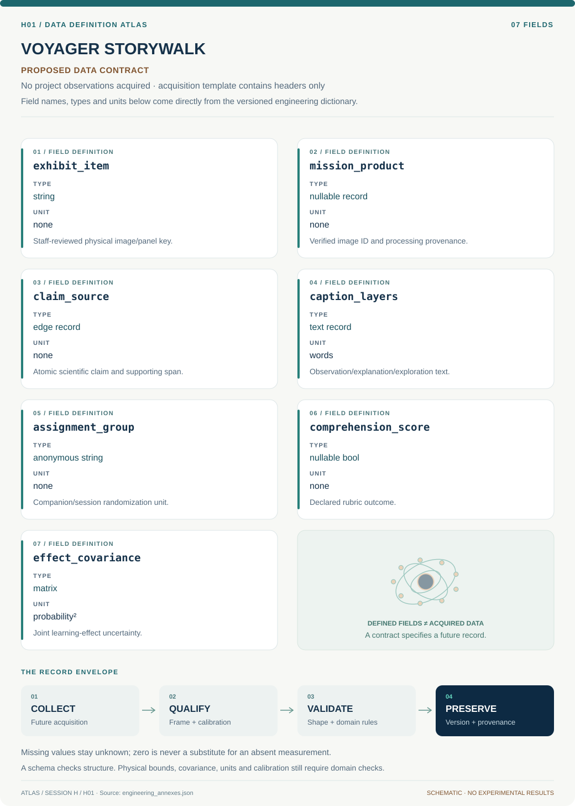
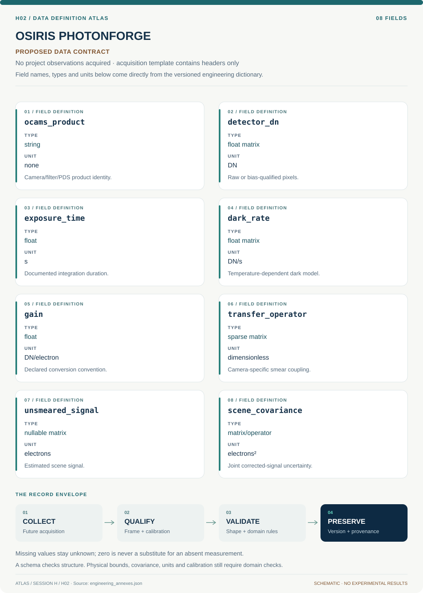
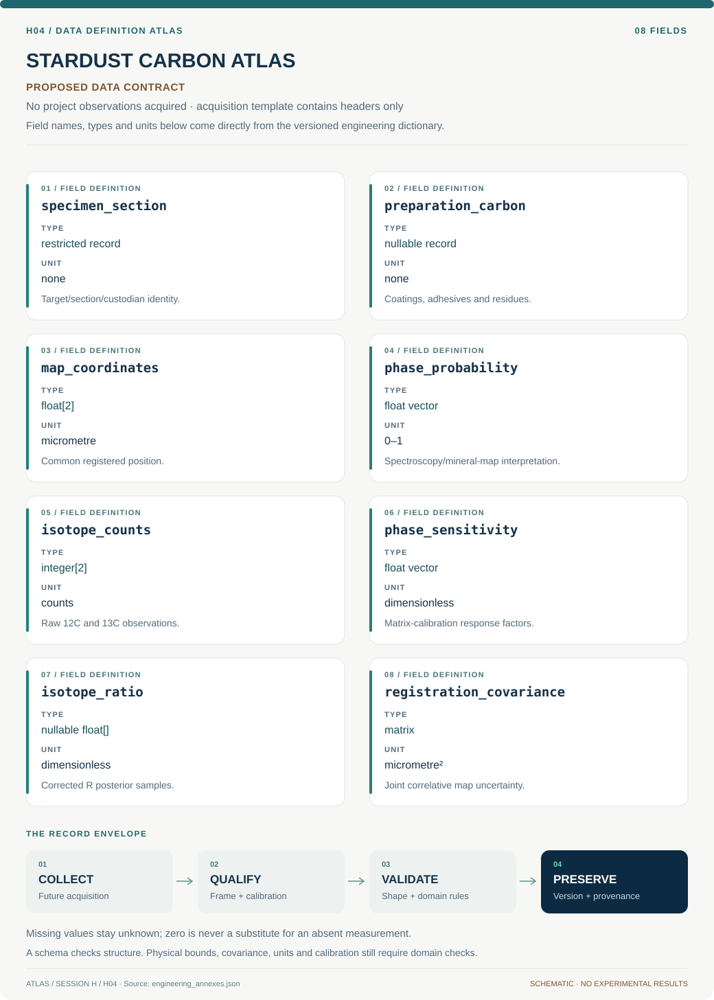
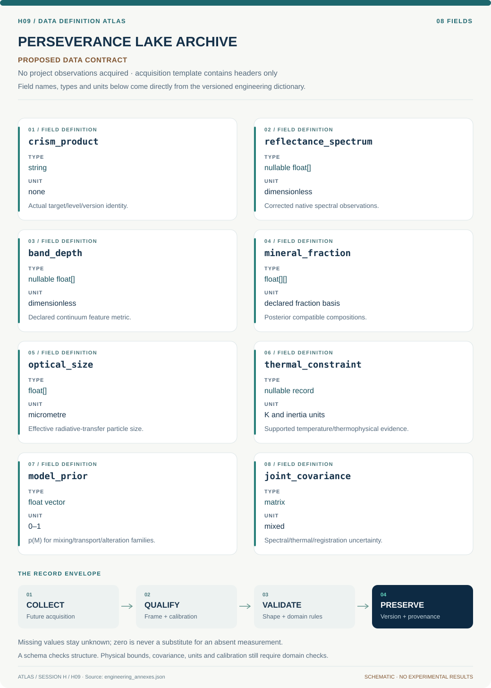

# SESSION H: PLANETARY SCIENCE

## ATLAS engineering handbook · Revision 3


9 original projects, preserved in their supplied order. Each numbered record has an independently stated design basis, model, data contract and verification plan.

[All engineering documents](../ENGINEERING_DOCUMENTATION.md) · [Session gallery](../research/H/README.md) · [Documentation standard](../engineering/ENGINEERING_STANDARD.md)

## Ordered contents

1. [H01 · VOYAGER STORYWALK](#h01) — USGS Science Center: Solar System Exhibit Captions
2. [H02 · OSIRIS PHOTONFORGE](#h02) — Calibration of Images from the OSIRIS-REx Camera Suite
3. [H03 · ARTEMIS POLAR COMPASS](#h03) — Magnetic Anomalies in the South Polar Region of the Moon
4. [H04 · STARDUST CARBON ATLAS](#h04) — Exploring Carbon-bearing Matter in an Antarctic Micrometeorite
5. [H05 · TERRA SEVEN GENERATIONS](#h05) — Supporting the Climate Change Department
6. [H06 · MARS ODYSSEY RIDGEWORK](#h06) — Variability of Martian Wrinkle Ridges
7. [H07 · KEPLER CO ECHO](#h07) — Increasing CO Gas Detections in Protoplanetary Disks
8. [H08 · GENESIS RIM CHRONICLE](#h08) — Investigating the Origin of Fine-Grained Rims in Mighei-like Carbonaceous Chondrites
9. [H09 · PERSEVERANCE LAKE ARCHIVE](#h09) — Trends in Mineralogy and Grain Size Distribution Across Paleolake Basins on Mars

---

<a id="h01"></a>

## H01 · VOYAGER STORYWALK

**Original project:** USGS Science Center: Solar System Exhibit Captions

**Session H:** Planetary Science

**Document class:** engineering research design and analysis record · **Revision:** 3 · **Date:** 2026-10-02

**Evidence state:** design basis, mathematical formulation and verification plan documented. Project-specific empirical results remain to be acquired; executable shared model demonstrations have their own recorded checks.

[Session H](../research/H/README.md) · [All projects](../ENGINEERING_DOCUMENTATION.md) · [Session handbook](SESSION_H.md) · [← G08](../research/G/G08-orion-hepatic-recovery/README.md) · [H02 →](../research/H/H02-osiris-photonforge/README.md)

| Proposed requirements | Specified verification cases | Defined data fields | Cited resources |
| ---: | ---: | ---: | ---: |
| 4 | 4 | 7 | 4 |

[Explore the data blueprint](../research/H/H01-voyager-storywalk/data/README.md) · [Open the figure gallery](../research/H/H01-voyager-storywalk/figures/README.md) · [Download acquisition template](../research/H/H01-voyager-storywalk/data/acquisition.csv) · [Browse the data atlas](../data/README.md)

---

### Purpose and scientific objective

Complete the original mobile-caption concept for the USGS Flagstaff solar-system exhibit, then turn it into an evidence-based visitor learning platform. Every displayed image receives an identified mission product, accessible explanation, scale cue, and traceable scientific claim. NASA Photojournal and USGS mission material provide authoritative starting points; proposed audience experiments determine whether captions actually help visitors interpret evidence. This is a new development proposal, not a claim that the historic exhibit or its app has been updated.

**Question:** Which caption structure most improves visitors' ability to explain what an image reveals, without overstating what scientists can infer from its appearance?

**Testable hypothesis:** A short observation-first caption with a clearly labeled inference, physical scale, and optional deeper layer will improve delayed comprehension relative to a factual inventory of the same length.

### 1. Design basis and analysis boundary

The exhibit-caption engineering system is an evidence registry, reviewed caption package and visitor-evaluation protocol for the USGS Flagstaff solar-system exhibit. It first identifies each actual displayed image, then binds observation, interpretation, scale and processing notes to a traceable mission product. A visually similar Photojournal entry is insufficient to establish identity, and no historical exhibit update is claimed.

Begin with staff-approved inventory and printable layered captions; add accessible mobile delivery only as a documented output channel. The fidelity ladder advances from claim/image provenance to usability review and a consented clustered comparison of equally accurate formats. NASA/USGS sources support scientific content, while learning benefit, word budgets and performance targets are proposed design choices requiring visitor evidence.

### 2. Requirements and verification traceability

These are project design requirements or proposed analysis gates. A numerical target is not a NASA requirement unless its controlling source is explicitly identified. “TBD” identifies evidence required before a decision; it is not permission to assume a value. Verification evidence listed here is planned, unless a linked result explicitly records execution.

| ID | Requirement / gate | Engineering rationale | Verification method | Basis / required evidence |
| --- | --- | --- | --- | --- |
| H01-R1 | Every scientific caption claim shall have an image/product identifier and reviewed source span; proposed traceability completeness is 100%. | Attractive captions can hide image/claim mismatches. | Graph foreign-key and curator audit. | Photojournal/USGS provenance; proposed target. |
| H01-R2 | Declare enhanced color, mosaics, artistic renderings and uncertain inference in the visible explanatory layer. | Visitors need observation-versus-processing distinctions. | Image-processing label review. | Mission product documentation. |
| H01-R3 | Digital normal text shall meet WCAG 2.2 minimum 4.5:1 contrast where applicable, with keyboard/screen-reader access and a printable alternative. | Device and visual access should not determine learning opportunity. | Contrast and assistive-technology task review. | W3C WCAG 2.2. |
| H01-R4 | Learning evaluation shall randomize companion groups/sessions, retain nonresponses and score comprehension separately from dwell time. | Companion exchange and engagement confound outcomes. | Assignment and missing-outcome audit. | Proposed visitor study design. |

### 3. Architecture and controlled interfaces

An exhibit inventory links physical panel location to product ID, mission, acquisition date, credit and processing. A provenance graph stores atomic claims, reviewed sources and alternative interpretations. Caption records contain observation, explanation and optional exploration layers with scale cues and text alternatives.

The delivery specification uses stable caption identifiers for print and mobile copies, with no individual tracking required for basic access. The evaluation adapter records consented anonymous group assignment, prior-knowledge score and scored response, while session/day keys capture clustering. Unidentified images or unsupported claims block release of that item; optional visitor nonresponse remains a missing outcome rather than a wrong answer.



The diagram establishes physical-image identity, source-backed captions and separate access channels before visitor evaluation. It provides a reviewable engineering package without claiming an updated exhibit or demonstrated learning benefit.

[Editable engineering diagram source](../research/H/H01-voyager-storywalk/figures/architecture.mmd)

### 4. Mathematical model and derivation

#### Governing equations

```text
Δ_k=P(Y_k=1|T=1)-P(Y_k=1|T=0)
```

$$
\mathrm{logit}\,P(Y_{iv}=1)=\alpha+\beta T_{iv}+\gamma K_i+u_v+u_{\rm day}
$$

$$
G=(V,E),\quad E=\{\mathrm{image}\rightarrow\mathrm{claim}\rightarrow\mathrm{source}\}
$$

#### Variables, units and conventions

- Y is a scored comprehension response; T is randomized caption assignment; Delta is an absolute probability difference.
- K is a preregistered prior-knowledge score; visitor and day effects represent clustered observations.
- G is a provenance graph; each image node stores product identifier, mission, acquisition date, processing description, and credit.

#### Assumptions and boundary conditions

- Assignment occurs at a visitor-group or session level to avoid contamination from companions exchanging caption versions.
- Dwell time measures engagement opportunity; it is not treated as comprehension or satisfaction.

#### Derivation step 1

```text
G=(V,E); E includes image->claim->source and caption->claim.
```

Graph completeness is count of supported claims divided by reviewed displayed claims, with unreviewed items explicitly excluded from confirmed status.

#### Derivation step 2

```text
Delta=P(Y=1|T=1)-P(Y=1|T=0).
```

The learning effect is an absolute probability difference, reported in percentage points; it is distinct from odds ratio or relative gain.

#### Derivation step 3

```text
logit P(Y_iv=1)=alpha+beta T_iv+gamma K_i+u_group+u_day.
```

Randomized treatment T and prior knowledge K enter a clustered model. Marginal Delta is computed from predicted probabilities rather than equating beta with a percentage change.

#### Derivation step 4

```text
DE=1+(m-1)rho; n_eff approximately n/DE.
```

This planning approximation accounts for group mean size m and intraclass correlation rho. Final uncertainty uses actual cluster structure and missing-outcome sensitivity.

#### Inference or simulation procedure

Build an inventory from exhibit photographs and staff records, identifying original products through Photojournal or instrument archives. A visually similar image is insufficient identification: verify scene geometry, crop, mission metadata, and processing. Draft three layers: an approximately 40-word observation, an approximately 100-word explanation, and an optional source-backed exploration. Mark enhanced color, mosaic seams, artistic renderings, and uncertain interpretations. Co-design mobile navigation with visitors using screen readers and people with limited bandwidth; provide readable print or staff-accessible alternatives. Randomize two equally accurate caption formats and score an observation-versus-inference task immediately and after a consented follow-up. Estimate effects with hierarchical logistic regression, retaining nonresponses and uncertainty rather than selecting favorable responses.

#### Validity domain and fidelity limits

One exhibit's audience does not represent all museums. Device ownership, language, motivation, and voluntary participation influence estimates. No individual visitor tracking is needed for the basic caption system.

### 5. Data specifications and provenance



**Proposed data contract · observations pending.** This visual inventory shows the record fields to acquire or derive. It contains no project measurements. [Open the data blueprint and downloads](../research/H/H01-voyager-storywalk/data/README.md).

| Field | Type | Unit | Physical / statistical meaning | Quality and missing-data rule |
| --- | --- | --- | --- | --- |
| exhibit_item | string | none | Staff-reviewed physical image/panel key. | Photo/crop geometry match required. |
| mission_product | nullable record | none | Verified image ID and processing provenance. | Null blocks confirmed caption. |
| claim_source | edge record | none | Atomic scientific claim and supporting span. | Reviewer/version required. |
| caption_layers | text record | words | Observation/explanation/exploration text. | Scale and processing labels retained. |
| assignment_group | anonymous string | none | Companion/session randomization unit. | No identifiable visitor tracking. |
| comprehension_score | nullable bool | none | Declared rubric outcome. | Nonresponse stays null. |
| effect_covariance | matrix | probability² | Joint learning-effect uncertainty. | Group/day dependence included. |

[Machine-readable record schema](../research/H/H01-voyager-storywalk/data/schema.json) · [Empty acquisition CSV](../research/H/H01-voyager-storywalk/data/acquisition.csv) · [Field dictionary CSV](../research/H/H01-voyager-storywalk/data/dictionary.csv)

The CSV above contains column headers only. Its schema defines future records and does not establish that original-team data or a particular archive product have been acquired. Frame, timing, calibration, covariance, selection and provenance details must accompany populated records.

#### NASA Photojournal

[Product, archive or reference](https://science.nasa.gov/photojournal/)

**Fields:** Image identifiers, scientific descriptions, missions, processing notes, credits

**Access:** Public browsing; confirm usage conditions and actual exhibit-image matches individually.

**Role:** Caption evidence and product identity.

#### USGS Astrogeology Science Center

[Product, archive or reference](https://www.usgs.gov/centers/astrogeology-science-center)

**Fields:** Center context, planetary mapping resources, visitor information

**Access:** Public context; local exhibit inventory requires staff cooperation.

**Role:** Host requirements and scientifically reviewed interpretation.

### 6. Uncertainty, sensitivity and identifiability

Product identification can fail because of crop, recoloring or mosaic composition. Preserve uncertain matches and seek curator records; a correct mission name alone is insufficient. Scientific interpretations can change, so claim/source revision dates and review status remain part of the engineering release. Accessibility review covers actual task completion as well as automated contrast checks.

Visitor selection, device ownership, language and companion interaction affect generalization. Randomize groups, use cluster-aware intervals and compare bounds for nonresponse rather than select favorable respondents. Dwell time is a process measure only. Prior-knowledge and subgroup effects may be weakly identified, so avoid claiming broad learning superiority from a small local pilot.

### 7. Engineering trade study

| Alternative | Benefit | Cost / limitation | Decision rule |
| --- | --- | --- | --- |
| Printed layered captions | Accessible without personal devices. | Limited optional depth and updates. | Required baseline/alternative channel. |
| Mobile linked evidence layers | Supports optional source exploration. | Bandwidth/device/accessibility burden. | Use when visitor task review supports it. |
| Facilitated interpretation cards | Allows dialogue and low-device access. | Staffing and session effects vary. | Compare as a distinct delivery scenario. |

### 8. Verification and validation cases

| Case ID | Stimulus / condition | Expected result / criterion | Method | Evidence artifact |
| --- | --- | --- | --- | --- |
| H01-V1 | Provenance break | Item is marked unsupported and cannot enter confirmed release. | Condition/fixture: Remove the source edge for one scientific claim. Verification procedure: Graph integrity fixture.. | Graph integrity fixture. |
| H01-V2 | Learning arithmetic | Delta=0.2, or 20 percentage points. | Condition/fixture: Synthetic correct-response rates are 0.8 and 0.6. Verification procedure: Exact effect calculation.. | Exact effect calculation. |
| H01-V3 | Cluster planning | DE=1.6 and n_eff=n/1.6. | Condition/fixture: m=4 and rho=0.2 in the planning approximation. Verification procedure: Independent formula check.. | Independent formula check. |
| H01-V4 | Accessible delivery | Every required caption/source path remains usable; failures are recorded for repair. | Condition/fixture: Review representative print/mobile tasks with keyboard and screen reader plus low bandwidth. Verification procedure: Task-based integration review.. | Task-based integration review. |

**Execution status:** these cases are specified, not claimed as executed. Close a case only with the versioned inputs, output, uncertainty, reviewer and pass/fail rationale.

#### Additional scientific validation gates

- Require every factual caption claim to resolve to a reviewed source and every image to retain its original credit.
- Test screen-reader order, keyboard navigation, text resizing, offline fallback, and reading on a low-end phone.
- Report effect intervals, attrition by group, and an anonymized scoring rubric; accept a null learning effect as informative.

### 9. Implementation and reproducible work packages

1. Build a curator-reviewed exhibit inventory with exact image-product matches.
2. Create claim/source/processing/scale graph schemas and revision rules.
3. Author layered caption artifacts with print and accessible digital specifications.
4. Run provenance and assistive-technology task checks before evaluation.
5. Preregister clustered assignment, scoring rubric and nonresponse analysis.
6. Publish reviewed captions and learning-evidence limitations without claiming prior deployment.

#### Investigation sequence

1. Establish the complete image inventory and unresolved-identification queue before authoring captions.
2. Review each claim with a planetary specialist and each interaction with an accessibility reviewer.
3. Pilot comprehension tasks, define the smallest useful effect, and size the visitor study by simulated power.
4. Publish reviewed captions with version history, source links, and a correction route.

#### Resources and interfaces to expertise

- USGS exhibit curator, planetary-science reviewer, accessible web developer, education evaluator, consented visitor pilot.

### 10. Failure modes and interpretation controls

| Failure mode | Effect on result | Detection / evidence | Design response |
| --- | --- | --- | --- |
| Similar image substituted | Incorrect caption identity. | Crop/geometry/product review. | Retain unresolved inventory state. |
| Dwell called comprehension | False learning success. | Outcome/rubric audit. | Separate process and learning metrics. |
| Digital-only access | Excluded visitors. | Alternative-channel task review. | Print and assisted access. |

- Misidentified source images, outdated explanations, caption overload, and exclusion of visitors without phones.

### 11. Required engineering outputs

- A versioned caption registry, mobile walking guide, provenance graph, visitor-study protocol, and evaluated design recommendations.

#### Scientific result figures to produce during execution

A sample planet image beside observation, inference, scale, and source layers; a separate diagram shows randomized caption evaluation. Proposed outcomes remain unfilled until measured.

### 12. Cited technical and scientific resources

- [NASA Photojournal](https://science.nasa.gov/photojournal/) — Authoritative mission imagery and accompanying descriptions.
- [USGS Astrogeology Science Center](https://www.usgs.gov/centers/astrogeology-science-center) — Center mission and visitor context.
- [NASA Museum and Informal Education Alliance](https://science.nasa.gov/sciact-team/museum-alliance/) — Informal-learning resources and connection to NASA science; not evidence that this proposed caption format works.
- [W3C Web Content Accessibility Guidelines 2.2](https://www.w3.org/TR/WCAG22/) — Primary accessibility criteria supporting text contrast, keyboard/focus access and alternatives; proposed caption-learning outcomes require independent visitor evaluation.

Framework and evidence rules: [engineering documentation standard](../engineering/ENGINEERING_STANDARD.md), [model assurance](../engineering/MODEL_ASSURANCE.md), [uncertainty procedure](../engineering/UNCERTAINTY_AND_DECISION_RULES.md), [data management](../engineering/DATA_MANAGEMENT.md). NASA-inspired names are creative identifiers; requirements and results are not NASA certification.

---

<a id="h02"></a>

## H02 · OSIRIS PHOTONFORGE

**Original project:** Calibration of Images from the OSIRIS-REx Camera Suite

**Session H:** Planetary Science

**Document class:** engineering research design and analysis record · **Revision:** 3 · **Date:** 2026-10-02

**Evidence state:** design basis, mathematical formulation and verification plan documented. Project-specific empirical results remain to be acquired; executable shared model demonstrations have their own recorded checks.

[Session H](../research/H/README.md) · [All projects](../ENGINEERING_DOCUMENTATION.md) · [Session handbook](SESSION_H.md) · [← H01](../research/H/H01-voyager-storywalk/README.md) · [H03 →](../research/H/H03-artemis-polar-compass/README.md)

| Proposed requirements | Specified verification cases | Defined data fields | Cited resources |
| ---: | ---: | ---: | ---: |
| 4 | 4 | 8 | 2 |

[Explore the data blueprint](../research/H/H02-osiris-photonforge/data/README.md) · [Open the figure gallery](../research/H/H02-osiris-photonforge/figures/README.md) · [Download acquisition template](../research/H/H02-osiris-photonforge/data/acquisition.csv) · [Browse the data atlas](../data/README.md)

---

### Purpose and scientific objective

Develop an uncertainty-aware charge-smear correction benchmark for OCAMS images of Bennu. Preserve the original detector-calibration problem while replacing empirical tuning with a forward model of frame transfer, detector offsets, and illumination. Golish and colleagues document the calibration pipeline and public raw, calibrated, and calibration-file archives. Proposed improvements must be demonstrated on withheld calibration scenes; visual smoothness alone cannot establish scientific accuracy.

**Question:** Can physically constrained joint estimation of transfer smear and detector background reduce scene-dependent artifacts while preserving measured radiance and color ratios?

**Testable hypothesis:** A transfer-operator model with a small, independently calibrated timing correction will outperform per-image heuristic factors in held-out high-contrast scenes and provide better uncertainty coverage.

### 1. Design basis and analysis boundary

The calibration benchmark models charge smear and detector offsets in actual OCAMS coordinate/readout conventions, using documented raw, calibrated and calibration-file products. The analysis boundary is detector correction followed by documented radiance conversion; illumination geometry and scene changes are separate causes of image differences. Visual smoothness is not a scientific accuracy metric.

Begin by reproducing the published correction order and camera-specific metadata, then compare fixed physical transfer and constrained joint scene/timing estimates. Synthetic scenes provide exact unsmeared truth, while withheld calibration/repeat scenes assess flight consistency. Gain, flat response, transfer timing and detector temperature remain sourced or TBD; arbitrary column smoothing is not accepted as a substitute for the frame-transfer operator.

### 2. Requirements and verification traceability

These are project design requirements or proposed analysis gates. A numerical target is not a NASA requirement unless its controlling source is explicitly identified. “TBD” identifies evidence required before a decision; it is not permission to assume a value. Verification evidence listed here is planned, unless a linked result explicitly records execution.

| ID | Requirement / gate | Engineering rationale | Verification method | Basis / required evidence |
| --- | --- | --- | --- | --- |
| H02-R1 | Each image shall retain camera/filter, raw/calibrated product ID, exposure definition, temperature, readout direction and calibration-file versions. | A wrong detector convention reverses smear geometry. | PDS label and processing-order audit. | Golish et al.; OCAMS archive. |
| H02-R2 | Derive smear operator from documented transfer sequence and row timing; proposed synthetic forward/inverse relative residual target is 10^-8 in noiseless supported cases. | Numerical correction must match physical acquisition. | Independent synthetic matrix checks. | Proposed computational target. |
| H02-R3 | Saturated/unsupported moving scenes shall be flagged, including downstream contamination where the transfer model requires it. | Clipped source charge is not recoverable truth. | Saturation/motion evidence gate. | Detector-model assumptions. |
| H02-R4 | Evaluate withheld cameras/campaign scenes with radiance bias, feature retention and covariance; no absolute-improvement claim from repeatability alone. | Regularization may erase real narrow features. | Held-out calibration comparison. | Published baseline context. |

### 3. Architecture and controlled interfaces

A PDS adapter decodes DN images and labels into documented detector coordinates without silently flipping rows. Bias/overscan and dark-rate modules preserve DN and DN/s conventions; gain is DN/electron. Flat response and transfer matrices are assembled in the published order, with effective operator definitions explicitly recorded.

The constrained estimator accepts noise covariance, timing priors and optional regularization, and outputs unsmeared electron signal plus parameter covariance. A radiance adapter applies the documented post-detector calibration and units. Synthetic forward scenes and withheld flight products share the same metadata path. Missing transfer/gain files, saturation or unsupported motion propagate invalid/limited-correction flags instead of cosmetically repaired science pixels.



The diagram binds correction to actual camera acquisition conventions and separates exact synthetic truth from flight consistency. It exposes saturation, timing and regularization limits before any claim of improved radiometry.

[Editable engineering diagram source](../research/H/H02-osiris-photonforge/figures/architecture.mmd)

### 4. Mathematical model and derivation

#### Governing equations

$$
\mathbf y=\mathbf b+\mathbf d(T)t+g\mathbf F[\mathbf I+\mathbf S(\tau,t)]\mathbf x+\boldsymbol\epsilon
$$

$$
\hat{\mathbf x},\hat\tau=\arg\min_{\mathbf x\ge0,\tau}\;\Vert\mathbf W^{1/2}(\mathbf y-\boldsymbol\mu)\Vert^2+\lambda\Vert\mathbf L\mathbf x\Vert^2+\frac{(\tau-\tau_0)^2}{\sigma_\tau^2}
$$

$$
\mathbf C_x\approx\mathbf J_y\mathbf C_y\mathbf J_y^T+\mathbf J_\theta\mathbf C_\theta\mathbf J_\theta^T
$$

#### Variables, units and conventions

- y and bias b are digital numbers; x is unsmeared scene signal in electrons; g converts electrons to digital numbers.
- d is dark rate in digital numbers per second; T is detector temperature; t and row-transfer timing tau are seconds.
- F contains dimensionless flat response; S is a camera-specific transfer operator; W is inverse noise covariance.
- C_theta describes calibration-parameter uncertainty; radiance conversion is applied after detector correction with documented units.

#### Assumptions and boundary conditions

- Readout direction, detector coordinates, exposure definitions, and gain conventions must come from instrument documentation.
- A static scene during transfer is an approximation; saturated pixels and motion-blurred scenes require exclusion or an expanded model.

#### Derivation step 1

```text
y=b+d(T)t+g F[I+S(tau,t)]x+epsilon.
```

x is unsmeared electrons, g DN/electron, b DN and d t DN. F and S are dimensionless effective operators in the verified camera-specific processing convention.

#### Derivation step 2

```text
S(tau,t)=(tau/t)K_transfer for the supported static-scene linear model.
```

K_transfer encodes the actual sequence/path of rows; tau/t is dimensionless. Exposure approaching zero or scene motion requires a different validity treatment.

#### Derivation step 3

```text
x_hat,tau_hat=argmin_(x>=0,tau) (y-mu)^T C_y^-1(y-mu)+lambda||Lx||²+(tau-tau0)²/sigma_tau².
```

Timing prior and scene regularization resolve some degeneracy but introduce bias; lambda is scaled so the objective is dimensionless.

#### Derivation step 4

```text
C_x approximately J_y C_y J_y^T+J_theta C_theta J_theta^T.
```

Calibration uncertainty includes shared bias/dark/flat/timing covariance. Cross terms are retained when image and calibration estimates are not independent.

#### Inference or simulation procedure

Reconstruct the published processing order using archived calibration files before changing any correction. Derive the smear matrix from the actual frame-transfer sequence rather than using an arbitrary column convolution. Fit timing corrections on dark-sky boundaries or dedicated calibration observations, with camera- and campaign-specific priors. Compare the published correction, fixed physical transfer model, and constrained joint estimator. Propagate shot noise, overscan bias uncertainty, dark-current uncertainty, flat response, and timing through radiance and reflectance products. Use carefully labeled synthetic images spanning sharp limbs, bright boulders, low signal, and saturated regions to obtain exact ground truth, then compare repeat observations at compatible geometry to assess real-image consistency.

#### Validity domain and fidelity limits

Inverse regularization can erase narrow genuine features. Calibration cannot remove illumination-angle differences or point-source aliasing automatically. Improved relative precision does not establish an improved absolute calibration.

### 5. Data specifications and provenance



**Proposed data contract · observations pending.** This visual inventory shows the record fields to acquire or derive. It contains no project measurements. [Open the data blueprint and downloads](../research/H/H02-osiris-photonforge/data/README.md).

| Field | Type | Unit | Physical / statistical meaning | Quality and missing-data rule |
| --- | --- | --- | --- | --- |
| ocams_product | string | none | Camera/filter/PDS product identity. | Label and calibration version required. |
| detector_dn | float matrix | DN | Raw or bias-qualified pixels. | Readout coordinates/saturation retained. |
| exposure_time | float | s | Documented integration duration. | Positive; definition source required. |
| dark_rate | float matrix | DN/s | Temperature-dependent dark model. | Calibration covariance saved. |
| gain | float | DN/electron | Declared conversion convention. | No reciprocal-gain ambiguity. |
| transfer_operator | sparse matrix | dimensionless | Camera-specific smear coupling. | Sequence/timing provenance required. |
| unsmeared_signal | nullable matrix | electrons | Estimated scene signal. | Support/regularization flags retained. |
| scene_covariance | matrix/operator | electrons² | Joint corrected-signal uncertainty. | Shared calibration and timing terms included. |

[Machine-readable record schema](../research/H/H02-osiris-photonforge/data/schema.json) · [Empty acquisition CSV](../research/H/H02-osiris-photonforge/data/acquisition.csv) · [Field dictionary CSV](../research/H/H02-osiris-photonforge/data/dictionary.csv)

The CSV above contains column headers only. Its schema defines future records and does not establish that original-team data or a particular archive product have been acquired. Frame, timing, calibration, covariance, selection and provenance details must accompany populated records.

#### OSIRIS-REx OCAMS PDS bundle

[Product, archive or reference](https://arcnav.psi.edu/urn%3Anasa%3Apds%3Aorex.ocams)

**Fields:** Raw and calibrated images, camera/filter metadata, exposure and temperature, calibration products

**Access:** Public archive; verify bundle versions, product labels, and calibration availability before selecting files.

**Role:** Reproducible flight-data benchmark.

#### Ground and in-flight calibration publication

[Product, archive or reference](https://pmc.ncbi.nlm.nih.gov/articles/PMC6979463/)

**Fields:** Detector layout, acquisition sequence, calibration order, published uncertainty context

**Access:** Open article; ground-test products may require separate archive discovery.

**Role:** Forward-model definitions and baseline.

### 6. Uncertainty, sensitivity and identifiability

Bias, dark, flat and timing errors are spatially correlated, and shot noise depends on signal. Joint timing and scene inference can trade off with sharp features or dark-sky boundaries. Profile tau under independent calibration priors and compare regularization strengths on withheld synthetic limbs and boulders; a lower residual can reflect overfitting or blurred truth.

Flight repeat scenes change illumination and viewing geometry, so they are consistency evidence rather than exact truth. Saturation and scene motion violate the static linear model; their influence may spread through transfer coupling. Keep absolute radiometric calibration uncertainty separate from relative smear improvement, and report feature-retention error alongside image-wide metrics.

### 7. Engineering trade study

| Alternative | Benefit | Cost / limitation | Decision rule |
| --- | --- | --- | --- |
| Published correction baseline | Known documented processing chain. | May leave scenario-specific residual smear. | Required reproduced comparator. |
| Fixed physical transfer inversion | Transparent detector physics and timing. | Limited if timing/model inputs are uncertain. | Preferred initial alternative. |
| Joint constrained scene/timing fit | Propagates timing and scene uncertainty. | Nonuniqueness/regularization can erase features. | Use only with independent priors and holdout benefit. |

### 8. Verification and validation cases

| Case ID | Stimulus / condition | Expected result / criterion | Method | Evidence artifact |
| --- | --- | --- | --- | --- |
| H02-V1 | Zero transfer timing | S=0 and x=F^-1(y-b-dt)/g where supported. | Condition/fixture: tau=0 with valid flat/gain and offsets. Verification procedure: Exact operator limit.. | Exact operator limit. |
| H02-V2 | Zero scene | y=b+d t, with no scene smear. | Condition/fixture: x=0 in noiseless synthetic acquisition. Verification procedure: Offset-only matrix fixture.. | Offset-only matrix fixture. |
| H02-V3 | Known sharp-limb scene | Recover supported unsaturated signal within proposed residual target and report edge bias. | Condition/fixture: Forward project a declared synthetic x through verified K, then invert. Verification procedure: Independent forward/inverse benchmark.. | Independent forward/inverse benchmark. |
| H02-V4 | Calibration holdout | Report radiance bias, covariance coverage and narrow-feature retention. | Condition/fixture: Reserve complete calibration scenes/campaigns. Verification procedure: Blocked flight/synthetic comparison.. | Blocked flight/synthetic comparison. |

**Execution status:** these cases are specified, not claimed as executed. Close a case only with the versioned inputs, output, uncertainty, reviewer and pass/fail rationale.

#### Additional scientific validation gates

- Measure fractional radiance bias, limb-to-background leakage, residual column correlation, and color-ratio error versus exposure and temperature.
- Hold out entire observing sequences, since neighboring images share detector and illumination errors.
- Require synthetic credible-interval coverage and no loss of injected fine structure; report cases where the baseline remains superior.

### 9. Implementation and reproducible work packages

1. Freeze raw/calibrated/calibration PDS manifests and camera coordinate conventions.
2. Reproduce published offset/dark/flat/transfer order with unit checks.
3. Implement camera-specific forward transfer matrices and analytic fixtures.
4. Build noiseless/noisy synthetic limb, boulder and low-signal benchmarks.
5. Fit supported fixed/joint alternatives with parameter covariance and profiles.
6. Publish held-out radiance/feature results and absolute-calibration limitations.

#### Investigation sequence

1. Freeze camera-specific product manifests and reproduce a small published-pipeline subset.
2. Create physical transfer simulations and calibrate timing on training campaigns.
3. Evaluate unseen cameras or campaigns only when their independent calibration is supplied.
4. Release correction code, uncertainty maps, and a change-impact report for downstream Bennu science.

#### Resources and interfaces to expertise

- NumPy/SciPy linear algebra, PDS4 readers, instrument specialist, calibration workstation, versioned test products.

### 10. Failure modes and interpretation controls

| Failure mode | Effect on result | Detection / evidence | Design response |
| --- | --- | --- | --- |
| Readout direction wrong | Smear removed along incorrect rows. | Metadata/limb residual check. | Verified coordinate adapter. |
| Regularization hides features | False visually pleasing improvement. | Edge/point-source holdout error. | Feature-aware bias reporting. |
| Saturation treated recoverable | Invented signal values. | Clipping/contamination flags. | Exclude or qualify unsupported regions. |

- Incorrect row conventions, saturation propagation, missing calibration metadata, and unidentifiable timing versus scene brightness.

### 11. Required engineering outputs

- A documented transfer model, raw-to-radiance comparison pipeline, per-pixel uncertainty products, and calibration validation matrix.

#### Scientific result figures to produce during execution

Synthetic truth, smeared input, baseline correction, proposed correction, and uncertainty-normalized residual panels; flight images appear separately without a truth label.

### 12. Cited technical and scientific resources

- [Golish et al. (2020), Ground and In-Flight Calibration of the OSIRIS-REx Camera Suite](https://pmc.ncbi.nlm.nih.gov/articles/PMC6979463/) — OCAMS detector physics, calibration pipeline, and data availability.
- [PDS OCAMS bundle](https://arcnav.psi.edu/urn%3Anasa%3Apds%3Aorex.ocams) — Archive discovery and product provenance.

Framework and evidence rules: [engineering documentation standard](../engineering/ENGINEERING_STANDARD.md), [model assurance](../engineering/MODEL_ASSURANCE.md), [uncertainty procedure](../engineering/UNCERTAINTY_AND_DECISION_RULES.md), [data management](../engineering/DATA_MANAGEMENT.md). NASA-inspired names are creative identifiers; requirements and results are not NASA certification.

---

<a id="h03"></a>

## H03 · ARTEMIS POLAR COMPASS

**Original project:** Magnetic Anomalies in the South Polar Region of the Moon

**Session H:** Planetary Science

**Document class:** engineering research design and analysis record · **Revision:** 3 · **Date:** 2026-10-02

**Evidence state:** design basis, mathematical formulation and verification plan documented. Project-specific empirical results remain to be acquired; executable shared model demonstrations have their own recorded checks.

[Session H](../research/H/README.md) · [All projects](../ENGINEERING_DOCUMENTATION.md) · [Session handbook](SESSION_H.md) · [← H02](../research/H/H02-osiris-photonforge/README.md) · [H04 →](../research/H/H04-stardust-carbon-atlas/README.md)

| Proposed requirements | Specified verification cases | Defined data fields | Cited resources |
| ---: | ---: | ---: | ---: |
| 4 | 4 | 8 | 3 |

[Explore the data blueprint](../research/H/H03-artemis-polar-compass/data/README.md) · [Open the figure gallery](../research/H/H03-artemis-polar-compass/figures/README.md) · [Download acquisition template](../research/H/H03-artemis-polar-compass/data/acquisition.csv) · [Browse the data atlas](../data/README.md)

---

### Purpose and scientific objective

Produce a defensible south-polar lunar magnetic-field atlas from Kaguya magnetometer observations, with Lunar Prospector as an independent comparison where coverage permits. Preserve the equivalent-source dipole approach and polar map focus. The principal advance is a map of resolution, external-field contamination, and altitude-transfer uncertainty alongside field strength. A magnetic anomaly is a geological clue; this project does not equate orbital anomaly detection with a measured surface shielding benefit for astronauts.

**Question:** Which south-polar anomalies persist across quiet passes and reasonable equivalent-source geometries, and at what spatial resolution can their field be estimated?

**Testable hypothesis:** Cross-orbit regularization with an explicit external-field component will recover stable regional anomalies while reducing apparent small-scale structure produced by irregular altitude and plasma disturbances.

### 1. Design basis and analysis boundary

The south-polar magnetic atlas uses observation-level Kaguya LMAG vector data and independent Lunar Prospector passes where coverage permits. Its engineering outputs are reference-altitude fields, source resolution and external-field/altitude-transfer uncertainty. The equivalent dipole mesh is an inversion representation, not a recovered physical set of isolated lunar magnets.

Begin with quiet-pass selection, ephemeris/frame validation and nuisance-aware inversion. Promote to finer source grids or downward continuation only if projected sensitivity supports them. The reviewed nonpolar 30-km PDS map does not cover the study pole and is excluded as polar input. External-field coefficients are jointly fitted and eliminated before source resolution is assessed; ignoring them overstates internal-field identifiability.

### 2. Requirements and verification traceability

These are project design requirements or proposed analysis gates. A numerical target is not a NASA requirement unless its controlling source is explicitly identified. “TBD” identifies evidence required before a decision; it is not permission to assume a value. Verification evidence listed here is planned, unless a linked result explicitly records execution.

| ID | Requirement / gate | Engineering rationale | Verification method | Basis / required evidence |
| --- | --- | --- | --- | --- |
| H03-R1 | Each vector observation shall retain mission/product flags, position, altitude, time, frame and external-condition selection rule. | External contamination and frame errors can mimic anomalies. | Pass/frame metadata audit. | JAXA/PDS archive context. |
| H03-R2 | Compute resolution after covariance-weighted nuisance projection, with rank/gauge constraints documented. | Source-only resolution exaggerates identifiable structure. | Projection/nullspace analytic checks. | Reviewed W_perp/R_m formulation. |
| H03-R3 | Compare missions at matched modeled altitude and report continuation uncertainty separately. | Dipole fields decay rapidly with distance. | Geometry/altitude residual review. | Existing magnetic model. |
| H03-R4 | Do not use the nonpolar 65°S–65°N crustal map as south-pole observations or infer astronaut shielding from orbital anomalies. | Coverage and physical endpoints differ. | Source-domain and claim audit. | PDS coverage limitation. |

### 3. Architecture and controlled interfaces

An observation adapter transforms vectors into a named lunar Cartesian/polar frame, preserving nT originals and SI T conversion. Ephemeris provides observation/source coordinates in metres and reference altitude. Source mesh records dipole depth/spacing; nuisance design H contains declared pass-specific smooth external terms.

The inversion first whitens correlated measurement/environmental covariance, then projects unpenalized nuisance modes before regularized source estimation. Gauge and singular-value diagnostics define supported source combinations. Reference-altitude forward maps carry covariance and averaging kernels, while mission comparison uses matched geometry. Quiet-pass and nuisance-model alternatives propagate map discrepancy; unsupported polar cells remain flagged rather than filled by nonpolar coverage.


The diagram makes external-field nuisance projection part of source estimation and resolution. It supports an altitude-specific polar magnetic atlas with identifiable-mode masks, while excluding unsupported surface shielding and nonpolar-map substitution.

[Editable engineering diagram source](../research/H/H03-artemis-polar-compass/figures/architecture.mmd)

### 4. Mathematical model and derivation

#### Governing equations

$$
\mathbf B(\mathbf r)=\frac{\mu_0}{4\pi}\sum_j\left[\frac{3\mathbf R_j(\mathbf m_j\cdot\mathbf R_j)}{R_j^5}-\frac{\mathbf m_j}{R_j^3}\right]+\mathbf B_{\rm ext}
$$

$$
(\hat{\mathbf m},\hat{\mathbf a})=\arg\min_{\mathbf m,\mathbf a}\;\Vert\mathbf C^{-1/2}(\mathbf G\mathbf m+\mathbf H\mathbf a-\mathbf b)\Vert^2+\lambda\Vert\mathbf L\mathbf m\Vert^2
$$

```text
W_perp = C^-1 - C^-1 H (H^T C^-1 H)^+ H^T C^-1; R_m = (G^T W_perp G + lambda L^T L)^+ G^T W_perp G, after eliminating unpenalized external-field nuisance coefficients.
```

#### Variables, units and conventions

- B is magnetic induction in tesla, reported in nanotesla; r and dipole displacement R are meters; m is dipole moment in ampere square meters.
- G maps source moments to measured vector components; H a represents smooth external-field nuisance terms per pass.
- C includes correlated measurement and environmental errors; the resolution matrix R differs from dipole displacement R_j.
- W_perp: covariance-weighted projection after jointly fitting H a; superscript + denotes the Moore-Penrose pseudoinverse. R_m is source resolution under the declared constraints, not the resolution of a source-only fit.

#### Assumptions and boundary conditions

- Equivalent dipoles are an inversion representation, not an assertion that physical isolated dipoles exist at the chosen depth.
- A reference-altitude map is modeled; downward continuation toward the surface is unstable and requires strong uncertainty qualification.
- Check rank and impose documented gauge/source constraints before interpreting resolution; uncertainty in the external-field model can reduce identifiable internal-field structure.

#### Derivation step 1

```text
B_j=mu0/(4pi)[3 R_j(m_j dot R_j)/R_j^5-m_j/R_j^3].
```

R is metres, dipole moment A m² and B tesla; sum source fields plus external terms in a consistent vector frame.

#### Derivation step 2

```text
W_perp=C^-1-C^-1 H(H^T C^-1 H)^+H^T C^-1.
```

Eliminating unpenalized external coefficients yields the covariance-weighted nuisance complement. Check H^T W_perp=0 and numerical rank before interpreting source information.

#### Derivation step 3

```text
A=G^T W_perp G+lambda L^T L; m_hat=A^+G^T W_perp b; R_m=A^+G^T W_perp G.
```

R_m is source resolution after nuisance fitting. lambda and L are scaled consistently with moment units, and documented gauge constraints remove unsupported modes.

#### Derivation step 4

```text
B_*=G_* m_hat; C_B*=G_* C_m G_*^T+C_model.
```

Continuation to reference altitude uses the source posterior/estimator covariance plus nuisance/depth discrepancy. Near-surface continuation amplifies poorly resolved short wavelengths.

#### Inference or simulation procedure

Select south-polar Kaguya LMAG passes using instrument flags, ephemerides, altitude, local time, and evidence of quiet external conditions. Compare several quiet-pass definitions instead of accepting a single threshold. Transform vectors into a documented lunar coordinate frame and invert on a polar mesh, testing source depth, spacing, and regularization. Jointly estimate slowly varying external terms with constraints that prevent them absorbing the crustal signal. Map radial and horizontal components at a declared reference altitude and evaluate spatial sensitivity with synthetic anomaly recovery. Compare independent Lunar Prospector passes at matched altitude rather than judging agreement between maps at different heights. Overlay geological boundaries only after the magnetic inversion is frozen.

#### Validity domain and fidelity limits

Source magnetization magnitude, orientation, depth, and lateral extent are nonunique. External currents and sparse low-altitude coverage may dominate some pixels. The commonly cited PDS large-scale 30-km crustal map covers only 65 degrees south to 65 degrees north and cannot supply the polar study area.

### 5. Data specifications and provenance


**Proposed data contract · observations pending.** This visual inventory shows the record fields to acquire or derive. It contains no project measurements. [Open the data blueprint and downloads](../research/H/H03-artemis-polar-compass/data/README.md).

| Field | Type | Unit | Physical / statistical meaning | Quality and missing-data rule |
| --- | --- | --- | --- | --- |
| mag_product | string | none | LMAG/Prospector pass provenance. | Observation-level coverage and flags required. |
| field_vector | nullable float[3] | nT | Measured magnetic components. | Frame/time transformation recorded. |
| position_xyz | float[3] | m | Observation geometry. | Lunar origin/frame and altitude explicit. |
| dipole_moment | float vector | A m² | Equivalent-source estimator. | Depth/grid/gauge not physical truth. |
| nuisance_design | matrix | declared | Pass external-field basis H. | Rank and constraints retained. |
| observation_covariance | matrix | T² | Correlated measurement/environment error. | PSD and unit conversion checked. |
| projected_resolution | matrix | dimensionless | Nuisance-aware R_m. | Supported singular modes documented. |
| reference_map | record | nT | Modeled altitude field and uncertainty. | Altitude/continuation support explicit. |

[Machine-readable record schema](../research/H/H03-artemis-polar-compass/data/schema.json) · [Empty acquisition CSV](../research/H/H03-artemis-polar-compass/data/acquisition.csv) · [Field dictionary CSV](../research/H/H03-artemis-polar-compass/data/dictionary.csv)

The CSV above contains column headers only. Its schema defines future records and does not establish that original-team data or a particular archive product have been acquired. Frame, timing, calibration, covariance, selection and provenance details must accompany populated records.

#### JAXA DARTS Kaguya archive

[Product, archive or reference](https://darts.isas.jaxa.jp/en/missions/kaguya)

**Fields:** LMAG vector observations, product documentation, geometry and time metadata

**Access:** Public scientific archive; find the appropriate observation-level LMAG products, not the separate conductivity inversion.

**Role:** Primary polar magnetic observations.

#### PDS Lunar Prospector holdings

[Product, archive or reference](https://pds-geosciences.wustl.edu/missions/lunarp/index.htm)

**Fields:** MAG/ER archive discovery and mission geometry

**Access:** Magnetometer products are linked through the PPI node; inspect quality and coverage.

**Role:** Independent instrument comparison.

### 6. Uncertainty, sensitivity and identifiability

External fields, spacecraft offsets and quiet-pass selection can absorb or imitate long-wavelength crustal signals. Compare nuisance bases and quiet-condition rules, retaining their discrepancy separately from magnetometer noise. If source modes lie in the nuisance span, the data cannot identify them; a regularization prior does not convert them into measured structure.

Source depth, orientation and lateral extent are nonunique, and downward continuation magnifies short-scale uncertainty. Inspect projected singular values, resolution kernels and synthetic recoverability across grid/depth choices. Compare independent missions only after altitude/frame harmonization. Geological overlays are interpretation after inversion freeze, and orbital field strength alone cannot quantify surface radiation shielding.

### 7. Engineering trade study

| Alternative | Benefit | Cost / limitation | Decision rule |
| --- | --- | --- | --- |
| Coarse equivalent-source inversion | Stable transparent reference-altitude map. | Smooths unresolved short wavelengths. | Default where projected rank is limited. |
| Finer/deeper source ensembles | Tests depth/spacing discrepancy. | More nullspace and prior dependence. | Adopt only with recoverability evidence. |
| Direct pass-level cross-mission comparison | Independent observation check. | Sparse matched geometry restricts coverage. | Required comparator where overlap exists. |

### 8. Verification and validation cases

| Case ID | Stimulus / condition | Expected result / criterion | Method | Evidence artifact |
| --- | --- | --- | --- | --- |
| H03-V1 | Single dipole axis/equator | Axial magnitude is twice equatorial magnitude; direction follows vector formula. | Condition/fixture: Equal distance R from a dipole aligned with z. Verification procedure: Exact field fixture.. | Exact field fixture. |
| H03-V2 | Nuisance projection | H^T W_perp=0 within scaled numerical tolerance. | Condition/fixture: Use full-rank synthetic H and positive-definite C. Verification procedure: Independent matrix calculation.. | Independent matrix calculation. |
| H03-V3 | Shared source/nuisance mode | Projected data sensitivity for that mode is zero; it cannot be called resolved. | Condition/fixture: A column of G lies entirely in span(H). Verification procedure: Nullspace fixture.. | Nullspace fixture. |
| H03-V4 | Independent polar passes | Report vector residuals, coverage and resolution support. | Condition/fixture: Reserve full passes and matched-altitude Prospector observations. Verification procedure: Pass-level holdout comparison.. | Pass-level holdout comparison. |

**Execution status:** these cases are specified, not claimed as executed. Close a case only with the versioned inputs, output, uncertainty, reviewer and pass/fail rationale.

#### Additional scientific validation gates

- Hold out complete orbits and report vector residuals by altitude and plasma state.
- Inject known dipoles into actual sampling patterns to quantify location bias and resolvable separation.
- Require consistency across independent passes before labeling an anomaly robust; retain low-confidence regions explicitly.

### 9. Implementation and reproducible work packages

1. Freeze observation-level polar product manifests and quiet-pass alternatives.
2. Implement lunar vector/frame/time and nT-to-T adapters.
3. Construct source/nuisance matrices with correlated covariance and gauge checks.
4. Compute projected singular modes, regularized estimates and R_m kernels.
5. Generate dipole recovery/continuation benchmarks and held-out mission comparisons.
6. Publish altitude-specific fields, resolution masks and nonunique geological interpretations.

#### Investigation sequence

1. Build orbit manifests and coordinate-conversion checks.
2. Fit a depth/spacing/regularization ensemble using orbit-blocked cross-validation.
3. Generate vector maps with coverage, resolution, and uncertainty layers.
4. Test whether geological associations survive environmental and inversion sensitivity analyses.

#### Resources and interfaces to expertise

- SPICE geometry, spherical vector tools, regularized inverse solver, lunar magnetism mentor, GIS polar projection expertise.

### 10. Failure modes and interpretation controls

| Failure mode | Effect on result | Detection / evidence | Design response |
| --- | --- | --- | --- |
| Source-only resolution | False confidence in crustal structure. | Compare projected and unprojected kernels. | Use W_perp before resolution. |
| Unstable downward map | Artificial surface hotspots. | Altitude/depth sensitivity. | Reference-altitude maps with continuation limits. |
| Nonpolar data substituted | Unsupported polar atlas. | Latitude/product-domain audit. | Use verified polar observations. |

- Polar projection distortions, contamination selection bias, downward-continuation instability, and confusing modeled sources with unique geological bodies.

### 11. Required engineering outputs

- A reference-altitude field atlas, orbit-quality catalog, inversion ensemble, and geological interpretation with uncertainty.

#### Scientific result figures to produce during execution

Matched-altitude polar maps of field components, posterior spread, sampled orbit tracks, and resolution length; unsampled regions are visibly masked.

### 12. Cited technical and scientific resources

- [JAXA Kaguya DARTS mission archive](https://darts.isas.jaxa.jp/en/missions/kaguya) — LMAG data and instrument-documentation discovery.
- [PDS Lunar Prospector archive](https://pds-geosciences.wustl.edu/missions/lunarp/index.htm) — Independent MAG/ER observation access.
- [PDS lunar crustal magnetic-field-map bundle](https://pds.nasa.gov/ds-view/pds/viewBundle.jsp?identifier=urn%3Anasa%3Apds%3Alunar-crust-magnetic.field-map) — Explicit nonpolar latitude coverage limitation.

Framework and evidence rules: [engineering documentation standard](../engineering/ENGINEERING_STANDARD.md), [model assurance](../engineering/MODEL_ASSURANCE.md), [uncertainty procedure](../engineering/UNCERTAINTY_AND_DECISION_RULES.md), [data management](../engineering/DATA_MANAGEMENT.md). NASA-inspired names are creative identifiers; requirements and results are not NASA certification.

---

<a id="h04"></a>

## H04 · STARDUST CARBON ATLAS

**Original project:** Exploring Carbon-bearing Matter in an Antarctic Micrometeorite

**Session H:** Planetary Science

**Document class:** engineering research design and analysis record · **Revision:** 3 · **Date:** 2026-10-02

**Evidence state:** design basis, mathematical formulation and verification plan documented. Project-specific empirical results remain to be acquired; executable shared model demonstrations have their own recorded checks.

[Session H](../research/H/README.md) · [All projects](../ENGINEERING_DOCUMENTATION.md) · [Session handbook](SESSION_H.md) · [← H03](../research/H/H03-artemis-polar-compass/README.md) · [H05 →](../research/H/H05-terra-seven-generations/README.md)

| Proposed requirements | Specified verification cases | Defined data fields | Cited resources |
| ---: | ---: | ---: | ---: |
| 4 | 4 | 8 | 2 |

[Explore the data blueprint](../research/H/H04-stardust-carbon-atlas/data/README.md) · [Open the figure gallery](../research/H/H04-stardust-carbon-atlas/figures/README.md) · [Download acquisition template](../research/H/H04-stardust-carbon-atlas/data/acquisition.csv) · [Browse the data atlas](../data/README.md)

---

### Purpose and scientific objective

Resolve carbon-bearing phases and isotope heterogeneity in the original Antarctic micrometeorite target, TAM19B-7, using a correlative microscale evidence chain. Preserve the carbon-isotope question while explicitly separating extraterrestrial heterogeneity, parent-body alteration, atmospheric entry, and Antarctic weathering. Published micrometeorite studies establish the importance of weathering and combined microscopy, not the numerical composition of this particular target. Historic symposium results are not treated as newly measured or independently reproduced data.

**Question:** Do spatially resolved carbon-isotope anomalies coincide with identifiable indigenous organic or carbonate phases after accounting for analytical matrix effects and terrestrial alteration?

**Testable hypothesis:** A joint mineralogical and isotope model will explain more apparent carbon heterogeneity than an isotope-only analysis, while leaving a testable subset of phase-associated indigenous anomalies.

### 1. Design basis and analysis boundary

The material-analysis system targets TAM19B-7 through a specimen-specific allocation, preparation history and correlative microscopy/isotope evidence chain. Target raw maps and custodian permissions are not yet verified available. Comparative Antarctic studies establish methods and weathering alternatives, but cannot supply this particle's composition or substitute their measurements for it.

Begin with registered non-destructive phase maps and contamination records; promote to targeted isotope analysis only through an approved specimen plan and matrix-matched standards. The engineering output is a phase-resolved heterogeneity estimate with competing extraterrestrial, parent-body, entry and terrestrial-alteration interpretations. A carbon-isotope difference cannot by itself identify a new parent body or biological origin.

### 2. Requirements and verification traceability

These are project design requirements or proposed analysis gates. A numerical target is not a NASA requirement unless its controlling source is explicitly identified. “TBD” identifies evidence required before a decision; it is not permission to assume a value. Verification evidence listed here is planned, unless a linked result explicitly records execution.

| ID | Requirement / gate | Engineering rationale | Verification method | Basis / required evidence |
| --- | --- | --- | --- | --- |
| H04-R1 | Every target observation shall retain specimen/section key, preparation materials, instrument dose/history and custodian allocation. | Coatings or adhesives can contribute carbon. | Specimen/preparation manifest audit. | Primary correlative-study context. |
| H04-R2 | Isotope estimates shall use declared reference and matrix-matched calibration/background evidence; raw count ratios are not anomalies. | Phase sensitivity biases isotope ratios. | Standard/blank evidence and count-model tests. | Existing isotope model. |
| H04-R3 | Map registration shall retain transform and positional covariance in micrometres; phase attribution shall propagate overlap uncertainty. | Nearby minerals need not carry the isotope signal. | Landmark/registration residual checks. | Proposed correlative contract. |
| H04-R4 | Report heterogeneity with spatial multiple-testing/model uncertainty and preserve material for independent confirmation when allocation permits. | Exploration can exhaust evidence or inflate anomaly claims. | Analysis/allocation review. | Proposed specimen-evidence design. |

### 3. Architecture and controlled interfaces

A specimen registry stores TAM19B-7 identity, section orientation, serial-section relationships and preparation carbon sources. Optical/Raman/IR and SEM/EDS adapters preserve instrument coordinates, spatial resolution and phase probabilities. Registration maps each field into a common micrometre coordinate system with transform covariance.

The isotope branch stores raw 12C/13C counts, backgrounds, detector corrections and phase-specific calibration. A hierarchical count estimator produces isotope-ratio distributions and phase-conditioned anomaly probabilities. The interpretation ledger links these to weathering fronts, textures and optional independent isotope evidence. Missing standards, low counts or uncertain registration propagate unresolved attribution rather than a sharply colored anomaly map.



The diagram binds target identity, preparation and spatial registration to calibrated count inference. It distinguishes isotope heterogeneity from phase-carrier and origin claims, with unavailable TAM19B-7 records retained as explicit gaps.

[Editable engineering diagram source](../research/H/H04-stardust-carbon-atlas/figures/architecture.mmd)

### 4. Mathematical model and derivation

#### Governing equations

$$
\delta^{13}C=1000\left[\frac{(^{13}C/^{12}C)_{\rm sample}}{(^{13}C/^{12}C)_{\rm reference}}-1\right]
$$

$$
N_{13,p}\sim\mathrm{Poisson}(\eta_{13,q}R_p\Lambda_p+b_{13,p}),\quad N_{12,p}\sim\mathrm{Poisson}(\eta_{12,q}\Lambda_p+b_{12,p})
$$

$$
R_{\rm mix}=\frac{\sum_q n_{12,q}R_q}{\sum_q n_{12,q}},\quad P(z_p=q\mid\mathrm{spectra,maps})
$$

#### Variables, units and conventions

- delta is reported in per mil relative to a declared carbon isotope reference; R is an isotope ratio, not a delta value.
- N denotes secondary-ion counts per pixel; eta is phase-dependent sensitivity; Lambda is expected carbon signal; b is background.
- q labels candidate carbon-bearing phases; mixing weights use isotope atom inventories rather than unqualified volume fractions.

#### Assumptions and boundary conditions

- Matrix-matched standards and analytical blanks are required; raw count ratios alone cannot establish an isotope anomaly.
- Serial sections and instrument maps must be spatially registered with uncertainty; a nearby mineral is not necessarily the isotope carrier.

#### Derivation step 1

```text
delta13C=1000(R/R_ref-1).
```

R is the 13C/12C atom ratio and delta is per mil relative to one declared reference. Reference uncertainty is part of the calibration ledger.

#### Derivation step 2

```text
N13~Poisson(eta13,q R Lambda+b13); N12~Poisson(eta12,q Lambda+b12).
```

Lambda is latent carbon signal and eta are phase-dependent sensitivity factors. Low-count observations are fitted jointly instead of unstable background-subtracted ratios.

#### Derivation step 3

```text
R_mix=sum_q n12,q R_q/sum_q n12,q.
```

Mixing weights are 12C atom inventories. Volume fraction, phase area and unqualified average delta values are not interchangeable weights.

#### Derivation step 4

```text
Sigma_registered approximately J_transform Sigma_transform J_transform^T+Sigma_landmark.
```

Spatial covariance has micrometre² units. Phase association integrates over this registration distribution before isotope/phase correlation is interpreted.

#### Inference or simulation procedure

Begin with non-destructive optical, Raman, and infrared mapping to identify organics, carbonates, and weathering products, documenting laser dose and sample history. Register SEM/EDS mineral maps and targeted NanoSIMS measurements to the same coordinate system. Fit counts with phase-specific instrumental mass-fractionation and detector corrections, explicitly including low-count pixels. Use a hierarchical background-plus-anomaly model to control multiple testing across spatially correlated pixels. Compare carbon isotope distributions across phase boundaries and weathering fronts; where sample allocation permits, seek independent oxygen or hydrogen isotope constraints. Reserve material for confirmation rather than consuming the entire particle during exploratory mapping. Record coatings, adhesives, and preparation residues as potential carbon sources.

#### Validity domain and fidelity limits

A carbon isotope difference alone cannot identify a new parent body or demonstrate biological material. Destructive sampling, beam mixing, terrestrial contamination, and matrix effects can create or mask heterogeneity. The original target's raw maps and sample permissions remain to be obtained.

### 5. Data specifications and provenance



**Proposed data contract · observations pending.** This visual inventory shows the record fields to acquire or derive. It contains no project measurements. [Open the data blueprint and downloads](../research/H/H04-stardust-carbon-atlas/data/README.md).

| Field | Type | Unit | Physical / statistical meaning | Quality and missing-data rule |
| --- | --- | --- | --- | --- |
| specimen_section | restricted record | none | Target/section/custodian identity. | Allocation and history required. |
| preparation_carbon | nullable record | none | Coatings, adhesives and residues. | Unknown sources remain unresolved. |
| map_coordinates | float[2] | micrometre | Common registered position. | Transform/resolution provenance retained. |
| phase_probability | float vector | 0–1 | Spectroscopy/mineral-map interpretation. | Sum and classification uncertainty checked. |
| isotope_counts | integer[2] | counts | Raw 12C and 13C observations. | Dwell/detector/background metadata required. |
| phase_sensitivity | float vector | dimensionless | Matrix-calibration response factors. | Matched-standard covariance saved. |
| isotope_ratio | nullable float[] | dimensionless | Corrected R posterior samples. | Low-count/censor support retained. |
| registration_covariance | matrix | micrometre² | Joint correlative map uncertainty. | Serial-section discrepancy separate. |

[Machine-readable record schema](../research/H/H04-stardust-carbon-atlas/data/schema.json) · [Empty acquisition CSV](../research/H/H04-stardust-carbon-atlas/data/acquisition.csv) · [Field dictionary CSV](../research/H/H04-stardust-carbon-atlas/data/dictionary.csv)

The CSV above contains column headers only. Its schema defines future records and does not establish that original-team data or a particular archive product have been acquired. Frame, timing, calibration, covariance, selection and provenance details must accompany populated records.

#### TAM19B-7 custodian and original analytical records

[Product, archive or reference](https://link.springer.com/article/10.5047/eps.2008.11.001)

**Fields:** Needed: target allocation, preparation history, raw isotope counts, standards and microscopy maps

**Access:** Target-specific raw data are not verified public holdings; this URL supplies comparative methods, not TAM19B-7 data.

**Role:** Original specimen study under an agreed sample plan.

#### Published Antarctic micrometeorite correlative studies

[Product, archive or reference](https://doi.org/10.1016/j.gca.2023.08.023)

**Fields:** Weathering textures, carbon-bearing materials, analytical approaches

**Access:** Published comparison; distinct specimens cannot substitute for target observations.

**Role:** Weathering controls and competing explanations.

### 6. Uncertainty, sensitivity and identifiability

Matrix effects, contamination, detector corrections and backgrounds can mimic isotope differences. Calibrate with phase-matched standards and preserve blank uncertainty across pixels. Counting statistics are not the only error: preparation and standard bias create spatially correlated shifts. Use region/phase-level uncertainty and a declared spatial anomaly model rather than treating every pixel as an independent discovery.

Phase assignment and serial-section registration can misidentify the carrier, while entry heating and Antarctic weathering can modify original carbon. Compare alternative attribution under registration draws and texture-informed alteration scenarios. Profiles of phase sensitivity versus isotope ratio expose nonidentifiability. Independent confirmation is essential before a specimen-specific heterogeneity claim; origin interpretation remains conditional.

### 7. Engineering trade study

| Alternative | Benefit | Cost / limitation | Decision rule |
| --- | --- | --- | --- |
| Correlative non-destructive mapping | Preserves specimen and identifies candidate phases. | Cannot quantify isotope ratios alone. | Required initial evidence stage. |
| Targeted calibrated count analysis | Connects isotope heterogeneity to phase. | Destructive sampling and matrix bias matter. | Use with allocation and matched standards. |
| Bulk isotope comparison | Provides integrated reference constraint. | Averages away microscale carriers. | Use as complementary evidence when available. |

### 8. Verification and validation cases

| Case ID | Stimulus / condition | Expected result / criterion | Method | Evidence artifact |
| --- | --- | --- | --- | --- |
| H04-V1 | Reference ratio | delta13C=0 per mil; R=1.01 R_ref gives +10 per mil. | Condition/fixture: Set R=R_ref. Verification procedure: Exact isotope conversion check.. | Exact isotope conversion check. |
| H04-V2 | Atom-weighted mixture | R_mix=(R1+R2)/2; unequal inventories use explicit weights. | Condition/fixture: Equal n12 with ratios R1 and R2. Verification procedure: Independent mixture calculation.. | Independent mixture calculation. |
| H04-V3 | Pure background | Counts contain no identifiable specimen ratio; output unresolved. | Condition/fixture: Synthetic Lambda=0 with known backgrounds. Verification procedure: Count-likelihood boundary fixture.. | Count-likelihood boundary fixture. |
| H04-V4 | Registration shift | Recovered transform and phase-attribution intervals reflect that uncertainty. | Condition/fixture: Inject a known synthetic map translation with uncertain landmarks. Verification procedure: Correlative integration test.. | Correlative integration test. |

**Execution status:** these cases are specified, not claimed as executed. Close a case only with the versioned inputs, output, uncertainty, reviewer and pass/fail rationale.

#### Additional scientific validation gates

- Recover known standard ratios within stated uncertainty and quantify phase-specific repeatability.
- Test anomaly false-discovery rate with count-level simulated null maps and spatially blocked holdouts.
- Require independent phase evidence and repeat measurement before interpreting an anomalous region as an indigenous carrier.

### 9. Implementation and reproducible work packages

1. Obtain target-specific records and create a custodian-approved allocation/gap register.
2. Build specimen/preparation and correlative-map schemas with coordinate transforms.
3. Implement phase classification and registration covariance artifacts.
4. Create calibrated raw-count isotope models with background/standard provenance.
5. Run spatial heterogeneity and alteration/contamination alternative comparisons.
6. Publish specimen-specific evidence limits and confirmation priorities without new-result claims.

#### Investigation sequence

1. Agree on sample stewardship, reference materials, and instrument sequence.
2. Build a registered phase map before selecting isotope regions.
3. Analyze standards and blanks interleaved with target measurements.
4. Confirm candidate anomalies independently and release permitted raw counts and uncertainty models.

#### Resources and interfaces to expertise

- NanoSIMS facility, Raman/FTIR microscopy, SEM/EDS access, meteorite curator, isotope specialist, matrix-matched standards.

### 10. Failure modes and interpretation controls

| Failure mode | Effect on result | Detection / evidence | Design response |
| --- | --- | --- | --- |
| Raw ratio called anomaly | False isotope discovery. | Standard/background audit. | Joint calibrated count likelihood. |
| Residue attributed extraterrestrial | Wrong carbon-origin inference. | Preparation/texture evidence review. | Contamination alternatives. |
| Adjacent phase called carrier | Misassigned isotope host. | Registration/serial-section sensitivity. | Probabilistic phase attribution. |

- Finite sample mass, preparation carbon, beam damage, unresolved matrix calibration, and overinterpreting a single particle.

### 11. Required engineering outputs

- A registered carbon-phase atlas, calibrated isotope maps, sample-consumption ledger, and evidence table comparing origin hypotheses.

#### Scientific result figures to produce during execution

Co-registered morphology, Raman phase, calibrated delta-carbon, count uncertainty, and anomaly-probability maps with beam footprints and weathering boundaries.

### 12. Cited technical and scientific resources

- [Suzuki et al. (2010), Micro-spectroscopic characterization of organic and hydrous components in weathered Antarctic micrometeorites](https://link.springer.com/article/10.5047/eps.2008.11.001) — Correlative spectroscopy and weathering/entry caveats.
- [Boyd et al. (2023), Multiscale evidence for weathering and preservation of carbonaceous material in an Antarctic micrometeorite](https://doi.org/10.1016/j.gca.2023.08.023) — Terrestrial alteration and preservation as competing interpretations; different sample.

Framework and evidence rules: [engineering documentation standard](../engineering/ENGINEERING_STANDARD.md), [model assurance](../engineering/MODEL_ASSURANCE.md), [uncertainty procedure](../engineering/UNCERTAINTY_AND_DECISION_RULES.md), [data management](../engineering/DATA_MANAGEMENT.md). NASA-inspired names are creative identifiers; requirements and results are not NASA certification.

---

<a id="h05"></a>

## H05 · TERRA SEVEN GENERATIONS

**Original project:** Supporting the Climate Change Department

**Session H:** Planetary Science

**Document class:** engineering research design and analysis record · **Revision:** 3 · **Date:** 2026-10-02

**Evidence state:** design basis, mathematical formulation and verification plan documented. Project-specific empirical results remain to be acquired; executable shared model demonstrations have their own recorded checks.

[Session H](../research/H/README.md) · [All projects](../ENGINEERING_DOCUMENTATION.md) · [Session handbook](SESSION_H.md) · [← H04](../research/H/H04-stardust-carbon-atlas/README.md) · [H06 →](../research/H/H06-mars-odyssey-ridgework/README.md)

| Proposed requirements | Specified verification cases | Defined data fields | Cited resources |
| ---: | ---: | ---: | ---: |
| 4 | 4 | 8 | 4 |

[Explore the data blueprint](../research/H/H05-terra-seven-generations/data/README.md) · [Open the figure gallery](../research/H/H05-terra-seven-generations/figures/README.md) · [Download acquisition template](../research/H/H05-terra-seven-generations/data/acquisition.csv) · [Browse the data atlas](../data/README.md)

---

### Purpose and scientific objective

Expand the original ITEP Tribes and Climate Change internship into a Tribal-led decision-support and knowledge-sharing program for wildfire and extreme heat. Preserve its community support, youth/Elder engagement, and hazard-mitigation focus despite its placement in the planetary-science session. NASA Earth observations and climate projections serve locally chosen questions. Community authority determines which data are collected, interpreted, shared, or withheld; the output is a usable planning resource, not an externally imposed vulnerability ranking.

**Question:** Which locally selected mitigation actions remain useful across plausible heat and wildfire scenarios, and what evidence or capacity gaps prevent communities from implementing them?

**Testable hypothesis:** A co-designed, uncertainty-explicit comparison of actions will improve planning usability and reveal implementation barriers more reliably than a single composite hazard score.

### 1. Design basis and analysis boundary

The design remains a Tribal-led ITEP climate-support program for wildfire and extreme heat, with youth/Elder engagement and locally chosen planning questions. Its boundary is a governed action/resource catalog, climate-indicator analysis and implementation stress tests. The session's planetary label does not change this community climate purpose or authorize collection of protected knowledge.

Begin with a listening/governance agreement and approved existing plans, then validate local heat indicators and compare feasible actions under climate/implementation scenarios. NASA projections and public Earth observations are technical inputs, while Tribal authority defines access, interpretation and release. Climate ensembles are conditional scenarios, not exact-event forecasts; quantitative loss is used only where the community accepts commensurate consequences.

### 2. Requirements and verification traceability

These are project design requirements or proposed analysis gates. A numerical target is not a NASA requirement unless its controlling source is explicitly identified. “TBD” identifies evidence required before a decision; it is not permission to assume a value. Verification evidence listed here is planned, unless a linked result explicitly records execution.

| ID | Requirement / gate | Engineering rationale | Verification method | Basis / required evidence |
| --- | --- | --- | --- | --- |
| H05-R1 | Document Tribal authority, permitted purpose, knowledge-holder access, interpretation rights and public-output rules before linking local knowledge. | Public hazard maps do not authorize sensitive-site disclosure. | Governance and export-policy audit. | ITEP mission; CARE and local standards. |
| H05-R2 | Heat indicators shall use locally selected thresholds and observed air-temperature validation; satellite surface temperature remains a separate field. | Surface radiance is not personal/two-metre heat exposure. | Threshold/measurement lineage review. | Existing climate-data distinctions. |
| H05-R3 | Each climate run shall retain model/scenario/version/calendar and historical bias assessment; coarse projections shall not become parcel-level risk. | Scenario/calendar support limits precision. | Product/scale and calendar checks. | NEX-GDDP-CMIP6 metadata. |
| H05-R4 | Action comparisons shall include staffing, power, funding and maintenance stress scenarios with community-selected criteria. | Implementation failure can dominate nominal benefit. | Independent scenario/regret replay. | ITEP planning context; proposed design. |

### 3. Architecture and controlled interfaces

A governance registry stores data authority, access tiers and approved youth/Elder review paths. The action catalog links locally approved plans and ITEP resources to feasible actions, costs and maintenance requirements. Protected knowledge remains in a controlled layer whose absence from public outputs is explicitly acknowledged.

The climate adapter converts documented daily variables/calendar conventions and joins station observations for historical evaluation. Heat indicators and burn/vegetation layers retain their spatial support separately. A scenario engine combines climate severity with staffing/power/funding assumptions, then emits ordinal or commensurate loss/regret comparisons. Publication passes through Tribal review, and missing consequence evidence cannot be replaced by imposed monetary cultural values.


The diagram preserves Tribal authority and community climate decisions as the system boundary. It joins supported heat/wildfire evidence with implementation feasibility, without imposing vulnerability rankings, disclosing protected knowledge or substituting planetary context.

[Editable engineering diagram source](../research/H/H05-terra-seven-generations/figures/architecture.mmd)

### 4. Mathematical model and derivation

#### Governing equations

$$
H_y(T_*)=\sum_{d\in y}\mathbf 1(T_{\max,d}>T_*),\quad C_y=\max\{\mathrm{consecutive\ exceedance\ days}\}
$$

$$
L(a,s)=\sum_j P(h_j\mid s)\,E_j\,V_j(a,s)
$$

$$
\mathrm{Regret}(a,s)=L(a,s)-\min_{a\prime\in\mathcal A}L(a\prime,s)
$$

#### Variables, units and conventions

- H and C are heat-exceedance days and maximum run length per year; thresholds are chosen locally with technical support.
- s indexes climate and implementation scenarios; a indexes feasible actions; h is a hazard event; E denotes exposed assets.
- V is consequence per exposed asset under each action and scenario; totals use declared commensurate units. Cultural significance is recorded separately unless the community elects a weighting scheme.

#### Assumptions and boundary conditions

- Climate projections are conditional scenarios, not forecasts of the exact timing of future events.
- Satellite land-surface temperature is not equivalent to two-meter air temperature or personal heat exposure.
- Knowledge holders control access and interpretation of Indigenous knowledge; public hazard layers cannot authorize disclosure of sensitive sites.

#### Derivation step 1

```text
T_C=T_K-273.15; H_y(T*)=sum_d I(Tmax,d>T*).
```

Air-temperature units and strict exceedance rule are explicit. Native-calendar day counts and missing-day coverage are recorded before intermodel comparisons.

#### Derivation step 2

```text
C_y=max_run_length{Tmax,d>T*}.
```

Consecutive days require uninterrupted valid dates; missing observations split or bound runs under a declared rule rather than being treated as cool days.

#### Derivation step 3

```text
L(a,s)=sum_j P(h_j|s) E_j V_j(a,s).
```

Exposed asset counts times consequence/asset yield declared loss units. Overlapping hazards require joint-event accounting; cultural significance remains separate unless Tribal choice specifies a weighting.

#### Derivation step 4

```text
Regret(a,s)=L(a,s)-min_(a' in A)L(a',s).
```

Regret compares feasible actions within the same scenario. Robust selection may minimize worst-case regret, without pretending scenario frequencies are validated probabilities.

#### Inference or simulation procedure

Begin with a listening and governance agreement defining the decisions, authorized participants, data ownership, and permitted public outputs. Assemble a source-checked catalog of wildfire and heat actions from ITEP resources and participating communities' approved plans. Calculate locally meaningful heat indicators from station observations and NASA NEX-GDDP-CMIP6 scenarios, using an ensemble and validating historical performance. Combine remotely observed burn or vegetation patterns with locally reviewed exposure information; refrain from converting coarse projections directly into parcel-level risk. Compare actions using community-selected criteria such as reliability, cost, maintenance, cultural compatibility, and access. Stress-test implementation under scenarios for staffing, power outages, funding delay, and climate severity. Facilitate youth/Elder review and document where quantitative metrics fail to represent community priorities.

#### Validity domain and fidelity limits

Probability and consequence estimates may be weakly constrained, making ordinal scenario comparisons more honest than expected monetary losses. A decision aid does not replace Tribal plans, emergency instructions, or community judgment.

### 5. Data specifications and provenance


**Proposed data contract · observations pending.** This visual inventory shows the record fields to acquire or derive. It contains no project measurements. [Open the data blueprint and downloads](../research/H/H05-terra-seven-generations/data/README.md).

| Field | Type | Unit | Physical / statistical meaning | Quality and missing-data rule |
| --- | --- | --- | --- | --- |
| data_authority | policy record | none | Tribal ownership/access/interpretation rules. | Local standards and revocation retained. |
| action_key | string | none | Approved planning option/source. | Feasibility and review status required. |
| daily_air_temperature | nullable float | °C | Observed or scenario Tmax. | Measurement type/calendar explicit. |
| heat_threshold | float | °C | Locally selected planning threshold. | Approval/rationale and version saved. |
| heat_indicators | record | days/year | Exceedance/run-length ensemble. | Missing-day and native-calendar support retained. |
| hazard_layer | nullable geometry | declared | Burn/vegetation/exposure support. | Scale and sensitive-site restrictions saved. |
| implementation_scenario | record | none | Staffing/power/funding conditions. | Assumptions not labeled measured. |
| regret_distribution | float[]/ordinal | declared loss units | Action tradeoffs across scenarios. | Weights/consequence uncertainty and approval explicit. |

[Machine-readable record schema](../research/H/H05-terra-seven-generations/data/schema.json) · [Empty acquisition CSV](../research/H/H05-terra-seven-generations/data/acquisition.csv) · [Field dictionary CSV](../research/H/H05-terra-seven-generations/data/dictionary.csv)

The CSV above contains column headers only. Its schema defines future records and does not establish that original-team data or a particular archive product have been acquired. Frame, timing, calibration, covariance, selection and provenance details must accompany populated records.

#### ITEP Tribal Hazard Mitigation Planning cohort account

[Product, archive or reference](https://itep.nau.edu/wp-content/uploads/2024/07/tribes_ntnlTHMPC.pdf)

**Fields:** Planning modules, engagement methods, wildfire/extreme-heat support resources

**Access:** Public account; participating Tribal planning documents require their own access decisions.

**Role:** Original program continuity and action-resource design.

#### NASA NEX-GDDP-CMIP6

[Product, archive or reference](https://www.nccs.nasa.gov/data-collections/nex-gddp-cmip6/)

**Fields:** Downscaled daily temperature and other climate variables, models, scenarios and provenance

**Access:** Public service; choose product versions and calendars explicitly and retain documented limitations.

**Role:** Scenario stress testing, supplemented by local observations.

### 6. Uncertainty, sensitivity and identifiability

Projection model spread, local station coverage and downscaling discrepancy affect heat indicators. Validate historical distributions and hot-spell timing metrics, compare calendar/missingness treatments and retain ensemble dependence. Satellite surface temperature and coarse wildfire proxies cannot substitute for locally validated air exposure or parcel hazard probability.

Consequence and implementation estimates may be weakly identified, while cultural priorities cannot be inferred from asset counts. Use ordinal comparisons when commensurate losses are unsupported, and show rank reversals across approved staffing/funding/climate scenarios. Youth/Elder review identifies omissions and meaning that metrics fail to represent. Data sovereignty is an operational constraint on analysis and publication, not an uncertainty to average away.

### 7. Engineering trade study

| Alternative | Benefit | Cost / limitation | Decision rule |
| --- | --- | --- | --- |
| Approved action/resource catalog | Immediately reviewable planning support. | Does not quantify future hazard. | Required starting deliverable. |
| Validated heat-indicator ensemble | Connects observations and conditional climate stress. | Downscaling/calendar limits local precision. | Use at supported community/regional scale. |
| Community scenario/regret comparison | Includes implementation and local priorities. | Loss probabilities/weights may be uncertain. | Prefer ordinal robustness where monetization is unsupported. |

### 8. Verification and validation cases

| Case ID | Stimulus / condition | Expected result / criterion | Method | Evidence artifact |
| --- | --- | --- | --- | --- |
| H05-V1 | Temperature conversion | 35°C. | Condition/fixture: Scenario temperature 308.15 K. Verification procedure: Exact unit-adapter fixture.. | Exact unit-adapter fixture. |
| H05-V2 | Heat sequence | H=2 days and C=2 consecutive days. | Condition/fixture: Tmax=[35,36,37,34]°C with threshold 35°C. Verification procedure: Exact indicator calculation.. | Exact indicator calculation. |
| H05-V3 | Regret identity | Regret=0; all other regrets are nonnegative. | Condition/fixture: Action is the least-loss feasible choice in a scenario. Verification procedure: Independent action-ledger calculation.. | Independent action-ledger calculation. |
| H05-V4 | Protected knowledge export | Public export is blocked or approved aggregate substituted. | Condition/fixture: Synthetic sensitive-site layer lacks public permission. Verification procedure: Policy integration test.. | Policy integration test. |

**Execution status:** these cases are specified, not claimed as executed. Close a case only with the versioned inputs, output, uncertainty, reviewer and pass/fail rationale.

#### Additional scientific validation gates

- Compare historical heat indicators with relevant stations and report seasonal bias, threshold sensitivity, and missingness.
- Conduct community-defined usability tasks and document whether proposed actions fit staffing and maintenance capacity.
- Audit every public map against the sharing agreement; report model disagreement and avoid presenting an ensemble mean as certainty.

### 9. Implementation and reproducible work packages

1. Establish Tribal listening/governance and youth/Elder review agreements.
2. Create approved action/resource and protected-knowledge access registries.
3. Freeze station/NEX/Earth-observation product versions, units and calendars.
4. Implement historical heat validation and supported hazard/exposure indicators.
5. Build staffing/power/funding/climate action stress tests and ordinal/loss alternatives.
6. Release only Tribal-approved planning artifacts with metric and scenario limitations.

#### Investigation sequence

1. Agree on governance and a community-selected pilot decision.
2. Compile an annotated action library and identify evidence gaps.
3. Build historical indicator checks and scenario comparisons.
4. Hold interpretation workshops, revise language and criteria, and return locally controlled outputs.

#### Resources and interfaces to expertise

- ITEP collaboration, compensated community participants and knowledge holders, climate analyst, accessible mapping tools, local planning staff.

### 10. Failure modes and interpretation controls

| Failure mode | Effect on result | Detection / evidence | Design response |
| --- | --- | --- | --- |
| Planetary analogy replaces purpose | Community support scope lost. | Context/partner review. | Preserve wildfire/heat and ITEP continuity. |
| Coarse model parcel risk | False local precision. | Scale/validation audit. | Supported aggregation and uncertainty. |
| Knowledge released without authority | Violation of sovereignty/trust. | Export-policy and review gate. | Tribal-controlled access and publication. |

- Extractive engagement, disclosure of sensitive cultural locations, misleading fine-scale precision, and recommendations unsupported by local capacity.

### 11. Required engineering outputs

- A locally governed action-resource library, climate scenario notebook, accessible workshop materials, and a prioritized implementation-gap register.

#### Scientific result figures to produce during execution

An accessible action-by-scenario matrix showing robustness, maintenance needs, evidence gaps, and community-defined priorities; sensitive assets remain in approved local materials only.

### 12. Cited technical and scientific resources

- [ITEP Climate Change 202 Tribal Hazard Mitigation Planning cohort](https://itep.nau.edu/wp-content/uploads/2024/07/tribes_ntnlTHMPC.pdf) — Program's planning, engagement, and hazard focus.
- [ITEP institutional mission](https://itep.nau.edu/) — Listening to Tribal priorities and strengthening capacity and sovereignty.
- [NASA NCCS NEX-GDDP-CMIP6 collection](https://www.nccs.nasa.gov/data-collections/nex-gddp-cmip6/) — Climate scenario data access; not local hazard validation.
- [Global Indigenous Data Alliance, CARE Principles for Indigenous Data Governance](https://www.gida-global.org/careprinciples) — Primary framework supporting Indigenous authority, benefit and ethics; local Tribal standards govern actual access, interpretation and sharing.

Framework and evidence rules: [engineering documentation standard](../engineering/ENGINEERING_STANDARD.md), [model assurance](../engineering/MODEL_ASSURANCE.md), [uncertainty procedure](../engineering/UNCERTAINTY_AND_DECISION_RULES.md), [data management](../engineering/DATA_MANAGEMENT.md). NASA-inspired names are creative identifiers; requirements and results are not NASA certification.

---

<a id="h06"></a>

## H06 · MARS ODYSSEY RIDGEWORK

**Original project:** Variability of Martian Wrinkle Ridges

**Session H:** Planetary Science

**Document class:** engineering research design and analysis record · **Revision:** 3 · **Date:** 2026-10-02

**Evidence state:** design basis, mathematical formulation and verification plan documented. Project-specific empirical results remain to be acquired; executable shared model demonstrations have their own recorded checks.

[Session H](../research/H/README.md) · [All projects](../ENGINEERING_DOCUMENTATION.md) · [Session handbook](SESSION_H.md) · [← H05](../research/H/H05-terra-seven-generations/README.md) · [H07 →](../research/H/H07-kepler-co-echo/README.md)

| Proposed requirements | Specified verification cases | Defined data fields | Cited resources |
| ---: | ---: | ---: | ---: |
| 4 | 4 | 8 | 4 |

[Explore the data blueprint](../research/H/H06-mars-odyssey-ridgework/data/README.md) · [Open the figure gallery](../research/H/H06-mars-odyssey-ridgework/figures/README.md) · [Download acquisition template](../research/H/H06-mars-odyssey-ridgework/data/acquisition.csv) · [Browse the data atlas](../data/README.md)

---

### Purpose and scientific objective

Turn along-strike wrinkle-ridge variability in Solis and Lunae plana into a test of competing fault architectures and mechanical layering. Preserve the original topographic classification goal while coupling descriptive shapes to physical forward models. Published tectonic studies show that multiple structural elements can reproduce complex ridge profiles; the proposed analysis therefore reports model families and nonuniqueness rather than treating a cluster label as a uniquely identified subsurface fault.

**Question:** Does the observed variation within individual ridges require changes in thrust/backthrust geometry, or can sampling, erosion, and surface layering explain it?

**Testable hypothesis:** A model with spatially correlated fault geometry will predict withheld ridge segments better than independent profile fits, while some apparent classes will disappear after measurement uncertainty is included.

### 1. Design basis and analysis boundary

The ridge system analyzes along-strike variability in Solis and Lunae plana using verified HiRISE DTMs where available and actual-resolution MOLA context elsewhere. It links descriptive cross-ridge shape to competing thrust/backthrust and trishear model families. A cluster label describes morphology and cannot uniquely identify a deep fault architecture.

Begin with datum-consistent centerlines, local-normal profiles and continuous morphometrics, then uncertainty-aware clustering and physical forward-model comparison. Published tectonic studies motivate multiple structural alternatives. Regional tilt, erosion and impact modification remain explicit competing relief sources, and model-derived shortening is not a global contraction estimate without representative geology and chronology.

### 2. Requirements and verification traceability

These are project design requirements or proposed analysis gates. A numerical target is not a NASA requirement unless its controlling source is explicitly identified. “TBD” identifies evidence required before a decision; it is not permission to assume a value. Verification evidence listed here is planned, unless a linked result explicitly records execution.

| ID | Requirement / gate | Engineering rationale | Verification method | Basis / required evidence |
| --- | --- | --- | --- | --- |
| H06-R1 | Every profile shall retain terrain product/resolution/datum, centerline location and local-normal definition. | Oblique sections bias widths and asymmetry. | Geometry/product audit. | HiRISE/MOLA documentation. |
| H06-R2 | Keep morphology continuous and report cluster stability instead of requiring a fixed three-class solution. | Noisy profiles can create arbitrary categories. | Bootstrap clustering and metric review. | Original classification context; proposed improvement. |
| H06-R3 | DTM, detrending and along-strike covariance shall enter model comparison; whole ridges/contiguous segments are held out. | Adjacent profiles are correlated. | Covariance/split audit. | Existing hierarchical model. |
| H06-R4 | Report fault-family posterior and depth/slip tradeoffs; no unique deep detachment or global contraction claim from surface shape alone. | Inverse morphology is nonunique. | Profile-likelihood and claim review. | Primary tectonic context. |

### 3. Architecture and controlled interfaces

A terrain adapter preserves metre elevations, datum and uncertainty; centerlines define local tangents and normals in projected coordinates. Profiles store cross-ridge x and along-strike s with sampling spacing compatible with product resolution. A regional-surface module produces alternative tilt/background ensembles.

The morphology branch emits height, width, asymmetry and crest-separation distributions with cluster stability. The physical branch evaluates distinct elastic/kinematic fault families and along-strike parameter priors. A comparator uses terrain/background covariance and model priors, while reserved ridge segments assess transfer. Missing stereo coverage blocks high-resolution claims; interpolation of MOLA cannot manufacture narrow ridge detail.


The diagram ties profile geometry and correlated terrain error to distinct fault-model families. Continuous morphology and whole-ridge validation remain separate from nonunique deep architecture and unsupported global contraction estimates.

[Editable engineering diagram source](../research/H/H06-mars-odyssey-ridgework/figures/architecture.mmd)

### 4. Mathematical model and derivation

#### Governing equations

$$
z_{ij}=z_{0,ij}+\mathcal F(x_{ij};\theta_j,M)+e_{ij}
$$

$$
\theta(s)\sim\mathrm{GP}[\bar\theta,k(s,s\prime)],\quad k=\sigma_\theta^2\exp[-|s-s\prime|/\ell]
$$

$$
p(M,\theta\mid\mathbf z)\propto p(\mathbf z\mid M,\theta,\mathbf C_z)\,p(\theta\mid M)\,p(M)
$$

#### Variables, units and conventions

- z and cross-ridge coordinate x are meters; s is along-strike distance; j denotes a profile.
- theta contains fault dip, depth, slip, and layering parameters in declared units; M labels thrust, backthrust, or trishear model families.
- C_z includes correlated DTM uncertainty and detrending uncertainty; ell is the physical along-strike correlation length.

#### Assumptions and boundary conditions

- Cross-ridge profiles are approximately perpendicular to local strike; curved ridges require locally defined normals.
- Topography includes erosion, impact modification, and regional tilt in addition to tectonic displacement.
- Elastic dislocation and kinematic trishear models are competing approximations, not interchangeable descriptions of the same physics.

#### Derivation step 1

```text
t(s)=d centerline/ds; n(s)=(-t_y,t_x)/||t||; profile(s,x)=centerline(s)+x n(s).
```

Local-normal extraction preserves perpendicular geometry for curved ridges; coordinates and distances are metres.

#### Derivation step 2

```text
z(x,s)=z0(x,s)+F_M(x;theta(s))+epsilon.
```

Regional tilt z0 and tectonic displacement F share metre units. In a linear dislocation screen, F=sum_q K_q(x;dip,depth) slip_q with dimensionless vertical-response kernels.

#### Derivation step 3

```text
Cov(theta(s),theta(s'))=sigma_theta² exp(-|s-s'|/ell).
```

Along-strike length ell is metres, while each parameter block has its own units and covariance. Mixed dip/slip/depth blocks require explicit scaling.

#### Derivation step 4

```text
p(M,theta|z) proportional p(z|M,theta,C_z)p(theta|M)p(M).
```

C_z includes DTM and background/detrending terms. Competing model priors remain explicit, and posterior predictive fit does not establish a uniquely physical mechanism.

#### Inference or simulation procedure

Select complete ridges with documented topographic coverage, then establish a centerline and extract many perpendicular profiles at spacing compatible with DTM resolution. Record height, width, asymmetry, crest separation, local slope, and uncertainty. Benchmark the original k-means approach with uncertainty-aware mixture clustering and bootstrap stability, retaining continuous morphology rather than forcing three classes. Fit thrust/backthrust and trishear forward models, allowing along-strike changes through a hierarchical prior. Use geologically motivated bounds that are stated before fitting. Examine whether inferred discontinuities align with mapped intersections or stratigraphic changes, and compare alternative regional detrending and erosion treatments. Reserve entire ridges or long contiguous segments for predictive tests to prevent neighboring profiles leaking into train and test sets.

#### Validity domain and fidelity limits

Surface shape alone rarely constrains deep detachment depth uniquely. Model-derived shortening cannot become a global thermal-contraction estimate without representative sampling, age constraints, and uncertainty in nontectonic relief.

### 5. Data specifications and provenance


**Proposed data contract · observations pending.** This visual inventory shows the record fields to acquire or derive. It contains no project measurements. [Open the data blueprint and downloads](../research/H/H06-mars-odyssey-ridgework/data/README.md).

| Field | Type | Unit | Physical / statistical meaning | Quality and missing-data rule |
| --- | --- | --- | --- | --- |
| terrain_product | string | none | DTM/MOLA product identity. | Resolution/datum/coverage retained. |
| centerline_s | float[] | m | Along-strike ridge coordinate. | Local tangent and segment IDs saved. |
| profile_xz | float[][2] | m | Cross-ridge distance/elevation. | Normal orientation and spacing recorded. |
| background_surface | float[] | m | Regional detrending ensemble. | Not treated as exact terrain. |
| morphometrics | float vector | m and dimensionless | Height/width/asymmetry/crest separation. | Joint measurement covariance retained. |
| fault_parameters | record | degrees m | Family-specific dip/depth/slip scenarios. | Units/bounds and source rationale required. |
| profile_covariance | matrix | m² | Correlated terrain/background error. | Along-strike/shared datum terms included. |
| family_probability | float vector | 0–1 | Model posterior weights. | p(M) and prior sensitivity saved. |

[Machine-readable record schema](../research/H/H06-mars-odyssey-ridgework/data/schema.json) · [Empty acquisition CSV](../research/H/H06-mars-odyssey-ridgework/data/acquisition.csv) · [Field dictionary CSV](../research/H/H06-mars-odyssey-ridgework/data/dictionary.csv)

The CSV above contains column headers only. Its schema defines future records and does not establish that original-team data or a particular archive product have been acquired. Frame, timing, calibration, covariance, selection and provenance details must accompany populated records.

#### HiRISE DTM archive

[Product, archive or reference](https://hirise.lpl.arizona.edu/dtm/)

**Fields:** Elevation grids, orthorectified images, stereo provenance and product coverage

**Access:** Public; only a subset of stereo pairs have released DTMs and site-specific coverage must be verified.

**Role:** High-resolution ridge profiles where available.

#### The tectonic architecture of wrinkle ridges on Mars

[Product, archive or reference](https://www.sciencedirect.com/science/article/abs/pii/S0019103520303110)

**Fields:** Fault-architecture methods and published research-data pointer

**Access:** Publication metadata/abstract public; associated data require inspection before claiming exact reproduction.

**Role:** Physical baseline and model-family comparison.

#### PDS MOLA topography products

[Product, archive or reference](https://pds-geosciences.wustl.edu/missions/mgs/mola.html)

**Fields:** Altimetry profiles and derived global elevation grids

**Access:** Public; use regional coverage at its actual resolution, without interpolating it into false high-resolution structure.

**Role:** Regional ridge context and baseline terrain where stereo coverage is absent.

### 6. Uncertainty, sensitivity and identifiability

DTM vertical errors, centerline normals and regional detrending correlate neighboring profiles. Repeat extraction under centerline/background ensembles and retain their covariance. Impact and erosion relief can resemble fault complexity; compare masked/altered segments separately. Cluster uncertainty is not evidence of discrete geology, so morphology distributions remain available even when classes are unstable.

Fault depth, dip, slip and mechanical layering can compensate in surface relief. Profile these combinations, compare model families with explicit priors and reserve entire ridges or long segments. Along-strike correlation length is poorly identified when coverage is short; test fixed plausible scales. Chronology and representative sampling are independent requirements before any regional/global shortening interpretation.

### 7. Engineering trade study

| Alternative | Benefit | Cost / limitation | Decision rule |
| --- | --- | --- | --- |
| Continuous morphometric atlas | Transparent shape and uncertainty. | Does not infer subsurface mechanism. | Required baseline product. |
| Elastic thrust/backthrust families | Physically structured displacement alternatives. | Deep geometry and layering remain nonunique. | Use for supported fault screening. |
| Kinematic trishear families | Represents distributed folding alternatives. | Different approximation and parameter tradeoffs. | Compare separately through held-out morphology. |

### 8. Verification and validation cases

| Case ID | Stimulus / condition | Expected result / criterion | Method | Evidence artifact |
| --- | --- | --- | --- | --- |
| H06-V1 | Flat terrain | Height and slope are zero after consistent detrending. | Condition/fixture: z is constant with no ridge signal. Verification procedure: Analytic profile fixture.. | Analytic profile fixture. |
| H06-V2 | Profile-normal geometry | Extracted cross profiles run along y and are perpendicular. | Condition/fixture: Straight centerline parallel to x axis. Verification procedure: Vector dot-product check.. | Vector dot-product check. |
| H06-V3 | Along-strike covariance limits | Covariance approaches zero at large separation. | Condition/fixture: s=s' gives covariance sigma²; large separation relative to ell. Verification procedure: Analytic kernel sweep.. | Analytic kernel sweep. |
| H06-V4 | Ridge holdout | Report shape prediction coverage and family-rank sensitivity. | Condition/fixture: Reserve full ridges or long contiguous segments. Verification procedure: Spatial model comparison.. | Spatial model comparison. |

**Execution status:** these cases are specified, not claimed as executed. Close a case only with the versioned inputs, output, uncertainty, reviewer and pass/fail rationale.

#### Additional scientific validation gates

- Recover known fault families from synthetic profiles degraded to actual DTM resolution and noise.
- Report withheld-profile elevation RMSE, interval coverage, and inferred-parameter sensitivity.
- Compare independent analysts' centerlines and profile orientations; test whether conclusions survive alternative regional baselines.

### 9. Implementation and reproducible work packages

1. Freeze actual terrain coverage and regional ridge/stratigraphic inventories.
2. Implement centerline-normal extraction and datum/background ensembles.
3. Build continuous morphometric and bootstrap-cluster artifacts.
4. Implement separately documented elastic and trishear forward families.
5. Fit covariance-aware along-strike models and ridge/segment holdouts.
6. Release morphology/fault-family evidence with depth, erosion and contraction limits.

#### Investigation sequence

1. Freeze region definitions, ridge inclusion criteria, coordinate conventions, and DTM products.
2. Quantify morphology with uncertainty and establish cluster stability.
3. Fit physical model ensembles and evaluate blocked prediction.
4. Release a ridge atlas separating observed shape, inferred structure, and unresolved alternatives.

#### Resources and interfaces to expertise

- QGIS/GDAL, planetary coordinate expertise, hierarchical modeling, dislocation or trishear solver, tectonics mentor.

### 10. Failure modes and interpretation controls

| Failure mode | Effect on result | Detection / evidence | Design response |
| --- | --- | --- | --- |
| Oblique profile | Biased width/asymmetry. | Normal/strike angle audit. | Local-normal extraction. |
| Neighbor leakage | Inflated predictive fit. | Segment/ridge split inspection. | Contiguous holdouts. |
| Cluster equals fault type | Unsupported architecture assignment. | Compare physical alternatives and uncertainty. | Retain descriptive labels and posterior families. |

- Coverage-biased ridge selection, ambiguous detrending, overconfident model selection, and excessive profile density falsely inflating sample size.

### 11. Required engineering outputs

- A reproducible profile catalog, morphology continuum, structural-model comparison, and along-strike uncertainty atlas.

#### Scientific result figures to produce during execution

Along-strike curtain of measured profiles above competing fault cross-sections, with cluster probabilities and credible intervals; inferred faults use dashed lines.

### 12. Cited technical and scientific resources

- [HiRISE Digital Terrain Models](https://hirise.lpl.arizona.edu/dtm/) — Public high-resolution topographic product discovery.
- [HiRISE DTM methodology](https://hirise.lpl.arizona.edu/dtm/about.php) — Stereo generation, spatial sampling, and precision context.
- [The tectonic architecture of wrinkle ridges on Mars](https://www.sciencedirect.com/science/article/abs/pii/S0019103520303110) — Multiple fault architectures and extensive profile modeling.
- [Morphometry and kinematics correlation of wrinkle ridges on Mars: Insights from Trishear modelling](https://doi.org/10.1016/j.icarus.2024.116330) — Alternative kinematic interpretation and mechanical layering.

Framework and evidence rules: [engineering documentation standard](../engineering/ENGINEERING_STANDARD.md), [model assurance](../engineering/MODEL_ASSURANCE.md), [uncertainty procedure](../engineering/UNCERTAINTY_AND_DECISION_RULES.md), [data management](../engineering/DATA_MANAGEMENT.md). NASA-inspired names are creative identifiers; requirements and results are not NASA certification.

---

<a id="h07"></a>

## H07 · KEPLER CO ECHO

**Original project:** Increasing CO Gas Detections in Protoplanetary Disks

**Session H:** Planetary Science

**Document class:** engineering research design and analysis record · **Revision:** 3 · **Date:** 2026-10-02

**Evidence state:** design basis, mathematical formulation and verification plan documented. Project-specific empirical results remain to be acquired; executable shared model demonstrations have their own recorded checks.

[Session H](../research/H/README.md) · [All projects](../ENGINEERING_DOCUMENTATION.md) · [Session handbook](SESSION_H.md) · [← H06](../research/H/H06-mars-odyssey-ridgework/README.md) · [H08 →](../research/H/H08-genesis-rim-chronicle/README.md)

| Proposed requirements | Specified verification cases | Defined data fields | Cited resources |
| ---: | ---: | ---: | ---: |
| 4 | 4 | 8 | 3 |

[Explore the data blueprint](../research/H/H07-kepler-co-echo/data/README.md) · [Open the figure gallery](../research/H/H07-kepler-co-echo/figures/README.md) · [Download acquisition template](../research/H/H07-kepler-co-echo/data/acquisition.csv) · [Browse the data atlas](../data/README.md)

---

### Purpose and scientific objective

Reanalyze faint ALMA carbon-monoxide isotopologue emission by aligning spectra with disk rotation before stacking. Preserve the original CASA/GoFish archival-recovery concept while adding rigorous controls for parameter searching, correlated noise, and nondetections. The Chamaeleon I survey supplies a published comparison population. More detected CO lines can improve chemical and kinematic constraints; they do not automatically determine total disk gas masses.

**Question:** How much additional line-detection completeness does Keplerian alignment provide at a controlled false-discovery rate, and which disk populations remain poorly constrained?

**Testable hypothesis:** Velocity-aligned stacking with independently constrained geometry will recover weaker lines than fixed-aperture integration, whereas unrestricted tuning on noise will produce unreliable significance.

### 1. Design basis and analysis boundary

The disk-detection benchmark reanalyzes eligible faint ALMA CO-isotopologue observations, including nondetections, using rotation-aligned spectra and covariance-aware significance. The boundary includes archive/product audit, reproducible imaging, alignment, search-trial accounting and line-flux measurement. A normalized stack is a detection statistic and cannot automatically become total aperture flux or disk gas mass.

Begin with published aperture sums and fixed independent disk geometry, then annular stacking and matched filters. Injected synthetic disks and line-free/null transformations measure completeness and false alarms. The Chamaeleon I survey establishes a comparison population, while stellar/disk geometry and extraction settings require source-specific uncertainty. Radiative-transfer mass inference is a separate assumption-dependent stage.

### 2. Requirements and verification traceability

These are project design requirements or proposed analysis gates. A numerical target is not a NASA requirement unless its controlling source is explicitly identified. “TBD” identifies evidence required before a decision; it is not permission to assume a value. Verification evidence listed here is planned, unless a linked result explicitly records execution.

| ID | Requirement / gate | Engineering rationale | Verification method | Basis / required evidence |
| --- | --- | --- | --- | --- |
| H07-R1 | Freeze all eligible archive targets, including nondetections, and retain actual project/product IDs, proprietary status and CASA configuration. | Promising-cube selection biases recovery rates. | Selection/product manifest audit. | ALMA and published survey context. |
| H07-R2 | Record spectral reference frame, rest frequency, channel convention, synthesized beam and primary-beam correction. | Misaligned units/frame can create or suppress a line. | Cube/velocity/beam adapter checks. | Archive imaging metadata. |
| H07-R3 | Every searched radius, velocity, isotopologue and geometry variant shall enter a declared global detection procedure. | Local SNR ignores look-elsewhere effects. | Search-ledger and null-replay audit. | Proposed significance contract. |
| H07-R4 | Report calibrated false-alarm/completeness, nondetection upper limits and aperture flux separately from stack SNR. | Correlated pixels and normalized stacks affect estimands. | Injection/null and flux comparison. | Existing covariance/flux distinction. |

### 3. Architecture and controlled interfaces

A measurement-set/cube adapter records calibration, imaging weights, continuum subtraction and velocity conventions. Beam/primary-beam metadata define independent spatial support. A disk registry supplies independently constrained stellar mass, inclination, position angle, distance and systemic velocity with covariance.

The alignment engine maps sky pixels into disk coordinates and shifts spectra using the declared rotation model. Stack and matched-filter branches consume correlated noise estimated from line-free/support-compatible regions. A search ledger records all trials and null realizations. A separate aperture integrator computes beam-area-corrected flux. Cloud contamination, absorption, unsupported geometry or nondetection propagate flags and limits, rather than being excluded from the sample.



The diagram separates rotation-aligned detection from beam-corrected aperture flux and accounts for correlated noise and every search trial. It supports faint-line recovery without treating detections as direct total-gas-mass measurements.

[Editable engineering diagram source](../research/H/H07-kepler-co-echo/figures/architecture.mmd)

### 4. Mathematical model and derivation

#### Governing equations

$$
v_{\rm los}(r,\phi)=v_{\rm sys}+\sqrt{GM_*/r}\sin i\cos\phi
$$

$$
\hat S(v)=\frac{\sum_p w_p I_p(v+v_{{\rm los},p})}{\sum_p w_p}
$$

$$
\mathrm{SNR}=\frac{\mathbf t^T\mathbf C^{-1}\mathbf d}{\sqrt{\mathbf t^T\mathbf C^{-1}\mathbf t}},\quad F_{\rm line}=\frac{\Omega_{\rm pix}}{\Omega_{\rm beam}}\sum_{p\in A}\int I_p(v)\,dv
$$

#### Variables, units and conventions

- r is disk-plane radius in meters, M_star in kilograms, inclination i and azimuth phi in radians; velocities are reported in kilometers per second.
- I and normalized stack S are in janskys per beam; weights account for primary-beam response and covariance rather than assuming every pixel is independent.
- F_line is aperture flux in jansky kilometers per second after pixel/beam solid-angle conversion; A is the defined aperture. The normalized stack supports detection, not an automatic total-flux claim.
- t is a line template and C the measured noise covariance; pixel and beam solid angles use matching units.

#### Assumptions and boundary conditions

- A thin Keplerian disk is the initial alignment model; emitting height, pressure support, warps, and cloud absorption may shift velocities.
- Stellar mass, position angle, inclination, and systemic velocity are constrained independently where possible, with uncertainty propagated.

#### Derivation step 1

```text
v_los=v_sys+sqrt(G M_star/r) sin(i) cos(phi).
```

r is disk-plane metres and velocity m/s before conversion to km/s. Thin Keplerian geometry is a baseline; near edge-on deprojection needs special support limits.

#### Derivation step 2

```text
S_hat(v)=sum_p w_p I_p(v+v_los,p)/sum_p w_p.
```

The normalized stack remains Jy/beam. Weights and velocity interpolation preserve covariance rather than treating every resampled pixel/channel as independent.

#### Derivation step 3

```text
SNR=t^T C^-1 d/sqrt(t^T C^-1 t).
```

For fixed template and calibrated zero-mean Gaussian noise, this statistic has unit null variance. Searching templates changes its global null distribution.

#### Derivation step 4

```text
F_line=(Omega_pix/Omega_beam)sum_(p in A) integral I_p(v)dv; Omega_beam=pi theta_maj theta_min/(4 ln2).
```

Angles use radians and solid angles matching units; the resulting aperture flux is Jy km/s. Primary-beam/noise corrections retain covariance.

#### Inference or simulation procedure

Select a frozen archive sample including all eligible nondetections, not only promising cubes. Reproduce imaging and continuum subtraction with recorded CASA settings, spectral frames, weighting, and beam parameters. Align annular spectra using disk geometry, then compare aperture sums, annular stacks, and covariance-aware matched filters. Estimate null distributions from spatial offsets, line-free channels, and sign-preserving transformations that retain noise correlations. Account for every searched radius, velocity, isotopologue, and geometry in the detection procedure. Inject weak model disks into representative calibrated data before imaging when practical, spanning temperature, emitting height, size, and line-width assumptions. Report completeness and upper limits alongside detections. Use radiative-transfer and chemical model grids only as an explicitly assumption-dependent second stage.

#### Validity domain and fidelity limits

CO freeze-out, photodissociation, chemical depletion, optical depth, and isotope-selective effects break a simple CO-flux-to-gas-mass conversion. Stacking can hide spatial contamination; an apparent aligned line still requires cube-level inspection.

### 5. Data specifications and provenance


**Proposed data contract · observations pending.** This visual inventory shows the record fields to acquire or derive. It contains no project measurements. [Open the data blueprint and downloads](../research/H/H07-kepler-co-echo/data/README.md).

| Field | Type | Unit | Physical / statistical meaning | Quality and missing-data rule |
| --- | --- | --- | --- | --- |
| alma_product | string | none | Project/cube/measurement-set identity. | Selection and calibration versions retained. |
| intensity_cube | nullable array | Jy/beam | Continuum-subtracted channel image. | Beam/primary-beam flags required. |
| velocity_axis | float[] | km/s | Declared spectral frame/convention. | Rest frequency and channel width saved. |
| beam_solid_angle | float | sr | Synthesized Gaussian support. | Major/minor axes and position angle retained. |
| disk_geometry | record | kg m rad km/s | Stellar/disk alignment parameters. | Independent source and covariance required. |
| noise_covariance | matrix | (Jy/beam)² | Spatial/spectral noise model. | Line-free selection and PSD check saved. |
| search_trial | record | none | Radius/geometry/velocity/isotopologue attempt. | All attempts enter global null. |
| line_flux | nullable float[] | Jy km/s | Aperture integrated flux/limit. | Distinct from normalized stack and gas mass. |

[Machine-readable record schema](../research/H/H07-kepler-co-echo/data/schema.json) · [Empty acquisition CSV](../research/H/H07-kepler-co-echo/data/acquisition.csv) · [Field dictionary CSV](../research/H/H07-kepler-co-echo/data/dictionary.csv)

The CSV above contains column headers only. Its schema defines future records and does not establish that original-team data or a particular archive product have been acquired. Frame, timing, calibration, covariance, selection and provenance details must accompany populated records.

#### ALMA Science Archive

[Product, archive or reference](https://almascience.nrao.edu/alma-data)

**Fields:** Public measurement sets or delivered products, observing setup, calibration and project metadata

**Access:** Availability and proprietary status are project-specific; identify actual project/product IDs before download.

**Role:** Observed line data and reproducible imaging.

#### Long et al. Chamaeleon I CO survey

[Product, archive or reference](https://arxiv.org/abs/1706.03320)

**Fields:** Sample definitions, isotopologue observations, detections and nondetections

**Access:** Open paper; original archive products and table machine readability must be checked.

**Role:** Published selection function and benchmark.

### 6. Uncertainty, sensitivity and identifiability

Geometry errors, emitting height, pressure support and cloud absorption can misalign genuine lines. Propagate independent parameter covariance through shifts and inspect cube-level residuals. Resampling, beam overlap and imaging create noise correlations; null transformations must preserve them. Searching uncertain geometry can improve a local peak while increasing global false alarms.

Flux uncertainty includes primary-beam correction, continuum subtraction and aperture choice, not only stack noise. Inject weak disks before imaging where possible and vary line width/height/size to quantify completeness. CO depletion, freeze-out and optical depth leave gas mass nonidentifiable from flux alone. Nondetections and unsupported trials remain part of the benchmark denominator.

### 7. Engineering trade study

| Alternative | Benefit | Cost / limitation | Decision rule |
| --- | --- | --- | --- |
| Fixed aperture sum | Transparent flux baseline. | Rotation broadens weak signals. | Required published-method comparator. |
| Rotation-aligned annular stack | Concentrates compatible velocity signal. | Geometry and contamination can bias it. | Use with independent geometry/null calibration. |
| Covariance matched filter | Uses spectral/spatial noise structure. | Template search and mismatch matter. | Adopt with global trial and injection validation. |

### 8. Verification and validation cases

| Case ID | Stimulus / condition | Expected result / criterion | Method | Evidence artifact |
| --- | --- | --- | --- | --- |
| H07-V1 | Face-on rotation | v_los=v_sys at all resolved radii. | Condition/fixture: Set i=0 in the thin-disk model. Verification procedure: Analytic alignment fixture.. | Analytic alignment fixture. |
| H07-V2 | Fixed-template null | SNR null mean 0 and variance 1 in the ideal model. | Condition/fixture: Synthetic d~Normal(0,C) with fixed supported t. Verification procedure: Monte Carlo/analytic covariance check.. | Monte Carlo/analytic covariance check. |
| H07-V3 | Beam flux conversion | Aperture flux equals F in Jy km/s. | Condition/fixture: One beam-equivalent aperture with constant channel-integrated intensity F. Verification procedure: Independent area-ledger calculation.. | Independent area-ledger calculation. |
| H07-V4 | Search/injection holdout | Report global false alarms and recovery completeness with uncertainty. | Condition/fixture: Reserve targets and replay every trial on null and injected cubes. Verification procedure: Full-pipeline benchmark.. | Full-pipeline benchmark. |

**Execution status:** these cases are specified, not claimed as executed. Close a case only with the versioned inputs, output, uncertainty, reviewer and pass/fail rationale.

#### Additional scientific validation gates

- Control catalog false-discovery rate using empirical null trials that include the full search procedure.
- Measure recovery probability versus integrated flux, disk size, inclination, and cloud contamination.
- Confirm candidate signals in independent execution blocks where available and compare recovered flux to injected truth.

### 9. Implementation and reproducible work packages

1. Freeze eligible target/product and CASA imaging manifests with nondetections.
2. Implement spectral-frame, disk-coordinate and beam-area adapters.
3. Reproduce aperture sums before rotation-aligned extraction.
4. Build covariance estimators and complete search/null ledgers.
5. Run synthetic disk injections and target holdouts through the same pipeline.
6. Release significance, completeness, flux/limits and separate mass-inference caveats.

#### Investigation sequence

1. Freeze sample, geometry priors, search ranges, and detection rule.
2. Reproduce baseline flux measurements and noise diagnostics.
3. Perform aligned stacks and injection-recovery experiments.
4. Publish detections, limits, completeness curves, and transparent chemical interpretation.

#### Resources and interfaces to expertise

- CASA, GoFish, spectral-cube tools, ALMA data mentor, compute and storage sized to the selected measurement sets.

### 10. Failure modes and interpretation controls

| Failure mode | Effect on result | Detection / evidence | Design response |
| --- | --- | --- | --- |
| Trial search uncounted | False faint-line detections. | Search-ledger versus null audit. | Global detection calibration. |
| Stack called total flux | Wrong luminosity/mass input. | Beam/aperture unit review. | Separate flux integrator. |
| Cloud signal aligned | Contaminated disk detection. | Cube/background inspection. | Contamination flags and independent checks. |

- Look-elsewhere bias, cloud emission, self-calibration selection effects, correlated beam noise, and overinterpreted gas masses.

### 11. Required engineering outputs

- A reproducible faint-line catalog, searchable disk stacks, completeness surface, covariance diagnostics, and model-dependent gas constraints.

#### Scientific result figures to produce during execution

Channel-map velocity tracks, unaligned versus aligned spectra, empirical null distribution, and injected-flux recovery curves; measured and simulated panels remain distinct.

### 12. Cited technical and scientific resources

- [Long et al. (2017), ALMA CO isotopologue survey in Chamaeleon I](https://arxiv.org/abs/1706.03320) — Disk sample, faint emission, and CO-based mass caveats.
- [ALMA Science Archive data portal](https://almascience.nrao.edu/alma-data) — Observation and data access route.
- [GoFish documented spectral extraction tools](https://fishing.readthedocs.io/en/stable/user/fishing_basics.html) — Disk-coordinate and spectral extraction implementation reference; proposed significance controls are separate.

Framework and evidence rules: [engineering documentation standard](../engineering/ENGINEERING_STANDARD.md), [model assurance](../engineering/MODEL_ASSURANCE.md), [uncertainty procedure](../engineering/UNCERTAINTY_AND_DECISION_RULES.md), [data management](../engineering/DATA_MANAGEMENT.md). NASA-inspired names are creative identifiers; requirements and results are not NASA certification.

---

<a id="h08"></a>

## H08 · GENESIS RIM CHRONICLE

**Original project:** Investigating the Origin of Fine-Grained Rims in Mighei-like Carbonaceous Chondrites

**Session H:** Planetary Science

**Document class:** engineering research design and analysis record · **Revision:** 3 · **Date:** 2026-10-02

**Evidence state:** design basis, mathematical formulation and verification plan documented. Project-specific empirical results remain to be acquired; executable shared model demonstrations have their own recorded checks.

[Session H](../research/H/README.md) · [All projects](../ENGINEERING_DOCUMENTATION.md) · [Session handbook](SESSION_H.md) · [← H07](../research/H/H07-kepler-co-echo/README.md) · [H09 →](../research/H/H09-perseverance-lake-archive/README.md)

| Proposed requirements | Specified verification cases | Defined data fields | Cited resources |
| ---: | ---: | ---: | ---: |
| 4 | 4 | 8 | 2 |

[Explore the data blueprint](../research/H/H08-genesis-rim-chronicle/data/README.md) · [Open the figure gallery](../research/H/H08-genesis-rim-chronicle/figures/README.md) · [Download acquisition template](../research/H/H08-genesis-rim-chronicle/data/acquisition.csv) · [Browse the data atlas](../data/README.md)

---

### Purpose and scientific objective

Distinguish nebular dust accretion from parent-body formation and modification of fine-grained chondrule rims in CM chondrites. Preserve the comparison across alteration states, extending it with three-dimensional geometry, censored rim boundaries, and coupled accretion/compaction models. The 2024 sample study supports a nebular origin with later modification; the new proposal tests which morphological and mineralogical signatures discriminate mechanisms rather than assuming all rims share a single unmodified history.

**Question:** Which relationships among chondrule size, rim thickness, porosity, fabric, and alteration remain compatible with initial nebular accretion after parent-body overprinting?

**Testable hypothesis:** A pre-accretion rim-growth model followed by variable compaction and alteration will predict cross-sample patterns better than models in which rim volume originates solely during parent-body processing.

### 1. Design basis and analysis boundary

The rim-origin system compares curator-approved CM-chondrite sections and published supplemental measurements across independently characterized alteration states. Its engineering outputs are stereology-aware thickness/volume distributions and mechanism compatibility for nebular accretion, parent-body modification and mixed histories. Current rim geometry and porosity are not assumed to be their initial values.

Begin with standardized BSE/elemental maps, dual annotation and Appendix S3 measurement conventions, then sectioning simulation and hierarchical size-thickness analysis. Add porous-aggregate forward scenarios only when their parameters have physical support. The 2024 study motivates nebular origin with later modification, while the new model tests discriminatory signatures rather than declaring every rim unmodified or one size correlation decisive.

### 2. Requirements and verification traceability

These are project design requirements or proposed analysis gates. A numerical target is not a NASA requirement unless its controlling source is explicitly identified. “TBD” identifies evidence required before a decision; it is not permission to assume a value. Verification evidence listed here is planned, unless a linked result explicitly records execution.

| ID | Requirement / gate | Engineering rationale | Verification method | Basis / required evidence |
| --- | --- | --- | --- | --- |
| H08-R1 | Retain specimen/section, alteration/heating evidence, image resolution and rim-boundary annotation intervals. | Mineral replacement and boundary ambiguity affect thickness. | Curator/annotation metadata audit. | Primary rim study and supplements. |
| H08-R2 | Unresolved thin rims shall be censored at image-specific resolution; no zero-thickness substitution. | Resolution-dependent omission biases size relations. | Synthetic censoring and label checks. | Proposed measurement contract. |
| H08-R3 | Correct or explicitly simulate sectioning geometry, and use tomography only where voxel resolution resolves the rim. | Apparent radius/thickness are not true 3D geometry. | Stereology/tomography support review. | Existing sectioning limitation. |
| H08-R4 | Fit nested sample/section effects and compare mixed accretion-compaction/alteration histories with reserved specimens. | Many chondrules are not independent meteorites. | Split and posterior-predictive audit. | Proposed mechanism comparison. |

### 3. Architecture and controlled interfaces

A specimen registry links meteorite, thin section and independent alteration/heating descriptors. Imaging adapters retain BSE scale, contrast and element-map registration. Two annotation streams store core boundary, rim interval and matrix contact with disagreement, blinded to alteration labels when feasible.

A stereology module simulates cuts through core/rim geometries or consumes supported 3D measurements. The hierarchical estimator separates specimen, section and chondrule effects with censoring. A growth/compaction ledger predicts mass, thickness and porosity under explicit dust/velocity/sticking scenarios. Unsupported voxel resolution, weathering or replacement propagates qualified geometry states rather than exact reconstructed initial rims.



The diagram links real section conventions and uncertain rim boundaries to mass-conserving accretion/modification models. It distinguishes present morphology from initial porosity and supports competing histories rather than one unmodified origin.

[Editable engineering diagram source](../research/H/H08-genesis-rim-chronicle/figures/architecture.mmd)

### 4. Mathematical model and derivation

#### Governing equations

$$
\frac{dm_{\rm rim}}{dt}=\pi(a_c+t_r)^2\rho_d\Delta v\epsilon_{\rm stick}
$$

$$
m_{\rm rim}=\frac{4\pi}{3}[(a_c+t_r)^3-a_c^3]\rho_s(1-\phi)
$$

$$
\log t_{r,ijk}=\alpha+\beta\log a_{c,ijk}+\gamma A_k+u_k+u_{j(k)}+\epsilon_{ijk}
$$

#### Variables, units and conventions

- m is kilograms; radii and rim thickness t_r are meters; rho_d is nebular dust mass density and rho_s solid-grain density in kilograms per cubic meter.
- Delta v is relative speed in meters per second, sticking efficiency epsilon and porosity phi are dimensionless.
- A is an independently measured alteration indicator; sample and section effects account for nested, nonindependent observations.

#### Assumptions and boundary conditions

- Measured two-dimensional thickness and apparent chondrule radius require stereological correction or explicit sectioning simulation.
- Accretion, thermal processing, aqueous alteration, and impact compaction may all contribute sequentially; model comparison must allow mixtures.
- Rim boundaries are mineralogical interpretations with annotation uncertainty, not exact outlines.

#### Derivation step 1

```text
dm/dt=pi r² rho_d Delta v epsilon_stick; r=a_c+t_r.
```

Dust density kg/m³ times speed m/s and cross-section m² gives kg/s. Efficiency is dimensionless and scenario-specific.

#### Derivation step 2

```text
m=(4pi/3)(r³-a_c³)rho_s(1-phi).
```

Shell volume m³ times solid density and solid fraction gives kg; core radius is fixed in this reduced growth model.

#### Derivation step 3

```text
For constant phi and rho_s, dt_r/dt=rho_d Delta v epsilon_stick/[4rho_s(1-phi)].
```

Differentiating shell mass cancels r². This simplified case predicts constant thickness-growth rate, so size scaling requires additional physical variation or history.

#### Derivation step 4

```text
For conserved rim mass, (r_new³-a_c³)/(r_old³-a_c³)=(1-phi_old)/(1-phi_new).
```

Compaction reduces shell volume as porosity falls. Sectioning uses apparent core radius sqrt(a_c²-z_cut²), with matching outer-shell geometry and censoring.

#### Inference or simulation procedure

Assemble curator-approved sections spanning independently characterized alteration and heating. Image with standardized backscattered-electron contrast and elemental mapping, recording weathering and preparation artifacts. Two analysts annotate chondrule boundaries, rim intervals, matrix contacts, and fabric blindly to sample alteration labels. Use three-dimensional tomography only where its spatial resolution can resolve the rims; otherwise simulate random sections through plausible geometries. Estimate thickness distributions, perimeter-normalized rim volumes, porosity proxies, and preferred orientation. Fit a hierarchical relationship with measurement error and left-censoring for unresolved thin rims. Compare nebular accretion followed by compaction, parent-body growth, and mixed mechanisms through posterior predictive tests. Couple porous-aggregate simulations to observed distributions as a mechanism check rather than tuning all disk parameters until any outcome fits.

#### Validity domain and fidelity limits

Present-day porosity differs from initial porosity, and mineral replacement can obscure original dust. Strong size-thickness correlation is compatible with several histories; chemical zoning, cross-cutting relations, and fabric add necessary evidence.

### 5. Data specifications and provenance


**Proposed data contract · observations pending.** This visual inventory shows the record fields to acquire or derive. It contains no project measurements. [Open the data blueprint and downloads](../research/H/H08-genesis-rim-chronicle/data/README.md).

| Field | Type | Unit | Physical / statistical meaning | Quality and missing-data rule |
| --- | --- | --- | --- | --- |
| specimen_section | string | none | Nested meteorite/section identity. | Curator and preparation lineage required. |
| alteration_indicator | nullable record | declared | Independent alteration/heating evidence. | Not inferred from target thickness. |
| core_radius | float[] | micrometre | Observed/3D core-size distribution. | Sectioning correction and uncertainty saved. |
| rim_interval | nullable float[2] | micrometre | Boundary-supported thickness range. | Below-resolution censor limit retained. |
| porosity | nullable float[] | 0–1 | Present or scenario rim void fraction. | Initial/current distinction explicit. |
| dust_growth_inputs | record | kg/m³ m/s fraction | Accretion scenario parameters. | Source range and covariance required. |
| annotation_covariance | matrix | micrometre² | Boundary and registration uncertainty. | Shared labeler/section effects included. |
| mechanism_weight | float vector | 0–1 | Accretion/modification/mixed compatibility. | Model priors and specimen holdout saved. |

[Machine-readable record schema](../research/H/H08-genesis-rim-chronicle/data/schema.json) · [Empty acquisition CSV](../research/H/H08-genesis-rim-chronicle/data/acquisition.csv) · [Field dictionary CSV](../research/H/H08-genesis-rim-chronicle/data/dictionary.csv)

The CSV above contains column headers only. Its schema defines future records and does not establish that original-team data or a particular archive product have been acquired. Frame, timing, calibration, covariance, selection and provenance details must accompany populated records.

#### Published CM rim study and three supporting appendices

[Product, archive or reference](https://onlinelibrary.wiley.com/doi/10.1111/maps.14076)

**Fields:** Thin-section BSE and elemental maps; annotated chondrule locations; Appendix S3 spreadsheet of diameters and measured axes

**Access:** Supplement links verified on the article page; downloading, interpreting section conventions, and reproducing measurements remain required.

**Role:** Original scientific continuity and concrete published comparison data.

#### Porous aggregate rim-formation model

[Product, archive or reference](https://arxiv.org/abs/2105.06051)

**Fields:** Growth mechanisms, assumptions, modeled rim properties

**Access:** Open paper; code availability is not assumed.

**Role:** Forward-model structure and sensitivity tests.

### 6. Uncertainty, sensitivity and identifiability

Rim boundaries, section offset and alteration textures induce correlated geometry error. Compare analysts and sectioning ensembles, retaining uncertain thin rims rather than selecting only clean thick examples. Published appendix axes need their original measurement convention; diameter, radius and rim interval cannot be substituted without documented conversion.

Initial porosity, sticking efficiency, exposure duration and compaction trade off in present thickness. Profile physically meaningful combinations and compare predicted fabric/chemical zoning, not size correlation alone. Independently measured alteration reduces circularity but does not uniquely separate sequential histories. Specimen-level holdouts and model-prior sensitivity show whether the proposed discriminatory evidence genuinely transfers.

### 7. Engineering trade study

| Alternative | Benefit | Cost / limitation | Decision rule |
| --- | --- | --- | --- |
| Stereology-aware morphology | Direct use of reviewed maps and measurements. | Cannot alone determine origin. | Required descriptive baseline. |
| Porous nebular accretion model | Provides mass/thickness growth constraints. | Disk inputs and initial porosity uncertain. | Use for supported mechanism predictions. |
| Accretion plus parent-body modification | Allows realistic sequential histories. | Extra parameters may be weakly identified. | Prefer only if fabric/zoning holdouts discriminate it. |

### 8. Verification and validation cases

| Case ID | Stimulus / condition | Expected result / criterion | Method | Evidence artifact |
| --- | --- | --- | --- | --- |
| H08-V1 | Zero dust supply | dm/dt=0 in the reduced accretion model. | Condition/fixture: rho_d=0 or Delta v=0 or epsilon=0. Verification procedure: Analytic growth boundary test.. | Analytic growth boundary test. |
| H08-V2 | Thin-shell limit | m approaches 4pi a_c² t_r rho_s(1-phi). | Condition/fixture: t_r much smaller than a_c. Verification procedure: Series-expansion/numerical convergence check.. | Series-expansion/numerical convergence check. |
| H08-V3 | Compaction ratio | Shell volume halves, since 0.4/0.8=0.5. | Condition/fixture: phi changes from 0.6 to 0.2 at conserved mass. Verification procedure: Independent mass/porosity ledger.. | Independent mass/porosity ledger. |
| H08-V4 | Specimen/section holdout | Report censored thickness coverage and mechanism prediction stability. | Condition/fixture: Reserve meteorites and complete sections with simulated cut offsets. Verification procedure: Hierarchical stereology benchmark.. | Hierarchical stereology benchmark. |

**Execution status:** these cases are specified, not claimed as executed. Close a case only with the versioned inputs, output, uncertainty, reviewer and pass/fail rationale.

#### Additional scientific validation gates

- Measure inter-analyst boundary agreement and propagate differences into model results.
- Recover known synthetic three-dimensional size-thickness laws after random sectioning and resolution degradation.
- Hold out complete meteorites, not neighboring chondrules, and compare prediction, residuals, and prior sensitivity.

### 9. Implementation and reproducible work packages

1. Freeze curator/section and primary appendix measurement manifests.
2. Define dual-annotation boundaries, censor limits and alteration metadata.
3. Implement shell-mass and random-section geometry calculators.
4. Build nested censored size-thickness models with full specimen folds.
5. Compare accretion/compaction/mixed forward scenarios against reserved fabric and geometry.
6. Release rim-distribution and origin-compatibility artifacts with initial-state uncertainty.

#### Investigation sequence

1. Freeze sample-selection logic and alteration criteria before morphological measurements.
2. Build calibrated image annotations and sectioning simulations.
3. Fit competing growth/overprint models with sample-blocked validation.
4. Publish an evidence matrix identifying signatures that support, weaken, or cannot distinguish each mechanism.

#### Resources and interfaces to expertise

- Meteorite curator, SEM/EDS imaging, segmentation tools, stereology expertise, hierarchical statistics, dust-growth modeling mentor.

### 10. Failure modes and interpretation controls

| Failure mode | Effect on result | Detection / evidence | Design response |
| --- | --- | --- | --- |
| Section radius treated true | Spurious size-thickness relation. | Cut-offset simulation. | Stereology correction/uncertainty. |
| Unresolved rim coded zero | Biased thin-rim population. | Resolution/censor audit. | Censored measurement model. |
| Correlation called nebular proof | Overstated origin conclusion. | Alternative fabric/zoning predictions. | Mixed-history comparison. |

- Sample pseudoreplication, selection of unusually visible rims, unresolved thin material, and conflating subsequent alteration with initial formation.

### 11. Required engineering outputs

- A permitted rim-image atlas, uncertainty-aware measurement catalog, competing formation-history models, and reproducible sectioning tests.

#### Scientific result figures to produce during execution

Annotated chondrule sections, three-dimensional sectioning bias demonstration, size-thickness distributions by alteration, and a sequential accretion/overprint hypothesis diagram.

### 12. Cited technical and scientific resources

- [Mouti Al-Hashimi et al. (2024), Fine-grained chondrule rims in Mighei-like carbonaceous chondrites](https://onlinelibrary.wiley.com/doi/10.1111/maps.14076) — Nebular-origin interpretation and later impact/thermal modification in the studied samples.
- [Matsumoto et al. (2021), Formation of rims around chondrules via porous aggregate accretion](https://arxiv.org/abs/2105.06051) — Porous dust aggregate growth as a mechanistic forward model.

Framework and evidence rules: [engineering documentation standard](../engineering/ENGINEERING_STANDARD.md), [model assurance](../engineering/MODEL_ASSURANCE.md), [uncertainty procedure](../engineering/UNCERTAINTY_AND_DECISION_RULES.md), [data management](../engineering/DATA_MANAGEMENT.md). NASA-inspired names are creative identifiers; requirements and results are not NASA certification.

---

<a id="h09"></a>

## H09 · PERSEVERANCE LAKE ARCHIVE

**Original project:** Trends in Mineralogy and Grain Size Distribution Across Paleolake Basins on Mars

**Session H:** Planetary Science

**Document class:** engineering research design and analysis record · **Revision:** 3 · **Date:** 2026-10-02

**Evidence state:** design basis, mathematical formulation and verification plan documented. Project-specific empirical results remain to be acquired; executable shared model demonstrations have their own recorded checks.

[Session H](../research/H/README.md) · [All projects](../ENGINEERING_DOCUMENTATION.md) · [Session handbook](SESSION_H.md) · [← H08](../research/H/H08-genesis-rim-chronicle/README.md) · [I01 →](../research/I/I01-saturn-transient-shield/README.md)

| Proposed requirements | Specified verification cases | Defined data fields | Cited resources |
| ---: | ---: | ---: | ---: |
| 4 | 4 | 8 | 4 |

[Explore the data blueprint](../research/H/H09-perseverance-lake-archive/data/README.md) · [Open the figure gallery](../research/H/H09-perseverance-lake-archive/figures/README.md) · [Download acquisition template](../research/H/H09-perseverance-lake-archive/data/acquisition.csv) · [Browse the data atlas](../data/README.md)

---

### Purpose and scientific objective

Build a comparative sedimentary-material atlas starting at Terby crater and extending to a deliberately selected set of Martian paleolake candidates. Preserve the original mineralogy and grain-size question, using CRISM spectra, morphological context, and independent thermal constraints where available. The key advance is honest separation of directly detected absorption features, model-dependent abundance and effective grain size, and geological interpretation. Terrestrial basins supply process analogs, not automatic ground truth for Mars.

**Question:** Are spatial mineral and effective-grain-size trends better explained by sediment transport and sorting, in-place alteration, or later dust and surface modification?

**Testable hypothesis:** Models conditioned on mapped stratigraphic and geomorphic units will predict independent spectral and thermal observations better than a basin-wide composition model, while some grain-size estimates remain intrinsically nonunique.

### 1. Design basis and analysis boundary

The paleolake-material atlas begins at Terby crater and a predeclared comparison-basin set, using actual CRISM targeted products, morphology and supported thermal observations. It distinguishes diagnostic absorption features, inferred mineral fractions/effective optical grain size and transport/alteration interpretation. Basin membership and lacustrine evidence remain separately reviewed; mineral detection alone does not prove a lake or habitability.

Begin with product/geometry/artifact auditing and conservative band maps, then laboratory-degraded radiative-transfer benchmarks and Bayesian composition/size inference. Optical size is not sieve diameter, while thermal inertia also reflects rocks, cementation, porosity and layering. The full posterior includes model prior p(M), and transport/alteration scenarios remain uncertain contributors rather than hidden assumptions in a single grain-size trend.

### 2. Requirements and verification traceability

These are project design requirements or proposed analysis gates. A numerical target is not a NASA requirement unless its controlling source is explicitly identified. “TBD” identifies evidence required before a decision; it is not permission to assume a value. Verification evidence listed here is planned, unless a linked result explicitly records execution.

| ID | Requirement / gate | Engineering rationale | Verification method | Basis / required evidence |
| --- | --- | --- | --- | --- |
| H09-R1 | Every spectral/thermal/context product shall retain actual ID, processing level, geometry, masks and native footprint; Terby coverage is verified before mapping. | Portal presence does not establish basin products. | Archive/product support audit. | PDS CRISM/HiRISE/THEMIS context. |
| H09-R2 | Keep detected band depth, modeled fraction, optical size and geological grain-size interpretation in separate fields. | Different observables have different evidence. | Endpoint/units and figure-label review. | Reviewed spectral/thermal distinctions. |
| H09-R3 | Joint inversion shall include p(M), fraction constraints and transport/alteration/photometric uncertainty with prior sensitivity. | Hidden model priors overstate unique interpretation. | Posterior normalization and odds tests. | Reviewed Bayesian formulation. |
| H09-R4 | Validate using laboratory mixtures degraded to CRISM response and full-basin/stratigraphic holdouts at common actual support. | Spectral fits alone do not establish physical identifiability. | Mixture and basin transfer benchmark. | Primary probabilistic/laboratory studies. |

### 3. Architecture and controlled interfaces

A spectral adapter records TER/MTRDR level, wavelength sampling, observation angles and artifact masks. Morphology/stratigraphy defines basin units and depositional transects independently. A thermal adapter preserves observation time and radiance/temperature processing; thermal inertia is a separate thermophysical estimate, never a direct grain-size measurement.

The registration service aggregates spectra, thermal data and imagery to common supported footprints with uncertainty. A radiative-transfer branch compares areal and intimate mixing using versioned mineral libraries and size distributions. A model registry defines transport, dust and alteration hypotheses with p(M). The posterior engine emits correlated fractions, effective size and model weights; unsupported products or library domains propagate abstention rather than continuous basin trends.



The diagram separates directly observed features from composition/optical-size inference and explicitly carries p(M), transport and alteration. Common-footprint validation limits geological grain-size and paleolake interpretation to supported scenarios.

[Editable engineering diagram source](../research/H/H09-perseverance-lake-archive/figures/architecture.mmd)

### 4. Mathematical model and derivation

#### Governing equations

$$
r_\lambda=\mathcal H_\lambda(\mathbf f,\mathbf a,i,e,g,\theta)+\epsilon_\lambda,\quad f_q\ge0,\;\sum_qf_q=1
$$

$$
I_{\rm th}=\sqrt{k\rho c},\quad BD_\lambda=1-r_\lambda/r_{\rm cont,\lambda}
$$

$$
p(\mathbf f,\mathbf a,M\mid\mathbf r,\mathbf T)\propto p(\mathbf r,\mathbf T\mid\mathbf f,\mathbf a,M)\,p(\mathbf f,\mathbf a\mid M) p(M)
$$

#### Variables, units and conventions

- r is dimensionless reflectance; f is mineral fraction under a stated mixing convention; a is effective optical grain size in micrometers.
- i, e, and g are incidence, emission, and phase angles; theta includes roughness, porosity, and scattering parameters.
- Thermal inertia I_th has units joules per square meter per kelvin per square-root second; k is conductivity, rho density, c heat capacity.
- BD is continuum-normalized band depth; T denotes thermal observations, and M competing transport/alteration scenarios.
- p(M): declared prior probability of each competing model or scenario; report sensitivity to prior choices.

#### Assumptions and boundary conditions

- Optical effective grain size is not identical to geological sieve diameter, and thermal inertia is affected by rocks, cementation, porosity, and layering.
- Linear areal mixing and intimate particulate radiative transfer are distinct models requiring separate comparison.
- Atmospheric correction, photometric effects, and mineral-library variability contribute correlated spectral uncertainty.

#### Derivation step 1

```text
BD_lambda=1-r_lambda/r_cont,lambda.
```

Reflectance and band depth are dimensionless; continuum choice and correlated spectral calibration contribute uncertainty, and a nondetection is not mineral absence.

#### Derivation step 2

```text
r_lambda=H_lambda(f,a,i,e,g,theta)+epsilon_lambda; f_q>=0, sum_q f_q=1.
```

Fractions use a declared area/mass/volume convention and effective optical sizes are micrometres. Areal and intimate mixing are distinct forward families.

#### Derivation step 3

```text
I_th=sqrt(k rho c).
```

k W/m/K, rho kg/m³ and c J/kg/K give J/m²/K/sqrt(s). Thermal constraints include porosity, rock fraction and layering, not a one-to-one size conversion.

#### Derivation step 4

```text
p(f,a,M|r,T) proportional p(r,T|f,a,M)p(f,a|M)p(M); Var(a)=E_M[Var(a|M)]+Var_M[E(a|M)].
```

Model averaging includes within-model uncertainty and between-model transport/alteration differences. Registration, dust and library discrepancy enter the likelihood or explicit nuisance priors.

#### Inference or simulation procedure

Define a basin-selection rubric that records evidence for lacustrine deposition and includes comparison units with uncertain or nonlacustrine histories. Start with Terby and identify actual CRISM target products and morphology coverage before assigning mineral trends. Use map-projected targeted products with quality masks, then compare repeat observations and alternative continuum choices. Map diagnostic mineral features conservatively; fit probabilistic radiative-transfer models to estimate sets of acceptable compositions and effective grain sizes. Build laboratory-mixture tests spanning candidate clays, mafic minerals, carbonates, and dust with known particle distributions. Degrade those spectra to CRISM sampling and noise to measure identifiability. Register spectral, thermal, and imagery products at their true spatial resolutions and aggregate to common footprints. Compare predicted trends along mapped depositional transects and across stratigraphic units with full-basin holdouts.

#### Validity domain and fidelity limits

Spectral non-detection does not prove mineral absence. Surface dust can conceal underlying sediment, and compositional/grain-size tradeoffs can be large. Neither clay nor carbonate detection alone establishes an ancient lake or habitability.

### 5. Data specifications and provenance



**Proposed data contract · observations pending.** This visual inventory shows the record fields to acquire or derive. It contains no project measurements. [Open the data blueprint and downloads](../research/H/H09-perseverance-lake-archive/data/README.md).

| Field | Type | Unit | Physical / statistical meaning | Quality and missing-data rule |
| --- | --- | --- | --- | --- |
| crism_product | string | none | Actual target/level/version identity. | Terby/basin coverage and masks verified. |
| reflectance_spectrum | nullable float[] | dimensionless | Corrected native spectral observations. | Wavelength/geometry and covariance retained. |
| band_depth | nullable float[] | dimensionless | Declared continuum feature metric. | Continuum alternatives and artifact flags saved. |
| mineral_fraction | float[][] | declared fraction basis | Posterior compatible compositions. | Nonnegative/simplex and library support checked. |
| optical_size | float[] | micrometre | Effective radiative-transfer particle size. | Distinct from geological sieve distribution. |
| thermal_constraint | nullable record | K and inertia units | Supported temperature/thermophysical evidence. | Time, rocks/porosity/layering retained. |
| model_prior | float vector | 0–1 | p(M) for mixing/transport/alteration families. | Normalized and sensitivity documented. |
| joint_covariance | matrix | mixed | Spectral/thermal/registration uncertainty. | Correlated errors and native support included. |

[Machine-readable record schema](../research/H/H09-perseverance-lake-archive/data/schema.json) · [Empty acquisition CSV](../research/H/H09-perseverance-lake-archive/data/acquisition.csv) · [Field dictionary CSV](../research/H/H09-perseverance-lake-archive/data/dictionary.csv)

The CSV above contains column headers only. Its schema defines future records and does not establish that original-team data or a particular archive product have been acquired. Frame, timing, calibration, covariance, selection and provenance details must accompany populated records.

#### PDS CRISM archive

[Product, archive or reference](https://pds-geosciences.wustl.edu/missions/mro/crism.htm)

**Fields:** TER/MTRDR cubes, observation geometry, quality and instrument documentation

**Access:** Public holdings; Terby coverage, repeated targets, wavelengths, and artifact masks require product-level selection.

**Role:** Spectral observations and correction provenance.

#### HiRISE images and DTM discovery

[Product, archive or reference](https://hirise.lpl.arizona.edu/dtm/)

**Fields:** Geomorphology, stratigraphic context, stereo elevation where available

**Access:** Public; site-specific DTM coverage cannot be assumed.

**Role:** Independent sedimentary context and spatial registration.

#### PDS Odyssey THEMIS thermal image products

[Product, archive or reference](https://pds.nasa.gov/ds-view/pds/viewProfile.jsp?dsid=ODY-M-THM-5-IRGEO-V2.0)

**Fields:** Spatially registered thermal infrared imagery derived from calibrated radiance, geometry and processing documentation

**Access:** Public archive route; temperature and thermal inertia require appropriate thermophysical processing and viewing-time selection.

**Role:** Independent thermophysical constraints rather than direct grain-size measurements.

### 6. Uncertainty, sensitivity and identifiability

Atmospheric/photometric correction, mineral-library variation and surface dust create correlated spectral errors. Grain size and abundance can compensate, especially under intimate mixing; profile posterior ridges and test known mixtures degraded to the actual instrument response. Repeat observations and continuum alternatives expose systematic discrepancy beyond nominal channel noise.

Thermal inertia depends on cementation, rocks, porosity and layering, while deposition, sorting and later alteration modify geological grain distributions. Compare explicit M scenarios with declared priors and retain between-model size variance. Spatial registration and unequal footprints can create false transect gradients. Full-basin holdouts assess transfer; supported effective-size trends remain conditional rather than recovered sediment sieve distributions.

### 7. Engineering trade study

| Alternative | Benefit | Cost / limitation | Decision rule |
| --- | --- | --- | --- |
| Conservative band-feature atlas | Closest to spectral observations. | Does not quantify unique mineral abundance. | Required initial product. |
| Bayesian radiative-transfer ensembles | Exposes composition/size correlations. | Library/mixing assumptions remain. | Use where laboratory identifiability supports it. |
| Joint spectral/thermal geological scenarios | Adds independent process constraints. | Thermal nonuniqueness and model priors matter. | Adopt with explicit p(M) and transport/alteration sensitivity. |

### 8. Verification and validation cases

| Case ID | Stimulus / condition | Expected result / criterion | Method | Evidence artifact |
| --- | --- | --- | --- | --- |
| H09-V1 | No absorption feature | BD=0; r=0.8 r_cont gives BD=0.2. | Condition/fixture: r_lambda=r_cont,lambda with valid continuum. Verification procedure: Exact feature-ratio test.. | Exact feature-ratio test. |
| H09-V2 | Thermal scaling | I_th increases by sqrt(2), not factor two. | Condition/fixture: Double k with rho and c fixed. Verification procedure: Analytic thermophysical check.. | Analytic thermophysical check. |
| H09-V3 | Model prior odds | Posterior odds=1:2, yielding probabilities 1/3 and 2/3. | Condition/fixture: Two models have prior odds 1:4 and likelihood ratio 2. Verification procedure: Exact Bayes odds calculation.. | Exact Bayes odds calculation. |
| H09-V4 | Mixture/basin holdout | Report fraction/size coverage, degeneracy and unsupported-trend flags. | Condition/fixture: Reserve known laboratory mixtures and entire comparison basins/units. Verification procedure: Instrument-degraded and spatial validation.. | Instrument-degraded and spatial validation. |

**Execution status:** these cases are specified, not claimed as executed. Close a case only with the versioned inputs, output, uncertainty, reviewer and pass/fail rationale.

#### Additional scientific validation gates

- Recover known laboratory-mixture properties after resolution degradation; report ambiguity rather than forcing point estimates.
- Test atmospheric, photometric, endmember, and dust sensitivity across repeated observations.
- Require cross-sensor agreement at common footprints and report residual spatial autocorrelation and basin-transfer failures.

### 9. Implementation and reproducible work packages

1. Freeze basin-selection, lacustrine-evidence and actual product coverage manifests.
2. Implement wavelength/geometry/artifact and native-footprint registration adapters.
3. Create conservative band maps with continuum covariance.
4. Build versioned mixing/transport/alteration model priors and laboratory-degraded fixtures.
5. Fit joint composition/size/thermal posteriors and full-basin holdouts.
6. Release feature, effective-size and geological-scenario products with model-averaged uncertainty.

#### Investigation sequence

1. Freeze basin evidence criteria, spatial footprints, and archive manifests.
2. Establish reliable mineral-feature detections and repeat-observation consistency.
3. Calibrate inversion uncertainty with known laboratory mixtures.
4. Compare transport, alteration, and surface-overprint predictions across withheld units and basins.

#### Resources and interfaces to expertise

- PDS spectral readers, GIS registration, radiative-transfer inference, laboratory VNIR spectrometer and sieved standards, sedimentology mentor.

### 10. Failure modes and interpretation controls

| Failure mode | Effect on result | Detection / evidence | Design response |
| --- | --- | --- | --- |
| Optical size called sieve size | False sedimentological precision. | Endpoint/library review. | Separate modeled and geological size. |
| p(M) omitted | Unstated preferred history. | Posterior/odds audit. | Explicit model priors and averaging. |
| Footprint mismatch gradient | Artificial stratigraphic trend. | Registration/support sensitivity. | Common actual-resolution aggregation. |

- Assumed lake origins, unresolved mixed pixels, mineral-library mismatch, and reporting grain-size precision unsupported by the observations.

### 11. Required engineering outputs

- A Terby-centered basin atlas, mineral-detection confidence layers, composition/grain-size posterior sets, and competing sedimentary-history assessment.

#### Scientific result figures to produce during execution

Terby geomorphology with spectral footprints, diagnostic-band maps, grain-size/composition ambiguity plots, and model predictions along depositional transects; inferred lake histories are labeled.

#### Included shared numerical starting point


[Executable formulation, parameters, tabular outputs, provenance and verification](../models/README.md). This shared demonstration has a narrower domain than the project model above. Its own caption and methods identify synthetic parameters or the separately retrieved public catalog; it is not a completed result of the original project.

#### Data diagnostic


Synthetic spectral-mixture estimator distributions under the same known band-noise level. Separated endmembers give narrow noise-driven fraction estimates; near-identical endmembers give a broad unconstrained distribution with unphysical values preserved as an identifiability diagnostic. Central 95% noise-realization intervals are descriptive simulation intervals, not posteriors or uncertainty bounds for measured Mars mineral abundance.

[Inputs, downloadable figure and provenance](../data/figures/README.md)

### 12. Cited technical and scientific resources

- [PDS CRISM mission archive](https://pds-geosciences.wustl.edu/missions/mro/crism.htm) — Targeted spectral products and correction/geometry documentation.
- [Lapotre et al., A probabilistic approach to remote compositional analysis of planetary surfaces](https://www.usgs.gov/publications/a-probabilistic-approach-remote-compositional-analysis-planetary-surfaces) — Bayesian Hapke inversion and composition/grain-size tradeoffs.
- [Harris et al. (2018), Hapke mixture modeling of mafic minerals and shergottites](https://onlinelibrary.wiley.com/doi/full/10.1111/maps.13065) — Laboratory validation and limits on quantitative satellite unmixing.
- [HiRISE DTM archive](https://hirise.lpl.arizona.edu/dtm/) — Morphological/topographic product discovery.

Framework and evidence rules: [engineering documentation standard](../engineering/ENGINEERING_STANDARD.md), [model assurance](../engineering/MODEL_ASSURANCE.md), [uncertainty procedure](../engineering/UNCERTAINTY_AND_DECISION_RULES.md), [data management](../engineering/DATA_MANAGEMENT.md). NASA-inspired names are creative identifiers; requirements and results are not NASA certification.

---
