# SESSION I: AEROSPACE TECHNOLOGY

## ATLAS engineering handbook · Revision 4


13 original projects, preserved in their supplied order. Each numbered record opens with a detailed mission profile before its complete design basis, model, data contract and verification plan.

[All engineering documents](../ENGINEERING_DOCUMENTATION.md) · [Session gallery](../research/I/README.md) · [Documentation standard](../engineering/ENGINEERING_STANDARD.md)

## Ordered contents

1. [I01 · SATURN TRANSIENT SHIELD](#i01) — Rocket Development Lab Team: The Effects of Equivalence Ratio during shutdown of a rocket engine on hardware longevity
2. [I02 · APOLLO AQUATHERM](#i02) — Rocket Development Lab Team: Thermal Management Analysis of Water-Cooled Rocket Engine
3. [I03 · SATURN CHANNEL ATLAS](#i03) — Rocket Development Lab Team: Cooling Channel Geometry Analysis for a Regeneratively Cooled Rocket Engine
4. [I04 · ORION SENTINEL CORE](#i04) — EagleSat Team: On-board Computer Subsystem
5. [I05 · PIONEER AERODRIFT](#i05) — Pico Balloon Platform for Atmospheric Exploration
6. [I06 · SATURN LOADPATH](#i06) — Designing and Exploring the Structure of Launch Vehicles to Create Optimal Theoretical and Small-Scale Experimental Models
7. [I07 · GATEWAY CATSAT CONSOLE](#i07) — CatSat Groundstation Command and Control
8. [I08 · VOYAGER FRAMEFORGE](#i08) — Julia 1.2 Ephemeris and Gravitational Modeling Development
9. [I09 · OSIRIS REGOLITH LEAPER](#i09) — Simulation and Evaluation of a Mechanical Hopping Mechanism for Robotic Small Body Surface Exploration
10. [I10 · GEMINI POINTLOCK](#i10) — Spacecraft Attitude Control Implementation and Development
11. [I11 · HUBBLE SKYVAULT](#i11) — Measurements of the Sky
12. [I12 · PIONEER PHOBOS PATHFINDER](#i12) — Heuristic Optimization Applied to Orbital Transfers Between Low-Planetary Orbits and Distant Retrograde Orbits
13. [I13 · OSIRIS APOPHIS HORIZON](#i13) — A Study of the Deflection of 99942 Apophis from Earth

---

<a id="i01"></a>

## I01 · SATURN TRANSIENT SHIELD

**Original project:** Rocket Development Lab Team: The Effects of Equivalence Ratio during shutdown of a rocket engine on hardware longevity

**Session I:** Aerospace Technology

**Document class:** engineering research design and analysis record · **Revision:** 4 · **Date:** 2026-10-02

**Evidence state:** design basis, mathematical formulation and verification plan documented. Project-specific empirical results remain to be acquired; executable shared model demonstrations have their own recorded checks.

[Session I](../research/I/README.md) · [All projects](../ENGINEERING_DOCUMENTATION.md) · [Session handbook](SESSION_I.md) · [← H09](../research/H/H09-perseverance-lake-archive/README.md) · [I02 →](../research/I/I02-apollo-aquatherm/README.md)

| Proposed requirements | Specified verification cases | Defined data fields | Cited resources |
| ---: | ---: | ---: | ---: |
| 5 | 4 | 8 | 4 |

[Explore the data blueprint](../research/I/I01-saturn-transient-shield/data/README.md) · [Open the figure gallery](../research/I/I01-saturn-transient-shield/figures/README.md) · [Download acquisition template](../research/I/I01-saturn-transient-shield/data/acquisition.csv) · [Browse the data atlas](../data/README.md)

---

### Mission profile

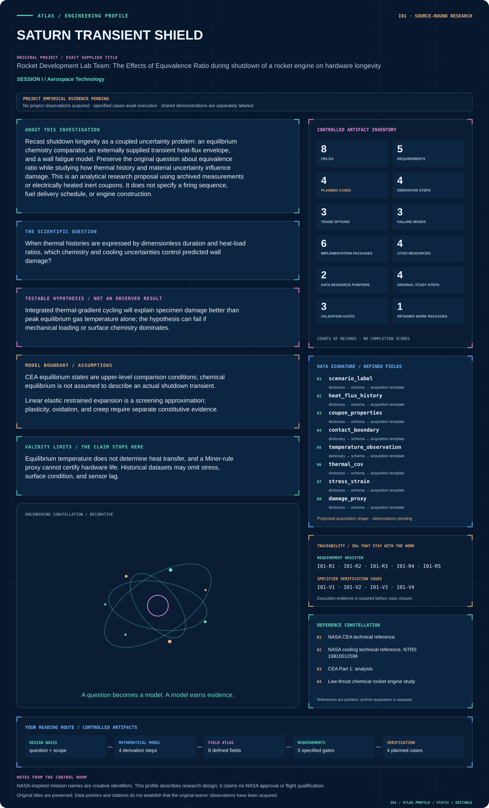

| Profile panel | Engineering signal | Open the evidence |
| --- | --- | --- |
| Mission identity | Rocket Development Lab Team: The Effects of Equivalence Ratio during shutdown of a rocket engine on hardware longevity | [Scientific objective](../research/I/I01-saturn-transient-shield/README.md#purpose-and-scientific-objective) |
| Model cockpit | 4 governing expressions; 4 derivation steps; declared assumptions and validity envelope | [Mathematical formulation](../research/I/I01-saturn-transient-shield/README.md#4-mathematical-model-and-derivation) |
| Data blueprint | 8 proposed fields with types, units and quality rules | [Field map & downloads](../research/I/I01-saturn-transient-shield/data/README.md) |
| Verification queue | 5 proposed requirements; 4 specified cases; project execution evidence pending | [Case definitions](../research/I/I01-saturn-transient-shield/README.md#8-verification-and-validation-cases) |
| Figure wall | Architecture, field map, planned result description | [Open full gallery](../research/I/I01-saturn-transient-shield/figures/README.md) |
| Resource library | 4 cited primary resources with support statements | [Cited resources](../research/I/I01-saturn-transient-shield/README.md#12-cited-technical-and-scientific-resources) |

#### Model cockpit

**Analysis method:** Define a factorial virtual experiment over normalized pulse shapes, thermal-contact conductance, and material property uncertainty. Treat supplied chemistry scenarios as labels and propagate their heat-load envelopes through a transient conduction solver. Fit an interpretable response surface for peak gradient, residual strain, and cycle-damage proxy. A Bayesian discrepancy term separates thermocouple error from model inadequacy. Rank factors with variance decomposition and report parameter combinations where the simple fatigue representation fails; never infer a recommended shutdown recipe from this reduced model.

**Operating envelope:** Equilibrium temperature does not determine heat transfer, and a Miner-rule proxy cannot certify hardware life. Historical datasets may omit stress, surface condition, and sensor lag.

**Variables and conventions**

- phi is dimensionless fuel-to-oxidizer equivalence ratio; it is an explanatory covariate, not an operating instruction.
- T in K; rho in kg m^-3; cp in J kg^-1 K^-1; conductivity k in W m^-1 K^-1; volumetric heating qv in W m^-3.
- E and thermal stress in Pa; expansion coefficient alphaT in K^-1; Poisson ratio nu dimensionless.
- n_j and N_j are applied and estimated allowable cycle counts; D is a screening damage index with uncertain material calibration.
- Reference scales define dimensionless time tau and temperature theta; no numeric engine geometry is assumed.

#### Artifact wall


Externally supplied heat, rather than a combustion schedule, drives an inert thermal model; mechanical damage remains gated by applicable material evidence.

**Scientific result to produce:** A dimensionless heat-duration versus contact-conductance map colored by damage proxy, with separate uncertainty contours and clearly labeled synthetic cases.

#### Investigation feed · planned work

The feed records proposed work packages. A row becomes executed evidence only with versioned inputs, outputs and a reviewed result.

| Sequence | Evidence state | Engineering work package |
| --- | --- | --- |
| 01 | Planned | Create chemistry-label and externally supplied heat-envelope schemas. |
| 02 | Planned | Verify inert coupon/material/sensor metadata and allowed domain. |
| 03 | Planned | Implement conservative conduction and sensor-response operators. |
| 04 | Planned | Fit contact/property uncertainty with independent lag calibration. |
| 05 | Planned | Add restrained elasticity and gated material-cycle model. |
| 06 | Planned | Publish normalized response surfaces, uncertainty ranking and withheld-surrogate predictions. |

#### Mission connections

Connections are reading routes based on actual shared resources, supplied sessions or included illustrations. They do not establish physical dependencies, team collaborations or validated results.

| Connected mission | Original investigation | Recorded connection basis |
| --- | --- | --- |
| [I02 · APOLLO AQUATHERM](../research/I/I02-apollo-aquatherm/README.md) | Rocket Development Lab Team: Thermal Management Analysis of Water-Cooled Rocket Engine | Session I; [NASA cooling technical reference, NTRS 19810012596](https://ntrs.nasa.gov/api/citations/19810012596/downloads/19810012596.pdf); [Low-thrust chemical rocket engine study](https://ntrs.nasa.gov/citations/19810012596) |
| [I03 · SATURN CHANNEL ATLAS](../research/I/I03-saturn-channel-atlas/README.md) | Rocket Development Lab Team: Cooling Channel Geometry Analysis for a Regeneratively Cooled Rocket Engine | Session I; [NASA cooling technical reference, NTRS 19810012596](https://ntrs.nasa.gov/api/citations/19810012596/downloads/19810012596.pdf); [Low-thrust chemical rocket engine study](https://ntrs.nasa.gov/citations/19810012596) |
| [I04 · ORION SENTINEL CORE](../research/I/I04-orion-sentinel-core/README.md) | EagleSat Team: On-board Computer Subsystem | Session I |
| [I05 · PIONEER AERODRIFT](../research/I/I05-pioneer-aerodrift/README.md) | Pico Balloon Platform for Atmospheric Exploration | Session I |
| [I06 · SATURN LOADPATH](../research/I/I06-saturn-loadpath/README.md) | Designing and Exploring the Structure of Launch Vehicles to Create Optimal Theoretical and Small-Scale Experimental Models | Session I |
| [I07 · GATEWAY CATSAT CONSOLE](../research/I/I07-gateway-catsat-console/README.md) | CatSat Groundstation Command and Control | Session I |

[Machine-readable connection register and ranking rule](../registry/mission_connections.json)

#### Reading playlist

| Route | Start here | Continue to |
| --- | --- | --- |
| Understand the idea | [Scientific objective](../research/I/I01-saturn-transient-shield/README.md#purpose-and-scientific-objective) | [Design boundary](../research/I/I01-saturn-transient-shield/README.md#1-design-basis-and-analysis-boundary) → [Mathematics](../research/I/I01-saturn-transient-shield/README.md#4-mathematical-model-and-derivation) |
| Inspect the data | [Visual blueprint](../research/I/I01-saturn-transient-shield/data/README.md) | [Provenance](../research/I/I01-saturn-transient-shield/README.md#5-data-specifications-and-provenance) → [Uncertainty](../research/I/I01-saturn-transient-shield/README.md#6-uncertainty-sensitivity-and-identifiability) |
| Make a design decision | [Trade study](../research/I/I01-saturn-transient-shield/README.md#7-engineering-trade-study) | [Failure modes](../research/I/I01-saturn-transient-shield/README.md#10-failure-modes-and-interpretation-controls) → [Required outputs](../research/I/I01-saturn-transient-shield/README.md#11-required-engineering-outputs) |
| Prepare execution | [Requirements](../research/I/I01-saturn-transient-shield/README.md#2-requirements-and-verification-traceability) | [Verification](../research/I/I01-saturn-transient-shield/README.md#8-verification-and-validation-cases) → [Implementation](../research/I/I01-saturn-transient-shield/README.md#9-implementation-and-reproducible-work-packages) |

### Complete engineering dossier

The profile above is a browsing layer. The full design basis, equations, derivations, data contract, uncertainty, trades and controlled case definitions follow.

### Purpose and scientific objective

Recast shutdown longevity as a coupled uncertainty problem: an equilibrium chemistry comparator, an externally supplied transient heat-flux envelope, and a wall fatigue model. Preserve the original question about equivalence ratio while studying how thermal history and material uncertainty influence damage. This is an analytical research proposal using archived measurements or electrically heated inert coupons. It does not specify a firing sequence, fuel delivery schedule, or engine construction.

**Question:** When thermal histories are expressed by dimensionless duration and heat-load ratios, which chemistry and cooling uncertainties control predicted wall damage?

**Testable hypothesis:** Integrated thermal-gradient cycling will explain specimen damage better than peak equilibrium gas temperature alone; the hypothesis can fail if mechanical loading or surface chemistry dominates.

### 1. Design basis and analysis boundary

The longevity analysis treats equivalence ratio as a source-supplied explanatory label and equilibrium chemistry as a comparator. Its executable boundary starts with externally supplied transient heat-flux envelopes or independently measured electrical heating on inert coupons. It ends with temperature gradients, strain uncertainty and a screening damage index. It contains no engine geometry, fuel delivery schedule or firing sequence.

Begin with dimensionless conduction and restrained elastic expansion, then temperature-dependent properties and calibrated cyclic constitutive behavior only if material evidence exists. CEA supplies equilibrium assumptions, not a shutdown heat-transfer history. Coupon dimensions/material certificates, permissible thermal envelope and sensor calibration remain TBD. The output ranks uncertainty drivers and model failure regions rather than recommending a shutdown procedure or certifying hardware life.

### 2. Requirements and verification traceability

These are project design requirements or proposed analysis gates. A numerical target is not a NASA requirement unless its controlling source is explicitly identified. “TBD” identifies evidence required before a decision; it is not permission to assume a value. Verification evidence listed here is planned, unless a linked result explicitly records execution.

| ID | Requirement / gate | Engineering rationale | Verification method | Basis / required evidence |
| --- | --- | --- | --- | --- |
| I01-R1 | Every thermal scenario shall identify an external heat-load source or inert electrical power measurement, separately from phi. | Equilibrium temperature does not determine incident wall heat flux. | Scenario/source and energy-boundary audit. | CEA boundary plus proposed thermal contract. |
| I01-R2 | Integrated heat balance shall close within 1% in synthetic conduction fixtures, a proposed target. | Numerical energy loss corrupts gradient/damage trends. | Stored-energy plus boundary-flux convergence. | Proposed numerical conservation target. |
| I01-R3 | Sensor response and contact conductance shall be independently calibrated or marked unidentifiable. | Both can mimic delayed wall cooling. | Lag/contact synthetic identifiability and calibration ledger. | Proposed metrology requirement. |
| I01-R4 | Damage shall be labeled a conditional screening index with material-cycle evidence and uncertainty. | Miner accumulation cannot certify life. | Constitutive provenance and applicability audit. | Proposed fatigue-scope rule. |
| I01-R5 | Any measured validation shall use a noncombusting inert surrogate inside an independently approved material/instrument envelope. | A thermal-model validation needs a controlled known input. | Reviewable coupon/load/sensor manifest and holdout pulse data. | Proposed surrogate gate; no engine operation specified. |

### 3. Architecture and controlled interfaces

A chemistry-label adapter records externally supplied phi and equilibrium-model version without converting them into an operational schedule. A heat-envelope interface supplies time, surface heat flux, spatial weighting and covariance. The coupon thermal solver uses verified thickness/material properties and measured contact/environment boundary conditions. Electrical surrogate data have a separate known-power ledger.

A sensor operator convolves predicted local temperature with calibrated thermocouple/IR response. A constitutive module maps temperature gradients to elastic stress and optional calibrated inelastic strain. A cycle counter and material curve generate damage proxy distributions. Shared uncertainty in heat load or conductivity propagates to all downstream outputs; missing material calibration blocks life interpretation rather than producing a nominal cycle count.


Externally supplied heat, rather than a combustion schedule, drives an inert thermal model; mechanical damage remains gated by applicable material evidence.

[Editable engineering diagram source](../research/I/I01-saturn-transient-shield/figures/architecture.mmd)

### 4. Mathematical model and derivation

#### Governing equations

$$
\phi=(F/O)/(F/O)_{\rm stoich}
$$

$$
\rho c_p\partial T/\partial t=\nabla\cdot(k\nabla T)+q_v
$$

$$
\sigma_{\rm th}\approx E\alpha_T\Delta T/(1-\nu);\quad D=\sum_j n_j/N_j
$$

$$
\tau=t/t_{\rm ref};\quad \theta=(T-T_0)/\Delta T_{\rm ref}
$$

#### Variables, units and conventions

- phi is dimensionless fuel-to-oxidizer equivalence ratio; it is an explanatory covariate, not an operating instruction.
- T in K; rho in kg m^-3; cp in J kg^-1 K^-1; conductivity k in W m^-1 K^-1; volumetric heating qv in W m^-3.
- E and thermal stress in Pa; expansion coefficient alphaT in K^-1; Poisson ratio nu dimensionless.
- n_j and N_j are applied and estimated allowable cycle counts; D is a screening damage index with uncertain material calibration.
- Reference scales define dimensionless time tau and temperature theta; no numeric engine geometry is assumed.

#### Assumptions and boundary conditions

- CEA equilibrium states are upper-level comparison conditions; chemical equilibrium is not assumed to describe an actual shutdown transient.
- Linear elastic restrained expansion is a screening approximation; plasticity, oxidation, and creep require separate constitutive evidence.

#### Derivation step 1

$$
\rho c_p\partial_tT=\nabla\cdot(k\nabla T)+q_v
$$

Temperature-dependent properties enter the energy equation; surface heating is a boundary flux and must not also be counted as volumetric q_v.

#### Derivation step 2

$$
Fo=\alpha t_{ref}/L^2,\quad Bi=hL/k,\quad\alpha=k/(\rho c_p)
$$

These dimensionless groups distinguish diffusion time and boundary coupling. L is a verified coupon reference length, not invented engine geometry.

#### Derivation step 3

$$
\sigma_{th}\approx E\alpha_T\Delta T/(1-\nu)
$$

This restrained biaxial elastic screening relation requires the chosen constraint convention. Free expansion would not generate this stress.

#### Derivation step 4

$$
D=\sum_jn_j/N_j(\Delta\epsilon_j,T_j,\mathcal M)
$$

Material model M and cycle range determine allowable cycles. Damage is dimensionless; unknown N_j yields an unsupported result, not a guessed lifetime.

#### Inference or simulation procedure

Define a factorial virtual experiment over normalized pulse shapes, thermal-contact conductance, and material property uncertainty. Treat supplied chemistry scenarios as labels and propagate their heat-load envelopes through a transient conduction solver. Fit an interpretable response surface for peak gradient, residual strain, and cycle-damage proxy. A Bayesian discrepancy term separates thermocouple error from model inadequacy. Rank factors with variance decomposition and report parameter combinations where the simple fatigue representation fails; never infer a recommended shutdown recipe from this reduced model.

#### Validity domain and fidelity limits

Equilibrium temperature does not determine heat transfer, and a Miner-rule proxy cannot certify hardware life. Historical datasets may omit stress, surface condition, and sensor lag.

### 5. Data specifications and provenance


**Proposed data contract · observations pending.** This visual inventory shows the record fields to acquire or derive. It contains no project measurements. [Open the data blueprint and downloads](../research/I/I01-saturn-transient-shield/data/README.md).

| Field | Type | Unit | Physical / statistical meaning | Quality and missing-data rule |
| --- | --- | --- | --- | --- |
| scenario_label | struct | 1 | External phi/chemistry comparator identity. | No encoded firing/flow schedule. |
| heat_flux_history | measurement<float64[n,npatch]> | W m^-2 | Externally provided boundary heat load. | Source/covariance and spatial interpolation required. |
| coupon_properties | measurement<struct> | m, kg m^-3, J kg^-1 K^-1, W m^-1 K^-1 | Verified inert geometry and material. | Temperature validity range recorded. |
| contact_boundary | posterior<struct> | W m^-2 K^-1, K | Contact/environment thermal conditions. | Independent calibration or prior-dominance flag. |
| temperature_observation | float64[n,nsensor] | K | Sensor measurements/predictions. | Missing samples masked; lag response retained. |
| thermal_cov | float64[n,n] | K^2 | Sensor/input/model covariance. | Common heat/load and calibration terms preserved. |
| stress_strain | distribution<struct> | Pa, 1 | Conditional restrained mechanical response. | Constraint/inelastic model version explicit. |
| damage_proxy | posterior<float64>&#124;null | 1 | Screening cycle accumulation. | Null without applicable material-cycle evidence. |

[Machine-readable record schema](../research/I/I01-saturn-transient-shield/data/schema.json) · [Empty acquisition CSV](../research/I/I01-saturn-transient-shield/data/acquisition.csv) · [Field dictionary CSV](../research/I/I01-saturn-transient-shield/data/dictionary.csv)

The CSV above contains column headers only. Its schema defines future records and does not establish that original-team data or a particular archive product have been acquired. Frame, timing, calibration, covariance, selection and provenance details must accompany populated records.

#### NASA CEA reference

[Product, archive or reference](https://ntrs.nasa.gov/api/citations/19950013764/downloads/19950013764.pdf)

**Fields:** Thermodynamic assumptions, equilibrium outputs, species and property metadata

**Access:** Public technical reference; create explicitly synthetic dimensionless scenarios.

**Role:** Chemistry-model boundary and reproducible comparison.

#### NASA rocket cooling technical reference

[Product, archive or reference](https://ntrs.nasa.gov/api/citations/19810012596/downloads/19810012596.pdf)

**Fields:** Published cooling analyses and stated correlation regimes

**Access:** Archive source is public; new raw transient test data are not supplied. Request owner-approved records.

**Role:** Independent heat-transfer comparator; no historical measurements are invented.

### 6. Uncertainty, sensitivity and identifiability

Externally supplied heat histories may have uncertain amplitude, duration and spatial distribution. Conductivity, contact resistance and sensor lag can compensate in a temperature trace, especially with one sensor. Use independent lag calibration, several sensor depths/locations where available, and likelihood sensitivity across dimensionless Fo/Bi scenarios. Do not attribute all differences between chemistry labels to equivalence ratio if heat envelopes differ in uncontrolled ways.

Elastic restraint, temperature-dependent modulus, plasticity, creep and oxidation affect the damage mapping. Begin with explicit model-discrepancy ranges and inspect covariance between peak gradient and constitutive parameters. Hold out normalized heat shapes and compare temperature/strain predictions separately. Variance decomposition ranks what the reduced model identifies; lifetime remains unsupported until material-cycle and environmental evidence are adequate.

### 7. Engineering trade study

| Alternative | Benefit | Cost / limitation | Decision rule |
| --- | --- | --- | --- |
| Lumped coupon model | Fast heat/duration screening. | Misses through-thickness gradients. | Use only at small verified internal gradients. |
| Distributed transient conduction | Resolves gradient and sensor locations. | Property/boundary uncertainty. | Use primary model when independent sensors constrain it. |
| Calibrated inelastic fatigue model | More meaningful strain-cycle mapping. | Needs material/environment data. | Enable only after thermal validation and applicable constitutive evidence. |

### 8. Verification and validation cases

| Case ID | Stimulus / condition | Expected result / criterion | Method | Evidence artifact |
| --- | --- | --- | --- | --- |
| I01-V1 | Adiabatic known input | Stored thermal energy increase equals integrated supplied power. | Uniform-property insulated fixture. | Energy conservation. |
| I01-V2 | Zero heat and equal boundaries | Uniform initial temperature remains unchanged. | Exact equilibrium fixture. | Conduction equilibrium. |
| I01-V3 | Free expansion alternative | Removing restraint eliminates the screened thermal stress despite nonzero temperature rise. | Constraint-toggle analytic case. | Elastic restraint distinction. |
| I01-V4 | Withheld inert heat shape | Temperature/strain interval coverage is assessed without changing contact/lag fits. | Noncombusting known-power surrogate holdout. | Proposed thermal validation gate. |

**Execution status:** these cases are specified, not claimed as executed. Close a case only with the versioned inputs, output, uncertainty, reviewer and pass/fail rationale.

#### Additional scientific validation gates

- Demonstrate grid and time-step convergence; set the numerical error allowance below 10% of the allocated total prediction uncertainty.
- Hold out complete thermal cycles and material lots; compare interval coverage and residual structure.
- Close the heat balance and test whether adding peak temperature improves withheld damage prediction beyond thermal-gradient exposure.

### 9. Implementation and reproducible work packages

1. Create chemistry-label and externally supplied heat-envelope schemas.
2. Verify inert coupon/material/sensor metadata and allowed domain.
3. Implement conservative conduction and sensor-response operators.
4. Fit contact/property uncertainty with independent lag calibration.
5. Add restrained elasticity and gated material-cycle model.
6. Publish normalized response surfaces, uncertainty ranking and withheld-surrogate predictions.

#### Investigation sequence

1. Freeze a provenance manifest, material-property priors, and the distinction between synthetic scenarios and measured records.
2. Verify the conduction solver on an analytic slab; add measurement lag before fitting any archived thermal transient.
3. Use an inert heated specimen to test predicted gradient ordering, if an institutionally supervised facility is available.
4. Publish a sensitivity map and list unresolved damage mechanisms before discussing engineering applicability.

#### Resources and interfaces to expertise

- Transient heat-transfer solver, uncertainty sampler, material-property references, calibrated thermometry, and a qualified thermal/materials mentor.

### 10. Failure modes and interpretation controls

| Failure mode | Effect on result | Detection / evidence | Design response |
| --- | --- | --- | --- |
| CEA temperature used as heat flux | Unsupported wall load/damage. | Heat-source contract lacks transfer evidence. | Require external flux envelope and uncertainty. |
| Lag absorbed into material response | Biased conductivity/cooling inference. | Parameter correlation and calibrated sensor mismatch. | Independent sensor dynamics and multiple locations. |
| Damage proxy called certified life | False longevity guarantee. | Missing cycle/environment applicability. | Report conditional screening and failure envelope. |

- Unrecorded surface reactions and common-mode sensor bias can reverse factor rankings. The outcome remains a research screening result, not a hardware-life certification.

### 11. Required engineering outputs

- Dimensionless thermal-history atlas, uncertainty budget, coupon-validation specification, and a traceable fatigue-screening report.

#### Scientific result figures to produce during execution

A dimensionless heat-duration versus contact-conductance map colored by damage proxy, with separate uncertainty contours and clearly labeled synthetic cases.

### 12. Cited technical and scientific resources

- [NASA CEA technical reference](https://ntrs.nasa.gov/api/citations/19950013764/downloads/19950013764.pdf) — Equilibrium chemistry framework and its assumptions.
- [NASA cooling technical reference, NTRS 19810012596](https://ntrs.nasa.gov/api/citations/19810012596/downloads/19810012596.pdf) — Published rocket heat-transfer and cooling context.
- [CEA Part 1: analysis](https://ntrs.nasa.gov/citations/19950013764) — Equilibrium-chemistry method boundary; no actual shutdown heat history is supplied.
- [Low-thrust chemical rocket engine study](https://ntrs.nasa.gov/citations/19810012596) — Published cooling/transport analysis context; engine dimensions/operations are not transferred to this inert study.

Framework and evidence rules: [engineering documentation standard](../engineering/ENGINEERING_STANDARD.md), [model assurance](../engineering/MODEL_ASSURANCE.md), [uncertainty procedure](../engineering/UNCERTAINTY_AND_DECISION_RULES.md), [data management](../engineering/DATA_MANAGEMENT.md). NASA-inspired names are creative identifiers; requirements and results are not NASA certification.

---

<a id="i02"></a>

## I02 · APOLLO AQUATHERM

**Original project:** Rocket Development Lab Team: Thermal Management Analysis of Water-Cooled Rocket Engine

**Session I:** Aerospace Technology

**Document class:** engineering research design and analysis record · **Revision:** 4 · **Date:** 2026-10-02

**Evidence state:** design basis, mathematical formulation and verification plan documented. Project-specific empirical results remain to be acquired; executable shared model demonstrations have their own recorded checks.

[Session I](../research/I/README.md) · [All projects](../ENGINEERING_DOCUMENTATION.md) · [Session handbook](SESSION_I.md) · [← I01](../research/I/I01-saturn-transient-shield/README.md) · [I03 →](../research/I/I03-saturn-channel-atlas/README.md)

| Proposed requirements | Specified verification cases | Defined data fields | Cited resources |
| ---: | ---: | ---: | ---: |
| 6 | 4 | 8 | 3 |

[Explore the data blueprint](../research/I/I02-apollo-aquatherm/data/README.md) · [Open the figure gallery](../research/I/I02-apollo-aquatherm/figures/README.md) · [Download acquisition template](../research/I/I02-apollo-aquatherm/data/acquisition.csv) · [Browse the data atlas](../data/README.md)

---

### Mission profile


| Profile panel | Engineering signal | Open the evidence |
| --- | --- | --- |
| Mission identity | Rocket Development Lab Team: Thermal Management Analysis of Water-Cooled Rocket Engine | [Scientific objective](../research/I/I02-apollo-aquatherm/README.md#purpose-and-scientific-objective) |
| Model cockpit | 4 governing expressions; 4 derivation steps; declared assumptions and validity envelope | [Mathematical formulation](../research/I/I02-apollo-aquatherm/README.md#4-mathematical-model-and-derivation) |
| Data blueprint | 8 proposed fields with types, units and quality rules | [Field map & downloads](../research/I/I02-apollo-aquatherm/data/README.md) |
| Verification queue | 6 proposed requirements; 4 specified cases; project execution evidence pending | [Case definitions](../research/I/I02-apollo-aquatherm/README.md#8-verification-and-validation-cases) |
| Figure wall | Architecture, field map, planned result description | [Open full gallery](../research/I/I02-apollo-aquatherm/figures/README.md) |
| Resource library | 3 cited primary resources with support statements | [Cited resources](../research/I/I02-apollo-aquatherm/README.md#12-cited-technical-and-scientific-resources) |

#### Model cockpit

**Analysis method:** Represent the wall as a small thermal graph coupled to an advection network. Calibrate loss conductance using heater-off cooling and use separate instrument calibration for inlet/outlet thermometry. Infer contact resistance and convection only after checking parameter identifiability; add distributed wall sensors where competing parameter combinations make different predictions. Propagate property uncertainty and sensor response functions through transient simulations. Use a reduced-order emulator for rapid what-if analysis, with interpolation restricted to the validated dimensionless envelope. Report hot-spot uncertainty rather than only bulk coolant temperature.

**Operating envelope:** A laboratory surrogate tests energy accounting and model structure; it does not reproduce reactive flow, combustion-chamber geometry, or full-scale cooling performance. Correlations lose validity outside their specified flow regime.

**Variables and conventions**

- T in K; thermal capacitance C in J K^-1; conductance G in W K^-1; heat load Q in W.
- h in W m^-2 K^-1; wetted area A in m^2; coolant mass flow mdot in kg s^-1; cp in J kg^-1 K^-1.
- u in m s^-1; hydraulic diameter Dh in m; dynamic viscosity mu in Pa s; fluid conductivity kf in W m^-1 K^-1.
- Re and Nu are dimensionless; stored energy U in J and heat-loss uncertainty must be retained.

#### Artifact wall


Wall storage, coolant enthalpy and ambient loss are accounted separately; surrogate validation is restricted to independently characterized single-phase states.

**Scientific result to produce:** A heat-flow diagram showing input, coolant uptake, storage, and loss beside held-out measured/predicted temperature traces with uncertainty bands.

#### Investigation feed · planned work

The feed records proposed work packages. A row becomes executed evidence only with versioned inputs, outputs and a reviewed result.

| Sequence | Evidence state | Engineering work package |
| --- | --- | --- |
| 01 | Planned | Verify inert loop/thermal graph and independently set single-phase limits. |
| 02 | Planned | Calibrate electrical power, flow and temperature/lag interfaces. |
| 03 | Planned | Implement conservative wall/advection enthalpy model. |
| 04 | Planned | Fit ambient losses before contact/convection where identifiable. |
| 05 | Planned | Run withheld load/flow cases and spatial hotspot checks. |
| 06 | Planned | Release energy ledgers, parameter covariance and emulator domain masks. |

#### Mission connections

Connections are reading routes based on actual shared resources, supplied sessions or included illustrations. They do not establish physical dependencies, team collaborations or validated results.

| Connected mission | Original investigation | Recorded connection basis |
| --- | --- | --- |
| [I01 · SATURN TRANSIENT SHIELD](../research/I/I01-saturn-transient-shield/README.md) | Rocket Development Lab Team: The Effects of Equivalence Ratio during shutdown of a rocket engine on hardware longevity | Session I; [NASA cooling technical reference, NTRS 19810012596](https://ntrs.nasa.gov/api/citations/19810012596/downloads/19810012596.pdf); [Published cooling/transport analysis](https://ntrs.nasa.gov/citations/19810012596) |
| [I03 · SATURN CHANNEL ATLAS](../research/I/I03-saturn-channel-atlas/README.md) | Rocket Development Lab Team: Cooling Channel Geometry Analysis for a Regeneratively Cooled Rocket Engine | Session I; [NASA cooling technical reference, NTRS 19810012596](https://ntrs.nasa.gov/api/citations/19810012596/downloads/19810012596.pdf); [Published cooling/transport analysis](https://ntrs.nasa.gov/citations/19810012596) |
| [E06 · APOLLO THERMALIS](../research/E/E06-apollo-thermalis/README.md) | Study of Thermal Heat Transfer Within a High-Altitude Balloon Payload | [NASA Small Spacecraft Thermal Control](https://www.nasa.gov/smallsat-institute/sst-soa/thermal-control/) |
| [I04 · ORION SENTINEL CORE](../research/I/I04-orion-sentinel-core/README.md) | EagleSat Team: On-board Computer Subsystem | Session I |
| [I05 · PIONEER AERODRIFT](../research/I/I05-pioneer-aerodrift/README.md) | Pico Balloon Platform for Atmospheric Exploration | Session I |
| [I06 · SATURN LOADPATH](../research/I/I06-saturn-loadpath/README.md) | Designing and Exploring the Structure of Launch Vehicles to Create Optimal Theoretical and Small-Scale Experimental Models | Session I |

[Machine-readable connection register and ranking rule](../registry/mission_connections.json)

#### Reading playlist

| Route | Start here | Continue to |
| --- | --- | --- |
| Understand the idea | [Scientific objective](../research/I/I02-apollo-aquatherm/README.md#purpose-and-scientific-objective) | [Design boundary](../research/I/I02-apollo-aquatherm/README.md#1-design-basis-and-analysis-boundary) → [Mathematics](../research/I/I02-apollo-aquatherm/README.md#4-mathematical-model-and-derivation) |
| Inspect the data | [Visual blueprint](../research/I/I02-apollo-aquatherm/data/README.md) | [Provenance](../research/I/I02-apollo-aquatherm/README.md#5-data-specifications-and-provenance) → [Uncertainty](../research/I/I02-apollo-aquatherm/README.md#6-uncertainty-sensitivity-and-identifiability) |
| Make a design decision | [Trade study](../research/I/I02-apollo-aquatherm/README.md#7-engineering-trade-study) | [Failure modes](../research/I/I02-apollo-aquatherm/README.md#10-failure-modes-and-interpretation-controls) → [Required outputs](../research/I/I02-apollo-aquatherm/README.md#11-required-engineering-outputs) |
| Prepare execution | [Requirements](../research/I/I02-apollo-aquatherm/README.md#2-requirements-and-verification-traceability) | [Verification](../research/I/I02-apollo-aquatherm/README.md#8-verification-and-validation-cases) → [Implementation](../research/I/I02-apollo-aquatherm/README.md#9-implementation-and-reproducible-work-packages) |

### Complete engineering dossier

The profile above is a browsing layer. The full design basis, equations, derivations, data contract, uncertainty, trades and controlled case definitions follow.

### Purpose and scientific objective

Build a thermal-network digital twin that explains how an externally specified heat load moves through a water-cooled wall into coolant. Keep the original water-cooling research objective, but validate the model on an electrically heated, noncombusting flow-loop surrogate. The main advance is a measurable energy and uncertainty budget that distinguishes sensor lag, contact resistance, and flow maldistribution from an apparent heat-transfer improvement.

**Question:** Can a calibrated network predict coolant outlet temperature and wall hot spots under withheld transient heat loads without silently absorbing model errors into fitted convection coefficients?

**Testable hypothesis:** A network that includes wall capacitance and branch-level flow uncertainty will provide better calibrated transient predictions than a steady single-channel energy balance.

### 1. Design basis and analysis boundary

The water-cooling twin follows externally specified heat through an inert heated wall, contact paths and a single-phase liquid loop. The primary products are coolant enthalpy rise, distributed wall temperatures and an energy residual with uncertainty. Published cooling analysis provides terminology and regime context; no reactive chamber, engine geometry or operational schedule is assumed.

Begin with a thermal graph and plug-flow advection, then distributed wall/fluid states and calibrated loss/sensor dynamics. Validation uses a noncombusting electrically heated flow-loop surrogate with independently measured power. Flow range, material limits, passage dimensions and hardware are TBD until verified. Boiling, reactive fluids and engine loading are outside the initial validated domain and cannot be inferred from successful surrogate closure.

### 2. Requirements and verification traceability

These are project design requirements or proposed analysis gates. A numerical target is not a NASA requirement unless its controlling source is explicitly identified. “TBD” identifies evidence required before a decision; it is not permission to assume a value. Verification evidence listed here is planned, unless a linked result explicitly records execution.

| ID | Requirement / gate | Engineering rationale | Verification method | Basis / required evidence |
| --- | --- | --- | --- | --- |
| I02-R1 | Applied electrical or supplied thermal power shall be independently measured and carry covariance. | Fitted h cannot compensate for unknown input energy. | Power-meter/calibration and heat-load ledger audit. | Proposed energy-input contract. |
| I02-R2 | Synthetic transient energy closure shall remain within 1% of integrated input, a proposed target. | Storage and heat loss affect apparent cooling. | Conservative graph/advection integration fixtures. | Proposed numerical target. |
| I02-R3 | Single-phase applicability shall be verified from measured fluid state and independently set facility limits. | A single-phase correlation cannot describe boiling. | Domain flags and validated-state envelope. | Proposed noncombusting surrogate gate. |
| I02-R4 | Outlet-temperature and wall-hotspot predictions shall be validated on withheld heat/flow histories. | Bulk temperature agreement can hide local errors. | Separate sensor/location/time holdouts. | Proposed prediction requirement. |
| I02-R5 | Contact, loss and convection parameters shall have identifiability diagnostics before calibration is accepted. | Multiple conductances can fit one trace. | Sensitivity rank and posterior correlation report. | Proposed calibration criterion. |
| I02-R6 | Sensor lag and differential thermometer offsets shall propagate into energy balance. | Small outlet-inlet differences amplify bias. | Calibrated dynamic/offset injection. | Proposed metrology requirement. |

### 3. Architecture and controlled interfaces

A thermal-load interface provides watts versus time and spatial distribution. The wall graph stores capacitance and pairwise conductance; the liquid network carries mass flow and temperature-dependent enthalpy. A loss model links wall to ambient with independent heater-off evidence. The acquisition adapter supplies power, inlet/outlet/wall temperatures, flow and timestamp covariance.

A sensor operator predicts measured rather than instantaneous temperatures. Parameter inference distinguishes contact and convection from enclosure losses, then an energy accountant integrates stored energy and advected enthalpy. A reduced-order emulator receives only scenarios inside the validated Re/Nu/property envelope. Missing sensors or flow uncertainty therefore widen hotspot and energy-residual intervals instead of appearing as a heat-transfer improvement.


Wall storage, coolant enthalpy and ambient loss are accounted separately; surrogate validation is restricted to independently characterized single-phase states.

[Editable engineering diagram source](../research/I/I02-apollo-aquatherm/figures/architecture.mmd)

### 4. Mathematical model and derivation

#### Governing equations

$$
C_i\dot T_i=Q_i+\sum_jG_{ij}(T_j-T_i)-h_iA_i(T_i-T_{f,i})
$$

$$
\dot m_i c_p(T_{f,i+1}-T_{f,i})=h_iA_i(T_i-T_{f,i})
$$

$$
Q_{\rm in}-\dot m c_p(T_{\rm out}-T_{\rm in})-Q_{\rm loss}=dU/dt
$$

$$
\mathrm{Re}=\rho uD_h/\mu;\quad \mathrm{Nu}=hD_h/k_f
$$

#### Variables, units and conventions

- T in K; thermal capacitance C in J K^-1; conductance G in W K^-1; heat load Q in W.
- h in W m^-2 K^-1; wetted area A in m^2; coolant mass flow mdot in kg s^-1; cp in J kg^-1 K^-1.
- u in m s^-1; hydraulic diameter Dh in m; dynamic viscosity mu in Pa s; fluid conductivity kf in W m^-1 K^-1.
- Re and Nu are dimensionless; stored energy U in J and heat-loss uncertainty must be retained.

#### Assumptions and boundary conditions

- Single-phase liquid and declared correlation-validity ranges are the initial model domain; boiling is outside this surrogate.
- Applied heat is independently measured. Unmodeled enclosure loss cannot be assigned to coolant uptake.

#### Derivation step 1

$$
C_i\dot T_i=Q_i+\sum_jG_{ij}(T_j-T_i)-h_iA_i(T_i-T_{f,i})
$$

Each term is watts; antisymmetric internal conductance exchanges cancel in the summed wall energy balance.

#### Derivation step 2

$$
\dot m[h_f(T_{out})-h_f(T_{in})]=Q_{coolant}
$$

Use fluid enthalpy when cp varies appreciably. Constant cp reduces to mass flow times cp times temperature rise.

#### Derivation step 3

```text
Q_{in}-Q_{coolant}-Q_{loss}=dU/dt
```

During a transient, coolant uptake alone is not input power. Integrate this equation to distinguish storage from missing heat.

#### Derivation step 4

$$
Re=\rho uD_h/\mu,\quad Nu=hD_h/k_f
$$

Dimensionless groups classify the measured single-phase correlation domain. Correlation validity and developing-flow effects accompany any inferred h.

#### Inference or simulation procedure

Represent the wall as a small thermal graph coupled to an advection network. Calibrate loss conductance using heater-off cooling and use separate instrument calibration for inlet/outlet thermometry. Infer contact resistance and convection only after checking parameter identifiability; add distributed wall sensors where competing parameter combinations make different predictions. Propagate property uncertainty and sensor response functions through transient simulations. Use a reduced-order emulator for rapid what-if analysis, with interpolation restricted to the validated dimensionless envelope. Report hot-spot uncertainty rather than only bulk coolant temperature.

#### Validity domain and fidelity limits

A laboratory surrogate tests energy accounting and model structure; it does not reproduce reactive flow, combustion-chamber geometry, or full-scale cooling performance. Correlations lose validity outside their specified flow regime.

### 5. Data specifications and provenance


**Proposed data contract · observations pending.** This visual inventory shows the record fields to acquire or derive. It contains no project measurements. [Open the data blueprint and downloads](../research/I/I02-apollo-aquatherm/data/README.md).

| Field | Type | Unit | Physical / statistical meaning | Quality and missing-data rule |
| --- | --- | --- | --- | --- |
| heat_input | measurement<float64[n]> | W | Known electrical/supplied thermal load. | Meter/reference and spatial allocation documented. |
| mass_flow | measurement<float64[n]> | kg s^-1 | Loop or branch flow. | Positive accepted range; missing flow blocks heat-rate estimate. |
| fluid_state | struct<float64[]> | K, Pa | Inlet/outlet and domain-monitoring states. | Single-phase status and fluid-property source. |
| wall_temperature | float64[n,nsensor] | K | Distributed wall observation. | Location/lag/calibration required. |
| thermal_graph | struct<C,G,hA> | J K^-1, W K^-1 | Wall/contact/convection network. | Conservative internal links and verified geometry. |
| sensor_cov | covariance | mixed declared | Power/temperature/flow/lag uncertainty. | Shared thermometer offset retained. |
| energy_ledger | float64[n,terms] | W or J | Input, uptake, loss and stored energy. | Instantaneous power and cumulative energy separate. |
| hotspot_prediction | posterior<float64> | K | Maximum conditional wall temperature. | Sensor coverage and model discrepancy attached. |

[Machine-readable record schema](../research/I/I02-apollo-aquatherm/data/schema.json) · [Empty acquisition CSV](../research/I/I02-apollo-aquatherm/data/acquisition.csv) · [Field dictionary CSV](../research/I/I02-apollo-aquatherm/data/dictionary.csv)

The CSV above contains column headers only. Its schema defines future records and does not establish that original-team data or a particular archive product have been acquired. Frame, timing, calibration, covariance, selection and provenance details must accompany populated records.

#### NASA cooling technical reference

[Product, archive or reference](https://ntrs.nasa.gov/api/citations/19810012596/downloads/19810012596.pdf)

**Fields:** Correlation definitions, heat-transfer framework, assumptions

**Access:** Public reference; identify the exact applicable regime before using a correlation.

**Role:** Physics comparator and terminology.

#### Proposed inert thermal-loop dataset

[Product, archive or reference](https://www.nasa.gov/smallsat-institute/sst-soa/thermal-control/)

**Fields:** Time, applied electrical power, inlet/outlet temperature, wall temperature, mass flow, ambient temperature, calibration covariance

**Access:** No dataset has been collected here. Publish planned schema and instrument certificates with future records.

**Role:** Known-power energy closure and parameter identification.

### 6. Uncertainty, sensitivity and identifiability

Differential thermometer offset can dominate coolant enthalpy uncertainty when temperature rise is small. Flow-meter gain, cp variation and timing misalignment contribute correlated error. Independently calibrate sensors and synchronize streams; propagate their covariance into the integrated energy residual rather than comparing nominal input and uptake alone.

Contact resistance, convection coefficient and ambient loss are difficult to separate from bulk outlet temperature. Use heater-off loss calibration and multiple wall sensors to distinguish their sensitivities. Evaluate parameter rank across flow/load scenarios, then hold out transient shapes. Maldistributed branch flow creates hotspots with small bulk changes; an emulator must preserve that uncertainty and avoid extrapolation outside the validated regime.

### 7. Engineering trade study

| Alternative | Benefit | Cost / limitation | Decision rule |
| --- | --- | --- | --- |
| Lumped thermal graph | Fast fitting and energy transparency. | Limited spatial hotspot resolution. | Use baseline with enough independent sensors. |
| Conjugate distributed model | Resolves wall/fluid gradients. | Higher input/property and mesh uncertainty. | Adopt when hotspot predictions need spatial detail. |
| Reduced-order emulator | Rapid scenario sweeps. | Cannot repair inaccurate parent physics. | Use only within a verified dimensionless envelope. |

### 8. Verification and validation cases

| Case ID | Stimulus / condition | Expected result / criterion | Method | Evidence artifact |
| --- | --- | --- | --- | --- |
| I02-V1 | Steady insulated limit | Input equals coolant enthalpy rise after storage tends to zero. | Known single-node steady fixture. | Energy conservation. |
| I02-V2 | Heater-off cooling | Stored energy falls through independently modeled ambient/coolant paths. | Analytic linear cooling comparator. | Thermal-network decay. |
| I02-V3 | Internal conductance cancellation | Summed network energy excludes internal pairwise exchanges. | Two-node unequal-temperature fixture. | Conservative graph identity. |
| I02-V4 | Withheld inert transient | Outlet and hotspot coverage plus energy residual are reported with frozen parameters. | Known-power single-phase surrogate holdout. | Proposed noncombusting validation. |

**Execution status:** these cases are specified, not claimed as executed. Close a case only with the versioned inputs, output, uncertainty, reviewer and pass/fail rationale.

#### Additional scientific validation gates

- Verify lumped-network limits against analytic first-order cooling and compare a refined conduction mesh.
- Require energy imbalance to be statistically consistent with the combined measurement and storage-energy uncertainty.
- Evaluate withheld wall hot-spot and outlet-temperature errors separately; report 90% interval coverage and sensitivity to correlation choice.

### 9. Implementation and reproducible work packages

1. Verify inert loop/thermal graph and independently set single-phase limits.
2. Calibrate electrical power, flow and temperature/lag interfaces.
3. Implement conservative wall/advection enthalpy model.
4. Fit ambient losses before contact/convection where identifiable.
5. Run withheld load/flow cases and spatial hotspot checks.
6. Release energy ledgers, parameter covariance and emulator domain masks.

#### Investigation sequence

1. Create a node map, uncertainty allocation, and sensor-placement study before collecting measurements.
2. Calibrate thermometers together and quantify electrical power uncertainty and parasitic enclosure losses.
3. Collect institutionally supervised noncombusting transients that vary one identifiable heat-transfer factor at a time.
4. Reserve entire heat-waveform families for prediction and release model states with unit-checked metadata.

#### Resources and interfaces to expertise

- Thermal-network code, water-property reference, calibrated flow and temperature measurement, an approved inert heating loop, and thermal laboratory supervision.

### 10. Failure modes and interpretation controls

| Failure mode | Effect on result | Detection / evidence | Design response |
| --- | --- | --- | --- |
| Loss assigned to cooling | Overstated coolant performance. | Unclosed integrated energy residual. | Calibrate ambient losses separately. |
| Sensor lag fit as heat storage | Wrong capacitance/convection. | Independent response mismatch. | Include calibrated sensor transfer. |
| Branch maldistribution hidden | Unpredicted local wall peak. | Distributed sensor/branch-flow residual. | Add branch states and report hotspot uncertainty. |

- Correlated thermometer drift can masquerade as excellent energy closure. An unmeasured flow split can hide a local wall hot spot.

### 11. Required engineering outputs

- Network model, sensor-selection report, energy-budget dashboard, synthetic demonstration records, and surrogate-validation protocol.

#### Scientific result figures to produce during execution

A heat-flow diagram showing input, coolant uptake, storage, and loss beside held-out measured/predicted temperature traces with uncertainty bands.

### 12. Cited technical and scientific resources

- [NASA cooling technical reference, NTRS 19810012596](https://ntrs.nasa.gov/api/citations/19810012596/downloads/19810012596.pdf) — Heat-transfer analysis context.
- [NASA Small Spacecraft Thermal Control](https://www.nasa.gov/smallsat-institute/sst-soa/thermal-control/) — Thermal modeling, heat-balance and verification context; spacecraft practice is a methodological analogy.
- [Published cooling/transport analysis](https://ntrs.nasa.gov/citations/19810012596) — Independent thermal-analysis context; correlation applicability must be checked for the inert loop.

Framework and evidence rules: [engineering documentation standard](../engineering/ENGINEERING_STANDARD.md), [model assurance](../engineering/MODEL_ASSURANCE.md), [uncertainty procedure](../engineering/UNCERTAINTY_AND_DECISION_RULES.md), [data management](../engineering/DATA_MANAGEMENT.md). NASA-inspired names are creative identifiers; requirements and results are not NASA certification.

---

<a id="i03"></a>

## I03 · SATURN CHANNEL ATLAS

**Original project:** Rocket Development Lab Team: Cooling Channel Geometry Analysis for a Regeneratively Cooled Rocket Engine

**Session I:** Aerospace Technology

**Document class:** engineering research design and analysis record · **Revision:** 4 · **Date:** 2026-10-02

**Evidence state:** design basis, mathematical formulation and verification plan documented. Project-specific empirical results remain to be acquired; executable shared model demonstrations have their own recorded checks.

[Session I](../research/I/README.md) · [All projects](../ENGINEERING_DOCUMENTATION.md) · [Session handbook](SESSION_I.md) · [← I02](../research/I/I02-apollo-aquatherm/README.md) · [I04 →](../research/I/I04-orion-sentinel-core/README.md)

| Proposed requirements | Specified verification cases | Defined data fields | Cited resources |
| ---: | ---: | ---: | ---: |
| 6 | 4 | 8 | 3 |

[Explore the data blueprint](../research/I/I03-saturn-channel-atlas/data/README.md) · [Open the figure gallery](../research/I/I03-saturn-channel-atlas/figures/README.md) · [Download acquisition template](../research/I/I03-saturn-channel-atlas/data/acquisition.csv) · [Browse the data atlas](../data/README.md)

---

### Mission profile

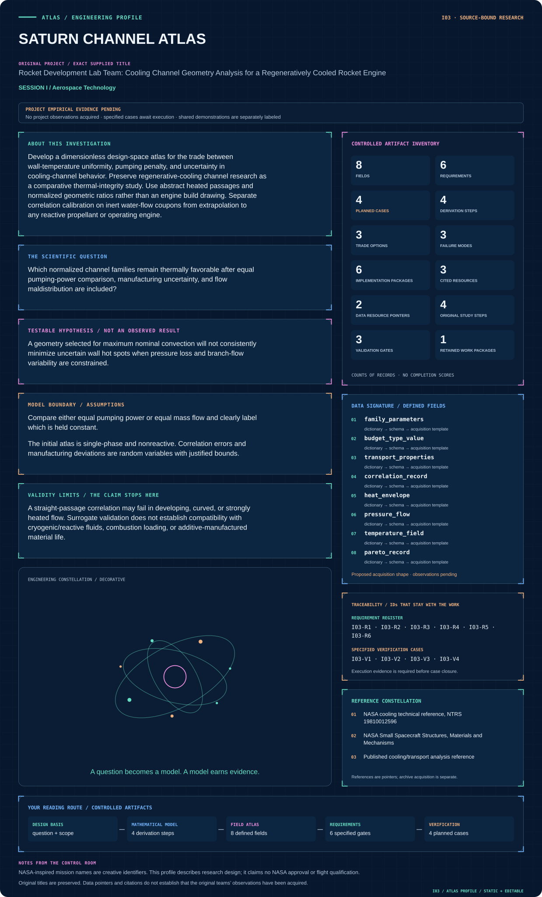

| Profile panel | Engineering signal | Open the evidence |
| --- | --- | --- |
| Mission identity | Rocket Development Lab Team: Cooling Channel Geometry Analysis for a Regeneratively Cooled Rocket Engine | [Scientific objective](../research/I/I03-saturn-channel-atlas/README.md#purpose-and-scientific-objective) |
| Model cockpit | 4 governing expressions; 4 derivation steps; declared assumptions and validity envelope | [Mathematical formulation](../research/I/I03-saturn-channel-atlas/README.md#4-mathematical-model-and-derivation) |
| Data blueprint | 8 proposed fields with types, units and quality rules | [Field map & downloads](../research/I/I03-saturn-channel-atlas/data/README.md) |
| Verification queue | 6 proposed requirements; 4 specified cases; project execution evidence pending | [Case definitions](../research/I/I03-saturn-channel-atlas/README.md#8-verification-and-validation-cases) |
| Figure wall | Architecture, field map, planned result description | [Open full gallery](../research/I/I03-saturn-channel-atlas/figures/README.md) |
| Resource library | 3 cited primary resources with support statements | [Cited resources](../research/I/I03-saturn-channel-atlas/README.md#12-cited-technical-and-scientific-resources) |

#### Model cockpit

**Analysis method:** Sweep normalized channel families with a conjugate thermal model and a flow-network comparator. Compute pressure losses and local heat-transfer regimes consistently, distinguishing Darcy and Fanning friction-factor conventions. Calibrate uncertainty with inert coupon data where available. Use multiobjective optimization to identify a Pareto front, then quantify ranking reversal under uncertain roughness, contact resistance, and uneven branch flow. Add geometry only when it produces a testable information gain; the atlas emphasizes robust trends, not a supposedly optimal engine channel.

**Operating envelope:** A straight-passage correlation may fail in developing, curved, or strongly heated flow. Surrogate validation does not establish compatibility with cryogenic/reactive fluids, combustion loading, or additive-manufactured material life.

**Variables and conventions**

- Ac in m^2 is channel cross section; Pw and Dh in m are wetted perimeter and hydraulic diameter.
- Delta p in Pa; length L in m; Darcy friction factor fD and local loss K are dimensionless; density rho in kg m^-3.
- Volumetric flow Vdot in m^3 s^-1; pump efficiency etap dimensionless; pumping power in W.
- xi contains dimensionless aspect, curvature, and roughness ratios; starred temperature and pumping power use explicitly documented reference scales.
- CVaR0.95 is the mean of the hottest 5% of modeled cases; it is a proposed risk metric, not a measured safety limit.

#### Artifact wall



Fair hydraulic budgets and external heat loads feed an uncertainty-aware thermal/Pareto atlas, validated only within noncombusting coupon domains.

**Scientific result to produce:** A wall-temperature versus normalized pumping-power frontier, colored by channel family, with uncertainty ellipses and a separate correlation-validity map.

#### Investigation feed · planned work

The feed records proposed work packages. A row becomes executed evidence only with versioned inputs, outputs and a reviewed result.

| Sequence | Evidence state | Engineering work package |
| --- | --- | --- |
| 01 | Planned | Create normalized family and controlled-budget manifests. |
| 02 | Planned | Implement typed friction/Nu and property regime service. |
| 03 | Planned | Build coupled hydraulic/conservative thermal solvers. |
| 04 | Planned | Generate manufacturing/maldistribution/discrepancy ensembles. |
| 05 | Planned | Compute uncertain Pareto fronts and tail metric convergence. |
| 06 | Planned | Release inert coupon holdouts, rank reversals and extrapolation ledger. |

#### Mission connections

Connections are reading routes based on actual shared resources, supplied sessions or included illustrations. They do not establish physical dependencies, team collaborations or validated results.

| Connected mission | Original investigation | Recorded connection basis |
| --- | --- | --- |
| [I02 · APOLLO AQUATHERM](../research/I/I02-apollo-aquatherm/README.md) | Rocket Development Lab Team: Thermal Management Analysis of Water-Cooled Rocket Engine | Session I; [NASA cooling technical reference, NTRS 19810012596](https://ntrs.nasa.gov/api/citations/19810012596/downloads/19810012596.pdf); [Published cooling/transport analysis reference](https://ntrs.nasa.gov/citations/19810012596) |
| [I01 · SATURN TRANSIENT SHIELD](../research/I/I01-saturn-transient-shield/README.md) | Rocket Development Lab Team: The Effects of Equivalence Ratio during shutdown of a rocket engine on hardware longevity | Session I; [NASA cooling technical reference, NTRS 19810012596](https://ntrs.nasa.gov/api/citations/19810012596/downloads/19810012596.pdf); [Published cooling/transport analysis reference](https://ntrs.nasa.gov/citations/19810012596) |
| [I06 · SATURN LOADPATH](../research/I/I06-saturn-loadpath/README.md) | Designing and Exploring the Structure of Launch Vehicles to Create Optimal Theoretical and Small-Scale Experimental Models | Session I; [NASA Small Spacecraft Structures, Materials and Mechanisms](https://www.nasa.gov/smallsat-institute/sst-soa/structures-materials-and-mechanisms/) |
| [E05 · ORION TRUSS](../research/E/E05-orion-truss/README.md) | EagleSat Team: Design and Refinement of 3U CubeSat Structure | [NASA Small Spacecraft Structures, Materials and Mechanisms](https://www.nasa.gov/smallsat-institute/sst-soa/structures-materials-and-mechanisms/) |
| [I04 · ORION SENTINEL CORE](../research/I/I04-orion-sentinel-core/README.md) | EagleSat Team: On-board Computer Subsystem | Session I |
| [I05 · PIONEER AERODRIFT](../research/I/I05-pioneer-aerodrift/README.md) | Pico Balloon Platform for Atmospheric Exploration | Session I |

[Machine-readable connection register and ranking rule](../registry/mission_connections.json)

#### Reading playlist

| Route | Start here | Continue to |
| --- | --- | --- |
| Understand the idea | [Scientific objective](../research/I/I03-saturn-channel-atlas/README.md#purpose-and-scientific-objective) | [Design boundary](../research/I/I03-saturn-channel-atlas/README.md#1-design-basis-and-analysis-boundary) → [Mathematics](../research/I/I03-saturn-channel-atlas/README.md#4-mathematical-model-and-derivation) |
| Inspect the data | [Visual blueprint](../research/I/I03-saturn-channel-atlas/data/README.md) | [Provenance](../research/I/I03-saturn-channel-atlas/README.md#5-data-specifications-and-provenance) → [Uncertainty](../research/I/I03-saturn-channel-atlas/README.md#6-uncertainty-sensitivity-and-identifiability) |
| Make a design decision | [Trade study](../research/I/I03-saturn-channel-atlas/README.md#7-engineering-trade-study) | [Failure modes](../research/I/I03-saturn-channel-atlas/README.md#10-failure-modes-and-interpretation-controls) → [Required outputs](../research/I/I03-saturn-channel-atlas/README.md#11-required-engineering-outputs) |
| Prepare execution | [Requirements](../research/I/I03-saturn-channel-atlas/README.md#2-requirements-and-verification-traceability) | [Verification](../research/I/I03-saturn-channel-atlas/README.md#8-verification-and-validation-cases) → [Implementation](../research/I/I03-saturn-channel-atlas/README.md#9-implementation-and-reproducible-work-packages) |

### Complete engineering dossier

The profile above is a browsing layer. The full design basis, equations, derivations, data contract, uncertainty, trades and controlled case definitions follow.

### Purpose and scientific objective

Develop a dimensionless design-space atlas for the trade between wall-temperature uniformity, pumping penalty, and uncertainty in cooling-channel behavior. Preserve regenerative-cooling channel research as a comparative thermal-integrity study. Use abstract heated passages and normalized geometric ratios rather than an engine build drawing. Separate correlation calibration on inert water-flow coupons from extrapolation to any reactive propellant or operating engine.

**Question:** Which normalized channel families remain thermally favorable after equal pumping-power comparison, manufacturing uncertainty, and flow maldistribution are included?

**Testable hypothesis:** A geometry selected for maximum nominal convection will not consistently minimize uncertain wall hot spots when pressure loss and branch-flow variability are constrained.

### 1. Design basis and analysis boundary

The channel atlas compares abstract nonreactive heated-passage families using dimensionless geometry and an external thermal-load envelope. It ranks temperature nonuniformity, pumping penalty and uncertainty under equal pumping power or separately labeled equal flow. No engine build drawing or reactive operating point is inferred. Coupon geometry is supplied or verified only for inert validation.

Begin with hydraulic/thermal networks, then conjugate wall-flow models and robust multiobjective search. Aspect, curvature and relative roughness are normalized parameters with a bounded domain. Correlations carry validity and convention metadata. The first experimental gate is an independently approved noncombusting water-flow coupon with known electrical heat, not an engine test. Rankings beyond that fluid/material/domain remain extrapolations.

### 2. Requirements and verification traceability

These are project design requirements or proposed analysis gates. A numerical target is not a NASA requirement unless its controlling source is explicitly identified. “TBD” identifies evidence required before a decision; it is not permission to assume a value. Verification evidence listed here is planned, unless a linked result explicitly records execution.

| ID | Requirement / gate | Engineering rationale | Verification method | Basis / required evidence |
| --- | --- | --- | --- | --- |
| I03-R1 | Every comparison shall declare equal pump power, equal flow or another controlled budget. | A channel can appear cooler merely by consuming more pumping work. | Scenario budget and solver constraint audit. | Proposed fair-comparison contract. |
| I03-R2 | Darcy and Fanning friction-factor conventions shall be typed explicitly. | Their factor-four difference biases pressure loss. | Convention conversion and analytic fixture. | Proposed hydraulic interface. |
| I03-R3 | Conjugate heat and pressure calculations shall converge within 1%, a proposed target, in accepted synthetic cases. | Mesh/solver error can reorder Pareto solutions. | Mesh/time/quadrature refinement. | Proposed numerical target. |
| I03-R4 | Manufacturing/roughness and branch-flow uncertainty shall accompany every candidate ranking. | Nominal optima can reverse under small deviations. | Posterior/range ensemble and rank-reversal map. | Proposed robust-design requirement. |
| I03-R5 | CVaR temperature shall report confidence level and reference scale; 0.95 is a proposed comparison choice. | Tail-risk metric is not a safety threshold. | Tail integration and scaling fixtures. | Proposed multiobjective convention. |
| I03-R6 | Validation shall use known-power inert single-phase coupons before model promotion. | Reactive coolant/engine transfer is unsupported. | Material/fluid/domain gate and withheld coupon predictions. | Proposed noncombusting validation gate. |

### 3. Architecture and controlled interfaces

A dimensionless family registry defines aspect, curvature, roughness and branch topology without specifying an engine. A property/correlation service supplies fluid transport properties and Nu/friction validity domains. The hydraulic network solves branch flows under the chosen budget; the conjugate thermal model receives an independently supplied wall heat distribution.

Manufacturing perturbations and correlation discrepancy form an ensemble around each family. A Pareto engine accumulates expected and tail-temperature metrics with pumping work. The coupon adapter brings measured pressure, flow and distributed wall temperature with covariance. Calibration is restricted to those observations; an extrapolation ledger records which model features lack inert evidence or differ from a prospective application.


Fair hydraulic budgets and external heat loads feed an uncertainty-aware thermal/Pareto atlas, validated only within noncombusting coupon domains.

[Editable engineering diagram source](../research/I/I03-saturn-channel-atlas/figures/architecture.mmd)

### 4. Mathematical model and derivation

#### Governing equations

$$
D_h=4A_c/P_w;\quad \mathrm{Nu}=hD_h/k_f
$$

$$
\Delta p=f_D(L/D_h)\rho u^2/2+\sum K\rho u^2/2
$$

$$
P_{\rm pump}=\Delta p\,\dot V/\eta_p
$$

$$
\min_{\boldsymbol\xi}\{\mathrm{E}[T^*_{\max}],\mathrm{CVaR}_{0.95}(T^*_{\max}),P^*_{\rm pump}\}
$$

#### Variables, units and conventions

- Ac in m^2 is channel cross section; Pw and Dh in m are wetted perimeter and hydraulic diameter.
- Delta p in Pa; length L in m; Darcy friction factor fD and local loss K are dimensionless; density rho in kg m^-3.
- Volumetric flow Vdot in m^3 s^-1; pump efficiency etap dimensionless; pumping power in W.
- xi contains dimensionless aspect, curvature, and roughness ratios; starred temperature and pumping power use explicitly documented reference scales.
- CVaR0.95 is the mean of the hottest 5% of modeled cases; it is a proposed risk metric, not a measured safety limit.

#### Assumptions and boundary conditions

- Compare either equal pumping power or equal mass flow and clearly label which is held constant.
- The initial atlas is single-phase and nonreactive. Correlation errors and manufacturing deviations are random variables with justified bounds.

#### Derivation step 1

```text
D_h=4A_c/P_w
```

Hydraulic diameter is a geometric scale using cross-sectional area and wetted perimeter. Similar Dh does not guarantee identical local transfer in dissimilar shapes.

#### Derivation step 2

$$
\Delta p=[f_D L/D_h+\sum K]\rho u^2/2
$$

Darcy distributed friction and local losses are both dimensionless coefficients multiplying dynamic pressure. Use the same velocity/reference section.

#### Derivation step 3

$$
P_{pump}=\Delta p\dot V/\eta_p,\quad h=Nu\,k_f/D_h
$$

Hydraulic work and convection connect geometry to competing objectives; pump efficiency uncertainty affects equal-power comparison.

#### Derivation step 4

$$
T^*=(T-T_{in})/\Delta T_{ref},\quad CVaR_{0.95}=E[T^*_{max}\mid T^*_{max}\ge VaR_{0.95}]
$$

For a continuous upper-tail distribution, this defines the hottest-tail mean. Discrete ensembles require quantile/tie handling and sampling uncertainty.

#### Inference or simulation procedure

Sweep normalized channel families with a conjugate thermal model and a flow-network comparator. Compute pressure losses and local heat-transfer regimes consistently, distinguishing Darcy and Fanning friction-factor conventions. Calibrate uncertainty with inert coupon data where available. Use multiobjective optimization to identify a Pareto front, then quantify ranking reversal under uncertain roughness, contact resistance, and uneven branch flow. Add geometry only when it produces a testable information gain; the atlas emphasizes robust trends, not a supposedly optimal engine channel.

#### Validity domain and fidelity limits

A straight-passage correlation may fail in developing, curved, or strongly heated flow. Surrogate validation does not establish compatibility with cryogenic/reactive fluids, combustion loading, or additive-manufactured material life.

### 5. Data specifications and provenance


**Proposed data contract · observations pending.** This visual inventory shows the record fields to acquire or derive. It contains no project measurements. [Open the data blueprint and downloads](../research/I/I03-saturn-channel-atlas/data/README.md).

| Field | Type | Unit | Physical / statistical meaning | Quality and missing-data rule |
| --- | --- | --- | --- | --- |
| family_parameters | float64[dimensionless] | 1 | Normalized aspect/curvature/roughness/topology. | Domain bounds and reference geometry documented. |
| budget_type_value | struct | W or kg s^-1 | Held-constant pump/flow comparison. | Do not mix budgets in one ranking. |
| transport_properties | measurement<struct> | kg m^-3, Pa s, W m^-1 K^-1 | Fluid properties in accepted temperature range. | Source and validity recorded. |
| correlation_record | struct | 1 | Nu/friction/loss formulas and regimes. | Darcy/Fanning and developing-flow status explicit. |
| heat_envelope | measurement<array> | W m^-2 | External or known electrical boundary load. | Spatial/temporal covariance; no combustion schedule. |
| pressure_flow | measurement<float64[2]> | Pa, m^3 s^-1 | Hydraulic observations/predictions. | Branch and sensor covariance retained. |
| temperature_field | distribution<array> | K | Wall/coolant thermal response. | Masked sensor locations remain missing. |
| pareto_record | table | 1, W or scaled | Expected/CVaR temperature and pump objectives. | Nondominated status includes uncertainty and scale version. |

[Machine-readable record schema](../research/I/I03-saturn-channel-atlas/data/schema.json) · [Empty acquisition CSV](../research/I/I03-saturn-channel-atlas/data/acquisition.csv) · [Field dictionary CSV](../research/I/I03-saturn-channel-atlas/data/dictionary.csv)

The CSV above contains column headers only. Its schema defines future records and does not establish that original-team data or a particular archive product have been acquired. Frame, timing, calibration, covariance, selection and provenance details must accompany populated records.

#### NASA cooling analysis reference

[Product, archive or reference](https://ntrs.nasa.gov/api/citations/19810012596/downloads/19810012596.pdf)

**Fields:** Published heat-transfer definitions, correlations and validity ranges

**Access:** Open technical source; extract assumptions alongside equations.

**Role:** Independent analysis comparator.

#### Proposed normalized inert-coupon library

[Product, archive or reference](https://www.nasa.gov/smallsat-institute/sst-soa/structures-materials-and-mechanisms/)

**Fields:** Aspect ratio, relative roughness, Re, Nu, pressure-loss coefficient, wall-temperature distribution, measurement uncertainty

**Access:** Synthetic cases first; any measured coupons require new supervised laboratory work.

**Role:** Model calibration and robustness evidence; no experimental result is claimed.

### 6. Uncertainty, sensitivity and identifiability

Roughness, aspect deviations, contact resistance and flow maldistribution can shift both pressure drop and heat transfer. Correlation errors are shared within a family/regime, not independent point noise. Sample manufacturing uncertainty separately from model discrepancy and evaluate whether two candidates' performance intervals overlap.

Equal-power comparison couples pump efficiency, hydraulic resistance and velocity, so changing geometry alters its own convection regime. Inspect Re/Nu support on every realization. Use coupon holdouts and sensitivity maps to identify where developing or curved flow requires higher fidelity. Report rank-reversal probability and Pareto uncertainty; a nominal optimum is not a robust engine design or validated material-life result.

### 7. Engineering trade study

| Alternative | Benefit | Cost / limitation | Decision rule |
| --- | --- | --- | --- |
| Flow/thermal network | Fast broad design sweep. | Weak local hotspot/curvature physics. | Use first domain atlas and sensitivity. |
| Conjugate passage model | Resolves local wall and fluid behavior. | Geometry/mesh and turbulence-model dependence. | Use for candidates with independent coupon evidence. |
| Robust Pareto optimization | Exposes pump/thermal/risk tradeoffs. | Tail sampling cost and prior sensitivity. | Use when rank uncertainty is quantified rather than selecting one nominal winner. |

### 8. Verification and validation cases

| Case ID | Stimulus / condition | Expected result / criterion | Method | Evidence artifact |
| --- | --- | --- | --- | --- |
| I03-V1 | No heat input | Wall/fluid temperatures remain at common inlet/ambient equilibrium. | Zero-load thermal fixture. | Energy equilibrium. |
| I03-V2 | Pressure-work identity | Pump work equals pressure drop times volume rate divided by efficiency. | Unit-aware hydraulic fixture. | Hydraulic power relation. |
| I03-V3 | Friction convention | Equivalent Darcy/Fanning inputs yield identical pressure drop after factor-four conversion. | Typed coefficient fixture. | Friction-factor convention. |
| I03-V4 | Withheld inert family | Pressure and hotspot predictions are checked before calibration on that coupon. | Known-power noncombusting coupon holdout. | Proposed transport/thermal validation. |

**Execution status:** these cases are specified, not claimed as executed. Close a case only with the versioned inputs, output, uncertainty, reviewer and pass/fail rationale.

#### Additional scientific validation gates

- Check mesh refinement and conservation; compare circular/fully developed limits with appropriate analytic or reference results.
- Hold out an entire geometry family and report prediction error without refitting.
- Re-rank designs at equal pumping power and evaluate whether nominal improvements exceed combined measurement and modeling uncertainty.

### 9. Implementation and reproducible work packages

1. Create normalized family and controlled-budget manifests.
2. Implement typed friction/Nu and property regime service.
3. Build coupled hydraulic/conservative thermal solvers.
4. Generate manufacturing/maldistribution/discrepancy ensembles.
5. Compute uncertain Pareto fronts and tail metric convergence.
6. Release inert coupon holdouts, rank reversals and extrapolation ledger.

#### Investigation sequence

1. Declare comparison constraints and normalized scales; define the tested fluid and material property domain.
2. Verify flow and conduction solvers separately before coupling them.
3. Use a sparse coupon matrix to discriminate correlation error from geometry effects.
4. Freeze the validation matrix, optimize on training cases, and release uncertainty-aware Pareto tables.

#### Resources and interfaces to expertise

- Conjugate thermal/flow solver, uncertainty sampler, unit-aware design table, inert flow-loop access, and thermal/manufacturing expertise.

### 10. Failure modes and interpretation controls

| Failure mode | Effect on result | Detection / evidence | Design response |
| --- | --- | --- | --- |
| Unequal budget hidden | Misleading thermal ranking. | Pump/flow constraint audit. | Publish separate budget-specific fronts. |
| Correlation outside regime | Unreliable pressure/Nu prediction. | Realization-level validity flag. | Reject or add validated higher fidelity. |
| Tail sample too small | Unstable CVaR winner. | Bootstrap tail metric and rank changes. | Increase ensemble or report unresolved ordering. |

- Extrapolation and inconsistent pumping constraints can create false improvement. Mesh-induced hot spots and uncertain roughness may dominate small shape changes.

### 11. Required engineering outputs

- Dimensionless channel atlas, regime-validity map, robust Pareto frontier, geometry-family comparison report, and coupon test specification.

#### Scientific result figures to produce during execution

A wall-temperature versus normalized pumping-power frontier, colored by channel family, with uncertainty ellipses and a separate correlation-validity map.

### 12. Cited technical and scientific resources

- [NASA cooling technical reference, NTRS 19810012596](https://ntrs.nasa.gov/api/citations/19810012596/downloads/19810012596.pdf) — Cooling-analysis precedent and comparison assumptions.
- [NASA Small Spacecraft Structures, Materials and Mechanisms](https://www.nasa.gov/smallsat-institute/sst-soa/structures-materials-and-mechanisms/) — Material, fabrication, and verification considerations used as systems-method analogies.
- [Published cooling/transport analysis reference](https://ntrs.nasa.gov/citations/19810012596) — Thermal/transport comparison context; selected correlations require independent domain review for inert passages.

Framework and evidence rules: [engineering documentation standard](../engineering/ENGINEERING_STANDARD.md), [model assurance](../engineering/MODEL_ASSURANCE.md), [uncertainty procedure](../engineering/UNCERTAINTY_AND_DECISION_RULES.md), [data management](../engineering/DATA_MANAGEMENT.md). NASA-inspired names are creative identifiers; requirements and results are not NASA certification.

---

<a id="i04"></a>

## I04 · ORION SENTINEL CORE

**Original project:** EagleSat Team: On-board Computer Subsystem

**Session I:** Aerospace Technology

**Document class:** engineering research design and analysis record · **Revision:** 4 · **Date:** 2026-10-02

**Evidence state:** design basis, mathematical formulation and verification plan documented. Project-specific empirical results remain to be acquired; executable shared model demonstrations have their own recorded checks.

[Session I](../research/I/README.md) · [All projects](../ENGINEERING_DOCUMENTATION.md) · [Session handbook](SESSION_I.md) · [← I03](../research/I/I03-saturn-channel-atlas/README.md) · [I05 →](../research/I/I05-pioneer-aerodrift/README.md)

| Proposed requirements | Specified verification cases | Defined data fields | Cited resources |
| ---: | ---: | ---: | ---: |
| 6 | 4 | 8 | 2 |

[Explore the data blueprint](../research/I/I04-orion-sentinel-core/data/README.md) · [Open the figure gallery](../research/I/I04-orion-sentinel-core/figures/README.md) · [Download acquisition template](../research/I/I04-orion-sentinel-core/data/acquisition.csv) · [Browse the data atlas](../data/README.md)

---

### Mission profile

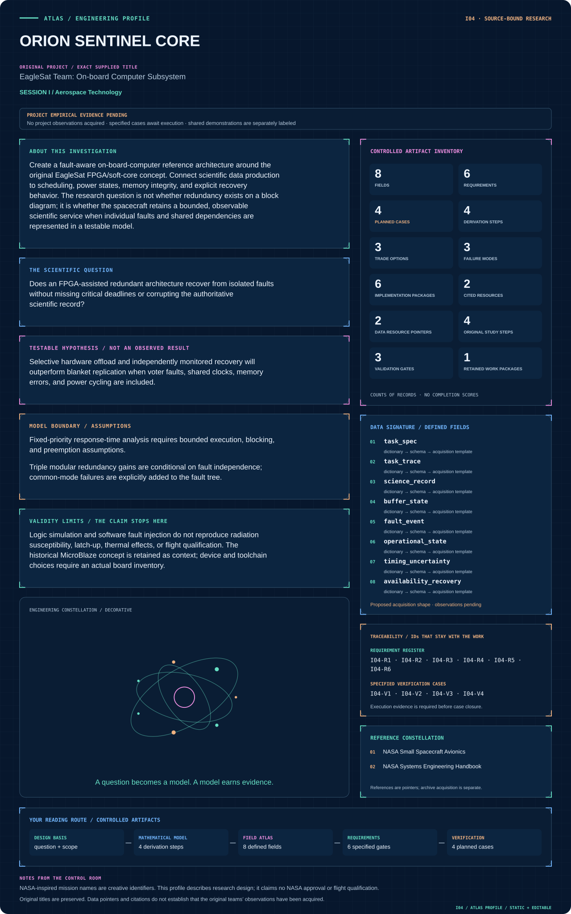

| Profile panel | Engineering signal | Open the evidence |
| --- | --- | --- |
| Mission identity | EagleSat Team: On-board Computer Subsystem | [Scientific objective](../research/I/I04-orion-sentinel-core/README.md#purpose-and-scientific-objective) |
| Model cockpit | 4 governing expressions; 4 derivation steps; declared assumptions and validity envelope | [Mathematical formulation](../research/I/I04-orion-sentinel-core/README.md#4-mathematical-model-and-derivation) |
| Data blueprint | 8 proposed fields with types, units and quality rules | [Field map & downloads](../research/I/I04-orion-sentinel-core/data/README.md) |
| Verification queue | 6 proposed requirements; 4 specified cases; project execution evidence pending | [Case definitions](../research/I/I04-orion-sentinel-core/README.md#8-verification-and-validation-cases) |
| Figure wall | Architecture, field map, planned result description | [Open full gallery](../research/I/I04-orion-sentinel-core/figures/README.md) |
| Resource library | 2 cited primary resources with support statements | [Cited resources](../research/I/I04-orion-sentinel-core/README.md#12-cited-technical-and-scientific-resources) |

#### Model cockpit

**Analysis method:** Define an interface contract for each subsystem and map tasks to a soft-core processor or FPGA logic using timing evidence. Specify a finite-state operational model with boot, nominal, science, safe, and recovery states. Simulate scheduled science acquisition, intermittent downlink, corrected memory errors, and isolated logical faults in a local test bench. Inject declared software/emulator faults into representative interfaces and log every transition with sequence number and clock quality. Measure the effect of a voter or shared-clock failure separately from independent lane errors. Use a stable packet schema and idempotent record handling so reset recovery does not create duplicate scientific observations.

**Operating envelope:** Logic simulation and software fault injection do not reproduce radiation susceptibility, latch-up, thermal effects, or flight qualification. The historical MicroBlaze concept is retained as context; device and toolchain choices require an actual board inventory.

**Variables and conventions**

- Response R, execution C, blocking B_i, period T, and deadline D in s; hp(i) is the set of higher-priority tasks.
- p is independent per-lane failure probability in a stated interval; pTMR excludes voter and shared-resource failures.
- Data buffer B in bytes; science and downlink rates in bytes s^-1. Buffer B and task blocking B_i are distinct quantities.
- Availability A is useful-science time fraction, with boot, degraded mode, and recovery time included.

#### Artifact wall


Scheduling, committed scientific records and shared-fault recovery are connected through explicit timing and storage boundaries rather than a nominal redundancy claim.

**Scientific result to produce:** An FPGA/soft-core architecture linked to a timeline of injected fault, detection, safe-state entry, recovery, and science-record continuity.

#### Investigation feed · planned work

The feed records proposed work packages. A row becomes executed evidence only with versioned inputs, outputs and a reviewed result.

| Sequence | Evidence state | Engineering work package |
| --- | --- | --- |
| 01 | Planned | Inventory board/toolchain or mark architecture emulator-only. |
| 02 | Planned | Create task/resource/blocking and scientific packet contracts. |
| 03 | Planned | Implement response-time analyzer and deterministic workload simulator. |
| 04 | Planned | Build committed-record journal and finite-buffer loss accounting. |
| 05 | Planned | Implement observable fault/recovery state machine with lane/common modes. |
| 06 | Planned | Release expected-record manifests, deadline traces and service-availability comparisons. |

#### Mission connections

Connections are reading routes based on actual shared resources, supplied sessions or included illustrations. They do not establish physical dependencies, team collaborations or validated results.

| Connected mission | Original investigation | Recorded connection basis |
| --- | --- | --- |
| [I06 · SATURN LOADPATH](../research/I/I06-saturn-loadpath/README.md) | Designing and Exploring the Structure of Launch Vehicles to Create Optimal Theoretical and Small-Scale Experimental Models | Session I; [NASA Systems Engineering Handbook](https://www.nasa.gov/reference/systems-engineering-handbook/) |
| [I10 · GEMINI POINTLOCK](../research/I/I10-gemini-pointlock/README.md) | Spacecraft Attitude Control Implementation and Development | Session I; [NASA Systems Engineering Handbook](https://www.nasa.gov/reference/systems-engineering-handbook/) |
| [G07 · HUBBLE SPECTRAL ANCHOR](../research/G/G07-hubble-spectral-anchor/README.md) | An Introduction to Systems Engineering: Building a Monochromator Mount | [NASA Systems Engineering Handbook](https://www.nasa.gov/reference/systems-engineering-handbook/) |
| [E08 · GATEWAY POWERBENCH](../research/E/E08-gateway-powerbench/README.md) | EagleSat Team: Development and Implementation of a Self-Contained Harness for In-House Integration, Verification, and Testing of CubeSat Electric Power Systems | [NASA Systems Engineering Handbook](https://www.nasa.gov/reference/systems-engineering-handbook/) |
| [E07 · DISCOVERY TRIDENT](../research/E/E07-discovery-trident/README.md) | Glendale Community College (GCC) ASCEND Team | [NASA Systems Engineering Handbook](https://www.nasa.gov/reference/systems-engineering-handbook/) |
| [D07 · ARES DUAL-WORLD SCOUT](../research/D/D07-ares-dual-world-scout/README.md) | Suborbital Uncrewed Aerial Vehicles for Earth Surveillance and Mars Exploration | [NASA Systems Engineering Handbook](https://www.nasa.gov/reference/systems-engineering-handbook/) |

[Machine-readable connection register and ranking rule](../registry/mission_connections.json)

#### Reading playlist

| Route | Start here | Continue to |
| --- | --- | --- |
| Understand the idea | [Scientific objective](../research/I/I04-orion-sentinel-core/README.md#purpose-and-scientific-objective) | [Design boundary](../research/I/I04-orion-sentinel-core/README.md#1-design-basis-and-analysis-boundary) → [Mathematics](../research/I/I04-orion-sentinel-core/README.md#4-mathematical-model-and-derivation) |
| Inspect the data | [Visual blueprint](../research/I/I04-orion-sentinel-core/data/README.md) | [Provenance](../research/I/I04-orion-sentinel-core/README.md#5-data-specifications-and-provenance) → [Uncertainty](../research/I/I04-orion-sentinel-core/README.md#6-uncertainty-sensitivity-and-identifiability) |
| Make a design decision | [Trade study](../research/I/I04-orion-sentinel-core/README.md#7-engineering-trade-study) | [Failure modes](../research/I/I04-orion-sentinel-core/README.md#10-failure-modes-and-interpretation-controls) → [Required outputs](../research/I/I04-orion-sentinel-core/README.md#11-required-engineering-outputs) |
| Prepare execution | [Requirements](../research/I/I04-orion-sentinel-core/README.md#2-requirements-and-verification-traceability) | [Verification](../research/I/I04-orion-sentinel-core/README.md#8-verification-and-validation-cases) → [Implementation](../research/I/I04-orion-sentinel-core/README.md#9-implementation-and-reproducible-work-packages) |

### Complete engineering dossier

The profile above is a browsing layer. The full design basis, equations, derivations, data contract, uncertainty, trades and controlled case definitions follow.

### Purpose and scientific objective

Create a fault-aware on-board-computer reference architecture around the original EagleSat FPGA/soft-core concept. Connect scientific data production to scheduling, power states, memory integrity, and explicit recovery behavior. The research question is not whether redundancy exists on a block diagram; it is whether the spacecraft retains a bounded, observable scientific service when individual faults and shared dependencies are represented in a testable model.

**Question:** Does an FPGA-assisted redundant architecture recover from isolated faults without missing critical deadlines or corrupting the authoritative scientific record?

**Testable hypothesis:** Selective hardware offload and independently monitored recovery will outperform blanket replication when voter faults, shared clocks, memory errors, and power cycling are included.

### 1. Design basis and analysis boundary

The EagleSat on-board-computer architecture is a local scheduling, integrity and recovery demonstrator for an FPGA/soft-core concept. Actual board inventory, toolchain, radiation susceptibility and execution times are TBD. The scientific service is a sequence of authoritative acquisition records preserved across simulated resets, not a nominal redundancy block diagram. NASA avionics context informs trades without establishing flight reliability.

Begin with deterministic tasks and buffers, add bounded blocking and fault/state transitions, then hardware-in-the-loop only with verified board interfaces. Independent lane errors are separated from voter, shared-memory, clock and power failures. The architecture defines what science can continue in degraded states and which deadlines or data become unsupported. Every test fault is an emulator/logical event, not radiation qualification.

### 2. Requirements and verification traceability

These are project design requirements or proposed analysis gates. A numerical target is not a NASA requirement unless its controlling source is explicitly identified. “TBD” identifies evidence required before a decision; it is not permission to assume a value. Verification evidence listed here is planned, unless a linked result explicitly records execution.

| ID | Requirement / gate | Engineering rationale | Verification method | Basis / required evidence |
| --- | --- | --- | --- | --- |
| I04-R1 | Every critical task shall have measured or justified worst-case execution, blocking, period and deadline bounds. | Response-time analysis needs bounded inputs. | Task manifest and execution-trace audit. | Proposed scheduling contract. |
| I04-R2 | All accepted schedules shall satisfy R_i<=D_i or explicitly declare infeasibility. | A mean runtime cannot guarantee critical service. | Fixed-point response analysis and worst-case replay. | Existing fixed-priority model. |
| I04-R3 | Science record IDs shall remain unique and recoverable across reset/duplicate replay. | Reset can corrupt or duplicate authoritative data. | Idempotent journal/reset fixture. | Proposed integrity requirement. |
| I04-R4 | Buffer overflow shall yield a recorded loss/degradation state rather than silent truncation. | Finite storage affects useful science availability. | Burst-production/downlink-gap replay. | Proposed service contract. |
| I04-R5 | TMR claims shall include voter and common-resource fault paths. | Independent-lane math omits shared failures. | Common-clock/voter emulator faults and fault-tree audit. | Existing TMR limitation. |
| I04-R6 | Recovery time and degraded-science availability shall be reported separately from nominal uptime. | Booted electronics need not deliver useful science. | State-tagged trace integration. | Proposed availability metric. |

### 3. Architecture and controlled interfaces

Subsystem adapters emit typed sample packets and bounded task releases. A scheduler maps tasks to soft-core/FPGA resources with explicit bus, DMA and interrupt blocking. A buffer/journal service stores sequence-numbered scientific records with integrity checks and a committed-record boundary. A downlink simulator consumes records under intermittent capacity without altering their source timestamps.

The fault manager implements boot, nominal, science, safe and recovery states with observable reasons. Redundant lanes and voter have distinct fault interfaces; shared dependencies are injected separately. A monotonic event ledger preserves reset generation and clock quality. Availability calculation counts only scientifically valid service states and includes startup/recovery losses, allowing board-specific timing evidence to replace emulator assumptions later.


Scheduling, committed scientific records and shared-fault recovery are connected through explicit timing and storage boundaries rather than a nominal redundancy claim.

[Editable engineering diagram source](../research/I/I04-orion-sentinel-core/figures/architecture.mmd)

### 4. Mathematical model and derivation

#### Governing equations

$$
R_i=C_i+B_i+\sum_{j\in hp(i)}\lceil R_i/T_j\rceil C_j;\quad R_i\le D_i
$$

$$
p_{\rm TMR}=3p^2-2p^3
$$

$$
\dot B=r_{\rm science}-r_{\rm downlink};\quad 0\le B\le B_{\max}
$$

$$
A=T_{\rm useful}/T_{\rm mission}
$$

#### Variables, units and conventions

- Response R, execution C, blocking B_i, period T, and deadline D in s; hp(i) is the set of higher-priority tasks.
- p is independent per-lane failure probability in a stated interval; pTMR excludes voter and shared-resource failures.
- Data buffer B in bytes; science and downlink rates in bytes s^-1. Buffer B and task blocking B_i are distinct quantities.
- Availability A is useful-science time fraction, with boot, degraded mode, and recovery time included.

#### Assumptions and boundary conditions

- Fixed-priority response-time analysis requires bounded execution, blocking, and preemption assumptions.
- Triple modular redundancy gains are conditional on fault independence; common-mode failures are explicitly added to the fault tree.

#### Derivation step 1

$$
R_i=C_i+B_i+\sum_{j\in hp(i)}\lceil R_i/T_j\rceil C_j
$$

This displayed fixed-priority, single-processor response-time bound assumes zero release jitter, bounded blocking and the specified preemption/task model. Iterate from C_i+B_i to a fixed point and stop as infeasible if it exceeds the deadline. With supported bounded interfering-task jitter J_j, use ceil((R_i+J_j)/T_j) C_j and document the event model; do not claim general scheduling coverage.

#### Derivation step 2

```text
p_{TMR}=3p^2(1-p)+p^3=3p^2-2p^3
```

Two or three failed independent lanes defeat majority voting. Add voter and common-mode paths separately rather than folding them into independent p.

#### Derivation step 3

$$
B(t)=B(0)+\int(r_{science}-r_{downlink})dt-L(t)
$$

Buffer occupancy in bytes obeys conservation; L is explicitly recorded rejected/lost data, with occupancy bounded by physical capacity.

#### Derivation step 4

$$
A_{science}=\int\mathbf1_{valid\ service}(t)dt/T
$$

Useful-science availability differs from processor uptime; denominator and validity rules are part of the metric.

#### Inference or simulation procedure

Define an interface contract for each subsystem and map tasks to a soft-core processor or FPGA logic using timing evidence. Specify a finite-state operational model with boot, nominal, science, safe, and recovery states. Simulate scheduled science acquisition, intermittent downlink, corrected memory errors, and isolated logical faults in a local test bench. Inject declared software/emulator faults into representative interfaces and log every transition with sequence number and clock quality. Measure the effect of a voter or shared-clock failure separately from independent lane errors. Use a stable packet schema and idempotent record handling so reset recovery does not create duplicate scientific observations.

#### Validity domain and fidelity limits

Logic simulation and software fault injection do not reproduce radiation susceptibility, latch-up, thermal effects, or flight qualification. The historical MicroBlaze concept is retained as context; device and toolchain choices require an actual board inventory.

### 5. Data specifications and provenance


**Proposed data contract · observations pending.** This visual inventory shows the record fields to acquire or derive. It contains no project measurements. [Open the data blueprint and downloads](../research/I/I04-orion-sentinel-core/data/README.md).

| Field | Type | Unit | Physical / statistical meaning | Quality and missing-data rule |
| --- | --- | --- | --- | --- |
| task_spec | struct | s | C,blocking,period,deadline and priority. | Measured/bounded status; task blocking not buffer bytes. |
| task_trace | table | s | Release/start/end and missed deadlines. | Monotonic clock/reset generation recorded. |
| science_record | struct | bytes, sequence | Authoritative sample payload and checksum. | Unique source ID; missing sample explicitly marked. |
| buffer_state | uint64 | byte | Committed plus queued occupancy. | Capacity/loss counters; no silent wrap. |
| fault_event | enum+time | 1, s | Lane/voter/clock/memory/power emulator event. | Fault scope and independence assumption explicit. |
| operational_state | enum | 1 | Boot/science/safe/recovery state. | Transition cause and valid-service flag. |
| timing_uncertainty | distribution<struct> | s | Clock/WCET/jitter uncertainty. | Retain shared-clock correlations. |
| availability_recovery | measurement<struct> | 1, s | Science fraction and recovery latency. | Exclude invalid records from useful service. |

[Machine-readable record schema](../research/I/I04-orion-sentinel-core/data/schema.json) · [Empty acquisition CSV](../research/I/I04-orion-sentinel-core/data/acquisition.csv) · [Field dictionary CSV](../research/I/I04-orion-sentinel-core/data/dictionary.csv)

The CSV above contains column headers only. Its schema defines future records and does not establish that original-team data or a particular archive product have been acquired. Frame, timing, calibration, covariance, selection and provenance details must accompany populated records.

#### NASA small-spacecraft avionics reference

[Product, archive or reference](https://www.nasa.gov/smallsat-institute/sst-soa/small-spacecraft-avionics/)

**Fields:** Architecture trade considerations, processors, fault-management context

**Access:** Public survey; vendor specifications and exact EagleSat board details require verification.

**Role:** Architecture comparator, not proof of flight reliability.

#### Proposed local test-bench trace dataset

[Product, archive or reference](https://www.nasa.gov/reference/systems-engineering-handbook/)

**Fields:** Task release/deadline, state, reset reason, memory event, packet sequence, power mode, fault label

**Access:** Generate deterministic synthetic workloads and release seeds; no mission records are supplied.

**Role:** Deadline, integrity, and recovery evaluation.

### 6. Uncertainty, sensitivity and identifiability

WCET, interrupt interference and shared-bus blocking determine deadline margins; emulator timings are not flight timings. Measure each resource path and sweep release phasing to locate worst cases. Clock uncertainty affects both task order and scientific timestamps. Maintain distinct analysis versus measured bounds so unknown hardware performance cannot become a guarantee.

Independent logical errors, common resource failure and recovery latency interact with integrity and availability. TMR probability improvement is conditional on independence, while voters and common power can dominate. Use deterministic fault schedules and parameterized event-rate sensitivity rather than invented failure probabilities. Compare authoritative record counts/checksums with expected manifests after resets and overflow.

### 7. Engineering trade study

| Alternative | Benefit | Cost / limitation | Decision rule |
| --- | --- | --- | --- |
| Single soft-core with watchdog/journal | Simple state/integrity implementation. | One execution lane remains vulnerable. | Use required baseline for measured recovery. |
| FPGA-assisted acquisition and buffering | Can bound timing-critical paths. | Toolchain/resource and shared-bus complexity. | Adopt with actual timing/interface evidence. |
| Replicated lanes with voter | Tolerates some independent faults. | Common-mode/voter and power costs. | Choose only when measured service benefit exceeds shared-dependency risk. |

### 8. Verification and validation cases

| Case ID | Stimulus / condition | Expected result / criterion | Method | Evidence artifact |
| --- | --- | --- | --- | --- |
| I04-V1 | No higher-priority tasks | Response bound reduces to C+B. | Analytic scheduler fixture. | Response-time equation. |
| I04-V2 | Perfect independent lanes | TMR failure tends to zero as p tends to zero and equals one at p=1. | Polynomial boundary/Monte Carlo fixture. | Voting combinatorics. |
| I04-V3 | Reset with duplicate packets | Committed unique scientific record set is unchanged by duplicate replay. | Journal checkpoint/reset integration. | Idempotent integrity requirement. |
| I04-V4 | Shared-clock fault | Fault is reported as common mode rather than masked by three lanes. | Deterministic emulator scenario. | Declared redundancy boundary. |

**Execution status:** these cases are specified, not claimed as executed. Close a case only with the versioned inputs, output, uncertainty, reviewer and pass/fail rationale.

#### Additional scientific validation gates

- Require zero missed critical deadlines within the declared tested workload envelope; report that envelope and observed sample count.
- Check packet ordering, duplicate suppression, and data provenance across resets using an independent log reconciler.
- Report recovery-time distribution, useful-science availability, and common-mode failure sensitivity; distinguish confidence bounds from guaranteed reliability.

### 9. Implementation and reproducible work packages

1. Inventory board/toolchain or mark architecture emulator-only.
2. Create task/resource/blocking and scientific packet contracts.
3. Implement response-time analyzer and deterministic workload simulator.
4. Build committed-record journal and finite-buffer loss accounting.
5. Implement observable fault/recovery state machine with lane/common modes.
6. Release expected-record manifests, deadline traces and service-availability comparisons.

#### Investigation sequence

1. Build a requirements-to-interface-to-test matrix and freeze critical service definitions.
2. Profile task execution and buffer behavior before choosing offload or redundancy boundaries.
3. Implement reproducible local fault campaigns with isolated-lane and common-mode cases.
4. Hold out fault timing and science workload combinations, then document residual failure modes.

#### Resources and interfaces to expertise

- FPGA/soft-core simulation tools, board emulator or development board, timing instrumentation, systems engineer, and independently reviewed interface definitions.

### 10. Failure modes and interpretation controls

| Failure mode | Effect on result | Detection / evidence | Design response |
| --- | --- | --- | --- |
| WCET treated as average | Missed critical deadline. | Tail trace exceeds bound. | Measure/bound paths and reject unsupported schedule. |
| Reset corrupts journal boundary | Missing/duplicate authoritative science. | Manifest/checksum/sequence reconciliation. | Atomic commit and idempotent replay. |
| Voter/common resource ignored | Overstated redundancy availability. | Common-mode fault-tree gap. | Explicit shared paths and degraded-state behavior. |

- Shared power, clocks, or voters can invalidate redundancy claims. Late interface changes can create unbounded blocking and undocumented packet incompatibility.

### 11. Required engineering outputs

- Architecture trade study, timing budget, state-machine specification, packet schema, fault-campaign fixtures, and recovery evidence dashboard.

#### Scientific result figures to produce during execution

An FPGA/soft-core architecture linked to a timeline of injected fault, detection, safe-state entry, recovery, and science-record continuity.

### 12. Cited technical and scientific resources

- [NASA Small Spacecraft Avionics](https://www.nasa.gov/smallsat-institute/sst-soa/small-spacecraft-avionics/) — On-board-computer architecture and fault-management context.
- [NASA Systems Engineering Handbook](https://www.nasa.gov/reference/systems-engineering-handbook/) — Interface, requirements, and verification traceability framework.

Framework and evidence rules: [engineering documentation standard](../engineering/ENGINEERING_STANDARD.md), [model assurance](../engineering/MODEL_ASSURANCE.md), [uncertainty procedure](../engineering/UNCERTAINTY_AND_DECISION_RULES.md), [data management](../engineering/DATA_MANAGEMENT.md). NASA-inspired names are creative identifiers; requirements and results are not NASA certification.

---

<a id="i05"></a>

## I05 · PIONEER AERODRIFT

**Original project:** Pico Balloon Platform for Atmospheric Exploration

**Session I:** Aerospace Technology

**Document class:** engineering research design and analysis record · **Revision:** 4 · **Date:** 2026-10-02

**Evidence state:** design basis, mathematical formulation and verification plan documented. Project-specific empirical results remain to be acquired; executable shared model demonstrations have their own recorded checks.

[Session I](../research/I/README.md) · [All projects](../ENGINEERING_DOCUMENTATION.md) · [Session handbook](SESSION_I.md) · [← I04](../research/I/I04-orion-sentinel-core/README.md) · [I06 →](../research/I/I06-saturn-loadpath/README.md)

| Proposed requirements | Specified verification cases | Defined data fields | Cited resources |
| ---: | ---: | ---: | ---: |
| 6 | 4 | 8 | 2 |

[Explore the data blueprint](../research/I/I05-pioneer-aerodrift/data/README.md) · [Open the figure gallery](../research/I/I05-pioneer-aerodrift/figures/README.md) · [Download acquisition template](../research/I/I05-pioneer-aerodrift/data/acquisition.csv) · [Browse the data atlas](../data/README.md)

---

### Mission profile

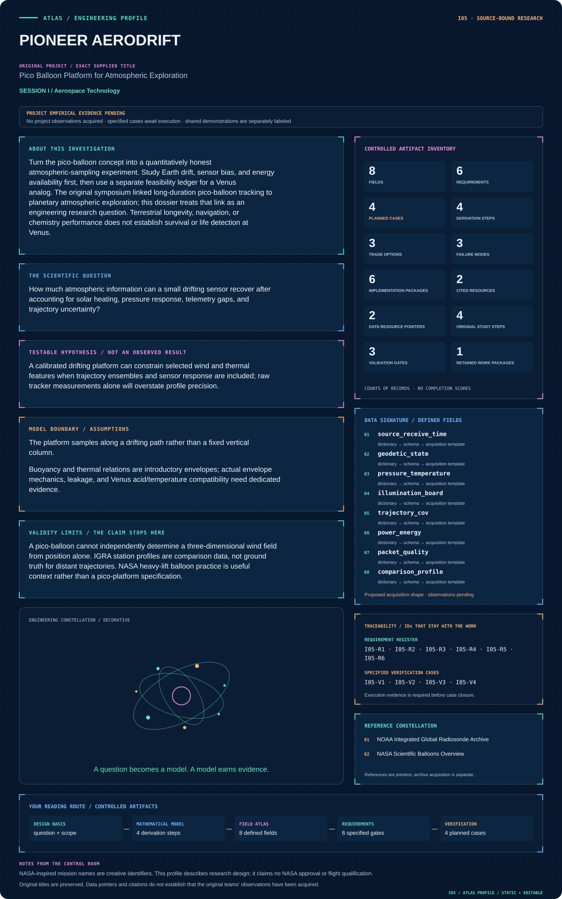

| Profile panel | Engineering signal | Open the evidence |
| --- | --- | --- |
| Mission identity | Pico Balloon Platform for Atmospheric Exploration | [Scientific objective](../research/I/I05-pioneer-aerodrift/README.md#purpose-and-scientific-objective) |
| Model cockpit | 4 governing expressions; 4 derivation steps; declared assumptions and validity envelope | [Mathematical formulation](../research/I/I05-pioneer-aerodrift/README.md#4-mathematical-model-and-derivation) |
| Data blueprint | 8 proposed fields with types, units and quality rules | [Field map & downloads](../research/I/I05-pioneer-aerodrift/data/README.md) |
| Verification queue | 6 proposed requirements; 4 specified cases; project execution evidence pending | [Case definitions](../research/I/I05-pioneer-aerodrift/README.md#8-verification-and-validation-cases) |
| Figure wall | Architecture, field map, planned result description; included shared illustration | [Open full gallery](../research/I/I05-pioneer-aerodrift/figures/README.md) |
| Resource library | 2 cited primary resources with support statements | [Cited resources](../research/I/I05-pioneer-aerodrift/README.md#12-cited-technical-and-scientific-resources) |

#### Model cockpit

**Analysis method:** Build a synthetic telemetry generator and assimilate a wind field into a trajectory ensemble. Calibrate temperature and pressure sensors against reference instruments in a supervised environmental chamber, including illumination and response lag. Compare recovered atmospheric gradients with independent radiosonde soundings only where separation in time and space is small enough for a meaningful test. Infer missing-data effects by replaying complete simulated tracks through realistic packet-loss patterns. Treat a Venus extension as a requirements trade covering atmospheric composition, thermal environment, envelope compatibility, solar geometry, communications, and planetary protection; avoid interpreting an uncalibrated chemical response as evidence of life.

**Operating envelope:** A pico-balloon cannot independently determine a three-dimensional wind field from position alone. IGRA station profiles are comparison data, not ground truth for distant trajectories. NASA heavy-lift balloon practice is useful context rather than a pico-platform specification.

**Variables and conventions**

- Position x in m in a declared Earth-fixed or geodetic frame; wind u and slip v in m s^-1; time t in s.
- True variable X and measured y retain their physical units, such as K or Pa; response time taus in s and solar bias is sensor specific.
- Energy E in J; component power in W; air/lifting-gas densities in kg m^-3; volume V in m^3; force Fb in N.
- Trajectory covariance, sample altitude uncertainty, and telemetry completeness are required fields, not optional annotations.

#### Artifact wall


Shared illustration with a narrower domain than the project model. [Read its parameters, evidence class and checks](../models/README.md).

**Scientific result to produce:** A drifting-track map with uncertainty tubes above a solar-energy timeline and calibrated atmospheric samples; Venus assumptions appear in a separate feasibility panel.

#### Investigation feed · planned work

The feed records proposed work packages. A row becomes executed evidence only with versioned inputs, outputs and a reviewed result.

| Sequence | Evidence state | Engineering work package |
| --- | --- | --- |
| 01 | Planned | Create synthetic track/power/sample and calibration manifests. |
| 02 | Planned | Implement geodetic/Earth-fixed covariance adapters. |
| 03 | Planned | Calibrate sensor lag/illumination on independent chamber references. |
| 04 | Planned | Build wind/slip trajectory and energy ensemble model. |
| 05 | Planned | Replay telemetry gaps/delays and collocate supported IGRA segments. |
| 06 | Planned | Publish sampling-error/energy budgets and separate planetary feasibility gaps. |

#### Mission connections

Connections are reading routes based on actual shared resources, supplied sessions or included illustrations. They do not establish physical dependencies, team collaborations or validated results.

| Connected mission | Original investigation | Recorded connection basis |
| --- | --- | --- |
| [E06 · APOLLO THERMALIS](../research/E/E06-apollo-thermalis/README.md) | Study of Thermal Heat Transfer Within a High-Altitude Balloon Payload | Included illustration: 03_balloon_thermal |
| [E03 · ARTEMIS STRATODOSE](../research/E/E03-artemis-stratodose/README.md) | UArizona ASCEND: Profiling High-Altitude Radiation with a General Data Logger | Included illustration: 03_balloon_thermal |
| [I04 · ORION SENTINEL CORE](../research/I/I04-orion-sentinel-core/README.md) | EagleSat Team: On-board Computer Subsystem | Session I |
| [I06 · SATURN LOADPATH](../research/I/I06-saturn-loadpath/README.md) | Designing and Exploring the Structure of Launch Vehicles to Create Optimal Theoretical and Small-Scale Experimental Models | Session I |
| [I03 · SATURN CHANNEL ATLAS](../research/I/I03-saturn-channel-atlas/README.md) | Rocket Development Lab Team: Cooling Channel Geometry Analysis for a Regeneratively Cooled Rocket Engine | Session I |
| [I07 · GATEWAY CATSAT CONSOLE](../research/I/I07-gateway-catsat-console/README.md) | CatSat Groundstation Command and Control | Session I |

[Machine-readable connection register and ranking rule](../registry/mission_connections.json)

#### Reading playlist

| Route | Start here | Continue to |
| --- | --- | --- |
| Understand the idea | [Scientific objective](../research/I/I05-pioneer-aerodrift/README.md#purpose-and-scientific-objective) | [Design boundary](../research/I/I05-pioneer-aerodrift/README.md#1-design-basis-and-analysis-boundary) → [Mathematics](../research/I/I05-pioneer-aerodrift/README.md#4-mathematical-model-and-derivation) |
| Inspect the data | [Visual blueprint](../research/I/I05-pioneer-aerodrift/data/README.md) | [Provenance](../research/I/I05-pioneer-aerodrift/README.md#5-data-specifications-and-provenance) → [Uncertainty](../research/I/I05-pioneer-aerodrift/README.md#6-uncertainty-sensitivity-and-identifiability) |
| Make a design decision | [Trade study](../research/I/I05-pioneer-aerodrift/README.md#7-engineering-trade-study) | [Failure modes](../research/I/I05-pioneer-aerodrift/README.md#10-failure-modes-and-interpretation-controls) → [Required outputs](../research/I/I05-pioneer-aerodrift/README.md#11-required-engineering-outputs) |
| Prepare execution | [Requirements](../research/I/I05-pioneer-aerodrift/README.md#2-requirements-and-verification-traceability) | [Verification](../research/I/I05-pioneer-aerodrift/README.md#8-verification-and-validation-cases) → [Implementation](../research/I/I05-pioneer-aerodrift/README.md#9-implementation-and-reproducible-work-packages) |

### Complete engineering dossier

The profile above is a browsing layer. The full design basis, equations, derivations, data contract, uncertainty, trades and controlled case definitions follow.

### Purpose and scientific objective

Turn the pico-balloon concept into a quantitatively honest atmospheric-sampling experiment. Study Earth drift, sensor bias, and energy availability first, then use a separate feasibility ledger for a Venus analog. The original symposium linked long-duration pico-balloon tracking to planetary atmospheric exploration; this dossier treats that link as an engineering research question. Terrestrial longevity, navigation, or chemistry performance does not establish survival or life detection at Venus.

**Question:** How much atmospheric information can a small drifting sensor recover after accounting for solar heating, pressure response, telemetry gaps, and trajectory uncertainty?

**Testable hypothesis:** A calibrated drifting platform can constrain selected wind and thermal features when trajectory ensembles and sensor response are included; raw tracker measurements alone will overstate profile precision.

### 1. Design basis and analysis boundary

The pico-balloon model is an Earth atmospheric sampling and energy-accounting study before any planetary analogy. Inputs are trajectory, sensor response, illumination, pressure/temperature, energy and packet provenance. Outputs describe what a drifting path can infer with uncertainty. NOAA IGRA profiles are independent comparisons only within declared space/time proximity; they are not distant-track truth.

Begin with synthetic tracks and calibrated chamber sensors, then wind-field ensembles and telemetry replay. Earth deployment requirements are supplied separately before any real flight; hardware buoyancy/envelope and operating limits remain TBD. A Venus extension is an explicit feasibility ledger for composition, temperature, pressure, materials, illumination and communications, not evidence that terrestrial survival or chemical signals establish habitability/life.

### 2. Requirements and verification traceability

These are project design requirements or proposed analysis gates. A numerical target is not a NASA requirement unless its controlling source is explicitly identified. “TBD” identifies evidence required before a decision; it is not permission to assume a value. Verification evidence listed here is planned, unless a linked result explicitly records execution.

| ID | Requirement / gate | Engineering rationale | Verification method | Basis / required evidence |
| --- | --- | --- | --- | --- |
| I05-R1 | Each atmospheric sample shall retain source time, geodetic position/altitude covariance and calibration ID. | A moving biased sensor does not measure a stationary profile. | Track/sample schema and coordinate audit. | Proposed sampling contract. |
| I05-R2 | Temperature/pressure lag and illumination bias shall be calibrated with independent chamber references. | Solar heating and response can imitate atmospheric gradients. | Supervised reference/illumination holdouts. | Proposed metrology gate. |
| I05-R3 | Energy accounting shall close to 1% in noiseless synthetic replay, a proposed numerical target. | Packet and sensing duty choices affect available energy. | Power integral and state-bound fixture. | Proposed conservation target. |
| I05-R4 | Trajectory comparisons shall use declared space/time proximity criteria fixed before seeing residuals. | A radiosonde can sample a different air mass. | Collocation manifest and sensitivity audit. | IGRA spatial/time context. |
| I05-R5 | Telemetry loss shall preserve missing observations and actual source timestamps. | Reception order can distort trajectory/gradients. | Delay/gap replay fixtures. | Proposed data-integrity requirement. |
| I05-R6 | Planetary feasibility shall remain a separate environment/material/communications analysis. | Earth demonstrated behavior does not transfer directly. | Earth-versus-Venus requirement ledger. | Proposed domain separation. |

### 3. Architecture and controlled interfaces

A telemetry adapter emits GNSS position/time, pressure, sensor/board temperature, power state and packet quality. A coordinate module handles geodetic height and Earth-fixed wind coordinates with covariance. A sensor operator includes first-order lag plus illumination and housing thermal bias. A wind assimilator advances a trajectory ensemble with slip uncertainty.

An energy engine integrates harvesting and component consumption under source-time duty states. Packet replay changes delivery while preserving the physical path and expected sample manifest. A collocation module compares supported trajectory segments with quality-screened IGRA soundings. The Venus ledger receives environment ranges and material evidence through a separate interface, with unverified compatibility explicitly TBD.


A drifting trajectory and calibrated sensor response generate source-timed samples; energy and packet loss determine which atmospheric comparisons are supported.

[Editable engineering diagram source](../research/I/I05-pioneer-aerodrift/figures/architecture.mmd)

### 4. Mathematical model and derivation

#### Governing equations

$$
\dot{\boldsymbol x}=\boldsymbol u(\boldsymbol x,t)+\boldsymbol v_{\rm slip}
$$

$$
\tau_s\dot y+y=X+b_{\rm solar}+\epsilon
$$

$$
\dot E=P_{\rm harvest}-P_{\rm sensors}-P_{\rm radio}-P_{\rm idle}
$$

$$
F_b=(\rho_a-\rho_g)Vg-m_{\rm suspended}g
$$

#### Variables, units and conventions

- Position x in m in a declared Earth-fixed or geodetic frame; wind u and slip v in m s^-1; time t in s.
- True variable X and measured y retain their physical units, such as K or Pa; response time taus in s and solar bias is sensor specific.
- Energy E in J; component power in W; air/lifting-gas densities in kg m^-3; volume V in m^3; force Fb in N.
- Trajectory covariance, sample altitude uncertainty, and telemetry completeness are required fields, not optional annotations.

#### Assumptions and boundary conditions

- The platform samples along a drifting path rather than a fixed vertical column.
- Buoyancy and thermal relations are introductory envelopes; actual envelope mechanics, leakage, and Venus acid/temperature compatibility need dedicated evidence.

#### Derivation step 1

$$
\dot{\mathbf x}=\mathbf u(\mathbf x,t)+\mathbf v_{slip}
$$

Wind and platform slip combine in a common frame; position alone cannot separate them without additional assumptions.

#### Derivation step 2

$$
\tau_s\dot y+y=X+b_{solar}
$$

A first-order sensor maps true atmospheric variable to observation. Corrected inversion amplifies high-frequency noise, so uncertainty must accompany deconvolution.

#### Derivation step 3

$$
E(t)=E_0+\int(P_{harvest}-P_{sensor}-P_{radio}-P_{idle})dt
$$

Stored available energy is distinct from cumulative consumed energy. Apply measured capacity/state limits and record unserved loads.

#### Derivation step 4

$$
F_b=[(\rho_a-\rho_g)V-m_{suspended}]g
$$

This force envelope uses densities and volume at local thermodynamic state; envelope elasticity/leakage are additional model inputs.

#### Inference or simulation procedure

Build a synthetic telemetry generator and assimilate a wind field into a trajectory ensemble. Calibrate temperature and pressure sensors against reference instruments in a supervised environmental chamber, including illumination and response lag. Compare recovered atmospheric gradients with independent radiosonde soundings only where separation in time and space is small enough for a meaningful test. Infer missing-data effects by replaying complete simulated tracks through realistic packet-loss patterns. Treat a Venus extension as a requirements trade covering atmospheric composition, thermal environment, envelope compatibility, solar geometry, communications, and planetary protection; avoid interpreting an uncalibrated chemical response as evidence of life.

#### Validity domain and fidelity limits

A pico-balloon cannot independently determine a three-dimensional wind field from position alone. IGRA station profiles are comparison data, not ground truth for distant trajectories. NASA heavy-lift balloon practice is useful context rather than a pico-platform specification.

### 5. Data specifications and provenance


**Proposed data contract · observations pending.** This visual inventory shows the record fields to acquire or derive. It contains no project measurements. [Open the data blueprint and downloads](../research/I/I05-pioneer-aerodrift/data/README.md).

| Field | Type | Unit | Physical / statistical meaning | Quality and missing-data rule |
| --- | --- | --- | --- | --- |
| source_receive_time | float64[2] | s, declared scale | Measurement and reception timestamps. | Delay/order never overwrites source time. |
| geodetic_state | measurement<float64[3]> | degree, degree, m | Latitude/longitude/height. | Ellipsoid/altitude datum and covariance. |
| pressure_temperature | measurement<float64[2]> | Pa, K | Atmospheric sensor readings. | Lag/bias calibration version and missing flags. |
| illumination_board | float64[] | W m^-2, K | Solar/environment and housing proxy. | Sensor-specific bias model documented. |
| trajectory_cov | float64[n,n] | mixed declared | Position/velocity/wind ensemble uncertainty. | Shared navigation and wind errors retained. |
| power_energy | measurement<struct> | W, J | Harvest/loads and stored energy. | Capacity and cumulative consumption distinguished. |
| packet_quality | struct | 1 | Sequence/checksum/loss/restart state. | Missing samples absent, not repeated last value. |
| comparison_profile | table&#124;null | Pa, K, m s^-1 | Collocated quality-screened IGRA data. | Station history and space/time support recorded. |

[Machine-readable record schema](../research/I/I05-pioneer-aerodrift/data/schema.json) · [Empty acquisition CSV](../research/I/I05-pioneer-aerodrift/data/acquisition.csv) · [Field dictionary CSV](../research/I/I05-pioneer-aerodrift/data/dictionary.csv)

The CSV above contains column headers only. Its schema defines future records and does not establish that original-team data or a particular archive product have been acquired. Frame, timing, calibration, covariance, selection and provenance details must accompany populated records.

#### NOAA Integrated Global Radiosonde Archive

[Product, archive or reference](https://www.ncei.noaa.gov/products/weather-balloon/integrated-global-radiosonde-archive)

**Fields:** Pressure, temperature, geopotential height, humidity, wind, timestamps and station metadata

**Access:** Public soundings; select stations and quality flags, record instrument and location changes.

**Role:** Independent terrestrial atmospheric comparison.

#### Proposed pico-platform telemetry

[Product, archive or reference](https://www.nasa.gov/scientificballoons/overview/)

**Fields:** GNSS time/position, pressure, sensor and board temperature, energy state, packet quality, calibration ID

**Access:** No flight data are supplied. Begin with clearly labeled synthetic and chamber records.

**Role:** Sampling and energy-model evaluation.

### 6. Uncertainty, sensitivity and identifiability

Solar bias and sensor lag covary with apparent vertical or horizontal atmospheric gradients. Navigation height uncertainty couples pressure and temperature to inferred altitude. Calibrate illumination and response independently, then propagate trajectory ensembles through the sensor model instead of correcting each value with a fixed offset.

Wind-field error, slip and telemetry gaps affect which air mass is sampled. Use synthetic complete tracks with controlled missingness to quantify inferential loss, and compare radiosondes only in supported collocations. Harvesting, capacity and temperature-dependent electronics uncertainty influence duration/data completeness. Venus compatibility would introduce entirely different material/thermal/chemical uncertainty and cannot be estimated from Earth residuals alone.

### 7. Engineering trade study

| Alternative | Benefit | Cost / limitation | Decision rule |
| --- | --- | --- | --- |
| Synthetic track/telemetry study | Known truth for timing/gap effects. | No hardware/environment validation. | Use first reproducibility tier. |
| Calibrated Earth chamber/field sampling | Measures sensor and trajectory errors. | Collocation and drift limits. | Proceed only with verified platform/environment requirements. |
| Venus feasibility ledger | Makes planetary differences explicit. | Major material/communications unknowns. | Use requirement gaps rather than extrapolated mission claims. |

### 8. Verification and validation cases

| Case ID | Stimulus / condition | Expected result / criterion | Method | Evidence artifact |
| --- | --- | --- | --- | --- |
| I05-V1 | Constant atmosphere | A lagged sensor approaches X+b exponentially with timescale tau. | Analytic step-response fixture. | First-order sensor solution. |
| I05-V2 | Uniform wind/zero slip | Position follows x0+ut. | Coordinate-aware trajectory fixture. | Advection limit. |
| I05-V3 | Zero net power | Stored energy remains constant, with consumption/harvest ledgers still populated. | Balanced-power replay. | Energy conservation. |
| I05-V4 | Delayed/missing packets | Recovered path keeps original times and explicitly missing samples. | Synthetic track through packet-loss/reorder patterns. | Proposed transport integrity. |

**Execution status:** these cases are specified, not claimed as executed. Close a case only with the versioned inputs, output, uncertainty, reviewer and pass/fail rationale.

#### Additional scientific validation gates

- Use withheld chamber transients to test sensor lag and bias correction.
- Report trajectory ensemble coverage, radiosonde matchup errors, missing-data bias, and useful sample fraction.
- Run an independent power-budget reconciliation; explain every unexplained state-of-charge discrepancy before a flight claim.

### 9. Implementation and reproducible work packages

1. Create synthetic track/power/sample and calibration manifests.
2. Implement geodetic/Earth-fixed covariance adapters.
3. Calibrate sensor lag/illumination on independent chamber references.
4. Build wind/slip trajectory and energy ensemble model.
5. Replay telemetry gaps/delays and collocate supported IGRA segments.
6. Publish sampling-error/energy budgets and separate planetary feasibility gaps.

#### Investigation sequence

1. Choose a measurable atmospheric variable and define spatial/temporal comparison tolerances.
2. Calibrate response and illumination bias; simulate complete diurnal energy and communications cases.
3. Produce a flight-readiness package for the responsible institution to review airspace, radio, recovery, and environmental constraints.
4. Analyze Earth validation independently from the conditional Venus feasibility ledger.

#### Resources and interfaces to expertise

- Unit-aware trajectory model, reference atmospheric profiles, calibrated sensors, environmental chamber access, and an authorized balloon-program mentor.

### 10. Failure modes and interpretation controls

| Failure mode | Effect on result | Detection / evidence | Design response |
| --- | --- | --- | --- |
| Solar warming called gradient | False atmospheric structure. | Residual follows illumination/board state. | Calibrated sensor thermal model. |
| Reception time used as sample time | Wrong drift speed/location. | Source-receive comparison. | Preserve source timestamp and clock uncertainty. |
| Distant sounding treated truth | Misleading accuracy estimate. | Collocation criteria fail. | Report unsupported comparison or widen representativeness uncertainty. |

- Solar heating, icing, envelope leakage, radio gaps, and spatial mismatch can imitate atmospheric signals. Flight authorization and spectrum review belong to the operating institution.

### 11. Required engineering outputs

- Synthetic telemetry bundle, sensor-transfer model, trajectory uncertainty atlas, Earth sampling trade study, and evidence-tagged Venus requirements ledger.

#### Scientific result figures to produce during execution

A drifting-track map with uncertainty tubes above a solar-energy timeline and calibrated atmospheric samples; Venus assumptions appear in a separate feasibility panel.

#### Included shared numerical starting point


[Executable formulation, parameters, tabular outputs, provenance and verification](../models/README.md). This shared demonstration has a narrower domain than the project model above. Its own caption and methods identify synthetic parameters or the separately retrieved public catalog; it is not a completed result of the original project.

### 12. Cited technical and scientific resources

- [NOAA Integrated Global Radiosonde Archive](https://www.ncei.noaa.gov/products/weather-balloon/integrated-global-radiosonde-archive) — Public sounding variables, metadata and quality limitations.
- [NASA Scientific Balloons Overview](https://www.nasa.gov/scientificballoons/overview/) — Scientific balloon use and program context; does not establish pico-platform capabilities.

Framework and evidence rules: [engineering documentation standard](../engineering/ENGINEERING_STANDARD.md), [model assurance](../engineering/MODEL_ASSURANCE.md), [uncertainty procedure](../engineering/UNCERTAINTY_AND_DECISION_RULES.md), [data management](../engineering/DATA_MANAGEMENT.md). NASA-inspired names are creative identifiers; requirements and results are not NASA certification.

---

<a id="i06"></a>

## I06 · SATURN LOADPATH

**Original project:** Designing and Exploring the Structure of Launch Vehicles to Create Optimal Theoretical and Small-Scale Experimental Models

**Session I:** Aerospace Technology

**Document class:** engineering research design and analysis record · **Revision:** 4 · **Date:** 2026-10-02

**Evidence state:** design basis, mathematical formulation and verification plan documented. Project-specific empirical results remain to be acquired; executable shared model demonstrations have their own recorded checks.

[Session I](../research/I/README.md) · [All projects](../ENGINEERING_DOCUMENTATION.md) · [Session handbook](SESSION_I.md) · [← I05](../research/I/I05-pioneer-aerodrift/README.md) · [I07 →](../research/I/I07-gateway-catsat-console/README.md)

| Proposed requirements | Specified verification cases | Defined data fields | Cited resources |
| ---: | ---: | ---: | ---: |
| 6 | 4 | 8 | 2 |

[Explore the data blueprint](../research/I/I06-saturn-loadpath/data/README.md) · [Open the figure gallery](../research/I/I06-saturn-loadpath/figures/README.md) · [Download acquisition template](../research/I/I06-saturn-loadpath/data/acquisition.csv) · [Browse the data atlas](../data/README.md)

---

### Mission profile

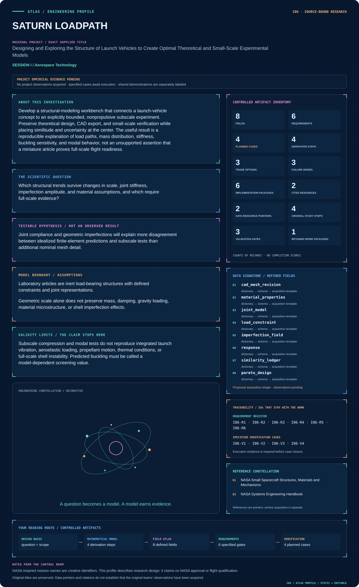

| Profile panel | Engineering signal | Open the evidence |
| --- | --- | --- |
| Mission identity | Designing and Exploring the Structure of Launch Vehicles to Create Optimal Theoretical and Small-Scale Experimental Models | [Scientific objective](../research/I/I06-saturn-loadpath/README.md#purpose-and-scientific-objective) |
| Model cockpit | 4 governing expressions; 4 derivation steps; declared assumptions and validity envelope | [Mathematical formulation](../research/I/I06-saturn-loadpath/README.md#4-mathematical-model-and-derivation) |
| Data blueprint | 8 proposed fields with types, units and quality rules | [Field map & downloads](../research/I/I06-saturn-loadpath/data/README.md) |
| Verification queue | 6 proposed requirements; 4 specified cases; project execution evidence pending | [Case definitions](../research/I/I06-saturn-loadpath/README.md#8-verification-and-validation-cases) |
| Figure wall | Architecture, field map, planned result description | [Open full gallery](../research/I/I06-saturn-loadpath/figures/README.md) |
| Resource library | 2 cited primary resources with support statements | [Cited resources](../research/I/I06-saturn-loadpath/README.md#12-cited-technical-and-scientific-resources) |

#### Model cockpit

**Analysis method:** Construct a parameterized load-path model and map requirements to force cases, constraints, and allowable deflections. Use beam and shell models only within declared applicability limits. Represent bolted/bonded joints by measured or uncertain stiffness rather than perfect connections. Introduce bounded geometric imperfections and compare linear modes, static compliance, and stability trends. Select a subscale inert test article using dimensionless similitude targets; document which similarity groups cannot be matched. An optimization study trades mass against compliance, uncertainty, and manufacturability, then exports reviewable CAD and an interface definition. Each CAD revision must link to the exact analysis mesh and assumptions.

**Operating envelope:** Subscale compression and modal tests do not reproduce integrated launch vibration, aeroelastic loading, propellant motion, thermal conditions, or full-scale shell instability. Predicted buckling must be called a model-dependent screening value.

**Variables and conventions**

- Displacement q in m; mass matrix M in kg; damping C in N s m^-1; stiffness K in N m^-1; applied force f in N.
- Angular natural frequency omega in rad s^-1; E in Pa; section area A in m^2; second moment I in m^4.
- Column length L in m and effective-length factor Ke dimensionless; critical load Pcr is a simple column comparator.
- Pi terms are dimensionless similarity measures; shell buckling is not certified by the Euler-column equation.

#### Artifact wall


Configuration-linked analysis and measured inert boundaries support only those structural trends whose similarity groups and uncertainty are documented.

**Scientific result to produce:** A load-path schematic next to finite-element modes and a similarity-group table, with measured and predicted subscale compliance distinctly labeled.

#### Investigation feed · planned work

The feed records proposed work packages. A row becomes executed evidence only with versioned inputs, outputs and a reviewed result.

| Sequence | Evidence state | Engineering work package |
| --- | --- | --- |
| 01 | Planned | Define supplied inert load/constraint and CAD configuration contracts. |
| 02 | Planned | Implement beam/frame analytic fixtures and mass checks. |
| 03 | Planned | Generate revision-linked shell meshes and uncertain joints. |
| 04 | Planned | Run imperfection/material/fixture ensembles and Pareto trades. |
| 05 | Planned | Select reviewable nonpropulsive subscale similarity targets. |
| 06 | Planned | Publish load/modal holdouts and unmatched full-scale similarity limits. |

#### Mission connections

Connections are reading routes based on actual shared resources, supplied sessions or included illustrations. They do not establish physical dependencies, team collaborations or validated results.

| Connected mission | Original investigation | Recorded connection basis |
| --- | --- | --- |
| [I04 · ORION SENTINEL CORE](../research/I/I04-orion-sentinel-core/README.md) | EagleSat Team: On-board Computer Subsystem | Session I; [NASA Systems Engineering Handbook](https://www.nasa.gov/reference/systems-engineering-handbook/) |
| [I03 · SATURN CHANNEL ATLAS](../research/I/I03-saturn-channel-atlas/README.md) | Rocket Development Lab Team: Cooling Channel Geometry Analysis for a Regeneratively Cooled Rocket Engine | Session I; [NASA Small Spacecraft Structures, Materials and Mechanisms](https://www.nasa.gov/smallsat-institute/sst-soa/structures-materials-and-mechanisms/) |
| [I10 · GEMINI POINTLOCK](../research/I/I10-gemini-pointlock/README.md) | Spacecraft Attitude Control Implementation and Development | Session I; [NASA Systems Engineering Handbook](https://www.nasa.gov/reference/systems-engineering-handbook/) |
| [G07 · HUBBLE SPECTRAL ANCHOR](../research/G/G07-hubble-spectral-anchor/README.md) | An Introduction to Systems Engineering: Building a Monochromator Mount | [NASA Systems Engineering Handbook](https://www.nasa.gov/reference/systems-engineering-handbook/) |
| [E08 · GATEWAY POWERBENCH](../research/E/E08-gateway-powerbench/README.md) | EagleSat Team: Development and Implementation of a Self-Contained Harness for In-House Integration, Verification, and Testing of CubeSat Electric Power Systems | [NASA Systems Engineering Handbook](https://www.nasa.gov/reference/systems-engineering-handbook/) |
| [E07 · DISCOVERY TRIDENT](../research/E/E07-discovery-trident/README.md) | Glendale Community College (GCC) ASCEND Team | [NASA Systems Engineering Handbook](https://www.nasa.gov/reference/systems-engineering-handbook/) |

[Machine-readable connection register and ranking rule](../registry/mission_connections.json)

#### Reading playlist

| Route | Start here | Continue to |
| --- | --- | --- |
| Understand the idea | [Scientific objective](../research/I/I06-saturn-loadpath/README.md#purpose-and-scientific-objective) | [Design boundary](../research/I/I06-saturn-loadpath/README.md#1-design-basis-and-analysis-boundary) → [Mathematics](../research/I/I06-saturn-loadpath/README.md#4-mathematical-model-and-derivation) |
| Inspect the data | [Visual blueprint](../research/I/I06-saturn-loadpath/data/README.md) | [Provenance](../research/I/I06-saturn-loadpath/README.md#5-data-specifications-and-provenance) → [Uncertainty](../research/I/I06-saturn-loadpath/README.md#6-uncertainty-sensitivity-and-identifiability) |
| Make a design decision | [Trade study](../research/I/I06-saturn-loadpath/README.md#7-engineering-trade-study) | [Failure modes](../research/I/I06-saturn-loadpath/README.md#10-failure-modes-and-interpretation-controls) → [Required outputs](../research/I/I06-saturn-loadpath/README.md#11-required-engineering-outputs) |
| Prepare execution | [Requirements](../research/I/I06-saturn-loadpath/README.md#2-requirements-and-verification-traceability) | [Verification](../research/I/I06-saturn-loadpath/README.md#8-verification-and-validation-cases) → [Implementation](../research/I/I06-saturn-loadpath/README.md#9-implementation-and-reproducible-work-packages) |

### Complete engineering dossier

The profile above is a browsing layer. The full design basis, equations, derivations, data contract, uncertainty, trades and controlled case definitions follow.

### Purpose and scientific objective

Develop a structural-modeling workbench that connects a launch-vehicle concept to an explicitly bounded, nonpropulsive subscale experiment. Preserve theoretical design, CAD export, and small-scale verification while placing similitude and uncertainty at the center. The useful result is a reproducible explanation of load paths, mass distribution, stiffness, buckling sensitivity, and modal behavior, not an unsupported assertion that a miniature article proves full-scale flight readiness.

**Question:** Which structural trends survive changes in scale, joint stiffness, imperfection amplitude, and material assumptions, and which require full-scale evidence?

**Testable hypothesis:** Joint compliance and geometric imperfections will explain more disagreement between idealized finite-element predictions and subscale tests than additional nominal mesh detail.

### 1. Design basis and analysis boundary

The structural workbench evaluates an inert launch-vehicle-inspired load-bearing concept through traceable models and subscale tests. Its boundary is supplied load cases, certified/assumed material properties, verified CAD and joints; outputs are compliance, modes, screening stability and similarity limitations. NASA structures context does not establish an integrated launch environment or full-scale readiness.

Begin with analytic beams and frame load paths, advance to shell/joint models and imperfection ensembles, then select an inert article whose achievable similitude groups are explicit. Geometric scaling alone does not preserve mass, gravity, damping or shell imperfections. No propulsion hardware or energetic test is part of the study. Actual scale, materials, fixture and allowable facility loads remain TBD.

### 2. Requirements and verification traceability

These are project design requirements or proposed analysis gates. A numerical target is not a NASA requirement unless its controlling source is explicitly identified. “TBD” identifies evidence required before a decision; it is not permission to assume a value. Verification evidence listed here is planned, unless a linked result explicitly records execution.

| ID | Requirement / gate | Engineering rationale | Verification method | Basis / required evidence |
| --- | --- | --- | --- | --- |
| I06-R1 | Every CAD revision shall link to analysis mesh, mass model, joint state and load/constraint manifest. | Untraceable model/CAD drift invalidates predictions. | Hash/revision and mass/load-path audit. | Proposed configuration contract. |
| I06-R2 | Static beam/modal fixtures shall agree with analytic limits to 1%, a proposed target. | Solver correctness precedes optimization. | Mesh-refined analytic beam tests. | Proposed numerical target. |
| I06-R3 | Joint stiffness and geometric imperfections shall be uncertain inputs rather than perfect defaults. | Connections/imperfections control compliance and stability. | Sensitivity and measured-joint provenance. | Proposed model fidelity. |
| I06-R4 | Subscale reports shall list matched and unmatched similarity groups. | Miniature performance cannot automatically establish full scale. | Dimensional similitude ledger. | Existing scale-transfer caveat. |
| I06-R5 | Buckling values shall state column/shell applicability and nonlinear imperfection assumptions. | Euler columns do not certify shells. | Mode/geometry and imperfection sensitivity audit. | Proposed stability scope. |
| I06-R6 | Measured tests shall be nonpropulsive inert loading/modal characterization within verified fixture limits. | Controlled structural evidence needs actual boundary conditions. | Fixture/load/sensor manifest and independent case holdout. | Proposed experimental gate. |

### 3. Architecture and controlled interfaces

A parameterized CAD/load-path registry emits geometry, material, joints and interface constraints. Mesh generation carries revision hashes and mass/compliance checks. Beam/frame and shell solvers have separate applicability flags. Load cases use externally supplied forces, accelerations or boundary motion rather than invented launch histories.

An uncertainty engine samples joint stiffness, material variation and imperfections. A mass/compliance/modal optimizer retains Pareto candidates and manufacturability constraints. The inert-test adapter records applied load, strain, displacement and acceleration with fixture compliance. A model/test comparator subtracts measured fixture response where justified and reports remaining scale-transfer discrepancies rather than tuning all stiffness terms to one test.


Configuration-linked analysis and measured inert boundaries support only those structural trends whose similarity groups and uncertainty are documented.

[Editable engineering diagram source](../research/I/I06-saturn-loadpath/figures/architecture.mmd)

### 4. Mathematical model and derivation

#### Governing equations

$$
\boldsymbol M\ddot{\boldsymbol q}+\boldsymbol C\dot{\boldsymbol q}+\boldsymbol K\boldsymbol q=\boldsymbol f(t)
$$

$$
\det(\boldsymbol K-\omega^2\boldsymbol M)=0
$$

$$
P_{\rm cr}=\pi^2EI/(K_eL)^2
$$

$$
\Pi_{\rm load}=P/(EA);\quad \Pi_{\rm bend}=EI/(EA L^2)
$$

#### Variables, units and conventions

- Displacement q in m; mass matrix M in kg; damping C in N s m^-1; stiffness K in N m^-1; applied force f in N.
- Angular natural frequency omega in rad s^-1; E in Pa; section area A in m^2; second moment I in m^4.
- Column length L in m and effective-length factor Ke dimensionless; critical load Pcr is a simple column comparator.
- Pi terms are dimensionless similarity measures; shell buckling is not certified by the Euler-column equation.

#### Assumptions and boundary conditions

- Laboratory articles are inert load-bearing structures with defined constraints and joint representations.
- Geometric scale alone does not preserve mass, damping, gravity loading, material microstructure, or shell imperfection effects.

#### Derivation step 1

$$
Kq=f,\quad M\ddot q+C\dot q+Kq=f(t)
$$

Static and dynamic models share a coordinate/load convention; matrix dimensions correspond to declared translational/rotational degrees of freedom.

#### Derivation step 2

$$
\det(K-\omega^2M)=0
$$

With appropriate boundary constraints, generalized eigenvalues give squared modal angular frequencies. Rigid-body modes must not be mistaken for solver failure.

#### Derivation step 3

$$
P_{cr}=\pi^2EI/(K_eL)^2
$$

This Euler-column comparator assumes slender elastic member and defined end conditions; shell stability requires a distinct model.

#### Derivation step 4

$$
\Pi_{load}=P/(EA),\quad\Pi_{bend}=I/(AL^2)
$$

Dimensionless load and geometric bending ratios guide similitude. Natural-frequency transfer additionally depends on density/mass distribution and length scale.

#### Inference or simulation procedure

Construct a parameterized load-path model and map requirements to force cases, constraints, and allowable deflections. Use beam and shell models only within declared applicability limits. Represent bolted/bonded joints by measured or uncertain stiffness rather than perfect connections. Introduce bounded geometric imperfections and compare linear modes, static compliance, and stability trends. Select a subscale inert test article using dimensionless similitude targets; document which similarity groups cannot be matched. An optimization study trades mass against compliance, uncertainty, and manufacturability, then exports reviewable CAD and an interface definition. Each CAD revision must link to the exact analysis mesh and assumptions.

#### Validity domain and fidelity limits

Subscale compression and modal tests do not reproduce integrated launch vibration, aeroelastic loading, propellant motion, thermal conditions, or full-scale shell instability. Predicted buckling must be called a model-dependent screening value.

### 5. Data specifications and provenance


**Proposed data contract · observations pending.** This visual inventory shows the record fields to acquire or derive. It contains no project measurements. [Open the data blueprint and downloads](../research/I/I06-saturn-loadpath/data/README.md).

| Field | Type | Unit | Physical / statistical meaning | Quality and missing-data rule |
| --- | --- | --- | --- | --- |
| cad_mesh_revision | struct<string> | 1 | Linked geometry/mesh/solver identity. | Checksums and units mandatory. |
| material_properties | measurement<struct> | Pa, kg m^-3 | E, density, strength/constitutive pedigree. | Assumed versus certified; temperature domain. |
| joint_model | distribution<struct> | N m^-1, N m rad^-1 | Connection stiffness and slip model. | Perfect connection only as explicit comparator. |
| load_constraint | struct | N, N m, m | Supplied force/moment and fixture boundary. | Coordinate/sign and source documented. |
| imperfection_field | distribution<array> | m | Geometric deviations by mode/location. | Amplitude prior and metrology evidence. |
| response | measurement<struct> | m, strain, Hz | Static and modal model/test quantities. | Sensor/fixture covariance and missing channels. |
| similarity_ledger | table | 1 | Matched/unmatched dimensionless groups. | No full-scale conclusion from unmatched groups. |
| pareto_design | table | kg, m N^-1, 1 | Mass/compliance/uncertainty candidates. | Screening buckling status and manufacturability. |

[Machine-readable record schema](../research/I/I06-saturn-loadpath/data/schema.json) · [Empty acquisition CSV](../research/I/I06-saturn-loadpath/data/acquisition.csv) · [Field dictionary CSV](../research/I/I06-saturn-loadpath/data/dictionary.csv)

The CSV above contains column headers only. Its schema defines future records and does not establish that original-team data or a particular archive product have been acquired. Frame, timing, calibration, covariance, selection and provenance details must accompany populated records.

#### NASA structures reference

[Product, archive or reference](https://www.nasa.gov/smallsat-institute/sst-soa/structures-materials-and-mechanisms/)

**Fields:** Materials, mechanisms, structural architecture and verification context

**Access:** Public survey; actual material certificates and joint data need acquisition.

**Role:** Technical context and candidate failure-mode checklist.

#### Proposed inert structural test dataset

[Product, archive or reference](https://www.nasa.gov/reference/systems-engineering-handbook/)

**Fields:** CAD revision, specimen material, joint state, applied load, strain, displacement, accelerometer record, boundary-condition metadata

**Access:** No measurements are supplied. Begin with synthetic beams and model-to-model benchmarks.

**Role:** Traceable structural validation and similitude assessment.

### 6. Uncertainty, sensitivity and identifiability

Joint compliance, fixture flexibility and material modulus can fit the same static displacement. Mass distribution and boundary stiffness similarly affect modes. Use multiple load locations and modal shapes, independently measuring fixture and specimen mass. Preserve shared scale/strain calibration covariance rather than treating every sensor point independently.

Buckling is imperfection-sensitive, especially for shells, and linear eigenvalues can overstate actual stability. Sweep measured/justified imperfections and nonlinear constitutive alternatives only within evidence. Compare normalized trends across inert scales, explicitly retaining unmatched gravity, damping and material groups. Optimization ranks model-conditioned candidates; manufacturing and validation uncertainty may erase a nominal mass benefit.

### 7. Engineering trade study

| Alternative | Benefit | Cost / limitation | Decision rule |
| --- | --- | --- | --- |
| Beam/frame model | Fast transparent load paths. | Misses local shell/joint effects. | Use analytic baseline and early trade study. |
| Shell model with uncertain joints | Resolves local modes/stability. | Mesh and imperfection dependence. | Use where geometry and measured joints justify it. |
| Inert subscale article | Checks load paths/modes empirically. | Incomplete similitude and fixture limits. | Use to validate supported trends, not flight qualification. |

### 8. Verification and validation cases

| Case ID | Stimulus / condition | Expected result / criterion | Method | Evidence artifact |
| --- | --- | --- | --- | --- |
| I06-V1 | Cantilever static limit | Tip deflection equals FL cubed/(3EI) for the declared slender uniform beam. | Mesh-refined beam fixture. | Euler-Bernoulli analytic limit. |
| I06-V2 | Mass scaling | Multiplying all masses by factor s divides modal frequencies by sqrt(s) at fixed stiffness. | Generalized eigenvalue fixture. | Modal scaling identity. |
| I06-V3 | Rigid-body freedom | Unconstrained model retains expected zero-frequency rigid modes. | Free/free modal model. | Boundary-condition consistency. |
| I06-V4 | Withheld inert load case | Static/modal response is predicted without re-fitting that fixture/load. | Independent nonpropulsive test case. | Proposed structural validation. |

**Execution status:** these cases are specified, not claimed as executed. Close a case only with the versioned inputs, output, uncertainty, reviewer and pass/fail rationale.

#### Additional scientific validation gates

- Report mesh convergence and strain-energy consistency; test free-body reaction balance.
- Compare held-out compliance and first mode frequencies with uncertainty intervals; use mode-shape correlation alongside frequency error.
- Vary boundary stiffness and imperfection amplitude and identify where the structural design ranking reverses.

### 9. Implementation and reproducible work packages

1. Define supplied inert load/constraint and CAD configuration contracts.
2. Implement beam/frame analytic fixtures and mass checks.
3. Generate revision-linked shell meshes and uncertain joints.
4. Run imperfection/material/fixture ensembles and Pareto trades.
5. Select reviewable nonpropulsive subscale similarity targets.
6. Publish load/modal holdouts and unmatched full-scale similarity limits.

#### Investigation sequence

1. Define inert article requirements, load paths, and similarity targets; record missing full-scale phenomena.
2. Verify elements and constraints against beam/column references before assembling the CAD-derived model.
3. Measure joint stiffness and run supervised static/modal tests with independent displacement and strain sensing.
4. Freeze a holdout configuration and compare predictions before updating the model.

#### Resources and interfaces to expertise

- CAD/finite-element environment, calibrated load/displacement/strain instruments, modal analysis tools, and a supervised structural laboratory.

### 10. Failure modes and interpretation controls

| Failure mode | Effect on result | Detection / evidence | Design response |
| --- | --- | --- | --- |
| Perfect joint assumed | Overstated stiffness/mode frequency. | Mode/load residual localized at connection. | Measured/uncertain joint model. |
| CAD/mesh mismatch | Wrong mass/load path. | Revision/hash audit. | Linked configuration and automatic geometry checks. |
| Subscale success called flight proof | Unsupported readiness claim. | Unmatched similarity/environment ledger. | Report bounded structural trends and remaining evidence. |

- Idealized boundary conditions and undocumented joints can dominate apparent scale effects. Structural failure testing requires an institutionally controlled fixture and exclusion zone.

### 11. Required engineering outputs

- CAD-to-analysis manifest, mass/stiffness trade atlas, inert subscale test specification, similitude ledger, and uncertainty-aware validation report.

#### Scientific result figures to produce during execution

A load-path schematic next to finite-element modes and a similarity-group table, with measured and predicted subscale compliance distinctly labeled.

### 12. Cited technical and scientific resources

- [NASA Small Spacecraft Structures, Materials and Mechanisms](https://www.nasa.gov/smallsat-institute/sst-soa/structures-materials-and-mechanisms/) — Structural/material verification context used as a methodological reference.
- [NASA Systems Engineering Handbook](https://www.nasa.gov/reference/systems-engineering-handbook/) — Requirements, interfaces, configuration control, and verification traceability.

Framework and evidence rules: [engineering documentation standard](../engineering/ENGINEERING_STANDARD.md), [model assurance](../engineering/MODEL_ASSURANCE.md), [uncertainty procedure](../engineering/UNCERTAINTY_AND_DECISION_RULES.md), [data management](../engineering/DATA_MANAGEMENT.md). NASA-inspired names are creative identifiers; requirements and results are not NASA certification.

---

<a id="i07"></a>

## I07 · GATEWAY CATSAT CONSOLE

**Original project:** CatSat Groundstation Command and Control

**Session I:** Aerospace Technology

**Document class:** engineering research design and analysis record · **Revision:** 4 · **Date:** 2026-10-02

**Evidence state:** design basis, mathematical formulation and verification plan documented. Project-specific empirical results remain to be acquired; executable shared model demonstrations have their own recorded checks.

[Session I](../research/I/README.md) · [All projects](../ENGINEERING_DOCUMENTATION.md) · [Session handbook](SESSION_I.md) · [← I06](../research/I/I06-saturn-loadpath/README.md) · [I08 →](../research/I/I08-voyager-frameforge/README.md)

| Proposed requirements | Specified verification cases | Defined data fields | Cited resources |
| ---: | ---: | ---: | ---: |
| 6 | 4 | 8 | 2 |

[Explore the data blueprint](../research/I/I07-gateway-catsat-console/data/README.md) · [Open the figure gallery](../research/I/I07-gateway-catsat-console/figures/README.md) · [Download acquisition template](../research/I/I07-gateway-catsat-console/data/acquisition.csv) · [Browse the data atlas](../data/README.md)

---

### Mission profile

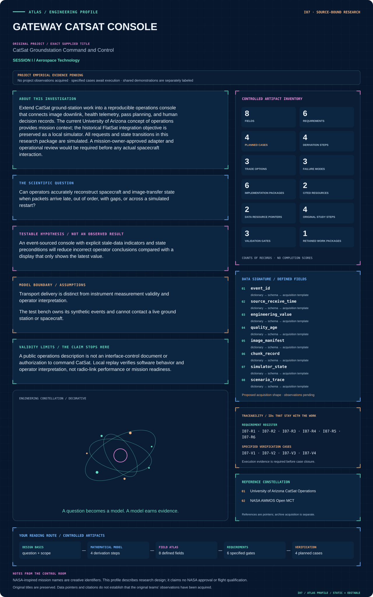

| Profile panel | Engineering signal | Open the evidence |
| --- | --- | --- |
| Mission identity | CatSat Groundstation Command and Control | [Scientific objective](../research/I/I07-gateway-catsat-console/README.md#purpose-and-scientific-objective) |
| Model cockpit | 4 governing expressions; 4 derivation steps; declared assumptions and validity envelope | [Mathematical formulation](../research/I/I07-gateway-catsat-console/README.md#4-mathematical-model-and-derivation) |
| Data blueprint | 8 proposed fields with types, units and quality rules | [Field map & downloads](../research/I/I07-gateway-catsat-console/data/README.md) |
| Verification queue | 6 proposed requirements; 4 specified cases; project execution evidence pending | [Case definitions](../research/I/I07-gateway-catsat-console/README.md#8-verification-and-validation-cases) |
| Figure wall | Architecture, field map, planned result description | [Open full gallery](../research/I/I07-gateway-catsat-console/figures/README.md) |
| Resource library | 2 cited primary resources with support statements | [Cited resources](../research/I/I07-gateway-catsat-console/README.md#12-cited-technical-and-scientific-resources) |

#### Model cockpit

**Analysis method:** Define a versioned telemetry dictionary, event ledger, and abstract state machine for simulated commissioning and routine image collection. Build a local packet-replay service with reproducible loss, delay, duplication, and reset patterns. Use Open MCT as an optional visualization framework while keeping telemetry ingestion and reconstruction independently testable. Display source time, receive time, freshness, uncertainty, and provenance beside every engineering value. Reassemble synthetic images using chunk identifiers and integrity checks; diagnose incomplete transfers from the manifest rather than treating a successful socket read as completed science delivery. Evaluate operator tasks using randomized scenario order, including cases where the correct answer is that current state cannot be established.

**Operating envelope:** A public operations description is not an interface-control document or authorization to command CatSat. Local replay verifies software behavior and operator interpretation, not radio-link performance or mission readiness.

**Variables and conventions**

- Buffer B and produced image/data size S in bytes; useful downlink capacity C in bytes s^-1; interval dt in s.
- Telemetry age A in s refers to source-valid time, distinct from reception time; clock uncertainty is included.
- Completeness fraction counts valid unique chunks; expected chunk count comes from a trusted synthetic manifest.
- State s and event e are abstract simulator records. Real radio commands, frequencies, credentials, and flight protocols are outside this package.

#### Artifact wall



All interfaces are owned synthetic records; manifest integrity, timestamp evidence and idempotent reconstruction precede operator display.

**Scientific result to produce:** A pass timeline, freshness-aware telemetry panel, and synthetic image-chunk map that reveal gaps and delayed events without implying live spacecraft control.

#### Investigation feed · planned work

The feed records proposed work packages. A row becomes executed evidence only with versioned inputs, outputs and a reviewed result.

| Sequence | Evidence state | Engineering work package |
| --- | --- | --- |
| 01 | Planned | Define synthetic telemetry dictionary, event IDs and image manifests. |
| 02 | Planned | Implement isolated replay with seeded delay/loss/duplicate/reset patterns. |
| 03 | Planned | Build idempotent state ledger and checkpoint recovery. |
| 04 | Planned | Implement manifest-based image assembly and clock-aware freshness. |
| 05 | Planned | Connect optional operator view only to reconstructed contracts. |
| 06 | Planned | Release expected-state fixtures and randomized unknown-state operator scenarios. |

#### Mission connections

Connections are reading routes based on actual shared resources, supplied sessions or included illustrations. They do not establish physical dependencies, team collaborations or validated results.

| Connected mission | Original investigation | Recorded connection basis |
| --- | --- | --- |
| [E01 · APOLLO HELIOSCOPE](../research/E/E01-apollo-helioscope/README.md) | Phoenix College: Video Streaming and DNA Studies | [NASA AMMOS Open MCT](https://ammos.nasa.gov/openmct/) |
| [I06 · SATURN LOADPATH](../research/I/I06-saturn-loadpath/README.md) | Designing and Exploring the Structure of Launch Vehicles to Create Optimal Theoretical and Small-Scale Experimental Models | Session I |
| [I08 · VOYAGER FRAMEFORGE](../research/I/I08-voyager-frameforge/README.md) | Julia 1.2 Ephemeris and Gravitational Modeling Development | Session I |
| [I05 · PIONEER AERODRIFT](../research/I/I05-pioneer-aerodrift/README.md) | Pico Balloon Platform for Atmospheric Exploration | Session I |
| [I09 · OSIRIS REGOLITH LEAPER](../research/I/I09-osiris-regolith-leaper/README.md) | Simulation and Evaluation of a Mechanical Hopping Mechanism for Robotic Small Body Surface Exploration | Session I |
| [I04 · ORION SENTINEL CORE](../research/I/I04-orion-sentinel-core/README.md) | EagleSat Team: On-board Computer Subsystem | Session I |

[Machine-readable connection register and ranking rule](../registry/mission_connections.json)

#### Reading playlist

| Route | Start here | Continue to |
| --- | --- | --- |
| Understand the idea | [Scientific objective](../research/I/I07-gateway-catsat-console/README.md#purpose-and-scientific-objective) | [Design boundary](../research/I/I07-gateway-catsat-console/README.md#1-design-basis-and-analysis-boundary) → [Mathematics](../research/I/I07-gateway-catsat-console/README.md#4-mathematical-model-and-derivation) |
| Inspect the data | [Visual blueprint](../research/I/I07-gateway-catsat-console/data/README.md) | [Provenance](../research/I/I07-gateway-catsat-console/README.md#5-data-specifications-and-provenance) → [Uncertainty](../research/I/I07-gateway-catsat-console/README.md#6-uncertainty-sensitivity-and-identifiability) |
| Make a design decision | [Trade study](../research/I/I07-gateway-catsat-console/README.md#7-engineering-trade-study) | [Failure modes](../research/I/I07-gateway-catsat-console/README.md#10-failure-modes-and-interpretation-controls) → [Required outputs](../research/I/I07-gateway-catsat-console/README.md#11-required-engineering-outputs) |
| Prepare execution | [Requirements](../research/I/I07-gateway-catsat-console/README.md#2-requirements-and-verification-traceability) | [Verification](../research/I/I07-gateway-catsat-console/README.md#8-verification-and-validation-cases) → [Implementation](../research/I/I07-gateway-catsat-console/README.md#9-implementation-and-reproducible-work-packages) |

### Complete engineering dossier

The profile above is a browsing layer. The full design basis, equations, derivations, data contract, uncertainty, trades and controlled case definitions follow.

### Purpose and scientific objective

Extend CatSat ground-station work into a reproducible operations console that connects image downlink, health telemetry, pass planning, and human decision records. The current University of Arizona concept of operations provides mission context; the historical FlatSat integration objective is preserved as a local simulator. All requests and state transitions in this research package are simulated. A mission-owner-approved adapter and operational review would be required before any actual spacecraft interaction.

**Question:** Can operators accurately reconstruct spacecraft and image-transfer state when packets arrive late, out of order, with gaps, or across a simulated restart?

**Testable hypothesis:** An event-sourced console with explicit stale-data indicators and state preconditions will reduce incorrect operator conclusions compared with a display that only shows the latest value.

### 1. Design basis and analysis boundary

The CatSat operations package is an isolated local FlatSat/event-replay simulator. Its boundary contains synthetic health telemetry, inert images, pass-capacity scenarios and abstract operator requests. It cannot contact a live station or spacecraft and contains no real command/radio protocol, credentials or target. Public CatSat operations context supplies research continuity, not operational authorization or an interface-control document.

Begin with deterministic event reconstruction and image manifests, then loss/reorder/reset scenarios and operator-state interpretation. Science validity is distinct from transport receipt. Open MCT is an optional view over independently tested state reconstruction. The operator can correctly conclude that current state is unknown; stale telemetry must not appear fresh because it arrived recently.

### 2. Requirements and verification traceability

These are project design requirements or proposed analysis gates. A numerical target is not a NASA requirement unless its controlling source is explicitly identified. “TBD” identifies evidence required before a decision; it is not permission to assume a value. Verification evidence listed here is planned, unless a linked result explicitly records execution.

| ID | Requirement / gate | Engineering rationale | Verification method | Basis / required evidence |
| --- | --- | --- | --- | --- |
| I07-R1 | The simulator shall expose no live-radio/mission adapter or external command transport. | The executable scope is owned synthetic replay. | Dependency/configuration and network-isolation integration check. | Proposed simulator-only boundary. |
| I07-R2 | Every engineering value shall retain source-valid time, receive time, quality and clock uncertainty. | Delayed packets can look current. | Synthetic delay/freshness fixture. | Proposed state-provenance contract. |
| I07-R3 | Image completeness shall count valid unique chunks against a trusted synthetic manifest. | Duplicate receipts do not add science. | Duplicate/corrupt/missing chunk replay. | Proposed integrity requirement. |
| I07-R4 | Abstract request handling shall be idempotent across restart and repeated event IDs. | Replay must reconstruct one authoritative state. | Checkpoint/replay state equivalence test. | Proposed event contract. |
| I07-R5 | Freshness thresholds shall be versioned per field; stale or missing values shall produce unknown/stale states. | One global timer cannot establish all subsystem states. | Threshold and missing-data scenario audit. | Proposed operator evidence requirement. |
| I07-R6 | Operator assessment shall include scenarios where state cannot be established. | Always choosing a state rewards false certainty. | Randomized synthetic-task scoring with unknown answer. | Proposed human-factors validation. |

### 3. Architecture and controlled interfaces

A synthetic scenario manifest defines expected measurements, image chunks, clock errors and abstract events. An isolated replay service applies loss, delay, duplication, corruption and restart patterns. The event ledger records source and receive timestamps with immutable IDs. State reconstruction uses source ordering and quality rules, while request-state transitions are abstract local simulator functions.

The image assembler validates checksum/ID and compares unique chunk sets with the manifest. A freshness service evaluates each telemetry field under clock uncertainty. The operator view consumes these reconstructed contracts and shows unknown/stale evidence states. A test harness compares complete replay with restarted/delayed runs independently of the visualization framework.


All interfaces are owned synthetic records; manifest integrity, timestamp evidence and idempotent reconstruction precede operator display.

[Editable engineering diagram source](../research/I/I07-gateway-catsat-console/figures/architecture.mmd)

### 4. Mathematical model and derivation

#### Governing equations

$$
B_{n+1}=\max(0,B_n+S_n-C_n\Delta t_n)
$$

$$
A_j=t_{\rm now}-t_{{\rm valid},j}
$$

$$
f_{\rm complete}=N_{\rm unique\ valid}/N_{\rm expected}
$$

$$
s_{n+1}=F(s_n,e_n);\quad e_n=(\mathrm{ID},t_{\rm source},t_{\rm receive},\mathrm{quality})
$$

#### Variables, units and conventions

- Buffer B and produced image/data size S in bytes; useful downlink capacity C in bytes s^-1; interval dt in s.
- Telemetry age A in s refers to source-valid time, distinct from reception time; clock uncertainty is included.
- Completeness fraction counts valid unique chunks; expected chunk count comes from a trusted synthetic manifest.
- State s and event e are abstract simulator records. Real radio commands, frequencies, credentials, and flight protocols are outside this package.

#### Assumptions and boundary conditions

- Transport delivery is distinct from instrument measurement validity and operator interpretation.
- The test bench owns its synthetic events and cannot contact a live ground station or spacecraft.

#### Derivation step 1

$$
B_{n+1}=\min[B_{max},\max(0,B_n+S_n-C_n\Delta t_n)]
$$

Finite buffer capacity requires a separate explicit loss counter when unclamped occupancy exceeds Bmax; generated bytes are not silently discarded.

#### Derivation step 2

```text
A_j=t_{now}-t_{valid,j}
```

Age uses measurement-valid time, not receive time. Clock uncertainty produces an age interval and can prevent a fresh classification.

#### Derivation step 3

```text
f_{complete}=N_{unique,valid}/N_{expected}
```

The trusted synthetic manifest supplies the denominator; duplicates and invalid chunks do not increase the numerator.

#### Derivation step 4

$$
s_{n+1}=F(s_n,e_n),\quad F(F(s,e),e)=F(s,e)
$$

Idempotent event processing prevents a replayed ID from executing a second abstract transition. Ordering rules and checkpoint generation are explicit.

#### Inference or simulation procedure

Define a versioned telemetry dictionary, event ledger, and abstract state machine for simulated commissioning and routine image collection. Build a local packet-replay service with reproducible loss, delay, duplication, and reset patterns. Use Open MCT as an optional visualization framework while keeping telemetry ingestion and reconstruction independently testable. Display source time, receive time, freshness, uncertainty, and provenance beside every engineering value. Reassemble synthetic images using chunk identifiers and integrity checks; diagnose incomplete transfers from the manifest rather than treating a successful socket read as completed science delivery. Evaluate operator tasks using randomized scenario order, including cases where the correct answer is that current state cannot be established.

#### Validity domain and fidelity limits

A public operations description is not an interface-control document or authorization to command CatSat. Local replay verifies software behavior and operator interpretation, not radio-link performance or mission readiness.

### 5. Data specifications and provenance


**Proposed data contract · observations pending.** This visual inventory shows the record fields to acquire or derive. It contains no project measurements. [Open the data blueprint and downloads](../research/I/I07-gateway-catsat-console/data/README.md).

| Field | Type | Unit | Physical / statistical meaning | Quality and missing-data rule |
| --- | --- | --- | --- | --- |
| event_id | string | 1 | Unique synthetic event identity. | Duplicate IDs must have identical payload or conflict state. |
| source_receive_time | float64[2] | s declared scale | Valid measurement and reception times. | Clock uncertainty and restart generation attached. |
| engineering_value | typed scalar&#124;null | dictionary-declared | Synthetic subsystem observation. | Null/invalid/stale separate; no last-value freshness assumption. |
| quality_age | struct | 1, s | Validity/freshness evidence. | Per-field rule and uncertainty interval. |
| image_manifest | struct | byte, chunk count | Expected inert image and integrity identifiers. | Trusted scenario version; never inferred from socket closure. |
| chunk_record | bytes+ID+checksum | byte | Received image segment. | Unique valid chunks only; conflicts flagged. |
| simulator_state | enum+ledger | 1 | Abstract local operation state. | No real command or radio fields. |
| scenario_trace | table | s, 1 | Loss/delay/reset seed and expected outcomes. | Replay deterministic and independently scored. |

[Machine-readable record schema](../research/I/I07-gateway-catsat-console/data/schema.json) · [Empty acquisition CSV](../research/I/I07-gateway-catsat-console/data/acquisition.csv) · [Field dictionary CSV](../research/I/I07-gateway-catsat-console/data/dictionary.csv)

The CSV above contains column headers only. Its schema defines future records and does not establish that original-team data or a particular archive product have been acquired. Frame, timing, calibration, covariance, selection and provenance details must accompany populated records.

#### University of Arizona CatSat operations concept

[Product, archive or reference](https://catsat.arizona.edu/operations/concept)

**Fields:** Public commissioning and science-operation descriptions

**Access:** Public context only; exact current interfaces, telemetry and operational authority must come from the mission team.

**Role:** Requirements discovery and historical-project continuity.

#### Proposed isolated telemetry replay dataset

[Product, archive or reference](https://ammos.nasa.gov/openmct/)

**Fields:** Source/receive timestamps, subsystem state, sequence, quality, image manifest, operator annotation, scenario seed

**Access:** Create entirely synthetic fixture events and inert sample images. No real mission packets are required.

**Role:** Deterministic software and human-factors validation.

### 6. Uncertainty, sensitivity and identifiability

Clock skew and out-of-order delivery can make valid-time ordering ambiguous. Keep source-clock uncertainty and event conflicts rather than silently sorting by receive time. Freshness decisions are robust only when the entire possible age interval lies within its declared bound. Transport corruption and missing chunks affect image completeness separately from scientific measurement validity.

Human interpretation depends on missingness display and evidence traceability. Use randomized scenario order and scoring that rewards unknown when evidence is inadequate. Software validation measures replay/state integrity, not RF link performance or mission readiness. Public operational descriptions may evolve and remain context only; exact mission interfaces would require separate owner-provided evidence beyond this isolated package.

### 7. Engineering trade study

| Alternative | Benefit | Cost / limitation | Decision rule |
| --- | --- | --- | --- |
| Event-sourced local reconstruction | Deterministic audit/restart behavior. | Ordering/conflict semantics need care. | Use authoritative state layer. |
| Open MCT visualization adapter | Flexible timeline/value presentation. | View correctness does not validate reconstruction. | Use after contract-level tests pass. |
| Simple static scenario reports | Low implementation cost and clear review. | Limited operator interaction. | Use baseline/fixtures alongside any console. |

### 8. Verification and validation cases

| Case ID | Stimulus / condition | Expected result / criterion | Method | Evidence artifact |
| --- | --- | --- | --- | --- |
| I07-V1 | Duplicate replay | State and unique-image completeness remain unchanged. | Replay every valid event/chunk twice. | Idempotence/set-count identity. |
| I07-V2 | Delayed fresh-looking packet | Age follows source time and field becomes stale/unknown as appropriate. | Late receive-time injection. | Declared freshness equation. |
| I07-V3 | Restart equivalence | Checkpoint plus replay yields the same authoritative state as uninterrupted run. | Deterministic reset at varied event positions. | Event-ledger integration. |
| I07-V4 | Missing/corrupt image chunk | Completeness stays below one and assembler reports exact missing/conflicting IDs. | Synthetic inert image manifest replay. | Integrity contract. |

**Execution status:** these cases are specified, not claimed as executed. Close a case only with the versioned inputs, output, uncertainty, reviewer and pass/fail rationale.

#### Additional scientific validation gates

- Reconcile every expected synthetic event and image chunk with an independent reference ledger after delay, duplicate, and reset cases.
- Require the console to distinguish unknown, stale, invalid, and nominal state in all specified simulator scenarios.
- Measure task accuracy, time to recognize data staleness, false-alarm rate, and workload; report sample size and uncertainty instead of claiming universal operator improvement.

### 9. Implementation and reproducible work packages

1. Define synthetic telemetry dictionary, event IDs and image manifests.
2. Implement isolated replay with seeded delay/loss/duplicate/reset patterns.
3. Build idempotent state ledger and checkpoint recovery.
4. Implement manifest-based image assembly and clock-aware freshness.
5. Connect optional operator view only to reconstructed contracts.
6. Release expected-state fixtures and randomized unknown-state operator scenarios.

#### Investigation sequence

1. Create an operations-to-telemetry requirements matrix with stale-state and unknown-state behaviors.
2. Implement replay and image reconstruction independently of the display framework.
3. Add simulated request preconditions, approval-record visualization, and a full event audit trail.
4. Run blinded operator scenarios and release the failure cases with reproducible seeds.

#### Resources and interfaces to expertise

- Local simulator, versioned schemas, Open MCT or equivalent dashboard, usability evaluator, and mission operations mentor.

### 10. Failure modes and interpretation controls

| Failure mode | Effect on result | Detection / evidence | Design response |
| --- | --- | --- | --- |
| Receipt called valid measurement | False current state. | Age/quality evidence mismatch. | Separate transport and measurement validity. |
| Socket closure called complete image | Incomplete science product accepted. | Manifest chunk reconciliation. | Require unique valid manifest coverage. |
| Simulator accidentally wired to live target | Scope violation. | Dependency/config endpoint isolation audit. | No live adapter; synthetic-only transport types. |

- Arrival order can mislead a display that ignores source time. Similar-looking stale values, incorrect clocks, and incomplete image manifests can conceal a degraded scientific record.

### 11. Required engineering outputs

- Telemetry dictionary, replay fixtures, simulated console, image-completeness report, operator evaluation plan, and mission-adapter requirements.

#### Scientific result figures to produce during execution

A pass timeline, freshness-aware telemetry panel, and synthetic image-chunk map that reveal gaps and delayed events without implying live spacecraft control.

### 12. Cited technical and scientific resources

- [University of Arizona CatSat Operations](https://catsat.arizona.edu/operations/concept) — Public mission-operations context; not a live interface specification.
- [NASA AMMOS Open MCT](https://ammos.nasa.gov/openmct/) — Open visualization framework for mission-control-style displays.

Framework and evidence rules: [engineering documentation standard](../engineering/ENGINEERING_STANDARD.md), [model assurance](../engineering/MODEL_ASSURANCE.md), [uncertainty procedure](../engineering/UNCERTAINTY_AND_DECISION_RULES.md), [data management](../engineering/DATA_MANAGEMENT.md). NASA-inspired names are creative identifiers; requirements and results are not NASA certification.

---

<a id="i08"></a>

## I08 · VOYAGER FRAMEFORGE

**Original project:** Julia 1.2 Ephemeris and Gravitational Modeling Development

**Session I:** Aerospace Technology

**Document class:** engineering research design and analysis record · **Revision:** 4 · **Date:** 2026-10-02

**Evidence state:** design basis, mathematical formulation and verification plan documented. Project-specific empirical results remain to be acquired; executable shared model demonstrations have their own recorded checks.

[Session I](../research/I/README.md) · [All projects](../ENGINEERING_DOCUMENTATION.md) · [Session handbook](SESSION_I.md) · [← I07](../research/I/I07-gateway-catsat-console/README.md) · [I09 →](../research/I/I09-osiris-regolith-leaper/README.md)

| Proposed requirements | Specified verification cases | Defined data fields | Cited resources |
| ---: | ---: | ---: | ---: |
| 6 | 4 | 8 | 2 |

[Explore the data blueprint](../research/I/I08-voyager-frameforge/data/README.md) · [Open the figure gallery](../research/I/I08-voyager-frameforge/figures/README.md) · [Download acquisition template](../research/I/I08-voyager-frameforge/data/acquisition.csv) · [Browse the data atlas](../data/README.md)

---

### Mission profile

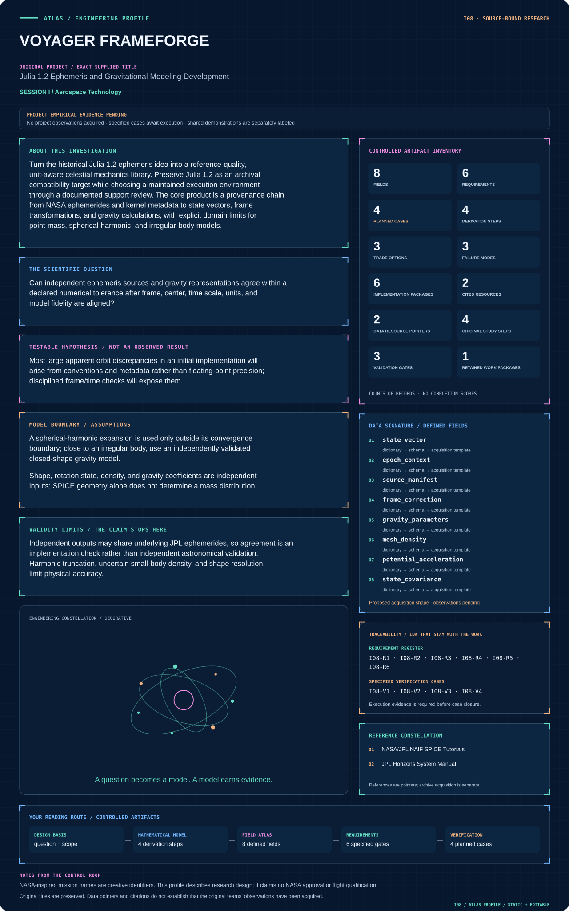

| Profile panel | Engineering signal | Open the evidence |
| --- | --- | --- |
| Mission identity | Julia 1.2 Ephemeris and Gravitational Modeling Development | [Scientific objective](../research/I/I08-voyager-frameforge/README.md#purpose-and-scientific-objective) |
| Model cockpit | 4 governing expressions; 4 derivation steps; declared assumptions and validity envelope | [Mathematical formulation](../research/I/I08-voyager-frameforge/README.md#4-mathematical-model-and-derivation) |
| Data blueprint | 8 proposed fields with types, units and quality rules | [Field map & downloads](../research/I/I08-voyager-frameforge/data/README.md) |
| Verification queue | 6 proposed requirements; 4 specified cases; project execution evidence pending | [Case definitions](../research/I/I08-voyager-frameforge/README.md#8-verification-and-validation-cases) |
| Figure wall | Architecture, field map, planned result description; included shared illustration | [Open full gallery](../research/I/I08-voyager-frameforge/figures/README.md) |
| Resource library | 2 cited primary resources with support statements | [Cited resources](../research/I/I08-voyager-frameforge/README.md#12-cited-technical-and-scientific-resources) |

#### Model cockpit

**Analysis method:** Implement a thin Julia interface over documented SPICE/Horizons conventions and maintain a cached, checksum-tagged reference manifest. Create round-trip transformations and compare state vectors only after matching center, reference frame, aberration correction, and epoch. Add point-mass and spherical-harmonic evaluators with unit tests at analytic limits; a later uniform-density polyhedral evaluator must verify closed mesh orientation and mass consistency. Compare acceleration with numerical potential gradients and external-field Laplace residuals. Benchmark runtime only after correctness, separating kernel loading, interpolation, compilation, and repeated evaluation. Archive Julia 1.2 behavior in compatibility notes instead of making it a requirement for all future work.

**Operating envelope:** Independent outputs may share underlying JPL ephemerides, so agreement is an implementation check rather than independent astronomical validation. Harmonic truncation, uncertain small-body density, and shape resolution limit physical accuracy.

**Variables and conventions**

- Position r and reference radius R in m; time in s with explicit TDB/UTC/other labels; gravitational parameter muk in m^3 s^-2.
- Potential V in m^2 s^-2 uses the positive mu/r convention; acceleration a in m s^-2 is its gradient.
- phi/varphi and lambda in rad; harmonic coefficients and consistently normalized Legendre functions are dimensionless.
- L is harmonic truncation degree; each state carries center, frame, epoch, units, kernel/source version, and interpolation setting.

#### Artifact wall


Synthetic two-body conservation and refinement diagnostics from immutable model outputs. Panel A scales relative specific-energy error to parts per million and reports angular-momentum conservation for the stored 400-step-per-period run. Panel B compares three recorded maximum-energy errors with a second-order reference anchored to the coarsest run. This is an integration check, not trajectory prediction validation.

[Exact inputs, transformations and output hashes](../data/figures/14_orbit_conservation_and_refinement.provenance.json)

**Scientific result to produce:** A provenance diagram beside state-residual plots and a radial gravity-model disagreement map, with convergence boundaries and reference conventions labeled.

#### Investigation feed · planned work

The feed records proposed work packages. A row becomes executed evidence only with versioned inputs, outputs and a reviewed result.

| Sequence | Evidence state | Engineering work package |
| --- | --- | --- |
| 01 | Planned | Create source/checksum and fully typed state/context contracts. |
| 02 | Planned | Implement matched SPICE/Horizons adapters and cached validity checks. |
| 03 | Planned | Build position-velocity frame/time round-trip fixtures. |
| 04 | Planned | Implement point-mass and normalized-harmonic potential/gradient APIs. |
| 05 | Planned | Gate closed-shape evaluator on topology/mass and domain validation. |
| 06 | Planned | Release archival Julia notes, matched-reference residuals and separated runtime benchmarks. |

#### Mission connections

Connections are reading routes based on actual shared resources, supplied sessions or included illustrations. They do not establish physical dependencies, team collaborations or validated results.

| Connected mission | Original investigation | Recorded connection basis |
| --- | --- | --- |
| [I12 · PIONEER PHOBOS PATHFINDER](../research/I/I12-pioneer-phobos-pathfinder/README.md) | Heuristic Optimization Applied to Orbital Transfers Between Low-Planetary Orbits and Distant Retrograde Orbits | Session I; Included illustration: 07_two_body_convergence; [NASA/JPL NAIF SPICE Tutorials](https://naif.jpl.nasa.gov/naif/tutorials.html); [JPL Horizons System Manual](https://ssd.jpl.nasa.gov/horizons/manual.html) |
| [I09 · OSIRIS REGOLITH LEAPER](../research/I/I09-osiris-regolith-leaper/README.md) | Simulation and Evaluation of a Mechanical Hopping Mechanism for Robotic Small Body Surface Exploration | Session I; [NASA/JPL NAIF SPICE Tutorials](https://naif.jpl.nasa.gov/naif/tutorials.html) |
| [I13 · OSIRIS APOPHIS HORIZON](../research/I/I13-osiris-apophis-horizon/README.md) | A Study of the Deflection of 99942 Apophis from Earth | Session I; [JPL Horizons System Manual](https://ssd.jpl.nasa.gov/horizons/manual.html) |
| [I07 · GATEWAY CATSAT CONSOLE](../research/I/I07-gateway-catsat-console/README.md) | CatSat Groundstation Command and Control | Session I |
| [I06 · SATURN LOADPATH](../research/I/I06-saturn-loadpath/README.md) | Designing and Exploring the Structure of Launch Vehicles to Create Optimal Theoretical and Small-Scale Experimental Models | Session I |
| [I10 · GEMINI POINTLOCK](../research/I/I10-gemini-pointlock/README.md) | Spacecraft Attitude Control Implementation and Development | Session I |

[Machine-readable connection register and ranking rule](../registry/mission_connections.json)

#### Reading playlist

| Route | Start here | Continue to |
| --- | --- | --- |
| Understand the idea | [Scientific objective](../research/I/I08-voyager-frameforge/README.md#purpose-and-scientific-objective) | [Design boundary](../research/I/I08-voyager-frameforge/README.md#1-design-basis-and-analysis-boundary) → [Mathematics](../research/I/I08-voyager-frameforge/README.md#4-mathematical-model-and-derivation) |
| Inspect the data | [Visual blueprint](../research/I/I08-voyager-frameforge/data/README.md) | [Provenance](../research/I/I08-voyager-frameforge/README.md#5-data-specifications-and-provenance) → [Uncertainty](../research/I/I08-voyager-frameforge/README.md#6-uncertainty-sensitivity-and-identifiability) |
| Make a design decision | [Trade study](../research/I/I08-voyager-frameforge/README.md#7-engineering-trade-study) | [Failure modes](../research/I/I08-voyager-frameforge/README.md#10-failure-modes-and-interpretation-controls) → [Required outputs](../research/I/I08-voyager-frameforge/README.md#11-required-engineering-outputs) |
| Prepare execution | [Requirements](../research/I/I08-voyager-frameforge/README.md#2-requirements-and-verification-traceability) | [Verification](../research/I/I08-voyager-frameforge/README.md#8-verification-and-validation-cases) → [Implementation](../research/I/I08-voyager-frameforge/README.md#9-implementation-and-reproducible-work-packages) |

### Complete engineering dossier

The profile above is a browsing layer. The full design basis, equations, derivations, data contract, uncertainty, trades and controlled case definitions follow.

### Purpose and scientific objective

Turn the historical Julia 1.2 ephemeris idea into a reference-quality, unit-aware celestial mechanics library. Preserve Julia 1.2 as an archival compatibility target while choosing a maintained execution environment through a documented support review. The core product is a provenance chain from NASA ephemerides and kernel metadata to state vectors, frame transformations, and gravity calculations, with explicit domain limits for point-mass, spherical-harmonic, and irregular-body models.

**Question:** Can independent ephemeris sources and gravity representations agree within a declared numerical tolerance after frame, center, time scale, units, and model fidelity are aligned?

**Testable hypothesis:** Most large apparent orbit discrepancies in an initial implementation will arise from conventions and metadata rather than floating-point precision; disciplined frame/time checks will expose them.

### 1. Design basis and analysis boundary

The celestial-mechanics library delivers unit-aware state vectors and gravity calculations with explicit source/frame/time provenance. Julia 1.2 is an archival compatibility target, while the execution version and dependency support are chosen and pinned after a separate compatibility review. SPICE/Horizons provide authoritative conventions; agreement between their outputs can share ephemerides and is therefore an implementation check rather than independent astronomical validation.

Begin with geometric state retrieval and point-mass gravity, then harmonics outside their convergence domain, then closed-shape gravity only with independently supplied density/shape. Kernel geometry does not define mass distribution. Each fidelity level declares validity intervals, interpolation and aberration options. Covariance is carried only when sourced; a state-vector response alone never creates measured orbital uncertainty.

### 2. Requirements and verification traceability

These are project design requirements or proposed analysis gates. A numerical target is not a NASA requirement unless its controlling source is explicitly identified. “TBD” identifies evidence required before a decision; it is not permission to assume a value. Verification evidence listed here is planned, unless a linked result explicitly records execution.

| ID | Requirement / gate | Engineering rationale | Verification method | Basis / required evidence |
| --- | --- | --- | --- | --- |
| I08-R1 | Every state shall include epoch scale, center, frame, units, aberration option and source checksum/query. | Numerically similar arrays can represent different physical states. | Metadata/round-trip and matched-query audit. | NAIF and Horizons conventions. |
| I08-R2 | Point-mass acceleration and potential-gradient checks shall agree to 10^-6 relative error where conditioned, a proposed target. | Sign/unit errors invalidate all propagations. | Analytic and finite-difference convergence. | Proposed numerical target. |
| I08-R3 | Harmonic coefficients and Legendre functions shall have matching normalization and reference radius. | Normalization mismatch changes gravity magnitude. | Monopole/selected-harmonic fixtures. | Proposed gravity contract. |
| I08-R4 | Harmonic evaluation shall reject points outside its declared convergence validity. | Near irregular bodies the expansion can fail. | Domain-boundary fixtures and validity manifest. | Existing convergence caveat. |
| I08-R5 | Shape-based gravity shall require closed oriented mesh, positive volume and density/mass consistency. | A geometry kernel alone does not supply physical gravity. | Mesh topology and volume/mass checks. | Proposed higher-fidelity gate. |
| I08-R6 | Runtime results shall separate compilation/kernel loading from repeated evaluation. | Warm-cache speed is not first-use latency. | Pinned-version timing categories. | Proposed reproducible benchmark. |

### 3. Architecture and controlled interfaces

A reference adapter stores complete Horizons requests or SPICE kernels with checksums and valid times. The state type carries center/frame/time/units and geometric versus apparent status. Transformation services preserve velocities and time-dependent frame terms. A cache cannot return a state outside the source validity or with mismatched correction metadata.

Gravity evaluators expose a common potential/acceleration interface but distinct point-mass, harmonic and closed-shape domains. Harmonic coefficients, spin frame and density are independent versioned inputs. A comparator matches conventions before computing residuals and numerical derivatives. Archival Julia compatibility fixtures and current execution manifests are separate artifacts so historical API behavior does not silently constrain new calculations.



State provenance and gravity inputs remain independent; model-domain checks precede correctness and performance comparisons.

[Editable engineering diagram source](../research/I/I08-voyager-frameforge/figures/architecture.mmd)

### 4. Mathematical model and derivation

#### Governing equations

$$
\ddot{\boldsymbol r}=\sum_k-\mu_k(\boldsymbol r-\boldsymbol r_k)/|\boldsymbol r-\boldsymbol r_k|^3
$$

$$
V=\mu/r\{1+\sum_{\ell=2}^{L}(R/r)^\ell\sum_{m=0}^{\ell}\bar P_{\ell m}(\sin\varphi)[\bar C_{\ell m}\cos m\lambda+\bar S_{\ell m}\sin m\lambda]\}
$$

$$
\boldsymbol a=\nabla V;\quad \delta\boldsymbol x=\boldsymbol x_{\rm test}-\boldsymbol x_{\rm reference}
$$

$$
\nabla^2V=0\quad\text{outside the modeled mass}
$$

#### Variables, units and conventions

- Position r and reference radius R in m; time in s with explicit TDB/UTC/other labels; gravitational parameter muk in m^3 s^-2.
- Potential V in m^2 s^-2 uses the positive mu/r convention; acceleration a in m s^-2 is its gradient.
- phi/varphi and lambda in rad; harmonic coefficients and consistently normalized Legendre functions are dimensionless.
- L is harmonic truncation degree; each state carries center, frame, epoch, units, kernel/source version, and interpolation setting.

#### Assumptions and boundary conditions

- A spherical-harmonic expansion is used only outside its convergence boundary; close to an irregular body, use an independently validated closed-shape gravity model.
- Shape, rotation state, density, and gravity coefficients are independent inputs; SPICE geometry alone does not determine a mass distribution.

#### Derivation step 1

$$
V=\mu/r,\quad\nabla V=-\mu\mathbf r/r^3
$$

The positive-potential convention produces inward acceleration. mu has m^3 s^-2 and V has m^2 s^-2.

#### Derivation step 2

$$
\mathbf a=\sum_k-\mu_k(\mathbf r-\mathbf r_k)/|\mathbf r-\mathbf r_k|^3
$$

This inertial point-mass equation needs consistent ephemeris centers and geometry; a noninertial origin additionally needs the appropriate indirect/frame acceleration.

#### Derivation step 3

$$
V_L=\frac{\mu}{r}\left[1+\sum_{\ell=2}^L(R/r)^\ell\sum_m\bar P_{\ell m}(\sin\varphi)(\bar C_{\ell m}\cos m\lambda+\bar S_{\ell m}\sin m\lambda)\right]
$$

Dimensionless normalized harmonics modify the potential outside the model's supported exterior domain; evaluate derivatives with consistent body-fixed coordinates.

#### Derivation step 4

$$
\nabla^2V=0\ \text{outside mass},\quad M=\rho V_{mesh}
$$

Exterior Laplace residual and mesh mass consistency provide independent checks. Density uncertainty remains physical-model uncertainty even when geometric transforms agree.

#### Inference or simulation procedure

Implement a thin Julia interface over documented SPICE/Horizons conventions and maintain a cached, checksum-tagged reference manifest. Create round-trip transformations and compare state vectors only after matching center, reference frame, aberration correction, and epoch. Add point-mass and spherical-harmonic evaluators with unit tests at analytic limits; a later uniform-density polyhedral evaluator must verify closed mesh orientation and mass consistency. Compare acceleration with numerical potential gradients and external-field Laplace residuals. Benchmark runtime only after correctness, separating kernel loading, interpolation, compilation, and repeated evaluation. Archive Julia 1.2 behavior in compatibility notes instead of making it a requirement for all future work.

#### Validity domain and fidelity limits

Independent outputs may share underlying JPL ephemerides, so agreement is an implementation check rather than independent astronomical validation. Harmonic truncation, uncertain small-body density, and shape resolution limit physical accuracy.

### 5. Data specifications and provenance

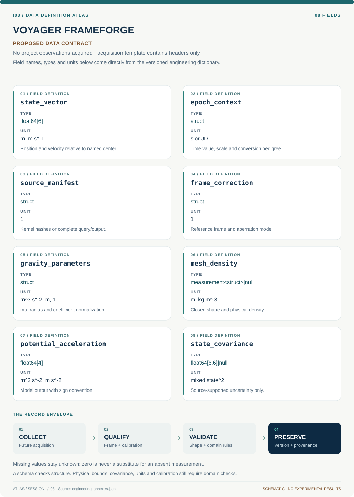

**Proposed data contract · observations pending.** This visual inventory shows the record fields to acquire or derive. It contains no project measurements. [Open the data blueprint and downloads](../research/I/I08-voyager-frameforge/data/README.md).

| Field | Type | Unit | Physical / statistical meaning | Quality and missing-data rule |
| --- | --- | --- | --- | --- |
| state_vector | float64[6] | m, m s^-1 | Position and velocity relative to named center. | No implicit frame/time defaults. |
| epoch_context | struct | s or JD | Time value, scale and conversion pedigree. | Leap/time kernels and source scale required. |
| source_manifest | struct | 1 | Kernel hashes or complete query/output. | Validity intervals and retrieval date. |
| frame_correction | struct | 1 | Reference frame and aberration mode. | Apparent and geometric states distinct. |
| gravity_parameters | struct | m^3 s^-2, m, 1 | mu, radius and coefficient normalization. | Mass/shape/spin provenance independent. |
| mesh_density | measurement<struct>&#124;null | m, kg m^-3 | Closed shape and physical density. | Oriented closed topology and uncertainty. |
| potential_acceleration | float64[4] | m^2 s^-2, m s^-2 | Model output with sign convention. | Singular/out-of-domain locations flagged. |
| state_covariance | float64[6,6]&#124;null | mixed state^2 | Source-supported uncertainty only. | Null if unavailable; synthetic ensembles labeled illustrative. |

[Machine-readable record schema](../research/I/I08-voyager-frameforge/data/schema.json) · [Empty acquisition CSV](../research/I/I08-voyager-frameforge/data/acquisition.csv) · [Field dictionary CSV](../research/I/I08-voyager-frameforge/data/dictionary.csv)

The CSV above contains column headers only. Its schema defines future records and does not establish that original-team data or a particular archive product have been acquired. Frame, timing, calibration, covariance, selection and provenance details must accompany populated records.

#### NASA/JPL NAIF SPICE tutorials and kernels

[Product, archive or reference](https://naif.jpl.nasa.gov/naif/tutorials.html)

**Fields:** Kernel identifiers, frames, time conversions, geometry and state-vector metadata

**Access:** Public documentation; verify licenses, validity intervals and exact kernel checksums before ingestion.

**Role:** Authoritative convention and transformation reference.

#### JPL Horizons reference queries

[Product, archive or reference](https://ssd.jpl.nasa.gov/horizons/manual.html)

**Fields:** State vectors, centers, reference frames, epochs, constants and query metadata

**Access:** Public service; save request/output and retrieval time. Covariance is not assumed to accompany every vector.

**Role:** Independent implementation cross-check with matched conventions.

### 6. Uncertainty, sensitivity and identifiability

Ephemeris interpolation, epoch conversion, frame rotation and aberration settings create implementation residuals. Physical uncertainty includes mu, gravity coefficients, shape resolution and density. Separate these contributions by comparing matched source geometry first, then varying gravity inputs. Common underlying JPL ephemerides mean cross-service agreement cannot reduce actual orbital uncertainty by averaging outputs.

Near-body harmonics can become poorly conditioned or invalid; finite-difference gradients need step-size convergence away from singular surfaces. Inspect coefficient truncation and shape-resolution sensitivity and compare model families only in shared domains. Unavailable covariance stays null. Runtime comparisons record warm/cold paths, version and machine, preventing numerical speed claims from hiding a lower-fidelity approximation.

### 7. Engineering trade study

| Alternative | Benefit | Cost / limitation | Decision rule |
| --- | --- | --- | --- |
| Point-mass evaluator | Fast analytic limits. | Misses extended-body structure. | Use far-field baseline and unit/sign fixture. |
| Spherical harmonics | Efficient resolved exterior gravity. | Normalization/truncation/convergence limits. | Use inside verified coefficient exterior support. |
| Closed-shape model | Handles near irregular geometry. | Density/mesh and implementation complexity. | Enable after closed-mesh mass and exterior checks. |

### 8. Verification and validation cases

| Case ID | Stimulus / condition | Expected result / criterion | Method | Evidence artifact |
| --- | --- | --- | --- | --- |
| I08-V1 | Monopole | Zero higher coefficients reproduces mu/r and inward inverse-square acceleration. | Analytic harmonic/point-mass comparison. | Potential-gradient identity. |
| I08-V2 | Frame round trip | Forward/inverse position-velocity transformation reproduces original state within numerical target. | Time-dependent transform fixture. | Declared frame interface. |
| I08-V3 | Matched Horizons/SPICE geometry | Residuals are computed only with identical center/epoch/correction conventions. | Frozen query/kernel comparison. | Primary convention documentation. |
| I08-V4 | Exterior Laplace/mesh check | Potential Laplacian approaches zero outside mass; mesh mass matches density times volume. | Derivative refinement and topology fixture. | Newtonian exterior field and mass accounting. |

**Execution status:** these cases are specified, not claimed as executed. Close a case only with the versioned inputs, output, uncertainty, reviewer and pass/fail rationale.

#### Additional scientific validation gates

- Require round-trip frame transformations to remain within a declared floating-point tolerance and test known leap-second boundaries explicitly.
- Compare selected Horizons/SPICE epochs and document every mismatch in convention or model source.
- Verify two-body energy/angular-momentum behavior, harmonic degree convergence, and exterior potential-gradient consistency.

### 9. Implementation and reproducible work packages

1. Create source/checksum and fully typed state/context contracts.
2. Implement matched SPICE/Horizons adapters and cached validity checks.
3. Build position-velocity frame/time round-trip fixtures.
4. Implement point-mass and normalized-harmonic potential/gradient APIs.
5. Gate closed-shape evaluator on topology/mass and domain validation.
6. Release archival Julia notes, matched-reference residuals and separated runtime benchmarks.

#### Investigation sequence

1. Freeze the state-object schema, SI boundary rules, kernel manifest, and supported time/frame combinations.
2. Validate vector readers and time conversion before integrating an orbit.
3. Add gravity models in increasing complexity with separate convergence and domain tests.
4. Publish compatibility and runtime benchmarks with the executable environment lockfile.

#### Resources and interfaces to expertise

- Julia numerical environment, NAIF kernels, saved Horizons outputs, analytic benchmark fixtures, and astrodynamics review.

### 10. Failure modes and interpretation controls

| Failure mode | Effect on result | Detection / evidence | Design response |
| --- | --- | --- | --- |
| UTC/TDB or km/m mismatch | Wrong geometry/gravity. | Typed metadata/unit audit. | Reject incomplete state contract. |
| Harmonics inside unsupported domain | Unphysical acceleration. | Domain flag/truncation sensitivity. | Use validated shape model or reject. |
| Shape mistaken for mass | Unsupported physical precision. | No density/mu source. | Require independent mass inputs and covariance. |

- UTC/TDB confusion, kilometers/meters mixing, frame-center mismatch, and harmonics evaluated inside their convergence boundary can overwhelm nominal precision.

### 11. Required engineering outputs

- Unit-aware state library, kernel/query manifest, analytic gravity fixtures, compatibility report, performance benchmark, and reproducible error atlas.

#### Scientific result figures to produce during execution

A provenance diagram beside state-residual plots and a radial gravity-model disagreement map, with convergence boundaries and reference conventions labeled.

#### Included shared numerical starting point

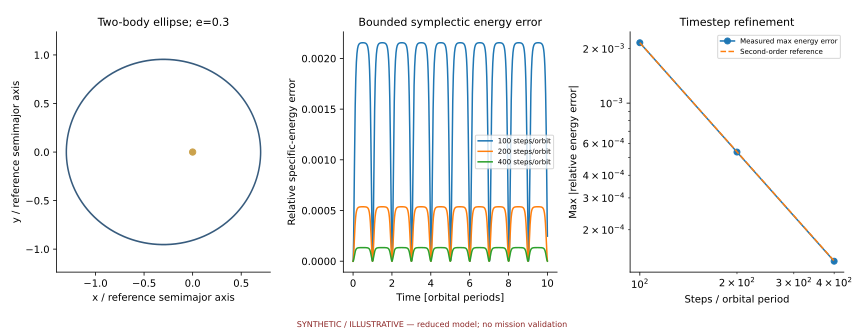

[Executable formulation, parameters, tabular outputs, provenance and verification](../models/README.md). This shared demonstration has a narrower domain than the project model above. Its own caption and methods identify synthetic parameters or the separately retrieved public catalog; it is not a completed result of the original project.

#### Data diagnostic


Synthetic two-body conservation and refinement diagnostics from immutable model outputs. Panel A scales relative specific-energy error to parts per million and reports angular-momentum conservation for the stored 400-step-per-period run. Panel B compares three recorded maximum-energy errors with a second-order reference anchored to the coarsest run. This is an integration check, not trajectory prediction validation.

[Inputs, downloadable figure and provenance](../data/figures/README.md)

### 12. Cited technical and scientific resources

- [NASA/JPL NAIF SPICE Tutorials](https://naif.jpl.nasa.gov/naif/tutorials.html) — Frames, kernels, time, and geometric-state conventions.
- [JPL Horizons System Manual](https://ssd.jpl.nasa.gov/horizons/manual.html) — Ephemeris query options, coordinates, times, and limitations.

Framework and evidence rules: [engineering documentation standard](../engineering/ENGINEERING_STANDARD.md), [model assurance](../engineering/MODEL_ASSURANCE.md), [uncertainty procedure](../engineering/UNCERTAINTY_AND_DECISION_RULES.md), [data management](../engineering/DATA_MANAGEMENT.md). NASA-inspired names are creative identifiers; requirements and results are not NASA certification.

---

<a id="i09"></a>

## I09 · OSIRIS REGOLITH LEAPER

**Original project:** Simulation and Evaluation of a Mechanical Hopping Mechanism for Robotic Small Body Surface Exploration

**Session I:** Aerospace Technology

**Document class:** engineering research design and analysis record · **Revision:** 4 · **Date:** 2026-10-02

**Evidence state:** design basis, mathematical formulation and verification plan documented. Project-specific empirical results remain to be acquired; executable shared model demonstrations have their own recorded checks.

[Session I](../research/I/README.md) · [All projects](../ENGINEERING_DOCUMENTATION.md) · [Session handbook](SESSION_I.md) · [← I08](../research/I/I08-voyager-frameforge/README.md) · [I10 →](../research/I/I10-gemini-pointlock/README.md)

| Proposed requirements | Specified verification cases | Defined data fields | Cited resources |
| ---: | ---: | ---: | ---: |
| 6 | 4 | 8 | 3 |

[Explore the data blueprint](../research/I/I09-osiris-regolith-leaper/data/README.md) · [Open the figure gallery](../research/I/I09-osiris-regolith-leaper/figures/README.md) · [Download acquisition template](../research/I/I09-osiris-regolith-leaper/data/acquisition.csv) · [Browse the data atlas](../data/README.md)

---

### Mission profile

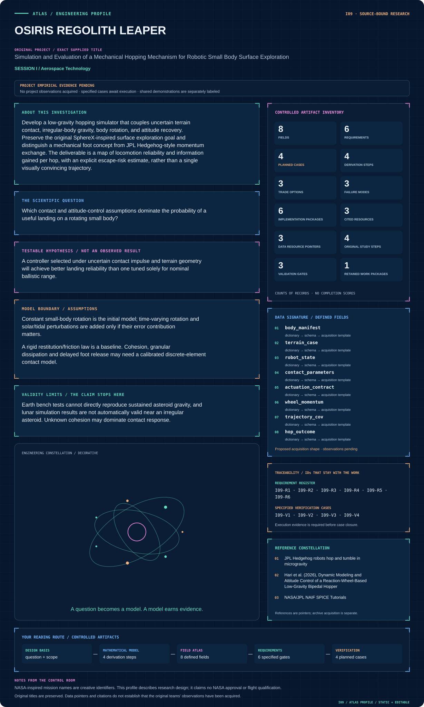

| Profile panel | Engineering signal | Open the evidence |
| --- | --- | --- |
| Mission identity | Simulation and Evaluation of a Mechanical Hopping Mechanism for Robotic Small Body Surface Exploration | [Scientific objective](../research/I/I09-osiris-regolith-leaper/README.md#purpose-and-scientific-objective) |
| Model cockpit | 4 governing expressions; 4 derivation steps; declared assumptions and validity envelope | [Mathematical formulation](../research/I/I09-osiris-regolith-leaper/README.md#4-mathematical-model-and-derivation) |
| Data blueprint | 8 proposed fields with types, units and quality rules | [Field map & downloads](../research/I/I09-osiris-regolith-leaper/data/README.md) |
| Verification queue | 6 proposed requirements; 4 specified cases; project execution evidence pending | [Case definitions](../research/I/I09-osiris-regolith-leaper/README.md#8-verification-and-validation-cases) |
| Figure wall | Architecture, field map, planned result description | [Open full gallery](../research/I/I09-osiris-regolith-leaper/figures/README.md) |
| Resource library | 3 cited primary resources with support statements | [Cited resources](../research/I/I09-osiris-regolith-leaper/README.md#12-cited-technical-and-scientific-resources) |

#### Model cockpit

**Analysis method:** Generate terrain ensembles with uncertain boulder size, slope, local normals, and contact properties. Simulate mechanical-foot and momentum-exchange concepts separately, preserving each actuation assumption. Propagate shape-gravity and contact uncertainty through takeoff, ballistic flight, and landing; track attitudes and available wheel momentum. Choose actions that trade scientific viewpoint gain against predicted landing failure and escape, and flag out-of-distribution terrain. Validate simple ballistic/contact limits before adding a granular model. The 2026 reaction-wheel hopper preprint offers a simulation comparator under lunar gravity, not proof of asteroid performance; reproduce its assumptions separately before transferring a control idea.

**Operating envelope:** Earth bench tests cannot directly reproduce sustained asteroid gravity, and lunar simulation results are not automatically valid near an irregular asteroid. Unknown cohesion may dominate contact response.

**Variables and conventions**

- Body-fixed position r in m and velocity in m s^-1; shape-gravity and contact acceleration in m s^-2.
- Body rotation Omega and robot angular velocity omega in rad s^-1; inertia I in kg m^2; wheel momentum hw in kg m^2 s^-1.
- Contact impulse J in N s; restitution e and friction coefficient muf dimensionless; contact torque in N m.
- Probability p_useful is conditional on the declared terrain/contact prior; it is not a flight reliability certificate.

#### Artifact wall



Event-resolved contact and momentum conservation condition science utility; probabilities remain tied to the declared body and terrain prior.

**Scientific result to produce:** Terrain panels showing successful landing density, escape probability, and science viewpoint gain; inset traces show attitude and wheel saturation for representative synthetic hops.

#### Investigation feed · planned work

The feed records proposed work packages. A row becomes executed evidence only with versioned inputs, outputs and a reviewed result.

| Sequence | Evidence state | Engineering work package |
| --- | --- | --- |
| 01 | Planned | Create independent body/robot/actuation and terrain-prior manifests. |
| 02 | Planned | Implement frame-consistent translation/attitude and event integration. |
| 03 | Planned | Build passive-contact and angular-momentum fixtures. |
| 04 | Planned | Add contact-model fidelity only after calibration/domain review. |
| 05 | Planned | Run uncertainty ensembles and useful-science outcome ledger. |
| 06 | Planned | Publish held-out terrain failure maps, momentum limits and OOD actions. |

#### Mission connections

Connections are reading routes based on actual shared resources, supplied sessions or included illustrations. They do not establish physical dependencies, team collaborations or validated results.

| Connected mission | Original investigation | Recorded connection basis |
| --- | --- | --- |
| [I08 · VOYAGER FRAMEFORGE](../research/I/I08-voyager-frameforge/README.md) | Julia 1.2 Ephemeris and Gravitational Modeling Development | Session I; [NASA/JPL NAIF SPICE Tutorials](https://naif.jpl.nasa.gov/naif/tutorials.html) |
| [I12 · PIONEER PHOBOS PATHFINDER](../research/I/I12-pioneer-phobos-pathfinder/README.md) | Heuristic Optimization Applied to Orbital Transfers Between Low-Planetary Orbits and Distant Retrograde Orbits | Session I; [NASA/JPL NAIF SPICE Tutorials](https://naif.jpl.nasa.gov/naif/tutorials.html) |
| [I10 · GEMINI POINTLOCK](../research/I/I10-gemini-pointlock/README.md) | Spacecraft Attitude Control Implementation and Development | Session I |
| [I07 · GATEWAY CATSAT CONSOLE](../research/I/I07-gateway-catsat-console/README.md) | CatSat Groundstation Command and Control | Session I |
| [I11 · HUBBLE SKYVAULT](../research/I/I11-hubble-skyvault/README.md) | Measurements of the Sky | Session I |
| [I06 · SATURN LOADPATH](../research/I/I06-saturn-loadpath/README.md) | Designing and Exploring the Structure of Launch Vehicles to Create Optimal Theoretical and Small-Scale Experimental Models | Session I |

[Machine-readable connection register and ranking rule](../registry/mission_connections.json)

#### Reading playlist

| Route | Start here | Continue to |
| --- | --- | --- |
| Understand the idea | [Scientific objective](../research/I/I09-osiris-regolith-leaper/README.md#purpose-and-scientific-objective) | [Design boundary](../research/I/I09-osiris-regolith-leaper/README.md#1-design-basis-and-analysis-boundary) → [Mathematics](../research/I/I09-osiris-regolith-leaper/README.md#4-mathematical-model-and-derivation) |
| Inspect the data | [Visual blueprint](../research/I/I09-osiris-regolith-leaper/data/README.md) | [Provenance](../research/I/I09-osiris-regolith-leaper/README.md#5-data-specifications-and-provenance) → [Uncertainty](../research/I/I09-osiris-regolith-leaper/README.md#6-uncertainty-sensitivity-and-identifiability) |
| Make a design decision | [Trade study](../research/I/I09-osiris-regolith-leaper/README.md#7-engineering-trade-study) | [Failure modes](../research/I/I09-osiris-regolith-leaper/README.md#10-failure-modes-and-interpretation-controls) → [Required outputs](../research/I/I09-osiris-regolith-leaper/README.md#11-required-engineering-outputs) |
| Prepare execution | [Requirements](../research/I/I09-osiris-regolith-leaper/README.md#2-requirements-and-verification-traceability) | [Verification](../research/I/I09-osiris-regolith-leaper/README.md#8-verification-and-validation-cases) → [Implementation](../research/I/I09-osiris-regolith-leaper/README.md#9-implementation-and-reproducible-work-packages) |

### Complete engineering dossier

The profile above is a browsing layer. The full design basis, equations, derivations, data contract, uncertainty, trades and controlled case definitions follow.

### Purpose and scientific objective

Develop a low-gravity hopping simulator that couples uncertain terrain contact, irregular-body gravity, body rotation, and attitude recovery. Preserve the original SphereX-inspired surface exploration goal and distinguish a mechanical foot concept from JPL Hedgehog-style momentum exchange. The deliverable is a map of locomotion reliability and information gained per hop, with an explicit escape-risk estimate, rather than a single visually convincing trajectory.

**Question:** Which contact and attitude-control assumptions dominate the probability of a useful landing on a rotating small body?

**Testable hypothesis:** A controller selected under uncertain contact impulse and terrain geometry will achieve better landing reliability than one tuned solely for nominal ballistic range.

### 1. Design basis and analysis boundary

The hopper simulator couples shape gravity, body rotation, uncertain contact and robot attitude/momentum. Mechanical-foot and Hedgehog-style momentum-exchange concepts have separate actuation contracts; neither is assumed validated for an asteroid. JPL research context provides a concept comparator, while actual shape, mass, spin and contact properties remain versioned inputs.

Begin with ballistic/contact analytic limits, advance to a rigid-body terrain ensemble, then a calibrated granular/cohesive model only if evidence supports it. Outputs are conditional useful-landing/escape probabilities and science-viewpoint gain, not flight reliability. Earth tests cannot reproduce sustained low gravity, and lunar control results do not automatically transfer to irregular-body dynamics.

### 2. Requirements and verification traceability

These are project design requirements or proposed analysis gates. A numerical target is not a NASA requirement unless its controlling source is explicitly identified. “TBD” identifies evidence required before a decision; it is not permission to assume a value. Verification evidence listed here is planned, unless a linked result explicitly records execution.

| ID | Requirement / gate | Engineering rationale | Verification method | Basis / required evidence |
| --- | --- | --- | --- | --- |
| I09-R1 | Shape gravity, spin frame and robot/contact state shall use consistent units and coordinates. | Coriolis/contact signs change hop outcomes. | Frame and zero-spin fixtures. | Proposed dynamics contract. |
| I09-R2 | Contact shall not create mechanical energy in passive noncohesive fixtures. | Numerical impulses can generate unrealistic escapes. | Restitution/friction energy audit. | Proposed conservative/dissipative contact target. |
| I09-R3 | Ballistic integration shall conserve inertial energy to 0.1% in central-gravity fixtures, a proposed target. | Drift biases bounded/escape classification. | Step refinement and analytic orbit comparator. | Proposed numerical target. |
| I09-R4 | Wheel momentum limits and foot-release assumptions shall be explicit by concept. | Different actuators do not share feasibility. | Separate actuation manifests and saturation replay. | Proposed concept separation. |
| I09-R5 | Useful-hop probabilities shall include sample counts and terrain/contact prior domain. | Simulation fraction is conditional, not certified reliability. | Ensemble/interval and OOD audit. | Proposed uncertainty contract. |
| I09-R6 | Science gain shall require an acceptable landing and valid observation state. | Viewpoint reach alone is not usable science. | Landing/state truth-manifest check. | Proposed mission-utility metric. |

### 3. Architecture and controlled interfaces

A small-body manifest carries closed shape, gravity/density model, constant spin and surface frame. Terrain ensembles define local normals, slopes, obstacles and contact parameters. A robot registry provides mass/inertia and separately typed foot or wheel actuation constraints. The dynamics engine advances translation, attitude and wheel momentum with event-resolved takeoff/landing.

A contact solver applies impulses and optional calibrated cohesion, tracking dissipation. The science evaluator checks landing geometry, stability and observation validity. A risk/utility aggregator records boundedness, momentum exhaustion, landing failure and viewpoint gain. Uncertain gravity/contact draws remain attached to every trace so a visually plausible nominal hop cannot substitute for reliability evidence.


Event-resolved contact and momentum conservation condition science utility; probabilities remain tied to the declared body and terrain prior.

[Editable engineering diagram source](../research/I/I09-osiris-regolith-leaper/figures/architecture.mmd)

### 4. Mathematical model and derivation

#### Governing equations

$$
\ddot{\boldsymbol r}=\boldsymbol g_{\rm shape}(\boldsymbol r)-2\boldsymbol\Omega\times\dot{\boldsymbol r}-\boldsymbol\Omega\times(\boldsymbol\Omega\times\boldsymbol r)+\boldsymbol a_{\rm contact}
$$

$$
\boldsymbol I\dot{\boldsymbol\omega}+\boldsymbol\omega\times(\boldsymbol I\boldsymbol\omega+\boldsymbol h_w)=\boldsymbol\tau_{\rm contact}-\dot{\boldsymbol h_w}
$$

$$
\boldsymbol v_n^+=-e\boldsymbol v_n^-;\quad |J_t|\le\mu_fJ_n
$$

$$
p_{\rm useful}=P(\text{bounded trajectory, acceptable landing, usable science})
$$

#### Variables, units and conventions

- Body-fixed position r in m and velocity in m s^-1; shape-gravity and contact acceleration in m s^-2.
- Body rotation Omega and robot angular velocity omega in rad s^-1; inertia I in kg m^2; wheel momentum hw in kg m^2 s^-1.
- Contact impulse J in N s; restitution e and friction coefficient muf dimensionless; contact torque in N m.
- Probability p_useful is conditional on the declared terrain/contact prior; it is not a flight reliability certificate.

#### Assumptions and boundary conditions

- Constant small-body rotation is the initial model; time-varying rotation and solar/tidal perturbations are added only if their error contribution matters.
- A rigid restitution/friction law is a baseline. Cohesion, granular dissipation and delayed foot release may need a calibrated discrete-element contact model.

#### Derivation step 1

$$
\ddot r=g_{shape}-2\Omega\times\dot r-\Omega\times(\Omega\times r)+a_{contact}
$$

Constant-spin body-fixed dynamics include Coriolis and centrifugal terms. An Euler term is needed if spin varies.

#### Derivation step 2

$$
v_n^+=-e v_n^-,\quad\Delta E_n=-\tfrac12m(1-e^2)(v_n^-)^2
$$

For passive normal contact with 0<=e<=1 and rigid fixed surface, normal kinetic energy cannot increase.

#### Derivation step 3

$$
I\dot\omega+\omega\times(I\omega+h_w)=\tau_{contact}-\dot h_w
$$

Internal wheel torque exchanges angular momentum; external contact changes total robot momentum. Track saturation separately from attitude error.

#### Derivation step 4

$$
p_{useful}=N_{bounded,landed,valid}/N,\quad U=E[G_{science}\mathbf1_{useful}]
$$

Counts and utility integrate all success conditions under the declared scenario prior. Statistical intervals must reflect dependent terrain batches where present.

#### Inference or simulation procedure

Generate terrain ensembles with uncertain boulder size, slope, local normals, and contact properties. Simulate mechanical-foot and momentum-exchange concepts separately, preserving each actuation assumption. Propagate shape-gravity and contact uncertainty through takeoff, ballistic flight, and landing; track attitudes and available wheel momentum. Choose actions that trade scientific viewpoint gain against predicted landing failure and escape, and flag out-of-distribution terrain. Validate simple ballistic/contact limits before adding a granular model. The 2026 reaction-wheel hopper preprint offers a simulation comparator under lunar gravity, not proof of asteroid performance; reproduce its assumptions separately before transferring a control idea.

#### Validity domain and fidelity limits

Earth bench tests cannot directly reproduce sustained asteroid gravity, and lunar simulation results are not automatically valid near an irregular asteroid. Unknown cohesion may dominate contact response.

### 5. Data specifications and provenance


**Proposed data contract · observations pending.** This visual inventory shows the record fields to acquire or derive. It contains no project measurements. [Open the data blueprint and downloads](../research/I/I09-osiris-regolith-leaper/data/README.md).

| Field | Type | Unit | Physical / statistical meaning | Quality and missing-data rule |
| --- | --- | --- | --- | --- |
| body_manifest | struct | m, kg, rad s^-1 | Shape/mass/spin and frame. | Independent gravity/density source required. |
| terrain_case | struct | m, radian | Local geometry and seeded obstacles. | Prior/support and OOD flags. |
| robot_state | float64[] | m, m s^-1, radian | Translation and attitude/rate. | Quaternion convention/norm or rotation matrix validity. |
| contact_parameters | distribution<struct> | 1, N or J | Restitution/friction and optional cohesion. | Passive-domain constraints; unsupported parameters marked. |
| actuation_contract | enum+limits | N s, N m s | Foot or momentum-exchange bounds. | No cross-concept default assumptions. |
| wheel_momentum | float64[] | kg m^2 s^-1 | Available/stored wheel state. | Limit and saturation events retained. |
| trajectory_cov | distribution<trace> | mixed state | Gravity/contact/terrain ensemble. | Missing contact events flagged; correlated draws preserved. |
| hop_outcome | struct<bool,float> | 1 | Boundedness, landing validity, science gain. | Definition/version and ensemble count attached. |

[Machine-readable record schema](../research/I/I09-osiris-regolith-leaper/data/schema.json) · [Empty acquisition CSV](../research/I/I09-osiris-regolith-leaper/data/acquisition.csv) · [Field dictionary CSV](../research/I/I09-osiris-regolith-leaper/data/dictionary.csv)

The CSV above contains column headers only. Its schema defines future records and does not establish that original-team data or a particular archive product have been acquired. Frame, timing, calibration, covariance, selection and provenance details must accompany populated records.

#### JPL Hedgehog research overview

[Product, archive or reference](https://www.jpl.nasa.gov/news/hedgehog-robots-hop-tumble-in-microgravity/)

**Fields:** Hopping/tumbling concept and low-gravity experimental context

**Access:** Public research description; obtain detailed data separately before claiming numerical reproduction.

**Role:** Independent locomotion concept comparator.

#### Hari et al. (2026) hopper preprint

[Product, archive or reference](https://arxiv.org/abs/2603.10670)

**Fields:** Dynamic assumptions, simulation setup, attitude-control comparisons

**Access:** Open preprint, described as under review; inspect supplied code/data availability.

**Role:** Bounded control-model comparator, not validated flight hardware.

#### Proposed small-body scenario manifest

[Product, archive or reference](https://naif.jpl.nasa.gov/naif/tutorials.html)

**Fields:** Shape version, spin frame, mass/density assumption, terrain seed, contact-law parameters, hop-state trace

**Access:** Synthetic scenarios first; actual kernels and shape products require versioned retrieval.

**Role:** Reproducible locomotion uncertainty ensemble.

### 6. Uncertainty, sensitivity and identifiability

Density/shape/spin uncertainty alters near-surface gravity and effective escape behavior. Terrain normals and restitution/friction/cohesion control landing and takeoff; unknown cohesion can dominate. Separate physical prior uncertainty from numerical integration error and sample them jointly where correlated, such as roughness and local normal estimates.

Wheel momentum and contact torque can compensate in attitude response, making a nominal controller appear effective only under favorable terrain. Sweep contact laws and actuator bounds, checking identifiability against independently measured surrogate contacts where applicable. Validate analytic limits before high-fidelity granular models. Probability intervals remain conditional on the tested terrain domain and should include OOD abstention rather than extrapolated success.

### 7. Engineering trade study

| Alternative | Benefit | Cost / limitation | Decision rule |
| --- | --- | --- | --- |
| Rigid impulse contact | Fast energy-auditable baseline. | Weak granular/cohesive realism. | Use analytic and ensemble baseline. |
| Calibrated granular/cohesive contact | Can represent delayed release and dissipation. | Parameter/data demand and computational cost. | Adopt only with independent contact evidence. |
| Utility-aware action selection | Trades viewpoint against risk/momentum. | Prior-sensitive success probabilities. | Use with uncertainty and unsupported-terrain gate. |

### 8. Verification and validation cases

| Case ID | Stimulus / condition | Expected result / criterion | Method | Evidence artifact |
| --- | --- | --- | --- | --- |
| I09-V1 | Zero body spin | Rotating-frame inertial terms vanish. | Omega=0 fixture. | Dynamics limit. |
| I09-V2 | Passive collision limits | e=1 preserves normal kinetic energy and e=0 removes it. | Analytic impulse fixture. | Restitution energy identity. |
| I09-V3 | No external torque | Body-plus-wheel angular momentum is conserved in inertial coordinates. | Internal exchange simulation. | Angular-momentum conservation. |
| I09-V4 | Withheld terrain/contact family | Useful-hop coverage and failure categories are evaluated without retuning actions. | Independent seeded surfaces and contact-law holdout. | Proposed reliability-domain validation. |

**Execution status:** these cases are specified, not claimed as executed. Close a case only with the versioned inputs, output, uncertainty, reviewer and pass/fail rationale.

#### Additional scientific validation gates

- Check force-free/angular-momentum limits and conservation in conservative phases; quantify numerical drift.
- Compare contact/landing outcomes across an independent simulator or integrator.
- Report landing success, escape fraction, energy use, wheel saturation, and scientific coverage with ensemble confidence bounds.

### 9. Implementation and reproducible work packages

1. Create independent body/robot/actuation and terrain-prior manifests.
2. Implement frame-consistent translation/attitude and event integration.
3. Build passive-contact and angular-momentum fixtures.
4. Add contact-model fidelity only after calibration/domain review.
5. Run uncertainty ensembles and useful-science outcome ledger.
6. Publish held-out terrain failure maps, momentum limits and OOD actions.

#### Investigation sequence

1. Define useful-science and unacceptable-landing criteria before optimizing hop range.
2. Verify rotating-frame dynamics and analytic ballistic limits, then add contact uncertainty.
3. Compare two distinct mechanical concepts under identical environment ensembles.
4. Reserve terrain families and cohesion regimes for validation and document unsupported cases.

#### Resources and interfaces to expertise

- Rigid-body simulator, optional discrete-element solver, versioned shape/spin inputs, low-gravity robotics mentor, and controlled inert contact tests.

### 10. Failure modes and interpretation controls

| Failure mode | Effect on result | Detection / evidence | Design response |
| --- | --- | --- | --- |
| Impulse adds energy | Artificial escape or range. | Contact energy ledger. | Event-resolved passive impulse and step refinement. |
| Lunar controller copied as asteroid proof | Unsupported stability claim. | Body/gravity/domain metadata mismatch. | Revalidate small-body dynamics and limits. |
| Momentum exhaustion hidden | Unrecoverable landing attitude. | Wheel-state limit monitor. | Limit-aware action or infeasible outcome. |

- Nominal gravity may be far less influential than contact cohesion. Long airborne intervals amplify state errors, and a model that ignores escape can reward unusable trajectories.

### 11. Required engineering outputs

- Scenario library, coupled dynamics model, landing-risk atlas, concept comparison, uncertainty-aware hop planner specification, and simulation reproduction notes.

#### Scientific result figures to produce during execution

Terrain panels showing successful landing density, escape probability, and science viewpoint gain; inset traces show attitude and wheel saturation for representative synthetic hops.

### 12. Cited technical and scientific resources

- [JPL Hedgehog robots hop and tumble in microgravity](https://www.jpl.nasa.gov/news/hedgehog-robots-hop-tumble-in-microgravity/) — Low-gravity hopping/tumbling research precedent.
- [Hari et al. (2026), Dynamic Modeling and Attitude Control of a Reaction-Wheel-Based Low-Gravity Bipedal Hopper](https://arxiv.org/abs/2603.10670) — Under-review lunar simulation comparator; no asteroid validation claim.
- [NASA/JPL NAIF SPICE Tutorials](https://naif.jpl.nasa.gov/naif/tutorials.html) — Body-fixed frames and geometry provenance.

Framework and evidence rules: [engineering documentation standard](../engineering/ENGINEERING_STANDARD.md), [model assurance](../engineering/MODEL_ASSURANCE.md), [uncertainty procedure](../engineering/UNCERTAINTY_AND_DECISION_RULES.md), [data management](../engineering/DATA_MANAGEMENT.md). NASA-inspired names are creative identifiers; requirements and results are not NASA certification.

---

<a id="i10"></a>

## I10 · GEMINI POINTLOCK

**Original project:** Spacecraft Attitude Control Implementation and Development

**Session I:** Aerospace Technology

**Document class:** engineering research design and analysis record · **Revision:** 4 · **Date:** 2026-10-02

**Evidence state:** design basis, mathematical formulation and verification plan documented. Project-specific empirical results remain to be acquired; executable shared model demonstrations have their own recorded checks.

[Session I](../research/I/README.md) · [All projects](../ENGINEERING_DOCUMENTATION.md) · [Session handbook](SESSION_I.md) · [← I09](../research/I/I09-osiris-regolith-leaper/README.md) · [I11 →](../research/I/I11-hubble-skyvault/README.md)

| Proposed requirements | Specified verification cases | Defined data fields | Cited resources |
| ---: | ---: | ---: | ---: |
| 6 | 4 | 8 | 2 |

[Explore the data blueprint](../research/I/I10-gemini-pointlock/data/README.md) · [Open the figure gallery](../research/I/I10-gemini-pointlock/figures/README.md) · [Download acquisition template](../research/I/I10-gemini-pointlock/data/acquisition.csv) · [Browse the data atlas](../data/README.md)

---

### Mission profile


| Profile panel | Engineering signal | Open the evidence |
| --- | --- | --- |
| Mission identity | Spacecraft Attitude Control Implementation and Development | [Scientific objective](../research/I/I10-gemini-pointlock/README.md#purpose-and-scientific-objective) |
| Model cockpit | 4 governing expressions; 4 derivation steps; declared assumptions and validity envelope | [Mathematical formulation](../research/I/I10-gemini-pointlock/README.md#4-mathematical-model-and-derivation) |
| Data blueprint | 8 proposed fields with types, units and quality rules | [Field map & downloads](../research/I/I10-gemini-pointlock/data/README.md) |
| Verification queue | 6 proposed requirements; 4 specified cases; project execution evidence pending | [Case definitions](../research/I/I10-gemini-pointlock/README.md#8-verification-and-validation-cases) |
| Figure wall | Architecture, field map, planned result description; included shared illustration | [Open full gallery](../research/I/I10-gemini-pointlock/figures/README.md) |
| Resource library | 2 cited primary resources with support statements | [Cited resources](../research/I/I10-gemini-pointlock/README.md#12-cited-technical-and-scientific-resources) |

#### Model cockpit

**Analysis method:** Identify inertia, friction, encoder bias, and actuator lag using low-energy bench characterization. Fuse gyro and angle measurements with an estimator that propagates bias uncertainty. Compare nominal PD control with a limit-aware controller under identical synthetic and bench maneuvers; include deadband, angular wrap, wheel saturation, and actuator quantization. Specify when momentum exhaustion makes the commanded pointing state infeasible. Run deterministic reset and sensor-dropout replays in the simulator. If extending to three axes, use a unit-norm quaternion state, verify body/inertial convention round trips, and separate wheel momentum management from pointing control. The existing one-axis data cannot substantiate the upgraded model.

**Operating envelope:** A good turntable result does not establish vacuum compatibility, radiation tolerance, on-orbit disturbance rejection, or flight attitude determination. Constant friction approximation may fail around zero rate.

**Variables and conventions**

- Angle theta and wrapped error e in rad; reported pointing error also in degrees with explicit conversion.
- Body inertia Ib in kg m^2; wheel torque u and external disturbance taud in N m; wheel momentum hw in N m s.
- Viscous friction b in N m s rad^-1; Kp in N m rad^-1 and Kd in N m s rad^-1; saturation is the measured actuator bound.
- E_elec is cumulative electrical energy consumed [J], the integral of measured electrical input power P_elec [W] including losses. It is not stored wheel kinetic energy. Settling time in s and angular rate in rad s^-1.

#### Artifact wall


Synthetic one-axis PD attitude response and actuator authority. The phase portrait is colored by elapsed model time. Requested torque is reconstructed from the recorded states and sidecar gains; the applied torque is clipped to ±8 mN·m. The right panel focuses on the first 40 seconds, while the phase portrait uses the full 120-second record.

[Exact inputs, transformations and output hashes](../data/figures/13_attitude_phase_and_authority.provenance.json)

**Scientific result to produce:** Angle command and calibrated response above wheel momentum, torque saturation, and uncertainty; polar error plots cover the full tested one-axis range.

#### Investigation feed · planned work

The feed records proposed work packages. A row becomes executed evidence only with versioned inputs, outputs and a reviewed result.

| Sequence | Evidence state | Engineering work package |
| --- | --- | --- |
| 01 | Planned | Verify/calibrate inertia, encoder/gyro, power and actuator limits. |
| 02 | Planned | Implement wrap/sign/conservation fixtures. |
| 03 | Planned | Identify friction/lag with independent low-energy maneuvers. |
| 04 | Planned | Build bias-aware estimator and nominal/limit-aware controllers. |
| 05 | Planned | Run deterministic saturation/dropout/reset benchmarks. |
| 06 | Planned | Publish proposed pointing acceptance, separate energy budgets and three-axis evidence gaps. |

#### Mission connections

Connections are reading routes based on actual shared resources, supplied sessions or included illustrations. They do not establish physical dependencies, team collaborations or validated results.

| Connected mission | Original investigation | Recorded connection basis |
| --- | --- | --- |
| [I06 · SATURN LOADPATH](../research/I/I06-saturn-loadpath/README.md) | Designing and Exploring the Structure of Launch Vehicles to Create Optimal Theoretical and Small-Scale Experimental Models | Session I; [NASA Systems Engineering Handbook](https://www.nasa.gov/reference/systems-engineering-handbook/) |
| [I04 · ORION SENTINEL CORE](../research/I/I04-orion-sentinel-core/README.md) | EagleSat Team: On-board Computer Subsystem | Session I; [NASA Systems Engineering Handbook](https://www.nasa.gov/reference/systems-engineering-handbook/) |
| [G07 · HUBBLE SPECTRAL ANCHOR](../research/G/G07-hubble-spectral-anchor/README.md) | An Introduction to Systems Engineering: Building a Monochromator Mount | [NASA Systems Engineering Handbook](https://www.nasa.gov/reference/systems-engineering-handbook/) |
| [E08 · GATEWAY POWERBENCH](../research/E/E08-gateway-powerbench/README.md) | EagleSat Team: Development and Implementation of a Self-Contained Harness for In-House Integration, Verification, and Testing of CubeSat Electric Power Systems | [NASA Systems Engineering Handbook](https://www.nasa.gov/reference/systems-engineering-handbook/) |
| [E07 · DISCOVERY TRIDENT](../research/E/E07-discovery-trident/README.md) | Glendale Community College (GCC) ASCEND Team | [NASA Systems Engineering Handbook](https://www.nasa.gov/reference/systems-engineering-handbook/) |
| [E02 · GEMINI HELIX](../research/E/E02-gemini-helix/README.md) | Project Helix | [NASA Small Spacecraft Guidance, Navigation and Control](https://www.nasa.gov/smallsat-institute/sst-soa/guidance-navigation-and-control/) |

[Machine-readable connection register and ranking rule](../registry/mission_connections.json)

#### Reading playlist

| Route | Start here | Continue to |
| --- | --- | --- |
| Understand the idea | [Scientific objective](../research/I/I10-gemini-pointlock/README.md#purpose-and-scientific-objective) | [Design boundary](../research/I/I10-gemini-pointlock/README.md#1-design-basis-and-analysis-boundary) → [Mathematics](../research/I/I10-gemini-pointlock/README.md#4-mathematical-model-and-derivation) |
| Inspect the data | [Visual blueprint](../research/I/I10-gemini-pointlock/data/README.md) | [Provenance](../research/I/I10-gemini-pointlock/README.md#5-data-specifications-and-provenance) → [Uncertainty](../research/I/I10-gemini-pointlock/README.md#6-uncertainty-sensitivity-and-identifiability) |
| Make a design decision | [Trade study](../research/I/I10-gemini-pointlock/README.md#7-engineering-trade-study) | [Failure modes](../research/I/I10-gemini-pointlock/README.md#10-failure-modes-and-interpretation-controls) → [Required outputs](../research/I/I10-gemini-pointlock/README.md#11-required-engineering-outputs) |
| Prepare execution | [Requirements](../research/I/I10-gemini-pointlock/README.md#2-requirements-and-verification-traceability) | [Verification](../research/I/I10-gemini-pointlock/README.md#8-verification-and-validation-cases) → [Implementation](../research/I/I10-gemini-pointlock/README.md#9-implementation-and-reproducible-work-packages) |

### Complete engineering dossier

The profile above is a browsing layer. The full design basis, equations, derivations, data contract, uncertainty, trades and controlled case definitions follow.

### Purpose and scientific objective

Build on the original one-axis reaction-wheel/turntable experiment with an auditable estimation-and-control loop. Retain the symposium pointing target of plus or minus 0.5 degrees as a proposed bench acceptance criterion, then determine whether it survives encoder calibration, friction, disturbances, wheel saturation, and resets. A subsequent three-axis model is a separate extension with independently verified quaternion conventions and momentum-management assumptions.

**Question:** Can the one-axis platform meet the declared pointing criterion across the full angular range while preserving stability and a bounded wheel-momentum state?

**Testable hypothesis:** A controller that incorporates identified friction, sensor bias, and wheel limits will outperform a nominal proportional-derivative controller during large-angle maneuvers and repeated disturbance recovery.

### 1. Design basis and analysis boundary

The attitude-control annex implements the original one-axis reaction-wheel/turntable plant with estimation, limits and energy metrology. The plus/minus 0.5-degree goal is a proposed bench acceptance criterion, not a flight requirement. Cumulative electrical energy consumed is the integral of measured input draw including losses; it is distinct from stored wheel kinetic energy. Actual inertia, encoder, wheel and actuator bounds remain TBD.

Begin with sign/wrap analytic fixtures, then identified friction/lag and gyro/encoder estimation, then limit-aware control and deterministic resets. A three-axis quaternion extension is a separate model requiring independent convention and momentum-management validation. Bench friction, gravity and readout limits prevent a one-axis result from establishing flight pointing or environmental qualification.

### 2. Requirements and verification traceability

These are project design requirements or proposed analysis gates. A numerical target is not a NASA requirement unless its controlling source is explicitly identified. “TBD” identifies evidence required before a decision; it is not permission to assume a value. Verification evidence listed here is planned, unless a linked result explicitly records execution.

| ID | Requirement / gate | Engineering rationale | Verification method | Basis / required evidence |
| --- | --- | --- | --- | --- |
| I10-R1 | Pointing error shall use wrapped angular difference and meet plus/minus 0.5 degrees in the declared settled bench domain, a proposed target. | Raw subtraction fails across angle wrap. | Full-range reference/encoder calibration and held-out maneuvers. | Original goal retained as proposed criterion. |
| I10-R2 | Wheel/body torque signs shall be verified before controller tuning. | Internal torque acts oppositely on body. | Known positive-torque synthetic/low-energy characterization. | Proposed plant-sign contract. |
| I10-R3 | Wheel momentum/torque limits shall be measured and never exceeded in accepted commands. | Pointing can be infeasible under saturation. | Actuator/speed calibration and dropout/saturation replay. | Proposed constraint requirement. |
| I10-R4 | Electrical input energy and wheel mechanical energy shall have separate ledgers. | Losses and body work prevent equality. | Voltage/current versus inertia/speed integration fixtures. | Corrected energy distinction. |
| I10-R5 | Sensor bias, friction and lag uncertainty shall propagate into settling/error claims. | An apparently small angle error can be calibration bias. | Independent sensor/plant holdouts. | Proposed metrology requirement. |
| I10-R6 | Reset/sensor-dropout behavior shall reach a declared observable state without undefined commands. | Estimator/controller history affects recovery. | Deterministic simulator reset and missing-sensor traces. | Proposed bounded-service requirement. |

### 3. Architecture and controlled interfaces

The bench manifest stores verified body/wheel inertia, encoder/gyro calibration and actuator lag/bounds. A wrapped-angle estimator fuses angle and rate with bias covariance. The controller emits bounded wheel torque; the plant maps its opposite torque to body acceleration and tracks wheel momentum. Friction and external disturbances are separate inputs.

Power metrology emits voltage/current and clock-synchronized input draw. An electrical accountant integrates consumption and separately records any returned energy; a mechanical accountant derives wheel kinetic state. Recovery logic resets or freezes estimator/control states with observable quality flags. The benchmark runner records angle/rate, torque, wheel limits, settling and energy under identical maneuver/disturbance scenarios for all control variants.



Opposite wheel/body torque and momentum limits close the control loop; electrical consumption and wheel kinetic energy remain separate measured/model interfaces.

[Editable engineering diagram source](../research/I/I10-gemini-pointlock/figures/architecture.mmd)

### 4. Mathematical model and derivation

#### Governing equations

$$
e=\operatorname{atan2}[\sin(\theta-\theta_{\rm ref}),\cos(\theta-\theta_{\rm ref})]
$$

$$
I_b\ddot\theta=-u+\tau_d-b\dot\theta;\quad \dot h_w=u
$$

$$
u=\operatorname{sat}(K_pe+K_d\dot\theta)
$$

$$
\dot E_{\rm elec}=P_{\rm elec};\quad |h_w|\le h_{\max}
$$

#### Variables, units and conventions

- Angle theta and wrapped error e in rad; reported pointing error also in degrees with explicit conversion.
- Body inertia Ib in kg m^2; wheel torque u and external disturbance taud in N m; wheel momentum hw in N m s.
- Viscous friction b in N m s rad^-1; Kp in N m rad^-1 and Kd in N m s rad^-1; saturation is the measured actuator bound.
- E_elec is cumulative electrical energy consumed [J], the integral of measured electrical input power P_elec [W] including losses. It is not stored wheel kinetic energy. Settling time in s and angular rate in rad s^-1.

#### Assumptions and boundary conditions

- Wheel torque acts oppositely on the body; signs are verified experimentally and in a known synthetic case.
- A turntable includes friction and external torque. It approximates one axis and does not establish a frictionless or three-axis space environment.

#### Derivation step 1

$$
e=\operatorname{atan2}[\sin(\theta-\theta_{ref}),\cos(\theta-\theta_{ref})]
$$

Wrapped error lies on the declared branch [-pi,pi]; commands at the discontinuity need a stated tie/trajectory convention.

#### Derivation step 2

$$
I_b\ddot\theta=-u+\tau_d-b\dot\theta,\quad\dot h_w=u
$$

Positive u increases wheel momentum and applies negative body torque. In the no-external-torque/no-friction limit total angular momentum is conserved.

#### Derivation step 3

$$
u=\operatorname{sat}(K_pe+K_d\dot\theta)
$$

With these plant/error signs, positive proportional/damping gains oppose body error/rate locally. Saturation and lag require separate stability/feasibility checks.

#### Derivation step 4

$$
E_{elec,draw}=\int\max[V(t)I(t),0]dt,\quad E_{wheel}=h_w^2/(2I_w)
$$

Electrical draw includes motor/driver losses and is not wheel energy. If regeneration occurs, integrate negative electrical flow in a separate returned-energy ledger.

#### Inference or simulation procedure

Identify inertia, friction, encoder bias, and actuator lag using low-energy bench characterization. Fuse gyro and angle measurements with an estimator that propagates bias uncertainty. Compare nominal PD control with a limit-aware controller under identical synthetic and bench maneuvers; include deadband, angular wrap, wheel saturation, and actuator quantization. Specify when momentum exhaustion makes the commanded pointing state infeasible. Run deterministic reset and sensor-dropout replays in the simulator. If extending to three axes, use a unit-norm quaternion state, verify body/inertial convention round trips, and separate wheel momentum management from pointing control. The existing one-axis data cannot substantiate the upgraded model.

#### Validity domain and fidelity limits

A good turntable result does not establish vacuum compatibility, radiation tolerance, on-orbit disturbance rejection, or flight attitude determination. Constant friction approximation may fail around zero rate.

### 5. Data specifications and provenance


**Proposed data contract · observations pending.** This visual inventory shows the record fields to acquire or derive. It contains no project measurements. [Open the data blueprint and downloads](../research/I/I10-gemini-pointlock/data/README.md).

| Field | Type | Unit | Physical / statistical meaning | Quality and missing-data rule |
| --- | --- | --- | --- | --- |
| source_time | float64 | s | Synchronized sensor/control/power time. | Clock/reset generation and gaps retained. |
| reference_angle | float64 | radian | Commanded one-axis orientation. | Wrap/trajectory policy version. |
| angle_rate | measurement<float64[2]> | radian, radian s^-1 | Calibrated body angle and rate. | Bias covariance and missing-sensor state. |
| plant_parameters | posterior<struct> | kg m^2, N m s rad^-1, s | Inertia, friction and lag. | Identification conditions and near-zero-rate discrepancy. |
| wheel_state | measurement<struct> | N m s, radian s^-1 | Wheel momentum/speed and limits. | Sign/inertia convention and saturation flag. |
| torque_command | float64 | N m | Requested/applied wheel torque. | Both values retained when saturated. |
| electrical_ledger | measurement<struct> | W, J | Input draw, cumulative consumed/returned energy. | Current sign and power calibration; no mechanical-energy substitution. |
| mechanical_energy | measurement<float64> | J | Wheel kinetic energy from state. | Separate field/inertia covariance. |

[Machine-readable record schema](../research/I/I10-gemini-pointlock/data/schema.json) · [Empty acquisition CSV](../research/I/I10-gemini-pointlock/data/acquisition.csv) · [Field dictionary CSV](../research/I/I10-gemini-pointlock/data/dictionary.csv)

The CSV above contains column headers only. Its schema defines future records and does not establish that original-team data or a particular archive product have been acquired. Frame, timing, calibration, covariance, selection and provenance details must accompany populated records.

#### NASA small-spacecraft GNC reference

[Product, archive or reference](https://www.nasa.gov/smallsat-institute/sst-soa/guidance-navigation-and-control/)

**Fields:** Attitude sensing, control architecture and actuator considerations

**Access:** Public survey; exact sensor and wheel specifications require board-level verification.

**Role:** Architecture and failure-mode context.

#### Proposed turntable characterization dataset

[Product, archive or reference](https://www.nasa.gov/reference/systems-engineering-handbook/)

**Fields:** Time, reference angle, calibrated angle/rate, wheel speed, current, torque estimate, temperature, state and reset marker

**Access:** No bench observations supplied; release synthetic fixtures first and retain calibration files with later measurements.

**Role:** Plant identification and withheld maneuver evaluation.

### 6. Uncertainty, sensitivity and identifiability

Encoder zero/nonlinearity, gyro bias and timing affect angle/rate estimates; friction and actuator lag affect inferred controller margins. Identify them with low-energy independent maneuvers and retain covariance. Static friction near zero rate may invalidate viscous b, so test direction/reversal sensitivity rather than fitting one coefficient to all motion.

Wheel momentum exhaustion couples feasibility to disturbance duration, even when transient pointing is good. Simulate torque quantization, deadband, reset and sensor gaps across identified parameter ranges. Electrical energy uncertainty comes from voltage/current calibration and sampling, while mechanical energy depends on wheel inertia/speed. Keep these budgets separate and assess three-axis extensions only through new quaternion and momentum-management verification.

### 7. Engineering trade study

| Alternative | Benefit | Cost / limitation | Decision rule |
| --- | --- | --- | --- |
| Nominal PD | Transparent local stability and simple implementation. | Saturation/friction/lag limitations. | Use required baseline under identified plant. |
| Limit-aware controller | Can manage torque/momentum feasibility. | More model dependence and state logic. | Adopt when held-out saturation cases improve without lost stability. |
| Three-axis extension | Explores full attitude architecture. | One-axis data cannot validate it. | Treat as separate simulation with new convention/actuator evidence. |

### 8. Verification and validation cases

| Case ID | Stimulus / condition | Expected result / criterion | Method | Evidence artifact |
| --- | --- | --- | --- | --- |
| I10-V1 | Angular wrap | Targets around plus/minus pi yield the short signed error. | Exact trigonometric fixture. | Wrapped-angle identity. |
| I10-V2 | Torque sign/conservation | Positive u accelerates body negatively; body-plus-wheel momentum stays constant without external torque/friction. | No-disturbance synthetic plant. | Internal angular-momentum exchange. |
| I10-V3 | Electrical/mechanical separation | Driver loss can increase cumulative draw without the same wheel-energy increase. | Synthetic power/loss and speed ledger. | Energy accounting distinction. |
| I10-V4 | Withheld maneuver/reset | Pointing/settling and bounded momentum are assessed with frozen plant/controller. | Independent angle/disturbance plus dropout/reset cases. | Proposed bench-domain acceptance. |

**Execution status:** these cases are specified, not claimed as executed. Close a case only with the versioned inputs, output, uncertainty, reviewer and pass/fail rationale.

#### Additional scientific validation gates

- Verify angular wrapping across zero/360 degrees and compare torque/momentum conservation in a zero-friction simulator.
- Assess the proposed plus/minus 0.5-degree criterion using calibrated maximum steady-state error across a declared angular grid, with confidence intervals.
- Report overshoot, settling, RMS jitter, power, saturation duration, and recovery behavior; a single favorable maneuver is insufficient.

### 9. Implementation and reproducible work packages

1. Verify/calibrate inertia, encoder/gyro, power and actuator limits.
2. Implement wrap/sign/conservation fixtures.
3. Identify friction/lag with independent low-energy maneuvers.
4. Build bias-aware estimator and nominal/limit-aware controllers.
5. Run deterministic saturation/dropout/reset benchmarks.
6. Publish proposed pointing acceptance, separate energy budgets and three-axis evidence gaps.

#### Investigation sequence

1. Define pointing, settling, momentum, and power acceptance conditions before tuning gains.
2. Calibrate sensor/frame signs and identify plant parameters with independent uncertainty estimates.
3. Tune on a declared subset of angular commands and disturbance cases.
4. Freeze the controller and test unseen angles, reversals, saturation, and reset recovery; keep any three-axis extension separate.

#### Resources and interfaces to expertise

- Inert one-axis bench, encoder/gyro calibration, reaction-wheel emulator or supervised mechanism, control simulation, and GNC mentor.

### 10. Failure modes and interpretation controls

| Failure mode | Effect on result | Detection / evidence | Design response |
| --- | --- | --- | --- |
| Sign error | Unstable positive feedback. | Known-torque response mismatch. | Verify signs before gain tuning. |
| Momentum saturation hidden | Infeasible pointing or long error. | Limit state and applied/requested torque mismatch. | Limit-aware controller and infeasible-state report. |
| Electrical energy replaced by wheel energy | Wrong power budget. | Separate ledger mismatch. | Integrate measured electrical input including losses. |

- Encoder misalignment can mimic excellent pointing, and friction can hide unstable free-space behavior. Saturated wheels remove torque authority without a separate momentum-management mechanism.

### 11. Required engineering outputs

- Plant-identification report, estimator/control code specification, pointing acceptance matrix, saturation/recovery atlas, and staged three-axis extension plan.

#### Scientific result figures to produce during execution

Angle command and calibrated response above wheel momentum, torque saturation, and uncertainty; polar error plots cover the full tested one-axis range.

#### Included shared numerical starting point

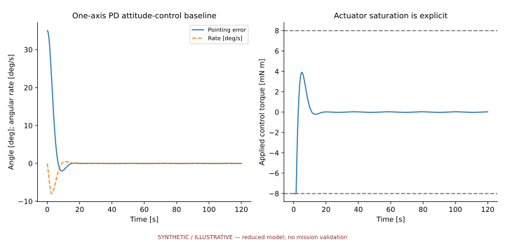

[Executable formulation, parameters, tabular outputs, provenance and verification](../models/README.md). This shared demonstration has a narrower domain than the project model above. Its own caption and methods identify synthetic parameters or the separately retrieved public catalog; it is not a completed result of the original project.

#### Data diagnostic


Synthetic one-axis PD attitude response and actuator authority. The phase portrait is colored by elapsed model time. Requested torque is reconstructed from the recorded states and sidecar gains; the applied torque is clipped to ±8 mN·m. The right panel focuses on the first 40 seconds, while the phase portrait uses the full 120-second record.

[Inputs, downloadable figure and provenance](../data/figures/README.md)

### 12. Cited technical and scientific resources

- [NASA Small Spacecraft Guidance, Navigation and Control](https://www.nasa.gov/smallsat-institute/sst-soa/guidance-navigation-and-control/) — Attitude sensor, actuator, and architecture context.
- [NASA Systems Engineering Handbook](https://www.nasa.gov/reference/systems-engineering-handbook/) — Acceptance criteria and test traceability framework.

Framework and evidence rules: [engineering documentation standard](../engineering/ENGINEERING_STANDARD.md), [model assurance](../engineering/MODEL_ASSURANCE.md), [uncertainty procedure](../engineering/UNCERTAINTY_AND_DECISION_RULES.md), [data management](../engineering/DATA_MANAGEMENT.md). NASA-inspired names are creative identifiers; requirements and results are not NASA certification.

---

<a id="i11"></a>

## I11 · HUBBLE SKYVAULT

**Original project:** Measurements of the Sky

**Session I:** Aerospace Technology

**Document class:** engineering research design and analysis record · **Revision:** 4 · **Date:** 2026-10-02

**Evidence state:** design basis, mathematical formulation and verification plan documented. Project-specific empirical results remain to be acquired; executable shared model demonstrations have their own recorded checks.

[Session I](../research/I/README.md) · [All projects](../ENGINEERING_DOCUMENTATION.md) · [Session handbook](SESSION_I.md) · [← I10](../research/I/I10-gemini-pointlock/README.md) · [I12 →](../research/I/I12-pioneer-phobos-pathfinder/README.md)

| Proposed requirements | Specified verification cases | Defined data fields | Cited resources |
| ---: | ---: | ---: | ---: |
| 6 | 4 | 8 | 2 |

[Explore the data blueprint](../research/I/I11-hubble-skyvault/data/README.md) · [Open the figure gallery](../research/I/I11-hubble-skyvault/figures/README.md) · [Download acquisition template](../research/I/I11-hubble-skyvault/data/acquisition.csv) · [Browse the data atlas](../data/README.md)

---

### Mission profile

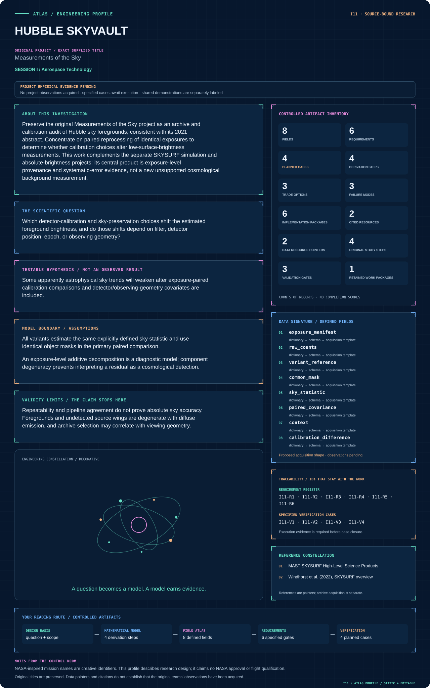

| Profile panel | Engineering signal | Open the evidence |
| --- | --- | --- |
| Mission identity | Measurements of the Sky | [Scientific objective](../research/I/I11-hubble-skyvault/README.md#purpose-and-scientific-objective) |
| Model cockpit | 4 governing expressions; 4 derivation steps; declared assumptions and validity envelope | [Mathematical formulation](../research/I/I11-hubble-skyvault/README.md#4-mathematical-model-and-derivation) |
| Data blueprint | 8 proposed fields with types, units and quality rules | [Field map & downloads](../research/I/I11-hubble-skyvault/data/README.md) |
| Verification queue | 6 proposed requirements; 4 specified cases; project execution evidence pending | [Case definitions](../research/I/I11-hubble-skyvault/README.md#8-verification-and-validation-cases) |
| Figure wall | Architecture, field map, planned result description | [Open full gallery](../research/I/I11-hubble-skyvault/figures/README.md) |
| Resource library | 2 cited primary resources with support statements | [Cited resources](../research/I/I11-hubble-skyvault/README.md#12-cited-technical-and-scientific-resources) |

#### Model cockpit

**Analysis method:** Select a stratified archive sample and freeze an exposure manifest with data-quality flags and calibration reference versions. Reprocess each image through approved sky-preserving variants, documenting dark, flat, persistence, scattered-light and masking differences. Estimate the sky with a fixed robust method, then vary masking in a distinct sensitivity analysis. Fit exposure-paired mixed-effects differences so scene brightness cancels while filter and detector interactions remain observable. Compare minimally correlated spatial regions to avoid treating drizzled pixels as independent samples. Use published SKYSURF definitions as the baseline and annotate every departure; report inaccessible products and unsuccessful reprocessing instead of silently dropping them.

**Operating envelope:** Repeatability and pipeline agreement do not prove absolute sky accuracy. Foregrounds and undetected source wings are degenerate with diffuse emission, and archive selection may correlate with viewing geometry.

**Variables and conventions**

- Exposure e and calibration variant k are indices; D and subtracted dark/debias term d in electrons for this schematic detector model.
- Exposure t in s, pixel solid angle Omega in sr, flat sensitivity f dimensionless; B is electron-rate surface brightness until filter-specific flux conversion is applied.
- Z, A, G denote zodiacal, other foreground, and Galactic contributions in matching brightness units; Ediffuse is an unconstrained residual comparator.
- z includes detector position, epoch, filter and viewing geometry; beta and gamma encode calibration effects, not established physical components.
- Covariance terms are retained because calibration variants reuse the same exposure and masks.

#### Artifact wall



Identical exposure/mask interfaces isolate calibration changes; shared covariance and distinct masking sensitivity prevent overinterpretation of sky residuals.

**Scientific result to produce:** Identical-exposure thumbnails beside a calibration-difference forest plot by filter/epoch and a foreground-geometry map; all units and selection flags are visible.

#### Investigation feed · planned work

The feed records proposed work packages. A row becomes executed evidence only with versioned inputs, outputs and a reviewed result.

| Sequence | Evidence state | Engineering work package |
| --- | --- | --- |
| 01 | Planned | Freeze stratified HST exposure/reference/quality manifest. |
| 02 | Planned | Implement explicit sky-preservation ledgers for each branch. |
| 03 | Planned | Apply one versioned common mask/sky estimator. |
| 04 | Planned | Build paired covariance and known dark/flat fixtures. |
| 05 | Planned | Fit supported context interactions with grouped holdouts. |
| 06 | Planned | Publish all reduction statuses, calibration differences and distinct mask/foreground sensitivities. |

#### Mission connections

Connections are reading routes based on actual shared resources, supplied sessions or included illustrations. They do not establish physical dependencies, team collaborations or validated results.

| Connected mission | Original investigation | Recorded connection basis |
| --- | --- | --- |
| [C02 · HUBBLE NIGHTFALL LAB](../research/C/C02-hubble-nightfall-lab/README.md) | Image Simulations for Testing the Fidelity of SKYSURF Background Measurement Algorithms | [MAST SKYSURF High-Level Science Products](https://archive.stsci.edu/hlsp/skysurf); [Windhorst et al. (2022), SKYSURF overview](https://arxiv.org/abs/2205.06214) |
| [C12 · HUBBLE COSMIC GLOW](../research/C/C12-hubble-cosmic-glow/README.md) | SKYSURF: Measuring the Brightness of the Sky | [MAST SKYSURF High-Level Science Products](https://archive.stsci.edu/hlsp/skysurf) |
| [I10 · GEMINI POINTLOCK](../research/I/I10-gemini-pointlock/README.md) | Spacecraft Attitude Control Implementation and Development | Session I |
| [I12 · PIONEER PHOBOS PATHFINDER](../research/I/I12-pioneer-phobos-pathfinder/README.md) | Heuristic Optimization Applied to Orbital Transfers Between Low-Planetary Orbits and Distant Retrograde Orbits | Session I |
| [I09 · OSIRIS REGOLITH LEAPER](../research/I/I09-osiris-regolith-leaper/README.md) | Simulation and Evaluation of a Mechanical Hopping Mechanism for Robotic Small Body Surface Exploration | Session I |
| [I13 · OSIRIS APOPHIS HORIZON](../research/I/I13-osiris-apophis-horizon/README.md) | A Study of the Deflection of 99942 Apophis from Earth | Session I |

[Machine-readable connection register and ranking rule](../registry/mission_connections.json)

#### Reading playlist

| Route | Start here | Continue to |
| --- | --- | --- |
| Understand the idea | [Scientific objective](../research/I/I11-hubble-skyvault/README.md#purpose-and-scientific-objective) | [Design boundary](../research/I/I11-hubble-skyvault/README.md#1-design-basis-and-analysis-boundary) → [Mathematics](../research/I/I11-hubble-skyvault/README.md#4-mathematical-model-and-derivation) |
| Inspect the data | [Visual blueprint](../research/I/I11-hubble-skyvault/data/README.md) | [Provenance](../research/I/I11-hubble-skyvault/README.md#5-data-specifications-and-provenance) → [Uncertainty](../research/I/I11-hubble-skyvault/README.md#6-uncertainty-sensitivity-and-identifiability) |
| Make a design decision | [Trade study](../research/I/I11-hubble-skyvault/README.md#7-engineering-trade-study) | [Failure modes](../research/I/I11-hubble-skyvault/README.md#10-failure-modes-and-interpretation-controls) → [Required outputs](../research/I/I11-hubble-skyvault/README.md#11-required-engineering-outputs) |
| Prepare execution | [Requirements](../research/I/I11-hubble-skyvault/README.md#2-requirements-and-verification-traceability) | [Verification](../research/I/I11-hubble-skyvault/README.md#8-verification-and-validation-cases) → [Implementation](../research/I/I11-hubble-skyvault/README.md#9-implementation-and-reproducible-work-packages) |

### Complete engineering dossier

The profile above is a browsing layer. The full design basis, equations, derivations, data contract, uncertainty, trades and controlled case definitions follow.

### Purpose and scientific objective

Preserve the original Measurements of the Sky project as an archive and calibration audit of Hubble sky foregrounds, consistent with its 2021 abstract. Concentrate on paired reprocessing of identical exposures to determine whether calibration choices alter low-surface-brightness measurements. This work complements the separate SKYSURF simulation and absolute-brightness projects: its central product is exposure-level provenance and systematic-error evidence, not a new unsupported cosmological background measurement.

**Question:** Which detector-calibration and sky-preservation choices shift the estimated foreground brightness, and do those shifts depend on filter, detector position, epoch, or observing geometry?

**Testable hypothesis:** Some apparently astrophysical sky trends will weaken after exposure-paired calibration comparisons and detector/observing-geometry covariates are included.

### 1. Design basis and analysis boundary

The Measurements of the Sky annex is an exposure-paired Hubble calibration audit. It measures how dark, flat, persistence and sky-preservation choices shift the same foreground-sky statistic. SKYSURF definitions/released products establish baseline provenance. Its product is calibration-effect evidence and reproducible paired measurements, not a newly asserted cosmological background detection.

Begin with identical exposures, masks and estimator, then controlled reference-file variants, then a separately labeled mask/foreground sensitivity study. Detector electron-rate surface brightness is converted to physical band intensity only with documented photometric response. Archive selection and failed/inaccessible products remain in the denominator. Repeatability between pipelines does not establish absolute truth.

### 2. Requirements and verification traceability

These are project design requirements or proposed analysis gates. A numerical target is not a NASA requirement unless its controlling source is explicitly identified. “TBD” identifies evidence required before a decision; it is not permission to assume a value. Verification evidence listed here is planned, unless a linked result explicitly records execution.

| ID | Requirement / gate | Engineering rationale | Verification method | Basis / required evidence |
| --- | --- | --- | --- | --- |
| I11-R1 | Primary variant comparisons shall use identical exposure pixels, object masks and sky statistic. | Mask/scene differences confound calibration effects. | Input/mask/estimator hash audit. | Proposed paired-comparison contract. |
| I11-R2 | Every variant shall record dark/flat/persistence/reference versions and removed/restored sky maps. | Absolute sky can be erased silently. | Reference/history manifest and uniform-sky replay. | SKYSURF sky-preservation context. |
| I11-R3 | Paired covariance shall include shared photon, mask and calibration terms. | Reused exposure estimates are not independent. | Identical-variant zero-difference and covariance fixture. | Proposed uncertainty requirement. |
| I11-R4 | Synthetic calibration perturbations shall be recovered within 1% of inserted shift when conditioned, a proposed numerical target. | Audit estimator needs known systematic controls. | Dark/flat perturbation injection and refinement. | Proposed recovery target. |
| I11-R5 | Filter/position/epoch/geometry effects shall be tested on withheld exposure groups. | Within-sample correction can overfit. | Stratified exposure-group holdout. | Proposed systematic-transfer requirement. |
| I11-R6 | Mask changes shall be reported as separate sensitivity rather than folded into the primary calibration difference. | Source wings and calibrations are distinct effects. | Mask-variant lineage audit. | Proposed effect-attribution rule. |

### 3. Architecture and controlled interfaces

The archive manifest links exposure IDs, detector/filter/epoch, viewing geometry and quality. Each calibration branch starts from the same pixel data and records reference operations with a sky-level ledger. A common-mask robust estimator returns detector-rate surface brightness, covariance and usable area. Physical intensity conversion carries filter response and pixel solid angle separately.

A paired-difference engine shares raw-exposure and mask covariance between variants. Mixed-effects analysis associates differences with calibration identity, detector position, epoch and geometry while allowing multiplicative dependence on scene brightness. A separate mask branch explores source-wing sensitivity. Failed reductions retain explicit status so selection does not silently favor well-behaved images.


Identical exposure/mask interfaces isolate calibration changes; shared covariance and distinct masking sensitivity prevent overinterpretation of sky residuals.

[Editable engineering diagram source](../research/I/I11-hubble-skyvault/figures/architecture.mmd)

### 4. Mathematical model and derivation

#### Governing equations

$$
\widehat B_{e,k}=(D_e-d_{e,k})/[t_e\,\Omega_e\,f_{e,k}]
$$

$$
\Delta B_{e,k\ell}=\widehat B_{e,k}-\widehat B_{e,\ell}
$$

$$
B_{e,k}=Z_e+A_e+G_e+E_{\rm diffuse}+\beta_k+\gamma_k^T\boldsymbol z_e+\epsilon_{e,k}
$$

$$
\sigma_{\rm total}^2=\sigma_{\rm random}^2+\sigma_{\rm cal}^2+\sigma_{\rm mask}^2+2\sum_{i<j}\mathrm{Cov}_{ij}
$$

#### Variables, units and conventions

- Exposure e and calibration variant k are indices; D and subtracted dark/debias term d in electrons for this schematic detector model.
- Exposure t in s, pixel solid angle Omega in sr, flat sensitivity f dimensionless; B is electron-rate surface brightness until filter-specific flux conversion is applied.
- Z, A, G denote zodiacal, other foreground, and Galactic contributions in matching brightness units; Ediffuse is an unconstrained residual comparator.
- z includes detector position, epoch, filter and viewing geometry; beta and gamma encode calibration effects, not established physical components.
- Covariance terms are retained because calibration variants reuse the same exposure and masks.

#### Assumptions and boundary conditions

- All variants estimate the same explicitly defined sky statistic and use identical object masks in the primary paired comparison.
- An exposure-level additive decomposition is a diagnostic model; component degeneracy prevents interpreting a residual as a cosmological detection.

#### Derivation step 1

$$
\widehat B_{e,k}=(D_e-d_{e,k})/(t_e\Omega_e f_{e,k})
$$

For a schematic electron detector model, B is electron s^-1 sr^-1 until response conversion; f is dimensionless sensitivity and d is an electron-domain correction.

#### Derivation step 2

$$
\Delta B_{k\ell}=\frac{D}{t\Omega}(1/f_k-1/f_\ell)-\frac{1}{t\Omega}(d_k/f_k-d_\ell/f_\ell)
$$

A shared exposure eliminates independent scene changes, but a flat difference scales with D; scene brightness can therefore interact with calibration.

#### Derivation step 3

$$
\operatorname{Var}(\Delta B)=\operatorname{Var}(B_k)+\operatorname{Var}(B_\ell)-2\operatorname{Cov}(B_k,B_\ell)
$$

Shared photon noise may cancel strongly. Independent-variance addition would overstate or misattribute paired uncertainty.

#### Derivation step 4

$$
\Delta B_e=\Delta\beta+\Delta\gamma^Tz_e+\delta g\,B_e+\epsilon_e
$$

The diagnostic model separates additive calibration shifts, context interactions and scene-scaled gain effects; it does not identify physical diffuse components.

#### Inference or simulation procedure

Select a stratified archive sample and freeze an exposure manifest with data-quality flags and calibration reference versions. Reprocess each image through approved sky-preserving variants, documenting dark, flat, persistence, scattered-light and masking differences. Estimate the sky with a fixed robust method, then vary masking in a distinct sensitivity analysis. Fit exposure-paired mixed-effects differences so scene brightness cancels while filter and detector interactions remain observable. Compare minimally correlated spatial regions to avoid treating drizzled pixels as independent samples. Use published SKYSURF definitions as the baseline and annotate every departure; report inaccessible products and unsuccessful reprocessing instead of silently dropping them.

#### Validity domain and fidelity limits

Repeatability and pipeline agreement do not prove absolute sky accuracy. Foregrounds and undetected source wings are degenerate with diffuse emission, and archive selection may correlate with viewing geometry.

### 5. Data specifications and provenance

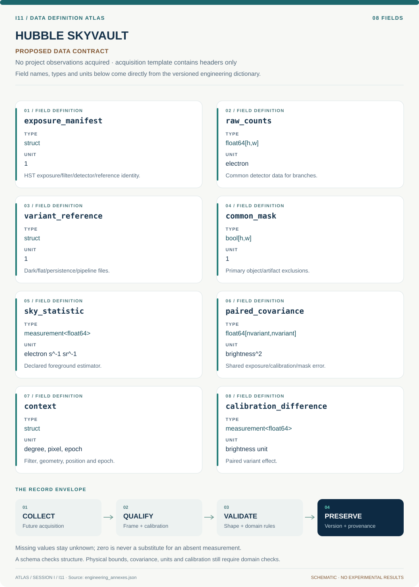

**Proposed data contract · observations pending.** This visual inventory shows the record fields to acquire or derive. It contains no project measurements. [Open the data blueprint and downloads](../research/I/I11-hubble-skyvault/data/README.md).

| Field | Type | Unit | Physical / statistical meaning | Quality and missing-data rule |
| --- | --- | --- | --- | --- |
| exposure_manifest | struct | 1 | HST exposure/filter/detector/reference identity. | Include inaccessible/failed records and selection status. |
| raw_counts | float64[h,w] | electron | Common detector data for branches. | Quality masks retained; missing pixels absent. |
| variant_reference | struct | 1 | Dark/flat/persistence/pipeline files. | Hash and operation order/sky ledger. |
| common_mask | bool[h,w] | 1 | Primary object/artifact exclusions. | Hash identical across paired branches. |
| sky_statistic | measurement<float64> | electron s^-1 sr^-1 | Declared foreground estimator. | Usable area and pixel-solid-angle convention. |
| paired_covariance | float64[nvariant,nvariant] | brightness^2 | Shared exposure/calibration/mask error. | Preserve cross-variant terms. |
| context | struct | degree, pixel, epoch | Filter, geometry, position and epoch. | Missing context flagged before regression. |
| calibration_difference | measurement<float64> | brightness unit | Paired variant effect. | Physical flux conversion version separate. |

[Machine-readable record schema](../research/I/I11-hubble-skyvault/data/schema.json) · [Empty acquisition CSV](../research/I/I11-hubble-skyvault/data/acquisition.csv) · [Field dictionary CSV](../research/I/I11-hubble-skyvault/data/dictionary.csv)

The CSV above contains column headers only. Its schema defines future records and does not establish that original-team data or a particular archive product have been acquired. Frame, timing, calibration, covariance, selection and provenance details must accompany populated records.

#### MAST SKYSURF high-level science products

[Product, archive or reference](https://archive.stsci.edu/hlsp/skysurf)

**Fields:** Available calibrated products, catalog metadata, filters, exposure identifiers and release version

**Access:** Public product entry point; enumerate exact products and retrieve raw/reference files through archive links as needed.

**Role:** Baseline product comparison and exposure provenance.

#### Windhorst et al. (2022) SKYSURF overview

[Product, archive or reference](https://arxiv.org/abs/2205.06214)

**Fields:** Published sky-preservation goals, measurement definitions and systematic context

**Access:** Open paper; numerical replication requires its referenced data and calibration details.

**Role:** Interpretation and reproducibility baseline.

### 6. Uncertainty, sensitivity and identifiability

Dark offsets create additive sky shifts, while flat/gain changes scale with brightness and detector position. Shared raw counts and masks correlate variant estimates; drizzled regions add spatial covariance. Carry full paired covariance and use exposure/visit blocks rather than counting many resampled pixels as independent evidence.

Persistence, scattered light, source wings and viewing geometry can correlate with archive selection or calibration epoch. Keep a fixed primary mask and analyze alternatives separately. Inspect mixed-model context support and held-out exposure groups to distinguish transferable effects from sample-specific correlations. Foreground/decomposition uncertainty prevents a residual from becoming cosmological evidence, even if paired calibration differences are measured precisely.

### 7. Engineering trade study

| Alternative | Benefit | Cost / limitation | Decision rule |
| --- | --- | --- | --- |
| Fixed-mask paired audit | Strong control of scene/mask confounding. | Limited sensitivity to masking choices. | Use primary calibration-effect product. |
| Separate mask-growth study | Measures source-wing dependence. | Cannot be merged blindly with calibration effect. | Use labeled secondary sensitivity. |
| Multifilter/context mixed model | Finds structured systematic shifts. | Sparse overlap and correlated archive selection. | Use only within supported exposure strata. |

### 8. Verification and validation cases

| Case ID | Stimulus / condition | Expected result / criterion | Method | Evidence artifact |
| --- | --- | --- | --- | --- |
| I11-V1 | Identical variants | Paired difference is zero and shared-noise cancellation is represented. | Run identical references/operators twice. | Paired algebra identity. |
| I11-V2 | Known dark shift | Difference follows inserted electron offset divided by exposure/area/flat with sign. | Synthetic dark perturbation. | Detector calibration equation. |
| I11-V3 | Known flat shift | Difference scales with scene counts according to reciprocal flat factors. | Uniform scenes at different sky levels. | Multiplicative calibration relation. |
| I11-V4 | Withheld exposure strata | Context-dependent differences are predicted without retuning masks/references. | Filter/epoch/position group holdout. | Proposed calibration transfer validation. |

**Execution status:** these cases are specified, not claimed as executed. Close a case only with the versioned inputs, output, uncertainty, reviewer and pass/fail rationale.

#### Additional scientific validation gates

- Test the pipeline on labeled synthetic constant-sky and gradient scenes before interpreting archive differences.
- Hold out complete detector epochs/filters and report whether calibration effects predict withheld paired differences.
- Use exposure-level or spatially blocked uncertainty estimates; show signed offsets and correlated calibration uncertainty.

### 9. Implementation and reproducible work packages

1. Freeze stratified HST exposure/reference/quality manifest.
2. Implement explicit sky-preservation ledgers for each branch.
3. Apply one versioned common mask/sky estimator.
4. Build paired covariance and known dark/flat fixtures.
5. Fit supported context interactions with grouped holdouts.
6. Publish all reduction statuses, calibration differences and distinct mask/foreground sensitivities.

#### Investigation sequence

1. Freeze exposure selection, sky estimand, calibration variants, and filter-specific unit conventions.
2. Build a checksum manifest and produce an audit trail for every processing step.
3. Fit paired calibration differences and separate mask/foreground sensitivities.
4. Release exposure-level failure flags and a reproducible set of representative comparison images.

#### Resources and interfaces to expertise

- HST archive access, instrument calibration references, unit-aware image tools, enough storage for frozen products, and a low-surface-brightness astronomy mentor.

### 10. Failure modes and interpretation controls

| Failure mode | Effect on result | Detection / evidence | Design response |
| --- | --- | --- | --- |
| Sky removed without ledger | Invalid foreground level. | Uniform-sky/history check. | Preserve or reconstruct documented removal. |
| Different masks called calibration effect | Confounded shift. | Mask hashes differ. | Fixed-mask primary and separate sensitivity. |
| Shared exposures treated independent | Wrong uncertainty/regression weight. | Covariance and grouping audit. | Paired covariance and visit-block inference. |

- Background subtraction may erase the estimand. Unmasked faint wings, detector artifacts and selection bias can mimic a sky component. No cosmological detection is asserted.

### 11. Required engineering outputs

- Exposure manifest, calibration-difference atlas, paired-reprocessing notebook specification, systematics budget, and sky-preservation recommendations tied to measured evidence.

#### Scientific result figures to produce during execution

Identical-exposure thumbnails beside a calibration-difference forest plot by filter/epoch and a foreground-geometry map; all units and selection flags are visible.

### 12. Cited technical and scientific resources

- [MAST SKYSURF High-Level Science Products](https://archive.stsci.edu/hlsp/skysurf) — Released archive products and provenance route.
- [Windhorst et al. (2022), SKYSURF overview](https://arxiv.org/abs/2205.06214) — Sky-preservation and foreground/background measurement context.

Framework and evidence rules: [engineering documentation standard](../engineering/ENGINEERING_STANDARD.md), [model assurance](../engineering/MODEL_ASSURANCE.md), [uncertainty procedure](../engineering/UNCERTAINTY_AND_DECISION_RULES.md), [data management](../engineering/DATA_MANAGEMENT.md). NASA-inspired names are creative identifiers; requirements and results are not NASA certification.

---

<a id="i12"></a>

## I12 · PIONEER PHOBOS PATHFINDER

**Original project:** Heuristic Optimization Applied to Orbital Transfers Between Low-Planetary Orbits and Distant Retrograde Orbits

**Session I:** Aerospace Technology

**Document class:** engineering research design and analysis record · **Revision:** 4 · **Date:** 2026-10-02

**Evidence state:** design basis, mathematical formulation and verification plan documented. Project-specific empirical results remain to be acquired; executable shared model demonstrations have their own recorded checks.

[Session I](../research/I/README.md) · [All projects](../ENGINEERING_DOCUMENTATION.md) · [Session handbook](SESSION_I.md) · [← I11](../research/I/I11-hubble-skyvault/README.md) · [I13 →](../research/I/I13-osiris-apophis-horizon/README.md)

| Proposed requirements | Specified verification cases | Defined data fields | Cited resources |
| ---: | ---: | ---: | ---: |
| 6 | 4 | 8 | 3 |

[Explore the data blueprint](../research/I/I12-pioneer-phobos-pathfinder/data/README.md) · [Open the figure gallery](../research/I/I12-pioneer-phobos-pathfinder/figures/README.md) · [Download acquisition template](../research/I/I12-pioneer-phobos-pathfinder/data/acquisition.csv) · [Browse the data atlas](../data/README.md)

---

### Mission profile

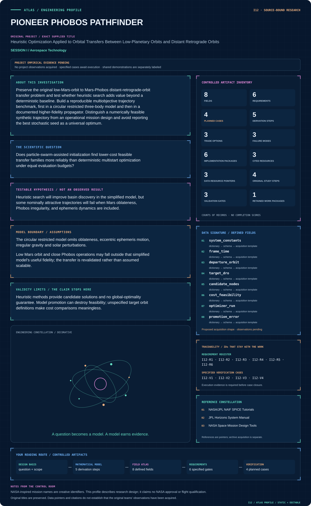

| Profile panel | Engineering signal | Open the evidence |
| --- | --- | --- |
| Mission identity | Heuristic Optimization Applied to Orbital Transfers Between Low-Planetary Orbits and Distant Retrograde Orbits | [Scientific objective](../research/I/I12-pioneer-phobos-pathfinder/README.md#purpose-and-scientific-objective) |
| Model cockpit | 4 governing expressions; 5 derivation steps; declared assumptions and validity envelope | [Mathematical formulation](../research/I/I12-pioneer-phobos-pathfinder/README.md#4-mathematical-model-and-derivation) |
| Data blueprint | 8 proposed fields with types, units and quality rules | [Field map & downloads](../research/I/I12-pioneer-phobos-pathfinder/data/README.md) |
| Verification queue | 6 proposed requirements; 4 specified cases; project execution evidence pending | [Case definitions](../research/I/I12-pioneer-phobos-pathfinder/README.md#8-verification-and-validation-cases) |
| Figure wall | Architecture, field map, planned result description; included shared illustration | [Open full gallery](../research/I/I12-pioneer-phobos-pathfinder/figures/README.md) |
| Resource library | 3 cited primary resources with support statements | [Cited resources](../research/I/I12-pioneer-phobos-pathfinder/README.md#12-cited-technical-and-scientific-resources) |

#### Model cockpit

**Analysis method:** Generate reference DRO families and low-orbit boundary conditions using versioned constants. Define a common multiple-shooting or collocation representation and independent feasibility checker. Compare particle-swarm initialization followed by local refinement, deterministic multistart refinement, and a simple coarse-grid baseline under the same propagation budget. Run independent seeds and report feasible-solution frequency, Pareto coverage, and compute cost. Promote selected trajectories into a Mars-Phobos ephemeris model with Mars J2 and a declared Phobos gravity approximation; quantify how much correction the simplified solution requires. Use GMAT or another independently configured mission-analysis tool as a comparator only where its documented model supports the required bodies and forces.

**Operating envelope:** Heuristic methods provide candidate solutions and no global-optimality guarantee. Model promotion can destroy feasibility; unspecified target orbit definitions make cost comparisons meaningless.

**Variables and conventions**

- x,y,z and time are nondimensional rotating-frame coordinates scaled by primary separation a in m and inverse mean motion n^-1 in s.
- mu=mass_Phobos/(mass_Mars+mass_Phobos); r1/r2 are dimensionless distances to the primaries.
- Physical velocity scale is a*n in m s^-1; Delta v in m s^-1 after conversion; flight time Tf in s or days with explicit unit labels.
- CJ is the dimensionless Jacobi constant; target DRO is defined by an actual periodic-orbit family and acceptance tolerance.

#### Artifact wall


Synthetic two-body conservation and refinement diagnostics from immutable model outputs. Panel A scales relative specific-energy error to parts per million and reports angular-momentum conservation for the stored 400-step-per-period run. Panel B compares three recorded maximum-energy errors with a second-order reference anchored to the coarsest run. This is an integration check, not trajectory prediction validation.

[Exact inputs, transformations and output hashes](../data/figures/14_orbit_conservation_and_refinement.provenance.json)

**Scientific result to produce:** Mars-Phobos rotating-frame candidate trajectories next to Delta-v/time Pareto points, seed distributions, and arrival-error shifts after higher-fidelity promotion.

#### Investigation feed · planned work

The feed records proposed work packages. A row becomes executed evidence only with versioned inputs, outputs and a reviewed result.

| Sequence | Evidence state | Engineering work package |
| --- | --- | --- |
| 01 | Planned | Freeze Mars/Phobos source constants and scaling/frame contracts. |
| 02 | Planned | Generate validated DRO family and low-orbit boundary cases. |
| 03 | Planned | Implement common shooting/collocation plus independent checker. |
| 04 | Planned | Build counted optimizer adapters and complete run ledger. |
| 05 | Planned | Run repeated equal-budget baseline/heuristic comparisons. |
| 06 | Planned | Promote selected candidates with documented ephemeris/J2/gravity forces and publish correction/error distributions. |

#### Mission connections

Connections are reading routes based on actual shared resources, supplied sessions or included illustrations. They do not establish physical dependencies, team collaborations or validated results.

| Connected mission | Original investigation | Recorded connection basis |
| --- | --- | --- |
| [I08 · VOYAGER FRAMEFORGE](../research/I/I08-voyager-frameforge/README.md) | Julia 1.2 Ephemeris and Gravitational Modeling Development | Session I; Included illustration: 07_two_body_convergence; [NASA/JPL NAIF SPICE Tutorials](https://naif.jpl.nasa.gov/naif/tutorials.html); [JPL Horizons System Manual](https://ssd.jpl.nasa.gov/horizons/manual.html) |
| [I13 · OSIRIS APOPHIS HORIZON](../research/I/I13-osiris-apophis-horizon/README.md) | A Study of the Deflection of 99942 Apophis from Earth | Session I; [JPL Horizons System Manual](https://ssd.jpl.nasa.gov/horizons/manual.html) |
| [I09 · OSIRIS REGOLITH LEAPER](../research/I/I09-osiris-regolith-leaper/README.md) | Simulation and Evaluation of a Mechanical Hopping Mechanism for Robotic Small Body Surface Exploration | Session I; [NASA/JPL NAIF SPICE Tutorials](https://naif.jpl.nasa.gov/naif/tutorials.html) |
| [I11 · HUBBLE SKYVAULT](../research/I/I11-hubble-skyvault/README.md) | Measurements of the Sky | Session I |
| [I10 · GEMINI POINTLOCK](../research/I/I10-gemini-pointlock/README.md) | Spacecraft Attitude Control Implementation and Development | Session I |
| [I07 · GATEWAY CATSAT CONSOLE](../research/I/I07-gateway-catsat-console/README.md) | CatSat Groundstation Command and Control | Session I |

[Machine-readable connection register and ranking rule](../registry/mission_connections.json)

#### Reading playlist

| Route | Start here | Continue to |
| --- | --- | --- |
| Understand the idea | [Scientific objective](../research/I/I12-pioneer-phobos-pathfinder/README.md#purpose-and-scientific-objective) | [Design boundary](../research/I/I12-pioneer-phobos-pathfinder/README.md#1-design-basis-and-analysis-boundary) → [Mathematics](../research/I/I12-pioneer-phobos-pathfinder/README.md#4-mathematical-model-and-derivation) |
| Inspect the data | [Visual blueprint](../research/I/I12-pioneer-phobos-pathfinder/data/README.md) | [Provenance](../research/I/I12-pioneer-phobos-pathfinder/README.md#5-data-specifications-and-provenance) → [Uncertainty](../research/I/I12-pioneer-phobos-pathfinder/README.md#6-uncertainty-sensitivity-and-identifiability) |
| Make a design decision | [Trade study](../research/I/I12-pioneer-phobos-pathfinder/README.md#7-engineering-trade-study) | [Failure modes](../research/I/I12-pioneer-phobos-pathfinder/README.md#10-failure-modes-and-interpretation-controls) → [Required outputs](../research/I/I12-pioneer-phobos-pathfinder/README.md#11-required-engineering-outputs) |
| Prepare execution | [Requirements](../research/I/I12-pioneer-phobos-pathfinder/README.md#2-requirements-and-verification-traceability) | [Verification](../research/I/I12-pioneer-phobos-pathfinder/README.md#8-verification-and-validation-cases) → [Implementation](../research/I/I12-pioneer-phobos-pathfinder/README.md#9-implementation-and-reproducible-work-packages) |

### Complete engineering dossier

The profile above is a browsing layer. The full design basis, equations, derivations, data contract, uncertainty, trades and controlled case definitions follow.

### Purpose and scientific objective

Preserve the original low-Mars-orbit to Mars-Phobos distant-retrograde-orbit transfer problem and test whether heuristic search adds value beyond a deterministic baseline. Build a reproducible multiobjective trajectory benchmark, first in a circular restricted three-body model and then in a documented higher-fidelity propagator. Distinguish a numerically feasible synthetic trajectory from an operational mission design and avoid reporting the best stochastic seed as a universal optimum.

**Question:** Does particle-swarm-assisted initialization find lower-cost feasible transfer families more reliably than deterministic multistart optimization under equal evaluation budgets?

**Testable hypothesis:** Heuristic search will improve basin discovery in the simplified model, but some nominally attractive trajectories will fail when Mars oblateness, Phobos irregularity, and ephemeris dynamics are included.

### 1. Design basis and analysis boundary

The transfer benchmark preserves low Mars orbit to a Mars–Phobos distant retrograde orbit. It compares heuristic initialization plus local refinement with deterministic multistart under equal dynamics-evaluation budgets. The primary deliverable is feasible-solution frequency, cost distribution and model-promotion error, not a universal stochastic optimum or operational mission plan.

Begin with a documented CR3BP and actual target periodic-orbit family, then independent feasibility checks, then Mars/Phobos ephemeris forces with Mars J2 and a declared Phobos gravity approximation. Primary separation a and mean motion n set physical velocity a*n; lunar scaling is not substituted. Force-model constants, target family, initial orbit and solver tolerances remain explicit benchmark inputs.

### 2. Requirements and verification traceability

These are project design requirements or proposed analysis gates. A numerical target is not a NASA requirement unless its controlling source is explicitly identified. “TBD” identifies evidence required before a decision; it is not permission to assume a value. Verification evidence listed here is planned, unless a linked result explicitly records execution.

| ID | Requirement / gate | Engineering rationale | Verification method | Basis / required evidence |
| --- | --- | --- | --- | --- |
| I12-R1 | Primary system shall be Mars–Phobos with versioned mass/separation/mean-motion constants. | Wrong system/scaling invalidates cost comparison. | Body/constant manifest and dimensional round trip. | Original context and Horizons reference. |
| I12-R2 | Physical delta-v shall equal nondimensional delta-v times a*n. | a/n has length-time units and is not velocity. | Unit-aware conversion fixture. | Corrected velocity scaling. |
| I12-R3 | Target DRO shall satisfy a defined periodic-family and phase/tolerance contract. | An unspecified distant point is not an orbit target. | Periodic return and target-manifold residual. | Proposed boundary definition. |
| I12-R4 | All optimizers shall share representation, constraints and equal counted propagation budget. | Extra evaluations can manufacture success. | Budget ledger including failures/refinement. | Proposed fair-comparison requirement. |
| I12-R5 | Jacobi drift in unforced CR3BP coasts shall remain below 10^-8 scaled absolute, a proposed numerical target. | Integration drift corrupts feasibility. | Integrator refinement and invariant check. | Proposed numerical target. |
| I12-R6 | Selected trajectories shall be rechecked independently after higher-fidelity promotion. | Simplified feasibility may disappear. | Ephemeris/J2 comparator with arrival and clearance errors. | Proposed promotion requirement. |

### 3. Architecture and controlled interfaces

A constants/source adapter stores Mars/Phobos geometric states, GM values, frame and time metadata. A nondimensionalizer defines a, n, mu and barycentric rotating axes. A DRO-family generator solves periodic return conditions and emits target phase states. The common trajectory representation uses shooting or collocation nodes with explicit coast/impulse interfaces.

Optimizer adapters differ only in initialization/search strategy. A separate checker propagates candidate states and evaluates continuity, departure/arrival and clearance constraints. A promotion adapter converts rotating states to inertial ephemeris coordinates and adds documented forces. The run ledger records every seed, failure and evaluation, allowing distributions rather than best-seed anecdotes to determine comparisons.


Correct Mars–Phobos scaling and a validated target family precede fair optimizer comparisons; independent promotion measures the simplified model's practical limits.

[Editable engineering diagram source](../research/I/I12-pioneer-phobos-pathfinder/figures/architecture.mmd)

### 4. Mathematical model and derivation

#### Governing equations

$$
\ddot x-2\dot y=\partial U/\partial x;\quad \ddot y+2\dot x=\partial U/\partial y;\quad \ddot z=\partial U/\partial z
$$

$$
U=(x^2+y^2)/2+(1-\mu)/r_1+\mu/r_2
$$

$$
C_J=2U-(\dot x^2+\dot y^2+\dot z^2)
$$

$$
\min\{\Delta v_{\rm total},T_f,\mathrm{E}[\text{arrival error}]\}\quad\text{subject to dynamics and orbit constraints}
$$

#### Variables, units and conventions

- x,y,z and time are nondimensional rotating-frame coordinates scaled by primary separation a in m and inverse mean motion n^-1 in s.
- mu=mass_Phobos/(mass_Mars+mass_Phobos); r1/r2 are dimensionless distances to the primaries.
- Physical velocity scale is a*n in m s^-1; Delta v in m s^-1 after conversion; flight time Tf in s or days with explicit unit labels.
- CJ is the dimensionless Jacobi constant; target DRO is defined by an actual periodic-orbit family and acceptance tolerance.

#### Assumptions and boundary conditions

- The circular restricted model omits oblateness, eccentric ephemeris motion, irregular gravity and solar perturbations.
- Low Mars orbit and close Phobos operations may fall outside that simplified model's useful fidelity; the transfer is revalidated rather than assumed scalable.

#### Derivation step 1

$$
n=\sqrt{(GM_{Mars}+GM_{Phobos})/a^3},\quad\mu=GM_{Phobos}/(GM_{Mars}+GM_{Phobos})
$$

These define inverse-second mean motion and dimensionless mass ratio under circular separation a.

#### Derivation step 2

$$
t^*=nt,\quad r^*=r/a,\quad v^*=v/(an)
$$

Differentiating scaled position by scaled time establishes the physical velocity scale a*n in m s^-1.

#### Derivation step 3

$$
U=(x^2+y^2)/2+(1-\mu)/r_1+\mu/r_2
$$

Primaries lie at x=-mu and 1-mu in the declared barycentric rotating frame; gradients enter the existing CR3BP equations.

#### Derivation step 4

$$
C_J=2U-|v^*|^2,\quad dC_J/dt^*=0
$$

Dotting coast dynamics with velocity cancels Coriolis work. Impulses change C_J, so invariance tests apply only between modeled impulses.

#### Derivation step 5

$$
\Delta v_{total}=an\sum_j\|\Delta v_j^*\|
$$

Compute physical cost from each declared velocity discontinuity. Ephemeris promotion also includes frame-rotation velocity terms, not position rotation alone.

#### Inference or simulation procedure

Generate reference DRO families and low-orbit boundary conditions using versioned constants. Define a common multiple-shooting or collocation representation and independent feasibility checker. Compare particle-swarm initialization followed by local refinement, deterministic multistart refinement, and a simple coarse-grid baseline under the same propagation budget. Run independent seeds and report feasible-solution frequency, Pareto coverage, and compute cost. Promote selected trajectories into a Mars-Phobos ephemeris model with Mars J2 and a declared Phobos gravity approximation; quantify how much correction the simplified solution requires. Use GMAT or another independently configured mission-analysis tool as a comparator only where its documented model supports the required bodies and forces.

#### Validity domain and fidelity limits

Heuristic methods provide candidate solutions and no global-optimality guarantee. Model promotion can destroy feasibility; unspecified target orbit definitions make cost comparisons meaningless.

### 5. Data specifications and provenance


**Proposed data contract · observations pending.** This visual inventory shows the record fields to acquire or derive. It contains no project measurements. [Open the data blueprint and downloads](../research/I/I12-pioneer-phobos-pathfinder/data/README.md).

| Field | Type | Unit | Physical / statistical meaning | Quality and missing-data rule |
| --- | --- | --- | --- | --- |
| system_constants | struct | m, s^-1, m^3 s^-2 | Mars/Phobos a,n,GM,mu. | Source/query and circular approximation. |
| frame_time | struct | TDB s, 1 | Rotating/inertial center/epoch conventions. | Transforms include velocity derivative. |
| departure_orbit | struct | m, m s^-1 | Defined low-Mars boundary and phase. | Collision/atmosphere/clearance assumptions explicit. |
| target_dro | periodic state table | dimensionless | Family, period, phase and acceptance. | Return residual and continuation provenance. |
| candidate_nodes | float64[n,6] | dimensionless state | Common shooting/collocation trajectory. | Continuity/coast/impulse types attached. |
| cost_feasibility | struct | m s^-1, s, m | Delta-v, time and arrival/clearance residuals. | Independent checker; failed candidates retained. |
| optimizer_run | struct | seed, evaluation count | Strategy and complete compute budget. | Local refinement counts included. |
| promotion_error | measurement<struct> | m, m s^-1 | Higher-fidelity arrival/correction discrepancy. | Force model, constants and numerical covariance. |

[Machine-readable record schema](../research/I/I12-pioneer-phobos-pathfinder/data/schema.json) · [Empty acquisition CSV](../research/I/I12-pioneer-phobos-pathfinder/data/acquisition.csv) · [Field dictionary CSV](../research/I/I12-pioneer-phobos-pathfinder/data/dictionary.csv)

The CSV above contains column headers only. Its schema defines future records and does not establish that original-team data or a particular archive product have been acquired. Frame, timing, calibration, covariance, selection and provenance details must accompany populated records.

#### JPL Horizons Mars/Phobos reference states

[Product, archive or reference](https://ssd.jpl.nasa.gov/horizons/manual.html)

**Fields:** Epochs, positions/velocities, center/frame, ephemeris metadata and constants

**Access:** Public query service; freeze complete query/output and match frame/time conventions.

**Role:** Higher-fidelity geometry and model consistency.

#### NASA mission-design-tool reference

[Product, archive or reference](https://www.nasa.gov/smallsat-institute/space-mission-design-tools/)

**Fields:** Tool discovery and documented propagation/optimization capabilities

**Access:** Public NASA overview; select a verified supported configuration before claiming a numerical cross-check.

**Role:** Independent mission-analysis route.

#### Proposed trajectory benchmark manifest

[Product, archive or reference](https://naif.jpl.nasa.gov/naif/tutorials.html)

**Fields:** Initial/target orbit definitions, constants, force model, solver tolerances, seed, evaluation budget, feasible candidate states

**Access:** Generate explicitly synthetic benchmark cases and release all unsuccessful runs.

**Role:** Fair optimizer comparison and reproducibility.

### 6. Uncertainty, sensitivity and identifiability

Initial phase, target-family phase and transfer duration can create disconnected feasible families. Stochastic seeds affect search success, while solver tolerances and constraint scaling affect apparent feasibility. Repeat independent seeds and deterministic starts under equal counted work, reporting uncertainty in feasible frequency and Pareto coverage.

CR3BP discrepancy includes Mars oblateness, noncircular Phobos ephemerides, irregular local gravity and external perturbations. Low Mars orbit and close Phobos regions may be particularly sensitive. Promote candidates with independently sourced geometry/forces and separate numerical integration error from force-model shift. Large correction requirements invalidate claims of operational feasibility even when the simplified optimizer converged.

### 7. Engineering trade study

| Alternative | Benefit | Cost / limitation | Decision rule |
| --- | --- | --- | --- |
| Coarse deterministic grid | Transparent baseline and coverage. | Expensive in high-dimensional phases. | Use small-domain reference under same budget. |
| Deterministic multistart refinement | Reproducible local solutions. | Initial basin dependence. | Use primary comparator. |
| Particle swarm plus local refinement | Can explore separated basins. | Seed dependence and no global guarantee. | Prefer only if repeated feasible/cost distributions improve at equal work. |

### 8. Verification and validation cases

| Case ID | Stimulus / condition | Expected result / criterion | Method | Evidence artifact |
| --- | --- | --- | --- | --- |
| I12-V1 | Scaling round trip | Dimensional-to-scaled-to-dimensional states/costs reproduce inputs. | Known a,n state fixture. | Nondimensionalization identity. |
| I12-V2 | Coast Jacobi invariant | Unforced integrations meet the proposed drift target. | Refine step/tolerances over representative coasts. | CR3BP conservation. |
| I12-V3 | DRO periodic return | Target state returns to its family boundary within declared acceptance. | Independent integration of target period. | Periodic-orbit contract. |
| I12-V4 | Budget/model holdout | Optimization comparison includes all failures and promotion residuals without selecting only best seeds. | Independent runs/checker and ephemeris promotion. | Proposed fair-validation design. |

**Execution status:** these cases are specified, not claimed as executed. Close a case only with the versioned inputs, output, uncertainty, reviewer and pass/fail rationale.

#### Additional scientific validation gates

- Check Jacobi drift in unforced CR3BP arcs, mesh refinement, boundary defects and periodic-orbit closure.
- Use equal-budget comparisons with medians, tails, feasible fractions, and bootstrap uncertainty across seeds.
- Evaluate arrival-state sensitivity under initial-state/constant perturbations and cross-check promoted trajectories with an independent propagator.

### 9. Implementation and reproducible work packages

1. Freeze Mars/Phobos source constants and scaling/frame contracts.
2. Generate validated DRO family and low-orbit boundary cases.
3. Implement common shooting/collocation plus independent checker.
4. Build counted optimizer adapters and complete run ledger.
5. Run repeated equal-budget baseline/heuristic comparisons.
6. Promote selected candidates with documented ephemeris/J2/gravity forces and publish correction/error distributions.

#### Investigation sequence

1. Freeze target DRO family, orbit bounds, force model, units, and comparison compute budget.
2. Verify CR3BP dynamics and generate reference periodic orbits before transfer optimization.
3. Run multiple independent heuristic and deterministic campaigns with an independent constraint checker.
4. Repropagate selected candidates at higher fidelity and report model-promotion correction costs.

#### Resources and interfaces to expertise

- Astrodynamics solver, uncertainty/optimization tools, versioned SPICE/Horizons inputs, independent propagator, and mission-design mentor.

### 10. Failure modes and interpretation controls

| Failure mode | Effect on result | Detection / evidence | Design response |
| --- | --- | --- | --- |
| Wrong lunar constants or a/n scaling | Invalid physical costs. | System/unit manifest fixture. | Mars–Phobos a*n conversion. |
| Best seed called optimum | Overstated search guarantee. | Complete run distribution missing. | Publish all seeds/budget and uncertainty. |
| Simplified target not feasible after promotion | Unsupported mission claim. | Arrival/clearance residual. | Report model correction or reject candidate. |

- Algorithm luck, inconsistent tolerances, and mixed force models can produce false efficiency claims. Close-Phobos trajectories require irregular-gravity and uncertainty review.

### 11. Required engineering outputs

- Mars-Phobos benchmark, orbit-family atlas, seed-complete optimizer report, model-promotion discrepancy map, and mission-applicability limitations.

#### Scientific result figures to produce during execution

Mars-Phobos rotating-frame candidate trajectories next to Delta-v/time Pareto points, seed distributions, and arrival-error shifts after higher-fidelity promotion.

#### Included shared numerical starting point


[Executable formulation, parameters, tabular outputs, provenance and verification](../models/README.md). This shared demonstration has a narrower domain than the project model above. Its own caption and methods identify synthetic parameters or the separately retrieved public catalog; it is not a completed result of the original project.

#### Data diagnostic


Synthetic two-body conservation and refinement diagnostics from immutable model outputs. Panel A scales relative specific-energy error to parts per million and reports angular-momentum conservation for the stored 400-step-per-period run. Panel B compares three recorded maximum-energy errors with a second-order reference anchored to the coarsest run. This is an integration check, not trajectory prediction validation.

[Inputs, downloadable figure and provenance](../data/figures/README.md)

### 12. Cited technical and scientific resources

- [NASA/JPL NAIF SPICE Tutorials](https://naif.jpl.nasa.gov/naif/tutorials.html) — Reference-frame and ephemeris provenance.
- [JPL Horizons System Manual](https://ssd.jpl.nasa.gov/horizons/manual.html) — Mars/Phobos ephemeris query conventions.
- [NASA Space Mission Design Tools](https://www.nasa.gov/smallsat-institute/space-mission-design-tools/) — Independent mission-design software discovery; capabilities must be checked.

Framework and evidence rules: [engineering documentation standard](../engineering/ENGINEERING_STANDARD.md), [model assurance](../engineering/MODEL_ASSURANCE.md), [uncertainty procedure](../engineering/UNCERTAINTY_AND_DECISION_RULES.md), [data management](../engineering/DATA_MANAGEMENT.md). NASA-inspired names are creative identifiers; requirements and results are not NASA certification.

---

<a id="i13"></a>

## I13 · OSIRIS APOPHIS HORIZON

**Original project:** A Study of the Deflection of 99942 Apophis from Earth

**Session I:** Aerospace Technology

**Document class:** engineering research design and analysis record · **Revision:** 4 · **Date:** 2026-10-02

**Evidence state:** design basis, mathematical formulation and verification plan documented. Project-specific empirical results remain to be acquired; executable shared model demonstrations have their own recorded checks.

[Session I](../research/I/README.md) · [All projects](../ENGINEERING_DOCUMENTATION.md) · [Session handbook](SESSION_I.md) · [← I12](../research/I/I12-pioneer-phobos-pathfinder/README.md)

| Proposed requirements | Specified verification cases | Defined data fields | Cited resources |
| ---: | ---: | ---: | ---: |
| 6 | 5 | 8 | 2 |

[Explore the data blueprint](../research/I/I13-osiris-apophis-horizon/data/README.md) · [Open the figure gallery](../research/I/I13-osiris-apophis-horizon/figures/README.md) · [Download acquisition template](../research/I/I13-osiris-apophis-horizon/data/acquisition.csv) · [Browse the data atlas](../data/README.md)

---

### Mission profile


| Profile panel | Engineering signal | Open the evidence |
| --- | --- | --- |
| Mission identity | A Study of the Deflection of 99942 Apophis from Earth | [Scientific objective](../research/I/I13-osiris-apophis-horizon/README.md#purpose-and-scientific-objective) |
| Model cockpit | 4 governing expressions; 5 derivation steps; declared assumptions and validity envelope | [Mathematical formulation](../research/I/I13-osiris-apophis-horizon/README.md#4-mathematical-model-and-derivation) |
| Data blueprint | 8 proposed fields with types, units and quality rules | [Field map & downloads](../research/I/I13-osiris-apophis-horizon/data/README.md) |
| Verification queue | 6 proposed requirements; 5 specified cases; project execution evidence pending | [Case definitions](../research/I/I13-osiris-apophis-horizon/README.md#8-verification-and-validation-cases) |
| Figure wall | Architecture, field map, planned result description; included shared illustration | [Open full gallery](../research/I/I13-osiris-apophis-horizon/figures/README.md) |
| Resource library | 2 cited primary resources with support statements | [Cited resources](../research/I/I13-osiris-apophis-horizon/README.md#12-cited-technical-and-scientific-resources) |

#### Model cockpit

**Analysis method:** Retrieve and freeze a passive reference ephemeris, source metadata, time conventions and force model. Reproduce the unperturbed close-approach geometry before any sensitivity analysis. Propagate synthetic initial-state ensembles through the encounter and compare full nonlinear Monte Carlo distributions with the linear covariance approximation. Compute encounter-plane residuals and show when ellipsoidal uncertainty becomes misleading. In a distinct educational sandbox, apply normalized generic state offsets solely to illustrate sensitivity; do not conflate those cases with current Apophis risk. Compare synthetic optical, radar, and passive spacecraft observation schedules by expected information gain using stated noise models. Present the correct historical-to-current premise prominently in every public visual.

**Operating envelope:** This proposal is not an orbit-determination service, a new hazard assessment, or a physical intervention design. Rare-event probabilities require validated observational covariance and much stronger sampling than a classroom ensemble.

**Variables and conventions**

- State x contains position in m and velocity in m s^-1; time in s with declared TDB/UTC handling.
- Phi is the state transition matrix with block units consistent with the position/velocity state; covariance P has corresponding mixed units.
- Process covariance Q represents explicitly justified unmodeled-force uncertainty, not an arbitrary tuning term.
- b contains encounter-plane coordinates in m; Hb is their Jacobian; EIG is expected information gain in nats.
- Synthetic perturbations are dimensionless offsets scaled by a declared illustrative uncertainty ellipsoid; no impactor or maneuver parameters are specified.

#### Artifact wall


Synthetic two-body conservation and refinement diagnostics from immutable model outputs. Panel A scales relative specific-energy error to parts per million and reports angular-momentum conservation for the stored 400-step-per-period run. Panel B compares three recorded maximum-energy errors with a second-order reference anchored to the coarsest run. This is an integration check, not trajectory prediction validation.

[Exact inputs, transformations and output hashes](../data/figures/14_orbit_conservation_and_refinement.provenance.json)

**Scientific result to produce:** An unperturbed encounter trajectory with labeled synthetic uncertainty ensembles, linear-versus-nonlinear comparison, and observation information-gain bars; the nonthreatening premise appears on the figure.

#### Investigation feed · planned work

The feed records proposed work packages. A row becomes executed evidence only with versioned inputs, outputs and a reviewed result.

| Sequence | Evidence state | Engineering work package |
| --- | --- | --- |
| 01 | Planned | Freeze passive reference, force/time/frame metadata and safe premise. |
| 02 | Planned | Create sourced/illustrative covariance types and output gates. |
| 03 | Planned | Implement variational propagation and event-plane derivatives. |
| 04 | Planned | Build finite-difference and linear-dynamics sensitivity fixtures. |
| 05 | Planned | Compare nonlinear ensembles over normalized offset scales. |
| 06 | Planned | Evaluate explicitly hypothetical passive observation information with correlated noise and publish capability/uncertainty limitations. |

#### Mission connections

Connections are reading routes based on actual shared resources, supplied sessions or included illustrations. They do not establish physical dependencies, team collaborations or validated results.

| Connected mission | Original investigation | Recorded connection basis |
| --- | --- | --- |
| [I12 · PIONEER PHOBOS PATHFINDER](../research/I/I12-pioneer-phobos-pathfinder/README.md) | Heuristic Optimization Applied to Orbital Transfers Between Low-Planetary Orbits and Distant Retrograde Orbits | Session I; [JPL Horizons System Manual](https://ssd.jpl.nasa.gov/horizons/manual.html) |
| [I08 · VOYAGER FRAMEFORGE](../research/I/I08-voyager-frameforge/README.md) | Julia 1.2 Ephemeris and Gravitational Modeling Development | Session I; [JPL Horizons System Manual](https://ssd.jpl.nasa.gov/horizons/manual.html) |
| [I11 · HUBBLE SKYVAULT](../research/I/I11-hubble-skyvault/README.md) | Measurements of the Sky | Session I |
| [I10 · GEMINI POINTLOCK](../research/I/I10-gemini-pointlock/README.md) | Spacecraft Attitude Control Implementation and Development | Session I |
| [I09 · OSIRIS REGOLITH LEAPER](../research/I/I09-osiris-regolith-leaper/README.md) | Simulation and Evaluation of a Mechanical Hopping Mechanism for Robotic Small Body Surface Exploration | Session I |
| [I07 · GATEWAY CATSAT CONSOLE](../research/I/I07-gateway-catsat-console/README.md) | CatSat Groundstation Command and Control | Session I |

[Machine-readable connection register and ranking rule](../registry/mission_connections.json)

#### Reading playlist

| Route | Start here | Continue to |
| --- | --- | --- |
| Understand the idea | [Scientific objective](../research/I/I13-osiris-apophis-horizon/README.md#purpose-and-scientific-objective) | [Design boundary](../research/I/I13-osiris-apophis-horizon/README.md#1-design-basis-and-analysis-boundary) → [Mathematics](../research/I/I13-osiris-apophis-horizon/README.md#4-mathematical-model-and-derivation) |
| Inspect the data | [Visual blueprint](../research/I/I13-osiris-apophis-horizon/data/README.md) | [Provenance](../research/I/I13-osiris-apophis-horizon/README.md#5-data-specifications-and-provenance) → [Uncertainty](../research/I/I13-osiris-apophis-horizon/README.md#6-uncertainty-sensitivity-and-identifiability) |
| Make a design decision | [Trade study](../research/I/I13-osiris-apophis-horizon/README.md#7-engineering-trade-study) | [Failure modes](../research/I/I13-osiris-apophis-horizon/README.md#10-failure-modes-and-interpretation-controls) → [Required outputs](../research/I/I13-osiris-apophis-horizon/README.md#11-required-engineering-outputs) |
| Prepare execution | [Requirements](../research/I/I13-osiris-apophis-horizon/README.md#2-requirements-and-verification-traceability) | [Verification](../research/I/I13-osiris-apophis-horizon/README.md#8-verification-and-validation-cases) → [Implementation](../research/I/I13-osiris-apophis-horizon/README.md#9-implementation-and-reproducible-work-packages) |

### Complete engineering dossier

The profile above is a browsing layer. The full design basis, equations, derivations, data contract, uncertainty, trades and controlled case definitions follow.

### Purpose and scientific objective

Retain the Apophis deflection-study title while updating its premise: NASA currently rules out Earth impact by Apophis for at least 100 years, and the April 13, 2029 encounter is an observation opportunity. Study hypothetical small-body perturbations as a classroom planetary-defense and uncertainty-propagation exercise. The baseline is passive observation with no intervention; all altered trajectories are labeled synthetic, and no physical deflection or spacecraft maneuver is recommended.

**Question:** How does a close planetary encounter amplify uncertainty in an asteroid state, and which additional observations would most reduce post-encounter prediction uncertainty?

**Testable hypothesis:** Better pre/post-encounter state estimation will be more informative for this nonthreatening object than an artificial perturbation study; linear covariance models will fail in some nonlinear encounter scenarios.

### 1. Design basis and analysis boundary

The Apophis annex is a passive close-encounter sensitivity and observation-information study. NASA currently states no Earth-impact risk for at least 100 years and a safe April 13, 2029 encounter. The baseline uses a frozen unaltered reference ephemeris. Educational normalized state offsets are synthetic uncertainty illustrations, with no impactor, maneuver or physical deflection recommendation.

Begin with passive geometry reproduction, then variational equations and nonlinear ensembles, then synthetic optical/radar/passive-spacecraft observation models. An authoritative covariance is used only when its source and convention exist; Horizons vectors alone do not supply it. Otherwise ensembles are explicitly illustrative and cannot yield a new hazard probability. The main product identifies when linear uncertainty fails and which assumed observations reduce it.

### 2. Requirements and verification traceability

These are project design requirements or proposed analysis gates. A numerical target is not a NASA requirement unless its controlling source is explicitly identified. “TBD” identifies evidence required before a decision; it is not permission to assume a value. Verification evidence listed here is planned, unless a linked result explicitly records execution.

| ID | Requirement / gate | Engineering rationale | Verification method | Basis / required evidence |
| --- | --- | --- | --- | --- |
| I13-R1 | Every public output shall state the safe Apophis premise and distinguish passive reference from synthetic offsets. | Historical title must not imply a current threat. | Figure/report metadata and scenario-state audit. | Verified NASA Apophis facts. |
| I13-R2 | State/ephemeris comparisons shall match center, frame, epoch/time scale and geometric correction. | Convention errors can imitate close-encounter sensitivity. | Matched reference/query round trip. | Horizons primary conventions. |
| I13-R3 | Covariance shall be source-supported or explicitly illustrative; no impact probability shall be inferred from illustrative ensembles. | A state vector does not establish hazard uncertainty. | Covariance pedigree and output-type gate. | Proposed evidence contract. |
| I13-R4 | Variational sensitivities shall agree with central finite differences to 0.1% where linearization is conditioned, a proposed target. | Bad Jacobians corrupt encounter covariance. | Offset-size and step-refinement checks. | Proposed numerical target. |
| I13-R5 | Linear and nonlinear encounter distributions shall be compared over increasing normalized uncertainty scales. | Close approaches can distort ellipsoids. | Monte Carlo versus STM mean/covariance diagnostics. | Proposed nonlinearity requirement. |
| I13-R6 | Information-gain rankings shall report assumed observation noise, cadence and independence. | Synthetic sensor models do not establish real scheduling capability. | Observation model/holdout and noise sensitivity. | Proposed passive-design requirement. |

### 3. Architecture and controlled interfaces

A passive ephemeris manifest stores the complete reference query and force-model metadata. A state/covariance adapter carries mixed position/velocity units, epoch and pedigree. The propagator advances baseline and variational equations; an event finder locates close approach and a declared encounter-plane mapping. Synthetic offset generators are normalized by a documented uncertainty scale and have a separate scenario state.

A nonlinear ensemble engine uses the same force/time/frame conventions. Observation adapters generate hypothetical angles, ranges or passive spacecraft measurements with assumed noise and visibility. An information module updates covariance/posteriors and computes expected gain. Output gates retain the safe premise and prohibit illustrative ensembles from being labeled a current risk assessment.


The unaltered safe reference is distinct from illustrative offsets; event-aware uncertainty and assumed passive measurements support an educational information study.

[Editable engineering diagram source](../research/I/I13-osiris-apophis-horizon/figures/architecture.mmd)

### 4. Mathematical model and derivation

#### Governing equations

$$
\dot{\boldsymbol x}=\boldsymbol f(\boldsymbol x,t);\quad \dot{\boldsymbol\Phi}=\boldsymbol A\boldsymbol\Phi;\quad \boldsymbol A=\partial\boldsymbol f/\partial\boldsymbol x
$$

$$
\boldsymbol P(t)=\boldsymbol\Phi\boldsymbol P_0\boldsymbol\Phi^T+\boldsymbol Q(t)
$$

$$
\delta\boldsymbol b\approx\boldsymbol H_b\boldsymbol\Phi\delta\boldsymbol x_0
$$

$$
\mathrm{EIG}=\mathrm{E}[\mathrm{KL}(p(\boldsymbol x|y)\parallel p(\boldsymbol x))]
$$

#### Variables, units and conventions

- State x contains position in m and velocity in m s^-1; time in s with declared TDB/UTC handling.
- Phi is the state transition matrix with block units consistent with the position/velocity state; covariance P has corresponding mixed units.
- Process covariance Q represents explicitly justified unmodeled-force uncertainty, not an arbitrary tuning term.
- b contains encounter-plane coordinates in m; Hb is their Jacobian; EIG is expected information gain in nats.
- Synthetic perturbations are dimensionless offsets scaled by a declared illustrative uncertainty ellipsoid; no impactor or maneuver parameters are specified.

#### Assumptions and boundary conditions

- The real-object scenario uses the published nonthreatening status and a passive ephemeris baseline.
- A physically justified covariance is used only when its source is available; Horizons state vectors alone do not establish uncertainty or impact probability.

#### Derivation step 1

$$
\dot x=f(x,t),\quad\dot\Phi=A\Phi,\quad A=\partial f/\partial x,\quad\Phi(t_0)=I
$$

The state transition matrix maps initial perturbations into later mixed-unit position/velocity changes; scaled coordinates improve conditioning.

#### Derivation step 2

$$
P(t)=\Phi P_0\Phi^T+Q(t)
$$

Q represents independently justified unmodeled-force accumulation, not an arbitrary fit knob. Source covariance and illustrative covariance remain different types.

#### Derivation step 3

$$
\delta b\approx H_b\Phi\delta x_0
$$

Encounter-plane mapping includes uncertainty in event time and plane convention; fixed-time projection alone can miss closest-approach sensitivity.

#### Derivation step 4

```text
P_{post}^{-1}=P_{prior}^{-1}+H_y^TR^{-1}H_y
```

The inverse form requires a positive-definite prior on independent coordinates and positive-definite R for independent observation components after correlation is modeled. Perfectly redundant observations make R singular: deduplicate or use a justified rank-revealing whitening/supported generalized-inverse formulation before the update. The conditional passive linear-Gaussian model does not create information from duplicate rows.

#### Derivation step 5

$$
EIG=\tfrac12\log\det(P_{prior}P_{post}^{-1})
$$

For the linear-Gaussian same-state comparison this dimensionless determinant ratio gives nats. Nonlinear/multimodal posteriors require explicit expected KL estimation.

#### Inference or simulation procedure

Retrieve and freeze a passive reference ephemeris, source metadata, time conventions and force model. Reproduce the unperturbed close-approach geometry before any sensitivity analysis. Propagate synthetic initial-state ensembles through the encounter and compare full nonlinear Monte Carlo distributions with the linear covariance approximation. Compute encounter-plane residuals and show when ellipsoidal uncertainty becomes misleading. In a distinct educational sandbox, apply normalized generic state offsets solely to illustrate sensitivity; do not conflate those cases with current Apophis risk. Compare synthetic optical, radar, and passive spacecraft observation schedules by expected information gain using stated noise models. Present the correct historical-to-current premise prominently in every public visual.

#### Validity domain and fidelity limits

This proposal is not an orbit-determination service, a new hazard assessment, or a physical intervention design. Rare-event probabilities require validated observational covariance and much stronger sampling than a classroom ensemble.

### 5. Data specifications and provenance


**Proposed data contract · observations pending.** This visual inventory shows the record fields to acquire or derive. It contains no project measurements. [Open the data blueprint and downloads](../research/I/I13-osiris-apophis-horizon/data/README.md).

| Field | Type | Unit | Physical / statistical meaning | Quality and missing-data rule |
| --- | --- | --- | --- | --- |
| passive_reference | struct | m, m s^-1, TDB s | Frozen unaltered Apophis states/query. | NASA safe premise and source checksum attached. |
| initial_covariance | float64[6,6]&#124;null | mixed state^2 | Authoritative or illustrative uncertainty. | Pedigree/type mandatory; null if absent. |
| normalized_offset | float64[6] | 1 | Educational offsets in a declared ellipsoid basis. | Synthetic only; no intervention parameters. |
| state_transition | float64[6,6] | mixed blocks | Variational sensitivity matrix. | Scale convention and derivative convergence. |
| encounter_plane | measurement<float64[2]> | m | Declared geometric sensitivity coordinates. | Plane/event-time convention and covariance. |
| ensemble_trace | distribution<state> | mixed state | Nonlinear passive/synthetic scenario histories. | Seed, force model and scenario type retained. |
| observation_model | struct | radian, m, m s^-1 | Hypothetical passive measurement/noise/cadence. | Assumed versus verified capability explicit. |
| information_gain | measurement<float64> | nat | Expected posterior/prior information. | State support/noise model and numerical uncertainty. |

[Machine-readable record schema](../research/I/I13-osiris-apophis-horizon/data/schema.json) · [Empty acquisition CSV](../research/I/I13-osiris-apophis-horizon/data/acquisition.csv) · [Field dictionary CSV](../research/I/I13-osiris-apophis-horizon/data/dictionary.csv)

The CSV above contains column headers only. Its schema defines future records and does not establish that original-team data or a particular archive product have been acquired. Frame, timing, calibration, covariance, selection and provenance details must accompany populated records.

#### NASA Apophis facts

[Product, archive or reference](https://science.nasa.gov/solar-system/asteroids/apophis-facts/)

**Fields:** Published safe-encounter premise, date, science-observation context

**Access:** Public NASA source checked October 2, 2026; recheck before future hazard statements.

**Role:** Current factual premise and correction of the historical proposal.

#### JPL Horizons passive reference ephemeris

[Product, archive or reference](https://ssd.jpl.nasa.gov/horizons/manual.html)

**Fields:** Epoch, state vectors, frame/center and retrieval metadata

**Access:** Public query route. If authoritative covariance is unavailable, label the ensemble illustrative and avoid impact-probability claims.

**Role:** Passive trajectory reference and convention check.

### 6. Uncertainty, sensitivity and identifiability

Initial-state covariance and unmodeled forces determine ensemble meaning. Close-encounter event timing, gravitational parameters and frame/time conventions can amplify errors. Compare STM and full nonlinear ensembles as normalized spread increases, inspecting skewness/multimodality rather than only a covariance ellipse. Physical covariance is never inferred by assigning arbitrary dispersion to reference vectors.

Observation rankings depend on noise correlations, visibility and assumed cadence. Evaluate repeated measurements with shared biases rather than treating every sample independent. Use sensitivity to realistic model alternatives to identify robust information gains. An illustrative ranking explains a method; it does not provide actual spacecraft tasking, a new orbit solution or an impact-probability claim.

### 7. Engineering trade study

| Alternative | Benefit | Cost / limitation | Decision rule |
| --- | --- | --- | --- |
| Linear STM covariance | Fast interpretable sensitivities. | Fails under nonlinear distortion. | Use where finite-difference/ensemble checks pass. |
| Nonlinear Monte Carlo | Captures distorted distributions. | Cost and tail-sampling limits. | Use comparison without rare-event hazard claims. |
| Passive observation information study | Ranks modeled uncertainty reduction. | Assumed instrument/cadence covariance. | Report sensitivity and capability gaps rather than operational recommendations. |

### 8. Verification and validation cases

| Case ID | Stimulus / condition | Expected result / criterion | Method | Evidence artifact |
| --- | --- | --- | --- | --- |
| I13-V1 | Zero normalized offset | Synthetic propagation equals passive baseline. | Identical-state integration fixture. | Deterministic propagation identity. |
| I13-V2 | STM identity at initial epoch | Phi is identity and propagated covariance starts at P0. | Initial-condition fixture. | Variational boundary condition. |
| I13-V3 | Linear constant dynamics | STM covariance matches nonlinear ensemble moments within Monte Carlo uncertainty. | Analytic linear-state benchmark. | Covariance propagation identity. |
| I13-V4 | Correlated duplicate observation | A perfectly redundant modeled observation does not double independent information. | Shared-bias/correlation fixture with deduplication or rank-revealing whitening before any inverse update; compare with the single independent observation. | Observation covariance contract. |
| I13-V5 | Encounter nonlinearity holdout | Linear approximation error is reported for unused offset scales/directions. | Independent seeded ensemble comparison. | Proposed sensitivity-domain validation. |

**Execution status:** these cases are specified, not claimed as executed. Close a case only with the versioned inputs, output, uncertainty, reviewer and pass/fail rationale.

#### Additional scientific validation gates

- Verify state-transition sensitivities against finite differences across multiple step sizes.
- Check passive ephemeris residuals and report force/time/frame discrepancies before interpreting encounter sensitivity.
- Assess Monte Carlo interval coverage in independent synthetic experiments; show covariance failure regimes and avoid unsupported tail probabilities.

### 9. Implementation and reproducible work packages

1. Freeze passive reference, force/time/frame metadata and safe premise.
2. Create sourced/illustrative covariance types and output gates.
3. Implement variational propagation and event-plane derivatives.
4. Build finite-difference and linear-dynamics sensitivity fixtures.
5. Compare nonlinear ensembles over normalized offset scales.
6. Evaluate explicitly hypothetical passive observation information with correlated noise and publish capability/uncertainty limitations.

#### Investigation sequence

1. Document the historical premise and the current no-impact-for-at-least-100-years finding in the project introduction.
2. Freeze the passive ephemeris and verify encounter geometry with independently configured propagation.
3. Compare linear and nonlinear uncertainty evolution in explicitly synthetic ensembles.
4. Evaluate information gain from illustrative observation schedules and publish limitations alongside the plots.

#### Resources and interfaces to expertise

- Unit-aware astrodynamics propagator, saved ephemerides, synthetic observation generator, uncertainty sampler, and orbit-determination mentor.

### 10. Failure modes and interpretation controls

| Failure mode | Effect on result | Detection / evidence | Design response |
| --- | --- | --- | --- |
| Historical risk premise retained | Misleading public threat claim. | Safe-premise metadata absent. | Display verified safe encounter context. |
| Illustrative scatter called impact probability | Unsupported hazard assessment. | Covariance pedigree/type violation. | Gate risk outputs and label educational ensembles. |
| Fixed-time encounter projection | Wrong sensitivity/uncertainty shape. | Event-time finite-difference mismatch. | Differentiate full event/plane mapping. |

- Outdated danger language can mislead readers. Invented covariance, nonlinear encounter mapping, and inadequate tail sampling can produce false risk precision.

### 11. Required engineering outputs

- Updated premise note, passive encounter atlas, linear/nonlinear sensitivity notebook specification, illustrative observation-priority study, and public uncertainty explanation.

#### Scientific result figures to produce during execution

An unperturbed encounter trajectory with labeled synthetic uncertainty ensembles, linear-versus-nonlinear comparison, and observation information-gain bars; the nonthreatening premise appears on the figure.

#### Data diagnostic


Synthetic two-body conservation and refinement diagnostics from immutable model outputs. Panel A scales relative specific-energy error to parts per million and reports angular-momentum conservation for the stored 400-step-per-period run. Panel B compares three recorded maximum-energy errors with a second-order reference anchored to the coarsest run. This is an integration check, not trajectory prediction validation.

[Inputs, downloadable figure and provenance](../data/figures/README.md)

### 12. Cited technical and scientific resources

- [NASA Apophis Facts](https://science.nasa.gov/solar-system/asteroids/apophis-facts/) — Safe April 13, 2029 encounter and no Earth-impact risk for at least 100 years.
- [JPL Horizons System Manual](https://ssd.jpl.nasa.gov/horizons/manual.html) — Passive ephemeris query conventions and output limitations.

Framework and evidence rules: [engineering documentation standard](../engineering/ENGINEERING_STANDARD.md), [model assurance](../engineering/MODEL_ASSURANCE.md), [uncertainty procedure](../engineering/UNCERTAINTY_AND_DECISION_RULES.md), [data management](../engineering/DATA_MANAGEMENT.md). NASA-inspired names are creative identifiers; requirements and results are not NASA certification.

---
