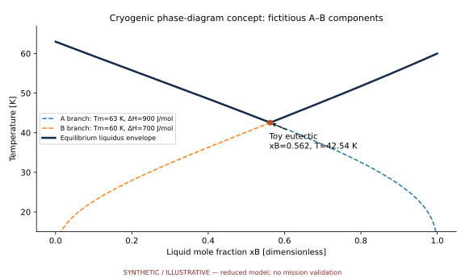

# A02 · NEW HORIZONS CRYOPHASE

**Original project:** Theory and simulation investigation of eutectic phase behavior on Pluto

**Session A:** Math, Physics & Chemistry

**Document class:** engineering research design and analysis record · **Revision:** 2 · **Date:** 2026-10-02

**Evidence state:** design basis, mathematical formulation and verification plan documented. Project-specific empirical results remain to be acquired; executable shared model demonstrations have their own recorded checks.

[Engineering document register](../../ENGINEERING_DOCUMENTATION.md) · [Session A handbook](../../documentation/SESSION_A.md) · [Previous: A01](../A/A01.md) · [Next: A03](../A/A03.md)

## Purpose and scientific objective

Proposed mission: develop an uncertainty-aware thermodynamic atlas of Pluto's nitrogen, methane, and carbon monoxide mixtures and ask which phase assemblages are compatible with remotely observed ice spectra. Preserve the original eutectic question while distinguishing liquid–solid eutectics from solid–solid coexistence, vapor equilibrium, and solid-state transformations at Pluto surface conditions.

**Question:** Which equilibria and metastable pathways could create compositionally segregated volatile deposits under Pluto's temperature, pressure, and seasonal forcing?

**Testable hypothesis:** A proposed nonideal mixture model will predict spatially varying solid coexistence and spectral band shifts more credibly than an ideal single-solid model; surface eutectic melting may prove irrelevant in the explored range.

## 1. Design basis and analysis boundary

The calculation boundary is a local nitrogen–methane–carbon-monoxide inventory with declared phases, pressure and temperature. Surface bulk composition is not set equal to atmospheric abundance. Outputs are equilibrium stability maps and seasonal assemblage trajectories with thermodynamic provenance; remote spectra provide an observation comparison rather than a unique composition measurement.

Reproduce published binary sections before ternary minimization. Compare globally searched Gibbs minima with common-tangent constructions, then couple only validated thermodynamic branches to a seasonal energy ledger. Kinetic segregation is a distinct extension with independently identified rates. Spectral inference additionally requires grain-size, optical-constant and instrument-response uncertainty.

## 2. Requirements and verification traceability

These are project design requirements or proposed analysis gates. A numerical target is not a NASA requirement unless its controlling source is explicitly identified. “TBD” identifies evidence required before a decision; it is not permission to assume a value. Verification evidence listed here is planned, unless a linked result explicitly records execution.

| ID | Requirement / gate | Engineering rationale | Verification method | Basis / required evidence |
| --- | --- | --- | --- | --- |
| A02-R1 | All solutions shall conserve every species and reject negative phase amounts. | A plausible minimum can still be infeasible. | Proposed residual target below 10^-8 of total molar inventory. | Numerical target; not laboratory precision. |
| A02-R2 | Equilibrium output shall retain competing minima and a stability assessment. | Local minima may represent metastability. | Multistart and tangent-plane comparisons. | Gibbs minimization; published phase sections. |
| A02-R3 | Proposed seasonal energy-closure target: 0.1% of integrated incident energy. | Latent/conductive sign errors mimic transitions. | Compare accumulated fluxes with storage change. | Proposed solver gate. |
| A02-R4 | Spectral comparisons shall declare temperature, composition and grain-size assumptions. | Band behavior is not uniquely compositional. | Repeat inference with alternate grain models. | PDS product context and optical nuisance model. |

## 3. Architecture and controlled interfaces

A phase database supplies reference energies and interaction parameters in J/mol over declared valid domains. The constrained solver receives T in K, P in Pa and species moles, returning phase amounts and chemical potentials. Mole-to-mass conversion uses species molar masses explicitly; all phases share compatible reference states.

A surface integrator advances temperature and signed outward sublimation flux. Assemblages enter an optical model before LEISA response convolution. PDS ingestion preserves product ID, observation geometry and band covariance. Missing optical constants prevent spectral validation while leaving thermodynamic conservation checks usable.


Phase selection couples to signed energy exchange, while spectra enter through a separate optical/instrument branch. Equilibrium and unique bulk composition are not inferred merely from band appearance.

[Editable engineering diagram source](../../visuals/projects/A02.mmd)

## 4. Mathematical model and derivation

### Governing equations

```text
G_total=sum_alpha n_alpha g_alpha(T,P,x_alpha), minimized subject to sum_alpha n_alpha x_i,alpha=n_i,total.
```

```text
mu_i,alpha=mu_i,beta for each species shared by equilibrium phases.
```

```text
g_mix=RT sum_i x_i ln x_i+sum_(i<j) L_ij(T)x_i x_j, an initial regular-solution approximation.
```

```text
C_eff dT/dt=Q_abs-Q_thermal-Q_conduction-sum_i L_sub,i dm_i/dt; latent terms use consistent signs and units.
```

### Variables, units and conventions

- T in K; P in Pa; phase amounts n in mol; mole fractions x; Gibbs energy g in J/mol.
- Interaction parameters L_ij and phase-specific reference functions; albedo, emissivity, thermal inertia, and sublimation flux.

### Assumptions and boundary conditions

- Published phase equilibria calibrate the equilibrium branch; kinetic segregation is a separate extension.
- Local surface composition is not assumed equal to atmospheric mixing ratios; grain size and irradiation may affect spectral inference.

### Derivation step 1

$$
g=\sum_i x_i g_i^0+RT\sum_i x_i\ln x_i+\sum_{i<j}L_{ij}x_ix_j
$$

Reference, entropy and excess contributions are J/mol. Use x ln x=0 at its zero limit and phase-specific reference functions when comparing solids and vapor.

### Derivation step 2

$$
\mu_i^\alpha=\partial G^\alpha/\partial n_i=\mu_i^\beta
$$

Species-balance Lagrange multipliers give chemical-potential equality for present phases; absent phases must also satisfy stability inequalities.

### Derivation step 3

$$
x_b=(1-f)x_\alpha+fx_\beta
$$

The binary lever rule yields f=(x_b-x_alpha)/(x_beta-x_alpha), independently checking optimizer amounts against a two-phase section.

### Derivation step 4

$$
C_A\dot T=F_{abs}-F_{emit}-F_{cond}-\sum_iL_i\dot m_{sub,i}
$$

C_A is J m^-2 K^-1; all RHS terms are W/m^2. Positive sublimation removes heat; negative condensation flux adds it.

### Inference or simulation procedure

Reproduce published binary phase sections before optimizing ternary Gibbs-energy models. Use common tangents or global constrained minimization to avoid spurious local minima. Couple a seasonal energy-balance model to phase stability and compare predicted assemblages to calibrated New Horizons LEISA band behavior. Carry temperature, optical constants, and interaction-parameter uncertainty through an ensemble; mark extrapolated regions explicitly.

### Validity domain and fidelity limits

New Horizons is primarily a flyby snapshot and spectra are not unique measurements of bulk composition. Sparse low-pressure laboratory data may leave multiple thermodynamic models observationally indistinguishable.

## 5. Data specifications and provenance

| Field | Type | Unit | Physical / statistical meaning | Quality and missing-data rule |
| --- | --- | --- | --- | --- |
| bulk_moles | vector<float64>[3] | mol | Conserved species inventory. | Nonnegative; fixed species order. |
| temperature | float64 | K | Surface/equilibrium state. | Positive; extrapolation flag required. |
| pressure | float64 | Pa | Declared environmental pressure. | Vacuum limit branch explicit. |
| interaction_covariance | matrix<float64> | (J/mol)^2 | Fitted excess-parameter covariance. | Symmetric positive semidefinite; unknown null. |
| phase_amounts | vector<float64> | mol | Named phase solution. | Absent phase zero; solver failure null. |
| reflectance | nullable<vector<float64>> | 1 | Instrument-band observation/prediction. | Wavelength and response version required. |
| sublimation_flux | vector<float64>[3] | kg m^-2 s^-1 | Signed outward mass flux. | Missing null, never substituted zero. |

[Machine-readable record schema](../../data/contracts/A02.schema.json) · [Empty acquisition CSV](../../data/contracts/A02.csv) · [Field dictionary CSV](../../data/contracts/A02.dictionary.csv)

The CSV above contains column headers only. Its schema defines future records and does not establish that original-team data or a particular archive product have been acquired. Frame, timing, calibration, covariance, selection and provenance details must accompany populated records.

### New Horizons Planetary Data System archive

[Product, archive or reference](https://pds-smallbodies.astro.umd.edu/data_sb/missions/newhorizons/index.shtml)

**Fields:** LEISA spectra, LORRI context images, observation geometry, instrument metadata, calibration products where available.

**Access:** Public archive; select exact product levels and read instrument documents. Portal access alone does not supply a ready phase-composition map.

**Role:** Observational comparison and geographic context.

### Published solid-phase equilibrium study

[Product, archive or reference](https://academic.oup.com/mnras/article/474/3/4254/4657184)

**Fields:** Binary/ternary phase regions and stated pressure-temperature assumptions.

**Access:** Article figures/tables; obtain machine-readable coefficients or document digitization uncertainty.

**Role:** Thermodynamic benchmark.

## 6. Uncertainty, sensitivity and identifiability

Interaction energies, local inventory, temperature and optical constants are jointly uncertain. A common spectral temperature calibration offset affects many pixels and must not be reduced as independent noise. Unrepresented solid phases, grain-scale disequilibrium and uncertain subsurface transport contribute discrepancy beyond parameter covariance.

Profile phase-boundary positions against interaction parameters and test whether reflectance distinguishes composition from temperature/grain size. Ensembles are needed near phase switches because first-order linear propagation can average incompatible assemblages. Report assemblage probabilities and extrapolated-domain flags; compare equilibrium and kinetic hypotheses without fitting unconstrained rate constants to a single snapshot.

## 7. Engineering trade study

| Alternative | Benefit | Cost / limitation | Decision rule |
| --- | --- | --- | --- |
| Binary tangents | Transparent phase boundaries. | Limited ternary topology. | Required reproduction baseline. |
| Global ternary minimization | Multiple competing assemblages. | Reference-energy and minimum sensitivity. | Accept after conservation and stability gates. |
| Kinetic extension | Represents seasonal lag. | Rates often poorly constrained. | Use only with evidence separating kinetics from equilibrium. |

## 8. Verification and validation cases

| Case ID | Stimulus / condition | Expected result / criterion | Method | Evidence artifact |
| --- | --- | --- | --- | --- |
| A02-V1 | Pure-species vertices | Entropy/excess mixing terms vanish. | Approach each pure endpoint analytically and numerically. | x ln x limit. |
| A02-V2 | Lever-rule section | Reconstructed bulk equals input within R1. | Compare tangent and constrained binary solutions. | Independent mass balance; execution pending. |
| A02-V3 | Closed thermal box | Zero boundary flux leaves temperature/inventory constant. | Disable forcing and refine integration step. | Species and energy conservation. |

**Execution status:** these cases are specified, not claimed as executed. Close a case only with the versioned inputs, output, uncertainty, reviewer and pass/fail rationale.

### Additional scientific validation gates

- Recover pure-component limits, mass balance, convexity of stable Gibbs envelopes, and published coexistence points.
- Proposed acceptance: phase-boundary residuals consistent with experimental uncertainty; no numerical negative phase amounts.
- Compare withheld spectral bands and geographic regions; disclose degeneracies rather than force a unique composition.

## 9. Implementation and reproducible work packages

1. Create phase_database.yaml with reference states and fitted domains.
2. Build gibbs_solver.py with multistart constraints and tangent fixtures.
3. Implement seasonal_balance.py with per-area ledgers.
4. Build leisa_adapter.py with archive IDs and response convolution.
5. Emit phase_boundary_ensemble.parquet with extrapolation masks.
6. Publish binary_reproduction.ipynb and separate equilibrium/kinetic manifests.

### Investigation sequence

1. Create a units-checked inventory of species, crystal phases, source functions, and experimental parameter ranges.
2. Fit competing ideal, regular, and more flexible solution models; retain all models supported by available data.
3. Compute phase sections over a proposed surface-relevant temperature-pressure envelope and then test warmer subsurface scenarios separately.
4. Translate phase assemblages into synthetic spectra with grain-size sensitivity; rank future laboratory measurements by expected information gain.

### Resources and interfaces to expertise

- Thermodynamic optimization software, planetary spectroscopy specialist, low-temperature laboratory partnership, and versioned PDS download manifest.

## 10. Failure modes and interpretation controls

| Failure mode | Effect on result | Detection / evidence | Design response |
| --- | --- | --- | --- |
| Local minimum accepted | Wrong assemblage map. | Lower competing minimum. | Global search and stability tests. |
| Mass/mole confusion | Incorrect inventories and mixture weights. | Lever-rule ledger failure. | Typed molar-mass conversions. |
| Latent sign reversed | Condensation falsely cools. | Energy-limit regression. | Signed outward-flux contract. |

- Calling every two-phase region a eutectic would misstate the physics.
- Extrapolated coefficients and unknown optical constants can dominate the apparent precision of maps.

## 11. Required engineering outputs

- Phase atlas with uncertainty bands, reproducible Gibbs minimizer, spectral compatibility maps, and a prioritized experimental campaign.

### Scientific result figures to produce during execution

Ternary composition triangle with phase domains, selected temperature sections, and observed-versus-synthetic spectra; extrapolation is hatched and uncertainty is shaded.

### Included shared numerical starting point



[Executable formulation, parameters, tabular outputs, provenance and verification](../../models/README.md). This shared demonstration has a narrower domain than the project model above. Its own caption and methods identify synthetic parameters or the separately retrieved public catalog; it is not a completed result of the original project.

## 12. Cited technical and scientific resources

- [Tan and Kargel, Solid-phase equilibria on Pluto's surface](https://academic.oup.com/mnras/article/474/3/4254/4657184) — Original treatment of N2–CH4–CO nonideal equilibrium and multiple solid/vapor assemblages.
- [PDS Small Bodies Node: New Horizons](https://pds-smallbodies.astro.umd.edu/data_sb/missions/newhorizons/index.shtml) — Official archive access and instrument/product documentation.

Framework and evidence rules: [engineering documentation standard](../../docs/ENGINEERING_STANDARD.md), [model assurance](../../docs/MODEL_ASSURANCE.md), [uncertainty procedure](../../docs/UNCERTAINTY_AND_DECISION_RULES.md), and [data management](../../docs/DATA_MANAGEMENT.md). NASA-inspired names are creative identifiers; requirements and results are not NASA certification.
