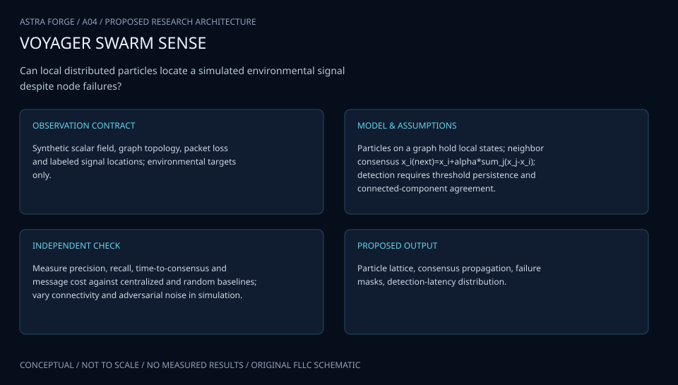

# A04 · APOLLO SWARM SENTINEL

**Original project:** Target Detection Using Algorithmic Matter

**Session A:** Math, Physics & Chemistry
**Status:** proposed research dossier; no project experiment or mission qualification has been performed.

Proposed mission: study how locally communicating programmable particles recognize a benign environmental target, share evidence, and collectively mark its boundary. Define the target as an inert test object or scientific feature. The contribution is a provable distributed algorithm plus an honest translation gap between the geometric amoebot model and realizable robot hardware.

## Scientific question

Which local sensing and communication rules permit reliable target detection despite asynchronous activation, sensor noise, particle failures, and limited memory?

## Testable hypothesis

Sequential evidence accumulation with connectivity-preserving coordination will reduce false collective detections relative to single-particle thresholds at comparable detection delay, within a defined noise model.



*Conceptual research design; arrows show the analysis dependency, not observed causation.*

## Mathematical model

```text
G=(V,E) is the time-dependent adjacency graph of particles on a hexagonal baseline lattice.
```

```text
ell_i(t)=sum_tau log[p(y_i,tau|H_1)/p(y_i,tau|H_0)], with thresholds chosen for specified false-alarm and miss rates.
```

```text
x(t+1)=W(t)x(t)+u(t) is a consensus abstraction; realizable finite-memory rules are analyzed separately.
```

```text
P_D=P(declare target|target present); P_FA=P(declare target|target absent).
```

### Variables and units

- n particles, local degree, observation y, bounded states, communication budget, activation schedule, failed-particle fraction.
- Target geometry, sensor sensitivity/specificity, correlation length, connectivity, detection latency, movement energy.

### Assumptions and boundary conditions

- Amoebot motion and communication primitives are mathematical abstractions; actual sensors and actuators need separate error models.
- Neighbor measurements may be correlated; independent-sample likelihoods are used only in explicitly independent synthetic cases.

### Inference or simulation method

Start with static object detection on a connected lattice, then extend to boundary localization and fault-aware information flow. State invariants for connectivity and evidence provenance. Prove termination and correctness under stated scheduler assumptions. Monte Carlo experiments explore noise and failures outside the proof's ideal conditions. A small robot or software-agent demonstration validates only the primitives it actually implements.

### Model limits

Theoretical round complexity is not physical time. Constant-memory restrictions may preclude exact global statistics, and connectivity guarantees can fail when arbitrary particles disappear.

## Data and provenance contracts

### ASU Self-Organizing Particle Systems research framework

[Resource or product discovery](https://labs.engineering.asu.edu/sops/amoebot/)

**Fields:** Formal model definitions, algorithmic primitives, and publication links.

**Access:** Public laboratory resource; locate simulator/code licenses separately.

**Role:** Model foundation, not measurements of a working material.

### Generated target/noise benchmark

[Resource or product discovery](https://arxiv.org/abs/2205.15412)

**Fields:** Lattice layouts, convex/nonconvex targets, activation schedules, observation seeds, failures, and event traces.

**Access:** Generate versioned test cases; linked paper supplies an asynchronous 3D coordination precedent rather than a target benchmark.

**Role:** Controlled robustness evaluation.

## Staged execution

1. Specify benign target classes, measurable detection requirements, sensor models, scheduler, and precise particle capabilities.
2. Develop finite-state local rules with explicit message types, evidence expiry, and disconnected-component behavior.
3. Compare threshold-only, leader-assisted, and distributed evidence aggregation baselines across target shapes and noise correlation.
4. Explore 3D and energy-constrained extensions only after the 2D algorithm passes proof and simulation review.

## Verification and validation

- Use invariant checking and model checking on small exhaustive systems before large simulations.
- Report receiver-operating curves, localization error, worst-case activation rounds, message counts, and energy estimates.
- Proposed gate: stated false-alarm bounds hold within confidence intervals on unseen noise seeds; publish counterexamples beyond assumptions.

*Any numerical gate is a proposed requirement unless the dossier explicitly identifies a sourced requirement. Freeze gates before collecting confirmatory data.*

## Resources and deliverables

- Distributed algorithms expertise, event-driven simulator, property checker, and optional tabletop modular robotics testbed.

- Formal specification, correctness argument, reproducible simulation suite, error/latency trade study, and boundary-detection animation.

## Risks and interpretation

- Simulation success is insufficient evidence that programmable matter hardware exists at the modeled scale.
- Unmodeled sensor correlation can create coordinated false positives; retain adversarial noise cases.

## Figure plan

Particles change color with local confidence, connectivity is overlaid, target boundaries appear only after the decision rule fires, and a sidebar shows false alarms, rounds, and energy.

## Cited scientific resources

- [Computing by Programmable Particles — ASU SOPS](https://labs.engineering.asu.edu/sops/amoebot/) — Research group's formal framework and distributed primitives.
- [Asynchronous Deterministic Leader Election in Three-Dimensional Programmable Matter](https://arxiv.org/abs/2205.15412) — Original asynchronous coordination model with explicitly stated geometric and scheduler conditions.
- [Energy-Constrained Programmable Matter Under Unfair Adversaries](https://arxiv.org/abs/2309.04898) — Original framework for accounting for locally distributed energy constraints.

Source discovery reviewed 2026-10-02. A public source pointer does not imply original student-team data access. See [model assurance](../../docs/MODEL_ASSURANCE.md) and [data management](../../docs/DATA_MANAGEMENT.md).
