# B05 · KEPLER BLOOMCLOCK — Restoration Timing Observatory

**Original project:** Phenology Data to Aid Pollinator Restoration

**Session B:** Earth & Environmental Engineering
**Status:** proposed research dossier; no project experiment or mission qualification has been performed.

Turn dated plant and pollinator observations into a decision tool for maintaining floral resources through heat, drought and seasonal transitions. Estimate flowering windows and uncertainty for locally suitable species, then choose restoration mixtures that minimize resource gaps. Keep observed phenophases, climate-model projections and assumed pollinator demand visibly distinct.

## Scientific question

Which locally adapted planting mixtures retain the most continuous flowering opportunity under observed variability and plausible warming/drought scenarios?

## Testable hypothesis

Mixtures optimized for complementary, uncertainty-aware bloom windows will leave fewer resource-gap days than mixtures selected from mean flowering dates alone.



*Conceptual research design; arrows show the analysis dependency, not observed causation.*

## Mathematical model

```text
GDD(t)=Σ_d≤t max[0,T_mean,d−T_base], in °C·day.
```

```text
P(bloom_s,d)=logit⁻¹[a_s+b_s GDD_d+c_s moisture_d+u_site].
```

```text
Gap(x)=Σ_d 1[Σ_s x_s P(bloom_s,d) r_s<D_d], evaluated over posterior/scenario draws.
```

### Variables and units

- x: planting area or abundance by species, m² or individuals.
- r: floral-resource proxy, resources per area per day, locally calibrated.
- D: demand proxy in the same resource units; not inferred directly from bloom counts.
- T_base: species-specific thermal threshold, °C; moisture includes precipitation/soil-water proxies.

### Assumptions and boundary conditions

- Repeated absence observations are informative; opportunistic presence records alone cannot define exact onset.
- Phenophase observations bracket flowering dates and may have observer/site bias.
- Urban irrigation and microclimate can break temperature-only relationships.

### Inference or simulation method

Model interval-censored onset and duration from repeated phenophase observations. Add weather, elevation and water availability through hierarchical models; compare growing-degree-day and flexible calendar baselines. Use posterior bloom probabilities in a constrained planting optimization with local suitability, water, cost and establishment limits. Treat demand curves as measured or scenario assumptions; evaluate resource-gap robustness rather than presenting flowering overlap as demonstrated reproductive success.

### Model limits

National datasets may omit desert species or have short local records. Flower presence does not directly measure nectar, pollen quality or successful pollination, and restoration establishment changes realized resources.

## Data and provenance contracts

### USA National Phenology Network observational data

[Resource or product discovery](https://nn.usanpn.org/data/observational)

**Fields:** Species, phenophases, observed presence/absence, site and observation dates.

**Access:** Public downloads with documentation; check reuse rules and uneven site effort.

**Role:** Observed timing and interval censoring.

### USGS managing to survive despite the weather: seeding decisions

[Resource or product discovery](https://www.usgs.gov/publications/managing-survive-despite-weather-seeding-decisions-affecting-simulated-dryland)

**Fields:** Weather-window and seedling-survival modeling framework.

**Access:** USGS publication; obtain author data/code where available.

**Role:** Establishment-aware scenario design, not new pollinator measurements.

## Staged execution

1. Stage 1: inventory local species coverage, calibrate survey definitions and estimate observer/site bias; flag candidates requiring new observations.
2. Stage 2: fit flowering models and evaluate mixtures over historical weather and clearly labeled climate scenarios with irrigation constraints.
3. Stage 3: monitor pilot restoration plots across full seasons and update the resource calendar with realized survival and flowering.

## Verification and validation

- Hold out sites and years; evaluate onset/duration error and probability calibration.
- Compare optimized mixtures with equal-cost conventional native mixtures under the same weather and survival draws.
- Measure flowering and pollinator visitation independently; preregister whether evidence supports timing alone or biological benefit.

*Any numerical gate is a proposed requirement unless the dossier explicitly identifies a sourced requirement. Freeze gates before collecting confirmatory data.*

## Resources and deliverables

- Restoration botanist, phenology observers and local meteorological records.
- rnpn/API tools, hierarchical statistics and a planting optimizer.

- Versioned flowering-probability calendar.
- Water/cost constrained mixture recommendations with intervals.
- Observation protocol and establishment-adjusted monitoring report.

## Risks and interpretation

- Extrapolation to species absent from local records.
- Confounding natural phenology with managed irrigation.
- Presenting scenario demand as measured ecological need.

## Figure plan

Show weekly flowering probabilities by species, aggregate mixture coverage and uncertain gap days; label observed versus projected years.

## Cited scientific resources

- [USA National Phenology Network observational data](https://nn.usanpn.org/data/observational) — Observed plant and animal phenophases and observation documentation; provides timing records, not automatic pollinator abundance estimates.
- [USGS managing to survive despite the weather: seeding decisions](https://www.usgs.gov/publications/managing-survive-despite-weather-seeding-decisions-affecting-simulated-dryland) — Primary simulation research supports weather windows and post-germination survival as distinct constraints.

Source discovery reviewed 2026-10-02. A public source pointer does not imply original student-team data access. See [model assurance](../../docs/MODEL_ASSURANCE.md) and [data management](../../docs/DATA_MANAGEMENT.md).
