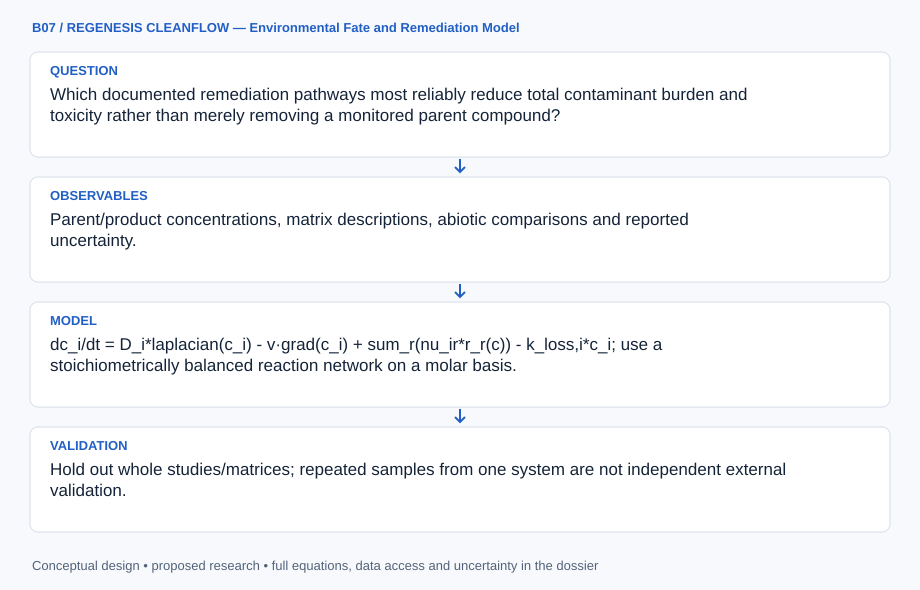

# B07 · REGENESIS CLEANFLOW — Environmental Fate and Remediation Model

**Original project:** Bioremediation of Insensitive Munitions Compounds

**Session B:** Earth & Environmental Engineering
**Status:** proposed research dossier; no project experiment or mission qualification has been performed.

Build an environmental remediation assessment for existing contaminated-water and soil records, centered on parent compounds, transformation products and mineralization evidence. The project evaluates cleanup effectiveness and residual toxicity from published or authorized analytical data. It excludes energetic-material synthesis, formulation and operational handling instructions.

## Scientific question

Which documented remediation pathways most reliably reduce total contaminant burden and toxicity rather than merely removing a monitored parent compound?

## Testable hypothesis

A model that tracks transformation products, sorption and redox history will predict residual exposure better than apparent first-order parent disappearance alone.



*Conceptual research design; arrows show the analysis dependency, not observed causation.*

## Mathematical model

```text
dc_i/dt = D_i*laplacian(c_i) - v·grad(c_i) + sum_r(nu_ir*r_r(c)) - k_loss,i*c_i; use a stoichiometrically balanced reaction network on a molar basis.
```

```text
n_C,recovered = sum_i N_C,i * [(C_i*V + S_i*m_soil)/MW_i] + n_C,gas + n_C,biomass; closure_C = n_C,recovered/n_C,initial, after converting all analyte masses to grams.
```

```text
Risk_index=sum_i C_i/C_benchmark,i, only where defensible environmental benchmarks exist; additivity is a screened assumption, not a proven mixture-toxicity model.
```

### Variables and units

- C_i: measured dissolved mass concentration mg/L; S_i: sorbed mass mg/kg; c_i: molar dissolved concentration mol/L after mass-unit conversion.
- MW_i: molar mass g/mol; N_C,i: carbon atoms per molecule; nu_ir: dimensionless signed molar stoichiometric coefficient; r_r: reaction rate mol/(L day).
- D_i: dispersion m^2/day; v: pore-water velocity m/day; k_loss,i: independently characterized loss day^-1.
- V: water volume L; m_soil: dry soil mass kg; n_C: mol of carbon atoms. Convert mg to g before division by MW; inventory gas, biomass and unmeasured pools separately.

### Assumptions and boundary conditions

- Disappearance may reflect sorption, dilution or incomplete analytical coverage.
- Published rate constants transfer only within documented matrix and environmental ranges.
- Missing toxicity benchmarks are retained as unresolved uncertainty, never treated as zero risk.
- Total recovered analyte mass is not conserved across different molecular transformation products. Element-specific molar accounting and pool completeness are required before interpreting closure or mineralization.
- Total recovered analyte mass is not conserved across different molecular transformation products. Element-specific molar accounting and pool completeness are required before interpreting closure or mineralization.

### Inference or simulation method

Extract concentration-time records, reporting limits, redox and matrix descriptors from primary remediation studies. Fit coupled stoichiometric parent/product molar-balance models with censored observations, compare biological and abiotic interpretations, and propagate kinetic/transport uncertainty into retrospective exposure estimates. Use literature-based scenario analysis for authorized remediation planning. Require independent product identification and carbon/nitrogen accounting before describing mineralization; do not infer complete cleanup from parent removal.

### Model limits

Sparse product coverage and inconsistent extraction recoveries may prevent mass closure. Published controlled-system results may not transfer to heterogeneous field sites, and mixture toxicity can violate additive risk assumptions.

## Data and provenance contracts

### Combined biological and abiotic reactions with iron and Fe(III)-reducing microorganisms for remediation

[Resource or product discovery](https://pubs.rsc.org/en/content/articlehtml/2015/ew/c4ew00062e)

**Fields:** Parent/product concentrations, matrix descriptions, abiotic comparisons and reported uncertainty.

**Access:** Open primary article; source data availability must be checked.

**Role:** Retrospective pathway fitting and controls.

### SERDP insensitive munitions environmental health, fate and transport resources

[Resource or product discovery](https://serdp-estcp.mil/resources/details/67fdfd78-7528-443c-a3f9-d7f109407801)

**Fields:** Government environmental-fate research and associated technical reports.

**Access:** Public SERDP resources; some underlying datasets need investigator requests.

**Role:** Environmental endpoint selection and evidence gaps.

## Staged execution

1. Stage 1: build a provenance-preserving literature data table and analytical-coverage map; separate observation from inferred transformation.
2. Stage 2: fit competing transport/reaction models and quantify parameter identifiability, reporting-limit effects and mass-balance uncertainty.
3. Stage 3: validate on an independent study or authorized site dataset and deliver a cleanup-evidence framework with explicit unresolved products.

## Verification and validation

- Hold out whole studies/matrices; repeated samples from one system are not independent external validation.
- Audit carbon-atom molar closure, gas/CO2/biomass pools and measured product accumulation; label unresolved pools. Recovered analyte mg alone cannot establish mineralization.
- Report concentration error, censored-likelihood fit and uncertainty coverage; require toxicity evidence before claiming detoxification.

*Any numerical gate is a proposed requirement unless the dossier explicitly identifies a sourced requirement. Freeze gates before collecting confirmatory data.*

## Resources and deliverables

- Environmental analytical chemist, remediation specialist and site data custodian.
- Censored-data statistics, reaction/transport solver and published method quality records.

- Environmental fate database and reaction-network model.
- Residual-exposure scenarios and analytical-gap map.
- Decision report distinguishing removal, transformation, mineralization and detoxification.

## Risks and interpretation

- Unmeasured persistent or toxic transformation products.
- Rate transfer across soils or redox environments.
- False cleanup confidence from inadequate analytical recovery.

## Figure plan

Show monitored parent-to-product pathways with uncertainty bands and separate dissolved, sorbed, unresolved and verified mineralized fractions.

## Cited scientific resources

- [Combined biological and abiotic reactions with iron and Fe(III)-reducing microorganisms for remediation](https://pubs.rsc.org/en/content/articlehtml/2015/ew/c4ew00062e) — Primary remediation study supports modeling multiple transformation pathways and abiotic controls.
- [SERDP insensitive munitions environmental health, fate and transport resources](https://serdp-estcp.mil/resources/details/67fdfd78-7528-443c-a3f9-d7f109407801) — Government research context for environmental transformation and uncertainty in insensitive munitions compounds.

Source discovery reviewed 2026-10-02. A public source pointer does not imply original student-team data access. See [model assurance](../../docs/MODEL_ASSURANCE.md) and [data management](../../docs/DATA_MANAGEMENT.md).
