# B19 · PARKER PLASMA WHISPER — Electron Structure Observatory

**Original project:** Investigation of Electron Parameters and Association with Structures using Quasi-thermal Noise Spectroscopy (QTN)

**Session B:** Earth & Environmental Engineering

**Document class:** engineering research design and analysis record · **Revision:** 2 · **Date:** 2026-10-02

**Evidence state:** design basis, mathematical formulation and verification plan documented. Project-specific empirical results remain to be acquired; executable shared model demonstrations have their own recorded checks.

[Engineering document register](../../ENGINEERING_DOCUMENTATION.md) · [Session B handbook](../../documentation/SESSION_B.md) · [Previous: B18](../B/B18.md) · [Next: B20](../B/B20.md)

## Purpose and scientific objective

Infer electron density and temperature from Parker Solar Probe quasi-thermal noise measurements, then test their association with independently defined plasma structures. Keep spectral-fit uncertainty, antenna configuration and non-Maxwellian assumptions visible. Structure comparisons account for heliocentric distance and spacecraft sampling so ordinary radial evolution is not misidentified as a structural effect.

**Question:** Which electron-parameter changes persist across plasma-structure boundaries after radial trends, instrument state and solar-wind context are controlled?

**Testable hypothesis:** Some structures may show repeatable density/temperature contrasts, but part of the apparent association will disappear after antenna-state and radial-baseline adjustment.

## 1. Design basis and analysis boundary

The electron-parameter system audits Parker Solar Probe FIELDS quasi-thermal-noise products, or accessible calibrated spectra, and compares inferred electron properties with independently defined plasma structures. Released density/temperature products and raw spectral refitting are separate fidelity levels. Heliocentric distance and encounter context are required to distinguish ordinary radial evolution from structure associations.

Begin with the official simplified-QTN metadata, quality flags and unit conventions. Refit spectra only if antenna state and receiver/shot-noise information support an identified forward model. Published non-Maxwellian analysis motivates sensitivity checks, not an assumption that every simplified product measures halo parameters. Spacecraft crossings provide time-series samples and cannot alone reconstruct three-dimensional structures.

## 2. Requirements and verification traceability

These are project design requirements or proposed analysis gates. A numerical target is not a NASA requirement unless its controlling source is explicitly identified. “TBD” identifies evidence required before a decision; it is not permission to assume a value. Verification evidence listed here is planned, unless a linked result explicitly records execution.

| ID | Requirement / gate | Engineering rationale | Verification method | Basis / required evidence |
| --- | --- | --- | --- | --- |
| B19-R1 | Every interval shall retain data level, cadence, antenna/bias state, receiver response and quality flags. | Instrument state changes alter spectral inference. | Metadata/product audit. | SPASE/FIELDS documentation. |
| B19-R2 | Density shall use one explicit SI or cm^-3 convention and temperature shall preserve K/eV conversion. | Plasma-frequency conversions are easy to mis-scale. | Analytic unit fixture. | Existing plasma-frequency model. |
| B19-R3 | Structure boundaries shall be defined independently of the QTN response being tested. | Response-selected intervals create circular association. | Boundary-source and selection audit. | Proposed study design. |
| B19-R4 | Hold out complete encounters and match radial/context ranges; unconstrained temperature/tail parameters shall be flagged. | Radial trends and fit degeneracy mimic structure effects. | Encounter-fold and likelihood-profile checks. | Primary QTN context. |

## 3. Architecture and controlled interfaces

A product adapter preserves archive time tags, declared UTC conversion, frequency bins Hz and voltage spectral density V²/Hz. Instrument metadata include antenna geometry and bias/configuration. A separate ephemeris adapter supplies heliocentric distance in a declared AU normalization, while magnetic/plasma context provides independently reviewed structure intervals.

The inference branch either consumes released simplified-QTN fields or fits a calibrated spectral model with receiver and shot-noise terms. Parameter covariance and unsupported-fit flags pass to a matched-interval estimator. Cadence alignment records averaging windows rather than duplicating low-rate QTN values as independent fast samples. Missing antenna metadata blocks complex spectral fits but not a qualified released-product audit.



The diagram distinguishes released QTN products from conditional spectral refitting and independent structure selection. Radial matching and covariance gates support association estimates without implying unique electron distributions or three-dimensional structure reconstruction.

[Editable engineering diagram source](../../visuals/projects/B19.mmd)

## 4. Mathematical model and derivation

### Governing equations

```text
f_pe=(1/2π) sqrt(n_e e²/(ε0 m_e)); n_e≈(f_pe/8980 Hz)² cm⁻³.
```

```text
S_V(f)=S_QTN(f;n_e,T_core,T_halo,antenna)+S_shot+S_receiver.
```

```text
log T_e=a+b log r+β structure+γᵀ context+u_encounter+ε.
```

### Variables, units and conventions

- f: Hz; n_e: m⁻³ in SI formula or cm⁻³ in calibrated approximation.
- T: K or eV with explicit Boltzmann conversion.
- S_V: V²/Hz; r: normalized heliocentric distance.
- Structure boundaries: UTC intervals with independent magnetic/plasma definitions.

### Assumptions and boundary conditions

- Antenna bias/configuration and receiver response alter inferred spectra.
- Simplified QTN products may not constrain suprathermal populations uniquely.
- Spacecraft crossings provide time samples, not direct 3D structure images.

### Derivation step 1

```text
f_pe=(1/(2pi)) sqrt(n_e e²/(epsilon0 m_e)).
```

SI electron density is m^-3 and frequency Hz; n_cm^-3=n_m^-3/10^6 gives the approximately 8980 Hz sqrt(n_cm^-3) relation.

### Derivation step 2

```text
n_e=(2pi f_pe)^2 epsilon0 m_e/e²; sigma_n/n approximately 2 sigma_f/f.
```

The relative-error approximation requires a well-identified peak and small errors; calibration/model discrepancy is added separately.

### Derivation step 3

```text
S_V=S_QTN(n,T_core,T_halo,antenna)+S_shot+S_receiver.
```

All spectra use V²/Hz. Instrument and distribution parameters can be degenerate, so the fit is not valid merely because a numerical optimizer returns values.

### Derivation step 4

```text
log T_e=a+b log(r/r0)+beta structure+gamma^T context+u_encounter+epsilon.
```

r/r0 is dimensionless. beta is a conditional log-temperature contrast evaluated on independent encounter/radial support.

### Inference or simulation procedure

Audit Level-3 metadata and flags before fitting accessible spectra or using released density/temperature products. Compare Maxwellian and supported non-Maxwellian fits, estimate uncertainties and reject poorly constrained cases. Match structures to nearby background intervals within encounters and radial ranges; reserve independent encounters for validation. Include magnetic/velocity context from authorized public mission products, while recording cadence mismatches and structure-definition sensitivity.

### Validity domain and fidelity limits

Unresolved distribution tails and shot noise can bias temperature. Independent structure lists and magnetic/plasma products require their own calibration audit; statistical association does not prove structure formation physics.

## 5. Data specifications and provenance

| Field | Type | Unit | Physical / statistical meaning | Quality and missing-data rule |
| --- | --- | --- | --- | --- |
| product_key | string | none | Exact QTN level/version/interval. | Checksums and archive flags retained. |
| frequency | float[] | Hz | Spectral bin coordinates. | Monotone with receiver response key. |
| voltage_psd | nullable float[] | V²/Hz | Calibrated spectrum when available. | Noise/antenna metadata required. |
| electron_density | nullable float | m^-3 | Released or fitted electron density. | Method and units explicit. |
| electron_temperature | nullable float | K or eV | Declared core/effective temperature. | Distribution definition and conversion saved. |
| heliocentric_distance | float | AU | Encounter radial context. | Ephemeris/time alignment recorded. |
| structure_interval | datetime[2] | UTC | Independent boundary definition. | Source/cadence uncertainty retained. |
| parameter_covariance | matrix | mixed | Joint fit/released-product uncertainty. | PSD/support flags and correlations preserved. |

[Machine-readable record schema](../../data/contracts/B19.schema.json) · [Empty acquisition CSV](../../data/contracts/B19.csv) · [Field dictionary CSV](../../data/contracts/B19.dictionary.csv)

The CSV above contains column headers only. Its schema defines future records and does not establish that original-team data or a particular archive product have been acquired. Frame, timing, calibration, covariance, selection and provenance details must accompany populated records.

### SPASE PSP FIELDS Level 3 simplified quasi-thermal noise metadata

[Product, archive or reference](https://spase-metadata.org/CNES/NumericalData/CDPP-Archive/PSP/FIELDS/RFS/LFR/PARKERSP_FIELDS_RFS_SQTN.html)

**Fields:** Density/temperature products, frequency coverage, processing level and antenna metadata.

**Access:** Public SPASE metadata links to archive; check release coverage and CDF flags.

**Role:** Observed electron products and provenance.

### Radial evolution of non-Maxwellian electron populations from QTN spectroscopy

[Product, archive or reference](https://doi.org/10.3847/1538-4357/ad7d05)

**Fields:** Primary QTN fitting and non-Maxwellian/radial analysis.

**Access:** Publisher DOI; consult data/code access statement.

**Role:** Alternative model and systematic-error design.

## 6. Uncertainty, sensitivity and identifiability

Receiver response, shot noise and antenna bias can overlap the temperature-sensitive spectral shape. Profile nuisance and plasma parameters jointly, inspect Fisher/sensitivity singular values and mark unconstrained tails. Frequency-bin errors may be correlated through calibration, and released-product uncertainty cannot be replaced by repeated sampling of one interpolated value.

Structure association is confounded by heliocentric distance, encounter and spacecraft sampling. Match nearby background intervals under declared radial/context bounds and vary independent boundary definitions. Bootstrap full structures or encounters rather than individual spectra. Compare supported distribution models, while recognizing that model agreement cannot independently establish the mechanism forming a plasma structure.

## 7. Engineering trade study

| Alternative | Benefit | Cost / limitation | Decision rule |
| --- | --- | --- | --- |
| Released simplified-QTN products | Efficient documented density/temperature access. | Limited distribution information. | Default when spectral metadata is incomplete. |
| Calibrated Maxwellian spectral fit | Transparent reduced forward model. | May miss non-Maxwellian populations. | Use as a supported baseline. |
| Supported non-Maxwellian fit | Tests distribution sensitivity. | Tail/antenna degeneracy may be severe. | Adopt only with identified parameters and metadata. |

## 8. Verification and validation cases

| Case ID | Stimulus / condition | Expected result / criterion | Method | Evidence artifact |
| --- | --- | --- | --- | --- |
| B19-V1 | Density conversion | n=1 cm^-3=10^6 m^-3. | Condition/fixture: f_pe=8980 Hz in the declared approximate relation. Verification procedure: Independent SI/approximation comparison.. | Independent SI/approximation comparison. |
| B19-V2 | Frequency doubling | Density increases by factor four. | Condition/fixture: Double f_pe with all constants fixed. Verification procedure: Analytic scaling test.. | Analytic scaling test. |
| B19-V3 | Temperature units | T=e/k_B K, approximately 11604.5 K. | Condition/fixture: Use a declared 1 eV electron temperature. Verification procedure: Constant-version unit check.. | Constant-version unit check. |
| B19-V4 | Encounter holdout | Report density/temperature residuals and conditional contrast stability. | Condition/fixture: Reserve entire encounters and independent structures. Verification procedure: Blocked analysis.. | Blocked analysis. |

**Execution status:** these cases are specified, not claimed as executed. Close a case only with the versioned inputs, output, uncertainty, reviewer and pass/fail rationale.

### Additional scientific validation gates

- Synthetic spectra test recovery and parameter degeneracy.
- Hold out encounters and whole structures; evaluate calibrated intervals and boundary-definition sensitivity.
- Compare density with independent plasma estimates where valid, and test contrasts against randomly shifted control boundaries.

## 9. Implementation and reproducible work packages

1. Create QTN product-level and instrument-state manifests from official metadata.
2. Implement density/temperature/PSD unit and cadence adapters.
3. Audit independent structure definitions and ephemeris alignment.
4. Fit only supported spectral branches with covariance and identifiability artifacts.
5. Build matched background intervals and encounter-level folds.
6. Release conditional association plots with distribution and sampling limitations.

### Investigation sequence

1. Stage 1: inventory encounters, antenna states and independent structure definitions; document time/unit alignment.
2. Stage 2: fit or audit electron parameters and matched-boundary contrasts with radial/instrument controls.
3. Stage 3: validate withheld encounters and publish an uncertainty-bearing structure/electron catalog.

### Resources and interfaces to expertise

- Heliophysics scientist, QTN specialist and CDF/time-series tools.
- PSP archive metadata and independently calibrated magnetic/plasma products.

## 10. Failure modes and interpretation controls

| Failure mode | Effect on result | Detection / evidence | Design response |
| --- | --- | --- | --- |
| Cadence duplication | Overstated sample precision. | Unique-window/sample count audit. | Carry averaging support. |
| Radial trend called structure effect | Spurious association. | Matched radial-control comparison. | Encounter/radius covariates. |
| Unconstrained spectral tails | False halo temperature precision. | Profile/sensitivity rank check. | Simplify or flag unsupported fits. |

- Density-unit conversion errors.
- Antenna/shot-noise systematics masquerading as structures.
- Temporal correlations and uncertain structure boundaries.

## 11. Required engineering outputs

- Encounter/antenna audit and spectral model notebook.
- Electron-structure catalog with fit flags.
- Radial-control and uncertainty report.

### Scientific result figures to produce during execution

Show QTN spectra/fits, electron intervals and independently defined boundaries; compare radial-adjusted event stacks with shifted controls.

## 12. Cited technical and scientific resources

- [SPASE PSP FIELDS Level 3 simplified quasi-thermal noise metadata](https://spase-metadata.org/CNES/NumericalData/CDPP-Archive/PSP/FIELDS/RFS/LFR/PARKERSP_FIELDS_RFS_SQTN.html) — Official measurement range, processing level and provenance support electron-density and temperature data selection.
- [Radial evolution of non-Maxwellian electron populations from QTN spectroscopy](https://doi.org/10.3847/1538-4357/ad7d05) — Primary PSP analysis supports distribution-model and antenna-state sensitivity checks.

Framework and evidence rules: [engineering documentation standard](../../docs/ENGINEERING_STANDARD.md), [model assurance](../../docs/MODEL_ASSURANCE.md), [uncertainty procedure](../../docs/UNCERTAINTY_AND_DECISION_RULES.md), and [data management](../../docs/DATA_MANAGEMENT.md). NASA-inspired names are creative identifiers; requirements and results are not NASA certification.
