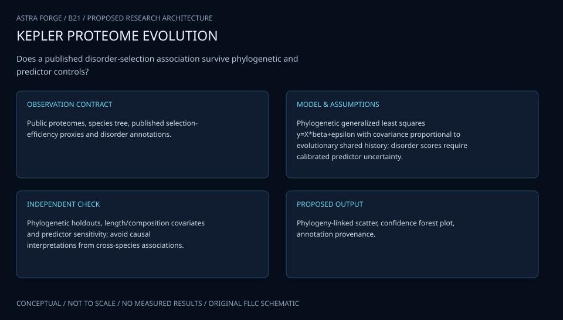

# B21 · PROTEUS DRIFTSCAPE — Evolutionary Protein Disorder

**Original project:** More Effectively Selective Species Have Greater Protein Structural Disorder

**Session B:** Earth & Environmental Engineering
**Status:** proposed research dossier; no project experiment or mission qualification has been performed.

Test the comparative association between selection efficacy and predicted intrinsic disorder using homologous domains and phylogenetically controlled statistics. Reproduce the published corrected codon-bias framework before extending it to new vertebrate clades. Distinguish predicted disorder, measured structure and mutational robustness; none is a direct synonym for another.

## Scientific question

Does greater selection efficacy predict disorder within homologous protein domains after GC, composition, domain age and phylogeny are controlled?

## Testable hypothesis

A positive association may persist in matched domains, but predictor calibration, amino-acid composition and shared ancestry could explain part of the cross-species signal.



*Conceptual research design; arrows show the analysis dependency, not observed causation.*

## Mathematical model

```text
D_KL(p||q)=Σ_c p_c log(p_c/q_c), conceptual codon-divergence term; implement published CAIS normalization exactly.
```

```text
Disorder_fraction=Σ_residue I(score>threshold)/L, with threshold sensitivity.
```

```text
logit(DomainDisorder_ds)=α_d+β Efficacy_s+γᵀ covariates_ds+phylogenetic_effect_s+ε_ds.
```

### Variables and units

- Efficacy: published corrected codon-bias index, dimensionless; not census size.
- L: homologous-domain residues; disorder fraction: 0–1.
- GC/composition: fractions; phylogeny: branch lengths with documented units.
- β: conditional comparative association, not a causal fitness coefficient.

### Assumptions and boundary conditions

- Homology/alignment quality must be reviewed.
- Disorder predictors may inherit composition/training biases.
- Effective population size proxies and selection efficacy need not coincide.

### Inference or simulation method

Freeze proteome/domain versions, reproduce CAIS and control GC/amino-acid effects according to the primary study. Compare multiple disorder predictors and homologous-domain matched effects using phylogenetic mixed models. Partition within-domain versus changing-domain-composition explanations, propagate alignment/predictor uncertainty and reserve clades for out-of-sample testing. Include negative-control sequence shuffles preserving composition and assess whether an association reflects biology or predictor construction.

### Model limits

Predictions cannot establish experimental disorder or adaptive mechanism. Clade sampling and annotation quality vary; selection-efficiency proxies require explicit calibration and cannot infer fitness advantages alone.

## Data and provenance contracts

### Protein domains in vertebrate species with more effective selection have greater intrinsic disorder

[Resource or product discovery](https://pmc.ncbi.nlm.nih.gov/articles/PMC11379457/)

**Fields:** Published domain/proteome analysis, CAIS definition and linked data.

**Access:** Open primary article; freeze associated data/code releases.

**Role:** Reproduction and hypothesis benchmark.

### UniProt proteome documentation

[Resource or product discovery](https://www.uniprot.org/help/proteome)

**Fields:** Proteome identities, sequences and annotation metadata.

**Access:** Public UniProt; record release/version, completeness and license.

**Role:** Independent or expanded comparative sequence inputs.

## Staged execution

1. Stage 1: reproduce published index/domain analyses and audit sequence/alignment coverage.
2. Stage 2: compare phylogenetic, composition and predictor alternatives with uncertainty-aware domain matching.
3. Stage 3: evaluate held-out clades and release a reproducible association atlas with predictor limitations.

## Verification and validation

- Hold out entire clades/domains; avoid splitting homologous records as independent samples.
- Run composition-preserving negative controls and alignment-quality sensitivity.
- Report effect intervals, out-of-clade calibration and agreement across predictors; reserve experimental structure evidence for separate validation.

*Any numerical gate is a proposed requirement unless the dossier explicitly identifies a sourced requirement. Freeze gates before collecting confirmatory data.*

## Resources and deliverables

- Evolutionary geneticist, protein-bioinformatics specialist and statistical reviewer.
- Versioned proteomes/domains, phylogenies, predictors and published CAIS code.

- Reproduction notebook and comparative-data manifest.
- Phylogenetic association/negative-control results.
- Domain/clade atlas with uncertainty and annotation gaps.

## Risks and interpretation

- Shared ancestry and annotation bias.
- Composition-driven predictor artifacts.
- Conflating disorder, robustness and organismal adaptation.

## Figure plan

Show domain-matched disorder contrasts on a phylogeny and effect intervals across predictors, clades and negative controls.

## Cited scientific resources

- [Protein domains in vertebrate species with more effective selection have greater intrinsic disorder](https://pmc.ncbi.nlm.nih.gov/articles/PMC11379457/) — Primary comparative study defines the association being tested; predicted disorder is not experimental confirmation of structure.
- [UniProt proteome documentation](https://www.uniprot.org/help/proteome) — Official sequence/proteome definitions and release metadata support versioned comparative inputs.

Source discovery reviewed 2026-10-02. A public source pointer does not imply original student-team data access. See [model assurance](../../docs/MODEL_ASSURANCE.md) and [data management](../../docs/DATA_MANAGEMENT.md).
