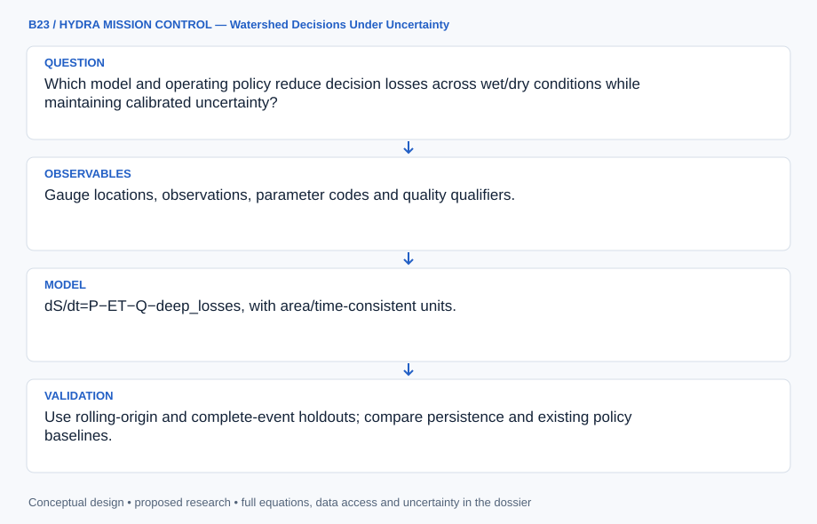

# B23 · HYDRA MISSION CONTROL — Watershed Decisions Under Uncertainty

**Original project:** Modeling to Make a Difference: Hydrologic Analysis for Improved Decision Support

**Session B:** Earth & Environmental Engineering
**Status:** proposed research dossier; no project experiment or mission qualification has been performed.

Build watershed decision support around explicit choices, costs and hydrologic forecast uncertainty. Select one real management use, such as drought withdrawals or flood-response thresholds, before model development. Score success by decision performance as well as hydrograph fit; a statistically stronger forecast can still fail if it arrives too late or obscures tradeoffs.

## Scientific question

Which model and operating policy reduce decision losses across wet/dry conditions while maintaining calibrated uncertainty?

## Testable hypothesis

A parsimonious, well-calibrated ensemble may support better decisions than a more complex single forecast, especially when user costs and asymmetric errors are explicit.



*Conceptual research design; arrows show the analysis dependency, not observed causation.*

## Mathematical model

```text
dS/dt=P−ET−Q−deep_losses, with area/time-consistent units.
```

```text
Q_t=f(S_t,P_t,parameters)+ε_t; observation error is modeled separately.
```

```text
a*=argmin_a Σ_scenario P(scenario|data) L(a,scenario); assess regret and robustness.
```

### Variables and units

- P/ET/storage: mm or mm/day; Q: m³/s after catchment-area conversion.
- a: withdrawal/alert/operation decision with stated units.
- L: stakeholder-defined monetary or service/ecological loss.
- Probabilities and intervals: calibrated against withheld events.

### Assumptions and boundary conditions

- Rating-curve uncertainty and station changes affect reference streamflow.
- Calibration and operational thresholds must use separate evidence periods.
- Stakeholder losses are value judgments, not inferred from rainfall alone.

### Inference or simulation method

Join quality-controlled gauge data, precipitation, evapotranspiration and watershed characteristics. Compare persistence, rainfall-runoff and ensemble alternatives using chronological training windows. Translate forecasts into explicit policies through stakeholder-defined loss functions and stress-test under historical extremes and labeled climate scenarios. Track data latency and missing gauges. Record uncertainty from forcing, parameters, structure and observations separately, then evaluate whether additional complexity changes decisions meaningfully.

### Model limits

Ungauged transfer and changing land cover can invalidate calibration. Historical skill is not guaranteed under new extremes; decision weights and future forcing remain uncertain.

## Data and provenance contracts

### USGS Water Data API documentation

[Resource or product discovery](https://api.waterdata.usgs.gov/docs/)

**Fields:** Gauge locations, observations, parameter codes and quality qualifiers.

**Access:** Public USGS APIs; record current endpoints, request limits and station coverage.

**Role:** Observed calibration/validation flows.

### USGS hydrologic drought decision support system

[Resource or product discovery](https://pubs.usgs.gov/of/2014/1003/pdf/ofr2014-1003.pdf)

**Fields:** Published drought decision-support structure and operating considerations.

**Access:** Public USGS report; local operating constraints require stakeholder input.

**Role:** Decision framing and policy baseline.

## Staged execution

1. Stage 1: define decision owner, lead time, acceptable errors and losses; audit data/rating curves and freeze temporal splits.
2. Stage 2: fit calibrated hydrologic ensembles and compare decision policies across plausible costs and forcing.
3. Stage 3: replay withheld droughts/floods and release an operational prototype with threshold provenance and monitoring ownership.

## Verification and validation

- Use rolling-origin and complete-event holdouts; compare persistence and existing policy baselines.
- Report flow/volume/peak error, interval coverage and decision loss/regret separately.
- Test missing data, latency, rating-curve uncertainty and extremes outside training range; calibrate failure/abstention states.

*Any numerical gate is a proposed requirement unless the dossier explicitly identifies a sourced requirement. Freeze gates before collecting confirmatory data.*

## Resources and deliverables

- Hydrologist, decision owner and local operations/ecology reviewers.
- USGS data tools, rainfall-runoff solver, ensemble statistics and versioned loss definitions.

- Watershed data/uncertainty cube.
- Forecast-to-decision notebook and policy comparison.
- Prototype dashboard with alert evidence and limitations.

## Risks and interpretation

- Overfitting a convenient hydrograph metric.
- Nonstationarity and biased reference flows.
- Unagreed losses or unsupported operational reliance.

## Figure plan

Display observed/forecast flows and intervals, policy actions and accumulated loss for withheld events; allow transparent scenario/weight comparisons.

## Cited scientific resources

- [USGS Water Data API documentation](https://api.waterdata.usgs.gov/docs/) — Official observed-water-data endpoints and metadata support quality-controlled gauge extraction.
- [USGS hydrologic drought decision support system](https://pubs.usgs.gov/of/2014/1003/pdf/ofr2014-1003.pdf) — Primary decision-support method supports explicit operations, thresholds and hydrologic uncertainty.

Source discovery reviewed 2026-10-02. A public source pointer does not imply original student-team data access. See [model assurance](../../docs/MODEL_ASSURANCE.md) and [data management](../../docs/DATA_MANAGEMENT.md).
