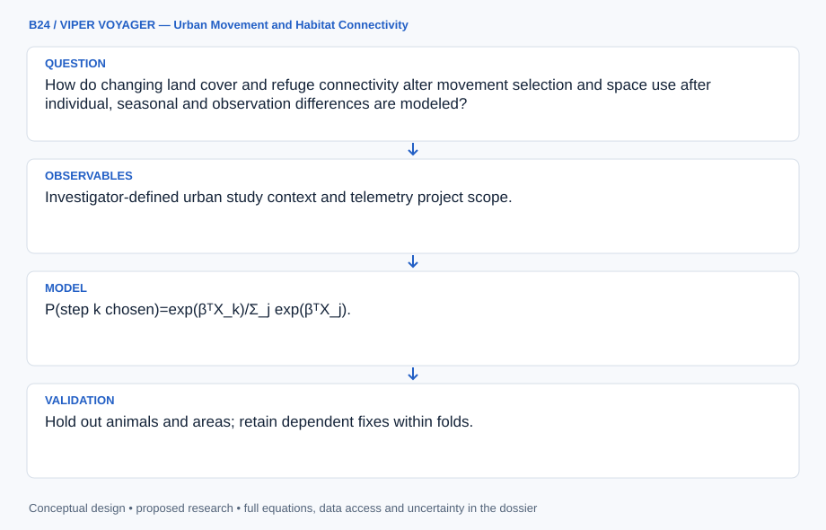

# B24 · VIPER VOYAGER — Urban Movement and Habitat Connectivity

**Original project:** Using GIS to Quantify Effects of Land Cover Change on Movement Patterns of Tiger Rattlesnakes in an Urbanizing Environment

**Session B:** Earth & Environmental Engineering
**Status:** proposed research dossier; no project experiment or mission qualification has been performed.

Quantify tiger rattlesnake movement against dated land-cover changes while respecting wildlife permissions and sensitive-location controls. Separate available habitat, chosen steps, movement rate and survival instead of interpreting a home-range change as a single urbanization effect. Produce generalized connectivity recommendations and restricted scientific telemetry products.

## Scientific question

How do changing land cover and refuge connectivity alter movement selection and space use after individual, seasonal and observation differences are modeled?

## Testable hypothesis

Refuge access, impervious barriers and season-specific habitat use may explain movement better than development proportion alone, with strong individual variation.



*Conceptual research design; arrows show the analysis dependency, not observed causation.*

## Mathematical model

```text
P(step k chosen)=exp(βᵀX_k)/Σ_j exp(βᵀX_j).
```

```text
log step_length_it=α_i+β land_change_it+season_t+γ weather_t+ε_it.
```

```text
R_path=Σ_edges resistance_e×length_e; resistance learned or sensitivity-tested.
```

### Variables and units

- Step lengths/road distances: m; fix interval: hours or days.
- Land cover: dated fractions/classes at stated pixel resolution.
- Home range: km² under documented estimator/settings.
- Resistance: relative cost, not a measured physical energy without calibration.

### Assumptions and boundary conditions

- Sparse telemetry cannot resolve every route or crossing.
- Land-cover acquisition dates must align with observed movement.
- Precise refuge coordinates and handling require authorized access/trained personnel.

### Inference or simulation method

Use authorized telemetry and independently dated GIS cover histories, propagating location error and fix gaps. Generate matched available steps from individual movement distributions; fit integrated step-selection and hierarchical movement models. Evaluate cover transitions and connectivity at multiple defensible scales, comparing road/development-only and refuge-aware explanations. Keep core-use and range-area estimates separate. Apply spatial aggregation and suppression before sharing maps outside the research team.

### Model limits

Rare-species samples and urban development selection can limit causality. Home-range estimators depend on fix cadence; a correlated cover change does not demonstrate a demographic or mitigation benefit.

## Data and provenance contracts

### University of Arizona Stone Canyon Project

[Resource or product discovery](https://herpetology.arizona.edu/content/stone-canyon-project.html)

**Fields:** Investigator-defined urban study context and telemetry project scope.

**Access:** Public project page; raw telemetry requires investigator permission and governance.

**Role:** Study identity and access route.

### Tiger rattlesnake urban movement study, Conservation Science and Practice

[Resource or product discovery](https://conbio.onlinelibrary.wiley.com/doi/10.1111/csp2.70313)

**Fields:** Published movement/space-use endpoints and field context.

**Access:** Primary publisher paper; follow its data availability restrictions.

**Role:** Independent design/benchmark.

### NASA Harmonized Landsat Sentinel-2 data

[Resource or product discovery](https://hls.gsfc.nasa.gov/hls-data/)

**Fields:** Dated reflectance and vegetation-quality layers.

**Access:** Public NASA imagery; small refuges may require finer permitted mapping.

**Role:** Land-change context.

## Staged execution

1. Stage 1: establish telemetry permissions, align dates and audit fix errors/land-cover resolution.
2. Stage 2: fit selection/movement models and uncertainty-aware connectivity across scales.
3. Stage 3: validate withheld animals/areas and publish generalized mitigation candidates with a prospective monitoring design.

## Verification and validation

- Hold out animals and areas; retain dependent fixes within folds.
- Validate GIS classes independently and test location-error/missing-fix sensitivity.
- Compare range estimates across defensible cadence/settings; report confidence intervals and distinguish prediction from causal intervention effects.

*Any numerical gate is a proposed requirement unless the dossier explicitly identifies a sourced requirement. Freeze gates before collecting confirmatory data.*

## Resources and deliverables

- Herpetologist, GIS/movement analyst and land-planning partner.
- Restricted telemetry repository, GIS classification and step-selection tools.

- Dated habitat/telemetry crosswalk and quality report.
- Movement/connectivity models with uncertainty.
- Aggregated planning map and data-governance rules.

## Risks and interpretation

- Sensitive refuge exposure or wildlife disturbance.
- Cadence/individual bias and inaccurate small-habitat mapping.
- Connectivity scores overinterpreted as survival gains.

## Figure plan

Show aggregated habitat transitions and corridor uncertainty publicly; reserve individual tracks/refuges for approved access.

## Cited scientific resources

- [University of Arizona Stone Canyon Project](https://herpetology.arizona.edu/content/stone-canyon-project.html) — Investigator description establishes the urban herpetofauna study context; telemetry access and permissions are separate requirements.
- [Tiger rattlesnake urban movement study, Conservation Science and Practice](https://conbio.onlinelibrary.wiley.com/doi/10.1111/csp2.70313) — Primary Stone Canyon research supports movement and space-use endpoints in an urbanizing landscape.
- [NASA Harmonized Landsat Sentinel-2 data](https://hls.gsfc.nasa.gov/hls-data/) — Surface reflectance and quality layers support reproducible landscape and vegetation monitoring.

Source discovery reviewed 2026-10-02. A public source pointer does not imply original student-team data access. See [model assurance](../../docs/MODEL_ASSURANCE.md) and [data management](../../docs/DATA_MANAGEMENT.md).
