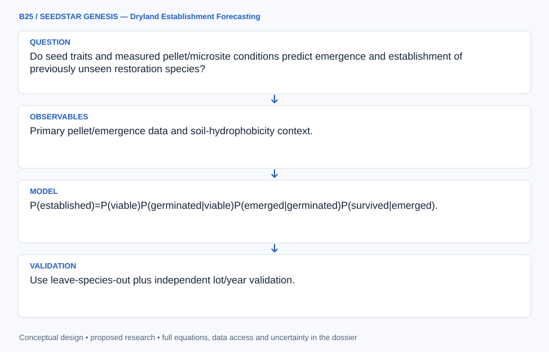

# B25 · SEEDSTAR GENESIS — Dryland Establishment Forecasting

**Original project:** Can We Predict Germination Success in Seed Pellets Using Seed Traits?

**Session B:** Earth & Environmental Engineering

**Document class:** engineering research design and analysis record · **Revision:** 2 · **Date:** 2026-10-02

**Evidence state:** design basis, mathematical formulation and verification plan documented. Project-specific empirical results remain to be acquired; executable shared model demonstrations have their own recorded checks.

[Engineering document register](../../ENGINEERING_DOCUMENTATION.md) · [Session B handbook](../../documentation/SESSION_B.md) · [Previous: B24](../B/B24.md) · [Next: B26](../B/B26.md)

## Purpose and scientific objective

Predict pellet performance through seed traits, microsite moisture and the distinct transitions from viable seed to germination, emergence and survival. Build a transferable model across species rather than optimizing a single pellet formulation. Evaluate resource use and establishment costs, preserving the possibility that a pellet improves emergence yet fails to improve later survival.

**Question:** Do seed traits and measured pellet/microsite conditions predict emergence and establishment of previously unseen restoration species?

**Testable hypothesis:** Trait–moisture interactions should improve transfer beyond species identity, but emergence gains may disappear under post-emergence drought or unfavorable pellet water dynamics.

## 1. Design basis and analysis boundary

The seed-pellet model predicts separate transitions from viable seed to germination, emergence and subsequent survival using published or authorized lot-level records. Seed traits and pellet/microsite conditions are predictors, while durable establishment is the decision endpoint. The system does not infer dead seed from short-term nongermination or assume that improved emergence ensures restoration success.

Begin with viability-adjusted stage proportions and species/lot baselines, then add hydrotime and trait interactions if records support transfer. Primary pellet and weather-window studies motivate emergence barriers and later survival. Pellet formulation identity remains metadata rather than a newly optimized recipe. Proposed validation reserves species and lots, and planting-cost estimates include failed stages and uncertain field transfer.

## 2. Requirements and verification traceability

These are project design requirements or proposed analysis gates. A numerical target is not a NASA requirement unless its controlling source is explicitly identified. “TBD” identifies evidence required before a decision; it is not permission to assume a value. Verification evidence listed here is planned, unless a linked result explicitly records execution.

| ID | Requirement / gate | Engineering rationale | Verification method | Basis / required evidence |
| --- | --- | --- | --- | --- |
| B25-R1 | Each record shall retain species, seed lot, viability evidence, pellet identity, microsite, stage definition and follow-up horizon. | Lots and endpoints are not interchangeable. | Stage/lot metadata audit. | Primary pellet context. |
| B25-R2 | Treat unobserved transitions and unfinished follow-up as censored; nongerminated viable seed shall not be coded dead. | Delayed germination changes success rates. | Known-censoring likelihood test. | Existing multistage distinction. |
| B25-R3 | Hold out complete species and seed lots and flag traits outside training support. | Random seed splits overstate transfer. | Trait-range and split audit. | Proposed generalization protocol. |
| B25-R4 | Report established plants per input seed and cost per established plant with zero-success cases explicit. | Intermediate improvement may fail economically. | Independent transition/cost ledger. | Proposed decision contract. |

## 3. Architecture and controlled interfaces

A seed registry links species, lot, viability proportion and trait measurements such as mass mg and coat metrics. The observation table stores germination/emergence/survival dates and censoring with pellet/microsite keys. Weather/soil adapters emit temperature °C and water potential MPa, preserving the negative matric-potential convention.

A multistage estimator uses conditional transitions or survival hazards with species/lot effects. The hydrotime branch consumes supported water-potential histories; pellet transport/physical resistance enters only through documented measurements or labeled scenarios. A decision ledger multiplies stage probabilities and converts costs to USD/established plant. Missing viability or late survival evidence widens bounds rather than being filled by perfect success.



The diagram preserves viability, germination, emergence and survival as separate transitions and exposes moisture/sign conventions. Its final establishment and cost predictions carry lot, field-transfer and unfinished-follow-up uncertainty.

[Editable engineering diagram source](../../visuals/projects/B25.mmd)

## 4. Mathematical model and derivation

### Governing equations

```text
P(established)=P(viable)P(germinated|viable)P(emerged|germinated)P(survived|emerged).
```

```text
logit p_ijk=α_species+βᵀ traits_i+γᵀ microsite_j+δ pellet_k+interactions.
```

```text
Hydrotime=Σ_t max[0,ψ_t−ψ_base]Δt, with sign convention and species-specific base.
```

### Variables, units and conventions

- Traits: seed mass, mg; coat/thickness metrics and dormancy class.
- ψ: water potential, MPa; hydrotime: MPa·day.
- Success: separately defined proportions at each stage.
- Cost: USD/established plant; soil moisture and temperature: documented units.

### Assumptions and boundary conditions

- Seed viability and dormancy must be measured or independently characterized.
- Pellet materials can alter both moisture and physical emergence resistance.
- Species transfer requires traits outside training range to be flagged.

### Derivation step 1

```text
P(established)=p_v p_g|v p_e|g p_s|e.
```

The chain rule preserves conditional stages; correlation through shared lot/weather effects is retained in joint parameter draws.

### Derivation step 2

```text
H(t)=integral_0^t max(0,psi(u)-psi_base)du.
```

psi and psi_base are MPa, typically negative. Wetter potential above the species base contributes positive MPa day; missing moisture is not zero hydrotime.

### Derivation step 3

```text
logit p_ijk=alpha_species+beta^T traits_i+gamma^T microsite_j+delta pellet_k+interactions.
```

Continuous traits use declared reference scaling, and lot effects distinguish inherited species traits from batch viability.

### Derivation step 4

```text
cost_established=C_total/(N_input p_established).
```

Cost has USD/plant units. If p_established=0, the ratio is undefined/infinite and reported as failed establishment rather than an arbitrary finite value.

### Inference or simulation procedure

Assemble published and authorized seed/pellet observations with lot identity, viability, trait measurements, moisture and timing. Use multistage hierarchical or time-to-event models with species/lot effects, censored follow-up and trait interactions. Compare seed-only and pellet baselines, quantify uncertainty in low-observation species and evaluate climate/weather-window scenarios. Avoid treating nongerminated seeds as dead without viability evidence; retain delayed germination and later establishment separately.

### Validity domain and fidelity limits

Trait databases may omit relevant seed-lot variation. Controlled moisture response may not transfer to field crusting, herbivory or rainfall extremes; short follow-up cannot establish durable restoration.

## 5. Data specifications and provenance

| Field | Type | Unit | Physical / statistical meaning | Quality and missing-data rule |
| --- | --- | --- | --- | --- |
| seed_lot | string | none | Species-linked batch identity. | Viability and storage provenance required. |
| seed_mass | nullable float | mg | Measured lot/species trait. | Method and lot variance retained. |
| viability_fraction | nullable float | 0–1 | Independent viable-seed estimate. | Assay/follow-up uncertainty saved. |
| stage_time | nullable record | days | Germination/emergence/survival event bounds. | Stage-specific censoring required. |
| water_potential | nullable float[] | MPa | Microsite moisture history. | Negative-pressure convention explicit. |
| pellet_key | string | none | Documented material/process identity. | No unmeasured mechanism inferred. |
| transition_covariance | matrix | probability² | Joint stage uncertainty. | Shared lot/weather correlations retained. |
| establishment_cost | nullable float[] | USD/plant | Cost distribution at stated horizon. | Zero-success and price year explicit. |

[Machine-readable record schema](../../data/contracts/B25.schema.json) · [Empty acquisition CSV](../../data/contracts/B25.csv) · [Field dictionary CSV](../../data/contracts/B25.dictionary.csv)

The CSV above contains column headers only. Its schema defines future records and does not establish that original-team data or a particular archive product have been acquired. Frame, timing, calibration, covariance, selection and provenance details must accompany populated records.

### Developing extruded seed pellets to overcome hydrophobicity and emergence barriers

[Product, archive or reference](https://besjournals.onlinelibrary.wiley.com/doi/full/10.1002/2688-8319.12024)

**Fields:** Primary pellet/emergence data and soil-hydrophobicity context.

**Access:** Open primary paper; linked data/supplements must be checked.

**Role:** Pellet mechanism and emergence benchmark.

### USGS managing to survive despite the weather: seeding decisions

[Product, archive or reference](https://www.usgs.gov/publications/managing-survive-despite-weather-seeding-decisions-affecting-simulated-dryland)

**Fields:** Weather windows and establishment simulation framework.

**Access:** Public USGS publication; raw/code access depends on release.

**Role:** Field survival/weather scenario context.

## 6. Uncertainty, sensitivity and identifiability

Seed-lot viability and dormancy can dominate apparent trait effects; pellet treatment may alter moisture and mechanical emergence resistance simultaneously. Fit lot-level effects, compare stage-specific contrasts and retain delayed-event censoring. Traits measured at species level do not capture every lot, so their uncertainty is propagated rather than treated as exact.

Hydrotime threshold, moisture history and pellet effects can compensate in sparse records. Profile these terms, compare direct moisture/time baselines and reserve species outside calibration. Field crusting, herbivory and extreme rainfall introduce discrepancy beyond controlled studies. Joint weather draws correlate stage losses, and cost rankings must include the possibility of no established plants.

## 7. Engineering trade study

| Alternative | Benefit | Cost / limitation | Decision rule |
| --- | --- | --- | --- |
| Stage-proportion baseline | Transparent viability and outcome accounting. | Limited timing and transfer prediction. | Required initial comparator. |
| Hierarchical hydrotime/trait model | Connects moisture and species/lot variation. | Threshold and pellet effects may confound. | Adopt with identified histories and holdout benefit. |
| Field establishment scenario ledger | Includes later survival and cost. | Field hazards may be sparsely measured. | Primary restoration decision product with bounds. |

## 8. Verification and validation cases

| Case ID | Stimulus / condition | Expected result / criterion | Method | Evidence artifact |
| --- | --- | --- | --- | --- |
| B25-V1 | Chain probability | p_established=0.1. | Condition/fixture: p_v=0.8 and each later stage probability=0.5. Verification procedure: Exact conditional-product calculation.. | Exact conditional-product calculation. |
| B25-V2 | Hydrotime sign | H=1 MPa day; psi below base contributes zero. | Condition/fixture: psi=-0.5, psi_base=-1 MPa for two days. Verification procedure: Independent integration fixture.. | Independent integration fixture. |
| B25-V3 | Zero survival | Establishment is zero and cost ratio flagged undefined. | Condition/fixture: p_s&#124;e=0 with finite earlier probabilities. Verification procedure: Boundary integration test.. | Boundary integration test. |
| B25-V4 | Species/lot holdout | Report stage calibration and final establishment interval coverage. | Condition/fixture: Reserve complete lots and species. Verification procedure: Blocked transfer evaluation.. | Blocked transfer evaluation. |

**Execution status:** these cases are specified, not claimed as executed. Close a case only with the versioned inputs, output, uncertainty, reviewer and pass/fail rationale.

### Additional scientific validation gates

- Use leave-species-out plus independent lot/year validation.
- Report calibration, Brier scores and stage-specific error; compare with species-mean and no-pellet baselines.
- Check censoring, delayed germination and viability classifications; evaluate intervals under unusually dry establishment windows.

## 9. Implementation and reproducible work packages

1. Create seed-lot, trait, pellet and stage-event schemas with censoring rules.
2. Extract primary records and audit viability/follow-up completeness.
3. Implement conditional-stage and hydrotime calculators with sign/unit fixtures.
4. Fit species/lot models using frozen species-level validation folds.
5. Build establishment-cost and field-discrepancy scenario artifacts.
6. Release stage-specific predictions, transfer support and zero-success limitations.

### Investigation sequence

1. Stage 1: inventory species/lots and define viability/germination/emergence/survival endpoints with consistent trait units.
2. Stage 2: fit multistage trait/moisture models and compare pellet/no-pellet baselines under observed/scenario weather.
3. Stage 3: hold out species and field seasons, then deliver uncertainty-aware restoration choices and cost per established plant.

### Resources and interfaces to expertise

- Restoration seed ecologist, trait analyst and field-monitoring partner.
- Seed-lot metadata, moisture/temperature histories and hierarchical survival tools.

## 10. Failure modes and interpretation controls

| Failure mode | Effect on result | Detection / evidence | Design response |
| --- | --- | --- | --- |
| Stages collapsed | Pellet success overstated. | Endpoint/follow-up audit. | Separate transition reporting. |
| Viability assumed perfect | Biased germination comparison. | Lot viability evidence check. | Viability uncertainty/bounds. |
| Trait extrapolation hidden | Unreliable novel-species advice. | Training-range diagnostics. | Support flag and abstention. |

- Germination conflated with establishment.
- Trait/lot gaps and formulation confounding.
- Model extrapolation to unobserved species or weather.

## 11. Required engineering outputs

- Trait/pellet data dictionary and multistage model.
- Species-transfer and drought sensitivity results.
- Establishment/cost decision matrix.

### Scientific result figures to produce during execution

Show viable-to-established transitions by species/traits, with uncertainty and pellet versus control outcomes across moisture scenarios.

## 12. Cited technical and scientific resources

- [Developing extruded seed pellets to overcome hydrophobicity and emergence barriers](https://besjournals.onlinelibrary.wiley.com/doi/full/10.1002/2688-8319.12024) — Primary pellet study supports emergence endpoints and microsite-dependent performance.
- [USGS managing to survive despite the weather: seeding decisions](https://www.usgs.gov/publications/managing-survive-despite-weather-seeding-decisions-affecting-simulated-dryland) — Primary simulation research supports weather windows and post-germination survival as distinct constraints.

Framework and evidence rules: [engineering documentation standard](../../docs/ENGINEERING_STANDARD.md), [model assurance](../../docs/MODEL_ASSURANCE.md), [uncertainty procedure](../../docs/UNCERTAINTY_AND_DECISION_RULES.md), and [data management](../../docs/DATA_MANAGEMENT.md). NASA-inspired names are creative identifiers; requirements and results are not NASA certification.
