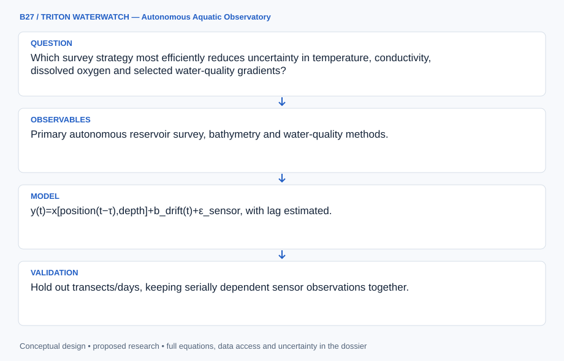

# B27 · TRITON WATERWATCH — Autonomous Aquatic Observatory

**Original project:** Aquatic Data Analysis from Deployable, Autonomous Boat

**Session B:** Earth & Environmental Engineering
**Status:** proposed research dossier; no project experiment or mission qualification has been performed.

Design a quality-controlled aquatic survey and analysis system for an autonomous surface platform. Couple calibration, time synchronization and spatial sampling with uncertainty-aware maps. Distinguish surface measurements from whole-water-column conditions; a dense trajectory can still be biased if sensor response, stratification or calibration drift are ignored.

## Scientific question

Which survey strategy most efficiently reduces uncertainty in temperature, conductivity, dissolved oxygen and selected water-quality gradients?

## Testable hypothesis

Adaptive sampling informed by validated spatial covariance may outperform uniform transects under patchy conditions, but calibration drift and sensor lag can erase that advantage.



*Conceptual research design; arrows show the analysis dependency, not observed causation.*

## Mathematical model

```text
y(t)=x[position(t−τ),depth]+b_drift(t)+ε_sensor, with lag estimated.
```

```text
x(s)=μ(s)+GP[K(s,s′)], with heteroscedastic measurement error.
```

```text
Next sample=argmax_s expected variance reduction(s)/travel_energy(s), subject to geofence/return constraints.
```

### Variables and units

- Temperature: °C; conductivity: μS/cm with reference temperature stated.
- DO: mg/L and saturation percent using documented compensation.
- Position: projected m; sensor lag τ: s; depth: m.
- Energy: Wh; uncertainty: parameter-specific physical units.

### Assumptions and boundary conditions

- Sensor calibration/reference methods remain traceable.
- Surface readings cannot represent deep anoxia without depth observations.
- Navigation/survey plans require site permissions and practical weather/return limits.

### Inference or simulation method

Audit boat logs, GPS timestamps, calibration and response times, then align sensor streams and reject unsupported corrections. Design baseline stratified transects and an adaptive alternative using a Gaussian process or robust spatial interpolator. Pair measurements with independent reference samples and depth profiles where permitted. Propagate sensor, position, drift and interpolation errors into maps; retain blank/flagged areas instead of silently filling all water surfaces.

### Model limits

Spatial covariance may change rapidly with inflows, mixing or blooms. Optical/conductivity proxies cannot establish specific contaminants without validated chemistry; repeated trajectories do not supply independent reference truth.

## Data and provenance contracts

### USGS North Saluda Reservoir bathymetric and water-quality mapping

[Resource or product discovery](https://pubs.usgs.gov/sim/3289/pdf/sim3289.pdf)

**Fields:** Primary autonomous reservoir survey, bathymetry and water-quality methods.

**Access:** Public USGS map/report; platform-specific calibration needs new records.

**Role:** Survey and depth-context benchmark.

### Design and development of an autonomous surface vehicle for water-quality monitoring

[Resource or product discovery](https://arxiv.org/abs/2201.10685)

**Fields:** Surface-platform design and reference-comparison methods.

**Access:** Primary author report; dataset availability requires its release statement.

**Role:** Instrumentation/analysis context.

### Water Quality Portal

[Resource or product discovery](https://www.waterqualitydata.us/)

**Fields:** Historical samples, sites, analytes, units and quality metadata.

**Access:** Public Water Quality Portal; coverage/agency methods vary.

**Role:** Independent contextual observations, when temporally comparable.

## Staged execution

1. Stage 1: verify time/calibration/lag and choose permitted survey bounds; define depth and analyte applicability.
2. Stage 2: compare baseline/adaptive sampling in simulation and historical replay with propagated uncertainty.
3. Stage 3: validate co-located independent samples and withheld transects, then release maps with support/quality flags.

## Verification and validation

- Hold out transects/days, keeping serially dependent sensor observations together.
- Evaluate reference bias, RMSE and interval coverage, stratified by speed/depth/environment.
- Inject timing/drift/dropout faults and verify detection; compare variance reduction per Wh with equal-effort uniform sampling.

*Any numerical gate is a proposed requirement unless the dossier explicitly identifies a sourced requirement. Freeze gates before collecting confirmatory data.*

## Resources and deliverables

- Aquatic scientist, sensor-calibration specialist and robotics operator.
- Timestamped navigation/sensor logs, reference methods, GIS and spatial statistics.

- Calibrated aquatic data cube and quality flags.
- Survey-efficiency and uncertainty notebook.
- Supported water-quality maps and mission-data protocol.

## Risks and interpretation

- Sensor drift/lag and inconsistent compensation.
- Surface-to-depth or proxy-to-contaminant overclaiming.
- Coverage bias, weather/return failure or unauthorized sampling.

## Figure plan

Display measured tracks/depths, parameter maps and uncertainty; compare adaptive/uniform coverage with independent reference residuals.

## Cited scientific resources

- [USGS North Saluda Reservoir bathymetric and water-quality mapping](https://pubs.usgs.gov/sim/3289/pdf/sim3289.pdf) — Primary autonomous-survey example supports georeferenced water-quality and depth observations; platform transfer requires fresh calibration.
- [Design and development of an autonomous surface vehicle for water-quality monitoring](https://arxiv.org/abs/2201.10685) — Primary platform-design report motivates co-located reference measurements and sensor validation.
- [Water Quality Portal](https://www.waterqualitydata.us/) — Official multiagency sample archive supplies historical aquatic observations with method/unit qualifiers.

Source discovery reviewed 2026-10-02. A public source pointer does not imply original student-team data access. See [model assurance](../../docs/MODEL_ASSURANCE.md) and [data management](../../docs/DATA_MANAGEMENT.md).
