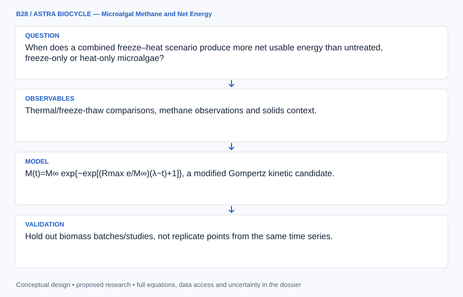

# B28 · ASTRA BIOCYCLE — Microalgal Methane and Net Energy

**Original project:** Biogas Production from Microalgae following Freeze-Heat Pretreatment

**Session B:** Earth & Environmental Engineering

**Document class:** engineering research design and analysis record · **Revision:** 2 · **Date:** 2026-10-02

**Evidence state:** design basis, mathematical formulation and verification plan documented. Project-specific empirical results remain to be acquired; executable shared model demonstrations have their own recorded checks.

[Engineering document register](../../ENGINEERING_DOCUMENTATION.md) · [Session B handbook](../../documentation/SESSION_B.md) · [Previous: B27](../B/B27.md) · [Next: C01](../C/C01.md)

## Purpose and scientific objective

Evaluate freeze–heat pretreatment through methane kinetics, solids accounting and net energy, using published and authorized nonpathogenic biomass records. Separate freezing, heating and combined treatment evidence: papers studying the individual treatments do not establish a combined optimum. Optimize usable energy and resource impact rather than reporting larger gas volumes without pretreatment costs.

**Question:** When does a combined freeze–heat scenario produce more net usable energy than untreated, freeze-only or heat-only microalgae?

**Testable hypothesis:** Cell disruption may accelerate conversion, but freezing/heating energy and dilute biomass handling can erase methane gains; heat recovery and solids concentration will determine break-even conditions.

## 1. Design basis and analysis boundary

The microalgal digestion assessment couples published methane time series to solids, gas-normalization and pretreatment energy inventories. It compares untreated, freezing, heating and combined scenarios without treating evidence for separate treatments as proof of a combined optimum. The decision endpoint is net usable energy and resource burden, not larger raw gas volume.

Begin with blank-corrected, volatile-solids-normalized observations and alternative kinetic fits. Add refrigeration, sensible/latent heat, heat recovery and downstream energy only where their boundaries are documented. Existing primary studies support separate-treatment comparisons; combined synergy remains an uncertain scenario unless directly observed. Authorized nonpathogenic biomass records are analyzed retrospectively, and no completed experiment is claimed.

## 2. Requirements and verification traceability

These are project design requirements or proposed analysis gates. A numerical target is not a NASA requirement unless its controlling source is explicitly identified. “TBD” identifies evidence required before a decision; it is not permission to assume a value. Verification evidence listed here is planned, unless a linked result explicitly records execution.

| ID | Requirement / gate | Engineering rationale | Verification method | Basis / required evidence |
| --- | --- | --- | --- | --- |
| B28-R1 | Methane shall retain gas temperature/pressure, water-vapor basis, methane fraction, blank correction and volatile solids added. | Raw biogas volume is not comparable methane yield. | Gas/solids normalization audit. | Primary digestion context. |
| B28-R2 | Compare ultimate yield and rate separately, and flag inadequate plateau/follow-up evidence. | Acceleration is not larger final yield. | Kinetic identifiability and holdout review. | Existing model limitations. |
| B28-R3 | Net-energy inventory shall include refrigeration, heat, mixing and dewatering within one declared boundary; heat recovery cannot be counted twice. | Pretreatment may consume more energy than gained. | Independent energy ledger. | Existing net-energy model. |
| B28-R4 | Combined freeze-heat performance shall be labeled scenario-only unless direct primary measurements support it. | Separate treatments do not validate synergy. | Treatment-evidence provenance gate. | Corrected source interpretation. |

## 3. Architecture and controlled interfaces

A study adapter stores biomass identity, dry/volatile solids, treatment category and replicate/blank time series. The gas converter records measured volume, pressure, temperature and wet/dry methane fraction basis. Kinetic fitting preserves cumulative-series error correlation and censored endpoint follow-up.

An energy ledger separates usable methane energy from cooling, phase-change, heating and auxiliary loads, with refrigeration COP and recovery fractions explicitly sourced or scenario-tagged. A treatment comparator uses compatible biomass/solids conditions and keeps combined evidence separate. Missing blank or gas-condition metadata blocks absolute yield comparison; sparse terminal observations widen ultimate-yield intervals rather than imposing an observed plateau.



The diagram connects normalized methane and kinetic uncertainty to a complete energy ledger, with a separate combined-treatment evidence gate. It cannot establish freeze-heat synergy or positive net energy from larger gas volume alone.

[Editable engineering diagram source](../../visuals/projects/B28.mmd)

## 4. Mathematical model and derivation

### Governing equations

```text
M(t)=M∞ exp{−exp[(Rmax e/M∞)(λ−t)+1]}, a modified Gompertz kinetic candidate.
```

```text
E_net=LHV_CH4 V_CH4 η_use−E_freeze−E_heat−E_mix−E_dewater.
```

```text
E_heat=m c_p ΔT(1−η_recovery); freeze includes sensible/latent load and refrigeration efficiency.
```

### Variables, units and conventions

- M/V: methane volume normalized to stated temperature/pressure, L or Nm³.
- Yield: L CH4/kg volatile solids added; Rmax: L/day.
- λ: lag, day; m: kg; c_p: kJ/kg/K; energy: kWh after conversion.
- η_use/recovery: fractions; water/solids and emission inventories retain units.

### Assumptions and boundary conditions

- Methane fraction and normalized gas volume require verified measurements.
- Blank/inoculum methane must be removed from biomass-attributed yields.
- Combined treatment performance is an unvalidated scenario unless directly observed.

### Derivation step 1

```text
V_norm=V_meas(P_dry/P_norm)(T_norm/T_meas); V_CH4=V_norm x_CH4,dry.
```

P_dry subtracts water-vapor pressure when required. Temperature is K, normalization conditions are declared, and methane fraction matches the dry/wet convention.

### Derivation step 2

```text
M(t)=M_inf exp(-exp[a(lambda-t)+1]); a=R_max e/M_inf.
```

M is methane volume, R_max volume/day and lambda days; a is day^-1. Ultimate yield is divided by kg volatile solids added only after blank correction.

### Derivation step 3

```text
Q_heat=m c_p Delta T; Q_freeze=Q_sensible+m_water L_f.
```

Both are kJ with stated biomass/water basis; electrical cooling energy is Q_freeze/(3600 COP) kWh, not the thermal load itself.

### Derivation step 4

```text
E_net=LHV_CH4 V_CH4 eta_use-E_freeze-E_heat-E_mix-E_dewater.
```

LHV uses kWh per declared normalized m³. Recovery reduces only the heat term within its physical boundary, and combined-treatment yield uncertainty remains explicit.

### Inference or simulation procedure

Extract methane time series, solids, biomass composition and reported pretreatment energy from primary studies. Fit several kinetic candidates and censored/replicate errors; avoid extrapolating ultimate yield from short runs without adequate evidence. Build mass/energy inventories with heat recovery, refrigeration, concentration and digestate handling. Compare untreated and separate-treatment baselines with combined scenarios, propagating uncertain synergy instead of assuming multiplicative benefits.

### Validity domain and fidelity limits

Published biomass composition and digestion systems may differ. Kinetic acceleration does not guarantee higher ultimate yield or positive energy balance; emissions and digestate quality need independent measurements.

## 5. Data specifications and provenance

| Field | Type | Unit | Physical / statistical meaning | Quality and missing-data rule |
| --- | --- | --- | --- | --- |
| study_treatment | record | none | Biomass/source/treatment evidence identity. | Separate versus combined provenance required. |
| volatile_solids_added | float | kg VS | Yield normalization denominator. | Method and dry/volatile fraction uncertainty saved. |
| cumulative_gas | nullable float[] | L | Measured replicate/blank volumes. | Time correlation and conditions retained. |
| methane_fraction | nullable float[] | 0–1 | Measured composition on stated basis. | Wet/dry convention explicit. |
| gas_conditions | record | K Pa | Measured and normalization state. | Water-vapor correction metadata required. |
| kinetic_parameters | float[] | L L/day day | M_inf, R_max and lag ensemble. | Covariance/plateau support retained. |
| pretreatment_energy | record | kWh | Cooling/heating/auxiliary inventory. | COP/recovery/boundary source required. |
| net_energy | float[] | kWh/kg VS | Usable-energy scenario distribution. | Include negative outcomes and synergy uncertainty. |

[Machine-readable record schema](../../data/contracts/B28.schema.json) · [Empty acquisition CSV](../../data/contracts/B28.csv) · [Field dictionary CSV](../../data/contracts/B28.dictionary.csv)

The CSV above contains column headers only. Its schema defines future records and does not establish that original-team data or a particular archive product have been acquired. Frame, timing, calibration, covariance, selection and provenance details must accompany populated records.

### Influence of temperature and pretreatments on anaerobic digestion of microalgae

[Product, archive or reference](https://pubmed.ncbi.nlm.nih.gov/24726994/)

**Fields:** Thermal/freeze-thaw comparisons, methane observations and solids context.

**Access:** Primary PubMed record; full data may require publisher/author access.

**Role:** Separate-treatment baseline.

### Impact of low-temperature pretreatment on anaerobic digestion of microalgal biomass

[Product, archive or reference](https://pubmed.ncbi.nlm.nih.gov/23619135/)

**Fields:** Thermal treatment kinetics, solids concentration and energy context.

**Access:** Primary article record; inspect supplemental data/access statement.

**Role:** Independent thermal/energy comparison.

## 6. Uncertainty, sensitivity and identifiability

Gas calibration, methane composition, blank subtraction and solids normalization create correlated yield uncertainty. Cumulative time-series points are not independent replicates. Propagate blank/source covariance and compare compatible biomass compositions; missing conditions can prevent quantitative pooling rather than justify guessed standard volumes.

Ultimate yield, lag and maximum rate are poorly separable in short records. Profile kinetic parameters and test withheld late-time observations against alternatives. COP, solids concentration, recovery and usable-energy efficiency may dominate net energy. Combined-treatment synergy is an independent uncertain parameter, not the product of separate gains; report break-even regions and negative-energy scenarios.

## 7. Engineering trade study

| Alternative | Benefit | Cost / limitation | Decision rule |
| --- | --- | --- | --- |
| Direct terminal-yield comparison | Minimal kinetic extrapolation. | Requires adequate duration and normalization. | Primary yield endpoint when plateau exists. |
| Gompertz/alternative kinetics | Separates rate, lag and potential yield. | Short runs may not identify M_inf. | Use with profiles and late-time holdout. |
| Net-energy lifecycle ledger | Connects methane gains to practical energy. | Inventory gaps and heat-recovery assumptions matter. | Primary decision layer with source-specific bounds. |

## 8. Verification and validation cases

| Case ID | Stimulus / condition | Expected result / criterion | Method | Evidence artifact |
| --- | --- | --- | --- | --- |
| B28-V1 | Gompertz limits | M approaches M_inf; early-time M tends to zero. | Condition/fixture: For positive parameters, t tends to infinity. Verification procedure: Analytic asymptotic check.. | Analytic asymptotic check. |
| B28-V2 | Maximum-rate point | M=M_inf/e and dM/dt=R_max. | Condition/fixture: t=lambda+M_inf/(R_max e). Verification procedure: Differentiate and compare numerical slope.. | Differentiate and compare numerical slope. |
| B28-V3 | Heating ledger | Q=40 kJ=0.011111 kWh. | Condition/fixture: m=1 kg, c_p=4 kJ/kg/K and Delta T=10 K, no recovery. Verification procedure: Independent dimensional calculation.. | Independent dimensional calculation. |
| B28-V4 | No combined evidence | Combined output stays scenario-only with unresolved synergy. | Condition/fixture: Sources contain only separate heating/freezing records. Verification procedure: Provenance integration test.. | Provenance integration test. |

**Execution status:** these cases are specified, not claimed as executed. Close a case only with the versioned inputs, output, uncertainty, reviewer and pass/fail rationale.

### Additional scientific validation gates

- Hold out biomass batches/studies, not replicate points from the same time series.
- Verify carbon/solids and energy bookkeeping; compare kinetic-model prediction intervals.
- Report net-energy confidence intervals and sensitivity to concentration, recovery and refrigeration; retain negative-energy cases.

## 9. Implementation and reproducible work packages

1. Create study/treatment/biomass/solids schemas and separate combined-evidence flags.
2. Extract replicate and blank gas records with condition/measurement uncertainty.
3. Implement normalized methane and volatile-solids yield calculators.
4. Fit kinetic alternatives with covariance and late-time identifiability artifacts.
5. Build cooling/heating/auxiliary energy inventories and break-even scenarios.
6. Release treatment-specific yield, rate and net-energy conclusions with unresolved synergy.

### Investigation sequence

1. Stage 1: harmonize methane normalization, blanks, volatile solids and treatment definitions; identify missing combined-treatment evidence.
2. Stage 2: fit kinetics and full energy/resource balances, including uncertain synergy and heat recovery.
3. Stage 3: validate an independent biomass/system dataset and deliver break-even maps with explicit measurement requirements.

### Resources and interfaces to expertise

- Anaerobic-digestion scientist, biochemical engineer and lifecycle analyst.
- Published time series, gas/solids QA and energy-inventory tools.

## 10. Failure modes and interpretation controls

| Failure mode | Effect on result | Detection / evidence | Design response |
| --- | --- | --- | --- |
| Biogas called methane | Inflated usable energy. | Composition/basis audit. | Measured methane fraction. |
| Short-run yield extrapolation | False ultimate-yield improvement. | Parameter profiles and plateau support. | Report bounds/alternative kinetics. |
| Heat recovery double counted | Artificial positive net energy. | Independent thermal boundary ledger. | Single allocated recovery credit. |

- Combined effects invented from separate-treatment studies.
- Gross methane confused with net energy.
- Dilution, ammonia, gas-normalization or digestate impacts omitted.

## 11. Required engineering outputs

- Harmonized methane/solids evidence table.
- Kinetic and net-energy scenario model.
- Break-even and environmental-impact atlas.

### Scientific result figures to produce during execution

Plot solids concentration versus heat/refrigeration recovery with net energy intervals; compare observed separate treatments with labeled combined scenarios.

## 12. Cited technical and scientific resources

- [Influence of temperature and pretreatments on anaerobic digestion of microalgae](https://pubmed.ncbi.nlm.nih.gov/24726994/) — Primary comparison includes thermal and freeze-thaw treatments; does not establish a combined freeze–heat optimum.
- [Impact of low-temperature pretreatment on anaerobic digestion of microalgal biomass](https://pubmed.ncbi.nlm.nih.gov/23619135/) — Primary thermal study motivates solids concentration and net-energy accounting rather than gross methane alone.

Framework and evidence rules: [engineering documentation standard](../../docs/ENGINEERING_STANDARD.md), [model assurance](../../docs/MODEL_ASSURANCE.md), [uncertainty procedure](../../docs/UNCERTAINTY_AND_DECISION_RULES.md), and [data management](../../docs/DATA_MANAGEMENT.md). NASA-inspired names are creative identifiers; requirements and results are not NASA certification.
