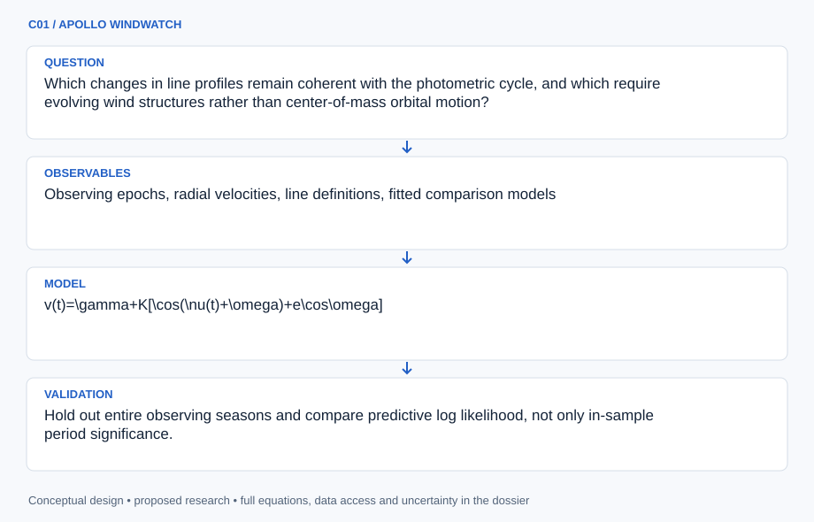

# C01 · APOLLO WINDWATCH

**Original project:** The Characterization of EZ CMa

**Session C:** Astronomy & Space Physics

**Document class:** engineering research design and analysis record · **Revision:** 2 · **Date:** 2026-10-02

**Evidence state:** design basis, mathematical formulation and verification plan documented. Project-specific empirical results remain to be acquired; executable shared model demonstrations have their own recorded checks.

[Engineering document register](../../ENGINEERING_DOCUMENTATION.md) · [Session C handbook](../../documentation/SESSION_C.md) · [Previous: B28](../B/B28.md) · [Next: C02](../C/C02.md)

## Purpose and scientific objective

Turn the variability of the Wolf-Rayet star EZ CMa into a discriminating experiment on structured stellar winds. Preserve the original characterization goal while comparing corotating interaction regions, evolving wind clumps, and orbital motion through simultaneous spectroscopy and photometry. The 2023 CHIRON study favors a CIR interpretation over a rapidly precessing binary; this proposal treats that conclusion as evidence to test rather than declaring the system architecture settled.

**Question:** Which changes in line profiles remain coherent with the photometric cycle, and which require evolving wind structures rather than center-of-mass orbital motion?

**Testable hypothesis:** A quasi-periodic wind model will predict withheld line-profile variability better than a single stable radial-velocity orbit, especially when each observing season has independently inferred coherence time.

## 1. Design basis and analysis boundary

The analysis boundary begins with calibrated spectra and independently reduced photometry of EZ CMa and ends with posterior predictions for velocity-resolved line variability. It does not interpret an emission-line centroid as a stellar center-of-mass measurement. The CHIRON paper supplies a target-specific comparator and favors corotating interaction regions; the proposed design tests that interpretation through held-out seasons and line-dependent behavior.

A fidelity ladder starts with equivalent-width and centroid summaries, advances to a shared quasi-periodic latent process, and adds wind advection only when line-formation information is available. Keplerian motion is a competing observation model with separate wind jitter. Raw spectra availability, spectral resolving power, line windows, and contemporaneous photometric coverage remain TBD. A useful outcome can be a documented nonidentifiability boundary rather than an orbital classification.

## 2. Requirements and verification traceability

These are project design requirements or proposed analysis gates. A numerical target is not a NASA requirement unless its controlling source is explicitly identified. “TBD” identifies evidence required before a decision; it is not permission to assume a value. Verification evidence listed here is planned, unless a linked result explicitly records execution.

| ID | Requirement / gate | Engineering rationale | Verification method | Basis / required evidence |
| --- | --- | --- | --- | --- |
| C01-R1 | Every accepted spectrum shall carry wavelength convention, exposure midpoint, barycentric correction and declared time scale. | Daily phase comparisons are vulnerable to timing and wavelength mismatches. | Round-trip timestamp and velocity conversion fixtures. | Proposed data contract; CHIRON observing context. |
| C01-R2 | Exposure integration shall change predicted profile observables by less than 1% under grid refinement, a proposed numerical target. | Short exposures can still smear rapidly evolving substructure. | Double quadrature resolution on representative synthetic profiles. | Proposed convergence target. |
| C01-R3 | Model comparison shall hold out an entire observing season and report predictive density and interval coverage by line. | Adjacent spectra share wind coherence and cannot provide independent validation. | Season-level split audit and posterior prediction tables. | Proposed validation design. |
| C01-R4 | A period claim shall include the spectral window and alternative alias solutions within the searched interval. | Cadence can imitate coherent cycles. | Inject signals through actual observing timestamps. | Proposed period-identifiability requirement. |

## 3. Architecture and controlled interfaces

A spectrum adapter emits wavelength, normalized flux, variance, masks, continuum covariance and exposure interval. A line extractor uses fixed rest wavelengths and common velocity grids, preserving separate line identities. Photometry arrives as flux and its covariance, never as an automatically synchronized phase series. Times are BJD in a declared dynamical time scale where source metadata allow conversion; unavailable corrections retain explicit flags.

The latent-process engine produces time-integrated line responses and photometric predictions. An orbital branch applies the same sampling and nuisance zero points. A wind interpreter converts inferred delays into conditional radii using the beta law; uncertainty in wind speed and formation radius propagates outward. A poor continuum fit therefore broadens profile uncertainty before influencing the coherence or orbital score.

Separate line and photometric interfaces feed matched wind and orbital branches; only measured delays enter the conditional wind-radius interpretation.

[Editable engineering diagram source](../../visuals/projects/C01.mmd)

## 4. Mathematical model and derivation

### Governing equations

$$
v(t)=\gamma+K[\cos(\nu(t)+\omega)+e\cos\omega]
$$

$$
k(t,t\prime)=A^2\exp[-(t-t\prime)^2/(2\ell^2)-2\sin^2(\pi(t-t\prime)/P)/\Gamma^2]
$$

$$
v(r)=v_\infty[1-R_*/r]^\beta
$$

### Variables, units and conventions

- t and P in days; barycentric timestamps must use a declared time scale
- v, gamma, K, and terminal wind velocity in km s^-1
- ell is wind-pattern coherence time; Gamma controls periodic smoothness
- Equivalent width in angstrom; normalized line-profile flux is dimensionless
- e, omega, and true anomaly describe an orbital comparator, not established binary parameters

### Assumptions and boundary conditions

- Treat different spectral lines as different wind-formation regions; a line centroid is not automatically stellar radial velocity.
- Model seasonal zero points and finite exposure integration; allow pattern amplitudes to evolve.

### Derivation step 1

$$
v=c(\lambda/\lambda_0-1)
$$

Use the nonrelativistic Doppler approximation consistently for local line coordinates; this coordinate is a gas velocity, not an automatically measured stellar velocity.

### Derivation step 2

$$
W=\int(1-F_\lambda/F_c)\,d\lambda
$$

Define absorption equivalent width as positive, hence emission is negative. Integrate continuum and pixel covariance with the same line-window weights.

### Derivation step 3

$$
y_\ell(t)=a_\ell x(t-\Delta_\ell)+b_\ell+\epsilon_\ell
$$

Connect a shared stochastic pattern to each line through amplitude and delay. Integrate this model over the exposure before comparing samples.

### Derivation step 4

$$
\Delta t_{12}=\int_{r_1}^{r_2}dr/[v_\infty(1-R_*/r)^\beta]
$$

Convert a positive outer-line delay into an advection hypothesis only when the formation regions satisfy r2>r1>R*. Radius uncertainty is an input to this integral.

### Inference or simulation procedure

Extract equivalent widths, line bisectors, skewness, and velocity-resolved residuals from wavelength-calibrated spectra. Fit a shared latent quasi-periodic process with line-specific response coefficients and a Student-t residual model, then compare with an orbital model and a nonperiodic stochastic baseline. Use generalized Lomb-Scargle peaks only to initialize priors; inspect the observing window before interpreting aliases. Connect fitted coherence and line delays to a beta-law wind as an interpretive layer, with uncertainty in the line-formation radii.

### Validity domain and fidelity limits

The beta law is a phenomenological wind description. Emission-line transfer, clumping, and inclination can imitate orbital signatures; model preference does not by itself establish rotation rate or companion absence.

## 5. Data specifications and provenance

| Field | Type | Unit | Physical / statistical meaning | Quality and missing-data rule |
| --- | --- | --- | --- | --- |
| epoch | float64 | BJD | Barycentric exposure midpoint. | Null until time scale and correction are documented. |
| exposure | float64[2] | day | Start and end in the common time system. | End must exceed start. |
| velocity | float64[n] | km s^-1 | Line-relative gas velocity grid. | Rest wavelength and air/vacuum convention required. |
| profile | float64[n] | 1 | Continuum-normalized line flux. | Masked pixels stay missing; no zero filling. |
| profile_cov | float64[n,n] | 1 | Pixel and continuum covariance. | Symmetric positive semidefinite; preserve shared continuum terms. |
| line_delay | posterior<float64> | day | Conditional response delay relative to a named reference line. | Report multimodality and reference-line identity. |

[Machine-readable record schema](../../data/contracts/C01.schema.json) · [Empty acquisition CSV](../../data/contracts/C01.csv) · [Field dictionary CSV](../../data/contracts/C01.dictionary.csv)

The CSV above contains column headers only. Its schema defines future records and does not establish that original-team data or a particular archive product have been acquired. Frame, timing, calibration, covariance, selection and provenance details must accompany populated records.

### CHIRON study and associated publication material

[Product, archive or reference](https://arxiv.org/abs/2310.15986)

**Fields:** Observing epochs, radial velocities, line definitions, fitted comparison models

**Access:** Paper is open; inspect its data statement and request unavailable spectra before claiming reproduction.

**Role:** Baseline interpretation and target-specific comparison.

### MAST mission holdings

[Product, archive or reference](https://archive.stsci.edu/)

**Fields:** Available target photometry, exposure metadata, quality flags

**Access:** Search target aliases; specific EZ CMa holdings and saturation behavior require verification.

**Role:** Independent photometry if scientifically usable.

## 6. Uncertainty, sensitivity and identifiability

Continuum placement, wavelength drift and line blending introduce correlated errors across profile bins. Instrument-season zero points can mimic slow orbital changes, while finite pattern coherence can imitate a drifting period. Infer shared wavelength shifts separately from line-specific variability and inspect posterior covariance between period, coherence time and delay. A Gaussian-process amplitude must not absorb every unmodeled calibration failure.

Wind interpretation depends on beta, terminal speed, inclination and poorly known formation radii. Examine sensitivity by fixing each formation-radius prior in turn and comparing the delay likelihood; if many radius combinations produce the same delays, retain the observable delays as the result. Compare the orbital and wind branches with identical noise and sampling operators so model preference measures physical predictive power rather than differing flexibility.

## 7. Engineering trade study

| Alternative | Benefit | Cost / limitation | Decision rule |
| --- | --- | --- | --- |
| Line moments | Cheap, interpretable temporal summary. | Moving subfeatures can cancel in a centroid. | Use for baseline and observing-window exploration. |
| Velocity-resolved latent process | Retains substructure and line delays. | Higher covariance dimension and continuum sensitivity. | Adopt when held-out profiles improve beyond moment predictions. |
| Parameterized CIR transfer | Connects geometry to wind motion. | Formation radii and transfer physics may be unavailable. | Attempt only with independent wind constraints; otherwise label exploratory. |

## 8. Verification and validation cases

| Case ID | Stimulus / condition | Expected result / criterion | Method | Evidence artifact |
| --- | --- | --- | --- | --- |
| C01-V1 | Uniform Doppler shift | All synthetic line centroids move by the imposed shift while equivalent widths remain unchanged apart from discretization. | Translate profiles and refine wavelength sampling. | Doppler coordinate and equivalent-width conservation. |
| C01-V2 | Coherence-free null | A nonperiodic injected series must not systematically favor a narrow period. | Generate through actual timestamp gaps and compare seasonal predictions. | Declared false-period baseline; no measured outcome claimed. |
| C01-V3 | Exposure-smearing check | Integrated predictions converge to the instantaneous model as duration tends to zero. | Analytic constant and sinusoidal exposure integrals. | Exposure observation operator. |
| C01-V4 | Held-out wind season | Intervals and residual correlations are reported without retuning line windows. | Freeze preprocessing, then predict a withheld season. | Proposed independent validation. |

**Execution status:** these cases are specified, not claimed as executed. Close a case only with the versioned inputs, output, uncertainty, reviewer and pass/fail rationale.

### Additional scientific validation gates

- Hold out entire observing seasons and compare predictive log likelihood, not only in-sample period significance.
- Inject orbital shifts into real residual spectra and measure detection power versus semi-amplitude.
- Require nominal 90% predictive intervals to achieve compatible coverage in blocked simulations; report sensitivity to priors and excluded nights.

## 9. Implementation and reproducible work packages

1. Create a spectrum-manifest schema with line rest wavelengths and timing provenance.
2. Implement continuum fitting with covariance-aware line extraction.
3. Build exposure-integrated quasi-periodic and orbital likelihoods sharing nuisance terms.
4. Generate cadence-preserving injection fixtures and alias reports.
5. Fit line-delay posteriors and an optional beta-law integration module.
6. Publish seasonal predictive tables, posterior draws and a parameter-identifiability ledger.

### Investigation sequence

1. Freeze target aliases, time conversions, line masks, and seasonal train/test splits in a manifest.
2. Reprocess a pilot season and quantify continuum-placement and wavelength-zero-point errors.
3. Fit the competing models; simulate each through the actual cadence and exposure durations.
4. Rank proposed new observing times by expected information gain between models.

### Resources and interfaces to expertise

- Astropy time and spectral tools; Gaussian-process sampler; spectroscopy mentor; access to a stable spectrograph.

## 10. Failure modes and interpretation controls

| Failure mode | Effect on result | Detection / evidence | Design response |
| --- | --- | --- | --- |
| Alias chosen as rotation | Incorrect physical timescale. | Window-function peaks and multimodal posterior. | Retain alias branches and extend temporal baseline. |
| Continuum drift mistaken for wind | False equivalent-width variation. | Off-line residuals correlate with line observables. | Model continuum covariance and reject poor calibrations. |
| Orbital overinterpretation | Gas changes reported as stellar motion. | Line-to-line centroid inconsistency. | Use line-specific responses and conditional terminology. |

- Saturation, weather aliases, and changing line morphology may dominate. A useful outcome includes a quantified inability to distinguish models.

## 11. Required engineering outputs

- Reproducible variability atlas, competing-model posterior tables, alias map, and observation-priority schedule.

### Scientific result figures to produce during execution

Phase versus velocity residual maps for several lines beside season-held-out photometric predictions; simulated and observed panels clearly labeled.

## 12. Cited technical and scientific resources

- [Barclay et al. (2023), CHIRON test of EZ CMa precessing orbit](https://arxiv.org/abs/2310.15986) — Target periodicity and competing CIR/binary interpretations.
- [MAST mission archive](https://archive.stsci.edu/) — Archive discovery route; does not prove target data availability.

Framework and evidence rules: [engineering documentation standard](../../docs/ENGINEERING_STANDARD.md), [model assurance](../../docs/MODEL_ASSURANCE.md), [uncertainty procedure](../../docs/UNCERTAINTY_AND_DECISION_RULES.md), and [data management](../../docs/DATA_MANAGEMENT.md). NASA-inspired names are creative identifiers; requirements and results are not NASA certification.
