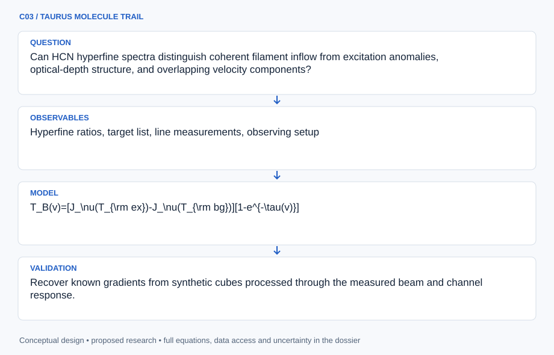

# C03 · TAURUS MOLECULE TRAIL

**Original project:** HCN Mapping of the Taurus Molecular Cloud

**Session C:** Astronomy & Space Physics

**Document class:** engineering research design and analysis record · **Revision:** 2 · **Date:** 2026-10-02

**Evidence state:** design basis, mathematical formulation and verification plan documented. Project-specific empirical results remain to be acquired; executable shared model demonstrations have their own recorded checks.

[Engineering document register](../../ENGINEERING_DOCUMENTATION.md) · [Session C handbook](../../documentation/SESSION_C.md) · [Previous: C02](../C/C02.md) · [Next: C04](../C/C04.md)

## Purpose and scientific objective

Map dense-gas kinematics while explicitly testing whether hydrogen cyanide hyperfine anomalies undermine common optical-depth estimates. Focus first on a declared Taurus filament rather than assuming a cloud-wide survey already exists. Combine HCN spectra with an independent density or velocity tracer to determine when a simple excitation fit is adequate and when non-LTE transfer is necessary.

**Question:** Can HCN hyperfine spectra distinguish coherent filament inflow from excitation anomalies, optical-depth structure, and overlapping velocity components?

**Testable hypothesis:** A non-LTE, hyperfine-aware forward model jointly constrained by an independent tracer will reduce false claims of infall compared with a shared-excitation-temperature fit.

## 1. Design basis and analysis boundary

The HCN analysis boundary is a calibrated spectral cube for a declared Taurus region, plus independent tracer or dust constraints. It outputs posterior component velocities, optical-depth diagnostics and conditional excitation parameters. A cloud-wide map is not assumed available. The HCN anomaly publication establishes why hyperfine ratios require checking before a common-excitation fit is interpreted physically.

The fidelity ladder moves from a shared-Tex hyperfine profile to multiple kinematic components and then a hyperfine-resolved non-LTE calculation. Higher fidelity is justified by predictive residuals and adequate collisional data, not by an automatic preference for complexity. Telescope beam efficiency, spectral response and source coverage remain TBD. Dense-gas mass is excluded unless abundance and geometry acquire independent constraints.

## 2. Requirements and verification traceability

These are project design requirements or proposed analysis gates. A numerical target is not a NASA requirement unless its controlling source is explicitly identified. “TBD” identifies evidence required before a decision; it is not permission to assume a value. Verification evidence listed here is planned, unless a linked result explicitly records execution.

| ID | Requirement / gate | Engineering rationale | Verification method | Basis / required evidence |
| --- | --- | --- | --- | --- |
| C03-R1 | Rest frequencies and hyperfine offsets shall be pinned to a laboratory catalog version. | Frequency errors directly bias component velocities. | Catalog-version audit and frequency-to-velocity fixture. | CDMS is the existing rest-frequency source. |
| C03-R2 | Convolved synthetic spectra shall conserve integrated line brightness to 0.5%, a proposed numerical target. | Spectral smoothing must not change optical-depth diagnostics. | Kernel normalization and grid-refinement test. | Proposed integration target. |
| C03-R3 | Tracer comparisons shall use a common effective beam and velocity convention. | Different resolutions can fabricate filament gradients. | Beam convolution and LSR convention audit. | Proposed comparison contract. |
| C03-R4 | An inflow interpretation shall include a multiple-component and excitation-anomaly alternative. | Asymmetry alone is not a unique kinematic indicator. | Posterior predictive comparison in withheld positions. | Proposed scientific requirement. |

## 3. Architecture and controlled interfaces

The cube adapter supplies RA/Dec, beam, channel frequencies, main-beam brightness, channel covariance and flags. A laboratory-frequency service provides hyperfine transitions and uncertainties. Spectral fitting works in a declared LSR frame with the instrument response applied to every prediction. An independent-tracer adapter carries its own beam and calibration metadata; maps are convolved before cross-tracer inference.

A transfer engine evaluates shared-excitation and non-LTE branches. A component selector retains alternate line-of-sight decompositions rather than collapsing ambiguous spectra into moment centroids. The map assembler propagates component-membership and shared calibration covariance into spatial gradients. Missing channels and baseline failures therefore affect both local excitation and the uncertainty of any global filament flow.

Hyperfine transfer and competing components precede spatial flow inference; independent tracers constrain only the parameters their resolution supports.

[Editable engineering diagram source](../../visuals/projects/C03.mmd)

## 4. Mathematical model and derivation

### Governing equations

$$
T_B(v)=[J_\nu(T_{\rm ex})-J_\nu(T_{\rm bg})][1-e^{-\tau(v)}]
$$

$$
J_\nu(T)=(h\nu/k)/(e^{h\nu/(kT)}-1)
$$

$$
\tau(v)=\sum_h\tau_h\exp[-(v-v_0-\Delta v_h)^2/(2\sigma_v^2)]
$$

### Variables, units and conventions

- Brightness temperature TB and Tex in K; frequency nu in Hz
- Line velocity, centroid v0, hyperfine offsets, and sigma_v in km s^-1
- Optical depth tau dimensionless; column density in cm^-2
- H2 number density in cm^-3; kinetic temperature distinct from excitation temperature
- Beam filling fraction and spectral response must be included in the observation operator

### Assumptions and boundary conditions

- The displayed common-Tex expression is a baseline, not a guarantee that HCN hyperfine excitation is LTE.
- Spatial resolution and tracer beam sizes are matched before comparing maps.

### Derivation step 1

$$
J_\nu(T)=\frac{h\nu/k}{\exp(h\nu/kT)-1}
$$

This radiation temperature has units kelvin and approaches T in the Rayleigh-Jeans limit h nu much smaller than kT.

### Derivation step 2

$$
T_B=\eta_f[J_\nu(T_{ex})-J_\nu(T_{bg})](1-e^{-\tau})
$$

Insert beam filling eta_f explicitly. Brightness constrains a product of filling and excitation; optically thick lines saturate in tau.

### Derivation step 3

$$
\tau(v)=\sum_h\tau_h\exp[-(v-v_0-\Delta v_h)^2/(2\sigma_v^2)]
$$

A shared centroid and width connect hyperfine transitions only in the baseline. Independent excitation or overlap can invalidate fixed relative tau_h.

### Derivation step 4

$$
\frac{dv_0}{ds}\approx\frac{v_0(s_2)-v_0(s_1)}{s_2-s_1}
$$

Convert angular separation to projected distance using an uncertain Taurus distance. Sample both component identity and spatial covariance before interpreting the gradient.

### Inference or simulation procedure

Fit the baseline to obtain residual diagnostics, then solve statistical equilibrium with hyperfine-resolved collisional rates and line overlap where available. Compare single-component and multi-component spectra using predictive checks, not only moment maps. Estimate filament gradients from posterior centroid samples with spatial covariance. Calibrate intensity to main-beam temperature using documented efficiencies. Use dust or an optically thinner molecular tracer to constrain temperature, column, and abundance degeneracies; do not turn HCN intensity directly into a universal dense-gas mass.

### Validity domain and fidelity limits

Abundance, depletion, electron excitation, beam dilution, and transfer geometry are weakly identifiable from one transition. An apparent blue asymmetry alone is insufficient to establish accretion.

## 5. Data specifications and provenance

| Field | Type | Unit | Physical / statistical meaning | Quality and missing-data rule |
| --- | --- | --- | --- | --- |
| sky_position | float64[2] | degree ICRS | Cube pixel coordinate. | WCS and distance assumption required. |
| channel_velocity | float64[n] | km s^-1 LSR | Velocity channels with declared LSR definition. | Rest frequency and Doppler convention mandatory. |
| brightness | float64[n] | K main-beam | Baseline-subtracted spectrum. | Mask bad channels; preserve negative noise realizations. |
| spectral_cov | float64[n,n] | K^2 | Thermal and baseline covariance. | Do not infer independent channels after smoothing. |
| beam | struct<float64> | arcsec, degree | Major/minor FWHM and position angle. | Match before any cross-tracer ratio. |
| component_velocity | posterior<float64[]> | km s^-1 | Alternative kinematic-component centroids. | Ambiguous assignments retain probability weights. |
| excitation_state | posterior<struct> | K, cm^-3, 1 | Tex or non-LTE density/temperature/tau parameters. | Upper/lower bounds and prior dependence reported. |

[Machine-readable record schema](../../data/contracts/C03.schema.json) · [Empty acquisition CSV](../../data/contracts/C03.csv) · [Field dictionary CSV](../../data/contracts/C03.dictionary.csv)

The CSV above contains column headers only. Its schema defines future records and does not establish that original-team data or a particular archive product have been acquired. Frame, timing, calibration, covariance, selection and provenance details must accompany populated records.

### HCN anomaly survey publication

[Product, archive or reference](https://arxiv.org/abs/1305.1303)

**Fields:** Hyperfine ratios, target list, line measurements, observing setup

**Access:** Open paper; original spectral cubes may require author or telescope archive access.

**Role:** Empirical anomaly benchmark.

### Cologne spectroscopy laboratory data

[Product, archive or reference](https://cdms.astro.uni-koeln.de/classic/cologne_data)

**Fields:** HCN frequencies, uncertainties, spectroscopic constants, fitting references

**Access:** Public laboratory discovery page; select main-isotope state and document catalog version.

**Role:** Rest-frequency provenance.

### New or recovered Taurus cube

[Product, archive or reference](https://baas.aas.org/pub/2025n4i414p05/release/1?readingCollection=db75f3fa)

**Fields:** RA, Dec, LSR velocity, TB, variance, beam, flags

**Access:** Conference abstract describes an HCN mapping effort; it is not proof of a downloadable cube.

**Role:** Candidate collaboration/data lead.

## 6. Uncertainty, sensitivity and identifiability

Optical depth, excitation temperature and beam filling are strongly covariant; an optically thick brightness plateau cannot determine tau. HCN abundance and depletion add another degeneracy between molecular column and total gas. Propagate telescope gain as a shared scale parameter across pixels rather than independent pixel noise, and represent baseline-polynomial uncertainty as a channel-correlated term.

Test identifiability with synthetic low-tau and saturated spectra, varying filling and density over the prior domain. Compare likelihood singular directions and posterior changes when an independent temperature or optically thinner tracer is added. Hyperfine collision-rate and geometry uncertainty belong to model discrepancy. Report robust velocities separately from conditional column or density values when additional transitions cannot break the degeneracy.

## 7. Engineering trade study

| Alternative | Benefit | Cost / limitation | Decision rule |
| --- | --- | --- | --- |
| Shared-Tex hyperfine fit | Rapid, interpretable anomaly residuals. | Fails under unequal excitation and overlapping components. | Keep where residuals are noise-consistent on held-out channels. |
| Multiple velocity components | Captures blended filaments. | Component labels and opacity can exchange roles. | Use when independent tracer velocities support decomposition. |
| Non-LTE transfer | Models density-sensitive populations. | Collision rates and geometry may be incomplete. | Adopt only with available rates and demonstrable predictive improvement. |

## 8. Verification and validation cases

| Case ID | Stimulus / condition | Expected result / criterion | Method | Evidence artifact |
| --- | --- | --- | --- | --- |
| C03-V1 | Thin-limit expansion | Brightness approaches eta_f(Jex-Jbg)tau for tau tending to zero. | Compare exact and first-order expressions over decreasing tau. | Taylor expansion of radiative transfer. |
| C03-V2 | Thick-limit saturation | Brightness approaches eta_f(Jex-Jbg), independent of larger tau. | Synthetic high-tau channel evaluation. | Analytic transfer limit. |
| C03-V3 | Two-component blend | Posterior includes ambiguity rather than a falsely precise single flow. | Inject separated and overlapping hyperfine spectra through measured channel response. | Proposed identifiability test. |
| C03-V4 | Withheld map positions | Gradient prediction is assessed away from fit positions. | Spatial block holdout with matched beams. | Proposed spatial validation. |

**Execution status:** these cases are specified, not claimed as executed. Close a case only with the versioned inputs, output, uncertainty, reviewer and pass/fail rationale.

### Additional scientific validation gates

- Recover known gradients from synthetic cubes processed through the measured beam and channel response.
- Hold out contiguous sky tiles; require predictive residuals to be compatible with measured line-free noise.
- Repeat inference after removing severely anomalous components and changing abundance priors.

## 9. Implementation and reproducible work packages

1. Create cube manifest with telescope efficiency, WCS and LSR metadata.
2. Load versioned laboratory transitions and hyperfine uncertainty tables.
3. Implement response-convolved baseline transfer and multi-component fits.
4. Add non-LTE solver only after collision-rate provenance review.
5. Build posterior map and spatial-gradient assembler with ambiguity masks.
6. Release thin/thick-limit fixtures, held-out predictions and tracer-match diagnostics.

### Investigation sequence

1. Choose a field and define the velocity frame, sensitivity target, and beam-matching strategy.
2. Acquire usable cubes or establish an observing request; inspect baseline and calibration scans.
3. Fit spectra and residual anomaly maps; propagate spatially varying completeness into gradient inference.
4. Compare velocity structure with independent tracers and preregister which pattern would falsify an inflow interpretation.

### Resources and interfaces to expertise

- Radio spectroscopy tools, non-LTE radiative-transfer solver, telescope calibration expertise, cube storage.

## 10. Failure modes and interpretation controls

| Failure mode | Effect on result | Detection / evidence | Design response |
| --- | --- | --- | --- |
| Hyperfine anomaly forced into velocity | Spurious filament inflow. | Structured residuals at specific hyperfine offsets. | Allow excitation alternatives before flow interpretation. |
| Mismatched beam | Artificial tracer ratios. | Ratio changes under common-beam smoothing. | Convolve all comparisons and propagate covariance. |
| Baseline ripple | False weak components. | Off-line residual autocorrelation. | Fit baseline jointly or reject affected spectra. |

- Baseline ripples and self-absorption can mimic multiple components; archived mapping access remains a project gate.

## 11. Required engineering outputs

- Uncertainty-aware HCN atlas, hyperfine anomaly mask, velocity-component catalog, and constrained inflow hypotheses.

### Scientific result figures to produce during execution

Interactive sky map of posterior velocities and anomaly ratios linked to spectra and competing forward-model curves.

## 12. Cited technical and scientific resources

- [Loughnane et al. (2013), HCN hyperfine anomalies](https://arxiv.org/abs/1305.1303) — Non-LTE anomaly evidence in Taurus and other cores.
- [Goicoechea et al. (2021), HCN excitation and transfer](https://arxiv.org/abs/2111.03609) — Line overlap and collision mechanisms.
- [CDMS laboratory data](https://cdms.astro.uni-koeln.de/classic/cologne_data) — Spectroscopic input discovery.

Framework and evidence rules: [engineering documentation standard](../../docs/ENGINEERING_STANDARD.md), [model assurance](../../docs/MODEL_ASSURANCE.md), [uncertainty procedure](../../docs/UNCERTAINTY_AND_DECISION_RULES.md), and [data management](../../docs/DATA_MANAGEMENT.md). NASA-inspired names are creative identifiers; requirements and results are not NASA certification.
