# C05 · KEPLER WORLDFORGE

**Original project:** Exoplanet Classification using Data Mining

**Session C:** Astronomy & Space Physics
**Status:** proposed research dossier; no project experiment or mission qualification has been performed.

Create a physically interpretable taxonomy of measured exoplanets without converting incomplete discovery catalogs into unsupported claims about the true planet population. Combine probabilistic mass-radius classes with interpretable machine learning and transparent abstention. Separate observed classification from inferred composition: an uncertain radius or mass does not uniquely determine whether a planet has oceans, a rocky interior, or a habitable environment.

## Scientific question

Which planetary classes are stable under measurement uncertainty, missing parameters, catalog updates, and changes in discovery method?

## Testable hypothesis

Uncertainty-integrated classification with host-level splitting and an abstention category will achieve better calibrated labels than deterministic clustering on imputed catalog values.

*Conceptual research design; arrows show the analysis dependency, not observed causation.*

## Mathematical model

$$
\rho_p=3M_p/(4\pi R_p^3)
$$

$$
p(c\mid y)=\int p(c\mid x)\,p(x\mid y)\,dx
$$

$$
\mathcal L=-\sum_i\sum_c w_c\,q_{ic}\log p(c\mid y_i)
$$

### Variables and units

- Planet mass Mp in Earth masses and radius Rp in Earth radii, converted before density calculation
- Density in g cm^-3; orbital period in days; irradiation in Earth-insolation units
- x is latent physical feature vector; y includes asymmetric uncertainties and upper/lower limits
- c is a preregistered empirical class, not a definitive composition or life label
- q is a soft target distribution; weights are fitted using training data only

### Assumptions and boundary conditions

- Prefer internally consistent Planetary Systems references for physical fits; composite tables may mix references.
- Minimum mass M sin i is kept distinct from true mass; inferred catalog quantities receive explicit flags.

### Inference or simulation method

Snapshot current PS and PSCompPars schemas and provenance. Build a baseline taxonomy from radius, density where available, orbit, and host properties, then compare a regularized classifier and mixture model. Integrate asymmetric errors with posterior draws; separate unavailable values from censoring and calculated values. Fit transformations, feature selection, class balancing, and imputation inside nested training folds. Split by host system and survey, because multiplanet systems and mission-specific features otherwise leak information. Assess out-of-distribution planets using feature-domain diagnostics and probabilistic abstention.

### Model limits

Discovery methods have different selection functions, and the confirmed-planet catalog lacks a common nondetection denominator. Catalog-based class frequencies are not occurrence rates. Mass-radius overlaps prevent definitive composition identification.

## Data and provenance contracts

### NASA Exoplanet Archive PS/PSCompPars

[Resource or product discovery](https://exoplanetarchive.ipac.caltech.edu/docs/API_TD_columns.html)

**Fields:** pl_bmasse, pl_rade, pl_orbper, pl_insol, st_teff, st_met, uncertainty and reference fields

**Access:** Public tables; pin query date and exact columns using documented TAP.

**Role:** Measured feature and provenance source.

### Archive TAP documentation

[Resource or product discovery](https://exoplanet.ipac.caltech.edu/docs/TAP/usingTAP.html)

**Fields:** Query, table name, retrieval format, reproducible parameter selections

**Access:** Public API; comply with service limits and record query text.

**Role:** Reproducible extraction.

## Staged execution

1. Define classes, allowed features, censoring policy, and minimum confidence for assigning labels.
2. Retrieve a dated catalog snapshot; audit unit consistency and conflicting references.
3. Train baselines and uncertainty-aware models with nested host/system splits.
4. Release calibrated predictions plus ambiguous and out-of-domain categories, and rerun after a later frozen catalog update.

## Verification and validation

- Evaluate macro recall, Brier score, reliability diagrams, and abstention coverage on unseen hosts.
- Hold out one discovery method and test whether performance survives survey shift.
- Perturb observations using their errors; report class-switch rate and sensitivity to imputation assumptions.

*Any numerical gate is a proposed requirement unless the dossier explicitly identifies a sourced requirement. Freeze gates before collecting confirmatory data.*

## Resources and deliverables

- Python, Astropy, pandas, scikit-learn or probabilistic mixture tools; data-provenance reviewer.

- Versioned feature table, model card, calibrated taxonomy atlas, and reproducible query notebook.

## Risks and interpretation

- Derived mass estimates, duplicate references, and discovery-method proxies can create false predictive skill.

## Figure plan

Interactive mass-radius chart with posterior density contours, class probabilities, missing-data flags, and discovery-method filters.

## Cited scientific resources

- [NASA Exoplanet Archive current column definitions](https://exoplanetarchive.ipac.caltech.edu/docs/API_TD_columns.html) — Table semantics, parameters, and reference structure.
- [NASA Exoplanet Archive TAP guide](https://exoplanet.ipac.caltech.edu/docs/TAP/usingTAP.html) — Supported programmatic retrieval.

Source discovery reviewed 2026-10-02. A public source pointer does not imply original student-team data access. See [model assurance](../../docs/MODEL_ASSURANCE.md) and [data management](../../docs/DATA_MANAGEMENT.md).
