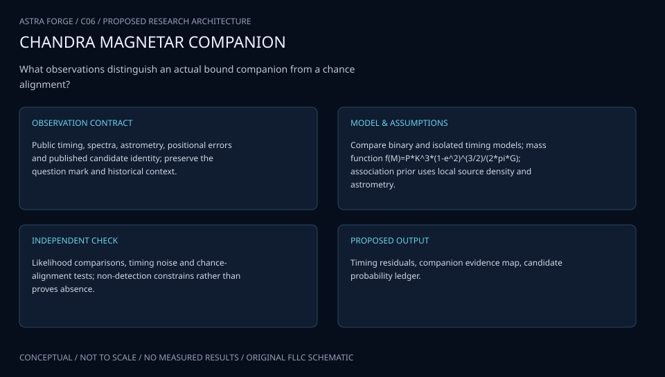

# C06 · PULSAR GEMINI WATCH

**Original project:** The First Magnetar in a Binary System?

**Session C:** Astronomy & Space Physics
**Status:** proposed research dossier; no project experiment or mission qualification has been performed.

Reframe the historical question as a hypothesis comparison for the gamma-ray binary LS I +61 303. Reported radio pulsations support a rotating neutron star, while magnetar-like bursts and a flip-flop interpretation require additional evidence. Keep ordinary pulsar-wind and accretion/propeller explanations alongside magnetic-energy-powered activity; the project will not label a magnetar as confirmed merely because a short burst occurred nearby.

## Scientific question

Can phase-resolved timing, burst localization, and broadband emission distinguish a magnetar-like neutron star from other compact-object models in LS I +61 303?

## Testable hypothesis

A phase-dependent ejector/propeller model with physically consistent energy budgets will predict radio visibility and high-energy variability better than a phase-independent emitter, but magnetic field strength may remain weakly identified.

*Conceptual research design; arrows show the analysis dependency, not observed causation.*

## Mathematical model

$$
r_{\rm lc}=cP/(2\pi);\quad r_{\rm co}=(GMP^2/4\pi^2)^{1/3}
$$

$$
r_m=\xi[\mu^4/(2GM\dot M^2)]^{1/7}
$$

$$
\dot E_{\rm rot}=4\pi^2I\dot P/P^3;\quad B_{\rm dip}\approx3.2\times10^{19}\sqrt{P\dot P}\ \mathrm G
$$

### Variables and units

- P in s and period derivative in s s^-1; use orbital timing corrections
- Magnetospheric, corotation, and light-cylinder radii in cm
- Magnetic moment mu in G cm^3; accretion rate in g s^-1
- I in g cm^2; rotational luminosity in erg s^-1
- xi parametrizes uncertain magnetosphere coupling; the field estimate assumes isolated dipole braking

### Assumptions and boundary conditions

- Do not apply the isolated-dipole field formula as a measurement when orbital acceleration or propeller torques contaminate Pdot.
- Treat burst-source association probabilistically, accounting for instrumental localization.

### Inference or simulation method

Build phase-tagged radio and X-ray/gamma-ray likelihoods with exposure windows and nondetections. Compare models through a latent state defined by characteristic-radius ordering; add free-free radio absorption and variable Be-star outflow. Fit orbital ephemeris and superorbital modulation as nuisance parameters. Quantify whether rotational, accretion, or magnetic energy can support observed luminosity under uncertainty. Use localization and population priors to compare burst association with a chance line-of-sight source. Predict a future orbit before assessing its observations.

### Model limits

A detection of pulsations identifies rotation, not magnetic-energy dominance. Radius formulae depend on geometry; sparse detections and strong absorption make state assignment uncertain.

## Data and provenance contracts

### Weng et al. radio-pulsation publication

[Resource or product discovery](https://arxiv.org/abs/2203.09423)

**Fields:** Pulsation period, observing epochs, significance, timing methods

**Access:** Open paper; availability of raw FAST observations must be established.

**Role:** Neutron-star timing evidence.

### Swift and other HEASARC holdings

[Resource or product discovery](https://heasarc.gsfc.nasa.gov/docs/archive.html)

**Fields:** Burst localization, count spectra, event times, exposure, response

**Access:** Public archive discovery; match observation IDs and instrument calibration.

**Role:** Independent high-energy state and association tests.

## Staged execution

1. Freeze system identity, ephemeris priors, and alternative physical models.
2. Retrieve available event products and reproduce a published phase-folded light curve.
3. Fit timing and luminosity jointly with orbital and absorption uncertainty.
4. Generate phase-specific follow-up predictions that distinguish competing state transitions.

## Verification and validation

- Hold out complete orbits and score flux and detection-probability predictions.
- Use noise-only and injected periodic signals to estimate timing false-alarm rates with the full search trials.
- Reassess burst association under alternative localization and background-source priors; publish inconclusive Bayes factors.

*Any numerical gate is a proposed requirement unless the dossier explicitly identifies a sourced requirement. Freeze gates before collecting confirmatory data.*

## Resources and deliverables

- HEASoft, radio timing tools, Bayesian state modeling, high-energy and binary-star expertise.

- Evidence ledger, phase-state probability map, energy-budget comparison, and falsifiable observation plan.

## Risks and interpretation

- Timing noise, absorption, and burst-position uncertainty can preserve multiple viable interpretations.

## Figure plan

Orbital phase versus inferred emission state with radius-ordering bands, radio visibility, and uncertainty in burst association.

## Cited scientific resources

- [Torres et al. (2011), magnetar-like event and binary hypothesis](https://arxiv.org/abs/1109.5008) — Original hypothesis and flip-flop motivation.
- [Weng et al. (2022), radio pulsations](https://arxiv.org/abs/2203.09423) — Evidence for a rotating neutron star, not definitive magnetar classification.

Source discovery reviewed 2026-10-02. A public source pointer does not imply original student-team data access. See [model assurance](../../docs/MODEL_ASSURANCE.md) and [data management](../../docs/DATA_MANAGEMENT.md).
