# C07 · ARTEMIS MEMORY BRIDGE

**Original project:** Taperings and Analytic Continuations of Supernova Gravitational Waves with Memory

**Session C:** Astronomy & Space Physics
**Status:** proposed research dossier; no project experiment or mission qualification has been performed.

Construct physically constrained continuations of truncated core-collapse waveforms so numerical endpoints do not create spurious low-frequency spectral power. Gravitational-wave memory is a persistent strain change; forcing the late waveform to zero can erase the feature being studied. The output is an auditable continuation and observation operator suitable for comparing detector-band predictions, with explicit uncertainty outside the simulated time interval.

## Scientific question

How can a finite simulation preserve a permanent memory offset while minimizing artificial spectral leakage in a detector with limited low-frequency response?

## Testable hypothesis

A smooth continuation of the strain derivative toward zero, preserving the asymptotic offset, will yield more stable detector-band overlaps than zero-return tapering across physically allowed late-time tails.

*Conceptual research design; arrows show the analysis dependency, not observed causation.*

## Mathematical model

$$
h(t)=h_{\rm osc}(t)+h_{\rm mem}(t);\quad \Delta h=h(+\infty)-h(-\infty)
$$

$$
\dot h_{\rm tail}(t)=a\exp[-(t-t_0)/\tau]\quad\Rightarrow\quad h(t)=h(t_0)+a\tau[1-e^{-(t-t_0)/\tau}]
$$

$$
\widetilde h(f)=\widetilde{\dot h}(f)/(2\pi i f)\quad(f\ne0);\quad d(f)=R(f)\widetilde h(f)+n(f)
$$

### Variables and units

- h and Delta h dimensionless; time t and tau in s; f in Hz
- a is late-time strain rate in s^-1, with physically informed alternatives to the exponential
- R is detector response including declared filtering; n is detector noise
- Distance scaling h proportional to 1/D; orientation and polarization retained
- The zero-frequency distributional component is treated separately from ordinary finite-band Fourier samples

### Assumptions and boundary conditions

- A continuation is a model beyond the numerical end, not recovered simulation truth.
- Preserve the persistent offset and its uncertainty; windowing for finite records must be distinguished from physical decay.

### Inference or simulation method

Match value and derivative at the simulation endpoint, using neutrino-emission and ejecta-momentum information when supplied by the simulation team. Compare exponential, power-law, and monotone integrated-tail families with bounded total memory. Compute transforms through the derivative and analytic tail, then apply detector response and the exact analysis window. Propagate continuation, sky orientation, and filtering uncertainty into noise-weighted overlaps. Separate linear matter/neutrino memory from nonlinear GW memory; include only components actually modeled. Benchmark across waveform families and truncation times.

### Model limits

The late neutrino luminosity and anisotropy are poorly known; a numerically smooth tail need not be physically valid. Ground-based interferometers do not measure a permanent DC displacement directly.

## Data and provenance contracts

### Richardson et al. memory modeling

[Resource or product discovery](https://arxiv.org/abs/2109.01582)

**Fields:** Waveform continuation examples, polarizations, simulation context

**Access:** Open paper; inspect waveform availability and original simulation licensing.

**Role:** Primary physical and numerical baseline.

### GWOSC noise and technical data

[Resource or product discovery](https://gwosc.org/)

**Fields:** Strain segments, quality masks, detector metadata

**Access:** Public; select released observing-run products and permitted calibrated band.

**Role:** Measured noise for detector-band impact.

## Staged execution

1. Define Fourier convention, reference strain offset, detector band, and continuation priors.
2. Implement analytic tails and derivative transforms with high-precision reference calculations.
3. Truncate complete test signals at multiple times and estimate lost-tail uncertainty.
4. Release finite-band predictions and explicit extrapolation envelopes for each waveform orientation.

## Verification and validation

- Test analytic steps and smooth memory ramps with known transforms; verify distance scaling and convergence.
- Hide late segments of sufficiently long simulations and compare recovered detector-band spectra.
- Report overlap loss and inferred memory bias across tails, record lengths, and high-pass filters; never validate using only the tail family that generated the injection.

*Any numerical gate is a proposed requirement unless the dossier explicitly identifies a sourced requirement. Freeze gates before collecting confirmatory data.*

## Resources and deliverables

- Python numerical Fourier tools, GW analysis library, simulation collaborator, waveform and unit conventions reviewer.

- Continuation library, transform tests, detector-band error atlas, and waveform provenance specification.

## Risks and interpretation

- Zero padding and endpoint tapering can manufacture spectral features; claimed sub-band sensitivity must respect calibration.

## Figure plan

Persistent-strain waveform, derivative-tail alternatives, and detector-weighted spectra with extrapolation bands; no artificial return to zero.

## Cited scientific resources

- [Richardson et al. (2021), CCSN memory modeling](https://arxiv.org/abs/2109.01582) — Physical memory, truncation artifacts, and continuation questions.
- [Richardson et al. (2024), detecting CCSN memory](https://arxiv.org/abs/2404.02131) — Detector-oriented search precedent.

Source discovery reviewed 2026-10-02. A public source pointer does not imply original student-team data access. See [model assurance](../../docs/MODEL_ASSURANCE.md) and [data management](../../docs/DATA_MANAGEMENT.md).
