# C08 · MARS NILI SPECTRAL VAULT

**Original project:** Laboratory Analysis of olivine-carbonate mixtures as observed on Mars

**Session C:** Astronomy & Space Physics
**Status:** proposed research dossier; no project experiment or mission qualification has been performed.

Translate Mars orbital mineral signatures into a controlled laboratory test of mixture geometry, grain size, and alteration interpretations. Measure known olivine-carbonate mixtures and compare areal mixing with intimate-grain scattering. Link the laboratory results to verified CRISM observations of Nili Fossae or another documented carbonate unit, while preserving the distinction between a mineral spectral detection and proof of a unique formation environment.

## Scientific question

Which carbonate fractions and grain-size combinations can be identified reliably at CRISM-like resolution when olivine, dust, and atmospheric residuals overlap?

## Testable hypothesis

A geometry-aware scattering model will predict carbonate detectability and abundance intervals more accurately than linear reflectance unmixing on intimate mixtures.

*Conceptual research design; arrows show the analysis dependency, not observed causation.*

## Mathematical model

$$
R_{\rm areal}(\lambda)=\sum_k f_kR_k(\lambda);\quad f_k\ge0,\ \sum_k f_k=1
$$

$$
R_{\rm intimate}(\lambda)=\mathcal H[w_{\rm mix}(\lambda),g,i,e,\theta]
$$

$$
R_{{\rm obs},j}=\int L_j(\lambda)R(\lambda)d\lambda+\epsilon_j
$$

### Variables and units

- Reflectance R and single-scattering albedo w dimensionless
- Wavelength in micrometers; grain size in micrometers; mass fraction distinguished from area fraction
- i, e, g are incidence, emergence, and phase angles in degrees
- L_j is normalized instrument spectral response; epsilon includes correlated residuals
- Mixture densities and grain-size distributions are measured when translating optical fractions into mass fractions

### Assumptions and boundary conditions

- Use measured mineral purity and particle distributions rather than assuming catalog endmembers match the samples.
- Linear reflectance applies to an areal baseline; intimate mixing is handled in an optical scattering space.

### Inference or simulation method

Design replicated mixtures over carbonate fraction and sieved particle sizes, randomized by measurement order. Measure dry reflectance across carbonate and olivine diagnostic bands and include blind mixtures, dust coatings, and repeat standards. Fit areal and Hapke-style or equivalent radiative-transfer models with nuisance geometry and calibration terms. Convolve every prediction with CRISM band responses, add observed noise and atmospheric-residual covariance, and estimate detection probability. Analyze orbital regions through the same observation operator with spatial controls and alternate correction settings.

### Model limits

Mineral assemblages can arise from multiple alteration histories. Optical-model fractions may not equal bulk abundance; laboratory vacuum, grain packing, and weathering differ from Martian surfaces.

## Data and provenance contracts

### USGS Spectral Library Version 7

[Resource or product discovery](https://www.usgs.gov/data/usgs-spectral-library-version-7-data)

**Fields:** Mineral spectra, mixture metadata, grain-size descriptions, measurement artifacts

**Access:** Public release, DOI 10.5066/F7RR1WDJ; verify chosen sample records.

**Role:** Reference endmembers and standards.

### PDS MRO CRISM archive

[Resource or product discovery](https://pds-geosciences.wustl.edu/missions/mro/crism.htm)

**Fields:** Radiance or reflectance cubes, wavelength calibration, geometry, quality metadata

**Access:** Public archive; select exact product level and observation identifiers before processing.

**Role:** Orbital comparison and noise characterization.

## Staged execution

1. Specify sample purity, size bins, geometry, detection rule, and carbonate band convention.
2. Acquire replicated spectra and instrument blanks; include mixtures concealed from analysts.
3. Fit competing mixing models and convolve to the orbital instrument.
4. Produce abundance-identifiability and detection-completeness maps for selected Mars observations.

## Verification and validation

- Recover blind known mixtures with intervals that include measured composition at stated coverage.
- Hold out entire grain-size families and dust conditions to test model transfer.
- Check orbital detections in repeated observations and nearby noncarbonate controls; report artifact-sensitive pixels.

*Any numerical gate is a proposed requirement unless the dossier explicitly identifies a sourced requirement. Freeze gates before collecting confirmatory data.*

## Resources and deliverables

- VNIR spectrometer, particle-size measurement, mineral standards, CRISM expertise, radiative-transfer code.

- Laboratory mixture library, model posterior tables, CRISM detectability atlas, and qualified geologic interpretation.

## Risks and interpretation

- Carbonate dust, contaminants, and incorrect atmospheric correction can yield false signatures; laboratory handling requires ordinary mineral-dust controls.

## Figure plan

Measured and forward-modeled mixture spectra with carbonate-fraction versus grain-size detectability contours and masked orbital maps.

## Cited scientific resources

- [Ehlmann et al. (2008), orbital carbonate identification](https://www.usgs.gov/publications/orbital-identification-carbonate-bearing-rocks-mars) — Observed Mars carbonate association and interpretation.
- [USGS Spectral Library v7](https://www.usgs.gov/data/usgs-spectral-library-version-7-data) — Reference spectra and sample metadata.
- [PDS CRISM archive](https://pds-geosciences.wustl.edu/missions/mro/crism.htm) — Instrument data discovery.

Source discovery reviewed 2026-10-02. A public source pointer does not imply original student-team data access. See [model assurance](../../docs/MODEL_ASSURANCE.md) and [data management](../../docs/DATA_MANAGEMENT.md).
