# C09 · EAGLESAT COSMIC PIXEL

**Original project:** EagleSat Team: Determining Particle Energy Using CMOS Sensors

**Session C:** Astronomy & Space Physics
**Status:** proposed research dossier; no project experiment or mission qualification has been performed.

Develop a calibrated CMOS particle-response demonstrator for space radiation measurements. The key scientific correction is that charge collected in a thin silicon sensor measures deposited energy; a penetrating particle may retain most of its incident energy. Define useful energy or species inference only within a validated sensor geometry, detector response, and irradiation domain, while explicitly retaining ambiguous track classes.

## Scientific question

Under which particle species, angles, energies, and sensor temperatures can CMOS charge patterns constrain deposited energy or a calibrated incident-energy interval?

## Testable hypothesis

Joint cluster morphology and charge inference with a sensor-response matrix will provide calibrated deposited-energy estimates, while incident-energy estimates will require stopping tracks or additional detector constraints.

*Conceptual research design; arrows show the analysis dependency, not observed causation.*

## Mathematical model

$$
E_{\rm dep}=\epsilon_{\rm pair}N_{eh};\quad\epsilon_{\rm pair}\approx3.6\ \mathrm{eV}\ \text{for silicon, with calibration uncertainty}
$$

$$
E_{\rm dep}\approx\int_{\rm track}(dE/dx)\,dx
$$

$$
p(q,m\mid E,s,\theta,T)=\mathcal R(q,m;E,s,\theta,T);\quad p(E\mid q,m)\propto p(q,m\mid E)p(E)
$$

### Variables and units

- Incident and deposited energies in keV or MeV, never interchanged
- Collected charge q in electrons after gain/ADC calibration
- m includes cluster extent, eccentricity, and per-pixel charge; geometry in micrometers
- theta is incidence angle; temperature T in K; s is species label
- R includes depletion thickness, charge diffusion, thresholds, saturation, shielding, and dead layers

### Assumptions and boundary conditions

- Dark frames and flat fields establish electronic gain and noise independently of particle irradiation.
- A consumer CMOS sensor may have undocumented active thickness and nonlinearity; infer these as calibration uncertainties.

### Inference or simulation method

Construct a forward sensor model using stopping powers or particle transport plus measured charge sharing. Acquire dark and optically shielded frames over temperature; characterize hot pixels and electronic artifacts before classifying particle candidates. Calibrate with qualified reference exposures at a licensed facility or an established detector laboratory, using measured beam geometry and dosimetry. Estimate a response matrix and use likelihood-based energy bins with abstention for overlapping species/angle responses. Evaluate onboard event compression without silently changing low-charge completeness. Treat the EagleSat label as a project identity, not proof of prior hardware performance.

### Model limits

One thin detector generally cannot uniquely recover incident particle energy, species, and angle. Saturation, radiation damage, rolling shutters, and shielding introduce domain shift between laboratory and orbit.

## Data and provenance contracts

### NIST PSTAR proton stopping powers

[Resource or product discovery](https://physics.nist.gov/PhysRefData/Star/Text/PSTAR.html)

**Fields:** Energy, electronic/nuclear stopping power, CSDA range for silicon

**Access:** Public reference; record selected material and energy grid.

**Role:** First-order proton energy-loss model.

### New calibration and dark-frame campaign

[Resource or product discovery](https://arxiv.org/abs/2607.02106)

**Fields:** Raw frames, temperature, ADC settings, reference irradiation conditions, event labels

**Access:** Generate through approved detector-lab access; no flight or calibration measurements supplied here.

**Role:** Ground truth and instrument characterization.

## Staged execution

1. Freeze science requirements as deposited-energy resolution, event efficiency, and accepted false-event rate.
2. Measure electronics and noise before fitting any particle-response model.
3. Develop transport-informed response matrices and collect independent reference exposures.
4. Evaluate shielding, temperature, event compression, and damage sensitivity; retain a model-domain flag in telemetry.

## Verification and validation

- Use held-out beam energies, temperatures, and sensor units; report energy bias and interval coverage.
- Measure false-event rates on dark data and optical-leak controls.
- Compare reconstructed deposited energy with independent reference-detector measurements; separately report identifiable incident-energy domains.

*Any numerical gate is a proposed requirement unless the dossier explicitly identifies a sourced requirement. Freeze gates before collecting confirmatory data.*

## Resources and deliverables

- CMOS evaluation board, shielding fixture, thermal chamber, reference detector, qualified irradiation partner, transport code.

- Sensor calibration dossier, energy-response matrix, event classifier with abstention, and telemetry/data schema.

## Risks and interpretation

- Undocumented sensor physics may limit the project to particle counting and deposited-energy proxies; irradiation access is a real dependency.

## Figure plan

Incident-energy versus deposited-charge response heatmaps linked to example clusters, saturation regions, and uncertainty-aware reconstructed energy.

## Cited scientific resources

- [NIST PSTAR](https://physics.nist.gov/PhysRefData/Star/Text/PSTAR.html) — Proton stopping power and range reference.
- [Takano et al. (2026), CMOS cosmic-ray demonstrator](https://arxiv.org/abs/2607.02106) — Feasibility precedent for event detection; not evidence of incident-energy accuracy.

Source discovery reviewed 2026-10-02. A public source pointer does not imply original student-team data access. See [model assurance](../../docs/MODEL_ASSURANCE.md) and [data management](../../docs/DATA_MANAGEMENT.md).
