# C10 · VOYAGER LOCAL GROUP HALOS

**Original project:** MW-Andromeda Dark Matter Halo Velocity Dispersion Profiles

**Session C:** Astronomy & Space Physics
**Status:** proposed research dossier; no project experiment or mission qualification has been performed.

Infer the gravitational potentials of the Milky Way and Andromeda through matched stellar-tracer models. Measured stellar velocity dispersions are not direct measurements of dark-matter particle velocity dispersions. Use tracer-density and anisotropy assumptions explicitly, separate equilibrium halo stars from tidal debris, and then predict a dark-matter dispersion profile only under an additional distribution-function or Jeans model.

## Scientific question

Which differences between Milky Way and M31 potential and dispersion profiles survive matched tracer selection, anisotropy uncertainty, and removal of tidal substructure?

## Testable hypothesis

Jointly modeling halo membership, tracer density, and anisotropy will broaden mass uncertainties but reduce spurious galaxy-to-galaxy differences caused by unmatched stellar populations.

*Conceptual research design; arrows show the analysis dependency, not observed causation.*

## Mathematical model

$$
\frac{d(\nu_*\sigma_r^2)}{dr}+\frac{2\beta\nu_*\sigma_r^2}{r}=-\nu_*\frac{GM(<r)}{r^2}
$$

$$
\rho_{\rm NFW}(r)=\rho_s/[x(1+x)^2],\quad x=r/r_s
$$

$$
\Sigma(R)\sigma_{\rm los}^2(R)=2\int_R^\infty[1-\beta R^2/r^2]\nu_*\sigma_r^2\frac{r\,dr}{\sqrt{r^2-R^2}}
$$

### Variables and units

- r and R in kpc; masses in solar masses; dispersion in km s^-1
- nu_* is stellar tracer density, distinct from dark-matter density rho
- beta=1-(sigma_theta^2+sigma_phi^2)/(2 sigma_r^2)
- NFW scale density and radius describe a tested potential family, not established exact profiles
- Proper-motion, distance, line-of-sight velocity, and solar-frame covariance are propagated jointly

### Assumptions and boundary conditions

- Spherical equilibrium is a baseline approximation and must be stress-tested against substructure and flattening.
- A dark-matter velocity prediction requires a separately specified density and anisotropy/distribution function.

### Inference or simulation method

Fit mixture membership for halo, disk, foreground, and identified debris components. Use Milky Way phase-space data where available and M31 line-of-sight tracer measurements through their distinct selection functions. Combine an NFW or alternate halo with constrained disk and bulge potentials; compare constant and flexible anisotropy. Perform forward selection and observation of mock catalogs, including measurement errors. Compare profiles at matched scaled radii and tracer classes. Derive dark-matter dispersions through a separate equilibrium solution and label them as conditional predictions.

### Model limits

The mass-anisotropy degeneracy, non-equilibrium streams, uncertain outer tracer density, and Milky Way frame conversion can dominate. M31 projected data and Milky Way 3D data provide unequal information.

## Data and provenance contracts

### SPLASH stellar-halo dispersion publication

[Resource or product discovery](https://arxiv.org/abs/1711.02700)

**Fields:** M31 field positions, stellar velocities, mixture memberships, radial dispersion

**Access:** Open paper; retrieve associated tables or author-provided catalog and inspect permissions.

**Role:** M31 stellar-tracer measurements.

### M31 outer globular cluster kinematics

[Resource or product discovery](https://arxiv.org/abs/1406.0186)

**Fields:** Projected radii, cluster velocities, rotation and substructure

**Access:** Publication tables; independent tracer selection and calibration required.

**Role:** Independent M31 tracer validation.

### ESA Gaia Archive

[Resource or product discovery](https://gea.esac.esa.int/archive/)

**Fields:** Astrometry, covariance, proper motions, radial velocities, quality and crossmatch fields

**Access:** Public DR3 data; distant halo tracers often require ground-based velocities and independent distance estimates.

**Role:** Milky Way phase-space measurements.

## Staged execution

1. Declare comparable tracer populations and radial domains; establish Milky Way catalog provenance before fitting.
2. Fit mixture memberships and survey selection, retaining low-probability cases probabilistically.
3. Infer baryonic and halo potentials with anisotropy uncertainty; create matched mock catalogs.
4. Publish measured stellar dispersions separately from conditional dark-matter velocity predictions.

## Verification and validation

- Hold out radial ranges and observing fields and test predicted velocity distributions.
- Recover mass profiles from mock halos with streams, anisotropy gradients, and flattened potentials.
- Cross-check M31 inference against globular clusters and Milky Way inference against independent tracer families.

*Any numerical gate is a proposed requirement unless the dossier explicitly identifies a sourced requirement. Freeze gates before collecting confirmatory data.*

## Resources and deliverables

- Dynamics code, Bayesian sampler, stellar catalog expertise, Gaia/ground-spectroscopy access, mock-halo simulations.

- Selection-aware tracer catalog, potential posterior atlas, matched Local Group comparison, and explicit conditional DM predictions.

## Risks and interpretation

- Calling stellar dispersion dark-matter dispersion would overstate the measurement; equilibrium failures must appear in the uncertainty budget.

## Figure plan

Measured stellar-dispersion profiles and separately labeled conditional dark-matter profiles, showing anisotropy bands and held-out tracer points.

## Cited scientific resources

- [Gilbert et al. (2017), SPLASH dispersion profile](https://arxiv.org/abs/1711.02700) — M31 stellar-halo mixture modeling and data.
- [Veljanoski et al. (2014), M31 cluster kinematics](https://arxiv.org/abs/1406.0186) — Independent tracer and substructure evidence.
- [Bird et al. (2022), Milky Way stellar-halo Jeans analysis](https://arxiv.org/abs/2207.08839) — Milky Way tracer-density, anisotropy, and systematic-error treatment.
- [ESA Gaia Archive](https://gea.esac.esa.int/archive/) — Milky Way astrometric measurement access.

Source discovery reviewed 2026-10-02. A public source pointer does not imply original student-team data access. See [model assurance](../../docs/MODEL_ASSURANCE.md) and [data management](../../docs/DATA_MANAGEMENT.md).
