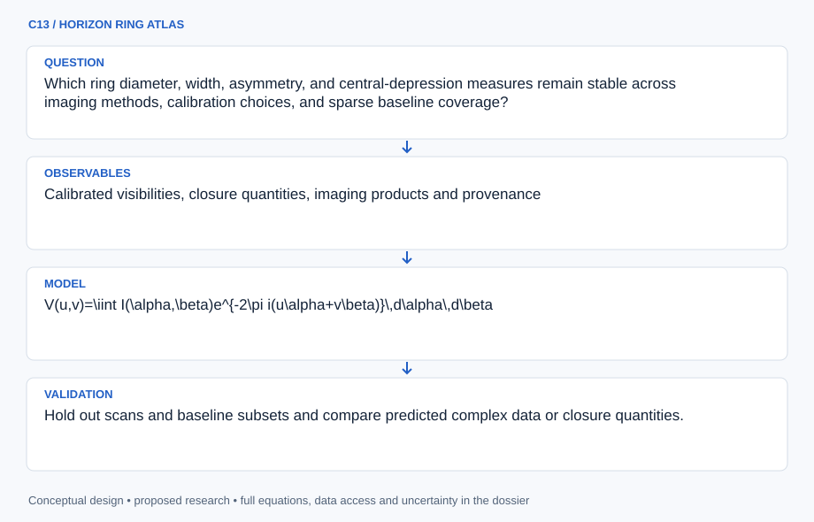

# C13 · HORIZON RING ATLAS

**Original project:** Characterizing the Images of Black Hole Shadows

**Session C:** Astronomy & Space Physics

**Document class:** engineering research design and analysis record · **Revision:** 2 · **Date:** 2026-10-02

**Evidence state:** design basis, mathematical formulation and verification plan documented. Project-specific empirical results remain to be acquired; executable shared model demonstrations have their own recorded checks.

[Engineering document register](../../ENGINEERING_DOCUMENTATION.md) · [Session C handbook](../../documentation/SESSION_C.md) · [Previous: C12](../C/C12.md) · [Next: C14](../C/C14.md)

## Purpose and scientific objective

Measure robust geometric features of black-hole emission-ring images through the interferometric observation process. Use public Event Horizon Telescope visibilities and released imaging products to distinguish data-supported ring geometry from regularization choices. The apparent emission ring and central brightness depression are related to strong-field lensing but are not identical to an isolated, directly photographed event horizon.

**Question:** Which ring diameter, width, asymmetry, and central-depression measures remain stable across imaging methods, calibration choices, and sparse baseline coverage?

**Testable hypothesis:** Direct fitting of visibility-domain geometric models combined with independent image reconstructions will yield more defensible geometry than measuring a single favored reconstructed image.

## 1. Design basis and analysis boundary

The black-hole image analysis fits interferometric measurements before interpreting reconstructed pixels. Its primary quantities are emission-ring diameter, width, asymmetry and central depression under stated imaging and source models. Public EHT releases establish the visibility and reconstruction context. A fitted emission ring is not equated to a directly imaged horizon, and the Schwarzschild shadow formula is a reference geometry only.

Begin with geometric sources in visibility space, advance to reconstruction ensembles, and then compare ray-traced emission families. M87 and Sgr A require distinct variability/scattering assumptions. Station calibration, uv coverage and release identity remain explicit inputs. Image-domain measurements carry reconstruction covariance; numerous correlated pixels cannot be treated as independent evidence.

## 2. Requirements and verification traceability

These are project design requirements or proposed analysis gates. A numerical target is not a NASA requirement unless its controlling source is explicitly identified. “TBD” identifies evidence required before a decision; it is not permission to assume a value. Verification evidence listed here is planned, unless a linked result explicitly records execution.

| ID | Requirement / gate | Engineering rationale | Verification method | Basis / required evidence |
| --- | --- | --- | --- | --- |
| C13-R1 | Every reconstruction shall use a pinned visibility release, station gains and common data exclusions. | Algorithm differences are uninterpretable if inputs change. | Dataset and exclusion hash audit. | EHT data-product provenance. |
| C13-R2 | Synthetic constant-flux and centered-source tests shall satisfy visibility identities to 0.1%, a proposed numerical target. | Fourier normalization errors bias ring geometry. | Analytic source/zero-baseline fixtures. | Proposed transform target. |
| C13-R3 | Ring claims shall be compared with nonring alternatives through actual uv coverage. | Sparse coverage and regularization can imprint a ring. | Blind synthetic ring/nonring reconstruction challenge. | Proposed specificity requirement. |
| C13-R4 | Diameter uncertainty shall include calibration, imaging hyperparameters and source variability where applicable. | One reconstructed image understates error. | Visibility posterior and reconstruction-ensemble comparison. | Proposed uncertainty contract. |
| C13-R5 | Shadow interpretation shall declare mass-distance and emission/scattering assumptions. | Emission geometry is not universally shadow geometry. | Physical-model provenance audit. | Existing Schwarzschild comparator. |

## 3. Architecture and controlled interfaces

A visibility adapter emits complex visibilities, baseline coordinates in wavelengths, timestamps, frequency and thermal covariance. Station gain parameters and closure quantities have separate likelihoods, preventing double counting of derived products. The source model emits sky brightness in angular coordinates; a sampler evaluates its Fourier transform at the observed uv points.

Geometric fitting and image reconstruction share the observation operator and exclusions. A variability/scattering branch modifies source predictions where appropriate. A ring-metric extractor receives posterior images or fitted source samples, not an independent-pixel map. Synthetic-source evaluation uses the same station/cadence pattern and passes results to a robustness ledger across regularization choices.



Visibility fitting and image ensembles jointly constrain emission metrics; physical shadow interpretation remains conditional on an additional model.

[Editable engineering diagram source](../../visuals/projects/C13.mmd)

## 4. Mathematical model and derivation

### Governing equations

$$
V(u,v)=\iint I(\alpha,\beta)e^{-2\pi i(u\alpha+v\beta)}\,d\alpha\,d\beta
$$

$$
\Phi_{123}=\arg(V_{12}V_{23}V_{31})
$$

$$
d_{\rm sh,Schwarzschild}=6\sqrt3\,GM/(c^2D)
$$

### Variables, units and conventions

- u and v in wavelengths; alpha and beta in radians
- Visibility amplitude in Jy and closure phase in radians or degrees, declared consistently
- Ring diameter and width in microarcseconds; M in solar masses; distance D in a common length unit
- I is sky brightness; station gains and correlated calibration uncertainties are nuisance parameters
- The Schwarzschild formula is a reference shadow angular diameter, not a universal fitted emission-ring relation

### Assumptions and boundary conditions

- Use visibility and closure likelihoods appropriate to their signal-to-noise distribution.
- Include source variability and interstellar scattering where applicable; do not assume M87 and Sgr A have identical observation models.

### Derivation step 1

$$
V(u,v)=\int I(\boldsymbol\theta)e^{-2\pi i\mathbf u\cdot\boldsymbol\theta}d^2\theta
$$

Sky angles are radians and uv coordinates wavelengths, giving a dimensionless phase; brightness integrated over solid angle gives Jy.

### Derivation step 2

```text
V_{ab}^{obs}=g_ag_b^*V_{ab}^{src}+n_{ab}
```

Station complex gains produce correlated baseline errors. The closure phase arg(Vab Vbc Vca) cancels station phase gains in the ideal simultaneous case.

### Derivation step 3

$$
V(q)=FJ_0(2\pi aq)
$$

For an infinitesimally thin circular ring of radius a radians and total flux F, azimuthal Fourier integration gives a Bessel function. Null positions constrain geometry subject to sampled coverage.

### Derivation step 4

$$
d_{sh}=6\sqrt3\,GM/(c^2D)
$$

For a Schwarzschild black hole this angular shadow diameter follows the critical impact parameter. A fitted emission ring needs a separate emission-transfer mapping before comparison.

### Inference or simulation procedure

Fit rings, crescents, and deliberately nonring alternatives directly to sampled visibilities. Compare regularized maximum-likelihood, CLEAN-like, and Bayesian image families using common data exclusions and hyperparameter sweeps. Quantify diameter, width, asymmetry, and depression with posterior sampling and reconstruction ensembles. Generate synthetic sources with and without rings through real uv coverage and station errors to assess feature recoverability. Relate measured geometry to ray-traced physical models only after documenting emission, scattering, orientation, and mass-distance assumptions.

### Validity domain and fidelity limits

Sparse Fourier coverage can imprint structure, and emission physics changes the relationship between ring size and photon orbit. Image pixels are strongly correlated; treating every pixel as an independent measurement understates error.

## 5. Data specifications and provenance

| Field | Type | Unit | Physical / statistical meaning | Quality and missing-data rule |
| --- | --- | --- | --- | --- |
| baseline_uv | float64[n,2] | wavelength | Sampled Fourier coordinates. | Frequency and station pair attached. |
| visibility | complex128[n] | Jy | Calibrated complex measurements. | Flags retained; missing baselines are absent, never zero. |
| visibility_cov | covariance | Jy^2 | Thermal and calibration covariance. | Separate real/imaginary or complex convention declared. |
| closure_phase | measurement<float64> | radian | Triangle phase sum. | Circular likelihood and covariance with related triangles required. |
| gain_parameters | posterior<complex[]> | 1 | Station gain nuisance terms. | Epoch/group association recorded. |
| ring_metrics | posterior<struct> | microarcsec, 1 | Diameter, width, asymmetry and depression. | Metric definition and reconstruction family attached. |
| source_context | struct | s, microarcsec | Variability/scattering assumptions. | Different target contexts cannot be silently merged. |

[Machine-readable record schema](../../data/contracts/C13.schema.json) · [Empty acquisition CSV](../../data/contracts/C13.csv) · [Field dictionary CSV](../../data/contracts/C13.dictionary.csv)

The CSV above contains column headers only. Its schema defines future records and does not establish that original-team data or a particular archive product have been acquired. Frame, timing, calibration, covariance, selection and provenance details must accompany populated records.

### EHT Data Products

[Product, archive or reference](https://eventhorizontelescope.org/for-astronomers/data)

**Fields:** Calibrated visibilities, closure quantities, imaging products and provenance

**Access:** Public product directory; choose an exact release and dataset DOI, obey acknowledgments.

**Role:** Primary measured interferometric constraints.

### EHT M87 imaging publication

[Product, archive or reference](https://eventhorizontelescope.org/publications/first-m87-event-horizon-telescope-results-iv-imaging-central-supermassive-black)

**Fields:** Imaging procedures, synthetic-data tests, geometric comparisons

**Access:** Public collaboration publication page; inspect linked paper and release assets.

**Role:** Independent method reference.

## 6. Uncertainty, sensitivity and identifiability

Sparse uv sampling couples diameter, width and azimuthal brightness structure. Gain amplitude uncertainty can mimic width or flux changes, while closure phases constrain asymmetry without all station-phase terms. Preserve correlations between closure quantities sharing baselines, or fit original visibilities instead. Scattering and time variability add target-specific discrepancy rather than generic pixel noise.

Assess identifiability by injecting rings, crescents and compact nonring sources through the actual sampling. Sweep imaging hyperparameters selected without knowledge of blind truth and compare metric dispersion with direct visibility fits. Hold out baseline families or observing days where feasible, recognizing their statistical dependence. The mass-distance shadow comparator inherits its own uncertainty and does not turn a stable emission diameter into a unique gravity test.

## 7. Engineering trade study

| Alternative | Benefit | Cost / limitation | Decision rule |
| --- | --- | --- | --- |
| Geometric visibility fitting | Few interpretable parameters. | Restricted morphology can bias features. | Use as baseline with nonring alternatives. |
| Regularized imaging ensemble | Explores flexible source structure. | Hyperparameters and sparse coverage affect pixels. | Use metric distributions across independently justified settings. |
| Physical ray-traced library | Links emission to spacetime/flow. | Emission model degeneracy and computation. | Attempt interpretation only after observed metrics are robust. |

## 8. Verification and validation cases

| Case ID | Stimulus / condition | Expected result / criterion | Method | Evidence artifact |
| --- | --- | --- | --- | --- |
| C13-V1 | Zero baseline | Visibility equals total source flux. | Evaluate Fourier operator at u=v=0. | Fourier normalization identity. |
| C13-V2 | Point-source translation | Visibility phase gains minus 2 pi u dot displacement while amplitude stays fixed. | Translate an analytic point source. | Fourier shift theorem. |
| C13-V3 | Thin ring | Numerical visibilities match F J0(2 pi a q). | Compare radial quadrature with analytic Bessel values. | Analytic source transform. |
| C13-V4 | Blind nonring source | False ring recovery and metric uncertainty are reported. | Replay withheld synthetic source through real uv/station patterns. | Proposed feature-specificity check. |

**Execution status:** these cases are specified, not claimed as executed. Close a case only with the versioned inputs, output, uncertainty, reviewer and pass/fail rationale.

### Additional scientific validation gates

- Hold out scans and baseline subsets and compare predicted complex data or closure quantities.
- Use synthetic nonring sources to estimate false-ring identification rates.
- Report variation across gain priors, image regularizers, scattering models, and feature definitions.

## 9. Implementation and reproducible work packages

1. Freeze EHT dataset/exclusion and station calibration manifests.
2. Implement unit-aware visibility sampling and closure likelihoods.
3. Fit geometric ring/crescent/nonring models.
4. Run reconstruction hyperparameter ensembles through common data.
5. Build blinded analytic/synthetic source challenge and baseline holdouts.
6. Publish posterior ring metrics with separate shadow-interpretation assumptions.

### Investigation sequence

1. Freeze a public dataset, gain treatment, uv exclusions, and preregistered geometric estimands.
2. Fit geometric and nonring alternatives; reconstruct a diverse image ensemble.
3. Run blinded synthetic-source challenges through the same data operator.
4. Publish geometry that survives robustness tests separately from model-dependent gravitational interpretation.

### Resources and interfaces to expertise

- eht-imaging or equivalent, Fourier imaging expertise, geometric sampler, ray tracing optional.

## 10. Failure modes and interpretation controls

| Failure mode | Effect on result | Detection / evidence | Design response |
| --- | --- | --- | --- |
| Correlated pixels counted independently | Overprecise metrics. | Uncertainty shrinks unrealistically with pixel count. | Use posterior reconstruction covariance/ensembles. |
| Calibration imprint interpreted as asymmetry | False structure. | Gain/station exclusion sensitivity. | Marginalize station errors and retain closure diagnostics. |
| Emission diameter called horizon diameter | Incorrect physical statement. | Missing emission-transfer assumptions. | Report observed metrics and conditional physical comparison. |

- A compelling visual reconstruction can remain prior sensitive; repeatability across independent data constraints is essential.

## 11. Required engineering outputs

- Ring-feature posterior atlas, uv-coverage challenge set, reconstruction ensemble, and transparent robustness report.

### Scientific result figures to produce during execution

Ring-model posteriors beside uv coverage, measured closure phases, and multiple reconstructions with common angular scales.

## 12. Cited technical and scientific resources

- [EHT public data products](https://eventhorizontelescope.org/for-astronomers/data) — Visibility and imaging data release discovery.
- [EHT (2019), M87 imaging methods](https://eventhorizontelescope.org/publications/first-m87-event-horizon-telescope-results-iv-imaging-central-supermassive-black) — Sparse-interferometry imaging and validation.

Framework and evidence rules: [engineering documentation standard](../../docs/ENGINEERING_STANDARD.md), [model assurance](../../docs/MODEL_ASSURANCE.md), [uncertainty procedure](../../docs/UNCERTAINTY_AND_DECISION_RULES.md), and [data management](../../docs/DATA_MANAGEMENT.md). NASA-inspired names are creative identifiers; requirements and results are not NASA certification.
