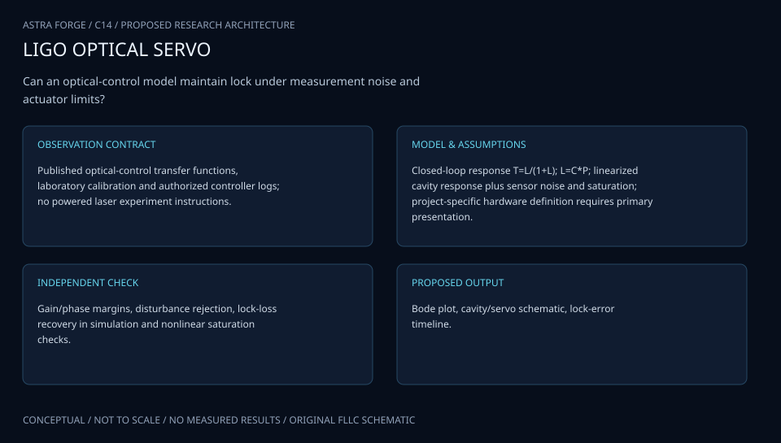

# C14 · ROMAN DARKHOLE ACADEMY

**Original project:** Controlling the Unseen: GIG Undergraduate Optical Research

**Session C:** Astronomy & Space Physics
**Status:** proposed research dossier; no project experiment or mission qualification has been performed.

Scope assumption: because the GIG acronym and original apparatus are unspecified, develop this title as an undergraduate wavefront-sensing and optical-control testbed. Start with a safe, enclosed low-power bench or a software optical twin and demonstrate measurable suppression of scattered starlight. Use NASA high-contrast imaging methods as inspiration; no original GIG team capability, affiliation, or instrument configuration is asserted.

## Scientific question

Can a measured optical-response model suppress a controlled focal-plane speckle field while preserving off-axis source throughput under drift and model error?

## Testable hypothesis

Regularized control using measured probe responses will improve repeatable contrast relative to open-loop alignment, with achievable performance bounded by detector noise, drift, and available actuators.

*Conceptual research design; arrows show the analysis dependency, not observed causation.*

## Mathematical model

$$
E(u+\Delta u)\approx E_0+G\Delta u
$$

$$
\Delta u=\arg\min_{\Delta u}\{\|W^{1/2}(E_0+G\Delta u)\|^2+\lambda\|\Delta u\|^2\}
$$

$$
C=\langle I_{\rm dark}\rangle/I_{\rm PSF,peak};\quad \eta=F_{\rm off-axis,out}/F_{\rm off-axis,in}
$$

### Variables and units

- E is complex focal-plane field in normalized units; intensity is proportional to |E|^2
- u is actuator command or modal wavefront coefficient; G is its measured complex Jacobian
- lambda is regularization selected on independent validation runs
- C is normalized contrast over a declared region in lambda/D
- eta is off-axis throughput; wavefront optical path error in nm; drift rates in nm h^-1

### Assumptions and boundary conditions

- A linear Jacobian is local; remeasure or update when command excursions invalidate linearity.
- Contrast definitions, bandwidth, optical power, and detection floor must accompany every performance number.

### Inference or simulation method

Build a Fourier/Fresnel optical model with measured aperture, aberrations, and detector response, using PROPER or equivalent. Estimate the complex speckle field with controlled probes, compare a calibrated Jacobian against empirical response, and apply regularized electric-field control or a simpler modal nulling baseline. Allocate sensor noise, wavefront drift, alignment, and actuator error in a measured budget. Simulate actuator faults and drift before any hardware loop. If no deformable mirror exists, use a phase modulator or constrained modal simulation and label the demonstration accordingly.

### Model limits

A classroom bench is not a vacuum flight test. Narrowband local suppression does not demonstrate broadband exoplanet imaging or a particular NASA mission contrast requirement.

## Data and provenance contracts

### JPL PROPER software

[Resource or product discovery](https://science.jpl.nasa.gov/projects/proper/)

**Fields:** Propagation configuration, optical geometry, aberrations, simulated focal-plane field

**Access:** Public source/software discovery; inspect current license and version.

**Role:** Independent optical twin.

### New optical bench campaign

[Resource or product discovery](https://ao.jpl.nasa.gov/compact_dm_electronics.html)

**Fields:** Dark frames, reference PSFs, probe images, actuator commands, ambient conditions

**Access:** Generate locally after equipment and laser-safety review; NASA benchmark hardware is not assumed available.

**Role:** Measured controller and noise response.

## Staged execution

1. Inventory the actual GIG apparatus and replace the stated scope assumption if team documentation becomes available.
2. Define an achievable contrast and throughput demonstration based on measured sensor floor.
3. Calibrate probes, fit the Jacobian, and compare open-loop, modal, and regularized control.
4. Demonstrate repeatability across independent realignments and deliberate thermal or phase perturbations.

## Verification and validation

- Reserve unseen aberration realizations and independent bench days for validation.
- Require suppressed-region improvement with confidence intervals and simultaneous throughput preservation.
- Measure detector saturation, drift, and loop stability; compare predicted versus measured command response.

*Any numerical gate is a proposed requirement unless the dossier explicitly identifies a sourced requirement. Freeze gates before collecting confirmatory data.*

## Resources and deliverables

- Enclosed optical bench, camera, low-power source, wavefront actuator if available, optics supervisor, PROPER.

- Optical twin, measured error budget, control-loop notebook, reproducible bench protocol, and teaching modules.

## Risks and interpretation

- Laser exposure and actuator limits require qualified local controls; the scientific risk is overclaiming flight-level performance.

## Figure plan

Optical layout and measured control-loop diagram beside before/after speckle fields, contrast convergence, and off-axis throughput.

## Cited scientific resources

- [JPL PROPER](https://science.jpl.nasa.gov/projects/proper/) — Fourier propagation and optical simulation capabilities.
- [JPL compact deformable-mirror electronics](https://ao.jpl.nasa.gov/compact_dm_electronics.html) — NASA high-contrast control benchmark and motivation.

Source discovery reviewed 2026-10-02. A public source pointer does not imply original student-team data access. See [model assurance](../../docs/MODEL_ASSURANCE.md) and [data management](../../docs/DATA_MANAGEMENT.md).
