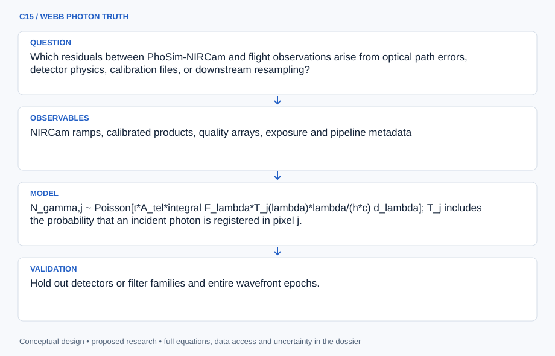

# C15 · WEBB PHOTON TRUTH

**Original project:** Assessing the Performance of the JWST/NIRCam Image Simulator PhoSim-NIRCam

**Session C:** Astronomy & Space Physics
**Status:** proposed research dossier; no project experiment or mission qualification has been performed.

Evaluate PhoSim-NIRCam against measured JWST images and contemporary instrument references rather than its original prelaunch predictions alone. The 2019 simulator paper planned commissioning validation; this project closes that loop using frozen public observations. Compare optical PSF morphology, detector artifacts, astrometry, and noise covariance at distinct stages of the exposure-to-mosaic pipeline.

## Scientific question

Which residuals between PhoSim-NIRCam and flight observations arise from optical path errors, detector physics, calibration files, or downstream resampling?

## Testable hypothesis

Updating measured wavefront and detector inputs will improve predictive fidelity, but remaining discrepancies will reveal model omissions that cannot be repaired by fitting a single idealized PSF.



*Conceptual research design; arrows show the analysis dependency, not observed causation.*

## Mathematical model

```text
N_gamma,j ~ Poisson[t*A_tel*integral F_lambda*T_j(lambda)*lambda/(h*c) d_lambda]; T_j includes the probability that an incident photon is registered in pixel j.
```

$$
P(\lambda)=|\mathcal F\{A\exp[2\pi i\,\mathrm{OPD}/\lambda]\}|^2
$$

$$
r=d-m(\theta);\quad \chi^2=r^T\Sigma^{-1}r
$$

### Variables and units

- N_gamma,j is a dimensionless photon/event count; F_lambda in W m^-2 m^-1, A_tel in m^2, t in s and lambda in m. T_j is dimensionless optical/detector throughput times pixel-assignment probability.
- t in s; OPD and wavelength in compatible length units
- PSF encircled energy and ellipticity dimensionless; centroid errors in pixels or mas
- Residual covariance Sigma accounts for detector correlations and mosaic resampling
- theta includes detector position, filter, SED, wavefront epoch, readout mode, and calibration context

### Assumptions and boundary conditions

- Distinguish raw ramps, calibrated exposures, and mosaics; compare like processing levels.
- Monte Carlo simulation uncertainty is separate from instrument-model uncertainty.

### Inference or simulation method

Choose public isolated-star exposures across detector positions, filters, flux levels, and wavefront epochs. Reproduce observation metadata and spectral energy distributions in PhoSim-NIRCam; use measured OPD references and contemporary NIRCam PSF documentation. Compare with STPSF and MIRAGE as independently implemented comparators, allowing only training-observation calibration updates. Evaluate encircled energy, radial wings, centroid, PSF moments, saturation onset, ramp statistics, and spatial noise. Propagate simulated raw exposures through the same pipeline version as observations. Maintain a discrepancy ledger with each proposed correction and its expected independent test.

### Model limits

A public exposure may lack complete illumination or attitude metadata. Fitting every calibration parameter to a target can hide simulator error; validation must span different stars and epochs.

## Data and provenance contracts

### MAST JWST holdings

[Resource or product discovery](https://archive.stsci.edu/)

**Fields:** NIRCam ramps, calibrated products, quality arrays, exposure and pipeline metadata

**Access:** Public or released data only; freeze program IDs, calibration context, and exact products.

**Role:** Flight benchmark observations.

### STScI NIRCam PSF documentation

[Resource or product discovery](https://jwst-docs.stsci.edu/jwst-near-infrared-camera/nircam-performance/nircam-point-spread-functions)

**Fields:** Measured OPD references, PSF library, encircled energy, pixel scales

**Access:** Public reference page; select matched filter and measured wavefront epoch.

**Role:** Independent optical comparator.

## Staged execution

1. Audit the currently usable PhoSim-NIRCam code and document version and missing flight-era features.
2. Freeze a train/test matrix by star, detector, filter, and epoch.
3. Run matched simulations and the exact observation processing chain.
4. Fit limited calibration updates and publish unresolved residuals with practical consequences for science use.

## Verification and validation

- Hold out detectors or filter families and entire wavefront epochs.
- Compare pixel-level residual statistics and aperture photometry across signal-to-noise levels.
- Require Monte Carlo convergence before attributing residuals to physics; use independent STPSF/MIRAGE comparisons to diagnose error sources.

*Any numerical gate is a proposed requirement unless the dossier explicitly identifies a sourced requirement. Freeze gates before collecting confirmatory data.*

## Resources and deliverables

- PhoSim-NIRCam source, STPSF, MIRAGE, JWST pipeline, compute queue, instrument-calibration expertise.

- Flight-validation report, simulator discrepancy atlas, reproducible observation manifest, and recommended domain of use.

## Risks and interpretation

- Prelaunch defaults and stale calibration files can dominate. Simulator agreement with another simulator alone is insufficient.

## Figure plan

Observed/simulated PSFs and residuals arranged by detector/filter, with encircled-energy error and held-out astrometric bias.

## Cited scientific resources

- [Burke et al. (2019), PhoSim-NIRCam](https://arxiv.org/abs/1905.06461) — Original photon-level simulator and planned flight validation.
- [STScI NIRCam PSFs](https://jwst-docs.stsci.edu/jwst-near-infrared-camera/nircam-performance/nircam-point-spread-functions) — Current measured-wavefront and PSF reference.
- [STScI MIRAGE documentation](https://jwst-docs.stsci.edu/jwst-other-tools/mirage-jwst-data-simulator) — Independent ramp-simulation comparator.

Source discovery reviewed 2026-10-02. A public source pointer does not imply original student-team data access. See [model assurance](../../docs/MODEL_ASSURANCE.md) and [data management](../../docs/DATA_MANAGEMENT.md).
