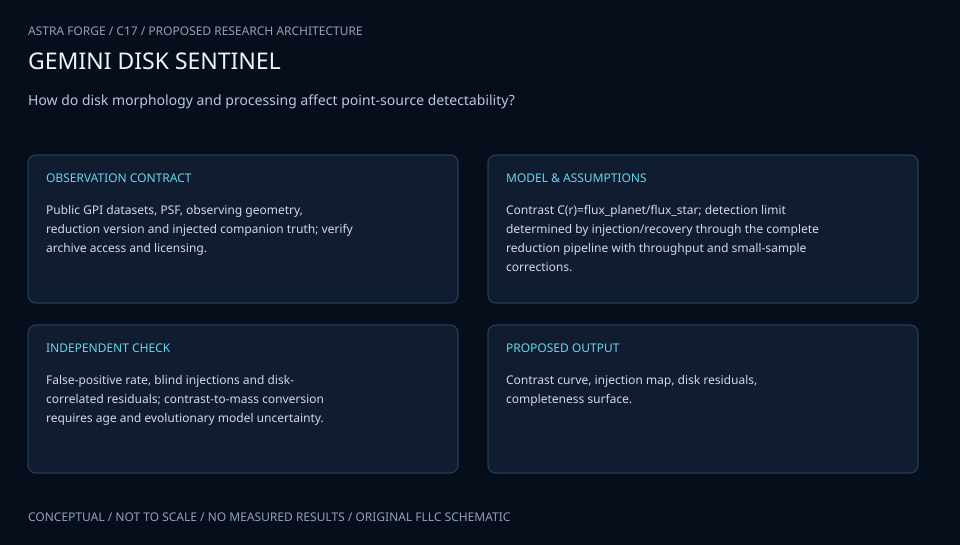

# C17 · GEMINI DISK SENTINEL

**Original project:** Investigating the Planet Detection Limit in Debris Disk Images from the Gemini Planet Imager

**Session C:** Astronomy & Space Physics

**Document class:** engineering research design and analysis record · **Revision:** 2 · **Date:** 2026-10-02

**Evidence state:** design basis, mathematical formulation and verification plan documented. Project-specific empirical results remain to be acquired; executable shared model demonstrations have their own recorded checks.

[Engineering document register](../../ENGINEERING_DOCUMENTATION.md) · [Session C handbook](../../documentation/SESSION_C.md) · [Previous: C16](../C/C16.md) · [Next: C18](../C/C18.md)

## Purpose and scientific objective

Measure planet-search completeness in the structured backgrounds of debris disks. Replace a single radial contrast curve with a two-dimensional recovery map that depends on disk location, planet spectrum, processing choices, and small-sample statistics. Use physically plausible artificial companions inserted before PSF subtraction so throughput losses and disk confusion are measured through the actual pipeline.

**Question:** How much do disk brightness and processing-induced self-subtraction alter planet completeness and false-positive rates relative to conventional azimuthally averaged contrast estimates?

**Testable hypothesis:** Disk-aware injection/recovery will identify localized regions of degraded completeness and reduce false confidence in planet exclusion inferred from an average contrast curve.

## 1. Design basis and analysis boundary

The debris-disk planet search delivers two-dimensional completeness and false-positive behavior through a frozen GPI reduction. The physical scene contains disk light, companion spectrum and stellar PSF before processing. Artificial companions are inserted before subtraction to capture throughput losses and interactions with the disk. A radial contrast curve is a secondary summary, not a complete selection function.

Begin with point-source throughput fixtures, add position/spectrum grids in real cubes, then marginalize flux recovery into conditional mass-orbit constraints. Disk morphology, age, spectra and evolutionary tracks remain separately uncertain. Selected public data/calibrations and parallactic-angle coverage must be verified. Nondetection excludes only the tested scene and orbital domain.

## 2. Requirements and verification traceability

These are project design requirements or proposed analysis gates. A numerical target is not a NASA requirement unless its controlling source is explicitly identified. “TBD” identifies evidence required before a decision; it is not permission to assume a value. Verification evidence listed here is planned, unless a linked result explicitly records execution.

| ID | Requirement / gate | Engineering rationale | Verification method | Basis / required evidence |
| --- | --- | --- | --- | --- |
| C17-R1 | All completeness injections shall occur before PSF subtraction at the earliest supported calibrated stage. | Final-image injection misses self-subtraction. | Injection-stage and processing-lineage audit. | Proposed observation requirement. |
| C17-R2 | Recovery shall be tabulated by radius, azimuth, flux and spectrum with binomial uncertainty. | Disk brightness breaks azimuthal symmetry. | Scenario-grid and interval check. | Proposed completeness contract. |
| C17-R3 | A detection threshold shall be selected on independent background controls and frozen before final recovery tests. | Tuned thresholds inflate efficiency. | Threshold provenance and false-positive replay. | Proposed false-alarm requirement. |
| C17-R4 | Injected sources shall be sparse enough that adding a second source changes single-source throughput by less than 5%, a proposed target. | Crowded injection alters subtraction basis. | Single-versus-multiple injection comparison. | Proposed independence target. |
| C17-R5 | Mass-orbit outputs shall retain age, evolutionary and projection priors. | Flux is not a direct mass measurement. | Conditional conversion and sensitivity audit. | Existing mass-conversion caveat. |

## 3. Architecture and controlled interfaces

The datacube adapter emits wavelength slices, parallactic angles, calibration flags and stellar flux normalization. A disk/planet renderer adds companions with a normalized PSF and selected spectrum. The subtraction engine uses pinned settings and may be nonlinear in the injected scene. A matched-filter detector returns statistic, recovered flux and local background diagnostics.

Completeness accumulation receives injected truth and detection results, preserving azimuth and spectrum. Independent control positions estimate false-positive behavior with correlated speckles and small-sample caveats. A separate orbit/age module converts flux probabilities into conditional mass-semimajor-axis nondetection likelihoods. Shared stellar calibration and age uncertainty propagate across all map cells.

Injection before subtraction measures disk-dependent recovery and throughput; mass constraints are a separate conditional conversion.

[Editable engineering diagram source](../../visuals/projects/C17.mmd)

## 4. Mathematical model and derivation

### Governing equations

$$
d=\mathcal O[I_{\rm disk}+F_pP(\alpha_p,\beta_p,\lambda)]+n
$$

$$
C_{\rm rec}(F_p,r,\phi,s)=N_{\rm detected}/N_{\rm injected}
$$

$$
p(\mathrm{no\ detection}\mid M,a)=1-\int C_{\rm rec}(F(M,t),r,\phi,s)p(r,\phi,s\mid a)\,dr\,d\phi\,ds
$$

### Variables, units and conventions

- Fp in Jy or contrast relative to the star; r in arcsec and phi in degrees
- s labels tested companion spectra; age t in Myr
- Crec is dimensionless completeness; detection threshold tied to a declared false-positive probability
- O includes parallactic rotation, instrument response, PSF subtraction, and image combination
- Mass M in Jupiter masses and semimajor axis a in au require uncertain evolutionary and orbital models

### Assumptions and boundary conditions

- Insert companions into raw or minimally calibrated datacubes before reduction, not only into final images.
- Disk brightness and planet flux enter jointly; planet exclusion is conditional on spectra, age, and orbital priors.

### Derivation step 1

$$
d=\mathcal O[I_{disk}+F_pP]+n
$$

The observation/reduction operator includes rotation and subtraction; it is not generally linear in Fp if the source changes its fitted PSF basis.

### Derivation step 2

$$
T(F_p,r,\phi,s)=\widehat F_p/F_p
$$

Throughput is estimated from injected and recovered flux after exactly the same processing; negative or unstable recovery remains diagnostic.

### Derivation step 3

$$
\widehat C=k/n,\quad\operatorname{Var}(\widehat C)\approx C(1-C)/n
$$

Independent Bernoulli recovery motivates binomial intervals. Correlated injections or noise episodes require grouped uncertainty rather than this approximation alone.

### Derivation step 4

$$
p(0\mid M,a)=1-\int C[F(M,t),r,\phi,s]p(t,r,\phi,s\mid a)\,dt\,dr\,d\phi\,ds
$$

Marginalize stellar age and orbit projection; conditional priors are part of any planet-exclusion statement.

### Inference or simulation procedure

Retrieve public GPI science frames, calibration products, and observing angles for selected disk hosts. Process with frozen PSF-subtraction settings; vary disk forward models only within a preregistered robustness grid. Inject companions sparsely to avoid changing subtraction behavior, across angle, radius, flux, and plausible spectra. Use matched filtering or another declared detection statistic with independent noise controls and small-number corrections. Estimate uncertainty in completeness with binomial intervals. Translate flux completeness to optional mass-orbit constraints only after marginalizing stellar age, luminosity model, inclination, and orbital phase.

### Validity domain and fidelity limits

Speckles are correlated, disk structure can resemble companions, and selected bright disks do not represent all planetary systems. A nondetection excludes only the validated model and parameter domain.

## 5. Data specifications and provenance

| Field | Type | Unit | Physical / statistical meaning | Quality and missing-data rule |
| --- | --- | --- | --- | --- |
| cube | float64[nlambda,h,w] | declared flux | Pre-subtraction science data. | Keep spectral/spatial masks; missing pixels are not zero background. |
| parallactic_angle | float64[nexp] | degree | Sky rotation for each exposure. | Time and angle convention attached. |
| stellar_flux | measurement<float64[nlambda]> | Jy | Flux/contrast normalization. | Shared covariance across wavelengths retained. |
| injection_truth | table | arcsec, degree, Jy | Companion position, spectrum and flux. | Record stage, seed and sparse-batch identity. |
| detection_statistic | float64 | declared normalized | Frozen search score at candidate position. | Threshold version and searched trials attached. |
| completeness | struct<float64,interval> | 1 | Recovery map by scenario. | Report n/k; empty cells remain missing. |
| throughput | measurement<float64> | 1 | Recovered/injected flux ratio. | Calibration and recovery covariance propagated. |
| mass_orbit_constraint | distribution&#124;null | Jupiter mass, au | Conditional translation of completeness. | Age/evolution/orbit versions mandatory. |

[Machine-readable record schema](../../data/contracts/C17.schema.json) · [Empty acquisition CSV](../../data/contracts/C17.csv) · [Field dictionary CSV](../../data/contracts/C17.dictionary.csv)

The CSV above contains column headers only. Its schema defines future records and does not establish that original-team data or a particular archive product have been acquired. Frame, timing, calibration, covariance, selection and provenance details must accompany populated records.

### Gemini Observatory Archive

[Product, archive or reference](https://archive.gemini.edu/searchform)

**Fields:** GPI datacubes, calibrations, target identity, parallactic angles, quality flags

**Access:** Public released pixels; usual proprietary periods and IP-based login restrictions may apply.

**Role:** Primary imaging observations.

### GPI debris-disk survey

[Product, archive or reference](https://authors.library.caltech.edu/records/pt03e-7pb38)

**Fields:** Targets, disk detections, observing context, survey methods

**Access:** Public publication repository; linked products require individual availability checks.

**Role:** Sample and physical disk benchmarks.

## 6. Uncertainty, sensitivity and identifiability

Disk residuals and speckles correlate neighboring positions, while subtraction settings alter planet and disk throughput together. Binomial counting alone may understate uncertainty if injections reuse one noise realization. Block over exposure sets or independent observing epochs, and propagate stellar normalization as a common term across completeness cells.

Age and luminosity-evolution models dominate flux-to-mass conversion; orbital inclination and phase determine projected separation. Test sensitivity without selecting the most favorable track. Examine disk/planet confusion through deliberately nonplanet features and alternative disk forward models. A completeness map may be well measured locally yet unsupported in untested flux/spectrum cells; interpolation should carry a domain mask.

## 7. Engineering trade study

| Alternative | Benefit | Cost / limitation | Decision rule |
| --- | --- | --- | --- |
| Azimuthal contrast curve | Compact familiar summary. | Hides disk-dependent confusion. | Use only alongside the full map. |
| Two-dimensional injection map | Measures location-dependent recovery. | Computational cost and sparse cells. | Use as primary selection artifact. |
| Joint disk/planet forward fit | Can reduce disk bias. | Morphology degeneracy and model dependence. | Use when independent disk constraints improve held-out recovery. |

## 8. Verification and validation cases

| Case ID | Stimulus / condition | Expected result / criterion | Method | Evidence artifact |
| --- | --- | --- | --- | --- |
| C17-V1 | No subtraction baseline | A normalized injected source preserves flux through basic calibration. | Known PSF source with subtraction disabled. | Flux conservation. |
| C17-V2 | Zero-flux controls | False-positive frequency is measured at the frozen threshold. | Independent background locations/exposures. | Proposed null search calibration. |
| C17-V3 | Sparse injection | Single-source throughput stays within the proposed 5% multi-source tolerance. | Paired sparse/multiple replay. | Declared injection-interference target. |
| C17-V4 | Withheld disk/epoch | Completeness and false-positive behavior are assessed without retuning settings. | Hold out a host or independent epoch. | Proposed disk-domain transfer test. |

**Execution status:** these cases are specified, not claimed as executed. Close a case only with the versioned inputs, output, uncertainty, reviewer and pass/fail rationale.

### Additional scientific validation gates

- Blind recoveries performed by an analyst who does not know injected positions.
- Hold out observing nights or sequences; verify detection threshold on planet-free controls.
- Compare injected recovery with real known companions where usable and rerun under alternate disk models.

## 9. Implementation and reproducible work packages

1. Freeze GPI science/calibration/rotation manifests.
2. Implement normalized spectral companion injection before subtraction.
3. Pin subtraction and detection settings using training/control data.
4. Run sparse scenario grids and grouped uncertainty accumulation.
5. Build disk-confusion and zero-flux control fixtures.
6. Export 2D completeness/throughput maps and optional conditional mass-orbit likelihoods.

### Investigation sequence

1. Choose public disk-host observations and document calibration availability and stellar properties.
2. Freeze processing and detection rules before blind companion injections.
3. Build angular and radial completeness maps with independent false-alarm controls.
4. Publish flux limits directly and conditional mass-orbit limits with all priors visible.

### Resources and interfaces to expertise

- GPI reduction software, high-contrast imaging expertise, host-age estimates, compute/storage, PSF templates.

## 10. Failure modes and interpretation controls

| Failure mode | Effect on result | Detection / evidence | Design response |
| --- | --- | --- | --- |
| Final-image-only injection | Optimistic completeness. | Injection lineage check. | Insert before the subtraction operator. |
| Disk knot declared planet | False detection. | Spectrum/epoch/forward-model consistency. | Use independent controls and retain ambiguous candidates. |
| Mass exclusion without age prior | Unsupported precision. | Missing conversion metadata. | Publish flux completeness until priors are justified. |

- Final-image injections overstate sensitivity; reused injected positions and tuning can leak validation information.

## 11. Required engineering outputs

- Two-dimensional completeness atlas, false-positive catalog, reproducible injection manifest, and qualified nondetection constraints.

### Scientific result figures to produce during execution

Disk image overlaid with 50/90% companion-completeness contours, angle-dependent limits, and explicitly conditional mass conversion.

## 12. Cited technical and scientific resources

- [Gemini archive access guide](https://archive.gemini.edu/help/index.html) — Public-data and proprietary-access conditions.
- [GPI debris-disk survey results](https://authors.library.caltech.edu/records/pt03e-7pb38) — Disk imaging survey context and target measurements.
- [GPI first-light paper](https://pmc.ncbi.nlm.nih.gov/articles/PMC4156769/) — Instrument detection capabilities and methodology.

Framework and evidence rules: [engineering documentation standard](../../docs/ENGINEERING_STANDARD.md), [model assurance](../../docs/MODEL_ASSURANCE.md), [uncertainty procedure](../../docs/UNCERTAINTY_AND_DECISION_RULES.md), and [data management](../../docs/DATA_MANAGEMENT.md). NASA-inspired names are creative identifiers; requirements and results are not NASA certification.
