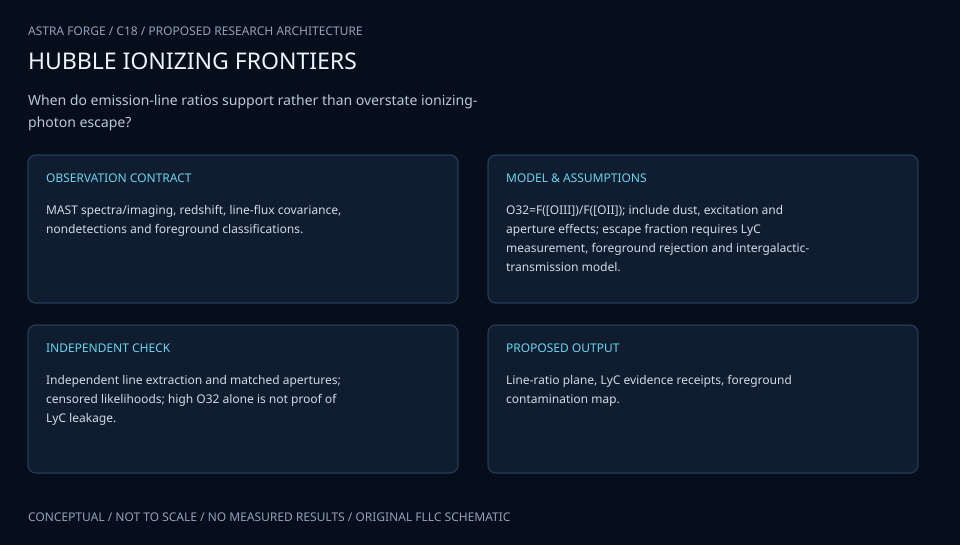

# C18 · REIONIZATION OXYGEN BEACON

**Original project:** Characterizing High [OIII]/[OII] and High [OIII] Galaxies to Further LyC Study

**Session C:** Astronomy & Space Physics
**Status:** proposed research dossier; no project experiment or mission qualification has been performed.

Develop a multi-diagnostic selection model for ionizing-photon leakage in compact star-forming galaxies. High oxygen excitation is a useful candidate flag, but it is not a sufficient measure of Lyman-continuum escape. Combine optical weak lines, direct UV detections or limits, Ly-alpha shape, metallicity, dust, and source contamination to quantify where proxy inference becomes unreliable.

## Scientific question

Can multiple independently measured diagnostics predict LyC escape probability and escape fraction more reliably than the O32 ratio alone?

## Testable hypothesis

A selection-aware, censored model using O32 plus neutral-gas and Ly-alpha indicators will predict held-out direct LyC measurements better than a single-ratio calibration.



*Conceptual research design; arrows show the analysis dependency, not observed causation.*

## Mathematical model

```text
O32=F([OIII]5007)/F([OII]3726+3729)
```

$$
f_{\rm esc,abs}=F_{\rm LyC,obs}/[F_{\rm LyC,int}T_{\rm IGM}T_{\rm MW}]
$$

$$
\mathrm{logit}\,p_{\rm leak}=a+b\log O32+c\Delta v_{\rm Ly\alpha}+dE(B-V)+eZ
$$

### Variables and units

- Line fluxes in erg s^-1 cm^-2 after specified extinction corrections
- O32 convention is explicit; publications using summed OIII require conversion
- Ly-alpha peak separation Delta v in km s^-1; metallicity Z as 12+log(O/H)
- Escape fraction dimensionless in [0,1]; intrinsic LyC flux is model predicted
- IGM and Milky Way transmissions dimensionless; internal attenuation is included in the absolute escaped fraction definition

### Assumptions and boundary conditions

- Direct LyC flux is redward-contamination checked and uses source redshift to establish rest wavelength below 912 angstrom.
- Upper limits and nondetections enter the likelihood; samples selected for extreme O32 are not representative of all galaxies.

### Inference or simulation method

Measure oxygen, Balmer, HeI, HeII, and OI lines using simultaneous continuum and line fits. Infer dust and metallicity with uncertainty and compare ionization-bounded, density-bounded, shock, and hard-spectrum photoionization models. Model UV count data or censored fluxes with instrumental backgrounds, foreground contamination, and uncertain intrinsic stellar SEDs. Fit escape predictors with galaxy-level splitting and a selection model tied to sample inclusion. Compare proxy probabilities to direct UV measurements and avoid extrapolating a low-redshift calibration to the early universe without a domain-shift assessment.

### Model limits

Geometry and sightline dependence mean integrated optical ratios need not predict directional LyC escape. Intrinsic ionizing output, IGM transmission, and weak-line measurement errors can dominate.

## Data and provenance contracts

### Published low-redshift LyC sample

[Resource or product discovery](https://arxiv.org/abs/1805.09865)

**Fields:** COS fluxes, direct escape estimates, O32, Ly-alpha separations, galaxy properties

**Access:** Open paper; trace exact observations and model conventions.

**Role:** Direct-escape training/validation sample.

### MAST COS holdings

[Resource or product discovery](https://archive.stsci.edu/)

**Fields:** UV photon events or spectra, background, response, target/program metadata

**Access:** Public released observations; verify selected galaxies and exact observing modes.

**Role:** Independent reprocessing route.

## Staged execution

1. Freeze oxygen-ratio conventions and direct-escape calculation before assembling the sample.
2. Reprocess optical and UV data with common quality and contamination rules.
3. Compare one-ratio, multi-diagnostic, and photoionization-informed models.
4. Rank follow-up targets by expected information gain, preserving nondetections as scientifically valuable outcomes.

## Verification and validation

- Hold out entire galaxies and observing programs; report Brier score, interval coverage, and predictive likelihood.
- Test blind synthetic spectra with shocks, leakage, and hard ionizing continua.
- Measure sensitivity to intrinsic SED, dust law, sample selection, and O32 convention.

*Any numerical gate is a proposed requirement unless the dossier explicitly identifies a sourced requirement. Freeze gates before collecting confirmatory data.*

## Resources and deliverables

- Spectral fitting, CLOUDY or equivalent, COS calibration expertise, hierarchical censored-model sampler.

- Oxygen/LyC diagnostic atlas, calibrated candidate probabilities, direct-escape uncertainty ledger, and follow-up target list.

## Risks and interpretation

- High O32 alone can generate false leakage claims; source contamination is particularly consequential for faint LyC measurements.

## Figure plan

O32 versus Ly-alpha separation colored by directly measured escape, with upper limits, selected-sample boundaries, and predicted probability contours.

## Cited scientific resources

- [Izotov et al. (2018), direct LyC observations](https://arxiv.org/abs/1805.09865) — Direct UV measurements and proxy scatter.
- [Stasinska et al. (2015), extreme excitation diagnostics](https://arxiv.org/abs/1503.00320) — Counterexamples and weak-line constraints.
- [Izotov et al. (2017), HeI diagnostics](https://arxiv.org/abs/1706.08769) — Additional diagnostics and limits of O32 alone.

Source discovery reviewed 2026-10-02. A public source pointer does not imply original student-team data access. See [model assurance](../../docs/MODEL_ASSURANCE.md) and [data management](../../docs/DATA_MANAGEMENT.md).
