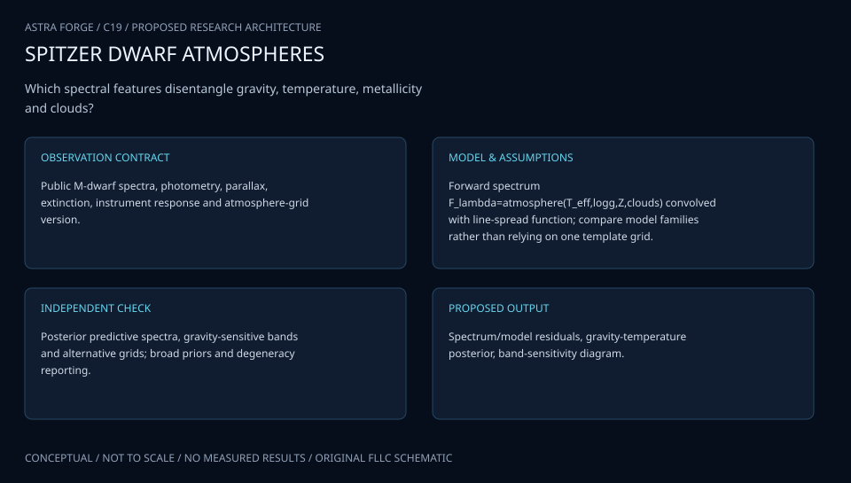

# C19 · WEBB YOUNG STAR ATMOSPHERES

**Original project:** Characterizing the Atmospheres of Low Surface Gravity M-dwarfs

**Session C:** Astronomy & Space Physics
**Status:** proposed research dossier; no project experiment or mission qualification has been performed.

Infer temperature, gravity, metallicity, cloud effects, and activity in young M-dwarf spectra while quantifying their degeneracies. Compare empirical young-object templates with atmosphere grids and independent age or luminosity constraints. Gravity-sensitive absorption is valuable, but one triangular H-band feature or weak alkali line is not accepted as a unique low-gravity measurement without dust, metallicity, and multiplicity checks.

## Scientific question

Which spectral features provide transferable gravity information once temperature, metallicity, dust/cloud opacity, veiling, and unresolved companions are allowed to vary?

## Testable hypothesis

Joint spectral and luminosity inference with empirical controls will improve gravity calibration over index-only classification, while identifying regimes where atmosphere-grid systematics dominate.

*Conceptual research design; arrows show the analysis dependency, not observed causation.*

## Mathematical model

$$
F_{\lambda,obs}=(R_*/D)^2 F_{\lambda,atm}(T_{\rm eff},g,Z,\mathrm{clouds})10^{-0.4A_\lambda}+F_{\lambda,veil}
$$

$$
g=GM_*/R_*^2;\quad L=4\pi R_*^2\sigma_{\rm SB}T_{\rm eff}^4
$$

$$
\log p(F\mid\theta)=-\frac12 r^T\Sigma^{-1}r-\frac12\log|\Sigma|+\mathrm{const}
$$

### Variables and units

- Teff in K; logg is log10 of g in cm s^-2
- Wavelength in micrometers and flux in documented physical units or declared normalization
- Metallicity [Fe/H] in dex; extinction A_lambda in magnitudes
- Radius in solar radii and distance in pc, converted consistently
- Sigma includes correlated spectral error and a model-discrepancy term; veiling is an additional continuum

### Assumptions and boundary conditions

- Convolve models to each spectrum’s measured line-spread function and sample them on the observed wavelength grid.
- Young-star or group membership is probabilistic and not equivalent to a precisely known age.

### Inference or simulation method

Assemble public young and field M-dwarf spectra with source-specific citations and quality flags. Derive gravity-sensitive alkali, molecular, and continuum indices, then fit atmospheric grids with nuisance continuum/telluric calibration and correlated discrepancy. Include photometry and distance when available to constrain radius and luminosity. Compare field controls matched in spectral type and metallicity, and test unresolved-binary and reddening alternatives. Evaluate gravity against dynamical-mass/radius or well-characterized benchmark systems where available. Keep empirical spectral classification separate from model-derived physical parameters.

### Model limits

Line lists, clouds, magnetic activity, and disequilibrium chemistry can create systematic residuals. Evolutionary-model ages and gravity are not independent benchmarks if they use the same atmosphere assumptions.

## Data and provenance contracts

### SpeX Prism Library

[Resource or product discovery](https://www.cass.ucsd.edu/~ajb/browndwarfs/spexprism/library.html)

**Fields:** Spectra, spectral type, observing metadata, quality, original references

**Access:** Public library; verify individual resolution, calibration, and reference.

**Role:** Empirical young/field spectral controls.

### SPLAT modeling documentation

[Resource or product discovery](https://splat.physics.ucsd.edu/splat/splat_model.html)

**Fields:** Atmosphere grids, gravity/temperature parameters, spectral comparison settings

**Access:** Public tool documentation; pin model grid and license.

**Role:** Reproducible atmosphere-grid comparator.

## Staged execution

1. Freeze spectral-type domain, gravity conventions, benchmark hierarchy, and telluric masks.
2. Assemble provenance-rich spectra and matched field controls.
3. Fit atmosphere and empirical-template models jointly with photometric constraints.
4. Release gravity identifiability maps and a follow-up priority list for independent mass/radius benchmarks.

## Verification and validation

- Leave one association or cluster out of training to test age-domain transfer.
- Hold out wavelength windows and check their predicted absorption profiles.
- Use blind injected binary, dusty, reddened, and low-gravity spectra; report gravity bias and coverage by temperature and signal-to-noise.

*Any numerical gate is a proposed requirement unless the dossier explicitly identifies a sourced requirement. Freeze gates before collecting confirmatory data.*

## Resources and deliverables

- SPLAT, atmosphere grids, IRTF/SpeX expertise, photometric and astrometric catalogs, probabilistic sampler.

- M-dwarf atmosphere atlas, benchmark comparison, correlated residual library, and qualified gravity classifications.

## Risks and interpretation

- Selection based on gravity indicators can inflate success; overlapping spectral data and reference labels must be audited.

## Figure plan

Temperature-matched young/field spectra with alkali bands, gravity posterior contours, and model-discrepancy residuals.

## Cited scientific resources

- [Gorlova et al. (2003), near-IR gravity indicators](https://arxiv.org/abs/astro-ph/0305147) — Gravity-sensitive spectral features and measurement context.
- [SpeX Prism Library paper](https://arxiv.org/abs/1406.4887) — Empirical spectral-library provenance.
- [SPLAT atmospheric modeling guide](https://splat.physics.ucsd.edu/splat/splat_model.html) — Physical grid parameter conventions.

Source discovery reviewed 2026-10-02. A public source pointer does not imply original student-team data access. See [model assurance](../../docs/MODEL_ASSURANCE.md) and [data management](../../docs/DATA_MANAGEMENT.md).
