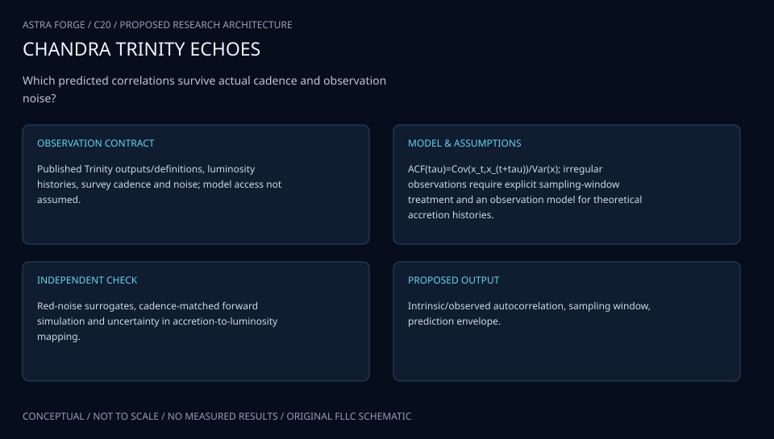

# C20 · TRINITY ACCRETION ECHO

**Original project:** Predictions for the Observable Autocorrelations of Accreting Black Holes from the Trinity Theoretical Model

**Session C:** Astronomy & Space Physics
**Status:** proposed research dossier; no project experiment or mission qualification has been performed.

Extend the TRINITY halo-galaxy-black-hole population model into an explicitly additional model of optical variability. Resolve an ambiguity in the historical title by delivering both temporal light-curve autocorrelation and, if desired, spatial AGN clustering as separate estimands. TRINITY population distributions do not uniquely determine day-to-year accretion fluctuations; any temporal prediction requires a declared stochastic process and an observational transfer model.

## Scientific question

Can a variability model conditioned on TRINITY black-hole mass and Eddington-ratio distributions predict survey-observed temporal autocorrelations across luminosity, redshift, and host mass?

## Testable hypothesis

Population conditioning plus a calibrated stochastic variability law will reproduce observed autocorrelation trends better than a single universal variability timescale, but distinct temporal laws may remain observationally degenerate.

*Conceptual research design; arrows show the analysis dependency, not observed causation.*

## Mathematical model

$$
dX=-(X-\mu)dt/\tau+\sigma\,dW_t
$$

$$
K(\Delta t)=\sigma_X^2e^{-|\Delta t|/\tau};\quad\sigma_X^2=\sigma^2\tau/2
$$

$$
K_{\rm obs}=\mathcal W\,K_{\rm rest}(\Delta t_{\rm obs}/(1+z))\,\mathcal W^T+\Sigma_{\rm noise}
$$

$$
\xi_{\rm AGN}(r)\simeq b_{\rm eff}^2\xi_m(r);\quad b_{\rm eff}=\int b_h(M)n_h(M)\langle N_{\rm AGN}|M\rangle dM/\int n_h(M)\langle N_{\rm AGN}|M\rangle dM
$$

### Variables and units

- X is log flux or magnitude with a declared convention; tau in rest-frame days
- sigma has X units per square-root day; K has X-squared units
- z dimensionless; observed time intervals include cosmological dilation
- W maps latent light curves through cadence, exposure integration, and missing observations
- TRINITY supplies population conditions; the OU/damped-random-walk law is a proposed extension, not a native TRINITY result
- For spatial output, r is comoving Mpc, xi is dimensionless two-point correlation, b_h halo bias, n_h halo mass function, and N_AGN selected occupation; the displayed expression is a large-scale approximation

### Assumptions and boundary conditions

- Temporal autocorrelation and spatial two-point clustering are analyzed with distinct models and data.
- A damped random walk is a baseline over a tested timescale range, not universal accretion physics.

### Inference or simulation method

Pin a TRINITY code/data release and draw black-hole mass, host, luminosity, and Eddington-ratio populations with their uncertainties. Fit conditional variability amplitudes and timescales on a training light-curve survey using a likelihood that handles irregular cadence. Compare OU, broken-power-spectrum, and multi-timescale stochastic processes. Forward simulate flux-limited target selection, host dilution, redshift, cadence, and noise. Estimate ensemble covariance through likelihood methods rather than interpolating across gaps. Hold out luminosity-redshift bins and a second survey. If spatial autocorrelation is pursued, add halo bias and angular/redshift selection separately.

### Model limits

Finite baselines and cadence gaps can bias timescales. Agreement with an autocorrelation does not uniquely identify disk physics; population and temporal parameters can compensate for each other.

## Data and provenance contracts

### TRINITY public repository

[Resource or product discovery](https://github.com/HaowenZhang/TRINITY)

**Fields:** Posterior population products, halo/galaxy/SMBH relations, model configuration

**Access:** Public GPLv3 project; pin commit and inspect product documentation.

**Role:** Population conditioning and uncertainty.

### SDSS Stripe 82 variability study

[Resource or product discovery](https://arxiv.org/abs/1004.0276)

**Fields:** Quasar variability parameters, luminosity and black-hole dependence

**Access:** Open paper; obtain light-curve products through their stated data source before reproduction.

**Role:** Temporal baseline and independent calibration.

## Staged execution

1. Declare whether the primary autocorrelation is temporal; freeze optional spatial output as a distinct module.
2. Verify TRINITY product semantics and construct forward population draws.
3. Fit stochastic variability laws with an explicit survey observation operator.
4. Compare survey-level predictions on independent cadence and luminosity/redshift domains.

## Verification and validation

- Test covariance recovery on synthetic curves spanning baseline/timescale ratios and gaps.
- Hold out a second survey and entire parameter bins, reporting predictive log likelihood and covariance residuals.
- Perform ablations using unconditional populations and alternate stochastic laws to expose nonidentifiability.

*Any numerical gate is a proposed requirement unless the dossier explicitly identifies a sourced requirement. Freeze gates before collecting confirmatory data.*

## Resources and deliverables

- TRINITY source, Gaussian-process/time-series tools, survey light curves, selection-function expertise.

- Conditional variability extension, survey simulator, observable autocorrelation atlas, and assumption/identifiability report.

## Risks and interpretation

- Calling stochastic extensions native TRINITY predictions would overstate the model; interpolation and selection can manufacture autocorrelation trends.

## Figure plan

TRINITY-conditioned population flow into stochastic curves and cadence sampling, with rest-frame and observed covariance comparisons.

## Cited scientific resources

- [Zhang et al., TRINITY I](https://arxiv.org/abs/2105.10474) — Empirical population connection and model outputs.
- [TRINITY source repository](https://github.com/HaowenZhang/TRINITY) — Code, products, and license.
- [MacLeod et al. (2010), quasar damped random walks](https://arxiv.org/abs/1004.0276) — Temporal stochastic-model precedent.

Source discovery reviewed 2026-10-02. A public source pointer does not imply original student-team data access. See [model assurance](../../docs/MODEL_ASSURANCE.md) and [data management](../../docs/DATA_MANAGEMENT.md).
