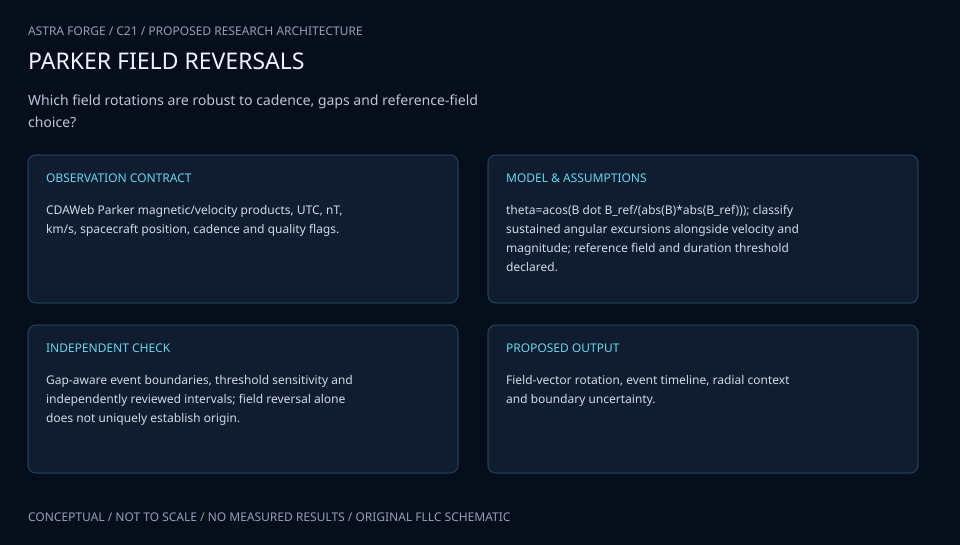

# C21 · PARKER MAGNETIC TRAIL

**Original project:** Identification of Switchback Intervals in Parker Space Probe Data

**Session C:** Astronomy & Space Physics
**Status:** proposed research dossier; no project experiment or mission qualification has been performed.

Preserve the historical title while using the current mission name, Parker Solar Probe, in the research design. Build an auditable magnetic-switchback catalog that separates field reversals from instrumental flags, current-sheet crossings, and arbitrary choices of local background. Connect detected intervals to plasma and orbital conditions without treating one spacecraft trajectory as a direct three-dimensional map of solar structure.

## Scientific question

How stable are switchback event boundaries and occurrence statistics under changes in reference-field timescale, angular threshold, cadence, and plasma-quality screening?

## Testable hypothesis

A multi-feature detector with calibrated event probabilities will transfer across encounters better than a fixed radial-field sign threshold while preserving interpretable angular deflection.

*Conceptual research design; arrows show the analysis dependency, not observed causation.*

## Mathematical model

$$
\theta_B(t)=\cos^{-1}[\mathbf B(t)\cdot\mathbf B_0(t)/(|\mathbf B(t)||\mathbf B_0(t)|)]
$$

$$
z(t)=[1-\cos\theta_B(t)]/2
$$

$$
\mathbf v_A=\mathbf B/\sqrt{\mu_0\rho};\quad \delta\mathbf v\approx\pm\delta\mathbf v_A
$$

### Variables and units

- B and local reference B0 in nT, converted to T for Alfven speed
- Angular deflection in degrees; z is dimensionless normalized deflection
- v and Alfven velocity in km s^-1; mass density rho in kg m^-3
- Event duration in s; heliocentric distance in solar radii or au
- Plasma velocity and density quality/cadence are kept separate from magnetic-field quality

### Assumptions and boundary conditions

- Local B0 is estimated with a declared robust background window; polarity sectors require consistent handling.
- A reversal candidate is not automatically an Alfvenic switchback; include field magnitude and plasma-response diagnostics.

### Inference or simulation method

Retrieve released FIELDS and SWEAP data with quality masks and coordinate definitions. Build a reproducible threshold baseline, then compare changepoint or hidden-state detection using deflection, radial polarity, magnitude stability, and Alfvenic correlation. Create blinded expert labels across quiet, current-sheet, and switchback-rich intervals. Match cadence only where statistically justified and retain gap masks. Estimate occurrence rates with exposure time, not total downloaded interval length. Compare encounter and distance statistics using block resampling and selection-aware models; field-line mapping to the Sun remains a separate uncertain interpretation.

### Model limits

Background definition can change event boundaries and counts. Spacecraft motion mixes spatial and temporal variation; intermittent plasma coverage can bias the subset classified as Alfvenic.

## Data and provenance contracts

### NASA CDAWeb/SPDF PSP discovery

[Resource or product discovery](https://cdaweb.gsfc.nasa.gov/)

**Fields:** FIELDS magnetic vector, SWEAP plasma moments, epoch, coordinate, quality metadata

**Access:** Public released CDF datasets; resolve exact identifiers and versions before ingestion.

**Role:** Magnetic and plasma measurements.

### FIELDS team resident archive

[Resource or product discovery](https://fields.ssl.berkeley.edu/)

**Fields:** Instrument data products, cadence definitions, processing documentation

**Access:** Mission-team discovery link; check available levels, flags, and coverage.

**Role:** Independent instrument provenance.

## Staged execution

1. Freeze coordinate system, reference-field estimator, quality policy, and minimum event duration.
2. Build a labeled pilot across multiple encounters and sectors.
3. Compare baseline and probabilistic event segmentation and quantify boundary uncertainty.
4. Release an encounter-held-out catalog with occurrence rates and sensitivity to definitions.

## Verification and validation

- Hold out complete encounters and assess precision, recall, and boundary timing tolerance.
- Inject reversals and current-sheet-like changes into quiet data through realistic cadence and noise.
- Repeat counts over a background-window and angular-threshold grid; use correlated-block bootstrap confidence intervals.

*Any numerical gate is a proposed requirement unless the dossier explicitly identifies a sourced requirement. Freeze gates before collecting confirmatory data.*

## Resources and deliverables

- CDF reader, heliophysics coordinate tools, time-series segmentation, FIELDS/SWEAP expertise, event labeling interface.

- Versioned switchback interval catalog, annotated benchmark, definition-sensitivity atlas, and occurrence-rate model.

## Risks and interpretation

- Aggressive interpolation and ignoring flags can create artificial reversals. Current sheets and incomplete plasma data need explicit categories.

## Figure plan

Linked B-vector, deflection, velocity, and event-probability timelines with gaps, background windows, and encounter-level exposure-normalized rates.

## Cited scientific resources

- [Shi et al. (2022), switchback patches](https://arxiv.org/abs/2206.03807) — Observed patch properties and interpretation challenges.
- [Bale et al. (2021), possible solar sources](https://arxiv.org/abs/2109.01069) — Physical plasma and magnetic context.
- [NASA CDAWeb](https://cdaweb.gsfc.nasa.gov/) — Mission measurement discovery; exact products require selection.

Source discovery reviewed 2026-10-02. A public source pointer does not imply original student-team data access. See [model assurance](../../docs/MODEL_ASSURANCE.md) and [data management](../../docs/DATA_MANAGEMENT.md).
