# C22 · HUBBLE GALACTIC EXHALE

**Original project:** Measuring Galactic Wind Frequency and Strength as a Function of Environment

**Session C:** Astronomy & Space Physics
**Status:** proposed research dossier; no project experiment or mission qualification has been performed.

Build an environment-aware census of galactic outflows using spatially resolved spectroscopy and probabilistic wind detection. Separate wind occurrence from wind strength and control for stellar mass, star-formation rate, inclination, AGN activity, and spatial resolution. Observational association with environment is not automatically a causal environmental effect; the deliverable includes overlap diagnostics and sensitivity to galaxy selection.

## Scientific question

At matched mass, star formation, activity, and viewing angle, does galaxy environment predict outflow incidence, velocity, or a constrained mass-loading proxy?

## Testable hypothesis

Some apparent environmental trends will weaken after accounting for host properties and wind-detection completeness, while any surviving association will be measurable with appropriately matched comparison samples.

*Conceptual research design; arrows show the analysis dependency, not observed causation.*

## Mathematical model

$$
\mathrm{logit}\,p_{{\rm wind},i}=a+b\log\Sigma_{{\rm env},i}+c\log M_{*,i}+d\log\mathrm{SFR}_i+\mathbf q^T\mathbf z_i
$$

$$
v_{\rm out}=|v_{\rm shift}|+k\sigma_{\rm broad}\quad\text{with declared convention}
$$

$$
\dot M_{\rm out}\approx\Omega C_f\mu m_pN_Hr v_{\rm out};\quad\eta=\dot M_{\rm out}/\mathrm{SFR}
$$

### Variables and units

- Environment Sigma in neighbors Mpc^-2 using a specified redshift-space estimator
- Mass in solar masses; SFR and outflow rate in solar masses yr^-1
- Velocities in km s^-1; projected and deprojected values reported separately
- NH in cm^-2; r in cm; Omega is solid angle; Cf is covering fraction
- k is a chosen line-wing convention, not a universal physical coefficient; eta is dimensionless

### Assumptions and boundary conditions

- Broad emission or blueshifted absorption must be distinguished from beam-smeared rotation, shocks, and instrumental line spread.
- Mass outflow rates are geometry/density dependent and may be reported as proxies when the necessary measurements are absent.

### Inference or simulation method

Select a public IFU sample and reconstruct environment through a well-defined neighbor catalog. Fit stellar continuum and narrow/broad line components with the measured instrumental response; forward model rotation and PSF smearing. Produce probabilistic wind labels instead of dropping borderline objects. Measure detection completeness using synthetic outflows in real cubes. Fit incidence and strength jointly with censoring, survey weights, and host covariates. Check covariate overlap between environments; report associational effects and sensitivity to unmeasured confounders rather than causal language. Use alternative environment scales and group assignments as robustness checks.

### Model limits

Inclination, sensitivity, density diagnostics, and aperture coverage vary across surveys. Ionized-gas winds sample one phase and need not describe the total outflow mass or energy.

## Data and provenance contracts

### SDSS MaNGA public data access

[Resource or product discovery](https://www.sdss.org/dr20/data_access/get_data/)

**Fields:** DR17 IFU cubes, variances, masks, resolution, galaxy identifiers

**Access:** Public MaNGA data remain documented in DR17; select exact files and analysis-pipeline versions.

**Role:** Spatially resolved line measurements.

### Wind observation literature

[Resource or product discovery](https://arxiv.org/abs/astro-ph/0309119)

**Fields:** Outflow diagnostics and physical interpretation

**Access:** Open review; use original cited observations for empirical calibration.

**Role:** Physical diagnostic context.

## Staged execution

1. Freeze galaxy sample, environment definitions, wind evidence rules, and causal-language limits.
2. Fit spectra with PSF/rotation controls and preserve uncertain labels.
3. Estimate completeness and fit adjusted incidence/strength associations.
4. Publish environment comparisons restricted to covariate overlap with sensitivity analyses.

## Verification and validation

- Hold out galaxies and entire groups; never split neighboring spaxels across training and test.
- Inject synthetic winds and rotating disks to quantify completeness and false broad-component rates.
- Compare independent line diagnostics and alternate density/geometry assumptions; report interval coverage in forward mocks.

*Any numerical gate is a proposed requirement unless the dossier explicitly identifies a sourced requirement. Freeze gates before collecting confirmatory data.*

## Resources and deliverables

- IFU reduction/fitting tools, galaxy/environment catalogs, PSF and line-spread modeling, hierarchical sampler.

- Wind evidence catalog, completeness maps, adjusted environmental associations, and qualified mass-loading proxies.

## Risks and interpretation

- Selection, PSF smearing, and AGN contamination can imitate winds; poor covariate overlap prevents defensible environmental comparisons.

## Figure plan

Environment bins with adjusted incidence/velocity intervals, host-covariate overlap, and linked observed versus rotation-only spectral maps.

## Cited scientific resources

- [SDSS current data-access guide](https://www.sdss.org/dr20/data_access/get_data/) — MaNGA cube and catalog discovery.
- [Veilleux, galactic-wind physics](https://arxiv.org/abs/astro-ph/0309119) — Outflow diagnostics and physical context.
- [SDSS release publications](https://sdss.org/science/publications/data-release-publications/) — MaNGA public release provenance.

Source discovery reviewed 2026-10-02. A public source pointer does not imply original student-team data access. See [model assurance](../../docs/MODEL_ASSURANCE.md) and [data management](../../docs/DATA_MANAGEMENT.md).
