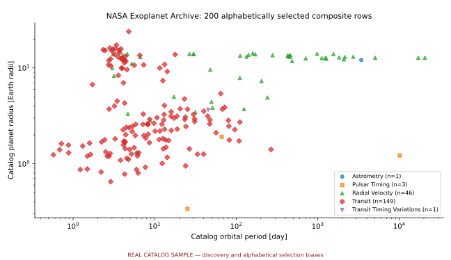

# C23 · KEPLER METAL WORLDS

**Original project:** Investigating the Relationship Between Exoplanet Occurrence & Host Star Metallicity

**Session C:** Astronomy & Space Physics

**Document class:** engineering research design and analysis record · **Revision:** 2 · **Date:** 2026-10-02

**Evidence state:** design basis, mathematical formulation and verification plan documented. Project-specific empirical results remain to be acquired; executable shared model demonstrations have their own recorded checks.

[Engineering document register](../../ENGINEERING_DOCUMENTATION.md) · [Session C handbook](../../documentation/SESSION_C.md) · [Previous: C22](../C/C22.md) · [Next: C24](../C/C24.md)

## Purpose and scientific objective

Estimate planet occurrence as a function of host-star metallicity using a defined survey target sample, candidates, completeness, and reliability. Avoid comparing metallicity distributions of confirmed planets alone, which lacks the denominator of searched stars. Separate planet size/period domains and stellar populations so metallicity associations can inform formation models without conflating transit detectability or stellar-parameter quality.

**Question:** How does occurrence in specified radius-period bins vary with metallicity after accounting for transit geometry, detection/vetting efficiency, reliability, and correlated host properties?

**Testable hypothesis:** A selection-aware metallicity trend will depend on planet radius and orbital period; its uncertainty will increase when heterogeneous metallicity measurements and stellar-radius covariance are propagated.

## 1. Design basis and analysis boundary

The occurrence pipeline has a searched-star denominator, Kepler candidate sample and survey selection operator. It estimates planets per star in declared radius-period-metallicity domains, rather than comparing confirmed-host metallicity histograms. DR25 simulated completeness/reliability products supply selection calibration. Metallicity measurements have their own targeting and calibration uncertainty.

Begin with a controlled radius-period domain and documented stellar sample, then measurement-error hierarchy and finally multiplicity sensitivity. Transit geometry, detection, window and vetting probabilities are separate factors. Excluded stars and missing metallicities are tracked so a convenient spectroscopy subset is not silently treated as the full survey. Metallicity effects are conditional on host covariates and accessible survey support.

## 2. Requirements and verification traceability

These are project design requirements or proposed analysis gates. A numerical target is not a NASA requirement unless its controlling source is explicitly identified. “TBD” identifies evidence required before a decision; it is not permission to assume a value. Verification evidence listed here is planned, unless a linked result explicitly records execution.

| ID | Requirement / gate | Engineering rationale | Verification method | Basis / required evidence |
| --- | --- | --- | --- | --- |
| C23-R1 | Every fitted occurrence model shall include all qualifying searched stars, including zero-candidate targets. | Occurrence requires the nondetection denominator. | Target/candidate linkage and count audit. | Kepler DR25 product context. |
| C23-R2 | Detection, window, transit geometry and vetting probabilities shall be separately versioned. | Hidden factor duplication biases exposure. | Selection-factor injection and reconstruction fixture. | Proposed selection contract. |
| C23-R3 | Metallicity shall retain measurement uncertainty, method offset and sample-inclusion state. | Noisy/incomplete abundances bias slopes. | Cross-method offset and missingness audit. | Proposed covariate requirement. |
| C23-R4 | Poisson exposure integration shall converge to 1%, a proposed target, within declared R/P support. | Numerical expected counts determine normalization. | Adaptive quadrature refinement. | Proposed integration target. |
| C23-R5 | Candidate reliability shall enter a mixture or validated weighting treatment. | Arbitrary deletion shifts occurrence. | False-positive/control simulation comparison. | DR25 reliability simulations. |
| C23-R6 | Host-block bootstrap or hierarchical multiplicity sensitivity shall accompany Poisson errors. | Planets within systems are correlated. | Synthetic correlated-multiplicity recovery. | Proposed uncertainty requirement. |

## 3. Architecture and controlled interfaces

A target adapter emits stellar properties, metallicity posterior, observation duty cycle and noise/detection metadata. A candidate adapter includes radius/period posteriors, host link, disposition and reliability. A selection engine computes target-specific transit, window, detection and vetting probabilities from pinned products, with factor semantics explicit.

The occurrence engine evaluates intensity in logarithmic radius/period coordinates and integrates over each searched star. A false-positive branch retains candidate ambiguity. A metallicity-calibration layer fits method offsets and selection of measured abundances. Forward survey simulation generates both detections and nondetections, while multiplicity alternatives assess the independence approximation.

Nondetection exposure and candidate reliability jointly normalize occurrence, with metallicity uncertainty carried through the searched-star denominator.

[Editable engineering diagram source](../../visuals/projects/C23.mmd)

## 4. Mathematical model and derivation

### Governing equations

$$
\lambda_i(R,P,Z)=f(R,P,Z\mid\theta)\,p_{\rm tr}(R,P,i)\,C_i(R,P)\,V_i(R,P)
$$

$$
\log f=a+bZ+c\log P+d\log R+\mathrm{interactions}
$$

$$
\log\mathcal L=\sum_j\log\lambda_{i_j}(R_j,P_j,Z_j)-\sum_i\iint\lambda_i(R,P,Z_i)\,d\log R\,d\log P
$$

### Variables, units and conventions

- Z=[Fe/H] in dex with method-specific measurement offsets
- Planet radius in Earth radii; orbital period in days; f in planets star^-1 per log-radius/log-period area
- C and V are detection and vetting probabilities; p_tr is geometric transit probability
- Target stellar radii, masses, noise metrics, and metallicity uncertainties enter jointly
- False-positive reliability requires an explicit mixture or reliability treatment, not arbitrary deletion of candidates

### Assumptions and boundary conditions

- Restrict inference to a chosen Kepler sample with documented completeness products and adequate metallicity measurements.
- Multiplanet correlations and survey star selection are considered when estimating errors and interpreting host trends.

### Derivation step 1

$$
p_{tr}\approx(R_*+R_p)/a,\quad a^3=GM_*P^2/(4\pi^2)
$$

This circular-orbit baseline uses consistent radii/lengths; eccentricity and orientation priors modify geometric probability when included.

### Derivation step 2

$$
\lambda_i=f(R,P,Z_i)\,p_{tr,i}\,W_i\,C_i\,V_i
$$

Intensity is planets per star per dlogR dlogP times dimensionless selection factors. W is included only if not already folded into C.

### Derivation step 3

$$
\log\mathcal L=\sum_j\log\lambda_{i_j}(R_j,P_j,Z_j)-\sum_i\int\lambda_i\,d\log R\,d\log P
$$

The integrated term is expected detected count and includes every target. Measurement/candidate uncertainty requires integration or posterior sampling around the event term.

### Derivation step 4

$$
\log f=a+bZ+c\log(P/P_0)+d\log(R/R_0)
$$

Positive occurrence follows exponentiation; b has inverse-dex units under the stated metallicity convention and is conditional on other covariates.

### Inference or simulation procedure

Build a target-star denominator with temperature, gravity, observation duty cycle, and metallicity quality cuts fixed before fitting. Link DR25 candidates, stellar posteriors, detection efficiency, window functions, and Robovetter outputs. Fit an inhomogeneous Poisson occurrence model or a validated hierarchical multiplicity alternative. Integrate measurement uncertainty rather than assigning stars and planets to hard bins. Include metallicity calibration offsets and covariates such as stellar mass and age when measured. Forward simulate the entire survey and compare observed candidate counts, radii, periods, and host metallicities.

### Validity domain and fidelity limits

Metallicity samples may have their own selection function; photometric metallicities can be imprecise. Trends in one transit survey do not automatically transfer to direct imaging or radial-velocity domains.

## 5. Data specifications and provenance

| Field | Type | Unit | Physical / statistical meaning | Quality and missing-data rule |
| --- | --- | --- | --- | --- |
| target_id | int64 | Kepler identifier | Every qualifying searched star. | Denominator inclusion/exclusion reason mandatory. |
| stellar_posterior | distribution<struct> | solar mass, solar radius, K | Host properties affecting geometry/detection. | Joint covariance and source version. |
| metallicity | measurement<float64>&#124;null | dex [Fe/H] | Host abundance and method. | Missing state and method-offset group retained. |
| candidate_posterior | distribution<float64[2]>&#124;null | Earth radius, day | R/P measurements for candidates. | No-candidate target is separate from missing measurement. |
| selection_components | float64[] | 1 | p_tr, window, detection and vetting. | Each in [0,1]; no duplicated window factor. |
| reliability | measurement<float64> | 1 | Candidate true-planet probability/context. | False-positive model version required. |
| occurrence_intensity | posterior<float64> | planet star^-1 per logR/logP | Latent rate in supported domain. | Log base and bin/support boundaries explicit. |
| expected_count | float64 | count | Integrated selected intensity. | Quadrature convergence and target count recorded. |

[Machine-readable record schema](../../data/contracts/C23.schema.json) · [Empty acquisition CSV](../../data/contracts/C23.csv) · [Field dictionary CSV](../../data/contracts/C23.dictionary.csv)

The CSV above contains column headers only. Its schema defines future records and does not establish that original-team data or a particular archive product have been acquired. Frame, timing, calibration, covariance, selection and provenance details must accompany populated records.

### Kepler completeness/reliability products overview

[Product, archive or reference](https://exoplanetarchive.ipac.caltech.edu/docs/Kepler_Data_Products_Overview.html)

**Fields:** Window functions, depth functions, pipeline detection efficiencies, stellar/candidate products

**Access:** Public documented files; freeze DR25 product versions and target IDs.

**Role:** Survey selection operator.

### DR25 simulated data

[Product, archive or reference](https://exoplanetarchive.ipac.caltech.edu/docs/KeplerSimulated.html)

**Fields:** Injected transit parameters, dispositions, completeness and reliability tests

**Access:** Public release; select relevant on-target and false-positive simulations.

**Role:** Independent selection validation.

## 6. Uncertainty, sensitivity and identifiability

Stellar radius affects planet radius and transit geometry together, while metallicity correlates with stellar mass, age and measurement quality. Keep those covariances and method offsets in a hierarchical model. Missing metallicity is often selection dependent; a spectroscopic subsample requires inclusion modeling or a deliberately restricted denominator.

Completeness and reliability calibration uncertainty can mimic metallicity dependence if noisy stars or target populations differ. Perturb selection products within documented uncertainty and compare forward candidate distributions. Test slope recovery under zero-metallicity-effect and correlated multiplicity injections. Inspect information in low-completeness domains and restrict inference rather than allowing large unobserved extrapolations to dominate expected counts.

## 7. Engineering trade study

| Alternative | Benefit | Cost / limitation | Decision rule |
| --- | --- | --- | --- |
| Binned inverse-efficiency estimator | Transparent initial diagnostic. | Unstable at low efficiency and measurement boundaries. | Use only as comparator in well-sampled bins. |
| Poisson intensity hierarchy | Natural nondetection/exposure treatment. | Approximate independence between planets. | Use primary model with host-block uncertainty. |
| Multiplicity-aware hierarchy | Models correlated systems. | More parameters and sample demand. | Adopt when multiplicity stress tests materially change metallicity inference. |

## 8. Verification and validation cases

| Case ID | Stimulus / condition | Expected result / criterion | Method | Evidence artifact |
| --- | --- | --- | --- | --- |
| C23-V1 | Perfect survey | With selection factors one, expected detections equal integrated occurrence times target count. | Analytic constant-rate fixture. | Poisson exposure identity. |
| C23-V2 | Zero metallicity effect | Injected b=0 is assessed for coverage without hard metallicity bins. | Forward survey with noisy abundance and selection. | Proposed slope-null test. |
| C23-V3 | Selection scaling | Halving detection probability halves expected detections at fixed occurrence. | Intensity integration fixture. | Multiplicative selection relation. |
| C23-V4 | DR25 recovery/host holdout | Observed selection recovery and candidate distributions are checked on unused injections/hosts. | Freeze cuts and calibration before holdout. | Primary simulated-data products and proposed validation. |

**Execution status:** these cases are specified, not claimed as executed. Close a case only with the versioned inputs, output, uncertainty, reviewer and pass/fail rationale.

### Additional scientific validation gates

- Recover injected metallicity slopes from synthetic surveys processed through actual target completeness.
- Hold out target-star subsets or metallicity measurement programs and test expected detections.
- Report posterior predictive counts and sensitivity to false-positive, metallicity, and radius-error models.

## 9. Implementation and reproducible work packages

1. Freeze target cuts and complete searched-star manifest.
2. Link candidate/stellar/metallicity posteriors and reliability.
3. Implement versioned geometry/window/detection/vetting operator.
4. Build converged Poisson intensity and false-positive likelihood.
5. Run metallicity-null, multiplicity and selection recovery simulations.
6. Publish supported-domain occurrence posteriors and denominator/selection audits.

### Investigation sequence

1. Preregister planet and star domains and metallicity calibration hierarchy.
2. Construct a target denominator and audit candidate completeness and reliability links.
3. Fit hierarchical occurrence and forward simulate catalog observations.
4. Compare radius-period-specific metallicity slopes with formation-model predictions and alternative stellar selections.

### Resources and interfaces to expertise

- KeplerPORTs or equivalent, archive query tools, stellar metallicity expertise, hierarchical sampler.

## 10. Failure modes and interpretation controls

| Failure mode | Effect on result | Detection / evidence | Design response |
| --- | --- | --- | --- |
| Confirmed-host-only denominator | Cannot estimate occurrence. | Missing zero-candidate targets. | Build searched-star target ledger. |
| Window factor counted twice | Occurrence biased upward. | Factor-semantic audit and fixture. | Separate product conventions explicitly. |
| Noisy metallicity assigned hard bin | Attenuated or distorted slope. | Posterior crossing of bin boundaries. | Integrate abundance uncertainty and offsets. |

- Planet-only catalogs cannot establish occurrence; incomplete metallicity selection and ignored stellar covariance can manufacture trends.

## 11. Required engineering outputs

- Selection-aware occurrence surfaces, metallicity-slope posterior tables, survey simulator, and reproducible denominator manifest.

### Scientific result figures to produce during execution

Planet occurrence versus metallicity and radius-period domain, with uncertainty bands and a parallel map of detection completeness.

### Included shared numerical starting point

[Executable formulation, parameters, tabular outputs, provenance and verification](../../models/README.md). This shared demonstration has a narrower domain than the project model above. Its own caption and methods identify synthetic parameters or the separately retrieved public catalog; it is not a completed result of the original project.

## 12. Cited technical and scientific resources

- [Narang et al. (2018), DR25 metallicity occurrence](https://arxiv.org/abs/1809.08385) — Prior metallicity/planet-domain analysis.
- [Kepler product definitions](https://exoplanetarchive.ipac.caltech.edu/docs/Kepler_Data_Products_Overview.html) — Completeness inputs and survey products.
- [Kepler simulated-data release](https://exoplanetarchive.ipac.caltech.edu/docs/KeplerSimulated.html) — Injection and reliability calibration.

Framework and evidence rules: [engineering documentation standard](../../docs/ENGINEERING_STANDARD.md), [model assurance](../../docs/MODEL_ASSURANCE.md), [uncertainty procedure](../../docs/UNCERTAINTY_AND_DECISION_RULES.md), and [data management](../../docs/DATA_MANAGEMENT.md). NASA-inspired names are creative identifiers; requirements and results are not NASA certification.
