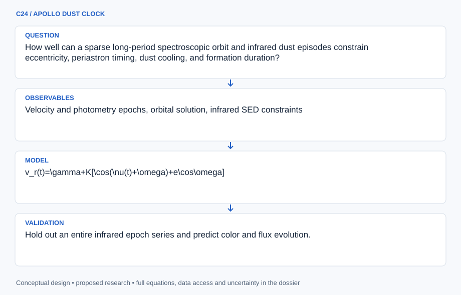

# C24 · APOLLO DUST CLOCK

**Original project:** The long-period orbit of the dust-producing Wolf-Rayet binary WR 125

**Session C:** Astronomy & Space Physics
**Status:** proposed research dossier; no project experiment or mission qualification has been performed.

Jointly infer the orbit and episodic dust emission of WR 125 using spectroscopy and infrared photometry. The 2024 study provides a long-period spectroscopic baseline; new work should test its assumptions and predict subsequent evolution rather than retain an outdated unknown-period framing. Allow dust formation to lag or span periastron, because an infrared maximum is not automatically the orbital closest approach.

## Scientific question

How well can a sparse long-period spectroscopic orbit and infrared dust episodes constrain eccentricity, periastron timing, dust cooling, and formation duration?

## Testable hypothesis

A joint orbital and dust-response model will predict infrared decline more accurately than exact periastron-triggered bursts and will expose uncertainty caused by wind-line radial velocities.

*Conceptual research design; arrows show the analysis dependency, not observed causation.*

## Mathematical model

$$
v_r(t)=\gamma+K[\cos(\nu(t)+\omega)+e\cos\omega]
$$

$$
M=E-e\sin E=2\pi(t-T_0)/P
$$

$$
F_\nu(t)=F_{\nu,*}+M_d(t)\kappa_\nu B_\nu[T_d(t)]/D^2
$$

### Variables and units

- P and T0 in years or days with consistent barycentric timing
- Vr, gamma, and K in km s^-1; e dimensionless; angles in radians
- Dust mass Md in g; opacity kappa in cm^2 g^-1; Td in K
- Flux density in Jy after unit conversion; distance D in cm
- Dust-source optical depth and stellar continuum are checked before assuming optically thin emission

### Assumptions and boundary conditions

- WR emission-line shifts can carry wind-structure systematics; allow line-specific zero points and jitter.
- Infrared burst timing constrains dust response and orbital phase jointly rather than enforcing equality to periastron.

### Inference or simulation method

Reconstruct a source-cited radial-velocity and multiband photometry table, including nondetections and instrument offsets. Fit Keplerian orbital motion with robust likelihoods and wind-line nuisance terms. Link dust injection to separation using a finite-width activation function and uncertain lag, then evolve temperature and optical depth through a physically motivated expansion/cooling model. Compare single-temperature dust with broader temperature distributions. Use the documented 2024 orbital solution as an external comparison or prior, with clear accounting if the same measurements are reused. Forecast epochs whose velocities or infrared colors discriminate remaining orbital solutions.

### Model limits

A single-lined orbit does not determine individual masses without inclination and companion information. Dust opacity, distance, and temperature can trade off with mass; sparse multi-decade coverage can leave aliases.

## Data and provenance contracts

### WR125 2024 orbital/dust publication

[Resource or product discovery](https://arxiv.org/abs/2405.10454)

**Fields:** Velocity and photometry epochs, orbital solution, infrared SED constraints

**Access:** Open paper; inspect associated tables and spectra availability.

**Role:** Current target-specific baseline.

### WR125 earlier multiwavelength campaign

[Resource or product discovery](https://arxiv.org/abs/2109.12365)

**Fields:** Infrared/X-ray epochs, archival comparisons, recurring dust event

**Access:** Open publication; obtain original instrument products where accessible.

**Role:** Independent-era observational context.

## Staged execution

1. Audit repeated measurements and coordinate/time conventions across decades.
2. Fit spectroscopic orbit before introducing uncertain dust-phase coupling.
3. Fit dust cooling and formation duration with multi-instrument photometric offsets.
4. Produce posterior forecasts and expected information gain for future spectroscopy and infrared observing.

## Verification and validation

- Hold out an entire infrared epoch series and predict color and flux evolution.
- Fit one dust episode and predict the other with propagated period uncertainty.
- Check residual line dependence and compare orbit conclusions under alternative wind jitter and dust-lag priors.

*Any numerical gate is a proposed requirement unless the dossier explicitly identifies a sourced requirement. Freeze gates before collecting confirmatory data.*

## Resources and deliverables

- Binary-orbit sampler, infrared SED tools, spectroscopy and WR-wind expertise, archival photometry.

- Orbit and dust posterior atlas, data-provenance ledger, future-epoch predictions, and observing priorities.

## Risks and interpretation

- Assuming infrared maximum equals periastron can overconstrain the orbit; systematic wind-line shifts may dominate formal errors.

## Figure plan

Multi-decade radial velocities and infrared outbursts with joint posterior orbit, dust-response lag, and forecast uncertainty.

## Cited scientific resources

- [Richardson et al. (2024), WR125 orbit and dust](https://arxiv.org/abs/2405.10454) — Current orbital and infrared baseline.
- [Arora et al. (2021), WR125 campaign](https://arxiv.org/abs/2109.12365) — Earlier infrared and high-energy context.

Source discovery reviewed 2026-10-02. A public source pointer does not imply original student-team data access. See [model assurance](../../docs/MODEL_ASSURANCE.md) and [data management](../../docs/DATA_MANAGEMENT.md).
