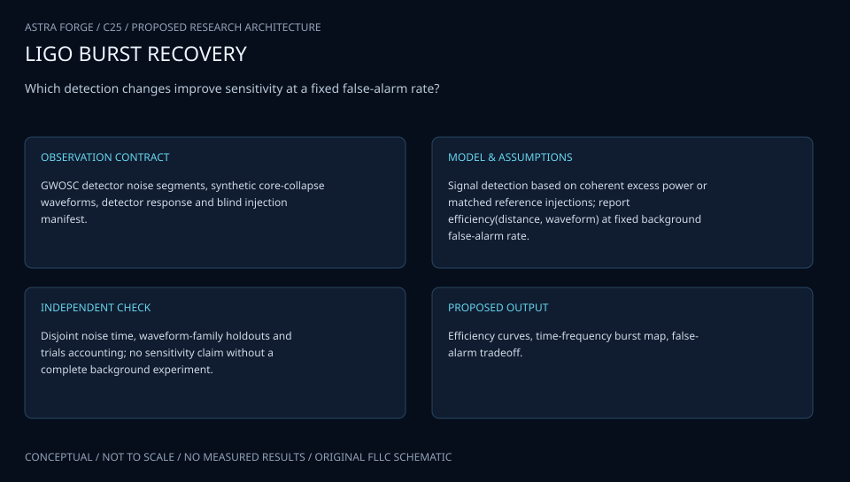

# C25 · ORION BURST SENTINEL

**Original project:** Improving the Detection of Core-Collapse Supernova Through Experimentation

**Session C:** Astronomy & Space Physics
**Status:** proposed research dossier; no project experiment or mission qualification has been performed.

Scope the broad historical title as a gravitational-wave CCSN detection experiment, coordinated with neutrino or electromagnetic trigger windows when available. Compare interpretable coherent-burst methods and machine-learning ranking without presenting synthetic detections as real supernova discoveries. The primary success measure is improved detection probability at a fixed, empirically estimated false-alarm rate across unseen supernova waveform families.

## Scientific question

Which experimental pipeline changes improve weak-supernova detection in real detector noise while preserving false-alarm control and robustness to unseen signal morphology?

## Testable hypothesis

Combining coherent network features with a calibrated noise-artifact classifier will improve sensitivity at fixed false-alarm rate more reliably than unconstrained waveform classification.

*Conceptual research design; arrows show the analysis dependency, not observed causation.*

## Mathematical model

$$
d_k=F_k^+h_++F_k^\times h_\times+n_k
$$

$$
\rho_{\rm coh}^2=\mathbf d^\dagger\mathbf P_{\rm signal}\mathbf d;\quad E_{\rm null}=\mathbf d^\dagger(\mathbf I-\mathbf P_{\rm signal})\mathbf d
$$

$$
\mathrm{FAP}=1-e^{-\mathrm{FAR}\,T_{\rm on}}
$$

### Variables and units

- Whitened network data d use a documented noise PSD and time-frequency normalization
- Coherent and null energies are dimensionless ranking components, not direct radiated energy
- FAR in events per unit time; Ton is the independently justified on-source window
- Detection efficiency is dimensionless and indexed by distance, orientation, waveform family, and network
- P_signal projects onto detector responses for a trial sky location; sky-search trials are included in background

### Assumptions and boundary conditions

- An external trigger can narrow the window only when its timing and source association are independently justified.
- Background shifts preserve valid detector-noise properties; pipeline training and final significance testing use separate data.

### Inference or simulation method

Use a fixed coherent-burst baseline with network timing, polarization, and null-stream diagnostics. Propose one change at a time: time-frequency clustering, morphology features, denoising, or artifact-aware ranking. Estimate background using independent noise and justified time shifts; inject physically diverse CCSN polarizations into untouched strain. Calibrate ML scores on validation noise rather than interpreting raw scores as probabilities. Preregister efficiency and FAR reporting, computational latency, and fail-safe behavior under missing detectors. Compare performance with and without a justified neutrino trigger window.

### Model limits

Small background samples cannot support extraordinarily low FAR claims. A narrow waveform training library can increase efficiency only for its own morphology and reduce generalization.

## Data and provenance contracts

### GWOSC strain

[Resource or product discovery](https://gwosc.org/)

**Fields:** Strain segments, sample rate, detector quality, released metadata

**Access:** Public released data; segregate training, background, and blind test intervals.

**Role:** Realistic noise and background.

### CCSN deep-learning search study

[Resource or product discovery](https://arxiv.org/abs/2001.00279)

**Fields:** Signal families, noise-artifact tests, classification design

**Access:** Open publication; inspect waveform and code availability.

**Role:** Detection-method comparator.

## Staged execution

1. Freeze baseline, waveform-family split, search trials, trigger-window conventions, and FAR targets.
2. Benchmark baseline latency and false alarms before tuning changes.
3. Run controlled ablations and blind injections through the full pipeline.
4. Release improvement curves with uncertainties and observed background exposure, including failure domains.

## Verification and validation

- Hold out hydrodynamics codes and detector-noise epochs, plus realistic glitches.
- Compare efficiency at the same FAR and confidence interval; report unmeasurable low-FAR regimes explicitly.
- Use independent blind signal injections and noise-only trials; audit detector and waveform label leakage.

*Any numerical gate is a proposed requirement unless the dossier explicitly identifies a sourced requirement. Freeze gates before collecting confirmatory data.*

## Resources and deliverables

- Coherent burst implementation, GWpy, ML tools optional, waveform archive, signal-processing/GW mentor.

- Blinded detection challenge, sensitivity/FAR atlas, reproducible baseline and ablations, and latency report.

## Risks and interpretation

- Denoising can distort signal morphology; short background duration and threshold tuning on test data invalidate significance.

## Figure plan

Detection efficiency versus distance at common FAR, ablation comparisons, coherent/null feature maps, and background-exposure limits.

## Cited scientific resources

- [CCSN search and deep-learning classification](https://arxiv.org/abs/2001.00279) — Noise-artifact robustness and detection study.
- [ML background improvement for CCSN searches](https://arxiv.org/abs/2002.04591) — Artifact-ranking and coherent-burst improvement precedent.
- [GWOSC](https://gwosc.org/) — Public detector-noise access.

Source discovery reviewed 2026-10-02. A public source pointer does not imply original student-team data access. See [model assurance](../../docs/MODEL_ASSURANCE.md) and [data management](../../docs/DATA_MANAGEMENT.md).
