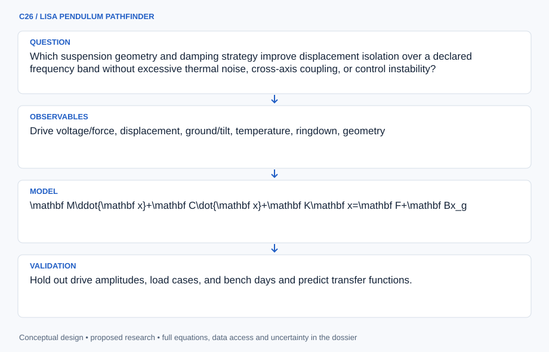

# C26 · LISA PENDULUM PATHFINDER

**Original project:** Low Frequency Prototype of Laser Interferometer Suspensions for Gravitational Wave Detection

**Session C:** Astronomy & Space Physics

**Document class:** engineering research design and analysis record · **Revision:** 2 · **Date:** 2026-10-02

**Evidence state:** design basis, mathematical formulation and verification plan documented. Project-specific empirical results remain to be acquired; executable shared model demonstrations have their own recorded checks.

[Engineering document register](../../ENGINEERING_DOCUMENTATION.md) · [Session C handbook](../../documentation/SESSION_C.md) · [Previous: C25](../C/C25.md) · [Next: C27](../C/C27.md)

## Purpose and scientific objective

Build a terrestrial suspension and displacement-readout prototype inspired by precision interferometry; the name is thematic and does not imply this is LISA flight hardware. Measure isolation, resonances, damping, and thermal/noise limits at low frequencies. Treat low resonance as one design property, not an automatic guarantee of reduced thermal motion or gravitational-wave sensitivity.

**Question:** Which suspension geometry and damping strategy improve displacement isolation over a declared frequency band without excessive thermal noise, cross-axis coupling, or control instability?

**Testable hypothesis:** A measured multi-stage model with independently constrained loss and coupling will predict bench performance better than ideal pendulum scaling, and identify the actual low-frequency noise floor.

## 1. Design basis and analysis boundary

The suspension prototype measures terrestrial displacement isolation, modal response and noise for a verified bench geometry. It is not LISA flight hardware. Inputs are mechanical dimensions/materials, calibrated drives, displacement and independent ground/tilt sensing. Low resonance alone does not guarantee lower thermal noise; passive loss and active readout/control terms need separate budgets.

Begin with one-degree-of-freedom susceptibility, then measured multi-axis state-space identification, then constrained damping. A room-scale prototype has its own practical band and readout floor, both TBD until equipment characterization. Passive equilibrium thermal calculations use a consistent one-sided per-Hz convention. Active damping is evaluated as a separate nonequilibrium loop with injected sensor/actuator noise.

## 2. Requirements and verification traceability

These are project design requirements or proposed analysis gates. A numerical target is not a NASA requirement unless its controlling source is explicitly identified. “TBD” identifies evidence required before a decision; it is not permission to assume a value. Verification evidence listed here is planned, unless a linked result explicitly records execution.

| ID | Requirement / gate | Engineering rationale | Verification method | Basis / required evidence |
| --- | --- | --- | --- | --- |
| C26-R1 | Displacement and force calibration shall have documented scale uncertainty and timestamp synchronization. | Transfer functions otherwise mix drive/sensor response. | Calibration ledger and known-gain replay. | Proposed metrology contract. |
| C26-R2 | Identified modal frequencies shall converge within 1% under sampling/fit refinement, a proposed target. | Numerical/aliasing errors can shift resonance. | Ringdown/transfer comparison and fit refinement. | Proposed identification target. |
| C26-R3 | Noise budgets shall distinguish passive thermal, ground, tilt, readout and active-loop contributions. | Low resonance does not identify the dominant noise. | Independent sensor/drive and coherence tests. | Primary suspension theory context. |
| C26-R4 | A controller shall demonstrate modeled stability margins of at least 6 dB gain and 30 degrees phase, proposed bench targets, before hardware-loop use. | Unidentified delays can destabilize damping. | Measured-model Bode/Nyquist and uncertainty sweep. | Proposed control targets, not detector requirements. |
| C26-R5 | Isolation claims shall state the verified frequency band and displacement readout floor. | An apparent attenuation below sensor noise is not measured isolation. | Bandwise coherence and noise-floor report. | Proposed performance contract. |

## 3. Architecture and controlled interfaces

A geometry/material registry emits mass, stiffness assumptions, dissipative elements and coordinate definitions. A mechanical model computes susceptibility and cross-axis transfer. Acquisition adapters record calibrated force, displacement, ground/tilt and temperature with synchronized timestamps. Drive and readout transfer functions are de-embedded only within measured support.

Identification combines ringdown and small-drive response. A passive-loss module predicts thermal motion, while an active state-space controller adds actuator and sensor noise paths. The comparison engine separates coherent ground coupling from incoherent/readout limits and checks parameter consistency across amplitudes. Drift or hysteresis invalidates the local linear model and triggers reidentification rather than an unexplained low-frequency correction.



Measured dynamics support separate passive thermal and active-loop noise budgets; sensor-floor and base-coupling assumptions limit isolation claims.

[Editable engineering diagram source](../../visuals/projects/C26.mmd)

## 4. Mathematical model and derivation

### Governing equations

$$
\mathbf M\ddot{\mathbf x}+\mathbf C\dot{\mathbf x}+\mathbf K\mathbf x=\mathbf F+\mathbf Bx_g
$$

$$
H(\omega)=\omega_0^2/[\omega_0^2-\omega^2+i\omega\omega_0/Q]
$$

$$
S_x(f)=\frac{2k_BT}{\pi f}|\mathrm{Im}[\chi(2\pi f)]|\quad\text{one-sided per-Hz convention}
$$

### Variables, units and conventions

- Displacement x and ground motion xg in m; mass M in kg
- Stiffness in N m^-1; damping in N s m^-1; force in N
- Frequency f in Hz and omega=2 pi f in rad s^-1
- Q dimensionless; temperature T in K; susceptibility chi in m N^-1
- Sx in m^2 Hz^-1 with variance equal to its positive-frequency integral; absolute imaginary response handles Fourier-sign convention

### Assumptions and boundary conditions

- The fluctuation-dissipation expression uses a passive, equilibrium response with a consistent sign convention.
- Active damping, readout noise, tilt-horizontal coupling, and structural loss require separate noise terms.

### Derivation step 1

$$
\chi(\omega)=1/[k-m\omega^2+i c\omega]
$$

Using the exp(i omega t) response convention gives negative imaginary susceptibility for positive viscous damping; thermal formulas use its absolute imaginary part.

### Derivation step 2

$$
H_{stiff}(\omega)=k\chi(\omega),\quad\omega_0=\sqrt{k/m},\ Q=m\omega_0/c
$$

This reproduces the stated stiffness-driven base model. If damping acts relative to the moving base, the numerator becomes k+i c omega; geometry determines which operator applies.

### Derivation step 3

$$
S_x(f)=\frac{2k_BT}{\pi f}|\operatorname{Im}\chi(2\pi f)|
$$

One-sided per-Hz displacement PSD integrates to variance over positive frequency. Passive equilibrium and linear response are required.

### Derivation step 4

```text
S_{out}=|H_g|^2S_g+|H_r|^2S_{read}+|H_a|^2S_{act}+S_{th}
```

Independent-noise approximation is a starting budget; add measured cross-spectra when sources are correlated. Active control changes transfer paths and cannot be described solely by passive Q.

### Inference or simulation procedure

Create a mechanical digital twin and derive modal frequencies and cross-axis responses. Use a low-mass bench prototype with displacement readout and independent ground/tilt sensors. Measure transfer functions with small calibrated drives and ringdown data; infer damping and hysteresis without fitting every noise source simultaneously. Compare a simple pendulum, multistage design, or spring-antispring geometry within practical stability limits. Propagate measured loss and temperature through fluctuation-dissipation modeling. Fit a closed-loop state-space controller only after identifying actuator and sensor dynamics, then measure injected readout noise and stability margins.

### Validity domain and fidelity limits

A room-scale prototype cannot claim astrophysical detector sensitivity. Spring-antispring reduction of resonance does not necessarily reduce thermal noise; suspension geometry and dissipative elements matter.

## 5. Data specifications and provenance

| Field | Type | Unit | Physical / statistical meaning | Quality and missing-data rule |
| --- | --- | --- | --- | --- |
| geometry | struct | m, kg | Verified masses, lengths and coordinates. | Measured/assumed properties distinguished. |
| drive_force | measurement<float64[n]> | N | Calibrated test excitation. | Actuator transfer and range attached. |
| displacement | measurement<float64[n]> | m | Readout of chosen mass/axis. | Sensor floor, calibration and gaps retained. |
| ground_tilt | float64[n,components] | m, radian | Independent support motion. | Common time base and cross-axis sign. |
| temperature | measurement<float64> | K | Thermal state. | Passive equilibrium applicability flagged. |
| transfer_function | complex128[nf] | m N^-1 or 1 | Force or base-motion response. | Input/output type and coherence mandatory. |
| noise_psd | float64[nf] | m^2 Hz^-1 | One-sided displacement spectrum. | Window/averaging and confidence limits recorded. |
| identified_model | struct<M,C,K> | kg, N s m^-1, N m^-1 | Multi-axis local dynamics. | Covariance and amplitude validity range. |

[Machine-readable record schema](../../data/contracts/C26.schema.json) · [Empty acquisition CSV](../../data/contracts/C26.csv) · [Field dictionary CSV](../../data/contracts/C26.dictionary.csv)

The CSV above contains column headers only. Its schema defines future records and does not establish that original-team data or a particular archive product have been acquired. Frame, timing, calibration, covariance, selection and provenance details must accompany populated records.

### New suspension bench data

[Product, archive or reference](https://arxiv.org/abs/1707.07309)

**Fields:** Drive voltage/force, displacement, ground/tilt, temperature, ringdown, geometry

**Access:** Generate locally; proposed measurements are not existing results.

**Role:** Measured mechanical/noise model.

### Multi-loop suspension theory

[Product, archive or reference](https://arxiv.org/abs/physics/9909015)

**Fields:** Thermal noise and material/geometry dependence

**Access:** Open primary theory paper; evaluate assumptions against chosen prototype.

**Role:** Independent theoretical benchmark.

## 6. Uncertainty, sensitivity and identifiability

Force calibration, readout scale and support motion affect identified stiffness/damping jointly. Ringdown estimates loss but may not resolve low-frequency structural damping; a viscous fit can fail away from resonance. Retain parameter covariance and compare response over drive amplitude, temperature and direction. Tilt-horizontal coupling can dominate low-frequency displacement even when vertical isolation improves.

Thermal noise depends on dissipative elements and geometry, while active feedback injects readout/actuator noise. Compute sensitivities of the output budget to loss, resonance and loop delay, then use independent sensor channels and coherence to separate terms. If the readout floor hides predicted attenuation, report a limit. Geometry alternatives should be ranked on integrated band noise and stability, not resonance frequency alone.

## 7. Engineering trade study

| Alternative | Benefit | Cost / limitation | Decision rule |
| --- | --- | --- | --- |
| Simple pendulum | Auditable mechanics and calibration. | Limited low-frequency isolation. | Use required baseline. |
| Multistage suspension | Stronger high-frequency isolation. | Extra modes, cross-axis coupling and complexity. | Adopt when measured band benefit exceeds added uncertainty. |
| Spring/antispring with active damping | Lower effective stiffness and controllable resonance. | Stability and loss/readout penalties. | Use only with robust identified margins and full noise budget. |

## 8. Verification and validation cases

| Case ID | Stimulus / condition | Expected result / criterion | Method | Evidence artifact |
| --- | --- | --- | --- | --- |
| C26-V1 | Static force | At frequency tending to zero, displacement per force approaches 1/k. | Analytic/measured low-drive comparator. | Susceptibility limit. |
| C26-V2 | High-frequency stiffness isolation | Magnitude approaches omega0 squared/omega squared for the declared stiffness-input model. | Frequency sweep and alternate damping-input check. | Transfer asymptote. |
| C26-V3 | Thermal equilibrium | Integrated passive displacement PSD approaches kBT/k for a single viscous mode. | Numerical PSD integration over converged bounds. | Equipartition/fluctuation-dissipation consistency. |
| C26-V4 | Unseen drive/amplitude | Transfer/noise predictions are checked without reidentifying the model. | Held-out low-amplitude sweep and sensor-noise injection. | Proposed bench validation. |

**Execution status:** these cases are specified, not claimed as executed. Close a case only with the versioned inputs, output, uncertainty, reviewer and pass/fail rationale.

### Additional scientific validation gates

- Hold out drive amplitudes, load cases, and bench days and predict transfer functions.
- Compare inferred Q with independent ringdown; test linearity and cross-axis coupling.
- Demonstrate closed-loop stability under sensor noise and controlled perturbations, with measured noise-floor confidence bounds.

## 9. Implementation and reproducible work packages

1. Inventory verified geometry, materials and sensing/drive interfaces.
2. Implement force/base susceptibilities and multi-axis digital twin.
3. Acquire synchronized ringdown and calibrated small-drive data.
4. Fit local dynamics with covariance and amplitude-validity checks.
5. Build passive thermal plus active/readout/tilt noise budget.
6. Validate robust controller margins and publish band-limited measured isolation/noise.

### Investigation sequence

1. Define frequency band, payload, allowable motion, sensor floor, and safe mechanical load envelope.
2. Model and assemble a simple baseline before adding stages or active control.
3. Measure modal response, loss, and environmental coupling with independent calibration.
4. Compare designs by total displacement-noise budget and robustness rather than resonance frequency alone.

### Resources and interfaces to expertise

- Mechanical fixtures, interferometric or calibrated optical readout, accelerometer/tiltmeter, DAQ, precision-mechanics supervisor.

## 10. Failure modes and interpretation controls

| Failure mode | Effect on result | Detection / evidence | Design response |
| --- | --- | --- | --- |
| Readout floor mistaken for isolation | Overstated attenuation. | Low input/output coherence and independent sensor comparison. | Report limit or improve readout. |
| Active noise omitted | Unexpected closed-loop displacement. | Noise changes with gain/readout injection. | Include sensor/actuator paths. |
| Wrong base-damping model | Incorrect isolation asymptote. | Measured phase/numerator mismatch. | Identify actual dissipative coupling and update model. |

- Wire fatigue, moving masses, and optical alignment require qualified bench controls; tilt and readout noise can conceal thermal motion.

## 11. Required engineering outputs

- Mechanical twin, measured transfer-function/noise atlas, suspension drawings, and controller stability report.

### Scientific result figures to produce during execution

Mechanical mode sketch with measured/model Bode responses, cross-axis coupling, and displacement-noise budget in m/sqrt(Hz).

## 12. Cited technical and scientific resources

- [Harms and Mow-Lowry (2017), spring-antispring thermal noise](https://arxiv.org/abs/1707.07309) — Limits of low-resonance isolation and thermal noise.
- [Brif (1999), multi-loop pendulum thermal noise](https://arxiv.org/abs/physics/9909015) — Material and geometry noise dependence.

Framework and evidence rules: [engineering documentation standard](../../docs/ENGINEERING_STANDARD.md), [model assurance](../../docs/MODEL_ASSURANCE.md), [uncertainty procedure](../../docs/UNCERTAINTY_AND_DECISION_RULES.md), and [data management](../../docs/DATA_MANAGEMENT.md). NASA-inspired names are creative identifiers; requirements and results are not NASA certification.
