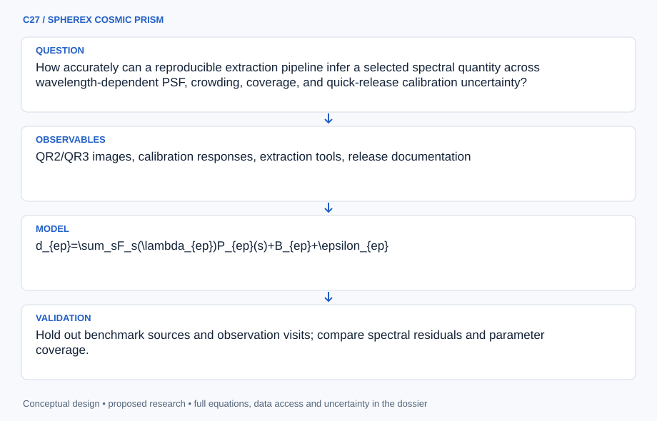

# C27 · SPHEREX COSMIC PRISM

**Original project:** SPHEREx: The Future of Satellite Astronomy

**Session C:** Astronomy & Space Physics
**Status:** proposed research dossier; no project experiment or mission qualification has been performed.

Update the historical future-mission title into a current data-science program. NASA reports SPHEREx launched on March 11, 2025 and began regular science operations on May 1, 2025; IRSA lists QR3 from September 2026. Develop validated spectral extraction, selection characterization, and a focused scientific pilot, such as ice absorption or galaxy redshift inference, using available products and their documented quick-release limitations.

## Scientific question

How accurately can a reproducible extraction pipeline infer a selected spectral quantity across wavelength-dependent PSF, crowding, coverage, and quick-release calibration uncertainty?

## Testable hypothesis

Joint forced photometry across individual spectral images with per-exposure response and covariance will outperform naive sampling of a mosaic at fixed sky coordinates in crowded or nonuniform-coverage fields.

*Conceptual research design; arrows show the analysis dependency, not observed causation.*

## Mathematical model

$$
d_{ep}=\sum_sF_s(\lambda_{ep})P_{ep}(s)+B_{ep}+\epsilon_{ep}
$$

$$
\tau_{\rm ice}(\lambda)=-\ln[F(\lambda)/F_{\rm cont}(\lambda)];\quad N_{\rm ice}=\int\tau(\widetilde\nu)d\widetilde\nu/A
$$

$$
p(z\mid F)\propto p(F\mid z,\mathrm{SED},\mathrm{cal})p(z,\mathrm{SED},\mathrm{cal})
$$

### Variables and units

- e indexes exposures, p pixels; spectral flux in release-documented units
- Each pixel has wavelength and PSF from instrument calibration; wavelength in micrometers
- Ice wavenumber in cm^-1 and band strength A in cm molecule^-1 yield column in molecules cm^-2
- Redshift z dimensionless; calibration nuisance parameters and foreground extinction propagated
- Choose either ice-column or redshift pilot as primary before fitting; equations illustrate two supported scientific branches

### Assumptions and boundary conditions

- Quick-release products and calibrated spectral responses are version pinned; coverage may not yet support every source at every wavelength.
- An ice column depends on a justified continuum and laboratory band strength, while galaxy redshift requires suitable SED templates.

### Inference or simulation method

Use IRSA metadata to select a small field with adequate spectral coverage and independent benchmark spectroscopy. Retrieve individual spectral-image cutouts and their PSF, uncertainty, and quality extensions. Extract forced photometry with joint nearby-source/background fitting and compare with the official tool. Propagate correlated calibration and source-confusion errors. Run an ice-absorption or redshift pilot with preregistered model assumptions; forward simulate completeness and blending through the actual coverage. Check documented header corrections and QR2/QR3 differences before combining products. Keep mission-scale forecasts separate from measured pilot performance.

### Model limits

Quick releases can contain evolving calibration or header corrections. A preliminary source spectrum is not a uniformly selected all-sky catalog; available wavelength coverage and calibration must be checked per target.

## Data and provenance contracts

### IRSA SPHEREx mission/archive page

[Resource or product discovery](https://irsa.ipac.caltech.edu/Missions/spherex.html)

**Fields:** QR2/QR3 images, calibration responses, extraction tools, release documentation

**Access:** Public archive; QR3 listed September 2026. Record exact release, header correction status, and coverage.

**Role:** Primary mission data and current status.

### IRSA SPHEREx explorer overview

[Resource or product discovery](https://irsa.ipac.caltech.edu/onlinehelp/spherex/spherex/overview.html)

**Fields:** Spectral-image semantics, wavelength-dependent position information, archive tools

**Access:** Public documentation; use current explanatory supplement for numerical calibration details.

**Role:** Observation operator and extraction conventions.

## Staged execution

1. Freeze one scientific pilot, target field, release version, and independent benchmark sample.
2. Build cutout/extraction manifests and inspect wavelength coverage and flags.
3. Fit source/background models and compare against official spectrophotometry outputs.
4. Validate spectral quantities, completeness, and blending before expanding the pilot.

## Verification and validation

- Hold out benchmark sources and observation visits; compare spectral residuals and parameter coverage.
- Inject blended sources and absorption features into realistic exposures with actual coverage.
- Compare independent extraction methods and release versions, tracking calibration changes rather than averaging inconsistent products.

*Any numerical gate is a proposed requirement unless the dossier explicitly identifies a sourced requirement. Freeze gates before collecting confirmatory data.*

## Resources and deliverables

- IRSA tools/API, spectral fitting, PSF modeling, laboratory band strengths or galaxy templates, modest batch compute.

- Current-mission data notebook, pilot spectral atlas, release/correction ledger, and selection-aware science result protocol.

## Risks and interpretation

- Using prelaunch assumptions or obsolete headers can produce spurious features; confusion and missing coverage limit inference.

## Figure plan

Sky coverage and wavelength completeness linked to extracted spectra, PSF/blend residuals, and independently validated ice or redshift estimates.

## Cited scientific resources

- [NASA SPHEREx mission](https://science.nasa.gov/mission/spherex/) — Verified launch and active mission status.
- [NASA regular science operations announcement](https://www.nasa.gov/missions/spherex/nasas-spherex-space-telescope-begins-capturing-entire-sky/) — May 1, 2025 science-operation start.
- [IRSA SPHEREx archive](https://irsa.ipac.caltech.edu/Missions/spherex.html) — Current QR3 release and analysis resources.

Source discovery reviewed 2026-10-02. A public source pointer does not imply original student-team data access. See [model assurance](../../docs/MODEL_ASSURANCE.md) and [data management](../../docs/DATA_MANAGEMENT.md).
