# C28 · LOWELL LUNAR LANTERN

**Original project:** Narrow-band Filter Photometry Calibration for the Lowell 20''

**Session C:** Astronomy & Space Physics

**Document class:** engineering research design and analysis record · **Revision:** 2 · **Date:** 2026-10-02

**Evidence state:** design basis, mathematical formulation and verification plan documented. Project-specific empirical results remain to be acquired; executable shared model demonstrations have their own recorded checks.

[Engineering document register](../../ENGINEERING_DOCUMENTATION.md) · [Session C handbook](../../documentation/SESSION_C.md) · [Previous: C27](../C/C27.md) · [Next: C29](../C/C29.md)

## Purpose and scientific objective

Create a traceable narrowband photometric calibration for the telescope named in the original title, pending verification of its actual camera, filters, and observing setup. Measure total-system throughput, atmospheric extinction, detector response, and aperture corrections. Use spectrophotometric standards to produce synthetic band-integrated fluxes rather than assume a broadband color transformation applies to narrowband emission-line sources.

**Question:** What calibration model yields reproducible narrowband fluxes across airmass, source color, seeing, detector position, and observing night for the verified Lowell system?

**Testable hypothesis:** Measured throughput and spectrophotometric standards will reduce color-dependent residuals relative to a zero-point-only calibration, especially near sharp spectral features and filter band edges.

## 1. Design basis and analysis boundary

The calibration system is specific to the telescope named in the original title once its identity, camera and filter set are verified. It maps reference spectra to count rates and observed counts to narrowband fluxes with a traceable error budget. Total-system throughput explicitly excludes atmosphere, which is applied as a separate airmass-dependent factor. No Lowell filter inventory or measured capability is invented.

Begin with detector linearity/shutter/flat calibration, add synthetic standard-star photometry, then joint nightly extinction/zero-point fitting and emission-line conversion. Filter angle and temperature shift are measured or bounded. Broadband color equations are a diagnostic approximation; narrowband line sources require a response-integrated continuum/line model. Equipment metadata and observing access remain TBD.

## 2. Requirements and verification traceability

These are project design requirements or proposed analysis gates. A numerical target is not a NASA requirement unless its controlling source is explicitly identified. “TBD” identifies evidence required before a decision; it is not permission to assume a value. Verification evidence listed here is planned, unless a linked result explicitly records execution.

| ID | Requirement / gate | Engineering rationale | Verification method | Basis / required evidence |
| --- | --- | --- | --- | --- |
| C28-R1 | T_sys shall contain optics/filter/QE and exclude atmosphere; T_atm shall be applied exactly once. | Double extinction corrupts count predictions. | Component-throughput ledger and unit-airmass fixture. | Corrected governing throughput model. |
| C28-R2 | Standards shall include versioned spectral flux references and usable detector-range flags. | Reference pedigree and saturation affect absolute scale. | CALSPEC-file and frame-quality audit. | MAST reference-atlas context. |
| C28-R3 | Count integration shall conserve a flat reference spectrum to 0.1% under grid refinement, a proposed target. | Narrow passbands need stable numerical integration. | Response integration convergence fixture. | Proposed numerical target. |
| C28-R4 | Accepted count range shall demonstrate less than 1% corrected nonlinearity, a proposed pilot target. | Flux calibration assumes characterized response. | Measured exposure sweep and held-out flux levels. | Proposed instrument target, not claimed hardware capability. |
| C28-R5 | Nightly calibration shall retain zero-point/extinction covariance and withheld standards. | Airmass/zero-point degeneracy affects transfer. | Night/standard holdout and covariance report. | Proposed calibration validation. |
| C28-R6 | Line-flux outputs shall include continuum and filter-transmission corrections. | A count-to-magnitude factor alone is insufficient. | Synthetic narrow-line and shifted-line fixtures. | Proposed line-source contract. |

## 3. Architecture and controlled interfaces

An equipment manifest supplies verified collecting area, filter curves, optical response, detector gain and shutter behavior. Standard-spectrum ingestion retains absolute flux uncertainty and wavelength pedigree. A synthetic photometry engine integrates T_sys and T_atm separately. Raw-frame reduction emits electrons, sky subtraction, flat/aperture corrections and their covariance.

The nightly fit estimates zero point, extinction and optional spectral-shape terms using standards over documented airmass. A field-response module handles filter shifts and focal-plane variation. The science converter fits continuum plus line emission through on/off-band responses. Shared standard and throughput errors remain common across science targets; weather variability can invalidate a night or require time-dependent extinction.

Instrument and atmospheric throughput are applied separately, while nightly covariance and line-response corrections determine traceable science flux.

[Editable engineering diagram source](../../visuals/projects/C28.mmd)

## 4. Mathematical model and derivation

### Governing equations

$$
\dot N_e=A_{\rm tel}\int F_\lambda(\lambda)T_{\rm sys}(\lambda)T_{\rm atm}(\lambda,X)\lambda/(hc)\,d\lambda
$$

$$
m_{\rm inst}=-2.5\log_{10}(N_e/t);\quad m_{\rm std}=m_{\rm inst}+ZP-kX+c\,\mathrm{color}
$$

$$
T_{\rm atm}(\lambda,X)=e^{-\tau_{\rm atm}(\lambda)X}
$$

### Variables, units and conventions

- Electron rate in electrons s^-1; collecting area Atel in m^2 with consistent flux units
- F_lambda in W m^-2 m^-1 for the displayed SI form; wavelength in m inside the integral
- t in s; airmass X dimensionless; zero point ZP and extinction k in magnitudes
- T_sys includes optics, filter, detector QE and angle/temperature effects, and explicitly excludes atmosphere. T_atm supplies atmospheric transmission once, as a separate factor.
- Reported monochromatic line flux requires continuum subtraction and filter-transmission correction, not only a count-to-magnitude factor

### Assumptions and boundary conditions

- Verify telescope identity and equipment documentation; no original Lowell filter inventory is supplied.
- Standards must span relevant spectral colors and airmass; use current source-spectrum versions and stable targets.

### Derivation step 1

$$
\dot N_e=A_{tel}\int F_\lambda T_{sys}e^{-\tau_{atm}X}\lambda/(hc)\,d\lambda
$$

SI flux, area and photon conversion produce electron rate when T_sys includes registration probability. Atmosphere appears once as its own transmission.

### Derivation step 2

$$
m_{inst}=-2.5\log_{10}(N_e/t),\quad m_{std}=m_{inst}+ZP-kX+c\,color
$$

This sign convention makes positive extinction increase observed instrumental magnitude; the correction subtracts kX. The instrumental count unit/reference is declared.

### Derivation step 3

$$
N_{line}/t=A_{tel}F_{line}T_{sys}(\lambda_l)T_{atm}(\lambda_l,X)\lambda_l/(hc)
$$

For a narrow line after continuum subtraction, integrated line flux has W m^-2 units. Finite line width requires full spectral integration.

### Derivation step 4

$$
\Sigma_{cal}=J\Sigma_{ZP,k,c,throughput}J^T
$$

Shared calibration coefficients induce correlated science-flux errors; aperture/flat/count uncertainty contributes additional terms.

### Inference or simulation procedure

Inventory filter transmission curves, detector gain, linearity, shutter timing, flat fields, and focal-plane position dependence. Compute synthetic standard count rates from current CALSPEC or comparable traceable spectra. Acquire repeated standards and blanks over airmass and nights; fit nightly zero points plus extinction and optional color terms, retaining covariance. Test wavelength shifts from filter incidence angle and temperature. For emission-line science, integrate a source spectral model through the measured passband and fit continuum using off-line measurements. Publish separate absolute and relative calibration budgets with provenance for every spectrum and throughput component.

### Validity domain and fidelity limits

Narrow filters can be sensitive to stellar lines, telluric absorption, and redshift. Imperfect flats or atmospheric variability can dominate precision; synthetic calibration is only as accurate as throughput and reference spectra.

## 5. Data specifications and provenance

| Field | Type | Unit | Physical / statistical meaning | Quality and missing-data rule |
| --- | --- | --- | --- | --- |
| equipment_id | struct | m^2, detector units | Verified telescope/camera/filter configuration. | Unknown geometry/curve remains TBD. |
| standard_spectrum | array+reference | W m^-2 m^-1 | Traceable flux versus wavelength. | Exact source file/version and uncertainty retained. |
| system_throughput | float64[nlambda] | 1 | Optics/filter/QE excluding atmosphere. | Component ledger checks no atmospheric factor. |
| airmass_atmosphere | struct | 1 | X and extinction/optical-depth model. | Time/weather state and applicability recorded. |
| net_electrons | measurement<float64> | electron | Bias/dark/sky/flat-corrected aperture counts. | Saturated/nonlinear states masked; negative noise retained. |
| calibration_coefficients | posterior<float64[]> | mag, mag airmass^-1 | Nightly ZP/extinction/color terms. | Full covariance and color convention. |
| aperture_response | measurement<float64> | 1 | Seeing/position-dependent encircled-energy correction. | Standard/science applicability checked. |
| line_flux | measurement<float64>&#124;null | erg s^-1 cm^-2 | Response-corrected integrated emission line. | Null if continuum or passband correction unavailable. |

[Machine-readable record schema](../../data/contracts/C28.schema.json) · [Empty acquisition CSV](../../data/contracts/C28.csv) · [Field dictionary CSV](../../data/contracts/C28.dictionary.csv)

The CSV above contains column headers only. Its schema defines future records and does not establish that original-team data or a particular archive product have been acquired. Frame, timing, calibration, covariance, selection and provenance details must accompany populated records.

### MAST reference atlases/CALSPEC

[Product, archive or reference](https://stdatu.stsci.edu/hlsp/reference-atlases)

**Fields:** Reference spectral fluxes, uncertainties/pedigree, current standard-star files

**Access:** Public reference products; record exact file and reference-spectrum version.

**Role:** Traceable synthetic standard photometry.

### New Lowell observing/calibration campaign

[Product, archive or reference](https://outerspace.stsci.edu/spaces/PANSTARRS/pages/298812324/PS1%2BAbsolute%2Bphotometric%2Bcalibration)

**Fields:** Raw frames, airmass, time, filter, detector position, weather, standards

**Access:** Local telescope access and current equipment metadata must be obtained; PS1 is a methodology comparator only.

**Role:** Instrument-specific response and repeatability.

## 6. Uncertainty, sensitivity and identifiability

Zero point and extinction covary if standards occupy a narrow airmass range. Atmospheric spectral structure, reference-star absorption lines and filter shifts can make a broadband color approximation fail. Carry standard-spectrum and throughput covariance through synthetic rates, and inspect residuals versus airmass, source color, time and focal-plane position.

Detector nonlinearity, shutter timing, flat illumination and aperture losses affect relative calibration, while reference spectra set a common absolute scale. Use held-out stars, count levels and nights to separate those terms. For line sources, wavelength/redshift uncertainty couples to passband transmission and continuum subtraction. Report absolute and relative error budgets separately; repeated frames do not remove shared standard errors.

## 7. Engineering trade study

| Alternative | Benefit | Cost / limitation | Decision rule |
| --- | --- | --- | --- |
| Nightly ZP plus linear extinction | Simple auditable calibration. | Insufficient for structured atmosphere/filter shifts. | Use when residual diagnostics and held-out standards pass. |
| Response-integrated spectral calibration | Handles narrowband source spectra. | Requires measured throughput and reference SEDs. | Use for absolute narrowband and line flux. |
| Time/position-dependent calibration | Models variable weather and filter geometry. | More parameters and observation demand. | Adopt only with independent calibration coverage. |

## 8. Verification and validation cases

| Case ID | Stimulus / condition | Expected result / criterion | Method | Evidence artifact |
| --- | --- | --- | --- | --- |
| C28-V1 | No atmosphere | With tau=0 count rate is independent of airmass. | Synthetic standard fixture. | Separated throughput identity. |
| C28-V2 | Collecting-area scaling | Rate scales linearly with area under fixed throughput convention. | Dimensional count fixture. | Photon rate equation. |
| C28-V3 | Delta-line response | Count prediction follows transmission at the line wavelength. | Narrow-line limit against full integral. | Spectral-response limit. |
| C28-V4 | Withheld star/night | Flux residual and interval coverage are measured without retuning coefficients. | Independent standard and night holdouts. | Proposed instrument calibration validation. |

**Execution status:** these cases are specified, not claimed as executed. Close a case only with the versioned inputs, output, uncertainty, reviewer and pass/fail rationale.

### Additional scientific validation gates

- Hold out nights and standard stars and predict their measured count rates.
- Use independent spectrophotometric standards and repeated field stars to assess absolute versus relative errors.
- Check residuals against airmass, color, seeing, position, exposure time, and filter-edge features.

## 9. Implementation and reproducible work packages

1. Verify Lowell telescope/camera/filter identity and throughput pedigree.
2. Characterize gain/linearity/shutter/flat/aperture response.
3. Load exact reference spectra and implement separated transmission integration.
4. Fit nightly covariance-aware zero-point/extinction models.
5. Implement continuum-plus-line on/off-band converter.
6. Release held-out standards, absolute/relative budgets and valid-night/count domains.

### Investigation sequence

1. Verify the actual telescope, camera, filter naming, and data rights before allocating observation nights.
2. Measure detector response and throughput; freeze photometric conventions and standards.
3. Fit calibration across nights and airmass with uncertainty propagation.
4. Deliver flux conversions and science examples only within the validated color, flux, and observing-condition domain.

### Resources and interfaces to expertise

- Telescope/camera access, stable standards, filter spectrophotometry, detector-calibration equipment, photometry software.

## 10. Failure modes and interpretation controls

| Failure mode | Effect on result | Detection / evidence | Design response |
| --- | --- | --- | --- |
| Atmosphere included twice | Biased count/flux scale. | Component ledger and airmass residual. | Separate system and atmospheric contracts. |
| Filter shift ignored | Color/line-flux position bias. | Residual versus position/temperature. | Measure or bound response shift. |
| Variable night fit as constant | Unreliable transfer to science. | Time-dependent standard residuals. | Fit justified variability or reject affected interval. |

- Unverified equipment assumptions would invalidate calibration; nonphotometric weather and filter shifts need explicit quality flags.

## 11. Required engineering outputs

- Throughput curves, nightly calibration tables, full uncertainty budget, and reproducible narrowband flux-conversion notebook.

### Scientific result figures to produce during execution

Measured passband and source spectra above standard residuals versus airmass/color, with nightly zero-point covariance and line-flux corrections.

## 12. Cited technical and scientific resources

- [MAST reference atlases](https://stdatu.stsci.edu/hlsp/reference-atlases) — Current CALSPEC/reference spectrum access.
- [STScI PS1 absolute-calibration documentation](https://outerspace.stsci.edu/spaces/PANSTARRS/pages/298812324/PS1%2BAbsolute%2Bphotometric%2Bcalibration) — Throughput plus spectrophotometric-standard calibration precedent.

Framework and evidence rules: [engineering documentation standard](../../docs/ENGINEERING_STANDARD.md), [model assurance](../../docs/MODEL_ASSURANCE.md), [uncertainty procedure](../../docs/UNCERTAINTY_AND_DECISION_RULES.md), and [data management](../../docs/DATA_MANAGEMENT.md). NASA-inspired names are creative identifiers; requirements and results are not NASA certification.
