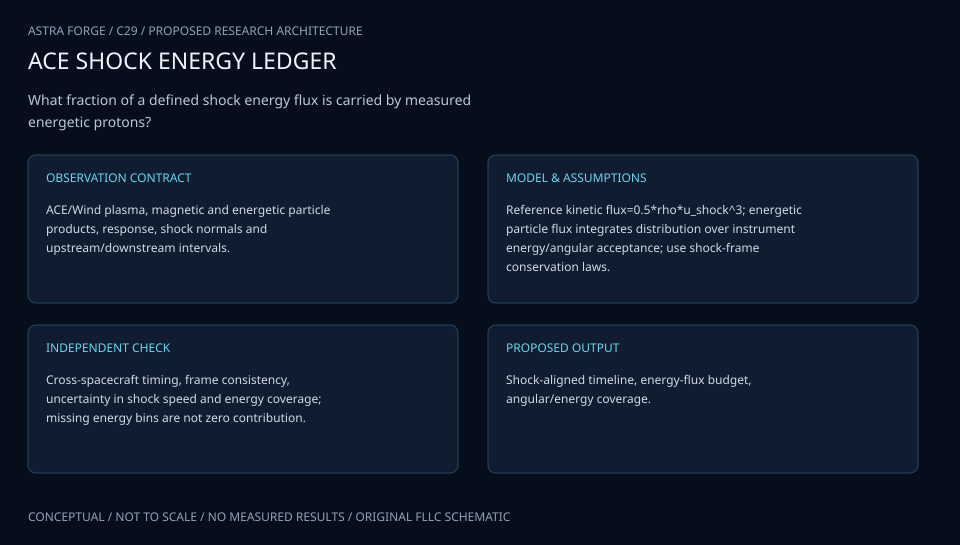

# C29 · ACE WIND SHOCK LEDGER

**Original project:** Energy Balance at Interplanetary Shocks: In-situ Measurement of the Fraction in Energetic Protons with ACE and Wind

**Session C:** Astronomy & Space Physics
**Status:** proposed research dossier; no project experiment or mission qualification has been performed.

Construct a shock-frame energy budget for ACE and Wind events using plasma, magnetic-field, and proton-spectrum measurements. Distinguish measured energetic-particle partial pressure from the total particle pressure and from a complete acceleration efficiency. Use energy-channel coverage, pitch-angle response, shock-normal uncertainty, and upstream/downstream window choice as explicit contributors to the result.

## Scientific question

What fraction of upstream energy flux appears in the measured downstream energetic-proton component, and which shock correlations survive instrument and shock-frame uncertainty?

## Testable hypothesis

Some apparent geometry or Mach-number trends will weaken after jointly propagating spectrum, normal, shock-speed, and sampling-window uncertainties, while individual energy budgets remain informative.

*Conceptual research design; arrows show the analysis dependency, not observed causation.*

## Mathematical model

$$
P_{\rm ep}=\frac{4\pi}{3}\int_{p_{\min}}^{p_{\max}}p^3v(p)f(p)\,dp
$$

$$
F_n=u_n[\rho u^2/2+\gamma_gP_g/(\gamma_g-1)+B_t^2/\mu_0]-B_n(\mathbf u_t\cdot\mathbf B_t)/\mu_0
$$

$$
U_{\rm ep}=4\pi\int E(p)p^2f(p)dp;\quad F_{\rm ep}=(U_{\rm ep}+P_{\rm ep})u_n+Q_{{\rm ep},n}
$$

$$
\eta_{\rm ep,band}=\Delta F_{\rm ep,band}/F_{n,\rm upstream}
$$

### Variables and units

- Pressure in Pa; velocity u in shock-frame m s^-1; density in kg m^-3
- B normal/tangential components in T; energy flux in W m^-2
- f is isotropic phase-space density with its normalization declared; p in kg m s^-1
- Particle spectra in instrument-specific differential-flux units must be converted with documented geometry
- Uep is kinetic energy density in J m^-3; Qep,n is unresolved/nonadvective particle energy flux in W m^-2
- eta_ep,band is band-limited and frame-dependent; include diffusive/anisotropic transport separately when data support it

### Assumptions and boundary conditions

- The displayed pressure integral assumes isotropy; test pitch-angle anisotropy or bound its effect.
- MHD energy flux is a baseline; energetic-particle enthalpy and transport terms must be incorporated consistently when computing Delta F.

### Inference or simulation method

Select events with resolved plasma jumps and usable proton spectra on both sides. Estimate normal and shock speed with several conservation/coplanarity methods, then transform into a common frame. Integrate spectra over the measured energy domain and compare alternative thermal-plus-tail decompositions without uncontrolled extrapolation. Fit Rankine-Hugoniot conditions with joint measurement uncertainty and allow unresolved residual energy flux. Sweep upstream/downstream averaging windows and account for instrument cross-calibration. Compare ACE and Wind encounters of related structures when geometry permits; do not assume two spacecraft sampled identical shock patches.

### Model limits

Missing low/high-energy channels and unknown diffusion flux prevent a closed acceleration-efficiency measurement. Time averaging samples spatially structured shocks, and shock-normal methods can disagree.

## Data and provenance contracts

### NASA CDAWeb ACE/Wind discovery

[Resource or product discovery](https://cdaweb.gsfc.nasa.gov/)

**Fields:** Plasma density/velocity/temperature, magnetic vectors, proton channels, epochs, quality metadata

**Access:** Public CDF products; resolve exact instrument products and energy responses for each event.

**Role:** Primary shock and energetic-particle measurements.

### David et al. energy-budget studies

[Resource or product discovery](https://arxiv.org/abs/2202.11029)

**Fields:** Event lists, partial-pressure procedures, shock-energy comparison

**Access:** Open paper; recreate the precise energy domain and window definitions.

**Role:** Published event baseline and reproducibility target.

## Staged execution

1. Freeze event selection, energy integration band, frame conventions, and conservation equations.
2. Retrieve exact instrument response and quality metadata; build cross-calibration checks.
3. Infer shock parameters and partial energetic-particle fluxes with joint uncertainty.
4. Publish measured-band budgets, unresolved terms, and correlation tests that account for event-level selection.

## Verification and validation

- Reproduce published event estimates within documented conventions before extending the sample.
- Hold out shocks and assess predicted jump conditions; bootstrap at event rather than energy-bin level.
- Repeat across normal estimators, time windows, anisotropy assumptions, and spectral coverage; check energy-unit conversions analytically.

*Any numerical gate is a proposed requirement unless the dossier explicitly identifies a sourced requirement. Freeze gates before collecting confirmatory data.*

## Resources and deliverables

- CDF and plasma tools, instrument response tables, shock-physics expertise, uncertainty sampler.

- Shock-frame event ledger, band-limited energy-fraction atlas, conservation residuals, and robust correlation analysis.

## Risks and interpretation

- Calling partial pressure a total acceleration efficiency overstates the data; inconsistent frames or differential-flux units can dominate errors.

## Figure plan

Upstream/downstream flux-budget bars with unresolved bands, particle spectra and integration limits, and uncertainty-aware Mach/obliquity comparisons.

## Cited scientific resources

- [David et al. (2021), ACE/Wind energy balance](https://arxiv.org/abs/2108.07350) — Original energy-budget analysis.
- [David et al. (2022), extended particle fractions](https://arxiv.org/abs/2202.11029) — Updated energy-domain and uncertainty treatment.
- [NASA CDAWeb](https://cdaweb.gsfc.nasa.gov/) — Measurement archive discovery.

Source discovery reviewed 2026-10-02. A public source pointer does not imply original student-team data access. See [model assurance](../../docs/MODEL_ASSURANCE.md) and [data management](../../docs/DATA_MANAGEMENT.md).
