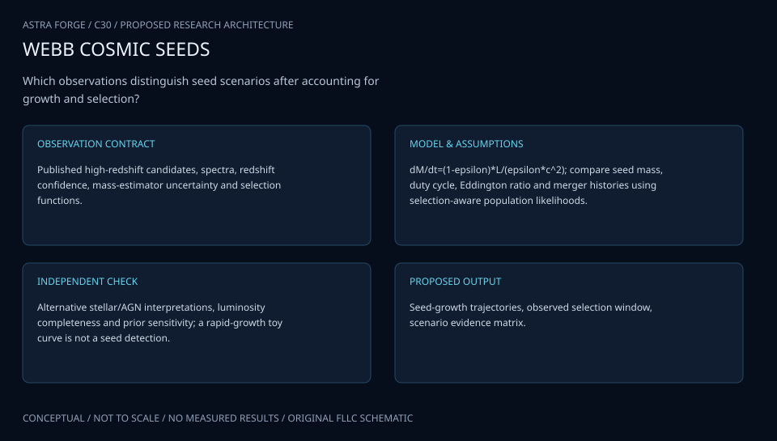

# C30 · ARTEMIS FIRST HORIZONS

**Original project:** The Origins of Supermassive Black Holes

**Session C:** Astronomy & Space Physics
**Status:** proposed research dossier; no project experiment or mission qualification has been performed.

Compare black-hole seed scenarios using a forward population model constrained by high-redshift luminosity, host properties, and lower-redshift occupation evidence. Keep light remnants, cluster pathways, and heavy direct-collapse seeds as alternatives rather than asserting a single origin for every supermassive black hole. Separate evidence for rapid early growth from evidence that uniquely identifies a seed mechanism.

## Scientific question

Which combination of seed mass distribution, accretion duty cycle, radiative efficiency, and merger history can explain observed early black holes without violating survey selection and host constraints?

## Testable hypothesis

Joint faint-population and host constraints will discriminate seed models more effectively than the brightest quasars alone, whose growth histories can erase information about initial masses.

*Conceptual research design; arrows show the analysis dependency, not observed causation.*

## Mathematical model

$$
L_{\rm Edd}=4\pi GMm_pc/\sigma_T;\quad L=\lambda L_{\rm Edd}
$$

$$
\dot M_{\rm BH}=(1-\epsilon)L/(\epsilon c^2)
$$

$$
M(t)=M_{\rm seed}\exp[\lambda f_{\rm duty}(1-\epsilon)t/(\epsilon t_E)],\quad t_E=\sigma_Tc/(4\pi Gm_p)
$$

### Variables and units

- Black-hole mass in solar masses; luminosity in erg s^-1
- lambda is Eddington ratio; epsilon radiative efficiency; duty fraction dimensionless
- Cosmic time in yr, derived from a stated cosmology; tE about 0.45 Gyr under the displayed convention
- Seed birth redshift and host-halo mass distributions explicitly model environmental dependence
- Constant-growth expression is an explanatory limit; variable accretion and mergers are integrated in the full model

### Assumptions and boundary conditions

- Black-hole masses inferred assuming Eddington accretion are conditional, not direct mass measurements.
- Include obscuration, lensing uncertainty, active fraction, flux limits, and ambiguous AGN classifications in the observation model.

### Inference or simulation method

Construct seed populations on a documented merger-tree or simplified host-assembly framework. Draw physically motivated light, cluster, and heavy-seed distributions and evolve stochastic accretion with efficiency and duty-cycle priors. Add merger mass loss and delays where justified. Forward predict luminosity functions, active black-hole/host ratios, and occupation fractions through survey selection. Compare to independently documented JWST/X-ray candidates with model-dependent mass and lensing uncertainties. Use posterior predictive checks and expected information gain to identify observations most sensitive to seeds rather than growth. Treat potential LISA merger forecasts as forecasts with mission-response assumptions, not measured events.

### Model limits

Uncertain accretion can make seed models observationally degenerate; rare bright objects do not define the full population. Spectral AGN identification, host masses, and magnification carry substantial systematics.

## Data and provenance contracts

### TRINITY population products

[Resource or product discovery](https://github.com/HaowenZhang/TRINITY)

**Fields:** Halo/galaxy/SMBH statistical constraints, redshift-dependent population products

**Access:** Public source; pin commit and avoid treating inferred relations as independent observations.

**Role:** Population comparator and growth constraints.

### UHZ1 heavy-seed candidate studies

[Resource or product discovery](https://arxiv.org/abs/2305.15458)

**Fields:** X-ray and host measurements, redshift, conditional mass and lensing assumptions

**Access:** Open paper; inspect original data and subsequent literature for selected sample.

**Role:** High-redshift multiwavelength test case, not universal seed proof.

## Staged execution

1. Define seed alternatives, growth freedoms, cosmology, and survey observation operators before fitting.
2. Assemble source-cited observations with uncertainty and classification probabilities.
3. Forward fit populations and compare predictive performance under equal growth flexibility.
4. Design follow-up targeting faint AGN, host ratios, or occupation measurements that maximally separate viable scenarios.

## Verification and validation

- Recover known seed-mixture parameters from blind synthetic selected populations.
- Hold out redshift bins and observatories; predict luminosity and host-ratio distributions.
- Test alternative accretion priors, AGN classifications, magnification, and selection assumptions; report remaining model degeneracy.

*Any numerical gate is a proposed requirement unless the dossier explicitly identifies a sourced requirement. Freeze gates before collecting confirmatory data.*

## Resources and deliverables

- Population/merger-tree tools, cosmology library, AGN spectroscopy and X-ray expertise, hierarchical sampler.

- Seed-growth population simulator, evidence/selection ledger, posterior scenario atlas, and discriminating observation roadmap.

## Risks and interpretation

- Conditional masses and flexible accretion histories can exaggerate seed evidence; unavailable faint-population denominators limit discrimination.

## Figure plan

Seed-to-SMBH growth tracks with efficiency/duty-cycle bands, selection-filtered luminosity functions, and observations that discriminate viable scenarios.

## Cited scientific resources

- [Inayoshi et al. (2019), first massive-black-hole assembly](https://arxiv.org/abs/1911.05791) — Seed and growth mechanisms and observational discriminants.
- [Volonteri et al. (2021), massive-black-hole origins](https://arxiv.org/abs/2110.10175) — Seed-to-growth framework and open questions.
- [Bogdan et al. (2023), UHZ1 X-ray candidate](https://arxiv.org/abs/2305.15458) — Specific high-redshift evidence with conditional interpretation.

Source discovery reviewed 2026-10-02. A public source pointer does not imply original student-team data access. See [model assurance](../../docs/MODEL_ASSURANCE.md) and [data management](../../docs/DATA_MANAGEMENT.md).
